# 创建指令和实现更改检测


在本章中，我们将学习和理解有关角度指令和变化检测的所有内容。

我们将学习 Angular 提供的不同类型的指令，并创建一些自定义的用户定义指令。我们将深入学习 Angular 如何处理更改检测，以及如何在应用程序中使用更改检测。

在本章结束时，您将能够完成以下操作：

*   理解角度指令
*   理解并实施内置组件指令
*   理解并执行内置的结构指令
*   理解并实现内置属性指令
*   创建自定义定义的属性指令
*   了解变化检测在角度传感器中的工作原理


# 角度指令


指令允许我们扩展元素的行为。我们可以使用不同类型的指令定义来操作 HTML 页面的**文档对象模型**（**DOM**）。

Angular 使用`@Directive`元数据告诉应用程序它们拥有的指令类型以及每个指令定义的功能。

下图显示了不同类型的指令：


主要有三种类型的角度指令：

*   **组件指令**：我们可以将其定义为用户定义的指令，类似于 Angular 1.x 中的自定义指令
*   **结构指令**：动态更改或转换 DOM 元素（一个或多个）的指令
*   **属性指令**：扩展元素行为或外观的指令

In Angular 1.x, we had the A (Attribute), E (Element), C (Class), M (Matches comment) directives.

Angular 附带了许多内置指令，我们将在前面提到的类别中对这些指令进行分类。

Angular uses directives that use `ng`, hence avoid using `ng` along with custom-defined directives; it may lead to unknown issues. For example, `ng-changeColor` is an instance of bad styling.


# 组件指令


组件指令是用户定义的指令，用于扩展功能和创建小型可重用功能。

将组件指令视为附加了模板的指令，因为组件指令有自己的视图或模板。

在前面的章节中，我们创建了许多组件。如果您已经掌握了创建组件并在我们的布局中使用它们的艺术，您将已经知道如何创建组件指令。

快速回顾 Angular 组件：组件是我们可以在整个应用程序中使用的小型可重用代码片段。

在下面的代码片段中，我们将看到该组件的基本语法。创建一个名为`my-template.component.ts`的文件：

```ts
import {Component} from "@angular/core";

@Component({
 selector: 'my-app',
 template: `<h2>{{ title }}</h2>`
})

export class MyTemplateComponent {
 title = 'Learning Angular!!!'
}

```

导入新创建的组件：

```ts
import {MyTemplate} from "./my-app.component" 

```

然后，调用我们的`index.html`文件*：*中的组件指令

```ts
 <my-app>Loading...</my-app>

```

下面是您将看到的最简单和最简单的组件示例；就这么简单：


因此，到目前为止，我们创建的所有组件都是组件指令。如果您想深入学习更多内容并创建组件，请参阅[第 4 章](04.html)，使用组件。


# 结构指令


顾名思义，结构指令通过动态添加、附加或删除 DOM 元素来改变 DOM 结构。

角度结构指令在指令名称前显示一个（`*`星号符号。

一些常用的结构指令如下所示：

*   `ngFor`：中继器指令，通常用于循环并显示元素列表。
*   `ngIf`：根据表达式求值结果显示或隐藏 DOM 元素；结果不是真就是假。
*   `ngSwitch`：返回匹配表达式值是否与开关表达式值匹配。返回的结果可以是任意值；对匹配值进行条件检查。

Only one Structural Directive is allowed per element.

让我们详细了解这些结构指令，并创建几个使用它们的示例：


# ngFor 指令


[T0]指令将帮助我们迭代这些项目，并动态地将它们附加到列表中。

我们需要在`StructureDirectiveComponent`类中声明一个数组，然后使用`ngFor`循环值并在模板中显示它们。

列表`<li>`元素会动态追加到`<ul>`元素。

以下是`ngFor`指令用法的组件片段：

```ts
import {Component} from '@angular/core';

@Component({
   selector: 'my-app',
   template: `

   <h4>{{title}}</h4>

   <strong>Using ngFor directive</strong>
   <ul>
<li *ngFor="let language of languages">{{ language.name }}</li>
</ul>
   `
 })
export class StructureDirectiveComponent {
  title = 'Structural Directives';

 public languages = [
  { name: "PHP"},
  { name: "JavaScript"},
  { name: "Ruby"},
  { name: "Java"},
  { name: "HTML5"}
];

}

```

前面组件的输出如下所示：

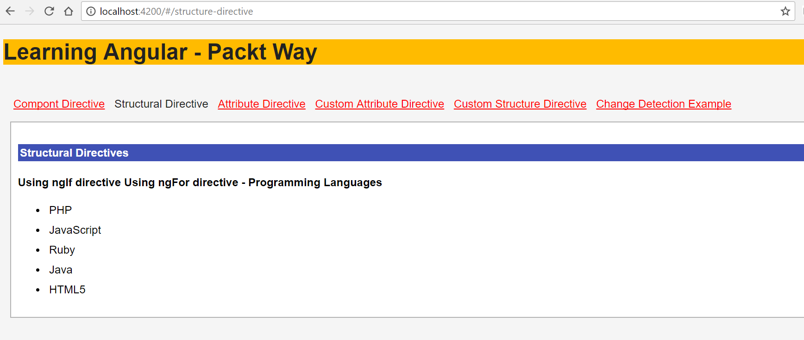


# ngIf 指令


[T0]指令帮助我们根据与任何编程语言中的[T1]语句非常相似的条件来计算表达式。

通用语法显示在以下代码段中：

```ts
 <div *ngIf="!isLoggedIn">
   <p>Hello Guest user</p>
 </div>

```

前面的代码段有一个`*ngIf`条件；如果`isLoggedIn`为`true`，则指令将在内部呈现语句；否则，它将跳过并继续。

让我们使用`*ngFor`和`*ngIf`语句创建一个示例，如下代码所示：

```ts
import {Component} from '@angular/core';

@Component({
  selector: 'my-app',
  template: `
    <h4>{{title}}</h4>
    <strong>Using ngIf directive</strong>
    <div *ngIf="isLoggedIn">
      <p>Hello Packt Author</p>
    </div>

   <div *ngIf="!isLoggedIn">
      <p>Hello Guest user</p>
   </div>

  <strong>Using ngFor directive - Programming Languages </strong>

  <ul>
    <li *ngFor="let language of languages">{{ language.name }}</li>
  </ul>
`
})

export class StructureDirectiveComponent {
 title = 'Structural Directives';
 isLoggedIn= true;

 public languages = [
  { name: "PHP"},
  { name: "JavaScript"},
  { name: "Ruby"},
  { name: "Java"},
  { name: "HTML5"}
];

}

```

让我们详细分析前面的代码段：

1.  我们在`view`模板中使用了`*ngFor`和`*ngIf`。
2.  在 component 类中，我们定义了一个带有布尔值的`isLoggedIn`变量。
3.  我们创建一个团队数组，列表中有团队名称，我们将迭代并显示在视图中。

运行应用程序，我们将看到输出，如以下屏幕截图所示：

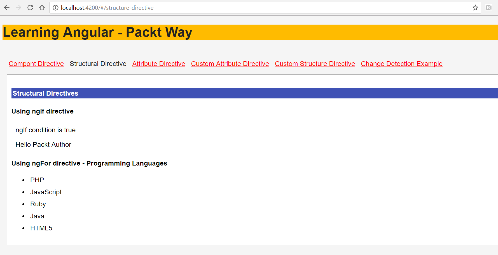


# ngSwitch 指令


当我们必须基于多个值计算表达式时，我们使用`ngSwitch`。`ngSwitch`的一个示例显示在以下代码段中：

```ts
<div [ngSwitch]="taxRate">
  <p *ngSwitchCase="'state'">State Tax</p>
  <p *ngSwitchCase="'fedral'">Fedral Tax</p>
  <p *ngSwitchCase="'medical'">Medical Tax</p>
  <p *ngSwitchDefault>Default</p>
</div>

```

根据`taxRate`的值，我们的应用程序将决定显示哪个元素。让我们更新我们的示例并添加一个`*ngSwitch`语句。

更新后的示例代码如下所示：

```ts
import {Component} from "@angular/core";
@Component({
    selector: 'structure-directive',
    templateUrl: 'structure-directive.component.html'
})

export class StructureDirectiveComponent {
 title = 'Structural Directives';

 username = "Sridhar Rao";
 taxRate = "state";
 isLoggedIn= true;

 public languages = [
  { name: "PHP"},
  { name: "JavaScript"},
  { name: "Ruby"},
  { name: "Java"},
  { name: "HTML5"}
 ];
}

```

上述代码示例的输出如下所示：

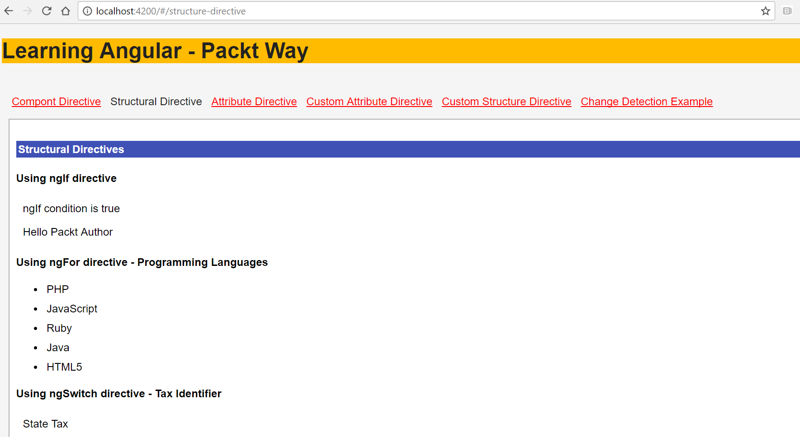


# 属性指令


属性指令扩展了给定元素的行为或外观。属性指令与随元素一起定义的 HTML 属性非常相似。

属性指令可以有两种类型：

*   内置属性指令
*   自定义或用户定义的属性指令

现在，让我们在以下各节中详细了解它们。


# 内置属性指令


如前所述，属性是页面中元素的属性。HTML 元素属性的一些示例包括类、样式等。

类似地，Angular 提供了几个内置属性指令。指令包括`ngModel`、`ngClass`、`ngStyle`等。

让我们通过创建几个示例来了解这些属性指令，如下所示，以供参考：

*   `ngModel`：使用`ngModel`可以实现双向数据绑定。有关数据绑定和模板语法的详细信息，请参见[第 8 章](08.html)、*模板和数据绑定语法*。

[T0]指令写在带有事件绑定[T1]括号的正方形中。

Remember to import the forms Module from Angular forms or else you will get error messages.

`ngModel`属性指令的示例如下：

```ts
<input [(ngModel)]="username">
<p>Hello {{username}}!</p>

```

*   `ngClass`：当我们想要向 DOM 元素添加或删除任何 CSS 类时，最好使用`ngClass`属性指令。我们可以用不同的方式为`ngClass`分配类名。

我们可以使用`string`或`object`或组件`method`分配类名

`ngClass`属性指令的示例如下：

```ts
//passing string to assign class name
<p [ngClass]="'warning'" >Sample warning message</p>

//passing array to assign class name
<p [ngClass]="['error', 'success']" > Message </p>

//Passing object to assign class name
<p [ngClass]="{'error': true, 'success': false }"> Message</p>

//Passing component method to assign class name
<p [ngClass]="getClassName('error')"> </p>

```

Remember to wrap the name of CSS class in a single quote; otherwise, you won't see the styling.
Remember to include the style sheet either in `index.html` or in your respective component.

*   `ngStyle`：当我们想要操作任何 DOM 元素的一些样式属性时，我们可以使用`ngStyle`。您可以将其与 CSS 世界中的内联样式联系起来。

`ngStyle`属性指令的示例如下：

```ts
<p [ngStyle]="{ 'font-size': '13px', 'background-color':'#c5e1a5'}" >Sample success message</p>

```

好的，现在我们了解了内置属性指令，让我们把它们放在一个例子中。

以下是使用`ngModel`、`ngClass`和`ngStyle`的代码示例：

```ts
import { Component} from '@angular/core';

@Component({
 selector: 'my-app',
 styleUrls: ['./attribute-directive.component.css'],
 template:`
 <h4>Welcome to Built-In {{title}}</h4>

 <strong>using ngModel</strong>
 <div><label for="username">Enter username</label>
 <input type="text" [(ngModel)]="username" placeholder="enter username" 
    id="username">
 <p>username is: {{username}}</p>
 </div>

<strong>Notification example using ngStyle</strong>
 <p [ngStyle]="{ 'font-size': '13px', 'background-color':'#c5e1a5'}" 
>Sample success message</p>

<strong>Notification example using ngClass</strong>
    <p [ngClass]="'warning'" >Sample warning message</p>
    <p [ngClass]="'error'" >Sample error message</p>
   `
})
export class AttributeDirectiveComponent {
 title = 'Attribute Directive';
 public username="Packt Author";
}

```

查看以下屏幕截图，其中包含前面代码示例的输出：


# 创建自定义指令-结构指令和属性指令


到目前为止，在前面的部分中，我们已经了解并实现了 Angular 提供的内置指令。

通过创建自定义的用户定义指令，Angular 允许我们定义和扩展页面中元素的行为和功能。

要创建自定义指令，我们必须使用`@Directive`装饰器并在类定义中实现逻辑。

我们可以创建自定义组件、结构和属性指令。

任何用户定义的 HTML 标记都是组件属性（例如，[T0]）。我们一直在创建自定义组件，贯穿本书的每一章。


# Angular CLI-生成指令


我们将使用 Angular CLI 工具为示例生成指令。

导航到项目目录并运行以下`ng`命令：

```ts
ng generate directive highlightDirective

```

我们应该看到如下屏幕截图所示的输出：

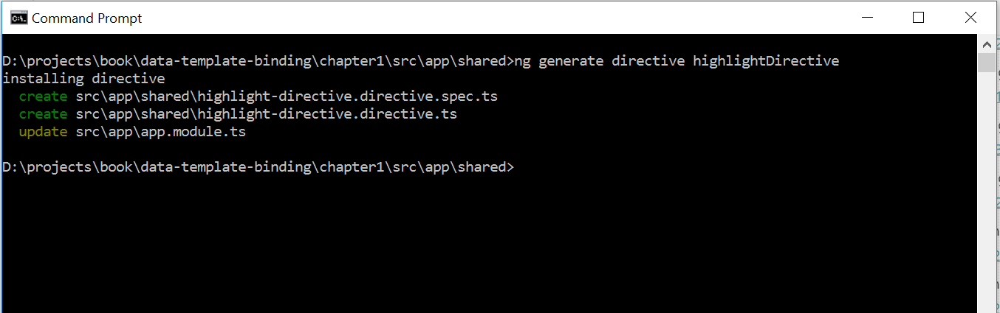

正如您在前面的屏幕截图中所看到的，新生成的指令`highlightDirective`被创建，并且`app.module.ts`文件被更新。

在我们继续执行我们的指令之前，这里简要回顾一下结构指令和属性指令：

*   **Structural Directive**：顾名思义，Structural 属性会影响 HTML 布局的结构，因为它会塑造或重塑 DOM 结构。它会影响页面中的一个或多个元素。
*   **属性指令**：定义并扩展页面中元素的外观或行为。

我们学习了使用 Angular CLI 生成自定义指令，现在我们清楚地知道了结构指令和属性指令是如何工作的。

是时候创建我们自己的自定义指令了。继续读下去。


# 创建自定义属性指令


我们将从创建自定义属性指令开始。我们将继续上一节中创建的示例`highlightDirective`。

顾名思义，我们将使用此指令突出显示附加到此属性的元素的已更改文本颜色。

是时候定义我们的指令`highlightDirective`的功能和行为了。

在`highlight-directive.ts`文件中，添加以下代码行：

```ts
import { Directive, ElementRef } from '@angular/core';

@Directive({
 selector: '[appHighlightDirective]'
})
export class HighlightDirectiveDirective{

 constructor(private elRef: ElementRef) { 
  this.elRef.nativeElement.style.color = 'orange';
 }
} 

```

让我们详细分析前面的代码段：

1.  我们需要导入 Angular 提供的用于处理指令的必需实用程序。
2.  我们将从`@angular/core`进口`Directive`、`ElementRef`和`AfterViewInit`。
3.  如前所述，我们使用`@Directive`装饰符定义一个指令，并在元数据选择器中传递名称`appHighlightDirective`。
4.  我们正在输出`appHighlightDirective`类。
5.  如前所述，Attribute 指令特定于一个元素，因此我们需要创建一个`ElementRef`变量`elRef`的实例，我们将使用该实例来定位和更新附加到自定义指令的元素。
6.  在`constructor`中，我们使用`nativeElement`方法瞄准特定元素，并使用`orange`值更新`style`属性`color`。

现在我们已经创建了我们的指令，我们需要将其应用于 app component template`app.component.html`文件中的元素：

```ts
<div appHighlightDirective> Custom Directive </div>

```

现在运行应用程序，我们将看到如下屏幕截图所示的输出：

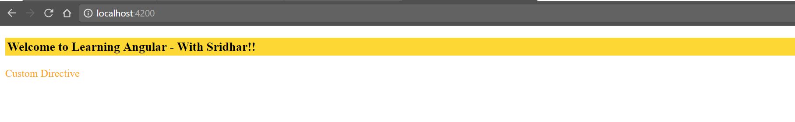

看看创建自定义属性指令是多么容易和简单。

如果您仔细注意，这是一个非常基本的属性，它会改变文本的颜色。现在，如果我们想动态地传递颜色值，而不是静态地传递颜色值，该怎么办？

我们还必须使属性能够传递值。让我们看看我们需要做哪些更改，使我们的指令成为更合适的候选者。

让我们首先在我们的组件`app.component.html`模板中编辑我们想要使用的属性：

```ts
<div appHighlightDirective highlightColor="green">Custom 
    Directive</div>

```

您将看到，我们现在正在通过属性`appHighlightDirective`的`highlightColor`变量传递一个值`green`。

现在更新我们的`highlight-directive.ts`文件并添加以下代码行：

```ts
import { Directive, ElementRef, Input, AfterViewInit } from '@angular/core';

@Directive({
 selector: '[appHighlightDirective]'
})
export class HighlightDirectiveDirective{

 @Input() highlightColor : string;

 constructor(private elRef: ElementRef) { 
   this.elRef.nativeElement.style.color = 'orange';
 }

 ngAfterViewInit(): void {
   this.elRef.nativeElement.style.color = this.highlightColor;
 }
}

```

让我们看看我们在`highlight-directive.ts`文件中所做的更改：

1.  我们从`@angular/core`库中另外导入了`Input`和`AfterViewInit`模块。
2.  我们使用`@Input`装饰器告诉 Angular，我们希望通过定义为`highlightColor`的变量动态传递值。
3.  在`ngAfterViewInit`方法中，我们使用`ElementRef`实例`elRef`创建元素的对象实例，并使用`nativeElement`方法更新元素的`style`属性`color`。
4.  文本的`color`更改为通过`highlightColor`传递的元素`appHighlightDirective`属性值。

运行应用程序，我们将看到如下屏幕截图所示的输出：

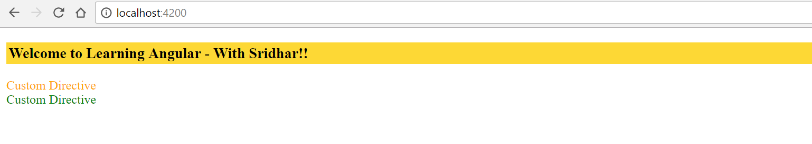

好的，到目前为止还不错。我们的性格发展得相当不错。

让我们看看您迄今为止在实施我们的定制指令方面取得的进展：

*   我们已经创建了一个自定义属性指令`highlightDirective`
*   我们学会了使用`highlightColor`变量将值传递给自定义属性指令

这是好东西。但是，如果我们想将`Javascript`事件（如`mouseover`、`mouseout`、`click`等）绑定到我们的属性，该怎么办？

让我们进行必要的更改，以实现附加到属性的事件。为此，我们将需要一个漂亮的图像，我们将附加一些事件以及自定义属性指令。

让我们向组件`app.component.html`文件模板添加一个图像：

```ts


```

有关上述代码段的重要说明：

1.  我们已经将自定义属性组件`appHighlightDirective`添加到元素中。
2.  此外，我们还添加了两个属性，`showOpacity`和`hideOpacity`，它们将具有元素不透明度的样式属性。
3.  我们将在这些属性上附加`onmouseover`和`onmouseout`事件，并动态更改图像的不透明度。

现在，我们已将一个图像添加到组件视图模板中，更新后的输出如以下屏幕截图所示：

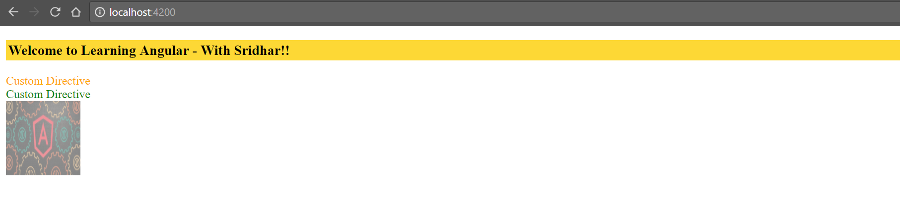

让我们转到自定义指令`highlight-directive.directive.ts`文件：

```ts
import { Directive, ElementRef, Input, HostListener, AfterViewInit } 
  from '@angular/core';

@Directive({
 selector: '[appHighlightDirective]'
})
export class HighlightDirectiveDirective{
 @Input() highlightColor : string;
 @Input() showOpacity : string;
 @Input() hideOpacity : string;

 constructor(private elRef: ElementRef) { 
   this.elRef.nativeElement.style.color = 'orange';
 }
 ngAfterViewInit(): void {
   this.elRef.nativeElement.style.color = this.highlightColor;
 }

@HostListener('mouseover') onmouseover() {
  this.elRef.nativeElement.style.opacity = this.hideOpacity;
 }

@HostListener('mouseout') onmouseout() {
  this.elRef.nativeElement.style.opacity = this.showOpacity;
 }
}

```

让我们分析一下在前面代码中对文件所做的更新：

1.  我们正在从`@angular/core`导入所需的模块`Directive`、`ElementRef`、`Input`、`HostListener`和`AfterViewInit`。
2.  注意，为了将事件绑定和实现到元素，我们特别需要导入`HostListener`。
3.  使用`@HostListener`装饰器，我们将`mouseover`和`mouseout`事件绑定到附加自定义属性的元素。
4.  请注意，当我们使用`this.elRef.nativeElement`时，我们指的是附加了自定义属性的元素。
5.  当用户将鼠标移到元素上时，我们正在分配`this.hideOpacity`变量的值。
6.  当用户从元素中取出鼠标时，我们正在分配`this.showOpacity`变量的值。

现在运行应用程序，您将看到如下屏幕截图所示的输出：


令人惊叹的现在，让我们看看您在实施我们的定制指令方面迄今取得的进展：

*   我们已经创建了一个自定义属性指令`highlightDirective`
*   我们学会了使用`highlightColor`变量将值传递给自定义属性指令
*   我们已经学会将`mouseover`和`mouseout`等事件附加到自定义属性`highlightDirective`中

在本节中，您学习了如何创建和使用自定义属性指令，该指令具有附加到该指令的属性和方法。

在下一节中，您将学习创建自定义结构指令。


# 创建自定义结构指令


到目前为止，您已经学习并实现了内置指令——组件指令、结构指令和属性指令。

在*Angular CLI-生成指令*一节中，我们还学习了使用 Angular CLI 生成自定义指令。

在上一节中，我们学习并实现了自定义属性指令。在本节中，我们将学习创建结构指令。

让我们使用 Angular CLI 创建一个新指令：

```ts
ng generate directive custom-structural

```

您应该看到前面命令的输出，如以下屏幕截图所示：


运行前面的`ng`命令，我们会看到创建的指令，`app.module.ts`会用新创建的指令更新。

好了，是时候创建和实现我们的定制结构指令了。下面是我们将使用自定义结构指令构建的用例：

1.  我们将使用结构化指令循环浏览产品列表。
2.  指令应仅显示将`isAvailable`设置为`true`的元素。

首先让我们在`app.component.ts`文件中定义我们的产品 JSON：

```ts
public products = [{
 productName: 'Shoes',
 isAvailable : true
 },
 {
 productName: 'Belts',
 isAvailable : true
 },
 {
 productName: 'Watches',
 isAvailable : false
 }]

```

我们刚刚创建了一个带有键`productName`和`isAvailable`的 JSON 产品列表。

没有什么超级英雄，还没有！

是时候使用`*ngFor`循环并在`app.component.html`文件中显示产品列表了：

```ts
<ul *ngFor="let product of products">
  <li *appCustomStructural="product">{{product.productName}}</li>
</ul>

```

让我们快速分析前面的代码

1.  我们使用一个内置的结构指令`*ngFor`，在产品列表中循环并使用键`product.productName`显示名称。
2.  我们正在定义自定义结构指令[T0]，并传递[T1]对象进行分析。
3.  由于我们正在将整个产品对象传递给我们的属性，我们现在可以在`appCustomStructural`中定义我们的自定义逻辑，并根据我们的应用程序需求进行转换。

是时候在我们的指令`custom-structural.directive.ts`文件中进行一些超级英雄式的工作了：

```ts
import { Directive, Input, TemplateRef, ViewContainerRef, AfterViewInit 
    } from '@angular/core';

@Directive({
 selector: '[appCustomStructural]'
})
export class CustomStructuralDirective {
 @Input()
 set appCustomStructural(product){
  if(product.isAvailable == true)
  {
    this.viewContainerRef.createEmbeddedView(this.templateRef );
  }
 }

 constructor(
   private templateRef : TemplateRef<any>,
   private viewContainerRef : ViewContainerRef
 ) { }
}

```

让我们详细分析前面的代码：

1.  我们正在从`@angular/core`导入所需的模块`Directive`、`Input`、`TemplateRef`、`ViewContainerRef`和`AfterViewInit`。
2.  我们正在为自定义结构指令`appCustomStructural`定义 CSS`selector`。
3.  通过使用`@Input`装饰器，我们明确地告诉 Angular，我们的定制指令将通过`appCustomStructural`获得输入。
4.  在构造函数中，我们正在注入`TemplateRef<any>`和`ViewContainerRef`的实例。
5.  使用`TemplateRef<any>`，我们提到它是一个嵌入式模板，可以用来实例化嵌入式视图。
6.  由于结构指令涉及页面中 DOM 结构的成形或重塑，我们正在注入`ViewContainerRef`。
7.  我们正在检查`product.isAvailable`的值是否等于`true`。
8.  如果使用`ViewContainerRef`实例`product.isAvailable`的值为真，则使用`createEmbeddedView`方法将元素附加到视图中。T1 是一个可以附加一个或多个视图的容器。

运行应用程序，我们将看到如下屏幕截图所示的输出：

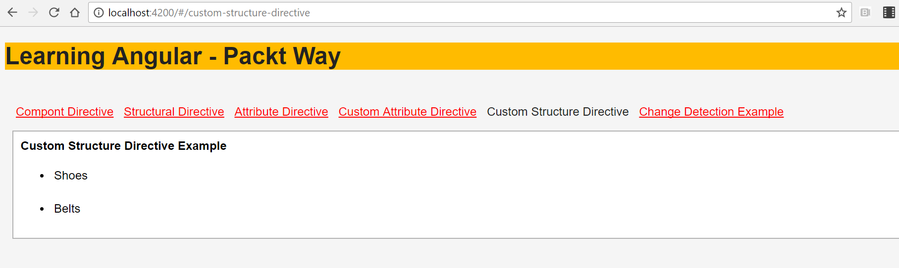

我们只看到鞋子和皮带被展示，因为只有那些产品的`isAvailable`键被设置为 true。尝试更改其他产品的值，并查看输出显示。

在本节中，我们了解了自定义结构指令。我们了解了 Angular 提供的重要实用程序--`createEmbeddedView`、`ViewContainerRef`和`TemplateRef`。

下面是我们迄今为止为自定义指令学习和实现的内容的快速总结。

我们已经创建了一个自定义属性指令[T0]。我们学习了使用`highlightColor`变量将值传递给自定义属性指令。我们已经学会将`mouseover`和`mouseout`等事件附加到自定义属性`highlightDirective`中。

我们已经学会了创建自定义结构指令`appCustomStructural`。我们已经学会了使用`createEmbeddedView`、`ViewContainerRef`和`TemplateRef`。

在下一节中，我们将学习变化检测，这是 Angular 框架如何在内部工作的一个重要方面，同时也将学习如何在我们的应用程序中使用它。


# 在角度传感器中实现变化检测


更改检测是检测模型或组件类中的任何内部状态更改，然后主要通过操作 DOM 将其反映回视图的过程。

变化检测是从角度 1.x 到角度 2 的最重要变化之一。

应用程序状态在不同的模型和视图之间发生变化，反之亦然。为了更好地理解，请查看下图：

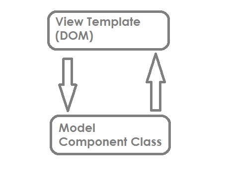

应用程序状态更改可以通过两种方式进行：

*   从模型到视图模板（DOM）
*   从视图（DOM）到模型（组件类）

既然我们知道状态变化发生在模型或 DOM 中，那么让我们分析是什么触发了变化检测。

更改检测由以下操作触发：

*   JavaScript 事件（`click`、`mouseover`、`keyup`等）
*   `setTimeout()`和`setInterval()`
*   异步请求

Note that all the preceding three listed ways are async processes. So it's safe to say that in Angular, change detection happens whenever we have async methods/requests in place.

在我们进一步了解变更检测之前——它是如何工作的，它是如何处理的，等等——让我们快速创建一个示例来了解是什么触发了变更检测。

请看以下代码段：

```ts
import { Component} from '@angular/core';
@Component({
  selector: 'my-app',
  template:`
  <h4>Learning Angular {{title}}</h4>

  <button (click)="toggleUser()"> Toggle User </button>
  <div *ngIf="isLoggedIn">
    <b>Hello Packt Author</b>
  </div>

  <div *ngIf="!isLoggedIn">
    <b>Hello Guest user</b>
  </div>
 `
 ]
})
export class AppComponent {
 title = 'Change Detection';
 isLoggedIn = true;
 toggleUser(){
 if (this.isLoggedIn)
   this.isLoggedIn = false
 else
   this.isLoggedIn = true
 }
}

```

前面的代码片段可以解释如下：

1.  我们创建了一个按钮，其中包含一个调用`toggleUser`方法的 click 事件。
2.  在`toggleUser`上的点击事件中，变量`isLoggedIn`值被设置为`true`或`false`。
3.  根据变量更新视图中的`isLoggedIn`值。如果值为`true`，则显示 Hello Packt Author，如果值为 false，则显示`Hello Guest user`。

在下一节中，我们将了解 Angular 如何在内部处理更改检测，以及 Angular 提供的实用程序，以帮助我们实现更好的更改检测。


# 变化检测-角度和区域


ZoneJS 的官方网站对图书馆的描述如下：

A Zone is an execution context that persists across async tasks.

Angular 使用 ZoneJS 检测更改，然后调用这些事件的侦听器方法。

Angular 利用区域处理所有内部状态更改和更改检测。区域了解异步操作和状态更改的上下文。

Angular 有一个内置的`ngZone`，它跟踪所有完成的异步操作，并用`onTurnDone`事件通知它们。每个组件都有一个变更检测器，它以树状结构跟踪连接到组件的所有绑定。

We don't have `$scope.apply` or `$digest` like in the previous version of Angular.

默认情况下，角度更改检测将始终检查值是否已更改。在树结构中，从顶部根组件到内部组件始终执行相同的更改检测。

这是通过更改检测器对象对所有组件执行的。

使用`ngZones`，角度应用程序的性能大幅提高。


# 变化检测策略


默认情况下，Angular 为应用程序中的每个组件定义了一个更改检测策略——这意味着每次模板中有任何更改时，它都会遍历到树结构中的最后一个组件，检查是否有任何更改，并进行必要的更新。

这需要一个性能打击！

因此，Angular 为我们提供了明确定义要为组件实现的更改检测策略的选项。

Angular 提供了一个`ChangeDetectionStrategy`模块，通过该模块，我们可以定义要使用的更改检测策略。

`ChangeDetectionStrategy`取两个不同的值：

*   `Default`
*   `OnPush`

让我们详细分析每个选项，以了解每个选项是如何工作的。


# ChangeDetectionStrategy-默认设置


这是 Angular 实现的默认机制——更改由事件触发，更改的传播从视图模板传递到模型。根据实现的逻辑，更新 DOM 结构。

这里需要注意的一点是，使用此策略，每次 Angular 都将遍历所有组件，从根组件开始遍历到最后一个组件，以检查是否必须始终更新属性。

参考我们在上一节中创建的示例，*在角度*中实现变化检测。我们正在更新属性，默认情况下，Angular 使用带有`Default`值的`ChangeDetectionStrategy`。


# ChangeDetectionStrategy-OnPush


我们使用`OnPush`来提高角度应用程序的性能。我们必须明确指出，我们希望使用`ChangeDetectionStrategy`的`OnPush`值。

更改由事件触发，并且更改的传播针对`view`模板中呈现的整个对象，而不是每个属性。

当我们使用`OnPush`值时，我们强制 Angular 仅依赖于输入。我们通过`@Input`装饰器传递对象，只有完整的对象及其属性会受到影响，而不会改变任何单个属性。


# ChangeDetectionStrategy 的优点-OnPush


在上一节中，您已经了解了使用`default`和`OnPush`选项的 ChangeDetectionStrategy。

与`default`相比，使用`OnPush`选项的一些优点如下：

1.  它有助于提高角度应用程序的性能。
2.  Angular 不必遍历整个组件树结构来检测属性的单个更改。
3.  当输入的属性不变时，Angular 可以跳过嵌套的树结构。

为了更好地理解它，让我们创建一个用例。首先，我们需要使用 Angular CLI`ng`命令创建一个名为`change-detect`的新组件。

创建组件后，您将看到如下屏幕截图所示的输出：

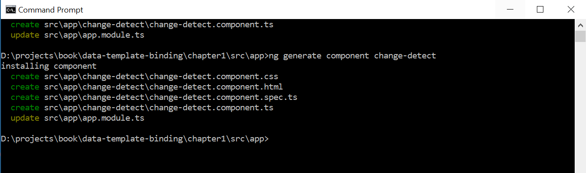

让我们创建一个`class`用户，在`user.ts`文件中使用`userName`和`userId`属性：

```ts
export class User {
 constructor(
 public userName: string,
 public userId: number) {}
}

```

现在，让我们编辑我们生成的`Component`类，并添加以下代码片段行：

```ts
import { Component, Input, ChangeDetectionStrategy  } from '@angular/core';
import { User } from '../shared/user';

@Component({
 selector: 'app-change-detect',
 template: `
 <h3>{{ title }}</h3>
 <p>
 <label>User:</label>
 <span>{{user.userName}} {{user.userId}}</span>
</p>`,
 changeDetection: ChangeDetectionStrategy.OnPush,
 styleUrls: ['./change-detect.component.css']
})

export class ChangeDetectComponent{
 title = "Change Detection";
 @Input() user: User;
 constructor() { }
} 

```

让我们详细分析前面的代码：

1.  我们正在从`@angular/core`库的`Input`、`Component`和`ChangeDetectionStrategy`中导入所需的模块。
2.  我们正在将新创建的`User`类导入组件类。
3.  我们明确地将`changeDetection`的值称为`ChangeDetectionStrategy.OnPush`。
4.  我们正在使用 CSS`selector`；`app-change-detect`在这里我们将显示组件的输出。

5.  因为我们告诉 Angular 使用`OnPush`选项，所以我们需要使用`@Input`并传递本例中的对象`User`。
6.  根据模板部分，我们正在`view`模板中绑定用户属性`userName`和`userId`。

伟大的到目前为止，我们已经创建了我们的组件，并且明确提到，无论何时检测到更改，作为`user`对象的整个对象都应该更新，而不仅仅是单个属性。

现在是时候创建方法来测试我们的逻辑了。因此，在`AppComponent`类中，添加以下代码：

```ts
 changeDetectionDefault(): void {
   this.user.userName = 'Packt Publications';
   this.user.userId = 10;
 }

 changeDetectionOnPush(): void {
   this.user = new User('Mike', 10);
 }

```

对于我们的组件，我们已经提到了用作`app-change-detect`的`selector`。我们需要使用模板`app.component.html`文件中的组件。

我们还提到组件将输入作为`user`；因此，我们将用户对象传递给组件。

使用组件`app-change-detect`将以下代码行添加到`app.component.html`模板文件中。

```ts
<button type="button" (click)="changeDetectionDefault()">
  Change Detection: Default
 </button>
 <button type="button" (click)="changeDetectionOnPush()">
 Change Detection: OnPush
 </button>

<app-change-detect [user]="user"></app-change-detect>

```

好了，我们都准备好了。运行该应用程序，您将看到如下屏幕截图所示的输出：

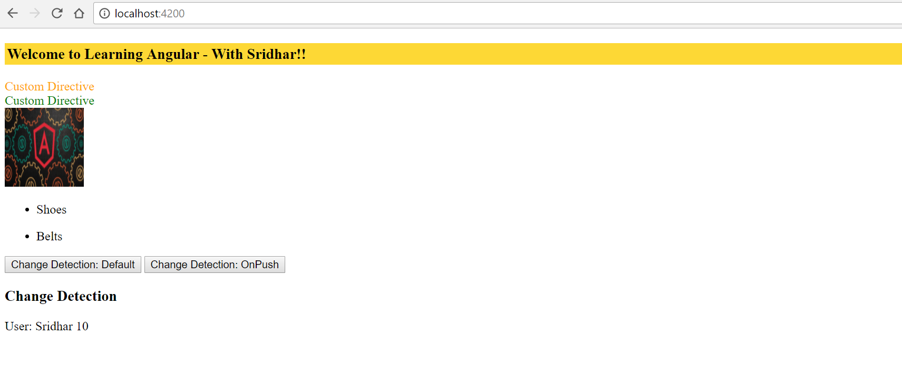

应用程序功能总结如下：

1.  `app-change-detect`组件加载到`AppComponent`模板中。
2.  为对象传递的默认值显示在`view`模板中。
3.  点击`Change Detection: OnPush`按钮，我们可以看到视图中加载了更新的用户。
4.  当我们点击`Change Detection: Default`时，与前面创建的示例不同，我们没有看到属性发生任何变化。这是因为我们明确提到，任何更改检测都应该通过对象传递，而不是使用`ChangeDetectionStrategy`的`OnPush`选项传递属性。

在本节中，我们学习了 Angular 提供的变化检测策略。我们已经探索了如何通过使用`OnPush`选项来提高应用程序的性能，强制 Angular 只检查作为输入而不是单个属性传递的对象。

更新属性将告诉 Angular 遍历整个应用程序组件树结构，这会影响性能。


# 总结


在本章中，我们学习了指令以及不同类型的指令，即组件指令、结构指令和属性指令。

我们实现了自定义的用户定义指令，以了解如何扩展指令并更有效地使用它们。

我们简要了解了 ZoneJS，以及 Zone 如何帮助我们处理现代应用程序框架中的`async`任务。

最后，我们学习了 Angular 如何处理更改检测，以及如何使用更改检测方法来提高应用程序的整体性能。

在下一章中，我们将学习使用可观察对象的异步编程。在本章中，我们将学习如何利用异步编程的优势，通过使用可观察和承诺。

此外，我们还将学习如何构建一个基本但可扩展的异步 JSON API，用于查询 Marvel Cinematic Universe。