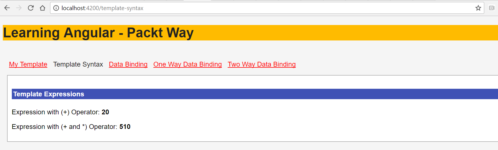
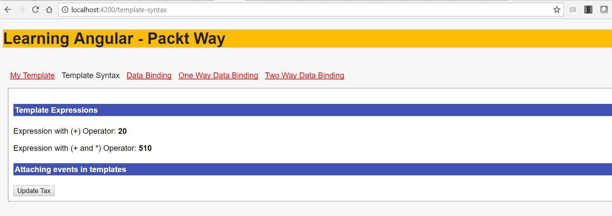
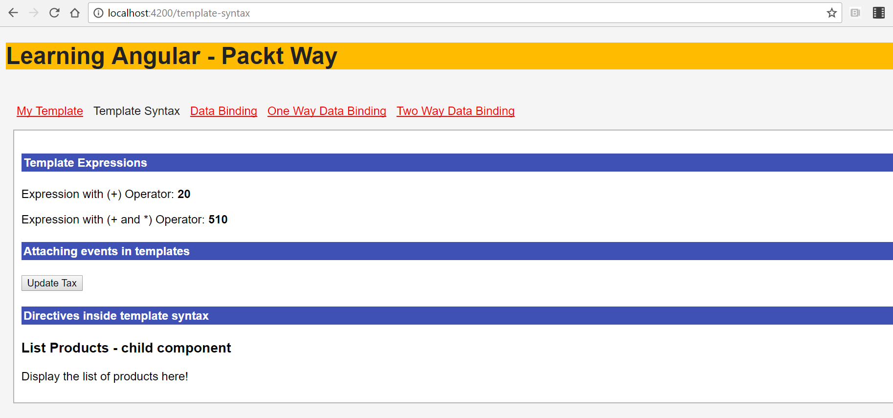
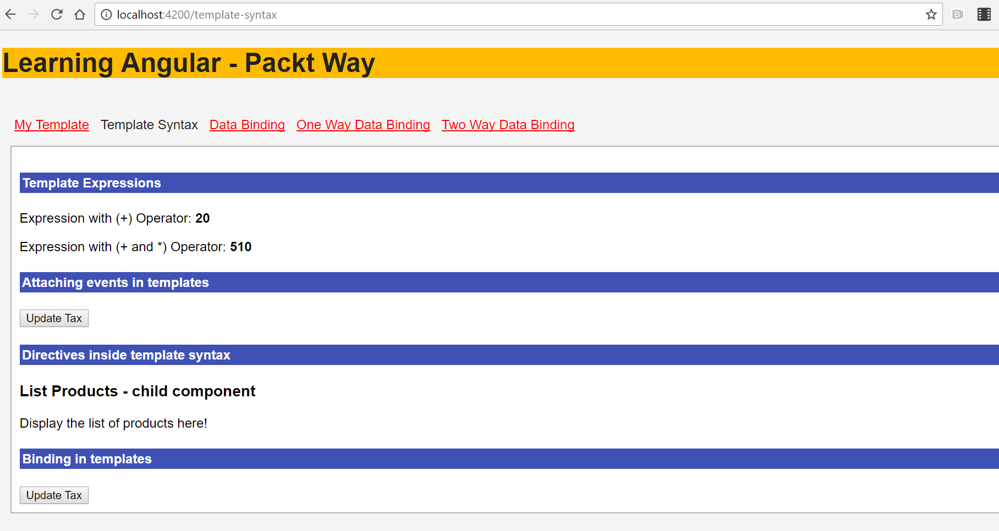
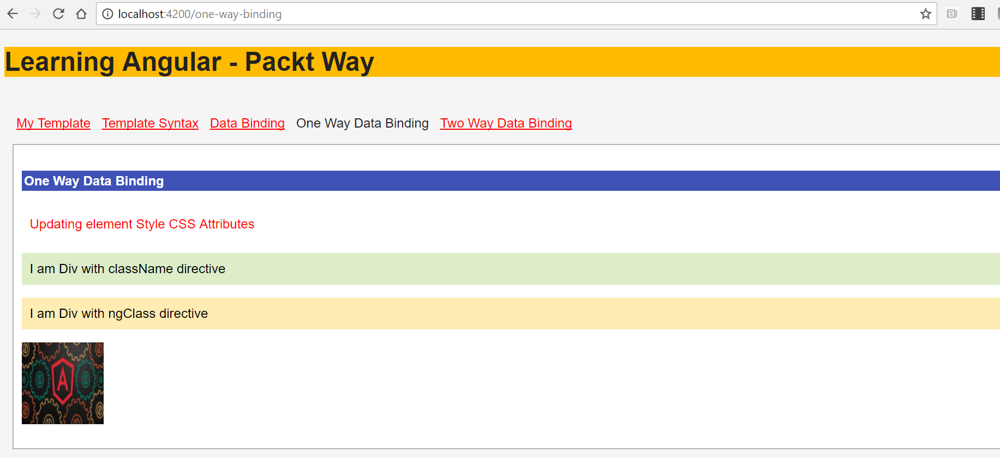

# 模板和数据绑定语法


在本章中，您将了解 Angular 框架提供的模板语法和数据绑定。模板语法和数据绑定主要关注应用程序的 UI 或视图方面；因此，它是一个非常重要和关键的功能。

在本章中，您将了解模板语法以及在组件中包含模板的不同方式。您还将学习创建组件，包括子组件，以及在视图样板中使用表达式和运算符。您还将关注如何在模板中附加事件、属性和实现指令。

数据绑定是 Angular 的关键特性之一，它允许我们将数据从源映射到视图目标，反之亦然。您将了解数据绑定的不同方式。

在本章中，您将学习在模板中包含视图模板和定义数据绑定，并借助于我们在学习时创建的示例。

在本章中，您将学习并实施以下内容：

*   模板语法
*   包含模板语法的各种方法
*   角网格中的模板表达式
*   数据绑定语法
*   角度双向数据绑定
*   模板中的属性绑定
*   将事件附加到模板中的视图
*   模板中的表达式和语句
*   模板内的指令


# 学习模板语法


components 视图是使用模板定义的，该模板告诉 Angular 如何渲染外观。在模板内部，我们定义数据应该如何显示，并使用数据绑定附加事件。

大多数 HTML 标记都可以在 Angular 模板中使用。我们可以使用和定义用户定义的自定义指令。

为组件定义模板的一般语法如下所示：

```ts
import {Component, View} from "@angular/core";

@Component({
 selector: 'my-app',
 template: `<h2>{{ title }}</h2>`
})

export class MyTemplateComponent {
 title = 'Learning Angular!!!'
}

```

让我们详细分析前面的代码段：

1.  我们定义了一个组件`MyTemplateComponent`。
2.  我们用`template`定义了组件视图。
3.  在模板内部，我们定义了一个`<h2>`标记。
4.  我们定义了一个`title`变量并分配了一个值。
5.  使用`{{ }}`插值，我们将变量绑定到模板。

运行应用程序，您将看到以下输出：


在下一节中，您将详细了解包含模板的各种方法以及插值。


# 包含模板语法的各种方法


在本节中，您将了解在组件视图中包含模板的不同方式。有两种方法可以在组件语法中包含模板语法：

*   我们可以在`component`装饰器中定义视图模板。使用`template`，我们可以在组件装饰器中内联包含模板。
*   我们还可以使用`templateURL`包含模板。使用`templateUrl`，我们将模板元素写入一个单独的文件中，并提供模板到组件的路径。

`templateURL` is a much preferred way since it allows us to separate the code in a logical way to organize it more effectively.


# 使用内联模板语法


我们讨论了在组件中以不同的方式包含模板。让我们学习如何在组件内部定义模板。

在组件装饰器中使用模板的语法如下：

```ts
import {Component, View} from "@angular/core";

@Component({
 selector: 'my-app',
 template: `<h2> {{ title }} </h2>`
})

export class MyTemplate {
 title = 'Learning Angular!!!'
}

```

在前面的代码片段中需要注意的最重要的事情如下：

1.  我们正在`@component`装饰器中定义模板。
2.  组件`class`定义和模板定义在同一个文件中。


# 使用 templateURL 包含模板


在前面的代码片段中，我们在同一个文件中创建了模板和组件类。但是，当模板元素和类定义中组件类的复杂性增加时，将很难对其进行维护。

我们需要将逻辑类和视图分开，以便易于维护和理解。现在，让我们看一看用 GooT0}定义组件视图模板的另一种方法。

使用`templateURL`查看的语法如下：；让我们创建一个名为`app-template.component.ts`的文件：

```ts
import { Component } from '@angular/core';
import { FormsModule } from '@angular/forms';

@Component({
 selector: 'app-data-binding',
 templateUrl: './data-binding.component.html',
 styleUrls: ['./data-binding.component.css']
})
export class DataBindingComponent {
}

```

如果我们使用上述任何一种方法来使用模板，将不会有视觉上的差异。为 HTML、CSS 和组件类创建单独的文件是有意义的，因为它允许我们更好地组织代码，并最终在代码库增加时帮助维护代码库。

在下一节中，您将学习 Angular 框架为数据和模板绑定提供的特性。


# 模板中的插值


双花括号`{{ }}`是角度上的插值。它们是将大括号之间的文本映射到组件属性的一种方法。在本章中，我们已经在各种示例中使用并实现了插值。

在我们将要编写的模板中，该值被写入双大括号中，如下所示：

```ts
{{ test_value }}

```

让我们快速创建一个简单的示例来理解插值。在`app.component.ts`文件中，我们定义一个名为`title`的变量：

```ts
import { Component } from '@angular/core';

@Component({
 templateUrl: './app.component.html',
 styleUrls: ['./app.component.css']
})

export class AppComponent {
  constructor() { }
  title = "Data Binding";
}

```

现在，我们需要在模板中显示`title`的值。更新`app.component.html`文件，并添加以下代码行：

```ts
<p> {{ title }} </p>

```

现在，尝试更改类中[T0]的值；我们将看到更新后的值自动反映在模板中。这就是插值，这是我们喜欢的一个关键特性。

既然我们知道了如何使用插值，我们将在下一节中讨论如何在模板内添加表达式。


# 角网格中的模板表达式


我们可以在模板内使用表达式；表达式执行并生成一个值。

就像在 JavaScript 中一样，除了使用赋值、new 和 chaining 操作符之外，我们可以使用表达式语句。

让我们看一下模板表达式的一些示例：

```ts
<p> {{ tax+10 }} </p> // Using plus operator

<p> {{( tax*50)-10 }} </p>

```

在前面的代码片段中，我们正在对变量`tax`进行算术运算。

如果您使用过任何编程语言，您很可能会发现这一部分非常简单。就像在其他语言中一样，我们可以使用算术运算符。

让我们快速创建一个示例。更新**`app.component.html`**文件，并添加以下代码：

```ts
<h4>Template Expressions</h4>

<p> Expression with (+) Operator: <strong>{{ tax+ 10 }}</strong></p>

<p> Expression with (+ and *) Operator: <strong>{{ (tax*50) +10 }} 
   </strong></p>

```

在前面的代码片段中，我们使用了模板中的表达式。我们对[T0]变量进行了加法运算。

在更新`app.component.ts`文件中，添加以下代码段：

```ts
import { Component } from '@angular/core';

@Component({
 templateUrl: './app.component.html',
 styleUrls: ['./app.component.css']
})

export class AppComponent {
 constructor() { }

 title = "Data Binding";
 tax = 10;
}

```

我们正在创建一个`AppComponent`类并声明两个变量`title`和`tax`。我们正在为`title`和`tax`分配初始值。

运行应用程序，我们将看到前面代码片段的输出，如以下屏幕截图所示：



到目前为止，您已经了解了如何在视图中使用模板、插值以及在模板中使用表达式。现在，让我们了解如何在模板中附加事件和实现指令。


# 将事件附加到模板中的视图


在前面的部分中，我们介绍了如何在组件中定义和包含模板，以及模板中的插值和表达式。

在本节中，您将学习如何将事件附加到模板中的元素。

事件是基于用户操作触发的常规 JavaScript 方法，例如`onclick`和`onmouseover`。方法是为执行特定任务而定义的一组语句。

附加事件的一般语法如下所示：

```ts
<button (click)= function_name()> Update Tax</button>

```

让我们详细分析前面的代码：

1.  我们正在模板中创建一个`button`。
2.  我们正在将`click`事件附加到按钮上。
3.  通过`click`事件，我们将绑定`function_name()`方法。

现在，让我们用前面的代码更新我们的`component`文件，并查看它的运行情况。

我们将首先更新我们的`app.component.html`文件，并添加以下代码段：

```ts
<p> {{ title }} </p>
<p> {{ tax+ 10 }}</p>
<p> {{ (tax*50) +10 }} </p>
<button (click)= updateTax()> Update Tax </button>

```

关于前面代码段的一些简要说明：

1.  我们在模板中添加了`button`。
2.  我们在`click`事件的按钮上附加了一个名为`updateTax`的事件。

现在，是时候用以下代码更新我们的`app.component.ts`文件了：

```ts
import { Component } from '@angular/core';

@Component({
 templateUrl: './data-binding.component.html',
 styleUrls: ['./data-binding.component.css']
})

export class DataBindingComponent {
 constructor() { }

 title = "Data Binding and Template Syntax";
 tax = 10;

 updateTax() {
  this.tax = 20;
 }
}

```

让我们分析前面的代码片段：

1.  我们正在定义和创建一个组件--`AppComponent`。
2.  我们已经定义了两个变量，`title`和`tax`，并给它们赋值。
3.  我们正在定义并创建一个`updateTax`方法，调用该方法时将更新`tax`变量。
4.  更新后的`tax`值将显示在模板中。

现在，运行应用程序，我们将看到如下屏幕截图所示的输出；单击 Update Tax（更新税务）按钮，您应该会看到在模板中更新的数据：



伟大的因此，在本节中，您学习了在模板中附加事件，以及在组件类中定义方法来更新组件的属性。在下一节中，您将学习在模板内实现指令。


# 在模板内实现指令


我们在学习模板语法方面取得了很好的进展。我们讨论了如何包含模板语法、在模板中使用插值以及附加事件。

与事件一样，我们也可以在模板内实现指令和属性。在本节中，我们将解释如何在模板内实现指令。

请看以下代码段：

```ts
<list-products></list-products>

```

前面的代码与早期版本的 Angular 中定义自定义指令的方式类似吗？没错。自定义指令现在在 Angular 框架中称为组件。

我们可以根据应用程序的要求创建和定义自定义指令或标记。

There is no relationship between the directory structure and child component, but as a good practice always keep logical parent-child relationship components under one directory; this helps in better organizing the code.

我们将使用在上一节中创建的组件。我们创建了一个组件--`data-binding.component.ts`。现在我们将创建一个新组件`list-products`，我们将能够将其绑定到`data-binding`组件。

将以下代码段添加到`list-products.component.ts`文件中：

```ts
import { Component } from '@angular/core';

@Component({
 selector: 'list-products',
 templateUrl: './list-products.component.html',
 styleUrls: ['./list-products.component.css']
})

export class ListProductsComponent {
 constructor() { }
}

```

让我们分析前面的代码：

1.  我们创建了一个新组件，即`list-products`组件。
2.  在组件定义中，我们将`selector`称为`list-products`。
3.  [T0]装饰器为组件提供角度元数据。使用 CSS`selector`，我们可以在`list-products`标记内显示模板或视图的输出。
4.  我们可以为`selector`提供和使用任何名称，但请确保在父组件中使用相同的名称，并调用它。

现在我们已经通知 Angular 需要将`list-products`组件的输出放在自定义标记`list-products`中，我们需要将子组件标记放在父组件模板中。

我们需要使用选择器标签来识别模板`data-binding.component.html`文件中的`list-products`组件：

```ts
<list-products></list-products>

```

我们都准备好了。现在，运行应用程序，我们应该看到前面代码的输出和子组件与`data-binding.component.html`模板视图一起显示：



令人惊叹的现在，您学习了如何在模板中包含子组件。如果不使用这些工具，任何角度的应用程序都很难完成。在下一节中，我们将继续学习并构建更多示例，您将学习如何在模板内使用属性绑定。


# 模板中的绑定


在本节中，我们将扩展上一节中创建的示例。我们将介绍如何在模板中使用属性绑定。属性是模板中元素的属性，例如，类、ID 等。

HTML 属性的一般语法如下所示：

```ts
<button class="myBtn" [disabled]="state=='texas'"  .
  (click)="updateTax()"></button>

```

前面的代码片段中需要注意的要点如下：

1.  我们正在使用`button`标记定义一个`html`元素。
2.  我们正在将`class`属性添加到`button`标记中。
3.  我们正在将一个调用方法的 on`click`事件`updateTax`附加到按钮上。
4.  我们有一个`disabled`属性；按钮元素将显示在页面中，如果`state`的值为`texas`，则按钮元素为`disabled`。如果没有，它将显示一个已启用的按钮。

通过属性绑定，可以动态改变`disabled`的属性值；当组件类中的值更新或更改时，视图将更新。

让我们更新`app.component.html`文件，并将其更新为将属性添加到模板中的元素：

```ts
<button (click)= updateTax() [disabled]="state=='texas'"> Update Tax 
  </button>

```

仔细看看，您会发现我们添加了`disabled`属性；根据`state`的值，按钮将被启用或禁用。

现在，在`app.component.ts`文件中，我们定义一个名为`state`的属性变量，并为其赋值：

```ts
import { Component } from '@angular/core';

@Component({
 templateUrl: './data-binding.component.html',
 styleUrls: ['./data-binding.component.css']
})
export class DataBindingComponent {

 constructor() { }

 title = "Data Binding and Template Syntax";

 tax = 10;
 state = 'texas';

 updateTax() {
  this.tax = 20;
 }
}

```

在前面的代码中，我们刚刚定义了一个名为`state`的新变量并为其赋值。根据`state`的值——分配或更新——按钮将被启用或禁用。

运行应用程序，我们将看到以下屏幕截图中显示的输出：



太神了您学习了有关在角度组件中使用的模板的所有信息。

我们讨论了如何编写模板语法、包含模板语法的不同方法、如何附加事件、将属性附加到元素，以及如何在模板中实现指令。

在下一节中，您将了解数据绑定——Angular 最关键、最引人注目的特性之一，也是最常用于模板语法的特性之一。


# 角度数据绑定


Angular 提供了一种在同一视图和模型之间轻松共享数据的机制。我们可以在类组件中关联和分配一个值，并在视图中使用它。它提供了多种数据绑定。我们将从了解各种可用的数据绑定开始，然后继续创建一些示例。

数据绑定可分为三大类：

1.  单向数据绑定，即从数据源到视图。
2.  单向数据绑定，即从视图到数据源。
3.  双向数据绑定，即从视图目标到数据源和从数据源到视图。


# 单向数据绑定-要查看的数据源


在本节中，您将了解从数据源到视图目标的单向数据绑定。在下一节中，您将了解从模板到数据源的单向数据绑定。

Angular 中的单向数据绑定是指从数据源到视图的数据流。换句话说，我们可以说，无论何时更新值和数据，它们都会反映在视图目标中。

从数据源到视图目标的单向数据绑定适用于以下 HTML 元素属性：

*   `interpolation`
*   `property`
*   `attribute`
*   `class`
*   `style`

现在我们已经知道了从数据源到目标的单向数据绑定所适用的属性和元素，让我们学习如何在代码中使用它们。

让我们看一下一般语法，从数据源到视图模板编写单向数据绑定。

```ts
{{ value_to_display }} // Using Interpolation

[attribute] = "expression" // Attribute binding

```

让我们详细分析前面定义的语法：

*   `interpolation`是一个写在双大括号内的值，如前面的代码所示。
*   大括号`{{ }}`之间的文本通常是组件属性的名称。Angular 将该名称替换为相应零部件特性的字符串值。
*   我们可以为`attributes`和`properties`定义单向数据绑定，并在方括号`[]`内写入。
*   `value_to_display`和`expression`属性在 component 类中定义。

一些开发人员还喜欢通过在属性中添加前缀来使用规范形式。

```ts
<a bind-href = "value"> Link 1</a>

```

将前缀绑定与属性或属性以及元素的定义一起使用。

现在，我们已经了解了编写单向数据绑定的语法，现在是时候为此编写示例了：

```ts
<h4>{{ title }}</h4>

<div [style.color]="colorVal">Updating element Style CSS 
    Attributes</div>
<p>
  <div [className]="'special'" >I am Div with className directive</div>
<p>
  <div [ngClass]="{'specialClass': true, 'specialClass2': true}" >I am 
        Div with ngClass directive</div>
<p>


```

让我们快速分析前面代码片段中的一些关键点：

1.  我们使用插值——双大括号`{{ }}`中的值——来显示从数据源到模板的值。属性`title`将在组件模型中设置。
2.  我们通过将值动态绑定到组件类`colorVal`中定义的变量来定义`style`属性`color`。
3.  我们正在定义`ngClass`属性，并且根据条件，无论`specialClass`或`specialClass2`属性设置为 true，都将分配相应的类。
4.  我们通过绑定组件类中的属性`imageUrl`动态提供图像的`src`属性值。

让我们在组件类`one-way.component.ts`文件中快速定义变量：

```ts
import { Component } from '@angular/core';

@Component({
  selector: 'app-one-way',
  templateUrl: './one-way.component.html',
  styleUrls: ['./one-way.component.css']
})
export class OneWayComponent {
 constructor() { }

 title = 'One way data bindings';

  state = 'california';
  colorVal = 'red';
  specialClass : true;
  imageUrl = '././././iimg/angular.jpeg';
  tax = 20;
}

```

在前面的代码片段中，我们已经定义了[T0]、[T1]和[T2]变量。

现在，让我们运行前面的代码，您将看到以下屏幕截图中显示的输出：



如果您仔细注意，在前面的所有代码片段中，我们仅单向绑定数据，即仅从数据源绑定到视图目标。

因此，本质上，它是终端用户的只读数据。在下一节中，我们将学习从视图模板到数据源的单向数据绑定。

Consider the following hands-on exercise: Try creating more variables and mapping them into the views.


# 单向数据绑定-视图模板到数据源


在上一节中，我们了解了从数据源到视图模板的单向数据绑定。

在本节中，我们将学习从视图模板到数据源的单向数据绑定。

从视图模板到数据源的单向数据绑定主要针对事件实现。

创建绑定的一般语法如下所示：

```ts
(target)="statement"

```

从视图到数据源的绑定主要用于调用方法或捕获事件交互。

下面给出了从视图模板到数据源的单向绑定示例

```ts
<button (click)="updateTax()"></button>

```

我们正在附加`click`事件，当点击按钮时，将调用`updateTax`方法。

我们学习了从数据源到模板以及从视图模板到数据源的单向数据绑定。

在下一节中，您将了解双向数据绑定，显示数据属性以及在更改元素属性时更新这些属性。


# 角度双向数据绑定


双向数据绑定必须是 Angular 中最重要的特性之一。双向数据绑定有助于使用[T0]指令将输入和输出绑定表示为单个符号。

双向数据绑定是一种直接将数据从模型映射到视图的机制，反之亦然。该机制允许我们在视图和模型之间保持数据同步，即使用`[]`从数据源到视图，使用`()`从视图到数据源。

在 Angular 中，我们使用`ngModel`实现双向数据绑定。

双向数据绑定的一般语法如下所示：

```ts
<input [(ngModel)]="sample_value" />

```

在前面的语法中，请注意以下内容：

*   我们正在使用写在`[()]`中的`ngModel`绑定元素
*   我们已经为`input`元素关联了双向数据绑定

Don't forget to import `FormsModule` from `@angular/forms` or else you will get errors. `ngModel` creates a `FormControl` instance from a domain model and binds it to a form control element.

现在，让我们使用`ngModel`创建一个示例：

```ts
<div> {{sample_value}}</div>

<input [(ngModel)]="sample_value" />

```

我们添加了一个`div`元素，并使用数据绑定，使用`ngModel`映射输入元素的值。使用`ngModel`有助于跟踪控件的值、用户交互和验证状态，并保持视图与模型同步。

现在，当我们开始键入 type text 的`input`元素时，我们看到我们键入的内容作为`value`复制到我们的`div`元素：


伟大的我们在数据绑定和模板方面取得了相当大的进展。利用我们在本章中获得的所有知识，我们可以创建漂亮优雅、功能强大的应用程序界面。


# 总结


模板语法和数据绑定是 Angular 应用程序的骨架和灵魂。我们介绍了模板：如何以不同的方式包含它们，以及如何在视图模板中使用表达式。然后，我们通过将事件和属性附加到模板来浏览模板。

我们探讨了 Angular 应用程序中数据绑定的各个方面，重点讨论了如何为模板内的值实现数据绑定。

在数据绑定方面，我们深入研究了它的广泛类别。我们探讨了可用的数据绑定方式：单向数据绑定和双向数据绑定。

同时使用数据绑定和模板，我们几乎可以为角度应用程序创建模拟功能屏幕：这就是数据绑定和模板语法的威力。

所以，继续吧，让你的创造力飞翔吧！祝你好运

在下一章中，您将学习 Angular 中的高级表单，学习如何使用和掌握被动表单。我们通过强调 html 模型和[T0]之间的关系来处理被动表单的被动部分，因此给定表单上的每个更改都会传播到模型