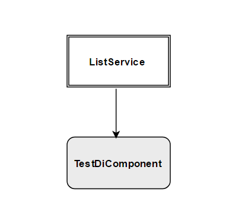
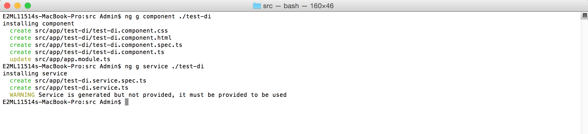
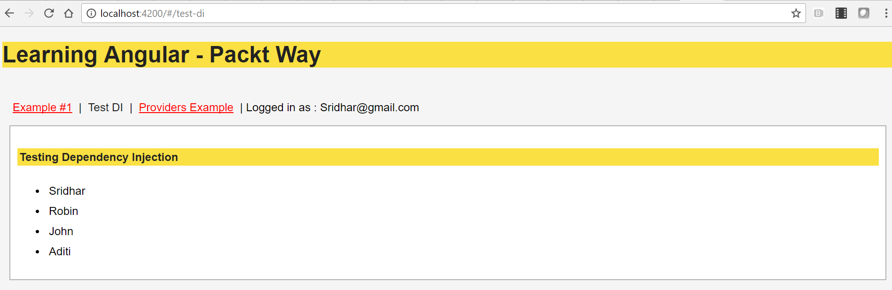
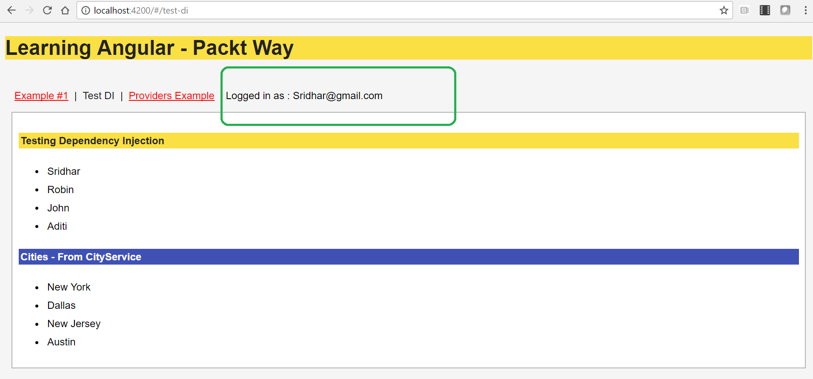

# 十三、应用依赖注入


在本章中，您将学习 Angular 依赖注入。依赖注入是 Angular 中最显著的特征之一；它允许我们创建可注入项，这些可注入项可以用作各种组件之间的共享资源。

在本章中，我们将讨论以下内容：

*   探索依赖注入
*   详细了解提供者类
*   理解层次依赖注入
*   创建可注入的
*   学习将提供者注入服务
*   学习在组件内部注入提供者
*   学习解决提供者类的依赖关系
*   使用[T0]、[T1]和[T2]装饰器创建示例


# 没有依赖注入的应用


如果没有依赖注入框架，开发人员的生活将非常艰难。请看一下不使用依赖项注入的以下缺点：

*   每次需要传递构造函数参数时，我们都需要在所有实例中编辑类的构造函数定义

*   我们需要创建构造函数并分别注入每个必需的依赖类

让我们来看一个没有依赖注入的应用来理解挑战和不足：

```ts
class products {
 available;
 category;

 constructor() {
  this.available = new warehouse();
  this.category = new category();
 }
}

```

让我们分析前面的代码片段以更好地理解：

1.  我们创建了一个名为`products`的`class`。
2.  在`constructor`方法中，我们实例化了依赖类`warehouse`和`category`。
3.  请注意，如果`warehouse`或`category`类构造函数定义发生更改，我们将需要手动更新这些类的所有实例。

前面的代码不是完全可测试和可维护的，因为作为开发人员，我们的任务是手动定义所有依赖项。这就是 Angular 依赖注入来拯救我们的地方。


# 依赖注入-介绍


**依赖项注入**（**DI**是一种编码模式，在这种模式中，类接收依赖项，而不是自己创建依赖项。一些开发人员和技术专家也将此称为设计模式。

它被广泛使用，通常被称为 DI。在我们的所有章节中，我们都将依赖注入系统称为 DI。

以下是我们绝对需要 DI 的原因：

*   DI 是一种软件设计模式，其中类接收其依赖项，而不是创建对象本身
*   DI 创建并交付及时动态需要的对象
*   我们可以考虑注册表作为我们的应用的可重用存储库。
*   DI 允许为远程开发团队独立开发依赖模块。

No Angular apps can be completely written without using DI. Now, let's revisit the preceding code we wrote without DI and write it with Angular DI:

```ts
class products {

constructor(private _warehouse: warehouse, private _category: category) {

  // use _warehouse and _category now as reference
 }
} 

```

Here's what is happening in the preceding code:

1.  我们已经创建了一个`products`类。
2.  在`constructor`中，我们将依赖类`warehouse`和`category`作为参数传递。
3.  现在我们可以在整个类中使用实例`_warehouse`和`_category`。
4.  注意，我们没有创建依赖类的对象；相反，我们只是通过 DI 系统接收它们。
5.  我们不必担心`warehouse`或`category`所要求的依赖关系；这将由 Angular DI 内部解决。

现在我们知道了 Angular DI 是什么，让我们关注一下它是如何在 Angular 应用中实现和使用的。在我们开始学习提供者类和更多之前，我们应该了解一些关于 Angular DI 框架的基本知识。

当然，我们将在接下来的几节中详细介绍这些内容。有一个基本的了解是很好的：

1.  `@Injectable`：此装饰器将类标记为可供注入器实例化。
2.  `@Inject:`使用`@Inject`装饰器，我们可以将配置对象注入任何需要它的构造函数中。
3.  `Provider:`提供者是我们注册需要注入的依赖项的一种方式。

现在让我们开始学习提供者类。


# 理解提供者类


要开始在我们的应用中使用 DI，我们需要了解提供者的概念。组件装饰器中的提供者配置告诉我们哪些类需要提供给组件。

在提供者配置中，DI 获取所有类的数组，即我们想要提供给组件的注入令牌。我们还可以使用`useClass`指定`class`来实例化注册令牌。

快速查看使用提供程序配置的语法：

```ts
@Component({
 templateUrl: './calculate-tax.component.html',
 styleUrls: ['./calculate-tax.component.css'],
 providers: [MyTax]
})

```

在前面的代码中，我们告诉 Angular 前面的组件需要由`MyTax`类提供。

以下是使用提供程序类的优点：

*   每个注入器都维护提供者
*   每个`provider`都提供一个可注入
*   provider 类提供所调用方法的返回值

我们还可以明确提到应该从服务中使用的类。

以下是一般语法：

```ts
@Component({
 templateUrl: './calculate-tax.component.html',
 styleUrls: ['./calculate-tax.component.css'],
 providers: [
    { provide: MyTax, useClass: MyTax }
  ]
})

```

在前面的代码片段中，我们显式地告诉 Angular 注入`MyTax`提供程序并使用`useClass`配置使用`MyTax`类。

让我们进一步了解如何注册和使用提供者类；让我们看看下面的图表：


让我们详细分析前面的图表，了解关键外卖：

*   组件共享资源是通过 provider 类提供的
*   提供程序类可以注册到多个组件（一个或多个）
*   我们还可以将一个提供者类注册到其他提供者类中
*   在上图中，`Component #1`依赖于``Provider Class #1``
*   在上图中，`Component #2`依赖于`Provider Class #1`和`Provider Class #2`
*   在上图中，`Component #3`依赖于`Provider Class #2`和`Provider Class #3`

到目前为止，我们已经了解了 DI 对我们的应用的重要性。DI 确实有助于组织数据，是实现单个独立模块或组件的最合适的设计模式。

其思想是保持组件独立开发，并在提供程序或可注入程序中编写更通用的共享或常用功能。

让我们创建一个提供程序类的快速示例，它可以注入到组件中。我们创建一个提供者类--`MyTax.ts`文件，并向其中添加以下代码片段：

```ts
export class MyTax {
 public taxValue: string;
 constructor () {
     }

 getTaxes() {
  this.taxValue=Math.round(Math.random()*100);
  return this.taxValue; 
 }

}

```

让我们详细分析前面的代码段：

1.  我们创建了一个名为`MyTax`的提供者类。
2.  我们将一个`taxValue`变量定义为数字。
3.  我们创建了一个`getTaxes`方法，它将返回一个随机数。
4.  我们给`taxValue`变量赋值，并通过`getTaxes`方法返回值。

现在，我们需要在组件的 providers 数组配置中注册这个 provider 类，并显示[T0]的值。

我们需要创建一个`component`类--`calculate-tax.component.ts`并向其添加以下代码行：

```ts
import { Component } from '@angular/core';
import { MyTax } from './my-tax';

@Component({
 template: `<p>tax option: {{ taxName }}</p>`,
 styleUrls: ['./calculate-tax.component.css'],
 providers: [MyTax]
})
export class CalculateTaxComponent{

 public taxName: string;

 constructor( _myTax : MyTax) {
   this.taxName = _myTax.getTaxes();
 }

}

```

让我们详细分析前面的代码：

1.  我们导入了最近创建的提供程序类--`MyTax`。
2.  我们创建并定义了`CalculateTax`组件。
3.  我们定义了一个`taxName`变量，并使用数据绑定将该变量映射到模板中。
4.  在构造函数中，我们在应用模块`MyTax`的 providers 数组中注册了`MyTax`，Angular DI 将创建 provider 类的实例并将其分配给`_myTax`。
5.  使用 provide 类的实例，我们调用了`getTaxes`方法。

运行应用，我们将看到以下屏幕截图中显示的输出：


在本节中，您学习了如何创建提供程序类并在组件中注册它们以使用它们。您可以将同一提供者类注册到多个组件中；在我们想要共享多个可重用方法的情况下，这当然是理想的。

在下一节中，您将了解分层 DI——当我们有多个嵌套组件时。


# 理解分层 DI


在上一节中，我们讨论了 DI 到提供程序类，以及在各个组件之间共享提供程序类。在本节中，您将学习如何在分层组件之间使用具有 DI 的提供程序类。

Angular 在内部创建一个索引树，跟踪所创建的所有组件和树结构，并维护其依赖关系矩阵，该矩阵将实时加载以提供所有必要的模块、服务和组件。

在各种组件中，关于分层组件和 DI 的最好部分是，我们不必担心这些依赖关系是如何创建的，也不必担心它们内部需要什么依赖关系。


# 概述-分层组件和 DI


Angular 内部维护组件的树结构是一个公开的秘密。它还维护依赖项的树索引。

在任何实际的 Angular 应用中，我们将使用许多组件和服务。组件将具有一个树形结构，范围从根组件到子组件和内部子组件，等等。

这在内部形成了一个组件树结构。由于我们的组件也将有依赖项和可注入项，Angular 将在内部形成依赖树矩阵，以跟踪和解决服务或组件所需的所有依赖项。

以下是您需要了解的有关分层 DI 的关键事项：

*   Angular 框架在内部为组件的 DI 创建分层树结构
*   提供程序类需要注册到组件中
*   我们可以注册一个提供者类，以便注册到其他提供者类中

在下一节中，您将创建可注入服务，并在组件中使用它们。


# 创建可注入的


我们不必创建 Angular 注入器，它是默认注入的。Angular 在 Bootstrap 过程中创建应用范围的注入器。

我们使用`@Injectable`装饰器定义了一个可注入的，并在类中定义了方法。`@Injectable`使类可供注入器实例化。

以下是创建`@Injectable`服务的示例代码：

```ts
import { Injectable } from '@angular/core';

@Injectable()
 export class ListService {
  getList() { 
   console.log("Demo Injectable Service");
  }
}

```

让我们详细分析代码片段：

1.  我们已经从 Angular core 模块中导入了`Injectable`。
2.  我们使用`@Injectable`装饰器告诉 Angular，可以注入以下类，并且可供注入器实例化。
3.  我们创建了一个名为`ListService`的类。
4.  我们实现了一个名为`getList`的方法，此时只需在`console.log`中打印一条消息。


# 注册提供商


注入器使用提供程序创建依赖项。供应商必须注册到消费服务或组件中。通过注册它们，provider 类允许我们由单个团队成员创建独立的可重用特性和功能。

配置和注册提供者类还允许将功能分解为更小的模块，这些模块易于维护和修改。我们可以用不同的方式将提供者类注册到服务和组件中。有关喷油器，请始终记住以下要点：

*   我们必须在`NgModule`、组件构造函数或指令中创建提供程序
*   在组件的构造函数中注册服务

我们在上一节中创建了一个`ListService`服务，它有一个方法，现在可以在多个组件中注册和使用：



让我们详细分析前面的图表，以了解我们正在构建的用例：

1.  我们将创建一个`Injectable`服务类`ListService`。
2.  我们将创建一个组件`TestDiComponent`。
3.  我们需要将`ListService`注册到`TestDiComponent`。

现在，让我们开始学习如何在`ngModule`中注册提供商。请看`ngModule`文件：

```ts
import { ListService } from "./shared/list.service";

@NgModule({
 providers: [
 {
  provide: ListService,
  useClass: ListService
 }
 ]
})

```

简而言之，前面的代码通常编写如下：

```ts
import { ListService } from "./shared/list.service";

@NgModule({
 providers: [
   ListService
 ]
})

```

让我们详细分析前面的代码段：

1.  我们已经将`ListService`服务类导入`ngModule`中。
2.  请注意，我们在提供者中注册了[T0]。Angular 将在运行时内部解析并创建喷油器。
3.  在简写符号中，我们只提到提供者的名称，Angular 将映射`provide`属性以注册并使用`useClass`的值。

在上一节中，您学习了如何在`ngModule`中的提供者配置数组中注册服务。

The main difference between registering a provider in AppModule versus registering it in a component is the visibility of the service. Services registered in AppModule are available throughout the application, and services registered inside a specific component will be available only inside the component.


# 在组件内注册提供程序


现在，您将学习如何在组件中注册提供者并在组件中使用可注入服务类。

首先，让我们使用 Angular CLI`ng`命令快速生成一个组件和服务：

```ts
ng g component ./test-di

```

这将生成组件和所需的文件。命令的输出显示在以下屏幕截图中：


现在，我们必须在同一文件夹中生成 Angular 服务：

```ts
ng g service ./test-di

```

上述命令的输出如下所示：



We see that Angular CLI generates a warning message that the service is generated but not provided.

到目前为止，我们已经分别创建了组件和服务，但现在我们需要在组件中注册提供者，以便使用服务。

在我们开始登记组件中的提供者之前，让我们快速查看 CLI 工具生成的服务代码。

这是我们的`test-di.service.ts`文件代码：

```ts
import { Injectable } from '@angular/core';

@Injectable()
 export class TestDiService {
  constructor() { }
}

```

这是 CLI 工具生成的默认代码。让我们添加一个方法，我们希望在组件内部访问该方法：

```ts
import { Injectable } from '@angular/core';

@Injectable()

 export class TestDiService {
  getAuthors() {
  let Authors =[
   {name :"Sridhar"},
   {name: "Robin"},
   {name: "John"},
   {name: "Aditi"}
  ];
  return Authors;
 }
}

```

现在让我们在组件`test-di.component.ts`文件的提供者数组中注册服务：

```ts
import { Component } from '@angular/core';
import { TestDiService } from './test-di.service';

@Component({
 selector: 'app-test-di',
 templateUrl: './test-di.component.html',
 styleUrls: ['./test-di.component.css'],
 providers: [TestDiService]
})

export class TestDiComponent{
 constructor(private _testDiService: TestDiService) {}
 authors = this._testDiService.getAuthors();
}

```

让我们详细分析前面的代码：

1.  我们创建了一个名为`TestDiComponent`的组件。
2.  我们将新创建的服务`TestDiService`导入到组件中。
3.  我们在提供者中注册了`TestDiService`，告知 Angular 动态创建服务实例。
4.  Angular DI 将创建我们在`constructor`中传递的`_testDiService`服务类的新`private`实例。
5.  我们使用`_testDiService`服务的实例并调用`getAuthors`方法来获取作者列表。

运行应用，我们将看到如下屏幕截图所示的输出：



到目前为止，我们已经做到了这一点，这非常好，因为您已经学会了创建一个`Injectable`服务，在组件装饰器内的提供者数组中注册服务，并使用服务实例调用方法。

在本节中，您学习了如何使用同一组共享的提供程序类创建多个组件。


# 具有依赖项的提供程序类


在前面的部分中，我们讨论了将服务注册到组件中，但是如果我们的服务本身需要一些依赖项，该怎么办？在本节中，您将学习并实现解决服务所需依赖关系的方法。

为了更好地理解具有依赖关系的提供程序类，让我们了解以下用例。我们有两个服务--`CityService`和`TestDiService`，还有一个组件，即`TestDiComponent`。

让我们可视化这些服务和组件的依赖关系树：


让我们详细分析前面的图表，以了解我们正在构建的用例：

1.  我们将创建一个`Injectable`服务--`CityService`。
2.  我们将创建一个`Injectable`服务--`TestDiService`。
3.  我们需要注册`CityService`进入`TestDiService`课程。
4.  我们将创建一个`TestDiComponent`
5.  我们需要将`TestDiService`注册到`TestDiComponent`

在本节中，我们将继续使用先前创建的服务`TestDiService`和组件`TestDiComponent`。

现在，我们将创建一个名为`CityService`的附加服务，并将文件另存为`city.service.ts`。

将以下代码段添加到服务文件：

```ts
import { Injectable } from '@angular/core';

@Injectable()
export class CityService {

 getCities() {
  let cities =[
  { name :"New York" },
  { name: "Dallas" },
  { name: "New Jersey" },
  { name: "Austin" }
  ];

 return cities;
 }
}

```

让我们分析前面的代码片段：

1.  我们创建并导出了一个名为`CityService`的新服务。
2.  我们实现了一个`getCities`方法，它返回一个城市列表。

创建服务后，我们导入文件并在`app.module.ts`文件中将服务注册为提供者：

```ts
import { CityService } from "./test-di/city.service";

@NgModule({
 providers: [
   CityService
 ]
})

```

由于我们已经在`app.module.ts`文件中的 providers 数组中注册了该服务，因此它现在可以在整个应用中使用。

要使用`TestDiService`中的服务，我们需要导入该服务并在构造函数中创建`CityService`的实例：

```ts
import { Injectable } from '@angular/core';
import { CityService } from './city.service';

@Injectable()
export class TestDiService {

  constructor(private _city: CityService) { }
    getAuthors() { 
      let Authors =[
         {name :"Sridhar"},
         {name: "Robin"},
         {name: "John"},
         {name: "Aditi"}
      ];
     return Authors;
  }
  getCityList() {
    let cities = this._city.getCities();
    return cities;
 }
}

```

在上一节提到的示例中，我们使用该服务显示作者列表。

现在，让我们分析前面的代码：

1.  我们创建了一个名为`CityService`的服务，并将该类导入`TestDiService`中。
2.  我们在构造函数方法中创建了一个`CityService`类的实例--`_City`。
3.  我们定义了一种方法，即[T0]。
4.  使用`this`操作符，我们在`getCityList`方法中调用了`CityService`类的`getCities`方法。
5.  `getCities`方法返回城市列表。

运行应用，您将看到前面代码的输出，如以下屏幕截图所示：


在本节中，您学习并实现了如何通过使用`@Injectable`装饰器注册其他提供程序类来解决提供程序类的依赖关系。


# 使用@Inject、provide 和 useValue


让我们快速回顾一下在学习 DI 的过程中，事情是如何发展的。我们讨论了如何为分层组件编写提供程序类和依赖项注入，尤其是如何使用`@injectable`装饰器编写可重用的提供程序。

在本节中，您将学习如何使用`@Inject`、`provide`和`useValue`在不同组件之间共享数据。

要声明可以在类中注入服务，我们需要一个`@Injectable`装饰器。decorator 告诉 Angular 使用`@Injectable`定义的类可供注入器用于实例化到其他类、服务或组件中，并且该类应通过 DI 动态解析。我们主要使用它们来编写通用服务和创建自己的存储库。

正如我们前面提到的，即使服务需要注入依赖项，我们也使用`@Injectable`装饰器。我们还可以将一个服务注册到另一个服务或任何组件中。

每当我们需要注入构造函数参数的类型时，我们将使用[T0]装饰器。

查看`app.module.ts`文件中`ngModule`的以下示例代码：

```ts
import { ListService } from "./shared/list.service";

@NgModule({
 providers: [
  {
   provide: ListService,
   useClass: ListService
  }
 ]
})

```

有关上述代码的快速注意事项：

1.  我们导入了前面创建的服务，即[T0]。
2.  既然我们已经导入了该服务，我们需要将其添加到`providers`的列表中。
3.  我们明确提到需要注册服务名称`ListService`。
4.  使用`useClass`我们将指示 Angular 实例化并使用`ListService`类。

如果我们仔细观察，就会发现我们主要处理的是服务/提供者类。但是，如果我们需要注入某些变量，以便在不同的组件和服务之间共享价值，该怎么办？

答对 了在这里，我们可以轻松地使用`@Inject`装饰器并创建一个变量或类名，我们可以在其他组件和服务中重用该变量或类名。

现在看一下`ngModule`文件；我们对其进行了修改，以适应我们的变量，我们希望在各种服务和组件之间共享该变量：

```ts
import { ListService } from "./shared/list.service";

@NgModule({
 providers: [
 {
   provide : 'username',
   useValue: 'Sridhar@gmail.com'
 }
 ]
})

```

让我们分析前面的代码：

1.  在提供者内部，我们创建了一个新条目，并为`provide`应用了一个名称`username`。记住您在这里提到的任何名称，因为我们需要在其他服务或组件中始终使用它。
2.  我们为[T0]变量提供了一个值。
3.  请注意，此值不会更改或更新；在整个应用中将其视为一个常量值。

现在我们已经创建了一个值常量提供程序，让我们看看如何在组件中使用它。

在`app.component.ts`中，添加以下代码段：

```ts
import { Component, Inject } from '@angular/core';
  @Component({
    selector: 'app-root',
    templateUrl: './app.component.html',
    styleUrls: ['./app.component.css']
  })

export class AppComponent {
  title = 'Learning Angular - Packt Way';
  constructor ( @Inject('username') private username ) {}
}

```

让我们详细分析前面的代码段：

1.  我们从`@angular/core`进口了`component`和`Inject`模块。
2.  我们创建了我们的组件，并为组件定义了相应的 HTML 和样式表，将其转换为 HTML 和 CSS 文件。
3.  在`AppComponent`类中，我们定义了一个`title`变量并给它赋值。
4.  我们创建了一个类的构造函数，并传递了一个`@inject`修饰符来传递名称`username`，这是我们在`app.module.ts`文件中定义的。

5.  现在我们已经在提供者的数组配置中注册了[T0]变量，我们可以在组件模板的任何地方使用该变量的值。

太棒了，现在让我们运行应用；我们应该查看以下屏幕截图中显示的输出：



在下面的屏幕截图中需要注意的一个重要事项是标记为绿色的变量值，`'Sridhar@gmail.com'`正在模板中打印。

在本节中，您学习了使用[T0]装饰器定义和使用常量提供程序。

你学会了在我们的服务课上使用`@Injectable`；我们可以将其注册为提供者，并在其他服务或组件中使用它。

我们可以定义一些常量变量，这些变量还可以在不同组件之间注入和使用值。

您现在应该能够创建多个可重用服务、提供程序类以及常量变量，这些变量可用于创建我们的应用存储库。


# 总结


在本章中，我们讨论了我们现在所知道的 Angular DI。DI 允许我们使用提供者将提供者类和可注入项注入到组件中。我们学习并实现了提供者类和分层依赖注入。我们还学会了直接在`NgModule`或组件内部注册提供者。

我们重点讨论了如何创建和配置注入器，以及如何在组件装饰器内的提供者中注册服务。

本章解释了提供者类也可以具有依赖项，这些依赖项可以在内部再次注入到服务或组件中。在下一章中，您将学习 Angular 动画。Angular animations 是一个核心库，通过将运动和过渡应用到应用，提供更好的用户体验。

我们将学习各种过渡和动作，以及如何设置动画样式；最重要的是，我们将创造一些很酷的东西。