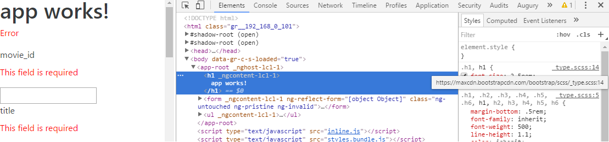
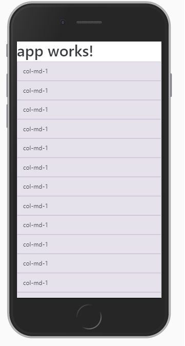
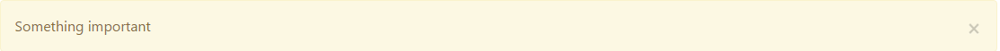
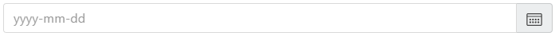
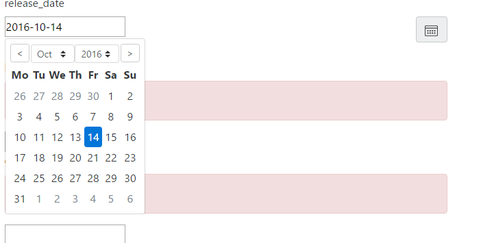
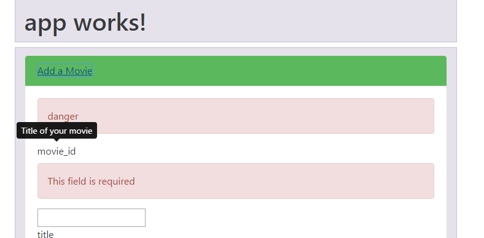
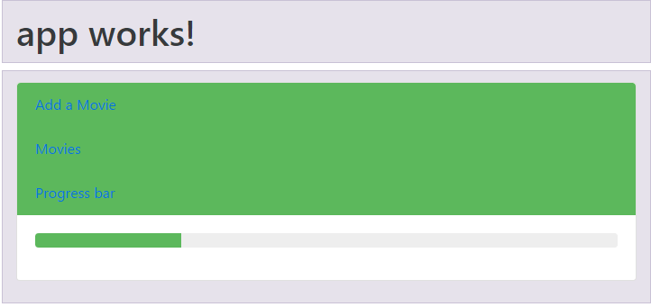
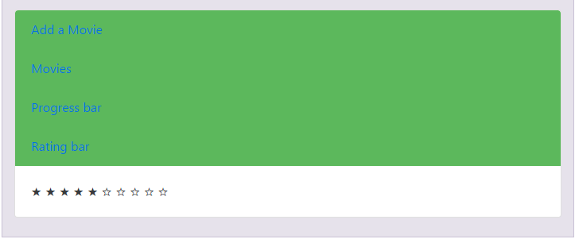

# 集成引导与角度应用


Bootstrap 可以说是最流行的前端框架。你会问，Angular 本身不是一个前端框架吗？嗯，是的。那么，为什么我需要为同一个应用程序使用两个前端框架呢？答案是，你没有。Bootstrap 是由 Twitter 创建的，并且非常流行。它允许您使用称为网格的系统管理许多事情，例如页面上 HTML 组件的配置。这个系统，我将在下面的页面中详细解释，允许您将网页空间划分为多个区域，而无需显式使用 CSS。此外，一切都是开箱即用的。此外，Bootstrap 还提供了动态元素，如旋转木马、进度条、表单对用户输入的反应等等。简单地说，Angular 允许您创建应用程序结构并管理数据表示，而 Bootstrap 处理图形表示。

引导基于三个要素：

*   `bootstrap.css`
*   `bootstrap.js`
*   `glyphicons`

在这里，`bootstrap.css`包含允许响应空间划分的框架，而`bootstrap.js`是使页面动态的 JavaScript 框架。

It is important to note that `bootstrap.js` depends on the jQuery library.

最后，`glyphicons`是一种字体，包含使用引导时可能需要的所有图标。

在[第 10 章](10.html)*、**Angular*材质设计中，您将学习如何使用谷歌（ng2 材质）提供的 Angular 官方扩展版`Material Design`包创建管理动态元素、旋转木马和其他进度条的应用程序。Bootstrap（由 Twitter 提供）和 Material Design（由 Google 提供）最终都会达到同样的目的：在向用户严格展示页面时，简化您的生活。例如，它们都可以确保跨浏览器兼容性，防止项目之间的代码重复，并在代码库中增加一致性。

在我看来，你应该使用哪一种是个人的选择，我可以预见未来几个月将发生 C#与 Java 或 PC 与 Mac 之间的激烈战争。一方面，如果您已经精通引导并在任何地方使用它，那么您也可以在这里使用它。另一方面，如果引导不是你的技能集的一部分，你可以利用这个机会来学习它，然后选择你喜欢的。

第三个选择是，如果你已经选择了材料设计（由谷歌提供的角度设计）方法，那么你可以完全跳过这一章。我不会介意的，我保证。本章涵盖的主题包括：

*   安装引导程序
*   了解 Bootstrap 的网格系统
*   使用引导指令


# 安装引导程序


无需更多的麻烦，让我们开始安装 Angular 的引导程序。

当将 Bootstrap 与没有前端框架（如 Angular）的标准 web 应用程序一起使用时，您需要使用**内容交付网络**（**CDN**）来获取构成 Bootstrap 框架的三个部分（`bootstrap.css`、`bootstrap.js`和`glyphicons`。这些调用，即使在下载缩小的文件时，仍然需要时间（例如，三个 HTTP 请求、下载、检查求和等）供客户端使用。对于 Angular，我们可以遵循相同的方法，简单地在`src/index.html`中添加对某些 CDN 的引用，但这将是一个相当大的错误。

首先，如果用户不拥有资源的缓存副本，那么我们将遭受与标准 web 应用相同的副作用，因为我们的客户将不得不等待 CDN 服务于引导框架，特别是考虑到由于 Angular CLI 部署过程，我们的应用已缩小并在单个文件中提供服务。其次，我们将无法轻松控制角组件中的引导组件。

将引导与 Angular 应用程序集成的更好方法是使用`ng-bootstrap`包。这个包允许我们使用 Angular 指令进行引导，并在我们的组件中管理它们。在撰写本文时，这是最全面、维护良好、集成良好的软件包，它允许我们在 Angular 中使用 Bootstrap。

为了探索 Bootstrap，我们将在[第 7 章](07.html)、*异步编程使用可观察对象*和[第 9 章](09.html)、*A**中使用的 Marvel Cinematic Universe 的 JSON API 基础上，以角度*为高级形式。

您可以在[找到](https://github.com/MathieuNls/mastering-angular2/tree/master/chap9)[第 9 章](09.html)中的*高级表单*的代码 https://github.com/MathieuNls/mastering- [角度](https://github.com/MathieuNls/mastering-angular2/tree/master/chap9)[/树/主/第 9 章](https://github.com/MathieuNls/mastering-angular2/tree/master/chap9)。

要将此代码克隆到名为`angular-bootstrap`的新存储库中，请使用以下命令：

```ts
$ **git** clone --depth one https://github.com/MathieuNls/mastering-angular    
    angular-bootstrap
$ **cd** angular-bootstrap
$ **git** filter-branch --prune-empty --subdirectory-filter chap9 HEAD

```

这些命令将包含本书代码的 GitHub 存储库的最新版本拉入名为`angular-bootstrap`的文件夹。然后，我们进入`angular-bootstrap`文件夹，删减[第 9 章](09.html)中*高级形式在*目录中的所有内容。

现在让我们安装`ng-bootstrap`包：

```ts
npm install --save @ng-bootstrap/ng-bootstrap

```

现在，在`src/app/app.module.ts`中，从`@ng-bootstrap/ng-bootstrap`导入`import {NgbModule}`包，并将`NgbModule.forRoot()`添加到`AppModule`类的导入列表中。它应该是这样的，如果您重用了[第 9 章](09.html)中的代码，*高级表单在*中：

```ts
 import { BrowserModule } from '@angular/platform-browser';
 import { NgModule } from '@angular/core';
 import { FormsModule, ReactiveFormsModule  } from '@angular/forms';
 import { HttpModule } from '@angular/http';
 import { NgbModule } from '@ng-bootstrap/ng-bootstrap

 import { AppComponent } from './app.component';

 @NgModule({
   declarations: [
     AppComponent
   ],
   imports: [
     BrowserModule,
     FormsModule,
     HttpModule,
     ReactiveFormsModule,
     NgbModule.forRoot()
   ],
   providers: [],
   bootstrap: [AppComponent]
 })
 export class AppModule { }

```

这个包允许我们去掉 jQuery 和`bootstrap.js`依赖项，但不幸的是，它不包括`bootstrap.css`。它包含网格系统和我们将要使用的组件所需的样式。

转到[http://getbootstrap.com/](http://getbootstrap.com/) 并在您的`src/index.html`中导入以下显示的链接：

```ts
<!doctype html>
 <html>
 <head>
   <meta charset="utf-8">
   <title>Chap15</title>
   <base href="/">
   <link rel="stylesheet" 
        href="https://maxcdn.bootstrapcdn.com/bootstrap/4.0.0-
        alpha.4/css/bootstrap.min.css" integrity="sha384-
        2hfp1SzUoho7/TsGGGDaFdsuuDL0LX2hnUp6VkX3CUQ2K4K+xjboZdsXyp4oUHZj" 
        crossorigin="anonymous">
   <meta name="viewport" content="width=device-width, initial-scale=1">
   <link rel="icon" type="image/x-icon" href="favicon.ico">
 </head>
 <body>
   <app-root>Loading...</app-root>
 </body>
 </html>

```

在这些小的变化之后，我们已经可以看到 Bootstrap 正在接管我们的风格。在下图中，左边是[第 9 章](09.html)*角形*高级形体结尾处我们的形体的样子。

然而，右边是我们现在的形态。正如你所看到的，这里和那里有一些细微的差别。例如，`h1`标记、错误字段和输入具有不同的样式：


Before and after Bootstrap.

如果我们使用 Google Chrome 检查功能，我们可以清楚地看到`h1`标记的应用样式来自 http://maxcdn.bootstrapcdn.com，如以下屏幕截图所示：



Chrome inspect style.

就是这样：我们完成了引导的初始化。让我们学习如何使用引导的角度指令。


# 理解网格系统


在本章中，我们更关心的是学习如何为 Angular 使用不同的引导指令，而不是学习 Sass 混合和其他表示技巧。换句话说，网格系统的高级功能不属于本章的范围。然而，在本节中，我将快速介绍什么是网格系统，并概述如何使用它。

如果您以前使用过引导，更具体地说，使用过网格系统，您可以跳过本节，直接转到下一节，在那里我们学习如何使用 accordion 指令。

因此，网格系统将我们的演示分成 12 列。柱的大小可以是超小、小、中、大和超大。可以通过 CSS 类前缀（分别为`col-xs`、`col-sm`、`col-md`、`col-lg`和`col-xl`手动设置列的大小，并对应于不同的屏幕宽度（分别小于 540px、540px、720px、960px 和 1140px）。

为了了解如何利用网格系统来分离我们的演示文稿，让我们在`<h1>{{title}}</h1>`标记后面的`src/app/app.component.html`中添加以下内容：

```ts
<div class="container">
   <div class="row">
     <div class="col-md-1">col-md-1</div>
     <div class="col-md-1">col-md-1</div>
     <div class="col-md-1">col-md-1</div>
     <div class="col-md-1">col-md-1</div>
     <div class="col-md-1">col-md-1</div>
     <div class="col-md-1">col-md-1</div>
     <div class="col-md-1">col-md-1</div>
     <div class="col-md-1">col-md-1</div>
     <div class="col-md-1">col-md-1</div>
     <div class="col-md-1">col-md-1</div>
     <div class="col-md-1">col-md-1</div>
     <div class="col-md-1">col-md-1</div>
   </div>
   <div class="row">
     <div class="col-md-8">col-md-8</div>
     <div class="col-md-4">col-md-4</div>
   </div>
   <div class="row">
     <div class="col-md-4">col-md-4</div>
     <div class="col-md-4">col-md-4</div>
     <div class="col-md-4">col-md-4</div>
   </div>
   <div class="row">
     <div class="col-md-6">col-md-6</div>
     <div class="col-md-6">col-md-6</div>
   </div>
 </div>

```

正如您所看到的，我们有几个 CSS 类在这里工作。首先，让我们看看容器。这是强制性的，定义了应用引导网格系统的空间。然后，我们有包含`col- divs`的行。每一行占据屏幕的全部宽度，并分为列。列的实际宽度取决于在列类声明末尾使用的数字（4、8、6 等等）。知道行被分成 12 列，并且我们使用了`col-md`类前缀，我们可以推断一行的最大大小是 720px。因此，每列的宽度为 60px。在第一行中，我们使用`-1`后缀作为我们的声明；因此，我们有 60px 宽的列（即屏幕宽度的大小除以 12）。然而，在第二行，我们使用了[T3]和[T4]后缀。

这意味着我们将有一列是`a-1`列（480px）宽度的八倍，另一列是`a-1`列（240px）宽度的四倍。在第三行中，我们使用三个四列，最后在第四行中，我们有两个六列。

要查看正在发生的情况，请在`app/app.component.css`中添加以下内容：

```ts
.row > [class^="col-"]{
   padding-top: .75rem;
     padding-bottom: .75rem;
     background-color: rgba(86, 61, 124, 0.15);
     border: 1px solid rgba(86, 61, 124, 0.2);
 }

```

这段 CSS 将为任何`col`类添加背景和边框，而不考虑它们可能具有的前缀或后缀：


The grid system in action.

正如您在上图中所看到的，空间按照计划进行了很好的划分。现在，这不是网格系统的真正优势。其主要优点是，如果屏幕宽度小于 720px，这些列将自动堆叠在彼此的顶部。

例如，在屏幕宽度为 375px 的 iPhone 6 上，所有列都将堆叠起来，如以下屏幕截图所示：



The grid system on an iPhone 6.

这是官方文件中的另一个例子，见[https://v4-alpha.getbootstrap.com/layout/grid/](https://v4-alpha.getbootstrap.com/layout/grid/) ：

```ts
<!-- Stack the columns on mobile by making one full-width and the other half-width -->
 <div class="row">
   <div class="col-xs-12 col-md-8">.col-xs-12 .col-md-8</div>
   <div class="col-xs-6 col-md-4">.col-xs-6 .col-md-4</div>
 </div>

 <!-- Columns start at 50% wide on mobile and bump up to 33.3% wide on desktop -->
 <div class="row">
   <div class="col-xs-6 col-md-4">.col-xs-6 .col-md-4</div>
   <div class="col-xs-6 col-md-4">.col-xs-6 .col-md-4</div>
   <div class="col-xs-6 col-md-4">.col-xs-6 .col-md-4</div>
 </div>

 <!-- Columns are always 50% wide, on mobile and desktop -->
 <div class="row">
   <div class="col-xs-6">.col-xs-6</div>
   <div class="col-xs-6">.col-xs-6</div>
 </div>

```

我不会进一步详细介绍网格系统，但我知道你可以在 Packt 库中找到很多关于这个主题的很棒的书。只需查看以下内容：

*   *掌握引导 4*
*   *Bootstrap 4 蓝图*


# 使用引导指令


在本节中，我们将学习如何使用一些最常用的引导指令来构建应用程序。


# 手风琴


我们将概述的第一个指令是手风琴指令。Accordion 允许您创建不同的内容面板，通过单击其各自的标题可以独立显示。

我们将使用我们在[第 9 章](09.html)中制作的表单，*Angular*中的高级表单，允许用户在惊奇漫画电影世界中添加电影，以实验手风琴。这里的目标是一个面板用于表单，另一个面板用于电影枚举。

让我们从研究引导手风琴所需的最小 HTML 开始，如下所示：

```ts
<ngb-accordion>
   <ngb-panel>
     <template ngbPanelTitle>
       <span>Mastering angular X Bootstrap</span>
     </template>
     <template ngbPanelContent>
       Some deep insights
     </template>
   </ngb-panel>
   <ngb-panel>
     <template ngbPanelTitle>
       <span>Some Title</span>
     </template>
     <template ngbPanelContent>
       Some text
     </template>
   </ngb-panel>
 </ngb-accordion>

```

上一个 HTML 模板将产生以下结果：


A simple accordion.

通过分析前面的代码片段，我们可以看到以下功能：

*   `ngb-accordion`：这是主要的手风琴指令。它定义了一个包含`ngb-panel`的手风琴。
*   `ngb-panel:`这代表手风琴的单个面板。可以通过单击面板标题来切换其可见性。`ngb-panel`包含可用于标题或内容的模板。
*   `<template ngbPanelContent>`：包含给定面板的标题或内容。
*   `<template ngbPanelTitle>:`包含标题。

到目前为止，一切都相当简单。现在，当您从 TypeScript 组件管理它时，它就变得强大了。首先，`ngb-accordion`指令有三个不同的`@Input`属性，我们可以利用它们。第一个是`activeIds`，它是`string[]`，包含您希望打开的面板的 ID。面板 ID 由`ngb-panel-0`自动生成。面板 ID 以`ngb-panel-x`格式生成。第二个`@Input`是布尔值：`closeOthers`。此选项允许您指定一次是否只打开一个面板。最后，使用`string`类型来指定手风琴的风格类型。在引导中，识别四种类型：`success`、`info`、`warning`和`danger`。

除了这三个`@Inputs`之外，`ngb-accordion`指令还提供了一个名为`panelChange`的`@Output`。每当面板的可见性即将切换时，此`@Output`将触发。

让我们通过将`app/app.component.html`转换为以下内容来试验这些`@Input`和`@Output`属性：

```ts
<div class="container">

     <!-- First Row -->
     <div class="row">
         <h1 class="col-md-12">
           {{title}}
         </h1>
     </div>

     <!-- Second Row -->
     <div class="row">

         <!-- Start of the accordion -->
         <ngb-accordion class="col-md-12" 
         <!-- Bind to a variable called activeIds -->
         [activeIds]="activeIds" 
         <!-- Simply use the string 'success' -->
         type="success" 
         <!-- Simply use true -->
         closeOthers="true"
         <!-- Bind to the output -->
         (panelChange)=pannelChanged($event)
         >
           <!-- Firt pannel -->
           <ngb-panel>
             <template ngbPanelTitle>
               <span>Add a Movie</span>
             </template>
             <!-- Form content is here -->
             <template ngbPanelContent>
               <form [formGroup]="movieForm">
                 <!-- Form content omitted for clarity -->
               </form>
             </template>
           </ngb-panel>
           <!-- Second pannel -->
           <ngb-panel>
             <template ngbPanelTitle>
               <span>Movies</span>
             </template>
             <!-- Movie enumeration is here -->
             <template ngbPanelContent>

                 <ul>
                     <li *ngFor="let movie of movies">{{movie}}</li> 
                 </ul>

             </template>
           </ngb-panel>
         </ngb-accordion>

     </div>
 </div>

```

在这里，我们使用`[activeIds]="activeIds"`、`type="success"`、`closeOthers="true"`和`(panelChange)=pannelChanged($event)`绑定到组件中名为`activeIds`的变量，将表单类型设置为`success`，并将`closeOthers`设置为 true。然后，我们将名为`pannelChanged`的方法绑定到`panelChange`输出。在`app.component.ts`中，我们需要添加`activeIds`变量和`pannelChanged`方法，如下所示：

```ts
  private activeIds = ["ngb-panel-1"];

   private pannelChanged(event:{panelId:string, nextState:boolean}){
     console.log(event.nextState, event.panelId);
   }

```

这里，`private activeIds = ["ngb-panel-1"];`允许我们定义`panel-1`（第二个）应该默认打开，`pannelChanged`方法应该接收由`panelId:string`和`nextState:boolean`组成的事件负载。我们记录这两个负载属性。

该应用程序现在看起来与以下屏幕截图中所示的应用程序相似：


A TypeScript--managed accordion.

切换面板时，它会在控制台中记录以下内容：

```ts
**true** "ngb-panel-0"
**false** "ngb-panel-0"  

```


# 警觉的


我们将在本章探讨的下一个指令是`ng-alert`。在引导词汇表中，警报是以彩色`div`显示给用户的重要信息。存在四种类型的警报：`success`、`info`、`warning`和`danger`。

要创建引导警报，最低可行的 HTML 模板如下所示：

```ts
  <ngb-alert> 
    Something important 
  </ngb-alert> 

```

此代码的结果显示在以下屏幕截图中：



A basic alert.

与手风琴类似，alert 指令提供了一些`@Input`和`@Output`。我们可以使用作为`@Input``dismissible:boolean`的`dismissible:boolean`来管理警报的解除，以及`type:string`来接受`success`、`info`、`warning`和`danger`。

为了使表单更具引导性，我们可以将错误消息替换为警报。目前，错误消息的形式如下所示：

```ts
<p class='error' *ngIf=!movieForm.controls.movie_id.valid>This field is required</p>

```

现在的目标是实现以下目标：

```ts
  <ngb-alert 
   [dismissible]="false" 
   *ngIf=!movieForm.controls.movie_id.valid
   type="danger"
   >
     This field is required
   </ngb-alert>

```

对于前面代码段中的每个字段，上述代码将生成以下内容：


Danger alert as form errors.


# 日期


本章中的下一个指令是日期选择器。无论您使用哪种技术，日期总是有点挑剔，因为每个供应商都提出许多格式。此外，日期国际化使事情变得更加困难。

幸运的是，Bootstrap 附带了一个足够简单的日期选择器，允许用户以图形方式在弹出式日历中选择日期。其代码如下所示：

```ts
<div class="input-group">
   <input class="form-control" placeholder="yyyy-mm-dd" 
      ngbDatepicker #dp="ngbDatepicker">
   <div class="input-group-addon" (click)="dp.toggle()" >
     
    </div>
</div>

```

这里发生了很多事情。首先，我们有一个`formControl`输入，它的占位符设置为`yyyy-mm-dd`。您定义的占位符很重要，因为它将作为用户选择的数据的强制格式化程序。对于格式化程序的语法，可以使用每个经典符号表示日期（例如，d、d、j、l、N、S、w、z 等等）。换句话说，我们输入的日期将自动匹配此模式。然后，我们有`ngbDatepicker #d="ngbDatepicker"`。`ngbDatepicker`定义我们的输入是`ngbDatepicker`，而`#dp="ngbDatepicker"`允许我们创建输入的本地引用。该本地参考名为`dp`，用于以下`div: (click)="dp.toggle()"`的`(click)`事件。此`div`包含日历的图像。点击它，会弹出一个动态日历，我们可以选择一个日期。

此 HTML 将为我们提供以下信息：



datepicker.

然后，一旦触发`click`事件，将显示以下内容：


datepicker clicked.

为了改善我们对惊奇漫画电影世界的管理，我们可以将[T0]字段更改为日期选择器。目前，`release_date`字段如下所示：

```ts
<label>release_date</label>
 <ngb-alert [dismissible]="false" type="danger" 
       *ngIf=!movieForm.controls.release_date.valid>This field is required</ngb-alert>
 <input type="text" formControlName="release_date" [(ngModel)]="movie.release_date"><br/>

```

如果字段无效，我们会收到输入和引导警报。默认情况下（即字段为空时），引导警报处于活动状态。让我们将输入转换为以下内容：

```ts
  <label>release_date</label>
   <ngb-alert [dismissible]="false" type="danger" 
      *ngIf=!movieForm.controls.release_date.valid>This 
      field is required</ngb-alert>
   <div class="input-group">
     <input 
     formControlName="release_date" 
     placeholder="yyyy-mm-dd"  
     ngbDatepicker #dp="ngbDatepicker"
     [(ngModel)]="movie.release_date">
     <div class="input-group-addon" (click)="dp.toggle()" >
       
     </div>
   </div>

```

这里的不同之处在于，我们将输入链接到我们的`formControl`。事实上，在[第 9 章](09.html)中*角的高级形式*中，我们对形式的定义如下：

```ts
this.movieForm =  this.formBuilder.group({
         movie_id: ['',  
           Validators.compose(
             [
              Validators.required,
              Validators.minLength(1), 
              Validators.maxLength(4), 
              Validators.pattern('[0-9]+'),
              MovieIDValidator.idNotTaken
             ]
           )
         ],
         title: ['', Validators.required],
         phase: ['', Validators.required],
         category_name: ['', Validators.required],
         release_year: ['', Validators.required],
         running_time: ['', Validators.required],
         rating_name: ['', Validators.required],
         disc_format_name: ['', Validators.required],
         number_discs: ['', Validators.required],
         viewing_format_name: ['', Validators.required],
         aspect_ratio_name: ['', Validators.required],
         status: ['', Validators.required],
         release_date: ['', Validators.required],
         budget: ['', Valida tors.required],
         gross: ['', Validators.required],
         time_stamp: ['', Validators.required]
});

```

因此，我们有一个`release_date`字段是必需的。HTML 输入定义了一个双向数据绑定到带有`[(ngModel)]="movie.release_date"`的`release_date`字段，此外，我们需要在输入中包含`formControlName="release_date"`属性。实施后，屏幕上将显示以下内容：



datepicker for the MCU.


# 工具提示


接下来是 tooltip 指令，它允许我们在给定元素集的左侧、右侧、顶部或底部显示信息性文本。

tooltip 指令是最简单的指令之一。事实上，您只需向希望增强的元素添加两个属性：placement 和[T0]。placement 的值可以是 top、bottom、left 或 right，`ngbTooltip`的值是您希望显示的文本。

让我们修改`movie_id`字段的标签：

```ts
<ngb-alert [dismissible]="false" type="danger" 
   *ngIf=!movieForm.valid>danger</ngb-alert>
<label >movie_id</label>
<ngb-alert [dismissible]="false" type="danger" 
  *ngIf=!movieForm.controls.movie_id.valid>This field 
    is required</ngb-alert>
  <input type="text" formControlName="movie_id" 
     [(ngModel)]="movie.movie_id" name="movie_id" >
   <br/> to 
    <ngb-alert [dismissible]="false" type="danger" 
       *ngIf=!movieForm.valid>danger</ngb-alert>
    <label placement="top" ngbTooltip="Title of
      your movie"> movie_id</label>
    <ngb-alert [dismissible]="false" type="danger" 
       *ngIf=!movieForm.controls.movie_id.valid>This 
    field is required</ngb-alert>
 <input type="text" formControlName="movie_id" 
    [(ngModel)]="movie.movie_id" name="movie_id" ><br/>

```

在这里，我们保持警报和输入不变。但是，我们在标签中添加了位置和`ngbTooltip`属性。因此，当我们将鼠标悬停在`movie_id`标签上方时，您的电影的文本标题将显示在其上方。这显示在以下屏幕截图中：



A tooltip on movie_id.


# 进度条


还有一些其他的引导组件，我们可以用来增强我们的形式；然而，在可用性方面，太多会很快成为一种过度使用的情况。例如，将进度条集成到表单中是很棘手的。然而，我们所能做的是，为我们想要测试的每个新引导指令在我们的手风琴中添加一个面板。

让我们为进度条添加一个面板：

```ts
<ngb-panel>
     <template ngbPanelTitle>
         <span>Progress Bar</span>
     </template>

     <template ngbPanelContent>

       <ngb-progressbar type="success" [value]="25"></ngb-progressbar>

    </template>
</ngb-panel>

```

`progressbar`指令是另一个简单的指令。它有两个`@Input`属性：类型和值。通常，类型可以是 a`success`、`danger`、`warning`或`info`。value 属性可以绑定到 TypeScript 变量，而不是像我那样硬编码 25。

结果如下：



Progress bar on movie_id.


# 评级


评级指令也相当有名。它允许用户对某物进行评分，或显示给定的费率。

正如预期的那样，本指令易于理解。它有一个速率输入，您可以硬编码（例如，`"rate"=25`、绑定（`[rate]="someVariable"`）或应用双向数据绑定（`[(rate)]="someVariable"`）。除了费率输入，您还可以使用`[readonly]="read-only"`使您的费率栏不可修改。

默认情况下，评级栏由 10 颗星组成。速率值的范围从 0 到 10，包括十进制数。

以下是一个新面板内默认费率栏的示例：

```ts
<ngb-panel>
        <template ngbPanelTitle>
           <span>Rating bar</span>
         </template>
         <template ngbPanelContent>

            <ngb-rating rate="5"></ngb-rating>

          </template>
  </ngb-panel>

```

这将产生以下结果：



Rate bar.


# 总结


在本章中，我们看到了一些最流行的引导组件。我们学习了如何将它们与 ng2 引导包提供的本机 Angular 指令一起使用。然而，我们并没有探究其中的每一个引导组件。您可以查看托管在[的官方文档 https://ng-bootstrap.github.io/](https://ng-bootstrap.github.io/) 。

在下一章中，您将学习如何使用单元测试测试 Angular 应用程序。