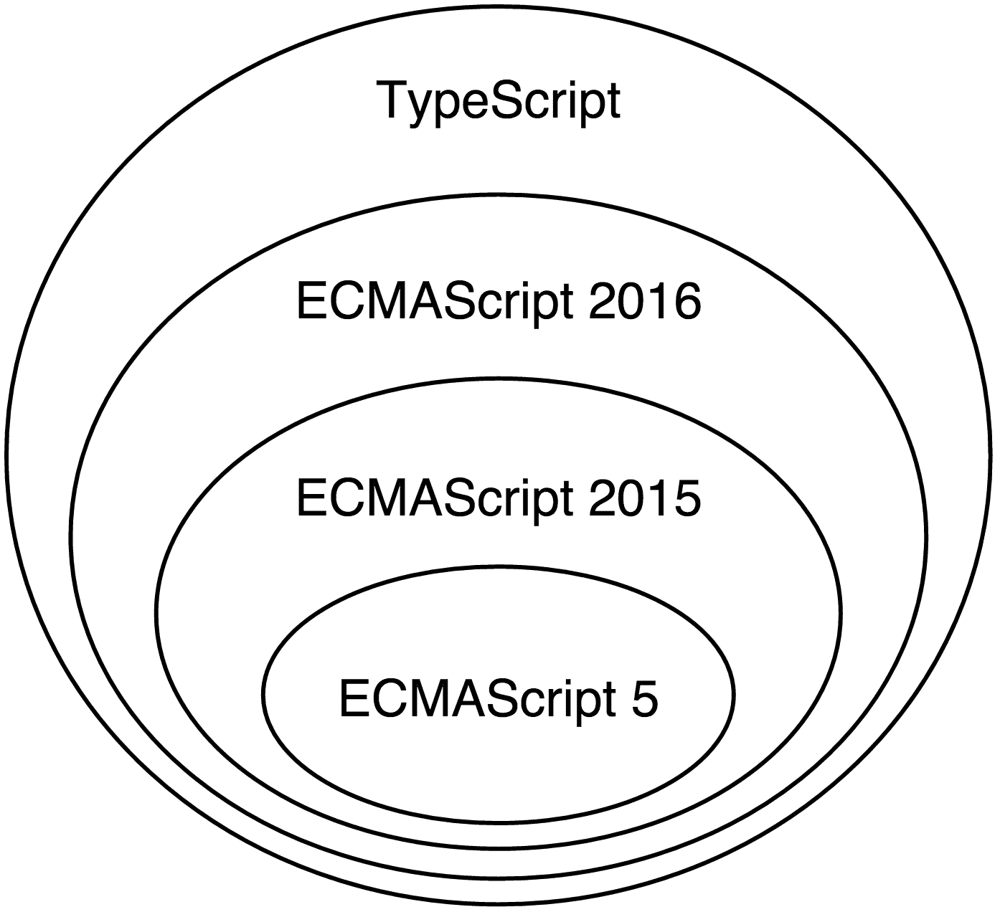

# 一、开始

2014 年 9 月 18 日，谷歌首次向存储库公开提交了 Angular 的新版本。几周后，在**ng europe**会议上，核心团队的 Igor 和 Tobias 简要概述了新版本框架的预期内容。当时的愿景远非最终目标；然而，有一点是肯定的：新版本的框架将与 AngularJS 完全不同。

这一宣布带来了许多问题和争议。这些剧烈变化背后的原因非常清楚：AngularJS 不再能够充分利用不断发展的 Web，需要完全满足大规模 JavaScript 应用程序的需求。一个新的框架将使有棱角的开发人员能够以更简单、更高效的方式利用 web 技术的发展。然而，人们还是很担心。对于开发人员来说，向后不兼容的最大噩梦之一就是将他们当前的代码库迁移到他们使用的第三方软件的新版本。在 Angular 的例子中，在第一次宣布之后，迁移看起来令人望而生畏，甚至是不可能的。随后，在 2015 年**ng conf**和 2015 年**ng vegas**上，引入了不同的迁移策略。AngularJS 社区走到了一起，分享了更多的想法，期待着新版本框架的好处，同时保留了从 AngularJS 学到的东西。

这本书是该项目的一部分。升级到 Angular 的新版本现在很顺利，值得一试。Angular2 的巨大变化及其缺乏向后兼容性背后的主要驱动因素是 Web 的发展以及从野外使用 AngularJS 中吸取的经验教训。*开始使用 Angular*将帮助您了解我们是如何来到这里的，以及 Angular 的新功能在构建高性能、可扩展、单页应用程序方面对现代 Web 具有直观意义的原因，从而帮助您学习新框架。我们将在本章中讨论的一些主题如下：

*   如何使用 TypeScript 以及它如何扩展 JavaScript。
*   使用基于组件的体系结构构建 Angular 应用程序的用户界面。
*   使用 Angular 的依赖注入机制并将业务逻辑委托给服务。
*   我们将深入探讨 Angular 的路由器和表单模块。
*   我们将了解用于构建闪电般快速的应用程序的提前编译。

Angular 采用了语义版本控制，所以在进一步讨论之前，让我们对这实际上意味着什么做一个概述。

# Angular和Angular

AngularJS 从零开始重写，并由其继任者 Angular2 取代。我们中的很多人都被这一重大步骤所困扰，这使得我们无法在这两个版本的框架之间顺利过渡。Angular 2 刚稳定下来，Google 就宣布他们希望遵循所谓的语义版本控制（也称为 semver）。

Semver 将给定软件项目的版本定义为三个**X.Y.Z**，其中 Z 称为**补丁版本**，Y 称为**次要版本**，X 称为**主要版本**。补丁版本的更改意味着同一项目的两个版本之间没有预期的破坏性更改，只有 bug 修复。当引入新功能时，项目的次要版本将增加，并且没有中断性的更改。最后，当 API 中引入不兼容的更改时，主版本将增加。

这意味着在版本 2.3.1 和 2.10.4 之间，没有引入突破性的更改，只有一些添加的功能和错误修复。但是，如果我们有版本 2.10.4，并且我们想要以向后不兼容的方式更改任何已经存在的公共 API（例如，更改方法接受的参数顺序），我们需要增加主版本，并重置补丁和次版本，因此我们将获得版本 3.0.0。

Angular团队也遵循严格的时间表。据介绍，*每周需要推出新的补丁版本；每次主要发布*后，应每月发布三次次要发布，最后，*每六个月发布一次主要发布*。这意味着到 2018 年底，我们将拥有至少 6 个。然而，这并不意味着每六个月我们就必须经历与 AngularJS 和 Angular2 相同的迁移路径。*并不是每个主要版本都会引入突破性的变化，这些变化将影响我们的项目。*例如，支持更新版本的 TypeScript 或更改方法的最后一个可选参数将被视为破坏性更改。我们可以用与 AngularJS 1.2 和 AngularJS 1.3 之间发生的类似的方式来思考这些突破性的变化。

### 注

由于您将在本书中阅读的内容主要与不同Angular的版本相关，*我们将Angular 2 称为Angular 2 或仅Angular*。如果我们明确提到Angular 2，这并不意味着给定的段落对Angular 4 或Angular 5 无效；很可能会。如果您有兴趣了解框架不同版本之间的更改，您可以查看位于[的更改日志 https://github.com/angular/angular/blob/master/CHANGELOG.md](https://github.com/angular/angular/blob/master/CHANGELOG.md) 。如果我们在讨论 AngularJS（即框架的 1.x 版），我们将更明确地提到版本号，或者使用 AngularJS 而不是 AngularJS。

现在我们已经介绍了 Angular 的语义版本控制和引用框架不同版本的约定，我们可以正式开始我们的旅程了！

# 新框架下网络时代的演变

在过去的几年里，网络有了长足的发展。在 ECMAScript 5 的实施过程中，ECMAScript 6 标准开始开发（现称为**ECMAScript 2015**或**ES2015**。ES2015 在 JavaScript 中引入了许多变化，例如添加了对模块的内置语言支持、块作用域变量定义，以及大量的语法糖类，例如类和分解结构。

同时，**Web 组件**被发明。Web 组件允许我们定义自定义 HTML 元素并将行为附加到它们。由于很难用新的 HTML 元素（如对话框、图表、网格等）扩展现有的 HTML 元素集，主要是因为整合和标准化 API 需要时间，因此更好的解决方案是允许开发人员以他们想要的方式扩展现有的元素。Web 组件为我们提供了许多好处，包括更好的封装、我们生成的标记的更好语义、更好的模块化以及开发人员和设计人员之间更容易的通信。

我们知道 JavaScript 是一种单线程语言。最初，它是为简单的客户端脚本而开发的，但随着时间的推移，它的角色已经发生了很大的变化。现在，有了 HTML5，我们有了不同的 API，允许音频和视频处理，通过双向通信通道与外部服务通信，传输和处理大块原始数据，等等。主线程中所有这些繁重的计算可能会造成糟糕的用户体验。当执行耗时的计算时，它们可能会导致用户界面冻结。这导致了**Web Workers**的开发，它允许在后台执行通过消息传递与主线程通信的脚本。通过这种方式，多线程编程被引入到浏览器中。

其中一些 API 是在 AngularJS 开发开始后引入的；这就是为什么构建框架时没有考虑到其中的大部分。利用 API 为开发人员带来了许多好处，例如：

*   显著的性能改进。
*   开发具有更好质量特性的软件。

现在，让我们简单地讨论一下这些技术是如何成为新的 Angle core 的一部分的，以及为什么。

# ECMAScript 的演变

如今，浏览器供应商在短时间内发布新功能，用户经常收到更新。这有助于开发人员利用最前沿的 Web 技术。ES2015 已经标准化。该语言的最新版本已经在主要浏览器中开始实施。学习新语法并充分利用它不仅可以提高我们作为开发人员的工作效率，还可以让我们为不久的将来做好准备，那时所有的浏览器都将完全支持它。这使得现在就必须开始使用最新的语法。

一些项目的要求可能迫使我们支持不支持任何 ES2015 功能的旧浏览器。在这种情况下，我们可以直接编写 ECMAScript 5，它与 ES2015 具有不同的语法，但语义相同。另一方面，更好的方法是利用**发丝**的过程。在构建过程中使用 transpiler 可以让我们通过编写 ES2015 并将其翻译成浏览器支持的目标语言来利用新语法。

Angular 从 2009 年就开始出现了。当时，大多数网站的前端都是由 ECMAScript 3 提供支持的，ECMAScript 3 是 ECMAScript 5 之前的最后一个主要版本。这自动意味着用于框架实现的语言是 ECMAScript 3。利用新版本的语言需要将整个 AngularJS 移植到 ES2015。

从一开始，Angular 2 就通过在框架中引入最新语法来考虑 Web 的当前状态。尽管 new Angular 是用 ES2016 的超集（TypeScript，我们将在[第 3 章](3.html "Chapter 3. TypeScript Crash Course")、*TypeScript 速成课*中介绍）编写的，但它允许开发人员使用自己喜欢的语言。我们可以使用 ES2015，或者如果我们不希望对代码进行任何中间预处理并简化构建过程，我们甚至可以使用 ECMAScript 5。请注意，如果我们在 Angular 应用程序中使用 JavaScript，我们就不能提前使用**（**AoT**编译）。有关 AoT 编译的更多信息，请参见[第 8 章](8.html "Chapter 8. Tooling and Development Experience")、*工具和开发经验*。**

 **## Web 组件

Web 组件的第一份公开草案于 2012 年 5 月 22 日发布，大约是 AngularJS 发布三年后。如前所述，Web 组件标准允许我们创建自定义元素并将行为附加到它们。听起来很熟悉；我们已经在 AngularJS 应用程序的用户界面开发中使用了类似的概念。Web 组件听起来像是Angular指令的替代品；但是，它们有更直观的 API 和内置的浏览器支持。他们引入了一些其他的好处，例如更好的封装，这在处理 CSS 样式冲突时非常重要。

在 AngularJS 中添加 Web 组件支持的一个可能策略是更改指令实现，并在 DOM 编译器中引入新标准的原语。作为 Angular 开发者，我们知道指令 API 是多么强大和复杂。它包括很多属性，比如`postLink`、`preLink`、`compile`、`restrict`、`scope`、`controller`等等，当然还有我们最喜欢的`transclude`。被批准为标准的 Web 组件将在浏览器中的较低级别上实现，这将带来很多好处，例如更好的性能和本机 API。

在 Web 组件的实现过程中，许多 Web 专家遇到了 Angular 团队在开发指令 API 时遇到的相同问题，并提出了类似的想法。Web 组件背后的良好设计决策包括**内容**元素，它处理 AngularJS 中臭名昭著的转换问题。由于指令 API 和 Web 组件以不同的方式解决类似的问题，因此将指令 API 保持在 Web 组件之上是多余的，并增加了不必要的复杂性。这就是为什么 Angular 核心团队决定从一开始就构建一个与 Web 组件兼容的框架，并充分利用新标准。Web 组件包含新特性；其中一些尚未被所有浏览器实现。如果我们的应用程序在本机不支持任何这些功能的浏览器中运行，Angular 将模拟这些功能。这方面的一个例子是填充了[T0]指令的内容元素。

## 网络工作者

JavaScript 以其事件循环而闻名。通常，JavaScript 程序是在单个线程中执行的，不同的事件是通过在队列中推送并按到达顺序依次处理来调度的。然而，当其中一个预定事件需要大量计算时间时，这种计算策略并不有效。在这种情况下，事件的处理将阻塞主线程，在耗时的计算完成并将执行传递给队列中的下一个线程之前，不会处理所有其他事件。一个简单的例子是鼠标点击触发一个事件，在这个事件中，我们使用 HTML5 音频 API 进行一些音频处理。如果处理后的音频曲目很大，而在其上运行的算法很重，则会冻结用户界面，直到执行完成，从而影响用户体验。

引入 WebWorkers API 是为了防止此类陷阱。它允许在不同线程的上下文中执行繁重的计算，从而使执行的主线程保持自由，能够处理用户输入并呈现用户界面。

我们如何利用这一点呢？为了回答这个问题，让我们思考一下 AngularJS 中的工作原理。如果我们有一个企业应用程序，它处理大量需要使用数据绑定在屏幕上呈现的数据，该怎么办？对于每个绑定，框架将创建一个新的观察者。运行摘要循环后，它将在所有观察者上循环，执行与它们相关联的表达式，并将返回的结果与从上一次迭代中获得的结果进行比较。我们在这里有一些减速：

*   对大量观察者的迭代。
*   在给定上下文中对表达式的求值。
*   返回结果的副本。
*   表达式计算的当前结果与上一个结果之间的比较。

所有这些步骤都可能非常慢，具体取决于输入的大小。如果摘要循环涉及繁重的计算，为什么不将其移动到 Web Worker？为什么不在 Web Worker 内部运行摘要循环，获取更改的绑定，然后将其应用于 DOM？

社区进行了旨在获得这一结果的实验。然而，它们与框架的集成并非微不足道。缺乏令人满意的结果的主要原因之一是框架与 DOM 的耦合。通常，在观察者的回调中，AngularJS 直接操纵 DOM，这使得不可能在 Web Worker 中移动观察者，因为 Web Worker 是在孤立的上下文中执行的，没有对 DOM 的访问权。在 AngularJS 中，不同观察者之间可能存在隐式或显式依赖关系，这需要对摘要循环进行多次迭代才能获得稳定的结果。结合最后两点，在计算除主执行线程之外的其他线程的变化时，很难获得实际结果。

在 AngularJS 中修复此问题会给内部实现带来很大的复杂性。构建框架时根本没有考虑到这一点。由于 Web Workers 是在 Angular 2 设计过程开始之前引入的，所以核心团队从一开始就考虑了他们。

# 野生鳗鲡的经验教训

尽管上一节列出了许多需要重新实现框架以响应最新趋势的理由，但重要的是要记住，我们不是从零开始的。我们从 AngularJS 身上学到的东西都带走了。自 2009 年以来，网络并不是唯一进化的东西。我们还开始构建越来越复杂的应用程序。如今，单页应用程序已不再是什么异国情调，而是更像是对所有解决业务问题的 web 应用程序的严格要求，这些应用程序旨在获得高性能和良好的用户体验。

AngularJS 帮助我们高效地构建大规模单页应用程序。然而，通过在各种用例中应用它，我们也发现了它的一些缺陷。Angular 的核心团队从社区的经验中学习，致力于开发新的想法，以满足新的需求。

## 控制器

AngularJS 遵循**模型视图控制器**（**MVC**微架构模式。有些人可能会认为，它看起来更像**模型视图视图模型**（**MVVM**），因为视图模型作为属性附加到范围中，或者在“控制器作为语法”的情况下附加到当前上下文中。如果我们使用**模型视图演示者模式**（**MVP**的话，可以再次以不同的方式进行处理。由于我们在应用程序中构造逻辑的方式有各种不同，核心团队称 AngularJS 为**模型视图**（**MVW**框架。

任何 AngularJS 应用程序中的视图都应该是指令的组合。这些指令协同工作，以提供功能齐全的用户界面。服务负责封装应用程序的业务逻辑。在这里，我们应该通过 HTTP 与 RESTful 服务进行通信，与 WebSocket 甚至 WebRTC 进行实时通信。服务是我们应该在其中实现应用程序的域模型和业务规则的构建块。还有一个组件，主要负责处理用户输入并将执行委托给控制器提供的服务。

虽然服务和指令具有定义良好的角色，但我们经常可以看到 iOS 应用程序中常见的**海量视图控制器**的反模式。有时，开发人员会试图直接从他们的控制器访问甚至操纵 DOM。最初，当您想要实现一些简单的事情时，例如更改元素的大小，或者快速而不精确地更改元素的样式，就会发生这种情况。另一个值得注意的反模式是跨控制器复制业务逻辑。通常，开发人员倾向于复制和粘贴逻辑，这些逻辑应该封装在服务中。

构建 AngularJS 应用程序的最佳实践表明，控制器根本不应该操纵 DOM；相反，所有 DOM 访问和操作都应该在指令中隔离。如果我们在控制器之间有一些重复的逻辑，我们很可能希望将其封装到一个服务中，并在所有需要该功能的控制器中使用 Angular 的依赖注入机制注入该服务。

这就是我们来自安格拉斯的地方。尽管如此，控制器的功能似乎可以转移到指令的控制器中。由于指令支持依赖项注入 API，因此在收到用户输入后，我们可以直接将执行委托给已经注入的特定服务。这就是 Angular 现在使用不同方法的主要原因，通过使用[T0]指令取消将控制器放置在任何地方的功能。我们将在[第 4 章](4.html "Chapter 4. Getting Started with Angular Components and Directives")、*Angular组件和指令入门*中了解如何从新组件和指令中承担 AngularJS 控制器的责任。

## 范围

AngularJS 中的数据绑定是使用`scope`对象实现的。我们可以将属性附加到它，并在模板中显式声明要绑定到这些属性（单向或双向）。虽然范围的概念似乎很清楚，但它还有两个职责，包括事件调度和与变更检测相关的行为。Angular初学者很难理解什么是范围以及应该如何使用范围。AngularJS 1.2 引入了一种称为**控制器的语法**。它允许我们向给定控制器（`this`内的当前上下文添加属性，而不是显式注入`scope`对象，然后再向其添加属性。可以通过以下代码段演示此简化语法：

```ts
<div ng-controller="MainCtrl as main"> 
  <button ng-click="main.clicked()">Click</button> 
</div>
```

```ts
function MainCtrl() { 
  this.name = 'Foobar'; 
} 
MainCtrl.prototype.clicked = function () { 
  alert('You clicked me!'); 
}; 

```

最新的 Angular 通过移除`scope`对象进一步实现了这一点。所有表达式都在给定 UI 组件的上下文中求值。删除整个范围的 API 带来了更高的简单性；我们不再需要显式地注入它，而是向 UI 组件添加属性，以后可以绑定到这些组件。这个 API 感觉更简单、更自然。

我们将在[第 4 章](4.html "Chapter 4. Getting Started with Angular Components and Directives")、*Angular组件和指令入门*中更详细地了解Angular组件和变化检测机制。

## 依赖注入

可能市场上第一个通过 JavaScript 世界中的**依赖注入**（**DI**）包含**控制反转**（**IoC**）的框架是 AngularJS。DI 提供了许多好处，例如更容易测试、更好的代码组织和模块化以及简单性。尽管框架的第一个版本中的 DI 做了一项惊人的工作，Angular 2 将这项工作做得更进一步。由于最新的 Angular 是在最新的 Web 标准之上的，因此它使用 ECMAScript 2016 decorators 的语法来注释使用 DI 的代码。修饰符与 Python 中的修饰符或 Java 中的注释非常相似。它们允许我们*装饰*给定对象的行为，或者使用反射向其添加元数据。由于装饰器还没有标准化，主要浏览器也不支持装饰器，因此装饰器的使用需要一个中间的透明步骤；但是，如果您不想使用它，可以直接使用 ECMAScript 5 语法编写更详细的代码，并实现相同的语义。

新的 DI 更加灵活，功能更加丰富。它还修复了 AngularJS 的一些缺陷，例如不同的 API；在框架的第一个版本中，一些对象按位置（如指令链接函数中的作用域、元素、属性和控制器）注入，另一些对象按名称（使用控制器、指令、服务和过滤器中的参数名称）注入。

我们将在[第 5 章](5.html "Chapter 5. Dependency Injection in Angular")中进一步了解 Angular 的依赖注入 API，中的*依赖注入 API。*

## 服务器端渲染

Web 的需求越大，Web 应用程序就变得越复杂。构建一个现实生活中的单页应用程序需要编写大量 JavaScript，包括所有必需的外部库可能会将页面上的脚本大小增加到几兆字节。在移动设备上，应用程序的初始化可能需要几秒钟甚至几十秒钟，直到从服务器获取所有资源、解析和执行 JavaScript、呈现页面以及应用所有样式。在使用移动互联网连接的低端移动设备上，此过程可能会让用户放弃访问我们的应用程序。虽然有一些实践可以加快这一过程，但在复杂的应用程序中，并没有灵丹妙药。

在试图改善用户体验的过程中，开发人员发现了一种称为**服务器端渲染**的东西。它允许我们在服务器上呈现单个页面应用程序的请求视图，并直接向用户提供页面的 HTML。稍后，处理完所有资源后，可以通过脚本文件添加事件侦听器和绑定。这听起来是提高应用程序性能的好方法。这方面的先驱之一是 React，它允许使用 Node.js DOM 实现在服务器端预呈现用户界面。不幸的是，AngularJS 的架构不允许这样做。showstopper 是框架和浏览器 API 之间的强耦合，这与我们在 Web Workers 中运行更改检测时遇到的问题相同。

服务器端渲染的另一个典型用例是构建**搜索引擎优化**（**SEO**）友好的应用程序。过去曾有几次黑客让 AngularJS 应用程序可以被搜索引擎索引。例如，其中一种做法是使用无头浏览器遍历应用程序，该浏览器在每个页面上执行脚本，并将呈现的输出缓存到 HTML 文件中，从而使搜索引擎可以访问它。

尽管这种构建 SEO 友好型应用程序的变通方法可行，但服务器端渲染解决了上述两个问题，改善了用户体验，并使我们能够更轻松、更优雅地构建 SEO 友好型应用程序。

Angular 与 DOM 的解耦允许我们在浏览器上下文之外运行 Angular 应用程序。我们将在[第 8 章](8.html "Chapter 8. Tooling and Development Experience")、*工具和开发经验*中进一步了解。

## 可扩展的应用程序

自从 Backbone.js 出现以来，MVW 一直是构建单页应用程序的默认选择。它允许通过将业务逻辑与视图隔离来分离关注点，从而允许我们构建设计良好的应用程序。利用观察者模式，MVW 允许监听视图中的模型更改，并在检测到更改时更新它。然而，这些事件处理程序之间存在一些显式和隐式依赖关系，这使得我们的应用程序中的数据流不明显，也很难解释。在 AngularJS 中，我们可以在不同的观察者之间建立依赖关系，这需要摘要循环在所有观察者之间迭代几次，直到表达式的结果稳定为止。新的Angular使数据流是单向的；这有很多好处：

*   更明确的数据流。
*   绑定之间没有依赖关系，因此没有摘要的**生存时间**（**TTL**。
*   Better performance of the framework:
    *   摘要循环只运行一次。
    *   我们可以创建对不可变或可观察模型友好的应用程序，使我们能够进行进一步优化。

数据流的变化在 AngularJS 体系结构中引入了一个更基本的变化。

当我们需要维护用 JavaScript 编写的大型代码库时，我们可以从另一个Angular来看待这个问题。尽管 JavaScript 的 duck 类型使语言非常灵活，但它也使 IDE 和文本编辑器更难对其进行分析和支持。大型项目的重构变得非常困难并且容易出错，因为在大多数情况下，静态分析和类型推断是不可能的。由于缺少编译器，TypeScript太容易了，在我们运行测试套件或应用程序之前很难注意到。

Angular core 团队决定使用 TypeScript，因为它提供了更好的工具和编译时类型检查，这有助于我们提高工作效率，减少出错几率；它引入了显式类型注释和编译器：



图 1

TypeScript 语言被编译成纯 JavaScript，并得到当今浏览器的支持。从 1.6 版开始，TypeScript 实现了 ECMAScript 2016 装饰器，这使它成为 Angular 的完美选择。

TypeScript 的使用使得 IDE 和文本编辑器能够更好地支持静态代码分析和类型检查。所有这些都通过减少我们所犯的错误和简化重构过程大大提高了我们的生产率。TypeScript 的另一个重要好处是通过静态类型隐式地提高了性能，这允许 JavaScript 虚拟机进行运行时优化。

我们将在[第 3 章](3.html "Chapter 3. TypeScript Crash Course")、*TypeScript速成课*中详细讨论TypeScript。

## 模板

模板是 AngularJS 的关键特性之一。它们是简单的 HTML，不需要任何中间翻译，不像大多数模板引擎，比如 Mustach。Angular 中的模板将简单性与强大性结合在一起，允许我们通过在其内部创建一种具有自定义元素和属性的内部**领域特定语言**（**DSL**）来扩展 HTML。

这也是 Web 组件的主要用途之一。我们已经提到 Angular 如何以及为什么利用这项新技术。尽管 AngularJS 模板很棒，但它们仍然可以变得更好！新的 Angular 模板吸收了框架早期版本中最好的部分，并通过修复一些容易混淆的部分对其进行了增强。

例如，假设我们有一个指令，我们希望允许用户使用属性向它传递属性。在 AngularJS 中，我们可以通过以下三种不同的方式来实现这一点：

```ts
<user name="literal"></user> 
<user name="expression"></user> 
<user name="{{interpolate}}"></user> 

```

在`user`指令中，我们使用三种不同的方法传递`name`属性。我们可以传递一个文本（在本例中为字符串`"literal"`），一个字符串，该字符串将作为表达式（在本例中为`"expression"`）进行计算，或者传递一个内部表达式`{{ }}`。应该使用哪种语法完全取决于该指令的实现，这使得它的 API 很复杂，很难记住。

每天处理大量具有不同设计决策的组件是一项令人沮丧的任务。通过引入一个共同的惯例，我们可以处理这些问题。然而，为了获得好的结果和一致的 API，整个社区都需要同意它。

新的 Angular 解决了这个问题，它为属性提供了特殊的语法，属性的值需要在当前组件的上下文中进行计算，并为传递文本提供了不同的语法。

根据 AngularJS 的经验，我们习惯的另一件事是模板指令中的 microsyntax，比如[T0]和[T1]。例如，如果我们想在用户列表上迭代并以 AngularJS 显示他们的姓名，我们可以使用：

```ts
<div ng-for="user in users">{{user.name}}</div> 

```

尽管这种语法对我们来说很直观，但它允许有限的工具支持。然而，Angular 2 采用了更明确的语法和更丰富的语义来实现这一点：

```ts
<template ngFor let-user [ngForOf]="users"> 
  {{user.name}} 
</template> 

```

前面的代码片段明确定义了该属性，该属性必须在当前迭代（`user`的上下文中创建，并且是我们迭代的那个（`users`）。

由于此语法过于冗长，无法键入，因此开发人员可以使用以下语法，这些语法稍后会转换为更为冗长的语法：

```ts
<li *ngFor="let user of users"> 
  {{user.name}} 
</li> 

```

新模板中的改进还将使文本编辑器和 IDE 能够更好地提供高级支持。我们将在[第 4 章](4.html "Chapter 4. Getting Started with Angular Components and Directives")、*Angular 组件和指令入门*中讨论 Angular 的模板。

## 变更检测

在*Web Workers*一节中，我们已经提到了在另一个线程（实例化为 Web Worker）的上下文中运行摘要循环的机会。然而，AngularJS 中的摘要循环的实现并没有内存效率那么高，并且阻止了 JavaScript 虚拟机进行进一步的代码优化，从而显著提高了性能。其中一个优化是内联缓存（[http://mrale.ph/blog/2012/06/03/explaining-js-vms-in-js-inline-caches.html](http://mrale.ph/blog/2012/06/03/explaining-js-vms-in-js-inline-caches.html) ）。

Angular 团队进行了大量的研究，以发现改进更改检测性能和效率的不同方法。这导致了一种全新的变化检测机制的发展。

因此，Angular 对框架直接从组件模板生成的代码执行更改检测。代码由**Angular编译器**生成。有两种内置代码生成（也称为编译）策略：

*   **即时（JiT）编译**：在运行时，Angular 生成代码，对整个应用程序执行更改检测。生成的代码针对 JavaScript 虚拟机进行了优化，极大地提高了性能。
*   **提前（AoT）编译**：与 JiT 类似，区别在于代码是作为应用程序构建过程的一部分生成的。它可以通过不在浏览器中执行编译来加速渲染，也可以在不允许`eval()`的环境中使用，例如**CSP**（**内容安全策略**和 Chrome 扩展。我们将在本书的下一节进一步讨论它。

我们将在[第 4 章](4.html "Chapter 4. Getting Started with Angular Components and Directives")、*Angular组件和指令入门*中了解新的变化检测机制以及如何配置它们。

# 总结

在本章中，我们考虑了 Angular 核心团队所做决定背后的主要原因，以及框架的最后两个主要版本之间缺乏向后兼容性。我们看到，这些决策是由两个因素推动的：Web 的发展和前端开发的发展，以及从 AngularJS 应用程序开发中吸取的经验教训。

在第一节中，我们了解了为什么需要使用最新版本的 JavaScript 语言，为什么需要利用 Web 组件和 Web 工作人员，为什么不值得在版本 1 中集成所有这些强大的工具。

我们观察了前端发展的当前方向和过去几年中的经验教训。我们描述了为什么从 Angular2 中删除了控制器和作用域，以及为什么 AngularJS 的体系结构被更改，以便为 SEO 友好、高性能、单页应用程序提供服务器端呈现。我们研究的另一个基本主题是构建大规模应用程序，以及如何在框架中激发单向数据流，以及如何选择静态类型语言 TypeScript。

在下一章中，我们将了解 Angular 应用程序的主要构建块，如何使用它们以及它们之间的关系。新的 AngularJS 重用了 AngularJS 引入的一些概念的命名，但通常完全改变了单页应用程序的构建块。我们将浏览一下新概念，并将其与框架的前一版本中的概念进行比较。我们将快速介绍模块、指令、组件、路由器、管道和服务，并描述如何将它们结合起来构建一流的单页应用程序。

### 提示

**下载示例代码**

您可以从您的帐户[下载本书的示例代码文件 http://www.packtpub.com](http://www.packtpub.com) 。如果您在其他地方购买了本书，您可以访问[http://www.packtpub.com/support](http://www.packtpub.com/support) 并注册，将文件直接通过电子邮件发送给您。**