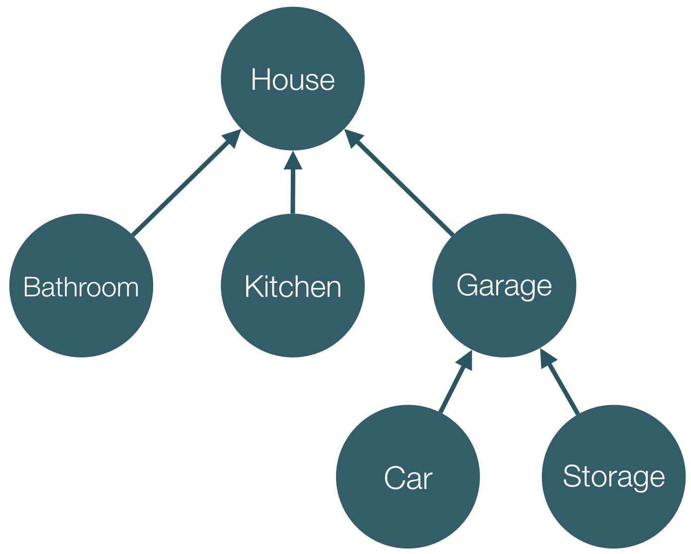

# 第五章，角度依赖注入

在本章中，我们将解释如何利用框架的**依赖注入**（**DI**）机制及其各种特性。

我们将探讨以下主题：

*   配置和创建喷油器。
*   使用注入器实例化对象。
*   通过这种方式将依赖项注入到指令和组件中，我们将能够重用服务中定义的业务逻辑，并将其与 UI 逻辑连接起来。
*   注释 ES5 代码，以获得与使用 TypeScript 语法时完全相同的结果。

# 我为什么需要 DI？

假设我们有一个依赖于`Engine`和`Transmission`类的`Car`类。我们如何实施这一制度？让我们来看一看：

```ts
class Engine {...} 

class Transmission {...}

class Car { 
  engine; 
  transmission;

  constructor() { 
    this.engine = new Engine(); 
    this.transmission = new Transmission(); 
  } 
} 

```

在前面的示例中，我们在其构造函数中创建了`Car`类的依赖项。虽然它看起来很简单，但它远没有灵活性。每次我们创建`Car`类的实例时，在其构造函数中，都会创建相同`Engine`和`Transmission`类的实例。这可能是有问题的，原因如下：

*   `Car`类的可测试性较差，因为我们无法独立于其`engine`和`transmission`依赖项对其进行测试。
*   我们将`Car`类与用于实例化其依赖项的逻辑相耦合。

# 角度上的 DI

另一种方法是利用 DI 模式。我们已经从 AngularJS 那里熟悉了它；让我们演示如何在以下上下文中使用 DI 重构前面的代码：

```ts
class Engine {...} 
class Transmission {...} 

@Injectable() 
class Car { 
  engine; 
  transmission;

  constructor(engine: Engine, transmission: Transmission) { 
    this.engine = engine; 
    this.transmission = transmission; 
  } 
} 

```

在前面的代码片段中，我们所做的只是在`Car`类的定义之上添加`@Injectable`类装饰器，并为其构造函数的参数提供类型注释。

## 直接投资的好处

还有一个步骤，我们将在下一节中查看。在此之前，让我们来看看所提到的方法的好处是什么：

*   我们可以很容易地将`Car`类的依赖项的不同版本传递给测试环境，或者用于实例化不同的`Car`模型。
*   我们没有与依赖项实例化的逻辑相耦合。

`Car`类只负责实现其自己的特定于域的逻辑，而不是与其他功能（如管理其依赖项）耦合。我们的代码也变得更具声明性，更易于阅读。

现在，我们已经认识到了 DI 的一些好处，让我们看看缺失的部分，以便使这个代码工作。

# 配置喷油器

用于通过框架的 DI 机制实例化角度应用程序中各个依赖项的原语称为**注入器**。注入器包含一组**提供程序**，它们封装了与**令牌**相关联的已注册依赖项的实例化逻辑。我们可以将令牌看作是注入器中注册的不同提供者的标识符。

让我们看一下下面的片段，它位于

```ts
import 'reflect-metadata';
import {
  ReflectiveInjector,
  Inject,
  Injectable,
  OpaqueToken
} from '@angular/core';

const BUFFER_SIZE = new OpaqueToken('buffer-size');

class Buffer {
  constructor(@Inject(BUFFER_SIZE) private size: Number) {
    console.log(this.size);
  }
}

@Injectable()
class Socket {
  constructor(private buffer: Buffer) {}
}

let injector = ReflectiveInjector.resolveAndCreate([
  { provide: BUFFER_SIZE, useValue: 42 },
  Buffer,
  Socket
]);

injector.get(Socket);

```

可以使用以下命令运行该文件：

```ts
$ cd app
$ ts-node ch5/ts/injector-basics/injector.ts

```

如果您尚未安装`ts-node`，请查看[第 3 章](3.html "Chapter 3. TypeScript Crash Course")、*打字脚本速成班*，其中解释了如何继续安装，以便在您的计算机上运行它。

然后我们进口`ReflectiveInjector`、`Injectable`、`Inject`、`OpaqueToken`和`provide`。

Injector 表示用于实例化不同依赖项的抽象**容器**；`ReflectiveInjector`是一个具体的类，它实现了这个抽象。使用像声明的规则一样的规则，`ReflectiveInjector`知道如何创建不同的依赖项，并将对象文本作为第一个参数传递给`resolveAndCreate`和由 TypeScript 编译器生成的元数据。

在前面的代码片段中，我们首先定义了`BUFFER_SIZE`常量并将其设置为`new OpaqueToken('buffer-size')`值。我们可以将`BUFFER_SIZE`的值视为一个在应用程序中无法复制的唯一值（`OpaqueToken`是 ES2015 中`Symbol`类的替代，因为在编写本书时，TypeScript 不支持它）。

我们定义了两个类：`Buffer`和`Socket`。`Buffer`类有一个构造函数，它只接受一个名为`size`的依赖项，该依赖项属于`Number`类型。为了为依赖项解析过程添加额外的元数据，我们使用了`@Inject`参数 decorator。此装饰器接受我们要注入的依赖项的标识符（也称为**令牌**。通常，它是依赖项的类型（即类的引用），但在某些情况下，它可以是不同类型的值。例如，在本例中，我们使用了`OpaqueToken`类的实例。

## 使用生成的元数据进行依赖关系解析

现在，让我们来看看 AutoT0.类。我们用`@Injectable`装饰师来装饰它。这个装饰器应该被任何接受依赖项的类使用，这些依赖项应该通过 Angular 的 DI 机制注入。

[T0]装饰器强制 TypeScript 编译器为给定类接受的依赖项类型生成额外的元数据。这意味着，如果我们省略`@Injectable`装饰符，Angular 的 DI 机制将不会知道与它需要解析的依赖项相关联的标记。

如果类顶部没有使用装饰器，TypeScript 不会生成任何元数据，主要是出于性能考虑。想象一下，如果在本例中为每个接受依赖项的单独类生成了这样的元数据，那么输出将因未使用的其他类型元数据而膨胀。

使用`@Injectable`的替代方法是使用`@Inject`装饰器显式声明依赖项的标记。请看以下内容：

```ts
class Socket {
  constructor(@Inject(Buffer) private buffer: Buffer) {}
}

```

这意味着前面的代码与前面提到的使用`@Injectable`的代码具有相同的语义。唯一的区别是 Angular 将显式地（直接从[T1]装饰器添加的元数据中）获取依赖项的类型（即与之关联的令牌），而不是使用[T2]的情况，此时它将查看编译器生成的元数据。

## 实例化喷油器

现在，让我们创建一个注入器实例，以便将其用于已注册令牌的实例化：

```ts
let injector = ReflectiveInjector.resolveAndCreate([ 
  { provide: BUFFER_SIZE, useValue: 42 }, 
  Buffer, 
  Socket 
]); 

```

我们使用名为`resolveAndCreate`的静态方法创建`ReflectiveInjector`的实例。这是一个工厂方法，它接受提供程序数组作为参数，并返回一个新的[T2]。

`resolve`表示提供者将经历一个解析过程，该过程包括一些内部处理（将多个嵌套数组展平，并将单个提供者转换为一个数组）。稍后，注入器可以根据提供程序封装的规则实例化我们已注册提供程序的任何依赖项。

在我们的例子中，通过提供者的声明，我们明确地告诉 Angular 的 DI 机制在需要[T1]令牌时使用值[T0]。其他两个提供者是隐式的。Angular 将通过调用提供的类和[T2]操作符来实例化它们，一旦它们的所有依赖项都解决了。

我们在`Buffer`类的构造函数中请求`BUFFER_SIZE`值：

```ts
class Buffer { 
  constructor(@Inject(BUFFER_SIZE) private size: Number) { 
    console.log(this.size); 
  } 
} 

```

在前面的示例中，我们使用了`@Inject`参数修饰符。它提示 DI 机制，`Buffer`类构造函数的第一个参数应该与传递给注入器的`BUFFER_SIZE`令牌关联的提供程序一起实例化。

## 引入正向参考文献

Angular 引入了**正向参考**的概念。由于以下原因，需要进行此操作：

*   ES2015 等级未吊装。
*   允许解析在声明依赖提供程序之后声明的依赖项。

在本节中，我们将解释正向引用解决的问题以及我们可以利用它们的方式。

现在，假设我们以相反的顺序定义了`Buffer`和`Socket`类：

```ts
// ch5/ts/injector-basics/forward-ref.ts 

@Injectable() 
class Socket { 
  constructor(private buffer: Buffer) {...} 
} 

// undefined 
console.log(Buffer); 

class Buffer { 
  constructor(@Inject(BUFFER_SIZE) private size: Number) {...} 
} 

// [Function: Buffer] 
console.log(Buffer); 

```

这里，我们的依赖项与前面示例中的依赖项完全相同，但在本例中，`Socket`类定义先于`Buffer`类定义。注意，`Buffer`标识符的值将等于`undefined`，直到 JavaScript 虚拟机评估`Buffer`类的声明。但是，`Socket`接受的依赖项类型的元数据将生成并放置在`Socket`类定义之后。这意味着，在解释生成的 JavaScript 时，`Buffer`标识符的值将等于`undefined`——也就是说，作为一种依赖类型（或在 Angular 的 DI 机制的上下文中，其标记），框架将获得一个无效值。

运行前面的代码段将导致以下形式的运行时错误：

****错误：无法解析套接字的所有参数（未定义）。确保它们都具有有效的类型或批注。****

解决此问题的最佳方法是以正确的顺序交换定义。另一种方法是利用 Angular 提供的解决方案—正向参考：

```ts
... 
import {forwardRef} from '@angular/core'; 
...

@Injectable() 
class Socket { 
  constructor(@Inject(forwardRef(() => Buffer)) 
    private buffer: Buffer) {} 
}

class Buffer {...} 

```

前面的代码片段演示了如何利用正向引用。我们所需要做的就是用参数调用`forwardRef`函数的结果来调用`@Inject`参数修饰符。`forwardRef`函数是一个高阶函数，它接受一个参数，另一个函数负责返回与需要注入的依赖项（或更准确地说与其提供程序关联的）关联的令牌。通过这种方式，框架提供了一种延迟解析依赖项类型（标记）的过程的方法。

依赖项的令牌将在第一次需要实例化`Socket`时解析，这与默认行为不同，在默认行为中，在声明给定类时需要令牌。

## 配置提供者

现在，让我们来看一个类似于前面使用的例子，但是喷射器的配置不同：

```ts
let injector = ReflectiveInjector.resolveAndCreate([ 
  { provide: BUFFER_SIZE, useValue: 42 }, 
  { provide: Buffer, useClass: Buffer }, 
  { provide: Socket, useClass: Socket } 
]); 

```

在本例中，在提供者内部，我们显式声明我们希望`Buffer`类用于构建依赖关系，其令牌等于`Buffer`类的引用。我们对与`Socket`标记相关联的依赖项执行完全相同的操作；但是，这一次，我们提供了`Socket`类。这就是当我们省略显式提供者声明而只传递对类的引用时，Angular 将如何处理。

显式声明用于创建同一类的实例的类可能看起来毫无价值，考虑到目前为止我们已经看过的示例，这是完全正确的。但是，在某些情况下，我们可能希望为与给定类标记关联的依赖项的实例化提供不同的类。

例如，假设我们有一个名为`UserService`的服务中使用的`Http`服务：

```ts
class Http {...} 

@Injectable() 
class UserService { 
  constructor(private http: Http) {} 
} 

let injector = ReflectiveInjector.resolveAndCreate([ 
  UserService, 
  Http 
]); 

```

`UserService`服务使用`Http`与 RESTful 服务进行通信。我们可以使用`injector.get(UserService)`实例化`UserService`。这样，注入器的`get`方法调用的`UserService`构造函数将接受`Http`服务的实例作为参数。然而，如果我们想测试`UserService`，我们实际上不需要对 RESTful 服务进行 HTTP 调用。在单元测试的情况下，我们可以提供一个只会伪造这些 HTTP 调用的虚拟实现。为了向`UserService`服务注入不同类的实例，我们可以将注入器的配置更改为：

```ts
class DummyHttp {...} 

// ... 

let injector = ReflectiveInjector.resolveAndCreate([ 
  UserService, 
  { provide: Http, useClass: DummyHttp } 
]); 

```

现在，当我们实例化`UserService`时，它的构造函数将收到对`DummyHttp`服务实例的引用。此代码可在`ch5/ts/configuring-providers/dummy-http.ts`上找到。

### 使用现有提供商

另一种方法是使用提供者的配置对象的`useExisting`属性：

```ts
// ch5/ts/configuring-providers/existing.ts 
let injector = ReflectiveInjector.resolveAndCreate([ 
  DummyService, 
  { provide: Http, useExisting: DummyService }, 
  UserService 
]); 

```

在前面的代码片段中，我们注册了三个标记：`DummyService`、`UserService`和`Http`。我们声明要将`Http`令牌绑定到现有令牌`DummyService`。这意味着，当请求`Http`服务时，注入器将找到用作`useExisting`属性值的令牌的提供者，并对其进行实例化或获取与之关联的值。我们可以将`useExisting`视为创建给定令牌的别名：

```ts
let dummyHttp = { 
  get() {}, 
  post() {} 
}; 
let injector = ReflectiveInjector.resolveAndCreate([ 
  { provide: DummyService, useValue: dummyHttp }, 
  { provide: Http, useExisting: DummyService }, 
  UserService 
]); 
console.assert(injector.get(UserService).http === dummyHttp); 

```

前面的代码段将创建`Http`令牌到`DummyHttp`令牌的别名。这意味着一旦请求了`Http`令牌，呼叫将转发给与`DummyHttp`令牌关联的提供商，该提供商将解析为`dummyHttp`值。

# 为实例化服务定义工厂

现在，假设我们想要创建一个复杂的对象，例如，一个表示**传输层安全**（**TLS**连接的对象。此类对象的一些属性是套接字、一组加密协议和证书。在这个问题的背景下，到目前为止我们所研究的角度的 DI 机制的特征似乎有点有限。

例如，我们可能需要配置`TLSConnection`类的一些属性，而无需将其实例化过程与所有配置细节耦合（选择适当的加密算法，打开 TCP 套接字，在其上建立安全连接，等等）。

在这种情况下，我们可以利用提供者的配置对象的`useFactory`属性：

```ts
let injector = ReflectiveInjector.resolveAndCreate([ 
  { 
    provide: TLSConnection, 
    useFactory: (socket: Socket, certificate: Certificate, crypto: Crypto) 
      =>  { 
        let connection = new TLSConnection(); 
        connection.certificate = certificate; 
        connection.socket = socket; 
        connection.crypto = crypto; 
        socket.open(); 
        return connection; 
      }, 
      deps: [Socket, Certificate, Crypto] 
  }, 
  { BUFFER_SIZE, useValue: 42 }, 
  Buffer, 
  Socket, 
  Certificate, 
  Crypto 
]); 

```

前面的片段看起来有点复杂，但是让我们一步一步地看一看。我们可以从我们已经熟悉的部分开始：

```ts
let injector = ReflectiveInjector.resolveAndCreate([ 
  ... 
  { BUFFER_SIZE, useValue: 42 }, 
  Buffer, 
  Socket, 
  Certificate, 
  Crypto 
]); 

```

最初，我们注册了许多提供商：`Buffer`、`Socket`、`Certificate`和`Crypto`。与前面的示例一样，我们也注册了`BUFFER_SIZE`标记并将其与值`42`关联。这意味着我们已经可以创建`Buffer`、`Socket`、`Certificate`和`Crypto`类型的对象，如下所示：

```ts
// buffer with size 42 
console.log(injector.get(Buffer)); 
// socket with buffer with size 42 
console.log(injector.get(Socket)); 

```

我们可以通过以下方式创建和配置`TLSConnection`对象的实例：

```ts
let connection = new TLSConnection();
connection.certificate = certificate;
connection.socket = socket;
connection.crypto = crypto;
socket.open();
return connection;

```

现在，如果我们注册一个具有`TLSConnection`令牌作为依赖项的提供者，我们将阻止 Angular 的 DI 机制处理依赖项解析过程。为了处理这个问题，我们可以使用提供者的配置对象的`useFactory`属性。通过这种方式，我们可以指定一个函数，在该函数中，我们可以手动创建与提供者令牌关联的对象实例。我们可以使用`useFactory`属性和`deps`属性来指定要传递给工厂的依赖项：

```ts
{
  provide: TLSConnection,
  useFactory: (socket: Socket, certificate: Certificate, crypto: Crypto) =>  { 
    // ... 
  }, 
  deps: [Socket, Certificate, Crypto] 
}

```

在前面的代码片段中，我们定义了用于实例化`TLSConnection`的工厂函数。作为依赖项，我们声明`Socket`、`Certificate`和`Crypto`。这些依赖关系由 Angular 的 DI 机制解决，并注入工厂函数。您可以查看整个实现并在`ch5/ts/configuring-providers/factory.ts`中使用它。

# 儿童注射器及可见度

在本节中，我们将了解如何构建喷油器的层次结构。这是 Angular 2 引入的框架中的一个全新概念。每个喷油器可以有零个或一个主喷油器，每个主喷油器可以有零个或多个子喷油器。与 AngularJS 不同，AngularJS 将所有注册的提供者存储在平面结构中，而 Angular2 和更高版本中，它们存储在树中。平面结构较为有限；例如，它不支持令牌的名称空间；我们不能为同一令牌声明不同的提供者，这在某些情况下可能是必需的。到目前为止，我们已经看到了一个没有任何子项或父项的注入器示例。现在，让我们构建喷油器的层次结构。

为了更好地理解这种喷射器的层次结构，我们来看看下面的图表：



图 1

这里，我们看到一个树，其中每个节点都是一个注入器，每个注入器都保留一个对其父节点的引用。注射器**房**有三个儿童注射器：**浴室**、**厨房**和**车库**。

**车库**有两个儿童注射器：**汽车**和**仓库**。我们可以将这些注射器视为容器，其中包含注册供应商。

假设我们想要获取与令牌**轮胎**相关联的提供者的值。如果我们使用注入器**汽车**，这意味着 Angular 的 DI 机制将尝试在**汽车**及其所有父代**车库**和**房屋**中找到与此令牌相关的提供者，直到找到为止。

## 建立喷油器的层次结构

为了更好地理解段落，让我们来看看这个简单的例子：

```ts
// ch5/ts/parent-child/simple-example.ts

class Http {} 

@Injectable() 
class UserService { 
  constructor(public http: Http) {} 
} 

let parentInjector = ReflectiveInjector.resolveAndCreate([ 
  Http
]);

let childInjector = parentInjector.resolveAndCreateChild([ 
  UserService
]);

// UserService { http: Http {} }
console.log(childInjector.get(UserService)); 
// true 
console.log(childInjector.get(Http) === parentInjector.get(Http)); 

```

导入被省略，因为它们不是解释代码所必需的。我们有两种服务，`Http`和`UserService`，其中`UserService`依赖于`Http`服务。

最初，我们使用`ReflectiveInjector`类的`resolveAndCreate`静态方法创建一个注入器。我们将一个隐式提供程序传递给这个注入器，该注入器稍后将解析为一个带有`Http`令牌的提供程序。使用`resolveAndCreateChild`解析传递的提供者并实例化一个注射器，它指向`parentInjector`（因此，我们得到的关系与上图中所示的**车库**和**房屋**之间的关系相同）。

现在，使用`childInjector.get(UserService)`，我们可以获得与`UserService`令牌相关联的值。类似地，使用`childInjector.get(Http)`和`parentInjector.get(Http)`，我们得到与`Http`标记相关联的相同值。这意味着`childInjector`向其父代请求与请求的令牌关联的值。

但是，如果我们尝试使用`parentInjector.get(UserService)`，我们将无法获取与令牌关联的值，因为其提供者已在`childInjector`中注册。

## 配置依赖项

现在我们已经熟悉了注入器的层次结构，让我们看看如何从其中适当的注入器获取依赖关系。

### 使用@Self decorator

现在，假设我们有以下配置：

```ts
abstract class Channel {}

class Http extends Channel {}

class WebSocket extends Channel {} 

@Injectable() 
class UserService { 
  constructor(public channel: Channel) {} 
} 

let parentInjector = ReflectiveInjector.resolveAndCreate([ 
  { provide: Channel, useClass: Http } 
]);

let childInjector = parentInjector.resolveAndCreateChild([ 
  { provide: Channel, useClass: WebSocket }, 
  UserService 
]); 

```

我们可以使用以下方法实例化`UserService`令牌：

```ts
childInjector.get(UserService); 

```

在`UserService`中，我们可以声明我们想要使用`@Self`装饰器从当前注入器（即`childInjector`中获取`Channel`依赖关系：

```ts
@Injectable() 
class UserService { 
  constructor(@Self() public channel: Channel) {} 
} 

```

虽然这将是`UserService`实例化过程中的默认行为，但是使用`@Self`，我们可以更加明确。假设我们将`childInjector`的配置更改为：

```ts
let parentInjector = ReflectiveInjector.resolveAndCreate([ 
  { provide: Channel, useClass: Http } 
]);

let childInjector = parentInjector.resolveAndCreateChild([ 
  UserService 
]); 

```

如果我们在`UserService`构造函数中保留`@Self`修饰符，并尝试使用`childInjector`实例化`UserService`，我们将得到一个运行时错误，因为`Channel`缺少提供程序。

### 跳过自喷射器

在某些情况下，我们可能希望使用在父注入器中注册的提供程序，而不是在当前注入器中注册的提供程序。我们可以利用`@SkipSelf`装饰器来实现这种行为。例如，假设我们对`Context`类有以下定义：

```ts
class Context { 
  constructor(public parentContext: Context) {} 
} 

```

`Context`类的每个实例都有一个父类。现在，让我们构建一个由两个注入器组成的层次结构，这将允许我们创建一个具有父上下文的上下文：

```ts
let parentInjector = ReflectiveInjector.resolveAndCreate([ 
  { provide: Context, useValue: new Context(null) } 
]);

let childInjector = parentInjector.resolveAndCreateChild([ 
  Context 
]); 

```

由于根上下文没有父上下文，我们将其提供程序的值设置为`new Context(null)`。

如果要实例化子上下文，可以使用：

```ts
childInjector.get(Context); 

```

对于子级的实例化，`Context`将由`childInjector`中注册的提供者使用。但是，作为一个依赖项，它接受一个作为`Context`类实例的对象。这样的类存在于同一个注入器中，这意味着 Angular 将尝试实例化它，但它具有`Context`类型的依赖关系。此过程将导致无限循环，从而导致运行时错误。

为了防止这种情况发生，我们可以通过以下方式更改`Context`的定义：

```ts
class Context { 
  constructor(@SkipSelf() public parentContext: Context) {} 
} 

```

我们引入的唯一更改是添加了参数 decorator`@SkipSelf`。

### 具有可选依赖项

Angular 2 引入了`@Optional`decorator，它允许我们处理没有注册提供者关联的依赖项。让我们假设提供者的依赖项在负责其实例化的任何目标注入器中都不可用。如果我们使用`@Optional`修饰符，在依赖提供程序的实例化过程中，缺少的依赖项的值将被传递`null`。

现在，让我们来看看下面的例子：

```ts
abstract class SortingAlgorithm { 
  abstract sort(collection: BaseCollection): BaseCollection; 
} 

@Injectable() 
class Collection extends BaseCollection { 
  private sort: SortingAlgorithm;

  constructor(sort: SortingAlgorithm) { 
    super(); 
    this.sort = sort || this.getDefaultSort(); 
  } 
} 

let injector = ReflectiveInjector.resolveAndCreate([ 
  Collection 
]); 

```

在本例中，我们定义了一个名为`SortingAlgorithm`的抽象类和一个名为`Collection`的类，该类接受一个具体类的实例作为扩展`SortingAlgorithm`的依赖项。在`Collection`构造函数中，我们将`sort`实例属性设置为`SortingAlgorithm`类型的传递依赖项或默认排序算法实现。

我们在配置的注入器中没有为[T0]令牌定义任何提供者。因此，如果我们想使用`injector.get(Collection)`获取`Collection`类的实例，我们将得到一个运行时错误。这意味着，如果我们想使用框架的 DI 机制获取`Collection`类的实例，我们必须注册`SortingAlgorithm`令牌的提供者，尽管我们可能希望回到`getDefaultSort`方法返回的默认排序算法。

Angular 通过`@Optional`装饰器提供了此问题的解决方案。这就是我们如何使用 it 解决问题的方法：

```ts
// ch5/ts/decorators/optional.ts

@Injectable() 
class Collection extends BaseCollection { 
  private sort: SortingAlgorithm;

  constructor(@Optional() sort: SortingAlgorithm) { 
    super(); 
    this.sort = sort || this.getDefaultSort(); 
  } 
} 

```

在前面的代码片段中，我们将`sort`依赖项声明为可选的，这意味着如果 Angular 没有找到其令牌的任何提供者，它将传递`null`值。

### 使用多供应商

多供应器是第 2 版中引入到角度传感器 DI 机制的另一个新概念。它们允许我们将多个提供者与同一令牌相关联。如果我们正在开发一个第三方库，该库附带了不同服务的一些默认实现，但是您希望允许用户使用自定义的实现来扩展它，那么这将非常有用。它们还专门用于声明 Angular 表单模块中单个控件的多个验证。我们将在[第 6 章](6.html "Chapter 6. Working with the Angular Router and Forms")、*使用角度路由器并形成*和[第 7 章](7.html "Chapter 7. Explaining Pipes and Communicating with RESTful Services")、*解释管道和与 RESTful 服务通信*中解释此模块。

多提供者的另一个适用用例示例是 Angular 在其 Web Workers 实现中用于事件管理的内容。他们为事件管理插件创建多提供者。每个提供者都返回不同的策略，该策略支持不同的事件集（触摸事件、键盘事件等）。一旦给定事件发生，他们可以选择适当的插件来处理它。

让我们来看一个例子，说明了多服务提供者的典型用法：

```ts
// ch5/ts/configuring-providers/multi-providers.ts 
const VALIDATOR = new OpaqueToken('validator'); 

interface EmployeeValidator { 
  (person: Employee): string; 
} 

class Employee {...} 

let injector = ReflectiveInjector.resolveAndCreate([ 
  {
    provide: VALIDATOR, 
    multi: true, 
    useValue: (person: Employee) => { 
      if (!person.name) { 
        return 'The name is required'; 
      } 
    } 
  },
  {
    provide: VALIDATOR, 
    multi: true, 
    useValue: (person: Employee) => { 
      if (!person.name || person.name.length < 1) { 
        return 'The name should be more than 1 symbol long'; 
      } 
    } 
  },
  Employee 
]); 

```

在前面的代码片段中，我们声明了一个名为`VALIDATOR`的常量，并将其值设置为`OpaqueToken`的新实例。我们还创建了一个注入器，在其中注册了三个提供程序，其中两个提供了基于不同标准的函数，用于验证类`Employee`的实例。这些功能属于`EmployeeValidator`类型。

为了声明我们希望注入器将所有注册的验证器传递给`Employee`类的构造函数，我们需要使用以下构造函数定义：

```ts
class Employee { 
  name: string;

  constructor(@Inject(VALIDATOR) private validators: EmployeeValidator[]) {}

  validate() { 
    return this.validators 
      .map(v => v(this)) 
      .filter(value => !!value); 
  } 
} 

```

在这个例子中，我们声明了一个类`Employee`，它接受一个依赖项：一个`EmployeeValidator`的数组。在方法`validate`中，我们对当前类实例应用各个验证器，并过滤结果，以便仅获取返回错误消息的验证器。

请注意，构造函数参数`validators`属于`EmployeeValidator[]`类型。因为我们不能使用类型“array of objects”作为提供者的标记，因为它在 JavaScript 中不是有效值，不能用作标记，所以我们需要使用`@Inject`参数 decorator。

## 将 DI 与组件和指令一起使用

在[第 4 章](4.html "Chapter 4. Getting Started with Angular Components and Directives")*开始使用 Angular 组件和指令*中，当我们开发第一个 Angular 指令时，我们看到了如何利用 DI 机制将服务注入到我们的 UI 相关组件（即指令和组件）中。

让我们来看看我们之前做过什么，但是从 DI 的角度来看：

```ts
// ch4/ts/tooltip/app.ts

// ... 
@Directive(...) 
export class Tooltip { 
  @Input() saTooltip: string; 

  constructor(private el: ElementRef, private overlay: Overlay) { 
    this.overlay.attach(el.nativeElement); 
  } 
  // ... 
}

@Component({ 
  // ... 
  providers: [Overlay]
}) 
class App {} 

```

早期实现中的大部分代码被省略，因为它与我们当前的关注点没有直接关系。

注意，`Tooltip`的构造函数接受两个依赖项：

*   [T0]类的一个实例。
*   [T0]类的一个实例。

依赖项的类型是与它们的提供者相关联的令牌，从提供者获得的相应值将被注入 Angular 的 DI 机制。

尽管`Tooltip`类的依赖项声明看起来与我们在前面几节中所做的完全相同，但注入器既没有任何显式配置，也没有任何实例化。在这种情况下，Angular 在内部创建并配置所谓的**元件注入器**。稍后我们将对此进行解释，但在此之前，让我们看看如何使用 NgModules 配置 DI 机制。

## 使用 NGDI 模块配置 DI

我们已经在[第 2 章](2.html "Chapter 2. The Building Blocks of an Angular Application")、*角度应用程序的构建块*和[第 4 章](4.html "Chapter 4. Getting Started with Angular Components and Directives")、*角度组件和指令入门*中讨论了 NgModules。我们提到，它们帮助我们将应用程序划分为逻辑部分；我们还讨论了如何使用 NgModules 的导入和导出。在本节中，我们将简要概述如何使用它们来配置应用程序的提供者。

根据给定模块中声明的提供者，Angular 将实例化喷油器。此注入器将管理我们传递给`@NgModule`装饰器的对象文本的`providers`属性中列出的所有提供程序：

```ts
class Markdown {...}

@Component(...)
class MarkdownPanel {...}

@Component(...)
class App {...}

@NgModule({
  declarations: [App, MarkdownPanel],
  providers: [Markdown],
  imports: [BrowserModule],
  bootstrap: [App],
})
class AppModule {}

platformBrowserDynamic().bootstrapModule(AppModule);
```

在前面的示例中，我们为`Markdown`服务声明了一个提供者。它将在`declarations`阵列中列出的所有组件和指令中可用，因为顶级组件使用的喷油器将通过 NgModule 配置为其父喷油器。

现在，假设我们的模块导入另一个具有提供者声明的模块：

```ts
// ch4/ts/directives-ngmodules/app.ts
// ...
@NgModule({
  declarations: [Button],
  exports: [Button],
  providers: [Markdown],
})
class ButtonModule {}

//...

@NgModule({
  declarations: [App, MarkdownPanel],
  imports: [BrowserModule, ButtonModule],
  bootstrap: [App],
})
class AppModule {}

platformBrowserDynamic().bootstrapModule(AppModule);
```

在这个例子中，我们有两个模块–我们之前看到的`AppModule`和`ButtonModule`。在片段`AppModule`中导入`ButtonModule`，这意味着`ButtonModule`的所有导出都将作为`AppModule`中的声明提供。除此之外，`ButtonModule`中声明的提供程序将与`AppModule`的提供程序合并。Angular 将基于所有这些提供程序实例化一个注入器，并将其设置为引导组件`App`使用的注入器的父注入器。

现在，让我们讨论与每个组件和指令关联的元素注入器。

## 引入元件注入器

在引擎盖下，Angular 将为所有指令和组件创建喷油器，并向其添加一组默认的提供程序。这些是所谓的**元素注入器**，是框架自行处理的东西。与部件相关的喷油器称为**主喷油器**。每个元素注入器中的一个提供者与`ElementRef`令牌相关联；它将返回对指令的主机元素的引用。但是，声明的`Overlay`类的提供程序在哪里？让我们看一下顶层组件的实现：

```ts
@Component({ 
  // ... 
  providers: [Overlay]
})
class App {} 

```

我们通过在`@Component`装饰器中声明`providers`属性来为`App`组件配置元素注入器。此时，注册的提供程序将由指令或与相应元素注入器关联的组件以及组件的整个组件子树可见，除非它们在层次结构中的某个位置被重写。

### 声明元素的提供程序

将所有提供者的声明放在同一个地方可能会很不方便。例如，假设我们正在开发一个大型应用程序，它有数百个组件，依赖于数千个服务。在这种情况下，配置根组件中的所有提供程序不是一个实用的解决方案。当两个或多个提供程序与同一令牌关联时，将出现名称冲突。配置将是巨大的，并且很难跟踪需要注入不同依赖项的位置。

正如我们提到的，Angular 的`@Directive`（和`@Component`装饰器允许我们使用`providers`属性引入特定于指令的提供者。以下是我们可以采取的方法：

```ts
@Directive({ 
  selector: '[saTooltip]', 
  providers: [{ provide: Overlay, useClass: OverlayMock }] 
}) 
export class Tooltip { 
 @Input() saTooltip: string; 

  constructor(private el: ElementRef, private overlay: Overlay) { 
    this.overlay.attach(el.nativeElement); 
  } 
  // ... 
} 

// ... 

platformBrowserDynamic().bootstrapModule(AppModule);

```

前面的示例覆盖了[T1]指令声明中的[T0]令牌的提供程序。这样，Angular 将在工具提示的实例化过程中注入一个`OverlayMock`而不是`Overlay`的实例。

### 用组件探索 DI

由于组件通常是带有视图的指令，因此到目前为止，我们所看到的关于 DI 机制如何与指令一起工作的一切对于组件也是有效的。然而，由于组件提供的额外功能，我们可以进一步控制它们的提供者。

如前所述，与每个部件相关联的喷油器将标记为**主机**喷油器。有一个名为`@Host`的参数修饰符，它允许我们从任何注入器检索给定的依赖项，直到它到达最近的主机注入器。这意味着，使用指令中的`@Host`装饰符，我们可以声明我们希望从当前注入器或任何父注入器检索给定的依赖项，直到我们到达最近父组件的注入器。

添加到`@Component`装饰器的`viewProviders`属性负责实现更多的控制。

### 视图提供者与提供者

让我们来看看一个名为 AuthT0}的组件的例子。该组件将按以下方式使用：

```ts
<markdown-panel> 
  <panel-title># Title</pane-title> 
  <panel-content> 
# Content of the panel 
* First point 
* Second point 
  </panel-content> 
</markdown-panel> 

```

面板每个部分的内容将从标记转换为 HTML。我们可以将此功能委托给名为`Markdown`的服务：

```ts
import * as markdown from 'markdown';

class Markdown { 
  toHTML(md) { 
    return markdown.toHTML(md); 
  } 
} 

```

`Markdown`服务包装`markdown`模块，以便通过 DI 机制将其注入。

现在让我们实施`MarkdownPanel`。

在下面的代码片段中，我们可以找到组件实现的所有重要细节：

```ts
// ch5/ts/directives/app.ts 
@Component({ 
  selector: 'markdown-panel', 
  viewProviders: [Markdown], 
  styles: [...], 
  template: ` 
    <div class="panel"> 
      <div class="panel-title"> 
        <ng-content select="panel-title"></ng-content> 
      </div> 
      <div class="panel-content"> 
        <ng-content select="panel-content"></ng-content> 
      </div> 
    </div>` 
}) 
class MarkdownPanel { 
  constructor(private el: ElementRef, private md: Markdown) {}

  ngAfterContentInit() { 
    let el = this.el.nativeElement; 
    let title = el.querySelector('panel-title'); 
    let content = el.querySelector('panel-content'); 
    title.innerHTML = this.md.toHTML(title.innerHTML); 
    content.innerHTML = this.md.toHTML(content.innerHTML); 
  } 
} 

```

在`@Component`装饰器中，我们使用`markdown-panel`选择器并设置`viewProviders`属性。在这种情况下，只有一个视图提供者：`Markdown`服务的提供者。通过设置此属性，我们声明其中声明的所有提供程序都可以从组件本身及其所有**视图子项**访问。

现在，假设我们有一个名为`MarkdownButton`的组件，我们希望通过以下方式将其添加到模板中：

```ts
<markdown-panel> 
  <panel-title>### Small title</panel-title> 
  <panel-content> 
    Some code 
  </panel-content> 
  <markdown-button>*Click to toggle*</markdown-button> 
</markdown-panel> 

```

`panel-content`元素下方使用的`MarkdownButton`将无法访问`Markdown`服务；但是，如果使用组件模板中的按钮，则可以访问：

```ts
@Component({ 
  selector: 'markdown-panel', 
  viewProviders: [Markdown], 
  styles: [...], 
  template: ` 
    <div class="panel"> 
      <markdown-button>*Click to toggle*</markdown-button> 
      <div class="panel-title"> 
        <ng-content select="panel-title"></ng-content> 
      </div> 
      <div class="panel-content"> 
        <ng-content select="panel-content"></ng-content> 
      </div> 
    </div>` 
}) 

```

如果我们需要提供者在所有内容和视图子项中可见，那么我们所要做的就是将属性的名称`viewProviders`更改为`providers`。

您可以在`ch5/ts/directives/app.ts`的示例目录中找到此示例。

### 注

请注意，对于任何组件或指令，我们都可以使用传递给`@Component`或`@Directive`修饰符的对象文本的`providers`属性重写 NgModule 中声明的现有提供程序。如果我们只想覆盖给定组件的视图子级的特定提供程序，我们可以使用`viewProviders`。

## 将 Angular's DI 与 ES5 结合使用

我们已经熟练地将 Angular 的 DI 与 TypeScript 一起使用了！正如我们所知，我们不局限于用于开发角度应用程序的 TypeScript；我们还可以使用 ES5、ES2015 和 ES2016（以及 Dart，但这超出了本书的范围）。

到目前为止，我们使用标准的 TypeScript 类型注释在构造函数中声明了不同类的依赖关系。所有这些类都应该用`@Injectable`装饰器装饰。不幸的是，Angular 支持的一些其他语言缺少其中的一些特性。在下表中，我们可以看到 ES5 不支持类型注释、类和装饰器：

<colgroup><col> <col> <col> <col></colgroup> 
|  | **ES5** | **ES2015** | **ES2016** |
| **类别** | 不 | 对 | 对 |
| **装饰师** | 不 | 不 | 是（无参数装饰器） |
| **类型标注** | 不 | 不 | 不 |

我们如何利用这些语言中的 DI 机制？Angular 提供了一种内部 JavaScript**领域特定语言**（**DSL**），允许我们利用 ES5 框架的全部功能。

现在，让我们将上一节中介绍的`MarkdownPanel`示例从 TypeScript 转换为 ES5。首先，让我们从`Markdown`服务开始：

```ts
// ch5/es5/simple-example/app.js

var Markdown = ng.core.Class({ 
  constructor: function () {},
  toHTML: function (md) {
    return markdown.toHTML(md); 
  } 
}); 

```

我们定义了一个名为`Markdown`的变量，并将其值设置为调用`ng.core.Class`返回的结果。此构造允许我们使用 ES5 模拟 ES2015 类。`ng.core.Class`方法的参数是一个对象文字，它必须具有`constructor`函数的定义。因此，`ng.core.Class`将从对象文本返回一个主体为`constructor`的 JavaScript 构造函数。在传递参数的边界内定义的所有其他方法将添加到函数的原型中。

解决了一个问题：我们现在可以模拟 ES5 中的类；还有两个问题！

现在，让我们来看看我们如何定义 ToY0T0.组件：

```ts
// ch5/es5/simple-example/app.js 

var MarkdownPanel = ng.core.Component({ 
  selector: 'markdown-panel', 
  viewProviders: [Markdown], 
  styles: [...], 
  template: '...' 
}) 
.Class({ 
  constructor: [Markdown, ng.core.ElementRef, function (md, el) { 
    this.md = md; 
    this.el = el; 
  }], 
  ngAfterContentInit: function () { 
    ... 
  } 
}); 

```

从[第 4 章](4.html "Chapter 4. Getting Started with Angular Components and Directives")*开始学习角度组件和指令*，我们已经熟悉了用于定义组件的 ES5 语法。现在，让我们看一看 OrthT0}的构造函数，以便检查我们如何声明组件和类的依赖关系。

从前面的代码片段中，我们应该注意到，这次构造函数的值不是一个函数，而是一个数组。您可能对 AngularJS 很熟悉，在 AngularJS 中，我们可以通过列出给定服务的依赖项名称来声明它们：

```ts
Module.service('UserMapper', 
  ['User', '$http', function (User, $http) { 
    // ... 
  }]); 

```

尽管新语法看起来很相似，但它带来了一些改进。例如，我们不再局限于使用字符串作为依赖项的标记。

现在，让我们假设我们想要使`Markdown`服务成为可选的依赖项。在这种情况下，我们可以通过传递一个装饰器数组来实现这一点：

```ts
... 
.Class({ 
  constructor: [[ng.core.Optional(), Markdown], 
    ng.core.ElementRef, function (md, el) { 
      this.md = md; 
      this.el = el; 
    }], 
  ngAfterContentInit: function () { 
    ... 
  } 
}); 
... 

```

这样，通过嵌套数组，我们可以应用一系列装饰程序：`[[ng.core.Optional(), ng.core.Self(), Markdown], ...]`。在本例中，`@Optional`和`@Self`修饰符将按照指定的顺序向类添加关联的元数据。

### 注

虽然使用 ES5 使构建更简单，并允许我们跳过透明的中间步骤（这可能很诱人），但 Google 的建议是利用使用 TypeScript 的静态键入。这样，我们就有了更清晰的语法，它以更少的类型携带了更好的语义，并为我们提供了很棒的工具，包括 AoT 编译的简单过程（我们将在本书的最后一章中探讨 Angular 的 AoT）。

# 总结

在这一章中，我们介绍了角速度的 DI 机制。通过在框架的上下文中介绍 DI，我们简要地讨论了在项目中使用 DI 的好处。我们旅程的第二步是如何实例化和配置喷油器；我们还解释了注入器的层次结构和注册提供商的可见性。为了更好地分离关注点，我们提到了如何在指令和组件中注入承载应用程序业务逻辑的服务。最后一点我们看的是如何将 DI 机制与 ES5 语法结合使用。

在下一章中，我们将介绍框架的新路由机制。我们将解释如何配置基于组件的路由器并向应用程序添加多个视图。我们将讨论的另一个重要主题是新表单模块。通过构建一个简单的应用程序，我们将演示如何创建和管理表单。