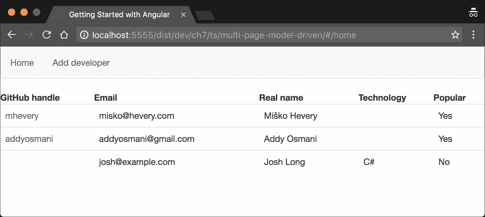
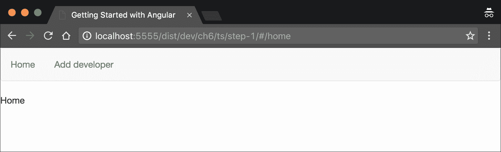
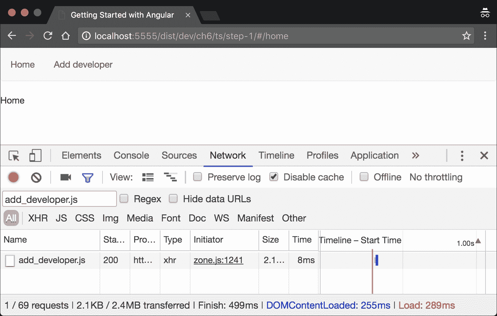
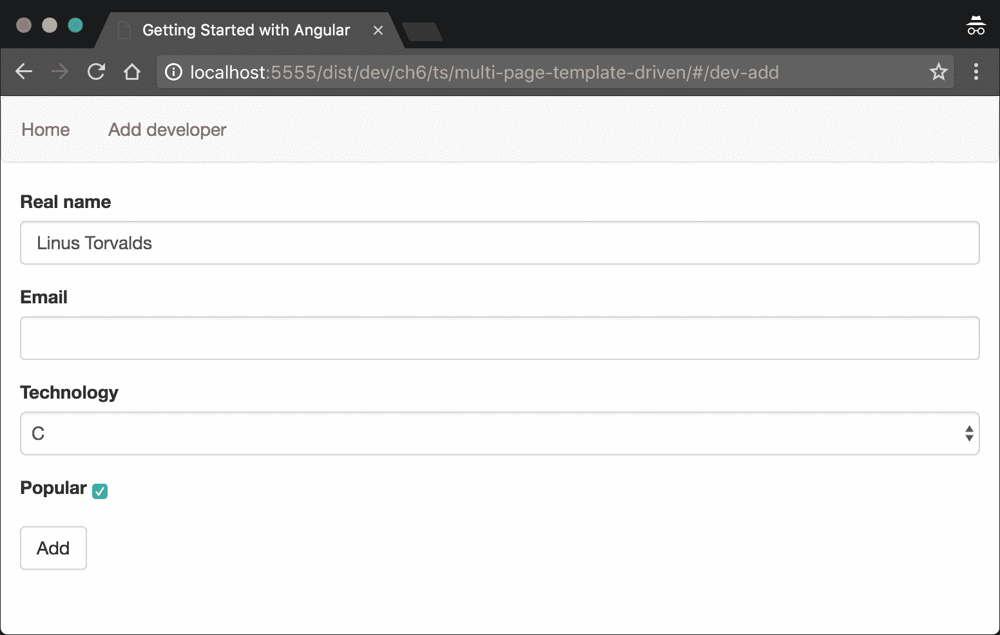
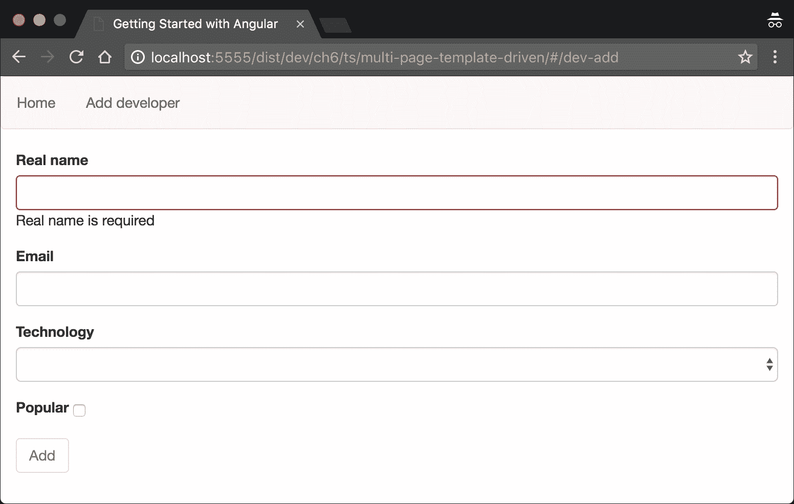
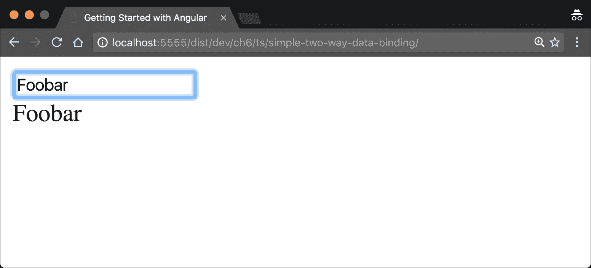
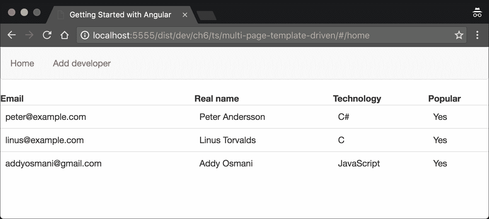

# 第 6 章：使用角度路由器和模板

到目前为止，我们已经熟悉了框架的核心。我们知道如何定义组件和指令，以便开发应用程序的视图。我们还知道如何将业务相关逻辑封装到服务中，并使用 Angular 的 DI 机制将所有内容连接在一起。

在本章中，我们将解释更多的概念，这些概念将帮助我们构建真实的角度应用程序。详情如下:

*   该框架基于组件的路由器。
*   使用 Angular 的 forms 模块。
*   开发自定义表单验证程序。
*   开发模板驱动的表单。

开始吧！

# 开发“编码器存储库”应用程序

在解释所列概念的整个过程中，我们将开发一个包含开发人员存储库的示例应用程序。在开始编码之前，让我们先讨论一下应用程序的结构。

“编码器存储库”将允许其用户添加开发人员，方法可以是填写一个包含开发人员详细信息的表单，或者为开发人员提供 GitHub 句柄并从 GitHub 导入他们的配置文件。

### 注

在本章中，我们将在内存中存储有关开发人员的信息，这意味着在刷新页面后，我们将丢失会话期间存储的所有数据。

应用程序将具有以下视图：

*   所有开发人员的列表。
*   用于添加或导入新开发人员的视图。
*   A view that shows the given developer's details. This view has two subviews:
    *   **基本细节**：显示开发者的姓名及其 GitHub 头像（如果可用）。
    *   **高级配置文件**：显示开发人员已知的所有详细信息。

应用程序主页的最终结果如下所示：



图 1

### 注

在本章中，我们将只构建列出的几个视图。本应用程序的其余部分将在[第 7 章](7.html "Chapter 7. Explaining Pipes and Communicating with RESTful Services")、*解释管道和与 RESTful 服务的通信*中解释。

每个开发人员都是以下类的实例：

```ts
// ch6/ts/multi-page-template-driven/developer.ts

export class Developer { 
  public id: number; 
  public githubHandle: string; 
  public avatarUrl: string; 
  public realName: string; 
  public email: string; 
  public technology: string; 
  public popular: boolean; 
} 

```

所有开发人员都将驻留在`DeveloperCollection`类中：

```ts
// ch6/ts/multi-page-template-driven/developer_collection.ts 

class DeveloperCollection { 
  private developers: Developer[] = [];

  getUserByGitHubHandle(username: string) { 
    return this.developers 
            .filter(u => u.githubHandle === username) 
            .pop(); 
  }

  getUserById(id: number) { 
    return this.developers 
             .filter(u => u.id === id) 
             .pop(); 
  }

  addDeveloper(dev: Developer) { 
    this.developers.push(dev); 
  }

  getAll() { 
    return this.developers; 
  } 
} 

```

这里提到的类封装了一个简单的业务逻辑，没有任何特定的角度，因此我们将不深入讨论任何细节。

现在，让我们通过探索新路由器继续实现。

# 探索角度路由器

正如我们已经知道的，为了引导任何角度的应用程序，我们需要开发根模块和引导组件。“编码器存储库”应用程序没有任何不同；在这种特殊情况下，唯一的补充是，我们将有多个页面需要与角路由器连接在一起。

让我们从路由器配置所需的导入开始，然后定义根组件：

```ts
// ch6/ts/step-0/app.ts

import {
  APP_BASE_HREF,
  LocationStrategy,
  HashLocationStrategy
} from '@angular/common';

import {RouterModule} from '@angular/router';

```

在前面的代码片段中，我们直接从`@angular/router`导入`RouterModule`；正如我们所看到的，路由器是外部化的框架的核心。这个模块声明了所有路由特定的指令，以及所有路由相关的提供程序，这意味着，如果我们导入它，我们将能够访问所有这些提供程序。

`LocationStrategy`类是一个抽象类，定义`HashLocationStrategy`（用于基于哈希的路由）和`PathLocationStrategy`（用于利用历史 API 进行基于 HTML5 的路由）之间的公共逻辑（即对路由器有意义）。

### 注

`HashLocationStrategy`不支持服务器端呈现，因为页面的哈希没有发送到服务器。因为散列是应用程序的视图标识符，所以服务器不会知道需要呈现的页面。幸运的是，除 IE9 之外的所有现代浏览器都支持 HTML5 历史 API。您可以在本书的最后一章中找到有关服务器端渲染的更多信息。

现在，让我们定义一个引导组件并配置应用程序的根模块：

```ts
// ch6/ts/step-0/app.ts

@Component({
  selector: 'app',
  template: `...`,
  providers: [DeveloperCollection]
})
class App {}

const routeModule = RouterModule.forRoot([...]);

@NgModule({
  declarations: [App],
  bootstrap: [App],
  imports: [BrowserModule],

  providers: [{
    provide: LocationStrategy,
    useClass: HashLocationStrategy
  }]
})
class AppModule {}

platformBrowserDynamic().bootstrapModule(AppModule);

```

在前面的片段中，我们可以注意到一个我们已经熟悉的语法，来自[第 4 章](4.html "Chapter 4. Getting Started with Angular Components and Directives")、*Angular Components and Directions 入门*和[第 5 章](5.html "Chapter 5. Dependency Injection in Angular")、*Angular 中的依赖注入*。我们使用`app`选择器`template`定义了一个组件，我们将在后面介绍它，以及一组提供程序和指令。

`App`组件声明一个与`DeveloperCollection`令牌关联的提供程序。这个类包含应用程序存储的所有开发人员。后来我们调用了`RouterModule`的`forRoot`方法；此方法允许我们通过声明应用程序的一些路由来配置路由器。

一旦我们导入了由于调用`forRoot`而返回的模块，我们就可以访问一组指令。这些指令可以帮助我们链接到路由器配置中定义的其他路由（`routerLink`指令），并声明与不同路由关联的组件应该呈现的位置（`router-outlet`。我们将在本节后面解释如何使用它们。

现在，让我们来看看我们的 Ty0T0:

```ts
@NgModule({
  declarations: [App],
  bootstrap: [App],
  imports: [BrowserModule, routeModule],
  providers: [{
    provide: LocationStrategy,
    useClass: HashLocationStrategy
  }]
})
class AppModule {}

```

我们在`App`组件中添加了一个声明，用于引导应用程序。注意，在这里，我们不仅导入了`BrowserModule`，还导入了调用`RouterModule`的`forRoot`方法返回的结果。在`providers`数组中，我们为`LocationStrategy`配置提供程序。Angular 使用的默认`LocationStrategy`实现是`PathLocationStrategy`（即基于 HTML5 的实现）。但是，在本例中，我们将使用基于散列的方法。

当我们必须在两种定位策略之间进行选择时，我们应该记住默认的定位策略（`PathLocationStrategy`由 Angular 的服务器呈现模块支持，并且应用程序的 URL 对于最终用户来说更自然（没有使用`#`。另一方面，如果我们使用`PathLocationStrategy`，我们可能需要配置我们的应用服务器，以便使用 HTML5 历史 API，这对于`HashLocationStrategy`来说是不必要的。

## 使用路径定位策略

`PathLocationStrategy`使用`APP_BASE_HREF`，默认值为字符串`"/"`。这意味着，如果应用程序的基本路径名不同，我们必须显式设置它，以便有一个正常运行的位置策略。例如，在我们的情况下，配置应如下所示：

```ts
import {APP_BASE_HREF} from '@angular/common'; 

//... 
@NgModule({
  ...
  providers: [{
      provide: APP_BASE_HREF,
      useValue: '/dist/dev/ch6/ts/multi-page-template-driven/'
    },
    { provide: LocationStrategy, useClass: HashLocationStrategy }
  ]
})
class AppModule {}

```

`APP_BASE_HREF`表示应用程序的基本路径。例如，在我们的例子中，“编码器存储库”将位于`/dist/dev/ch6/ts/multi-page-template-driven/`目录下（或者，如果我们包括模式和主机，`http://localhost:5555/dist/dev/ch6/ts/multi-page-template-driven/`）。

我们需要提供`APP_BASE_HREF`的值，以便向 Angular 提示路径的哪一部分是应用程序路由（即对路由器有意义）。例如，对于 URL`http://localhost:5555/dist/dev/ch6/ts/multi-page-template-driven/**home**` ，通过使`APP_BASE_HREF`等于`/dist/dev/ch6/ts/multi-page-template-driven/`，Angular 将知道它需要提供与`home`路径相关联的组件，因为 URL 的其余部分与应用程序中声明的路由无关。

## 配置路由

下一步，让我们更新路由声明。打开`ch6/ts/step-0/app.ts`并更新`RouteModule`的`forRoot`方法调用：

```ts
// ch6/ts/step-1/app.ts 

const routingModule = RouterModule.forRoot([
  {
    path: '',
    redirectTo: 'home',
    pathMatch: 'full'
  },
  {
    path: 'home',
    component: Home
  },
  {
    path: 'dev-add',
    component: AddDeveloper
  },
  {
    path: 'add-dev',
    redirectTo: 'dev-add'
  }
]);

```

正如前面的代码片段所示，方法`forRoot`接受路由声明数组作为参数。我们定义了两个重定向和两个路由以及与之相关的组件。

每个非延迟加载的路由必须定义以下属性：

*   `component`：与给定路由关联的组件。
*   `path`：用于路线的路径–它将在浏览器的位置栏中可见。

另一方面，重定向的定义应包含：

*   `path`：用于重定向的路径。
*   `redirectTo`：用户将被重定向到的路径。
*   `pathMatch`：定义匹配策略。

在前面的示例中，我们声明当用户导航到路径时，我们希望将`/add-dev`重定向到`/dev-add`。正如我们所提到的，`pathMatch`定义了路径匹配策略。默认情况下，它的值为`"prefix"`，这意味着路由器将尝试将当前路由的开头与重定向中声明的`path`属性相匹配。相反，当我们将`pathMatch`属性设置为`"full"`值时，路由器只有在整个路径都匹配的情况下才会重定向到`redirectTo`路径。在第一次重定向中明确将`pathMatch`设置为`"full"`很重要，因为如果前缀匹配，则每个路由都会匹配`""`路径。

现在，为了让一切正常工作，我们需要定义`AddDeveloper`和`Home`组件，它们在路由器的配置中被引用。首先，我们将提供一个基本的实现，我们将在本章的整个过程中逐步扩展它。在`ch6/ts/step-0`中，创建一个名为`home.ts`的文件，并输入以下内容：

```ts
import {Component} from '@angular/core';

@Component({ 
  selector: 'home', 
  template: `Home` 
}) 
export class Home {} 

```

现在，打开名为`add_developer.ts`的文件，在其中输入以下内容：

```ts
import {Component} from '@angular/core'; 

@Component({ 
  selector: 'dev-add', 
  template: `Add developer` 
}) 
export class AddDeveloper {} 

```

### 注

不要忘记导入`app.ts`中的`Home`和`AddDeveloper`组件。

## 使用路由器链路和路由器出口

我们有路由声明和与之相关的所有组件。剩下的就是定义根`App`组件的模板，以便将所有内容链接在一起。

将以下内容添加到`ch6/ts/step-0/app.ts`中`@Component`装饰器内的`template`属性中：

```ts
@Component({ 
  //... 
  template: ` 
    <nav class="navbar navbar-default"> 
      <ul class="nav navbar-nav"> 
        <li><a [routerLink]="['home']">Home</a></li> 
        <li><a [routerLink]="['dev-add']">Add developer</a></li> 
      </ul> 
    </nav> 
    <router-outlet></router-outlet> 
  `, 
  //... 
}) 

```

在模板中，有两个特定于角度的指令：

*   `routerLink`：这允许我们添加到特定路由的链接。
*   `router-outlet`：定义与当前所选路由关联的组件应呈现的容器。

让我们看一看 FooT0}指令。作为值，它接受路由路径和参数数组。在我们的例子中，我们只提供一条路由路径。注意，`routerLink`使用的路由名称是由`forRoot`中路由声明的`path`属性声明的。在本书的后面，我们将看到如何链接到嵌套管线并传递管线参数。

该指令允许我们独立于我们配置的`LocationStrategy`声明链接。例如，假设我们正在使用`HashLocationStrategy`；这意味着我们需要在模板中的所有路由前面加上`#`。如果我们切换到`PathLocationStrategy`，我们需要删除所有哈希前缀。这只是`routerLink`在路径引用之上创建的简洁抽象的一部分好处。

上一个模板中的下一个新指令是`router-outlet`。其职责与 AngularJS 中的`ng-view`指令类似。基本上，它们都有相同的作用：指出目标组件应该呈现在哪里。这意味着，根据定义，当用户导航到`/`时，`Home`组件将呈现在`router-outlet`所指的位置，一旦用户导航到`dev-add`后，`AddDeveloper`组件也将呈现在该位置。

现在，我们有了这两条路线并开始运行！打开`http://localhost:5555/dist/dev/ch6/ts/step-0/`，您会看到一个类似于以下截图的页面：



图 2

如果没有，只需查看包含最终结果的`ch6/ts/step-1`。

## 带 loadChildren 的延迟加载

AngularJS 模块允许我们将应用程序中逻辑上相关的单元组合在一起。但是，默认情况下，它们需要在初始应用程序引导期间可用，并且不允许延迟加载。这需要在初始页面加载期间下载应用程序的整个代码库，如果是大型单页面应用程序，这可能会对性能造成不可接受的影响。

在一个完美的场景中，我们只希望加载与用户当前查看的页面相关的代码，或者基于与用户行为相关的启发式预取捆绑模块，这超出了本书的范围。例如，从示例的第一步`http://localhost:5555/dist/dev/ch6/ts/step-1/`打开应用程序。一旦用户在`/`上，我们只需要`Home`组件可用，一旦他们导航到`dev-add`，我们就要加载`AddDeveloper`组件。

让我们检查一下 Chrome 开发工具中的实际情况：



图 3

我们可以注意到，在初始页面加载期间，Angular 会下载与所有路由相关联的组件，甚至是不需要的`AddDeveloper`。这是因为在`app.ts`中，我们明确要求`Home`和`AddDeveloper`组件，并在路由声明中使用它们。

在这种特定情况下，加载这两个组件似乎不是什么大问题，因为在这一步中，它们非常简单，没有任何依赖关系。但是，在实际应用程序中，它们将导入其他指令、组件、管道、服务，甚至第三方库。一旦需要任何组件，将下载其整个依赖关系图，即使此时不需要该组件。

Angular 路由器提供了此问题的解决方案：

```ts
// ch6/ts/step-1-async/app.ts 

const routingModule = RouterModule.forRoot([
  {
    path: '',
    redirectTo: 'home',
    pathMatch: 'full'
  },
  {
    path: 'home',
    loadChildren: './home#HomeModule'
  },
  {
    path: 'dev-add',
    loadChildren: './add_developer#AddDeveloperModule'
  }
]);

```

延迟加载路由的声明是具有以下属性的对象：

*   `loadChildren`：指向延迟加载模块路径的字符串。
*   `path`：路线的路径。

一旦用户导航到与任何惰性路由定义匹配的路由，模块加载器（默认情况下，SystemJS）将从`loadChildren`提供的位置下载模块。当使用目标模块的值解析加载程序返回的承诺时，将缓存该模块并呈现其引导组件。下次用户导航到同一路由时，将使用缓存的模块，因此路由模块不会两次下载同一组件。

注意`loadChildren`属性值中的`#`符号。如果我们用`#`符号分割字符串，它的第一部分将是模块的 URL，第二部分将是导出的名称，表示路由器将用于路由的角度模块。如果我们不提供模块名称，Angular 将使用默认导出。

### 注

前面的示例使用了`loadChildren`，默认情况下，它使用 SystemJS 加载模块。您可以使用更高级的配置和自定义模块加载程序。有关更多信息，请参阅[中的角度文档 http://angular.io](http://angular.io) 。

### 延迟加载路由的预取

正如我们已经提到的，在完美场景中，我们只希望下载用户在给定时间所需的最小资源集。例如，如果用户访问主页，我们只想下载与主页模块对应的捆绑包（即`HomeModule`。

稍后，当用户导航到`dev-add`时，路由器需要下载`AddDeveloperModule`。虽然通过这种方式，用户将只为他们使用的资产消耗网络带宽，但由于导航到尚未访问的页面时出现的速度减慢，用户体验将远远不够完美。

为了解决这个问题，我们可以添加一个路由预加载策略：

```ts
import {RouterModule, PreloadAllModules, ... } from '@angular/router';

...

export const appRoutes = RouterModule.forRoot(routes, {
  preloadingStrategy: PreloadAllModules
});
```

在前面的代码片段中，我们声明要使用 Angular 提供的默认值`preloadingStrategy`。因此，当用户打开`home`并成功下载`HomeModule`时，路由器将自动开始预取所有其他路由。因此，下一次，当用户导航到另一个页面时，它很可能已经在内存中可用。这将在几乎没有成本的情况下为用户体验带来整洁的改进。

通过提供抽象类`PreloadingStrategy`（位于`@angular/router`包中）的自定义实现，我们可以为延迟加载模块的预取引入自定义机制。

### RouterModule.forRoot 与 RouterModule.forChild

我们可以使用`RouterModule`调用两种方法来注册路由。

如果我们声明应用程序的顶级路由，我们需要使用`RouterModule.forRoot`。此方法将注册顶级路由并返回应用程序根模块应导入的路由模块。

如果我们想在延迟加载的模块中定义路由，并导入通过调用[T0]方法返回的模块，我们将得到一个运行时错误。这是因为`forRoot`方法将返回一个带有提供者的模块，顶级模块只应导入该模块一次。为了在延迟加载的模块中注册嵌套路由，我们需要使用`forChild`方法。

我们将在[第 7 章](7.html "Chapter 7. Explaining Pipes and Communicating with RESTful Services")*中进一步了解如何定义嵌套路由，解释管道和与 RESTful 服务通信。*

### 注

根据经验，我们可以记住，`RouterModule.forRoot`用于注册顶级路由，而`RouterModule.forChild`仅用于注册延迟加载模块中的嵌套路由。

# 使用 Angular 的 forms 模块

现在，让我们继续应用程序的实现。下一步，我们将处理`AddDeveloper`和`Home`组件。您可以通过扩展`ch6/ts/step-0`中当前的内容来继续实施，或者如果您还没有达到步骤 1，您可以继续处理`ch6/ts/step-1`中的文件。

Angular 提供了两种开发表单并进行验证的方法：

*   **模板驱动的方法**：这提供了一个声明式 API，我们在其中将验证声明到组件的模板中。
*   **模型驱动的方法（也称为反应式表单）**：这提供了一个命令式、反应式 API。

现在让我们从模板驱动的方法开始，在下一章中探索模型驱动的方法。

## 开发模板驱动表单

表格对于每个**CRUD**（**创建、检索、更新和删除**应用程序都是必不可少的。在本例中，我们希望构建一个表单，用于输入要存储的开发人员的详细信息。

在本节结束时，我们将有一个表单，允许我们输入给定开发人员的真实姓名，添加他们喜欢的技术，输入他们的电子邮件，并声明他们在社区中是否流行。最终结果如下所示：



图 4

将以下导入添加到`app.ts`：

```ts
import {FormsModule} from '@angular/forms';

```

接下来我们需要做的是在我们的`AppModule`中导入`FormsModule`。`FormsModule`包含一组用于管理角度形状的预定义指令，如`form`和`ngModel`指令。`FormsModule`还声明了一个数组，其中包含一组预定义的表单相关提供程序，我们可以在应用程序中使用这些提供程序。

进口`FormsModule`后，我们的`app.ts`外观如下：

```ts
// ch6/ts/step-2/add_developer.ts

@NgModule({
  imports: [BrowserModule, FormsModule, routingModule],
  declarations: [App, Home, AddDeveloper, ControlErrors],
  providers: [{
    provide: LocationStrategy,
    useClass: HashLocationStrategy
  }],
  bootstrap: [App]
})
class AppModule {}
```

现在，将`AddDeveloper`实现更新为以下内容：

```ts
// ch6/ts/step-2/add_developer.ts

@Component({ 
  selector: 'dev-add', 
  templateUrl: './add_developer.html', 
  styles: [...]
}) 
export class AddDeveloper { 
  developer = new Developer(); 
  errorMessage: string; 
  successMessage: string; 
  submitted = false; 
  // ...
  constructor(private developers: DeveloperCollection) {} 
  addDeveloper() {} 
} 

```

`developer`属性包含与当前开发人员相关的信息，我们将在表单中添加这些信息。最后两个属性`errorMessage`和`successMessage`将分别用于在开发人员成功添加到开发人员集合或发生错误时显示当前表单的错误或成功消息。

## 挖掘模板驱动表单的标记

下一步，让我们为`AddDeveloper`组件（`step-1/add_developer.html`创建模板。将以下内容添加到文件中：

```ts
<span *ngIf="errorMessage" 
       class="alert alert-danger">{{errorMessage}}</span> 
<span *ngIf="successMessage" 
       class="alert alert-success">{{successMessage}}</span> 

```

这两个元素用于在添加新开发人员时显示错误和成功消息。当`errorMessage`或`successMessage`具有非虚假值时（即，与空字符串`false`、`undefined`、`0`、`NaN`或`null`不同的内容），它们将可见。

现在，让我们开发实际形式：

```ts
<form #f="ngForm" class="form col-md-4" [hidden]="submitted"
   (ngSubmit)="addDeveloper()">
  <div class="form-group">
    <label class="control-label" for="realNameInput">Real name</label>
    <div>
      <input id="realNameInput" class="form-control" 
          type="text" name="realName"
          [(ngModel)]="developer.realName" required>
    </div>
  </div>
  <!-- MORE CODE TO BE ADDED --> 
  <button class="btn btn-default" type="submit">Add</button> 
</form>  

```

我们使用 HTML`form`标记声明一个新表单。一旦 Angular 在父组件中包含表单指令的模板中找到此类标记，它将自动增强其功能，以便用作 Angular 表单。一旦 Angular 处理了表单，我们就可以应用表单验证和数据绑定。之后，我们使用`#f="ngForm"`在模板中定义了一个局部变量，允许我们使用标识符`f`引用表单。表单元素剩下的最后一件事是提交事件处理程序。我们使用我们已经熟悉的语法，`(ngSubmit)="expr"`；在这种情况下，表达式的值是组件控制器中定义的`addDeveloper`方法的调用。

现在，让我们来看看带有 Type T1T.的类的 Tyt0}元素。

### 注

请注意，这不是一个角度特定的类；它是一个由引导定义的 CSS 类，我们使用它来为表单提供更好的外观和感觉。

在`div`元素中，我们可以找到一个`label`元素，该元素没有任何特定角度的标记，以及一个允许我们设置当前开发人员真实姓名的输入元素。我们将控件设置为文本类型，并将其标识符和名称声明为`realNameInput`。`required`属性由 HTML5 规范定义，用于验证。通过在元素上使用它，我们声明这个元素必须有一个值。尽管`required`属性不是特定于角度的，但 Angular 将通过包含特定于角度的验证行为来扩展其语义。此行为包括在控件状态更改时在控件上设置特定的 CSS 类，以及管理框架内部保持的状态。

表单控件的行为将通过在其值更改时对其运行验证以及在控件的生命周期中应用特定类来增强。您可能在 AngularJS 中熟悉这一点，表单控件用[T0]、[T1]和[T2]类等装饰。

下表总结了框架在其生命周期中添加到表单控件的 CSS 类：

<colgroup><col> <col></colgroup> 
| **类别** | **说明** |
| `ng-untouched` | 控件还没有被访问 |
| `ng-touched` | 已访问控件 |
| `ng-pristine` | 控件的值尚未更改 |
| `ng-dirty` | 控件的值已更改 |
| `ng-valid` | 所有连接到控件的验证器都已返回`true` |
| `ng-invalid` | 连接到控件的任何验证器都有一个`false`值 |

根据此表，我们可以通过以下方式定义，我们希望所有具有无效值的输入控件具有红色边框：

```ts
input.ng-dirty.ng-invalid { 
  border: 1px solid red; 
} 

```

在 Angular 上下文中，前面的 CSS 背后的确切语义是，我们对所有输入元素使用红色边框，这些元素的值已更改，并且根据附加到它们的验证器无效。

现在，让我们探讨如何将验证行为附加到控件。

## 使用内置验证器

我们已经看到，我们可以使用`required`属性更改任何控件的验证行为。Angular 提供了另外两个内置验证器，如下所示：

*   `minlength`：这允许我们指定给定控件应具有的最小值长度。
*   `maxlength`：这允许我们指定给定控件应具有的最大值长度。

这些验证器由 Angular 指令定义，可按以下方式使用：

```ts
<input id="realNameInput" class="form-control" 
       type="text" minlength="2" maxlength="30"> 

```

通过这种方式，我们指定希望输入的值介于`2`和`30`字符之间。

## 定义自定义验证器

`Developer`类中定义的另一个数据属性是`email`。让我们为它添加一个输入字段。在上表中的**添加**按钮上方，添加以下标记：

```ts
<div class="form-group"> 
  <label class="control-label" for="emailInput">Email</label> 
  <div> 
    <input type="text" id="emailInput" class="form-control" name="emailInput"
           [(ngModel)]="developer.email"> 
  </div> 
</div> 

```

我们可以将[T0]看作是 AngularJS 的[T1]指令的替代品。我们将在*带角度*的双向数据绑定部分详细解释。

尽管 Angular 提供了一组预定义的验证器，但它们还不足以满足我们的数据可以使用的各种格式。有时，我们需要为特定于应用程序的数据定制验证逻辑。例如，在本例中，我们要定义一个电子邮件验证器。典型的正则表达式在一般情况下工作（但不包括定义电子邮件地址格式的整个规范），如下所示：`/^[a-zA-Z0-9_.+-]+@[a-zA-Z0-9-]+\.[a-zA-Z0-9-.]+$/`。

在`ch6/ts/step-1/email_validator.ts`中，定义一个函数，该函数接受角度控件的实例作为参数，如果控件的值为空或与前面提到的正则表达式匹配，则返回`null`，否则返回`{ 'invalidEmail': true }`：

```ts
function validateEmail(emailControl) { 
  if (!emailControl.value || 
    /^[a-zA-Z0-9_.+-]+@[a-zA-Z0-9-]+\.[a-zA-Z0-9-.]+$/.test(emailControl.value)) { 
    return null; 
  } else { 
    return { 'invalidEmail': true }; 
  } 
} 

```

现在，从`@angular/common`和`@angular/core`模块导入`NG_VALIDATORS`和`Directive`，并将此验证功能包装在以下指令中：

```ts
@Directive({ 
  selector: '[email-input]', 
  providers: [{
    provide: NG_VALIDATORS,
    multi: true,
    useValue: validateEmail
  }]
}) 
class EmailValidator {} 

```

在前面的代码中，我们为令牌`NG_VALIDATORS`定义了一个多提供者。一旦我们注入了与此令牌相关的值，我们将得到一个数组，其中包含连接到给定控件的所有验证器（参考，请参阅[第 5 章](5.html "Chapter 5. Dependency Injection in Angular")、*中的依赖注入部分*）。

只有两个步骤，使我们的自定义验证工作。首先，将`email-input`属性添加到电子邮件控件：

```ts
<input type="text" id="emailInput" class="form-control" email-input
       [(ngModel)]="developer.email"> 

```

接下来，将指令添加到`AppModule`中的声明中：

```ts
// ...
import {EmailValidator} from './email_validator';
// ...

@NgModule({
  // ...
  declarations: [..., EmailValidator],
  // ...
})
class AppModule {}
```

### 注

我们正在为`AddDeveloper`控件使用外部模板。对于给定的模板应该外部化还是内联化，没有最终的答案。最佳实践表明，我们应该内联较短的模板，并将较长的模板外部化。但是，对于哪些模板被视为短模板，哪些模板被视为长模板，并没有具体的定义。模板是内联使用还是放入外部文件的决定取决于开发人员的个人偏好或组织内的常见约定。

## 使用带角度传感器的选择输入

作为下一步，我们应该允许应用程序的用户进入输入开发人员最精通的技术。我们可以定义一个技术列表，并以选择输入的形式显示它们。

在`AddDeveloper`类中，添加`technologies`属性：

```ts
class AddDeveloper { 
  ... 
  technologies: string[] = [ 
    'JavaScript', 
    'C', 
    'C#', 
    'Clojure' 
  ]; 
  ... 
} 

```

现在，在模板的**添加**按钮上方，添加以下标记：

```ts
<div class="form-group"> 
  <label class="control-label" 
         for="technologyInput">Technology</label> 
  <div> 
    <select class="form-control" name="technology" required 
            [(ngModel)]="developer.technology"> 
        <option *ngFor="let technology of technologies" [value]="technology">
          {{technology}}
        </option> 
    </select> 
  </div> 
</div> 

```

就像我们前面声明的输入元素一样，Angular 将根据 select 输入的状态添加相同的类。为了在 select 元素的值无效时在其周围显示红色边框，我们需要修改 CSS 规则：

```ts
@Component({ 
  ... 
  styles: [ 
    `input.ng-touched.ng-invalid, 
     select.ng-touched.ng-invalid { 
      border: 1px solid red; 
    }` 
  ], 
  ... 
}) 
class AddDeveloper {...} 

```

### 注

请注意，在组件声明中内联所有样式可能是一种不好的做法，因为这样，它们就不可重用了。我们可以做的是将组件中的所有通用样式提取到单独的文件中。`@Component`装饰器有一个名为`styleUrls`的`string[]`类型的属性，我们可以在其中添加对给定组件使用的提取样式的引用。这样，如果需要，我们只能内联特定于组件的样式。

紧接着，我们使用`name="technology"`声明控件的名称等于`"technology"`。使用`required`属性，我们声明应用程序的用户必须指定当前开发人员精通的技术。现在让我们跳过`[(ngModel)]`属性，看看如何定义 select 元素的选项。

在 select 元素中，我们使用以下方法定义不同的选项：

```ts
<option *ngFor="let technology of technologies" [value]="technology">
  {{technology}}
</option> 

```

这是我们已经熟悉的语法。我们只需迭代`AddDeveloper`类中定义的所有技术，对于每种技术，我们都会显示一个`option`元素，其中包含一个技术名称值。

## 使用 NgForm 指令

我们已经提到表单指令通过添加一些额外的特定于角度的逻辑来增强 HTML5 表单的行为。现在，让我们后退一步，看看包围输入元素的表单：

```ts
<form #f="ngForm" (ngSubmit)="addDeveloper()" 
      class="form col-md-4" [hidden]="submitted"> 
  ... 
</form> 

```

在前面的代码片段中，我们定义了一个名为`f`的新标识符，它引用表单。我们可以将表单视为控件的组成部分；我们可以通过表单的`controls`属性访问各个控件。除此之外，表单还具有**已触摸的**、**未触摸的**、**原始的**、**脏的**、**无效的**和**有效的**属性，这些属性取决于表单中定义的各个控件。例如，如果窗体中的控件都未被触动，则窗体本身的状态将显示为未触动。但是，如果窗体中的任何控件已被触摸至少一次，则窗体将显示为已触摸。同样，只有当窗体的所有控件都有效时，该窗体才有效。

为了说明`form`元素的用法，让我们用`control-errors`选择器定义一个组件，它显示给定控件的当前错误。我们可以通过以下方式使用它：

```ts
<label class="control-label" for="realNameInput">Real name</label> 
<div> 
  <input id="realNameInput" class="form-control" type="text" 
         [(ngModel)]="developer.realName" 
         required maxlength="50"> 
  <control-errors control="realName" 
    [errors]="{ 
      'required': 'Real name is required', 
      'maxlength': 'The maximum length of the real name is 50 characters' 
    }" 
   /> 
</div> 

```

注意，我们还将[T0]验证器添加到了[T1]控件中。

`control-errors`元素具有以下属性：

*   `control`：这声明了我们要为其显示错误的控件的名称。
*   `errors`：这将创建控制错误和错误消息之间的映射。

现在，创建一个名为`control_errors.ts`的新文件，并在其中添加以下导入：

```ts
import {Component, Host, Input} from '@angular/core';
import {NgForm} from '@angular/forms';

```

在这些导入中，`NgForm`表示角度形式，`Host`是与 DI 机制相关的参数修饰符，我们已经在[第 5 章](5.html "Chapter 5. Dependency Injection in Angular")、*角度*中的依赖注入中介绍过。

以下是组件定义的一部分：

```ts
@Component({ 
  template: '<div>{{currentError}}</div>', 
  selector: 'control-errors',
}) 
class ControlErrors { 
  @Input() errors: Object; 
  @Input() control: string; 
  constructor(@Host() private formDir: NgForm) {} 
  get currentError() {...} 
} 

```

`ControlErrors`组件定义了两个输入：`control`、控件名称（`name`属性的值）和`errors`、错误标识符和错误消息之间的映射。它们可以分别由`control-errors`元素的`control`和`errors`属性指定。

例如，假设我们有以下输入：

```ts
<input type="text" name="foobar" required> 

```

我们可以使用以下标记声明其关联的`control-errors`组件：

```ts
<control-errors control="foobar" 
      [errors]="{ 
       'required': 'The value of foobar is required' 
      }"></control-errors> 

```

在`currentError`getter 内部，在上面`ControlErrors`类的声明中，我们需要做以下两件事：

*   查找对使用`control`属性声明的组件的引用。
*   返回与使当前控件无效的任何错误相关联的错误消息。

以下是实现此行为的代码段：

```ts
@Component(...) 
class ControlErrors { 
  ... 
  get currentError() {
    let control = this.formDir.controls[this.control];
    let errorMessages = [];
    if (control && control.touched) {
      errorMessages = Object.keys(this.errors)
        .map(k => control.hasError(k) ? this.errors[k] : null)
        .filter(error => !!error);
    }
    return errorMessages.pop();
  }
} 

```

在`currentError`实现的第一行中，我们使用注入表单的`controls`属性获取目标控件。`controls`属性属于`{[key: string]: AbstractControl}`类型，其中`key`是我们用`name`属性声明的控件的名称。一旦我们有了对目标控件实例的引用，我们就可以检查它的状态是否被触摸（即，它是否被聚焦），如果是，我们就可以循环检查`ControlErrors`实例的`errors`属性中的所有错误。`map`函数将返回一个带有错误消息或`null`值的数组。剩下要做的唯一一件事就是过滤所有的`null`值，只获取错误消息。一旦我们获得了每个错误的错误消息，我们将通过从[T11]数组弹出它来返回最后一个错误。

最终结果应如下所示：



图 5

### 提示

如果您在`ControlErrors`组件的实现过程中遇到任何问题，可以在`ch6/ts/step-2/control_errors.ts`查看其实现。

每个控件的`hasError`方法都接受一个错误消息标识符作为参数，该标识符由相应的验证器定义。例如，在前面的示例中，我们定义了自定义电子邮件验证器，当输入控件具有无效值时，我们返回`{ 'invalidEmail': true }`对象文本。如果我们将`ControlErrors`组件应用于电子邮件控件，其声明应如下所示：

```ts
  <control-errors control="email" 
    [errors]="{
      'invalidEmail': 'Invalid email address'
    }"></control-errors> 

```

# 带角度传感器的双向数据绑定

关于 Angular 2 最著名的传闻之一是，由于强制单向数据流，双向数据绑定功能被删除。事实并非如此；Angular 的表单模块使用选择器`[(ngModel)]`实现一个指令（由于其控制器的名称，我们也将该指令称为`NgModel`），这允许我们轻松实现两个方向的数据绑定：从视图到模型和从模型到视图。

让我们来看看下面的简单组件：

```ts
// ch6/ts/simple-two-way-data-binding/app.ts 

import {Component, NgModule} from '@angular/core';
import {BrowserModule} from '@angular/platform-browser';
import {FormsModule} from '@angular/forms';
import {platformBrowserDynamic} from '@angular/platform-browser-dynamic';

@Component({
 selector: 'app',
 template: `
  <input type="text" [(ngModel)]="name">
  <div>{{name}}</div>
 `
})
class App {
  name: string;
}

@NgModule({
  imports: [BrowserModule, FormsModule],
  declarations: [App],
  bootstrap: [App]
})
class AppModule {}

platformBrowserDynamic().bootstrapModule(AppModule);

```

在前面的示例中，我们从`@angular/common`包导入`FormsModule`。稍后，在模板中，我们将属性`[(ngModel)]`设置为`name`。

起初，`[(ngModel)]`语法可能有点不寻常。从[第 4 章](4.html "Chapter 4. Getting Started with Angular Components and Directives")*开始学习角度组件和指令*，我们知道`(eventName)`语法用于绑定由给定组件触发的事件（或输出）。另一方面，我们使用`[propertyName]="foobar"`语法通过将名为`propertyName`的属性值（或者，在角度分量的术语中，输入）设置为表达式`foobar`的计算结果来实现单向数据绑定。`[(ngModel)]`语法将两者结合起来，以实现两个方向的数据绑定。这就是为什么我们可以认为它更像一个语法糖，而不是一个新概念。与 AngularJS 相比，这种语法的一个主要优点是，我们可以通过查看模板来判断哪些绑定是单向的，哪些是双向的。

### 注

`[(foo)]`语法的另一个名称是“盒子里的香蕉”或“香蕉括号”语法。这一术语的来源是由*埃里克·梅杰*、*马尔滕·福金加*和*罗斯·帕特森*（[撰写的关于香蕉、镜头、信封和带刺铁丝网的论文*功能编程*http://eprints.eemcs.utwente.nl/7281/01/db-utwente-40501F46.pdf](http://eprints.eemcs.utwente.nl/7281/01/db-utwente-40501F46.pdf) 。

正如`(click)`有它的规范语法`on-click`，`[propertyName]`有它自己的`bind-propertyName`，`[(ngModel)]`的替代语法是`bindon-ngModel`。

如果您打开`http://localhost:5555/dist/dev/ch6/ts/simple-two-way-data-binding/`，您将看到以下结果：



图 6

一旦更改输入框的值，它下面的标签将自动更新。

我们已经在前面的代码片段中使用了[T0]指令。例如，我们使用以下方式绑定到开发人员的电子邮件：

```ts
<input id="emailInput" class="form-control" type="text" 
       [(ngModel)]="developer.email" email-input> 

```

这样，一旦我们更改文本输入的值，在`AddDeveloper`组件实例中定义的开发人员对象的电子邮件属性的值就会更新。

# 存储表单数据

我们再看一下`AddDeveloper`组件的控制器界面：

```ts
export class AddDeveloper { 
  submitted: false; 
  successMessage: string; 
  developer = new Developer(); 
  //... 
  constructor(private developers: DeveloperCollection) {} 
  addDeveloper(form) {...} 
} 

```

它有一个`Developer`类型的字段，我们使用`NgModel`指令将表单控件绑定到它的属性。该类还有一个名为`addDeveloper`的方法，在提交表单时调用该方法。我们通过以下方式绑定到`ngSubmit`事件来声明：

```ts
<!-- ch6/ts/multi-page-template-driven/add_developer.html --> 
<form #f="form" (ngSubmit)="addDeveloper()" 
      class="form col-md-4" [hidden]="submitted"> 
  ... 
  <button class="btn btn-default" 
      type="submit" [disabled]="!f.form.valid">Add</button> 
</form> 

```

在前面的片段中，我们可以注意到另外两件事。我们使用`#f="ngForm"`获得对表单的引用，并将按钮的 disabled 属性绑定到`!f.form.valid`表达式。我们在上一节中已经描述了`NgForm`控件；一旦表单中的所有控件都具有有效值，则其`valid`属性将具有一个值`true`。

现在，假设我们已经为表单中的所有输入控件输入了有效值。这意味着将启用其提交按钮。一旦我们按下*输入*或点击提交按钮，将调用`addDeveloper`方法。以下是此方法的示例实现：

```ts
class AddDeveloper { 
  //... 
  addDeveloper() {
    // We can't remove developers so setting the id this way is safe 
    this.developer.id = this.developers.getAll().length + 1; 
    this.developers.addDeveloper(this.developer); 
    this.successMessage = `Developer ${this.developer.realName} was successfully added`; 
    this.submitted = true; 
  } 

```

最初，我们将当前开发者的`id`属性设置为`DeveloperCollection`中的开发者总数加 1。稍后，我们将开发人员添加到集合中，并设置[T2]属性的值。在此之后，我们将提交的属性设置为`true`，这将导致隐藏表单。

# 列出所有存储的数据

现在我们可以在开发者集合中添加一个新条目了，让我们在“Coders repository”的首页上显示所有开发者的列表。

打开文件`ch6/ts/step-1/home.ts`（或步骤 2，取决于您在上一节中的进度），并输入以下内容：

```ts
import {Component} from '@angular/core'; 
import {DeveloperCollection} from './developer_collection'; 

@Component({ 
  selector: 'home', 
  templateUrl: './home.html' 
}) 
export class Home { 
  constructor(private developers: DeveloperCollection) {}

  getDevelopers() { 
    return this.developers.getAll(); 
  } 
} 

```

这里对我们来说没有什么新鲜事。我们通过提供外部模板和实现`getDevelopers`方法来扩展`Home`组件的功能，该方法将其调用委托给注入构造函数中的`DeveloperCollection`实例。

模板本身是我们已经熟悉的：

```ts
<table class="table" *ngIf="getDevelopers().length > 0"> 
  <thead> 
    <th>Email</th> 
    <th>Real name</th> 
    <th>Technology</th> 
    <th>Popular</th> 
  </thead> 
  <tr *ngFor="let dev of getDevelopers()"> 
    <td>{{dev.email}}</td> 
    <td>{{dev.realName}}</td> 
    <td>{{dev.technology}}</td> 
    <td [ngSwitch]="dev.popular"> 
      <span *ngSwitchCase="true">Yes</span> 
      <span *ngSwitchCase="false">Not yet</span> 
    </td> 
  </tr> 
</table> 
<div *ngIf="getDevelopers().length == 0"> 
  There are no any developers yet 
</div> 

```

我们将所有开发人员列为 HTML 表中的行。对于每个开发人员，我们检查其`popular`标志的状态。如果其值为`true`，则对于**热门**列，我们用文本`Yes`显示一个跨度，否则我们将文本设置为`No`。

当您在**添加开发者**页面中输入几个开发者，然后导航到主页时，您应该会看到与以下屏幕截图类似的结果：



图 7

### 注

您可以在`ch6/ts/multi-page-template-driven`找到应用程序的完整功能。

# 总结

到目前为止，我们已经解释了角度布线的基本原理。我们了解了如何定义不同的路由，以及如何实现与路由更改中显示的路由相关联的组件。为了链接到不同的路由，我们引入了`routerLink`，并且我们还使用`router-outlet`指令来指出应该在何处呈现与各个路由相关联的组件。

我们看的另一件事是带有内置和自定义验证的 AngleForms 功能。之后，我们解释了`NgModel`指令，它为我们提供了双向数据绑定。

在下一章中，我们将介绍如何开发模型驱动的表单、子路由和参数化路由、使用`Http`模块进行 RESTful 调用以及使用自定义管道转换数据。