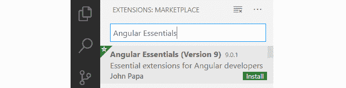

# *第一章*：打造你的第一款 Angular 应用

为了更好地理解如何开发 Angular 应用程序，我们需要学习一些基本但必不可少的东西，以便在 Angular 框架的使用过程中获得丰富的经验。我们应该知道的一件基本事情是**语义版本控制**，这是 Angular 团队选择的处理框架不同版本之间变化的方式。当您访问官方 Angular documentation 网站（[时，它有望使您更容易找到解决未来应用程序开发挑战的正确解决方案 https://angular.io](https://angular.io) ）或其他站点（如堆栈溢出）来搜索解决方案。

另一个重要但有时令人痛苦的话题是项目设置。这是一个必须在项目开始时做的坏事，但是在项目开始的早期就做好这一点可以减少应用程序发展过程中的大量摩擦。因此，本章的大部分内容专门介绍了**Angular CLI**，Angular 团队开发的一种工具，它在 Angular 应用程序中提供脚手架和自动化任务，使过程更加神秘，并使您作为开发人员能够避免未来的挫折和偏头痛。我们将使用 Angular CLI 从头开始创建我们的第一个应用程序，了解 Angular 应用程序的解剖结构，并初步了解 Angular 如何在引擎盖下工作。

在没有**集成开发环境（IDE）**的情况下进行角度项目可能会很痛苦。我们最喜欢的代码编辑器可以为我们提供一个敏捷的开发工作流，其中包括运行时的 TypeScript 编译、静态类型检查、自省、代码完成以及调试和构建应用程序的可视化帮助。我们将重点介绍一些流行的代码编辑器，并鸟瞰它们中的每一个如何在开发应用程序时为我们提供帮助。

总而言之，以下是我们将在本章中探讨的主要主题：

*   语义版本控制，它为什么重要，让我们来看看
*   如何使用 Angular CLI 10 设置 Angular 项目
*   如何使用 Angular CLI 命令完成某些任务，例如构建和服务 Angular 应用程序
*   如何创建我们的第一个应用程序并开始理解 Angular 中的核心概念
*   在流行的 IDE 中，可用的 Angular 工具

# 技术要求

*   **GitHub 链接**：[https://github.com/PacktPublishing/Learning-Angular--Third-Edition/tree/master/ch01](https://github.com/PacktPublishing/Learning-Angular--Third-Edition/tree/master/ch01)
*   **Node.js**：[http://nodejs.org/](http://nodejs.org/)
*   **节点包管理器****npm**：包含在 Node.js 中
*   **吉特**：[https://git-scm.com/downloads](https://git-scm.com/downloads)
*   **Visual Studio 代码**（**VS 代码**：[https://code.visualstudio.com/download](https://code.visualstudio.com/download)

# 这只是角度——引入语义版本控制

使用语义版本控制是关于管理期望的。它是关于管理应用程序或库的用户在发生更改时的反应。发生更改的原因多种多样，要么是为了修复代码中出现的问题，要么是为了添加/更改/删除功能。框架或库的作者通过以不同的方式增加软件的版本号来传达特定更改的影响。

传统上，一个生产就绪软件的版本是 1.0，如果您想更具体一些，则是 1.0.0。

更新软件时，可能会发生三种不同级别的更改。无论是添加一个主要的功能，还是添加一个次要的功能，您都可以对软件进行有效的修改。让我们在下面的章节中更详细地了解这些变化。

## 斑块变化

补丁更改意味着我们将最右边的数字增加 1。将软件从 1.0.0 更改为 1.0.1 只是一个小小的更改，通常意味着一个 bug 修复。作为该软件的用户，你真的不必担心；如果有什么不同的话，你应该高兴的是突然变得更好了。关键是您可以安全地开始使用 1.0.1。

## 微小变化

一个微小的变化意味着软件版本从 1.0.0 增加到 1.1.0。当我们将中间数字增加 1 时，我们将处理更严重的变化。当向软件中添加新功能时，该数字应增加，并且应仍然与 1.0.0 版本向后兼容。在这种情况下，开始使用 1.1.0 版本的软件应该是安全的。

## 重大变化

随着的重大变化，版本号从的 1.0.0 增加到 2.0.0。事情可能已经发生了很大的变化，以至于结构已经被重命名或删除。它可能与早期版本不兼容。请注意，许多软件作者仍然确保有良好的向后兼容性，但这里的要点是，没有保证，没有合同保证T，它仍然可以工作。

## 角度如何？

大多数人都知道 Angular 的第一个版本是 Angular 1；它后来被称为 AngularJS，但许多人仍然称它为 Angular1。它没有使用语义版本控制。

随后 Angular 2 问世，并于 2016 年达到生产就绪状态。Angular 决定采用语义版本控制，这在开发人员社区引起了一些混乱，特别是当它宣布将有 Angular 4 和 5 等等。Angular 团队以及他们的 Google 开发者专家网络开始解释说，我们应该称最新版本的框架 Angular 为 Angular。你可以争辩这个决定是否明智。尽管如此，新的 Angular 仍然使用语义版本控制，这意味着 Angular 与 Angular 2 以及 Angular 10 是相同的平台，依此类推。采用语义版本控制意味着作为框架用户的 you 可以依赖于以相同的方式工作，直到 Angular 决定增加主版本。即便如此，你还是想继续使用最新的主要版本，还是升级现有的应用程序，这取决于你自己。

# 引入角度

Angular 代表了对 AngularJS 框架的完全重写，引入了一个全新的应用程序架构，完全是在**类型脚本**中从头构建的，这是**JavaScript**的严格超集，添加了可选的静态类型和对接口和装饰器的支持。

简言之，Angular 应用程序基于一种架构设计，该架构设计包括由特定 I/O 接口互连的 web 组件树。在引擎盖下，每个组件都利用了完全改进的依赖注入机制。

平心而论，这是对角度的简单描述；然而，在 Angular 中有史以来最简单的项目是由这些定义特征构成的。在接下来的章节中，我们将重点学习如何构建可互操作的组件和管理依赖注入，然后再继续讨论更高级的主题，如路由、web 表单和 HTTP 通信。我们不会在整本书中明确提及 AngularJS；浪费时间和篇幅去引用一些对这个主题没有任何有用见解的东西是没有意义的。此外，我们假设您可能不知道角 1.x，因此这种知识在这里没有任何 v值。

# 使用 Angular CLI 设置我们的工作区

今天建立前端项目比以往任何时候都要麻烦。我们曾经在我们的**HTML**中手动包含必要的 JavaScript 和**CSS**文件。生活过去很简单。然后前端开发变得更加雄心勃勃：我们开始将代码分成模块，并为代码和 CSS 使用名为**预处理器**的特殊工具。

总之，我们的项目变得更加复杂，我们开始依赖构建系统来捆绑应用程序。作为开发人员，我们不是配置的超级粉丝，我们希望专注于构建出色的应用程序。然而，现代浏览器在支持最新的 web 标准方面做得更多，其中一些浏览器甚至已经开始支持模块。这就是说，这远远没有得到广泛支持。与此同时，我们仍然需要依赖工具进行捆绑和模块支持。

使用 Angular 设置项目可能很棘手。您需要知道要导入哪些库，并确保以正确的顺序处理文件，这就引出了脚手架的主题。随着复杂性的增加，架子工工具几乎成为了一种必需品，但在这种情况下，每小时都会产生业务价值，而不是解决配置问题。

创建 Angular CLI 的主要动机是帮助开发人员专注于应用程序构建，消除配置样板。本质上，通过一个简单的命令，您应该能够初始化一个应用程序，向其中添加新的工件，运行测试并创建一个生产级捆绑包。Angular CLI 通过使用特殊命令支持所有这一切。

## 先决条件

在我们开始之前，我们需要确保我们的开发环境包括一组对 Angular 开发工作流至关重要的软件工具。

### Node.js

Node.js 是一个构建在 Chrome 的 v8JavaScript 引擎之上的JavaScript 运行时。Angular 需要当前版本或 LTS 版本。如果您已经安装了，可以在命令行中运行`node -v`来检查您正在运行的版本。如果没有，您可以从[获取 https://nodejs.org](https://nodejs.org) 。

Angular CLI 使用 Node.js 完成特定任务，例如服务、构建和绑定应用程序。

### Npm

Npm 是一个软件包管理器，默认包含在 Node.js 中。您可以通过在命令行中运行`npm -v`来检查这一点。Angular 框架是各种库的生态系统，称为**包**，在**npm 注册表**的中心位置提供。npm 客户端从注册表下载并安装运行应用程序所需的库。

### 吉特

Git 是一个客户端，允许我们连接分布式版本控制系统，如*GitHub*、*Bitbucket*、*GitLab*等。从角度来看，它是可选的。如果您想将 Angular 项目上传到 Git 存储库中，您应该安装它，这可能是您想要做的事情。

## 安装角头螺钉

Angular CLI 是 Angular 生态系统的部分，可从 npm 软件包注册表下载。由于它用于创建 Angular 应用程序和项目，我们需要在系统中全局安装它。打开终端并运行以下命令：

```ts
npm install -g @angular/cli@10.0.0
```

重要提示

在某些 Windows 系统上，您可能需要提升权限才能执行此操作，在这种情况下，您应该以管理员身份运行命令行窗口。在 Linux/macOS 系统中，使用`sudo`关键字运行命令：`sudo npm install -g @angular/cli@10.0.0`。

我们用于安装 Angular CLI 的命令使用 npm 客户端，后跟一组运行时参数：

*   `install`或`i`：表示包装的安装
*   `-g`：表示该包将被全局安装到系统中
*   `@angular/cli`：表示要安装的软件包的名称
*   `@10.0.0`：表示要安装的软件包版本

## CLI 命令

Angular CLI 是一种命令行界面工具，可在开发过程中自动执行特定任务，例如为 Angular 项目提供服务、构建、绑定和测试。顾名思义，它使用命令行调用`ng`可执行文件，并使用以下语法运行命令：

```ts
ng command [options]
```

这里，`command`是要执行的命令的名称，`[options]` 表示可以传递给每个命令的附加参数。要查看所有可用命令，可以运行以下命令：

```ts
ng help
```

还可以使用别名而不是实际的命令名来调用某些命令。在本书中，我们修改了最常见的命令（每个命令的别名显示在括号内）：

*   `new (n)`：从头开始创建新的角度应用程序。
*   `build (b)`**：**编译角度应用程序，并在预定义文件夹中输出生成的文件。
*   `generate (g)`**：**创建包含角度应用程序的新文件。
*   `serve (s)`**构建角度应用程序，并通过预配置的 web 服务器为其提供服务。**
***   `test (t)`**运行角度应用程序的单元测试。*****   `deploy`**：**将角度应用程序部署到 web 托管提供商。您可以从 Angular CLI 中包含的提供程序集合中进行选择。*   `add`**在 Angular 应用程序中安装第三方库。*****   `update`**:** Updates an Angular application along with its dependencies. Dependencies are libraries, npm packages, that are needed for the Angular application to run.

    重要提示

    库必须与要与 add 和 update 命令一起使用的 Angular CLI 兼容。库添加兼容性的方式超出了本书的范围。****** 

 ****Angular CLI 遵循与框架的所有其他包相同的 Angular 主版本。我们在本书中使用的版本和附带的源代码是 10。您可以通过在命令行中运行`ng version`或`ng v`来检查已安装的版本。

Angular 使用现代的 web 技术和 orchestrate 为我们提供出色的应用程序开发体验。它在引擎盖下使用了**Webpack**，这是一种流行的模块绑定器，用于现代 JavaScript 应用程序。我们不直接与 Webpack 交互，而是通过 Angular CLI 界面。

## 创建新项目

现在我们已经准备好了我们的开发环境，我们可以开始通过搭建我们的第一个角度应用程序来创造奇迹。我们使用 Angular CLI 的`new`命令，并将要创建的应用程序的名称作为选项传递。要执行此操作，请转到您选择的文件夹并键入以下内容：

```ts
ng new my-app
```

创建新的 Angular 应用程序是一个简单明了的过程。Angular CLI 将询问您要创建的应用程序的一些详细信息，以便它能够尽可能最好地构建 Angular 项目。最初，它会询问您是否希望在应用程序中包含路由。

**是否要添加角度布线？（是/否）**

路由与从应用程序的一个视图导航到另一个视图有关，我们将在后面的[*第 7 章*](07.html#_idTextAnchor168)*中了解到这一点，并通过路由*浏览组件。现在，回答问题*否*并按*回车*。

下一个问题与应用程序的样式有关。

**您希望使用哪种样式表格式？（使用箭头键）**

使用 CSS 设置角度应用程序的样式是很常见的。但是，您可以使用预处理器，例如**SCSS**或**Less**，它们可以为您的开发工作流提供附加值。在本书中，我们直接使用 CSS，因此您可以接受默认选择`CSS`，然后按*回车*。

此过程可能需要一些时间，具体取决于您的 internet 连接。在此期间，Angular CLI 将下载并安装所有必要的依赖项，并为 Angular 应用程序创建默认文件。完成后，它将创建一个名为`my-app`的文件夹。导航到新创建的文件夹，并使用以下命令启动应用程序：

```ts
ng serve
```

Angular CLI 编译 Angular 项目并启动 web 服务器，该服务器监视项目文件中的更改。这样，每当您进行更改时，web 服务器都会重建项目以反映新的更改。

要预览应用程序，请打开浏览器并转到 http://localhost:4200


图 1.1–新 Angular 应用程序的登录页

当我们从头开始创建新的 Angular 应用程序时，默认情况下 Angular CLI 会显示一个登录页，其中包含有用的链接，例如在何处查找其他资源和有关 Angular 框架的文档或开始构建应用程序的下一步。在下一节中，我们将探索 Angular 如何使整个过程正常工作，并学习如何更改此登录页。

# 你好

我们即将迈出第一步，扩展我们的第一个角度应用程序。Angular CLI 已经为我们的项目搭建了脚手架，并因此进行了大量的繁重工作。我们所需要做的就是启动我们最喜欢的 IDE 并开始使用 Angular 项目。在本书中，我们将使用**Visual Studio 代码（VS 代码）**，但请随意选择任何您熟悉的编辑器。VS 代码是 Angular 社区中非常流行的 IDE，因为它为开发人员提供了强大的工具。稍后您将在*IDE 和插件*部分了解有关 IDE 的更多详细信息。

我们的应用程序的登录页是一个角度**组件**，由以下部分组成：

*   **组件类**：包含组件的表示逻辑，处理与模板的交互
*   **HTML 模板**：与组件类交互的组件的实际 UI
*   **CSS 样式**：定义组件外观的特定样式

我们将在[*第 3 章*](03.html#_idTextAnchor092)、*组件交互和交互通信*中详细了解每个部分。现在，让我们大胆定制登录页的上述部分：

1.  打开 VS 代码，从主菜单中为 Mac 用户选择**文件**或**打开**。
2.  搜索`my-app`文件夹并选择它。VS 代码将加载关联的角度项目。
3.  Navigate to the `app` subfolder of the `src` folder and select the `app.component.ts` file. This file is the landing page and the main component of the application.

    重要提示

    作为惯例，角度应用程序至少有一个称为`AppComponent`的主要组件。

4.  Locate the property `title` and change its value to `Hello Angular 10`:

    app.component.ts

    ```ts
    import { Component } from ‹@angular/core›;
    @Component({
      selector: 'app-root',
      templateUrl: './app.component.html',
      styleUrls: ['./app.component.css']
    })
    export class AppComponent {
      title = 'Hello Angular 10';
    }
    ```

5.  保存文件并等待 Angular 完成它的工作。它重新编译项目并刷新浏览器。登录页应反映您刚才所做的更改：


图 1.2–登录页标题

祝贺您已成功使用 Angular CLI 创建 Angular 应用程序并与组件交互。你刚刚经历的只是冰山一角。在引擎盖下会发生很多事情，所以让我们开始解释 Angular 是如何在浏览器上显示实际页面的。

## 组件

每个 web应用程序都有一个主 HTML 文件。对于角度应用程序，这是存在于`src`文件夹中的`index.html`文件：

index.html

```ts
<!doctype html>
<html lang="en">
<head>
  <meta charset="utf-8">
  <title>MyApp</title>
  <base href="/">
  <meta name="viewport" content="width=device-width,   initial-scale=1">
  <link rel="icon" type="img/x-icon" href="favicon.ico">
</head>
<body>
  <app-root></app-root>
</body>
</html>
```

当Angular CLI 构建 Angular 应用程序时，它首先解析`index.html`并开始识别`body`标记内的 HTML 标记元素。角度应用程序始终在`body`标记内呈现，并包含组件树。当 Angular CLI 发现一个不是已知 HTML 元素的标记时，例如`app-root`，它开始搜索应用程序树的组件。但它如何知道哪些组件属于该应用程序？

## 模块

Angular 将组件组织成自足的功能块，称为**模块**。按照惯例，角度应用程序至少有一个称为`AppModule`的主模块：

app.module.ts

```ts
import { BrowserModule } from '@angular/platform-browser';
import { NgModule } from '@angular/core';
import { AppComponent } from './app.component';
@NgModule({
  declarations: [
    AppComponent
  ],
  imports: [
    BrowserModule
  ],
  providers: [],
  bootstrap: [AppComponent]
})
export class AppModule { }
```

角度组件应该注册到模块中，以便框架能够发现它们。`declarations`属性是我们定义模块中存在的所有组件的地方。未能在此属性中添加组件将意味着框架无法识别它，并且当我们尝试使用它时，它将抛出错误。稍后我们将在[*第 5 章*](05.html#_idTextAnchor129)*构建一个角度应用程序*中了解更多关于模块及其属性的信息。

一旦应用程序知道它可以搜索的所有可用组件，它就需要识别哪个元素标记属于哪个组件。也就是说，它需要找到一种将标记与组件匹配的方法。

## 选择器

Angular 通过**选择器**将HTML 标记与组件匹配。它是您为组件指定的名称，以便在 HTML 中正确识别该组件：

`selector: 'app-root'`

当 Angular 在 HTML 文件中找到未知元素标记时，它会搜索所有已注册组件的选择器，以检查是否存在匹配项。一旦找到匹配的选择器，它就会呈现组件的模板来代替元素标记。您可以将选择器视为锚定，它告诉 Angular 在何处渲染组件。

## 模板

组件的 HTML 内容称为**模板**，在`templateUrl`属性中定义。表示组件的 HTML 文件相对于组件类文件的路径：

`templateUrl: './app.component.html'`

Angular 解析组件的模板，并用该文件的 HTML 内容替换找到的选择器。

组件的模板使用有效的 HTML 语法编写，并包含标准 HTML 标记元素，其中一些元素使用角度模板语法进行了丰富。它是一种 Angular 模板语言，扩展 HTML 和 JavaScript 并自定义外观或向现有 HTML 标记元素添加行为。要了解角度模板语法，请在 VS 代码中选择`app.component.html`文件并转到第 330 行：

`<span>{{ title }} app is running!</span>`

`{{ }}`语法是角度模板语言的一个示例，称为**插值**。它读取组件类的`title`属性，将其值转换为文本，并在屏幕上呈现如下所示：

**Hello Angular 10 应用程序正在运行**

## 自举

您已经了解了 Angular 如何在引擎盖下显示登录页等组件。但它怎么知道从哪里开始呢？启动在屏幕上呈现页面的过程的责任是什么？此方法称为**引导**，在`src`文件夹内的`main.ts`文件中定义：

梅因酒店

```ts
import { enableProdMode } from '@angular/core';
import { platformBrowserDynamic } from '@angular/platform-browser-dynamic';
import { AppModule } from './app/app.module';
import { environment } from './environments/environment';
if (environment.production) {
  enableProdMode();
}
platformBrowserDynamic().bootstrapModule(AppModule)
  .catch(err => console.log(err));
```

角度应用程序的起点始终是一个模块。引导文件的主要任务是定义这个模块。调用浏览器平台的`bootstrapModule`方法，并将`AppModule`作为应用程序的入口点。

重要提示

Angular 是一个跨平台的框架。它可以支持不同类型的平台，如浏览器、服务器、web worker 和本机移动设备。在我们的例子中，我们使用`platformBrowserDynamic`来定位浏览器平台。

到目前为止，您应该已经基本了解 Angular 是如何工作的，以及框架的基本构建块是什么。作为一名读者，你不得不在这一点上吞下大量信息，并相信我们的话。别担心：在接下来的章节中，您将有机会进一步了解组件和角度模块。现在，我们的重点是通过 g为您提供一个功能强大的工具，以 Angular CLI 的形式，并向您展示如何只需几个步骤就可以将应用程序呈现到屏幕上。

# IDE 和插件

IDE 是一个术语，我们用来表示比记事本或简单编辑器更强大的东西。写代码意味着我们有不同于写文章的要求。编辑需要能够指出我们何时输入了错误的内容，为我们提供代码的细节，最好给我们自动补全功能，一旦我们开始输入第一个字母，它会给我们一个可能的方法列表。编码编辑器可以而且应该是您最好的朋友。

对于前端开发，有很多很好的选择，没有比其他环境更好的了；这完全取决于什么最适合你。这本书使用 VS 代码是因为它在 Angular 社区中很受欢迎，而且它的市场上有丰富的插件集合。让我们开始探索之旅，这样你就可以判断什么样的环境最适合你。

## 原子

由 GitHub 开发的高度可定制的环境和易于安装的新软件包使 Atom 成为许多人的首选 IDE。

要在编写 Angular 应用程序时优化您的TypeScript 体验，您需要通过 Atom package Manager CLI 或使用内置软件包安装程序安装 Atom TypeScript 软件包。它包含多种功能，例如自动代码提示、静态类型检查、代码内省和保存后自动构建等等。除此之外，此软件包还包括一个方便的内置生成器，帮助您轻松地为项目配置 TypeScript。

## 崇高的文本

Sublime Text 可能是当今最广泛使用的代码编辑器之一，尽管最近它已经失去了一些动力，因为用户更喜欢其他新兴的竞争对手，比如 VS 代码。要提供对 TypeScript 代码编辑的支持，您需要安装 Microsoft 的 TypeScript 插件，可从[获得 https://github.com/Microsoft/TypeScript-Sublime-Plugin](https://github.com/Microsoft/TypeScript-Sublime-Plugin) 。请参阅本页了解如何安装插件以及所有快捷方式和键映射。

成功安装后，只需按*Ctrl*+*空格 ba*r 即可显示基于内省类型的代码提示。除此之外，您还可以通过点击*F7*键触发构建过程并将源文件编译为 JavaScript。实时代码错误报告是您可以从命令菜单启用的另一项奇特功能。

## 网络风暴

WebStorm 是 IntelliJ 提供的一个优秀的代码编辑器，非常适合编写应用程序。它内置了对开箱即用的 TypeScript 的支持，这样你就可以从第一天开始开发角度组件了。WebStorm 还实现了一个支持文件监视的内置 transpiler，因此您可以将 TypeScript 代码编译成纯香草 JavaScript，而无需依赖任何第三方插件。

## Visual Studio 代码

Visual Studio Code，或者更广为人知的 VS Code，是一个由 Microsoft 支持的开放源码代码编辑器，在 Angular 社区中作为一个重要的竞争者正在获得势头，主要是因为它对开箱即用的 TypeScript 的强大支持。TypeScript 在很大程度上是由微软推动的一个项目，因此它的一个流行编辑器是内置支持这种语言的。这意味着我们可能需要的所有优秀功能都已经准备就绪，包括语法、错误突出显示和自动构建。它广受欢迎的另一个原因是市场上提供的各种扩展，它们丰富了 Angular development 工作流。VS 代码之所以如此伟大，不仅在于它的设计和易用性，还在于它可以访问大量插件，而且还有一些非常适合角度开发的插件。最受欢迎的是 Angular Essentials 扩展包。要获取它，请执行以下步骤：

1.  导航到 VS 代码的扩展菜单。
2.  搜索**角度要素**关键字。
3.  点击第一个条目的**安装**按钮：



图 1.3–角度要素

或者，您可以自动安装它，因为它已经包含在本书源代码的存储库中。当您从 GitHub 下载项目并在 VS 代码中打开它时，它将提示您查看并安装推荐的扩展：


图 1.4–建议的扩展提示

现在让我们看看在以下部分中 Angular Essentials 扩展包中包含的一些扩展。

### 角语言服务

Angular 语言服务扩展由 Angular 团队开发和维护，在 Angular 模板内提供代码完成、导航和错误检测。它包含在 Angular Essentials 扩展包中，但也可以作为独立插件用于 WebStorm 和 Sublime 文本编辑器。它通过以下特性丰富了 IDE：

*   代码完成
*   转到定义
*   快速信息
*   AOT 诊断消息

为了了解扩展的强大功能，让我们看看代码完成特性。假设我们想在`AppComponent`的模板中显示一个名为`description`的新属性。我们可以通过以下步骤进行设置：

1.  在组件类中定义新属性：

    ```ts
    export class AppComponent {
      title = 'Hello Angular 10';
      description = 'Hello World';
    }
    ```

2.  开始在模板中键入属性的名称。Angular 语言服务将自动找到并为您提供建议：


图 1.5–模板中的 IntelliSense

`description`财产为公共财产。在公共方法和属性中，我们可以省略关键字`public`。采用以下短语：

`description = 'Hello World';`

此短语相当于以下内容：

`public description = 'Hello World';`

代码完成仅适用于公共属性和方法。如果该属性被声明为`private description = 'Hello World';`，那么 Angular 语言服务将无法找到它。

您可能已经注意到，当您键入时，HTML 元素下面立即出现一条红线。这是 AOT 诊断消息功能的一种效果。Angular 语言服务无法识别该属性，直到您正确键入该属性并正确指出该属性缺乏识别。如果您将鼠标悬停在红色指示上，它将显示一条关于出错原因的完整信息消息：


图 1.6–模板中的错误处理

### 角片段

Angular Snippets扩展包含用于各种 Angular 工件（如组件）的 TypeScript 和 HTML代码段的集合。要使用扩展名创建角度组件的 TypeScript 类，请执行以下步骤：

1.  打开 VS 代码，选择**文件**新建文件。
2.  选择**文件【另存为**并为其指定一个扩展名为`.ts`的正确名称，该扩展名是 TypeScript 文件的扩展名。
3.  在文件内键入`a-component`并按*输入*。

扩展自动为您生成 TypeScript 代码。将类名和选择器更改为更合适的名称，您就可以开始在项目中使用它了：

```ts
import { Component, OnInit } from '@angular/core';
@Component({
    selector: 'selector-name',
    templateUrl: 'name.component.html'
})
export class NameComponent implements OnInit {
    constructor() { }
    ngOnInit() { }
}
```

所有可用的角度片段都以`a-`前缀开头。

### Nx 控制台

Nx 控制台是 Angular CLI 的交互式 UI，旨在帮助对命令行界面不太熟悉或根本不想使用它的开发人员。它作为 Angular CLI 命令的包装器，帮助开发人员专注于交付出色的 Angular 应用程序，而不是试图记住他们想要使用的每个 CLI 命令的语法。

打开 Angular CLI 项目时，会自动启用扩展。如果您点击 VS Code 的Nx 控制台菜单，它将显示您可以执行的 Angular CLI 命令列表：


图 1.7–Nx 控制台

### 特斯林特

**TSLint**是一种对 TypeScript 代码进行静态分析的工具，通过应用一组规则来执行可读性、可维护性和错误检查。这些规则在`tslint.json`配置文件中定义，可在 Angular CLI 项目的根文件夹中找到。由微软维护，必须单独安装：


图 1.8-TSLint

开发团队可以从它的使用中获益匪浅，因为它可以控制团队内部使用的编码风格。团队的开发人员可以事先就一组特定的规则达成一致。当开发人员的编码风格不遵守这些规则之一时，TSLint 将显示与违规相关的警告。这种方法确保了应用程序代码由团队的所有成员一致地编写，并且在 Angular 项目中招募新的开发人员成为一个简单的过程。

### 材质图标主题

VS 代码有一组内置图标，用于显示项目中不同类型的文件。此扩展提供了符合谷歌材料设计指南的额外图标；此集合的一个子集以基于角度的瑕疵为目标。

使用此扩展，您可以轻松确定项目中角度文件的类型，例如组件和模块，并提高开发人员的工作效率，尤其是在文件量很大的大型项目中：


图 1.9–材质图标主题

重要提示

安装此扩展后，您需要重新加载 VS 代码，图标更改才能生效。

### 编辑配置

VS 代码编辑器设置，例如缩进或间距可以在用户或项目级别设置。**编辑器配置**可以使用名为`.editorconfig`的配置文件覆盖这些设置，该文件位于 Angular CLI 项目的根文件夹中。您可以在此文件中定义唯一的设置，以确保整个团队的编码样式的一致性。

# 总结

就这样！你的天使世界之旅才刚刚开始。让我们回顾一下到目前为止您所学到的功能。我们研究了语义版本控制以及现代 JavaScript 框架（如 Angular）如何使用它。我们回顾了 Angular 框架的简要历史，了解了语义版本控制如何帮助 Angular 团队提供最新的高质量功能。

我们了解了如何设置我们的工作空间，以及在哪里找到将 TypeScript 引入游戏并在项目中使用 Angular 框架所需的工具，以及每个工具在应用程序中的作用。我们介绍了 Angular CLI 工具，Angular 的瑞士军刀，它可以自动化特定的开发任务，并且我们使用了一些最常见的命令来构建我们的第一个 Angular 应用程序。我们瞥见了角组件的结构，并学习了如何与之交互。

我们的第一个应用程序让我们基本了解了 Angular 如何在网页上呈现我们的应用程序。我们开始了我们的旅程，从 Angular 应用程序的主 HTML 文件开始。我们了解了 Angular 如何解析该文件，并开始搜索组件树，以将 HTML 元素与组件选择器和模板相匹配。我们了解到，共享类似功能的组件被分组到模块中，并研究了如何从角度引导应用程序的第一个模块。

最后，我们遇到了一些最流行的 IDE，并了解了它们如何使您成为一名软件开发人员。编辑器有很多选择，其中一些我们选择更详细地介绍，比如 VS 代码。还有许多插件和代码片段可以节省不少击键次数。在一天结束时，你的注意力和精力应该花在解决问题和制定解决方案上，而不是让你的手指疲劳。我们鼓励您更多地了解您的编辑器及其可能性，因为这将使您更快、更高效。

在下一章中，您将学习有关 TypeScript 的所有知识，从基础知识到专业水平。本章将介绍通过引入类型可以解决的问题，以及语言结构本身。TypeScript 作为 JavaScript 的超集，包含许多强大的概念，并且与 Angular 框架很好地结合在一起，正如您将要发现的那样。****