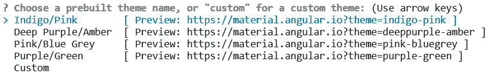
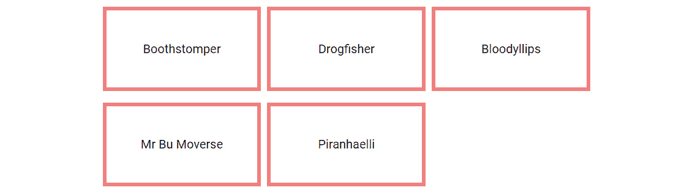

# 九、Angular 材质介绍

开发 web 应用时，需要决定如何创建 UI。它应该使用适当的对比色，具有一致的外观和感觉，响应速度快，在不同的设备和浏览器上工作良好。简而言之，当涉及 UI 和 UX 时，有很多事情要考虑。难怪大多数开发人员认为 UI／UX 是一项令人畏惧的任务，因此转向了大量繁重的 UI 框架。一些框架比其他框架使用得更多，即：

*   **自举**
*   基金会章程 1
*   **纯**
*   **顺风 CSS**

然而，有一种新的基于谷歌材质设计技术的块角材质。在本章中，我们将解释什么是材质设计，Angular材质是如何实现其原理的，我们将了解其一些核心组件。

在本章中，我们将执行以下操作：

*   了解什么是材质设计以及它的历史。
*   深入研究棱角材质及其零件。
*   回顾角材质的一些核心组件。
*   了解Angular**组件开发工具包（CDK）**，这是Angular材质组件的基础。
*   通过 Angular 集成**Angular Flex 布局**，这是一个使用 Flexbox 的 UI 布局实现。

# 技术要求

本章的代码文件可在[中找到 https://github.com/PacktPublishing/Learning-Angular--Third-Edition/tree/master/ch09](https://github.com/PacktPublishing/Learning-Angular--Third-Edition/tree/master/ch09) 。

# 介绍材质设计

材质设计是谷歌于 2014 年开发的一种设计语言。谷歌声称其新的设计语言是基于纸和墨水的。材质设计的创造者试图用以下方式解释他们试图达到的目标：

“我们挑战自己，为用户创造一种视觉语言，将优秀设计的经典原则与技术和科学的创新和可能性相结合。”

他们进一步解释了他们的目标如下：

*   开发一个单一的底层系统，允许跨平台和设备大小提供统一的体验。
*   移动规则是最基本的，但触摸、语音、鼠标和键盘都是一流的输入方法。

设计语言的目的是让用户处理 UI 和用户交互在设备上的外观和感觉。材质设计基于三个主要原则：

*   **材质是隐喻**：它的灵感来自于物理世界，具有不同的纹理和媒介，如纸张和墨水。
*   **粗体、图形、有意**：通过不同的印刷设计方法，如排版、网格和颜色，为用户创造身临其境的体验。
*   **运动提供了**的含义：通过创建动画和交互来重组环境，元素显示在屏幕上。

总而言之，可以说设计语言背后有很多理论，如果您希望进一步深入研究，也有关于这个主题的适当文档。您可以在官方文档网站[上找到更多信息 https://material.io/](https://material.io/) 。

现在，如果你是一名设计师，这一切可能都很有趣。但我们是 web 开发人员，为什么要费心去看这个呢？好吧，每次谷歌开始建造一些东西时，它都会变大，虽然并不是所有东西都会永远变大，但它背后有足够的力量表明材质设计将持续一段时间。谷歌在 Firebase、Gmail 和谷歌分析（Google Analytics）等产品中广泛使用 it，为其铺平了道路。

但当然，设计语言本身并没有那么有趣，至少对于开发人员来说不是这样，这就把我们带到了下一节，在这里我们将学习基于材质设计原则的已知实现。

## 已知的实现

设计的目的是理解代码，给用户一个愉快的体验，无论是视觉上还是从可用性的Angular。目前，材质设计主要有三种实现方式：

*   **物化**：GitHub 上近 4 万颗星星告诉你，这是非常好的使用。它曾经是一个独立的库，但也有与其他框架的绑定，如 AngularJS 和 React。它提供了导航元素、组件和更多功能。您可以在[阅读更多内容 https://materializecss.com/](https://materializecss.com/) 。
*   **AngularJS 资料**：这是谷歌对 AngularJS 的实现。它非常有能力，带有主题、导航元素、组件，当然还有指令。您可以在[阅读更多内容 https://material.angularjs.org/](https://material.angularjs.org/) 。
*   **Angular Material**：Angular 团队内部维护，是 Google 对Angular 框架的实现。我们将在本章的其余部分重点讨论这一点。您可以在[阅读更多内容 https://material.angular.io/](https://material.angular.io/) 。

Angular材质仅用于Angular框架。使用它的一个优点是 Angular 团队本身维护它，因此我们可以确保它与框架的最新版本完全一致并保持最新。在下一节中，我们将学习如何在 Angular 应用中安装 Angular Material 10。

# 引入棱角材质

角材质库是为实现角框架的材质设计而开发的。它通过以下特性进行自我提升：

*   **从零冲刺到应用**：目的是让你作为一名应用开发人员能够非常轻松地开始运行。设置它的工作量应该是最小的。
*   **快速一致**：性能一直是一个重要的关注点，它保证在所有主流浏览器上都能正常工作。
*   **多才多艺**：主题众多，易于定制，对本地化、国际化也有很好的支持。
*   **为 Angular 优化**：Angular 团队自己构建的事实意味着对 Angular 的支持是一个重要的优先事项。

该库分为以下几个部分：

*   **组件**：有大量的 UI 组件可以帮助您获得成功，例如不同类型的输入、按钮、布局、导航、模态以及显示表格数据的不同方式。
*   **主题**：图书馆附带了一套预安装的主题，但如果您想在[创建自己的主题，也有一个主题指南 https://material.angular.io/guide/theming/](https://material.angular.io/guide/theming/) 。
*   **图标**：材质设计附带 900 多个图标，因此您很可能会找到您需要的图标。您可以在[浏览全集 https://material.io/resources/icons/](https://material.io/resources/icons/) 。

我们已经介绍了关于角材质的所有基本理论，所以让我们在下一节中通过将角材质 10 与角材质 10 应用集成来将其付诸实践。

## 创建您的第一个Angular材质应用

Angular Material 10 库是一个 npm 包。要安装它，我们需要手动执行`npm install`命令，并将几个 Angular 模块导入 Angular 10 应用。幸运的是，Angular团队通过创建必要的示意图来使用 Angular CLI 安装它，从而实现了这些交互的自动化。我们可以使用`ng add`Angular CLI 命令在现有 Angular 10 应用中安装 Angular Material 10：

```ts
ng add @angular/material
```

Angular CLI 将询问我们是要为 Angular 应用使用预构建的主题还是自定义主题。接受默认值**靛蓝/粉红色**并按*键输入*：



图 9.1–主题选择

选择主题后，Angular CLI 将询问我们是否要在应用中设置全局排版样式。排版是指在我们的应用中文本的排列方式。Angular材质排版基于材质设计指南，并使用**Roboto**谷歌字体进行样式设计。

我们希望使我们的应用尽可能简单，因此键入`N`（否）并按*输入*：


图 9.2–设置排版

下一个问题是关于动画的。我们希望应用在单击按钮或打开模式对话框时显示漂亮的动画。这不是严格意义上的必要工作，但我们想要一些很酷的动画，对吗？输入`Y`（是）并按*键进入*：


图 9.3–设置动画

重要提示

如果问题包含大写的 y 或 n，则这是默认选择，您可以按 enter 键进行选择

Angular CLI 将开始在我们的应用中安装 Angular 材质。它将构建并导入所有必要的工件，这样我们就可以立即开始使用Angular材质。安装完成后，我们可以开始将 Angular Material library 中的控件添加到我们的应用中。

## 添加Angular材质控件

要开始使用 Angular Material library 中的 UI 控件，例如按钮或复选框，我们需要导入相应的模块。让我们看看如何通过在`AppComponent`中添加按钮控件来实现这一点。请执行以下步骤：

1.  将`MatButtonModule`导入`AppModule`中。我们不直接从`@angular/material`导入它，因为每个模块都有一个专用的名称空间。按钮控件可在`@angular/material/button`命名空间中找到：

    ```ts
    import { BrowserModule } from '@angular/platform-browser';
    import { NgModule } from '@angular/core';
    import { AppComponent } from './app.component';
    import { BrowserAnimationsModule } from '@angular/platform-browser/animations';
    import { MatButtonModule } from '@angular/material/button';
    @NgModule({
      declarations: [
        AppComponent
      ],
      imports: [
        BrowserModule,
        BrowserAnimationsModule,
        MatButtonModule
      ],
      providers: [],
      bootstrap: [AppComponent]
    })
    export class AppModule { }
    ```

2.  打开`app.component.html`文件并删除所有内容。添加一个`button`元素并设置`mat-button`指令。实际上，`mat-button`指令修改了`button`元素，使其类似于并表现为一个材质设计按钮：

    ```ts
    <button mat-button>I am an Angular Components button</button>  
    ```

就这样！你现在有一个Angular 10 应用，是装饰材质设计。但还有更多。例如，我们可以对根据所选主题创建的按钮应用多种颜色，这是下一节的主题。

## 主题化角材质组件

正如我们在前面的部分中所看到的，棱角材质具有四个内置主题：

*   **靛蓝/粉红色**
*   **深紫色/琥珀色**
*   **粉色/蓝色-灰色**
*   **紫/绿**

当我们向 Angular CLI 10 项目添加 Angular 材质时，靛蓝/粉色主题是默认主题。我们始终可以通过修改`angular.json`配置文件中包含的 CSS 文件来更改所选主题：

```ts
"styles": [
  "./node_modules/@angular/material/prebuilt-themes/indigo-  pink.css",
  "src/styles.css"
]
```

每个主题由一组调色板组成，最常见的调色板如下：

*   主要的，重要的
*   口音
*   警告

因此，如果我们想将主调色板应用于按钮，我们将编写如下代码：

```ts
<button mat-button color="primary">I am an Angular Components button</button>
```

Angular Material 中的主题化非常广泛，我们可以使用现有的 CSS 变量来创建自定义主题，这个主题超出了本书的范围。

为了继续我们的魔幻之旅，让我们在下一节中讨论一些基本的核心组件。

# 添加核心 UI 控件

角材质由多种不同类型的组件组成。一些最基本的问题如下：

*   **按钮**：这些按钮听起来很像：你可以按的按钮。但是有几种不同类型的按钮可以使用，比如图标按钮、凸起按钮等等。
*   **表单控件**：这些是我们用来从表单收集数据的任何类型的控件，例如自动完成、复选框、输入、单选按钮和下拉列表。
*   **导航**：用于执行导航的控件，如菜单、侧导航或工具栏。
*   **布局**：定义数据在页面上的排列方式的控件，如列表、卡片或选项卡。
*   **弹出式窗口/模态**：覆盖窗口，阻止任何用户交互，直到以任何方式解除。
*   **表格**：用于以表格方式显示数据的控件。您需要什么样的表取决于您的数据是海量的，需要分页还是需要排序，或者两者兼而有之。

## 按钮

我们已经学会了如何用棱角材质制作一个简单的按钮。然而，还有更多的按钮类型，即：

*   `mat-raised-button`：一个按钮，显示有阴影，以指示其提升状态。此按钮的变体是`mat-flat-button`，它是相同的按钮，但没有阴影。
*   `mat-stroked-button`：带边框的按钮。
*   `mat-icon-button`：只显示图标的按钮，不显示文本。
*   `mat-fab`：带图标的圆形按钮。这种类型的变体是`mat-mini-fab`，它显示一个较小的按钮。
*   `mat-button-toggle`：具有开/关功能的按钮，指示是否按下。

在以下代码段中，您可以看到如何使用每种按钮类型：

buttons.component.html

```ts
<button mat-raised-button>Raised button</button>
<button mat-flat-button>Flat button</button>
<button mat-stroked-button>Stroked button</button>
<button mat-icon-button>
  <mat-icon>favorite</mat-icon>
</button>
<button mat-fab>
  <mat-icon>delete</mat-icon>
</button>
<mat-button-toggle-group>
  <mat-button-toggle value="left">
    <mat-icon>format_align_left</mat-icon>
  </mat-button-toggle>
  <mat-button-toggle value="center">
    <mat-icon>format_align_center</mat-icon>
  </mat-button-toggle>
  <mat-button-toggle value="right">
    <mat-icon>format_align_right</mat-icon>
  </mat-button-toggle>
</mat-button-toggle-group>
```

设置按钮时需要注意以下几点：

*   要使用`mat-icon-button`，我们需要从`@angular/material/icon`名称空间导入`MatIconModule`，并在按钮内部添加`mat-icon`元素。`mat-icon`元素的内容是一个指示要显示哪个图标的文本。材质设计图标网站中的每个图标都由一个图像和一段描述性文本组成。要使用特定的图像，我们只需要在`mat-icon`元素中插入适当的文本。
*   `mat-icon`元素也是`mat-fab`和`mat-mini-fab`按钮的基础，但也可以与其他按钮类型一起使用。用你的想象力创造出很棒的按钮。
*   要使用`mat-button-toggle`按钮，我们需要从`@angular/material/button-toggle`名称空间导入`MatButtonToggleModule`。`mat-button-toggle`按钮很少单独使用；相反，它与`mat-button-toggle-group`元素中相同类型的其他按钮组合。

结果输出如下图所示：


图 9.4–不同类型的按钮

按钮是Angular材质库的基本元素。在下一节中，我们将学习一些适用于形状的Angular材质控件。

## 表单控件

正如我们在[*第 8 章*](08.html#_idTextAnchor197)*中了解到的，表单控件是以不同的方式收集输入数据并采取进一步的行动，例如通过 HTTP 向后端 API 发送数据。*

Angular材质库中有许多不同类型的控件，即：

*   **自动完成**：允许用户开始在输入字段中键入，并在键入时显示建议列表。它有助于缩小输入可以采用的可能值。
*   **复选框**：代表选中或未选中状态的经典复选框。
*   **日期选择器**：允许用户在日历中选择日期。
*   **输入**：一个经典的输入控件，在打字时通过有意义的动画增强。
*   **单选按钮**：一个经典的单选按钮，在编辑时通过动画和过渡增强，以创造更好的用户体验。
*   **选择**：一个下拉控件，提示用户从列表中选择一个或多个项目。
*   **滑块**：允许用户通过向右或向左拉动滑块按钮增加或减少值。
*   **滑动拨动**：一种开关，用户可以滑动以将其设置为开启或关闭。

在以下各节中，我们将更详细地了解以前的一些表单控件。

### 输入

输入字段是一个经典的输入控件，我们可以对其设置不同的验证规则。我们可以很容易地添加功能，以便在输入字段中友好地、反应性地显示错误。要实现这一点，我们需要完成以下步骤：

1.  Create a `FormControl` instance and add a validation rule so that the control is required to have a value:

    ```ts
    name = new FormControl('', Validators.required);
    ```

    重要提示

    一个`FormControl`实例可以作为一个独立的控件使用，而不一定需要在`FormGroup`实例中。

2.  Create an `input` native HTML element inside a `mat-form-field` element and associate it with the previously created form control. To use a `mat-form-field` element, we need to import `MatFormFieldModule` from the `@angular/material/form-field` namespace:

    ```ts
    <mat-form-field>
      <input type="text" [formControl]="name"   placeholder="Name">
    </mat-form-field>
    ```

    重要提示

    我们使用`formControl`属性绑定将`input`元素与`FormControl`实例相关联，因为`name`现在是一个变量而不是键，就像`FormBuilder`的情况一样。

3.  将`matInput`指令添加到`input`字段，以指示它是一个Angular材质输入控件。为了正确使用`matInput`指令，我们需要从`@angular/material/input`名称空间导入`MatInputModule`。
4.  在`input`字段下方添加一个`mat-error`元素，以显示`mat-form-field`元素中的错误消息。只有在违反验证规则时才应显示`mat-error`元素：

    ```ts
    <mat-form-field>
      <input matInput type="text" [formControl]="name"   placeholder="Name">
      <mat-error *ngIf="!name.valid">Name is required</  mat-error>
    </mat-form-field>
    ```

在下一节中，我们将学习如何将此类输入与自动完成控件相结合，以向用户建议值。

### 自动完成

autocomplete 的想法是帮助用户缩小输入字段可能具有的值。在常规输入字段中，您只需键入一些内容，并希望验证告诉您输入的内容是否正确。使用 autocomplete，输入时会显示最可能需要的输入列表，并且在任何时候，您都可以决定停止输入并从列表中选择一项。它可以节省时间，因为您不必键入整个项目的名称，而且还可以提高准确性，因为键入内容通常容易出错。

为了了解 autocomplete 是如何工作的，让我们在上一节中创建的输入控件中提供一个可能值的列表。我们可以通过在`mat-form-field`元素之后添加`mat-autocomplete`元素来创建具有Angular材质的自动完成控件：

```ts
<mat-autocomplete #heroesAuto="matAutocomplete">
  <mat-option *ngFor="let hero of heroes" [value]="hero.  name">{{hero.name}}</mat-option>
</mat-autocomplete>
```

要使用它，我们首先需要从`@angular/material/autocomplete`名称空间导入`MatAutocompleteModule`。`mat-autocomplete`元素包含一组表示建议值列表的`mat-option`元素。我们使用`ngFor`指令迭代在`heroes.ts`文件中创建的英雄列表，并将其显示为选项：

英雄

```ts
import { Hero } from './hero.model';
export const heroes: Hero[] = [
  { id: 1, name: 'Boothstomper' },
  { id: 2, name: 'Drogfisher' },
  { id: 3, name: 'Bloodyllips' },
  { id: 4, name: 'Mr Bu Moverse' },
  { id: 5, name: 'Piranhaelli' }
];
```

我们定义了一个`heroesAuto`模板引用变量，并将其设置为`matAutocomplete`，以便可以稍后在`input`字段中引用它。这样，当输入控件聚焦时，它会触发自动完成控件以显示建议的英雄名称：

```ts
<input matInput type="text" [formControl]="name" placeholder="Name" [matAutocomplete]="heroesAuto">
```

如果我们使用`ng serve`运行应用并关注输入控件，将出现一个下拉列表，其中包含来自自动完成控件的建议值：


图 9.5–自动完成控制

我们已经走到一半了。当前，“自动完成”控件显示所有建议值。理想情况下，我们希望在键入时过滤它们。具体来说，我们希望显示名称以我们在输入控件中键入的文本开头的英雄。

正如我们在[*第 8 章*](08.html#_idTextAnchor197)*中了解到的，表单控件包含一个`valueChanges`可观察属性。我们可以订阅该属性，并在用户在输入控件中键入时得到通知。一旦可观测对象发出新值，我们可以根据该值过滤`heroes`数组：*

```ts
filteredHeroes$: Observable<Hero[]>;
ngOnInit() {
  this.filteredHeroes$ = this.name.valueChanges.pipe(
    map(name => this.heroes.filter(hero => hero.name.    startsWith(name)))
  );
}
```

现在我们只需要更改模板，以便`mat-option`元素使用`async`管道迭代`filteredHeroes$`可观察对象：

```ts
<mat-autocomplete #heroesAuto="matAutocomplete">
  <mat-option *ngFor="let hero of filteredHeroes$ | async"   [value]="hero.name">{{hero.name}}</mat-option>
</mat-autocomplete>
```

如果我们重新运行应用，并开始在输入控件中键入字符`B`，我们可以看到它显示所有名称以`B`开头的英雄作为建议值：


图 9.6–自动完成过滤

我们还可以实现更高级的过滤机制，例如对所有名称进行不区分大小写的搜索或实时搜索。想象一下，我们没有过滤本地数组，而是向后端 API 发送了一个请求并获得了实时结果。可能性是无穷的。唯一的限制是你用自动完成控件创造良好用户体验的想象力。

在下一节中，我们探讨如何使用 Angular Material library 中的复选框控件。

### 复选框

复选框是三态控件，可以有选中、未选中或未确定的值。要使用它，我们首先需要从`@angular/material/checkbox`名称空间导入`MatCheckboxModule`，然后将`mat-checkbox`元素添加到我们的模板中：

```ts
<mat-checkbox [checked]="isChecked">Check me</mat-checkbox>
```

在前面的代码片段中，我们向 checkbox 控件的`checked`属性添加了一个属性绑定，以指示是否使用`isChecked`组件属性对其进行了检查。

在下一节中，我们将通过查看日期选择器控件，最终使用 Angular Material 10 库的表单控件完成演练。

### 日期选择器

我们可以用日期选择器控件做更多的事情，而不仅仅是从弹出式日历中选择一个日期。我们可以禁用日期范围、格式化日期、每年和每月显示日期，等等。在本章中，我们将只学习如何使用它。

要使用日期选择器控件，我们首先需要导入以下模块：

*   来自`@angular/material/datepicker`名称空间的`MatDatepickerModule`。
*   来自`@angular/material/core`名称空间的`MatNativeDateModule`。`MatNativeDateModule`提供日期解析和格式化实用程序，基于本机`Date`对象实现。

Angular Material 10 中的日期选择器控件必须与输入控件结合使用，如我们前面看到的自动完成控件：

```ts
<mat-form-field>
  <input matInput type="text" placeholder="Select a date">
</mat-form-field>
```

其思想是输入控件触发要显示的日期选择器控件。要创建日期选择器控件，我们需要在`mat-form-field`元素中添加`mat-datepicker-toggle`和`mat-datepicker`元素：

```ts
<mat-datepicker-toggle matSuffix [for]="picker"></mat-datepicker-toggle>
<mat-datepicker #picker></mat-datepicker>
```

`mat-datepicker-toggle`是一个按钮元素，上面有一个日历图标。根据`matSuffix`指令的定义，它位于输入控件的末尾，当用户单击时显示日历弹出框。`mat-datepicker`元素定义了一个`picker`模板引用变量，我们可以使用该变量将其与`input`字段和`mat-datepicker-toggle`元素关联：

```ts
<input matInput type="text" placeholder="Select a date" [matDatepicker]="picker">
```

日期选择器是一种广泛用于企业应用的表单控件。我们鼓励您在[进一步探索其功能 https://material.angular.io/components/datepicker/overview](https://material.angular.io/components/datepicker/overview) 。

在下一节中，我们将学习 Angular Material 10 中的导航技术。

## 导航

在Angular 10 应用中，有不同的导航方式，例如单击链接或菜单项。角材质 10 为这种类型的相互作用提供了以下组件：

*   **菜单**：一个弹出列表，您可以从预定义的一组选项中进行选择。
*   **侧导航**：一个作为菜单停靠在页面左侧或右侧的组件。它可以显示为应用上的覆盖，同时使应用内容变暗。
*   **工具栏**：一个标准工具栏，是用户实现常用动作的一种方式。

在下一节中，我们将演示如何使用菜单。我们鼓励您通过学习使用官方 Angular Material documentation 网站上的 sidenav 和工具栏组件来继续探索。但是，您将在[*第 13 章*](13.html#_idTextAnchor275)*开发一个真实世界的Angular应用*中了解这两个方面的基本知识。

### 菜单

Angle Material 中的菜单控件由以下工件组成：

*   `mat-menu`：主菜单元素
*   `mat-menu-item`：表示菜单元素的各个项目
*   `matMenuTriggerFor`: Triggers the menu element

    重要提示

    `mat-menu-item`是我们通常附加在`button`元素中的指令，但您也可以使用其他元素，例如锚定。`matMenuTriggerFor`结合通常也用于`button`元素。

要创建菜单控件，请执行以下步骤：

1.  首先，我们需要从`@angular/material/menu`名称空间导入`MatMenuModule`。
2.  创建一个Angular材质`button`控件，用于触发菜单控件显示：

    ```ts
    <button mat-icon-button>
      <mat-icon>more_vert</mat-icon>
    </button>
    ```

3.  创建一个`mat-menu`元素并添加一些`mat-menu-item`元素：

    ```ts
    <mat-menu>
      <button mat-menu-item>Option A</button>
      <button mat-menu-item>Option B</button>
    </mat-menu>
    ```

4.  向`mat-menu`元素添加模板引用变量，并将其与`button`元素上的`matMenuTriggerFor`属性绑定一起使用，以将它们相互关联：

    ```ts
    <button mat-icon-button [matMenuTriggerFor]="menu">
      <mat-icon>more_vert</mat-icon>
    </button>
    <mat-menu #menu>
      <button mat-menu-item>Option A</button>
      <button mat-menu-item>Option B</button>
    </mat-menu>
    ```

如果我们使用`ng serve`运行应用并单击带有三个点的按钮，将出现一个包含两个选项的菜单：


图 9.7–菜单控制

当然，并非所有的菜单都这么简单。迟早，您会遇到一个需要嵌套菜单的场景。角材质 10 可以很容易地支持这种方法。简而言之，我们可以为我们需要的每个菜单定义一个`mat-menu`元素，然后将它们连接起来。最后，我们需要定义什么动作触发哪个菜单。听起来难吗？不是。让我们在已经创建的菜单中添加一个子菜单：

1.  创建一个新的菜单控件，并为其定义一个不同的模板引用变量：

    ```ts
    <mat-menu #submenu>
      <button mat-menu-item>Option B1</button>
      <button mat-menu-item>Option B2</button>
    </mat-menu>
    ```

2.  将`matMenuTriggerFor`属性绑定添加到第一个菜单控件的`Option B`项，并将其设置为刚刚创建的子菜单控件的模板引用变量：

    ```ts
    <mat-menu #menu>
      <button mat-menu-item>Option A</button>
      <button mat-menu-item [matMenuTriggerFor]="submenu"  >Option B</button>
    </mat-menu>
    ```

如果我们重新运行应用并将鼠标悬停在**选项 B**项上，我们会注意到子菜单出现：


图 9.8–嵌套菜单控件

你可以用菜单做更多的事情，而不仅仅是渲染一些菜单项并设置它们由按钮触发。现在，您已经了解了如何创建嵌套菜单层次结构的基本知识，可以进一步探索各种可能性。

## 布局

当我们提到布局时，我们正在讨论如何在模板中放置内容。角材质 10 为此提供了不同的组件，即：

*   **列表**：将内容可视化为项目列表。它可以通过链接和图标来丰富，甚至可以是多行的。
*   **网格列表**：这有助于我们将内容分块排列。我们只需要定义列的数量，组件就会填充视觉空间。
*   **卡片**：包装内容并添加框影。我们也可以为它定义一个标题。
*   **页签**：将内容分为不同页签。
*   **步进器**：将内容分成向导式的步骤。
*   **扩展面板**：工作方式与手风琴类似。它使我们能够以类似于列表的方式放置内容，并为每个项目设置标题。一次只能展开一个项目。

在以下部分中，我们将介绍列表和网格列表组件。

### 列表

列表控件由一个`mat-list`元素建立，该元素包含一组`mat-list-item`元素：

```ts
<mat-list>
  <mat-list-item *ngFor="let hero of heroes">
    {{hero.name}}
  </mat-list-item>
</mat-list>
```

要使用`mat-list`元素，我们首先需要从`@angular/material/list`名称空间导入`MatListModule`。我们可以创建简单的列表，如前面的代码段，或者通过使用多选功能丰富列表来创建更高级的列表：

```ts
<mat-selection-list>
  <mat-list-option *ngFor="let hero of heroes">
    {{hero.name}}
  </mat-list-option>
</mat-selection-list>
```

在前面的代码片段中，我们使用了包含`mat-list-option`元素的`mat-list`元素的`mat-selection-list`风格。`mat-list-option`元素是一个带有标签和复选框的列表项，我们可以选中它来选择该项：


图 9.9–选择列表

Angular材质 10 的列表控制具有丰富的功能，我们可以使用的组合是无穷无尽的。

### 网格列表

网格列表类似于列表控件，但内容按行和列的列表排列，同时确保它填充页面视口。如果您想最大限度地自由地决定如何显示内容，这是一个极好的选择。要使用它，我们必须首先从`@angular/material/grid-list`名称空间导入`MatGridListModule`。该部件由一个`mat-grid-list`元件和几个`mat-grid-tile`元件组成：

```ts
<mat-grid-list cols="3" rowHeight="100px" gutterSize="50">
  <mat-grid-tile *ngFor="let hero of heroes">
    {{hero.name}}
  </mat-grid-tile>
</mat-grid-list>
```

重要提示

页面的视口定义为用户可见的页面区域。它根据我们浏览内容所使用的设备而有所不同。例如，移动设备中的视口小于桌面视口。

我们可以分别使用`cols`和`rowHeight`属性来设置列数和每行的高度。我们还可以通过设置以像素为单位的`gutterSize`属性来定义行之间的空间。

在前面的代码片段中，我们使用`ngFor`指令迭代英雄列表，并为每个英雄显示一个磁贴。运行应用后的输出应如下所示：



图 9.10–网格列表

`mat-grid-tile`元素还包含`colspan`属性，该属性决定它应该占用多少列空间，`rowspan`属性指示它应该占用多少行空间。我们鼓励您探索前面的属性以及剩余的卡和选项卡组件，以了解更多信息。

## 弹出窗口和情态动词

在 web 应用中，我们可以通过不同的方式捕获用户的注意力。其中之一是在页面内容上显示一个弹出对话框，并提示用户采取相应的行动。另一种方法是，当用户将鼠标悬停在页面的某个部分上时，显示该部分的相关信息。

角材质 10 提供了三种不同的组件来处理此类情况：

*   **对话框**：显示在页面内容顶部的模式弹出对话框。
*   **工具提示**：悬停在特定区域上时显示的一段文字。
*   **Snackbar**：显示在页面底部且短时间可见的信息消息。其目的是通知用户操作的结果，例如保存表单。

在本章中，我们将重点介绍在 Angular 应用中广泛使用的 dialog 组件。在下一节中，我们将学习如何创建一个简单的对话框。

### 创建一个简单的对话框

对话框组件非常强大，可以轻松地进行自定义和配置。它是一个普通的Angular组件，使用自定义指令强制其行为类似于对话框。要创建“Angular材质”对话框，请执行以下步骤：

1.  首先，我们需要从`@angular/material/dialog`名称空间导入`MatDialogModule`。
2.  创建一个作为对话框主体的Angular组件。组件的模板包含`MatDialogModule`导出的各种指令和元素，我们可以使用它们。`mat-dialog-title`指令定义了对话框的标题，`mat-dialog-content`是对话框的实际内容。`mat-dialog-actions`元素定义了对话框可以执行的操作，它通常包装`button`元素：

    ```ts
    <h1 mat-dialog-title>Confirmation needed!</h1>
    <mat-dialog-content>Do you like Angular?</mat-dialog-content>
    <mat-dialog-actions>
      <button mat-button [mat-dialog-close]="true">  Absolutely!</button>
      <button mat-button mat-dialog-close>Not sure</button>
    </mat-dialog-actions>
    ```

3.  我们在`button`元素上使用`mat-dialog-close`指令来指示当单击该按钮时对话框将关闭。在我们的例子中，我们使用`mat-dialog-close`指令两次。在第一种情况下，我们将其用作属性绑定，并将其设置为最终传递回对话框调用方的值。在第二种情况下，我们立即关闭对话框。
4.  必须触发对话框才能在页面上显示。将一个`button`元素添加到`AppComponent`的模板中，该模板将调用一个`showDialog`方法：

    ```ts
    <button mat-button (click)="showDialog()">Open dialog</button>
    ```

5.  打开`app.component.ts`文件，创建使用`MatDialog`服务显示对话框组件的`showDialog`方法。`MatDialog`服务接受表示对话框的组件类型作为参数：

    ```ts
    import { Component } from '@angular/core';
    import { MatDialog } from '@angular/material/dialog';
    import { DialogComponent } from './dialog/dialog.component';
    @Component({
      selector: 'app-root',
      templateUrl: './app.component.html',
      styleUrls: ['./app.component.css']
    })
    export class AppComponent {
      constructor(private dialog: MatDialog) {}
      showDialog() {
        this.dialog.open(DialogComponent);
      }
    }
    ```

使用`ng serve`运行应用，点击**打开对话框**按钮。屏幕上将出现以下对话框：


图 9.11–确认对话框

你可能会注意到**绝对是！**按钮默认对焦。在下一节中，我们将学习如何配置对话框并对其进行更改。

### 配置对话框

我们可以通过使用`open`方法的第二个参数传递配置选项来配置对话框：

```ts
showDialog() {
  this.dialog.open(DialogComponent, {autoFocus: false});
}
```

`autoFocus`属性是`MatDialogConfig`对象的一部分，该对象包含我们可以用来配置对话框的各种选项，例如设置其`width`或`height`。我们还可以使用该对象将数据传递给对话框组件。

在真实场景中，您可能需要创建一个可重用组件，用于在Angular项目中显示对话框。更好的是，组件可能最终作为一个包出现在一个Angular库中。因此，您应该将对话框组件配置为动态接受数据，例如对话框的标题：

1.  在`DialogComponent`的`constructor`中注入`MAT_DIALOG_DATA`令牌。`MAT_DIALOG_DATA`不是Angular服务，这就是为什么我们不能像处理服务那样正常注入它的原因。这是一个注入令牌，我们使用`@Inject`装饰器来注入它，正如我们在[*第 5 章*](05.html#_idTextAnchor129)中所了解的，*构造一个Angular应用*。当我们调用对话框的`open`方法时，`data`变量将包含传递给对话框的任何数据：

    ```ts
    import { Component, Inject } from '@angular/core';
    import { MAT_DIALOG_DATA } from '@angular/material/dialog';
    @Component({
      selector: 'app-dialog',
      templateUrl: './dialog.component.html',
      styleUrls: ['./dialog.component.css']
    })
    export class DialogComponent {
      constructor(@Inject(MAT_DIALOG_DATA) public data:   any) { }
    } 
    ```

2.  使用插值将`data`属性绑定到模板的 header 元素中：

    ```ts
    <h1 mat-dialog-title>{{data}}</h1>
    ```

3.  Open the `app.component.ts` file and set the `data` property in the configuration object of the dialog:

    ```ts
    showDialog() {
      this.dialog.open(DialogComponent, {
        autoFocus: false,
        data: 'My dialog'
      });
    }
    ```

    重要提示

    `MAT_DIALOG_DATA`属性被设置为`any`类型，以便我们可以将任意数据结构传递给对话框。在真实场景中，您可能会使用更高级的数据结构，例如对象。

我们已经看到，当我们单击每个定义的按钮时，对话框会自动关闭。第一个按钮还将值发送回对话框的调用者。我们如何读取这个值？在下一节中，我们将学习如何做到这一点。

### 从对话框中获取数据

`MatDialog`服务的`open`方法返回一个`afterClosed`可观察属性，我们可以订阅该属性，将在对话框关闭时通知我们。`afterClosed`可观察对象发出从对话框返回的任何值：

```ts
showDialog() {
  this.dialog.open(DialogComponent, {
    autoFocus: false,
    data: 'My dialog'
  }).afterClosed().subscribe(result => {
    if (result) { window.alert(result); }
  });
}
```

请注意，我们检查对话框是否返回了值，因为第二个按钮根本不返回值，因此，如果对话框返回有效数据，我们可能只想执行操作*。*

 *我们可以使用`MatDialogRef`服务，而不是使用`mat-dialog-close`指令以声明方式关闭对话框。`MatDialogModule`导出包含`close`方法的`MatDialogRef`服务，我们可以使用：

dialog.component.ts

```ts
import { Component, Inject } from '@angular/core';
import { MAT_DIALOG_DATA, MatDialogRef } from '@angular/material/dialog';
@Component({
  selector: 'app-dialog',
  templateUrl: './dialog.component.html',
  styleUrls: ['./dialog.component.css']
})
export class DialogComponent {
  constructor(@Inject(MAT_DIALOG_DATA) public data:   any, private dialogRef: MatDialogRef<DialogComponent>) { }
  closeDialog(data?: boolean) {
    this.dialogRef.close(data);
  }
}
```

`close`方法接受一个参数，该参数定义我们要发送回调用方的数据。

重要提示

当我们在`constructor`中注入`MatDialogRef`服务时，我们也将其类型设置为`DialogComponent`，这与对话框组件本身相同。

我们还应该相应地修改`button`元素，以使前面的代码段正常工作：

```ts
<mat-dialog-actions>
  <button mat-button (click)="closeDialog(true)">Absolutely!</  button>
  <button mat-button (click)="closeDialog()">Not sure</button>
</mat-dialog-actions>
```

关闭对话框的两种方法都是有效的，我们也可以在组件中同时使用它们。

对话框是 Angular Material 10 的主要功能，在Angular项目中不可避免地需要使用对话框，尤其是在使用 Angular Material 的情况下。

## 数据表

我们可以通过不同的方式来可视化Angular组件中的数据。快速浏览的一种有效方法是以表格格式显示，包括行和列。然而，我们可能需要按列对数据进行排序，以找到我们正在寻找的信息。此外，数据量可能非常大，需要逐页显示。Angular Material 10 通过提供以下组件解决了这些问题：

*   **表**：将数据以行和列的形式排列，并带有标题
*   **排序表**：允许您对表中的数据进行排序
*   **Paginator**：允许您在我们可以导航的页面中对数据进行切片

在以下部分中，我们将详细了解每个组件。

### 桌子

表组件允许我们以列和行的形式显示数据。要创建表，我们首先需要从`@angular/material/table`名称空间导入`MatTableModule`。

Angular材质表是一个标准 HTML`table`元素，包含符合材质设计指南的特定Angular指令。为了最初创建表，我们使用`mat-table`指令：

```ts
<table mat-table [dataSource]="heroes"></table>
```

`mat-table`指令的`dataSource`属性定义了我们要在表上显示的数据。它可以是可以枚举的任何类型的数据，例如可观察的流或数组。在本例中，我们将其绑定到我们在组件`class`中声明的`heroes`数组，以及指示表的列名的`columnNames`属性：

```ts
import { Component } from '@angular/core';
import { heroes } from '../heroes';
@Component({
  selector: 'app-table',
  templateUrl: './table.component.html',
  styleUrls: ['./table.component.css']
})
export class TableComponent {
  heroes = heroes;
  columnNames = ['id', 'name'];
}
```

列的名称与 hero 对象的属性匹配，并在`table`元素中使用两次，一次用于定义显示列名称的表的标题行，第二次用于定义包含数据的实际行：

```ts
<tr mat-header-row *matHeaderRowDef="columnNames"></tr>
<tr mat-row *matRowDef="let row; columns: columnNames;"></tr>
```

最后，我们为每列使用一个`ng-container`元素来显示标题和数据单元：

```ts
<ng-container matColumnDef="id">
  <th mat-header-cell *matHeaderCellDef> ID </th>
  <td mat-cell *matCellDef="let hero"> {{hero.id}} </td>
</ng-container>
<ng-container matColumnDef="name">
  <th mat-header-cell *matHeaderCellDef> Name </th>
  <td mat-cell *matCellDef="let hero"> {{hero.name}} </td>
</ng-container>
```

重要提示

`ng-container`元素是一个独特的目的元素，用于对具有类似功能的元素进行分组。它不会干扰子元素的样式设置，也不会在屏幕上渲染。

`ng-container`元素使用`matColumnDef`指令设置特定列的名称，如`columnNames`组件属性中定义的。

重要提示

`matColumnDef`的值必须与`columnNames`组件属性中的值匹配；否则，应用将抛出一个无法找到已定义列的名称的错误。

它包含一个带指示单元格标题的`mat-header-cell`指令的`th`元素和一个带指示单元格数据的`mat-cell`指令的`td`元素。`td`元素使用`matCellDef`指令为当前行的数据创建一个本地模板变量，我们可以稍后绑定到该变量。

如果我们运行应用，输出应如下所示：


图 9.12–表格控制

你做得很好！您成功地使用有Angular的材质在短时间内创建了一个好看的表格。

### 分类

现在，我们已经创建了一个好看的表，但是它缺少一个非常标准的功能，即排序。我们通常希望，如果单击标题，它将分别按升序和降序对数据进行排序，并且它将能够识别常见的数据类型，例如文本和数字，并对它们进行正确排序。好消息是，有棱角的材质可以帮助我们实现这种行为。我们只需要在作业中使用合适的Angular材质指令：

1.  从`@angular/material/sort`命名空间导入`MatSortModule`并将其添加到`AppModule`的`imports`属性中。
2.  `MatSortModule` exports a variety of directives that we can use to sort a table. Add the `matSort` and `matSortDisableClear` directives to the `table` element and add the `mat-sort-header` directive to each header cell that you want to sort:

    ```ts
    <table mat-table [dataSource]="heroes" matSort matSortDisableClear="true">
      <ng-container matColumnDef="id">
        <th mat-header-cell *matHeaderCellDef> ID </th>
        <td mat-cell *matCellDef="let hero"> {{hero.id}}     </td>
      </ng-container>
      <ng-container matColumnDef="name">
        <th mat-header-cell *matHeaderCellDef     mat-sort-header> Name </th>
        <td mat-cell *matCellDef="let hero"> {{hero.name}}     </td>
      </ng-container>
      <tr mat-header-row *matHeaderRowDef="columnNames"></tr>
      <tr mat-row *matRowDef="let row; columns:   columnNames;"></tr>
    </table>
    ```

    我们将`matSortDisableClear`指令的值设置为`true`，因为默认排序包含三种状态：升序、降序和原始排序。最后一个清除了排序，这就是我们禁用它的原因。

3.  Use the `@ViewChild` decorator to get a reference to the `matSort` directive that we defined earlier:

    ```ts
    @ViewChild(MatSort, {static: true}) sort: MatSort;
    ```

    我们将`static`属性设置为`true`，因为我们已经知道`matSort`指令在组件初始化时可用，正如我们在[*第 6 章*](06.html#_idTextAnchor149)中了解到的，*使用异步数据服务丰富组件*。

4.  要使用排序，请将数据包装在一个`MatTableDataSource`实例中，并将该实例的`sort`属性设置为我们之前定义的`MatSort`属性：

    ```ts
    heroes = new MatTableDataSource(heroes);
    ngOnInit() {
      this.heroes.sort = this.sort;
    }
    ```

在编写 Angular 应用时，可能需要对表进行排序。只要有一个简单的表模型，排序的配置就看起来很简单。

### 标页码

到目前为止，我们的桌子开始看起来不错了。除了显示数据外，还可以对其进行排序。不过，我们知道，在大多数情况下，表的数据通常很长，这意味着用户要么上下滚动，要么逐页浏览数据。我们可以借助分页元素解决后一个问题。要使用它，我们需要执行以下操作：

1.  从`@angular/material/paginator`命名空间导入`MatPaginatorModule`并将其添加到`AppModule`的`imports`属性中。
2.  在`table`元素之后添加一个`mat-paginator`元素。将`pageSize`属性设置为每次显示两行。同时设置`pageSizeOptions`属性，以便用户可以更改页面大小：

    ```ts
    <mat-paginator [pageSize]="2" [pageSizeOptions]="[2,4,6]"></mat-paginator>
    ```

3.  使用`@ViewChild`装饰器获取对我们创建的`mat-paginator`元素的引用：

    ```ts
    @ViewChild(MatPaginator, {static: true}) paginator: MatPaginator;
    ```

4.  将`heroes`数据源的`paginator`属性设置为我们之前定义的`MatPaginator`属性：

    ```ts
    ngOnInit() {
      this.heroes.sort = this.sort;
      this.heroes.paginator = this.paginator;
    }
    ```

如果我们重新运行这个应用，我们会注意到这个表现在每次显示两个英雄；但是，我们可以使用表底部显示的 paginator 控件浏览所有页面：


图 9.13–带页码的表格

paginator 组件还显示数据的总长度，即使我们没有显式设置它。当我们将数据源的`paginator`属性设置为 paginator 元素时，我们做到了。它足够聪明，能够理解如何自行处理数据。

在本节中，我们了解了 Angular Material library 的一些核心组件，以及如何利用这些组件创建引人注目的用户界面。我们介绍了跨广泛用途的 UI 控件，如导航、布局、弹出窗口和表单控件。

在下一节中，我们将学习Angular Material library 的主干，Angular CDK，以及如何使用它创建符合材质设计准则的自定义控件。

# 引入Angular CDK

Angular CDK 是Angular材质库的核心。它是实现类似交互模式的工具集合；但是，它们不与任何呈现样式（如材质设计）相关联。使用Angular CDK 设计了Angular材质组件的行为。Angular CDK 非常抽象，您可以使用它来创建自定义组件。如果你是一个 UI 库作者，你应该认真考虑一下。

Angular CDK 的能力是巨大的，当然不能放在一个章节中。为了演示，我们将描述库的两个元素：

*   **剪贴板**：提供系统剪贴板的复制粘贴功能
*   **拖放**：提供元素中的拖放功能

Angular CDK 元件从`@angular/cdk`npm 包中导入。每个元素都必须从其模块导入，该模块位于不同的命名空间中，类似于角材质组件。

## 剪贴板

我们可以使用`cdkCopyToClipboard`指令轻松创建*复制到剪贴板*按钮。我们所要做的就是从`@angular/cdk/clipboard`名称空间导入`ClipboardModule`并将指令附加到`button`元素：

copy-component.html

```ts
<mat-form-field>
  <textarea matInput [(ngModel)]="content" placeholder="Enter   some text and click the Copy button"></textarea>
</mat-form-field>
<button mat-flat-button [cdkCopyToClipboard]="content">
  <mat-icon>content_copy</mat-icon>
  Copy
</button>  
```

我们将指令的值设置为`content`组件属性：

copy-text.component.ts

```ts
import { Component } from '@angular/core';
@Component({
  selector: 'app-copy-text',
  templateUrl: './copy-text.component.html',
  styleUrls: ['./copy-text.component.css']
})
export class CopyTextComponent {
  content: string;
}
```

这是我们单击`Copy`按钮后将复制到剪贴板的实际内容。

## 拖放

拖放功能的一个强大应用是在 Angular 应用中使用列表，我们在大多数情况下都会这样做！要使用它，我们必须首先从`@angular/cdk/drag-drop`名称空间导入`DragDropModule`。Angular CDK 的拖放组件分布在我们可以应用于`mat-list`元素的各种指令上：

```ts
<mat-list cdkDropList>
  <mat-list-item *ngFor="let hero of heroes" cdkDrag>
    {{hero.name}}
  </mat-list-item>
</mat-list>
```

`cdkDropList`指令指示`mat-list`元素是可拖动项目的容器。`cdkDrag`指令表示可以拖动`mat-list-item`元素。我们还应用了一些样式来快速识别可拖动的项目：

```ts
mat-list-item {
  cursor: move;
  border: 1px lightgray solid;
}
```

如果我们使用`ng serve`运行应用，我们会注意到，即使我们可以从列表中拖动一个项目，应用在我们拖放该项目时也不会考虑该项目的移动。拖放组件没有重新排序功能，但我们必须自己实现它。我们可以使用`cdkDropListDropped`事件绑定来实现：

```ts
<mat-list cdkDropList (cdkDropListDropped)="reorder($event)">
  <mat-list-item *ngFor="let hero of heroes" cdkDrag>
    {{hero.name}}
  </mat-list-item>
</mat-list>
```

当我们拖放一个`mat-list-item`元素时，会调用`reorder`组件方法：

list.component.ts

```ts
import { Component } from '@angular/core';
import { heroes } from '../heroes';
import { CdkDragDrop, moveItemInArray } from '@angular/cdk/drag-drop';
import { Hero } from '../hero.model';
@Component({
  selector: 'app-list',
  templateUrl: './list.component.html',
  styleUrls: ['./list.component.css']
})
export class ListComponent {
  heroes = heroes;
  reorder(event: CdkDragDrop<Hero[]>) {
    moveItemInArray(this.heroes, event.previousIndex,     event.currentIndex);
  }
}
```

它接受一个`Hero[]`类型的`CdkDragDrop`事件。尽管 Angular CDK 本身无法对项目进行重新排序，但它为我们提供了有效执行重新排序所需的工件。我们使用`@angular/cdk/drag-drop`名称空间中的内置`moveItemInArray`方法，该方法执行开箱即用的重新排序。它接受三个参数：我们要排序的数组，我们从中拖动它的当前项的索引，以及我们要将它放入的新索引。

角形 CDK 位于角形材质的核心，包含大量其他元素，供我们使用。在下一节中，我们将了解如何使用名为**flexbox**的模式布局包含角材质组件的应用。

# 使用 flexbox 设计布局

Flexbox 是一种流行的 CSS 模式，与容器中项目的布局有关。它帮助我们高效、响应地对齐和分配容器内的元素。容器可以以最佳方式动态适应其元素的大小。它可以展开以填充可用空间，也可以折叠以防止溢出。

flexbox API 包含各种 CSS 属性，我们可以使用这些属性定义应用的布局。一些最重要的如下所示：

*   `display`：将其值设置为`flex`表示我们要使用 flexbox。
*   `flex-direction`：定义物品如何放置在容器内。
*   `flex-grow`：表示项目在必要时可以增长。
*   `flex-shrink`：与`flex-grow`相对；指示项目可以在必要时收缩。
*   `flex-wrap`：表示项目不会尝试仅容纳一行，而是将包裹以容纳所有空间。
*   `justify-content`: Indicates how items are aligned in the main axis.

    重要提示

    flexbox 布局目前在所有桌面和移动浏览器中都得到了的支持，如[所示 https://caniuse.com/#feat=flexbox](https://caniuse.com/#feat=flexbox) 。

Angular 团队已经创建了**Angular Flex 布局**库，该库基于 flexbox 提供了更复杂的布局 API，我们可以在 Angular 应用中使用。它是用纯 TypeScript 编写的，我们需要确保在使用它之前安装了 Angular CDK。

Angular Flex 布局库是一个 npm 软件包，可使用以下命令安装：

```ts
npm install @angular/flex-layout
```

该库包含`FlexLayoutModule`，一个Angular模块，我们可以将其添加到`AppModule`的`imports`属性中。它导出我们可以在组件中使用的各种Angular指令：

flex.component.html

```ts
<div fxLayout="row" fxLayoutAlign="center center">
  <span *ngFor="let hero of heroes" fxFlexOffset="5%">
    {{hero.name}}
  </span>
</div>
```

前面的代码片段将`span`元素对齐在一行中，并将它们放置在两个轴的中心。每个`span`元素的边距为包含元素宽度的`5%`。输出应如下所示：


图 9.14–柔性箱布局

Angular Flex 布局库包含更多属性，我们可以使用这些属性使应用具有响应性。您可以在[找到它们 https://github.com/angular/flex-layout/wiki/Declarative-API-Overview](https://github.com/angular/flex-layout/wiki/Declarative-API-Overview) 。

# 总结

我们开始试图解释什么是材质设计，一种考虑到纸和墨水的设计语言。之后，我们研究了最著名的材质设计实现。

对于角的设计，我们的重点是如何将其分为不同的材质。我们看了关于如何安装、设置它，甚至如何使用它的一些核心组件和主题的实际操作说明。

我们还了解了 Angular Material 的核心，即 Angular CDK，并演示了它的一些风格感知组件。

时间还花在了样式设计的其他方面，例如如何使用 flexbox 和 Angular Flex 布局库设计我们的应用的布局。

希望您已经阅读了本章，并发现您现在已经掌握了材质设计的一般知识，尤其是Angular材质，并且可以确定它是否适合您的下一个Angular应用。在下一章中，我们将通过学习如何将漂亮的动画应用于我们的组件来完成一个Angular应用的设计之旅。*