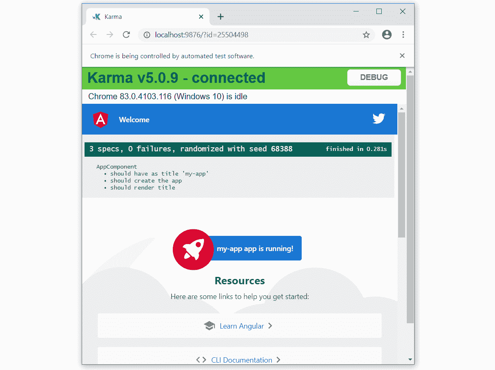
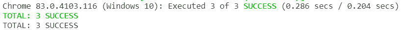

# 十一、Angular App 的单元测试

在前面的章节中，我们已经介绍了如何从头构建企业应用的许多方面。但是，我们如何确保应用在未来可以不费吹灰之力地进行维护呢？一旦我们的应用开始扩展，一个全面的自动化测试层就可以成为我们的生命线，我们必须减轻 bug 的影响。

测试（更具体地说，是单元测试）是指在项目开发过程中由开发人员执行；然而，由于我们对框架的了解已经处于成熟阶段，我们将在本章中简要介绍测试Angular应用的所有复杂性。

在本章中，我们将学习如何使用测试工具对Angular应用工件执行适当的单元测试。更详细地说，我们将执行以下操作：

*   看看测试的重要性，更具体地说，单元测试。
*   了解如何测试组件（有依赖项或无依赖项），以及如何覆盖它们。
*   了解如何测试管道和管线。
*   实现服务、模拟依赖项和存根的测试。
*   拦截 XHR 请求并提供模拟响应，以实现精确控制。
*   了解如何测试指令。
*   了解如何测试被动表单并使用页面对象将测试中的控件分组在一起。

# 技术要求

*   **GitHub 链接**：[https://github.com/PacktPublishing/Learning-Angular--Third-Edition/tree/master/ch11](https://github.com/PacktPublishing/Learning-Angular--Third-Edition/tree/master/ch11) 。
*   **茉莉花**：[https://jasmine.github.io/](https://jasmine.github.io/)
*   **业力**：[https://karma-runner.github.io/](https://karma-runner.github.io/)

# 为什么我们需要测试？

什么是单元测试？如果您已经熟悉单元测试和测试驱动开发，您可以安全地跳到下一节。如果不是，我们就说单元测试是一种工程哲学的一部分，它代表了高效和敏捷的开发过程。在开发应用代码之前，他们为其添加了一层自动化测试。核心概念是一段代码伴随着它的测试，而这两段代码都是由处理该代码的开发人员构建的。首先，我们针对我们想要交付的特性设计测试，检查其输出和行为的准确性。由于该特性尚未实现，测试将失败，因此开发人员的工作是以通过测试的方式构建该特性。

单元测试非常有争议。虽然测试驱动开发有利于确保代码质量和长期维护，但并不是每个人都在日常开发工作流中进行单元测试。为什么呢？嗯，在我们开发代码的同时构建测试有时会感觉像是一种负担。特别是当测试结果大于它要测试的功能时。

但是，赞成测试的论点比反对测试的论点多：

*   构建测试有助于更好的代码设计。我们的代码必须符合测试要求，而不是相反。如果我们试图测试一段现有的代码，却发现自己在某个时候被阻塞了，那么很可能代码设计得不好，需要重新思考。另一方面，构建可测试特性有助于早期检测副作用。
*   重构经过测试的代码是防止在以后阶段引入 bug 的生命线。开发意味着随着时间的推移而发展，每次重构都会带来很高的 bug 风险。单元测试是一种很好的方法，可以确保我们在早期发现 bug，无论是在引入新特性还是更新现有特性时。
*   构建测试是记录代码的极好方法。当不熟悉代码库的人接管开发工作时，它将成为一种无价的资源。

这些只是几个论点，但是你可以在网上找到无数关于测试代码的好处的资源。如果你还不确信，试试看；否则，让我们继续我们的旅程，看看测试的整体形式。

# 单元测试的剖析

测试一段代码有许多不同的方法。在本章中，我们将介绍一个测试的解剖结构，它由不同的部分组成。要测试任何代码，我们需要两样东西：一个用于编写测试的框架和一个用于运行测试的运行程序。测试框架应该为构建测试套件提供实用功能，每个套件包含一个或多个测试规范。因此，单元测试涉及以下概念：

*   **测试套件**：为一系列测试创建逻辑分组的套件。例如，套件可以包含特定功能的所有测试。
*   **测试规范**：实际单元测试。

我们将使用**Jasmine**，这是一个流行的测试框架，默认情况下在 Angular CLI 项目中也会使用它。下面是 Jasmine 中单元测试的外观：

```ts
describe('Calculator', () => {
  it('should add two numbers', () => {
    expect(1+1).toBe(2);
  });
});
```

`describe`方法用于定义测试套件，并接受名称和箭头`function`作为参数。箭头`function`是测试套件的主体，包含多个单元测试。`it`方法用于定义单个单元测试。它接受名称和箭头`function`作为参数。

每个测试规范检查套件名称中描述的特性的特定功能，并在其主体中声明一个或多个期望。每个期望值都取一个称为期望值的值，并使用匹配器`function`将其与实际值进行比较。`function`检查预期值和实际值是否相应匹配，称为**断言**。测试框架是否通过规范取决于此类断言的结果。在前面的示例中，`1+1`将返回实际值，该值应与`toBe`匹配器`function`中声明的预期值`2`匹配。

重要提示

Jasmine 框架根据用户特定的需求包含各种 matcher 函数，我们将在本章后面看到。

假设前面的代码包含另一个需要测试的数学运算。将这两项业务分为一组是有意义的：

```ts
describe('Calculator', () => {
  it('should add two numbers', () => {
    expect(1+1).toBe(2);
  });
  it('should subtract two numbers', () => {
    expect(1-1).toBe(0);
  });
});
```

到目前为止，我们已经了解了测试套件以及如何使用它们根据功能对测试进行分组。此外，我们还了解了如何调用我们想要测试的代码，并确认它做了我们认为它做的事情。然而，在单元测试中还有更多值得了解的概念，即设置和拆卸功能。

设置功能是在开始运行测试之前准备代码的功能。这是一种保持代码更干净的方法，这样您就可以专注于调用代码和检查断言。拆卸功能与设置功能相反，它负责拆卸我们最初设置的内容，这些内容涉及清理资源等活动。让我们通过一个代码示例来了解实际情况：

```ts
describe('Calculator', () => {
  let total: number;
  beforeEach(() => total = 1);
  it('should add two numbers', () => {
    total = total + 1;
    expect(total).toBe(2);
  });
  it('should subtract two numbers', () => {
    total = total - 1;
    expect(total).toBe(0);
  });
  afterEach(() => total = 0);
});
```

`beforeEach`方法用于设置功能，并在每次单元测试之前运行。在本例中，我们在每次测试之前将`total`变量的值设置为`1`。`afterEach`方法用于运行拆卸逻辑。每次测试后，我们将`total`变量的值重置为`0`。

因此，很明显，测试只需要关心调用应用代码和断言结果，这使得测试更干净；然而，在现实世界的应用中，测试往往有很多设置在进行。最重要的是，`beforeEach`方法倾向于更容易添加新的测试，这很好。您最终想要的是经过良好测试的代码；编写和维护这样的代码越容易，对您的软件就越好。

现在我们已经介绍了单元测试的基础知识，让我们看看如何在 Angular 框架的上下文中将它们付诸实施。

# 引入Angular测试中的单元测试

在前面的部分中，我们熟悉了单元测试及其一般概念，如测试套件、测试规范和断言。现在是时候冒险使用 Angular 进行单元测试了，用这些知识武装起来。在我们开始编写 Angular 测试之前，让我们先看看 Angular 框架和 Angular CLI 为我们提供的工具，让单元测试成为一种愉快的体验：

*   **Jasmine**：我们已经了解到这是测试框架。
*   **Karma**：运行我们单元测试的测试运行者。
*   **Angular testing utilities**：一组帮助方法，帮助我们在 Angular 框架的上下文中设置单元测试和编写断言。

## 将 Karma 配置为测试跑步者

在配置方面，当使用 Angular CLI 时，我们不必做任何事情使其工作。我们一创建新的 Angular CLI 项目，单元测试就可以开箱即用。当我们深入研究 Angular 中的单元测试时，我们需要了解一些利用我们的能力来测试不同工件的概念，例如组件和指令。Angular CLI 使用 Karma 作为测试运行者。正如我们在[*第 5 章*](05.html#_idTextAnchor129)*中了解到的，`karma.conf.js`文件负责配置 Karma test runner。在此文件中，我们可以指定以下内容：*

*   增强 Karma test runner 的各种插件。
*   我们需要运行的测试的位置。有一个`files`属性，指定在哪里可以找到应用代码和单元测试；但是，对于 Angular CLI，可以在`tsconfig.spec.json`文件中找到此属性。
*   设置一个选定的覆盖工具，用于测量我们的测试覆盖应用代码的程度。
*   在控制台窗口、浏览器或其他方式中报告每个执行测试的记者。
*   不同的浏览器来运行我们的测试。

使用 Angular CLI，您很可能不需要自己更改或编辑此文件，但最好了解它的存在及其功能。

## Angular测试实用程序

Angular测试实用程序帮助我们创建一个测试环境，使为Angular工件编写测试变得容易。它由`TestBed``class`和可以在`@angular/core/testing`名称空间下找到的各种辅助方法组成。随着本章的进展，我们将了解这些是什么，以及它们如何帮助我们测试各种工件。现在，让我们来看看最常用的概念，以便在我们稍后更详细地介绍它们时您熟悉它们：

*   `TestBed``class`是最关键的概念。它本质上创建了一个测试模块，其行为类似于普通的Angular模块。实际上，当我们测试一个Angular伪影时，我们将它从它所在的Angular模块中分离出来，并将它附加到这个测试模块上。`TestBed``class`包含`configureTestingModule`方法，我们根据需要设置测试模块。
*   `ComponentFixture`是围绕角组件实例的包装器`class`。它允许我们与组件及其相应的元素进行交互。
*   `DebugElement`也是组件的 DOM 元素的包装器。它是一个跨平台操作的抽象，因此我们的测试是独立于平台的。

现在我们已经了解了我们的测试环境以及使用的框架和库，我们可以开始用 Angular 编写我们的第一个单元测试了。我们将从 Angular 最基本的构建块开始这一伟大的旅程，组件。

# 测试组件

您可能已经注意到，每次我们使用 Angular CLI 构建新的 Angular 应用或生成Angular 工件时，它也会为我们创建一些测试文件。

Angular CLI 中的测试文件在其文件名中包含单词`spec`，以便 Karma runner 更容易找到并运行它们。主要是，测试的文件名与正在测试的Angular伪影相同，后跟后缀`.spec.ts`。例如，Angular app 的主要组件的测试文件`app.component.ts`将是`app.component.spec.ts`，并且将与组件文件位于同一路径中。

重要提示

我们应该将Angular伪影及其相应的测试视为一件事。当我们更改工件的逻辑时，我们还需要修改单元测试。将单元测试文件与其Angular伪影放在一起，使我们更容易记住和编辑它们。当我们需要对代码进行重构时，它也会帮助我们，比如移动工件（不要忘记移动单元测试）。

当我们构建一个新的 Angular 应用时，Angular CLI 会自动为主要组件`AppComponent`创建一个测试：

1.  At the beginning of the file, there is a `beforeEach` statement that is used for setup purposes:

    ```ts
    beforeEach(async(() => {
      TestBed.configureTestingModule({
        declarations: [
          AppComponent
        ],
      }).compileComponents();
    }));
    ```

    它使用`TestBed``class`的`configureTestingModule`方法，并将对象作为参数传递。此对象的属性与`@NgModule`装饰器的属性相同，因此我们可以利用如何配置Angular模块的知识，并将其应用于设置测试模块，因为这是相同的事情。我们可以指定一个包含`AppComponent`的`declarations`数组。就测试而言，`AppComponent`现在属于测试模块的声明项。最后调用`compileComponents`方法，完成设置。

    重要提示

    `compileComponents`方法根据其名称编译在测试模块中配置的组件。在编译过程中，它还内联外部 CSS 文件和模板。在本章的其余部分，我们不打算使用这种方法，因为 Angular CLI 在幕后为我们提供了这种方法；但是，不要忘记，Angular 测试实用程序可以与 Angular CLI 以外的构建工具一起使用。

2.  The first unit test verifies whether we can create a new instance of `AppComponent` using the `createComponent` method:

    ```ts
    it('should create the app', () => {
      const fixture = TestBed.createComponent(AppComponent);
      const app = fixture.componentInstance;
      expect(app).toBeTruthy();
    });
    ```

    `createComponent`方法的结果是`AppComponent`类型的`ComponentFixture`实例，可以使用`componentInstance`属性为我们提供组件的实例。我们还使用`toBeTruthy`匹配器`function`检查生成的实例是否有效。

3.  As soon as we have access to the component instance, we can typically query its `public` properties and methods:

    ```ts
    it(`should have as title 'my-app'`, () => {
      const fixture = TestBed.createComponent(AppComponent);
      const app = fixture.componentInstance;
      expect(app.title).toEqual('my-app');
    });
    ```

    在之前的测试中，我们使用另一个匹配器`function``toEqual`检查组件的`title`属性是否等于`my-app`值。

4.  As we learned, a component consists of a TypeScript `class` and a template file. So testing it only from the class perspective, as in the previous test, is not sufficient. We should also test whether the `class` interacts correctly with the DOM:

    ```ts
    it('should render title', () => {
      const fixture = TestBed.createComponent(AppComponent);
      fixture.detectChanges();
      const compiled = fixture.nativeElement;
      expect(compiled.querySelector('.content span').  textContent).toContain('my-app app is running!');
    });
    ```

    重要提示

    许多开发人员倾向于使用类测试而不是 DOM 测试，他们依赖**端到端（E2E）**测试，这种测试速度较慢，性能较差。E2E 测试通常验证应用与后端 API 的集成，并且容易中断。因此，建议您在 Angular 应用中执行 DOM 单元测试。

    我们以与之前类似的方式创建组件，我们称之为`ComponentFixture`的`detectChanges`方法。`detectChanges`方法触发Angular变化检测机制，强制更新数据绑定。它在第一次调用组件时执行组件的`ngOnInit`生命周期事件，在随后的任何调用中执行`ngOnChanges`，因此我们可以使用`nativeElement`属性查询组件的 DOM 元素。在本例中，我们检查与`title`属性对应的 HTML 元素的`textContent`。

为了运行我们的测试，我们使用 Angular CLI 的`test`命令：

```ts
ng test
```

前面的命令启动 Karma runner，获取所有单元测试文件并执行它们。根据流道配置，浏览器将打开并显示每个测试的结果。默认情况下，Angular CLI 使用 Google Chrome 浏览器。输出如下所示：



图 11.1–Karma 测试转轮输出

在上图中，我们可以在页面顶部看到每个测试的结果。我们还可以看到 Karma 是如何按套件对每个测试进行可视化分组的。在我们的例子中，唯一的测试套件是**AppComponent**。

重要提示

该页面还呈现我们测试的最后一个组件。在我们的例子中，这恰好是`AppComponent`，因为我们在一个新的 Angular 应用中只有一个。随着本章的深入，呈现的组件可能会发生变化，因为 Karma 以随机顺序运行单元测试。

现在让我们做一个测试失败。打开`app.component.ts`文件，将`title`属性值改为`my-new-app`，保存文件。Karma 将重新执行我们的测试，并在页面上显示结果：


图 11.2–测试失败

重要提示

Karma 在监视模式下运行，因此我们不需要每次进行更改时都执行 Angular CLI test 命令。

在某些情况下，在浏览器中读取测试的输出不是很方便。或者，我们可以检查用于运行`ng test`命令的控制台窗口，其中包含一个修剪版本的测试结果：



图 11.3–控制台测试输出

我们通过查看自动为我们创建的`AppComponent`测试，已经获得了很多见解。在下一节中，我们将看到一个关于如何测试具有依赖关系的组件的更高级场景。

## 依赖性测试

在现实场景中，组件通常不像`AppComponent`那么简单。他们几乎肯定会依赖一项或多项服务。在这种情况下，我们有不同的方法来处理测试。不过，有一点是清楚的：如果我们正在测试组件，那么就不应该同时测试服务。因此，当我们设置这样一个测试时，依赖性不应该是真实的。当涉及到单元测试时，有不同的处理方法；没有一种解决方案比另一种解决方案更好：

*   **存根**：这是告诉依赖项注入器注入我们提供的依赖项的存根而不是真实内容的方法。
*   **Spying**: This is the method of injecting the actual dependency, but attaching a spy to the method that we call in our component. We can then either return mock data or let the method call through.

    重要提示

    当依赖项比较复杂时，您应该更喜欢使用 stubing 而不是 spying。一些服务在其`constructor`中注入其他服务，因此在测试中使用真正的依赖关系也需要补偿其他依赖关系。

无论采用何种方法，我们都确保测试不会执行任何意外操作，例如与文件系统通信或尝试通过 HTTP 进行通信；也就是说，我们正在完全隔离地测试组件。

### 用存根替换依赖项

用存根替换依赖项意味着我们完全用伪依赖项替换依赖项。我们可以通过以下两种方式之一创建假依赖项：

*   创建一个常量变量，该变量包含实际依赖项的属性和方法。
*   创建依赖项的实际`class`的模拟定义。

这两种方法没有太大区别。在本节中，我们将看第一个。您可以按照自己的速度自由探索第二个。考虑以下组件：

stub.component.ts

```ts
import { Component, OnInit } from '@angular/core';
import { StubService } from '../stub.service'
@Component({
  selector: 'app-stub',
  template: ‹<span>{{msg}}<span>›
})
export class StubComponent implements OnInit {
  msg: string;
  constructor(private stub: StubService) { }
  ngOnInit() {
    this.msg = !this.stub.isBusy
      ? this.stub.name + ' is available'
      : this.stub.name + ' is on a mission';
  }
}
```

它向`StubService`注入只包含两个`public`属性。为该服务提供存根非常简单，如下例所示：

```ts
const serviceStub: Partial<StubService> = {
  name: 'Boothstomper'
};
```

我们已将该服务声明为`Partial`，因为我们只希望最初设置`name`属性。现在，我们可以使用对象文字语法在测试模块中注入存根服务：

```ts
TestBed.configureTestingModule({
  declarations: [StubComponent],
  providers: [
    { provide: StubService, useValue: serviceStub }
  ]
});
```

组件的`msg`属性依赖于服务的`isBusy``boolean`属性的值。因此，我们需要在测试套件中获取对服务的引用，并在每个测试中为该属性提供备用值。我们可以通过`TestBed``class`的`inject`方法得到`StubService`的注入实例：

```ts
beforeEach(() => {
  TestBed.configureTestingModule({
    declarations: [StubComponent],
    providers: [
      { provide: StubService, useValue: serviceStub }
    ]
  });
  fixture = TestBed.createComponent(StubComponent);
  component = fixture.componentInstance;
  msgDisplay = fixture.nativeElement.querySelector('span');
  service = TestBed.inject(StubService);
});
```

重要提示

我们将真实的`StubService`作为参数传递给`inject`方法，*而不是*我们创建的存根版本。修改存根的值不会对注入的服务产生任何影响，因为我们的组件使用实际服务的实例。`inject`方法向应用的根注入器请求请求的服务。如果服务是从组件注入器提供的，我们需要使用`fixture.debugElement.injector.get(StubService)`从组件注入器获取服务。

现在，我们可以编写测试来检查组件的`msg`属性在数据绑定期间是否正常工作：

```ts
describe('status', () => {
  it(‹should be on a mission›, () => {
    service.isBusy = true;
    fixture.detectChanges();
    expect(msgDisplay.textContent).    toContain('is on a mission');
  });
  it('should be available', () => {
    service.isBusy = false;
    fixture.detectChanges();
    expect(msgDisplay.textContent).toContain('is available');
  });
});
```

存根依赖项并不总是可行的，尤其是当根注入器不提供它时。可以在部件喷油器级别提供服务。使用我们前面看到的流程提供存根没有任何效果。那么，我们如何应对这种情况呢？我们正在使用`TestBed``class`的`overrideComponent`方法：

```ts
TestBed.configureTestingModule({
  declarations: [StubComponent],
}).overrideComponent(StubComponent, {
  set: {
    providers: [
      { provide: StubService, useValue: serviceStub }
    ]
  }
});
```

`overrideComponent`方法接受两个参数：提供服务的组件类型和覆盖元数据对象。元数据对象包含用于向组件提供服务的属性`set`。

对依赖项进行存根非常简单，但并不总是可行的，我们将在下一节中看到这一点。

### 监视依赖方法

前面提到的使用存根的方法并不是在单元测试中隔离我们自己的唯一方法。我们不必替换整个依赖项，只需替换组件使用的部分即可。替换某些部分意味着我们指出依赖项上的特定方法，并为它们指定一个间谍。间谍可以回答您希望它回答的问题，但您也可以看到它被调用了多少次，以及使用了哪些参数。所以一个间谍会给你更多关于正在发生的事情的信息。

在依赖项中设置间谍有两种方法：

*   注入实际依赖项并监视其方法。
*   使用 Jasmine 的`createSpyObj`方法创建依赖项的假实例。然后，我们可以像监视真实依赖项一样监视该依赖项上的方法。

让我们看看如何设置第一个案例。考虑下面的组件，它使用Angular框架的 SurvivT0 服务：

spy.component.ts

```ts
import { Component, OnInit } from '@angular/core';
import { Title } from '@angular/platform-browser';
@Component({
  selector: 'app-spy',
  template: '{{caption}}'
})
export class SpyComponent implements OnInit {
  caption: string;
  constructor(private title: Title) { }
  ngOnInit() {
    this.title.setTitle('My Angular app');
    this.caption = this.title.getTitle();
  }
}
```

重要提示

`Title`服务用于与 Angular 应用的 HTML 文档标题交互，可以从`@angular/platform-browser`npm 包导入。

我们对`Title`服务没有任何控制权，因为它内置于框架中。它可能有我们不知道的依赖关系。在我们的测试中使用它的最简单和最安全的方法是监视它的方法。我们通常将其注入测试模块的`providers`属性中，然后在我们的测试中使用它，如下所示：

```ts
it('should set the title', () => {
  const title = TestBed.inject(Title);
  const spy = spyOn(title, 'setTitle');
  fixture.detectChanges();
  expect(spy.calls.mostRecent().args[0]).  toBe('My Angular app');
});
```

我们使用Jasmine 的`spyOn`方法，该方法接受两个参数：要监视的对象和特定方法。注意，我们在调用`detectChanges`方法之前使用它，因为我们希望在触发`ngOnInit`生命周期挂钩之前连接 spy。然后，`expect`语句验证在`setTitle`方法中传递的参数。在某些情况下，服务方法可能在组件的整个生命周期中被多次调用，因此检查最近的调用更安全，就像我们在本例中使用`spy.calls.mostRecent`方法所做的那样。

我们的组件还使用了`Title`服务的另一种方法`getTitle`方法来获取文档的标题。我们可以利用前面定义的第二种情况来监视该方法并返回模拟数据：

1.  首先，我们需要将`Title`服务定义为间谍对象：

    ```ts
    let titleSpy: jasmine.SpyObj<Title>;
    ```

2.  我们使用`createSpyObj`方法初始化 spy 对象，传递两个参数：服务名称和组件当前使用的方法名称数组：

    ```ts
    titleSpy = jasmine.createSpyObj('Title', ['getTitle', 'setTitle']);
    ```

3.  We attach a spy to the `getTitle` method and return a custom title using the `returnValue` method of Jasmine:

    ```ts
    titleSpy.getTitle.and.returnValue('My title');
    ```

    一旦我们将它添加到测试模块的`providers`数组中，我们就可以在测试中使用它。产生的测试套件应如下所示：

    ```ts
    let titleSpy: jasmine.SpyObj<Title>;
    beforeEach(() => {
      titleSpy = jasmine.createSpyObj('Title', ['getTitle', 'setTitle']);
      titleSpy.getTitle.and.returnValue('My title');
      TestBed.configureTestingModule({
        declarations: [SpyComponent],
        providers: [
          { provide: Title, useValue: titleSpy }
        ]
      });
      fixture = TestBed.createComponent(SpyComponent);
      component = fixture.componentInstance;
    });
    it('should get the title', () => {
      fixture.detectChanges();
      expect(fixture.nativeElement.textContent).toContain('My title');
    });
    ```

很少有服务表现良好且直接，比如`Title`服务，因为它们是同步的。大多数情况下，它们是异步的，可以返回可观察到的结果或承诺。在下一节中，我们将详细了解如何测试此类场景。

### 测试异步服务

Angular测试实用程序提供两个工件来处理异步测试场景：

*   `async`：单元测试异步服务的异步方法。与`ComponentFixture`的`whenStable`方法相结合。
*   `fakeAsync`：单元测试异步服务的同步方法。与`tick`功能结合使用。

两种方法提供大致相同的功能；它们只是在我们使用它们的方式上有所不同。

重要提示

`fakeAsync`的一个显著限制是，当测试主体发出`XMLHttpRequest`调用时不能使用它，这是一种罕见的情况。

让我们看一个例子，看看如何使用每一个。考虑显示项目列表的以下组件：

async.component.ts

```ts
import { Component, OnInit } from '@angular/core';
import { Observable } from 'rxjs';
import { AsyncService } from '../async.service';
@Component({
  selector: 'app-async',
  template: `
    <p *ngFor="let hero of data$ | async">
      {{hero}}
    </p>
  `
})
export class AsyncComponent implements OnInit {
  data$: Observable<string[]>;
  constructor(private asyncService: AsyncService) { }
  ngOnInit() {
    this.data$ = this.asyncService.getData();
  }
}
```

它注入`AsyncService`并在`ngOnInit`方法中调用其`getData`方法。正如所示，`AsyncService`的`getData`方法返回一个可观察的字符串。它还引入了一点延迟，使场景看起来是异步的：

```ts
getData(): Observable<string[]> {
  return of(heroes).pipe(delay(500));
}
```

单元测试查询组件的本机元素，并检查`ngFor`指令是否正确循环通过`data$`可观察项：

```ts
it('should get data with async', async(() => {
  fixture.detectChanges();
  fixture.whenStable().then(() => {
    fixture.detectChanges();
    expect(fixture.nativeElement.querySelectorAll(‹p›).length).    toBe(5);
  });
}));
```

我们将测试主体包装在`async`方法中，最初，我们调用`detectChanges`方法来触发`ngOnInit`生命周期挂钩。此外，我们调用`whenStable`方法，该方法返回一个承诺，当`data$`可观测项完成时，该承诺立即得到解决。当承诺得到解决时，我们再次调用`detectChanges`来触发数据绑定并相应地查询 DOM。

重要提示

当我们想要测试包含模板驱动表单的组件时，也可以使用`whenStable`方法。这种方法的异步特性使我们更喜欢在应用中使用反应形式。

如果您确定要在现代 evergreen 浏览器或其他支持新`async/await`语法的环境中运行测试，那么您可以轻松地重构单元测试，如下所示：

```ts
it('should get data with async/await', async () => {
  fixture.detectChanges();
  await fixture.whenStable();
  fixture.detectChanges();
  expect(fixture.nativeElement.querySelectorAll(‹p›).length).  toBe(5);
});
```

在这种方法中，我们从`async`*方法*中打开测试体，并将其替换为`async`*关键字*。我们在`whenStable`方法调用前面添加了`await`关键字，现在它看起来更具可读性和同步性。

另一种同步方法是使用`fakeAsync`方法并编写相同的单元测试，如下所示：

```ts
it('should get data with fakeAsync', fakeAsync(() => {
  fixture.detectChanges();
  tick(500);
  fixture.detectChanges();
  expect(fixture.nativeElement.querySelectorAll(‹p›).length).  toBe(5);
}));
```

在前面的代码片段中，我们用`fakeAsync`方法包装了测试体，并用`tick`替换了`whenStable`。`tick`方法将时间提前*500ms*，这是我们在`AsyncService`的`getData`方法中引入的虚拟延迟。

使用异步服务测试组件有时会成为一场噩梦。尽管如此，所描述的每种方法都可以在这项任务中大大帮助我们；然而，组件不仅与服务有关，还与输入和输出绑定有关。在下一节中，我们将学习如何测试组件的公共 API。

## 使用输入和输出进行测试

到目前为止，我们已经学习了如何测试具有简单属性的组件，处理依赖关系，以及同步和异步服务。但一个组成部分的意义远不止这些。正如我们在[*第 3 章*](03.html#_idTextAnchor092)*组件交互和交互通信*中所了解到的，组件有一个公共 API，该 API 由需要测试的输入和输出组成。

因为我们想要测试组件的公共 API，所以测试从另一个组件托管时它如何交互是有意义的。应通过两种方式对此类组件进行测试：

*   我们应该验证输入绑定设置是否正确。
*   我们应该验证输出绑定是否正确触发，以及它发出的内容是否被接收。

假设我们有以下带有输入和输出绑定的简单组件：

bindings.component.ts

```ts
import { Component, Input, Output, EventEmitter } from '@angular/core';
@Component({
  selector: 'app-bindings',
  template: `
    <p>{{title}}</p>
    <button (click)="liked.emit()">Like!</button>
    `
})
export class BindingsComponent {
  @Input() title: string;
  @Output() liked = new EventEmitter();
}
```

在开始编写测试之前，我们应该创建一个测试主机组件，该组件将使用被测组件：

```ts
@Component({
  template: '<app-bindings [title]="testTitle"   (liked)="isFavorite = true"></app-bindings>'
})
export class TestHostComponent {
  testTitle = 'My title';
  isFavorite: boolean;
}
```

请注意，在设置阶段，我们在测试模块中声明了这两个组件，但`ComponentFixture`属于`TestHostComponent`类型：

```ts
let component: TestHostComponent;
let fixture: ComponentFixture<TestHostComponent>;
beforeEach(() => {
  TestBed.configureTestingModule({
    declarations: [
      BindingsComponent,
      TestHostComponent
    ]
  });
  fixture = TestBed.createComponent(TestHostComponent);
  component = fixture.componentInstance;
  fixture.detectChanges();
});
```

我们之所以采用这种方法，是因为我们想在`BindingsComponent`与主机组件一起使用时进行测试，而不是单独测试。我们的单元测试将验证`BindingsComponent`在与`TestHostComponent`交互时的行为。

第一个测试检查`title`属性的输入绑定是否已正确应用：

```ts
it('should display the title', () => {
  const titleDisplay: HTMLElement = fixture.nativeElement.  querySelector(‹p›);
  expect(titleDisplay.textContent).toBe(component.testTitle);
});
```

第二个验证`isFavorite`属性是否与`liked`输出事件正确连接：

```ts
it('should emit the liked event', () => {
  const button: HTMLButtonElement = fixture.nativeElement.  querySelector('button');
  button.click();
  expect(component.isFavorite).toBeTrue();
});
```

在前面的测试中，我们使用`ComponentFixture`的`nativeElement`属性查询`button`元素的 DOM，然后单击它以发出输出事件。或者，我们可以使用`debugElement`属性找到`button`元素，并使用其`triggerEventHandler`方法单击它：

```ts
it('should emit the liked event using debugElement', () => {
  const button: DebugElement = fixture.debugElement.query(By.  css('button'));
  button.triggerEventHandler('click', null);
  expect(component.isFavorite).toBeTrue();
});
```

我们正在使用接受谓词`function`作为参数的`query`方法。谓词使用`By``class`的`css`方法通过 CSS 选择器定位元素。

重要提示

正如我们在章节*引入单元测试中所了解的，`debugElement`是框架不可知的。如果您确定测试只在浏览器中运行，那么应该使用`nativeElement`属性。*

`triggerEventHandler`方法接受两个参数。第一个是要触发的事件的名称；在我们的例子中，这是`click`事件。第二个是我们可以传递给事件的附加可选数据，例如单击了哪个鼠标按钮。

如果我们将`BindingsComponent`作为独立测试，我们本可以避免很多代码，而且它仍然有效。但我们会错过将其作为现实场景进行测试的机会。组件的公共 API 旨在供其他组件使用，因此我们应该以这种方式对其进行测试。

关于如何测试具有依赖性的组件，我们已经经历了许多方法。现在是学习如何单独测试依赖关系的时候了。

# 测试服务

正如我们在[*第 5 章*](05.html#_idTextAnchor129)*中了解到的，*构造了一个Angular应用*，服务也可以注入其他服务来使用。测试独立服务非常简单：我们从注入器获取一个实例，然后开始查询其`public`属性和方法。*

重要提示

我们只对测试服务的公共 API 感兴趣，它是组件和其他工件交互的接口。私人符号在测试中没有任何价值，除非它们有任何公共副作用。例如，`public`方法可以调用`private`方法，该方法可以将`public`属性设置为副作用。

我们可以在服务中执行三种不同类型的测试：

*   测试同步操作，例如返回简单数组的方法
*   测试异步操作，例如返回可观察值的方法
*   使用依赖项测试服务，例如发出 HTTP 请求的方法

让我们在下面的部分中更详细地介绍它们。

## 测试同步方法

在开始编写我们的测试之前，我们需要设置我们的测试模块：

```ts
let service: AsyncService;
beforeEach(() => {
  TestBed.configureTestingModule({});
  service = TestBed.inject(AsyncService);
});
```

`AsyncService`不依赖于任何东西，它还提供了 Angular app 的根注入器，因此我们将一个空对象传递给`configureTestingModule`方法。然后，我们可以使用`TestBed``class`中的`inject`方法获取被测服务的实例。

重要提示

当从根以外的注入器提供服务时，我们应该将其添加到测试模块的`providers`属性中，就像我们对组件所做的那样。

第一个测试非常简单，因为它调用`setData`方法并检查其结果：

```ts
it('should set data', () => {
  const result = service.setData('Fake hero');
  expect(result.length).toBe(6);
});
```

大多数时候，为同步方法编写测试相对容易；然而，当我们想要测试异步方法时，情况就不同了。

## 测试异步方法

第二个测试有点棘手，因为它涉及一个可观察的。我们需要订阅`getData`方法，并在观测值完成后立即检查该值：

```ts
it('should get data', (done: DoneFn) => {
  service.getData().subscribe(heroes => {
    expect(heroes.length).toBe(5);
    done();
  });
});
```

因果报应不知道一个可观察对象将在何时完成，因此我们提供了`done`方法来表示该可观察对象已经完成，框架现在可以断言`expect`语句。

## 测试具有依赖性的服务

使用依赖项测试服务类似于使用依赖项测试组件。我们在*测试组件*一节中看到的的每一种不同方式都可以以完全相同的方式应用；然而，在测试注入`HttpClient`的服务时，我们采用了不同的方法。考虑下面的服务，它对一个虚拟后端 API 做出 HTTP 请求：

data.service.ts

```ts
import { Injectable } from '@angular/core';
import { HttpClient } from '@angular/common/http';
import { Observable } from 'rxjs';
@Injectable({
  providedIn: 'root'
})
export class DataService {
  constructor(private http: HttpClient) { }
  getHeroes(): Observable<string[]> {
    return this.http.get<string[]>('api/heroes');
  }
  addHero(name: string) {
    return this.http.post<string>('api/heroes', {hero: name});
  }
}
```

Angular测试实用程序为单元测试中模拟 HTTP 请求提供了两个工件：替换`HttpClientModule`的`HttpClientTestingModule`和模拟`HttpClient`服务的`HttpTestingController`。我们可以从`@angular/common/http/testing`名称空间导入这两个名称：

```ts
TestBed.configureTestingModule({
  imports: [HttpClientTestingModule]
});
httpTestingController = TestBed.inject(HttpTestingController);
```

我们的测试不会发出真正的 HTTP 请求。他们只需要验证它是否具有正确的选项，以及我们是否会收到正确的答案。以下是验证`getHeroes`方法的第一个测试：

```ts
it('should get heroes', () => {
  const heroes = [‹Boothstomper', 'Drogfisher'];
  service.getHeroes().subscribe(heroes => expect(heroes.  length).toBe(2));
  const req = httpTestingController.expectOne('api/heroes');
  expect(req.request.method).toEqual('GET');
  req.flush(heroes);
});
```

我们使用`HttpTestingController`的`expectOne`方法启动一个伪请求，该方法将 URL 作为参数。`expectOne`方法不仅创建了一个我们可以检查的模拟请求对象，而且还断言只对特定 URL 发出了一个请求。创建请求后，我们可以验证其方法是否为`GET`，并使用`flush`方法返回响应。当我们调用要测试并订阅的`getHeroes`方法时，使用`flush`方法的响应。

在测试**POST**方法时，我们遵循类似的方法，只是我们需要确保请求的主体包含正确的数据：

```ts
it('should add a hero', () => {
  service.addHero('Bloodyllips').subscribe();
  const req = httpTestingController.expectOne('api/heroes');
  expect(req.request.method).toEqual('POST');
  expect(req.request.body).toEqual({hero: 'Bloodyllips'})
  req.flush('');
});
```

在本例中，我们不关心响应，因此我们将一个空字符串传递给`flush`方法。

在下一节中，我们将通过学习如何测试管道，继续我们的测试世界之旅。

# 测试管

正如我们在[*第 4 章*](04.html#_idTextAnchor113)*中了解到的，*使用管道和指令*增强组件，管道是实现`PipeTransform``interface`的类型脚本`class`。它公开了一个通常是同步的`transform`方法，这意味着它很容易测试。让我们创建一个简单的管道，将逗号分隔的`string`转换为列表：*

list.pipe.ts

```ts
import { Pipe, PipeTransform } from '@angular/core';
@Pipe({
  name: 'list'
})
export class ListPipe implements PipeTransform {
  transform(value: string): string[] {
    return value.split(',');
  }
}
```

为此编写测试非常简单。我们只需要实例化一个`ListPipe`的对象，并用一些模拟数据验证`transform`方法的结果：

```ts
it('should return an array', () => {
  const pipe = new ListPipe();
  expect(pipe.transform('A,B,C')).toEqual(['A', 'B', 'C']);
});
```

值得注意的是测试管道时不涉及Angular测试实用程序。我们只需创建管道`class`的一个实例，就可以开始调用方法了。很简单！

在下一节中，我们将查看一个更高级的测试场景，即路由。

# 测试路由

就像组件一样，路由在我们的应用提供高效用户体验的方式中起着至关重要的作用。因此，路由测试对于确保完美的性能至关重要。我们可以对路由执行不同的操作，我们需要针对不同的场景进行测试：

*   确保导航以正确的路由 URL 为目标。
*   确保提供了正确的参数，以便可以获取组件的正确数据或筛选组件所需的数据集。
*   确保特定路线最终装载了预期部件。

让我们在以下几节中进一步了解如何测试所有场景。

## 测试导航 URL

带路由的 Angular 应用最常见的功能是一个组件，它包含一些锚元素，上面有`routerLink`指令。正如我们在[*第 7 章*](07.html#_idTextAnchor168)*中了解到的，`routerLink`指令还可以包含如下参数：*

```ts
<a routerLink="home">Home</a>
<a [routerLink]="['heroes', 1]">Hero</a>
```

测试这一点的一种方法是检查`routerLink`指令是否已正确设置。但我们不希望在测试期间设置路由，因为这涉及到配置许多移动部件。因此，我们需要为此创建一个指令存根：

路由-link-directive-stub.ts

```ts
import { Directive, Input } from "@angular/core";
@Directive({
  selector: '[routerLink]'
})
export class RouterLinkDirectiveStub {
  @Input('routerLink') linkParams: any;
}
```

`selector`必须与实际`routerLink`指令相匹配，才能使短截头正常工作。请注意，我们将`routerLink`值传递给`@Input`装饰器。为什么呢？我们传递给`@Input`修饰符的值表示输入绑定的*别名*。我们使用`routerLink`绑定来模拟`routerLink`指令的原始行为，而不是使用`linkParams`属性在指令中传递输入参数。

重要提示

不建议在`@Input`装饰器中为组件使用别名，因为同一属性有两个名称会让人混淆。

结果，`linkParams`属性将`routerLink`指令的 URL 传递给存根`class`。

重要提示

`routerLink`指令可能在整个应用中的许多地方使用，因此我们可能希望重用它。考虑将可重用存根和其他帮助方法放置在您的Angular项目的文件夹 TY2TY 文件夹中的文件夹 T1 文件夹中。

在开始使用`routerLink`指令的存根之前，我们需要将其添加到测试模块的`declarations`属性中。之后，我们可以编写单元测试：

```ts
it('should set up routerLink directives', () => {
  const linkDe = fixture.debugElement.queryAll(By.  directive(RouterLinkDirectiveStub));
  const links = linkDe.map(de => de.injector.  get(RouterLinkDirectiveStub));
  expect(links.length).toBe(2);
  expect(links[0].linkParams).toEqual('home');
  expect(links[1].linkParams).toEqual(['heroes', 1]);
});
```

我们正在使用`By``class`中的另一个谓词`function`-`directive`方法，该方法可以根据Angular组件或指令的类型定位该组件或指令。因为我们有多个`routerLink`指令，所以我们使用`debugElement`属性的`queryAll`方法来查找它们。一旦我们从调试元素的注入器获得指令实例，我们就可以检查它们是否存在以及它们的参数是什么。

## 测试路线参数

Angular 应用具有一些执行路由的组件和其他路由到的组件，可能带有参数。在后一种情况下，组件的任务是挖掘参数的值，并相应地进行操作，例如调用服务。考虑以下组件：

```ts
export class MenuComponent implements OnInit {
  heroId: number;
  constructor(private route: ActivatedRoute) { }
  ngOnInit() {
    this.route.paramMap.subscribe(params =>     this.heroId = +params.get('id'));
  }
}
```

订阅`ActivatedRoute`服务的`paramMap`可观察项，并获取名为`id`的参数值。目前，我们想要测试组件是否正确地获取参数，并且我们不关心它之后用它的值做什么，所以我们需要存根`ActivatedRoute`服务。这听起来可能有点吓人，但事实并非如此。

我们已经在[*第 6 章*](06.html#_idTextAnchor149)中了解了`Subject``class`，*使用异步数据服务丰富组件*。我们可以使用这种`class`的味道来构建`paramMap`可观察的行为。有了这些知识，让我们开始创建我们的`ActivatedRouteStub`：

激活的路由存根.ts

```ts
import { convertToParamMap, ParamMap, Params } from '@angular/router';
import { ReplaySubject } from 'rxjs';
export class ActivatedRouteStub {
  private subject = new ReplaySubject<ParamMap>();
  constructor(initialParams?: Params) {
    this.setParamMap(initialParams);
  }
  readonly paramMap = this.subject.asObservable();
  setParamMap(params?: Params) {
    this.subject.next(convertToParamMap(params));
  }
}
```

我们定义了一个`paramMap`可观察对象，它从`ReplaySubject`实例中获取值。我们使用`asObservable`方法将`ReplaySubject`类型的值转换为可观察值。

重要提示

`ReplaySubject`与`Subject`类似，只是*将*旧值重放给新用户。

路线参数可通过`constructor`或`setParamMap`方式设置。我们使用内置的`convertToParamMap`方法将它们转换为`ParamMap`，因为`ReplaySubject`变量属于`ParamMap`类型。

现在，我们可以在测试中轻松模拟将路由参数传递给组件的过程：

1.  首先，我们在设置阶段的`beforeEach`语句中创建`ActivatedRouteStub`的`class`实例，并传递`id`参数的值：

    ```ts
    const activatedRoute = new ActivatedRouteStub();
    activatedRoute.setParamMap({id: 1});
    ```

2.  然后，我们将`activatedRoute`变量添加到测试模块的`providers`属性中：

    ```ts
    TestBed.configureTestingModule({
      declarations: [
        MenuComponent,
        RouterLinkDirectiveStub
      ],
      providers: [
        { provide: ActivatedRoute, useValue: activatedRoute }
      ]
    });
    ```

3.  Finally, in our unit test, we check whether the component property has been set from the route parameters correctly:

    ```ts
    it('should get the id parameter', () => {
      expect(component.heroId).toBe(1);
    });
    ```

    重要提示

    您可以扩展`ActivatedRouteStub``class`来支持通过`ActivatedRoute`的`snapshot`属性传递参数。我们鼓励你这样做！

## 测试路线

到目前为止，我们一直依靠存根在 Angular 应用中测试路由；然而，有一种方法可以通过合并`RouterTestingModule`来测试实际路由的行为。它是路由的一个非常合格的存根版本，所以在这个意义上，原则上和创建我们自己的路由并没有太大区别，正如我们前面看到的。

`RouterTestingModule`的真正好处在于，它允许我们仅定义测试所需的路线：

```ts
TestBed.configureTestingModule({
  imports: [
    RouterTestingModule.withRoutes([{
      path: 'heroes/:id',
      component: MenuComponent
    }])
  ],
  declarations: [MenuComponent]
});
```

然后，我们可以像编写所有其他方法一样编写测试，它们应该可以工作。使用这种方法，我们还可以验证特定路由是否激活了正确的组件。如果你的 Angular 应用包含高级路由技术，那么这应该是一个不错的选择。

路线测试的另一个关键方面是`router-outlet`指令。正如我们在[*第 7 章*](07.html#_idTextAnchor168)中已经了解到的，*通过路由*浏览组件，它是呈现路由组件的占位符。通常的方法是为组件存根提供适当的`selector`和空的`template`：

路由-outlet-component-stub.ts

```ts
import { Component } from '@angular/core';
@Component({
  selector: 'router-outlet',
  template: ''
})
export class RouterOutletComponentStub { }
```

我们可以使用`@angular/core`npm 包中的`NO_ERRORS_SCHEMA`模式并将其添加到测试模块的`schemas`属性中，而不是创建另一个存根：

```ts
TestBed.configureTestingModule({
  declarations: [
    MenuComponent,
    RouterLinkDirectiveStub
  ],
  providers: [
    { provide: ActivatedRoute, useValue: activatedRoute }
  ],
  schemas: [NO_ERRORS_SCHEMA]
});
```

在前面的代码段中，Angular 编译器会自动忽略模板中它无法识别的任何组件。

重要提示

`NO_ERRORS_SCHEMA`方法可用于其他组件，但不应过度使用。请注意，Angular 编译器不会告诉您组件中是否存在任何其他错误，从而阻止您查找错误，因此请谨慎使用。大多数时候你应该更喜欢打短发。

Angular指令是一个Angular工件，我们可能不会经常创建，因为框架提供的内置集合已经足够了；然而，如果我们创建自定义指令，我们也应该测试它们。我们将在下一节学习如何完成这项任务。

# 测试指令

指令的整体形状通常非常简单，几乎是没有视图的组件。指令通常与组件一起工作这一事实让我们很好地了解了在测试它们时如何进行。

指令可以很简单，因为它没有外部依赖项。考虑下面的指令，我们在《To.T0}中创建了第 4 章，第 2 章，第 2 章，第 3 章，第 4 章：用管道和指令增强部件，T5。

版权所有

```ts
import { Directive, ElementRef, Renderer2 } from '@angular/core';
@Directive({
  selector: '[appCopyright]'
})
export class CopyrightDirective {
  constructor(el: ElementRef, renderer: Renderer2) {
    renderer.addClass(el.nativeElement, 'copyright');
    renderer.setProperty(
      el.nativeElement,
      'textContent',
      `Copyright ©${new Date().getFullYear()} All Rights       Reserved.`
    );
  }
}
```

指令总是与组件一起使用，因此在组件上使用指令时对其进行单元测试是有意义的。让我们创建一个测试主机组件，并将其与测试中的指令一起添加到测试模块的`declarations`属性中：

```ts
@Component({
  template: '<span appCopyright></span>'
})
class TestHostComponent { }
```

我们现在可以编写测试，检查指令所附的`span`元素是否满足以下标准：

*   它设置了`copyright`类。
*   在其`textContent`属性

    ```ts
    import { Component } from '@angular/core';
    import { TestBed } from '@angular/core/testing';
    import { CopyrightDirective } from './copyright.directive';
    @Component({
      template: '<span appCopyright></span>'
    })
    class TestHostComponent { }
    describe('CopyrightDirective', () => {
      let container: HTMLElement;
      beforeEach(() => {
        const fixture = TestBed.configureTestingModule({
          declarations: [
            CopyrightDirective,
            TestHostComponent
          ]
        })
        .createComponent(TestHostComponent);
        container = fixture.nativeElement.    querySelector('span');
      });
      it('should have copyright class', () => {
        expect(container.classList).toContain('copyright');
      });
      it('should display copyright details', () => {
        expect(container.textContent).toContain(new Date().    getFullYear().toString());
      });
    });
    ```

    中显示本年度

这就是测试指令的简单程度。关键的收获是，您需要一个元素来放置指令，并且使用该元素隐式测试该指令。

我们将通过查看反应形式来结束测试过程。

# 测试反应形式

正如我们在[*第 8 章*](08.html#_idTextAnchor197)*中看到的，在*表单中编排验证体验，表单是 Angular 应用不可或缺的一部分。对于一个有Angular的应用来说，至少有一个简单的表单，比如搜索表单，这是很少见的。我们已经了解到，反应式表单在许多方面都优于模板驱动的表单，并且更易于测试，因此在本节中，我们将只关注测试反应式表单。

考虑下面的组件，它的行为类似于搜索表单：

search.component.ts

```ts
import { Component } from '@angular/core';
import { FormControl, FormGroup, Validators } from '@angular/forms';
@Component({
  selector: 'app-search',
  template: `
    <form [formGroup]="searchForm" (ngSubmit)="search()">
      <input type="text" placeholder="Username"       formControlName="searchText">
      <button type="submit"       [disabled]="searchForm.invalid">Search</button>
    </form>
    `
})
export class SearchComponent {
  get searchText(): FormControl {
    return this.searchForm.controls.searchText as FormControl;
  }
  searchForm = new FormGroup({
    searchText: new FormControl('', Validators.required)
  });
  search() {
    if(this.searchForm.valid) {
      console.log('You searched for: ' + this.searchText.value)
    }
  }
}
```

由此，我们可以确定三个测试用例：

*   `searchText`属性可以正确设置。
*   当表单无效时，`Search`按钮被禁用。
*   当表单有效时调用`console.log`方法。

为了测试反应式表单，我们首先需要将`ReactiveFormsModule`导入到测试模块中，就像在运行时一样：

```ts
TestBed.configureTestingModule({
  imports: [ReactiveFormsModule],
  declarations: [SearchComponent]
});
```

对于第一个测试，我们需要测试在输入控件中键入内容时，值是否传播到`searchText`表单控件：

```ts
it('should set the searchText', () => {
  const input: HTMLInputElement = fixture.nativeElement.  querySelector('input');
  input.value = 'Angular';
  input.dispatchEvent(newEvent('input'));
  expect(component.searchText.value).toBe('Angular');
});
```

我们使用`nativeElement`属性的`querySelector`方法找到`input`元素，并将其值设置为`Angular`。但仅此一点不足以将值传播到表单控件。Angular 框架将不知道`input`元素的值是否已更改，直到我们触发该元素的特定本机 DOM 事件。`input`事件的值表示该技巧发生了变化。我们正在使用`input`元素的`dispatchEvent`方法来触发事件。它接受一个方法作为指向`newEvent`方法的参数，该方法是创建自定义本机事件的助手。

现在我们确定表单控件已正确连接，我们可以使用它编写其余的测试：

```ts
it('should disable search button', () => {
  component.searchText.setValue('');
  expect(button.disabled).toBeTrue();
});
it('should log to the console', () => {
  const spy = spyOn(console, 'log');
  component.searchText.setValue('Angular');
  fixture.detectChanges();
  button.click();
  expect(spy.calls.first().args[0]).  toBe('You searched for: Angular');
});
```

注意，在第二个测试中，我们设置了`searchText`表单控件的值，然后调用`detectChanges`方法来启用`button`。点击按钮触发表单的`submit`事件，我们最终可以断言测试的预期。

在表单有许多控件的情况下，在我们的测试中查询它们是不方便的。或者，我们可以创建一个`Page`对象，负责查询 HTML 元素和监视服务：

```ts
class Page {
  get searchText() { return this.  query<HTMLInputElement>('input'); }
  get submitButton() { return this.  query<HTMLButtonElement>('button'); }
  private query<T>(selector: string): T {
    return fixture.nativeElement.querySelector(selector);
  }
}
```

然后我们可以在`beforeEach`语句中创建`Page`对象的实例，并在测试中访问其属性和方法。

正如我们所看到的，反应形式的本质使它们非常容易测试，因为形式模型是真理的唯一来源。

# 总结

我们的测试之旅即将结束，这是一个漫长但令人兴奋的旅程。在本章中，我们看到了在Angular应用中引入单元测试的重要性，单元测试的基本形状，以及为测试设置 Jasmine 的过程。

我们还学习了如何为组件、指令、管道、路由和服务编写健壮的测试。我们还讨论了如何测试反应形式。

通过本单元测试章节，我们几乎完成了构建完整 Angular 应用的难题。只剩下最后一块了，这一块非常重要，因为 web 应用最终都是面向 web 的。因此，在下一章中，我们将学习如何构建我们出色的应用，并与世界其他地方共享它！