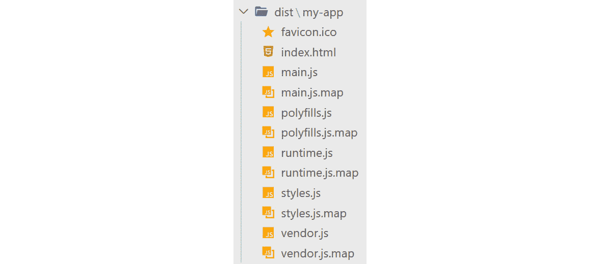
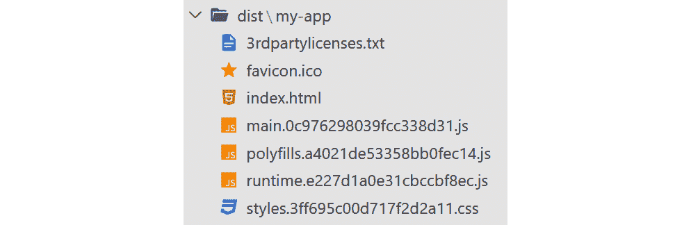
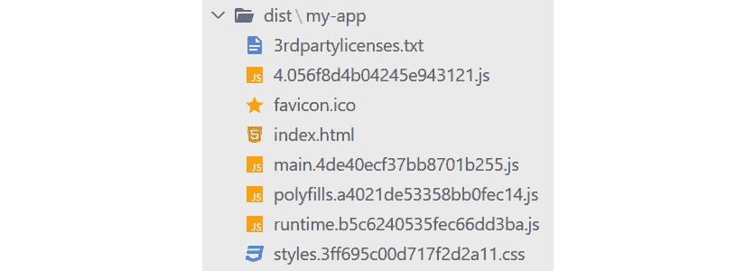

# *第 12 章*：将角度应用程序带入生产

web 应用程序通常应该在 web 上运行，任何人都可以从任何地方访问。因此，它需要两个基本要素：一个将承载应用程序的 web 服务器和一个要部署到该服务器的应用程序的生产构建。在本章中，我们将重点介绍配方的第二部分。但我们所说的生产建设是什么意思？

简而言之，web 应用程序的生产构建是应用程序代码的优化版本，它更小、更快、性能更好。首先，它是一个获取应用程序的所有代码文件、应用优化技术并将其转换为单个捆绑文件的过程。

在前面的章节中，我们已经介绍了构建 Angular 10 应用程序时涉及的许多部分。我们只需要最后一个部分来连接这些点，并使我们的应用程序可供任何人使用，这就是构建它并将其部署到 web 服务器。

在本章中，我们将执行以下操作：

*   了解如何创建 Angular 10 应用程序的生产构建
*   了解如何使用预算限制构建的大小
*   了解如何将优化技术应用于构建
*   调查可用的内置托管提供商并了解如何部署到其中一个提供商

# 技术要求

本章的源代码可以在 GitHub 存储库中的[中找到 https://github.com/PacktPublishing/Learning-Angular--Third-Edition/tree/master/ch12](https://github.com/PacktPublishing/Learning-Angular--Third-Edition/tree/master/ch12) 。

# 构建一个有角度的应用程序

要构建Angular 10 应用程序，我们使用 Angular CLI 的以下命令：

```ts
ng build
```

构建过程启动 Angular 编译器，该编译器主要收集应用程序代码的所有 TypeScript 文件，并将其转换为 JavaScript。Angular 应用程序包含运行时通常不使用的各种类型脚本文件，例如单元测试或工具帮助程序。编译器如何知道为构建过程收集哪些文件？那么，它读取`tsconfig.app.json`文件的`files`属性，该属性指示 Angular 10 应用程序的主要入口点：

```ts
"files": [
 "src/main.ts",
  "src/polyfills.ts"
]
```

从那里，它可以遍历我们的应用程序所需的所有组件、服务和其他角度工件，正如我们在[*第 1 章*](01.html#_idTextAnchor015)*构建您的第一个角度应用程序*中已经了解到的。Angular 编译器将生成的 JavaScript 文件输出到根据 Angular CLI 项目名称命名的文件夹中，该项目在`dist`文件夹中创建：



图 12.1–开发模式下的输出文件夹

输出文件夹包含多个文件，包括：

*   `favicon.ico`：Angular 应用的图标
*   `index.html`：Angular 应用的主 HTML 文件
*   `main.js`：包含我们编写的应用程序的源代码
*   `polyfills.js`：包含旧浏览器的功能多边形填充
*   `runtime.js`：包含运行所有其他文件所需的与 CLI 相关的代码
*   `styles.js`：包含全局应用 CSS 样式
*   `vendor.js`：包含 Angular 框架和 Angular 应用程序中使用的任何第三方库

该文件夹还包含几个扩展名为`.map`的文件。它们被称为**源映射**文件，主要用于调试目的。`index.html`文件与`src`文件夹中的 HTML 文件相同，只是 Angular CLI 对其进行了修改，使其包含其余 JavaScript 构建文件：

```ts
<body>
  <app-root></app-root>
<script src="runtime.js" defer></script><script src="polyfills.js" defer></script><script src="styles.js" defer></script><script src="vendor.js" defer></script><script src="main.js" defer></script></body>
```

Angular CLI 的`build`命令可以在两种模式下运行：开发和生产。默认情况下，它在开发模式下运行。我们已经在[*第 5 章*](05.html#_idTextAnchor129)*中了解到，*构造一个角度 App*，如果我们想在生产模式下运行它，我们应该运行以下命令：*

```ts
ng build --configuration=production
```

或者，我们可以使用`--prod`开关使用生产配置的快捷方式：

```ts
ng build --prod
```

`dist`文件夹的输出现在应该如下所示：



图 12.2–生产模式下的输出文件夹

Angular CLI 对应用程序代码执行各种优化技术，以便最终输出适合在 web 服务器和生产环境中托管。输出文件夹不包含源映射文件，因为我们不希望在生产环境中启用调试。它还为每个文件添加了一个*散列*号，这样浏览器的缓存在部署新版本的应用程序时会很快使它们失效。

Angular 10 应用程序可能会使用未作为 ES6 模块导入的文件，但需要在全局`window`对象中附加，例如第三方**jQuery**插件。在这种情况下，我们需要告诉 Angular CLI 它们的存在，以便它可以将它们包含在最终的包中。`angular.json`配置文件包含`build`配置中的`options`对象，我们可以使用该对象定义此类文件。根据我们想要包含的文件类型，分为`assets`、`styles`和`scripts`三类：

```ts
"options": {
  "outputPath": "dist/my-app",
  "index": "src/index.html",
  "main": "src/main.ts",
  "polyfills": "src/polyfills.ts",
  "tsConfig": "tsconfig.app.json",
  "aot": true,
 "assets": [
 "src/favicon.ico",
 "src/assets"
 ],
 "styles": [
 "src/styles.css"
 ],
 "scripts": []
}
```

重要提示

`assets`文件夹已经包含，但它是空的，这就是它没有进入最终输出文件夹的原因。默认情况下，`styles.css`文件也包含在 Angular CLI 中。对应于输出文件夹中生成的`styles.js`文件。

随着我们在一个角度应用程序中添加越来越多的特性，最终的捆绑包在某个时候会变得更大。在下一节中，我们将学习如何使用预算来缓解这种影响。

# 限制应用程序包大小

作为开发人员，我们总是希望为最终用户构建包含酷特性的令人印象深刻的应用程序。因此，我们最终在 Angular 应用程序中添加了越来越多的功能——有时根据规范，有时为用户提供附加值。然而，在 Angular 应用程序中添加新功能将导致其尺寸增大，这在某些情况下可能是不可接受的。为了克服这个问题，我们可以在生产构建中使用 Angular CLI 预算。

预算是我们可以在`angular.json`配置文件中定义的阈值，并确保应用程序的大小不超过这些阈值。要设置预算，我们可以在`build`环境中使用`production`配置的`budgets`属性：

```ts
"budgets": [
  {
    "type": "initial",
    "maximumWarning": "2mb",
    "maximumError": "5mb"
  },
  {
    "type": "anyComponentStyle",
    "maximumWarning": "6kb",
    "maximumError": "10kb"
  }
]
```

Angular CLI在创建新的 Angular CLI 项目时为我们定义了一些默认预算，做得非常好。

我们可以为不同类型定义预算，例如整个 Angular 应用程序或其某些部分。预算的阈值可以用字节、千字节、兆字节或其百分比来定义。当大小达到或超过阈值的定义值时，Angular CLI 将显示警告或引发错误。

为了更好地理解它，让我们描述前面的默认示例：

*   当 Angular 应用程序的大小超过 2MB 时会显示警告，超过 5MB 时会显示错误。
*   当任何组件样式的大小超过 6KB 时会显示警告，当超过 10KB 时会显示错误。

要查看在 Angular 应用程序中配置预算时可以定义的所有可用选项，请查看官方文档网站[上的指南https://angular.io/guide/build#configuring-规模预算](https://angular.io/guide/build#configuring-size-budgets)。

当我们想要在 Angular 应用程序显著增长的情况下提供警报机制时，预算是非常有用的。然而，它们只是一种信息和预防措施。在下一节中，我们将学习如何最小化捆绑包的大小。

# 优化应用包

正如我们在*构建 Angular 10 应用程序*一节中了解到的，Angular CLI 在生产模式下构建 Angular 10 应用程序时执行优化技术。应用程序代码中执行的优化过程包括现代 web 技术和工具，包括以下内容：

*   **缩小**：通过删除空格和注释，将多行源文件转换为一行。这是一个让浏览器以后能够更快地解析它们的过程。
*   **丑化**：将属性和方法重命名为非人类可读的形式，使其难以理解并用于恶意目的。
*   **捆绑**：将应用的所有源文件连接成一个文件，称为**捆绑**。
*   **摇树**：移除未使用的文件和组件、模块等角度伪影，形成更小的捆绑。

正如我们所看到的，Angular CLI 在构建优化方面为我们做了大量工作。但是，如果最终捆绑包的大小仍然相当大，我们可以使用我们在[*第 7 章*](07.html#_idTextAnchor168)中已经看到的延迟加载模块技术，*通过路由*浏览组件。

简言之，我们可以使用 Angular router 根据请求加载 Angular 模块，而我们确信它们不会经常使用。因此，我们大大减少了初始包的大小，因为 Angular CLI 在构建应用程序时为每个延迟加载的模块创建了一个小包。例如，如果我们在[*第 7 章*](07.html#_idTextAnchor168)中构建 Angular app，*通过路由*浏览组件，输出文件夹将如下所示：


图 12.3–开发模式下带有延迟加载模块的输出文件夹

我们可以看到 Angular CLI 创建了一个名为`about-about-module.js`的文件，它是路由器延迟加载的`AboutModule`包。如果我们将`AboutModule`定义为急切加载，则不会创建包，模块的源代码将包含在`main.js`包中。

延迟加载包的名称包含默认情况下在开发模式下构建 Angular 应用程序时相关模块的名称，如`about-about-module.js`。Angular 在生产模式下构建应用程序时，通过在包文件名前添加一个随机数来重命名包：



图 12.4–生产模式下带有延迟加载模块的输出文件夹

上一个屏幕截图中的`about-about-module.js`包已替换为`4.056f8d4b04245e943121.js`。

重要提示

当我们设计一个有角度的应用程序时，一个很好的做法是首先考虑小问题，然后相应地计划。仔细考虑哪些模块不会频繁使用，使它们加载迟缓。一个很好的例子是网站的菜单链接。您可以为每个链接定义一个模块并延迟加载它。一旦您取得进展，如果某个模块最终需要立即可用，请立即加载该模块。这样，您将始终从可用的最小捆绑大小开始。

延迟加载技术还提高了 Angular 应用程序的启动时间，因为从浏览器中可以更快地解析较小的包。

最后一个方法是使用一个名为**源地图浏览器**的外部工具，我们已经应用了所有以前的优化，但最终捆绑包仍然很大。它分析我们的应用程序包，并显示我们在可视化表示中使用的所有角度工件和库。要开始使用它，请执行以下操作：

1.  安装`source-map-explorer`npm 包：

    ```ts
    npm install source-map-explorer --save-dev
    ```

2.  在生产模式下构建 Angular 应用程序并启用源地图：

    ```ts
    ng build --prod --source-map
    ```

3.  对主捆绑文件

    ```ts
    node_modules/.bin/source-map-explorer dist/my-app/main.*.js
    ```

    运行`source-map-explorer`二进制文件

它将在默认浏览器中打开应用程序包的可视化表示。然后我们可以与它交互并检查它，以便我们能够理解为什么我们的包仍然足够大。一些原因可能是以下原因：

*   一个库在包中包含两次
*   包含库，但当前未使用

构建 Angular 应用程序的生产版本后的最后一步是将其部署到 web 服务器，我们将在下一节中学习。

# 部署角度应用程序

如果你已经有了一个 web 服务器，你想将它用于你闪亮的新 Angular 10 应用程序，只需将输出文件夹的内容复制到服务器中的一个路径即可。如果要将其部署到根目录以外的其他目录中，请使用`ng build`命令的`--base-href`选项：

```ts
ng build --prod --base-href=/myapp/
```

上一个命令将在生产模式下构建 Angular app，并将`index.html`文件中`base`标记的`href`值更改为`/myapp/`。

如果您不想将其部署到自定义服务器，您可以使用 Angular CLI 基础设施将其部署到其支持的一个现成的内置主机提供程序中，包括以下内容：

*   **Firebase 托管**：[https://firebase.google.com/docs/hosting](https://firebase.google.com/docs/hosting)
*   **天蓝**：[https://azure.microsoft.com/en-us/](https://azure.microsoft.com/en-us/)
*   **网利菲**：[https://www.netlify.com/](https://www.netlify.com/)
*   **GitHub 页面**：[https://pages.github.com/](https://pages.github.com/)
*   **Npm**: [https://npmjs.com/](https://npmjs.com/)

    重要提示

    在使用自动部署之前，您可能需要在提供程序中创建一个帐户并进行相应的配置，这是一个流程，不在本书的范围之内。

然而，Angular CLI 为我们提供了自动化基础设施，因此我们可以直接从 IDE 舒适的环境中部署 Angular 应用程序。怎样有一些第三方 npm 库，称为**Angular builders**，已经为前面提到的一些提供商实现了部署功能。我们可以将它们添加到 Angular CLI 项目，然后使用 Angular CLI 直接部署到相应的提供程序。让我们看看将一个简单的 Angular 10 应用程序部署到 GitHub 页面有多容易：

1.  使用 Angular CLI 的`add`命令安装`angular-cli-ghpages`生成器：

    ```ts
    ng add angular-cli-ghpages
    ```

2.  运行 Angular CLI 的`deploy`命令，将 Angular 应用程序的生产版本部署到 GitHub 页面：

    ```ts
    ng deploy
    ```

Angular CLI 以生产模式构建 Angular 10 应用程序，并将其上载到使用当前 Angular CLI 项目配置的 GitHub 存储库。就这样！超级简单！该应用程序现在可在 https://<username>.github.io/<repositoryname>上获得。</repositoryname></username>

# 总结

我们终于在角度框架中完成了我们的神奇旅程的最后一步。Angular 应用程序的部署是整个过程中最简单、最关键的部分，因为它最终让最终用户可以使用您的出色应用程序。最终，向最终用户提供体验是 web 应用程序的全部内容。

在本章中，我们学习了如何构建 Angular 10 应用程序，并为生产做好准备。我们还研究了优化最终捆绑包的不同方法，并了解了如何为其他主机提供商手动和自动将 Angular 10 应用程序部署到自定义服务器中。

在下一章，也是本书的最后一章，我们将把所学的示例应用到实践中，并构建一个真实世界的 Angular 10 应用程序。