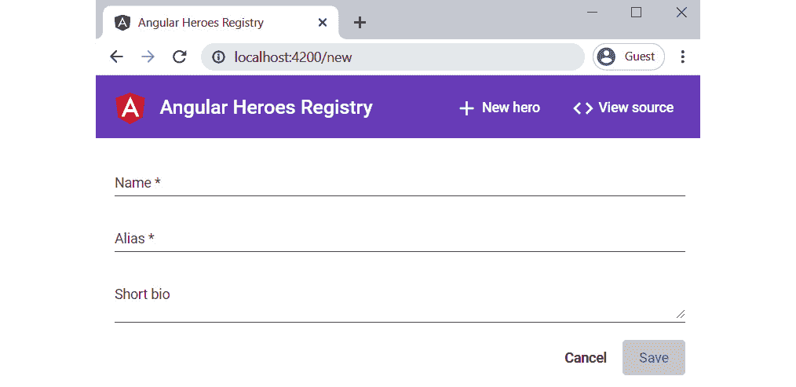
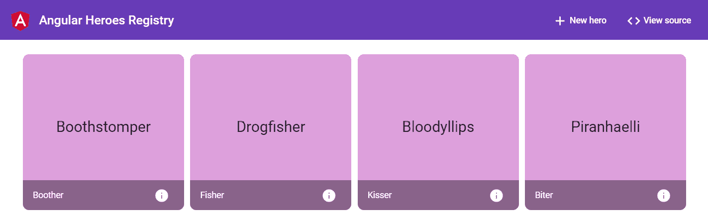

# *第 13 章*：开发真实世界的 Angular App

我们已经用角度框架完成了史诗般的旅程。多么愉快的旅程啊！我们首先设置环境和工具，以增强开发人员体验。我们学习了如何创建组件并将它们分组到模块中。我们了解了如何构造 Angular 10 应用程序，以及如何使用服务通过 HTTP 进行通信。我们研究了如何在 Angular 应用程序中应用路由，以及如何使用表单从用户收集数据。最后，我们了解了如何构建和测试 Angular 10 应用程序，并将其部署到 web 服务器。

通常，在旅程结束时，我们想与其他人分享我们的冒险经历——我们所看到的，我们所做的，以及我们所经历的。我们不是吗？好的，我们将做一些类似的事情来分享我们在 Angular 框架中的经验。我们将构建一个真实世界的 Angular 10 应用程序，展示我们在这次旅程中学到的许多激动人心的东西。

在本章中，我们将执行以下操作：

*   构建一个角度 10 的应用程序，并将其分解为功能
*   设计应用程序的布局并构建其核心功能
*   创建英雄功能，使用 CRUD 技术管理超级英雄
*   创建任务功能以将任务分配给英雄

# 技术要求

本章的源代码可以在 GitHub 存储库中的[中找到 https://github.com/PacktPublishing/Learning-Angular--Third-Edition/tree/master/ch13](https://github.com/PacktPublishing/Learning-Angular--Third-Edition/tree/master/ch13) 。

# 搭建应用结构

你可能已经注意到这本书的内容都是关于英雄的。毕竟，我们是日常生活中的英雄——软件开发的英雄。因此，我们想要创建的 Angular 10 应用程序不会偏离这一点。

我们将创建**角英雄注册**。简而言之，应用程序的用户将能够管理英雄并将他们分配到任务中。该应用程序的主要特点如下：

*   显示英雄列表
*   添加新英雄
*   给英雄分配新任务
*   将任务标记为完成

对于应用程序的设计，我们将结合使用角材料和角柔性布局，这是我们在[*第 9 章*](09.html#_idTextAnchor212)*角材料简介*中了解的。我们将使用内置的*深紫色/琥珀色*角材料主题，我们还将包括角材料排版。我们的应用程序如下所示：


图 13.1–应用程序布局

它由三个主要区域组成：

*   标题包含带有徽标的标题和两个链接，一个用于创建新英雄，另一个用于重定向到本章的源代码存储库
*   主要内容，显示英雄列表或创建新英雄的表单
*   包含特定英雄和任何分配任务信息的边栏

默认情况下，应用程序在启动时显示英雄列表。当我们从列表中选择英雄时，会显示侧边栏，其中包含所选英雄的详细信息。它还允许我们删除英雄或分配新任务。此外，它还显示所选英雄的所有分配任务列表，我们可以在其中选择一个任务来完成。我们总是可以通过使用应用程序标题中的链接来添加新的英雄。

重要提示

应用程序的目的是将我们在前面所有章节中收集的知识付诸实践，而不是功能完整。因此，本章将不介绍一些可能有意义的功能。但是，您可以随意克隆您将在*技术要求*部分找到的应用程序存储库，并使用您的角度技能添加更多！

本章提供了一种实践方法，以了解到目前为止我们所学到的知识。因此，我们建议您将其与源代码一起阅读。最好的方法是通读源代码，并将本章作为附带材料来解释代码的关键部分。

现在我们已经总结了我们的应用程序的规范以及它将如何工作，让我们开始构建它。首先，我们将从构建将在应用程序范围内使用的核心功能开始。

# 实现核心功能

当我们在应用中提到核心特性时，我们的意思是：

*   将在应用程序中全局使用的服务，如本地缓存或数据访问服务
*   只使用一次的组件，例如页眉或页脚组件

在下一节中，我们将学习如何创建用于处理本地数据的核心服务。

## 使用本地存储持久化数据

在本应用程序中，我们将使用[*第 6 章*](06.html#_idTextAnchor149)中已经看到的 Angular In-memory Web API，*使用异步数据服务丰富组件*。

我们已经知道，它模拟了后端 API 的功能。尽管如此，它仍将所有数据保留在内存中，这意味着当我们刷新浏览器时，数据将消失，这是不可取的。因此，我们将使用浏览器的本地存储作为持久化浏览器的一种手段。

浏览器的本地存储是一种内部存储机制，可以保存有限数量的数据。它表示为键值对，可以使用`localStorage`JavaScript 对象访问。为了在 Angular 上下文中使用它，我们创建了一个包装器 Angular 服务：

存储服务

```ts
import { Injectable } from '@angular/core';
@Injectable({
  providedIn: 'root'
})
export class StorageService {
  get(name: string): any[] | undefined {
    return JSON.parse(localStorage.getItem(name)) ?? undefined;
  }
  set(name: string, value: any[]) {
    localStorage.setItem(name, JSON.stringify(value));
  }
}
```

`localStorage`对象包含用于操作浏览器本地存储的各种方法。我们只对分别读取和写入值的`get`和`set`方法感兴趣。本地存储器中条目的每个值的类型为`string`。因此，如果我们想要存储对象，我们需要使用`JSON`对象的`stringify`方法对其进行序列化以进行设置，并使用其相应的`parse`方法对其进行反序列化以获得它。

重要提示

如果我们直接使用`localStorage`对象，我们会将应用程序的范围仅限于浏览器平台。为附加到全局`window`对象的对象创建包装器是一种很好的做法。通过这种方式，我们可以从 Angular DI 机制中获益，并根据目标平台注入不同的服务。

`get`方法可以从本地存储器返回值，如果不包含`name`定义的特定键，则可以返回`undefined`。通过这种方式，我们可以确保`JSON`对象的`parse`方法不会抛出异常，而是正常地失败。

`StorageService`从`DataService`内部使用，这是一个角度服务，使用内存中的角度 Web API 库。我们已经了解到，这样的服务需要实现`InMemoryDbService`的`createDb`方法，用一些数据填充内存数据库：

```ts
createDb() {
  if (!this.storageService.get('heroes')) {
    this.storageService.set('heroes', []);
  }
  return {};
}
```

在我们的例子中，我们不希望将数据保存在内存中，因此我们不关心`createDb`方法的返回值。但是，我们确实关心初始化本地存储，以便以后可以与之交互。因此，首先，我们在本地存储中添加一个新的`heroes`条目，如果它还不存在的话，它包含一个空数组作为值。

我们还需要为 HTTP 方法提供拦截器，以便与`StorageService`交互。每个拦截器方法都接受一个`RequestInfo`对象作为包含 HTTP 请求详细信息的参数：

*   `get`：从内存中的本地存储器加载集合，并返回整个集合或其中的一项，具体取决于`RequestInfo`对象中是否有`id`属性。如果存在`id`，则使用`findById`助手方法在集合

    ```ts
    const collection = this.storageService.get(reqInfo.collectionName) as any[];
    const result = reqInfo.id ? reqInfo.utils.findById(collection, reqInfo.id) : collection;
    ```

    中查找请求的项目
*   `post`：使用`getJsonBody`助手方法从请求中提取新项。它使用`guid`助手`function`为新项目创建`id`，然后将其附加到本地存储的现有集合中：

    ```ts
    const item = reqInfo.utils.getJsonBody(reqInfo.req);
    item.id = guid();
    const collection = this.storageService.get(reqInfo.collectionName) as any[];
    this.storageService.set(reqInfo.collectionName, [...collection, item]);
    ```

*   `put`：从内存中的本地存储加载集合，以便找到需要更新的项的索引。一旦找到该项，基于从`RequestInfo`对象中提取的`id`项，它将使用`getJsonBody`助手方法在集合中替换它：

    ```ts
    const collection = this.storageService.get(reqInfo.collectionName) as any[];
    const index = collection.findIndex(item => item.id === reqInfo.id);
    collection[index] = reqInfo.utils.getJsonBody(reqInfo.req);
    this.storageService.set(reqInfo.collectionName, collection);
    ```

*   `delete`：从内存中的本地存储器加载集合，并创建一个不包括需要删除的项的`id`的副本。然后，它将过滤后的集合传递到本地存储器，以便替换上一个：

    ```ts
    const collection = this.storageService.get(reqInfo.collectionName) as any[];
    this.storageService.set(reqInfo.collectionName, collection.filter(item => item.id !== reqInfo.id));
    ```

前面的所有方法都返回状态为`OK`的 HTTP 响应，以模拟来自后端 API 的成功响应：

```ts
return reqInfo.utils.createResponse$(() => {
  return { status: STATUS.OK }
});
```

`get`方法是唯一一种将`body`添加到包含请求数据的响应中的方法：

```ts
return reqInfo.utils.createResponse$(() => {
  return {
    body: result,
    status: STATUS.OK
  }
});
```

重要提示

`DataService`的设计使其与模型无关。也就是说，它可以处理我们想要传递的任何集合。因此，您可以利用自己的想象力扩展此服务，并集成您可能需要的其他收藏。

正如我们所看到的，核心特性不仅包含服务，还包含组件。在下一节中，我们将学习如何为我们的应用程序创建标题组件。

## 创建表头组件

我们的应用程序包含一个仅加载一次且始终保持呈现的标头。标题是一个角度组件，与我们在上一节中描述的服务一起存在于`core`文件夹中：


图 13.2–核心文件夹结构

`core`文件夹中这些角度工件的组织对于它们在我们的 Angular 应用程序中的使用方式没有任何特殊意义，而是一种惯例。我们可以在`app`文件夹中创建它们，它们将按照预期工作。将它们放在专用文件夹中更清晰，提高可读性，并使查找它们更容易。

`core`文件夹还包含其各自的角度模块：

core.module.ts

```ts
import { HttpClientModule } from '@angular/common/http';
import { NgModule } from '@angular/core';
import { FlexLayoutModule } from '@angular/flex-layout';
import { RouterModule } from '@angular/router';
import { HttpClientInMemoryWebApiModule } from 'angular-in-memory-web-api';
import { AppMaterialModule } from '../app-material.module';
import { DataService } from './data.service';
import { HeaderComponent } from './header/header.component';
@NgModule({
  imports: [
    AppMaterialModule,
    FlexLayoutModule,
    HttpClientModule,
    HttpClientInMemoryWebApiModule.forRoot(DataService),
    RouterModule
  ],
  declarations: [HeaderComponent],
  exports: [HeaderComponent]
})
export class CoreModule { }
```

`CoreModule`导入我们的应用程序所需的其他几个角度模块。其中有`AppMaterialModule`，专门用于角材料相关模块的角模块。它导入并重新导出应用程序可能需要的几个角材料模块。每当我们想在模块中使用一个角材料组件时，我们只需要导入`AppMaterialModule`。

在 Angular 应用程序中，我们只将`CoreModule`导入一次主应用程序模块`AppModule`。它导出`HeaderComponent`以便我们可以在主应用组件`AppComponent`的模板中使用它：

app.component.html

```ts
<div fxLayout="column" fxFill>
  <app-header></app-header>
  <div fxFlex class="content">
    <router-outlet></router-outlet>
  </div>
</div>
```

我们应用程序的主要内容由`div`元素表示，该元素的样式为`content`类。它包含一个`router-outlet`元素，它是加载我们应用程序的路由组件的占位符。`app.component.html`文件还定义了填充剩余空间的`column`flex 布局。

表头组件的模板非常简单：

header.component.html

```ts
<mat-toolbar color="primary">
  <a mat-icon-button href="https://www.angular.io/" target="_  blank">
    
  </a>
  <h2 fxFlex>Angular Heroes Registry</h2>
  <a mat-button routerLink="new">
    <mat-icon>add</mat-icon>
    New hero
  </a>
  <a mat-button href="https://github.com/PacktPublishing/Learning-Angular--Third-Edition/tree/master/ch13"   target="_blank">
    <mat-icon>code</mat-icon>
    View source
  </a>
</mat-toolbar>
```

它使用角度材质的`mat-toolbar`组件创建包含以下内容的工具栏：

*   一个角度图像徽标，点击后重定向到角度框架的官方文档网站
*   名为`Angular Heroes Registry`的标题
*   一个锚元素，样式为`mat-button`组件，包含一个`routerLink`指令，该指令可导航到`new`路由路径
*   一个锚元素，样式为`mat-button`组件并导航到本章的 GitHub 存储库

这是我们最后一次修改主应用程序模块和组件。从现在起，我们将研究功能模块。在下一节中，我们将开始构建应用程序的 heroes 功能。

# 添加英雄功能

我们应用程序的主要目标是管理英雄。因此，我们需要创建一个功能模块，对英雄的类似功能进行分组。模块的文件夹结构应如下所示：


图 13.3–英雄文件夹结构

`heroes`模块包含以下角度伪影：

*   `hero`：用于创建新英雄的组件
*   `hero-detail`：用于显示特定英雄详细信息的组件
*   `heroes.component.ts`：承载英雄列表和侧栏的组件，用于显示特定英雄的详细信息
*   `heroes.service.ts`: a service that uses the Angular HTTP client to provide CRUD operations for heroes data

    重要提示

    我们将`heroes`主机组件命名为与模块相同的名称，并将其放置在同一文件夹中，因为它是`heroes`模块的登录页。您可以将其视为该功能的主页。要创建没有专用文件夹的组件，我们可以在运行 Angular CLI 的`generate`命令时使用`--flat`选项。

`hero`和`heroes`组件是我们应用程序的路由组件。当应用程序导航到`new`路由路径时，第一个被激活。第二个组件在应用程序启动时显示。应用程序的路由配置非常简单，所以我们将使用`AppRoutingModule`来定义它：

app-routing.module.ts

```ts
import { NgModule } from '@angular/core';
import { RouterModule, Routes } from '@angular/router';
import { HeroComponent } from './heroes/hero/hero.component';
import { HeroesComponent } from './heroes/heroes.component';
const routes: Routes = [
  { path: '', component: HeroesComponent },
  { path: 'new', component: HeroComponent }
];
@NgModule({
  imports: [RouterModule.forRoot(routes)],
  exports: [RouterModule]
})
export class AppRoutingModule { }
```

我们定义了两个路由配置对象：一个是加载`HeroesComponent`的默认空路径，另一个是加载`HeroComponent`的`new`路由路径。

现在我们已经了解了`heroes`模块，是时候更详细地研究所有相关工件了。在下一节中，我们将看到如何创建新的英雄。

## 新增英雄

我们可以通过点击 header 组件的**new hero**链接向我们的应用程序添加一个新的 hero。应用程序显示以下表单以输入英雄详细信息：



图 13.4–添加新英雄

英雄的详细信息是应用程序`core`文件夹中`Hero`模型的一部分：

```ts
import { Mission } from '../core/mission';
export interface Hero {
  id: string;
  name: string;
  alias: string;
  shortBio: string;
  missions: Mission[];
}
```

重要提示

每个英雄都有一个`Mission[]`类型的`missions`属性，稍后将在*集成任务模块*部分介绍。

**保存**按钮被禁用，直到我们在**名称**和**别名**输入字段中键入所需的值。我们可以随意为我们的新英雄写一篇简短的传记。**取消**按钮在不保存英雄的情况下重定向到应用程序的主登录页。

`hero`组件的模板如下：

hero.component.html

```ts
<form class="form-container" [formGroup]="heroForm" (ngSubmit)="save()">
  <mat-form-field>
    <mat-label>Name</mat-label>
    <input matInput formControlName="name" required>
  </mat-form-field>
  <mat-form-field>
    <mat-label>Alias</mat-label>
    <input matInput formControlName="alias" required>
  </mat-form-field>
  <mat-form-field>
    <mat-label>Short bio</mat-label>
    <textarea matInput formControlName="shortBio"></textarea>
  </mat-form-field>
  <div class="form-actions">
    <a mat-button [routerLink]="['/']">Cancel</a>
    <button mat-raised-button color="primary" type="submit"     [disabled]="heroForm.invalid">Save</button>
  </div>
</form>
```

我们已经为表单定义了一个，并且在`ngSubmit`表单事件上添加了一个事件绑定，该事件调用组件的`save`方法。表单的每个字段都包含相应的`formControlName`指令，该指令将表单绑定到`HeroComponent`中，如下所示：

```ts
ngOnInit() {
  this.heroForm = this.builder.group({
    name: ['', Validators.required],
    alias: ['', Validators.required],
    shortBio: ['']
  });
}
```

必填字段还包含`required`属性。我们已经了解到，我们可以在组件`class`中定义是否需要输入控件，而不是在模板中定义。看来我们偏离了这条规则。为什么呢？我们偶尔添加`required`属性，以在角度应用程序中提供高级可访问性功能，例如显示在字段标签中的星号字符。

根据表单的有效状态设置`Save`按钮的`disabled`属性。`Cancel`锚元素绑定到`routerLink`指令，并通过`/`路径导航到我们应用程序的主页面。

组件的`save`方法调用`HeroService`的`createHero`方法创建一个新的英雄，将`heroForm`的`value`作为参数传递。英雄创建成功后，应用程序使用`Router`服务的`navigateByUrl`方法导航回应用程序主页面：

```ts
save() {
  this.heroService.createHero(this.heroForm.value).  subscribe(() => this.router.navigateByUrl('/'));
}
```

重要提示

`navigateByUrl`方法不同于经典的`navigate`方法，因为它接受我们想要导航到的 URL 的绝对表示。

在创建一个新的英雄并重定向到主页面之后，我们应该可以在列表中看到新创建的英雄。在下一节中，我们将查看负责此行为的组件的实现。

## 显示英雄列表

负责显示英雄列表的组件为`HeroesComponent`，是`heroes`模块的主要组件：

```ts
<mat-drawer-container fxLayout="column" fxFill>
  <mat-drawer mode="over" position="end">
    <mat-tab-group>
      <mat-tab label="Details"></mat-tab>
      <mat-tab label="Missions"></mat-tab>
    </mat-tab-group>
  </mat-drawer>
  <mat-drawer-content>
    <mat-grid-list cols="4" rowHeight="250" gutterSize="10">
      <mat-grid-tile *ngFor="let hero of heroes">
        <h1>{{hero.name}}</h1>
        <mat-grid-tile-footer>
          <h3 mat-line>{{hero.alias}}</h3>
          <button mat-icon-button (click)="selectHero(hero)">
            <mat-icon>info</mat-icon>
          </button>
        </mat-grid-tile-footer>
      </mat-grid-tile>
    </mat-grid-list>
  </mat-drawer-content>
</mat-drawer-container>
```

它使用角材质的`mat-drawer-container`组件来创建主要内容区域和侧栏。主要内容由`mat-drawer-content`组件表示，边栏由`mat-drawer`组件表示。

通过将`position`属性设置为`end`，侧边栏位于页面的最右端。`mode`属性表示边栏将在主内容上方打开。侧边栏包含两个选项卡：一个显示特定英雄的详细信息，另一个显示分配给该英雄的任务。我们将在后面的章节中讨论它们。

主要内容包含一个`mat-grid-list`组件，该组件显示一个相互之间以*10px*等距排列的`mat-grid-tile`组件列表。列表的每一行包含四个`mat-grid-tile`组件，其中每一个都是*250px*高。

它迭代`heroes`组件属性，并为每个英雄创建一个`mat-grid-tile`。每个`mat-grid-tile`显示一个英雄的名字和一个`mat-grid-tile-footer`组件。`mat-grid-tile-footer`组件显示英雄的别名和选择英雄的按钮。输出应如下所示：



图 13.5——英雄名单

`heroes`属性是通过订阅`HeroService`的`getHeroes`方法设置的：

```ts
ngOnInit() {
  this.getHeroes();
}
private getHeroes() {
  this.heroService.getHeroes().subscribe(heroes => this.  heroes = heroes);
}
```

点击英雄的选择按钮，触发组件的`selectHero`方法，将对象作为参数传递。`selectHero`方法做两件事：

*   设置组件的`selectedHero`属性。
*   打开侧栏元素。侧栏是通过使用`@ViewChild`装饰器查询`mat-drawer`组件来访问的。它返回一个`MatDrawer`对象，其中包含一个`open`方法，我们可以调用该方法打开侧栏：

```ts
@ViewChild(MatDrawer) private drawer: MatDrawer;
selectHero(hero: Hero) {
  this.selectedHero = hero;
  this.drawer.open();
}
```

在下一节中，我们将进一步了解`selectedHero`属性的功能。

## 对特定英雄采取行动

侧边栏的`Details`选项卡包含`app-hero-detail`组件，该组件显示所选英雄的详细信息：

hero-detail.component.html

```ts
<mat-card *ngIf="hero">
  <mat-card-header>
    
    <mat-card-title>{{hero.name}}</mat-card-title>
    <mat-card-subtitle>{{hero.alias}}</mat-card-subtitle>
  </mat-card-header>
  <mat-card-content>
    <p>{{hero.shortBio}}</p>
  </mat-card-content>
  <mat-card-actions>
    <button mat-button>Assign</button>
    <button mat-stroked-button color="warn" (click)    ="deleteHero()">Delete</button>
  </mat-card-actions>
</mat-card>
```

它使用角材质的`mat-card`组件以卡片样式显示英雄细节。卡片的标题显示英雄的名字，副标题显示别名。卡片的主要内容显示了英雄的简短传记。最后，该卡包含两个操作按钮。`Assign`按钮为英雄分配了一个新任务，我们将在下一节中看到。`Delete`按钮完全删除英雄。以下是从列表中选择**BoothTomper**英雄时的视觉效果：


图 13.6–显示英雄详细信息

`HeroDetailComponent`包含从`selectedHero`属性设置的`id`输入绑定。订阅`HeroService`的`getHero`方法，并根据`id`获取英雄详细信息。我们在`ngOnChanges`生命周期钩子中调用该方法，因为每次用户从列表中选择不同的英雄时`id`的值都会发生变化：

```ts
ngOnChanges(){
  this.hero = null;
  this.getHero();
}
private getHero() {
  this.heroService.getHero(this.id).subscribe(hero => this.  hero = hero);
}
```

该组件还包含一个`delete`输出绑定，当我们删除一个英雄时会触发该绑定。点击`Delete`按钮，我们订阅`HeroService`的`deleteHero`方式。英雄一旦被删除，就会发出`delete`事件：

```ts
deleteHero() {
  this.heroService.deleteHero(this.hero.id).subscribe(() =>   this.delete.emit());
}
```

`HeroesComponent`监听`delete`事件并触发`onHeroDeleted`方法，获取英雄列表的新副本并最终关闭侧边栏：

```ts
onHeroDeleted() {
  this.getHeroes();
  this.drawer.close();
}
```

英雄通常需要完成一项任务；否则，我们为什么要拥有它们？在下一节中，我们将学习如何创建用于管理任务的功能模块。

# 集成任务模块

根据我们应用的规范，用户应该能够做到以下几点：

*   给英雄分配新任务
*   将正在进行的任务标记为已完成

因此，我们需要创建一个新的功能模块，其中包含有关任务的功能。模块的文件夹结构应如下所示：


图 13.7–任务文件夹结构

它包含以下角度瑕疵：

*   `mission`：用于为英雄分配新任务的组件。
*   `mission-list`：用于显示任务列表的组件。它还允许我们完成一项任务。
*   `missions.service.ts`：使用 HTTP 客户端操纵特定英雄任务的服务。

在下一节中，我们将探索第一个组件，它允许我们分配新任务。

## 分配新任务

我们可以通过点击`HeroDetailComponent`的**分配**按钮，为英雄分配新任务。调用`assignMission`方法，使用角度材质的`MatDialog`服务打开`MissionComponent`作为对话框：

```ts
assignMission() {
  this.dialog.open(MissionComponent, { data: this.hero });
}
```

它还使用`MatDialogConfig`选项的`data`属性将当前`hero`对象作为参数传递给对话框。

应用程序显示以下表单，用于输入新任务的详细信息：


图 8.13–分配新任务对话框

任务的详细信息是应用程序`core`文件夹中存在的`Mission`模型的一部分：

mission.ts

```ts
export interface Mission {
  title: string;
  priority: 'low' | 'medium' | 'high';
}
```

**开始任务**按钮被禁用，直到我们在**标题**字段中输入一个值。应用程序默认将**优先级**字段的值设置为**低**，但我们可以根据任务需要进行更改。**取消**按钮关闭对话框而不创建任务，与**开始任务**按钮相对。

`mission`组件的模板如下图所示：

```ts
<h2 mat-dialog-title>Assign a new mission</h2>
<mat-dialog-content class="mat-typography">
  <form [formGroup]="missionForm" (ngSubmit)="save()">
    <mat-form-field>
      <mat-label>Title</mat-label>
      <input matInput formControlName="title" required>
    </mat-form-field>
    <mat-form-field>
      <mat-label>Priority</mat-label>
      <mat-select formControlName="priority">
        <mat-option *ngFor="let priority of priorities"         [value]="priority">{{priority}}</mat-option>
      </mat-select>
    </mat-form-field>
    <mat-dialog-actions align="end">
      <a mat-button mat-dialog-close>Cancel</a>
      <button mat-raised-button color="primary" type="submit"       [disabled]="missionForm.invalid">Start mission</button>
    </mat-dialog-actions>
  </form>
</mat-dialog-content>
```

我们使用了`MatDialogModule`的几个指令将组件样式设置为对话框。在模板的顶部，有一个指示对话框标题的`mat-dialog-title`指令。`mat-dialog-content`组件表示对话框的主要内容，主要由一个`form`元素组成，该元素与`class`组件中的`formGroup`元素相连。

`missionForm`表单组包含一个用于标题的`input`元素和一个用于任务优先级的`mat-select`组件。`mat-select`组件迭代`priorities`列表，以在选择控件中显示它们。两个表单控件都是使用`FormBuilder`服务构建的：

```ts
ngOnInit() {
  this.missionForm = this.builder.group({
    title: ['', Validators.required],
    priority: ['low']
  });
}
```

组件的`save`方法绑定到表单的`ngSubmit`事件，订阅到`MissionService`的`assignMission`方法。任务分配成功后，使用`MatDialogRef`服务关闭对话框：

```ts
save() {
  this.missionService.assignMission(this.missionForm.  value, this.data).subscribe(() => this.dialogRef.close());
}
```

`MissionService`的`assignMission`方法在英雄的`missions`属性中添加一个新的`Mission`对象，并使用`put`方法更新英雄：

```ts
assignMission(mission: Mission, hero: Hero): Observable<any> {
  if (!hero.missions) {
    hero.missions = [];
  }
  hero.missions.push(mission);
  return this.http.put<Hero>(`${this.missionsUrl}/${hero.id}`,   hero);
}
```

中的任务需要在某个时刻完成。在下一节中，我们将学习如何使用`missions`模块的下一个组件`mission-list`组件完成此任务。

## 将任务标记为已完成

`HeroesComponent`的`Missions`选项卡使用`app-mission-list`组件显示分配给所选英雄的任务列表。`MissionListComponent`的模板如下：

mission-list.component.html

```ts
<mat-selection-list (selectionChange)="completeMission($event.option.value)">
  <mat-list-option *ngFor="let mission of hero.missions"   [value]="mission">
    <span [style.color]="getPriorityColor(mission)">{{mission.    title}}</span>
  </mat-list-option>
</mat-selection-list>
```

它使用角材料的`mat-selection-list`组件来显示任务列表。它遍历`hero`对象的`missions`属性，并为每个英雄显示`mat-list-option`组件。每个`mat-list-option`组件包含两件事：

*   一个复选框，选中时调用组件的`completeMission`方法，该组件将`mission`对象作为参数传递给对应于选中选项的`mission`对象。
*   一个`span`单元，根据任务的优先级具有适当的`color`：

    ```ts
    getPriorityColor(mission: Mission): string {
      switch(mission.priority) {
        case 'medium':
          return 'yellow';
        case 'high':
          return 'red';
      }
    }
    ```

`HeroesComponent`的`selectedHero`属性设置`MissionListComponent`的`hero`输入绑定。

`completeMission`方法订阅`MissionService`的`completeMission`方法。任务完成后，我们过滤当前`hero`的`missions`属性，将完成的任务从列表中排除：

```ts
completeMission(mission: Mission) {
  this.missionService.completeMission(mission, this.hero).  subscribe(() => {
    this.hero.missions = this.hero.missions.filter     (m => m !== mission);
  });
}
```

将任务标记为已完成基本上会将任务从英雄身上移除并更新英雄：

```ts
completeMission(mission: Mission, hero: Hero): Observable<any> {
  hero.missions = hero.missions.filter(m => m !== mission);
  return this.http.put<Hero>(`${this.missionsUrl}/${hero.id}`,   hero);
}
```

如前所述，将新任务分配给英雄并显示该英雄的任务列表是在不同的组件中处理的。如果我们从`app-hero-detail`组件分配新任务，`app-mission-list`组件如何知道新任务？我们如何使这两个组件保持同步？我们使用`MissionService`中的`Subject`和`Observable`对象来维护状态管理服务。让我们更详细地看一下。

我们已在`MissionService`中申报了`Subject`财产及其`Observable`对应物：

```ts
private missionAddedSource = new Subject<Mission>();
readonly missionAdded$ = this.missionAddedSource.asObservable();
```

`missionAddedSource``Subject`是从`MissionService`内部使用的，而`missionAdded$`是从服务的外部订户使用的。无论何时使用`assignMission`方法将新任务分配给英雄，我们都会通过使用`missionAddedSource`属性发出新分配的任务来通知所有订户：

```ts
assignMission(mission: Mission, hero: Hero): Observable<any> {
  if (!hero.missions) {
    hero.missions = [];
  }
  hero.missions.push(mission);
  return this.http.put<Hero>(`${this.missionsUrl}/${hero.id}`,   hero).pipe(
    map(() => this.missionAddedSource.next(mission))
  );
}
```

`MissionListComponent`订阅了其`ngOnInit`生命周期钩子中的`missionAdded$`可观察到：

```ts
ngOnInit() {
  this.missionService.missionAdded$.subscribe(mission => {
    if (!this.hero.missions) {
      this.hero.missions = [];
    }
    this.hero.missions.push(mission);
  });
}
```

当`missionAdded$`可观测对象发出新任务时，我们将其添加到当前`hero`的`missions`属性中，使其出现在列表中。

# 总结

在本章中，我们使用在前几章中获得的知识从头开始创建一个完整的 Angular 10 应用程序。在构建这个应用程序的过程中，我们应用了在本书中学习到的不同技术。

我们使用 Angular Material 10 库来设计应用程序，并赋予其独特的外观和感觉。我们添加了路由以增强其导航体验，并使用表单收集用户数据。我们学习了如何重写内存中的 Web API，并实现用于处理 HTTP 方法的自定义逻辑。但最重要的是，我们看到了使用 Angular 框架构建 web 应用程序的好处。

不幸的是，我们的角度框架之旅到此结束。然而，我们所能做的事情的可能性是无穷的。Angular 框架在每个版本中都更新了更多新功能，为 web 开发人员提供了一个强大的工具链。我们很高兴有您加入，我们希望这本书能够拓宽您的想象力，让您了解 Angular 这样的优秀框架能够提供什么！