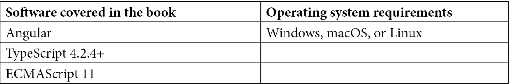

# 序言

Angular 是世界上最流行的框架之一，不仅用于构建 web 应用程序，甚至用于构建移动和桌面应用程序。这个框架由谷歌支持，谷歌使用，被数百万应用程序使用。尽管该框架非常适合任何规模的应用程序，但企业尤其喜欢 Angular，因为它固执己见，而且它的一致生态系统包括创建基于 web 技术的应用程序所需的所有工具。

虽然学习 JavaScript、HTML 和 CSS 等核心技术对于 web 开发人员的进步是绝对必要的，但对于框架来说，学习框架本身的核心概念也非常重要。当我们处理 Angular 时，通过学习和使用 Angular 生态系统中的正确工具，我们可以在 web 应用程序中做很多令人惊奇的事情。这就是这本书的用武之地。

这本书是为中级和高级的 Angular 开发者编写的，目的是通过你可以轻松遵循、玩转和练习你自己的 Angular 变体的方法来提高他们的 Angular 开发技能。您不仅可以从配方本身学习，还可以从与配方相关的实际项目中学习。所以，在这些食谱和项目中有很多隐藏的宝藏。

快乐编码！

# 这本书是给谁的

本书面向中级 Angular web 开发人员，他们正在寻找 Angular 企业开发中常见问题的可行解决方案。使用 Angular 技术的移动开发者也会发现这本书很有用。有 JavaScript 和 TypeScript 的工作经验对于更有效地理解本书所涵盖的主题是必要的。

# 这本书涵盖的内容

[*第 1 章*](01.html#_idTextAnchor014)*获胜组件通信*解释了在角度上实现组件间通信的不同技术。`@Input()`和`@Output()`装饰器、服务和生命周期挂钩也包括在内。还有一个关于如何创建动态角度组件的方法。

[*第 2 章*](02.html#_idTextAnchor052)*理解和使用角度指令*介绍了角度指令和使用角度指令的一些方法，包括属性指令和结构指令。

[*第 3 章*](03.html#_idTextAnchor083)*Angular*中依赖注入的魔力，包括覆盖可选依赖项的配方、配置注入令牌、使用 Angular 服务的`providedIn: 'root'`元数据、值提供者和别名类提供者。

[*第 4 章*](04.html#_idTextAnchor119)*理解角度动画*包含在角度应用程序中实现多状态动画、交错动画、关键帧动画和路线切换动画的方法。

[*第五章*](05.html#_idTextAnchor158)*角度和 RxJS——惊人组合*介绍了 RxJS 实例和静态方法的配方。它还提供了一些关于使用`combineLatest`、`flatMap`和`switchMap`操作符的方法，并介绍了一些使用 RxJS 流的技巧。

[*第 6 章*](06.html#_idTextAnchor203)*与 NgRx*的反应状态管理，有关于著名 NgRx 库及其核心概念的配方。它涵盖了 NgRx 动作、减缩器、选择器和效果等核心概念，并介绍了如何使用`@ngrx/store-devtools`和`@component/store`等软件包。

[*第 7 章*](07.html#_idTextAnchor235)*了解角度导航和路由*，探讨了延迟加载路由、路由防护、预加载路由策略的配方，以及一些与角度路由器一起使用的有趣技术。

[*第 8 章*](08.html#_idTextAnchor271)*掌握角度表单*介绍了模板驱动表单、反应表单、表单验证、测试表单以及创建自己的表单控件的方法。

[*第 9 章：*](09.html#_idTextAnchor318)、*Angular 和 Angular CDK*有很多很酷的 Angular CDK 配方，包括虚拟滚动、键盘导航、叠加 API、剪贴板 API、CDK 拖放、CDK stepper API 和 CDK textfield API。

[*第 10 章*](10.html#_idTextAnchor356)*用 Jest 编写 Angular 单元测试*介绍了使用 Jest 进行单元测试的方法，探索 Jest 中的全局模拟、模拟服务/子组件/管道、使用 Angular CDK 组件线束和单元测试观察值。

[*第 11 章*](11.html#_idTextAnchor396)*中，E2E 与 Cypress*在 Angular 应用程序中使用 Cypress 进行测试，有 E2E 测试的配方。它包括验证表单、等待 XHR 调用、模拟 HTTP 调用响应、使用 Cypress 捆绑包以及在 Cypress 中使用 fixture。

[*第 12 章*](12.html#_idTextAnchor428)*Angular*中的性能优化包含一些很酷的技术，通过使用 OnPush 变更检测策略、延迟加载特征路由、将变更检测器与组件分离、使用具有 Angular 功能的 web workers、，使用纯管道，向 Angular 应用程序添加性能预算，并使用`webpack-bundle`分析器。

[*第 13 章*](13.html#_idTextAnchor468)*带角度的建筑 PWA*包含创建带角度的 PWA 的配方。它包括为 PWA 指定主题颜色、使用设备的暗模式、提供自定义 PWA 安装提示、使用 Angular 的 service worker 预处理请求以及使用 App Shell。

# 充分利用这本书

本书的配方是使用 Angular v12 构建的，Angular 版本遵循语义版本控制。由于 Angular 不断改进，为了稳定性，Angular 团队为更新提供了一个可预测的发布周期。发布频率如下：

*   每 6 个月发布一次主要版本。
*   每个主要版本有 1 到 3 个次要版本。
*   几乎每周都会有补丁发布和预发布（next 或 rc）版本。

来源：[https://angular.io/guide/releases#release-频率](https://angular.io/guide/releases#release-frequency)



**如果您使用的是本书的数字版本，我们建议您自己键入代码或从本书的 GitHub 存储库访问代码（下一节提供了链接）。这样做将帮助您避免与复制和粘贴代码相关的任何潜在错误。**

读完这本书后，一定要发推特到[https://ahsanayaz.com/twitter](https://ahsanayaz.com/twitter) 让我知道你对这本书的反馈。此外，您还可以根据自己的喜好修改本书附带的代码，将其上载到 GitHub 存储库，然后共享。我会确保转发它：）

# 下载示例代码文件

您可以从 GitHub 的[下载本书的示例代码文件 https://github.com/PacktPublishing/Angular-Cookbook](https://github.com/PacktPublishing/Angular-Cookbook) 。如果代码有更新，它将在 GitHub 存储库中更新。

我们的丰富书籍和视频目录中还有其他代码包，请访问[https://github.com/PacktPublishing/](https://github.com/PacktPublishing/) 。看看他们！

# 下载彩色图片

我们还提供了一个 PDF 文件，其中包含本书中使用的屏幕截图和图表的彩色图像。您可以在这里下载：[https://static.packt-cdn.com/downloads/9781838989439_ColorImages.pdf](https://static.packt-cdn.com/downloads/9781838989439_ColorImages.pdf) 。

# 使用的约定

本书中使用了许多文本约定。

`Code in text`：表示文本中的码字、数据库表名、文件夹名、文件名、文件扩展名、路径名、虚拟 URL、用户输入和 Twitter 句柄。下面是一个示例：“现在，我们将把项目标记的代码从`the-amazing-list-component.html`文件移到`the-amazing-list-item.component.html`文件。”

代码块设置如下：

```ts
openMenu($event, itemTrigger) {
    if ($event) {
      $event.stopImmediatePropagation();
    }
    this.popoverMenuTrigger = itemTrigger;
    this.menuShown = true;
  }
```

当我们希望提请您注意代码块的特定部分时，相关行或项目以粗体显示：

```ts
.menu-popover {
  ...
  &::before {...}
  &--up {
    transform: translateY(-20px);
 &::before {
 top: unset !important;
 transform: rotate(180deg);
 bottom: -10px;
 }
  }
  &__list {...}
}
```

**粗体**：表示一个新术语、一个重要单词或您在屏幕上看到的单词。例如，菜单或对话框中的文字以**粗体**显示。下面是一个例子：“您会注意到，我们无法看到输入的全部内容。这在最好的情况下有点烦人，因为在按下**操作**按钮之前，您无法真正查看它。”

提示或重要提示

看起来像这样。

# 联系

我们欢迎读者的反馈。

**一般反馈**：如果您对本书的任何方面有疑问，请发送电子邮件至[customercare@packtpub.com](mailto:customercare@packtpub.com)并在邮件主题中提及书名。

**勘误表**：尽管我们已尽一切努力确保内容的准确性，但还是会出现错误。如果您在本书中发现错误，如果您能向我们报告，我们将不胜感激。请访问[www.packtpub.com/support/errata](http://www.packtpub.com/support/errata)并填写表格。

**盗版**：如果您在互联网上发现我们作品的任何形式的非法复制品，请您提供我们的位置地址或网站名称，我们将不胜感激。【请致电 T2】联系我们 copyright@packt.com 带有指向该材料的链接。

**如果您有兴趣成为一名作家**：如果您对某个主题有专业知识，并且您有兴趣撰写或贡献一本书，请访问[authors.packtpub.com](http://authors.packtpub.com)。

# 分享你的想法

一旦您阅读了*角形烹饪书*，我们很想听听您的想法！请点击此处直接进入亚马逊评论页面[https://packt.link/r/1838989439](https://packt.link/r/1838989439) 阅读本书并分享您的反馈。

您的评论对我们和技术界都很重要，将帮助我们确保提供高质量的内容。