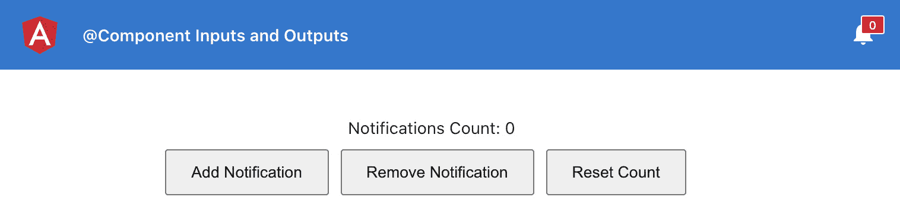
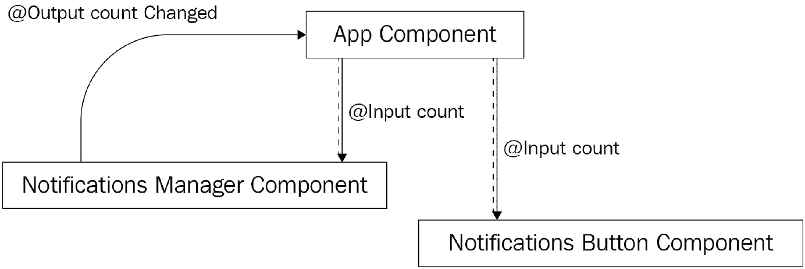
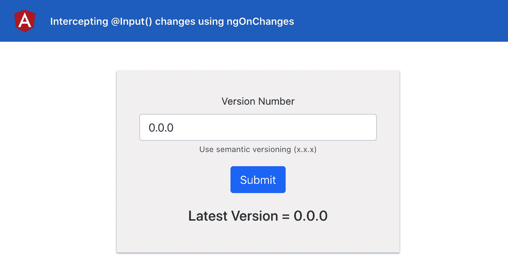
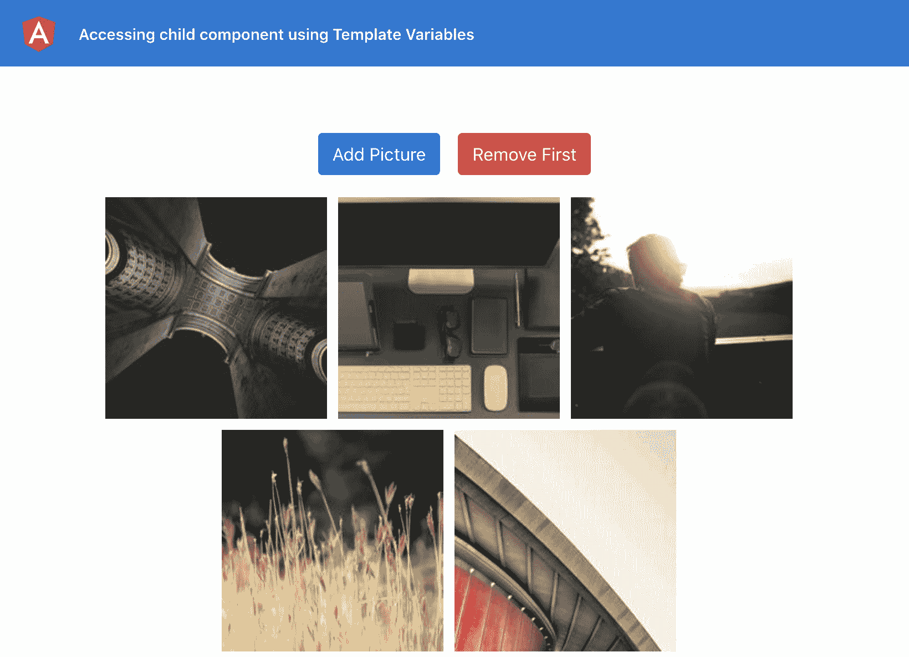
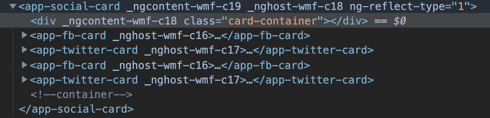

# 一、Angular 组件通信

在本章中，您将掌握 Angular 中的组件通信。您将学习在组件之间建立通信的不同技术，并将学习哪种技术适用于哪种情况。在本章中，您还将学习如何创建动态Angular组件。

以下是我们将在本章中介绍的食谱：

*   使用组件`@Input(s)`和`@Output(s)`的组件通信
*   使用服务的组件通信
*   使用 setter 拦截输入属性更改
*   使用`ngOnChanges`拦截输入属性更改
*   通过模板变量访问父模板中的子组件
*   使用`ViewChild`访问父组件类中的子组件
*   在 Angular 中创建第一个动态组件

# 技术要求

对于本章中的配方，请确保您的机器上安装了**Git**和**Node.js**。您还需要安装`@angular/cli`软件包，您可以从终端使用`npm install -g @angular/cli`进行安装。本章代码见[https://github.com/PacktPublishing/Angular-Cookbook/tree/master/chapter01](https://github.com/PacktPublishing/Angular-Cookbook/tree/master/chapter01) 。

# 使用组件@输入和@输出进行组件通信

您将从一个包含父组件和两个子组件的应用程序开始。然后，您将使用 Angular`@Input`和`@Ouput`装饰器，使用属性和`EventEmitter`在它们之间建立通信。

## 准备好了吗

我们将要处理的项目位于克隆存储库中的`chapter01/start_here/cc-inputs-outputs`：

1.  在 Visual Studio 代码中打开项目。
2.  Open the terminal and run `npm install` to install the dependencies of the project. Once done, run `ng serve -o`.

    这将在新的浏览器选项卡中打开应用程序，您将看到以下内容：



图 1.1–cc 输入输出应用程序在上运行 http://localhost:4200

## 怎么做…

到目前为止，我们有一个包含`AppComponent`、`NotificationsButtonComponent`和`NotificationsManagerComponent`的应用程序。虽然`AppComponent`是上述另外两个组件的父组件，但它们之间绝对没有组件通信来同步通知计数值。让我们使用以下步骤在他们之间建立适当的沟通：

1.  我们将把`notificationsCount`变量从`NotificationsManagerComponent`移动到`AppComponent`中。为此，只需在`app.component.ts`：

    ```ts
    export class AppComponent {
      notificationsCount = 0;
    }
    ```

    中创建一个`notificationsCount`属性即可
2.  接下来，将`notifications-manager.component.ts`中的`notificationsCount`属性转换为`@Input()`，重命名为`count`，并将其用法替换为如下：

    ```ts
    import { Component, OnInit, Input } from '@angular/core';
    @Component({
      selector: 'app-notifications-manager',
      templateUrl: './notifications-manager.component.html',
      styleUrls: ['./notifications-manager.component.scss']
    })
    export class NotificationsManagerComponent implements OnInit {
      @Input() count = 0
      constructor() { }
      ngOnInit(): void {
      }
      addNotification() {
        this.count++;
      }
      removeNotification() {
        if (this.count == 0) {
          return;
        }
        this.count--;
      } 
      resetCount() {
        this.count = 0;
      }
    }
    ```

3.  更新`notifications-manager.component.html`以`count`代替`notificationsCount`

    ```ts
     <div class="notif-manager">
      <div class="notif-manager__count">
        Notifications Count: {{count}}
      </div>
      ...
    </div>
    ```

    的
4.  Next, pass the `notificationsCount` property from `app.component.html` to the `<app-notifications-manager>` element as an input:

    ```ts
     <div class="content" role="main">
      <app-notifications-manager
        [count]="notificationsCount">
      </app-notifications-manager>
    </div>
    ```

    您现在可以通过将`app.component.ts`中`notificationsCount`的值指定为`10`来测试该值是否正确地从`app.component.html`传递到`app-notifications-manager`。您会在`NotificationsManagerComponent`中看到，显示的初始值为`10`：

    ```ts
    export class AppComponent {
      notificationsCount = 10;
    }
    ```

5.  现在，在`notifications-button.component.`ts 中创建一个名为`count`的`@Input()`：

    ```ts
    import { Component, OnInit, Input } from '@angular/core';
    ...
    export class NotificationsButtonComponent implements OnInit {
      @Input() count = 0;
      ...
    }
    ```

6.  从`<app-notifications-button>`到

    ```ts
    <!-- Toolbar -->
    <div class="toolbar" role="banner">
      ...
      <span>@Component Inputs and Outputs</span>
      <div class="spacer"></div>
      <div class="notif-bell">
        <app-notifications-button     [count]="notificationsCount">
        </app-notifications-button>
      </div>
    </div>
    ...
    ```

    也
7.  Use the `count` input in `notifications-button.component.html` with the notification bell icon:

    ```ts
    <div class="bell">
      <i class="material-icons">notifications</i>
      <div class="bell__count">
        <div class="bell__count__digits">
          {{count}}
        </div>
      </div>
    </div>
    ```

    您现在还应该看到通知铃图标计数的值`10`。

    *现在，如果您通过从*`NotificationsManagerComponent`添加/删除通知来更改计数，*通知铃图标上的计数不会更改。*

8.  为了传达从`NotificationsManagerComponent`到`NotificationsButtonComponent`的变化，我们现在将使用Angular`@Output`。在`notifications-manager.component.ts`

    ```ts
    import { Component, OnInit, Input, Output, EventEmitter } from '@angular/core';
    ...
    export class NotificationsManagerComponent implements OnInit {
      @Input() count = 0
      @Output() countChanged = new EventEmitter<number>();
      ...
      addNotification() {
        this.count++;
     this.countChanged.emit(this.count);
      }
      removeNotification() {
        ...
        this.count--;
        this.countChanged.emit(this.count);
      }
      resetCount() {
        this.count = 0;
        this.countChanged.emit(this.count);
      }
    }
    ```

    内`'@angular/core'`使用`@Ouput`和`@EventEmitter`
9.  然后，我们将在`app.component.html`中监听`NotificationsManagerComponent`之前发出的事件，并相应地更新`notificationsCount`属性：

    ```ts
    <div class="content" role="main">
      <app-notifications-manager   (countChanged)="updateNotificationsCount($event)"   [count]="notificationsCount"></app-notifications-  manager>
    </div>
    ```

10.  因为我们之前听过这个`countChanged`事件，调用了`updateNotificationsCount`方法，所以我们需要在`app.component.ts`中创建这个方法，并相应地更新`notificationsCount`属性的值：

    ```ts
    export class AppComponent {
      notificationsCount = 10;
      updateNotificationsCount(count: number) {
        this.notificationsCount = count;
     }
    }
    ```

## 它是如何工作的…

为了在使用`@Input`和`@Output`的组件之间进行通信，数据流将始终从子组件**到**父组件，可以提供新的（更新的）值*作为输入*返回所需的子组件。所以，`NotificationsManagerComponent`发出`countChanged`事件。`AppComponent`（作为父组件）侦听事件并更新`notificationsCount`的值，该值自动更新`NotificationsButtonComponent`中的`count`属性，因为`notificationsCount`作为`@Input()`计数传递给`NotificationsButtonComponent`。*图 1.2*所示为 en轮胎工艺流程：



图 1.2–组件通信如何与输入和输出一起工作

## 另见

*   Angular组件如何通信？[https://www.thirdrocktechkno.com/blog/how-angular-components-communicate](https://www.thirdrocktechkno.com/blog/how-angular-components-communicate)
*   达南杰·库马尔的*组件Angular*通信：[https://www.youtube.com/watch?v=I8Z8g9APaDY](https://www.youtube.com/watch?v=I8Z8g9APaDY)

# 组件使用服务进行通信

在此配方中，您将从一个包含父组件和子组件的应用程序开始。然后，您将使用Angular服务在它们之间建立通信。我们将使用`BehaviorSubject`和可观察流在组件和服务之间进行通信。

## 准备好了吗

此配方的项目位于`chapter01/start_here/cc-services`：

1.  在 Visual Studio 代码中打开项目。
2.  打开终端，运行`npm install`安装项目的依赖项。
3.  Once done, run `ng serve -o`.

    这将在新的浏览器选项卡中打开应用程序，您将看到应用程序，如下所示：


图 1.3–在上运行的 cc services 应用程序 http://localhost:4200

## 怎么做…

与之前的配方类似，我们有一个应用程序，上面有`AppComponent`、`NotificationsButtonComponent`和`NotificationsManagerComponent`。`AppComponent`是前面提到的其他两个组件的父组件，我们需要通过以下步骤在它们之间建立适当的通信：

1.  在名为`services`的`chapter01/start_here/cc-services/src/app`项目中创建一个新文件夹。这就是我们的新服务将驻留的地方。
2.  从终端导航到项目，即在`chapter01/start_here/cc-services`内部，创建一个名为`NotificationService`的新服务，如下所示：

    ```ts
    ng g service services/Notifications
    ```

3.  Create a `BehaviorSubject` named `count` inside `notifications.service.ts` and initialize it with `0`, as a `BehaviorSubject` requires an initial value:

    ```ts
    import { Injectable } from '@angular/core';
    import { BehaviorSubject } from 'rxjs';
    @Injectable({
      providedIn: 'root'
    })
    export class NotificationsService {
      private count: BehaviorSubject<number> = new   BehaviorSubject<number>(0);
      constructor() { }
    }
    ```

    请注意，`BehaviorSubject`是一个`private`属性，稍后我们将仅使用`public`方法从服务内部对其进行更新。

4.  现在，使用`count``BehaviorSubject`

    ```ts
    import { Injectable } from '@angular/core';
    import { BehaviorSubject, Observable } from 'rxjs';
    ...
    export class NotificationsService {
      private count: BehaviorSubject<number> = new   BehaviorSubject<number>(0);
     count$: Observable<number> = this.count.asObservable();
      ...
    }
    ```

    上的`.asObservable()`方法创建一个名为`count$`的`Observable`：
5.  将`notifications-manager.component.ts`中的`notificationsCount`属性转换为名为`notificationsCount$`的可观察对象。在组件中注入`NotificationsService`，并将服务的`count$`可观察分配给组件的`notificationsCount$`变量：

    ```ts
    import { Component, OnInit } from '@angular/core';
    import { Observable } from 'rxjs';
    import { NotificationsService } from '../services/notifications.service';
    ...
    export class NotificationsManagerComponent implements OnInit {
      notificationsCount$: Observable<number>;
      constructor(private notificationsService:   NotificationsService) { }

      ngOnInit(): void {
     this.notificationsCount$ = this.notificationsService.    count$;
     }
      ...
    }
    ```

6.  注释当前更新通知计数的代码；我们稍后再回来：

    ```ts
    ...
    export class NotificationsManagerComponent implements OnInit {
      ...
      addNotification() {
        // this.notificationsCount++;
      }
      removeNotification() {
        // if (this.notificationsCount == 0) {
     //   return;
     // }
     // this.notificationsCount--;
      }
      resetCount() {
        // this.notificationsCount = 0;
      }
    }
    ```

7.  将`notifications-manager.component.html`中可观察到的`notificationsCount$`与`async`管道一起显示其值：

    ```ts
    <div class="notif-manager">
      <div class="notif-manager__count">
        Notifications Count: {{notificationsCount$ | async}}
      </div>
      ...
    </div>
    ```

8.  现在，同样地在`notifications-button.component.ts`中注入`NotificationsService`，在`NotificationsButtonComponent`中创建一个名为`notificationsCount$`的可观察对象，并将服务的`count$`可观察对象分配给它：

    ```ts
    import { Component, OnInit } from '@angular/core';
    import { NotificationsService } from '../services/notifications.service';
    import { Observable } from 'rxjs';
     ...
    export class NotificationsButtonComponent implements OnInit {
      notificationsCount$: Observable<number>;
      constructor(private notificationsService:   NotificationsService) { }

      ngOnInit(): void {
        this.notificationsCount$ = this.notificationsService.    count$;
      }
    }
    ```

9.  Use the `notificationsCount$` Observable in `notifications-button.component.html` with the `async` pipe:

    ```ts
    <div class="bell">
      <i class="material-icons">notifications</i>
      <div class="bell__count">
        <div class="bell__count__digits">
          {{notificationsCount$ | async}}
        </div>
      </div>
    </div>
    ```

    如果您现在刷新应用程序，您应该能够看到 notifications manager 组件和 notifications button 组件的值`0`。

10.  将`count``BehaviorSubject`的初始值更改为`10`，看看这是否反映在两个组件中：

    ```ts
    ...
    export class NotificationsService {
      private count: BehaviorSubject<number> = new   BehaviorSubject<number>(10);
      ...
    }
    ```

11.  现在，在`notifications.service.ts`中创建一个名为`setCount`的方法，这样我们就可以更新`count``BehaviorSubject`

    ```ts
    ...
    export class NotificationsService {
      …
      constructor() {}
      setCount(countVal) {
     this.count.next(countVal);
     }
    }
    ```

    的值
12.  现在我们在位置有了`setCount`方法，让我们在`notifications-manager.component.ts`中使用它来根据按钮点击更新其值。为了做到这一点，我们需要获得可观察到的`notificationsCount$`的最新值，然后执行一些操作。我们将首先在`NotificationsManagerComponent`中创建一个`getCountValue`方法，如下所示，并将`subscribe`与`notificationsCount$`可观察对象上的`first`操作符一起使用，以获取其最新值：

    ```ts
    ...
    import { first } from 'rxjs/operators';
    ...
    export class NotificationsManagerComponent implements OnInit {
      ngOnInit(): void {
        this.notificationsCount$ = this.notificationsService.    count$;
      }
      ...
      getCountValue(callback) {
     this.notificationsCount$
     .pipe(
     first()
     ).subscribe(callback)
     }
      ...
    }
    ```

13.  Now, we'll use the `getCountValue` method within our `addNotification`, `removeNotification`, and `resetCount` methods. We'll have to pass the callback function from these methods to the `getCountValue` method. Let's start with the `addNotification` method first:

    ```ts
    import { Component, OnInit } from '@angular/core';
    import { Observable } from 'rxjs';
    import { NotificationsService } from '../services/notifications.service';
    import { first } from 'rxjs/operators';

    ...
    export class NotificationsManagerComponent implements OnInit {
      ...
     addNotification() {
     this.getCountValue((countVal) => {
     this.notificationsService.setCount(++countVal)
     });
     }
      ...
    }
    ```

    使用前面的代码，当我们点击**添加通知**按钮时，您应该已经看到两个组件正确地反映了更新的值。

14.  现在让我们为`removeNotification`和`resetCount`实现相同的逻辑：

    ```ts
    ...
    export class NotificationsManagerComponent implements OnInit {
      ...
      removeNotification() {
     this.getCountValue((countVal) => {
     if (countVal === 0) {
     return;
     }
     this.notificationsService.setCount(--countVal);
     })
     }
     resetCount() {
     this.notificationsService.setCount(0);
     }
    }
    ```

## 它是如何工作的…

`BehaviorSubject`是`Observable`的一种特殊类型，需要一个初始值，可以被许多订户使用。在这个配方中，我们创建一个`BehaviorSubject`，然后使用`BehaviorSubject`上的`.asObservable()`方法创建一个`Observable`。虽然我们可以使用`BehaviorSubject`，但社区推荐使用`.asObservable()`方法。

一旦我们在`NotificationsService`中创建了名为`count$`的可观察对象，我们将`NotificationsService`注入我们的组件，并将`count$`可观察对象分配给组件的局部属性。然后，我们直接在`NotificationsButtonComponent`的模板（`html`中）和`NotificationsManagerComponent`的模板中使用`async`管道订阅该本地属性（可观察）。

然后，每当我们需要更新`count$`可观测值时，我们使用`NotificationsService`的`setCount`方法通过`.next()`方法更新实际`BehaviorSubject`的值。这会通过`count$`可观察对象自动发出此新值，并使用两个组件中的新值更新视图。

## 另见

*   RxJS 官方文件中的主题：[https://www.learnrxjs.io/learn-rxjs/subjects](https://www.learnrxjs.io/learn-rxjs/subjects)
*   `BehaviorSubject`与`Observable`对堆栈溢出：[https://stackoverflow.com/a/40231605](https://stackoverflow.com/a/40231605)

# 使用 setter 拦截输入属性更改

在本配方中，您将了解如何截获从父组件传递的`@Input`中的更改，以及如何对此事件执行某些操作。我们将拦截从`VersionControlComponent`父组件传递到`VcLogsComponent`子组件的`vName`输入。每当`vName`的值发生变化时，我们将使用 setter 生成一个日志，并在子组件中显示这些日志。

## 准备好了吗

此配方的项目位于`chapter01.start_here/cc-setters`：

1.  在 Visual Studio 代码中打开项目。
2.  打开终端，运行`npm install`安装项目的依赖项。
3.  完成后，运行`ng serve -o`。这将在新的浏览器选项卡中打开应用程序，您将看到应用程序，如下所示：


图 1.4–运行在上的 cc setters 应用程序 http://localhost:4200

## 怎么做…

1.  我们将首先在`VcLogsComponent`中创建一个日志数组，如下所示，以存储我们稍后将使用模板显示的所有日志：

    ```ts
    export class VcLogsComponent implements OnInit {
      @Input() vName;
     logs: string[] = [];
      constructor() { }
    ...
    }
    ```

2.  让我们为显示日志的位置创建 HTML。让我们使用以下代码将日志容器和日志项添加到`vc-logs.component.html`：

    ```ts
    <h5>Latest Version = {{vName}}</h5>
    <div class="logs">
     <div class="logs__item" *ngFor="let log of logs">
     {{log}}
     </div>
    </div>
    ```

3.  Then, we'll add a bit of styling for the logs container and log items to be shown. After the changes, the view should look as shown in *Figure 1.5*. Update the `vc-logs.component.scss` file as follows:

    ```ts
    h5 {
      text-align: center;
    }
    .logs {
     padding: 1.8rem;
     background-color: #333;
     min-height: 200px;
     border-radius: 14px;
     &__item {
     color: lightgreen;
     }
    }
    ```

    以下屏幕截图显示了具有日志容器样式的应用程序：

    

    图 1.5–具有日志容器样式的 cc setters 应用程序

4.  现在，我们将转换`vc-logs.component.ts`中的`@Input()`以使用 getter 和 setter，这样我们可以拦截输入更改。为此，我们还将创建一个名为`_vName`的内部属性。代码应如下所示：

    ```ts
    ...
    export class VcLogsComponent implements OnInit {
     _vName: string;
     @Input() 
     get vName() {
     return this._vName;
     };
     set vName(name: string) {
     this._vName = name;
     }
      logs: string[] = [];
      constructor() { }
    ...
    }
    ```

5.  随着*第 4 步*中的变化，应用程序的工作原理与之前完全相同，也就是说，非常完美。现在，让我们修改 setter 来创建这些日志。对于初始值，我们将有一个日志，上面写着`'initial version is x.x.x'`：

    ```ts
    export class VcLogsComponent implements OnInit {
      ...
      set vName(name: string) {
     if (!name) return;
     if (!this._vName) {
     this.logs.push('initial version is ${name.trim()}')
     }
        this._vName = name;
      }
    ...
    }
    ```

6.  Now, as the last step, for every time we change the version name, we need to show a different message saying `'version changed to x.x.x'`. *Figure 1.6* shows the final output. For the required changes, we'll write some further code in the `vName` setter as follows:

    ```ts
    export class VcLogsComponent implements OnInit {
      ...
      set vName(name: string) {
        if (!name) return;
        if (!this._vName) {
          this.logs.push('initial version is ${name.trim()}')
        } else {
          this.logs.push('version changed to ${name.trim()}')
     }
        this._vName = name;
      }
    ```

    以下屏幕截图显示了最终输出：


图 1.6–使用设定器的最终输出

## 它是如何工作的…

getter 和setter 是 JavaScript内置特性的组件。许多开发人员在使用香草 JavaScript，甚至是TypeScript 时，在他们的项目中使用了它们。幸运的是，Angular 的`@Input()`也可以使用 getter 和 setter，因为它们基本上是所提供类的属性。

对于这个配方，我们使用一个 getter，更具体地说，是一个 setter 作为我们的输入，所以每当输入发生变化时，我们都使用 setter 方法来执行额外的任务。此外，我们在 HTML 中使用相同输入的 setter，因此在更新时直接在视图中显示值。

将私有变量/属性与 getter 和 setter 一起使用总是一个好主意，这样可以将组件作为输入接收的内容与它自己单独存储的内容分离开来。

## 另见

*   [https://angular.io/guide/component-interaction#intercept-输入-属性-更改-带设置器](https://angular.io/guide/component-interaction#intercept-input-property-changes-with-a-setter)
*   [https://www.jackfranklin.co.uk/blog/es5-getters-setters](https://www.jackfranklin.co.uk/blog/es5-getters-setters) 杰克·富兰克林

# 使用 ngOnChanges 拦截输入属性更改

在本食谱中，您将学习如何使用`ngOnChanges`使用`SimpleChanges`API 拦截更改。我们将监听从`VersionControlComponent`父组件传递到`VcLogsComponent`子组件的`vName`输入。

## 准备好了吗

此配方的项目位于`chapter01/start_here/cc-ng-on-changes`：

1.  在 Visual Studio 代码中打开项目。
2.  打开终端，运行`npm install`安装项目的依赖项。
3.  完成后，运行`ng serve -o`。这将在新的浏览器选项卡中打开应用程序，您将看到应用程序，如下所示：



图 1.7–cc ng on changes 应用程序在上运行 http://localhost:4200

## 怎么做…

1.  我们将首先在`VcLogsComponent`中创建一个日志数组，如下所示，以存储我们稍后将使用模板显示的所有日志：

    ```ts
    export class VcLogsComponent implements OnInit {
      @Input() vName;
      logs: string[] = [];
      constructor() { }
    ...
    }
    ```

2.  让我们为显示日志的位置创建 HTML。让我们使用以下代码将日志容器和日志项添加到`vc-logs.component.html`：

    ```ts
    <h5>Latest Version = {{vName}}</h5>
    <div class="logs">
     <div class="logs__item" *ngFor="let log of logs">
     {{log}}
     </div>
    </div>
    ```

3.  Then, we'll add a bit of styling for the logs container and log items to be shown, in `vc-logs.component.scss`, as follows:

    ```ts
    h5 {
      text-align: center;
    }
    .logs {
     padding: 1.8rem;
     background-color: #333;
     min-height: 200px;
     border-radius: 14px;
     &__item {
     color: lightgreen;
     }
    }
    ```

    您应该看到如下内容：

    

    图 1.8–带有日志容器样式的 cc ng on changes 应用程序

4.  现在，让我们在`vc-logs.component.ts`文件中使用`VcLogsComponent`中的简单更改来实现`ngOnChanges`：

    ```ts
    import { Component, OnInit, Input, OnChanges, SimpleChanges } from '@angular/core';
    ...
    export class VcLogsComponent implements OnInit, OnChanges {
      @Input() vName;
      logs: string[] = [];
      constructor() {}
      ngOnInit(): void {}
      ngOnChanges(changes: SimpleChanges) {
     }
    }
    ```

5.  我们现在可以为输入的初始值添加一个日志，称为`'initial version is x.x.x'`。我们通过使用`.isFirstChange()`方法检查其是否为初始值，如下所示：

    ```ts
    ...
    export class VcLogsComponent implements OnInit, OnChanges {
      ...
      ngOnChanges(changes: SimpleChanges) {
     const currValue = changes.vName.currentValue;
     if (changes.vName.isFirstChange()) {
     this.logs.push('initial version is       ${currValue.trim()}')
     }
      }
    }
    ```

6.  让我们来处理这样一种情况，即在分配初始值后更新版本。为此，我们将添加另一个日志，使用`else`条件显示`'version changed to x.x.x'`，如下所示：

    ```ts
    ...
    export class VcLogsComponent implements OnInit, OnChanges {
      ...
      ngOnChanges(changes: SimpleChanges) {
        const currValue = changes.vName.currentValue;
        if (changes.vName.isFirstChange()) {
          this.logs.push('initial version is       ${currValue.trim()}')
        } else {
     this.logs.push('version changed to       ${currValue.trim()}')
     }
      }
    }
    ```

## 它是如何工作的…

`ngOnChanges`是众多生命周期中的之一。它甚至在`ngOnInit`挂钩之前触发。因此，您在第一次调用中得到了*初始值*，之后得到了*更新值*。无论何时任何输入发生变化，`ngOnChanges`回调都会被`SimpleChanges`触发，您可以获得上一个值、当前值以及表示这是否是输入的第一次变化（即初始值）的布尔值。当我们更新父级中`vName`输入的值时，将使用更新后的值调用`ngOnChanges`。然后，根据情况，我们将适当的日志添加到我们的`logs`数组中，并将其显示在 UI 上。

## 另见

*   Angular生命周期挂钩：[https://angular.io/guide/lifecycle-hooks](https://angular.io/guide/lifecycle-hooks)
*   将变更检测钩与`ngOnChanges`[一起使用 https://angular.io/guide/lifecycle-hooks#using-更换检测挂钩](https://angular.io/guide/lifecycle-hooks#using-change-detection-hooks)
*   `SimpleChanges`API参考文献：[https://angular.io/api/core/SimpleChanges](https://angular.io/api/core/SimpleChanges)

# 通过模板变量访问父模板中的子组件

在本配方中，您将学习如何使用**Angular模板参考变量**将子组件访问到父组件的模板中。您将从一个应用程序开始，该应用程序的父组件为`AppComponent`，子组件为`GalleryComponent`。然后，您将为父级模板中的子组件创建一个模板变量，以访问它并在组件类中执行一些操作。

## 准备好了吗

我们将要处理的项目位于克隆存储库中的`chapter01/start_here/cc-template-vars`：

1.  在 Visual Studio 代码中打开项目。
2.  打开终端，运行`npm install`安装项目的依赖项。
3.  Once done, run `ng serve -o`.

    此应在新浏览器选项卡中打开应用程序，您应看到如下内容：

    

    图 1.9–在上运行的 cc 模板 vars 应用程序 http://localhost:4200

4.  单击顶部的按钮以查看相应的控制台日志。

## 怎么做…

1.  我们将从开始，在`app.component.html`文件

    ```ts
    ...
    <div class="content" role="main">
      ...
      <app-gallery #gallery></app-gallery>
    </div>
    ```

    中的`<app-gallery>`组件上创建一个名为`#gallery`的模板变量
2.  接下来，我们修改`app.component.ts`中的`addNewPicture()`和`removeFirstPicture()`方法来接受一个名为`gallery`的参数，这样当我们点击按钮时，它们可以接受`app.component.html`中的模板变量。代码应如下所示：

    ```ts
    import { Component } from '@angular/core';
    import { GalleryComponent } from './components/gallery/gallery.component';
    ...
    export class AppComponent {
      ...
      addNewPicture(gallery: GalleryComponent) {
        console.log('added new picture');
      }
      removeFirstPicture(gallery: GalleryComponent) {
        console.log('removed first picture');
      }
    }
    ```

3.  现在，让我们将模板变量从`app.component.html`传递到两个按钮的点击处理程序，如下所示：

    ```ts
    …
    <div class="content" role="main">
      <div class="gallery-actions">
        <button class="btn btn-primary"     (click)="addNewPicture(gallery)">Add Picture</button>
        <button class="btn btn-danger"     (click)="removeFirstPicture(gallery)">Remove     First</button>
      </div>
      ...
    </div>
    ```

4.  我们现在可以实现添加新图片的代码。为此，我们将访问`GalleryComponent`的`generateImage()`方法，并在`pictures`数组中添加一个新项作为第一个元素。代码如下：

    ```ts
    ...
    export class AppComponent {
      ...
      addNewPicture(gallery: GalleryComponent) {
        gallery.pictures.unshift(gallery.generateImage());
      }
      ...
    }
    ```

5.  为了从数组中移除第一项，我们将在`GalleryComponent`类中的`pictures`数组上使用数组的`shift`方法移除第一项，如下所示：

    ```ts
    ...
    export class AppComponent {
       ...
      removeFirstPicture(gallery: GalleryComponent) {
        gallery.pictures.shift();
      }
    }
    ```

## 它是如何工作的…

模板引用变量通常是对模板中 DOM元素的引用。它还可以引用指令（包含组件）、元素`TemplateRef`或 web 组件（来源：[https://angular.io/guide/template-reference-variables](https://angular.io/guide/template-reference-variables) ）。

本质上，我们可以引用我们的`<app-gallery>`组件，它在幕后是一个指令。一旦模板中有了变量，我们就将引用作为函数参数传递给组件中的函数。然后，我们可以从那里访问`GalleryComponent`的属性和方法。您可以看到，我们可以直接从`AppComponent`添加和删除驻留在`GalleryComponent`中的`pictures`数组中的项，而`AppComponent`是整个流中的父组件。

## 另见

*   Angular模板变量：[https://angular.io/guide/template-reference-variables](https://angular.io/guide/template-reference-variables)
*   Angular模板语句：[https://angular.io/guide/template-statements](https://angular.io/guide/template-statements)

# 使用 ViewChild 访问父组件类中的子组件

在本教程中，您将学习如何使用`ViewChild`装饰器访问父组件类中的子组件。您将从一个应用程序开始，该应用程序将`AppComponent`作为父组件，`GalleryComponent`作为子组件。然后，您将为父组件类中的子组件创建一个`ViewChild`来访问它并执行一些操作。

## 准备好了吗

我们将要处理的项目位于克隆存储库中的`chapter01/start_here/cc-view-child`：

1.  在 Visual Studio 代码中打开项目。
2.  打开终端，运行`npm install`安装项目的依赖项。完成后，运行`ng serve -o`。
3.  This should open the app in a new browser tab and you should see something like the following:

    

    图 1.10–在上运行的 cc view 子应用程序 http://localhost:4200

4.  点击顶部的按钮，可以看到各自的控制台日志。

## 怎么做…

1.  我们首先将`GalleryComponent`导入到`app.component.ts`文件中，以便为其创建一个`ViewChild`：

    ```ts
    import { Component } from '@angular/core';
    import { GalleryComponent } from './components/gallery/gallery.component';
    ...
    export class AppComponent {
      ...
    }
    ```

2.  然后，我们将使用`ViewChild()`装饰器为`GalleryComponent`创建`ViewChild`，如下所示：

    ```ts
    import { Component, ViewChild } from '@angular/core';
    import { GalleryComponent } from './components/gallery/gallery.component';
    export class AppComponent {
      title = 'cc-view-child';
      @ViewChild(GalleryComponent) gallery;
      ...
    }
    ```

3.  现在，我们将实现添加新图片的逻辑。为此，在`AppComponent`中的`addNewPicture`方法中，我们将使用在*步骤 2 中*创建的`gallery`道具。这是从子组件访问`pictures`阵列。完成后，我们将使用`GalleryComponent`的`generateImage`方法将新图片添加到该阵列的顶部，如下所示：

    ```ts
    ...
    export class AppComponent {
      title = 'cc-view-child';
      @ViewChild(GalleryComponent) gallery: GalleryComponent;
      addNewPicture() {
        this.gallery.pictures.unshift(    this.gallery.generateImage());
      }
      ...
    }
    ```

4.  要处理删除图片，我们将在`AppComponent`类中的`removeFirstPicture`方法中添加逻辑。我们还将使用视图子级来完成此操作。我们将简单地使用`pictures`阵列上的`Array.prototype.shift`方法移除第一个元素，如下所示：

    ```ts
    ...
    export class AppComponent {
    ...
      removeFirstPicture() {
        this.gallery.pictures.shift();
      }
    }
    ```

## 它是如何工作的…

`ViewChild()`基本上是`@angular/core`包提供的开箱即用的装饰器。为Angular变化检测器配置**视图查询**。变更检测器试图找到与查询匹配的第一个元素，并将其分配给与`ViewChild()`装饰符关联的属性。在我们的配方中，我们通过提供`GalleryComponent`作为查询参数来创建一个视图子级，即`ViewChild(GalleryComponent)`。这允许Angular变化检测器在`app.component.html`模板中找到`<app-gallery>`元素，然后将其分配给`AppComponent`类中的`gallery`属性。将gallery 属性的类型定义为`GalleryComponent`是很重要的，这样我们就可以很容易地在组件中使用类型脚本。

重要提示

视图查询在`ngOnInit`生命周期钩子之后、在`ngAfterViewInit`钩子之前执行。

## 另见

*   Angular`ViewChild`[https://angular.io/api/core/ViewChild](https://angular.io/api/core/ViewChild)
*   阵列的移位方式：[https://developer.mozilla.org/en-US/docs/Web/JavaScript/Reference/Global_Objects/Array/shift](https://developer.mozilla.org/en-US/docs/Web/JavaScript/Reference/Global_Objects/Array/shift)

# 在 Angular 中创建第一个动态组件

在本食谱中，您将学习如何在 Angular 中创建**动态组件**，这些组件是根据不同的条件按需动态创建的。为什么？因为您可能有几个复杂的条件，您希望基于这些条件加载特定的组件，而不是将所有可能的组件都放在模板中。我们将使用`ComponentFactoryResolver`服务、`ViewChild()`装饰器和`ViewContainerRef`服务来实现动态加载。我很兴奋，你也很兴奋！

## 准备好了吗

我们将要处理的项目位于克隆存储库中的`chapter01/start_here/ng-dynamic-components`：

1.  在 Visual Studio 代码中打开项目。
2.  打开终端并运行`npm install`来安装项目的依赖项。
3.  Once done, run `ng serve -o`.

    这将在新的浏览器选项卡中打开应用程序，您将看到如下内容：

    

    图 1.11–运行在上的 ng dynamic components 应用程序 http://localhost:4200

4.  点击顶部的按钮，可以看到各自的控制台日志。

## 怎么做…

1.  首先，让我们从`social-card.component.html`文件中删除带有`[ngSwitch]`和`*ngSwitchCase`指令的元素，并用一个名为`#vrf`的模板变量替换为一个简单的`div`。我们将把这个`div`用作容器。代码应如下所示：

    ```ts
    <div class="card-container" #vrf></div>
    ```

2.  接下来，我们将`ComponentFactoryResolver`服务添加到`social-card.component.ts`中，如下所示：

    ```ts
    import { Component, OnInit, Input, ComponentFactoryResolver } from '@angular/core';
    ...
    export class SocialCardComponent implements OnInit {
      @Input() type: SocialCardType;
      cardTypes = SocialCardType;
      constructor(private componentFactoryResolver:   ComponentFactoryResolver) { }
      ...
    }
    ```

3.  现在，我们在同一个文件中为`ViewContainerRef`创建一个`ViewChild`，以便我们可以从模板中引用`#vrf`div，如下所示：

    ```ts
    import { Component, OnInit, Input, ComponentFactoryResolver, ViewChild, ViewContainerRef } from '@angular/core';
    ...
    export class SocialCardComponent implements OnInit {
      @Input() type: SocialCardType;
      @ViewChild('vrf', {read: ViewContainerRef}) vrf:   ViewContainerRef;
      cardTypes = SocialCardType;
      ...
    }
    ```

4.  要动态创建组件，我们需要监听对类型输入的更改。因此，无论何时更改，我们都会动态加载相应的组件。为此，我们将在`SocialCardComponent`中实现`ngOnChanges`钩子，并暂时将更改记录在控制台上。一旦实现，您应该在点击 Facebook 或 Twitter 按钮

    ```ts
    import { Component, OnInit, OnChanges, Input, ComponentFactoryResolver, ViewChild, ViewContainerRef, SimpleChanges } from '@angular/core';
    ...
    export class SocialCardComponent implements OnInit, OnChanges {
      ...
      ngOnChanges(changes: SimpleChanges) {
     if (changes.type.currentValue !== undefined) {
     console.log('card type changed to:       ${changes.type.currentValue}')
     }
     }
    }
    ```

    后在控制台上看到日志
5.  现在，我们将在`SocialCardComponent`中创建一个名为`loadDynamicComponent`的方法，该方法接受社交卡的类型，即`SocialCardType`，并决定动态加载哪个组件。我们还将在方法中创建一个名为`component`的变量，以选择要加载的组件。这应该如所示：

    ```ts
    import {...} from '@angular/core';
    import { SocialCardType } from 'src/app/constants/social-card-type';
    import { FbCardComponent } from '../fb-card/fb-card.component';
    import { TwitterCardComponent } from '../twitter-card/twitter-card.component';
    ...
    export class SocialCardComponent implements OnInit {
      ...
      ngOnChanges(changes: SimpleChanges) {
        if (changes.type.currentValue !== undefined) {
          this.loadDynamicComponent(      changes.type.currentValue)
        }
      }
      loadDynamicComponent(type: SocialCardType) {
     let component;
     switch (type) {
     case SocialCardType.Facebook:
     component = FbCardComponent;
     break;
     case SocialCardType.Twitter:
     component = TwitterCardComponent;
     break;
     }
     }
    }
    ```

6.  Now that we know which component is to be dynamically loaded, let's use `componentFactoryResolver` to resolve the component and then to create the component inside `ViewContainerRef` (`vrf`), as follows:

    ```ts
    ...
    export class SocialCardComponent implements OnInit {
      ...
      loadDynamicComponent(type: SocialCardType) {
        let component;
        switch (type) {
          ...
        }
        const componentFactory = this.componentFactory     Resolver.resolveComponentFactory(component);
     this.vrf.createComponent(componentFactory);
      }
    }
    ```

    有了前面的变化，我们就快到了。当您第一次点击 Facebook 或 Twitter 按钮时，您应该会看到动态创建的相应组件。

    但是…如果您再次点击其中一个按钮，您将看到组件作为附加元素添加到视图中。

    在检查时可能是这样的：



图 1.12–添加到 ViewContainerRef 的多个元素预览

阅读*如何工作*部分，了解为什么会发生这种情况。但为了修复它，我们只需在创建动态组件之前对`ViewContainerRef`执行`clear()`，如下所示：

```ts
...
export class SocialCardComponent implements OnInit {
  ...
  loadDynamicComponent(type: SocialCardType) {
    ...
    const componentFactory = this.    componentFactoryResolver.    resolveComponentFactory(component);
    this.vrf.clear();
    this.vrf.createComponent(componentFactory);
  }
}
```

## 它是如何工作的…

`ComponentFactoryResolver`是一个Angular服务，允许您在运行时动态解析组件。在我们的配方中，我们使用`resolveComponentFactory`方法，它接受**成分**并返回`ComponentFactory`。我们总是可以使用`ComponentFactory`的`create`方法来创建组件的实例。但是在这个配方中，我们使用了`ViewContainerRef`的`createComponent`方法，它接受`ComponentFactory`作为输入。然后在幕后使用`ComponentFactory`生成组件，然后将其添加到附加的`ViewContainerRef`中。每创建一个组件并将其附加到`ViewContainerRef`时，它都会向现有元素列表中添加一个新组件。对于我们的配方，我们一次只需要显示一种成分，即`FBCardComponent`或`TwitterCardComponent`。因此`ViewContainerRef`中只存在一个元素，我们在添加元素之前对其使用`clear()`方法。

## 另见

*   `resolveComponentFactory`方法：[https://angular.io/api/core/ComponentFactoryResolver#resolvecomponentfactory](https://angular.io/api/core/ComponentFactoryResolver#resolvecomponentfactory)
*   Angular 公司关于动态组件加载器的文件：[https://angular.io/guide/dynamic-component-loader](https://angular.io/guide/dynamic-component-loader)
*   `ViewContainerRef`文件：[https://angular.io/api/core/ViewContainerRef](https://angular.io/api/core/ViewContainerRef)
*   用 IVY 动态加载Angular为 9 的部件：[https://labs.thisdot.co/blog/loading-components-dynamically-in-angular-9-with-ivy](https://labs.thisdot.co/blog/loading-components-dynamically-in-angular-9-with-ivy)