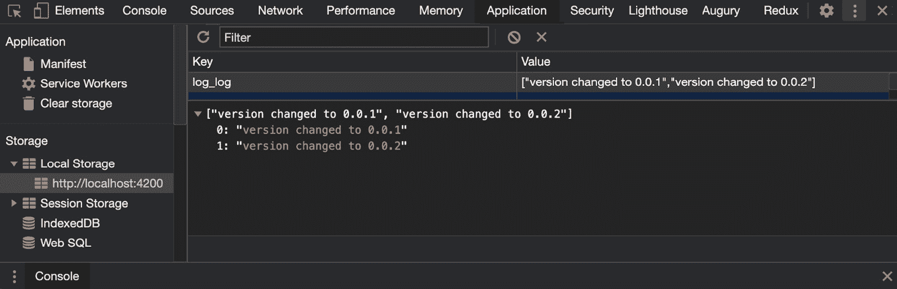
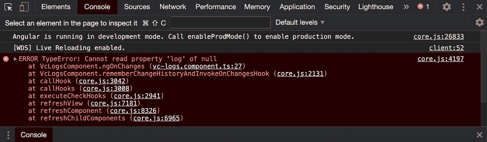
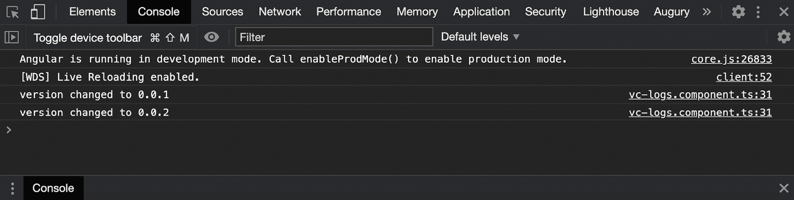
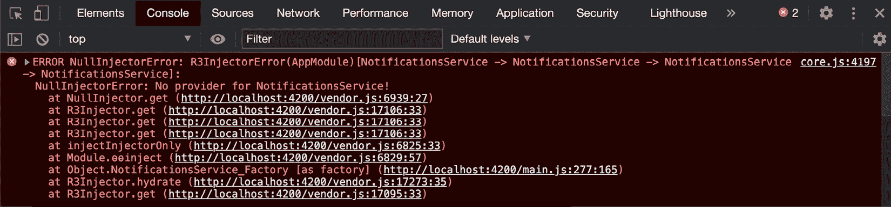
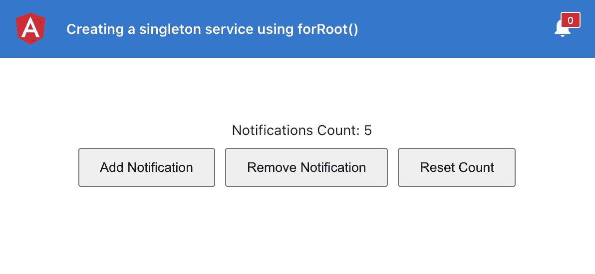

# *第三章*：Angular 中依赖注入的魔力

这一章讲述了 Angular 中**依赖注入**（**DI**的魔力。在这里，您将了解一些关于角度图中 DI 概念的详细信息。DI 是 Angular 用来向组件、指令和服务注入不同依赖项的过程。您将使用几个使用服务和提供者的示例来获得一些实践经验，以便在以后的项目中使用。

在本章中，我们将介绍以下配方：

*   使用 DI 令牌配置注入器
*   可选依赖项
*   使用`providedIn`创建单例服务
*   使用`forRoot()`创建单例服务
*   使用相同的别名类提供程序向应用程序提供不同的服务
*   Angular 中的值提供者

## 技术要求

对于本章中的配方，请确保您的机器上安装了**Git**和**NodeJS**。您还需要安装`@angular/cli`软件包，您可以使用终端上的`npm install -g @angular/cli`进行安装。本章代码见[https://github.com/PacktPublishing/Angular-Cookbook/tree/master/chapter03](https://github.com/PacktPublishing/Angular-Cookbook/tree/master/chapter03) 。

# 使用 DI 令牌配置注入器

在本食谱中，您将学习如何为正则 TypeScript类创建一个基本 DI 令牌以用作角度服务。我们的应用程序中有一个服务（`UserService`，它当前使用`Greeter`类创建一个具有`greet`方法的用户。因为 Angular 是关于 DI 和服务的，所以我们将实现一种方法，使用这个名为`Greeter`的常规类型脚本类作为 Angular 服务。我们将使用`InjectionToken`创建一个 DI 令牌，然后使用`@Inject`装饰器使我们能够在服务中使用该类。

## 重新开始ady

我们将要处理的项目位于`chapter03/start_here/ng-di-token`中，它位于克隆存储库中。执行以下步骤：

1.  在 Visual Studio 代码中打开项目。
2.  打开终端，运行`npm install`安装项目的依赖项。
3.  Once done, run `ng serve -o`.

    这将在新的浏览器选项卡中打开应用程序；您应该会看到类似于以下屏幕截图的内容：


图 3.1–运行在上的 ng di 令牌应用程序 http://localhost:4200

现在我们已经运行了应用程序，我们可以继续进行配方的步骤。

## 怎么做。。。

我们现在拥有的应用程序向随机用户显示了一条问候语，该问候语是从我们的`UserService`检索到的。并且`UserService`使用`Greeter`类。我们将使用 DI 将其用作角度服务，而不是将其用作类。我们将首先为我们的`Greeter`类创建一个`InjectionToken`，它是一个常规的 TypeScript 类，然后我们将它注入到我们的服务中。执行以下步骤以遵循以下步骤：

1.  我们将使用`@angular/core`包中的`InjectionToken`类在`greeter.class.ts`文件中创建一个名为`'Greeter'`的`InjectionToken`。此外，我们将从文件

    ```ts
    import { InjectionToken } from '@angular/core';
    import { User } from '../interfaces/user.interface';
    export class Greeter implements User {
      ...
    }
    export const GREETER = new InjectionToken('Greeter', {
     providedIn: 'root',
     factory: () => Greeter
    });
    ```

    导出此令牌
2.  现在，我们将使用`@angular/core`包中的`Inject`装饰器和`greeter.class.ts`中的`GREETER`令牌，以便我们可以在下一步中使用它们：

    ```ts
    import { Inject, Injectable } from '@angular/core';
    import { GREETER, Greeter } from '../classes/greeter.class';
    @Injectable({
      providedIn: 'root'
    })
    export class UserService {
      ...
    } 
    ```

3.  We'll now inject the `Greeter` class using the `@Inject` decorator in `constructor` of `UserService` as an Angular service.

    请注意，我们将使用`typeof Greeter`而不仅仅是`Greeter`，因为稍后我们需要使用构造函数：

    ```ts
    ...
    export class UserService {
      ...
      constructor(@Inject(GREETER) public greeter: typeof    Greeter) { }
      ...
    }
    ```

4.  最后，我们可以将`getUser`方法中`new Greeter(user)`的用法替换为使用注入服务的，如下所示：

    ```ts
    ...
    export class UserService {
      ...
      getUser() {
        const user = this.users[Math.floor(Math.random()     * this.users.length)]
        return new this.greeter(user);
      }
    }
    ```

现在我们知道配方，让我们仔细看看它是如何工作的。

## 它是如何工作的

Angular不将正则 TypeScript 类识别为服务中的可注入类。但是，我们可以创建自己的注入令牌，并尽可能使用`@Inject`装饰器注入它们。Angular 在幕后识别我们的标记并找到其相应的定义，通常是工厂函数的形式。注意，我们在令牌定义中使用了`providedIn: 'root'`。这意味着整个应用程序中只有一个类实例。

## 另见

*   角度（[中的依赖注入 https://angular.io/guide/dependency-injection](https://angular.io/guide/dependency-injection)
*   InjectionToken文档（[https://angular.io/api/core/InjectionToken](https://angular.io/api/core/InjectionToken)

# 可选依赖项

当您使用或配置 Angular应用程序中提供的依赖项时，Angular 中的可选依赖项非常强大。在这个配方中，我们将学习如何使用`@Optional`装饰器来配置组件/服务中的可选依赖项。我们将与`LoggerService`合作，确保我们的组件在尚未提供的情况下不会损坏。

## 准备好了吗

此配方的项目位于`chapter03/start_here/ng-optional-dependencies`中。执行以下步骤：

1.  在 Visual Studio 代码中打开项目。
2.  打开终端，运行`npm install`安装项目依赖项。
3.  Once done, run `ng serve -o`.

    这将在新的浏览器选项卡中打开应用程序。您应该会看到类似于以下 sc重新拍摄的内容：


图 3.2–在上运行的 ng 可选依赖项应用程序 http://localhost:4200

现在我们已经运行了应用程序，我们可以继续进行配方的步骤。

## 怎么做

我们将从一个应用程序开始，该应用程序的`LoggerService`将`providedIn: 'root'`设置为可注入配置。我们将看到当我们在任何地方都不提供此服务时会发生什么。然后，我们将识别并使用`@Optional`装饰器修复问题。遵循以下步骤：

1.  First, let's run the app and change the version in the input.

    这将导致日志通过`LoggerService`保存在`localStorage`中。打开**Chrome 开发工具**，导航至**应用**，选择**本地存储**，点击`localhost:4200`。您将看到带有日志值的`key log_log`，如下所示：

    

    图 3.3–日志保存在 localStorage 中，用于 http://localhost:4200

2.  Now, let's try to remove the configuration provided in the `@Injectable` decorator for `LoggerService`, which is highlighted in the following code:

    ```ts
    import { Injectable } from '@angular/core';
    import { Logger } from '../interfaces/logger';
    @Injectable({ 
     providedIn: 'root' ← Remove
    })
    export class LoggerService implements Logger {
      ...
    } 
    ```

    这将导致 Angular 无法识别，并向`VcLogsComponent`抛出错误：

    

    图 3.4–详细说明 Angular 无法识别 LoggerService 的错误

3.  We can now use the `@Optional` decorator to mark the dependency as optional. Let's import it from the `@angular/core` package and use the decorator in the constructor of `VcLogsComponent` in the `vc-logs.component.ts` file, as follows:

    ```ts
    import { Component, OnInit, Input, OnChanges, SimpleChanges, Optional } from '@angular/core';
    ...
    export class VcLogsComponent implements OnInit {
      ...
      constructor(@Optional() private loggerService:   LoggerService) {
        this.logger = this.loggerService;
      }
      ...
    } 
    ```

    伟大的现在，如果您刷新应用程序并查看控制台，则不会出现任何错误。但是，如果您更改版本并点击**提交**按钮，您将看到它抛出以下错误，因为组件无法检索`LoggerService`作为依赖项：

    

    图 3.5–详细说明 this.logger 目前基本为空的错误

4.  To fix this issue, we can either decide not to log anything at all, or we can fall back to the `console.*` methods if `LoggerService` is not provided. The code to fall back to the `console.*` methods should appear as follows:

    ```ts
    ...
    export class VcLogsComponent implements OnInit {
      ...
      constructor(@Optional() private loggerService:   LoggerService) {
        if (!this.loggerService) {
          this.logger = console;
        } else {
          this.logger = this.loggerService;
        }
      }
      ... 
    ```

    现在，如果您更新版本并点击**提交**，您应该会看到控制台上的日志，如下所示：



图 3.6–控制台上打印的日志作为未提供 LoggerService 的后备方案

伟大的我们已经完成了食谱，一切看起来都很棒。请参阅下一节了解其工作原理。

## 它是如何工作的

`@Optional`decorator 是`@angular/core`包中的一个特殊参数，它允许您将依赖项的参数标记为可选参数。在幕后，Angular 将在依赖项不存在或未提供给应用程序时提供值为`null`。

## 另见

*   角度（[中的可选依赖项https://angular.io/guide/dependency-injection#optional-依赖项](https://angular.io/guide/dependency-injection#optional-dependencies)）
*   角（[中的分层喷油器 https://angular.io/guide/hierarchical-dependency-injection](https://angular.io/guide/hierarchical-dependency-injection)

# 使用 providedIn 创建单例服务

在这个食谱中，你将学到一些技巧，如何确保你的角度服务作为一个单体使用。这意味着在整个应用程序中，您的服务只有一个实例。在这里，我们将使用一些技巧，包括`providedIn: 'root'`语句，并通过使用`@Optional()`和`@SkipSelf()`装饰器确保在整个应用程序中只提供一次服务。

## 准备好了吗

此配方的项目位于`chapter03/start_here/ng-singleton-service`路径中。执行以下步骤：

1.  在 Visual Studio 代码中打开项目。
2.  打开终端，运行`npm install`安装项目依赖项。
3.  Once done, run `ng serve -o`.

    这将在新的浏览器选项卡中打开应用程序。您应该会看到类似于以下屏幕截图的内容：


图 3.7–在上运行的 ng singleton 服务应用程序 http://localhost:4200

现在你已经运行了你的应用程序，让我们来看看下一步，看看这个配方的步骤。

## 怎么做

应用程序的问题是，如果添加或删除任何通知，标题中钟形图标的计数不会改变。这是因为我们有多个`NotificationsService`的实例。请参考以下步骤，以确保我们在应用程序中只有一个服务实例：

1.  Firstly, as Angular developers, we already know that we can use `providedIn: 'root'` for a service to tell Angular that it is only provided in the root module, and it should only have one instance in the entire app. So, let's go to `notifications.service.ts` and pass `providedIn: 'root'` in the `@Injectable` decorator parameters, as follows:

    ```ts
    import { Injectable } from '@angular/core';
    import { BehaviorSubject, Observable } from 'rxjs';
    @Injectable({
     providedIn: 'root'
    })
    export class NotificationsService {
      ...
    }
    ```

    伟大的现在，即使您刷新并尝试添加或删除通知，您仍然会看到头中的计数没有改变。“但为什么会这样，阿桑？”我很高兴你这么问。那是因为我们仍然在`AppModule`和`VersioningModule`提供服务。

2.  首先，让我们从`app.module.ts`中的`providers`数组中删除`NotificationsService`，如下代码块中突出显示的：

    ```ts
    ...
    import { NotificationsButtonComponent } from './components/notifications-button/notifications-button.component';
    import { NotificationsService } from './services/notifications.service'; ← Remove this
    @NgModule({
      declarations: [... ],
      imports: [...],
      providers: [
     NotificationsService ← Remove this
      ],
      bootstrap: [AppComponent]
    })
    export class AppModule { }
    ```

3.  Now, we'll remove `NotificationsService` from `versioning.module.ts`, as highlighted in the following code block:

    ```ts
    import { NgModule } from '@angular/core';
    import { CommonModule } from '@angular/common';
    import { VersioningRoutingModule } from './versioning-routing.module';
    import { VersioningComponent } from './versioning.component';
    import { NotificationsManagerComponent } from './components/notifications-manager/notifications-manager.component';
    import { NotificationsService } from '../services/notifications.service'; ← Remove this
    @NgModule({
      declarations: [VersioningComponent,   NotificationsManagerComponent],
      imports: [
        CommonModule,
        VersioningRoutingModule,
      ],
      providers: [
     NotificationsService  ← Remove this
      ]
    })
    export class VersioningModule { }
    ```

    令人惊叹的现在您应该可以根据是否添加/删除通知来查看标头中的计数变化。然而，如果有人仍然错误地在另一个延迟加载的模块中提供它，会发生什么呢？

4.  Let's put `NotificationsService` back in the `versioning.module.ts` file:

    ```ts
    import { NgModule } from '@angular/core';
    import { CommonModule } from '@angular/common';
    import { VersioningRoutingModule } from './versioning-routing.module';
    import { VersioningComponent } from './versioning.component';
    import { NotificationsManagerComponent } from './components/notifications-manager/notifications-manager.component';
    import { NotificationsService } from '../services/notifications.service';
    @NgModule({
      declarations: [VersioningComponent,   NotificationsManagerComponent],
      imports: [
        CommonModule,
        VersioningRoutingModule,
      ],
      providers: [
        NotificationsService
      ]
    })
    export class VersioningModule { }
    ```

    繁荣我们在控制台上或编译期间没有任何错误。但是，我们确实存在头中未更新计数的问题。那么，如果开发者犯了这样的错误，我们该如何提醒他们呢？请参阅下一步。

5.  In order to alert the developer about potential duplicate providers, use the `@SkipSelf` decorator from the `@angular/core` package in our `NotificationsService`, and throw an error to notify and modify `NotificationsService`, as follows:

    ```ts
    import { Injectable, SkipSelf } from '@angular/core';
    ...
    export class NotificationsService {
      ...
      constructor(@SkipSelf() existingService:   NotificationsService) {
        if (existingService) {
          throw Error ('The service has already been provided       in the app. Avoid providing it again in child       modules');
        }
      }
      ...
    } 
    ```

    完成上一步后，您会注意到我们遇到了一个问题。也就是说，我们的应用程序根本没有提供`NotificationsService`。您应该在控制台中看到这一点：

    

    图 3.8–详细说明 NotificationsService 无法注入 NotificationsService 的错误

    原因是`NotificationsService`现在是`NotificationsService`本身的依赖项。这无法工作，因为它尚未通过 Angular 解决。为了解决这个问题，我们还将在下一步中使用`@Optional()`装饰器。

6.  All right, now we'll use the `@Optional()` decorator in `notifications.service.ts`, which is in the constructor for the dependency alongside the `@SkipSelf` decorator. The code should appear as follows:

    ```ts
    import { Injectable, Optional, SkipSelf } from '@angular/core';
    ...
    export class NotificationsService {
      ...
      constructor(@Optional() @SkipSelf() existingService:   NotificationsService) {
        if (existingService) {
          throw Error ('The service has already been provided       in the app. Avoid providing it again in child       modules');
        }
      }
      ...
    } 
    ```

    我们现在已经修复了`NotificationsService -> NotificationsService`依赖性问题。对于控制台中多次提供的`NotificationsService`，您应该看到正确的错误，如下所示：

    

    图 3.9–详细说明应用程序中已提供 NotificationsService 的错误

7.  现在，我们将安全地从`versioning.module.ts`文件中的`providers`数组中删除提供的`NotificationsService`，并检查应用程序是否正常工作：

    ```ts
    ...
    import { NotificationsManagerComponent } from './components/notifications-manager/notifications-manager.component';
    import { NotificationsService } from '../services/notifications.service'; ← Remove this
    @NgModule({
      declarations: [...],
      imports: [...],
      providers: [
        NotificationsService ← Remove this
      ]
    })
    export class VersioningModule { }
    ```

砰！我们现在有一个使用`providedIn`策略的单例服务。在下一节中，让我们讨论它是如何工作的。

## 它是如何工作的

无论何时尝试在某个地方注入服务，默认情况下，它都会尝试在注入服务的相关模块中查找服务。当我们使用`providedIn: 'root'`来声明服务时，每当服务被注入到应用程序中的任何地方时，Angular知道它只需在根模块中找到服务定义，而不是在功能模块或其他任何地方。

但是，您必须确保服务在整个应用程序中只提供一次。如果您在多个模块中提供它，那么即使使用`providedIn: 'root'`，您也会有多个服务实例。为了避免在应用程序中的多个模块或多个位置提供服务，我们可以在服务的构造函数中使用`@SkipSelf()`装饰器和`@Optional()`装饰器来检查应用程序中是否已经提供了服务。

## 另见

*   角度（[中的层次依赖性注入 https://angular.io/guide/hierarchical-dependency-injection](https://angular.io/guide/hierarchical-dependency-injection)

# 使用 forRoot（）创建单例服务

在本食谱中，您将学习如何使用`ModuleWithProviders`和`forRoot()`语句，以确保您的角度服务在整个应用程序中作为一个单例使用。我们将从一个有多个`NotificationsService`的实例的应用程序开始，我们将实现必要的代码，以确保最终得到该应用程序的单个实例。

## 准备好了吗

此配方的项目位于`chapter03/start_here/ng-singleton-service-forroot`路径中。执行以下步骤：

1.  在 Visual Studio 代码中打开项目。
2.  打开终端，运行`npm install`安装项目依赖项。
3.  Once done, run `ng serve -o`.

    这将在新的浏览器选项卡中打开应用程序。应用程序应显示如下：



图 3.10–上运行的根应用程序的 ng singleton 服务 http://localhost:4200

现在我们已经运行了应用程序，在下一节中，我们可以继续进行配方的步骤。

## 怎么做

为了确保我们的应用程序中只有一个使用`forRoot()`方法的单例服务，您需要了解如何创建和实现`ModuleWithProviders`和`static forRoot()`方法。执行以下步骤：

1.  首先，我们将确保服务有自己的模块。在许多 Angular 应用程序中，您可能会看到`CoreModule`提供服务的位置（因为某些原因，我们没有使用`providedIn: 'root'`语法）。首先，我们将使用以下命令创建一个名为`ServicesModule`的模块：

    ```ts
    ng g m services
    ```

2.  现在我们已经创建了模块，让我们在`services.module.ts`文件中创建一个静态方法。我们将命名方法`forRoot`并返回一个`ModuleWithProviders`对象，该对象包含`providers`数组中提供的中的`NotificationsService`，如下所示：

    ```ts
     import { ModuleWithProviders, NgModule } from  '@angular/core';
    import { CommonModule } from '@angular/common';
    import { NotificationsService } from '../services/notifications.service';
    @NgModule({
        ...
    })
    export class ServicesModule {
      static forRoot(): ModuleWithProviders<ServicesModule> {
     return {
     ngModule: ServicesModule,
     providers: [
     NotificationsService
     ]
     };
     }
    }
    ```

3.  Now we'll remove the `NotificationsService` from the `app.module.ts` file's `imports` array and include `ServicesModule` in the `app.module.ts` file; in particular, we'll add in the `imports` array using the `forRoot()` method, as highlighted in the following code block.

    这是因为它注入了`ServicesModule`和`AppModule`中的提供者，例如`NotificationsService`被提供如下：

    ```ts
    import { BrowserModule } from '@angular/platform-browser';
    import { NgModule } from '@angular/core';
    import { AppRoutingModule } from './app-routing.module';
    import { AppComponent } from './app.component';
    import { NotificationsButtonComponent } from './components/notifications-button/notifications-button.component';
    import { NotificationsService } from './services/notifications.service'; ← Remove this
    import { ServicesModule } from './services/services.module';
    @NgModule({
      declarations: [
        AppComponent,
        NotificationsButtonComponent
      ],
      imports: [
        BrowserModule,
        AppRoutingModule,
        ServicesModule.forRoot()
      ],
      providers: [
        NotificationsService ← Remove this
      ],
      bootstrap: [AppComponent]
    })
    export class AppModule { }
    ```

    您会注意到在添加/删除通知时，标题中的计数仍然没有改变。这是因为我们还在`versioning.module.ts`文件中提供`NotificationsService`。

4.  我们将从`versioning.module.ts`文件中的`providers`数组中删除和`NotificationsService`，如下所示：

    ```ts
    import { NgModule } from '@angular/core';
    import { CommonModule } from '@angular/common';
    import { VersioningRoutingModule } from './versioning-routing.module';
    import { VersioningComponent } from './versioning.component';
    import { NotificationsManagerComponent } from './components/notifications-manager/notifications-manager.component';
    import { NotificationsService } from '../services/notifications.service'; ← Remove
    @NgModule({
      declarations: [VersioningComponent,   NotificationsManagerComponent],
      imports: [
        CommonModule,
        VersioningRoutingModule,
      ],
      providers: [
        NotificationsService ← Remove
      ]
    })
    export class VersioningModule { }
    ```

好吧，到目前为止，你做得很好。现在我们已经完成了配方，在下一节中，让我们讨论它是如何工作的。

## 它是如何工作的

`ModuleWithProviders`是`NgModule`的包装，与`NgModule`中使用的的`providers`数组关联。它允许您向提供者声明`NgModule`，因此导入它的模块也会获得提供者。我们在`ServicesModule`类中创建了一个`forRoot()`方法，该方法返回包含我们提供的`NotificationsService`的`ModuleWithProviders`。这允许我们在整个应用程序中只提供一次`NotificationsService`，这导致应用程序中只有一个服务实例。

## 另见

*   `ModuleWithProviders`角度文档（h[ttps://angular.io/api/core/ModuleWithProviders](https://angular.io/api/core/ModuleWithProviders) ）。
*   `ModuleWithProviders`迁移文档n（h[ttps://angular.io/guide/migration-module-with-providers).](https://angular.io/guide/migration-module-with-providers)

# 使用同一别名类提供者为应用程序提供不同的服务

在本食谱中，您将学习如何使用`Aliased`类提供者为应用程序提供两种不同的服务。这对于需要缩小某些组件/模块基类实现范围的复杂应用程序非常有用。此外，在组件/服务单元测试中使用别名来模拟依赖服务的实际实现，以便我们不依赖它。

## 准备好了吗

我们将要处理的项目位于克隆存储库中的`chapter03/start_here/ng-aliased-class-providers`路径中。执行以下步骤：

1.  在 Visual Studio 代码中打开项目。
2.  打开终端，运行`npm install`安装项目的依赖项。
3.  Once done, run `ng serve -o`.

    这将在新的浏览器选项卡中打开应用程序。

4.  点击**以管理员身份登录**按钮。您应该会看到类似于以下屏幕截图的内容：


图 3.11–运行在上的 ng 别名类提供程序应用程序 http://localhost:4200

现在我们已经运行了应用程序，让我们转到下一节，按照配方的步骤进行操作。

## 怎么做

我们有一个名为`BucketComponent`的共享组件，它在管理和员工模块中都使用。`BucketComponent`在后台使用`BucketService`在桶中添加/删除物品。对于员工，我们将通过提供`aliased`类提供程序和不同的`EmployeeBucketService`来限制删除项目的能力。这样我们就可以覆盖删除项功能。执行以下步骤：

1.  我们首先在`employee`文件夹中创建`EmployeeBucketService`，如下所示：

    ```ts
    ng g service employee/services/employee-bucket
    ```

2.  接下来，我们将从`BucketService`扩展`EmployeeBucketService`，以获得`BucketService`的所有优点。我们修改代码如下：

    ```ts
    import { Injectable } from '@angular/core';
    import { BucketService } from 'src/app/services/bucket.service';
    @Injectable({
      providedIn: 'root'
    })
    export class EmployeeBucketService extends BucketService {
      constructor() {
        super();
      }
    }
    ```

3.  我们现在将覆盖`removeItem()`方法，只显示一个简单的`alert()`，说明员工无法从桶中取出物品。您的代码应显示如下：

    ```ts
    import { Injectable } from '@angular/core';
    import { BucketService } from 'src/app/services/bucket.service';
    @Injectable({
      providedIn: 'root'
    })
    export class EmployeeBucketService extends BucketService {
      constructor() {
        super();
      }
      removeItem() {
        alert('Employees can not delete items');
      }
    }
    ```

4.  最后一步，我们需要为`employee.module.ts`文件提供`aliased`类提供程序，如下所示：

    ```ts
    import { NgModule } from '@angular/core';
    ...
    import { BucketService } from '../services/bucket.service';
    import { EmployeeBucketService } from './services/employee-bucket.service';
    @NgModule({
      declarations: [...],
      imports: [
       ...
      ],
     providers: [{
     provide: BucketService,
     useClass: EmployeeBucketService
     }]
    })
    export class EmployeeModule { }
    ```

如果您现在以员工身份登录应用程序并尝试删除某个项目，您将看到一个弹出的警报，提示**员工无法删除项目**。

## 它是如何工作的

当我们向组件中注入服务时，Angular 试图通过向上移动组件和模块的层次结构，从注入的位置找到该组件。我们的`BucketService`在`'root'`中使用`providedIn: 'root'`语法提供。因此，它位于层次结构的顶部。然而，因为在这个配方中，我们在`EmployeeModule`中使用了`aliased`类提供者，当 Angular 搜索`BucketService`时，它很快在`EmployeeModule`中找到它，并在它到达`'root'`之前停止，以获得实际的`BucketService`。

## 另见

*   角度依赖注入（[https://angular.io/guide/dependency-injection](https://angular.io/guide/dependency-injection) ）
*   角度分层喷射器（[https://angular.io/guide/hierarchical-dependency-injection](https://angular.io/guide/hierarchical-dependency-injection) ）

# 角度中的值提供程序

在本食谱中，您将学习如何使用 Angular 中的值提供程序为您的应用程序提供常量和配置值。我们将从前面配方中的相同示例开始，即使用名为`BucketComponent`的共享组件`EmployeeModule`和`AdminModule`。我们将使用值提供者限制员工从 bucket 中删除项目，这样员工甚至看不到**删除**按钮。

## 准备好了吗

我们将要处理的项目位于克隆存储库中的`chapter03/start_here/ng-value-providers`路径中。执行以下步骤：

1.  在 Visual Studio 代码中打开项目。
2.  打开终端，运行`npm install`安装项目依赖项。
3.  Once done, run `ng serve -o` .

    这将在新的浏览器选项卡中打开应用程序。

4.  点击**以管理员身份登录**按钮。您应该会看到类似于以下屏幕截图的内容：


图 3.12–运行在上的 ng value providers 应用程序 http://localhost:4200

我们有一个名为`BucketComponent`的共享组件，它在管理和员工模块中都使用。对于员工，我们将通过在`EmployeeModule`中提供值提供程序来限制删除项目的能力。这样我们就可以根据**的值隐藏**删除按钮。

## 怎么做

1.  First, we'll start by creating the value provider with `InjectionToken` within a new file, named `app-config.ts`, inside the `app/constants` folder. The code should appear as follows:

    ```ts
    import { InjectionToken } from '@angular/core';
    export interface IAppConfig {
     canDeleteItems: boolean;
    }
    export const APP_CONFIG = new InjectionToken<IAppConfig>('APP_CONFIG');
    export const AppConfig: IAppConfig = {
     canDeleteItems: true
    }
    ```

    在我们在`BucketComponent`中实际使用这个`AppConfig`常量之前，我们需要将它注册到`AppModule`中，这样当我们将它注入`BucketComponent`中时，提供者的值就被解析了。

2.  Let's add the provider to the `app.module.ts` file, as follows:

    ```ts
    ...
    import { AppConfig, APP_CONFIG } from './constants/app-config';
    @NgModule({
      declarations: [
        AppComponent
      ],
      imports: [
        ...
      ],
      providers: [{
     provide: APP_CONFIG,
     useValue: AppConfig
     }],
      bootstrap: [AppComponent]
    })
    export class AppModule { }
    ```

    现在应用程序知道了`AppConfig`常数。下一步是在`BucketComponent`中使用该常数。

3.  We'll use the `@Inject()` decorator to inject it inside the `BucketComponent` class, in the `shared/components/bucket/bucket.component.ts` file, as follows:

    ```ts
    import { Component, Inject, OnInit } from '@angular/core';
    ...
    import { IAppConfig, APP_CONFIG } from '../../../constants/app-config';
    ...
    export class BucketComponent implements OnInit {
      ...
      constructor(private bucketService: BucketService,   @Inject(APP_CONFIG) private config: IAppConfig) { }
      ...
    }
    ```

    伟大的常数已被注入。现在，如果你刷新应用程序，你应该不会得到任何错误。下一步是使用`BucketComponent`中`config`的`canDeleteItems`属性来显示/隐藏**删除**按钮。

4.  我们首先将属性添加到`shared/components/bucket/bucket.component.ts`文件中，并将其分配给`ngOnInit()`方法，如下所示：

    ```ts
    ...
    export class BucketComponent implements OnInit {
      $bucket: Observable<IFruit[]>;
      selectedFruit: Fruit = '' as null;
      fruits: string[] = Object.values(Fruit);
      canDeleteItems: boolean;
      constructor(private bucketService: BucketService,   @Inject(APP_CONFIG) private config: IAppConfig) { }
      ngOnInit(): void {
        this.$bucket = this.bucketService.$bucket;
        this.bucketService.loadItems();
        this.canDeleteItems = this.config.canDeleteItems;
      }
      ...
    }
    ```

5.  Now, we'll add an `*ngIf` directive in the `shared/components/bucket/ bucket.component.html` file to only show the **delete** button if the value of `canDeleteItems` is `true`:

    ```ts
    <div class="buckets" *ngIf="$bucket | async as bucket">
      <h4>Bucket <i class="material-icons">shopping_cart   </i></h4>
      <div class="add-section">
        ...
      </div>
      <div class="fruits">
        <ng-container *ngIf="bucket.length > 0; else     bucketEmptyMessage">
          <div class="fruits__item" *ngFor="let item of       bucket;">
            <div class="fruits__item__title">{{item.name}}        </div>
            <div *ngIf="canDeleteItems" class="fruits__        item__delete-icon"         (click)="deleteFromBucket(item)">
              <div class="material-icons">delete</div>
            </div>
          </div>
        </ng-container>
      </div>
    </div>
    <ng-template #bucketEmptyMessage>
      ...
    </ng-template>
    ```

    您可以通过将`AppConfig`常量的`canDeleteItems`属性设置为`false`来测试是否一切正常。注意，管理员和员工的**删除**按钮现在都隐藏了。测试完成后，再次将`canDeleteItems`的值设置回`true`。

    现在我们把一切都准备好了。让我们添加一个新常量，这样我们就可以仅为员工隐藏**删除**按钮。

6.  我们将在`employee`文件夹中创建一个名为`constants`的文件夹。然后，我们将在`employee/constants`路径下创建一个名为`employee-config.ts`的新文件，并将以下代码添加到该文件中：

    ```ts
    import { IAppConfig } from '../../constants/app-config';
    export const EmployeeConfig: IAppConfig = {
     canDeleteItems: false
    } 
    ```

7.  现在，我们将为相同的`APP_CONFIG`注入令牌的`EmployeeModule`提供此`EmployeeConfig`常数。`employee.module.ts`文件中的代码应显示如下：

    ```ts
    ...
    import { EmployeeComponent } from './employee.component';
    import { APP_CONFIG } from '../constants/app-config';
    import { EmployeeConfig } from './constants/employee-config';
    @NgModule({
      declarations: [EmployeeComponent],
      imports: [
        ...
      ],
     providers: [{
     provide: APP_CONFIG,
     useValue: EmployeeConfig
     }]
    })
    export class EmployeeModule { }
    ```

我们完了！食谱现在完成了。您可以看到**删除**按钮对管理员可见，但对员工隐藏。这一切都要归功于价值提供者的魔力。

## 它是如何工作的

当我们将令牌注入组件时，Angular 试图通过向上移动组件和模块的层次结构，从注入的位置找到令牌的解析值。我们在`EmployeeModule`中提供了`EmployeeConfig`作为`APP_CONFIG`。当 Angular 尝试解析其对`BucketComponent`的值时，它会在`EmployeeModule`的早期发现它是`EmployeeConfig`。因此，Angular 就停在那里，无法到达`AppComponent`。请注意，`AppComponent`中`APP_CONFIG`的值是`AppConfig`常量。

## 另见

*   角度依赖注入）[https://angular.io/guide/dependency-injection](https://angular.io/guide/dependency-injection) ）
*   角度分层喷射器（[https://angular.io/guide/hierarchical-dependency-injection](https://angular.io/guide/hierarchical-dependency-injection) ）