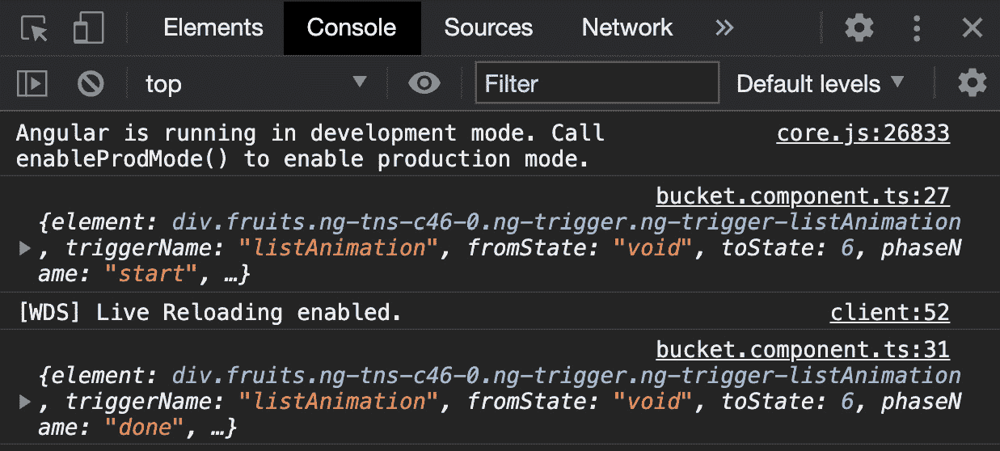
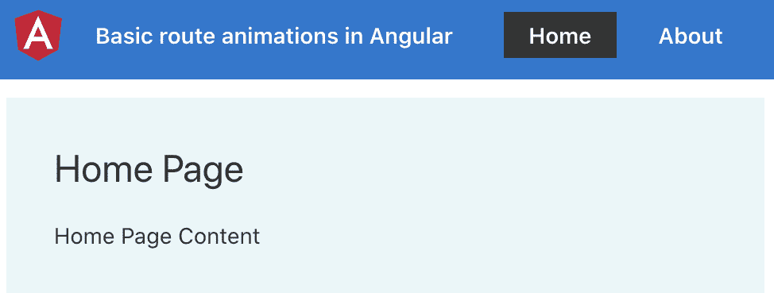

# 四、理解Angular动画

在本章中，您将学习如何在 Angular 中使用动画。您将了解多状态动画、交错动画、关键帧动画，以及如何在 Angular 应用程序中实现用于切换路线的动画。

以下是我们将在本章中介绍的食谱：

*   创建第一个两状态Angular动画
*   使用多状态动画
*   使用关键帧创建复杂的Angular动画
*   使用交错动画以Angular设置列表动画
*   使用动画回调
*   Angular贴图中的基本路线动画
*   使用关键帧的Angular复杂布线动画

# 技术要求

对于本章中的配方，请确保您的机器上安装了**Git**和**Node.js**。您还需要安装`@angular/cli`软件包，您可以从终端使用`npm install -g @angular/cli`进行安装。本章代码见[https://github.com/PacktPublishing/Angular-Cookbook/tree/master/chapter04](https://github.com/PacktPublishing/Angular-Cookbook/tree/master/chapter04) 。

# 创建第一个双状态Angular动画

在这个配方中，您将使用淡入效果创建一个基本的双状态Angular动画。我们将从一个新的 Angular 项目开始，其中已经内置了一些 UI，在应用程序中启用动画，然后开始创建我们的第一个动画。

## 准备好了吗

我们将与合作的项目位于克隆存储库中的`chapter04/start_here/ng-basic-animation`：

1.  在 Visual Studio 代码中打开项目。
2.  打开终端，运行`npm install`安装项目的依赖项。
3.  完成后，运行`ng serve -o`。

这将在新的浏览器选项卡中打开应用程序，您将看到以下内容：


图 4.1–在上运行的 ng basic 动画应用程序 http://localhost:4200

现在我们已经运行了应用程序，我们将进入配方的步骤。

## 怎么做…

我们有一个应用程序，根本没有Angular动画配置。因此，我们将从启用Angular动画开始。然后，我们将用Angular动画替换 CSS 动画。让我们继续执行以下步骤：

1.  首先，我们将从`app.module.ts`中的`@angular/platform-browser/animations`包中注入`BrowserAnimationsModule`，这样我们就可以在Angular应用程序中使用动画。我们还将在中`imports`数组中导入`BrowserAnimationsModule`，如下所示：

    ```ts
    ...
    import { FbCardComponent } from './components/fb-card/fb-card.component';
    import { TwitterCardComponent } from './components/twitter-card/twitter-card.component';
    import { BrowserAnimationsModule } from '@angular/platform-browser/animations';
    @NgModule({
      declarations: [
        AppComponent,
        SocialCardComponent,
        FbCardComponent,
        TwitterCardComponent
      ],
      imports: [
        BrowserModule,
        AppRoutingModule,
     BrowserAnimationsModule
      ],
      providers: [],
      bootstrap: [AppComponent]
    })
    export class AppModule { }
    ```

2.  现在，我们将删除 CSS 样式的转换，以便在默认情况下可以看到 Facebook 和 Twitter 按钮的完整按钮（图标和文本）。让我们从`app.component.scss`中删除样式，如下代码块中突出显示的：

    ```ts
    .type-picker {
       ...
      &__options {
       ...
        &__option {
          ...
          &__btn {
            ...
            min-width: 40px;
     // Remove the following lines
            transition: all 1s ease; 
     &__text {
     transition: all 1s ease;
     width: 0;
     visibility: hidden;
     }
            &--active {
              [class^="icon-"], [class*=" icon-"] {
                margin-right: 10px;
              }
     // Remove the following lines
              .type-picker__options__option__btn__text { 
     width: auto;
     visibility: visible;
     }
            }
          }
        }
      }
    }
    ```

3.  我们还将移除`app.component.scss`文件中`&__btn`下的`&--active`选择器，并将`[class^="icon-"], [class*=" icon-"]`的样式移动到`&__btn`选择器中。这样做是为了所有图标都有一个右边距。您的代码应该如下所示：

    ```ts
      .type-picker {
        ...
        &__options {
          ...
          &__option {
            ...
            &__btn {
              display: flex;
              align-items: center;
              min-width: 40px;
              justify-content: center;
     &--active { ← Remove this
     [class^='icon-'],
     [class*=' icon-'] {
     margin-right: 10px;
     }
     } ← Remove this
            }
          }
        }
      }
    ```

4.  Let's add the animation to be created to the template now. We'll apply the animation to the text elements of both buttons. Modify `app.component.html` as follows:

    ```ts
     ...
    <div class="content" role="main">
      <div class="type-picker">
        <h5>Pick Social Card Type</h5>
        <div class="type-picker__options">
          <div class="type-picker__options__option"       (click)="setCardType(cardTypes.Facebook)">
            <button class="btn type-picker__options__option__        btn" [ngClass]="selectedCardType === cardTypes.        Facebook ? 'btn-primary type-picker__options__        option__btn--active' : 'btn-light'">
              <div class="icon-facebook"></div>
              <div class="type-picker__options__option__btn__          text" [@socialBtnText]="selectedCardType ===           cardTypes.Facebook ? 'btn-active-text' :           'btn-inactive-text'">
                Facebook
              </div>
            </button>
          </div>
          <div class="type-picker__options__option"       (click)="setCardType(cardTypes.Twitter)">
            <button class="btn type-picker__options__option__        btn" [ngClass]="selectedCardType === cardTypes.        Twitter ? 'btn-primary type-picker__options__        option__btn--active' : 'btn-light'">
              <div class="icon-twitter"></div>
              <div class="type-picker__options__option__btn__          text" [@socialBtnText]="selectedCardType ===           cardTypes.Twitter ? 'btn-active-text' :           'btn-inactive-text'">
                Twitter
              </div>
            </button>
          </div>
        </div>
      </div>
      <app-social-card [type]="selectedCardType">  </app-social-card>
    </div>
    ```

    现在，我们将开始创建名为`socialBtnText`的动画，为此，我们将从`app.component.ts`中的`@angular/animations`包中导入一些函数，以便为按钮文本创建两种状态。

5.  将以下导入添加到您的`app.component.ts`：

    ```ts
    import {
     trigger,
     state,
     style,
     animate,
     transition
    } from '@angular/animations';
    ```

6.  现在，让我们使用`trigger`方法在`AppComponent`元数据中的`animations`数组中添加一个名为`socialBtnText`的动画，如下所示：

    ```ts
    ...
    @Component({
      selector: 'app-root',
      templateUrl: './app.component.html',
      styleUrls: ['./app.component.scss'],
     animations: [
     trigger('socialBtnText', [])
     ]
    })
    export class AppComponent {
      ...
    }
    ```

7.  Now, we'll create the two states named `btn-active-text` and `btn-inactive-text`. We'll set `width` and `visibility` for these states as follows:

    ```ts
    ...
    @Component({
      selector: 'app-root',
      templateUrl: './app.component.html',
      styleUrls: ['./app.component.scss'],
      animations: [
        trigger('socialBtnText', [
          state('btn-active-text', style({
     width: '80px',
     visibility: 'visible',
     })),
     state('btn-inactive-text', style({
     width: '0px',
     visibility: 'hidden',
     })),
        ])
      ]
    })
    export class AppComponent {
      ...
    }
    ```

    现在我们已经配置了状态，可以开始编写转换了。

8.  We'll first implement the `'btn-inactive-text => btn-active-text'` transition, which triggers upon clicking either of the buttons. Since this transition is going to be displaying the text, we'll first increase the `width` value of the text element, and then we'll set the text to `visible`. The content in the `animations[]` array should look as follows:

    ```ts
    animations: [
        trigger('socialBtnText', [
          state('btn-active-text', style({...})),
          state('btn-inactive-text', style({...})),
          transition('btn-inactive-text => btn-active-text', [
            animate('0.3s ease', style({
     width: '80px'
     })),
     animate('0.3s ease', style({
     visibility: 'visible'
     }))
          ]),
        ])
      ]
    ```

    现在应该可以看到按钮活动状态的平滑动画。让我们在下一步中实现非活动状态。

9.  Now we'll implement the `'btn-active-text => btn-inactive-text'` transition. This should turn the visibility to `'hidden'` and set the width back to `'0px'` again. The code should look as follows:

    ```ts
    animations: [
        trigger('socialBtnText', [
          ...
          state('btn-inactive-text', style({...})),
     transition('btn-active-text =>       btn-inactive-text', [
     animate('0.3s', style({
     width: '80px'
     })),
     animate('0.3s', style({
     visibility: 'hidden'
     }))
     ]),
          transition('btn-inactive-text =>       btn-active-text', [
            ...
        ])
      ]
    ```

    您会注意到，当按钮处于非活动状态时，会出现轻微的抖动/滞后。这是因为宽度的动画首先触发，然后它触发`visibility: 'hidden'`的动画。因此，我们看到它们都是按顺序发生的。

10.  为了让两个动画一起工作，我们将使用`@angular/animations`包中的`group`方法。我们将把我们的`animate()`方法组合起来进行过渡。`app.components.ts`文件中的更新应如下所示：

    ```ts
    ...
    import {
      ...
      transition,
     group
    } from '@angular/animations';
    ...
    animations: [
        trigger('socialBtnText', [
          ...
          transition('btn-active-text =>       btn-inactive-text', [
            group([
              animate('0.3s', style({
                width: '0px'
              })),
              animate('0.3s', style({
                visibility: 'hidden'
              }))
            ])
          ]),
          ...
        ])
      ]
    ```

11.  由于我们希望这是非常快的，我们将为`'btn-active-text => btn-inactive-text'`转换的`animate()`方法设置的时间将是零秒（`0s`。变更如下：

    ```ts
    transition('btn-active-text => btn-inactive-text', [
            group([
              animate('0s', style({
                width: '0px'
              })),
              animate('0s', style({
                visibility: 'hidden'
              }))
            ])
          ]),
    ```

12.  最后，当按钮未激活时，我们可以从按钮图标中删除额外的`margin-right`。我们将把`[class^="icon-"], [class*=" icon-"]`选择器的代码移动到另一个名为`&--active`的选择器中，这样它只在按钮处于活动状态时才适用。
13.  在`app.component.scss`文件的`&__btn`选择器中修改如下样式：

    ```ts
     &__btn {
              display: flex;
              align-items: center;
              min-width: 40px;
              justify-content: center;
              &--active {
                [class^="icon-"], [class*=" icon-"] {
                  margin-right: 10px;
                }
              }
            }
    ```

伟大的您现在已经在应用程序中实现了一些好看的动画按钮。请参阅下一节了解配方的工作原理。

## 它是如何工作的…

Angular 提供了自己的动画 API，允许您为 CSS 转换处理的任何属性设置动画。好处是您可以根据需求动态配置它们。我们首先使用`trigger`方法将动画注册为状态和过渡。然后，我们分别使用`state`和`transition`方法定义这些状态和跃迁。我们还看到了如何使用`group`方法并行运行动画。如果我们不将动画分组，它们将按顺序运行。最后，我们使用组件中的一些标志应用状态以反映更改。

## 还有更多…

你可能已经注意到 Twitter 按钮看起来比它应该的要大。这是因为到目前为止，我们的状态和动画的文本宽度设置为常量`80px`。虽然这对 Facebook 按钮很好，但对 Twitter 按钮却不太好。因此，我们实际上可以通过基于按钮的不同宽度提供两种不同的过渡来进行配置。以下是您将要做的：

1.  在应用程序文件夹中创建一个新文件，并将其命名为`animations.ts`。
2.  将代码从`app.component.ts`文件中的动画数组移动到此新文件中；它应该如下所示：

    ```ts
    import {
      trigger,
      state,
      style,
      animate,
      transition,
      group
    } from '@angular/animations';
    export const buttonTextAnimation = (animationName: string, textWidth: string) => {
      return trigger(animationName, [
        state('btn-active-text', style({
          width: textWidth,
          visibility: 'visible',
        })),
        state('btn-inactive-text', style({
          width: '0px',
          visibility: 'hidden',
        })),
      ])
    }
    ```

3.  现在，我们还将添加过渡：

    ```ts
    ...
    export const buttonTextAnimation = (animationName: string, textWidth: string) => {
      return trigger(animationName, [
        state('btn-active-text', style({...})),
        state('btn-inactive-text', style({...})),
        transition('btn-active-text => btn-inactive-text', [
          group([
            animate('0s', style({
              width: '0px'
            })),
            animate('0s', style({
              visibility: 'hidden'
            }))
          ])
        ]),
        transition('btn-inactive-text => btn-active-text', [
          animate('0.3s ease', style({
            width: textWidth
          })),
          animate('0.3s ease', style({
            visibility: 'visible'
          }))
        ]),
      ])
    }
    ```

4.  现在，我们将对`app.component.ts`中的 Facebook 和 Twitter 按钮使用这个`buttonTextAnimation`方法，如下所示。请注意，我们将创建两个不同的动画：

    ```ts
    import { Component } from '@angular/core';
    import { SocialCardType } from './constants/social-card-type';
    import { buttonTextAnimation } from './animations';
    @Component({
      selector: 'app-root',
      templateUrl: './app.component.html',
      styleUrls: ['./app.component.scss'],
      animations: [
        buttonTextAnimation('fbButtonTextAnimation', '80px'),
        buttonTextAnimation('twButtonTextAnimation', '60px'),
      ]
    })
    export class AppComponent {
      ...
    }
    ```

5.  最后，我们将在`app.component.html`中为 Facebook 和 Twitter 按钮分别使用动画，如下所示：

    ```ts
    …
    <div class="type-picker__options__option" (click)="setCardType(cardTypes.Facebook)">
            <button class="btn type-picker__options__option__        btn" [ngClass]="selectedCardType === cardTypes.        Facebook ? 'btn-primary type-picker__options__        option__btn--active' : 'btn-light'">
              <div class="icon-facebook"></div>
              <div class="type-picker__options__option__          btn__text" [@ fbButtonTextAnimation]=          "isFBBtnActive ? 'btn-active-text' :           'btn-inactive-text'">
                Facebook
              </div>
            </button>
          </div>
          <div class="type-picker__options__option"       (click)="setCardType(cardTypes.Twitter)">
            <button class="btn type-picker__options__option__        btn" [ngClass]="selectedCardType === cardTypes.        Twitter ? 'btn-primary type-picker__options__        option__btn--active' : 'btn-light'">
              <div class="icon-twitter"></div>
              <div class="type-picker__options__option__          btn__text" [@twButtonTextAnimation]=          "isTwBtnActive ? 'btn-active-text' :           'btn-inactive-text'">
                Twitter
              </div>
            </button>
          </div>
    ```

## 另见

*   Angular动画（[https://angular.io/guide/animations](https://angular.io/guide/animations) ）
*   *用示例*（[解释Angular动画 https://www.freecodecamp.org/news/angular-animations-explained-with-examples/](https://www.freecodecamp.org/news/angular-animations-explained-with-examples/)

# 使用多状态动画

在这个配方中，我们将使用包含多个状态的Angular动画。这意味着我们将为一个特定项处理两个以上的状态。对于这个食谱，我们也将使用同样的 Facebook 和 Twitter 卡片示例。但我们将配置卡片的状态，以确定它们在出现在屏幕上之前、在屏幕上以及即将再次从屏幕上消失时的状态。

## 准备好了吗

此配方的项目位于`chapter04/start_here/ng-multi-state-animations`：

1.  在Visual Studio 代码中打开项目。
2.  打开终端，运行`npm install`安装项目的依赖项。
3.  Once done, run `ng serve -o`.

    这将在新的浏览器选项卡中打开应用程序，您将看到应用程序，如下所示：


图 4.2–运行在上的 ng 多状态动画应用程序 http://localhost:4200

现在我们有了本地运行的应用程序，让我们在下一节中看看配方的步骤。

## 怎么做…

我们已经有了一个可以工作的应用程序，它有一个为社交卡制作的动画。当你点击 Facebook 或 Twitter 按钮时，你会看到相应的卡片从左到右以幻灯片形式出现。为了保持配方简单，我们将为用户在卡上移动鼠标光标和用户离开卡时实现另外两种状态和动画。让我们在以下步骤中添加相关代码：

1.  我们将从开始，向`components/fb-card/fb-card.component.ts`文件中的`FbCardComponent`添加两个`@HostListener`实例，一个用于卡上的`mouseenter`事件，另一个用于`mouseleave`事件。我们将分别命名为`hovered`和`active`。代码应如下所示：

    ```ts
    import { Component, HostListener, OnInit } from '@angular/core';
    import { cardAnimation } from '../../animations';
    @Component({
      selector: 'app-fb-card',
      templateUrl: './fb-card.component.html',
      styleUrls: ['./fb-card.component.scss'],
      animations: [cardAnimation]
    })
    export class FbCardComponent implements OnInit {
      cardState;
      constructor() { }
     @HostListener('mouseenter')
     onMouseEnter() {
     this.cardState = 'hovered'
     }
     @HostListener('mouseleave')
     onMouseLeave() {
     this.cardState = 'active'
     }
      ngOnInit(): void {
        this.cardState = 'active'
      }
    }
    ```

2.  现在，我们将对`twitter-card-component.ts`文件中的`TwitterCardComponent`执行相同的。代码应如下所示：

    ```ts
    import { Component, HostListener, OnInit } from '@angular/core';
    import { cardAnimation } from '../../animations';
    @Component({
      selector: 'app-twitter-card',
      templateUrl: './twitter-card.component.html',
      styleUrls: ['./twitter-card.component.scss'],
      animations: [cardAnimation]
    })
    export class TwitterCardComponent implements OnInit {
      cardState
      constructor() { }
     @HostListener('mouseenter')
     onMouseEnter() {
     this.cardState = 'hovered'
     }
     @HostListener('mouseleave')
     onMouseLeave() {
     this.cardState = 'active'
     }
      ngOnInit(): void {
        this.cardState = 'active'
      }
    }
    ```

3.  到目前为止应该没有任何视觉变化，因为我们只更新了`cardState`变量，使其具有悬停和活动状态。我们还没有定义转换。
4.  We'll now define our state for when the user's cursor enters the card, that is, the `mouseenter` event. The state is called `hovered` and should look as follows in the `animation.ts` file:

    ```ts
    ...
    export const cardAnimation = trigger('cardAnimation', [
      state('active', style({
        color: 'rgb(51, 51, 51)',
        backgroundColor: 'white'
      })),
      state('hovered', style({
     transform: 'scale3d(1.05, 1.05, 1.05)',
     backgroundColor: '#333',
     color: 'white'
     })),
      transition('void => active', [
        style({
          transform: 'translateX(-200px)',
          opacity: 0
        }),
        animate('0.2s ease', style({
          transform: 'translateX(0)',
          opacity: 1
        }))
      ]),
    ])
    ```

    如果你现在刷新应用程序，点击 Facebook 或 Twitter 按钮，将光标悬停在卡片上，你会看到卡片的 UI 发生变化。那是因为我们将状态更改为`hovered`。然而，目前还没有动画。让我们在下一步中添加一个。

5.  We'll add the `active => hovered` transition now in the `animations.ts` file so that we can smoothly navigate from `active` to the `hovered` state:

    ```ts
    ...
    export const cardAnimation = trigger('cardAnimation', [
      state('active', style(...)),
      state('hovered', style(...)),
      transition('void => active', [...]),
      transition('active => hovered', [
     animate('0.3s 0s ease-out', style({
     transform: 'scale3d(1.05, 1.05, 1.05)',
     backgroundColor: '#333',
     color: 'white'
     }))
     ]),
    ])
    ```

    如果刷新应用程序，现在应该可以看到`mouseenter`事件的平稳过渡。

6.  最后，我们将添加最后的转换，`hovered => active`，因此当用户离开卡时，我们将通过平滑动画恢复到活动状态。代码应如下所示：

    ```ts
    ...
    export const cardAnimation = trigger('cardAnimation', [
      state('active', style(...)),
      state('hovered', style(...)),
      transition('void => active', [...]),
      transition('active => hovered', [...]),
      transition('hovered => active', [
     animate('0.3s 0s ease-out', style({
     transform: 'scale3d(1, 1, 1)',
     color: 'rgb(51, 51, 51)',
     backgroundColor: 'white'
     }))
     ]),
    ])
    ```

塔达！您现在知道如何使用`@angular/animations`在单个元素上实现不同的状态和不同的动画。

## 它是如何工作的…

Angular 使用触发器了解动画处于何种状态。示例语法如下所示：

```ts
<div [@animationTriggerName]="expression">...</div>;
```

`expression`可以是有效的 JavaScript 表达式，其计算结果为状态名称。在本例中，我们将其绑定到`cardState`属性，该属性包含`'active'`或`'hovered'`。因此，我们的卡有三个过渡：

*   `void => active`（当元素添加到 DOM 并呈现时）
*   `active => hovered`（卡上触发`mouseenter`事件时）
*   `hovered => active`（卡上触发`mouseleave`事件时）

## 另见

*   *触发动画*[https://angular.io/guide/animations#triggering-动画](https://angular.io/guide/animations#triggering-the-animation)
*   *可重复使用的**动画*[https://angular.io/guide/reusable-animations](https://angular.io/guide/reusable-animations)

# 使用关键帧创建复杂的Angular动画

因为你已经从之前的食谱中了解了Angular动画，你可能会想，“好吧，这很容易。”好吧，是时候提高你在这个食谱中的动画技能了。您将使用此配方中的关键帧创建复杂的Angular动画，以开始编写一些高级动画。

## 准备好了吗

此配方的项目位于`chapter04/start_here/animations-using-keyframes`：

1.  在 Visual Studio 代码中打开项目。
2.  打开终端，运行`npm install`安装项目的依赖项。
3.  完成后，运行`ng serve -o`。

这将在新的浏览器选项卡中打开应用程序，您将看到应用程序，如下所示：


图 4.3–在应用程序上运行的使用关键帧的动画 http://localhost:4200

既然已经有了本地运行的应用程序，那么让我们在下一节中看看配方的步骤。

## 怎么做…

我们现在有一个应用程序，它有一个单一的转换，即`void => *`，当元素在 DOM 上呈现时触发。现在，动画非常简单，使用`animate`函数定义动画。我们将首先将其转换为关键帧，然后将其变得有点复杂：

1.  让我们从开始，将`@angular/animations`中的方法添加到`animations.ts`文件中，如下所示：

    ```ts
    import {
      trigger,
      state,
      style,
      animate,
      transition,
     keyframes
    } from '@angular/animations';
    export const cardAnimation = trigger('cardAnimation', [
      ...
    ])
    ```

2.  Now, we'll convert the single style animation to keyframes as follows:

    ```ts
    import {
      trigger,
      state,
      style,
      animate,
      transition,
      keyframes
    } from '@angular/animations';
    export const cardAnimation = trigger('cardAnimation', [
      transition('void => *', [
        style({ ← Remove this style
          transform: 'translateX(-200px)',
          opacity: 0
        }),
        animate('0.2s ease', keyframes([
     style({
     transform: 'translateX(-200px)',
     offset: 0
     }),
     style({
     transform: 'translateX(0)',
     offset: 1
     })
     ]))
      ]),
    ])
    ```

    注意在这个代码块中，我们已经删除了`state('active', …)`部分，因为我们不再需要它了。此外，我们将`style({transform: 'translateX(-200px)', opacity: 0})`移动到`keyframes`数组中，因为它现在是关键帧动画本身的一部分。如果您现在刷新应用并尝试，您仍将看到与以前相同的动画。但是现在我们使用`keyframes`来实现它。

3.  Finally, let's start adding some complex animations. Let's start the animation with a scaled-down card by adding `scale3d` to the `transform` property of `style` at `offset: 0`. We'll also increase the animation time to `1.5s`:

    ```ts
    ...
    export const cardAnimation = trigger('cardAnimation', [
      transition('void => *', [
        animate('1.5s ease', keyframes([
          style({
            transform: 'translateX(-200px) scale3d(0.4, 0.4,         0.4)',
            offset: 0
          }),
          style({
            transform: 'translateX(0)',
            offset: 1
          })
        ]))
      ]),
    ])
    ```

    现在您应该看到，卡片动画从一个小卡片开始，该卡片从左侧滑动并向右移动，大小逐渐增大。

4.  Now we'll implement a zig-zag-ish animation for the appearance of the card instead of the slide-in animation. Let's add the following keyframe elements to the `keyframes` array to add a bumpy effect to our animation:

    ```ts
    ...
    export const cardAnimation = trigger('cardAnimation', [
      transition('void => *', [
        animate('1.5s 0s ease', keyframes([
          style({
            transform: 'translateX(-200px) scale3d(0.4, 0.4,         0.4)',
            offset: 0
          }),
          style({
     transform: 'translateX(0px) rotate(-90deg)         scale3d(0.5, 0.5, 0.5)',
     offset: 0.25
     }),
     style({
     transform: 'translateX(-200px) rotate(90deg)         translateY(0) scale3d(0.6, 0.6, 0.6)',
     offset: 0.5
     }),
          style({
            transform: 'translateX(0)',
            offset: 1
          })
        ]))
      ]),
    ])
    ```

    如果您刷新应用程序并点击任何一个按钮，您应该会看到卡撞到卡的右壁，然后撞到卡的左壁，然后再返回正常状态：

    

    图 4.4–卡向右侧和左侧墙壁的碰撞

5.  作为的最后一步，我们将顺时针旋转卡，然后将其返回到原始位置。为此，我们将使用`offset: 0.75`，使用`rotate`方法和一些附加Angular。代码应如下所示：

    ```ts
    ...
    export const cardAnimation = trigger('cardAnimation', [
      transition('void => *', [
        animate('1.5s 0s ease', keyframes([
          style({
            transform: 'translateX(-200px) scale3d(0.4, 0.4,         0.4)',
            offset: 0
          }),
          style({
            transform: 'translateX(0px) rotate(-90deg)         scale3d(0.5, 0.5, 0.5)',
            offset: 0.25
          }),
          style({
            transform: 'translateX(-200px) rotate(90deg)         translateY(0) scale3d(0.6, 0.6, 0.6)',
            offset: 0.5
          }),
          style({
     transform: 'translateX(-100px) rotate(135deg)         translateY(0) scale3d(0.6, 0.6, 0.6)',
     offset: 0.75
     }),
          style({
            transform: 'translateX(0) rotate(360deg)',
            offset: 1
          })
        ]))
      ]),
    ])
    ```

令人惊叹的您现在知道如何使用`@angular/common`包中的`keyframes`方法以Angular实现复杂动画。请参见下一节中的工作原理。

## 它是如何工作的…

对于Angular复杂的动画，`keyframes`方法是定义动画在整个过程中的不同偏移量的非常好的方法。我们可以使用`styles`方法定义偏移量，该方法以`AnimationStyleMetadata`为参数。`AnimationStyleMetadata`还允许我们传递`offset`属性，该属性的值可以介于`0`和`1`之间。因此，我们可以为不同的偏移定义不同的样式来创建高级动画。

## 另见

*   *Angular动画*[https://angular.io/guide/animations](https://angular.io/guide/animations)
*   *用示例*（[解释Angular动画 https://www.freecodecamp.org/news/angular-animations-explained-with-examples/](https://www.freecodecamp.org/news/angular-animations-explained-with-examples/)

# 使用交错动画以Angular设置列表动画

不无论您今天构建的是什么 web 应用程序，您很可能要实现某种列表。为了让这些列表更好，为什么不用它们实现一个优雅的动画呢？在本食谱中，您将学习如何使用交错动画以Angular为列表设置动画。

## 准备好了吗

此配方的项目位于`chapter04/start_here/animating-lists`：

1.  在 Visual Studio 代码中打开项目。
2.  打开终端，运行`npm install`安装项目依赖项。
3.  完成后，运行`ng serve -o`。

这将在新的浏览器选项卡中打开应用程序。以员工身份登录应用程序，您将看到以下应用程序：


图 4.5–应用程序运行的动画列表 http://localhost:4200

现在我们已经有了本地运行的应用程序，让我们在下一节中查看配方的步骤。

## 怎么做…

我们现在有一个应用程序，它有一个存储桶项目列表。我们需要使用惊人的动画为列表设置动画。我们将一步一步地这样做。我很兴奋，你呢？

凉的我们将完成以下配方步骤：

1.  首先，让我们在`app.module.ts`中的`@angular/platform-browser/animations`包中添加，以便为应用程序启用动画。代码应如下所示：

    ```ts
    import { BrowserModule } from '@angular/platform-browser';
    import { NgModule } from '@angular/core';
    import { AppRoutingModule } from './app-routing.module';
    import { AppComponent } from './app.component';
    import { FormsModule } from '@angular/forms';
    import { BrowserAnimationsModule } from '@angular/platform-browser/animations';
    @NgModule({
      declarations: [
        AppComponent
      ],
      imports: [
        BrowserModule,
        AppRoutingModule,
        FormsModule,
        BrowserAnimationsModule
      ],
      providers: [],
      bootstrap: [AppComponent]
    })
    export class AppModule { }
    ```

2.  现在，在`constants`文件夹中创建一个名为`animations.ts`的文件，并添加以下代码，将名为`listItemAnimation`的基本列表项动画注册为Angular：

    ```ts
    import {
      trigger,
      style,
      animate,
      transition,
    } from '@angular/animations';
    export const ANIMATIONS = {
      LIST_ITEM_ANIMATION: trigger('listItemAnimation', [
        transition('void => *', [
          style({
            opacity: 0
          }),
          animate('0.5s ease', style({
            opacity: 1
          }))
        ]),
        ,
        transition('* => void', [
          style({
            opacity: 1
          }),
          animate('0.5s ease', style({
            opacity: 0
          }))
        ])
      ])
    }
    ```

3.  注意`void => *`转换用于列表项进入视图（或出现）时。`* => void`转换用于项目离开视图（或消失）时。
4.  Now, we'll add the animation to `BucketComponent` in the `app/shared/bucket/bucket.component.ts` file as follows:

    ```ts
    import { Component, OnInit } from '@angular/core';
    import { Observable } from 'rxjs/internal/Observable';
    import { BucketService } from 'src/app/services/bucket.service';
    import { Fruit } from '../../../constants/fruit';
    import { IFruit } from '../../../interfaces/fruit.interface';
    import { ANIMATIONS } from '../../../constants/animations';
    @Component({
      selector: 'app-bucket',
      templateUrl: './bucket.component.html',
      styleUrls: ['./bucket.component.scss'],
      animations: [ANIMATIONS.LIST_ITEM_ANIMATION]
    })
    export class BucketComponent implements OnInit {
      ...
    }
    ```

    由于我们已经在组件中导入了动画，我们现在可以在模板中使用它。

5.  让我们在`bucket.component.html`：

    ```ts
    <div class="buckets" *ngIf="$bucket | async as bucket">
      <h4>Bucket <i class="material-icons">shopping_cart   </i></h4>
      <div class="add-section">
        <div class="input-group">
        ...  
      </div>
      <div class="fruits">
        <ng-container *ngIf="bucket.length > 0; else     bucketEmptyMessage">
          <div class="fruits__item" *ngFor="let item of       bucket;" @listItemAnimation>
            <div class="fruits__item__title">{{item.name}}        </div>
            <div class="fruites__item__delete-icon"         (click)="deleteFromBucket(item)">
              <div class="material-icons">delete</div>
            </div>
          </div>
        </ng-container>
      </div>
    </div>
    ...
    ```

    中将动画添加到列表项中，如下所示
6.  If you now refresh the app and add an item to the bucket list, you should see it appear with a fade-in effect. And if you delete an item, you should see it disappear with the animation as well.

    您会注意到，当您刷新应用程序时，所有列表项同时显示在一起。然而，我们可以使用`stagger`动画使它们一个接一个地出现。我们将在下一步中这样做。

7.  We'll modify `LIST_ITEM_ANIMATION` now to use the `stagger` method. This is because we can make each list item appear one after the other. First, we need to import the `stagger` method from `@angular/animations`, and then we need to wrap our `animate` methods within `stagger` methods. Update the `animations.ts` file as follows:

    ```ts
    import {
      trigger,
      style,
      animate,
      transition,
     stagger
    } from '@angular/animations';
    export const ANIMATIONS = {
      LIST_ITEM_ANIMATION: trigger('listItemAnimation', [
        transition('void => *', [
          style({
            opacity: 0
          }),
          stagger(100, [
            animate('0.5s ease', style({
              opacity: 1
            }))
          ])
        ]),
        ,
        transition('* => void', [
          style({
            opacity: 1
          }),
          stagger(100, [
            animate('0.5s ease', style({
              opacity: 0
            }))
          ])
        ])
      ])
    }
    ```

    然而，这*将不起作用*。这是因为`stagger`方法只能在`query`方法中使用。因此，我们需要稍微修改代码，以便在下一步中使用`query`方法。

8.  让我们从`@angular/animations`导入`query`方法，并稍微修改我们的代码，以便它可以与方法`stagger`方法一起使用。我们要做一些改变。
9.  我们将动画重命名为`listAnimation`，因为动画现在将应用于列表，而不是单个列表项。
10.  我们将把我们的`stagger`方法包装在适当的`query`方法中。
11.  对于这两个查询，`:enter`和`:leave`，我们将只使用一个转换，即`* => *`，因此每当列表项更改时，就会触发动画。
12.  We'll move `style({ opacity: 0 })` inside the `query(':enter')` chunk as it needs to hide the items before the stagger animation.

    代码应如下所示：

    ```ts
    import {
      trigger,
      style,
      animate,
      transition,
      stagger,
      query
    } from '@angular/animations';
    export const ANIMATIONS = {
      LIST_ANIMATION: trigger('listAnimation', [
        transition('* <=> *', [
          query(':enter', [
            style({
              opacity: 0
            }),
            stagger(100, [
              animate('0.5s ease', style({
                opacity: 1
              }))
            ])
          ], { optional: true }),
          query(':leave', [
            stagger(100, [
              animate('0.5s ease', style({
                opacity: 0
              }))
            ])
          ], {optional: true})
        ]),
      ])
    }
    ```

13.  我们现在需要将`shared/components/bucket/bucket.component.ts`中动画的导入修复如下：

    ```ts
    ...
    @Component({
      selector: 'app-bucket',
      templateUrl: './bucket.component.html',
      styleUrls: ['./bucket.component.scss'],
      animations: [ANIMATIONS.LIST_ANIMATION]
    })
    export class BucketComponent implements OnInit {
      ...
    }
    ```

14.  Since we've changed the name of the animation, let's fix in the template of the bucket component as well. Update `shared/components/bucket/bucket.component.html` as follows:

    ```ts
    <div class="buckets" *ngIf="$bucket | async as bucket">
      <h4>Bucket <i class="material-icons">shopping_cart   </i></h4>
      <div class="add-section">...
      </div>
      <div class="fruits" [@listItemAnimation]="bucket.  length">
        <ng-container *ngIf="bucket.length > 0; else     bucketEmptyMessage">
          <div class="fruits__item" *ngFor="let item of       bucket;"  @listItemAnimation ← Remove this>
            <div class="fruits__item__title">{{item.name}}        </div>
            <div class="fruites__item__delete-icon"        (click)="deleteFromBucket(item)">
              <div class="material-icons">delete</div>
            </div>
          </div>
        </ng-container>
      </div>
    </div>
    ...
    ```

    注意，我们将`[@listAnimation]`属性绑定到`bucket.length`。这将确保每当桶的长度发生变化时，即当从桶中添加或删除项目时，动画就会触发。

令人惊叹的现在，您知道了如何在Angular视图中为列表实现惊人的动画。请参见下一节中的工作原理。

## 它是如何工作的…

交错动画仅在`query`方法内工作。这是因为惊人的动画通常应用于列表本身，而不是单个项目。为了搜索或查询项目，我们首先使用`query`方法。然后，我们使用`stagger`方法来定义在下一个列表项的动画开始之前需要多少毫秒的交错。我们还提供了`animation`以及`stagger`方法来为查询中找到的每个元素定义动画。注意，我们对`:enter`查询和`:leave`查询都使用了`{ optional: true }`。这是因为如果列表绑定发生更改（`bucket.length`），如果没有新元素进入 DOM 或没有元素离开 DOM，则不会出现错误。

## 另见

*   *Angular动画*[https://angular.io/guide/animations](https://angular.io/guide/animations)
*   Angular动画错开文档（[https://angular.io/api/animations/stagger](https://angular.io/api/animations/stagger)

# 使用动画回调

在本食谱中，您将学习如何在动画状态发生Angular变化时得到通知并采取行动。作为一个简单的例子，我们将使用相同的 bucket list 应用程序，并且每当添加项目的动画完成时，我们将重置`item-to-add`选项。

## 准备好了吗

我们将要处理的项目位于克隆存储库中的`chapter04/start_here/animation-callbacks`：

1.  在 Visual Studio 代码中打开项目。
2.  打开终端，运行`npm install`安装项目的依赖项。
3.  Once done, run `ng serve -o`.

    这将在新的浏览器选项卡中打开应用程序。

4.  点击以管理员身份登录**按钮，您会看到如下内容：**


图 4.6–在上运行的动画回调应用程序 http://localhost:4200

现在我们已经有了本地运行的应用程序，让我们在下一节中查看配方的步骤。

## 怎么做…

我们在之前的配方中使用了相同的 bucket 应用程序。要了解如何使用动画回调，我们只需在列表项进入 DOM 的动画完成后执行一个操作，并在列表项离开 DOM 时执行一个操作。让我们开始：

1.  我们首先在`shared/components/bucket/bucket.component.ts`文件的`BucketComponent`中创建两个名为`onAnimationStarted`和`onAnimationDone`的方法。这些方法将在后面的步骤中为动画的各个阶段触发：

    ```ts
    ...
    import { AnimationEvent } from '@angular/animations';
    @Component({...})
    export class BucketComponent implements OnInit {
      ...
      ngOnInit(): void {
        this.$bucket = this.bucketService.$bucket;
        this.bucketService.loadItems();
      }
      onAnimationStarted( event: AnimationEvent ) {
     console.log(event);
     }
      onAnimationDone( event: AnimationEvent ) {
     console.log(event);
     }
      ...
    }
    ```

2.  现在我们将把动画的`start`和`done`事件绑定到模板中的`onAnimateEvent`方法。修改`shared/components/bucket/bucket.component.html`文件如下：

    ```ts
    <div class="buckets" *ngIf="$bucket | async as bucket">
      <h4>Bucket <i class="material-icons">shopping_cart   </i></h4>
      <div class="add-section">
        ...
      </div>
      <div class="fruits" [@listAnimation]="bucket.length"   (@listAnimation.start)="onAnimationStarted($event)"
     (@listAnimation.done)="onAnimationDone($event)">
        <ng-container *ngIf="bucket.length > 0; else     bucketEmptyMessage">
          <div class="fruits__item" *ngFor="let item of       bucket;">
            <div class="fruits__item__title">{{item.name}}        </div>
            <div class="fruites__item__delete-icon"        (click)="deleteFromBucket(item)">
              <div class="material-icons">delete</div>
            </div>
          </div>
        </ng-container>
      </div>
    </div>
    <ng-template #bucketEmptyMessage>
      ...
    </ng-template>
    ```

3.  Notice that both the `.start` and`.done` events are associated with the trigger name, `listAnimation`. If you refresh the app now, you should see the logs on the console as follows:

    

    图 4.7–控制台上反映.start 和.done 动画事件的日志

4.  由于我们现在已经准备好了事件，我们将在动画期间用保存图标替换`shopping_cart`图标。这类似于模拟如果我们需要执行 HTTP 调用来保存数据会发生什么。我们修改`shared/components/bucket/bucket.component.ts`如下：

    ```ts
    ...
    export class BucketComponent implements OnInit {
      $bucket: Observable<IFruit[]>;
      selectedFruit: Fruit | null = null;
      fruits: string[] = Object.values(Fruit);
      isSaving: boolean;
      constructor(private bucketService: BucketService) { }
      ngOnInit(): void {
        ...
      }
      onAnimationStarted( event: AnimationEvent ) {
        this.isSaving = true;
      }
      onAnimationDone( event: AnimationEvent ) {
        this.isSaving = false;
     this.selectedFruit = null;
      }
      addSelectedFruitToBucket() {
        ...
      }
      deleteFromBucket(fruit: IFruit) {
        ...
      }
    }
    ```

5.  最后，我们可以根据`isSaving`属性的值修改模板以显示适当的图标。代码应如下所示：

    ```ts
    <div class="buckets" *ngIf="$bucket | async as bucket">
      <h4>Bucket <i class="material-icons">{{isSaving ?   'save' : 'shopping_cart'}}</i></h4>
       ...
    </div>
    ...
    ```

轰！食谱现在完成了。如果刷新页面或添加/删除项目，您会注意到在整个动画过程中，bucket 图标被 save 图标替换，这一切都要归功于动画回调。

## 它是如何工作的…

当使用`trigger`方法向 Angular 注册动画时，Angular 本身在范围内创建一个本地属性，触发器的名称设置为`@triggerName`。它还将创建`.start`和`.done`子属性作为动画的`EventEmitter`实例。因此，我们可以很容易地在模板中使用它们来捕获 Angular 传递的`AnimationEvent`实例。每个`AnimationEvent`都包含`phaseName`属性，使用该属性我们还可以识别它是`start`事件还是`done`事件。我们还可以从`AnimationEvent`中判断动画从哪个状态开始，在哪个状态结束。

## 另见

*   Angular（[中的动画https://angular.io/guide/animations](https://angular.io/guide/animations)
*   动画片事件文档（[https://angular.io/api/animations/AnimationEvent](https://angular.io/api/animations/AnimationEvent)

# Angular方向的基本路线动画

在本食谱中，您将学习如何在 Angular 中实现基本路线动画。虽然这些是基本的动画，但它们需要一些设置才能正确执行。您将学习如何通过将转换状态名称作为数据属性传递给路由来配置路由动画。您还将学习如何使用`RouterOutlet`API 获取转换名称并将其应用于要执行的动画。

## 准备好了吗

我们将要处理的项目位于克隆存储库中的`chapter04/start_here/route-animations`：

1.  在 Visual Studio 代码中打开项目。
2.  打开终端，运行`npm install`安装项目的依赖项。
3.  完成后，运行`ng serve -o`。

这将在新的浏览器选项卡中打开应用程序，您将看到如下内容：



图 4.8–在上运行的路由动画应用程序 http://localhost:4200

现在我们已经让应用程序在本地运行，让我们在下一节中查看配方的步骤。

## 怎么做…

我们有一个非常简单的应用程序，目前有两条延迟加载的路由。这些路径用于**主页**和**关于**页面，我们现在开始为应用程序配置动画：

1.  首先，我们需要将`BrowserAnimationsModule`作为进口导入`app.module.ts`。代码应如下所示：

    ```ts
    import { BrowserModule } from '@angular/platform-browser';
    import { NgModule } from '@angular/core';
    import { AppRoutingModule } from './app-routing.module';
    import { AppComponent } from './app.component';
    import { BrowserAnimationsModule } from '@angular/platform-browser/animations';
    @NgModule({
      declarations: [
        AppComponent
      ],
      imports: [
        BrowserModule,
        AppRoutingModule,
     BrowserAnimationsModule
      ],
      providers: [],
      bootstrap: [AppComponent]
    })
    export class AppModule { }
    ```

2.  我们现在将在名为`constants`的`app`文件夹中创建一个新文件夹。我们还将在名为`animations.ts`的`constants`文件夹中创建一个文件。让我们在`animations.ts`文件中输入以下代码来注册一个简单的触发器：

    ```ts
    import {trigger,  style, animate, transition, query,
     } from '@angular/animations';
    export const ROUTE_ANIMATION = trigger('routeAnimation', [
      transition('* <=> *', [
        // states and transitions to be added here
      ])
    ])
    ```

3.  We'll now register our queries and our states for the animations. Let's add the following items in the `transition()` method's array as follows:

    ```ts
    ...
    export const ROUTE_ANIMATION = trigger('routeAnimation', [
        style({
     position: 'relative'
     }),
     query(':enter, :leave', [
     style({
     position: 'absolute',
     width: '100%'
     })
     ], {optional: true}),
     query(':enter', [
     style({
     opacity: 0,
     })
     ], {optional: true}),
     query(':leave', [
     animate('300ms ease-out', style({ opacity: 0 }))
     ], {optional: true}),
     query(':enter', [
     animate('300ms ease-in', style({ opacity: 1 }))
     ], {optional: true}),
    ]);
    ```

    好吧我们现在注册了`routeAnimation`触发器，用于从每一条路线过渡到其他每一条路线。现在，让我们提供路由中的过渡状态。

4.  我们可以使用每个路由的唯一标识符提供转换的状态。有很多方法，但最简单的方法是在`app-routing.module.ts`：

    ```ts
    import { NgModule } from '@angular/core';
    import { Routes, RouterModule } from '@angular/router';
    const routes: Routes = [
      {
        path: '',
        pathMatch: 'full',
        redirectTo: 'home',
      },
      {
        path: 'home',
        data: {
     transitionState: 'HomePage',
     },
        loadChildren: () => import('./home/home.module').    then(m => m.HomeModule),
      },
      {
        path: 'about',
        data: {
     transitionState: 'AboutPage',
     },
        loadChildren: () => import('./about/about.module').    then(m => m.AboutModule),
      },
    ];
    @NgModule({
      ...
    })
    export class AppRoutingModule {}
    ```

    中使用路由配置中的`data`属性提供
5.  现在，我们需要在`app.component.html`中提供从当前路由到`@routeAnimation`触发器的`transitionState`属性。
6.  为此，为`app.component.html`中使用的`<router-outlet>`元素创建一个`@ViewChild`实例，这样我们就可以得到当前路由的`data`和提供的`transitionState`值。`app.component.ts`文件中的代码应如下所示：

    ```ts
    import { Component, ViewChild } from "@angular/core";
    import { RouterOutlet } from '@angular/router';
    @Component({
      selector: "app-root",
      templateUrl: "./app.component.html",
      styleUrls: ["./app.component.scss"]
    })
    export class AppComponent {
      @ViewChild(RouterOutlet) routerOutlet;
    }
    ```

7.  我们还将把`animations.ts`文件中的`ROUTE_ANIMATION`导入`app.component.ts`中，如下所示：

    ```ts
    import { Component, ViewChild } from "@angular/core";
    import { RouterOutlet } from '@angular/router';
    import { ROUTE_ANIMATION } from './constants/animations';
    @Component({
      selector: "app-root",
      templateUrl: "./app.component.html",
      styleUrls: ["./app.component.scss"],
     animations: [
     ROUTE_ANIMATION
     ]
    })
    export class AppComponent {
      ...
    }
    ```

8.  我们现在将创建一个名为`getRouteAnimationTransition()`的函数，该函数将获取当前路由的数据和的`transitionState`值并返回。此功能稍后将在`app.component.html`中使用。在`app.component.ts`中修改您的代码如下：

    ```ts
    ...
    @Component({
     ...
    })
    export class AppComponent {
      @ViewChild(RouterOutlet) routerOutlet;
      getRouteAnimationState() {
     return this.routerOutlet && this.routerOutlet.    activatedRouteData && this.routerOutlet.    activatedRouteData.transitionState;
     }
    }
    ```

9.  最后，让我们使用方法，在`app.component.html`中使用`@routeAnimation`触发器，这样我们可以看到正在播放的动画：

    ```ts
    ...
    <div class="content" role="main">
      <div class="router-container"   [@routeAnimation]="getRouteAnimationState()">
        <router-outlet></router-outlet>
      </div>
    </div>
    ```

瞧！刷新应用程序，并看到神奇的地方。现在，当您从**主页**页面导航到**关于**页面时，您应该会看到淡出和淡入动画，反之亦然。

## 它是如何工作的…

在`animations.ts`文件中，我们首先定义了名为`routeAnimation`的动画触发器。然后我们确保默认情况下，触发器被分配到的 HTML 元素已将`position: 'relative'`设置为样式：

```ts
transition('* <=> *', [
    style({
 position: 'relative'
 }),
    ...
])
```

然后我们将样式`position: 'absolute'`应用于儿童，如上所述，使用`:enter`和`:leave`如下：

```ts
    query(':enter, :leave', [
      style({
        position: 'absolute',
        width: '100%'
      })
    ], {optional: true}),
```

这确保了这些元素，即要加载的路由，具有`position: 'absolute'`样式和使用`width: '100%'`的全宽，因此它们可以显示在彼此的顶部。你可以随时通过评论这两种风格中的任何一种来看看会发生什么（尽管风险由你自己承担！）。

不管怎么说，一旦设置了样式，我们就定义了使用`:enter`查询进入视图的路径的情况。我们将样式设置为`opacity: 0`，因此路线似乎正在逐渐淡入：

```ts
    query(':enter', [
      style({
        opacity: 0,
      })
    ], {optional: true}),
```

最后，我们将路线转换定义为两个连续动画的组合，第一个用于`query :leave`，第二个用于`query :enter`。对于离开视图的路径，我们通过动画将不透明度设置为`0`，对于进入视图的路径，我们也通过动画将不透明度设置为`1`：

```ts
    query(':leave', [
      animate('300ms ease-out', style({ opacity: 0 }))
    ], {optional: true}),
    query(':enter', [
      animate('300ms ease-in', style({ opacity: 1 }))
    ], {optional: true}),
```

## 另见

*   Angular动画（[https://angular.io/guide/animations](https://angular.io/guide/animations) ）
*   Angular路线过渡动画[https://angular.io/guide/route-animations](https://angular.io/guide/route-animations)

# 使用关键帧的Angular复杂路线动画

在之前的配方中，您学习了如何创建基本路线动画，在本教程中，我们将升级我们的动画游戏。在本教程中，您将学习如何使用关键帧在Angular中实现一些复杂的管线动画。

## 准备好了吗

我们将要处理的项目位于克隆存储库的`chapter04/start_here/complex-route-animations`中。与 Angular 配方中*基本路线动画的最终代码状态相同，只是我们还没有配置任何动画：*

1.  在 Visual Studio 代码中打开项目。
2.  打开终端，运行`npm install`安装项目的依赖项。
3.  完成后，运行`ng serve -o`。

这将在新的浏览器选项卡中打开应用程序，您将看到如下内容：


图 4.9–运行在上的复杂路线动画应用程序 http://localhost:4200

现在我们已经有了本地运行的应用程序，让我们在下一节中查看配方的步骤。

## 怎么做…

我们有一个基本应用程序，有两条路线，`HomePage`路线和`AboutPage`路线。与前面的配方类似，Angular 中的*基本路线动画，我们使用路线数据参数进行了配置。但我们还没有写任何动画。另外，我们已经在`app.module.ts`文件中导入了`BrowserAnimationsModule`：*

1.  First, we'll start by writing a simple animation for the route entering the view and for the route leaving the view, as follows, in the `animations.ts` file:

    ```ts
    import {
      ...
      query,
     animate,
    } from '@angular/animations';
    const optional = { optional: true };
    export const ROUTE_ANIMATION = trigger('routeAnimation', [
      transition('* <=> *', [
        style({...}),
        query(':enter, :leave', [...], optional),
        query(':enter', [
          style({
            opacity: 0,
          })
        ], optional),
        query(':leave', [
     animate('1s ease-in', style({
     opacity: 0
     }))
     ], optional),
     query(':enter', [
     animate('1s ease-out', style({
     opacity: 1
     }))
     ], optional),
      ])
    ])
    ```

    您会注意到我们现在有了进入和离开路线的淡入/淡出动画。但是，您会注意到进入的路线直到当前路线离开视图后才会出现。这是因为我们的两个动画都是按顺序运行的。

2.  We'll group the animations for the `:enter` and `:leave` queries using the `group` method as follows:

    ```ts
    import {
      ...
      animate,
     group
    } from '@angular/animations';
    ...
    export const ROUTE_ANIMATION = trigger('routeAnimation', [
      transition('* <=> *', [
        style({...}),
        query(':enter, :leave', [...], optional),
        query(':enter', [...], optional),
        group([
          query(':leave', [
            animate('1s ease-in', style({
              opacity: 0
            }))
          ], optional),
          query(':enter', [
            animate('1s ease-out', style({
              opacity: 1
            }))
          ], optional),
        ])
      ])
    ])
    ```

    现在，您应该看到两个动画一起触发。虽然它看起来还不太好，相信我，它会的！

3.  Stepping up the game, we'll write a complex animation for our route entering the view. We'd like to create a **3D animation**, and therefore, we'll work with some `translateZ()` transformations as well:

    ```ts
    import {
      ...
      keyframes,
    } from '@angular/animations';
    ...
    export const ROUTE_ANIMATION = trigger('routeAnimation', [
      transition('* <=> *', [
        ...
        group([
          query(':leave', [...]),
          query(':enter', [
     animate('1s ease-out', keyframes([
     style({ opacity: 0, offset: 0, transform:           'rotateY(180deg) translateX(25%)           translateZ(1200px)' }),
     style({ offset: 0.25, transform:           'rotateY(225deg) translateX(-25%)          translateZ(1200px)' }),
     style({ offset: 0.5, transform:           'rotateY(270deg) translateX(-50%)           translateZ(400px)' }),
     style({ offset: 0.75, transform:           'rotateY(315deg) translateX(-50%)           translateZ(25px)' }),
     style({ opacity: 1, offset: 1, transform:           'rotateY(360deg) translateX(0) translateZ(0)'           }),
     ]))
     ], optional),
        ])
      ])
    ```

    如果你现在刷新应用程序，你会想，“Pffttt，那是 3D 吗，阿桑？什么？”是的。但是，我们只看到从左到右滑动的动画。那是因为我们需要改变我们的*视角*。

4.  To view all the elements being translated into 3D, we need to apply the `perspective` style to the host element for the animation. We'll do it by adding the `perspective: '1000px'` style in our first `style` definition in the `animations.ts` file:

    ```ts
    ...
    export const ROUTE_ANIMATION = trigger('routeAnimation', [
      transition('* <=> *', [
        style({
          position: 'relative',
          perspective: '1000px'
        }),
        query(':enter, :leave', [
          ...
        ], optional),
        query(':enter', [
          ...
        ], optional),
        group([
          ...
        ])
      ])
    ])
    ```

    轰！现在我们有了 3D 中的`:enter`查询动画。

5.  现在我们将更新的`:leave`查询的动画，如下所示，这样我们可以看到它在*z*轴上向后滑动视图：

    ```ts
    ...
    export const ROUTE_ANIMATION = trigger('routeAnimation', [
      transition('* <=> *', [
        style({
          ...
        }),
        query(':enter, :leave', [
          ...
        ], optional),
        query(':enter', [
          ...
        ], optional),
        group([
          query(':leave', [
     animate('1s ease-in', keyframes([
     style({ opacity: 1, offset: 0, transform:           'rotateY(0) translateX(0) translateZ(0)' }),
     style({ offset: 0.25, transform:           'rotateY(45deg) translateX(25%)           translateZ(100px) translateY(5%)' }),
     style({ offset: 0.5, transform: 'rotateY(90deg)           translateX(75%) translateZ(400px)           translateY(10%)' }),
     style({ offset: 0.75, transform:           'rotateY(135deg) translateX(75%)           translateZ(800px) translateY(15%)' }),
     style({ opacity: 0, offset: 1, transform:           'rotateY(180deg) translateX(0)           translateZ(1200px) translateY(25%)' }),
     ]))
     ], optional),
          query(':enter', [
            ...
          ], optional),
        ])
      ])
    ])
    ```

呜呜！我们现在为路线制作了一个 3D 动画，看起来非常棒。当然，这不是结束。当涉及到如何在Angular方向上使用关键帧和动画时，天空是极限。

## 它是如何工作的…

因为我们想在这个配方中实现一个 3D 动画，所以我们首先确保动画宿主元素有一个`perspective`样式的值，这样我们就可以看到 3D 中的所有魔力。然后我们使用`keyframes`方法定义了我们的动画，每个偏移都有一个动画状态，这样我们就可以在这些状态下设置不同的Angular和旋转，这样看起来很酷。我们所做的一件重要事情是使用`group`方法对`:enter`和`:leave`查询进行分组，在这里我们定义了动画。这确保了路线同时进入和离开视图。

## 另见

*   Fireship.io 的角路线动画教程（[https://fireship.io/lessons/angular-router-animations/](https://fireship.io/lessons/angular-router-animations/)
*   Angular复杂动画序列（[https://angular.io/guide/complex-animation-sequences](https://angular.io/guide/complex-animation-sequences)