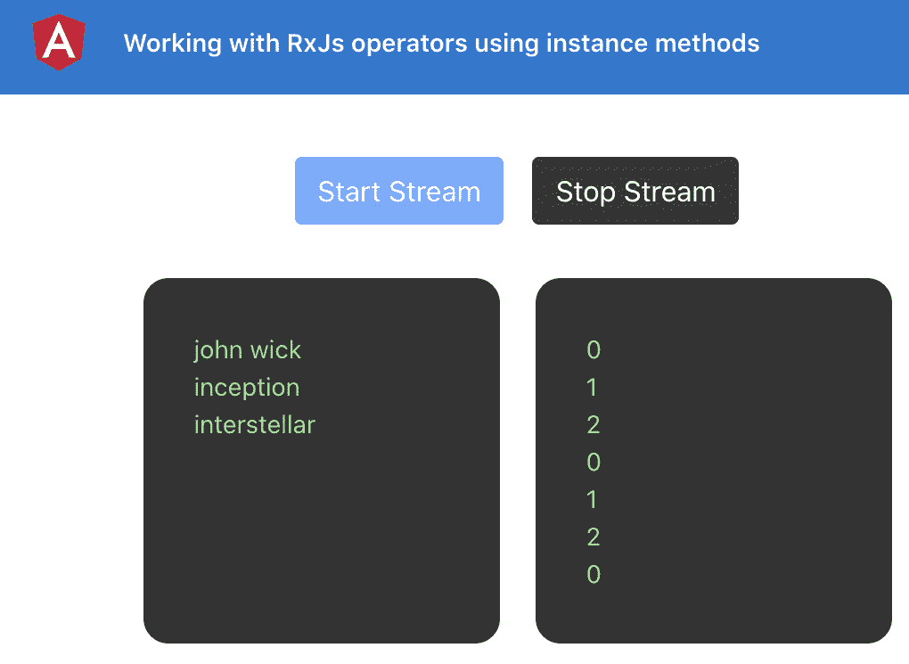
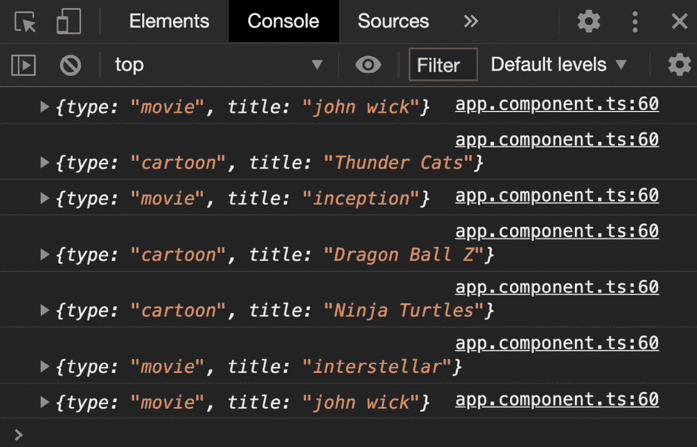
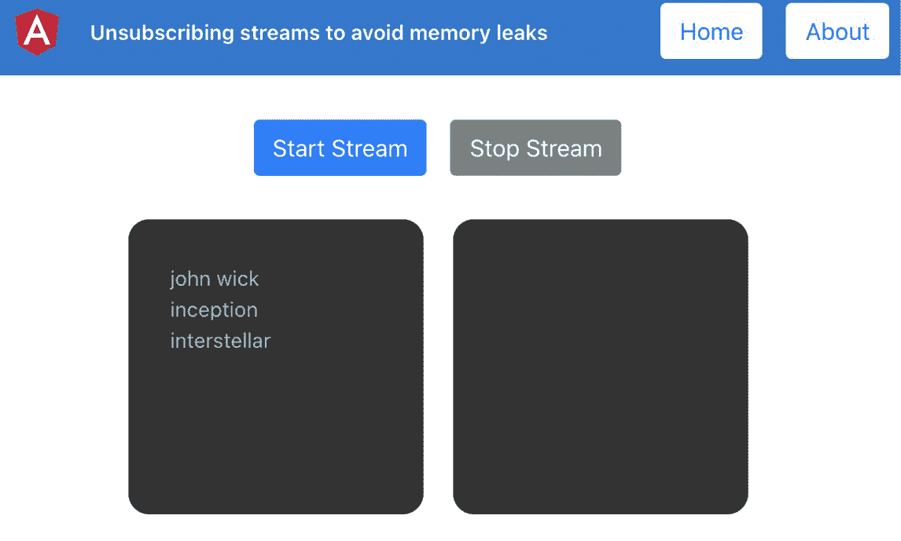
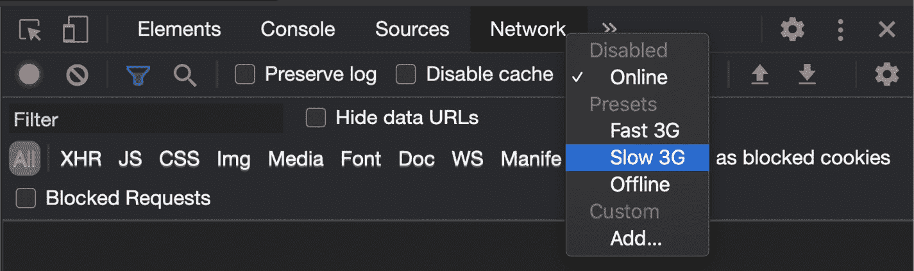
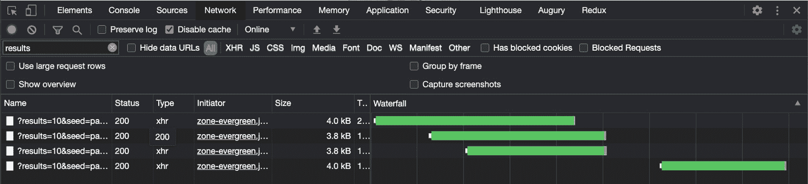
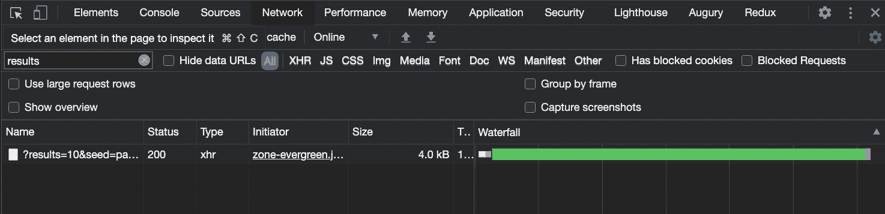

# *第五章*：棱角和 RxJS——惊人的结合

Angular 和 RXJ 创造了惊人的组合。通过组合这些，您可以反应式地处理数据、处理流，并在您的应用程序中完成真正复杂的工作。这正是您在本章中要学习的内容。

以下是我们将在本章中介绍的食谱：

*   使用实例方法处理 RxJS 操作符
*   使用静态方法处理 RxJS 操作符
*   取消订阅流以避免内存泄漏
*   通过`async`管道使用 Observable 将数据同步绑定到角度模板
*   使用`combineLatest`一起订阅多条流
*   使用`flatMap`操作符创建顺序**超文本传输协议**（**HTTP**调用
*   使用`switchMap`操作符将上次订阅切换为新订阅
*   使用 RxJS 取消绑定 HTTP 请求

# 技术要求

对于本章中的配方，请确保您的机器上安装了**Git**和**Node.js**。您还需要安装`@angular/cli`软件包，您可以从终端使用`npm install -g @angular/cli`进行安装。本章代码可在以下链接中找到：[https://github.com/PacktPublishing/Angular-Cookbook/tree/master/chapter05]( https://github.com/PacktPublishing/Angular-Cookbook/tree/master/chapter05) 。

# 使用实例方法处理 RxJS 操作符

在这个配方中，您将学习使用 RxJS 操作符的实例方法来处理流。我们将从一个基本的应用程序开始，在这个应用程序中，您可以开始使用`interval`方法收听流。然后，我们将在订阅中引入一些实例方法来修改输出。

## 准备好了吗

我们将要处理的项目位于克隆存储库的`chapter05/start_here/rxjs-operators-instance-methods`中。

1.  在**Visual Studio 代码**（**VS 代码**中打开项目）。
2.  打开终端，运行`npm install`安装项目的依赖项。
3.  Once done, run `ng serve -o`.

    这将在新的浏览器选项卡中打开应用程序。点击**开始流**按钮，您会看到如下画面：


图 5.1–运行在上的 rxjs operators 实例方法应用程序 http://localhost:4200

现在我们已经运行了应用程序，我们将继续进行配方的步骤。

## 怎么做…

我们有一个 Angular 应用程序，它已经设置了一些东西。通过点击**开始流**按钮，我们可以开始查看流输出，该流输出使用 RxJS 中的`interval`方法来创建一个可观察对象，从`0`开始输出一系列数字。我们将使用一些操作符来显示`inputStreamData`数组中的元素，这是本配方的目标。开始吧。

1.  First, we'll use the `map` operator to make sure that we are mapping the numbers generated from the `interval` Observable to the valid indices of our array. For this, we'll update the `app.component.ts` file.

    我们必须确保映射的数字不大于或等于`inputStreamData`的长度。我们将通过每次对数字取一个模来实现这一点，使用`map`操作符，如下所示：

    ```ts
    import { Component } from '@angular/core';
    import { interval, Subscription } from 'rxjs';
    import { map } from 'rxjs/operators';
    @Component({...})
    export class AppComponent {
    ...
      startStream() {
        this.subscription = streamSource
        .pipe(
     map(output => output % this.inputStreamData.      length),
     )
        .subscribe(input => {
          this.outputStreamData.push(input);
        });
    ...
    }
    ```

    如果您现在点击**开始流**按钮，您将看到我们得到的输出是`0, 1, 2, 0, 1, 2`。。。等等这确保我们始终可以使用数字作为索引从`inputStreamData`数组中获取项目：

    

    图 5.2–流输出 0,1,2。。使用 inputStreamData.length 上的模数进行排序

2.  Now, we'll use another `map` method to fetch an element from the array for each of the stream's outputs, as follows:

    ```ts
      startStream() {
        const streamSource = interval(1500);
        this.subscription = streamSource
        .pipe(
          map(output => output % this.inputStreamData.      length),
     map(index => this.inputStreamData[index])
        )
        .subscribe(element => {
          this.outputStreamData.push(element);
        });
      }
    ```

    请注意，我们已经将`subscribe`方法的参数重命名为`element`而不是`input`。这是因为我们最终得到了一个元素。请参见以下屏幕截图，演示流如何使用索引从`inputStreamData`输出元素：

    

    图 5.3–流使用索引从 inputStreamData 输出元素

3.  现在，为了让事情变得更有趣，我们将创建另一个流，它将使用相同的`interval`方法发出卡通标题，但间隔为`1000ms`。将以下代码添加到您的`startStream`方法中：

    ```ts
      startStream() {
        const streamSource = interval(1500);
        const cartoonStreamSource = interval(1000)
     .pipe(
     map(output => output % this.cartoonsStreamData.        length),
     map(index => this.cartoonsStreamData[index]),
     )
        this.subscription = streamSource
        .pipe(...)
        .subscribe(...);
      }
    ```

4.  我们还将在`AppComponent`类中创建名为`cartoonStreamData`（在前面的代码中使用）的流数据作为属性。代码应该像这样：

    ```ts
    export class AppComponent {
      subscription: Subscription = null;
      inputStreamData = ['john wick', 'inception',   'interstellar'];
     cartoonsStreamData = ['thunder cats', 'Dragon Ball Z',   'Ninja Turtles'];
      outputStreamData = [];
      ...
    }
    ```

5.  现在我们已经准备好了`cartoonsStreamData`流数据，我们还可以将其添加到模板中，以便在视图上显示它。`app.component.html`中`<div class="input-stream">`元素的子元素应该如下所示：

    ```ts
        <div class="input-stream">
          <div class="input-stream__item" *ngFor="let item       of inputStreamData">
            {{item}}
          </div>
          <hr/>
          <div class="input-stream__item" *ngFor="let item       of cartoonsStreamData">
     {{item}}
     </div>
        </div>
    ```

6.  Now, we'll use the `merge` (instance) method to combine the two streams and add an element from the respective stream data array when the streams emit a value. Interesting, right?

    我们将使用以下代码实现这一点：

    ```ts
    ...
    import { map, merge } from 'rxjs/operators';
    export class AppComponent {
      ...
      startStream() {
        ...
        this.subscription = streamSource
        .pipe(
          map(output => output % this.inputStreamData.      length),
          map(index => this.inputStreamData[index]),
          merge(cartoonStreamSource)
        )
        .subscribe(element => {
          this.outputStreamData.push(element);
        });
      }
    }
    ```

    重要提示

    不推荐使用`merge`方法作为实例方法，而使用静态`merge`方法。

伟大的现在，您已经实现了整个配方，并对两个流进行了有趣的合并。下面的屏幕截图显示了最终输出：


图 5.4–配方的最终输出

让我们继续下一节来了解它是如何工作的。

## 它是如何工作的…

`map`操作符向您提供流的输出值，您应该返回一个要映射到的值。我们确保通过获取数组长度的模，将自动生成的序列号转换为数组的索引。然后，我们在这些索引之上使用另一个`map`操作符从数组中获取实际元素。最后，我们创建了另一个流，并使用`merge`方法组合两个流的输出，并将其添加到`outputStreamData`数组中。

## 另见

*   *捕捉网络游戏*-RxJS 文档（[https://www.learnrxjs.io/learn-rxjs/recipes/catch-the-dot-game](https://www.learnrxjs.io/learn-rxjs/recipes/catch-the-dot-game)
*   RxJS`map`操作员文件（[https://www.learnrxjs.io/learn-rxjs/operators/transformation/map](https://www.learnrxjs.io/learn-rxjs/operators/transformation/map)
*   RxJS`merge`操作员文档（[https://www.learnrxjs.io/learn-rxjs/operators/combination/merge](https://www.learnrxjs.io/learn-rxjs/operators/combination/merge)

# 使用静态方法与 RxJS 操作员合作

在本教程中，您将学习使用 RxJS 操作符的静态方法处理流。我们将从一个基本的应用程序开始，在这个应用程序中，您可以开始使用`interval`方法收听流。然后，我们将在订阅中引入一些静态方法来修改输出，以便在**用户界面**（**UI**上查看。之后，我们将使用`partition`静态操作符分割流。最后，我们将使用`merge`静态操作符合并已分区的流，以查看它们的输出。

## 准备好了吗

此配方的项目位于`chapter05/start_here/rxjs-operators-static-methods`中。

1.  在 VS 代码中打开项目。
2.  打开终端，运行`npm install`安装项目的依赖项。
3.  Once done, run `ng serve -o`.

    这将在新的浏览器选项卡中打开应用程序，您将看到如下内容：


图 5.5–运行在上的 rxjs operators 静态方法应用程序 http://localhost:4200

我们还有以下数据，由电影和卡通组成，这是我们将得到的流的输出：

```ts
combinedStreamData = [{
    type: 'movie',
    title: 'john wick'
  }, {
    type: 'cartoon',
    title: 'Thunder Cats'
  }, {
    type: 'movie',
    title: 'inception'
  }, {
    type: 'cartoon',
    title: 'Dragon Ball Z'
  }, {
    type: 'cartoon',
    title: 'Ninja Turtles'
  }, {
    type: 'movie',
    title: 'interstellar'
  }];
```

现在我们已经让应用程序在本地运行，让我们在下一节中查看配方的步骤。

## 怎么做…

我们手头有一个 Angular 应用程序，它在一个名为`combinedStreamData`的数组中包含一些数据。点击**开始流**按钮，我们可以开始在**电影**输出部分和**卡通**输出部分查看流的输出。我们将使用`partition`和`merge`操作符获得所需的输出，并显示当前输出上显示的电影和卡通的数量。开始吧。

1.  首先，我们将从 RxJS 导入`partition`和`merge`操作符（不同于我们在前面的配方中从`rxjs/operators`导入的方式）。导入在`app.component.ts`文件

    ```ts
    import { Component } from '@angular/core';
    import { interval, partition, merge, Subscription } from 'rxjs';
    ```

    中应该是这样的
2.  现在，我们将在`AppComponent`类中创建两个属性`movies`和`cartoons`，一个用于存放电影，另一个用于存放卡通：

    ```ts
    import { Component } from '@angular/core';
    import { interval, partition, merge, Subscription } from 'rxjs';
    import { map, tap } from 'rxjs/operators';
    export class AppComponent {
      …
      outputStreamData = [];
      movies= []
     cartoons= [];
      startStream() {
      }
      ...
    }
    ```

3.  现在，我们将在电影和卡通的模板中使用适当的变量，如下所示：

    ```ts
    <div class="cards-container">
        <div class="input-stream">
          ...
        <div class="output-stream">
          <h6>Movies</h6>
          <div class="input-stream__item" *ngFor="let movie       of movies">
            {{movie}}
          </div>
        </div>
        <div class="output-stream">
          <h6>Cartoons</h6>
          <div class="input-stream__item" *ngFor="let cartoon       of cartoons">
            {{cartoon}}
          </div>
        </div>
      </div>
    ```

4.  We'll now use the `partition` operator to create two streams out of the `streamSource` property. Your `startStream` method should look like this:

    ```ts
    startStream() {
        const streamSource = interval(1500).pipe(
          map(input => {
            const index = input % this.combinedStreamData.        length;
            return this.combinedStreamData[index];
          })
        );
        const [moviesStream, cartoonsStream] = partition(
     streamSource, item => item.type === 'movie'
     );
        this.subscription = streamSource
          .subscribe(input => {
            this.outputStreamData.push(input);
          });
      }
    ```

    现在我们已经将流拆分，我们可以合并这些流以订阅单个流，推送到适当的输出数组，然后将值作为输出记录到控制台。

5.  Let's merge the streams now, and we'll add them to the appropriate output array using the `tap` operator, as follows:

    ```ts
    startStream() {
       ...
        this.subscription = merge(
     moviesStream.pipe(
            tap(movie => {
     this.movies.push(movie.title);
     })
     ),
     cartoonsStream.pipe(
     tap(cartoon => {
     this.cartoons.push(cartoon.title);
     })
     ),
     )
          .subscribe(input => {
            this.outputStreamData.push(input);
          });
      }
    ```

    通过此更改，您应该能够在适当的容器中看到正确的值，即，无论是电影还是卡通。请参见以下屏幕截图，其中显示了分区流如何将值发送到相应的可观察对象：

    

    图 5.6–将数据输出到适当视图的分区流

6.  Finally, since we have merged the stream, we can use `console.log` to see each value being output. We'll remove the `outputStreamData` property from `AppComponent` and use a `console.log` statement instead of pushing to `outputStreamData` in the `subscribe` block, as follows:

    ```ts
    ...
    @Component({...})
    export class AppComponent {
      ...
      outputStreamData = []; ← Remove
      movies = [];
      cartoons = [];
      ngOnInit() {}
      startStream() {
        const streamSource = interval(1500).pipe(
          map(...)
        );
        const [moviesStream, cartoonsStream] =     partition(...);
        this.subscription = merge(
          moviesStream.pipe(...),
          cartoonsStream.pipe(...)
        ).subscribe((output) => {
          console.log(output);
        });
      }
      ...
    }
    ```

    你一刷新应用程序，就会看到控制台上的日志，如下所示：



图 5.7–合并流的 subscribe 块中每个输出的控制台日志

伟大的现在您已经知道如何使用 RxJS 中的静态操作符（特别是`partition`和`merge`）在实际用例中处理流。请参阅下一节，了解其工作原理。

## 它是如何工作的…

RxJS 有一系列静态操作符/方法，我们可以用于特定的用例。在这个方法中，我们使用`partition`操作符根据作为第二个参数提供的`predicate`函数创建了两个不同的流，该函数返回一个包含两个可观测值的数组。第一个将包含满足谓词的所有值，第二个将包含不满足谓词的所有值。*我们为什么要分开溪流？*很高兴你这么问。因为我们需要在不同的输出容器中显示相应的输出。最棒的是，我们后来合并了这些流，这样我们只需要订阅一个流，然后我们也可以取消订阅这个流。

## 另见

*   RxJS`map`操作员文件（[https://www.learnrxjs.io/learn-rxjs/operators/transformation/map](https://www.learnrxjs.io/learn-rxjs/operators/transformation/map)
*   RxJS`merge`操作员文档（[https://www.learnrxjs.io/learn-rxjs/operators/combination/merge](https://www.learnrxjs.io/learn-rxjs/operators/combination/merge)
*   RxJS`partition`操作员文档（[https://www.learnrxjs.io/learn-rxjs/operators/transformation/partition](https://www.learnrxjs.io/learn-rxjs/operators/transformation/partition)

# 取消订阅流以避免内存泄漏

使用流非常有趣，而且非常棒，当您完成本章后，您将了解更多关于 RxJS 的信息，尽管在不小心使用流时会出现问题。使用流的最大错误之一是在我们不再需要它们时不取消订阅，在本食谱中，您将学习如何取消订阅流以避免应用程序中的内存泄漏。

## 准备好了吗

此配方的项目位于`chapter05/start_here/rxjs-unsubscribing-streams`中。

1.  在 VS 代码中打开项目。
2.  打开终端，运行`npm install`安装项目的依赖项。
3.  Once done, run `ng serve -o`.

    这将在新的浏览器选项卡中打开应用程序，您将看到如下内容：



图 5.8–在上运行的 rxjs 取消订阅流应用程序 http://localhost:4200

现在我们已经有了本地运行的应用程序，让我们在下一节中查看配方的步骤。

## 怎么做…

我们目前有一个应用程序，有两条路线，即**回家**和**关于**。这是为了向您展示未经处理的订阅可能会导致应用程序内存泄漏。默认路由为**Home**，在`HomeComponent`类中，我们使用`interval`方法处理输出数据的单个流。

1.  点击**启动流**按钮，您应该可以看到流的发射值。
2.  Then, navigate to the **About** page by tapping the **About** button from the header (top right), and then come back to the **Home** page.

    你看到了什么？没有什么一切看起来都很好，对吗？嗯，不完全是这样。

3.  To see whether we have an unhandled subscription, which is an issue, let's put a `console.log` inside the `startStream` method in the `home.component.ts` file—specifically, inside the `.subscribe` method's block, as follows:

    ```ts
    ...
    export class HomeComponent implements OnInit {
      ...
      startStream() {
        const streamSource = interval(1500);
        this.subscription = streamSource.subscribe(input => {
          this.outputStreamData.push(input);
          console.log('stream output', input)
        });
      }
      stopStream() {...}
    }
    ```

    如果您现在执行*步骤 1*中提到的相同步骤，您将在控制台上看到以下输出：

    

    图 5.9–在上运行的 rxjs 取消订阅流应用程序 http://localhost:4200

    想玩得开心点吗？尝试执行*步骤 1*几次，但不刷新页面一次。你将看到的是**混乱**！

4.  因此，为了解决这个问题，我们将使用最简单的方法，即当用户离开路由时取消订阅流。让我们为其实现`ngOnDestroy`生命周期方法，如下所示：

    ```ts
    import { Component, OnInit, OnDestroy } from '@angular/core';
    ...
    @Component({
      selector: 'app-home',
      templateUrl: './home.component.html',
      styleUrls: ['./home.component.scss']
    })
    export class HomeComponent implements OnInit, OnDestroy {
      ...
      ngOnInit() {
      }
      ngOnDestroy() {
     this.stopStream();
     }
      startStream() {
        const streamSource = interval(1500);
        this.subscription = streamSource.subscribe(input => {
          this.outputStreamData.push(input);
          console.log('stream output', input)
        });
      }
      stopStream() {
        this.subscription.unsubscribe();
        this.subscription = null;
      }
    }
    ```

伟大的如果您再次按照*步骤 1*中的说明进行操作，您将看到，一旦您离开**主页**页面，就不会再登录控制台，并且我们的应用程序现在没有导致内存泄漏的未处理流。阅读下一节了解其工作原理。

## 它是如何工作的…

当我们创建一个可观察/流并订阅它时，RxJS 会自动将我们提供的`.subscribe`方法块作为处理程序添加到可观察数据中。所以，无论何时，只要有一个值从可观察的对象发出，我们的方法就应该被调用。有趣的是，Angular 不会在组件卸载或您离开路由时自动销毁订阅/处理程序。这是因为观测的核心是 RxJS，而不是角度，因此角度不负责处理它。

Angular 提供了某些生命周期方法，我们使用了`OnDestroy`（`ngOnDestroy`方法）。这是因为当我们离开某条路线时，Angular 会破坏该路线，而这正是我们想要取消订阅所有已订阅流的时候。

## 还有更多…

在复杂的 Angular 应用程序中，有时一个组件中有多个订阅，当该组件被销毁时，您会希望一次清除所有订阅。类似地，您可能希望基于某些事件/条件而不是`OnDestroy`生命周期取消订阅。下面是一个示例，您手头有多个订阅，您希望在组件销毁时将所有订阅一起清理：

```ts
startStream() {
    const streamSource = interval(1500);
    const secondStreamSource = interval(3000);
 const fastestStreamSource = interval(500);
    streamSource.subscribe(input => {...});
    secondStreamSource.subscribe(input => {
 this.outputStreamData.push(input);
 console.log('second stream output', input)
 });
 fastestStreamSource.subscribe(input => {
 this.outputStreamData.push(input);
 console.log('fastest stream output', input)
 });
  }
  stopStream() {
  }
```

请注意，我们不再将**订阅**从`streamSource`保存到`this.subscription`，我们还从`stopStream`方法中删除了代码。这是因为我们没有针对每个订阅的单独属性/变量。相反，我们将使用单个变量。让我们看看下面的配方步骤，让事情顺利进行。

1.  首先，我们将在名为`isComponentAlive`：

    ```ts
    ...
    export class HomeComponent implements OnInit, OnDestroy {
      isComponentAlive: boolean;
      ...
    }
    ```

    的`HomeComponent`类中创建一个属性
2.  现在，我们将从`rxjs/operators`导入`takeWhile`操作符，如下所示：

    ```ts
    import { Component, OnInit, OnDestroy } from '@angular/core';
    import { interval } from 'rxjs/internal/observable/interval';
    import { Subscription } from 'rxjs/internal/Subscription';
    import { takeWhile } from 'rxjs/operators';
    ```

3.  We'll now use the `takeWhile` operator with each of our streams to make them work only when the `isComponentAlive` property is set to `true`. Since `takeWhile` takes a `predicate` method, it should look like this:

    ```ts
    startStream() {
        ...
        streamSource
          .pipe(
     takeWhile(() => !!this.isComponentAlive)
     ).subscribe(input => {...});
        secondStreamSource
          .pipe(
     takeWhile(() => !!this.isComponentAlive)
     ).subscribe(input => {...});
        fastestStreamSource
          .pipe(
     takeWhile(() => !!this.isComponentAlive)
     ).subscribe(input => {...});
      }
    ```

    如果您现在按**主页**上的**开始流**按钮，您仍然不会看到任何输出或日志，因为`isComponentAlive`属性仍然是`undefined`。

4.  To make the streams work, we'll set the `isComponentAlive` property to `true` in the `ngOnInit` method as well as in the `startStream` method. The code should look like this:

    ```ts
      ngOnInit() {
        this.isComponentAlive = true;
      }
      ngOnDestroy() {
        this.stopStream();
      }
      startStream() {
        this.isComponentAlive = true;
        const streamSource = interval(1500);
        const secondStreamSource = interval(3000);
        const fastestStreamSource = interval(500);
        ...
      }
    ```

    在这一步之后，如果您现在尝试启动流并离开页面，您仍然会看到流的相同问题，即它们没有被取消订阅。

5.  为了一次取消所有流的订阅，我们将在`stopStream`方法中将`isComponentAlive`的值设置为`false`，如下所示：

    ```ts
      stopStream() {
        this.isComponentAlive = false;
      }
    ```

轰！现在，如果您在流发出值的同时离开该路由，那么一旦您离开**主**路由，流将立即停止。瞧！

## 另见

*   阅读关于RxJS 订阅(https://www.learnrxjs.io/learn-rxjs/concepts/rxjs-primer#subscription)
*   `takeWhile`文件(https://www.learnrxjs.io/learn-rxjs/operators/filtering/takewhile)

# 通过异步管道使用 Observable 将数据同步绑定到角度模板

正如您在上一个配方中所了解的，取消订阅流是至关重要的。如果我们有一个更简单的方法在组件被破坏时取消订阅，也就是让 Angular 以某种方式处理它，会怎么样？在本配方中，您将学习如何使用 Angular 的`async`管道和 Observable 将流中的数据直接绑定到 Angular 模板，而不必订阅`*.component.ts`文件。

## 准备好了吗

此配方的项目位于`chapter05/start_here/using-async-pipe`中。

1.  在 VS 代码中打开项目。
2.  打开终端，运行`npm install`安装项目的依赖项。
3.  Once done, run `ng serve -o`.

    这将在新的浏览器选项卡中打开应用程序。页面一打开，您就会看到如下内容：


图 5.10–在上运行的使用异步管道应用程序 http://localhost:4200

现在我们已经有了本地运行的应用程序，让我们在下一节中查看配方的步骤。

## 怎么做…

我们现在拥有的应用程序有三个流/可观测值，它们以不同的间隔观测值。我们依赖于`isComponentAlive`属性使订阅保持活动状态，或者在该属性设置为`false`时使其停止。我们将删除`takeWhile`的用法，并以某种方式使一切工作与我们现在的工作类似。

1.  First, remove the `subscription` property from the `home.component.ts` file and add an `Observable` type property named `streamOutput$`. The code should look like this:

    ```ts
    ...
    import { Observable } from 'rxjs';
    ...
    export class HomeComponent implements OnInit, OnDestroy {
      isComponentAlive: boolean;
      subscription: Subscription = null ← Remove this;
      inputStreamData = ['john wick', 'inception',   'interstellar']; 
      streamsOutput$: Observable<number[]> ← Add this
      outputStreamData = []
      constructor() { }
      ...
    }
    ```

    通过此更改，应用程序将因缺少一些变量而中断。不要害怕！我是来帮你的。

2.  We'll now combine all the streams to give out a single output—that is, the `outputStreamData` array. We'll remove all the existing `.pipe` and `.subscribe` methods from the `startStream()` method, so the code should now look like this:

    ```ts
    import { Component, OnInit, OnDestroy } from '@angular/core';
    import { merge, Observable } from 'rxjs';
    import { map, takeWhile } from 'rxjs/operators';
    ...
    export class HomeComponent implements OnInit, OnDestroy {
      ...
      startStream() {
        const streamSource = interval(1500);
        const secondStreamSource = interval(3000);
        const fastestStreamSource = interval(500);
        this.streamsOutput$ = merge(
     streamSource,
     secondStreamSource,
     fastestStreamSource
     )
      }
      ...
    }
    ```

    有了这一变化，衣匠们仍会抱怨。为什么？因为`merge` 运算符组合所有流并输出最新值。这是一个`Observable<number>`数据类型，而不是`Observable<string[]>`，后者是`streamsOutput$`类型。

3.  由于我们想要分配包含流发出的每个输出的整个数组，我们将使用`map`操作符，将每个输出添加到`outputStreamData`数组中，并返回`outputStreamData`数组的最新状态，如下所示：

    ```ts
    startStream() {
        const streamSource = interval(1500);
        const secondStreamSource = interval(3000);
        const fastestStreamSource = interval(500);
        this.streamsOutput$ = merge(
          streamSource,
          secondStreamSource,
          fastestStreamSource
        ).pipe(
     takeWhile(() => !!this.isComponentAlive),
          map(output => {
     this.outputStreamData = [...this.        outputStreamData, output]
     return this.outputStreamData;
     })
     )
      }
    ```

4.  从`HomeComponent`类中删除`stopStream`方法，因为我们不再需要它了。另外，从`ngOnDestroy`方法中删除其用法。
5.  最后，修改`home.component.html`中的模板，使用`streamOutput$`可观测和管道在

    ```ts
        <div class="output-stream">
          <div class="input-stream__item" *ngFor="let item       of streamsOutput$ | async">
            {{item}}
          </div>
        </div>
    ```

    输出阵列上循环
6.  为了验证订阅确实在组件销毁时被销毁，让我们在`map`操作符内的`startStream`方法中添加一个`console.log`，如下所示：

    ```ts
    startStream() {
        const streamSource = interval(1500);
        const secondStreamSource = interval(3000);
        const fastestStreamSource = interval(500);
        this.streamsOutput$ = merge(
          streamSource,
          secondStreamSource,
          fastestStreamSource
        ).pipe(
          takeWhile(() => !!this.isComponentAlive),
          map(output => {
            console.log(output)
            this.outputStreamData = [...this.        outputStreamData, output]
            return this.outputStreamData;
          })
        )
      }
    ```

万岁！通过此更改，您可以尝试刷新应用程序，离开**主页**路线，您将看到控制台日志在您完成此操作后立即停止。您是否感觉到我们刚刚通过删除所有额外代码而获得的成就？我当然喜欢。好的，在下一节中看看它是如何工作的。

## 它是如何工作的…

Angular 的`async`管道会在组件销毁后自动销毁/取消订阅。这给了我们一个很好的机会在可能的情况下使用它。在配方中，我们基本上使用`merge`操作符组合所有流。有趣的是，对于`streamsOutput$`属性，我们需要输出数组的一个可观测值，我们可以在其上循环。但是，合并流仅合并它们，并发出任何流发出的最新值。因此，我们添加了一个带有`.map()`操作符的`.pipe()`方法，从组合流中取出最新的输出，将其添加到`outputStreamData`数组中进行持久化，并从`.map()`方法返回，以便我们在使用`async`管道时在模板中获得数组。

有趣的事实流不会产生任何价值，除非它们被订阅。“*但是阿桑，我们没有订阅流，我们只是合并并映射了数据。订阅在哪里？*很高兴你这么问。Angular 的`async`管道订阅流本身，这触发了我们在*步骤 6*中添加的`console.log`。

重要提示

`async`管道有一个限制，即在组件销毁之前不能停止订阅。在这种情况下，您可能希望使用之类的`takeWhile`/`takeUntil`操作符进行组件内订阅，或者在组件销毁时自己执行常规`.unsubscribe`方法。

## 另见

*   角度`async`管道文件（[https://angular.io/api/common/AsyncPipe](https://angular.io/api/common/AsyncPipe)

# 使用 CombineTest 一起订阅多个流

在前面的配方中，我们必须合并所有流，这导致任何流最后发出一个输出。在这个配方中，我们将使用`combineLatest`，这将产生一个数组作为输出，组合所有流。这种方法适用于您希望在单个订阅中组合所有流的最新输出的情况。

## 准备好了吗

我们将要处理的项目位于克隆存储库的`chapter05/start_here/using-combinelatest-operator`中。

1.  在 VS 代码中打开项目。
2.  打开终端，运行`npm install`安装项目的依赖项。
3.  Once done, run `ng serve -o`.

    这将在新的浏览器选项卡中打开应用程序，您将看到如下内容：


图 5.11–在上运行的使用 CombineTest 操作员应用程序 http://localhost:4200

现在我们已经有了本地运行的应用程序，让我们在下一节中查看配方的步骤。

## 怎么做…

对于这个菜谱，我们有一个显示方框的应用程序。该框具有大小（宽度和高度）、边框半径、背景颜色和文本颜色。它还有四个输入来修改所有提到的因素。现在，我们必须通过单击按钮手动应用更改。如果我们可以订阅对输入的更改并立即更新框，会怎么样？这就是我们在这里要做的。

1.  我们将首先创建一个名为`listenToInputChanges`的方法，其中订阅每个输入的更改，并使用`combineLatest`操作符组合这些流。更新`home/home.component.ts`文件，如下所示：

    ```ts
    ...
    import { combineLatest, Observable } from 'rxjs';
    ...
    export class HomeComponent implements OnInit, OnDestroy {
      ...
      ngOnInit() {
        ...
        this.applyChanges();
        this.listenToInputChanges(); ← Add this
      }
      listenToInputChanges() {
     combineLatest([
     this.boxForm.get('size').valueChanges,
     this.boxForm.get('borderRadius').valueChanges,
     this.boxForm.get(      'backgroundColor').valueChanges,
     this.boxForm.get('textColor').valueChanges
     ]).subscribe(() => {
     this.applyChanges();
     });
     }
      ...
    }
    ```

2.  还记得不取消订阅流是个坏主意吗？这就是我们这里的内容：订阅流。我们将使用`async`管道，而不是`home.component.ts`文件中使用的当前订阅。为此，让我们创建一个名为`boxStyles$`的可观察属性，并删除`boxStyles`属性。然后，将来自`combineLatest`的流分配给它，如下所示：

    ```ts
    ...
    import { map} from 'rxjs/operators';
    ...
    export class HomeComponent implements OnInit, OnDestroy {
      ...
     boxStyles: {...}; ← Remove this
      boxForm = new FormGroup({...});
      boxStyles$: Observable<{
     width: string,
     height: string,
     backgroundColor: string,
     color: string
     borderRadius: string
     }>;
       ...
      listenToInputChanges() {
        this.boxStyles$ = combineLatest([...]).    pipe(map(([size, borderRadius, backgroundColor,     textColor]) => {
     return {
     width: `${size}px`,
     height: `${size}px`,
     backgroundColor,
     color: textColor,
     borderRadius: `${borderRadius}px`
     }
     }));
      }
      ...
    }
    ```

3.  我们需要从`home.component.ts`文件中删除`setBoxStyles()`和`applyChanges()`方法以及`applyChanges()`方法的用法。更新文件，如下所示：

    ```ts
    export class HomeComponent implements OnInit, OnDestroy {
      ...
      ngOnInit() {
        ...
        this.applyChanges(); ← Remove this
     this.listenToInputChanges(); ← Add this
     }
     ...
     setBoxStyles(size, backgroundColor, color,   borderRadius) {...}  ← Remove this
     applyChanges() {...} ← Remove this
      ...
    }
    ```

4.  我们还需要从模板中删除`applyChanges()`方法的用法。从`home.component.html`文件中的`<form>`元素中删除`(ngSubmit)`处理程序，使其看起来像：

    ```ts
    <div class="home" [formGroup]="boxForm" (ngSubmit)="applyChanges()" ← Remove this>
      ...
    </div>
    ```

5.  We also need to get rid of the `submit-btn-container` element from the `home.component.html` template as we don't need it anymore. Delete the following chunk from the file:

    ```ts
    <div class="row submit-btn-container" ← Remove this element>
     <button class="btn btn-primary" type="submit"   (click)="applyChanges()">Change Styles</button>
    </div>
    ```

    如果你刷新应用程序，你会注意到框根本不显示。我们将在下一步中解决此问题。

6.  由于我们在应用程序启动时使用了`combineLatest`操作符，但由于没有任何输入发生更改，因此我们没有触发它，因此我们需要使用一些初始值初始化框。为此，我们将使用带有初始值的`startWith`运算符，如下所示：

    ```ts
    ...
    import { map, startWith } from 'rxjs/operators';
    @Component({...})
    export class HomeComponent implements OnInit, OnDestroy {
      ...
      ngOnInit() {
        this.listenToInputChanges();
      }
      listenToInputChanges() {
        this.boxStyles$ = combineLatest([
          this.boxForm
            .get('size')
     .valueChanges.pipe(startWith(this.        sizeOptions[0])),
          this.boxForm
            .get('borderRadius')
     .valueChanges.pipe(startWith(        this.borderRadiusOptions[0])),
          this.boxForm
            .get('backgroundColor')
     .valueChanges.pipe(startWith(        this.colorOptions[1])),
          this.boxForm
            .get('textColor')
     .valueChanges.pipe(startWith(        this.colorOptions[0])),
        ]).pipe(
          map(...);
      }
      ngOnDestroy() {}
    }
    ```

7.  Now that we have the `boxStyles$` Observable in place, let's use it in the template instead of the `boxStyles` property:

    ```ts
      ...
      <div class="row" *ngIf="boxStyles$ | async as bStyles">
        <div class="box" [ngStyle]="bStyles">
          <div class="box__text">
            Hello World!
          </div>
        </div>
      </div>
      ...
    ```

    瞧！现在一切都很好。

恭喜完成配方。你现在是溪流大师和`combineLatest`操作员。请参阅下一节以了解其工作原理。

## 它是如何工作的…

**反应形式**的美妙之处在于它们提供了比常规`ngModel`绑定甚至模板驱动形式更大的灵活性。对于每个表单控件，我们可以订阅它的`valueChanges`可观察项，每当输入发生变化时，它都会收到一个新值。因此，我们不再依赖于**提交**按钮的点击，而是直接订阅了每个**表单控件**的`valueChanges`属性。在常规场景中，这将导致四个输入的四个不同流，这意味着我们需要处理四个订阅，并确保取消订阅。这是`combineLatest`操作员开始工作的地方。我们使用`combineLatest`操作符将这四个流合并为一个流，这意味着我们只需要在组件销毁时取消订阅一个流。但是嘿！记住，如果我们使用`async`管道，我们不需要这样做？我们就是这么做的。我们从`home.component.ts`文件中删除订阅，并与`.map()`操作符一起使用`.pipe()`方法。`.map()`操作符将数据转换为我们需要的数据，然后返回转换后的数据以设置为`boxStyles$`可观察值。最后，我们在模板中使用异步管道订阅`boxStyles$`可观察对象，并将其值作为`[ngStyle]`分配给 box 元素。

重要提示

`combineLatest`方法不会发出初始值，直到每个可观察对象发出至少一个值。因此，我们对每个表单控件的`valueChanges`流使用`startWith`操作符来提供初始发出值。

## 另见

*   `combineLatest`操作员文件（[https://www.learnrxjs.io/learn-rxjs/operators/combination/combinelatest](https://www.learnrxjs.io/learn-rxjs/operators/combination/combinelatest)
*   `combineLatest`操作员的视觉表示（[https://rxjs-dev.firebaseapp.com/api/index/function/combineLatest](https://rxjs-dev.firebaseapp.com/api/index/function/combineLatest)

# 使用 flatMap 操作符创建顺序 HTTP 调用

使用**承诺**的日子太棒了。那些日子并不是已经过去了，但我们作为开发者肯定更喜欢**可观测**而不是**承诺**，原因很多。关于承诺，我非常喜欢的一点是，您可以将承诺链接起来，以执行诸如连续 HTTP 调用之类的操作。在本食谱中，您将学习如何使用`flatMap`操作符对**可观察物**执行相同操作。

## 准备好了吗

我们将要处理的项目位于克隆存储库的`chapter05/start_here/using-flatmap-operator`中。

1.  在 VS 代码中打开项目。
2.  打开终端，运行`npm install`安装项目的依赖项。
3.  Once done, run `ng serve -o`.

    这个应该在一个新的浏览器选项卡中打开应用程序，您应该会看到如下内容：


图 5.12–在上运行的使用 flatmap operator 应用程序 http://localhost:4200

实际上，应用程序对现在看起来很完美。没什么可疑的，对吧？嗯，不完全是这样。按照以下步骤找出问题所在。

1.  打开 Chrome 开发工具。
2.  Go to the **Network** tab and simulate the **Slow 3G** network, as follows:

    

    图 5.13–在 Chrome 开发工具中模拟慢速 3G 网络

    如果您点击主页上的任何卡片上的，您应进入特定用户的详细信息页面。

3.  现在刷新应用，查看**网络**页签，可以看到 HTTP 调用并行执行，如下图：


图 5.14–异步加载数据的并行调用

问题是，由于两个 HTTP 调用并行执行，我们不确定哪些数据将首先出现。因此，在加载主用户之前，用户可能会看到类似的用户。让我们看看如何避免这种情况。

## 怎么做…

为了解决类似用户可以在主用户之前加载的问题，我们必须依次加载数据并分别显示相应的内容，在加载内容时，我们将显示一个加载程序。让我们开始吧。

1.  First, let's modify our `user-detail/user-detail.component.html` file to show the loader while we're loading and while we load the similar users as well. The code should look like this:

    ```ts
    <div class="user-detail">
      <div class="main-content user-card">
        <app-user-card *ngIf="user$ | async as user; else     loader" [user]="user"></app-user-card>
      </div>
      <div class="secondary-container">
        <h4>Similar Users</h4>
        <div class="similar-users">
          <ng-container *ngIf="similarUsers$ | async as       users; else loader">
            <app-user-card class="user-card" *ngFor="let user         of users" [user]="user"></app-user-card>
          </ng-container>
        </div>
      </div>
    </div>
    <ng-template #loader>
     <app-loader></app-loader>
    </ng-template>
    ```

    如果你刷新应用程序，你应该会看到两个加载器在通话前出现。

    我们想让调用按顺序进行，因此，我们不能让流直接绑定到`UserDetailComponent`类中的可观察对象。也就是说，我们甚至不能使用`async`管道。

2.  Let's convert the Observable properties to regular properties in the `UserDetailComponent` class, as follows:

    ```ts
    ...
    export class UserDetailComponent implements OnInit, OnDestroy {
      user: IUser;
     similarUsers: IUser[];
      isComponentAlive: boolean;
      ...
    }
    ```

    保存上述更改后，应用程序应该已经中断。

3.  让我们在模板中使用上一步修改的新变量。修改`user-detail.component.html`文件，如下所示：

    ```ts
    <div class="user-detail">
      <div class="main-content user-card">
        <app-user-card *ngIf="user; else loader"     [user]="user"></app-user-card>
      </div>
      <div class="secondary-container">
        <h4>Similar Users</h4>
        <div class="similar-users">
          <ng-container *ngIf="similarUsers; else loader">
            <app-user-card class="user-card" *ngFor="let user         of similarUsers" [user]="user"></app-user-card>
          </ng-container>
        </div>
      </div>
    </div>
    ...
    ```

4.  Finally, let's use the `flatMap` operator now to execute the calls sequentially and to assign the received values to the appropriate variables, as follows:

    ```ts
    ...
    import { takeWhile, flatMap } from 'rxjs/operators';
    export class UserDetailComponent implements OnInit, OnDestroy {
      ...
      ngOnInit() {
        this.isComponentAlive = true;
        this.route.paramMap.pipe(
          takeWhile(() => !!this.isComponentAlive),
          flatMap(params => {
     this.user = null;
     this.similarUsers = null;
     const userId = params.get('uuid');
     return this.userService.getUser(userId)
     .pipe(
     flatMap((user: IUser) => {
     this.user = user;
     return this.userService.              getSimilarUsers(userId);
     })
     );
     })
        ).subscribe((similarUsers: IUser[]) => {
          this.similarUsers = similarUsers;
        })
      }
      ...
    }
    ```

    是的！如果您现在刷新应用程序，您会注意到呼叫是按顺序进行的，因为我们首先得到主用户，然后是相似的用户。要确认，您可以打开 Chrome DevTools，查看**应用程序编程接口**（**API**调用的网络日志。你应该看到这样的东西：


图 5.15–同步执行的 API 调用

现在，您已经完成了配方，请参阅下一节，了解其工作原理。

## 它是如何工作的…

`flatMap`操作符从先前的可观测数据中获取输出，并应返回一个新的可观测数据。这有助于我们按顺序执行 HTTP 调用，以确保数据是根据其优先级或业务逻辑加载的。

由于我们希望在选择新用户时执行调用，这可能发生在`UserDetailComponent`类本身，因此我们直接在`route.paramsMap`上放置了一个`flatMap`操作符。无论何时，我们首先将`user`和`similarUsers`属性设置为`null`。“*但是为什么？*”因为如果我们在`UserDetailsComponent`页面上，并且我们点击任何类似的用户，页面不会改变，因为我们已经在上面了。这意味着用户和`similarUsers`变量仍将包含其以前的值。由于它们已经有了值（也就是说，它们不是`null`），在这种情况下，在点击任何类似的用户时，加载程序都不会显示。聪明，对吧？

无论如何，在将变量分配给`null`之后，我们从`this.userService.getUser(userId)`块返回可观测值，这导致执行第一个 HTTP 调用以获取主用户。然后，我们使用管道和第一个调用的可观察对象上的`flatMap`来获取主用户，将其分配给`this.user`块，然后从第二个调用返回可观察对象，即`this.userService.getSimilarUsers(userId)`代码。最后，我们使用`.subscribe`方法从`getSimilarUsers(userId)`接收值，一旦接收到值，我们将其分配给`this.similarUsers`。

## 另见

*   `flatMap`/`mergeMap`文件（[https://www.learnrxjs.io/learn-rxjs/operators/transformation/mergemap](https://www.learnrxjs.io/learn-rxjs/operators/transformation/mergemap)

# 使用 switchMap 操作符将上次订阅切换为新订阅

对于很多应用程序，我们都有按用户类型搜索内容等功能。这是一个非常好的**用户体验**（**UX**），因为用户无需按下按钮即可进行搜索。但是，如果我们在每次按下键盘时都向服务器发送一个调用，这将导致发送大量 HTTP 调用，并且我们无法知道哪个 HTTP 调用将首先完成；因此，我们无法确定视图上是否显示了正确的数据。在本配方中，您将学习使用`switchMap`操作符取消上一次订阅并创建一个新订阅。这将导致取消以前的呼叫，只保留一个呼叫作为最后一个呼叫。

## 准备好了吗

我们将要处理的项目位于克隆存储库的`chapter05/start_here/using-switchmap-operator`中。

1.  在 VS 代码中打开项目。
2.  打开终端，运行`npm install`安装项目的依赖项。
3.  Once done, run `ng serve -o`.

    这将在新的浏览器选项卡中打开应用程序，您将看到如下内容：


图 5.16–使用在上运行的 switchmap operator 应用程序 http://localhost:4200

现在我们已经在本地运行了应用程序，打开 Chrome DevTools 并转到**网络**选项卡。在搜索输入中键入`'huds'`，您将看到四个调用被发送到 API 服务器，如下所示：



图 5.17–为每个输入更改发送的单独调用

## 怎么做…

您可以开始在主页上的搜索框中输入以查看过滤后的用户，如果您看到**网络**选项卡，您会注意到每当输入发生变化时，我们都会发送一个新的 HTTP 调用。让我们避免使用`switchMap`操作员在每个按键上发送呼叫。

1.  首先，从`home/home.component.ts`文件中的`rxjs/operators`导入`switchMap`操作符，如下所示：

    ```ts
    ...
    import { switchMap, takeWhile } from 'rxjs/operators';
    ```

2.  We will now modify our subscription to the `username` form control— specifically, the `valueChanges` Observable to use the `switchMap` operator for the `this.userService.searchUsers(query)` method call. This returns an `Observable` containing the result of the HTTP call. The code should look like this:

    ```ts
    ...
      ngOnInit() {
        this.componentAlive = true;
        this.searchForm = new FormGroup({
          username: new FormControl('', [])
        })
        this.searchUsers();
        this.searchForm.get('username').valueChanges
          .pipe(
            takeWhile(() => !!this.componentAlive),
     switchMap((query) => this.userService.        searchUsers(query))
          )
          .subscribe((users) => {
            this.users = users;
          })
      }
    ```

    如果您现在刷新应用程序，打开 Chrome DevTools，并在键入`'huds'`的同时检查网络类型，您将看到之前的所有呼叫都已取消，我们只有最新的 HTTP 呼叫成功：


图 5.18–switchMap 取消先前的 HTTP 调用

呜！我们现在只有一个调用会成功，处理数据，并最终进入视图。请参阅下一节，了解其工作原理。

## 它是如何工作的…

`switchMap`操作符取消先前的（内部）订阅，转而订阅一个新的可观察对象。这就是为什么在我们的示例中，它会取消之前发送的所有 HTTP 调用，只订阅最后一个。这是我们应用程序的预期行为。

## 另见

*   `switchMap`操作员文件(https://www.learnrxjs.io/learn-rxjs/operators/transformation/switchmap)

# 使用 RxJS 解除绑定 HTTP 请求

在前面的配方中，我们学习了如何在出现新的 HTTP 调用时使用`switchMap`操作符取消以前的 HTTP 调用。这很好，但是当我们可以使用一种技术在发送 HTTP 调用之前等待一段时间时，为什么还要发送多个调用呢？理想情况下，我们只需在一段时间内监听重复的请求，然后继续处理最新的请求。在这个方法中，我们将使用`debounceTime`操作符来确保我们只在用户停止键入一段时间后发送 HTTP 调用。

## 准备好了吗

我们将要处理的项目位于克隆存储库的`chapter05/start_here/using-debouncetime-operator`中。

1.  在 VS 代码中打开项目。
2.  打开终端，运行`npm install`安装项目的依赖项。
3.  Once done, run `ng serve -o`.

    这将在新的浏览器选项卡中打开应用程序，您将看到如下内容：


图 5.19–在上运行的使用 debouncetime operator 应用程序 http://localhost.4200

现在我们已经运行了应用程序，打开 Chrome DevTools，进入**网络**选项卡，然后在用户搜索栏中键入`'Irin'`。您应该看到如下内容：


图 5.20–在每个键盘输入上向服务器发送一个新呼叫

注意第三次呼叫的响应是如何在第四次呼叫之后出现的？这就是我们试图通过使用某种去盎司来解决的问题。

让我们在下一节跳到配方步骤。

## 怎么做…

正如我们在主页上的搜索框中键入内容时所看到的（即，每当输入发生变化时），我们发送一个新的 HTTP 调用。

为了确保键入后搜索输入空闲时我们只发送一个调用，我们将在`this.searchForm.get('username').valueChanges`可观察对象上放置一个`debounceTime`操作符。更新`home/home.component.ts`文件，如下所示：

```ts
...
import { debounceTime, takeWhile } from 'rxjs/operators';
...
export class HomeComponent implements OnInit, OnDestroy {
  ...
  ngOnInit() {
    ...
    this.searchForm.get('username').valueChanges
      .pipe(
        takeWhile(() => !!this.componentAlive),
 debounceTime(300),
      )
      .subscribe(() => {
        this.searchUsers();
      })
  }
  searchUsers() {...}
  ngOnDestroy() {}
}
```

就这样！如果您在检查**网络**选项卡时在搜索输入中键入`'irin'`，您应该只会看到一个呼叫发送到服务器，如下所示：



图 5.21–取消 BounceTime 导致仅向服务器发送一个调用

请参阅下一节以了解其工作原理。

## 它是如何工作的…

`debounceTime`操作符在从可观察的源发射值之前等待特定时间，并且只有在手头没有更多源发射时才会等待。这允许我们在输入的`valueChanges`可观察对象上使用运算符。当您在输入中键入内容时，`debounceTime`操作员等待 300 毫秒以查看您是否仍在键入。如果您还没有为这 300 毫秒输入，它会随着发射向前移动，导致最后的 HTTP 调用。

## 另见

*   `debounceTime`操作员文件（[https://rxjs-dev.firebaseapp.com/api/operators/debounceTime](https://rxjs-dev.firebaseapp.com/api/operators/debounceTime)
*   `debounce`操作员文件（[https://rxjs-dev.firebaseapp.com/api/operators/debounce](https://rxjs-dev.firebaseapp.com/api/operators/debounce)
*   `delay`操作员文件（[https://rxjs-dev.firebaseapp.com/api/operators/delay](https://rxjs-dev.firebaseapp.com/api/operators/delay)