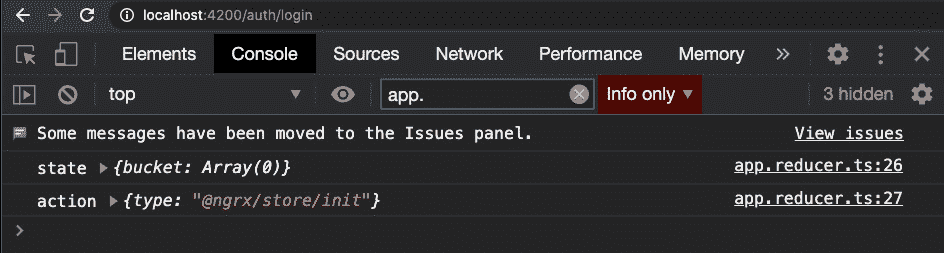
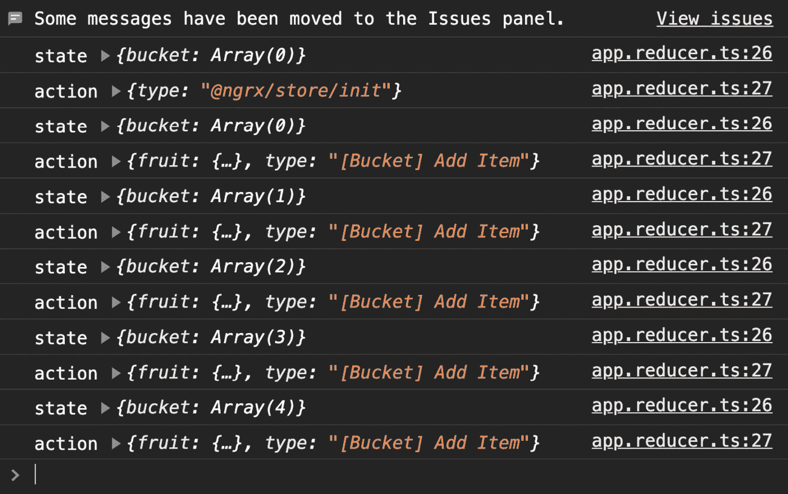
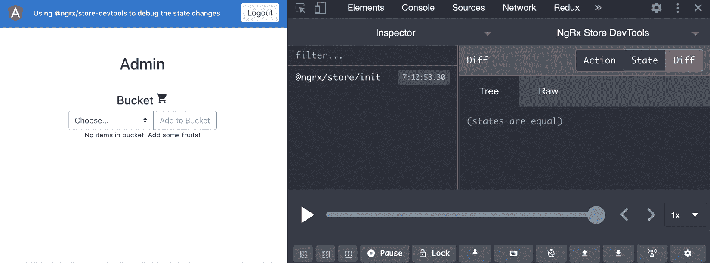
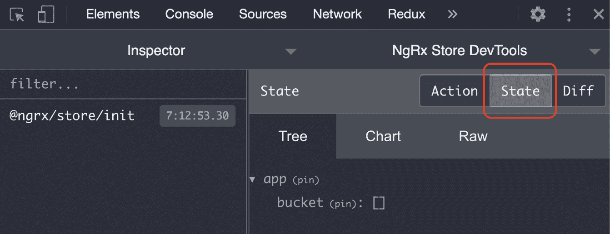
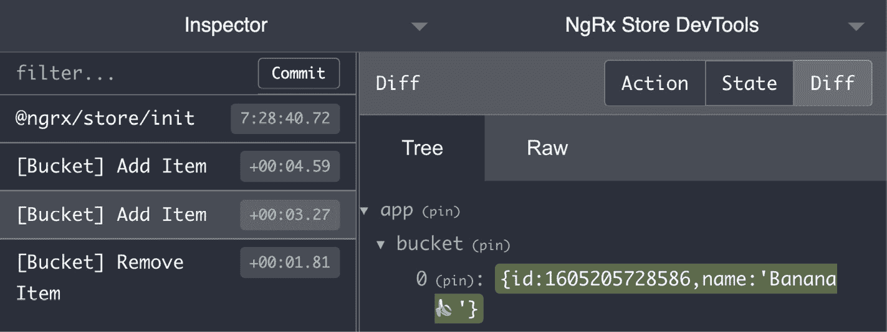
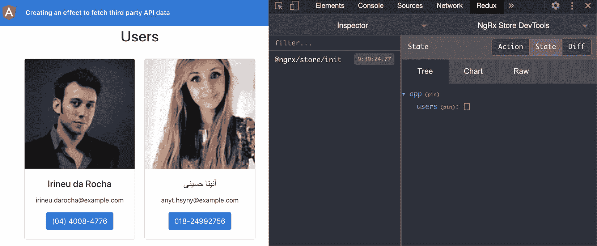
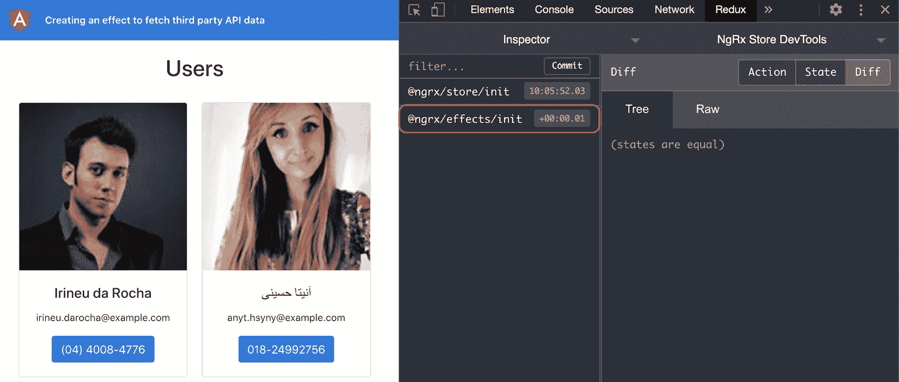
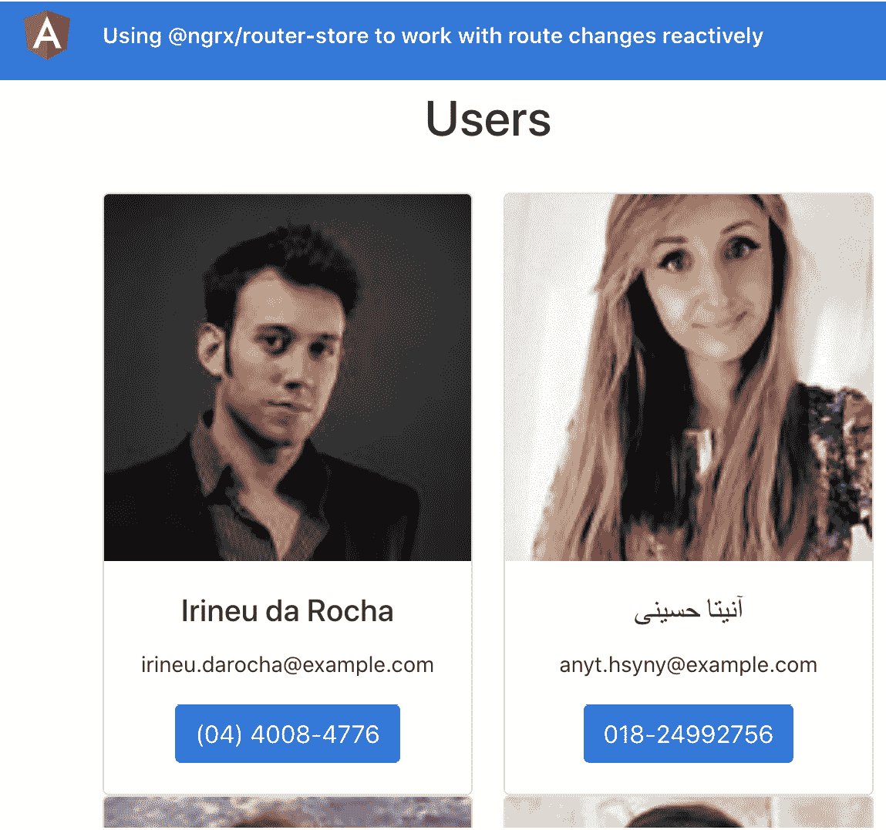
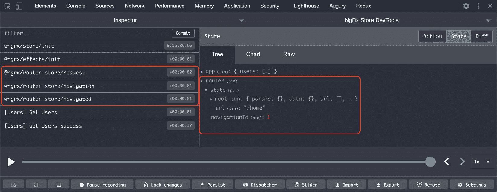

# *第 6 章*：NgRx 的无功状态管理

角度编程和反应式编程是最好的朋友，反应式处理应用程序的状态是应用程序可以做的最好的事情之一。NgRx 是一个框架，它提供了一组库作为 Angular 的被动扩展。在本章中，您将学习如何使用 NgRx 生态系统以反应方式管理应用程序的状态，并且您还将学习 NgRx 生态系统将帮助您完成的一些很酷的事情。

以下是我们将在本章中介绍的食谱：

*   使用 actions 和 reducer 创建您的第一个 NgRx 存储
*   使用`@ngrx/store-devtools`调试状态变化
*   创建获取第三方**应用编程接口**（**API**数据的效果
*   使用选择器从多个组件中的存储中获取数据
*   使用`@ngrx/component-store`进行组件内的本地状态管理
*   利用`@ngrx/router-store`改变工作路线

# 技术要求

对于本章中的配方，请确保您的机器上安装了**Git**和**Node.js**。您还需要安装`@angular/cli`软件包，您可以从终端使用`npm install -g @angular/cli`进行安装。有关本章的代码，请访问 https://github.com/PacktPublishing/Angular-Cookbook/tree/master/chapter06.

# 使用 actions 和 reducer 创建您的第一个 NgRx 商店

在本食谱中，您将通过建立第一家 NgRx 商店来了解 NgRx 的基本知识。您还将创建一些操作以及一个减速机，为了查看减速机中的更改，我们将放入相应的控制台日志中。

## 准备好了吗

我们将要处理的项目位于`chapter06/start_here/ngrx-actions-reducer`中，位于克隆的寄存器内：

1.  在**Visual Studio 代码**（**VS 代码**中打开项目）。
2.  打开终端，运行`npm install`安装项目的依赖项。
3.  完成后，运行`ng serve -o`。

这将在新的浏览器选项卡中打开应用程序。点击**以管理员身份登录**按钮，您将看到以下屏幕：


图 6.1–运行在上的 ngrx 行动减速器应用程序 http://localhost:4200

现在我们已经运行了应用程序，我们将继续进行配方的步骤。

## 怎么做…

我们有一个现有的 Angular 应用程序，我们在之前的配方中也使用过。如果您以管理员用户身份登录，您可以在 bucket 中添加和删除项目。但是，如果您以员工身份登录，则只能添加项目，不能删除项目。现在，我们将开始将 NgRx 集成到应用程序中，并创建一个减速机和一些操作：

1.  Begin by installing the `@ngrx/store package` via **Node Package Manager** (**npm**) in your project. Open Terminal (Mac/Linux) or Command Prompt (Windows), navigate to the project root, and run the following command:

    ```ts
    npm install @ngrx/store@12.0.0 --save
    ```

    如果已经运行了`ng-serve`命令，请确保重新运行该命令。

2.  Update the `app.module.ts` file to include `StoreModule`, as follows:

    ```ts
    ...
    import { StoreModule } from '@ngrx/store';
    @NgModule({
      declarations: [
        AppComponent
      ],
      imports: [
        BrowserModule,
        AppRoutingModule,
        FormsModule,
        BrowserAnimationsModule,
     StoreModule.forRoot({})
      ],
      providers: [],
      bootstrap: [AppComponent]
    })
    export class AppModule { }
    ```

    注意，我们已经将一个空对象`{}`传递给了`forRoot`方法；我们将继续改变这一点。

3.  Now, we'll create some actions. Create a folder named `store` inside the `app` folder. Then, create a file named `app.actions.ts` inside the `store` folder, and finally, add the following code to the newly created file:

    ```ts
    import { createAction, props } from '@ngrx/store';
    import { IFruit } from '../interfaces/fruit.interface';
    export const addItemToBucket = createAction(
     '[Bucket] Add Item',
     props<IFruit>()
    );
    export const removeItemFromBucket = createAction(
     '[Bucket] Remove Item',
     props<IFruit>()
    );
    ```

    既然我们现在已经准备好了动作，我们就必须创建一个减速器。

4.  在`store`文件夹中新建一个文件，将其命名为`app.reducer.ts`，并添加以下代码来定义必要的导入：

    ```ts
    import { Action, createReducer, on } from '@ngrx/store';
    import { IFruit } from '../interfaces/fruit.interface';
    import * as AppActions from './app.actions';
    ```

5.  现在，定义一个`AppState`接口来反映应用程序的状态，定义一个`initialState`变量来反映应用程序启动时的状态。在`app.reducer.ts`文件中添加以下代码：

    ```ts
    import { Action, createReducer, on } from '@ngrx/store';
    import { IFruit } from '../interfaces/fruit.interface';
    import * as AppActions from './app.actions';

    export interface AppState {
     bucket: IFruit[];
    }

    const initialState: AppState = {
     bucket: []
    }
    ```

6.  现在是实际创建减速器的时候了。在`app.reducer.ts`文件中添加以下代码以创建减速机：

    ```ts
    ...
    const initialState: AppState = {
      bucket: []
    }
    const appReducer = createReducer(
     initialState,
     on(AppActions.addItemToBucket, (state, fruit) =>   ({ ...state, bucket: [fruit, ...state.bucket] })),
     on(AppActions.removeItemFromBucket, (state, fruit) => {
     return {
     ...state,
     bucket: state.bucket.filter(bucketItem => {
     return bucketItem.id !== fruit.id;
     }) }
     }),
    );

    export function reducer(state: AppState = initialState, action: Action) {
     return appReducer(state, action);
    }
    ```

7.  我们还将在`reducer`方法中添加一些可爱的小`console.logs`调用，以查看所有动作在控制台上启动。在`app.reducer.ts`文件中添加如下日志：

    ```ts
    export function reducer(state: AppState = initialState, action: Action) {
      console.log('state', state);
     console.log('action', action);
      return appReducer(state, action);
    }
    ```

8.  Finally, let's register this reducer in the `app.module.ts` file using the `StoreModule.forRoot()` method as follows so that we can see things working:

    ```ts
    ...
    import { StoreModule } from '@ngrx/store';
    import * as appStore from './store/app.reducer';
    @NgModule({
      declarations: [
        AppComponent
      ],
      imports: [
        ...
        StoreModule.forRoot({app: appStore.reducer})
      ],
      providers: [],
      bootstrap: [AppComponent]
    })
    export class AppModule { }
    ```

    如果您现在刷新应用程序，应用程序启动后应立即在控制台上看到以下日志：

    

    图 6.2–显示应用程序启动时初始状态和@ngrx/store/init 操作的日志

9.  现在我们可以看到减速机工作了，让我们来调度添加和删除篮子中的项目的操作。为此，在`shared/components/bucket`/`bucket.component.ts`文件中发送如下操作：

    ```ts
    ...
    import { Store } from '@ngrx/store';
    import { AppState } from 'src/app/store/app.reducer';
    import { addItemToBucket, removeItemFromBucket } from 'src/app/store/app.actions';
    export class BucketComponent implements OnInit {
      ...
      constructor(
        private bucketService: BucketService,
     private store: Store<AppState>
      ) { }
      ngOnInit(): void {...}
      addSelectedFruitToBucket() {
    const newItem: IFruit = {
     id: Date.now(),
     name: this.selectedFruit
     }
        this.bucketService.addItem(newItem);
     this.store.dispatch(addItemToBucket(newItem));
      }
      deleteFromBucket(fruit: IFruit) {
        this.bucketService.removeItem(fruit);
     this.store.dispatch(removeItemFromBucket(fruit));
      }
    }
    ```

10.  以管理员身份登录 app，在 bucket 中添加一些项目，然后删除一些项目。您将在控制台上看到如下内容：



图 6.3–显示从 bucket 添加和删除项目的操作的日志

这就是这个食谱的全部内容！您现在知道如何将 NgRx 应用商店集成到 Angular 应用程序中，以及如何创建 NgRx 操作并调度它们。您还知道如何创建减速器、定义其状态，以及如何侦听对已调度的减速器执行的操作。

## 另见

*   NgRx 减速器文件（[https://ngrx.io/guide/store/reducers](https://ngrx.io/guide/store/reducers)
*   NgRx行动文件（[https://ngrx.io/guide/store/actions](https://ngrx.io/guide/store/actions)
*   RxJS 合并运算符文档（[https://www.learnrxjs.io/learn-rxjs/operators/combination/merge](https://www.learnrxjs.io/learn-rxjs/operators/combination/merge)

# 使用@ngrx/store devtools 调试状态变化

在本食谱中，您将学习如何设置并使用`@ngrx/store-devtools`调试应用程序的状态、动作调度以及动作调度时状态的差异。我们将使用我们熟悉的现有应用程序来了解流程。

## 准备好了吗

此配方的项目位于`chapter06/start_here/using-ngrx-store-devtool`：

1.  在 VS 代码中打开项目。
2.  打开终端，运行`npm install`安装项目的依赖项。
3.  Once done, run `ng serve -o`.

    这将在新的浏览器选项卡中打开应用程序。

4.  以管理员用户身份登录，您将看到如下屏幕：


图 6.4–使用运行在上的 ngrx store devtools 应用程序 http://localhost:4200

现在我们已经设置了应用程序，让我们在下一节中查看配方的步骤。

## 怎么做…

我们有一个角度的应用程序，已经集成了`@ngrx/store`包。我们还设置了一个减速器，并在控制台上记录了一些操作，只要您添加或删除一个项目。让我们开始为 ap 配置应用商店开发工具：

1.  按照

    ```ts
    npm install @ngrx/store-devtools@12.0.0 --save
    ```

    包中的`@ngrx/store-devtools`开始安装
2.  现在，更新您的`app.module.ts`文件以包含`StoreDevtoolsModule.instrument`条目，如下所示：

    ```ts
    ...
    import * as appStore from './store/app.reducer';
    import { StoreDevtoolsModule } from '@ngrx/store-devtools';
    @NgModule({
      declarations: [
        AppComponent
      ],
      imports: [
        ...
        StoreModule.forRoot({app: appStore.reducer}),
        StoreDevtoolsModule.instrument({
     maxAge: 25, // Retains last 25 states
     }),
      ],
      providers: [],
      bootstrap: [AppComponent]
    })
    export class AppModule { }
    ```

3.  现在，从[下载 Redux DevTools 扩展 https://github.com/zalmoxisus/redux-devtools-extension/](https://github.com/zalmoxisus/redux-devtools-extension/) 用于您的特定浏览器并安装它。在本书中，我将始终使用 Chrome 浏览器。
4.  Open Chrome DevTools. There should be a new tab named **Redux**. Tap it and refresh the page. You'll see something like this:

    

    图 6.5–显示初始 Redux 操作的 Redux 开发工具

5.  To see the state of the app right now, tap the **State** button, as shown in the following screenshot, and you should see that we have `app > bucket: []` as the current state:

    

    图 6.6–在 Redux DevTools 扩展中查看当前状态

6.  Now, add a cherry 🍒 and a banana 🍌 to the bucket, and then remove the banana 🍌 from the bucket. You should see all the relevant actions being dispatched, as follows:


图 6.7–显示 addItemToBucket 和 removeItemFromBucket 操作的 Redux 开发工具

如果您从状态展开 bucket数组，您将看到它反映了 bucket 的当前状态，如下面的屏幕截图所示：


图 6.8–显示 bucket 当前状态的 Redux DevTools

伟大的您刚刚了解了如何使用 Redux DevTools 扩展查看 NgRx 状态和正在调度的操作。

## 它是如何工作的…

了解 NgRx 是角度和重复频率的组合（使用 RxJS）非常重要。通过使用 Store Devtools 软件包和 Redux Devtools 扩展，我们能够非常轻松地调试应用程序，这有助于我们发现潜在的 bug，预测状态变化，并更加透明地了解`@ngrx/store`软件包中幕后发生的事情。

## 还有更多…

您还可以看到一个动作在应用程序状态中引起的差异。也就是说，当我们发送带有水果的`addItemToBucket`动作时，我们在桶中添加了一个项目，当我们发送`removeItemFromBucket`动作时，我们从桶中移除了一个项目。每种情况见以下截图和*图 6.10*：



图 6.9–addItemToBucket 操作导致将物品添加到桶中

注意*图 6.9*中数据`{id:1605205728586,name:'Banana` `🍌``'}`周围的绿色背景。这表示该状态增加了一个。您可以看到此处描述的`removeItemFromBucket`动作：


图 6.10–从铲斗中移除项目的 removeItemFromBucket 动作

同样，请注意*图 6.10*中数据`{id:16052057285…` `🍌``'}`周围的红色背景和删除线。这表示从状态中删除。

## 另见

*   NgRx 存储设备文档（[https://ngrx.io/guide/store-devtools](https://ngrx.io/guide/store-devtools)

# 创建获取第三方 API 数据的效果

在本食谱中，您将学习如何使用`@ngrx/effects`软件包使用 NgRx 效果。您将创建并注册一个效果，该效果将监听事件。然后，我们将对该操作作出反应以获取第三方 API 数据，作为响应，我们将调度成功或失败操作。这会很有趣的。

## 准备好了吗

该配方的项目位于`chapter06/start_here/using-ngrx-effect`：

1.  在 VS 代码中打开项目。
2.  打开终端，运行`npm install`安装项目的依赖项。
3.  Once done, run `ng serve -o`.

    这将在新的浏览器选项卡中打开应用程序，您将看到该应用程序，如下所示：



图 6.11–使用运行在上的 ngrx effects 应用程序 http://localhost:4200

现在我们已经有了本地运行的应用程序，让我们在下一节中查看配方的步骤。

## 怎么做…

我们有一个名为**主页**页面的单一路线应用程序。在`HomeComponent`类中，我们使用`UserService`发送**超文本传输协议**（**HTTP**）调用以获取用户，然后在浏览器上显示。我们已经集成了`@ngrx/store`和`@ngrx/store-devtools`包，如*图 6.1*所示：

1.  在项目中安装`@ngrx/effects`包，如下所示：

    ```ts
    npm install --save @ngrx/effects@12.0.0
    ```

2.  We'll now create actions to get the users from the HTTP call. We'll have one action to get the users, one to dispatch on successfully getting the users, and one action to dispatch in case we get an error. Add the following code to the `store/app.actions.ts` file:

    ```ts
    import { createAction, props } from '@ngrx/store';
    import { IUser } from '../core/interfaces/user.interface';
    export const APP_ACTIONS = {
     GET_USERS: '[Users] Get Users',
     GET_USERS_SUCCESS: '[Users] Get Users Success',
     GET_USERS_FAILURE: '[Users] Get Users Failure',
    }
    export const getUsers = createAction(
     APP_ACTIONS.GET_USERS,
    );
    export const getUsersSuccess = createAction(
     APP_ACTIONS.GET_USERS_SUCCESS,
     props<{users: IUser[]}>()
    );
    export const getUsersFailure = createAction(
     APP_ACTIONS.GET_USERS_FAILURE,
     props<{error: string}>()
    );
    ```

    现在让我们创建一个效果，这样我们就可以监听`GET_USERS`操作，执行 API 调用，并在成功获取数据的情况下发送成功操作。

3.  在名为`app.effects.ts`的`store`文件夹中创建一个文件，并添加以下代码：

    ```ts
    import { Injectable } from '@angular/core';
    import { Actions, createEffect, ofType } from '@ngrx/effects';
    import { of } from 'rxjs';
    import { map, mergeMap, catchError } from 'rxjs/operators';
    import { UserService } from '../core/services/user.service';
    import { APP_ACTIONS, getUsersFailure, getUsersSuccess } from './app.actions';
    @Injectable()
    export class AppEffects {
     constructor(
     private actions$: Actions,
     private userService: UserService
     ) {}
    }
    ```

4.  我们现在在`app.effects.ts`文件中创建一个新效果，为`GET_USERS`动作注册一个监听器，如下：

    ```ts
    ...
    @Injectable()
    export class AppEffects {
      getUsers$ = createEffect(() =>
        this.actions$.pipe(
          ofType(APP_ACTIONS.GET_USERS),
          mergeMap(() => this.userService.getUsers()
            .pipe(
              map(users => {
                return getUsersSuccess({
                  users
                })
              }),
              catchError((error) => of(getUsersFailure({
                error
              })))
            )
          )
        )
      );
      ...
    }
    ```

5.  We'll now register our effect as the root effects for the app in the `app.module.ts` file, as follows:

    ```ts
    ...
    import { EffectsModule } from '@ngrx/effects';
    import { AppEffects } from './store/app.effects';
    @NgModule({
      declarations: [...],
      imports: [
        ...
        StoreDevtoolsModule.instrument({
          maxAge: 25, // Retains last 25 states
        }),
     EffectsModule.forRoot([AppEffects])
      ],
      providers: [],
      bootstrap: [AppComponent]
    })
    export class AppModule { }
    ```

    一旦我们注册了效果，您就会在 Redux DevTools 扩展中看到一个名为`@ngrx/effects/init`的额外操作，如下所示：

    

    图 6.12–@ngrx/effects/init 操作在应用程序启动时启动

6.  Now that we have the effects listening to the actions, let's dispatch the `GET_USERS` action from the `HomeComponent` class, and we should see the `GET_USERS_SUCCESS` action fired in return on the successful call fetch. Add the following code to dispatch the action from `home/home.component.ts`:

    ```ts
    ...
    import { AppState } from '../store/app.reducer';
    import { Store } from '@ngrx/store';
    import { getUsers } from '../store/app.actions';
    @Component({...})
    export class HomeComponent implements OnInit, OnDestroy {
      users$: Observable<IUser[]>;
      constructor(
        private userService: UserService,
     private store: Store<AppState>
      ) {}
      ngOnInit() {
        this.store.dispatch(getUsers())
        this.users$ = this.userService.getUsers();
      }
      ngOnDestroy() {}
    }
    ```

    如果你现在刷新应用程序，你应该看到`[Users] Get Users`动作被调度，作为回报，`[Users] Get Users Success`动作在成功的 HTTP 调用上被调度：

    

    图 6.13–正在调度的 GET_ 用户和 GET_ 用户成功操作

    注意*图 6.13*中`GET_USERS_SUCCESS`动作发出后`Diff`为空。这是因为到目前为止，我们还没有使用 reducer 更新状态。

7.  Let's update the state in the `app.reducer.ts` file to listen to the `GET_USERS_SUCCESS` action and assign the users to the state accordingly. The code should look like this:

    ```ts
    import { Action, createReducer, on } from '@ngrx/store';
    import { IUser } from '../core/interfaces/user.interface';
    import { getUsersSuccess } from './app.actions';
    export interface AppState {
      users: IUser[];
    }
    const initialState: AppState = {
      users: []
    }
    const appReducer = createReducer(
      initialState,
     on(getUsersSuccess, (state, action) => ({
     ...state,
     users: action.users
     }))
    );
    export function reducer(state: AppState = initialState, action: Action) {
      return appReducer(state, action);
    }
    ```

    如果您现在刷新 app，您应该看到被分配到该状态的用户，如下所示：

    

    图 6.14–GET_USERS_SUCCESS 操作将用户添加到状态

    如果您现在查看应用程序的状态，您应该会看到如下内容：

    

    图 6.15–GET_users_SUCCESS 操作后包含用户的应用程序状态

    现在，我们正在向服务器发送两个调用，一个是通过 effect，另一个是通过直接使用`UserService`实例的`HomeComponent`类的`ngOnInit`方法。让我们从`HomeComponent`类中删除`UserService`。我们现在不会看到任何数据，但这就是我们在下一个配方中要做的。

8.  从`HomeComponent`类中删除`UserService`，您的`home.component.ts`文件现在应该如下所示：

    ```ts
    ...
    @Component({...})
    export class HomeComponent implements OnInit, OnDestroy {
      users$: Observable<IUser[]>;
      constructor(
     private userService: UserService, ← Remove this
        private store: Store<AppState>
      ) {}
      ngOnInit() {
        this.store.dispatch(getUsers());
     this.users$ = this.userService.getUsers();  ← Remove     this
      }
      ngOnDestroy() {}
    }
    ```

伟大的你现在知道如何在你的 Angular 应用程序中使用 NgRx效果。请参阅下一节了解 NgRx 效果的工作原理。

重要提示

我们现在有了一个输出，如图 6.15*所示*——也就是说，即使在存储中设置了用户数据之后，我们也会继续显示加载器。食谱的主要目的是使用`@ngrx/effects`，这已经完成。我们将在下一个配方中显示适当的数据，*使用选择器从多个组件*中的存储中获取数据。

## 它是如何工作的…

为了让 NgRx 特效发挥作用，我们需要安装`@ngrx/effects`包，创建一个特效，并将其注册为`AppModule`类中的特效数组（根特效）。当你创造一个效果时，它必须倾听一个动作。当一个动作从任何组件或甚至从另一个效果发送到存储时，注册的效果将触发，执行您希望它执行的任务，并应发送另一个动作作为回报。对于 API 调用，我们通常有三个操作，即主操作和以下成功和失败操作。理想情况下，在成功操作上（也可能在失败操作上），您希望更新一些状态变量。

## 另见

*   NgRx 效应文件（[https://ngrx.io/guide/effects](https://ngrx.io/guide/effects)

# 使用选择器从多个组件中的存储中获取数据

在前面的配方中，我们创建了一个NgRx 效果，以用户身份获取第三方 API 数据，并将其保存在 Redux 存储中。这就是我们这个食谱的出发点。我们有一个从`api.randomuser.me`获取用户并将其存储在状态的效果，我们目前在**用户界面**（**UI**上没有显示任何内容。在此配方中，您将创建一些 NgRx 选择器，以便在**主页**页面以及**用户详细信息**页面上与类似用户一起显示用户。

## 准备好了吗

此配方的项目位于`chapter06/start_here/using-ngrx-selector`：

1.  在 VS 代码中打开项目。
2.  打开终端，运行`npm install`安装项目的依赖项。
3.  Once done, run `ng serve -o`.

    这将在新的浏览器选项卡中打开应用程序。页面一打开，您就会看到应用程序，如下所示：


图 6.16–使用运行在上的 ngrx 选择器应用程序 http://localhost:4200

现在我们已经有了本地运行的应用程序，让我们在下一节中查看配方的步骤。

## 怎么做…

在这个配方中，我们所要做的就是使用 NgRx 选择器、我们拥有的减速机以及通常的 Redux 状态。简单的豌豆。让我们开始吧！

我们将首先在**主页**页面上显示用户，为此，我们必须创建第一个 NgRx selecto：

1.  Create a new file inside the `store` folder. Name it `app.selectors.ts` and add the following code to it:

    ```ts
    import { createSelector, createFeatureSelector } from '@ngrx/store';
    import { AppState } from './app.reducer';
    export const selectApp = createFeatureSelector<AppState>('app');
    export const selectUsers = createSelector(
      selectApp,
      (state: AppState) => state.users
    );
    ```

    现在我们已经有了选择器，让我们在`HomeComponent`类中使用它。

2.  Modify the `ngOnInit` method in the `home.component.ts` file. It should look like this:

    ```ts
    ...
    import { getUsers } from '../store/app.actions';
    import { selectUsers } from '../store/app.selectors';
    @Component({...})
    export class HomeComponent implements OnInit, OnDestroy {
      ...
      ngOnInit() {
        this.users$ = this.store.select(selectUsers);
        this.store.dispatch(getUsers())
      }
      ngOnDestroy() {}
    }
    ```

    一旦你现在刷新应用程序，你应该能够看到用户。如果你点击任何一个用户，你将导航到用户详细信息，但不会看到任何有价值的日期。页面应如下所示：

    

    图 6.17–无法显示当前用户和类似用户

3.  为了查看当前用户和类似用户，我们将首先在`UserDetailComponent`类中创建两个可观察对象，以便稍后订阅它们各自的商店选择器。将观测值添加到`user-detail.component.ts`文件中，如下所示：

    ```ts
    ...
    import { ActivatedRoute } from '@angular/router';
    import { Observable } from 'rxjs/internal/Observable';
    @Component({...})
    export class UserDetailComponent implements OnInit, OnDestroy {
     user: IUser = null; ← Remove this
      similarUsers: IUser[] = []; ← Remove this
      user$: Observable<IUser> = null; ← Add this
     similarUsers$: Observable<IUser[]> = null; ← Add this
      isComponentAlive: boolean;
      constructor( ) {}
      ngOnInit() {
        this.isComponentAlive = true;
      }
      ngOnDestroy() {
        this.isComponentAlive = false;
      }
    }
    ```

4.  更新`user-detail.component.html`模板以使用新的可观察属性，如下所示：

    ```ts
    <div class="user-detail">
      <div class="main-content user-card">
        <app-user-card *ngIf="user$ | async as user;     else loader" [user]="user"></app-user-card>
      </div>
      <div class="secondary-container">
        <h4>Similar Users</h4>
        <div class="similar-users">
          <ng-container *ngIf="similarUsers$ | async       as similarUsers; else loader">
            <app-user-card class="user-card" *ngFor="let user         of similarUsers" [user]="user"></app-user-card>
          </ng-container>
        </div>
      </div>
    </div>
    ...
    ```

5.  Update the `app.selectors.ts` file to add both the selectors, as follows:

    ```ts
    ...
    import { IUser } from '../core/interfaces/user.interface';
    export const selectUsers = createSelector(...);
    export const selectCurrentUser = (uuid) => createSelector(
     selectUsers,
     (users: IUser[]) => users ? users.find(user => {
     return user.login.uuid === uuid;
     }) : null
    );
    export const selectSimilarUsers = (uuid) => createSelector(
     selectUsers,
     (users: IUser[]) => users ? users.filter(user => {
     return user.login.uuid !== uuid;
     }): null
    );
    ```

    由于我们使用用户的**通用唯一标识符**（**UUID**）导航到**用户详细信息**页面，我们将监听活动路由的`paramsMap`并分配适当的选择器。

6.  首先，将正确的导入添加到`user-detail.component.ts`文件中，如下所示：

    ```ts
    ...
    import { takeWhile } from 'rxjs/operators';
    import { Store } from '@ngrx/store';
    import { AppState } from '../store/app.reducer';
    import { selectCurrentUser, selectSimilarUsers } from '../store/app.selectors';
    import { ActivatedRoute } from '@angular/router';
    ```

7.  Now, in the same `user-detail.component.ts` file, use the `Store` service and update the `ngOnInit` method, as follows:

    ```ts
    @Component({...})
    export class UserDetailComponent implements OnInit, OnDestroy {
      ...
      constructor(
        private route: ActivatedRoute,
     private store: Store<AppState>
      ) {}
      ngOnInit() {
        this.isComponentAlive = true;
        this.route.paramMap.pipe(
     takeWhile(() => !!this.isComponentAlive)
     )
     .subscribe(params => {
     const uuid = params.get('uuid');
     this.user$ = this.store.      select(selectCurrentUser(uuid))
     this.similarUsers$ = this.store.      select(selectSimilarUsers(uuid))
     });
      }
      ...
    }
    ```

    我们将在`UserDetailComponent`类中添加另一个方法，如果用户尚未在应用程序中获取，该方法将获取用户。

8.  将`getUsersIfNecessary`方法添加到`user-detail.component.ts`文件中，如下所示：

    ```ts
    ...
    import { first, takeWhile } from 'rxjs/operators';
    import { Store } from '@ngrx/store';
    import { AppState } from '../store/app.reducer';
    import { selectCurrentUser, selectSimilarUsers, selectUsers } from '../store/app.selectors';
    import { getUsers } from '../store/app.actions';
    @Component({...})
    export class UserDetailComponent implements OnInit, OnDestroy {
      ...
      ngOnInit() {
        …
        this.getUsersIfNecessary();
      }
      getUsersIfNecessary() {
     this.store.select(selectUsers)
     .pipe(
     first ()
     )
     .subscribe((users) => {
     if (users === null) {
     this.store.dispatch(getUsers())
     }
     })
     }
    }
    ```

刷新应用程序…然后砰的一声！您现在可以看到当前的用户以及类似的用户。请参阅下一节以了解其工作原理。

## 它是如何工作的…

在这个配方中，我们已经有了一个 reducer 和一个作为用户获取第三方 API 数据的效果。我们首先为主屏幕的用户创建一个选择器。这很简单，我们只需要创建一个简单的选择器。请注意，减速器的状态如下所示：

```ts
  app: {
    users: []
  }
```

这就是为什么我们首先使用`createFeatureSelector`获取`app`状态，然后使用`createSelector`获取`users`状态。

困难的部分是获取当前用户和类似用户。为此，我们创建了可以将`uuid`作为输入的选择器。然后，我们在`UserDetailComponent`课上听了`uuid`的`paramMap`，一旦它变了，我们就把它取了出来。然后，我们通过将`uuid`传递给选择器，将其与选择器一起使用，以便选择器可以过滤当前用户和类似用户。

最后，我们遇到了一个问题，如果有人直接登录到带有`uuid`的**用户详细信息**页面，他们将看不到任何内容，因为我们不会获取用户。这是因为我们只在主页上获取用户，因此任何直接登录到用户详细信息页面的人都不会触发效果。这就是为什么我们创建了一个名为`getUsersIfNecessary`的方法，这样它就可以检查状态，并在尚未获取用户的情况下获取用户。

## 另见

*   NgRx 选择器文档（[https://ngrx.io/guide/store/selectors](https://ngrx.io/guide/store/selectors)

# 使用@ngrx/组件存储进行组件内的本地状态管理

在本配方中，您将学习如何使用 NgRx 组件存储，以及如何使用它来代替基于推送的 Subject/Behavior Subject 模式，并使用服务在本地维护组件的状态。

请记住，`@ngrx/component-store`是一个独立的库，与`Redux`或`@ngrx/store`等无关。

## 准备好了吗

我们将要处理的项目位于`chapter06/start_here/ngrx-component-store`中，位于克隆的寄存器内：

1.  在 VS 代码中打开项目。
2.  打开终端，运行`npm install`安装项目的依赖项。
3.  完成后，运行`ng serve -o`。

这将在新的浏览器选项卡中打开应用程序。以管理员身份登录，您将看到它，如下所示：


图 6.18–运行在上的 ngrx 组件商店应用程序 http://localhost:4200

现在我们已经在本地运行了应用程序，让我们在下一节中查看配方的步骤。

## 怎么做…

我们有我们最喜欢的 bucket 应用程序，到目前为止我们已经在很多食谱中使用过。当前桶的状态存储在使用`BehaviorSubject`模式的`BucketService`中。我们将用 NgRx 组件商店取代它。开始吧：

1.  通过在项目根目录中运行以下命令将`@ngrx/component-store`包添加到项目的依赖项中：

    ```ts
    npm install @ngrx/component-store@12.0.0 --save
    ```

2.  We first have to make our `BucketService` compatible with a `ComponentStore`. In order to do that, we'll create an interface for the bucket state, extend the `BucketService` from `ComponentStore`, and initialize the service by calling the `super` method. Update the `file services/bucket.service.ts` file, as follows:

    ```ts
    ...
    import { IBucketService } from '../interfaces/bucket-service';
    import { ComponentStore } from '@ngrx/component-store';
    export interface BucketState {
     bucket: IFruit[]
    }
    @Injectable({
      providedIn: 'root'
    })
    export class BucketService extends ComponentStore<BucketState>  implements IBucketService {
      bucketSource = new BehaviorSubject([]);
      bucket$: Observable<IFruit[]> =   this.bucketSource.asObservable();
      constructor() {
        super({
     bucket: []
     })
      }
      ...
    }
    ```

    在我们实际显示来自`ComponentStore`的数据之前，所有这些都没有意义。让我们现在就开始吧。

3.  Modify the `bucket$` Observable to use the `ComponentStore` state rather than relying on the `BehaviorSubject` pattern, as follows:

    ```ts
    ...
    export class BucketService extends ComponentStore<BucketState>  implements IBucketService {
      bucketSource = new BehaviorSubject([]);
     readonly bucket$: Observable<IFruit[]> =   this.select(state => state.bucket);
      constructor() {
        super({
          bucket: []
        })
      }
      ...
    }
    ```

    您可能会看到，所有的 bucket 项都不再显示，或者即使您添加了一个项，它也不会显示。那是因为它仍然需要一些工作。

4.  First, let's make sure that instead of initializing the `bucket` from the Component Store with an empty array, we initialize it with the values from `localStorage`. Just try adding a few items, even if they don't show up yet. Then, modify the `loadItems()` method to use the `setState` method on `BucketService`. The code should look like this:

    ```ts
      loadItems() {
        const bucket = JSON.parse(window.localStorage.    getItem('bucket') || '[]');
        this.bucketSource.next(bucket); ← Remove this
        this.setState({ ← Add this
     bucket
     })
      }
    ```

    请注意，我们已经从代码中删除了`this.bucketSource.next(bucket);`行。这是因为我们不再使用`bucketSource`属性，这是一种`BehaviorSubject`模式。我们将对下一组函数执行相同的操作。

    此外，您现在应该可以看到以前添加但未显示的项目。

5.  Let's replace the `addItem` method in the `BucketService` now so that it updates the state correctly and shows the new items on view, as intended. For this, we'll use the `updater` method of the `ComponentStore` and modify our `addItem` method to be an updater, as follows:

    ```ts
      readonly addItem = this.updater((state, fruit: IFruit)   => {
     const bucket = [fruit, ...state.bucket]
     window.localStorage.setItem('bucket',     JSON.stringify(bucket));
     return ({
     bucket
     })
     });
    ```

    如果您现在添加一个项目，您应该会看到它出现在视图上。

6.  We can now replace the `removeItem` method as well to be an `updater` method in the `BucketService` as well. The code should look like this:

    ```ts
      readonly removeItem = this.updater((state, fruit:   IFruit) => {
     const bucket = state.bucket.filter(item =>     item.id !== fruit.id);
     window.localStorage.setItem('bucket',     JSON.stringify(bucket));
     return ({
     bucket
     })
     });
    ```

    通过此更改，您应该可以看到应用程序正在运行。但是我们确实有一个问题需要解决，那就是`EmployeeService`也需要更新，以使`removeItem`方法成为`updater`方法。

7.  Let's replace the `removeItem` method in the `EmployeeBucketService` to be an `updater` method as well. Modify the `employee/services/employee-bucket.service.ts` file, as follows:

    ```ts
    import { Injectable } from '@angular/core';
    import { IFruit } from 'src/app/interfaces/fruit.interface';
    import { BucketService } from 'src/app/services/bucket.service';
    ...
    export class EmployeeBucketService extends BucketService {
      constructor() {
        super();
      }
      readonly removeItem = this.updater((state, _: IFruit)   => {
     alert('Employees can not delete items');
     return state;
     });
    }
    ```

    瞧！实际上，现在一切都应该很好，而且你不应该看到任何错误。

8.  既然我们已经去掉了名为`bucketSource`的`BucketService`属性中`BehaviorSubject`模式的所有用法，那么我们可以从`BucketService`中删除该属性本身。最后的代码应该如下所示：

    ```ts
    import { Injectable } from '@angular/core';
    import { BehaviorSubject ← Remove this, Observable } from 'rxjs';
    ...
    export class BucketService extends ComponentStore<BucketState>  implements IBucketService {
     bucketSource = new BehaviorSubject([]); ← Remove
      readonly bucket$: Observable<IFruit[]> =   this.select((state) => state.bucket);
      constructor() {
        super({
          bucket: []
        })
      }
    ...
    }
    ```

祝贺你完成了食谱。请参阅下一节以了解其工作原理。

## 它是如何工作的…

如前所述，`@ngrx/component-store`是一个独立的软件包，可以轻松地安装在您的 Angular应用程序中，而无需使用`@ngrx/store`、`@ngrx/effects`等。它应该取代`BehaviorSubject`在角度服务中的使用，这就是我们在这个配方中所做的。我们介绍了如何初始化一个`ComponentStore`以及如何在我们已经有了值而没有访问状态时使用`setState`方法设置初始状态，我们还学习了如何创建`updater`方法来更新状态，因为它们可以访问状态，甚至允许我们为自己的用例传递参数。

## 另见

*   `@ngrx/component-store`文件[https://ngrx.io/guide/component-store](https://ngrx.io/guide/component-store)
*   `@ngrx/component-store`文件（[中的效果 https://ngrx.io/guide/component-store/effect](https://ngrx.io/guide/component-store/effect)

# 使用@ngrx/路由存储对路由更改进行反应性处理

NgRx 非常棒，因为它允许您将数据存储在一个集中的地方。然而，收听路线变化仍然超出了我们到目前为止所讨论的 NgRx 范围。我们确实依赖`ActivatedRoute`服务来观察路由的变化，当我们想要测试这些组件时，`ActivatedRoute`服务就变成了一个依赖项。在此配方中，您将安装`@ngrx/router-store`包，并将学习如何使用包中内置的一些操作来侦听路由更改。

## 准备好了吗

我们将与合作的项目位于`chapter06/start_here/ngrx-router-store`中，位于克隆的寄存器内：

1.  在 VS 代码中打开项目。
2.  打开终端并运行`npm install`来安装项目的依赖项。
3.  Once done, run `ng serve -o`.

    这将在新的浏览器选项卡中打开应用程序，您将看到如下内容：



图 6.19–在上运行的 ngrx 路由商店应用程序 http://localhost:4200

现在应用程序正在运行，请参阅下一节了解配方的步骤。

## 怎么做…

为了利用 NgRx的功率，甚至用于路由变更，我们将利用`@ngrx/router-store`包来监听路由变更。开始吧！

1.  首先，通过在项目根目录中运行以下命令来安装`@ngrx/router-store`包：

    ```ts
    npm install @ngrx/router-store@12.0.0 --save
    ```

2.  Now, import `StoreRouterConnectingModule` and `routerReducer` from the `@ngrx/router-store` package in your `app.module.ts` file and set up the `imports`, as follows:

    ```ts
    ...
    import { StoreRouterConnectingModule, routerReducer } from '@ngrx/router-store';
    @NgModule({
      declarations: [...],
      imports: [
        BrowserModule,
        AppRoutingModule,
        HttpClientModule,
        StoreModule.forRoot({
          app: appStore.reducer,
     router: routerReducer
        }),
     StoreRouterConnectingModule.forRoot(),
        StoreDevtoolsModule.instrument({
          maxAge: 25, // Retains last 25 states
        }),
        EffectsModule.forRoot([AppEffects])
      ],
      providers: [],
      bootstrap: [AppComponent]
    })
    export class AppModule { }
    ```

    一旦您现在刷新应用程序并通过 Redux DevTools 扩展对其进行检查，您应该会看到一些名为`@ngrx/router-store/*`的附加操作也被调度。您还应该看到状态中的`router`属性包含当前路由的信息，如以下屏幕截图所示：

    

    图 6.20–@ngrx/路由存储操作和 ngrx 存储中反映的路由状态

3.  我们现在必须修改我们的 reducer，或者更准确地说，修改`AppState`接口，以反映我们也拥有`@ngrx/router-store`包中的`router`属性。为此，修改`store/app.reducer.ts`文件，如下所示：

    ```ts
    ...
    import { getUsersSuccess } from './app.actions';
    import { RouterReducerState } from '@ngrx/router-store'
    export interface AppState {
      users: IUser[];
     router: RouterReducerState<any>;
    }
    const initialState: AppState = {
      users: null,
     router: null
    }
    ...
    ```

4.  Essentially, we have to get rid of the `ActivatedRoute` service's usage from our `UserDetailComponent` class. In order to do so, we'll first modify our selectors to get the params from the router state directly. Modify the `app.selectors.ts` file, as follows:

    ```ts
    ...
    import { getSelectors, RouterReducerState } from '@ngrx/router-store';
    export const selectApp = createFeatureSelector<AppState>('app');
    export const selectUsers = createSelector(
      selectApp,
      (state: AppState) => state.users
    );
    ...
    export const selectRouter = createFeatureSelector<
     AppState,
     RouterReducerState<any>
    >('router');
    const { selectRouteParam } = getSelectors(selectRouter);
    export const selectUserUUID = selectRouteParam('uuid');
    export const selectCurrentUser = createSelector(
     selectUserUUID,
     selectUsers,
     (uuid, users: IUser[]) => users ? users.find(user => {
     return user.login.uuid === uuid;
     }) : null
    );
    export const selectSimilarUsers = createSelector(
     selectUserUUID,
     selectUsers,
     (uuid, users: IUser[]) => users ? users.filter(user =>   {
     return user.login.uuid !== uuid;
     }): null
    );
    ```

    您现在应该可以在控制台上看到一些错误。这是因为我们更改了`selectSimilarUsers`和`selectCurrentUser`选择器的签名，但它将在下一步修复。

5.  Modify the `user-detail/user-detail.component.ts` file to use the updated selectors correctly, as follows:

    ```ts
    ...
    export class UserDetailComponent implements OnInit, OnDestroy {
      ...
      ngOnInit() {
        ...
        this.route.paramMap.pipe(
          takeWhile(() => !!this.isComponentAlive)
        )
        .subscribe(params => {
          const uuid = params.get('uuid');
          this.user$ = this.store.select(selectCurrentUser)
          this.similarUsers$ = this.store.      select(selectSimilarUsers)
        })
      }
      ...
    }
    ```

    这个更改应该已经解决了控制台上的错误，并且你应该看到应用程序在上运行得非常好，即使我们不再从`UserDetailComponent`类传递任何`uuid`。

6.  通过上一步的修改，我们现在可以安全地从`UserDetailComponent`类中删除`ActivatedRoute`服务的使用，代码应该如下所示：

    ```ts
    ...
    import { Observable } from 'rxjs/internal/Observable';
    import { first } from 'rxjs/operators';
    import { Store } from '@ngrx/store';
    ...
    export class UserDetailComponent implements OnInit, OnDestroy {
      ...
      constructor(
     private store: Store<AppState>
    ) {}
      ngOnInit() {
        this.isComponentAlive = true;
        this.getUsersIfNecessary();
        this.user$ = this.store.select(selectCurrentUser)
     this.similarUsers$ = this.store.    select(selectSimilarUsers)
      }
      ...
    }
    ```

呜呼！你现在已经完成了食谱。请参阅下一节了解其工作原理。

## 它是如何工作的…

`@ngrx/router-store`是一个神奇的软件包，它通过 NgRx 让我们的开发变得更加容易。您看到了我们如何使用包中的选择器将`ActivatedRoute`服务从`UserDetailComponent`类中完全删除。本质上，这有助于我们在选择器中获得正确的**路由参数**，我们可以在选择器中使用它来获取和过滤适当的数据。在场景背后，软件包监听整个 Angular 应用程序中的路由变化，并从路由本身获取。然后，它将相应的信息存储在 NgRx 存储中，使其保持在 Redux 状态，并可通过软件包提供的选择器轻松选择。在我看来，这太可怕了！我之所以这样说，是因为该一揽子计划正在完成我们必须完成的所有繁重工作。因此，我们的`UserDetailComponent`类现在只依赖`Store`服务，这使得测试更加容易，因为依赖性更少。

## 另见

*   `@ngrx/router-store`文件[https://ngrx.io/guide/router-store/](https://ngrx.io/guide/router-store/)