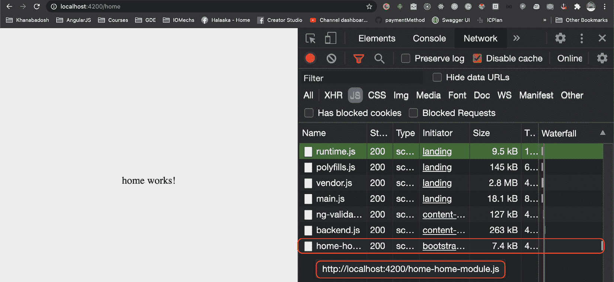
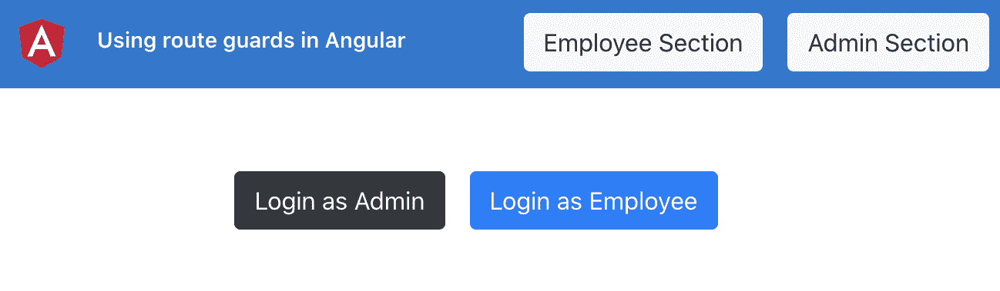
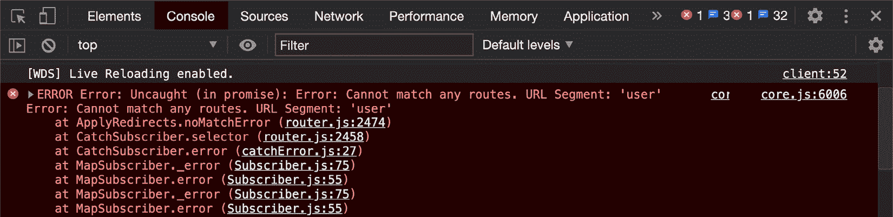
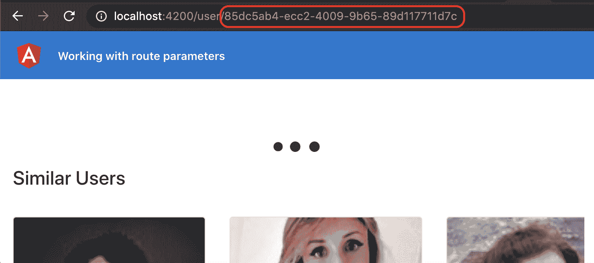
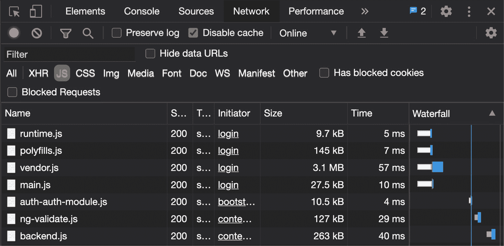
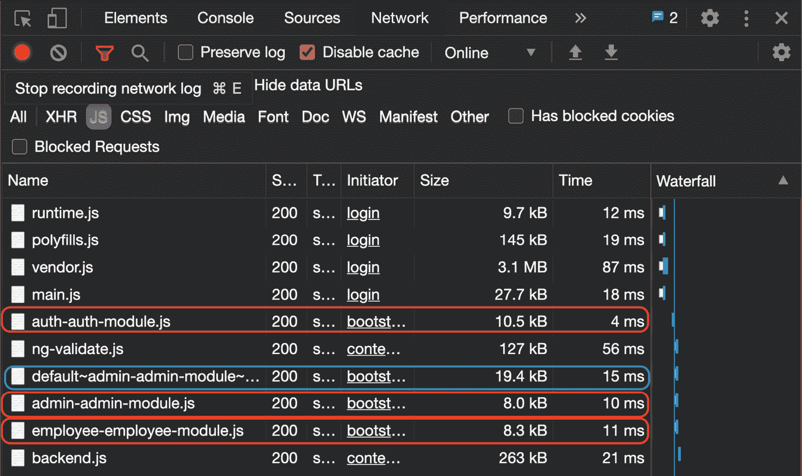
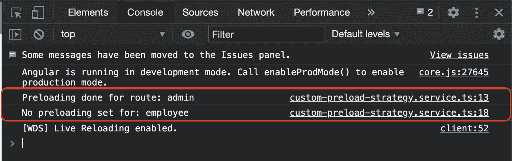

# 七、了解 Angular 导航和路由

Angular 最令人惊奇的一点是，它是一个完整的生态系统（一个框架），而不是一个库。在这个生态系统中，Angular路由是学习和理解的最关键的模块之一。在本章中，您将学习一些非常酷的技术，这些技术涉及到Angular导航中的路由和导航。您将了解如何保护路由、侦听路由更改以及配置路由更改的全局操作。

以下是我们将在本章中介绍的食谱：

*   使用 CLI 创建具有路由的 Angular 应用程序和模块
*   功能模块和延迟加载的路由
*   使用路线警卫对路线的授权访问
*   使用路线参数
*   显示路由更改之间的全局加载程序
*   预加载路径策略

## 技术要求

对于本章中的配方，请确保您的机器上安装了**Git**和**Node.js**。您还需要安装`@angular/cli`软件包，您可以从终端使用`npm install -g @angular/cli`进行安装。本章代码见[https://github.com/PacktPublishing/Angular-Cookbook/tree/master/chapter07](https://github.com/PacktPublishing/Angular-Cookbook/tree/master/chapter07) 。

# 使用 CLI 创建带有路线的 Angular 应用程序

如果你问我 7-8 年前我们是如何为web 应用程序创建项目的，你会惊讶地发现这有多么困难。幸运的是，这些工具和标准在软件开发行业已经得到了发展，当涉及到Angular时，启动一个项目是非常容易的。您甚至可以在开箱即用的情况下配置不同的东西。在此配方中，您将使用 Angular CLI 创建新的 Angular 项目，并在创建项目时启用路由配置。

## 准备好了吗

我们将要处理的项目没有启动文件。因此，您可以从克隆的存储库中直接将`chapter07/start_here`文件夹打开到 Visual Studio 代码应用程序中。

## 怎么做…

我们将首先使用 Angular CLI 创建应用程序。它将启用开箱即用的路由。类似地，接下来，我们还将创建一些带有组件的功能模块，但是它们将急切地加载路由。那么，让我们开始：

1.  First, open the terminal and make sure you're inside the `chapter07/start_here` folder. Once inside, run the following command:

    ```ts
    ng new basic-routing-app --routing --style scss
    ```

    该命令应为您创建一个新的 Angular 应用程序，启用路由并选择 SCS 作为您的样式选择。

2.  运行以下命令在浏览器中打开应用程序：

    ```ts
    cd basic-routing app
    ng serve -o
    ```

3.  现在，让我们通过运行以下命令创建一个名为`landing`的顶级组件：

    ```ts
    ng g c landing
    ```

4.  删除`app.component.html`中的所有内容，仅保留`router-outlet`，如下所示：

    ```ts
    <router-outlet></router-outlet>
    ```

5.  我们现在将把`LandingComponent`添加到`app-routing.module.ts`文件中，使其成为默认路由，如下所示：

    ```ts
    import { NgModule } from '@angular/core';
    import { Routes, RouterModule } from '@angular/router';
    import { LandingComponent } from './landing/landing.component';
    const routes: Routes = [{
     path: '',
     redirectTo: 'landing',
     pathMatch: 'full'
    }, {
     path: 'landing',
     component: LandingComponent
    }];
    ...
    ```

6.  刷新页面，当应用重定向到默认路径时，你会看到 URL 自动变为`http://localhost:4200/landing`。
7.  将`landing.component.html`的内容替换为以下代码：

    ```ts
    <div class="landing">
      <div class="landing__header">
        <div class="landing__header__main">
          Creating an Angular app with routes using CLI
        </div>
        <div class="landing__header__links">
          <div class="landing__header__links__link">
            Home
          </div>
          <div class="landing__header__links__link">
            About
          </div>
        </div>
      </div>
      <div class="landing__body">
        Landing Works
      </div>
    </div>
    ```

8.  现在，在`landing.component.scss`文件中为头添加一些样式，如下所示：

    ```ts
    .landing {
      display: flex;
      flex-direction: column;
      height: 100%;
      &__header {
        height: 60px;
        padding: 0 20px;
        background-color: #333;
        color: white;
        display: flex;
        align-items: center;
        justify-content: flex-end;
        &__main {
          flex: 1;
        }
      }
    }
    ```

9.  为头中的链接添加样式如下：

    ```ts
    .landing {
      ...
      &__header {
        ...
        &__links {
     padding: 0 20px;
     display: flex;
     &__link {
     margin-left: 16px;
     &:hover {
     color: #ececec;
     cursor: pointer;
     }
     }
     }
      }
    }
    ```

10.  此外，在`&__header`选择器后添加登录页面主体的样式，如所示：

    ```ts
    .landing {
      ...
      &__header {
       ...
      }
      &__body {
     padding: 30px;
     flex: 1;
     display: flex;
     justify-content: center;
     background-color: #ececec;
     }
    }
    ```

11.  最后，为了让一切看起来更好，在`styles.scss`文件中添加以下样式：

    ```ts
    html, body {
      width: 100%;
      height: 100%;
      margin: 0;
      padding: 0;
    }
    ```

12.  现在，通过在项目根目录中运行以下命令，为`home`和`about`路由添加功能模块：

    ```ts
    ng g m home
    ng g c home
    ng g m about
    ng g c about
    ```

13.  接下来，在您的`app.module.ts`文件中导入`HomeModule`和`AboutModule`，如下所示：

    ```ts
    ...
    import { LandingComponent } from './landing/landing.component';
    import { HomeModule } from './home/home.module';
    import { AboutModule } from './about/about.module';
    @NgModule({
      declarations: [...],
      imports: [
        BrowserModule,
        AppRoutingModule,
     HomeModule,
     AboutModule
      ],
      providers: [],
      bootstrap: [AppComponent]
    })
    export class AppModule { }
    ```

14.  现在，我们可以配置路由。将`app-routing.module.ts`文件修改为添加相应的路由如下：

    ```ts
    import { NgModule } from '@angular/core';
    import { Routes, RouterModule } from '@angular/router';
    import { AboutComponent } from './about/about.component';
    import { HomeComponent } from './home/home.component';
    import { LandingComponent } from './landing/landing.component';
    const routes: Routes = [{
      path: '',
      redirectTo: 'landing',
      pathMatch: 'full'
    }, {
      path: 'landing',
      component: LandingComponent
    }, {
     path: 'home',
     component: HomeComponent
    }, {
     path: 'about',
     component: AboutComponent
    }];
    ...
    ```

15.  我们可以在一点时间内设计出我们的`Home`和`About`组件。将下面的CSS 添加到的`home.component.scss`文件和`about.component.scss`文件中：

    ```ts
    :host {
      display: flex;
      width: 100%;
      height: 100%;
      justify-content: center;
      align-items: center;
      background-color: #ececec;
      font-size: 24px;
    }
    ```

16.  现在，我们可以将链接绑定到登录页中的相应路由。修改`landing.component.html`如下：

    ```ts
    <div class="landing">
      <div class="landing__header">
        <div class="landing__header__links">
          <div class="landing__header__links__link"       routerLink="/home">
            Home
          </div>
          <div class="landing__header__links__link"       routerLink="/about">
            About
          </div>
        </div>
      </div>
      <div class="landing__body">
        Landing Works
      </div>
    </div>
    ```

令人惊叹的在几分钟内，借助令人惊叹的 Angular CLI 和 Angular router，我们能够创建一个登录页、两个功能模块和功能路由（尽管我们迫不及待地加载），并设计了一些东西。现代网络的奇迹！

既然您已经了解了基本路由是如何实现的，请参阅下一节了解其工作原理。

## 它是如何工作的…

当我们在创建应用程序或创建模块时使用`--routing`参数时，Angular CLI 会自动创建一个名为`<your module>-routing.module.ts`的模块文件。该文件基本上包含一个路由模块。在这个配方中，我们只是创建了功能模块，没有路由，以保持实现更简单、更快。在下一个配方中，您还将了解模块内的路由。无论如何，由于我们已经创建了急切地加载的功能模块，这意味着所有功能模块的所有 JavaScript 都会在应用加载后立即加载。您可以查看 Chrome DevTools 中的**网络**选项卡，查看`main.js`文件的内容，因为它包含了我们所有的组件和模块。请参见以下截图，其中显示了`main.js`文件中的`AboutComponent`和`HomeComponent`代码：


图 7.1–包含 AboutComponent 和 HomeComponent 代码的 main.js

由于我们已经确定配方中的所有组件都被急切地加载到 app start 上，因此有必要了解这是因为我们在`AppModule`的`imports`数组中导入了`HomeModule`和`AboutModule`。

## 另见

*   Angular路由文件（[https://angular.io/guide/router](https://angular.io/guide/router)

# 功能模块和延迟加载的路由

在上一个配方中，我们学习了如何创建一个基本的路由应用程序，其中包含急切加载的路由。在本食谱中，您将学习如何使用功能模块，以便在应用程序加载时延迟加载功能模块，而不是加载功能模块。对于这个配方，我们假设我们已经准备好了路由，我们只需要惰性地加载它们。

## 准备好了吗

此配方的项目位于`chapter07/start_here/lazy-loading-modules`：

1.  在 Visual Studio 代码中打开项目。
2.  打开终端，运行`npm install`安装项目的依赖项。
3.  Once done, run `ng serve -o`.

    这将在新的浏览器选项卡中打开应用程序，您将看到应用程序，如下所示：


图 7.2–在应用程序上运行的延迟加载模块 http://localhost:4200

现在我们已经有了本地运行的应用程序，让我们在下一节中查看配方的步骤。

## 怎么做…

如*图 7.2*所示，我们在`main.js`文件中有所有的组件和模块。因此，`main.js`文件的大小约为 23.4KB。我们将修改代码和路由结构以实现延迟加载。因此，当我们实际导航到路由时，将加载路由的特定文件：

1.  First, we have to make our target modules capable of being lazily loaded. For that, we'll have to create a `<module>-routing.module.ts` file for both `AboutModule` and `HomeModule`. So, let's create a new file in both the `about` and `home` folders:

    a） 将第一个文件命名为`about-routing.module.ts`并添加以下代码：

    ```ts
    // about-routing.module.ts
    import { NgModule } from '@angular/core';
    import { Routes, RouterModule } from '@angular/router';
    import { AboutComponent } from './about.component';
    const routes: Routes = [{
     path: '',
     component: AboutComponent
    }];
    @NgModule({
     imports: [RouterModule.forChild(routes)],
     exports: [RouterModule]
    })
    export class AboutRoutingModule { }
    ```

    b） 将第二个文件命名为`home-routing.module.ts`，并添加以下代码：

    ```ts
    // home-routing.module.ts
    import { NgModule } from '@angular/core';
    import { Routes, RouterModule } from '@angular/router';
    import { HomeComponent } from './home.component';
    const routes: Routes = [{
     path: '',
     component: HomeComponent
    }];
    @NgModule({
     imports: [RouterModule.forChild(routes)],
     exports: [RouterModule]
    })
    export class HomeRoutingModule { }
    ```

2.  Now, we'll add these routing modules to the appropriate modules, that is, we'll import `HomeRoutingModule` in `HomeModule` as follows:

    ```ts
    // home.module.ts
    import { NgModule } from '@angular/core';
    import { CommonModule } from '@angular/common';
    import { HomeComponent } from './home.component';
    import { HomeRoutingModule } from './home-routing.module';
    @NgModule({
      declarations: [HomeComponent],
      imports: [
        CommonModule,
     HomeRoutingModule
      ]
    })
    export class HomeModule { }
    ```

    在`AboutModule`中增加`AboutRoutingModule`如下：

    ```ts
    // about.module.ts
    import { NgModule } from '@angular/core';
    import { CommonModule } from '@angular/common';
    import { AboutComponent } from './about.component';
    import { AboutRoutingModule } from './about-routing.module';
    @NgModule({
      declarations: [AboutComponent],
      imports: [
        CommonModule,
     AboutRoutingModule
      ]
    })
    export class AboutModule { }
    ```

3.  我们的模块现在可以延迟加载。我们现在只需要加载它们。为此，我们需要修改`app-routing.module.ts`并更改我们的配置，以便在`about`和`home`路线上使用 ES6 导入，如下所示：

    ```ts
    import { NgModule } from '@angular/core';
    import { Routes, RouterModule } from '@angular/router';
    import { LandingComponent } from './landing/landing.component';
    const routes: Routes = [{
      path: '',
      redirectTo: 'landing',
      pathMatch: 'full'
    }, {
      path: 'landing',
      component: LandingComponent
    }, {
      path: 'home',
     loadChildren: () => import('./home/home.module').then   (m => m.HomeModule)
    }, {
      path: 'about',
     loadChildren: () => import('./about/about.module').  then(m => m.AboutModule)
    }];
    @NgModule({
      imports: [RouterModule.forRoot(routes)],
      exports: [RouterModule]
    })
    export class AppRoutingModule { }
    ```

4.  Finally, we will remove the `AboutModule` and `HomeModule` imports from the `imports` array of `AppModule` so that we get the desired code-splitting out of the box. The content of `app.module.ts` should look as follows:

    ```ts
    import { BrowserModule } from '@angular/platform-browser';
    import { NgModule } from '@angular/core';
    import { AppRoutingModule } from './app-routing.module';
    import { AppComponent } from './app.component';
    import { LandingComponent } from './landing/landing.component';
    import { HomeModule } from './home/home.module'; ← Remove
    import { AboutModule } from './about/about.module'; ← Remove
    @NgModule({
      declarations: [
        AppComponent,
        LandingComponent
      ],
      imports: [
        BrowserModule,
        AppRoutingModule,
     HomeModule, ← Remove
     AboutModule ← Remove
      ],
      providers: [],
      bootstrap: [AppComponent]
    })
    export class AppModule { }
    ```

    刷新应用程序，您将看到`main.js`文件的捆绑大小已降至 18.1KB，而之前约为 23.4KB。请参见以下截图：


图 7.3–应用程序加载时 main.js 的缩减大小

但是家和路线呢？那么延迟加载呢？好的，点击头部的**主**路由，您将看到一个新的 JavaScript 文件正在**网络**选项卡中专门为该路由下载。这是懒惰的行动加载！请参见以下截图：



图 7.4-延迟加载的回家路线

太棒了！你变得懒惰了！只是开玩笑。你刚刚学会了在 Angular 应用程序中缓慢加载路线和功能模块的艺术。你现在也可以向你的朋友炫耀这一点。

## 它是如何工作的…

Angular 与模块一起工作，通常将功能分解为模块。正如我们所知，`AppModule`作为 Angular 应用程序的入口点，Angular 将在构建过程中导入并绑定`AppModule`中导入的任何内容，从而生成`main.js`文件。但是，如果我们想延迟加载我们的路由/功能模块，我们需要避免直接在`AppModule`中导入功能模块，而是使用`loadChildren`方法为我们的路由按需加载功能模块。这就是我们在这个食谱中所做的。值得注意的是`AppRoutingModule`中的路线保持不变。然而，我们不得不将`path: ''`放在我们的功能路由模块中，因为这将结合`AppRoutingModule`中的路由，然后再放在功能路由模块中，成为`AppRoutingModule`中定义的路由。这就是为什么我们的路线仍然是`'about'`和`'home'`。

## 另见

*   Angular（[中的延迟加载模块https://angular.io/guide/lazy-loading-ngmodules](https://angular.io/guide/lazy-loading-ngmodules)

# 使用路线警卫进入路线的授权权限

你的 Angular 应用程序中的所有路线都不应该被世界上的每个人访问。在本食谱中，我们将学习如何在 Angular 中创建路由防护，以防止未经授权访问路由。

## 准备好了吗

此配方的项目位于`chapter07/start_here/using-route-guards`：

1.  在 Visual Studio 代码中打开项目。
2.  打开终端，运行`npm install`安装项目的依赖项。
3.  Once done, run `ng serve -o`.

    这将在新的浏览器选项卡中打开应用程序，您将看到应用程序，如下所示：



图 7.5-使用运行在上的 route guards 应用程序 http://localhost:4200

现在我们已经有了本地运行的应用程序，让我们在下一节中查看配方的步骤。

## 怎么做…

我们有一个应用程序，已经设置了几条路线。您可以以员工或管理员身份登录以获取应用程序的存储桶列表。但是，如果您点击标题中的两个按钮中的任何一个，您将看到即使未登录也可以导航到“管理”和“员工”部分。这是我们想要阻止的事情。注意在`auth.service.ts`文件中，我们已经有了用户登录的方法，我们可以使用`isLoggedIn()`方法检查用户是否登录：

1.  First, let's create a route guard that will only allow the user to go to the particular routes if the user is logged in. We'll name it `AuthGuard`. Let's create it by running the following command in the project root:

    ```ts
    ng g guard guards/Auth
    ```

    一旦命令运行，您应该能够看到一些选项来选择我们想要实现的接口。

2.  选择`CanActivate`界面，按*键进入*键。
3.  现在，在`auth.guard.ts`文件中添加以下逻辑，检查用户是否登录，如果用户未登录，我们会将用户重定向到登录页面，即`'/auth'`路由：

    ```ts
    import { Injectable } from '@angular/core';
    import { CanActivate, ActivatedRouteSnapshot, RouterStateSnapshot, UrlTree, Router } from '@angular/router';
    import { Observable } from 'rxjs';
    import { AuthService } from '../services/auth.service';
    @Injectable({
      providedIn: 'root'
    })
    export class AuthGuard implements CanActivate {
     constructor(private auth: AuthService, private router:   Router) {  }
      canActivate(
        route: ActivatedRouteSnapshot,
        state: RouterStateSnapshot): Observable<boolean |     UrlTree> | Promise<boolean | UrlTree> | boolean |     UrlTree {
          const loggedIn = !!this.auth.isLoggedIn();
     if (!loggedIn) {
     this.router.navigate(['/auth']);
     return false;
     }
        return true;
      }
    }
    ```

4.  Now, let's apply `AuthGuard` to our Admin and Employee routes in the `app-routing.module.ts` file, as follows:

    ```ts
    ...
    import { AuthGuard } from './guards/auth.guard';
    const routes: Routes = [{...}, {
      path: 'auth',
      loadChildren: () => import('./auth/auth.module').then   (m => m.AuthModule)
    }, {
      path: 'admin',
      loadChildren: () => import('./admin/admin.module').  then(m => m.AdminModule),
     canActivate: [AuthGuard]
    }, {
      path: 'employee',
      loadChildren: () => import('./employee/employee.  module').then(m => m.EmployeeModule),
     canActivate: [AuthGuard]
    }];
    ...
    export class AppRoutingModule { }
    ```

    如果您现在注销并尝试点击标题中的**员工区**或**管理区**按钮，您会注意到，在登录之前，您现在无法进入路线。如果您尝试在地址栏中直接输入路由的 URL 并点击*输入*，情况也是如此。

5.  现在我们将尝试创建一个守卫，一个用于员工路由，另一个用于管理路由。依次运行以下命令，选择两个守卫的`CanActivate`界面：

    ```ts
    ng g guard guards/Employee
    ng g guard guards/Admin
    ```

6.  既然我们已经创建了守卫，那么让我们先把`AdminGuard`的逻辑放在第一位。我们将尝试查看登录的用户类型。如果它是管理员，那么我们允许导航，否则我们阻止它。将以下代码添加到`admin.guard.ts`：

    ```ts
    ...
    import { UserType } from '../constants/user-type';
    import { AuthService } from '../services/auth.service';
    ...
    export class AdminGuard implements CanActivate {
     constructor(private auth: AuthService) {}
      canActivate(
        route: ActivatedRouteSnapshot,
        state: RouterStateSnapshot): Observable<boolean |     UrlTree> | Promise<boolean | UrlTree> | boolean |     UrlTree {
        return this.auth.loggedInUserType === UserType.Admin;
      }
    }
    ```

7.  Add `AdminGuard` to the Admin route in `app-routing.module.ts` as follows:

    ```ts
    ...
    import { AdminGuard } from './guards/admin.guard';
    import { AuthGuard } from './guards/auth.guard';
    const routes: Routes = [{
      path: '',
     ...
    }, {
      path: 'auth',
     ...
    }, {
      path: 'admin',
      loadChildren: () => import('./admin/admin.module').  then(m => m.AdminModule),
      canActivate: [AuthGuard, AdminGuard]
    }, {
      path: 'employee',
      ...
    }];
    ...
    ```

    现在尝试注销并以员工身份登录。然后试着点击标题中的**管理部分**按钮。您会注意到，您不能再转到存储桶列表的管理部分。这是因为我们有`AdminGuard`到位，而您现在没有以管理员身份登录。以管理员身份登录应该可以正常工作。

8.  类似地，我们将在`employee.guard.ts`中添加以下代码：

    ```ts
    ...
    import { UserType } from '../constants/user-type';
    import { AuthService } from '../services/auth.service';
    @Injectable({
      providedIn: 'root'
    })
    export class EmployeeGuard implements CanActivate {
     constructor(private auth: AuthService) {}
      canActivate(
        route: ActivatedRouteSnapshot,
        state: RouterStateSnapshot): Observable<boolean |     UrlTree> | Promise<boolean | UrlTree> | boolean |     UrlTree {
        return this.auth.loggedInUserType === UserType.    Employee;
      } 
    }
    ```

9.  Now, add `EmployeeGuard` to the Employee route in `app-routing.module.ts` as follows:

    ```ts
    ...
    import { EmployeeGuard } from './guards/employee.guard';
    const routes: Routes = [
      ...
    , {
      path: 'employee',
      loadChildren: () => import('./employee/employee.  module').then(m => m.EmployeeModule),
      canActivate: [AuthGuard, EmployeeGuard]
    }];
    ...
    ```

    现在，通过检查登录的用户类型，只能访问适当的路由。

伟大的你现在是守卫路线的授权专家。权力大，责任大。明智地使用它。

## 它是如何工作的…

route guards 的`CanActivate`接口是我们配方的核心，因为它对应于 Angular 中的每个 route 都可以有一个路由定义的`CanActivate`属性的 guards 数组。应用保护时，应该返回布尔值或`UrlTree`。我们重点讨论了布尔值在配方中的用法。我们可以直接使用承诺返回布尔值，甚至使用可观察值。这使得防护装置在使用远程数据时非常灵活。无论如何，对于我们的配方，我们通过检查用户是否登录（针对`AuthGuard`），以及检查预期类型的用户是否登录特定路线（`AdminGuard`和`EmployeeGuard`），使其易于理解。

## 另见

*   防止角路由中的未授权访问（[https://angular.io/guide/router#preventing-未经授权的访问](https://angular.io/guide/router#preventing-unauthorized-access)

# 使用路线参数

无论是使用 Node.js 构建REST API，还是在 Angular 中配置路由，设置路由都是一门绝对的艺术，尤其是在使用参数时。在本配方中，您将创建一些带有参数的路由，并将学习在路由激活后如何在组件中获取这些参数。

## 准备好了吗

此配方的项目位于`chapter07/start_here/working-with-route-params`：

1.  在 Visual Studio 代码中打开项目。
2.  打开终端，运行`npm install`安装项目的依赖项。
3.  Once done, run `ng serve -o`.

    这将在新的浏览器选项卡中打开应用程序。页面一打开，您就会看到一个用户列表。

4.  点击第一个用户，您将看到以下视图：


图 7.6–未提供正确用户的用户详细信息

现在我们已经有了本地运行的应用程序，让我们在下一节中查看配方的步骤。

## 怎么做…

现在的问题是，我们有一个打开用户详细信息的路径，但我们在`UserDetailComponent`中不知道单击了哪个用户，即从服务中获取哪个用户。因此，我们将实现路由参数，将用户 ID（`uuid`）从主页传递到用户详细信息页面：

1.  First, we have to make our user route capable of accepting the route parameter named `uuid`. This is going to be a **required** parameter, which means the route will not work without passing this. Let's modify `app-routing.module.ts` to add this required parameter to the route definition, as follows:

    ```ts
    ...
    import { UserDetailComponent } from './user-detail/user-detail.component';
    const routes: Routes = [
      ...
    , {
      path: 'user/:uuid',
      component: UserDetailComponent
    }];
    ...
    ```

    通过此更改，在主页上单击用户将不再有效。如果您尝试，您将看到如下错误，这是因为`uuid`是必需的参数：

    

    图 7.7–无法匹配请求的路线

2.  The fix is easy for the error; we need to pass the `uuid` when navigating to the user route. Let's do this by modifying the `user-card.component.ts` file as follows:

    ```ts
    import { Component, Input, OnInit } from '@angular/core';
    import { Router } from '@angular/router';
    import { IUser } from '../../interfaces/user.interface';
    @Component({
      selector: 'app-user-card',
      templateUrl: './user-card.component.html',
      styleUrls: ['./user-card.component.scss']
    })
    export class UserCardComponent implements OnInit {
      @Input('user') user: IUser;
      constructor(private router: Router) { }
      ngOnInit(): void {
      }
      cardClicked() {
        this.router.navigate(['    /user/${this.user.login.uuid}'])
      }
    }
    ```

    我们现在可以导航到特定用户的路线，您还应该可以在地址栏中看到 UUID，如下所示：

    

    图 7.8–地址栏中显示的 UUID

3.  要从`UserService`中获取当前用户，需要获取`UserDetailComponent`中的`uuid`值。现在我们在`UserDetailComponent`调用`UserService`的`getUser`方法时发送`null`。为了使用用户 ID，我们可以通过导入`ActivatedRoute`服务从路由参数中获取`uuid`值。更新`user-detail.component.ts`如下：

    ```ts
    ...
    import { ActivatedRoute } from '@angular/router';
    ...
    export class UserDetailComponent implements OnInit, OnDestroy {
      user: IUser;
      similarUsers: IUser[];
      constructor(
        private userService: UserService,
     private route: ActivatedRoute
      ) {}
      ngOnInit() {
        ...
      }
      ngOnDestroy() {
      }
    }
    ```

4.  我们将在`UserDetailComponent`中创建一个名为`getUserAndSimilarUsers`的新方法，并将代码从`ngOnInit`方法移动到新方法中，如下所示：

    ```ts
    ...
    export class UserDetailComponent implements OnInit, OnDestroy {
      ...
      ngOnInit() {
        const userId = null;
        this.getUserAndSimilarUsers(userId);
      }
      getUserAndSimilarUsers(userId) {
     this.userService.getUser(userId)
     .pipe(
     mergeMap((user: IUser) => {
     this.user = user;
     return this.userService.          getSimilarUsers(userId);
     })
     ).subscribe((similarUsers: IUser[]) => {
     this.similarUsers = similarUsers;
     })
     }
      ...
    }
    ```

5.  现在我们已经对代码进行了一些重构，让我们尝试使用`ActivatedRoute`服务从路由参数访问`uuid`，并将其传递到我们的`getUserAndSimilarUsers`方法中，如下所示：

    ```ts
    ...
    import { mergeMap, takeWhile } from 'rxjs/operators';
    import { ActivatedRoute } from '@angular/router';
    ...
    export class UserDetailComponent implements OnInit, OnDestroy {
      componentIsAlive = false;
      constructor(private userService: UserService, private   route: ActivatedRoute ) {}
      ngOnInit() {
     this.componentIsAlive = true;
        this.route.paramMap
     .pipe(
     takeWhile (() => this.componentIsAlive)
     )
     .subscribe((params) => {
     const userId = params.get('uuid');
     this.getUserAndSimilarUsers(userId);
     })
      }
      getUserAndSimilarUsers(userId) {...}
      ngOnDestroy() {
       this.componentIsAlive = false;
      }
    }
    ```

加油！！通过此更改，您可以尝试刷新主页上的应用程序，然后单击任何用户。您应该看到当前用户以及正在加载的类似用户。要了解配方背后的所有魔力，请参阅下一节。

## 它是如何工作的…

当我们将路线改为`user/:userId`时，一切就开始了。这使得`userId`成为我们路线的必需参数。另一个难题是在`UserDetailComponent`中检索此参数，然后使用它获取目标用户以及类似用户。为此，我们使用`ActivatedRoute`服务。`ActivatedRoute`服务保存了很多关于当前路由的必要信息，因此，我们能够通过订阅`paramMap`可观察到的来获取当前路由的`uuid`参数，因此即使参数在停留在用户页面上时发生变化，我们仍然会执行必要的操作。请注意，我们还创建了一个名为`componentIsAlive`的属性。正如您可能在我们之前的配方中所看到的，我们将其与`takeWhile`操作符结合使用，以便在用户离开页面时，或者基本上在组件被销毁时，自动取消对可观察流的订阅。

## 另见

*   《英雄之旅教程》-`ActivatedRoute`服务的示例用法（[https://angular.io/guide/router-tutorial-toh#route-activatedroute 服务中的参数](https://angular.io/guide/router-tutorial-toh#route-parameters-in-the-activatedroute-service)
*   链路参数数组–Angular文档（[https://angular.io/guide/router#link-参数数组](https://angular.io/guide/router#link-parameters-array)）

# 显示路由更改之间的全局加载器

建立快捷的用户界面是赢得用户的关键。对于终端用户来说，应用程序变得更加有趣，它可以为应用程序的所有者/创建者带来很多价值。现代网络的核心体验之一是在后台发生某些事情时显示加载程序。在本食谱中，您将学习如何在 Angular 应用程序中创建一个全局用户界面加载器，该加载器在应用程序中出现路由转换时显示。

## 准备好了吗

我们将要处理的项目位于克隆存储库中的`chapter07/start_here/routing-global-loader`：

1.  在 Visual Studio 代码中打开项目。
2.  打开终端，运行`npm install`安装项目依赖项。
3.  Once done, run `ng serve -o`.

    这将在新的浏览器选项卡中打开应用程序，您将看到它，如下所示：


图 7.9–在上运行的路由全局加载器应用程序 http://localhost:4200

现在我们已经有了本地运行的应用程序，让我们在下一节中查看配方的步骤。

## 怎么做…

对于这个配方，我们有一个 bucket 应用程序，其中有几个路线。我们也已经创建了`LoaderComponent`，我们必须在路线变更期间使用它：

1.  我们将开始在整个应用程序中默认显示`LoaderComponent`。为此，在前面的`app.component.html`文件中添加`<app-loader>`选择器，`content`类如下：

    ```ts
    <div class="toolbar" role="banner" id="toolbar">
      ...
    </div>
    <app-loader></app-loader>
    <div class="content" role="main">
      <div class="page-section">
        <router-outlet></router-outlet>
      </div>
    </div>
    ```

2.  现在我们将在`AppComponent`类中创建一个属性，有条件地显示加载程序。我们将在路由期间将此属性标记为`true`，并在路由完成时将其标记为`false`。在`app.component.ts`文件中创建如下属性：

    ```ts
    ...
    export class AppComponent {
     isLoadingRoute = false;
      // DO NOT USE THE CODE BELOW IN PRODUCTION
      // IT WILL CAUSE PERFORMANCE ISSUES
      constructor(private auth: AuthService, private router:   Router) {
      }
      get isLoggedIn() {
        return this.auth.isLoggedIn();
      }
      logout() {
        this.auth.logout();
        this.router.navigate(['/auth']);
      }
    }
    ```

3.  我们现在将确保仅当`isLoadingRoute`属性为`true`时才显示`<app-loader>`。为此，请更新`app.component.html`模板文件以包含一条`*ngIf`语句，如下所示：

    ```ts
    ...
    <app-loader *ngIf="isLoadingRoute"></app-loader>
    <div class="content" role="main">
      <div class="page-section">
        <router-outlet></router-outlet>
      </div>
    </div>
    ```

4.  Now that the `*ngIf` statement is in place, we need to set the `isLoadingRoute` property to `true` somehow. To do that, we'll listen to the router service's `events` property, and take an action upon the `NavigationStart` event. Modify the code in the `app.component.ts` file as follows:

    ```ts
    import { Component } from '@angular/core';
    import { NavigationStart, Router } from '@angular/router';
    import { AuthService } from './services/auth.service';
    ...
    export class AppComponent {
      isLoadingRoute = false;
      // DO NOT USE THE CODE BELOW IN PRODUCTION
      // IT WILL CAUSE PERFORMANCE ISSUES
      constructor(private auth: AuthService, private router:   Router) {
        this.router.events.subscribe((event) => {
     if (event instanceof NavigationStart) {
     this.isLoadingRoute = true;
     }
     })
      }
      get isLoggedIn() {...}
      logout() {...}
    }
    ```

    如果你刷新应用程序，你会发现`<app-loader>`永远不会消失。它现在正在被永远地展示。那是因为我们没有在任何地方将`isLoadingRoute`属性标记为`false`。

5.  To mark `isLoadingRoute` as `false`, we need to check for three different events: `NavigationEnd`, `NavigationError`, and `NavigationCancel`. Let's add some more logic to handle these three events and mark the property as `false`:

    ```ts
    import { Component } from '@angular/core';
    import { NavigationCancel, NavigationEnd, NavigationError, NavigationStart, Router } from '@angular/router';
    ...
    export class AppComponent {
      ...
      constructor(private auth: AuthService, private router:   Router) {
        this.router.events.subscribe((event) => {
          if (event instanceof NavigationStart) {
            this.isLoadingRoute = true;
          }
          if (
     event instanceof NavigationEnd ||
     event instanceof NavigationError ||
     event instanceof NavigationCancel
     ) {
     this.isLoadingRoute = false;
     }
        })
      }
      get isLoggedIn() {...}
      logout() {...}
    }
    ```

    轰！我们现在有一个全局加载器，在不同页面之间的路线导航期间显示。

    重要提示

    在本地运行应用程序时，您会体验到最好的互联网条件（尤其是在您不获取远程数据的情况下）。因此，您可能根本看不到加载程序，或者可能只看到它几秒钟。为了长时间观看，打开 Chrome DevTools，进入**网络**选项卡，模拟慢速 3G，刷新应用程序，然后在路线之间导航。

    如果路由有静态数据，那么您只能在第一次导航到该路由时看到加载器。下次导航到同一路由时，它可能已经被缓存，因此全局加载程序可能不会显示。

恭喜你完成了食谱。现在，您可以在 Angular 应用程序中实现一个全局加载器，它将从导航开始显示到导航结束。

## 它是如何工作的…

路由服务是一种非常强大的服务。它有很多方法和观测值，我们可以在应用程序中用于不同的任务。对于这个配方，我们使用了`events`可观察值。通过订阅`events`Observable，我们可以监听`Router`服务通过 Observable 发出的所有事件。对于这个配方，我们只对`NavigationStart`、`NavigationEnd`、`NavigationError`和`NavigationCancel`事件感兴趣。`NavigationStart`事件在路由开始导航时发出。导航成功结束时会发出`NavigationEnd`事件。当**路由守卫**返回`false`取消导航，或因故使用`UrlTree`重定向时，会发出`NavigationCancel`事件。当导航过程中由于任何原因出现错误时，会发出`NavigationError`事件。所有这些事件都属于`Event`类型，我们可以通过使用`instanceof`关键字检查它是否是目标事件的实例来识别事件的类型。请注意，由于我们在`AppComponent`中订阅了`Router.events`属性，我们不必担心取消订阅，因为应用程序中只有一个订阅，`AppComponent`不会在应用程序的整个生命周期中被销毁。

## 另见

*   路由事件文档（[https://angular.io/guide/router#router-事件](https://angular.io/guide/router#router-events)
*   路由业务单据[https://angular.io/api/router/Router](https://angular.io/api/router/Router)

# 预加载路径策略

我们已经熟悉了如何在导航时延迟加载不同的功能模块。尽管有时，您可能希望预加载后续路由以使下一个路由导航即时，或者甚至可能希望基于应用程序的业务逻辑使用自定义预加载策略。在本食谱中，您将了解`PreloadAllModules`策略，还将实现一个定制策略来挑选应该预加载的模块。

## 准备好了吗

我们将要处理的项目位于克隆存储库中的`chapter07/start_here/route-preloading-strategies`：

1.  在 Visual Studio 代码中打开项目。
2.  打开终端，运行`npm install`安装项目的依赖项。
3.  Once done, run `ng serve -o`.

    这将在新的浏览器选项卡中打开应用程序，您将看到如下内容：

    

    图 7.10–运行在应用程序上的路线预加载策略 http://localhost:4200

4.  在 Windows 上按*Ctrl*+*Shift*+*C*或在 Mac 上按*Cmd*+*Shift*+*C*打开 Chrome DevTool。
5.  导航到**网络**选项卡并仅对 JavaScript 文件进行筛选。您应该看到如下内容：



图 7.11–应用程序加载时加载的 JavaScript 文件

现在我们已经有了本地运行的应用程序，让我们来看看这个配方的下一部分

## 怎么做…

注意在*图 7.11*中，我们是如何在注销后自动加载`auth-auth-module.js`文件的。虽然`AuthModule`中的路由都配置为延迟加载，但我们仍然可以研究如果使用`PreloadAllModules`策略，然后使用自定义预加载策略会发生什么：

1.  We're going to try out the `PreloadAllModules` strategy first. To use it, let's modify the `app-routing.module.ts` file as follows:

    ```ts
    import { NgModule } from '@angular/core';
    import { Routes, RouterModule, PreloadAllModules } from '@angular/router';
    const routes: Routes = [...];
    @NgModule({
      imports: [RouterModule.forRoot(routes, {
     preloadingStrategy: PreloadAllModules
     })],
      exports: [RouterModule]
    })
    export class AppRoutingModule { }
    ```

    如果您刷新应用程序，您不仅会看到`auth-auth-module.js`文件，还会看到管理员和员工的模块文件，如下所示：

    

    图 7.12–使用 Preload AllModules 策略加载的 JavaScript 文件

    到现在为止，一直都还不错。但是如果我们只想预加载管理模块，假设我们的应用程序主要面向管理员，那该怎么办？我们将为此创建一个自定义预加载策略。

2.  让我们在项目中运行以下命令来创建一个名为`CustomPreloadStrategy`的服务：

    ```ts
    ng g s services/custom-preload-strategy
    ```

3.  为了将我们的预加载策略服务用于 Angular，我们的服务需要实现来自`@angular/router`包的`PreloadingStrategy`接口。修改新创建的服务如下：

    ```ts
    import { Injectable } from '@angular/core';
    import { PreloadingStrategy } from '@angular/router';
    @Injectable({
      providedIn: 'root'
    })
    export class CustomPreloadStrategyService implements PreloadingStrategy {
      constructor() { }
    }
    ```

4.  接下来，我们需要从`PreloadingStrategy`接口实现`preload`方法，以使我们的服务正常工作。我们修改`CustomPreloadStrategyService`来实现`preload`方法，如下：

    ```ts
    import { Injectable } from '@angular/core';
    import { PreloadingStrategy, Route } from '@angular/router';
    import { Observable, of } from 'rxjs';
    @Injectable({
      providedIn: 'root'
    })
    export class CustomPreloadStrategyService implements PreloadingStrategy {
      constructor() { }
      preload(route: Route, load: () => Observable<any>):   Observable<any> {
     return of(null)
     }
    }
    ```

5.  现在，我们的`preload`方法返回`of(null)`。相反，为了决定预加载哪些路由，我们将在路由定义中添加一个对象，作为名为`shouldPreload`的布尔值的`data`对象。让我们通过如下修改`app-routing.module.ts`来快速实现：

    ```ts
    ...
    const routes: Routes = [{...}, {
      path: 'auth',
      loadChildren: () => import('./auth/auth.module').then(m => m.AuthModule),
     data: { shouldPreload: true }
    }, {
      path: 'admin',
      loadChildren: () => import('./admin/admin.module').  then(m => m.AdminModule),
      data: { shouldPreload: true }
    }, {
      path: 'employee',
      loadChildren: () => import('./employee/employee.  module').then(m => m.EmployeeModule),
      data: { shouldPreload: false }
    }];
    ...
    ```

6.  所有`shouldPreload`设置为`true`的路由都应该预加载，如果设置为`false`，则不应该预加载。我们将创建两个方法。一个用于我们希望预加载路由的情况，另一个用于我们不希望预加载路由的路由。我们修改`custom-preload-strategy.service.ts`增加如下方法：

    ```ts
    export class CustomPreloadStrategyService implements PreloadingStrategy {
      ...
      loadRoute(route: Route, loadFn: () => Observable<any>):   Observable<any> {
     console.log('Preloading done for route: ${route.    path}')
     return loadFn();
     }
      noPreload(route: Route): Observable<any> {
     console.log('No preloading set for: ${route.path}');
     return of(null);
     }
      ...
    }
    ```

7.  令人惊叹的现在我们必须在`preload`方法中使用*步骤 6*中创建的方法。让我们修改该方法以使用路由定义中的`data`对象的`shouldPreload`属性。代码应如下所示：

    ```ts
    ...
    export class CustomPreloadStrategyService implements PreloadingStrategy {
    ...
      preload(route: Route, load: () => Observable<any>):   Observable<any> {
        try {
     const { shouldPreload } = route.data;
     return shouldPreload ? this.loadRoute(route, load)       : this.noPreload(route);
     }
     catch (e) {
     console.error(e);
     return this.noPreload(route);
     }
      }
    }
    ```

8.  The final step is to use our custom preload strategy. In order to do so, modify the `app-routing-module.ts` file as follows:

    ```ts
    import { NgModule } from '@angular/core';
    import { Routes, RouterModule, PreloadAllModules ← Remove } from '@angular/router';
    import { CustomPreloadStrategyService } from './services/custom-preload-strategy.service';
    const routes: Routes = [...];
    @NgModule({
      imports: [RouterModule.forRoot(routes, {
        preloadingStrategy: CustomPreloadStrategyService
      })],
      exports: [RouterModule]
    })
    export class AppRoutingModule { }
    ```

    瞧！如果您现在刷新应用程序并监视**网络**选项卡，您会注意到只有 Auth 和 Admin 的 JavaScript 文件被预加载，并且没有员工模块的预加载，如下所示：


图 7.13–使用自定义预加载策略仅预加载 Auth 和 Admin 模块

您还可以查看控制台日志，查看哪些路由已预加载。您应该看到以下日志：



图 7.14–仅预加载 Auth 和 Admin 模块的日志

现在，您已经完成了配方，请参阅下一节，了解其工作原理。

## 它是如何工作的…

Angular 提供了一种很好的方法来为我们的功能模块实现我们自己的定制预加载策略。我们可以很容易地决定哪些模块应该预加载，哪些不应该预加载。在配方中，我们学习了一种非常简单的方法，通过添加名为`shouldPreload`的属性，使用 routes 配置的`data`对象配置预加载。我们创建了自己的名为`CustomPreloadStrategyService`的定制预加载策略服务，该服务实现了`@angular/router`包中的`PreloadingStrategy`接口。我们的想法是使用`PreloadingStrategy`接口中的`preload`方法，它允许我们决定是否应该预加载路由。这是因为 Angular 使用我们的自定义预加载策略遍历每个路径，并决定要预加载的路径。就这样。我们现在可以将`data`对象中的`shouldPreload`属性分配给我们想要在应用程序启动时预加载的任何路由。

## 另见

*   `web.dev`（[上的线路预载策略文章 https://web.dev/route-preloading-in-angular/](https://web.dev/route-preloading-in-angular/)