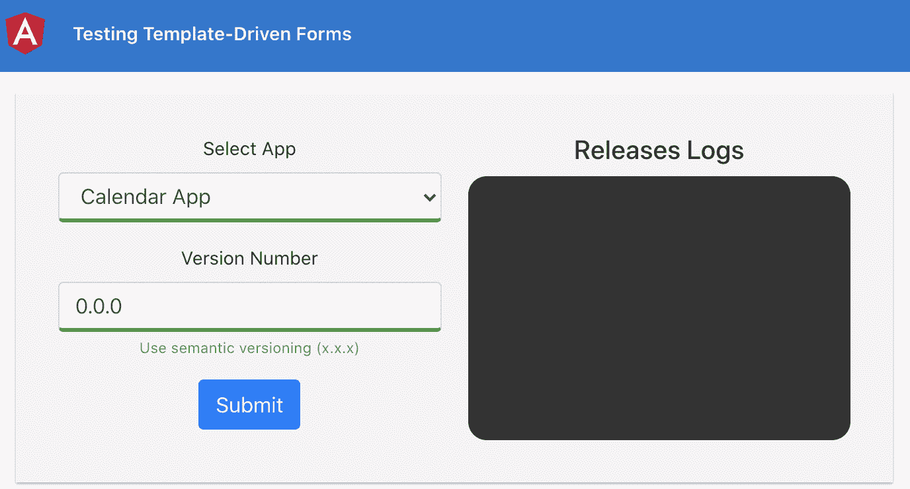
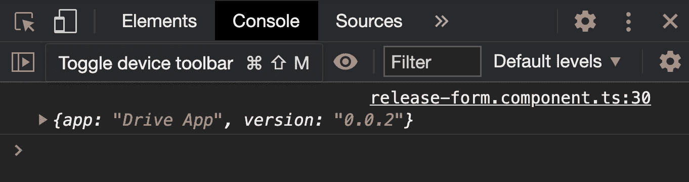
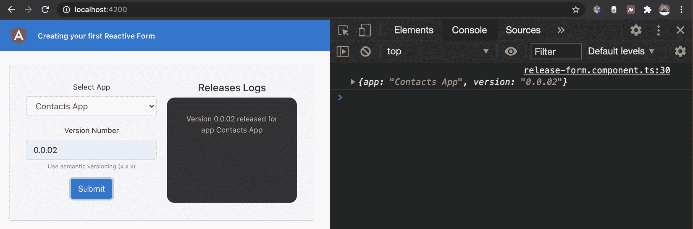
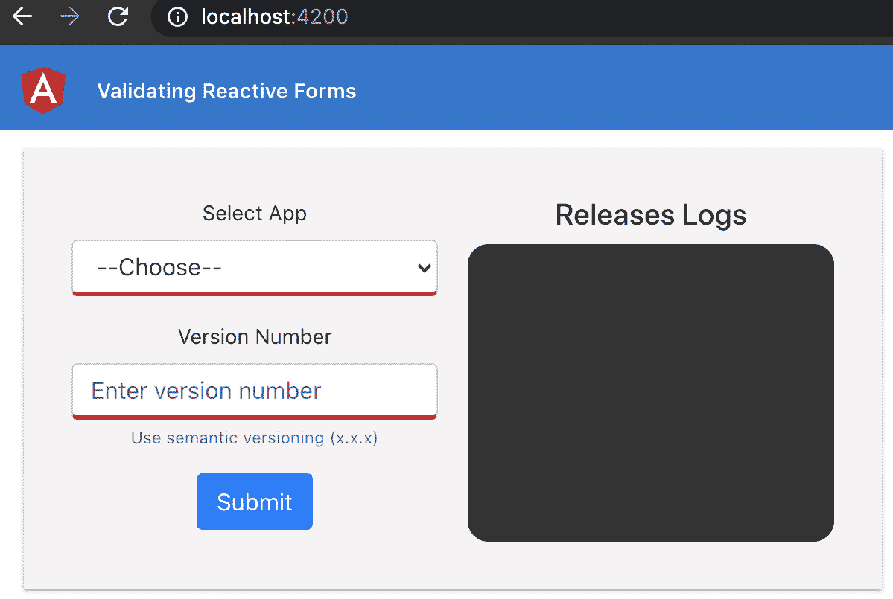
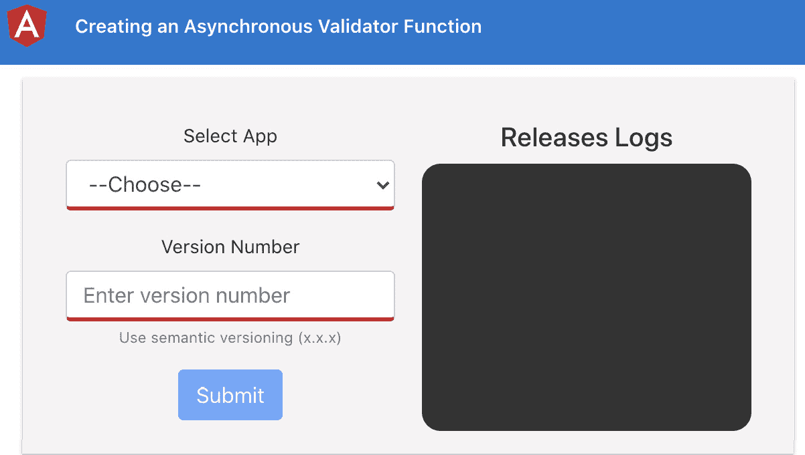
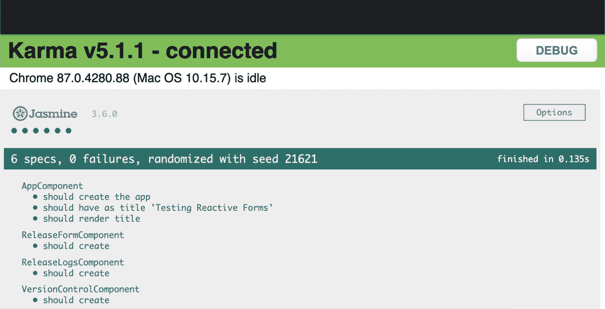
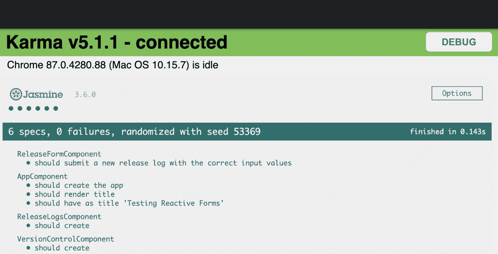
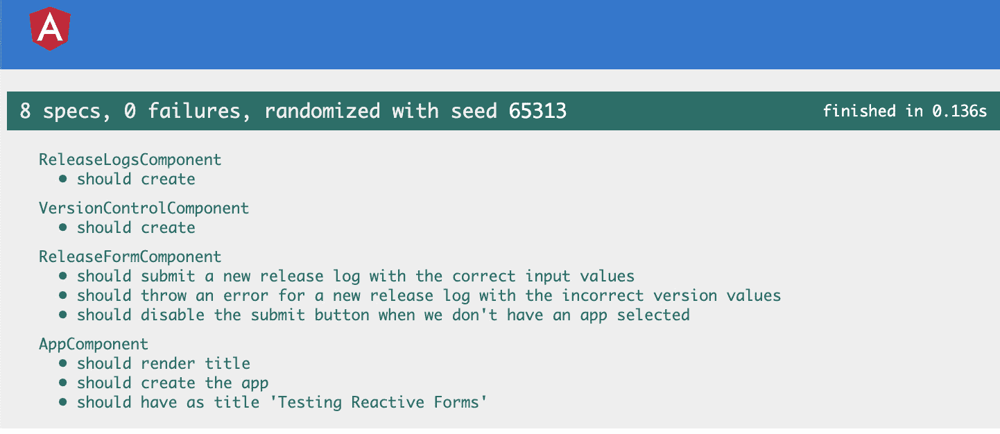
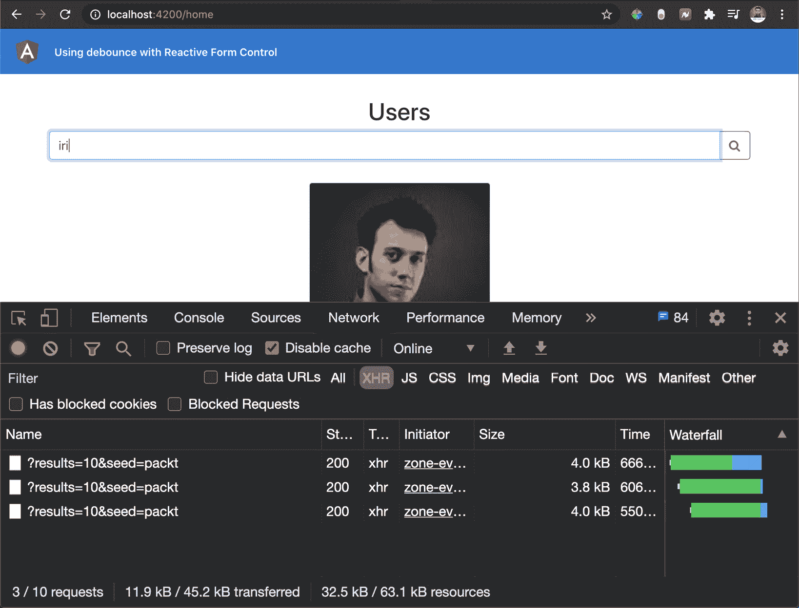
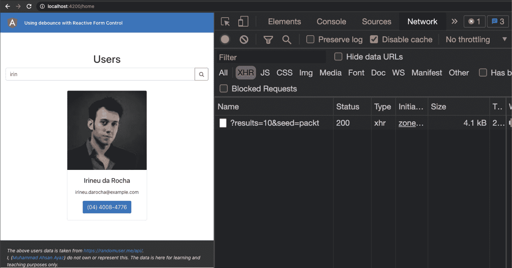

# *第八章*：掌握角形

获取用户输入是我们使用的几乎所有现代应用程序不可或缺的一部分。无论是验证用户、请求反馈还是填写关键业务表单，了解如何实现表单并将表单呈现给最终用户始终是一个有趣的挑战。在本章中，您将学习角度形状，以及如何使用它们创建良好的用户体验。

以下是我们将在本章中介绍的食谱：

*   创建第一个模板驱动的角度形状
*   模板驱动表单的表单验证
*   测试模板驱动的表单
*   创建第一个反应式表单
*   使用反应式表单进行表单验证
*   创建异步验证器函数
*   测试反应形式
*   使用反 Bounce 和反应式表单控制
*   使用`ControlValueAccessor`编写自己的自定义表单控件

# 技术要求

对于本章中的配方，请确保您的机器上安装了**Git**和**NodeJS**。您还需要安装`@angular/cli`软件包，您可以从终端使用`npm install -g @angular/cli`进行安装。本章代码见[https://github.com/PacktPublishing/Angular-Cookbook/tree/master/chapter08](https://github.com/PacktPublishing/Angular-Cookbook/tree/master/chapter08) 。

# 创建第一个模板驱动的角度形状

让我们开始熟悉这个配方中的棱角形状。在本教程中，您将了解模板驱动表单的基本概念，并将使用模板驱动表单 API 创建一个基本的角度表单。

## 准备好了吗

此配方的项目位于`chapter08/start_here/template-driven-forms`：

1.  在 Visual Studio 代码中打开项目。
2.  打开终端，运行`npm install`安装项目的依赖项。
3.  Once done, run `ng serve -o`.

    这将在新的浏览器选项卡中打开应用程序，您将看到以下视图：


图 8.1–在上运行的模板驱动表单应用程序 http://localhost:4200

## 怎么做…

我们有一个 Angular 应用程序，它已经有一个发布日志组件和一系列设置，比如`src/app/classes`文件夹下的`ReleaseLog`类。因此，在这个配方中，我们将创建一个模板驱动的表单，允许用户选择应用程序并提交发布版本。让我们开始：

1.  First, open the terminal in the project's root and create a component for the release form as follows:

    ```ts
    ng g c components/release-form
    ```

    该命令应在名为`ReleaseFormComponent`的`src/app/components`文件夹中创建一个新组件。

2.  Add the newly created component to the template of `VersionControlComponent` and modify the `version-control.component.html` file as follows:

    ```ts
    <div class="version-control">
      <app-release-form></app-release-form>
      <app-release-logs [logs]="releaseLogs"></app-release-  logs>
    </div>
    ```

    接下来，让我们为`VersionControlComponent`中使用的发布表单调整一些样式。

3.  Modify the `version-control.component.scss` file as follows:

    ```ts
    :host {
      ...
      min-width: 400px;
      .version-control {
        display: flex;
        justify-content: center;
      }
      app-release-logs,
     app-release-form {
        flex: 1;
      }
      app-release-form {
     margin-right: 20px;
     }
    }
    ```

    我们在`ReleaseFormComponent`模板中有两个输入。一个用于选择我们要发布的应用程序，另一个用于选择我们要发布的版本。

4.  让我们修改`release-form.component.ts`文件，将`Apps`枚举添加为本地属性，稍后可以在模板

    ```ts
    import { Component, OnInit } from '@angular/core';
    import { IReleaseLog } from 'src/app/classes/release-log';
    import { Apps } from 'src/app/constants/apps';
    ...
    export class ReleaseFormComponent implements OnInit {
      apps = Object.values(Apps);
     newLog: IReleaseLog = {
     app: Apps.CALENDAR,
     version: '0.0.0'
     };
      constructor() { }
      ngOnInit(): void {
      }
    }
    ```

    中使用
5.  现在让我们为表单添加模板。修改`release-form.component.html`文件，增加以下代码：

    ```ts
    <form>
     <div class="form-group">
     <label for="appName">Select App</label>
     <select class="form-control" id="appName" required>
     <option value="">--Choose--</option>
     <option *ngFor="let app of apps"       [value]="app">{{app}}</option>
     </select>
     </div>
     <div class="form-group">
     <label for="versionNumber">Version Number</label>
     <input type="text" class="form-control"     id="versionNumber" aria-describedby="versionHelp"     placeholder="Enter version number">
     <small id="versionHelp" class="form-text     text-muted">Use semantic versioning (x.x.x)</small>
     </div>
     <button type="submit" class="btn btn-primary">  Submit</button>
    </form>
    ```

6.  我们现在需要集成模板驱动的表单。让我们将`FormsModule`添加到文件中，如下所示：

    ```ts
    ...
    import { ReleaseFormComponent } from './components/release-form/release-form.component';
    import { FormsModule } from '@angular/forms';
    @NgModule({
      declarations: [...],
      imports: [
        BrowserModule,
        AppRoutingModule,
     FormsModule
      ],
      ...
    })
    export class AppModule { }
    ```

7.  现在，我们可以在模板中使用表单。让我们修改`release-form.component.html`文件，为表单创建一个名为`#releaseForm`的模板变量。我们还将针对`newLog`属性的适当值对两个输入使用`[(ngModel)]`绑定，如下所示：

    ```ts
    <form #releaseForm="ngForm">
      <div class="form-group">
        <label for="appName">Select App</label>
        <select name="app" [(ngModel)]="newLog.app"     class="form-control" id="appName" required>
          <option value="">--Choose--</option>
          <option *ngFor="let app of apps"       [value]="app">{{app}}</option>
        </select>
      </div>
      <div class="form-group">
        <label for="versionNumber">Version Number</label>
        <input name="version" [(ngModel)]="newLog.version"     type="text" class="form-control" id="versionNumber"     aria-describedby="versionHelp" placeholder="Enter     version number">
        <small id="versionHelp" class="form-text text-    muted">Use semantic versioning (x.x.x)</small>
      </div>
      <button type="submit" class="btn btn-primary">  Submit</button>
    </form>
    ```

8.  创建表单提交时间的方法。修改`release-form.component.ts`文件，添加一个名为`formSubmit`的新方法。调用此方法时，我们将使用一个有角度的`@Output`发射器发射一个新的`ReleaseLog`实例，如下所示：

    ```ts
    import { Component, EventEmitter, OnInit, Output } from '@angular/core';
    import { NgForm } from '@angular/forms';
    import { IReleaseLog, ReleaseLog } from 'src/app/classes/release-log';
    ...
    export class ReleaseFormComponent implements OnInit {
      @Output() newReleaseLog = new   EventEmitter<ReleaseLog>();
      apps = Object.values(Apps);
      ...
      ngOnInit(): void {
      }
      formSubmit(form: NgForm): void {
     const { app, version } = form.value;
     const newLog: ReleaseLog = new ReleaseLog(app,     version)
     this.newReleaseLog.emit(newLog);
     }
    }
    ```

9.  现在更新模板，在表单提交时使用`formSubmit`方法，修改`release-form.component.html`文件如下：

    ```ts
    <form  #releaseForm="ngForm" (ngSubmit)="formSubmit(releaseForm)">
      ...
    </form>
    ```

10.  我们现在需要修改`VersionControlComponent`，以便能够对发出的新发布日志进行操作。为此，修改`version-control.component.html`文件以监听`ReleaseFormComponent`的`newReleaseLog`输出事件，如下所示：

    ```ts
    <div class="version-control">
      <app-release-form (newReleaseLog)="addNewReleaseLog   ($event)"></app-release-form>
      <app-release-logs [logs]="releaseLogs"></app-release-  logs>
    </div>
    ```

11.  凉的让我们在`version-control.component.ts`文件中创建`addNewReleaseLog`方法，并将收到的`ReleaseLog`添加到`releaseLogs`数组中。您的代码应该如下所示：

    ```ts
    ...
    export class VersionControlComponent implements OnInit {
      releaseLogs: ReleaseLog[] = [];
      ...
      addNewReleaseLog(log: ReleaseLog) {
     this.releaseLogs.unshift(log);
     }
    }
    ```

令人惊叹的在几分钟内，我们就能够在 Angular 中创建第一个模板驱动的表单。如果您现在刷新应用程序并尝试创建一些版本，您将看到类似以下内容：


图 8.2–模板驱动表单应用程序最终输出

既然您已经了解了模板驱动表单是如何创建的，那么让我们看下一节来了解它是如何工作的。

## 它是如何工作的…

Angular 中使用模板驱动表单的关键在于`FormsModule``ngForm`指令，通过使用`ngForm`指令创建**模板变量**，并使用`[(ngModel)]`双向数据绑定以及`name`属性作为模板中的输入。我们首先创建一个带有一些输入的简单表单。然后，我们添加了`FormsModule`，这是使用`ngForm`指令和`[(ngModel)]`双向数据绑定所必需的。一旦我们添加了模块，我们就可以在`ReleaseFormComponent`中使用新创建的名为`newLog`的本地属性的指令和数据绑定。请注意，它可能是`ReleaseLog`类的一个实例，但我们将其保留为`IReleaseLog`类型的对象，因为我们不需要`ReleaseLog`类的`message`属性，因为我们不使用它。有了`[(ngModel)]`用法和`#releaseForm`模板变量，我们可以使用 Angular 的`<form>`指令的`ngSubmit`发射器提交表单。请注意，我们将`releaseForm`变量传递给`formSubmit`方法，这使我们更容易测试功能。提交表单时，我们使用表单的值创建一个新的`ReleaseLog`项，并使用`newReleaseLog`输出发射器发射它。请注意，如果您为新发布日志提供了无效的`version`，应用程序将抛出错误，并且不会创建发布日志。这是因为我们在`ReleaseLog`类的`constructor`中验证了版本。最后，当`VersionControlComponent`捕获到这个`newReleaseLog`事件时，它调用`addNewReleaseLog`方法，将我们新创建的发布日志添加到`releaseLogs`数组中。由于`releaseLogs`数组作为`@Input()`传递给`ReleaseLogsComponent`，因此它会立即显示出来。

## 另见

*   构建一个模板驱动的角度模板：[https://angular.io/guide/forms#building-a-模板驱动式表单](https://angular.io/guide/forms#building-a-template-driven-form)

# 模板驱动表单的表单验证

良好的用户体验是获得更多喜欢使用您的应用程序的用户的关键。使用表单是用户并不真正喜欢的事情之一。为了确保用户花费最少的时间填写表单，并更快地完成表单，我们可以实施表单验证，以确保用户在 a.s.a.p.中输入适当的数据。在此配方中，我们将研究如何在模板驱动的表单中实施表单验证。

## 准备好了吗

此配方的项目位于`chapter08/start_here/tdf-form-validation`：

1.  在 Visual Studio 代码中打开项目。
2.  打开终端，运行`npm install`安装项目的依赖项。
3.  Once done, run `ng serve -o`.

    此将在新的浏览器选项卡中打开应用程序，您将看到如下应用程序：


图 8.3–在上运行的 TDF 表单验证应用程序 http://localhost:4200

现在我们已经有了本地运行的应用程序，让我们在下一节中查看此配方中涉及的步骤。

## 怎么做…

我们现在有了上一个配方中的应用程序，一个简单的 Angular 应用程序，使用`ngForm`和`ngModel`指令使用一个模板驱动的表单。该表单用于创建发布日志。在这个配方中，我们将使这个表单在用户输入时验证输入方面变得更好。让我们开始：

1.  首先，我们将从`@angular/forms`包中添加一些验证器，它们是反应式表单 API 的一部分。我们将对输入应用**所需的**验证，并对版本输入应用**regex**验证。我们需要为两个输入创建模板变量。我们将分别命名为`nameInput`和`versionInput`。修改`release-form.component.html`文件中的代码，使其如下所示：

    ```ts
    <form  #releaseForm="ngForm" (ngSubmit)="formSubmit(releaseForm)">
      <div class="form-group">
        <label for="appName">Select App</label>
        <select #nameInput="ngModel" name="app"     [(ngModel)]="newLog.app" class="form-control"     id="appName" required>
          <option value="">--Choose--</option>
          <option *ngFor="let app of apps"       [value]="app">{{app}}</option>
        </select>
      </div>
      <div class="form-group">
        <label for="versionNumber">Version Number</label>
        <input #versionInput="ngModel" name="version"     [(ngModel)]="newLog.version" type="text"     class="form-control" id="versionNumber" aria-    describedby="versionHelp" placeholder="Enter     version number" required>
        <small id="versionHelp" class="form-text     text-muted">Use semantic versioning (x.x.x)</small>
      </div>
      <button type="submit" class="btn btn-primary">  Submit</button>
    </form>
    ```

2.  我们现在可以使用模板变量应用验证。让我们从名称输入开始。在验证条款中，名称输入不应为空，应从选择框中选择应用。让我们在输入无效时显示默认引导警报。修改`release-form.component.html`文件中的代码。它应该如下所示：

    ```ts
    <form  #releaseForm="ngForm" (ngSubmit)="formSubmit(releaseForm)">
      <div class="form-group">
        <label for="appName">Select App</label>
        <select #nameInput="ngModel" name="app"     [(ngModel)]="newLog.app" class="form-control"     id="appName" required>
          <option value="">--Choose--</option>
          <option *ngFor="let app of apps"       [value]="app">{{app}}</option>
        </select>
        <div [hidden]="nameInput.valid || nameInput.pristine"     class="alert alert-danger">
     Please choose an app
     </div>
      </div>
      <div class="form-group">
        ...
      </div>
      <button type="submit" class="btn btn-primary">Submit   </button>
    </form>
    ```

3.  为了验证版本名输入，我们需要应用`src/app/constants/regexes.ts`文件中的`SEMANTIC_VERSION`正则表达式。将常量作为`ReleaseFormComponent`类中的本地属性添加到`release-form.component.ts`文件中，如下所示：

    ```ts
    ...
    import { Apps } from 'src/app/constants/apps';
    import { REGEXES } from 'src/app/constants/regexes';
    ...
    export class ReleaseFormComponent implements OnInit {
      @Output() newReleaseLog = new   EventEmitter<ReleaseLog>();
      apps = Object.values(Apps);
      versionInputRegex = REGEXES.SEMANTIC_VERSION;
      ...
    }
    ```

4.  现在，在模板中使用`versionInputRegex`应用验证并显示相关错误。修改`release-form.component.html`文件，使使代码如下：

    ```ts
    <form  #releaseForm="ngForm" (ngSubmit)="formSubmit(releaseForm)">
      <div class="form-group">
        ...
      </div>
      <div class="form-group">
        <label for="versionNumber">Version Number</label>
        <input #versionInput="ngModel"     [pattern]="versionInputRegex" name="version"     [(ngModel)]="newLog.version" type="text"     class="form-control" id="versionNumber" aria-    describedby="versionHelp" placeholder="Enter     version number" required>
        <small id="versionHelp" class="form-text     text-muted">Use semantic versioning (x.x.x)</small>
        <div
     [hidden]="versionInput.value &&       (versionInput.valid || versionInput.pristine)"
     class="alert alert-danger"
     >
     Please write an appropriate version number
     </div>
      </div>
      <button type="submit" class="btn btn-primary">  Submit</button>
    </form>
    ```

5.  Refresh the app and try to invalidate both inputs by selecting the first option named **--Choose--** from the **Select App** drop-down menu and by emptying the version input field. You should see the following errors:

    

    图 8.4–使用 ngModel 和 validation 显示输入错误

6.  接下来，我们将添加一些样式，以便在验证时使输入更加直观。让我们在`release-form.component.scss`文件中添加一些样式，如下所示：

    ```ts
    :host {
     /* Error messages */
     .alert {
     margin-top: 16px;
     }
     /* Valid form input */
     .ng-valid[required], .ng-valid.required  {
     border-bottom: 3px solid #259f2b;
     }
     /* Invalid form input */
     .ng-invalid:not(form)  {
     border-bottom: 3px solid #c92421;
     }
    }
    ```

7.  Finally, let's make the validation around the form submission. We'll disable the **Submit** button if the inputs do not have valid values. Let's modify the template in `release-form.component.html` as follows:

    ```ts
    <form #releaseForm="ngForm" (ngSubmit)="formSubmit(releaseForm)">
      <div class="form-group">
        ...
      </div>
      <div class="form-group">
        ...
      </div>
      <button type="submit" [disabled]="releaseForm.invalid"   class="btn btn-primary">Submit</button>
    </form>
    ```

    如果您现在刷新应用程序，您将看到每当一个或多个输入无效时，“提交”按钮将被禁用。

伟大的您刚刚学习了如何验证模板驱动的表单，以及如何使模板驱动表单的总体用户体验稍微好一点。

## 它是如何工作的…

该配方的核心组件是`ngForm`和`ngModel`指令。我们可以根据表单是否有效，也就是说，如果表单中的所有输入都具有有效值，很容易确定提交按钮是否应该是可单击的（而不是禁用的）。注意，我们在`<form>`元素上使用了使用`#releaseForm="ngForm"`语法创建的模板变量。这是可能的，因为`ngForm`指令能够导出到模板变量中。因此，我们能够使用提交按钮`[disabled]`绑定中的`releaseForm.invalid`属性来有条件地禁用它。我们还根据输入可能无效的情况显示了单个输入的错误。在本例中，我们展示了 Bootstrap`alert`元素（一个带有 CSS 类`alert`的`<div>`。我们还在表单输入上使用 Angular 提供的类`ng-valid`和`ng-invalid`，根据输入值的有效性以某种方式突出显示输入。这个配方的有趣之处在于，我们验证了应用程序名称的输入，确保它包含一个非虚假的值，`<select>`框的第一个`<option>`具有`""`值。更有趣的是，当用户在正则表达式的输入上使用`[pattern]`绑定键入版本名时，我们也正确地验证了版本名。否则，我们将不得不等待用户提交表单，然后它将被验证。因此，我们通过在用户键入版本时提供错误来提供良好的用户体验。

## 另见

*   显示和隐藏验证错误消息（角度文档）：[https://angular.io/guide/forms#show-并隐藏验证错误消息](https://angular.io/guide/forms#show-and-hide-validation-error-messages)
*   NgForm 文件：`https://angular.io/api/forms/NgForm`

# 测试模板驱动表单

为了确保我们为最终用户构建健壮且无 bug 的表单，最好对表单进行测试。它使代码更具弹性，更不容易出错。在本教程中，您将学习如何使用单元测试测试模板驱动的表单。

## 准备好了吗

此配方的项目位于`chapter08/start_here/testing-td-forms`：

1.  在 Visual Studio 代码中打开项目。
2.  打开终端，运行`npm install`安装项目的依赖项。
3.  Once done, run `ng serve -o`.

    这将在新的浏览器选项卡中打开应用程序，您将看到应用程序，如下所示：



图 8.5–在上运行的测试模板驱动的表单应用程序 http://localhost:4200

现在我们已经在本地运行了该应用程序，让我们在下一节中查看该配方中涉及的步骤。

## 怎么做…

我们从以前的版本中创建了包含配方日志的表单模板。表单还对输入应用了验证。让我们开始研究如何测试此表单：

1.  First of all, run the following command to run the unit tests:

    ```ts
    npm run test
    ```

    运行命令后，您应该会看到一个新的 Chrome 窗口实例正在打开，该窗口运行单元测试。我们六次测试中有一次失败了。在自动 Chrome 窗口中，您可能会看到如下内容：

    

    图 8.6–在自动 Chrome 窗口中运行 Karma 和 Jasmine 的单元测试

2.  The `ReleaseFormComponent > should create` test is failing because we don't have `FormsModule` added to the tests. Notice the `Export of name 'ngForm' not found` error. Let's import `FormsModule` into the testing module's configuration in `release-form.component.spec.ts` as follows:

    ```ts
    import { ComponentFixture, TestBed } from '@angular/core/testing';
    import { FormsModule } from '@angular/forms';
    import { ReleaseFormComponent } from './release-form.component';
    describe('ReleaseFormComponent', () => {
      ...
      beforeEach(async () => {
        await TestBed.configureTestingModule({
          declarations: [ ReleaseFormComponent ],
     imports: [ FormsModule ]
        })
        .compileComponents();
      });
      ...
      it('should create', () => {
        expect(component).toBeTruthy();
      });
    });
    ```

    如果您现在查看测试，您应该看到所有测试都通过了，如下所示：

    

    图 8.7–将 FormsModule 导入适当的测试后，所有测试均通过

    为了正确地测试表单，我们将添加两个测试，一个用于成功输入，另一个用于每个无效输入。为此，我们需要访问组件中的表单，因为我们正在编写单元测试。

3.  让我们使用`release-form.component.ts`文件中的`@ViewChild()`修饰符访问组件类中的`#releaseForm`，如下所示：

    ```ts
    import { Component, EventEmitter, OnInit, Output, ViewChild } from '@angular/core';
    ...
    @Component({
      selector: 'app-release-form',
      templateUrl: './release-form.component.html',
      styleUrls: ['./release-form.component.scss']
    })
    export class ReleaseFormComponent implements OnInit {
      @Output() newReleaseLog = new   EventEmitter<ReleaseLog>();
      @ViewChild('releaseForm') releaseForm: NgForm;
      apps = Object.values(Apps);
      versionInputRegex = REGEXES.SEMANTIC_VERSION;
      ...
    }
    ```

4.  现在让我们添加一个新的测试。我们将编写一个测试，当两个输入都有有效值时，该测试将验证该情况。将测试添加到`release-form.component.spec.ts`文件中，如下所示：

    ```ts
    import { ComponentFixture, TestBed, fakeAsync } from '@angular/core/testing';
    import { ReleaseFormComponent } from './release-form.component';
    describe('ReleaseFormComponent', () => {
      ...
      it('should create', () => {
        expect(component).toBeTruthy();
      });
      it('should submit a new release log with the correct   input values', fakeAsync( () => {
     expect(true).toBeFalsy();
     }));
    });
    ```

5.  The new test is failing so far. Let's try to fill the values in the form, submit the button, and make sure that our `@Output` emitter named `newReleaseLog` emits the correct value from `releaseForm`. The content of the test should look as follows:

    ```ts
    ...
    import { ReleaseLog } from 'src/app/classes/release-log';
    ...
    it('should submit a new release log with the correct input values', fakeAsync(async () => {
     const submitButton = fixture.nativeElement.    querySelector('button[type="submit"]');
     const CALENDAR_APP = component.apps[2];
     spyOn(component.newReleaseLog, 'emit');
     await fixture.whenStable(); // wait for Angular     to configure the form
     component.releaseForm.controls[    'version'].setValue('2.2.2');
     component.releaseForm.controls[    'app'].setValue(CALENDAR_APP);
     submitButton.click();
     const expectedReleaseLog = new ReleaseLog(CALENDAR_    APP, '2.2.2');
     expect(component.newReleaseLog.emit)    .toHaveBeenCalledWith(expectedReleaseLog);
      }));
    ```

    保存文件时，您应该看到新的测试通过了预期值。它应在 Chrome 选项卡中显示如下：

    

    图 8.8–成功提交表格的新测试

6.  当表单中提供的版本不正确时，让我们为该案例添加一个测试。submit 按钮应该被禁用，我们应该有一个由`formSubmit`方法引发的错误。将新测试添加到您的`release-form.component.spec.ts`文件中，如下所示：

    ```ts
    ...
    describe('ReleaseFormComponent', () => {
      ...
     it('should submit a new release log with the correct   input values', fakeAsync(async () => {
     const submitButton = fixture.nativeElement.    querySelector('button[type="submit"]');
     const CALENDAR_APP = component.apps[2];
     spyOn(component.newReleaseLog, 'emit');
     await fixture.whenStable(); // wait for Angular     to configure the form
     const expectedError = 'Invalid version provided.     Please provide a valid version as     (major.minor.patch)';
     component.releaseForm.controls[    'version'].setValue('x.x.x');
     component.releaseForm.controls[    'app'].setValue(CALENDAR_APP);
     expect(() => component.formSubmit(component.    releaseForm))
     .toThrowError(expectedError);
     fixture.detectChanges();
     expect(submitButton.hasAttribute(    'disabled')).toBe(true);
     expect(component.newReleaseLog.emit)    .not.toHaveBeenCalled();
     }));
    });
    ```

7.  Let's add our final test, which makes sure that the submit button is disabled when we have not selected an app for the release log. Add a new test to the `release-form.component.spec.ts` file as follows:

    ```ts
    ...
    describe('ReleaseFormComponent', () => {
      ...
      it('should disable the submit button when we   don\'t have an app selected', fakeAsync(async () => {
     const submitButton = fixture.nativeElement.    querySelector('button[type="submit"]');
     spyOn(component.newReleaseLog, 'emit');
     await fixture.whenStable(); // wait for Angular     to configure the form
     component.releaseForm.controls[    'version'].setValue('2.2.2');
     component.releaseForm.controls[    'app'].setValue(null);
     fixture.detectChanges();
     expect(submitButton.hasAttribute(    'disabled')).toBe(true);
     expect(component.newReleaseLog.emit     ).not.toHaveBeenCalled();
     }));
    });
    ```

    如果您查看Karma tests（业力测试）窗口，您会看到所有新的测试都通过了，如下所示：


图 8.9–配方的所有测试均通过

令人惊叹的您现在了解了一系列测试模板驱动表单的技术。其中一些技术可能仍然需要一些解释。请参阅下一节以了解其工作原理。

## 它是如何工作的…

测试模板驱动的表单可能有点困难，因为它取决于表单的复杂程度、要测试的用例以及这些用例的复杂程度。在我们的配方中，我们做的第一件事是将`FormsModule`包含在`ReleaseFormComponent`测试文件的导入中。这确保测试知道`ngForm`指令，并且不会抛出相关错误。对于所有成功输入的测试，我们监视了在`ReleaseFormComponent`类中定义的`newReleaseLog`发射器的`emit`事件。这是因为我们知道，当输入正确时，用户应该能够单击 submit 按钮，因此在`formSubmit`方法中，将调用`newReleaseLog`发射器的`emit`方法。请注意，我们在每个测试中都使用了`fixture.whenStable()`。这是为了确保 Angular 已经完成编译，我们的名为`#releaseForm`的`ngForm`已经准备好。对于`should disable the submit button when version is incorrect`测试，我们依赖`formSubmit`抛出错误。这是因为我们知道，在创建新的发布日志时，无效版本会导致`ReleaseLog`类的`constructor`出现错误。本测试中一个有趣的事情是，我们使用以下代码：

```ts
expect(() => component.formSubmit(component.releaseForm))
      .toThrowError(expectedError);
```

这里有趣的是，我们需要用`releaseForm`调用`formSubmit`方法。我们不能仅仅通过编写`expect(component.formSubmit(component.releaseForm)).toThrowError(expectedError);`来完成，因为那样会直接在那里调用函数，会导致错误。因此，我们需要在这里传递一个 Jasmine 将调用的匿名函数，并期望该匿名函数抛出一个错误。最后，我们首先使用`fixture.nativeElement`上的`querySelector`按钮获取提交按钮，以确保我们的提交按钮处于启用或禁用状态。然后，我们使用`submitButton.hasAttribute('disabled')`检查提交按钮上的`disabled`属性。

## 另见

*   测试模板驱动表单：[https://angular.io/guide/forms-overview#testing-模板驱动表单](https://angular.io/guide/forms-overview#testing-template-driven-forms)

# 创建您的第一个反应式表单

您已经在前面的食谱中了解了模板驱动的表单，现在有信心使用它们构建 Angular 应用程序。你猜怎么着？反应形式更好。Angular 社区中的许多知名工程师和企业都建议使用反应式表单。原因是它们在构建复杂表单时易于使用。在本食谱中，您将构建第一个反应式表单并学习其基本用法。

## 准备好了吗

此配方的项目位于`chapter08/start_here/reactive-forms`：

1.  在 Visual Studio 代码中打开项目。
2.  打开终端，运行`npm install`安装项目的依赖项。
3.  完成后，运行`ng serve -o`。
4.  单击第一个用户的名称，您将看到以下视图：


图 8.10–在上运行的反应式表单应用程序 http://localhost:4200

现在我们已经有了本地运行的应用程序，让我们在下一节中查看此配方中涉及的步骤。

## 怎么做…

到目前为止，我们有一个应用程序有`ReleaseLogsComponent`，它显示了我们创建的一系列发布日志。我们还有`ReleaseFormComponent`，它有一个表单，通过该表单可以创建发布日志。现在，我们必须使用 reactiveformsapi 使当前表单成为一个被动表单。让我们开始：

1.  首先，我们需要将`ReactiveFormsModule`进口到我们`AppModule`的进口中。我们通过如下修改`app.module.ts`文件来实现：

    ```ts
    ...
    import { ReleaseFormComponent } from './components/release-form/release-form.component';
    import { ReactiveFormsModule } from '@angular/forms';
    @NgModule({
      declarations: [...],
      imports: [
        BrowserModule,
        AppRoutingModule,
     ReactiveFormsModule
      ],
      providers: [],
      bootstrap: [AppComponent]
    })
    export class AppModule { }
    ```

2.  现在让我们创建反应式表单。我们将在`ReleaseFormComponent`类中创建一个包含所需控件的`FormGroup`。修改`release-form.component.ts`文件如下：

    ```ts
    ...
    import { FormControl, FormGroup, Validators } from '@angular/forms';
    import { REGEXES } from 'src/app/constants/regexes';
    @Component(...)
    export class ReleaseFormComponent implements OnInit {
      apps = Object.values(Apps);
      versionInputRegex = REGEXES.SEMANTIC_VERSION;
     releaseForm = new FormGroup({
     app: new FormControl('', [Validators.required]),
     version: new FormControl('', [
     Validators.required,
     Validators.pattern(REGEXES.SEMANTIC_VERSION)
     ]),
     })
      ...
    }
    ```

3.  现在我们已经准备好了名为`releaseForm`的表单，让我们在模板中使用它将其绑定到表单。修改`release-form.component.html`文件如下：

    ```ts
    <form [formGroup]="releaseForm">
      ...
    </form>
    ```

4.  伟大的现在我们已经绑定了表单组，我们还可以绑定各个表单控件，这样当我们最终提交表单时，我们就可以得到每个表单控件的值。进一步修改`release-form.component.html`文件如下：

    ```ts
    <form [formGroup]="releaseForm">
      <div class="form-group">
        ...
        <select formControlName="app" class="form-control"     id="appName" required>
          ...
        </select>
      </div>
      <div class="form-group">
        ...
        <input formControlName="version" type="text"     class="form-control" id="versionNumber" aria-    describedby="versionHelp" placeholder="Enter     version number">
        <small id="versionHelp" class="form-text     text-muted">Use semantic versioning (x.x.x)</small>
      </div>
      ...
    </form>
    ```

5.  让我们决定提交此表单时会发生什么。我们将在模板中调用名为`formSubmit`的方法，并在表单提交时传递`releaseForm`。修改`release-form.component.html`文件如下：

    ```ts
    <form [formGroup]="releaseForm" (ngSubmit)="formSubmit(releaseForm)">
      ...
    </form>
    ```

6.  The `formSubmit` method doesn't yet exist. Let's create it now in the `ReleaseFormComponent` class. We'll also log the value on the console and emit the value using an `@Output` emitter. Modify the `release-form.component.ts` file as follows:

    ```ts
    import { Component, OnInit, Output, EventEmitter } from '@angular/core';
    ...
    import { ReleaseLog } from 'src/app/classes/release-log';
    ...
    @Component(...)
    export class ReleaseFormComponent implements OnInit {
      @Output() newReleaseLog = new   EventEmitter<ReleaseLog>();
      apps = Object.values(Apps);
      ...
      formSubmit(form: FormGroup): void {
     const { app, version } = form.value;
     console.log({app, version});
     const newLog: ReleaseLog = new ReleaseLog(app,     version)
     this.newReleaseLog.emit(newLog);
     }
    }
    ```

    如果您现在刷新应用程序，填写表单并点击**提交**，您应该会在控制台上看到如下日志：

    

    图 8.11–显示使用反应式表单提交的值的日志

7.  因为我们已经通过`newReleaseLog`输出发射器发出了新创建的发布日志的值，所以我们可以在`version-control.component.html`文件中监听该事件，并相应地添加新日志。我们将文件修改为如下：

    ```ts
    <div class="version-control">
      <app-release-form (newReleaseLog)="addNewReleaseLog   ($event)"></app-release-form>
      <app-release-logs [logs]="releaseLogs">  </app-release-logs>
    </div>
    ```

8.  刷新应用程序，您将看到新的发布日志添加到“发布日志”视图中。您也应该可以看到控制台上的日志，如下面的截图所示：



图 8.12–表单提交时添加到日志视图的新日志

令人惊叹的现在，您知道了如何使用 reactiveformsapi 创建一个基本的 reactiveform。请参阅下一节以了解其工作原理。

## 它是如何工作的…

食谱从在我们的 Angular 应用程序中有一个基本的 HTML 表单开始，没有绑定 Angular magic。我们首先从`AppModule`开始进口`ReactiveFormsModule`。如果您正在使用 Angular 语言服务和您选择的编辑器，您可能会在将`ReactiveFormsModule`导入应用程序时看到一个错误，并且没有将其与反应式表单绑定，换句话说，与`FormGroup`绑定。我们就是这么做的。我们使用`FormGroup`构造函数创建了一个被动表单，并使用`FormControl`构造函数创建了相关表单控件。然后我们听了`<form>`元素上的`ngSubmit`事件，以提取`releaseForm`的值。完成后，我们使用名为`newReleaseLog`的`@Ouput()`发出该值。注意，我们还将该发射器将发射的值的类型定义为`IReleaseLog`；定义这些是一种良好的做法。之所以需要此发射器，是因为`ReleaseLogsComponent`是组件层次结构中`ReleaseFormComponent`的同级。因此，我们通过父组件`VersionControlComponent`进行通信。最后，我们在`VersionControlComponent`模板中监听`newReleaseLog`事件的发射，并通过`addNewReleaseLog`方法向`releaseLogs`数组中添加新日志。这个`releaseLogs`数组被传递到`ReleaseLogsComponent`，它在添加日志时显示所有日志。

## 另见

*   Angular 的反应形式指南：[https://angular.io/guide/reactive-forms](https://angular.io/guide/reactive-forms)

# 使用反应性表单进行表单验证

在前面的配方中，您学习了如何创建反应形式。现在，我们将学习如何测试它们。在本食谱中，您将学习测试反应形式的一些基本原则。我们将使用上一个配方（ReleaseLogs 应用程序）中的相同示例，并将实现许多测试用例。

## 准备好了吗

我们将要处理的项目位于克隆存储库中的`chapter08/start_here/validating-reactive-forms`：

1.  在 Visual Studio 代码中打开项目。
2.  打开终端，运行`npm install`安装项目的依赖项。
3.  Once done, run `ng serve -o`.

    这将在新的浏览器选项卡中打开应用程序，您将看到它，如下所示：


图 8.13–在上运行的验证反应式表单应用程序 http://localhost:4200

既然已经在本地运行了应用程序，那么让我们在下一节中看看这个配方中涉及的步骤。

## 怎么做…

对于这个配方，我们使用的是已经实现了反应式表单的发布日志应用程序，尽管到目前为止我们还没有对输入进行任何形式的验证。如果您只是选择一个应用程序并提交表单，您将在控制台上看到如下错误：


图 8.14–提交无表单验证的反应式表单应用程序时出错

我们将加入一些表单验证，以增强用户体验，并确保表单不会在输入无效的情况下提交。开始吧：

1.  我们将首先从`@angular/forms`包中添加一些验证，它们是反应式表单 API 的一部分。我们将在两个输入上应用`required`验证器，在`version`表单控件上应用`pattern`验证器。更新`release-form.component.ts`文件如下：

    ```ts
    import { Component, OnInit, Output, EventEmitter } from '@angular/core';
    import { FormControl, FormGroup, Validators } from '@angular/forms';
    ...
    import { REGEXES } from 'src/app/constants/regexes';
    @Component({...})
    export class ReleaseFormComponent implements OnInit {
      ...
     versionInputRegex = REGEXES.SEMANTIC_VERSION;
      releaseForm = new FormGroup({
        app: new FormControl('', Validators.required),
        version: new FormControl('', [
     Validators.required,
     Validators.pattern(this.versionInputRegex)
     ]),
      })
      ...
    }
    ```

2.  现在我们将向视图添加提示，以显示在选择无效输入时的用户错误。修改`release-form.component.html`文件如下：

    ```ts
    <form [formGroup]="releaseForm" (ngSubmit)="formSubmit(releaseForm)">
      <div class="form-group">
        <label for="appName">Select App</label>
        <select formControlName="app" class="form-control"     id="appName">
          ...
        </select>
        <div
     [hidden]="releaseForm.get('app').valid ||       releaseForm.get('app').pristine"
     class="alert alert-danger">
     Please choose an app
     </div>
      </div>
      <div class="form-group">
        ...
        <small id="versionHelp" class="form-text     text-muted">Use semantic versioning (x.x.x)</small>
        <div [hidden]="releaseForm.get('version').valid ||     releaseForm.get('version').pristine"
     class="alert alert-danger">
     Please write an appropriate version number
     </div>
      </div>
      <button type="submit" class="btn btn-primary">Submit   </button>
    </form>
    ```

3.  We'll also add some styles to show the errors with a better UI. Add the following styles to the `release-form.component.scss` file:

    ```ts
    :host {
     /* Error messages */
     .alert {
     margin-top: 16px;
     }
     /* Valid form input */
     .ng-valid:not(form),
     .ng-valid.required {
     border-bottom: 3px solid #259f2b;
     }
     /* Invalid form input */
     .ng-invalid:not(form) {
     border-bottom: 3px solid #c92421;
     }
    }
    ```

    刷新应用程序，当输入值错误时，您应该会看到带有红色边框的输入。输入或选择无效输入后的错误如下所示：

    

    图 8.15–无效输入值上显示的红色边框

4.  Finally, let's make the validation around the form submission. We'll disable the **Submit** button if the inputs do not have valid values. Let's modify the template in `release-form.component.html` as follows:

    ```ts
    <form [formGroup]="releaseForm" (ngSubmit)="formSubmit(releaseForm)">
      <div class="form-group">
        ...
      </div>
      <div class="form-group">
        ...
      </div>
      <button type="submit" [disabled]="releaseForm.invalid"   class="btn btn-primary">Submit</button>
    </form>
    ```

    如果您现在刷新应用程序，您将看到每当一个或多个输入无效时，“提交”按钮将被禁用。

食谱到此结束。让我们看下一节，看看它是如何工作的。

## 它是如何工作的…

我们从添加验证器开始，Angular 已经从盒子里拿出了一堆验证器，包括`Validators.email`、`Validators.pattern`和`Validators.required`。我们在我们的配方中使用`required`验证器和`pattern`验证器分别输入应用程序名称和版本。之后，为了显示无效输入的提示/错误，我们添加了一些条件样式来显示输入的底部边框。我们还添加了一些带有`class="alert alert-danger"`的`<div>`元素，它们基本上是引导警报，用于显示表单控件无效值上的错误。请注意，我们使用以下模式隐藏错误元素：

```ts
[hidden]="releaseForm.get(CONTROL_NAME).valid || releaseForm.get(CONTROL_NAME).pristine"
```

我们使用`.pristine`的条件来确保一旦用户选择了正确的输入并修改了输入，我们就再次隐藏错误，以便在用户输入输入或进行其他选择时不会显示错误。最后，我们确保表单控件的值无效时甚至不能提交表单。我们使用`[disabled]="releaseForm.invalid"`禁用了提交按钮。

## 另见

*   角度确认反应形式的单据：[https://angular.io/guide/reactive-forms#validating-表格输入](https://angular.io/guide/reactive-forms#validating-form-input)

# 创建异步验证函数

表单验证在 Angular 中非常简单，原因是 Angular 提供了开箱即用的超级棒的验证器。这些验证器是同步的，这意味着一旦您更改输入，验证器就会立即启动并向您提供有关值有效性的信息。但有时，您可能会依赖一些来自后端 API 的验证，例如。这些情况需要称为异步验证器的东西。在这个配方中，您将创建第一个异步验证器。

## 准备好了吗

我们将要处理的项目位于克隆存储库中的`chapter08/start_here/asynchronous-validator`：

1.  在 Visual Studio 代码中打开项目。
2.  打开终端，运行`npm install`安装项目的依赖项。
3.  Once done, run `ng serve -o`.

    这将在新的浏览器选项卡中打开应用程序，您将看到如下内容：



图 8.16–在上运行的异步验证程序应用程序 http://localhost:4200

现在我们已经运行了这个应用程序，让我们在下一节中看看这个配方中涉及的步骤。

怎么做…

我们已经在发布日志应用程序中设置了一些内容。我们在`src/assets`文件夹中有一个`data.json`文件，其中保存了发布日志中每个目标应用程序的版本。我们将创建一个异步验证器，以确保每个应用程序的新版本的版本高于`data.json`文件中指定的版本。开始吧：

1.  首先，我们将为配方创建异步验证器函数。让我们在`version.service.ts`文件的`VersionService`类中创建一个名为`versionValidator`的方法，如下所示：

    ```ts
    ...
    import { compareVersion } from 'src/app/utils';
    import { AbstractControl, AsyncValidatorFn, ValidationErrors } from '@angular/forms';
    import { Observable, of } from 'rxjs';
    @Injectable({...})
    export class VersionService {
      ...
      versionValidator(appNameControl: AbstractControl):   AsyncValidatorFn {
     // code here
     }
      ...
    }
    ```

2.  现在我们将定义验证器函数的内容。我们将`versionValidator`方法修改如下：

    ```ts
    versionValidator(appNameControl: AbstractControl): AsyncValidatorFn {
     return (control: AbstractControl):   Observable<ValidationErrors> => {
     // if we don't have an app selected, do not validate
     if (!appNameControl.value) {
     return of(null);
     }
     return this.getVersionLog().pipe(
     map(vLog => {
     const newVersion = control.value;
     const previousVersion = vLog[appNameControl.value];
     // check if the new version is greater than          previous version
     return compareVersion(newVersion, previousVersion)       === 1 ? null : {
     newVersionRequired: previousVersion
     };
     }))
     }
    }
    ```

3.  既然我们已经准备好了验证器函数，让我们将其添加到版本号的表单控件中。我们将`release-form.component.ts`文件修改如下：

    ```ts
    import { Component, OnInit, Output, EventEmitter } from '@angular/core';
    import { FormControl, FormGroup, Validators } from '@angular/forms';
    import { IReleaseLog, ReleaseLog } from 'src/app/classes/release-log';
    import { Apps } from 'src/app/constants/apps';
    import { REGEXES } from 'src/app/constants/regexes';
    import { VersionService } from 'src/app/core/services/version.service';
    @Component({...})
    export class ReleaseFormComponent implements OnInit {
      ...
      constructor(private versionService: VersionService) { }
      ngOnInit(): void {
        this.releaseForm.get('version')    .setAsyncValidators(
     this.versionService.versionValidator(
     this.releaseForm.get('app')
     )
     )
      }
      ...
    }
    ```

4.  我们现在将使用验证程序通过修改`release-form.component.html`文件来增强用户对表单的体验。为了便于使用，让我们使用`*ngIf`指令将内容包装在`<ng-container>`元素中，并在模板中为版本表单控件创建一个变量，如下所示：

    ```ts
    <form [formGroup]="releaseForm" (ngSubmit)="formSubmit(releaseForm)">
      <ng-container *ngIf="releaseForm.get('version')   as versionControl">
        <div class="form-group">
          ...
        </div>
        <div class="form-group">
          ...
        </div>
        <button type="submit" [disabled]="releaseForm.    invalid" class="btn btn-primary">Submit</button>
      </ng-container>
    </form>
    ```

5.  Let's now add the error message. We'll use our custom error, `newVersionRequired`, from the validator function to show the error when the specified version isn't newer than the previous version. Modify the `release-form.component.html` file as follows:

    ```ts
    <form [formGroup]="releaseForm" (ngSubmit)="formSubmit(releaseForm)">
      <ng-container *ngIf="releaseForm.get('version')   as versionControl">
        <div class="form-group">
          ...
        </div>
        <div class="form-group">
          <label for="versionNumber">Version Number</label>
          <input formControlName="version" type="text"       class="form-control" id="versionNumber"       aria-describedby="versionHelp" placeholder="Enter       version number">
          ...
          <div *ngIf="(versionControl.      getError('newVersionRequired') &&       !versionControl.pristine)"
     class="alert alert-danger">
     The version number should be greater         than the last version '{{versionControl.        errors['newVersionRequired']}}'
     </div>
        </div>
        <button [disabled]="releaseForm.invalid"     class="btn btn-primary">Submit</button>
      </ng-container>
    </form>
    ```

    尝试选择一个应用程序并添加一个较低的版本号，您现在会看到如下错误：

    

    图 8.17–提供较低版本号时显示的错误

6.  One issue right now is that we are able to submit the form while the asynchronous validation is in progress. That's because Angular, by default, marks the error as `null` until the validation is done. To tackle this, we can show a loading message instead of the **submit** button in the template. Modify the `release-form.component.html` file as follows:

    ```ts
    <form [formGroup]="releaseForm" (ngSubmit)="formSubmit(releaseForm)">
      <ng-container *ngIf="releaseForm.get('version')   as versionControl">
        <div class="form-group">
          ...
        </div>
        <div class="form-group">
          ...
        </div>
        <button *ngIf="versionControl.status     !== 'PENDING'; else loader" type="submit"     [disabled]="releaseForm.invalid" class="btn      btn-primary">Submit</button>
      </ng-container>
      <ng-template #loader>
     Please wait...
     </ng-template>
    </form>
    ```

    如果您刷新应用程序，选择一个应用程序，并键入一个有效版本，您将看到**请等待…**消息，如下所示：

    

    图 8.18–异步验证过程中的加载程序消息

7.  我们仍然存在问题，用户可以快速键入并按*Enter*提交表单。为了防止这种情况发生，让我们在`release-form.component.ts`文件中的`formSubmit`方法中添加一个检查，如下所示：

    ```ts
      formSubmit(form: FormGroup): void {
        if (form.get('version').status === 'PENDING') {
     return;
     }
        const { app, version } = form.value;
        ...
      }
    ```

8.  最后，我们还有另一个问题要处理。如果我们选择了一个有效的版本号并更改了应用程序，我们仍然可以使用输入的版本号提交表单，尽管它在逻辑上是错误的。为了处理这个问题，我们应该在`'app'`表单控件的值发生变化时更新`'version'`表单控件的验证。为此，修改`release-form.component.ts`文件如下：

    ```ts
    import { Component, OnInit, Output, EventEmitter, OnDestroy } from '@angular/core';
    ...
    import { takeWhile } from 'rxjs/operators';
    ...
    @Component({...})
    export class ReleaseFormComponent implements OnInit, OnDestroy {
      @Output() newReleaseLog = new   EventEmitter<IReleaseLog>();
      isComponentAlive = false;
      apps = Object.values(Apps);
      ...
      ngOnInit(): void {
        this.isComponentAlive = true;
        this.releaseForm.get     ('version').setAsyncValidators(...)
        this.releaseForm.get('app').valueChanges
     .pipe(takeWhile(() => this.isComponentAlive))
     .subscribe(() => {
     this.releaseForm.get         ('version').updateValueAndValidity();
     })
      }
      ngOnDestroy() {
     this.isComponentAlive = false;
     }
      ...
    }
    ```

凉的现在，您已经知道如何在 Angular 中创建异步验证器函数，以便在反应式表单中进行表单验证。既然您已经完成了配方，请参阅下一节了解其工作原理。

## 它是如何工作的…

Angular 提供了一种创建异步验证程序函数的非常简单的方法，而且它们也非常方便。在这个配方中，我们首先创建名为`versionValidator`的验证器函数。请注意，对于验证器函数，我们有一个名为`appNameControl`的参数。这是因为我们希望获取要验证其版本号的应用程序名称。还要注意，我们将返回类型设置为`AsyncValidatorFn`，这是 Angular 所需的。验证器函数应该返回一个`AsyncValidatorFn`，这意味着它将返回一个函数（我们把称为**内部函数**，它接收一个`AbstractControl`并返回一个`ValidatorErrors`的`Observable`。在内部函数中，我们使用`VersionService`中的`getVersionLog()`方法使用`HttpClient`服务获取`data.json`文件。一旦我们从`data.json`获取所选特定应用程序的版本，我们将表单中输入的版本与`data.json`中的值进行比较，以验证输入。请注意，我们不只是返回一个`newVersionRequired`属性设置为`true`的`ValidationErrors`对象，而是将其设置为`previousVersion`，以便稍后使用它向用户显示。

在创建了验证器函数之后，我们使用`ReleaseFormComponent`类中的`FormControl.setAsyncValidators()`方法将其附加到版本名的表单控件。然后，我们使用模板中名为`newVersionRequired`的验证错误以及`data.json`文件中的版本来显示错误消息。

我们还需要处理这样一种情况，即当验证正在进行时，表单控件在验证完成之前是有效的。这允许我们在验证版本名时提交表单。我们在验证过程中通过检查`FormControl.status`的值是否为`'PENDING'`隐藏提交按钮来处理。在这种情况下，我们将隐藏提交按钮，同时显示**请稍候……**消息。注意，我们还在`ReleaseFormComponent`类的`formSubmit`方法中添加了一些逻辑来检查`FormControl.status`对于版本号是否为`'PENDING'`，在这种情况下，我们只做一个`return;`。

食谱中还有一件有趣的事，如果我们添加了有效的版本号并更改了应用程序，我们仍然可以提交表单。我们通过向`'app'`表单控件的`.valueChanges`添加订阅来处理这个问题，因此每当发生这种情况时，我们都会使用`.updateValueAndValidity()`方法触发`'version'`表单控件的另一次验证。

## 另见

*   AsyncValidator 文件：[https://angular.io/api/forms/AsyncValidator#provide-a-custom-async-validator-directive](https://angular.io/api/forms/AsyncValidator#provide-a-custom-async-validator-directive)

# 测试反应形式

为了确保我们为最终用户构建健壮且无 bug 的表单，最好在表单周围进行测试。它使代码更具弹性，更不容易出错。在本教程中，您将学习如何使用单元测试测试模板驱动的表单。

## 准备好了吗

此配方的项目位于`chapter08/start_here/testing-reactive-forms`：

1.  在 Visual Studio 代码中打开项目。
2.  打开终端，运行`npm install`安装项目的依赖项。
3.  Once done, run `ng serve -o`.

    这将在新的浏览器选项卡中打开应用程序，您将看到如下应用程序：


图 8.19–在上运行的测试反应式表单应用程序 http://localhost:4200

现在我们已经有了本地运行的应用程序，让我们在下一节中查看此配方中涉及的步骤。

## 怎么做…

我们有一个发布日志应用程序，它有一个通过一些验证实现的反应式表单。在这个配方中，我们将为表单实现一些测试。让我们开始：

1.  First of all, run the following command to run the unit tests in a separate terminal window:

    ```ts
    yarn test
    ```

    运行命令后，您应该会看到一个新的 Chrome 窗口实例被打开，该窗口运行测试，如下所示：

    

    图 8.20–在自动 Chrome 窗口中运行 Karma 和 Jasmine 的单元测试

2.  Let's add our first test for the case when all the inputs have a valid value. In this case, we should have the form submitted and the form's value emitted through the emitter of the `newReleaseLog` output. Modify the `release-form.component.spec.ts` file as follows:

    ```ts
    import { ComponentFixture, TestBed } from '@angular/core/testing';
    import { ReleaseLog } from 'src/app/classes/release-log';
    ...
    describe('ReleaseFormComponent', () => {
      ...
      it('should submit a new release log with the correct   input values', (() => {
     const app = component.apps[2];
     const version = '2.2.2';
     const expectedReleaseLog = new ReleaseLog(app,     version);
     spyOn(component.newReleaseLog, 'emit');
     component.releaseForm.setValue({ app, version });
     component.formSubmit(component.releaseForm);
     expect(component.newReleaseLog.emit)    .toHaveBeenCalledWith(expectedReleaseLog);
     }));
    });
    ```

    如果您现在查看测试，您应该通过以下新测试：

    

    图 8.21–成功输入的测试用例通过

3.  当表单中提供的版本不正确时，让我们为该案例添加一个测试。**提交**按钮应该被禁用，我们应该有`formSubmit`方法抛出的错误。将新测试添加到您的`release-form.component.spec.ts`文件中，如下所示：

    ```ts
    ...
    describe('ReleaseFormComponent', () => {
      ...
      it('should throw an error for a new release log with   the incorrect version values', (() => {
     const submitButton = fixture.nativeElement.    querySelector('button[type="submit"]');
     const app = component.apps[2];
     const version = 'x.x.x';
     spyOn(component.newReleaseLog, 'emit');
     const expectedError = 'Invalid version provided.     Please provide a valid version as (major.minor.    patch)';
     component.releaseForm.setValue({ app, version });
     expect(() => component.formSubmit(component.    releaseForm))
     .toThrowError(expectedError);
     expect(submitButton.hasAttribute(    'disabled')).toBe(true);
     expect(component.newReleaseLog.emit     ).not.toHaveBeenCalled();
     }));
    });
    ```

4.  Let's add our final test, which makes sure that the **submit** button is disabled when we have not selected an app for the release log. Add a new test to the `release-form.component.spec.ts` file as follows:

    ```ts
    ...
    describe('ReleaseFormComponent', () => {
      ...
      it('should disable the submit button when we   don\'t have an app selected', (() => {
     const submitButton = fixture.nativeElement.    querySelector('button[type="submit"]');
     spyOn(component.newReleaseLog, 'emit');
     const app = '';
     const version = '2.2.2';
     component.releaseForm.setValue({ app, version });
     submitButton.click();
     fixture.detectChanges();
     expect(submitButton.hasAttribute(    'disabled')).toBe(true);
     expect(component.newReleaseLog.emit     ).not.toHaveBeenCalled();
     }));
    });
    ```

    如果您查看Karma tests（业力测试）窗口，您会看到所有新的测试都通过了，如下所示：



图 8.22–配方的所有测试均通过

伟大的现在您知道了如何为反应式表单编写一些基本测试。请参阅下一节以了解其工作原理。

## 它是如何工作的…

从 10 开始，测试反应形式甚至不需要将`ReactiveFormsModule`导入测试模块。对于我们配方中的所有测试，我们监视了在`ReleaseFormComponent`类中定义的`newReleaseLog`发射器的`emit`事件。这是因为我们知道，当输入正确时，用户应该能够点击**提交**按钮，因此在`formSubmit`方法中，会调用`newReleaseLog`发射器的`emit`方法。对于覆盖`'version'`表单控件有效性的测试，我们依赖`formSubmit`抛出错误。这是因为我们知道，在创建新的发布日志时，无效版本会导致`ReleaseLog`类的`constructor`出错。这个测试中一个有趣的事情是我们使用了以下代码：

```ts
expect(() => component.formSubmit(component.releaseForm))
      .toThrowError(expectedError);
```

这里有趣的是，我们需要用`releaseForm`调用`formSubmit`方法。我们不能仅仅通过编写`expect(component.formSubmit(component.releaseForm)).toThrowError(expectedError);`来完成，因为那样会直接调用函数，并导致错误。所以我们需要在这里传递一个 Jasmine 将调用的匿名函数，并期望这个匿名函数抛出一个错误。最后，我们首先使用`fixture.nativeElement`上的`querySelector`获取按钮，以确保启用或禁用我们的**提交**按钮。然后我们使用`submitButton.hasAttribute('disabled')`检查**提交**按钮上的`disabled`属性。

## 另见

*   测试反应形式：[https://angular.io/guide/forms-overview#testing-反应形式](https://angular.io/guide/forms-overview#testing-reactive-forms)

# 使用带反应形式控制的去抖动

如果你正在构建一个带有反应式表单的中型到大型Angular 应用程序，你肯定会遇到一个场景，你可能想在反应式表单上使用去抖动。这可能是出于性能原因，也可能是为了保存 HTTP 调用。因此，在这个配方中，您将学习如何在反应式表单控件上使用 debounce。

## 准备好了吗

我们将与合作的项目位于克隆存储库中的`chapter08/start_here/using-debounce-with-rfc`：

1.  在 Visual Studio 代码中打开项目。
2.  打开终端，运行`npm install`安装项目的依赖项。
3.  Once done, run `ng serve -o`.

    这将在新的浏览器选项卡中打开应用程序，您将看到它，如下所示：


图 8.23–在运行反应式表单控制应用程序的情况下使用反 Bouncehttp://localhost:4200

现在，您将注意到，对于我们输入的每个字符，我们向 API 发送一个新的 HTTP 请求，如下所示：



图 8.24–输入时发送的多个 HTTP 调用

既然我们已经在本地运行了该应用程序，那么让我们在下一节中查看该配方中涉及的步骤。

## 怎么做…

对于这个配方，我们使用的应用程序使用 RandomUser.me API 获取用户。正如您在*图 8.24*中所看到的，我们为输入中的每个更改发送一个新的 HTTP 调用。让我们从食谱开始，避免这样做：

1.  Adding the debounce to the form is super easy. Let's use the `debounceTime` operator in the `home.component.ts` file as follows:

    ```ts
    ...
    import { debounceTime, takeWhile } from 'rxjs/operators';
    @Component({...})
    export class HomeComponent implements OnInit, OnDestroy {
      searchDebounceTime = 300;
      ...
      ngOnInit() {
        ...
        this.searchUsers();
        this.searchForm.get('username').valueChanges
          .pipe(
            debounceTime(this.searchDebounceTime),
            takeWhile(() => !!this.componentAlive)
          )
          .subscribe(() => {
            this.searchUsers();
          })
      }
    }
    ```

    好笑的是，就任务而言，这就是食谱。但我想从这本书中给你更多的东西。所以我们要写一些有趣的测试。

2.  我们现在将添加测试，以确保在`searchDebounceTime`通过之前不会调用我们的`searchUsers`方法。将以下测试添加到`home.component.spec.ts`文件中：

    ```ts
    import { HttpClientModule } from '@angular/common/http';
    import { waitForAsync, ComponentFixture, discardPeriodicTasks, fakeAsync, TestBed, tick } from '@angular/core/testing';
    import { HomeComponent } from './home.component';
    describe('HomeComponent', () => {
      ...
      it('should not send an http request before the   debounceTime of 300ms', fakeAsync(async () => {
     spyOn(component, 'searchUsers');
     component.searchForm.get(    'username').setValue('iri');
     tick(component.searchDebounceTime - 10);     // less than desired debounce time
     expect(component.searchUsers     ).not.toHaveBeenCalled();
     discardPeriodicTasks();
     }));
    });
    ```

3.  Now we'll add a test for the case when `searchDebounceTime` has passed and the `searchUsers()` method should have been called. Add a new test to the `home.component.spec.ts` file as follows:

    ```ts
    ...
    describe('HomeComponent', () => {
      ...
      it('should send an http request after the debounceTime   of 300ms', fakeAsync(async () => {
     spyOn(component, 'searchUsers');
     component.searchForm.get(    'username').setValue('iri');
     tick(component.searchDebounceTime + 10); // more     than desired debounce time
     expect(component.searchUsers     ).toHaveBeenCalled();
     discardPeriodicTasks();
     }));
    });
    ```

    如果刷新 Karma test Chrome 窗口，您将看到所有测试通过，如下所示：

    

    图 8.25–配方的所有测试均通过

4.  现在，运行命令`npm start`再次启动应用程序。然后，在搜索框中键入输入的同时监视网络呼叫。您将看到，`debounceTime`操作符在您停止键入 300 毫秒后只会导致 1 次调用，如以下屏幕截图所示：



图 8.26–300ms 去抖动后仅发送一个网络呼叫

令人惊叹的所以，现在您知道如何将 debounce与反应式表单控件一起使用，以及如何编写测试来检查 debounce 是否工作正常。食谱到此结束。让我们参考下一节来了解它是如何工作的。

## 它是如何工作的…

这道菜的主要任务很简单。我们刚刚使用了`rxjs`包中的`debounceTime`操作符，并将其与我们的反应式表单控件的`.valueChanges`可观察项一起使用。由于我们在`.subscribe()`方法之前的`.pipe()`操作符中使用它，因此每次我们通过输入值或按 backspace 键更改输入值时，它都会根据`searchDebounceTime`属性等待`300ms`，然后调用`searchUsers()`方法。

我们还在这个配方中写了一些测试。请注意，我们监视`searchUsers()`方法，因为无论何时更改`'username'`表单控件的值，都应该调用该方法。我们将测试函数包装在`fakeAsync`方法中，以便在测试中控制用例的异步行为。然后，我们使用`FormControl.setValue()`方法设置表单控件的值，该方法应在`searchDebounceTime`规定的时间过后触发作为`.subscribe()`方法参数提供的方法。然后，我们使用了值为`searchDebounceTime`的`tick()`方法，因此它模拟了异步时间流逝。然后我们编写`expect()`块来检查`searchUsers()`方法是否应该被调用。最后，在测试结束时，我们使用`discardPeriodicTasks()`方法。我们使用这种方法，这样我们就不会面对`Error: 1 periodic timer(s) still in the queue.`错误，我们的测试也会正常工作。

## 另见

*   RxJS 去 BounceTime操作员：[https://rxjs-dev.firebaseapp.com/api/operators/debounceTime](https://rxjs-dev.firebaseapp.com/api/operators/debounceTime)

# 使用 ControlValueAccessor 编写自己的自定义表单控件

角形很棒。虽然它们支持默认的 HTML 标记，如 input、textarea 等，但有时，您需要定义自己的组件，从用户那里获取值。如果这些输入的变量是你正在使用的角度形式的一部分，那就太好了。

在本教程中，您将学习如何使用 ControlValueAccessor API 创建自己的自定义表单控件，以便可以将表单控件用于模板驱动表单和反应式表单。

## 准备好了吗

此配方的项目位于`chapter08/start_here/custom-form-control`：

1.  在 Visual Studio 代码中打开项目。
2.  打开终端，运行`npm install`安装项目的依赖项。
3.  Once done, run `ng serve -o`.

    这将在新的浏览器选项卡中打开应用程序，您将看到以下视图：


图 8.27–在上运行的自定义表单控制应用程序 http://localhost:4200

现在我们已经有了本地运行的应用程序，让我们在下一节中查看此配方中涉及的步骤。

## 怎么做…

我们有一个简单的角度应用程序。它有两个输入和一个**提交**按钮。输入用于审查，它们要求用户提供该虚拟项目的评级值以及用户想要提供的任何评论。我们将使用 ControlValueAccessor API 将评级输入转换为自定义表单控件。让我们开始：

1.  让我们为自定义表单控件创建一个组件。在项目根目录中打开终端并运行以下命令：

    ```ts
    ng g c components/rating
    ```

2.  我们现在将为评级组件创建stars UI。修改`rating.component.html`文件如下：

    ```ts
    <div class="rating">
     <div
     class="rating__star"
     [ngClass]="{'rating__star--active': (
     (!isMouseOver && value  >= star) ||
     (isMouseOver && hoveredRating  >= star)
     )}"
     (mouseenter)="onRatingMouseEnter(star)"
     (mouseleave)="onRatingMouseLeave()"
     (click)="selectRating(star)"
     *ngFor="let star of [1, 2, 3, 4, 5]; let i = index;">
     <i class="fa fa-star"></i>
     </div>
    </div>
    ```

3.  将评级组件的样式添加到`rating.component.scss`文件中，如下所示：

    ```ts
    .rating {
      display: flex;
      margin-bottom: 10px;
      &__star {
        cursor: pointer;
        color: grey;
        padding: 0 6px;
        &:first-child {
          padding-left: 0;
        }
        &:last-child {
          padding-right: 0;
        }
        &--active {
          color: orange;
        }
      }
    }
    ```

4.  我们还需要修改类`RatingComponent`来引入必要的方法和属性。我们将`rating.component.ts`文件修改如下：

    ```ts
    ...
    export class RatingComponent implements OnInit {
      value = 2;
     hoveredRating = 2;
     isMouseOver = false;

      ...
      onRatingMouseEnter(rating: number) {
     this.hoveredRating = rating;
     this.isMouseOver = true;
     }
     onRatingMouseLeave() {
     this.hoveredRating = null;
     this.isMouseOver = false;
     }
     selectRating(rating: number) {
     this.value = rating;
     }
    }
    ```

5.  Now we need to use this rating component instead of the input that we already have in the `home.component.html` file. Modify the file as follows:

    ```ts
    <div class="home">
      <div class="review-container">
        ...
        <form class="input-container" [formGroup]=    "reviewForm" (ngSubmit)="submitReview(reviewForm)">
          <div class="mb-3">
            <label for="ratingInput" class="form-        label">Rating</label>
            <app-rating formControlName="rating">        </app-rating>
          </div>
          <div class="mb-3">
            ...
          </div>
          <button id="submitBtn" [disabled]="reviewForm.      invalid" class="btn btn-dark" type="submit">      Submit</button>
        </form>
      </div>
    </div>
    ```

    如果您现在刷新应用程序，并将鼠标悬停在星星上，您可以看到当您将鼠标悬停在星星上时颜色的变化。所选评级也会突出显示，如下所示：

    

    图 8.28–带有悬停星星的评级组件

6.  现在让我们为我们的评级组件实现接口。它需要实现两种方法，我们将从`onChange()`和`onTouched()`方法开始。修改`rating.component.ts`文件如下：

    ```ts
    import { Component, OnInit } from '@angular/core';
    import { ControlValueAccessor } from '@angular/forms';
    @Component({...})
    export class RatingComponent implements OnInit, ControlValueAccessor {
      ...
      constructor() { }
      onChange: any = () => { };
     onTouched: any = () => { };
      ngOnInit(): void {
      }
      ...
      registerOnChange(fn: any){
     this.onChange = fn;
     }
     registerOnTouched(fn: any) {
     this.onTouched = fn;
     }
    }
    ```

7.  现在我们将添加所需的方法，以便在需要时禁用输入并设置表单控件的值，换句话说，`setDisabledState()`和`writeValue()`方法。我们还将在`RatingComponent`类中添加`disabled`和`value`属性，如下所示：

    ```ts
    import { Component, Input, OnInit } from '@angular/core';
    import { ControlValueAccessor } from '@angular/forms';
    @Component({...})
    export class RatingComponent implements OnInit, ControlValueAccessor {
      ...
      isMouseOver = false;
      @Input() disabled = false;
      constructor() { }
      ...
      setDisabledState(isDisabled: boolean): void {
     this.disabled = isDisabled;
     }
     writeValue(value: number) {
     this.value = value;
     }
    }
    ```

8.  我们需要到使用`disabled`属性，以防止在`true`时发生任何 UI 更改。`value`变量的值也不应更新。修改`rating.component.ts`文件如下：

    ```ts
    ...
    @Component({...})
    export class RatingComponent implements OnInit, ControlValueAccessor {
      ...
      isMouseOver = false;
      @Input() disabled = true;
      ...

      onRatingMouseEnter(rating: number) {
        if (this.disabled) return;
        this.hoveredRating = rating;
        this.isMouseOver = true;
      }
      ...
      selectRating(rating: number) {
        if (this.disabled) return;
        this.value = rating;
      }
      ...
    }
    ```

9.  让我们确保将`value`变量的值发送给`ControlValueAccessor`，因为这是我们以后想要访问的。另外，让我们将`disabled`属性设置回`false`。更新`RatingComponent`类中的`selectRating`方法如下：

    ```ts
    ...
    @Component({...})
    export class RatingComponent implements OnInit, ControlValueAccessor {
      ...
      @Input() disabled = false;
      constructor() { }
      ...
      selectRating(rating: number) {
        if (this.disabled) return;
        this.value = rating;
        this.onChange(rating);
      }
      ...
    }
    ```

10.  我们需要告诉 Angular 我们的`RatingComponent`类有一个值访问器，否则在`<app-rating>`元素上使用`formControlName`属性将抛出错误。让我们向`RatingComponent`类的装饰器添加一个`NG_VALUE_ACCESSOR`提供程序，如下所示：

    ```ts
    import { Component, forwardRef, Input, OnInit } from '@angular/core';
    import { ControlValueAccessor, NG_VALUE_ACCESSOR } from '@angular/forms';
    @Component({
      selector: 'app-rating',
      templateUrl: './rating.component.html',
      styleUrls: ['./rating.component.scss'],
     providers: [{
     provide: NG_VALUE_ACCESSOR,
     useExisting: forwardRef(() => RatingComponent),
     multi: true
     }]
    })
    export class RatingComponent implements OnInit, ControlValueAccessor {
      ...
    }
    ```

如果您现在刷新应用程序，选择一个等级，点击**提交**按钮，您应该会看到如下记录的值：


图 8.29–使用自定义表单控件记录的表单值

瞧！您刚刚学习了如何使用`ControlValueAccessor`创建自定义表单控件。请参阅下一节以了解其工作原理。

## 它是如何工作的…

我们首先创建了一个组件，用于为我们必须提交的审查提供评级。我们首先为评级组件添加模板和样式。请注意，我们正在对每个星形元素使用一个`[ngClass]`指令来有条件地添加`rating__star--active`类。现在让我们讨论每个条件：

*   `(isMouseOver && hoveredRating >= star)`：该条件依赖于`isMouseOver`和`hoveredRating`变量。当我们将鼠标移到任何恒星上时，`isMouseOver`变量变为`true`，当我们离开该恒星时，该变量变回`false`。这意味着只有当我们在一颗恒星上盘旋时，它才是`true`。`hoveredRating`告诉我们此刻在上方盘旋的是哪颗星，并被赋予该恒星的值，换句话说，从`1`到`5`的值。所以，只有当我们在鼠标悬停时，这个条件才成立，悬停的星星的评级大于当前星星的值。因此，如果我们将鼠标悬停在第四颗星上，从值`1`到`4`的所有星星都将高亮显示，因为它们将有条件地分配`rating__star--active`类。
*   `(!isMouseOver && value >= star)`：这个条件依赖于前面讨论的`isMouseOver`变量和`value`变量。`value`变量保存所选评级的值，当我们单击星号时，该值会更新。因此，当我们不进行鼠标悬停，并且`value`变量的值大于当前星号时，就会应用这个条件。当您为`value`变量指定了一个较大的值，并尝试将鼠标悬停在一个较小值的星上时，这一点尤其有用，在这种情况下，所有值大于悬停星的星都不会高亮显示。

然后我们在每颗星上使用三个事件：`mouseenter`、`mouseleave`和`click`，然后分别使用我们的`onRatingMouseEnter`、`onRatingMouseLeave`和`selectRating`方法处理这些事件。所有这些都是为了确保整个 UI 流畅，并具有良好的用户体验。然后，我们为我们的评级组件实现了`ControlValueAccessor`接口。当我们这样做时，我们需要将`onChange`和`onTouched`方法定义为空方法，我们做了如下操作：

```ts
onChange: any = () => { };
onTouched: any = () => { };
```

然后我们使用`ControlValueAccessor`到的`registerOnChange`和`registerOnTouched`方法，将我们的方法分配如下：

```ts
registerOnChange(fn: any){
  this.onChange = fn;
}
registerOnTouched(fn: any) {
  this.onTouched = fn;
}
```

我们注册了这些函数，因为每当我们在组件中进行更改并想让`ControlValueAccessor`知道值已更改时，我们需要自己调用`onChange`方法。我们在`selectRating`方法中这样做，如下所示，这确保当我们选择评级时，我们将表单控件的值设置为所选评级的值：

```ts
selectRating(rating: number) {
  if (this.disabled) return;
  this.value = rating;
  this.onChange(rating);
}
```

另一种方法是当我们需要知道表单控件的值何时从组件外部更改时。在这种情况下，我们需要将更新后的值分配给`value`变量。我们在`ControlValueAccessor`接口的`writeValue`方法中这样做，如下所示：

```ts
writeValue(value: number) {
  this.value = value;
}
```

如果我们不希望用户提供评级值，该怎么办？换句话说，我们希望禁用分级表单控件。为此，我们做了两件事。首先，我们使用了`disabled`属性作为`@Input()`，因此我们可以在需要时从父组件传递和控制它。其次，我们使用了`ControlValueAccessor`接口中的`setDisabledState`方法，所以每当表单控件的`disabled`状态发生变化时，除了`@Input()`之外，我们自己设置`disabled`属性。

最后，我们想知道这个`RatingComponent`类有一个值访问器。这样我们就可以使用反应式表单 API，特别是带有`<app-rating>`选择器的`formControlName`属性，并将其用作表单控件。为此，我们使用`NG_VALUE_ACCESSOR`注入令牌将`RatingComponent`类作为提供者提供给其`@Component`定义装饰器，如下所示：

```ts
@Component({
  selector: 'app-rating',
  templateUrl: './rating.component.html',
  styleUrls: ['./rating.component.scss'],
  providers: [{
 provide: NG_VALUE_ACCESSOR,
 useExisting: forwardRef(() => RatingComponent),
 multi: true
 }]
})
export class RatingComponent implements OnInit, ControlValueAccessor {}
```

请注意，我们使用的是`useExisting`属性和`forwardRef()`方法，在其中提供了`RatingComponent`类。我们需要提供`multi: true`，因为 Angular 本身使用`NG_VALUE_ACCESSOR`注入令牌注册了一些值访问器，并且可能还有第三方表单控件。

一旦我们设置好所有内容，我们在`home.component.html`文件中的评级组件上使用`formControlName`，如下所示：

```ts
<app-rating formControlName="rating"></app-rating>
```

## 另见

*   自定义表单通过 Thoughtram 控制角度：[https://blog.thoughtram.io/angular/2016/07/27/custom-form-controls-in-angular-2.html](https://blog.thoughtram.io/angular/2016/07/27/custom-form-controls-in-angular-2.html)
*   ControlValueAccessor 文档：[https://angular.io/api/forms/ControlValueAccessor](https://angular.io/api/forms/ControlValueAccessor)