# *第 9 章*：角度和角度 CDK

Angular 拥有一个惊人的工具和库生态系统，无论是 Angular 材质、**Angular 命令行界面**（**Angular CLI**）还是深受喜爱的**Angular 组件开发工具包**（**Angular CDK**）。我称之为“亲爱的”，因为如果你想在 Angular 应用程序中实现自己的自定义交互和行为，而不必依赖于一整套库，Angular CDK 将是你最好的朋友。在本章中，您将了解 Angular 和 Angular CDK 是多么惊人的组合。您将了解一些内置于 CDK 中的整洁组件，还将使用一些 CDK**应用程序编程接口（API）**来创建令人惊叹和优化的内容。

以下是我们将在本章中介绍的食谱：

*   使用大型虚拟滚动列表
*   列表的键盘导航
*   带覆盖 API 的尖头小弹出框
*   使用 CDK 剪贴板处理系统剪贴板
*   使用 CDK 拖放将项目从一个列表移动到另一个列表
*   使用 CDK Stepper API 创建多步骤游戏
*   使用 CDK TextField API 调整文本输入的大小

# 技术要求

对于本章中的配方，请确保您的机器上安装了**Git**和**Node.js**。您还需要安装`@angular/cli`软件包，您可以从终端使用`npm install -g @angular/cli`进行安装。本章代码见[https://github.com/PacktPublishing/Angular-Cookbook/tree/master/chapter09\.](https://github.com/PacktPublishing/Angular-Cookbook/tree/master/chapter09.)

# 使用虚拟滚动查看庞大列表

在您的应用程序中可能存在某些场景，在这些场景中，可能需要显示大量的项。这可能来自后端 API 或浏览器的本地存储。在任何一种情况下，在处呈现大量项目都会导致性能问题，因为**文档对象模型**（**DOM**）存在问题，而且 JS 线程被阻塞，页面变得无响应。在此配方中，我们将呈现 10000 个用户的列表，并使用 Angular CDK 中的虚拟滚动功能来提高渲染性能。

## 准备好了吗

我们将要处理的项目位于克隆存储库的`chapter09/start_here/using-cdk-virtual-scroll`中。进行如下工作：

1.  在**Visual Studio 代码**（**VS 代码**中打开项目）。
2.  打开终端，运行`npm install`安装项目的依赖项。
3.  Once done, run `ng serve -o`.

    这将在新的浏览器选项卡中打开应用程序，其外观如下所示：

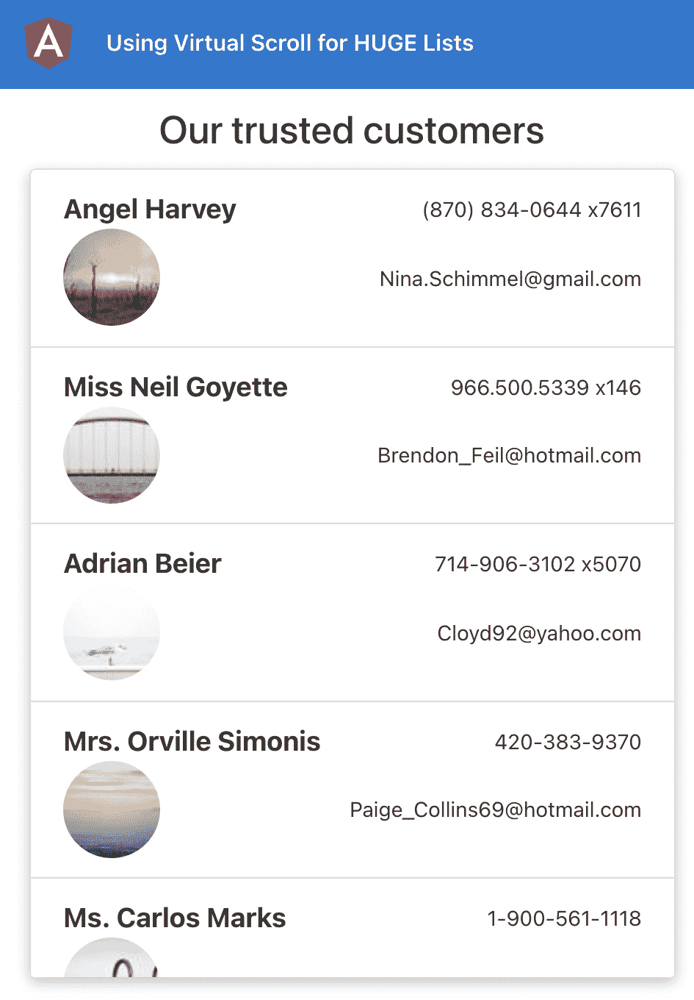

图 9.1–在上运行的使用 cdk 虚拟滚动应用程序 http://localhost:4200

现在我们已经让应用程序在本地运行，让我们在下一节中查看配方的步骤。

## 怎么做…

我们有一个非常简单的 Angular 应用程序，但是有很多数据。现在，它显示一个加载器（按钮）大约 3 秒钟，然后应该显示数据。但是，您会注意到，3 秒钟后，加载程序一直显示，按钮没有响应，我们看到一个空白的屏幕，如所示：

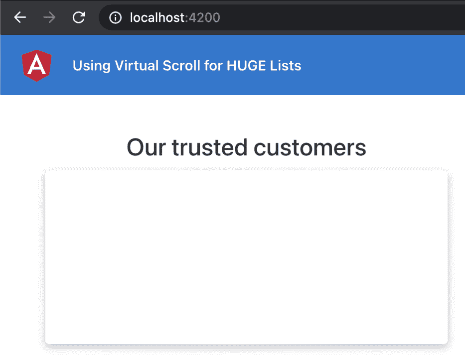

图 9.2–应用程序在呈现列表项时出现黑屏

事实上，我们的整个应用程序都没有响应。如果在项目之间滚动，甚至将鼠标悬停在项目上，您将看到列表项目上的悬停动画不平滑，并且有点滞后。让我们看看使用 Angular CDK Virtual Scroll 来提高渲染性能的步骤，如下所示：

1.  首先，打开一个新终端窗口/选项卡，确保您在`ch8/start_here/using-cdk-virtual-scroll`文件夹中。进入后，运行以下命令安装角度 CDK:

    ```ts
    npm install --save @angular/cdk@12.0.0
    ```

2.  您必须重新启动 Angular 服务器，因此重新运行`ng serve`命令。
3.  将`@angular/cdk`包中的`ScrollingModule`类添加到您的`app.module.ts`文件中，如下所示：

    ```ts
    ...
    import { LoaderComponent } from './components/loader/loader.component';
    import { ScrollingModule } from '@angular/cdk/scrolling';
    @NgModule({
      declarations: [...],
      imports: [
        ...
        HttpClientModule,
     ScrollingModule
      ],
      providers: [],
      bootstrap: [AppComponent]
    })
    export class AppModule { }
    ```

4.  我们现在必须实现虚拟滚动，修改`the-amazing-list-item.component.html`文件以使用`*cdkVirtualFor`指令而不是指令`*ngFor`指令，并将容器`<div>`元素更改为`<cdi-virtual-scroll-viewport>`元素，如下所示：

    ```ts
    <h4 class="heading">Our trusted customers</h4>
    <cdk-virtual-scroll-viewport
      class="list list-group"
      [itemSize]="110">
      <div
        class="list__item list-group-item"
        *cdkVirtualFor="let item of listItems">
        <div class="list__item__primary">
          ...
        </div>
        <div class="list__item__secondary">
          ...
        </div>
      </div>
    </cdk-virtual-scroll-viewport>
    ```

卡布姆！只需几步，通过使用 Angular CDK 虚拟滚动，我们就能够在 Angular 应用程序中修复一个大的渲染问题。现在您已经知道了基本路由是如何实现的，请参阅下一节以了解其工作原理。

## 它是如何工作的…

Angular CDK提供滚动 API，包括`*cdkVirtualFor`指令和`<cdk-virtual-scroll-viewport>`元素。有必要将其`*cdkVirtualFor`应用于包装。请注意，我们在名为`[itemSize]`的`cdk-virtual-scroll-viewport`元素上有一个属性，其值设置为`"110"`。原因是每个列表项的高度约为 110 像素，如以下屏幕截图所示：

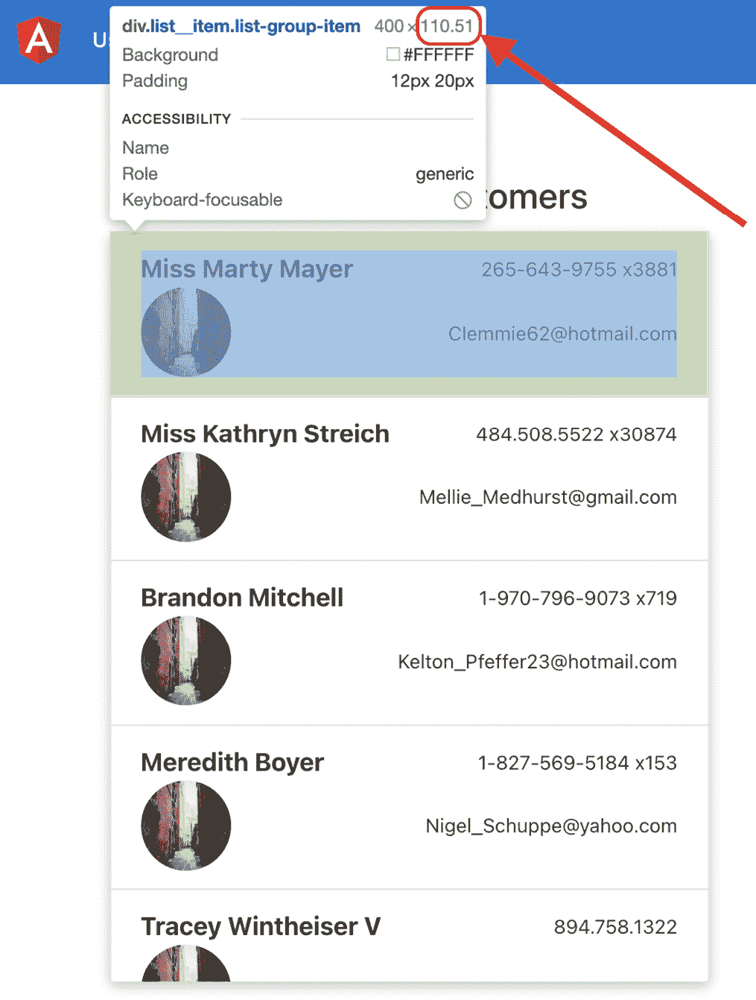

图 9.3–每个列表项的高度约为 110 像素

但是如何提高渲染性能？很高兴你这么问！在这个配方的原始代码中，当我们加载 10000 个用户时，它将为每个用户创建一个单独的具有`class="list__item list-group-item"`属性的`<div>`元素，从而创建 10000 个 DOM 元素，所有元素都将同时呈现。虚拟滚动到位后，CDK 只创建几个`<div>`元素，渲染它们，并在滚动项目时替换这些`<div>`元素的内容。

在我们的示例中，它恰好创建了九个`<div>`元素，如以下屏幕截图所示：

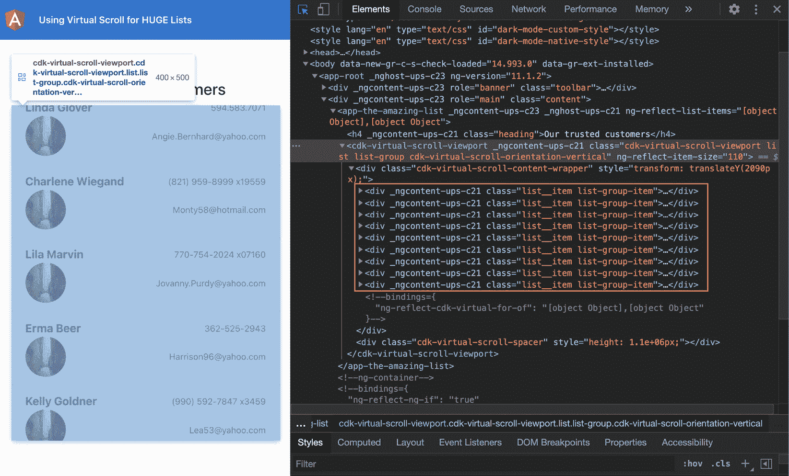

图 9.4–仅显示了由于虚拟滚动而在 DOM 上呈现的几个

元素

因为我们只有几个元素在 DOM 上渲染，所以我们不再有性能问题，悬停动画现在看起来也超级平滑。

提示

在您自己的应用程序中实现虚拟滚动时，请确保为`<cdk-virtual-scroll viewport>`元素设置了特定的高度，并将`[itemSize]`属性设置为以像素为单位的预期列表项高度，否则列表将不会显示。

## 另见

*   CDK滚动示例（[https://material.angular.io/cdk/scrolling/examples](https://material.angular.io/cdk/scrolling/examples)

# 列表的键盘导航

可访问性是构建具有良好用户体验的应用程序的最重要方面之一。这些应用程序不仅应该快速、高效，而且应该是可访问的。虽然在可访问性方面有很多事情要考虑，但是在这个食谱中，我们将通过为项目提供键盘导航来列出列表和列表项。使用角度 CDK，它非常简单。我们将使用 Angular 的**ListKeyManager**服务为目标应用程序中的用户列表实现键盘导航。

## 准备好了吗

此配方的项目位于`chapter09/start_here/using-list-key-manager`中。进行如下工作：

1.  在 VS 代码中打开项目。
2.  打开终端，运行`npm install`安装项目的依赖项。
3.  Once done, run `ng serve -o`.

    这将在新的浏览器选项卡中打开应用程序，如下所示：


图 9.5–在上运行的 using list key manager 应用程序 http://localhost:4200

现在我们已经让应用程序在本地运行，让我们在下一节中查看配方的步骤。

## 怎么做…

我们有一个应用程序，它已经有了角度 CDK 的一些优点，也就是说，它有从上一个配方实现的虚拟滚动。我们现在将开始对应用程序进行更改，以实现键盘导航，如下所示：

1.  首先，我们需要为列表中的每个项目创建一个新组件，因为我们需要它们能够使用`ListKeyManager`类。在项目中运行以下命令创建组件：

    ```ts
    ng g c components/the-amazing-list-item
    ```

2.  现在，我们将将项目标记的代码从`the-amazing-list-component.html`文件移到文件中。`the-amazing-list-item.component.html`文件中的代码应该如下所示：

    ```ts
     <div class="list__item__primary">
     <div class="list__item__primary__info">
     {{ item.name }}
     </div>
     <div class="list__item__primary__info">
     {{ item.phone }}
     </div>
     </div>
     <div class="list__item__secondary">
     <div class="list__item__secondary__info">
     
     </div>
     <div class="list__item__secondary__info">
     {{ item.email }}
     </div>
     </div>
    ```

3.  让我们更新相应的组件，以包括模板中使用的这个`item`属性。我们将把它作为`TheAmazingListItemComponent`课程的`@Input()`项目。更新`the-amazing-list-item.component.ts`文件，如下所示：

    ```ts
    import { Component, Input, OnInit, ViewEncapsulation } from '@angular/core';
    import { AppUserCard } from 'src/interfaces/app-user-card.interface';
    @Component({
      selector: 'app-the-amazing-list-item',
      templateUrl: './the-amazing-list-item.component.html',
      styleUrls: ['./the-amazing-list-item.component.scss'],
      encapsulation: ViewEncapsulation.None
    })
    export class TheAmazingListItemComponent implements OnInit {
      @Input() item: Partial<AppUserCard>;
      constructor() { }
      ngOnInit(): void {
      }
    }
    ```

4.  让我们也添加样式。我们将从`the-amazing-list.component.scss`文件复制样式并粘贴到`the-amazing-list-item.component.scss`文件中，如下所示：

    ```ts
    .list__item {
      transition: all ease 1s;
      cursor: pointer;
      &:hover, &:focus {
        background-color: #ececec; transform: scale(1.02);
      }
      &__primary,
      &__secondary {
        display: flex;
        justify-content: space-between;
        align-items: center;
        &__info { font-size: small; }
      }
      &__primary {
        &__info {
          &:nth-child(1) { font-weight: bold; font-size:       larger; }
        }
      }
      img { border-radius: 50%; width: 60px; height: 60px; }
    }
    ```

5.  ```ts
    .heading {
      text-align: center;
      margin-bottom: 10px;
    }
    .list {
      box-shadow: rgba(0, 0, 0, 0.24) 0px 3px 8px;
      height: 500px;
      overflow: scroll;
      min-width: 400px;
      max-width: 960px;
      width: 100%;
    }
    ```

    只包含的文件
6.  现在，更新`the-amazing-list.component.html`文件以使用`<app-the-amazing-list-item>`组件并将`[item]`属性传递给它，如下所示：

    ```ts
    <h4 class="heading">Our trusted customers</h4>
    <cdk-virtual-scroll-viewport
      class="list list-group"
      [itemSize]="110">
      <app-the-amazing-list-item
     class="list__item list-group-item"
     *cdkVirtualFor="let item of listItems"
     [item]="item">
     </app-the-amazing-list-item>
    </cdk-virtual-scroll-viewport>
    ```

7.  **用户界面**（**UI**已经基本完成。现在我们将为我们的`TheAmazingListItemComponent`类实现`FocusableOption`接口和一些可访问性因素，如下所示：

    ```ts
    import { Component, Input, OnInit, ViewEncapsulation } from '@angular/core';
    import { AppUserCard } from 'src/interfaces/app-user-card.interface';
    import { FocusableOption } from '@angular/cdk/a11y';
    @Component({
      selector: 'app-the-amazing-list-item',
      templateUrl: './the-amazing-list-item.component.html',
      styleUrls: ['./the-amazing-list-item.component.scss'],
      encapsulation: ViewEncapsulation.None,
      host: {
     tabindex: '-1',
     role: 'list-item',
     },
    })
    export class TheAmazingListItemComponent implements OnInit, FocusableOption {
      @Input() item: Partial<AppUserCard>;
      constructor() { }
      focus() { }
      ngOnInit(): void {
      }
    }
    ```

8.  我们现在需要实现`focus()`方法中发生的事情。我们将使用`ElementRef`服务获取`nativeElement`，并将在其上设置`focus()`，如下所示：

    ```ts
    import { Component, ElementRef, Input, OnInit, ViewEncapsulation } from '@angular/core';
    import { AppUserCard } from 'src/interfaces/app-user-card.interface';
    import { FocusableOption } from '@angular/cdk/a11y';
    @Component({...})
    export class TheAmazingListItemComponent implements OnInit, FocusableOption {
      @Input() item: Partial<AppUserCard>;
      constructor(private el: ElementRef) { }
      focus() {
        this.el.nativeElement.focus();
      }
      ...
    }
    ```

9.  我们现在需要在我们的`TheAmazingListComponent`类中实现`FocusKeyManager`类。我们必须查询组件中的列表项才能创建`FocusKeyManager`类的实例。更新`the-amazing-list.component.ts`文件，如所示：

    ```ts
    import { FocusKeyManager } from '@angular/cdk/a11y';
    import { AfterViewInit, Component, Input, OnInit, QueryList, ViewChildren } from '@angular/core';
    import { AppUserCard } from 'src/interfaces/app-user-card.interface';
    import { TheAmazingListItemComponent } from '../the-amazing-list-item/the-amazing-list-item.component';
    @Component({
      ...
      styleUrls: ['./the-amazing-list.component.scss'],
     host: { role: 'list' }
    })
    export class TheAmazingListComponent implements OnInit, AfterViewInit {
      @Input() listItems: Partial<AppUserCard>[] = [];
      @ViewChildren(TheAmazingListItemComponent)   listItemsElements: QueryList   <TheAmazingListItemComponent>;
      private listKeyManager:   FocusKeyManager<TheAmazingListItemComponent>;
      constructor() { }
      ...
      ngAfterViewInit() {
     this.listKeyManager = new FocusKeyManager(
     this.listItemsElements
     );
     }
    }
    ```

10.  最后，我们需要收听键盘事件。为此，您可以使用`keydown`事件或`window:keydown`事件。为了简单起见，我们将使用`window:keydown`事件，如下所示：

    ```ts
    import { FocusKeyManager } from '@angular/cdk/a11y';
    import { AfterViewInit, Component, HostListener, Input, OnInit, QueryList, ViewChildren } from '@angular/core';
    ...
    @Component({...})
    export class TheAmazingListComponent implements OnInit, AfterViewInit {
      ...
      @HostListener('window:keydown', ['$event'])
     onKeydown(event) {
     this.listKeyManager.onKeydown(event);
     }
      constructor() { }
      ...
    }
    ```

太棒了！您刚刚学习了如何使用角度 CDK 实现键盘导航。请参阅下一节以了解其工作原理。

## 它是如何工作的…

角度 CDK 提供`ListKeyManager`类，允许您实现键盘导航。我们可以在`ListKeyManager`类中使用很多技术，对于这个特殊的配方，我们选择了`FocusKeyManager`类。为了使其适用于项目列表，我们需要执行以下操作：

1.  为列表中的每个项目创建一个组件。
2.  在列表组件中使用`ViewChildren()`和`QueryList`查询所有列表项组件。
3.  在列表组件中创建一个`FocusKeyManager`实例，提供列表项组件的类型。
4.  向列表组件添加一个键盘侦听器，并将事件传递给`FocusKeyManager`类的实例。

在`TheAmazingListComponent`类中定义`listKeyManager`属性时，我们也通过将其指定为`FocusKeyManager<TheAmazingListItemComponent>`来定义其类型。这使得我们更容易理解我们的`FocusKeyManager`类应该使用`TheAmazingListItemComponent`元素数组。因此，在`ngAfterViewInit()`方法中，我们指定了`this.listKeyManager = new FocusKeyManager(this.listItemsElements);`，它提供了`TheAmazingListItemComponent`元素的查询列表。

最后，当我们监听`window:keydown`事件时，我们将处理程序中接收到的`keydown`事件作为`this.listKeyManager.onKeydown(event);`提供给`FocusKeyManager`类的实例。这告诉我们的`FocusKeyManager`实例按下了哪个键以及它必须做什么。

请注意，我们的`TheAmazingListItemComponent`类实现了`FocusableOption`接口，它还有`focus()`方法，当我们按下键盘上的向下箭头键或向上箭头键时，`FocusKeyManager`类在后台使用该方法。

## 另见

*   角度 CDK 可访问性文档（[https://material.angular.io/cdk/a11y/overview](https://material.angular.io/cdk/a11y/overview)

# 带有叠加 API 的尖尖小弹出框

这是本书中的一个高级食谱，特别是对于那些已经使用 Angular 一段时间的人来说。在这个方法中，我们不仅将使用CDK Overlay API 创建一些弹出窗口，还将使它们变得尖锐，就像工具提示一样，这就是乐趣所在。

## 准备好了吗

此配方的项目位于`chapter09/start_here/pointy-little-popovers`中。进行如下工作：

1.  在 VS 代码中打开项目。
2.  打开终端，运行`npm install`安装项目的依赖项。
3.  Once done, run `ng serve -o`.

    这将在新的浏览器选项卡中打开应用程序，如下所示：

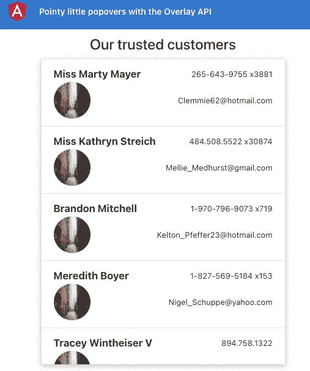

图 9.6–运行在桌面上的尖尖小弹出应用程序 http://localhost:4200

现在我们已经有了本地运行的应用程序，让我们在下一节中查看配方的步骤。

## 怎么做…

我们的应用程序有一个用户列表，我们可以在页面上滚动浏览。我们将为每个项目添加一个弹出菜单，以便显示带有一些操作的下拉菜单。我们已经安装了`@angular/cdk`软件包，所以我们不必担心。让我们从菜谱开始，如下所示：

1.  首先，我们需要安装`@angular/cdk`，因为我们需要将`OverlayModule`类导入我们的`AppModule`类，以便我们可以使用覆盖 API。更新`app.module.ts`文件，如下所示：

    ```ts
    ...
    import { TheAmazingListItemComponent } from './components/the-amazing-list-item/the-amazing-list-item.component';
    import { OverlayModule } from '@angular/cdk/overlay';

    @NgModule({
      declarations: [...],
      imports: [
        ...
        ScrollingModule,
     OverlayModule
      ],
      providers: [],
      bootstrap: [AppComponent]
    })
    export class AppModule { }
    ```

2.  We'll first add the Overlay's default styles so that when the overlay is displayed, it is positioned correctly. Open the `src/styles.scss` file and update it as per the following gist:

    [https://gist.github.com/AhsanAyaz/b039814e898b3ebe471b13880c7b4270](https://gist.github.com/AhsanAyaz/b039814e898b3ebe471b13880c7b4270)

3.  现在，我们将创建变量来保存覆盖触发器（用于打开覆盖位置的原点）和实际相对位置的设置。打开`the-amazing-list.component.ts`文件并更新，如下所示：

    ```ts
    import { FocusKeyManager } from '@angular/cdk/a11y';
    import { CdkOverlayOrigin } from '@angular/cdk/overlay';
    ...
    @Component({...})
    export class TheAmazingListComponent implements OnInit, AfterViewInit {
      @Input() listItems: Partial<AppUserCard>[] = [];
      @ViewChildren(TheAmazingListItemComponent)   listItemsElements: QueryList   <TheAmazingListItemComponent>;
      popoverMenuTrigger: CdkOverlayOrigin;
     menuPositions = [
     { offsetY: 4, originX: 'end', originY: 'bottom',     overlayX: 'end', overlayY: 'top' },
     { offsetY: -4, originX: 'end', originY: 'top',     overlayX: 'end', overlayY: 'bottom' },
     ];
      private listKeyManager: FocusKeyManager   <TheAmazingListItemComponent>;
      ...
    }
    ```

4.  现在，打开文件`the-amazing-list.component.html`并将`cdkOverlayOrigin`指令添加到`<app-the-amazing-list-item>`选择器中，以便我们可以将每个列表项作为弹出菜单的原点，如下所示：

    ```ts
    <h4 class="heading">Our trusted customers</h4>
    <cdk-virtual-scroll-viewport
      class="list list-group"
      [itemSize]="110">
      <app-the-amazing-list-item
     cdkOverlayOrigin #itemTrigger="cdkOverlayOrigin"
        class="list__item list-group-item"
        *cdkVirtualFor="let item of listItems"
        [item]="item">
      </app-the-amazing-list-item>
    </cdk-virtual-scroll-viewport>
    ```

5.  我们需要以某种方式将模板中的`#itemTrigger`变量传递给`TheAmazingListComponent`类中的`popoverMenuTrigger`属性。为此，在`the-amazing-list.component.ts`文件中创建一个名为`openMenu()`的方法，如下所示：

    ```ts
    ...
    @Component({...})
    export class TheAmazingListComponent implements OnInit, AfterViewInit {
      ...
      ngOnInit(): void {
      }
      openMenu($event, itemTrigger) {
     if ($event) {
     $event.stopImmediatePropagation();
     }
     this.popoverMenuTrigger = itemTrigger;
     }
      ...
    }
    ```

6.  我们还需要一个属性来显示/隐藏弹出菜单。让我们创建它，并在`openMenu()`方法中将其设置为`true`。更新`the-amazing-list.component.ts`文件，如下所示：

    ```ts
    ...
    @Component({...})
    export class TheAmazingListComponent implements OnInit, AfterViewInit {
      ...
      popoverMenuTrigger: CdkOverlayOrigin;
      menuShown = false;
      ...
      openMenu($event, itemTrigger) {
        if ($event) {
          $event.stopImmediatePropagation();
        }
        this.popoverMenuTrigger = itemTrigger;
        this.menuShown = true;
      }
      ...
    }
    ```

7.  现在我们将创建一个实际覆盖。为此，我们将使用指令创建一个`<ng-template>`元素。修改您的`the-amazing-list.component.html`文件，如下所示：

    ```ts
    <h4 class="heading">Our trusted customers</h4>
    <cdk-virtual-scroll-viewport>
      ...
    </cdk-virtual-scroll-viewport>
    <ng-template cdkConnectedOverlay [cdkConnectedOverlayOrigin]="popoverMenuTrigger"
     [cdkConnectedOverlayOpen]="menuShown"   [cdkConnectedOverlayHasBackdrop]="true"
     (backdropClick)="menuShown = false"
     [cdkConnectedOverlayPositions]="menuPositions"
     cdkConnectedOverlayPanelClass="menu-popover"
     >
     <div class="menu-popover__list">
     <div class="menu-popover__list__item">
     Duplicate
     </div>
     <div class="menu-popover__list__item">
     Edit
     </div>
     <div class="menu-popover__list__item">
     Delete
     </div>
     </div>
    </ng-template>
    ```

8.  我们需要点击列表项，将在每个列表项上的`#itemTrigger`变量传递给`openMenu()`方法。更新文件，如下所示：

    ```ts
    <h4 class="heading">Our trusted customers</h4>
    <cdk-virtual-scroll-viewport
      class="list list-group"
      [itemSize]="110">
      <app-the-amazing-list-item
        class="list__item list-group-item"
        *cdkVirtualFor="let item of listItems"
        (click)="openMenu($event, itemTrigger)"
        cdkOverlayOrigin #itemTrigger="cdkOverlayOrigin"
        [item]="item">
      </app-the-amazing-list-item>
    </cdk-virtual-scroll-viewport>
    <ng-template>
      ...
    </ng-template>
    ```

9.  If you refresh the app now and click on any of the list items, you should see a drop-down menu being shown, as follows:

    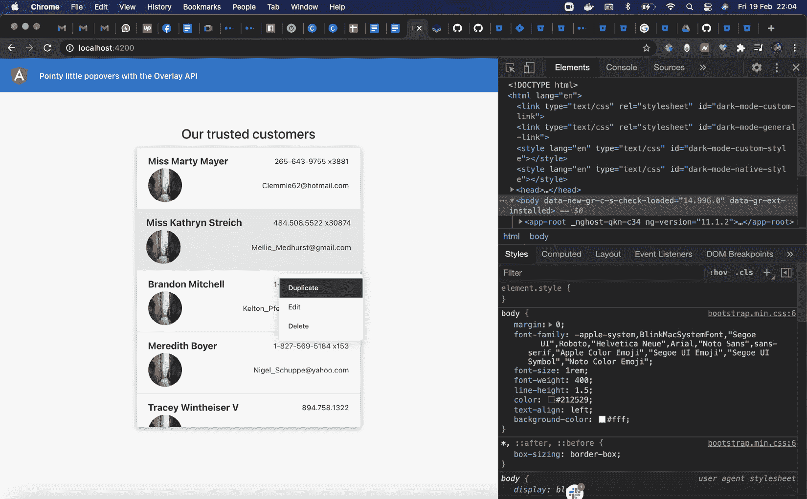

    图 9.7–每个列表项的工作下拉菜单

10.  We now have to implement the part where we show a pointy little arrow with the drop-down menu so that we can correlate the drop-down menu with the list item. First, add the following styles to the `.popover-menu` class in the `src/styles.scss` file:

    ```ts
    ...
    .menu-popover {
      min-width: 150px;
      height: auto;
      border: 1px solid white;
      border-radius: 8px;
      &::before {
     top: -10px;
     border-width: 0px 10px 10px 10px;
     border-color: transparent transparent white     transparent;
     position: absolute;
     content: '';
     right: 5%;
     border-style: solid;
     }
      &__list {...}
    }
    ```

    您现在应该可以在下拉菜单的右上角看到一个尖箭头，但如果您尝试单击屏幕上的最后一项，您将看到下拉菜单向上打开，但仍在顶部显示指针，如下所示：

    

    图 9.8–指向错误列表项的下拉箭头

11.  为了指向弹出/下拉菜单的实际来源，我们需要实现一个应用自定义类的自定义指令。让我们先创建一个指令，如下所示：

    ```ts
    ng g directive directives/popover-positional-class
    ```

12.  Update the code in the `popover-positional-class.directive.ts` generated file as per the following gist:

    [https://gist.github.com/AhsanAyaz/f28893e90b71cc03812287016192d294](https://gist.github.com/AhsanAyaz/f28893e90b71cc03812287016192d294)

13.  现在，打开文件将我们的指令应用于`cdkConnectedOverlay`指令。更新文件中的`<ng-template>`元素，如下所示：

    ```ts
    ...
    <ng-template cdkConnectedOverlay [cdkConnectedOverlayOrigin]="popoverMenuTrigger"
      [cdkConnectedOverlayOpen]="menuShown"   [cdkConnectedOverlayHasBackdrop]="true"
      (backdropClick)="menuShown = false"   [cdkConnectedOverlayPositions]="menuPositions"
      appPopoverPositionalClass targetSelector=  ".menu-popover" inverseClass="menu-popover--up"
     [originY]="menuPopoverOrigin.originY"   (positionChange)="popoverPositionChanged($event,   menuPopoverOrigin)"
      cdkConnectedOverlayPanelClass="menu-popover"
      >
      <div class="menu-popover__list">
        ...
      </div>
    </ng-template>
    ```

14.  我们现在需要在`the-amazing-list.component.ts`文件中创建`menuPopoverOrigin`属性和`popoverPositionChanged()`方法。将更新为如下：

    ```ts
    ...
    import { AfterViewInit, ChangeDetectorRef, Component, HostListener, Input, OnInit, QueryList, ViewChildren } from '@angular/core';
    ...
    @Component({...})
    export class TheAmazingListComponent implements OnInit, AfterViewInit {
      ...
      menuPositions = [...];
      menuPopoverOrigin = {
     originY: null
     }
      ...
      constructor(private cdRef: ChangeDetectorRef) { }
      popoverPositionChanged($event, popover) {
     if (popover.originY !== $event.connectionPair.    originY) {
     popover.originY = $event.connectionPair.originY;
     }
     this.cdRef.detectChanges();
     }
      ...
    }
    ```

15.  Finally, let's reverse the popover pointer using this inverse class. Update the `src/styles.scss` file to add the following styles:

    ```ts
    ...
    .menu-popover {
      ...
      &::before {...}
      &--up {
     transform: translateY(-20px);
     &::before {
     top: unset !important;
     transform: rotate(180deg);
     bottom: -10px;
     }
     }
      &__list {...}
    }
    ```

    瞧！如果现在刷新页面并点击每个列表项，您将看到箭头指向正确的方向。请参阅以下屏幕截图，查看最后一个项目的向下弹出箭头，因为弹出箭头显示在项目上方：


图 9.9–指向正确列表项的下拉箭头（指向下方）

伟大的您现在知道如何使用角度 CDK 与覆盖层一起创建自定义弹出/下拉菜单。此外，您现在知道如何使用自定义指令快速实现菜单上的尖箭头。请参阅下一节以了解其工作原理。

## 它是如何工作的…

使用 Angular CDK overlay API 实现一个覆盖包括两个部分。我们首先必须在`AppModule`导入中导入`OverlayModule`类。然后，为了创建覆盖，我们需要一个覆盖和一个覆盖触发器。在这个配方中，因为我们使用覆盖为每个列表项创建一个弹出菜单，所以我们在`<app-the-amazing-list-item>`元素上使用`cdkOverlayOrigin`指令。注意元素是通过`*ngFor`指令呈现的。因此，为了知道单击了哪个项目，或者准确地知道需要为哪个项目显示 popover，我们在每个列表项目元素上创建了一个`#itemTrigger`模板变量，您会注意到我们还绑定了列表项目上的`(click)`事件来调用`openMenu()`方法，将这个`itemTrigger`模板变量传递给它。

现在，如果您注意到`the-amazing-list.component.ts`文件中的`openMenu()`方法，它看起来是这样的：

```ts
openMenu($event, itemTrigger) {
    if ($event) {
      $event.stopImmediatePropagation();
    }
    this.popoverMenuTrigger = itemTrigger;
    this.menuShown = true;
  }
```

请注意，我们将`itemTrigger`属性指定给类的`popoverMenuTrigger`属性。这是因为这个`popoverMenuTrigger`属性与我们模板中的实际覆盖绑定在一起。您还可以看到，我们将`menuShown`属性设置为`true`，这是因为它将决定是显示还是隐藏覆盖。

现在，让我们看看实际覆盖的代码，如下所示：

```ts
<ng-template cdkConnectedOverlay [cdkConnectedOverlayOrigin]="popoverMenuTrigger"
  [cdkConnectedOverlayOpen]="menuShown"   [cdkConnectedOverlayHasBackdrop]="true"
  (backdropClick)="menuShown = false"   [cdkConnectedOverlayPositions]="menuPositions"
  appPopoverPositionalClass targetSelector=".menu-popover"   inverseClass="menu-popover--up"
  [originY]="menuPopoverOrigin.originY"   (positionChange)="popoverPositionChanged($event, menuPopoverOrigin)"
  cdkConnectedOverlayPanelClass="menu-popover"
  >
  ...
</ng-template>
```

让我们逐一讨论`cdkConnectedOverlay`指令的每个属性：

*   `cdkConnectedOverlay`属性：这是使`<ng-template>`元素成为角度 CDK 覆盖的实际覆盖指令。
*   `[cdkConnectedOverlayOrigin]`属性：这告诉覆盖 API 这个覆盖的来源是什么，这是为了帮助 CDK 在打开时决定将覆盖放置在何处。
*   `[cdkConnectedOverlayOpen]`属性：决定是否显示覆盖。
*   `[cdkConnectedOverlayHasBackdrop]`属性：这决定覆盖是否应该有背景，也就是说，如果有背景，用户在打开覆盖时应该不能单击除覆盖之外的任何其他内容。
*   `(backdropClick)`属性：这是单击背景时的事件处理程序。在本例中，我们将`menuShown`属性设置为`false`，这将隐藏/关闭覆盖。
*   `[cdkConnectedOverlayPositions]`属性：为叠加 API 提供定位配置。它是一组首选位置，用于定义覆盖是否应显示在原点下方、原点上方、左侧上、右侧、距离原点多远等位置。
*   `[cdkConnectedOverlayPanelClass]`属性：一个**级联样式表**（**CSS**）类，将应用于生成的覆盖。这是用于造型的。

正确设置所有属性后，我们可以在点击列表项时看到覆盖工作。*“但是尖箭呢，阿桑？”*好的，等等！我们也会讨论的。

因此，Angular CDK Overlay API 已经涵盖了很多内容，包括根据可用空间将覆盖放置在何处，由于我们希望显示尖箭头，因此我们必须分析覆盖是显示在项目上方还是项目下方。默认情况下，`src/styles.scss`文件中设置了以下样式，以显示 popover 下方的尖箭头：

```ts
.menu-popover {
  ...
  &::before {
 top: -10px;
 border-width: 0px 10px 10px 10px;
 border-color: transparent transparent white  transparent;
 position: absolute;
 content: '';
 right: 5%;
 border-style: solid;
 }
  &--up {...}
  &__list {...}
}
```

然后，我们有`--up`修饰符类，如下所示，以显示 popover 上方的覆盖层*：*

```ts
.menu-popover {
  ...
  &::before {...}
  &--up {
    transform: translateY(-20px);
 &::before {
 top: unset !important;
 transform: rotate(180deg);
 bottom: -10px;
 }
  }
  &__list {...}
}
```

请注意，在前面的代码片段中，我们将箭头旋转到`180deg`以反转其指针。

现在，让我们谈谈如何以及何时应用这个`--up`修饰符类。我们已经创建了一个名为`appPopoverPositionalClass`的自定义指令。该指令也适用于覆盖的`<ng-template>`元素，也就是说，该指令与`cdkConnectedOverlay`指令一起应用，需要以下输入属性：

*   `appPopoverPositionalClass`属性：实际的指令选择器。
*   `targetSelector`属性：Angular CDK Overlay API 生成的元素的查询选择器。理想情况下，这应该与我们在`cdkConnectedOverlayPanelClass`中使用的相同。
*   `inverseClass`属性：覆盖的垂直位置（`originY`改变时要应用的类，即从`"top"`变为`"bottom"`，反之亦然。
*   `originY`属性：当前叠加的`originY`位置。根据叠加位置，该值为`"top"`或`"bottom"`。

我们在 CDK 覆盖层`<ng-template>`元素上有一个`(positionChange)`侦听器，一旦覆盖层位置发生变化，它就会触发`popoverPositionChanged()`方法。请注意，在`popoverPositionChanged()`方法中，在获得新位置后，我们更新更新`menuPopoverOrigin.originY`的`popover.originY`属性，然后我们还将`menuPopoverOrigin.originY`作为`[originY]`属性传递给`appPopoverPositionalClass`指令。由于我们将其传递给指令，指令知道覆盖位置在任何特定时间是`"top"`还是`"bottom"`。怎样因为我们在指令中使用`ngOnChanges`生命周期钩子来监听`originY`属性/输入，一旦我们得到`originY`的不同值，我们要么将`inverseClass`的值作为 CSS 类添加到覆盖元素中，要么根据`originY`属性的值将其移除。此外，根据应用的 CSS 类，为覆盖确定弹出箭头的方向。

## 另见

*   角度CDK 叠加 API（[https://material.angular.io/cdk/overlay/overview](https://material.angular.io/cdk/overlay/overview)
*   `CdkOverlayOrigin`指令文件（[https://material.angular.io/cdk/overlay/api#CdkOverlayOrigin](https://material.angular.io/cdk/overlay/api#CdkOverlayOrigin)

# 使用 CDK 剪贴板与系统剪贴板协同工作

随着时间的推移，您可能已经访问了数百个网站，并且您可能已经在其中一些网站上看到了名为**点击复制**的功能。这通常在您需要复制长文本或链接时使用，您会发现只需单击进行复制比选择然后按键盘快捷键更方便。在本教程中，我们将学习如何使用 Angular CDK 剪贴板 API 将文本复制到剪贴板。

## 准备好了吗

此配方的项目位于`chapter09/start_here/using-cdk-clipboard-api`中。进行如下工作：

1.  在 VS 代码中打开项目。
2.  打开终端，运行`npm install`安装项目的依赖项。
3.  Once done, run `ng serve -o`.

    这将在新的浏览器选项卡中打开应用程序，如下所示：


图 9.10–使用在上运行的 cdk 剪贴板 apihttp://localhost:4200

现在我们已经有了本地运行的应用程序，让我们在下一节中查看配方的步骤。

## 怎么做…

我们现在有一个应用程序，有几个选项不起作用，也就是说，我们应该能够复制链接、文本区域的文本和图像。为此，我们将使用 CDK 剪贴板 API。让我们开始吧。

1.  首先，我们需要将`ClipboardModule`类导入到我们`AppModule`类的`imports`数组中。修改`app.module.ts`文件，如下所示：

    ```ts
    ...
    import { ClipboardModule } from '@angular/cdk/clipboard';
    @NgModule({
      declarations: [...],
      imports: [
        BrowserModule,
        AppRoutingModule,
     ClipboardModule
      ],
      ...
    })
    export class AppModule { }
    ```

2.  Now, we'll apply the `click-to-copy` functionality to the link. In order to do so, we'll use the `cdkCopyToClipboard` directive and will apply it on our link input in the `app.component.html` file, as follows:

    ```ts
    ...
    <div class="content" role="main">
      <div class="content__container">
        <div class="content__container__copy-from">
          <h3>Copy From</h3>
          <div class="mb-3 content__container__copy-from__      input-group">
            <input
              #linkInput
     [cdkCopyToClipboard]="linkInput.value"
              (click)="copyContent($event, contentTypes.          Link)"
              class="form-control"
              type="text" readonly="true"
              value="...">
            <div class="hint">...</div>
          </div>
          ...
      </div>
    </div>
    ```

    如果您现在点击链接输入，然后尝试将其粘贴到任何地方（应用程序内部或外部），您应该会看到链接的值。

3.  现在，我们将对文本输入进行类似的操作，即`<textarea>`。再次更新模板，如下所示：

    ```ts
    ...
    <div class="content" role="main">
      <div class="content__container">
        <div class="content__container__copy-from">
          <h3>Copy From</h3>
          ...
          <div class="mb-3 content__container__copy-from__      input-group">
            <textarea
              #textInput
              class="form-control"
              rows="5">{{loremIpsumText}}</textarea>
            <button
              [cdkCopyToClipboard]="textInput.value"
              (click)="copyContent($event, contentTypes.          Text)"
              class="btn btn-dark">
              {{ contentCopied === contentTypes.Text ?           'Text copied' : 'Copy text to clipboard'}}
            </button>
          </div>
          ...
      </div>
    </div>
    ```

4.  最后，我们将对图像做不同的处理。由于 CDK 剪贴板 API 仅适用于字符串，我们将下载图像，将其转换为 blob，并复制 blob**统一资源定位器**（**URL**）。我们先用逻辑更新模板，如下：

    ```ts
    ...
    <div class="content" role="main">
      <div class="content__container">
        <div class="content__container__copy-from">
          <h3>Copy From</h3>
          ...
          <div class="mb-3 content__container__copy-from__      input-group">
            
            <button
              (click)="copyImageUrl(imageUrl);           copyContent($event, contentTypes.Image)"
              class="btn btn-dark">
                ...
            </button>
          </div>
        </div>
        ...
      </div>
    </div>
    ```

5.  现在，让我们实现`copyImageUrl()`方法来获取图像，将其转换为 blob，并将 URL 复制到剪贴板。更新`app.component.ts`文件，如下所示：

    ```ts
    import { Clipboard } from '@angular/cdk/clipboard';
    import { Component, HostListener, OnInit } from '@angular/core';
    ...
    @Component({...})
    export class AppComponent implements OnInit {
      ...
      constructor(private clipboard: Clipboard) {
        this.resetCopiedHash();
      }
      async copyImageUrl(srcImageUrl) {
     const data = await fetch(srcImageUrl);
     const blob = await data.blob();
     this.clipboard.copy(URL.createObjectURL(blob));
     }
      ...
    }
    ```

伟大的通过此更改，您可以尝试刷新应用程序。现在，您应该能够通过分别单击输入链接和按钮来复制链接、文本以及图像。要了解此配方背后的所有魔力，请参阅下一节。

## 它是如何工作的…

在配方中，我们使用了 CDK 剪贴板 API 中的两个主要内容，一个是`cdkCopyToClipboard`指令，另一个是`Clipboard`服务。`cdkCopyToClipboard`指令将点击处理程序绑定到应用该指令的元素。它既是指令的选择器，又是指令的`@Input()`项，因此它知道在单击元素时要将哪个值复制到剪贴板。在我们的配方中，对于链接输入，请注意我们使用了`[cdkCopyToClipboard]="linkInput.value"`。这会将点击处理程序绑定到`<input>`元素，还绑定`linkInput`模板变量的`value`属性，该属性指向要复制的实际链接的输入值。当我们单击输入时，它使用`linkInput.value`绑定访问输入的值，我们对`<text-area>`输入也这样做。唯一的区别是，`cdkCopyToClipboard`指令没有绑定到`<text-area>`元素本身。原因是我们希望将单击处理程序绑定到文本区域下方的按钮。因此，在复制文本的按钮上，我们有`[cdkCopyToClipboard]="textInput.value"`绑定。

对于图像，我们做了一些不同的事情。我们使用`@angular/cdk/clipboard`包中的`Clipboard`服务手动复制 blob URL。我们创建了一个名为`copyImageUrl()`的方法，当点击复制图像的按钮时调用该方法。我们将`imageUrl`属性传递给该方法，该方法依次下载图像，将其作为 blob 读取，并生成 blob URL，然后使用`Clipboard`服务的`copy()`方法将其复制到剪贴板。

## 另见

*   CDK 剪贴板文档（[https://material.angular.io/cdk/clipboard/overview](https://material.angular.io/cdk/clipboard/overview)

# 使用 CDK 拖放将项目从一个列表移动到另一个列表

您是否曾经使用过Trello board 应用程序，或者其他允许您将列表项从一个列表拖放到另一个列表的应用程序？好的，您可以使用 Angular CDK 轻松地做到这一点，在本教程中，您将学习 Angular CDK 拖放 API，以将项目从一个列表移动到另一个列表。您还将学习如何重新排列列表。

## 准备好了吗

我们将要处理的项目位于克隆存储库的`chapter09/start_here/using-cdk-drag-drop`中。进行如下工作：

1.  在 VS 代码中打开项目。
2.  打开终端，运行`npm install`安装项目的依赖项。
3.  Once done, run `ng serve -o`.

    这将在新的浏览器选项卡中打开应用程序，其外观如下所示：

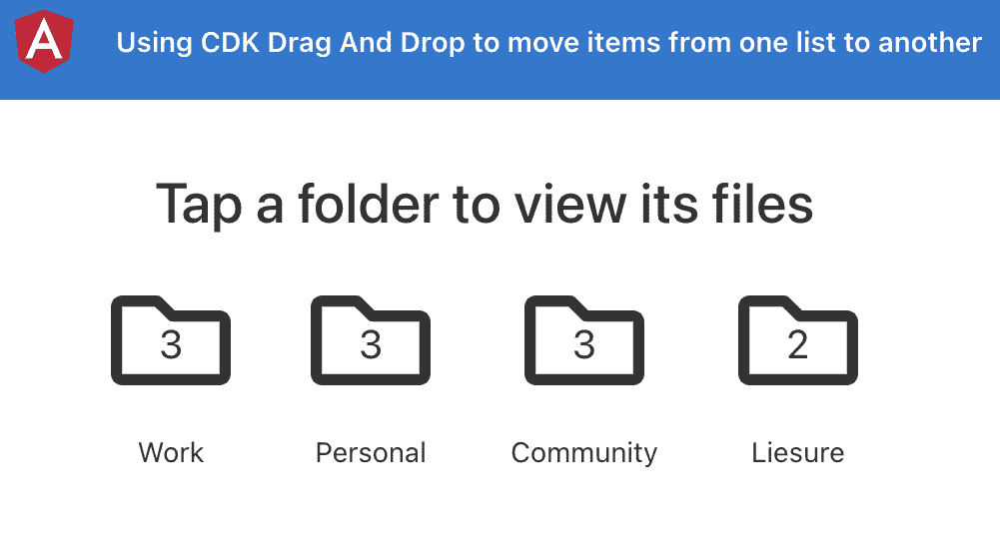

图 9.11–使用在上运行的 cdk 拖放应用程序 http://localhost:4200

现在我们已经有了本地运行的应用程序，让我们在下一节中查看配方的步骤。

## 怎么做…

对于这个食谱，我们有一个有趣的应用程序，它有一些文件夹和文件。我们将为要拖动到其他文件夹的文件实现拖放功能，这将立即更新文件夹的文件计数，并且我们也应该能够在新文件夹中看到文件。让我们开始吧。

1.  首先，我们需要将`DragDropModule`类导入到我们`AppModule`类的`imports`数组中。修改`app.module.ts`文件，如下所示：

    ```ts
    ...
    import {DragDropModule} from '@angular/cdk/drag-drop';
    @NgModule({
      declarations: [...],
      imports: [
        BrowserModule,
        AppRoutingModule,
        FontAwesomeModule,
     DragDropModule
      ],
      ...
    })
    export class AppModule { }
    ```

2.  现在，我们将对每个文件应用`cdkDrag`指令，并对每个文件夹应用`cdkDropList`指令。更新`folders-list.component.html`文件，如下所示：

    ```ts
    <div class="folders">
      ...
      <div class="folders__list">
        <app-folder
          cdkDropList
          ...
          [folder]="folder"
        >
        </app-folder>
      </div>
      <div class="folders__selected-folder-files"   *ngIf="selectedFolder">
        <div>
          <app-file
            cdkDrag
            *ngFor="let file of selectedFolder.files"
            [file]="file"
          ></app-file>
        </div>
      </div>
    </div>
    ```

3.  我们还将通过在文件的容器元素上添加`cdkDropList`指令来启用文件夹中文件的重新排序，如下所示：

    ```ts
    <div class="folders">
      ...
      <div class="folders__selected-folder-files"   *ngIf="selectedFolder">
        <div cdkDropList>
          <app-file ...></app-file>
        </div>
      </div>
    </div>
    ```

4.  现在，我们将通过在每个`<app-file>`元素上指定`[cdkDragData]`属性，在每个`<app-folder>`元素上指定`[cdkDropListData]`属性，以及在文件容器上指定拖放交互的起源。再次更新模板，如下所示：

    ```ts
    <div class="folders">
      ...
      <div class="folders__list">
        <app-folder
          cdkDropList
          [cdkDropListData]="folder.files"
          ...
        >
        </app-folder>
      </div>
      <div class="folders__selected-folder-files"   *ngIf="selectedFolder">
        <div
          cdkDropList
          [cdkDropListData]="selectedFolder.files"
        >
          <app-file
            cdkDrag
            [cdkDragData]="file"
            ...
          ></app-file>
        </div>
      </div>
    </div>
    ```

5.  我们现在需要实现当文件被删除时会发生什么。为此，我们将使用`(cdkDropListDropped)`事件处理程序。更新模板，如下所示：

    ```ts
    <div class="folders">
      ...
      <div class="folders__list">
        <app-folder
          cdkDropList
          [cdkDropListData]="folder.files"
          (cdkDropListDropped)="onFileDrop($event)"
          ...
        >
        </app-folder>
      </div>
      <div class="folders__selected-folder-files"   *ngIf="selectedFolder">
        <div
          cdkDropList
          [cdkDropListData]="selectedFolder.files"
          (cdkDropListDropped)="onFileDrop($event)"
        >
          ...
        </div>
      </div>
    </div>
    ```

6.  Finally, we need to implement the `onFileDrop` method. Update the `folders-list.component.ts` file, as follows:

    ```ts
    ...
    import {
     CdkDragDrop, moveItemInArray, transferArrayItem,
    } from '@angular/cdk/drag-drop';
    @Component({...})
    export class FoldersListComponent implements OnInit {
      ...
      onFileDrop(event: CdkDragDrop<string[]>) {
     if (event.previousContainer === event.container) {
     moveItemInArray(
     event.container.data, event.previousIndex,
     event.currentIndex
     );
     } else {
     transferArrayItem(
     event.previousContainer.data, event.container.        data,
     event.previousIndex, event.currentIndex
     );
     }
     }
    }
    ```

    如果您现在刷新应用程序并尝试将文件拖到文件夹中，您应该会看到如下内容：

    

    图 9.12–将文件拖放到另一个文件夹

    难看，不是吗？这是因为我们必须在接下来的步骤中修复拖放预览。

7.  为了处理拖放预览，我们需要使用`cdkDropListGroup`指令将它们封装到一个元素中。更新`folders-list.component.html`文件并将指令应用于具有`"folders"`类的元素，如下所示：

    ```ts
    <div class="folders" cdkDropListGroup>
    ...
    </div>
    ```

8.  要应用自定义拖动预览，我们使用一个应用了`*cdkDragPreview`指令的自定义元素。更新`folders-list.component.html`文件，如下所示：

    ```ts
    <div class="folders" cdkDropListGroup>
      ...
      <div class="folders__selected-folder-files"   *ngIf="selectedFolder">
        <div
          cdkDropList
          ...
        >
          <app-file
            cdkDrag
            ...
          >
            <fa-icon
     class="file-drag-preview"
     *cdkDragPreview
     [icon]="file.icon"
     ></fa-icon>
          </app-file>
        </div>
      </div>
    </div>
    ```

9.  我们还需要一些用于拖放预览的样式。更新`folders-list.component.scss`文件，如下所示：

    ```ts
    $folder-bg: #f5f5f5;
    $file-preview-transition: transform 250ms cubic-bezier(0, 0, 0.2, 1);
    .folders {...}
    .file-drag-preview {
     padding: 10px 20px;
     background: transparent;
     font-size: 32px;
    }
    .file-drop-placeholder {
     min-height: 60px;
     transition: $file-preview-transition;
     display: flex;
     align-items: center;
     justify-content: center;
     font-size: 32px;
    }
    ```

10.  我们还将添加一些样式，以确保在对文件夹中的项目重新排序时，其他列表项目能够顺利移动。更新`src/styles.scss`文件，如下所示：

    ```ts
    ...
    * {
      user-select: none;
    }
    /* Animate items as they're being sorted. */
    .cdk-drop-list-dragging .cdk-drag {
     transition: transform 250ms cubic-bezier(0, 0, 0.2, 1);
    }
    /* Animate an item that has been dropped. */
    .cdk-drag-animating {
     transition: transform 300ms cubic-bezier(0, 0, 0.2, 1);
    }
    ```

11.  现在，我们还需要创建一个 drop 预览模板。为此，我们在`preview`元素上使用`*cdkDragPlaceholder`指令。更新`folders-list.component.html`文件，如下所示：

    ```ts
    <div class="folders" cdkDropListGroup>
      ...
      <div class="folders__selected-folder-files" *ngIf="selectedFolder">
        <div cdkDropList ...>
          <app-file cdkDrag ...>
            <fa-icon class="file-drag-preview"
              *cdkDragPreview ... ></fa-icon>
            <div class="file-drop-placeholder"         *cdkDragPlaceholder>
     <fa-icon [icon]="upArrow"></fa-icon>
     </div>
          </app-file>
        </div>
      </div>
    </div>
    ```

12.  最后，让我们使用`@fortawesome`包中的`faArrowAltCircleUp`图标创建一个`upArrow`属性。更新`folders-list.component.ts`文件，如下所示：

    ```ts
    import { Component, OnInit } from '@angular/core';
    import { APP_DATA } from '../constants/data';
    import { IFolder } from '../interfaces';
    import { faArrowAltCircleUp } from '@fortawesome/free-regular-svg-icons';
    import {
      CdkDragDrop,
      moveItemInArray,
      transferArrayItem,
    } from '@angular/cdk/drag-drop';
    import { FileIconService } from '../core/services/file-icon.service';
    @Component({...})
    export class FoldersListComponent implements OnInit {
      folders = APP_DATA;
      selectedFolder: IFolder = null;
      upArrow = faArrowAltCircleUp;
      constructor(private fileIconService: FileIconService)   {...}
      ...
    }
    ```

轰！我们现在为整个拖放流程提供了无缝的**用户体验**（**UX**。喜欢吗？确保您在 Twitter 上共享快照，并将我标记为`@muhd_ahsanayaz`。

现在我们已经完成了配方，让我们在下一节中看看它是如何工作的。

## 它是如何工作的…

在这个食谱中有几个有趣的指令，我们将逐一介绍它们。首先，作为优秀的角度开发人员，我们将`DragDropModule`类导入`AppModule`的`imports`数组，以确保不会出现错误。然后，我们开始使文件可拖动。为此，我们将`*ngFor`指令应用于每个文件元素，从而向其添加`cdkDrag`指令。这告诉 Angular CDK 该元素将被拖动，因此 Angular CDK 将不同的处理程序绑定到每个要拖动的元素。

重要提示

默认情况下，角度组件不是块元素。因此，当将`cdkDrag`指令应用于角度组件（如`<app-file>`组件）时，可能会在拖动元素时限制应用 CDK 的动画。为了解决这个问题，我们需要为我们的组件元素设置一个`display: block;`。请注意，我们正在为`.folders__selected-folder-files__file`类应用`folders-list.component.scss`文件（*第 25 行*中）中所需的样式。

配置 drag 元素之后，我们对每个容器 DOM 元素使用`cdkDropList`指令，我们应该在其中放置文件。在我们的配方中，这是我们在屏幕上看到的每个文件夹，我们还可以对文件夹中的文件重新排序。因此，我们将`cdkDropList`指令应用于当前显示的文件的包装器元素，以及`*ngFor`在`folders`数组上循环的每个`<app-folder>`项。

然后，我们通过为每个可拖动的文件指定`[cdkDragData]="file"`来指定要拖动的`data`。这有助于我们在以后的过程中识别它，当我们将它放入当前文件夹或其他文件夹中时。我们还指定了在特定列表中删除该拖动项时将在哪个数组中添加该项，并通过在应用了`cdkDropList`指令的元素上指定`[cdkDropListData]="ARRAY"`语句来实现。当角度 CDK 结合来自`cdkDragData`和`cdkDropListData`属性的信息时，它可以很容易地识别项目是在同一个列表中还是在另一个列表中被拖放。

为了处理拖放文件时发生的情况，我们使用`cdkDropList`指令从元素上的角度 CDK 中提取`(cdkDropListDropped)`方法。我们将 CDK 发出的`$event`传递给我们的`onFileDrop()`方法。很棒的是，在`onFileDrop()`方法中，我们使用 Angular CDK 中的`moveItemInArray()`和`transferArrayItem()`辅助方法，用一个非常简单的逻辑来比较容器。也就是说，Angular CDK 为我们提供了足够的信息，我们可以很容易地获得整个功能。

在配方的最后，我们通过使用`*cdkDragPreview`指令，自定义使用自定义模板拖动文件时，拖动预览的外观。这告诉角度 CDK 不要立即渲染它，而是在开始拖动文件时用鼠标显示它。对于我们的配方，我们只显示文件的图标作为拖动预览。最后，我们还使用`*cdkDragPlaceholder`指令自定义拖放预览（或拖动占位符），该指令显示一个带有向上箭头图标的透明矩形，以反映拖放时项目将添加到的位置。当然，我们必须为拖放预览添加一些自定义样式。

## 另见

*   角度 CDK 拖拽和拖拽文件（[https://material.angular.io/cdk/drag-drop/overview](https://material.angular.io/cdk/drag-drop/overview)

# 使用 CDK Stepper API 创建多步骤游戏

如果您尝试通过互联网查找 CDK Stepper的示例，您会发现大量文章围绕使用 CDK Stepper API 创建多步骤表单展开，但由于它是一个基本的 Stepper，因此可以用于各种用例。在这个配方中，我们将使用 Angular CDK Stepper API 构建一个猜测游戏，在这个游戏中，用户将猜测掷骰子的输出。

## 准备好了吗

我们将要处理的项目位于克隆存储库的`chapter09/start_here/using-cdk-stepper`中。进行如下工作：

1.  在 VS 代码中打开项目。
2.  打开终端，运行`npm install`安装项目的依赖项。
3.  Once done, run `ng serve -o`.

    这将在新的浏览器选项卡中打开应用程序，您将看到如下内容：


图 9.13–使用在上运行的 cdk stepper 应用程序 http://localhost:4200

现在，让我们在下一节中看看如何使用 CDK Stepper API 创建一个多步骤游戏。

## 怎么做…

我们手头有一个非常简单但有趣的应用程序，它已经构建了两个组件，包括骰子组件、价值猜测组件和排行榜组件。我们将使用 StepperAPI 创建一个多步骤游戏。进行如下工作：

1.  首先，打开一个新的终端窗口/选项卡，确保您在`ch8/start_here/using-cdk-stepper`文件夹中。进入后，运行以下命令安装角度 CDK:

    ```ts
    npm install --save @angular/cdk@12.0.0
    ```

2.  您必须重新启动 Angular 服务器，因此重新运行`ng serve`命令。
3.  现在，从您的`app.module.ts`文件中的`@angular/cdk`包中导入`CdkStepperModule`类，如下所示：

    ```ts
    ...
    import { LeaderBoardComponent } from './components/leader-board/leader-board.component';
    import { CdkStepperModule } from '@angular/cdk/stepper';
    ...
    @NgModule({
      declarations: [...],
      imports: [BrowserModule, AppRoutingModule,   ReactiveFormsModule, CdkStepperModule],
      providers: [],
      bootstrap: [AppComponent],
    })
    export class AppModule {}
    ```

4.  现在让我们创建步进器组件。在项目文件夹中运行以下命令：

    ```ts
    ng g c components/game-stepper
    ```

5.  To make our component a `CdkStepper`, we need to provide it using the `CdkStepper` token and have to extend our component class from `CdkStepper` as well. We can remove the `constructor`, the `OnInit` implementation, and the `ngOnInit` method. Modify the `game-stepper.component.ts` file, as follows:

    ```ts
    import { Component } from '@angular/core';
    import { CdkStepper } from '@angular/cdk/stepper';
    @Component({
      selector: 'app-game-stepper',
      templateUrl: './game-stepper.component.html',
      styleUrls: ['./game-stepper.component.scss'],
     providers: [{ provide: CdkStepper, useExisting:   GameStepperComponent }],
    })
    export class GameStepperComponent extends CdkStepper {
    }
    ```

    请注意，我们已经删除了`ngOnInit`和`OnInit`生命周期的用法，因为我们不希望这些用于此组件。

6.  让我们为`<game-stepper>`组件添加模板。我们将首先添加显示步骤标签的标题。更新您的`game-stepper.component.html`文件，如下所示：

    ```ts
    <section class="game-stepper">
     <h3>
     <ng-container
     *ngIf="selected.stepLabel; else showLabelText"
     [ngTemplateOutlet]="        selected.stepLabel.template"
     >
     </ng-container>
     <ng-template #showLabelText>
     {{ selected.label }}
     </ng-template>
     </h3>
     </section>
    ```

7.  现在，我们将添加模板到中，显示所选步骤的主要内容。这非常简单。我们需要添加一个具有`[ngTemplateOutlet]`属性的 div，在这里我们将显示内容。更新`game-stepper.component.html`文件，如下所示：

    ```ts
    <section class="game-stepper">
      ...
      <section class="game-stepper__content">
     <div [ngTemplateOutlet]="selected ? selected.content     : null"></div>
     </section>
      ...
    </section>
    ```

8.  最后，我们将添加一个页脚元素，其中包含步进器的导航按钮——也就是说，我们应该能够使用这些导航按钮跳到下一步和上一步。进一步更新`game-stepper.component.html`文件，如下：

    ```ts
    <section class="game-stepper">
      ...
      <section class="game-stepper__content">
        <div [ngTemplateOutlet]="selected ? selected.content     : null"></div>
      </section>
      <footer class="game-stepper__navigation">
     <button
     class="game-stepper__navigation__button btn       btn-primary"
     cdkStepperPrevious
     [style.visibility]="steps.get(selectedIndex - 1) ?       'visible' : 'hidden'"
     >
     &larr;
     </button>
     <button
     class="game-stepper__navigation__button btn       btn-primary"
     cdkStepperNext
     [style.visibility]="steps.get(selectedIndex + 1) ?       'visible' : 'hidden'"
     >
     &rarr;
     </button>
     </footer>
    </section>
    ```

9.  让我们在`game-stepper`组件中添加一些样式。修改文件`game-stepper.component.scss`如下：

    ```ts
    .game-stepper {
     display: flex;
     flex-direction: column;
     align-items: center;
     &__navigation {
     width: 100%;
     display: flex;
     align-items: center;
     justify-content: space-between;
     > button {
     margin: 0 8px;
     }
     }

     &__content {
     min-height: 350px;
     display: flex;
     justify-content: center;
     align-items: center;
     flex-direction: column;
     }
     header,
     footer {
     margin: 10px auto;
     }
    }
    ```

10.  我们现在将用`<app-game-stepper>`组件将整个模板包装在`game.component.html`文件中。更新文件，如下所示：

    ```ts
    <app-game-stepper>
      <form (ngSubmit)="submitName()" [formGroup]="nameForm">
        ...
      </form>
      <app-value-guesser></app-value-guesser>
      <app-dice></app-dice>
      <app-leader-board></app-leader-board>
    </app-game-stepper>
    ```

11.  现在我们将修改`game.component.html`文件，将内部模板分解为多个步骤。为此，我们将使用`<cdk-step>`元素来包装每个步骤的内容。更新文件，如下所示：

    ```ts
    <app-game-stepper>
      <cdk-step>
        <form (ngSubmit)="submitName()"     [formGroup]="nameForm">
          ...
        </form>
      </cdk-step>
      <cdk-step>
        <app-value-guesser></app-value-guesser>
        <app-dice></app-dice>
      </cdk-step>
      <cdk-step>
        <app-leader-board></app-leader-board>
      </cdk-step>
    </app-game-stepper>
    ```

12.  Now, we'll add a label for each step to show our main content for the selected step—this is pretty simple to do. We need to add an `<ng-template>` element within each `<cdk-step>` element. Update the `game.component.html` file, as follows:

    ```ts
    <app-game-stepper>
      <cdk-step>
        <ng-template cdkStepLabel>Enter your     name</ng-template>
        <form (ngSubmit)="submitName()"     [formGroup]="nameForm">
          ...
        </form>
      </cdk-step>
      <cdk-step>
        <ng-template cdkStepLabel>Guess what the value     will be when the die is rolled</ng-template>
        <app-value-guesser></app-value-guesser>
        <app-dice></app-dice>
      </cdk-step>
      <cdk-step>
        <ng-template cdkStepLabel> Results</ng-template>
        <app-leader-board></app-leader-board>
      </cdk-step>
    </app-game-stepper>
    ```

    如果您刷新应用程序，您应该将第一步视为可见步骤，以及底部导航按钮，如下所示：

    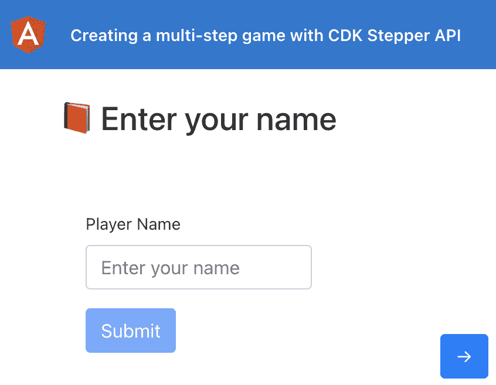

    图 9.14–第一步和使用 CDKStepper 的导航按钮

13.  现在，我们需要确保我们只有在第一步输入名称后才能进入第二步。对`game.component.html`文件进行以下更改：

    ```ts
    <app-game-stepper [linear]="true">
      <cdk-step [completed]="!!nameForm.get('name').value">
        <ng-template cdkStepLabel> Enter your     name</ng-template>
        <form (ngSubmit)="submitName()"     [formGroup]="nameForm">
          <div class="mb-3" *ngIf="nameForm.get('name')       as nameControl">
            ...
          </div>
          <button ← REMOVE THIS
     type="submit"
     [disabled]="!nameForm.valid"
     class="btn btn-primary"
     >
     Submit
     </button>
      </form>
      </cdk-step>
      ...
    </app-game-stepper>
    ```

14.  我们还需要在第一步上禁用下一个按钮，直到我们为玩家名称输入了一个值。为此，具体更新`game-stepper.component.html`文件，具有`cdkStepperNext`属性的元素如下：

    ```ts
    <section class="game-stepper">
      ...
      <footer class="game-stepper__navigation">
        ...
        <button
          class="game-stepper__navigation__button btn       btn-primary"
          cdkStepperNext
          [disabled]="!selected.completed"
          [style.visibility]="steps.get(selectedIndex + 1) ?       'visible' : 'hidden'"
        >
          &rarr;
        </button>
      </footer>
    </section>
    ```

15.  为了处理用户提供名称并点击*Enter*键导致表单提交的情况，我们可以在`GameComponent`类中使用`@ViewChild()`处理移动到下一步。按如下方式修改`game.component.ts`文件，尝试输入名称，然后按*输入*键：

    ```ts
    import { CdkStepper } from '@angular/cdk/stepper';
    import { Component, OnInit, ViewChild } from '@angular/core';
    import { FormControl, FormGroup, Validators } from '@angular/forms';
    @Component({...})
    export class GameComponent implements OnInit {
      @ViewChild(CdkStepper) stepper: CdkStepper;
      nameForm = new FormGroup({
        name: new FormControl('', Validators.required),
      });
     ...
      submitName() {
        this.stepper.next();
      }
    }
    ```

16.  现在，让我们编写猜测编号的流程。更新`game.component.ts`文件，如下所示：

    ```ts
    ...
    import { DiceComponent } from '../components/dice/dice.component';
    import { ValueGuesserComponent } from '../components/value-guesser/value-guesser.component';
    import { IDiceSide } from '../interfaces/dice.interface';
    @Component({...})
    export class GameComponent implements OnInit {
      @ViewChild(CdkStepper) stepper: CdkStepper;
      @ViewChild(DiceComponent) diceComponent: DiceComponent;
     @ViewChild(ValueGuesserComponent)
     valueGuesserComponent: ValueGuesserComponent;
      guessedValue = null;
     isCorrectGuess = null;
      ...
      submitName() {...}
      rollTheDice(guessedValue) {
     this.isCorrectGuess = null;
     this.guessedValue = guessedValue;
     this.diceComponent.rollDice();
     }
     showResult(diceSide: IDiceSide) {
     this.isCorrectGuess = this.guessedValue === diceSide.value;
     }
    }
    ```

17.  现在我们已经准备好了函数，让我们更新模板，以侦听来自`<app-value-guesser>`和`<app-dice>`组件的事件侦听器，并采取相应的行动。我们还将添加`.alert`元素，以便在猜测成功或错误时显示消息。更新`game.component.html`文件，如下所示：

    ```ts
    <app-game-stepper [linear]="true">
      <cdk-step [completed]="!!nameForm.get('name').value">
        ...
      </cdk-step>
      <cdk-step [completed]="isCorrectGuess !== null">
        <ng-template cdkStepLabel
          >Guess what the value will be when the die is       rolled</ng-template
        >
        <app-value-guesser (valueGuessed)="rollTheDice     ($event)"></app-value-guesser>
        <app-dice (diceRolled)="showResult($event)">    </app-dice>
        <ng-container [ngSwitch]="isCorrectGuess">
     <div class="alert alert-success"       *ngSwitchCase="true">
     You rock {{ nameForm.get('name').value }}!         You got 50 points
     </div>
     <div class="alert alert-danger"       *ngSwitchCase="false">
     Oops! Try again!
     </div>
     </ng-container>
      </cdk-step>
      <cdk-step>...</cdk-step>
    </app-game-stepper>
    ```

18.  最后，我们需要填充排行榜。更新`game.component.ts`文件以使用`LeaderboardService`类，如下所示：

    ```ts
    ...
    import { LeaderboardService } from '../core/services/leaderboard.service';
    import { IDiceSide } from '../interfaces/dice.interface';
    import { IScore } from '../interfaces/score.interface';
    @Component({...})
    export class GameComponent implements OnInit {
      ...
      scores: IScore[] = [];
      constructor(private leaderboardService:   LeaderboardService) {}
      ngOnInit(): void {
        this.scores = this.leaderboardService.getScores();
      }
      ...
      showResult(diceSide: IDiceSide) {
        this.isCorrectGuess = this.guessedValue ===     diceSide.value;
        if (!this.isCorrectGuess) {
     return;
     }
     this.scores = this.leaderboardService.setScores({
     name: this.nameForm.get('name').value,
     score: 50,
     });
      }
    }
    ```

19.  Now, update the `game.component.html` file to pass the scores as an attribute to the `<app-leader-board>` component, as follows:

    ```ts
    <app-game-stepper [linear]="true">
      <cdk-step [completed]="!!nameForm.get('name').value">
        ...
      </cdk-step>
      <cdk-step [completed]="isCorrectGuess !== null">
        ...
      </cdk-step>
      <cdk-step>
        <ng-template cdkStepLabel>Results</ng-template>
        <app-leader-board [scores]="scores"></app-leader-    board>
      </cdk-step>
    </app-game-stepper>
    ```

    如果您现在刷新应用程序并玩游戏，您应该能够看到排行榜，如下所示：


图 9.15–在第 3 步的排行榜中显示结果

呸！那是一个很长的食谱！嗯，完美需要时间和奉献。你可以自己使用这个游戏，甚至和你的朋友一起使用，如果你改进了它，一定要让我知道我的社交活动。

现在您已经完成了配方，请参阅下一部分，了解其工作原理。

## 它是如何工作的…

这个食谱中有很多活动部件，但它们非常简单。首先，我们将`CdkStepperModule`类导入到我们`AppModule`类的`imports`数组中。然后，我们创建一个扩展`CdkStepper`类的组件。扩展`CdkStepper`类的原因是能够创建这个`GameStepperComponent`组件，这样我们就可以创建一个具有一些样式甚至一些自定义功能的可重用模板。

为了开始使用`GameStepperComponent`组件，我们将整个模板包装在`game.component.html`文件中的`<app-game-stepper>`元素中。由于该组件扩展了`CdkStepper`API，我们可以在这里使用`CdkStepper`组件的所有功能。对于每个步骤，我们使用 CDK 中的`<cdk-step>`元素，并将步骤的模板包装在其中。注意，在`game-stepper.component.html`文件中，我们对步骤的标签和步骤的实际内容都使用了`[ngTemplateOutlet]`属性。这是对`CdkStepper`API 多么惊人的反映。它根据我们为每个步骤提供的值/模板，自动生成每个步骤的`step.label`属性和`content`属性。因为我们在每个`<cdk-step>`元素中提供了一个`<ng-template cdkStepLabel>`，所以 CDK 会自动生成一个`step.stepLabel.template`，然后在`game-stepper.component.html`文件中使用，如前所述。如果我们不提供它，它将按照我们的代码使用`step.label`属性。

对于底部的导航按钮，您注意到我们分别使用带有`cdkStepperPrevious`和`cdkStepperNext`指令的`<button>`元素来进入上一步和下一步。我们还根据条件显示/隐藏“下一步”和“上一步”按钮，以检查是否有要执行的步骤。我们使用`[style.visibility]`绑定隐藏导航按钮，如代码中所示。

关于`CdkStepper`API，一个有趣的事情是，我们可以告诉用户是否应该能够进入下一步并后退，而不管当前步骤的状态如何，或者用户是否应该首先在当前步骤中执行某些操作以进入下一步。我们这样做的方式是在`<app-game-stepper>`元素上使用`[linear]`属性，将其值设置为`true`。这告诉`CdkStepper`API 在当前步骤的`completed`属性为`true`之前，不要使用`cdkStepperNext`按钮移动到下一步。虽然只提供`[linear]="true"`就足以处理该功能，但我们通过禁用**下一个**按钮来改进 UX，在本例中，我们在`cdkStepperNext`按钮上使用`[disabled]="!selected.completed"`，因为如果点击按钮不起任何作用，只禁用该按钮更有意义。

此外，我们还需要确定一个步骤何时完成。对于第一步，很明显，我们应该在输入中输入一个名称，以考虑完成的步骤，或者换句话说，在 Ty2 T2。对于第二步，在用户猜出一个数字后，不管的猜测是否正确，我们都会将该步骤标记为完成，如果用户愿意，让用户进入下一步（排行榜）。差不多就是这样。

## 另见

*   角度 CDK步进机示例（[https://material.angular.io/cdk/stepper/examples](https://material.angular.io/cdk/stepper/examples)

# 使用 CDK TextField API 调整文本输入的大小

文本输入是我们日常电脑使用中必不可少的一部分。无论是填表、在谷歌上搜索某些内容，还是查找你最喜欢的 YouTube 视频，我们都会与文本输入进行交互，当我们必须将大量内容写入单个文本输入时，拥有良好的用户体验是非常必要的。在本配方中，您将学习如何使用 CDK TextField API 根据输入值自动调整`<textarea>`输入的大小。

## 准备好了吗

此配方的项目位于`chapter09/start_here/resizable-text-inputs-using-cdk`。进行如下工作：

1.  在 VS 代码中打开项目。
2.  打开终端，运行`npm install`安装项目的依赖项。
3.  Once done, run `ng serve -o`.

    这将在新的浏览器选项卡中打开应用程序，您应该能够看到该应用程序。尝试输入一个长文本，您将看到文本区域显示如下：

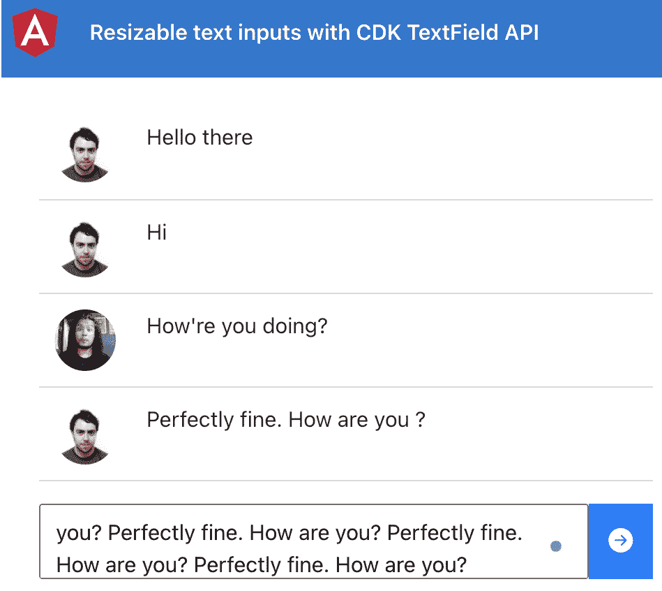

图 9.16–使用在上运行的 cdk 应用程序的可调整大小的文本输入 http://localhost:4200

现在我们已经有了本地运行的应用程序，让我们在下一节中查看配方的步骤。

## 怎么做…

在*图 9.16*中，您会注意到，我们无法看到输入的全部内容。在最好的情况下，这有点烦人，因为在按下**动作**按钮之前，您无法真正查看它。让我们通过以下步骤来使用 CDK TextField API：

1.  首先，打开一个新的终端窗口/选项卡，确保您在`chapter09/start_here/resizable-text-inputs-using-cdk`文件夹中。进入后，运行以下命令安装角度 CDK:

    ```ts
    npm install --save @angular/cdk@12.0.0
    ```

2.  您必须重新启动 Angular 服务器，因此重新运行`ng serve`命令。
3.  现在，我们需要将`TextFieldModule`类导入到我们`AppModule`类的`imports`数组中。修改`app.module.ts`文件，如下所示：

    ```ts
    ...
    import { TextFieldModule } from '@angular/cdk/text-field';
    @NgModule({
      declarations: [...],
      imports: [
        BrowserModule,
        AppRoutingModule,
     TextFieldModule
      ],
      ...
    })
    export class AppModule { }
    ```

4.  Now, we'll apply the `cdkTextareaAutosize` directive to our `<text-area>` element so that it can be resized automatically based on the content. Update the `write-message.component.html` file, as follows:

    ```ts
    <div class="write-box-container">
      <div class="write-box">
        <textarea
          cdkTextareaAutosize
          placeholder="Enter your message here"
          class="chat-input"
          [(ngModel)]="chatInput"
          rows="1"
          (keyup.enter)="sendMessage()"
        ></textarea>
      </div>
      <div class="send-button">
        ...
      </div>
    </div>
    ```

    如果您现在在文本输入中输入了一些长短语，您将看到它的大小正确调整，如下所示：

    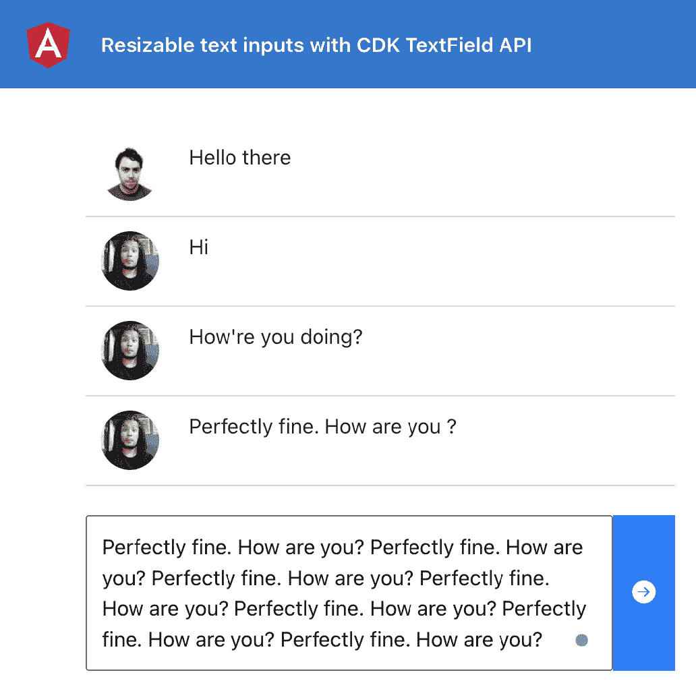

    图 9.17–根据内容调整文本区域大小

    虽然这是很棒，但您可能会注意到一旦消息被发送（即，添加到消息列表中），`<text-area>`元素的大小不会重置为其初始状态。

5.  为了将`<text-area>`元素的大小重置为其初始大小，我们将使用`CdkTextareaAutosize`指令的`reset()`方法。为此，我们将把指令作为`ViewChild`获取，然后将触发`reset()`方法。修改`write-message.component.ts`文件，如下所示：

    ```ts
    import { CdkTextareaAutosize } from '@angular/cdk/text-field';
    import {
      ...
      EventEmitter,
      ViewChild,
    } from '@angular/core';
    ...
    @Component({...})
    export class WriteMessageComponent implements OnInit {
      @Output() public onMessageSent = new   EventEmitter<any>();
      @ViewChild(CdkTextareaAutosize) newMessageInput:   CdkTextareaAutosize;
      public chatInput = '';
      ...
      /**
       * @author Ahsan Ayaz
       * Creates a new message and emits to parent component
       */
      sendMessage() {
        if (this.chatInput.trim().length) {
          ...
          this.chatInput = '';
          this.newMessageInput.reset();
        }
      }
    }
    ```

伟大的通过此更改，当刷新页面时，在输入中输入一个真正的长句子并点击*输入*键。您将看到正在重置的`<text-area>`元素的大小，如下所示：

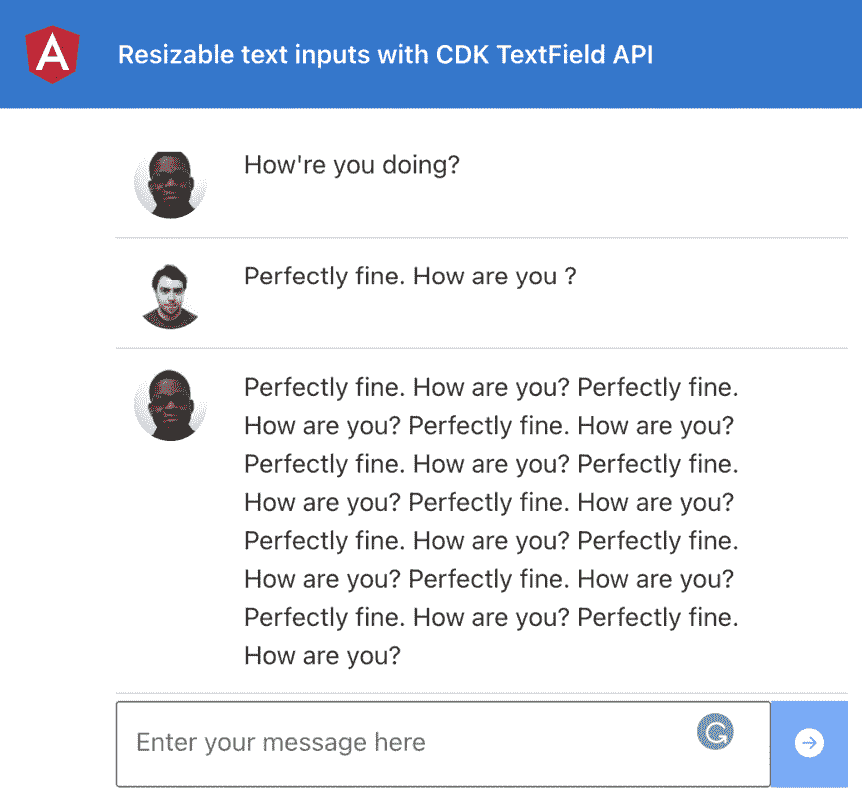

图 9.18-<text-area>在创建新消息时重置大小</text-area>

现在您已经完成了配方，请参阅下一部分了解其工作原理。

## 它是如何工作的…

在配方中，我们使用了 CDK 剪贴板 API 中的两个主要内容，一个是`cdkCopyToClipboard`指令，另一个是`Clipboard`服务。`cdkCopyToClipboard`指令将点击处理程序绑定到应用该指令的元素。它既是指令的`selector`项，也是指令的`@Input()`项，因此知道在单击元素时哪个值将复制到剪贴板。在我们的配方中，对于链接输入，请注意我们使用了`[cdkCopyToClipboard]="linkInput.value"`。这会将一个点击处理程序绑定到`<input>`元素，并绑定指向输入值（即要复制的实际链接）的`linkInput`模板变量的`value`属性。当我们点击输入时，它使用`linkInput.value`绑定访问输入的值，我们对`<text-area>`输入也这样做。唯一的区别是，`cdkCopyToClipboard`指令没有绑定到`<text-area>`元素本身。原因是我们希望将单击处理程序绑定到文本区域下方的按钮。因此，在复制文本的按钮上，我们有`[cdkCopyToClipboard]="textInput.value"`绑定。

对于图像，我们做了一些不同的事情。我们使用`@angular/cdk/clipboard`包中的`Clipboard`服务手动复制 blob URL。我们创建了一个名为`copyImageUrl()`的方法，当单击复制图像的按钮时调用该方法。我们将`imageUrl`属性传递给该方法，该方法依次下载图像，将其作为 blob 读取，并生成 blob URL，然后使用`Clipboard`服务的`copy()`方法将其复制到剪贴板。

## 另见

*   CDK`text-field`文件（[https://material.angular.io/cdk/text-field/overview](https://material.angular.io/cdk/text-field/overview)