# *第 10 章*：用诙谐的语言编写单元测试

*“它在我的机器上工作……”*是一个不会随着时间而失去美丽的短语。这是许多工程师的盾牌，也是 QAs 的噩梦。但老实说，还有什么比编写应用程序健壮性测试更好的方法呢？说到编写单元测试，我个人最喜欢的是笑话。这是因为它超快速、轻量级，并且有一个易于编写测试的 API。更重要的是，它比因果报应和茉莉花的设置要快得多。在本章中，您将学习如何配置这些角度测试。您将学习如何使用 Jest 测试组件、服务和管道。您还将学习如何模拟这些测试的依赖关系。

在本章中，我们将介绍以下配方：

*   使用 Jest 在 Angular 中设置单元测试
*   为笑话提供全局模拟
*   使用存根模拟服务
*   在单元测试中对注入服务使用间谍
*   使用`ng-mocks`包模拟子组件和指令
*   使用角度 CDK 组件线束创建更简单的组件测试
*   具有可观察性的单元测试组件
*   角管单元测试

# 技术要求

对于本章中的配方，请确保您的机器上同时安装了**Git**和**NodeJS**。您还需要安装`@angular/cli`软件包，您可以从终端使用`npm install -g @angular/cli`来完成此操作。本章代码见[https://github.com/PacktPublishing/Angular-Cookbook/tree/master/chapter10](https://github.com/PacktPublishing/Angular-Cookbook/tree/master/chapter10) 。

# 以开玩笑的方式设置单元测试

默认情况下，一个新的Angular 项目附带了很多优点，包括配置和工具，在其中使用 Karma 和 Jasmine 运行单元测试。虽然使用 Karma 相对方便，但许多开发人员发现，在大型项目中，如果涉及大量测试，整个测试过程会变得慢得多。这主要是因为您不能并行运行测试。在这个配方中，我们将在 Angular 应用程序中为单元测试设置 Jest。此外，我们将把现有的测试从 Karma 语法迁移到 Jest 语法。

## 准备好了吗

我们将要处理的项目位于`chapter10/start_here/setting-up-jest`中，它位于克隆存储库中。要开始，请执行以下步骤：

1.  在 Visual Studio 代码中打开项目。
2.  打开终端，运行`npm install`安装项目的依赖项。
3.  完成后，运行`ng serve -o`。

这将在新的浏览器选项卡中打开应用程序。您应该会看到类似于以下屏幕截图的内容：


图 10.1–在上运行的设置 jest 应用程序 http://localhost:4200

接下来，尝试运行测试，并监控运行整个流程所需的时间。从终端运行`ng test`命令；几秒钟内，一个新的 Chrome 窗口将打开，如下所示：

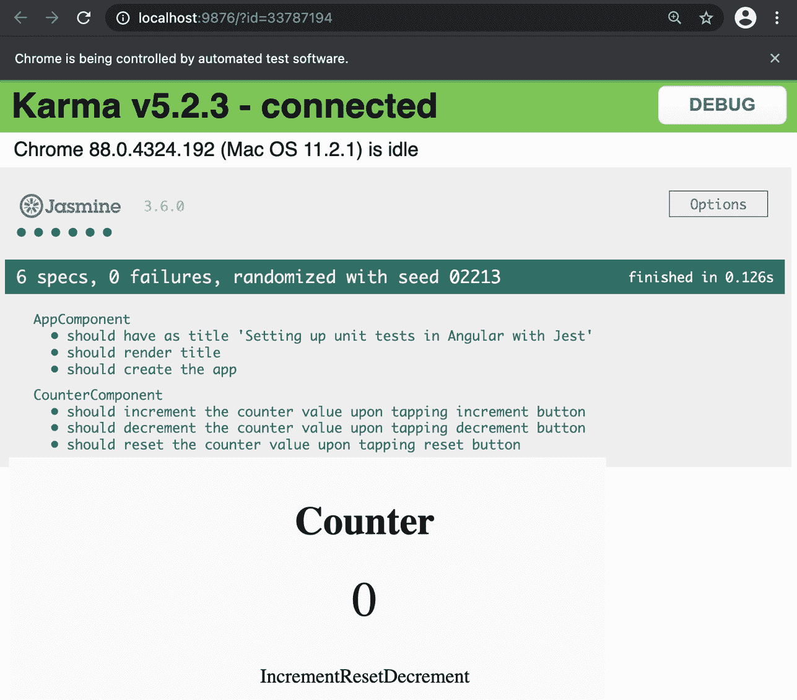

图 10.2–使用 Karma 和 Jasmine 的测试结果

看前面的截图，你可能会说*“Pffttt Ahsan，它说‘在 0.126 秒内完成！’你还想要什么？*那么，这段时间只涵盖Chrome 窗口创建后 Karma 在浏览器中运行测试*所花的时间。它不计算实际启动进程、启动 Chrome 窗口然后加载测试所花费的时间。在我的机器上，运行整个过程大约需要*15 秒*。这就是为什么我们要用笑话来代替它。既然你理解了这个问题，在下一节中，我们来看看食谱的步骤。*

## 怎么做。。。

这里，我们有一个角度应用程序，它有一个非常简单的**计数器**组件。显示计数器值，有三个动作按钮：一个增加计数器值，一个减少计数器值，一个重置计数器值。此外，还有一些使用 Karma 和 Jasmine 编写的测试，如果您运行`ng test`命令，所有测试都会通过。我们将从开玩笑开始。执行以下步骤：

1.  首先，打开一个新的终端窗口/选项卡，确保您在`chapter10/start_here/setting-up-jest`文件夹中。进入后，运行以下命令安装使用 Jest 测试所需的软件包：

    ```ts
    npm install --save-dev jest jest-preset-angular @types/jest
    ```

2.  我们现在可以卸载业力和不需要的依赖。现在在终端中运行以下命令：

    ```ts
    npm uninstall karma karma-chrome-launcher karma-jasmine-html-reporter @types/jasmine @types/jasminewd2 jasmine-core jasmine-spec-reporter karma-coverage-istanbul-reporter karma-jasmine
    ```

3.  我们还需要处理一些不需要的额外文件。从项目中删除`karma.conf.js`文件和`src/test.ts`文件。
4.  现在更新`angular.json`文件中的测试配置，如下所示：

    ```ts
    {
      ...
      "projects": {
        "setting-up-jest": {
          "...
          "prefix": "app",
          "architect": {
            "build": {...},
            "serve": {...},
            "extract-i18n": {...},
     "test": {
     "builder": "@angular-builders/jest:run",
     "options": {
     "tsConfig": "<rootDir>/src/tsconfig.test.            json",
     "collectCoverage": false,
     "forceExit": true
     }
     },
            "lint": {...},
            "e2e": {...}
          }
        }
      },
      "defaultProject": "setting-up-jest"
    }
    ```

5.  我们现在将创建一个文件，为我们的项目配置Jest。在项目的根文件夹中创建一个名为`jestSetup.ts`的文件，并在其中粘贴以下内容：

    ```ts
    import 'jest-preset-angular /setup-jest';
    ```

6.  现在，让我们修改`tsconfig.spec.json`使用玩笑代替茉莉花。修改后，您的整个文件应显示如下：

    ```ts
    {
      "extends": "./tsconfig.json",
      "compilerOptions": {
        "outDir": "./out-tsc/spec",
     "types": ["jest", "node"],
     "esModuleInterop": true,
     "emitDecoratorMetadata": true
      },
      "files": ["src/polyfills.ts"],
      "include": ["src/**/*.spec.ts", "src/**/*.d.ts"]
    }
    ```

7.  我们现在将修改`package.json`为添加运行 Jest 测试的`npm`脚本：

    ```ts
    {
      "name": "setting-up-jest",
      "version": "0.0.0",
      "scripts": {
        ...
        "build": "ng build",
     "test": "jest",
     "test:coverage": "jest --coverage",
        ...
      },
      "private": true,
      "dependencies": {...},
      "devDependencies": {...},
    }
    ```

8.  最后，让我们通过在`package.json`文件中添加 Jest 配置来结束我们的 Jest 测试的整个配置，如下所示：

    ```ts
    {
      ...
      "dependencies": {...},
      "devDependencies": {...},
     "jest": {
     "preset": "jest-preset-angular",
     "setupFilesAfterEnv": [
     "<rootDir>/jestSetup.ts"
     ],
     "testPathIgnorePatterns": [
     "<rootDir>/node_modules/",
     "<rootDir>/dist/"
     ],
     "globals": {
     "ts-jest": {
     "tsconfig": "<rootDir>/tsconfig.spec.json",
     "stringifyContentPathRegex": "\\.html$"
     }
     }
     }
    }
    ```

9.  现在我们已经设置好了所有内容，只需运行`test`命令，如下所示：

    ```ts
    npm run test
    ```

一旦测试完成，您应该能够看到以下输出：

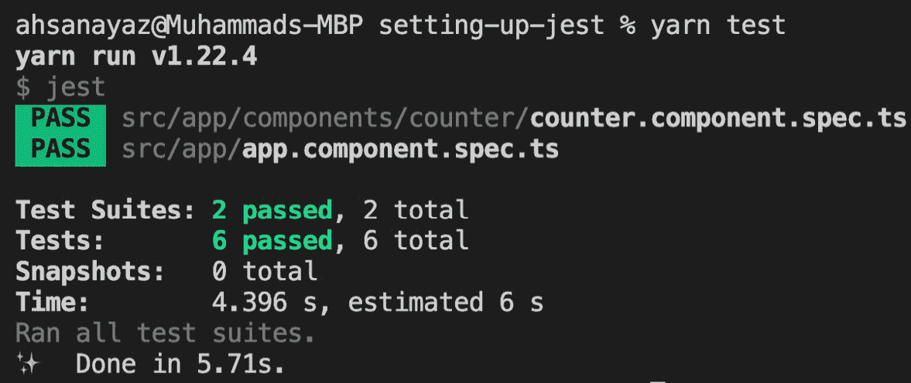

图 10.3–Jest 测试结果

卡布姆！您会注意到，使用 Jest 运行测试的整个过程大约需要 6 秒钟。第一次运行时可能需要更多的时间，但后续的运行应该更快。现在，您已经知道如何配置 Angular 应用程序以使用 Jest 进行单元测试，请参阅下一节了解更多信息的参考资料。

## 另见

*   *用笑话测试**Web 框架*（[https://jestjs.io/docs/en/testing-frameworks](https://jestjs.io/docs/en/testing-frameworks)
*   *开玩笑开始*（[https://jestjs.io/docs/en/getting-started](https://jestjs.io/docs/en/getting-started)

# 为玩笑提供全球模拟

在前面的配方中，我们学习了如何为角度单元测试设置笑话。在某些情况下，您可能希望使用浏览器 API，而该 API 可能不是您实际代码的一部分；例如，使用`localStorage`或`alert()`。在这种情况下，我们需要为要从中返回模拟值的函数提供一些全局模拟。这样，我们也可以执行涉及它们的测试。在本食谱中，您将学习如何为 Jest 提供全局模拟。

## 准备好了吗

此配方的项目位于`chapter10/start_here/providing-global-mocks-for-jest`中。执行以下步骤：

1.  在 Visual Studio 代码中打开项目。
2.  打开终端，运行`npm install`安装项目的依赖项。
3.  完成后，运行`ng serve -o`。

这将在新的浏览器选项卡中打开应用程序。应用程序应显示如下：


图 10.4–为运行在上的 jest 应用程序提供全局模拟 http://localhost:4200

现在我们已经在本地运行了应用程序，在下一节中，让我们来看一下配方的步骤。

## 怎么做。。。

我们用于此配方的应用程序使用两个全局 API：`window.localStorage`和`window.alert()`。请注意，当应用程序启动时，我们从`localStorage`获取计数器值，然后在递增、递减和重置后，将其存储在`localStorage`中。当计数器值大于`MAX_VALUE`或小于`MIN_VALUE`时，我们使用`alert()`方法显示警报。让我们从编写一些很酷的单元测试开始：

1.  First, we'll write our test cases to show the alert when the counter value goes beyond `MAX_VALUE` and `MIN_VALUE`. Modify the `counter.component.spec.ts` file as follows:

    ```ts
    ...
    describe('CounterComponent', () => {
      ...
     it('should show an alert when the counter value goes   above the MAX_VALUE', () => {
     spyOn(window, 'alert');
     component.counter = component.MAX_VALUE;
     component.increment();
     expect(window.alert).toHaveBeenCalledWith('Value too     high');
     expect(component.counter).toBe(component.MAX_VALUE);
     });
     it('should show an alert when the counter value goes   above the MAX_VALUE', () => {
     spyOn(window, 'alert');
     component.counter = component.MIN_VALUE;
     component.decrement();
     expect(window.alert).toHaveBeenCalledWith('Value too     low');
     expect(component.counter).toBe(component.MIN_VALUE);
     });
    });
    ```

    在这里，您可以看到测试通过了。但是如果我们想检查`localStorage`中的值是否被正确保存和检索，该怎么办？

2.  We'll create a new test to make sure the `localStorage.getItem()` method is called to retrieve the last saved value from the `localStorage` API. Add the test to the `counter.component.spec.ts` file, as follows:

    ```ts
    ...
    describe('CounterComponent', () => {
      ...
     it.only('should call the localStorage.getItem method on   component init', () => {
     spyOn(localStorage, 'getItem');
     component.ngOnInit();
     expect(localStorage.getItem).toBeCalled();
     });
    });
    ```

    注意，我们在这个测试用例中使用了`it.only`。这是为了确保我们只运行此测试（目前）。如果运行测试，您应该能够看到类似于以下屏幕截图的内容：

    

    图 10.5–覆盖 localStorage API 的测试失败

    注意`Matcher error: received value must be a mock or a spy function`消息。这就是我们接下来要做的，即提供一个模拟。

3.  在项目的根目录中创建一个名为`jest-global-mocks.ts`的文件。然后，添加以下代码来模拟`localStorage`API:

    ```ts
    const createLocalStorageMock = () => {
     let storage = {};
     return {
     getItem: (key) => {
     return storage[key] ? storage[key] : null;
     },
     setItem: (key, value) => {
     storage[key] = value;
     },
     };
    };
    Object.defineProperty(window, 'localStorage', {
     value: createLocalStorageMock(),
    });
    ```

4.  Now import this file into the `jestSetup.ts` file, as follows:

    ```ts
    import 'jest-preset-angular';
    import './jest-global-mocks';
    ```

    现在，如果您重新运行测试，它们应该会通过。

5.  让我们添加另一个测试，以确保我们从组件初始化中的`localStorage`中检索最后保存的值。修改`counter.component.spec.ts`文件，如下所示：

    ```ts
    ...
    describe('CounterComponent', () => {
      ...
     it('should call the localStorage.getItem method on   component init', () => {
        spyOn(localStorage, 'getItem');
        component.ngOnInit();
        expect(localStorage.getItem).toBeCalled();
      });
     it('should retrieve the last saved value from   localStorage on component init', () => {
     localStorage.setItem('counterValue', '12');
     component.ngOnInit();
     expect(component.counter).toBe(12);
     });
    });
    ```

6.  最后，让我们确保在触发`increment()`、`decrement()`或`reset()`方法时，将计数器值保存到`localStorage`。更新`counter.component.spec.ts`如下：

    ```ts
    ...
    describe('CounterComponent', () => {
      ...
     it('should save the new counterValue to localStorage   on increment, decrement and reset', () => {
     spyOn(localStorage, 'setItem');
     component.counter = 0;
     component.increment();
     expect(localStorage.setItem).    toHaveBeenCalledWith('counterValue', '1');
     component.counter = 20;
     component.decrement();
     expect(localStorage.setItem).    toHaveBeenCalledWith('counterValue', '19');
     component.reset();
     expect(localStorage.setItem).    toHaveBeenCalledWith('counterValue', '0');
     });
    });
    ```

太棒了！您刚刚学习了如何为测试提供全局 mock-to-Jest。请参阅下一节了解其工作原理。

## 它是如何工作的。。。

Jest 提供了一种方式来定义我们要为每个测试加载的文件的路径列表。如果打开`package.json`文件并查看`jest`属性，则可以查看`setupFilesAfterEnv`属性，该属性包含指向文件的一系列路径。我们已经在那里为`jestSetup.ts`文件定义了路径。定义全局模拟的一种方法是创建一个新文件，然后将其导入`jestSetup.ts`。这是因为它无论如何都会在测试环境中被调用。这就是我们在这个食谱中所做的。

注意，我们在`window`对象中使用`Object.defineProperty`方法为`localStorage`对象提供模拟实现。对于任何未在 JSDOM 中实现的 API，这实际上是相同的。类似地，您可以为测试中使用的每个 API 提供一个全局模拟。请注意，在`value`属性中，我们使用`createLocalStorageMock()`方法。本质上，这是定义模拟的一种方法。我们创建了`createLocalStorageMock()`方法，其中有一个名为`storage`的私有/封装对象，它模仿`localStorage`对象。我们还在其中定义了`getItem()`和`setItem()`方法，以便我们可以为该存储设置值并从中获取值。请注意，我们没有原始的`localStorage`API 中的`removeItem()`和`clear()`方法的实现。我们不必这样做，因为我们在测试中没有使用这些方法。

在`'should call the localStorage.getItem method on component init'`测试中，我们只是监视`localStorage`对象的`getItem()`方法，自己调用`ngOnInit()`方法，然后期望它已经被调用。简单的豌豆。

在`'should retrieve the last saved value from localStorage on component init'`测试中，我们使用`setItem()`方法将计数器值的`localStorage`对象中的一个值保存为`'12'`。本质上，调用的`setItem()`方法调用的是我们的模拟实现方法，而不是实际的`localStorage`API 的`setItem()`方法。注意，在这里，我们*没有*监视`getItem()`方法；这是因为稍后，我们希望组件的`counter`属性的值为`12`。

重要提示

无论何时，只要 spy 语句不再在任何函数中执行，我们就会记住它。这就是为什么我们没有在前面的测试中监视`getItem()`方法。如果我们这样做，来自模拟实现*的`getItem()`方法将不会返回任何*。因此，我们对计数器属性的预期值将不是`12`。

简单地说，如果您必须依赖函数实现的结果，或者函数中执行的语句，请不要监视该函数并相应地编写测试。

PS：我总是在调试和敲击我的头一段时间后，以艰难的方式学会这一点。开玩笑！

期末考试很容易。在`'should save the new counterValue to localStorage on increment, decrement and reset'`测试中，我们只是监视`setItem()`方法，因为我们不关心它的实现。然后，在分别运行`increment()`、`decrement()`和`reset()`方法之前，我们多次手动设置计数器属性的值。此外，我们希望使用正确的参数调用`setItem()`方法，以将值保存到存储中。请注意，保存后我们不会检查存储的值。正如我前面提到的，由于我们已经窥探了`setItem()`方法，它的内部语句不会被触发，值也不会被保存；因此，我们无法在以后检索保存的值。

## 另见

*   `setupFiles`（[的笑话文档https://jestjs.io/docs/en/configuration#setupfiles-阵列](https://jestjs.io/docs/en/configuration#setupfiles-array)）
*   *带玩笑的手动模拟*（[https://jestjs.io/docs/en/manual-mocks](https://jestjs.io/docs/en/manual-mocks)

# 使用存根模拟服务

很少有Angular 应用程序内部没有`Service`创建。就整体业务逻辑而言，服务拥有大量业务逻辑，特别是在与 API 交互时。在本教程中，您将学习如何使用存根模拟服务。

## 准备好了吗

此配方的项目位于`chapter10/start_here/mocking-services-using-stubs`中。执行以下步骤：

1.  在 Visual Studio 代码中打开项目。
2.  打开终端，运行`npm install`安装项目的依赖项。
3.  完成后，运行`ng serve -o`。

这将在新的浏览器选项卡中打开应用程序。您应该会看到如下屏幕截图：

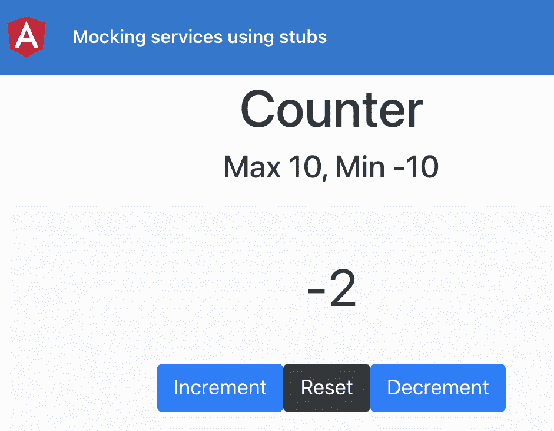

图 10.6–使用在上运行的存根应用程序的模拟服务 http://localhost:4200

现在让我们在本地运行一个 Tyl T1 应用程序，在下一节中，我们来看看配方的步骤。

## 怎么做。。。

我们的应用程序与上一个配方相同；然而，我们已经将保存和检索数据的逻辑从`localStorage`移动到了我们创建的`CounterService`。现在所有的测试都通过了。但是，如果我们想隐藏/封装计数器值存储位置的逻辑，该怎么办？也许我们想为它发送一个后端 API 调用。为此，监视服务的方法更有意义。让我们按照配方为我们的服务提供模拟存根：

1.  首先，让我们在`src`文件夹中创建一个文件夹，名为`__mocks__`。在其中，创建另一个名为`services`的文件夹。然后，再次在此文件夹中创建具有以下内容的`counter.service.mock.ts`文件：

    ```ts
    const CounterServiceMock = {
     storageKey: 'counterValue',
     getFromStorage: jest.fn(),
     saveToStorage: jest.fn(),
    };
    export default CounterServiceMock;
    ```

2.  Now provide the mock service instead of the actual service in the `counter.component.spec.ts`, as follows:

    ```ts
    import { ComponentFixture, TestBed } from '@angular/core/testing';
    import { CounterService } from 'src/app/core/services/counter.service';
    import CounterServiceMock from 'src/__mocks__/services/counter.service.mock';
    ...
    describe('CounterComponent', () => {
      ...
      beforeEach(async () => {
        await TestBed.configureTestingModule({
          declarations: [CounterComponent],
          providers: [
     {
     provide: CounterService,
     useValue: CounterServiceMock,
     },
          ],
        }).compileComponents();
      });
      ...
    });
    ```

    在前面的更改中，您应该看到后面的错误，该错误表示尚未调用`localStorage.setItem`。这是因为我们现在监视服务的模拟存根上的方法：

    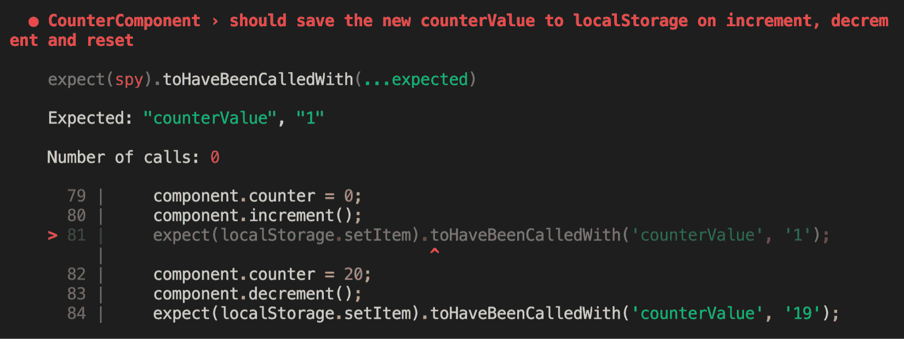

    图 10.7–未调用 localStorage.setItem，因为正在监视这些方法

3.  现在，不要期望调用`localStorage`对象的方法，让我们期望在测试中调用服务的方法。更新`counter.component.spec.ts`文件如下：

    ```ts
    ...
    describe('CounterComponent', () => {
      ...
     it('should call the CounterService.getFromStorage   method on component init', () => {
        component.ngOnInit();
     expect(CounterServiceMock.getFromStorage).    toBeCalled();
      });
     it('should retrieve the last saved value from   CounterService on component init', () => {
     CounterServiceMock.getFromStorage.    mockReturnValue(12);
        component.ngOnInit();
        expect(component.counter).toBe(12);
      });
     it('should save the new counterValue via CounterService   on increment, decrement and reset', () => {
        component.counter = 0;
        component.increment();
     expect(CounterServiceMock.saveToStorage).    toHaveBeenCalledWith(1);
        component.counter = 20;
        component.decrement();
     expect(CounterServiceMock.saveToStorage).    toHaveBeenCalledWith(19);
        component.reset();
     expect(CounterServiceMock.saveToStorage).    toHaveBeenCalledWith(0);
      });
    });
    ```

伟大的您现在知道如何模拟服务来测试具有服务依赖性的组件。请参阅下一节以了解其工作原理。

## 它是如何工作的。。。

为角度服务提供存根已经是轻而易举的事了。这要归功于 Angular 在`@angular/core`软件包中提供的开箱即用的方法和工具，尤其是`@angular/core/testing`。首先，我们为我们的`CounterService`创建存根，并对`CounterService`中的每个方法使用`jest.fn()`。

使用`jest.fn()`返回一个新的、未使用的 mock 函数，Jest 也会自动监视该函数。或者，我们还可以将模拟实现方法作为参数传递给`jest.fn`。查看`jest.fn()`官方文档中的以下示例：

```ts
const mockFn = jest.fn();
mockFn();
expect(mockFn).toHaveBeenCalled(); // test passes
// With a mock implementation:
const returnsTrue = jest.fn(() => true);
console.log(returnsTrue()); // true;
expect(returnsTrue()).toBe(true); // test passes
```

一旦我们创建了存根，我们就将其传递给中的`TestBed`配置，该配置针对`CounterService`——但将`useValue`属性设置为`CounterServiceMock`。这告诉 Angular 使用我们的存根，因为它用于`CounterService`。

然后，在我们期望组件启动时调用`CounterService.getFromStorage()`的测试中，我们使用以下语句：

```ts
expect(CounterServiceMock.getFromStorage).toBeCalled();
```

请注意，在前面的代码中，我们可以在`CounterServiceMock.getFromStorage`上直接使用`expect()`。虽然这在《因果报应》和《茉莉花》中是不可能的，但在《玩笑》中也是可能的，因为我们对每一种潜在的方法都使用了`jest.fn()`。

然后，对于要检查是否调用了`getFromStorage()`方法并返回保存的值的测试，我们首先使用`CounterServiceMock.getFromStorage.mockReturnValue(12);`语句。这确保了当调用`getFromStorage()`方法时，它返回`12`的值。然后，我们只是在测试中运行`ngOnInit()`方法，并期望组件的计数器属性现在已设置为`12`。这实际上意味着会发生以下情况：

1.  `ngOnInit()`调用`getFromStorage()`方法。
2.  `getFromStorage()`返回先前保存的值（在我们的例子中，这是`12`，但实际上，这将从`localStorage`中获取）。
3.  组件的`counter`属性被设置为检索到的值，在我们的例子中，该值是`12`。

现在，对于最终测试，我们只希望在每个必要的情况下调用我们的`CounterService`的`saveToStorage`方法。为此，我们使用以下类型的`expect()`语句：

```ts
expect(CounterServiceMock.saveToStorage).toHaveBeenCalledWith(1);
```

差不多就是这样。单元测试很有趣，不是吗？现在您已经了解了它是如何工作的，请参阅下一节中的一些有用资源，以便进一步阅读。

## 另见

*   `jest.fn()`（[的正式文件 https://jestjs.io/docs/en/jest-object.html#jestfnimplementation](https://jestjs.io/docs/en/jest-object.html#jestfnimplementation)
*   Angular 的*组件测试场景*（[https://angular.io/guide/testing-components-scenarios](https://angular.io/guide/testing-components-scenarios) ）

# 在单元测试中对注入服务使用间谍

虽然您可以通过 Jest 在单元测试中为您的服务提供存根，但有时，为每个新服务创建一个模拟会让您感觉像是一种开销。让我们假设，如果服务的使用仅限于一个测试文件，那么在实际注入的服务上使用间谍可能更有意义。在这个食谱中，这正是我们要做的。

## 准备好了吗

此配方的项目位于`chapter10/start_here/using-spies-on-injected-service`中。

1.  在 Visual Studio 代码中打开项目。
2.  打开终端，运行`npm install`安装项目的依赖项。
3.  完成后，运行`npm run test`。

这应该使用 Jest 在控制台上运行单元测试。您应该会看到类似于以下输出的内容：

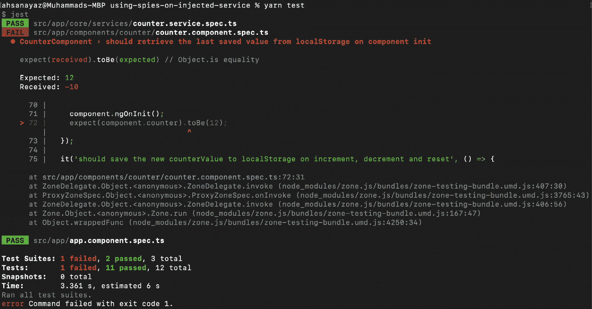

图 10.8“在注入服务上使用间谍”项目的单元测试失败

现在我们已经在本地运行了测试，在下一节中，让我们来看看配方的步骤。

## 怎么做。。。

我们在`CounterComponent`代码中的测试不完整。那是因为我们缺少了`expect()`块和用来监视`CounterService`方法的代码。让我们从配方开始，使用 spies 在实际的`CounterService`上完成测试，如下所示：

1.  首先，我们需要在测试中获得实际注入服务的实例。因此，我们将创建一个变量，并以`beforeEach()`方法获取注入的服务。更新`counter.component.spec.ts`文件如下：

    ```ts
    ...
    describe('CounterComponent', () => {
      let component: CounterComponent;
      let fixture: ComponentFixture<CounterComponent>;
     let counterService: CounterService;
      beforeEach(async () => {...});
      beforeEach(() => {
        fixture = TestBed.createComponent(CounterComponent);
        component = fixture.componentInstance;
        fixture.detectChanges();
     counterService = TestBed.inject(CounterService);
      });
      ...
    });
    ```

2.  Now, we'll write our first `expect()` block for the service. For the test that says `'should call the localStorage.getItem method on component init'`, add the following `spyOn()` and `expect()` blocks:

    ```ts
    ...
    describe('CounterComponent', () => {
      ...
      it('should call the localStorage.getItem method on   component init', () => {
     spyOn(counterService, 'getFromStorage');
        component.ngOnInit();
     expect(counterService.getFromStorage).    toHaveBeenCalled();
      });
      ...
    });
    ```

    如果您再次运行`npm run test`，您仍然会看到一个测试失败，但其他测试通过。

3.  现在，让我们修复失败的测试。那就是`'should retrieve the last saved value from localStorage on component init'`。在这个案例中，我们需要窥探`CounterService`的`getFromStorage()`方法来返回`12`的期望值。为此，更新测试文件，如下所示：

    ```ts
    ...
    describe('CounterComponent', () => {
      ...
      it('should retrieve the last saved value from   localStorage on component init', () => {
     spyOn(counterService, 'getFromStorage').and.    returnValue(12);
        component.ngOnInit();
        expect(component.counter).toBe(12);
      });
      ...
    });
    ```

4.  最后，让我们修复上一个测试，其中我们希望`increment()`、`decrement()`和`reset()`方法调用`CounterService`的`saveToStorage()`方法。更新测试如下：

    ```ts
    ...
    describe('CounterComponent', () => {
      ...
      it('should save the new counterValue to localStorage   on increment, decrement and reset', () => {
     spyOn(counterService, 'saveToStorage');
        component.counter = 0;
        component.increment();
     expect(counterService.saveToStorage).    toHaveBeenCalledWith(1);
        component.counter = 20;
        component.decrement();
     expect(counterService.saveToStorage).    toHaveBeenCalledWith(19);
        component.reset();
     expect(counterService.saveToStorage).    toHaveBeenCalledWith(0);
     });
    });
    ```

令人惊叹的通过此更改，您应该看到所有 12 个测试都通过了。让我们看看下一节，了解它是如何工作的。

## 它是如何工作的。。。

本配方包含了本章之前配方中的大量知识。然而，关键的亮点是`TestBed.inject()`方法。本质上，这种神奇的方法将提供的服务的实例（T1）提供给我们。这是与`CounterComponent`实例绑定的服务实例。由于我们可以访问组件实例正在使用的同一个服务实例，因此我们可以直接监视它并期望调用它，甚至可以模拟返回值。

## 另见

*   角度试验台简介(https://angular.io/guide/testing-services#angular-（试验台）

# 使用 ng mocks 包模拟子组件和指令

单元测试主要围绕隔离的测试组件旋转。但是，如果您的组件完全依赖另一个组件或指令才能正常工作，该怎么办？在这种情况下，通常会为组件提供一个模拟实现，但这需要大量的工作。然而，有了`ng-mocks`软件包，它就非常容易了。在本食谱中，我们将学习一个高级示例，说明如何对依赖于子组件才能正常工作的父组件使用`ng-mocks`。

## 准备好了吗

我们将要处理的项目位于`chapter10/start_here/mocking-components-with-ng-mocks`中，它位于克隆存储库中。执行以下步骤：

1.  在 Visual Studio 代码中打开项目。
2.  打开终端，运行`npm install`安装项目的依赖项。
3.  完成后，运行`ng serve -o`。

此应在新浏览器选项卡中打开应用程序。您应该会看到类似于以下屏幕截图的内容：

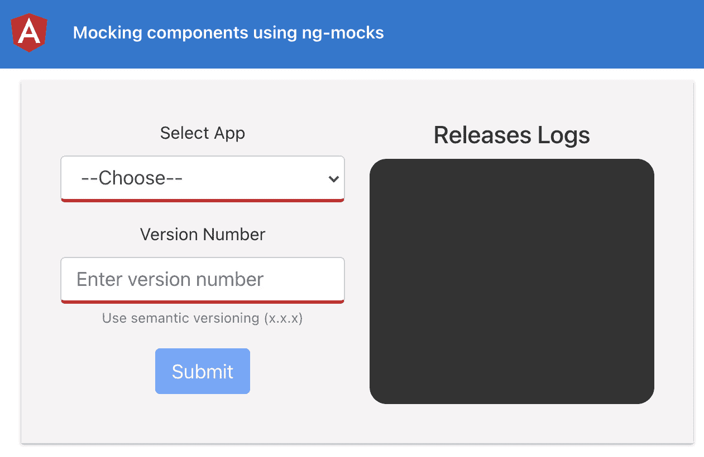

图 10.9–运行 ng mocks 应用程序的模拟组件 http://localhost:4200

现在我们已经有了本地运行的应用程序，在下一节中，让我们看一下配方的步骤。

## 怎么做。。。

如果您运行`yarn test`命令或运行`npm run test`命令，您将看到并不是所有测试都通过。此外，控制台上还有一系列错误，如下所示：

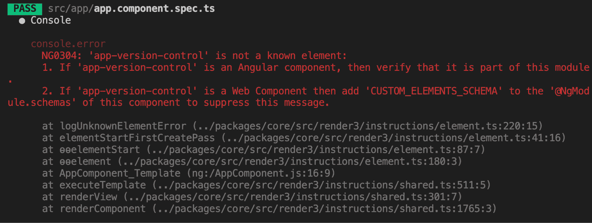

图 10.10–单元测试期间的未知元素错误

让我们使用`ng-mocks`软件包检查配方，确保我们的测试正确通过，没有任何错误：

1.  首先，让我们在项目中安装`ng-mocks`包。要执行此操作，请从终端中的项目根目录运行以下命令：

    ```ts
    npm install ng-mocks --save
    # or
    yarn add ng-mocks
    ```

2.  Now, we'll try to fix the tests for `AppComponent`. To only run specific tests based on a string regex, we can use the `-t` parameter with the `jest` command. Run the following command to only run the tests for `AppComponent`:

    ```ts
    npm run test -- -t 'AppComponent'
    #or
    yarn test -- -t 'AppComponent'
    ```

    现在您可以看到我们只运行`AppComponent`的测试，失败的原因如下：

    

    图 10.11–错误-“应用程序版本控制”不是已知元素

3.  To fix the error shown in *Figure 10.11*, we'll import `VersionControlComponent` into the `TestBed` definition inside the `app.component.spec.ts` file. This is so that our test environment also knows the missing `VersionControlComponent`. To do this, modify the mentioned file as follows:

    ```ts
    ...
    import { VersionControlComponent } from './components/version-control/version-control.component';
    ...
    describe('AppComponent', () => {
      beforeEach(waitForAsync(() => {
        TestBed.configureTestingModule({
          imports: [RouterTestingModule],
     declarations: [AppComponent,       VersionControlComponent],
        }).compileComponents();
      }));
      ...
    });
    ```

    如果您重新运行`AppComponent`的测试，您将看到一些新的错误。惊喜嗯，依赖项就是这样。我们将在*如何工作中更详细地讨论细节。。。*节。但是，要解决这个问题，让我们按照下面的步骤进行操作。

4.  Instead of providing the `VersionControlComponent` directly, we need to mock it since we don't really care about it for the tests for `AppComponent`. To do this, update the `app.component.spec.ts` file as follows:

    ```ts
    ...
    import { MockComponent } from 'ng-mocks';
    ...
    describe('AppComponent', () => {
      beforeEach(waitForAsync(() => {
        TestBed.configureTestingModule({
          imports: [RouterTestingModule],
     declarations: [AppComponent,       MockComponent(VersionControlComponent)],
        }).compileComponents();
      }));
      ...
    });
    ```

    繁荣问题已解决。再次运行测试，只运行`AppComponent`的，您应该看到它们都通过了，如下所示：

    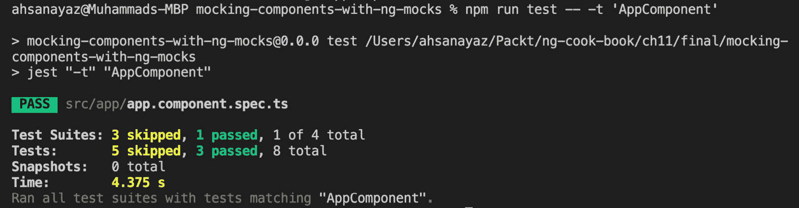

    图 10.12–通过 AppComponent 的所有测试

5.  Now, let's talk about the tests for `VersionControlComponent`. This depends on the `ReleaseFormComponent` as well as the `ReleaseLogsComponent`. Let's mock them like a pro this time, using the `MockBuilder` and `MockRender` methods, so we can get rid of the errors during the tests. After the update, the `version-control.component.spec.ts` file should appear as follows:

    ```ts
    import { MockBuilder, MockedComponentFixture, MockRender } from 'ng-mocks';
    import { ReleaseFormComponent } from '../release-form/release-form.component';
    import { ReleaseLogsComponent } from '../release-logs/release-logs.component';
    import { VersionControlComponent } from './version-control.component';
    describe('VersionControlComponent', () => {
      let component: VersionControlComponent;
     let fixture: MockedComponentFixture   <VersionControlComponent>;
     beforeEach(() => {
     return MockBuilder(VersionControlComponent)
     .mock(ReleaseFormComponent)
     .mock(ReleaseLogsComponent);
     });
     beforeEach(() => {
     fixture = MockRender(VersionControlComponent);
     component = fixture.point.componentInstance;
     });
      it('should create', () => {...});
    });
    ```

    如果您现在运行`npm run test`，您应该看到所有测试都通过了。在接下来的步骤中，让我们实际编写一些有趣的测试。

6.  `VersionControlComponent`将`ReleaseLogsComponent`用作儿童。此外，它还通过`[logs]`属性将`releaseLogs`属性作为`@Input()`提供给`ReleaseLogsComponent`。我们实际上可以检查输入值是否设置正确。为此，更新`version-control.component.spec.ts`文件，如下所示：

    ```ts
    import {
      MockBuilder,
      MockedComponentFixture,
      MockRender,
     ngMocks,
    } from 'ng-mocks';
    import { Apps } from 'src/app/constants/apps';
    ...
    describe('VersionControlComponent', () => {
      ...
     it('should set the [logs] @Input for the   ReleaseLogsComponent', () => {
     const releaseLogsComponent = ngMocks.    find<ReleaseLogsComponent>(
     'app-release-logs'
     ).componentInstance;
     const logsStub = [{ app: Apps.DRIVE, version:     '2.2.2', message: '' }];
     component.releaseLogs = [...logsStub];
     fixture.detectChanges();
     expect(releaseLogsComponent.logs.length).toBe(1);
     expect(releaseLogsComponent.logs).toEqual([...logsStub]);
     });
    });
    ```

7.  现在我们将确保当我们通过`ReleaseFormComponent`创建一个新日志时，我们通过将其添加到`VersionControlComponent`中的`releaseLogs`数组来显示这个新日志。然后，我们也将其作为`@Input logs`传递给`ReleaseLogsComponent`。将以下测试添加到`version-control.component.spec.ts`文件中：

    ```ts
    ...
    describe('VersionControlComponent', () => {
      ...
     it('should add the new log when it is created via   ReleaseFormComponent', () => {
     const releaseFormsComponent = ngMocks.    find<ReleaseFormComponent>('app-release-form').    componentInstance;
     const releaseLogsComponent = ngMocks.    find<ReleaseLogsComponent>('app-release-logs').    componentInstance;
     const newLogStub = { app: Apps.DRIVE, version:    '2.2.2', message: '' };
     component.releaseLogs = []; // no logs initially
     releaseFormsComponent.newReleaseLog.emit(newLogStub);     // add a new log
     fixture.detectChanges(); // detect changes
     expect(component.releaseLogs).toEqual([newLogStub]);     // VersionControlComponent logs
     expect(releaseLogsComponent.logs).    toEqual([newLogStub]); // ReleaseLogsComponent logs
     });
    });
    ```

繁荣我们通过使用`ng-mocks`包实现了一些有趣的测试。每次使用它我都非常喜欢。现在我们已经完成了食谱，在下一节中，让我们来看看它是如何工作的。

## 它是如何工作的。。。

我们在这个食谱中介绍了一些有趣的事情。首先，为了避免控制台上出现任何抱怨未知组件的错误，我们使用`ng-mocks`包中的`MockComponent`方法，将我们所依赖的组件声明为 mock。这绝对是我们通过`ng-mocks`包实现的最简单的事情。然而，我们确实进入了一种先进的局面，我承认这是一种非传统的做法；即测试父组件中子组件的`@Input`和`@Output`发射器，以测试整个流。这就是我们为`VersionControlComponent`测试所做的。

请注意，我们完全从`version-control.component.spec.ts`文件中删除了`@angular/core/testing` 包的用法。这是因为我们不再使用`TestBed`来创建测试环境。相反，我们使用`ng-mocks`包中的`MockBuilder`方法为我们的`VersionControlComponent`构建测试环境。然后，我们使用`.mock()`方法模拟我们稍后要在测试中使用的每个子组件。`.mock()`方法不仅用于模拟组件，还可以用于模拟服务、指令、管道等。请参阅下一节以获取更多的参考资料。

然后，在`'should add the new log when it is created via ReleaseFormComponent'`测试中，注意`ngMocks.find()`方法，我们使用该方法找到相关组件并获得其实例。它的用法与我们在`TestBed`中的用法相对类似，如下所示：

```ts
fixture.debugElement.query(
  By.css('app-release-form')
).componentInstance
```

然而，使用`ngMocks.find()`更适合，因为它对类型有更好的支持。一旦我们获得了`ReleaseFormComponent`的实例，我们使用名为`newReleaseLog`的`@Output`使用`.emit()`方法创建一个新的日志。然后，我们快速`fixture.detectChanges()`触发角度变化检测。我们还检查`VersionControl.releaseLogs`阵列，以确定是否已将新的发布日志添加到该阵列中。之后，我们还检查了`ReleaseLogsComponent.logs`属性，以确保子组件已经通过`@Input`更新了`logs`数组。

重要提示

注意，我们在`VersionControlComponent.addNewReleaseLog`方法上没有使用间谍。这是因为如果我们这样做，该函数将成为一个玩笑间谍函数。因此，它将失去其内部的功能。作为回报，它永远不会将新日志添加到`releaseLogs`数组中，我们的测试也不会通过。你可以试试看。

## 另见

*   ng 模拟`.mock`方法（[https://ng-mocks.sudo.eu/api/MockBuilder#mock](https://ng-mocks.sudo.eu/api/MockBuilder#mock)
*   ng 模拟官方文件（[https://ng-mocks.sudo.eu](https://ng-mocks.sudo.eu)

# 使用角度 CDK 组件线束创建更简单的组件测试

在为组件编写测试时，可能会出现场景，您实际上希望与 DOM 元素交互。现在，通过使用`fixture.debugElement.query`方法使用选择器查找元素，然后触发其上的事件，就可以实现这一点。然而，这意味着为不同的平台维护它，知道所有选择器的标识符，然后在测试中公开所有这些。如果我们说的是一个有角度的库，情况会更糟。当然，没有必要让每个与我的库交互的开发人员都知道所有的元素选择器来编写测试。只有库的作者才应该知道这一点，以尊重封装。幸运的是，我们有 Angular CDK 团队提供的组件线束，它们与 Angular 9 以及 IVY 编译器一起发布。他们以实例为首，为角材料组件提供组件线束。在本配方中，您将学习如何创建自己的组件线束。

## 准备好了吗

我们将要处理的项目位于`chapter10/start_here/tests-using-cdk-harness`中，它位于克隆存储库中。执行以下步骤：

1.  在 Visual Studio 代码中打开项目。
2.  打开终端，运行`npm install`安装项目的依赖项。
3.  完成后，运行`ng serve -o`。

这将在新浏览器选项卡中打开应用程序。您应该会看到类似于以下屏幕截图的内容：

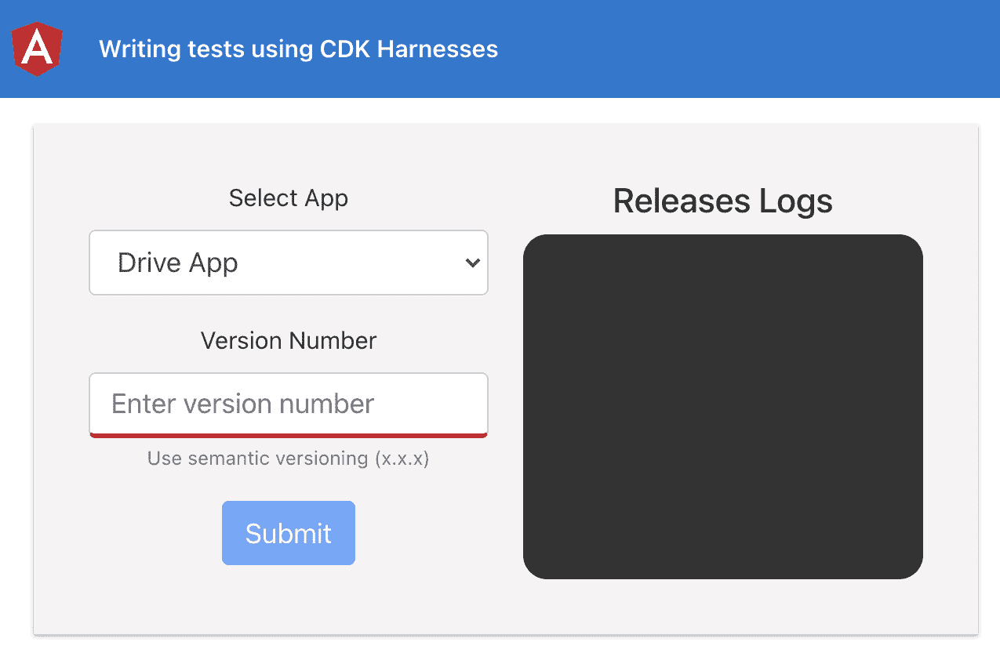

图 10.13–使用 cdk 线束应用程序运行的测试 http://localhost:4200

现在，您已经运行了应用程序，让我们继续下一节，按照配方进行操作。

## 怎么做。。。

我们有最喜欢的 Angular 版本控制应用程序，允许我们创建发布日志。我们已经编写了测试，包括与 DOM 元素交互以验证一些用例的测试。让我们按照配方使用组件线束，并了解它在实际测试中的易用性：

1.  首先，打开一个新的终端窗口/选项卡，确保您位于`chapter10/start_here/tests-using-cdk-harness`文件夹中。进入后，运行以下命令安装角度 CDK:

    ```ts
    npm install --save @angular/cdk@12.0.0
    ```

2.  您必须重新启动 Angular 服务器。因此，重新运行`ng serve`命令。
3.  首先，我们将为`ReleaseFormComponent`创建**组件线束**。让我们在`release-form`文件夹中创建一个新文件，并将其命名为`release-form.component.harness.ts`。然后，在其内部添加以下代码：

    ```ts
    import { ComponentHarness } from '@angular/cdk/testing';
    export class ReleaseFormComponentHarness extends ComponentHarness {
     static hostSelector = 'app-release-form';
     protected getSubmitButton = this.  locatorFor('button[type=submit]');
     protected getAppNameInput = this.  locatorFor(`#appName`);
     protected getAppVersionInput = this.  locatorFor(`#versionNumber`);
     protected getVersionErrorEl = async () => {
     const alerts = await this.locatorForAll('.alert.    alert-danger')();
     return alerts[1];
     };
    }
    ```

4.  现在我们需要为`VersionControlComponent`的测试设置线束环境。为此，我们将使用角度 CDK 中的`HarnessLoader`和`TestbedHarnessEnvironment`。更新`version-control.component.spec.ts`文件如下：

    ```ts
    ...
    import { HarnessLoader } from '@angular/cdk/testing';
    import { TestbedHarnessEnvironment } from '@angular/cdk/testing/testbed';
    describe('VersionControlComponent', () => {
      let component: VersionControlComponent;
      let fixture: ComponentFixture<VersionControlComponent>;
     let harnessLoader: HarnessLoader;
      ...
      beforeEach(() => {
        fixture = TestBed.    createComponent(VersionControlComponent);
        component = fixture.componentInstance;
        fixture.detectChanges();
     harnessLoader = TestbedHarnessEnvironment.    loader(fixture);
      });
      ...
    });
    ```

5.  现在，让我们在`ReleaseFormComponentHarness`类中编写一些方法来获取相关信息。我们将在后面的步骤中使用这些方法。更新`release-form.component.harness.ts`文件如下：

    ```ts
    ...
    export class ReleaseFormComponentHarness extends ComponentHarness {
      ...
     async getSelectedAppName() {
     const appSelectInput = await this.getAppNameInput();
     return appSelectInput.getProperty('value');
     }
     async clickSubmit() {
     const submitBtn = await this.getSubmitButton();
     return await submitBtn.click();
     }
     async setNewAppVersion(version: string) {
     const versionInput = await this.getAppVersionInput();
     return await versionInput.sendKeys(version);
     }
     async isVersionErrorShown() {
     const versionErrorEl = await this.    getVersionErrorEl();
     const versionErrorText = await versionErrorEl.text();
     return (
     versionErrorText.trim() === 'Please write an       appropriate version number'
     );
     }
    }
    ```

6.  Next, we'll work on our first test, named `'should have the first app selected for the new release log'`, with the component harness. Update the `version-control.component.spec.ts` file as follows:

    ```ts
    ...
    import { ReleaseFormComponentHarness } from '../release-form/release-form.component.harness';
    describe('VersionControlComponent', () => {
      ...
     it('should have the first app selected for the new   release log', async () => {
     const rfHarness = await harnessLoader.getHarness(
     ReleaseFormComponentHarness
     );
     const appSelect = await rfHarness.    getSelectedAppName();
     expect(appSelect).toBe(Apps.DRIVE);
      });
      ...
    });
    ```

    现在，如果您运行`npm run test`，您应该看到所有测试都通过了，这意味着我们使用组件线束进行的第一次测试工作正常。呜呼！

7.  Now, we'll work on our second test, that is, for `'should show error on wrong version number input'`. Update the test in the `version-control.component.spec.ts` file, as follows:

    ```ts
    ...
    describe('VersionControlComponent', () => {
      ...
      it('should show error on wrong version number input',   async () => {
     const rfHarness = await harnessLoader.getHarness(
     ReleaseFormComponentHarness
     );
     await rfHarness.setNewAppVersion('abcd');
     const isErrorshown = await rfHarness.    isVersionErrorShown();
     expect(isErrorshown).toBeTruthy();
      });
      ...
    });
    ```

    繁荣注意我们刚刚将这个测试的代码行从九条语句减少到了四条。这不是很神奇吗？老实说，我相信它很棒，而且更干净。

8.  对于最终测试，我们还需要一个用于`ReleaseLogsComponent`的组件线束。让我们快速创建它。在`release-logs`文件夹中添加一个名为`release-logs.component.harness.ts`的新文件，并添加以下代码：

    ```ts
    import { ComponentHarness } from '@angular/cdk/testing';
    export class ReleaseLogsComponentHarness extends ComponentHarness {
     static hostSelector = 'app-release-logs';
     protected getLogsElements = this.locatorForAll   ('.logs__item');
     async getLogsLength() {
     const logsElements = await this.getLogsElements();
     return logsElements.length;
     }
     async getLatestLog() {
     const logsElements = await this.getLogsElements();
     return await logsElements[0].text();
     }
     async validateLatestLog(version, app) {
     const latestLogText = await this.getLatestLog();
     return (
     latestLogText.trim() === `Version ${version}       released for app ${app}`
     );
     }
    }
    ```

9.  最后，让我们在`version-control.component.spec.ts`文件中修改我们的最终测试如下：

    ```ts
    ...
    import { ReleaseFormComponentHarness } from '../release-form/release-form.component.harness';
    import { ReleaseLogsComponentHarness } from '../release-logs/release-logs.component.harness';
    describe('VersionControlComponent', () => {
      ...
      it('should show the new log in the list after adding   submitting a new log', async () => {
     const rfHarness = await harnessLoader.getHarness(
     ReleaseFormComponentHarness
     );
     const rLogsHarness = await harnessLoader.getHarness(
     ReleaseLogsComponentHarness
     );
     let logsLength = await rLogsHarness.getLogsLength();
     expect(logsLength).toBe(0); // no logs initially
     const APP = Apps.DRIVE;
     const VERSION = '2.3.6';
     await rfHarness.setNewAppVersion(VERSION);
     await rfHarness.clickSubmit();
     logsLength = await rLogsHarness.getLogsLength();
     expect(logsLength).toBe(1);
     const isNewLogAdded = await rLogsHarness.    validateLatestLog(VERSION, APP);
     expect(isNewLogAdded).toBe(true);
      });
    });
    ```

瞧！这是一些惊人的测试使用角度 CDK 组件线束。如果您现在运行测试，您应该看到所有测试都通过了。现在您已经完成了配方，请参阅下一节了解其工作原理。

## 它是如何工作的。。。

好吧这是一个很酷的食谱，我喜欢自己动手做。这个配方的关键因素是`@angular/cdk/testing`包装。如果您以前使用过量角器进行过`e2e`测试，这与量角器中的`Pages`概念类似。首先，我们为`ReleaseLogsComponent`和`ReleaseFormComponent`创建一个组件线束。

请注意，我们从`@angular/cdk/testing`为两个组件线束导入`ComponentHarness`类。然后，我们从`ComponentHarness`类扩展了名为`ReleaseFormComponentHarness`和`ReleaseLogsComponentHarness`的自定义类。本质上，这是编写组件线束的正确方法。您注意到名为`hostSelector`的静态属性了吗？对于我们创建的每个组件线束类，都需要此属性。并且该值始终是目标元素/组件的选择器。这确保了当我们将此线束加载到测试环境中时，环境能够在 DOM 中找到主机元素——我们正在为其创建组件线束。在我们的组件线束类中，我们使用`this.locatorFor()`方法查找主体组件中的元素。`locateFor()`方法将单个参数作为要查找的元素的`css selector`并返回一个`AsyncFactoryFn`。这意味着返回的值是一个函数，我们可以在以后使用它来获取所需的元素。

在`ReleaseFormComponentHarness`类中，我们分别使用`protected`方法`getSubmitButton`、`getAppNameInput`和`getAppVersionInput`找到提交按钮、应用名称输入和版本号输入，这些方法都是前面提到的`AsyncFactoryFn`类型。我们将这些方法设置为`protected`，因为我们不希望编写单元测试的人访问或关心 DOM 元素的信息。这使得每个人编写测试都更加容易，而不用担心访问 DOM 的内部实现。

请注意，`getVersionErrorEl()`方法略有不同。它实际上不是`AsyncFactoryFn`类型。相反，它是一个常规的`async`函数，首先调用`locatorForAll`方法来获取`alert`类和`alert-danger`类的所有元素，这会导致错误消息。然后，它选择第二个警报元素，用于输入应用程序版本号。

这里要提到的一件重要事情是，当我们调用`locatorFor()`方法或`locatorForAll()`方法时，我们分别返回一个包含`TestElement`项的`Promise`或一个包含`TestElement`项列表的`Promise`。每个`TestElement`项目都有一系列简便的方法，如`.click()`、`.sendKeys()`、`.focus()`、`.blur()`、`.getProperty()`、`.text()`等等。这些方法是我们感兴趣的，因为我们在场景后面使用它们与DOM 元素交互。

现在，让我们谈谈配置测试环境。在`version-control.component.spec.ts`文件中，我们为`ReleaseLogsComponent`和`ReleaseFormComponent`设置了使用组件线束的环境。`TestbedHarnessEnvironment`元素是这里的关键元素。我们使用`TestbedHarnessEnvironment`类的`.loader()`方法，提供我们的`fixture`作为参数。请注意，夹具是我们使用`TestBed.createComponent(VersionControlComponent)`语句在测试环境中得到的。因为我们将这个夹具提供给了`TestbedHarnessEnvironment.loader()`方法，所以我们得到了`HarnessLoader`语句的一个元素，它现在可以为其他组件加载组件线束，也就是为`ReleaseLogsComponent`和`ReleaseFormComponent`加载组件线束。

注意，在测试中，我们使用了`harnessLoader.getHarness()`方法，提供了 harness 类作为参数。这使测试环境能够找到与线束类的`hostSelector`属性关联的 DOM 元素。此外，我们还获得了组件线束的实例，我们可以在测试中进一步使用组件线束。

## 另见

*   使用组件线束在 DOM 中查找组件（`https://material.angular.io/cdk/test-harnesses/overview#finding-elements-in-the-components-dom`
*   *组件线束作者 API*（`https://material.angular.io/cdk/test-harnesses/overview#api-for-component-harness-authors`

# 可观察组件单元测试

如果你正在构建一个角度应用程序，很可能你会在某个时候处理应用程序内部的可观察对象。例如，您可以从第三方 API 获取数据，或者只是管理状态。在这两种情况下，测试具有可观察性的应用程序都会变得稍微困难。在本食谱中，我们将学习如何使用可观察对象测试单元测试。

## 准备好了吗

此配方的项目位于`chapter10/start_here/unit-testing-observables`中。执行以下步骤：

1.  在 Visual Studio 代码中打开项目。
2.  打开终端，运行`npm install`安装项目的依赖项。
3.  完成后，运行`ng serve -o`。

这将在新的浏览器选项卡中打开应用程序。您应该会看到类似于以下屏幕截图的内容：

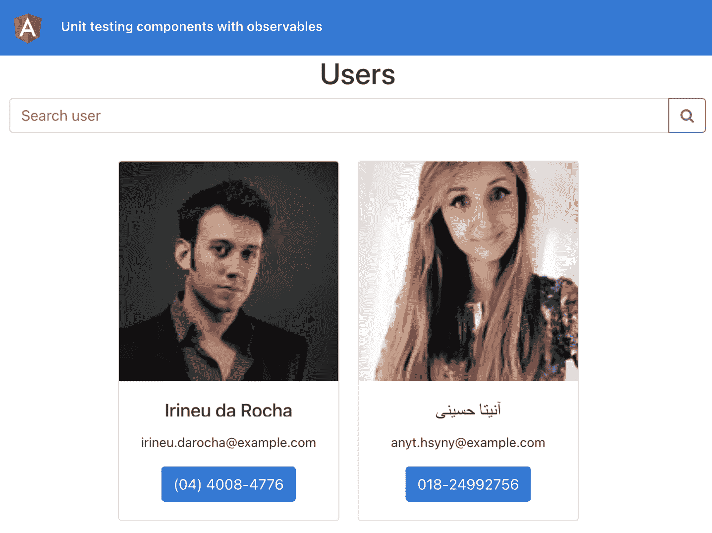

图 10.14–运行在上的单元测试 observables 应用程序 http://localhost:4200

现在我们让应用程序在本地运行，在下面的章节中，让我们看看菜谱的步骤。

## 怎么做。。。

我们将从编写测试用例开始，从技术上讲，测试用例涉及到可观性的使用。本质上，我们必须模拟使用可观察数据的方法，我们必须使用 Angular 提供的`fakeAsync`和`tick()`方法，以达到编写具有可观察数据的良好单元测试的目标。让我们开始：

1.  First and foremost, we'll write a test to see what happens when we use an `expect()` clause in a test that involves a function containing an Observable. Update the `users.component.spec.ts` file by adding a test, which checks whether we get the users from the server when the component initiates:

    ```ts
    import { HttpClientModule } from '@angular/common/http';
    import {
      ComponentFixture,
     fakeAsync,
      TestBed,
     tick,
    } from '@angular/core/testing';
    ...
    describe('UsersComponent', () => {
      ...
     it('should get users back from the API component init',   fakeAsync(() => {
     component.ngOnInit();
     tick(500);
     expect(component.users.length).toBeGreaterThan(0);
     }));
    });
    ```

    现在，只要运行`npm run test`命令，您就会看到测试失败，并显示以下消息：

    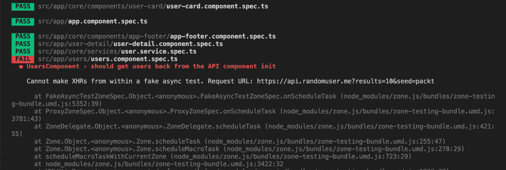

    图 10.15–错误–无法在假异步测试中生成 XHR

    这意味着我们不能从`fakeAsync`测试中进行真正的 HTTP 调用，这是调用`ngOnInit()`方法后发生的情况。

2.  The proper way to test this is to mock `UserService`. Luckily, we've already done this as we have the `UserServiceMock` class in the project. We need to provide it as a `useClass` property for `UserService` in `TestBed` and update our test slightly. Let's modify the `users.component.spec.ts` file as follows:

    ```ts
    ...
    import {
     DUMMY_USERS,
     UserServiceMock,
    } from 'src/__mocks__/services/user.service.mock';
    ...
    describe('UsersComponent', () => {
      ...
      beforeEach(async () => {
        await TestBed.configureTestingModule({
          declarations: [UsersComponent, UserCardComponent],
          providers: [
     {
     provide: UserService,
     useClass: UserServiceMock,
     },
          ],
          imports: [HttpClientModule, ReactiveFormsModule,       RouterTestingModule],
        }).compileComponents();
      });
      ...
      it('should get users back from the API component init',   fakeAsync(() => {
        component.ngOnInit();
        tick(500);
     expect(component.users.length).toBe(2);
     expect(component.users).toEqual(DUMMY_USERS);
      }));
    });
    ```

    现在，如果您再次运行测试，它们应该通过。我们将在*的工作原理中详细介绍这一点。。。*稍后。

3.  让我们为希望搜索用户的场景添加另一个测试。我们将设置`username`表单控件的值，并使用`UserService`或更严格地说，`UserServiceMock`搜索用户。然后，我们将期望结果是适当的。在`users.component.spec.ts`文件中添加测试如下：

    ```ts
    ...
    describe('UsersComponent', () => {
      ...
     it('should get the searched users from the API upon   searching', fakeAsync(() => {
     component.searchForm.get('username').    setValue('hall');
     // the second record in our DUMMY_USERS array has     the name Mrs Indie Hall
     const expectedUsersList = [DUMMY_USERS[1]];
     component.searchUsers();
     tick(500);
     expect(component.users.length).toBe(1);
     expect(component.users).toEqual(expectedUsersList);
     }));
    });
    ```

4.  Now we'll write a test for `UserDetailComponent`. We need to test that our `UserDetailComponent` gets the appropriate user from the server when the component is initiated and that we get similar users as well. Update the `user-detail.component.spec.ts` file by adding a test, as follows:

    ```ts
    ...
    import {..., fakeAsync, tick, } from '@angular/core/testing';
    ...
    import { UserServiceMock } from 'src/__mocks__/services/user.service.mock';
    describe('UserDetailComponent', () => {
      ...
      beforeEach(
        waitForAsync(() => {
          TestBed.configureTestingModule({
            declarations: [...],
            imports: [HttpClientModule, RouterTestingModule],
            providers: [
     {
     provide: UserService,
     useClass: UserServiceMock,
     },
            ],
          }).compileComponents();
        })
      );
     ...
     it('should get the user based on routeParams on page   load', fakeAsync(() => {
     component.ngOnInit();
     tick(500);
     expect(component.user).toBeTruthy();
     }));
    });
    ```

    新的测试应该在时刻失败。我们将在接下来的步骤中修复它。

5.  To debug, we can quickly add a `console.log()` to the `params` that we get from subscribing to the `route.paramMap` Observable in the `ngOnInit()` method. Modify the `user-detail.component.ts` file, and then run the tests again:

    ```ts
    ...
    @Component({...})
    export class UserDetailComponent implements OnInit, OnDestroy {
      ...
      ngOnInit() {
        this.isComponentAlive = true;
        this.route.paramMap
          .pipe(
            takeWhile(() => !!this.isComponentAlive),
            flatMap((params) => {
              this.user = null;
     console.log('params', params);
              ...
              return this.userService.getUser(userId).          pipe(...);
            })
          )
          .subscribe((similarUsers: IUser[]) => {...});
      }
      ...
    }
    ```

    现在当您运行测试时，您可以看到错误，如下所示：

    

    图 10.16–错误–空参数和缺少 uuid

6.  正如您在*图 10.16*中所看到的，`Params`对象中没有`uuid`。这是，因为对于真正的用户来说，这不是一个真正的路由过程。因此，我们需要模拟`UserDetailComponent`中使用的`ActivatedRoute`服务以获得所需的结果。让我们在`__mocks__`文件夹中创建一个名为`activated-route.mock.ts`的新文件，并向其中添加以下代码：

    ```ts
    import { convertToParamMap, ParamMap, Params } from '@angular/router';
    import { ReplaySubject } from 'rxjs';
    /**
     * An ActivateRoute test double with a `paramMap`  observable.
     * Use the `setParamMap()` method to add the next  `paramMap` value.
     */
    export class ActivatedRouteMock {
     // Use a ReplaySubject to share previous values with   subscribers
     // and pump new values into the `paramMap` observable
     private subject = new ReplaySubject<ParamMap>();
     constructor(initialParams?: Params) {
     this.setParamMap(initialParams);
     }
     /** The mock paramMap observable */
     readonly paramMap = this.subject.asObservable();
     /** Set the paramMap observables's next value */
     setParamMap(params?: Params) {
     this.subject.next(convertToParamMap(params));
     }
    }
    ```

7.  现在我们将在`UserDetailComponent`的测试中使用此模拟。更新`user-detail.component.spec.ts`文件，如下所示：

    ```ts
    ...
    import { ActivatedRouteMock } from 'src/__mocks__/activated-route.mock';
    import {
     DUMMY_USERS,
      UserServiceMock,
    } from 'src/__mocks__/services/user.service.mock';
    ...
    describe('UserDetailComponent', () => {
      ...
     let activatedRoute;
      beforeEach(
        waitForAsync(() => {
          TestBed.configureTestingModule({
            ...
            providers: [
              {...},
     {
     provide: ActivatedRoute,
     useValue: new ActivatedRouteMock(),
     },
            ],
          }).compileComponents();
        })
      );
      beforeEach(() => {
        ...
        fixture.detectChanges();
     activatedRoute = TestBed.inject(ActivatedRoute);
      });
     ...
    });
    ```

8.  既然我们已经将模拟注入到测试环境中，那么让我们修改我们的测试，从`DUMMY_USERS`数组中获取第二个用户。更新测试文件如下：

    ```ts
    ...
    describe('UserDetailComponent', () => {
      ...
      it('should get the user based on routeParams on page   load', fakeAsync(() => {
        component.ngOnInit();
     activatedRoute.setParamMap({ uuid: DUMMY_USERS[1].    login.uuid });
        tick(500);
     expect(component.user).toEqual(DUMMY_USERS[1]);
     }));
    });
    ```

9.  Now we'll write a test that allows us to get similar users when `UserDetailComponent` is loaded. Remember that according to our current business logic, similar users are all users except the current user on the page, which is saved in the `user` property. Let's add the test in the `user-detail.component.spec.ts` file, as follows:

    ```ts
    ...
    describe('UserDetailComponent', () => {
      ...
     it('should get similar user based on routeParams uuid   on page load', fakeAsync(() => {
     component.ngOnInit();
     activatedRoute.setParamMap({ uuid: DUMMY_USERS[1].    login.uuid }); // the second user's uuid
     const expectedSimilarUsers = [DUMMY_USERS[0]]; //     the first user
     tick(500);
     expect(component.similarUsers).    toEqual(expectedSimilarUsers);
     }));
    });
    ```

    如果您运行测试，您应该看到它们都通过了，如下所示：


图 10.17–所有测试均通过模拟观察

伟大的您现在知道了在为组件编写单元测试时如何使用可观察对象。虽然在角度测试中还有很多东西需要学习，但这个方法的目的是让一切都简单而甜蜜。

现在您已经完成了配方，请参阅下一节了解其工作原理。

## 它是如何工作的。。。

我们使用`'@angular/core/testing'`包中的`fakeAsync()`和`tick()`方法开始我们的配方。注意，我们使用`fakeAsync()`方法包装测试的回调方法。在`fakeAsync()`方法中包装的方法是在`fakeAsync`区域中执行的。这与在`ngZone`内部运行的实际角度应用程序中的工作方式相反。

重要提示

为了使用`fakeAsync`区域，我们需要在测试环境中导入`zone.js/dist/zone-testing`库。这通常在创建角度项目时在`src/test.ts`文件中完成。然而，由于我们迁移到 Jest，我们删除了该文件。

*“好的，那么它是如何工作的，阿桑？”*很高兴你问我。在设置 Jest 时，我们使用`jest-preset-angular`包。该包最终需要`fakeAsync`测试所需的所有文件，如下所示：

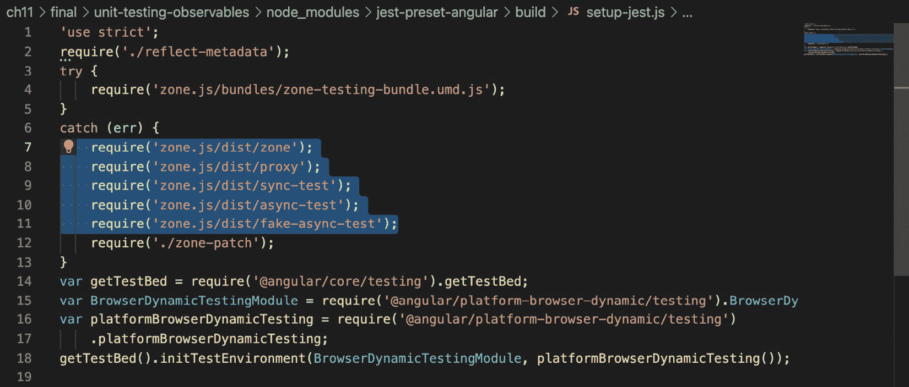

图 10.18–jest 预置 angular 包导入所需 zone.js 文件

本质上，`tick()`方法模拟这个虚拟`fakeAsync`区域中的时间流逝，直到所有异步任务完成。它以毫秒为参数，反映已过去多少毫秒或虚拟时钟已提前多少毫秒。在我们的例子中，我们使用`500`毫秒作为`tick()`方法的值。

请注意，我们在模拟`UsersComponent`的测试`UserService`。特别是对于`'should get users back from the API component init'`，我们在测试中调用`component.ngOnInit()`方法，然后调用`tick()`方法。同时，`ngOnInit()`方法调用`searchUsers()`方法，该方法调用`UserServiceMock.searchUsers()`方法，因为我们在`UserService`的测试环境中将其作为`useClass`属性提供。最后，它返回我们在`user.service.mock.ts`文件中定义的`DUMMY_USERS`数组的值。`UsersComponent`的另一个测试，即`'should get the searched users from the API upon searching'`，也非常类似。

对于`UserDetailComponent`的测试，我们做了一些不同的事情，也就是说，我们还必须模拟`activatedRoute`服务。为什么？那是因为`UserDetailComponent`是一个可以用`uuid`导航的页面，而且它的路径在`app-routing.module.ts`文件中定义为`'/users/:uuid'`。因此，我们需要在测试中填充此`uuid`参数，以使用`DUMMY_USERS`阵列。为此，我们使用`__mocks__`文件夹中的`ActivatedRouteMock`类。请注意，它有一个`setParamMap()`方法。这允许我们在测试中指定`uuid`参数。然后，当实际代码订阅`this.route.paramMap`可观测时，可以在那里找到我们设置的`uuid`参数。

对于`'should get the user based on routeParams on page load'`测试，我们将`DUMMY_USERS`数组中第二个用户的`uuid`设置为`uuid`路由参数的值。然后，我们使用`tick()`方法，之后我们期望`user`属性将`DUMMY_USERS`数组中的第二个用户作为值。文件中的另一个测试也非常相似，并且是不言自明的。有关单元测试场景的更多有用链接，请参阅下一节。

## 另见

*   角度测试组件场景（[https://docs.angular.lat/guide/testing-components-scenarios](https://docs.angular.lat/guide/testing-components-scenarios)
*   使用`RouterTestingModule`（[测试路由角度组件 https://dev.to/this-is-angular/testing-angular-routing-components-with-the-routertestingmodule-4cj0](https://dev.to/this-is-angular/testing-angular-routing-components-with-the-routertestingmodule-4cj0)

## 单元测试角管

在我个人看来，管道是角度应用中最容易测试的组件。为什么？这是，因为它们（应该）是纯函数，基于相同的输入集返回相同的结果。在这个配方中，我们将为角度应用程序中的一个非常简单的管道编写一些测试。

## 准备好了吗

我们将要处理的项目位于`chapter10/start_here/unit-testing-pipes`中，它位于克隆存储库中。执行以下步骤：

1.  在 Visual Studio 代码中打开项目。
2.  打开终端，运行`npm install`安装项目的依赖项。
3.  完成后，运行`ng serve -o`。

这将在新的浏览器选项卡中打开应用程序。您应该会看到类似于以下屏幕截图的内容：

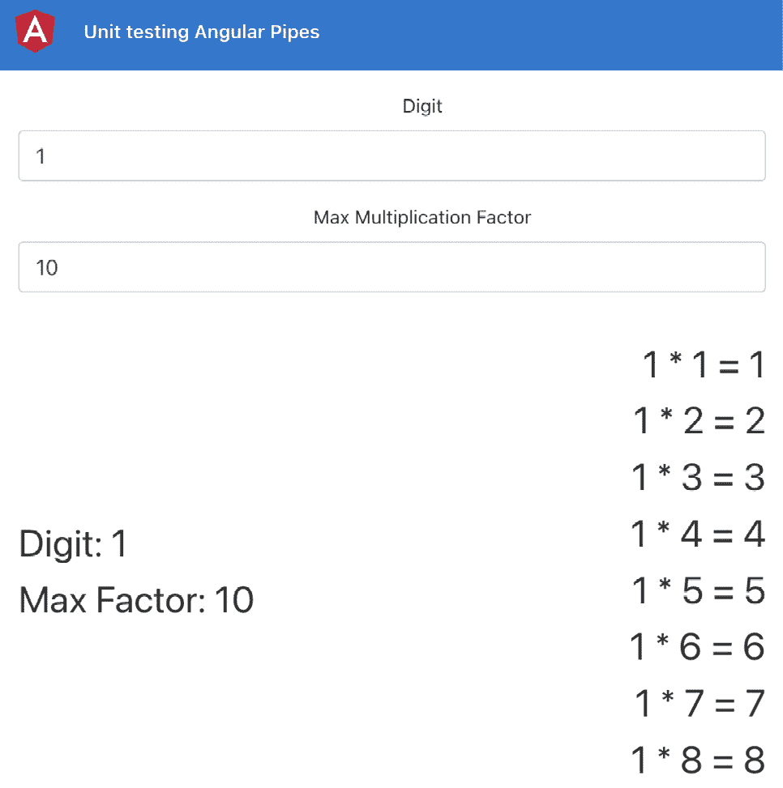

图 10.19–运行在上的单元测试管道应用程序 http://localhost:4200

现在我们有了本地运行的应用程序，在下一节中，让我们完成配方的步骤。

## 怎么做。。。

这里，我们有一个简单的配方，需要两个输入–数字和最大因子值。基于这些输入，我们展示了一个乘法表。根据我们的业务逻辑，我们已经有了工作正常的`MultTablePipe`。我们现在将编写一些单元测试来验证输入和预期输出，如下所示：

1.  让我们为`MultTablePipe`编写第一个测试。当`digit`输入的值无效时，我们将确保它返回空数组。更新`mult-table.pipe.spec.ts` 文件，如下所示：

    ```ts
    ...
    describe('MultTablePipe', () => {
      ...
     it('should return an empty array if the value of digit   is not valid', () => {
     const digit = 0;
     const limit = 10;
     const outputArray = pipe.transform(null, digit,     limit);
     expect(outputArray).toEqual([]);
     });
    });
    ```

2.  让我们编写另一个测试来验证`limit`输入，这样如果无效，我们也会返回一个空数组：

    ```ts
    ...
    describe('MultTablePipe', () => {
      ...
     it('should return an empty array if the value of limit   is not valid', () => {
     const digit = 10;
     const limit = 0;
     const outputArray = pipe.transform(null, digit,     limit);
     expect(outputArray).toEqual([]);
     });
    });
    ```

3.  现在我们将编写一个测试，在`digit`和`limit`输入都有效时验证管道转换方法的输出。在这个场景中，我们应该返回包含乘法表的数组。编写另一个测试如下：

    ```ts
    ...
    describe('MultTablePipe', () => {
      ...
     it('should return the correct multiplication table when   both digit and limit inputs are valid', () => {
     const digit = 10;
     const limit = 2;
     const expectedArray = ['10 * 1 = 10', '10 * 2 = 20'];
     const outputArray = pipe.transform(null, digit,     limit);
     expect(outputArray).toEqual(expectedArray);
      });
    });
    ```

4.  现在，在应用程序中，我们可以为`limit`输入提供十进制数字。例如，我们可以在输入中写入`2.5`作为最大因子。为了处理这个问题，我们在`MultTablePipe`中使用`Math.floor()`将其四舍五入到较低的数字。让我们编写一个测试，以确保其正常工作：

    ```ts
    ...
    describe('MultTablePipe', () => {
      ...
     it('should round of the limit if it is provided in   decimals', () => {
     const digit = 10;
     const limit = 3.5;
     const expectedArray = ['10 * 1 = 10', '10 * 2 = 20',     '10 * 3 = 30']; // rounded off to 3 factors instead     of 3.5
     const outputArray = pipe.transform(null, digit,     limit);
     expect(outputArray).toEqual(expectedArray);
     });
    });
    ```

轻松点！为角形管道编写测试非常简单，我非常喜欢。我们可以称之为纯函数的幂。现在，您已经完成了食谱，请参阅下一节以获取更多信息链接。

## 另见

*   测试角管官方文件（[https://angular.io/guide/testing-pipes](https://angular.io/guide/testing-pipes)
*   *使用服务*（[测试角管 https://levelup.gitconnected.com/test-angular-pipes-with-services-4cf77e34e576](https://levelup.gitconnected.com/test-angular-pipes-with-services-4cf77e34e576)