# 十二、Angular 性能优化

在为最终用户构建的任何产品中，性能始终是一个值得关注的问题。这是增加某人首次使用你的应用程序成为客户的机会的一个关键因素。现在，在我们确定潜在的改进可能性和实现方法之前，我们无法真正提高应用程序的性能。在本章中，您将学习一些改进 Angular 应用程序的部署方法。您将学习如何使用多种技术分析、优化和提高 Angular 应用程序的性能。以下是我们将在本章中介绍的食谱：

*   使用`OnPush`变化检测修剪组件子树
*   从组件上拆下更改检测器
*   与`runOutsideAngular`一起运行`async`事件
*   对于带有`*ngFor`的列表，使用`trackBy`
*   将繁重的计算转移到纯管道
*   使用 web workers 进行繁重的计算
*   使用绩效预算进行审计
*   使用`webpack-bundle-analyzer`分析捆绑包

# 技术要求

对于本章中的配方，请确保您的机器上安装了**Git**和**Node.js**。您还需要安装`@angular/cli`软件包，您可以从终端使用`npm install -g @angular/cli`进行安装。本章代码可在以下链接中找到：[https://github.com/PacktPublishing/Angular-Cookbook/tree/master/chapter12](https://github.com/PacktPublishing/Angular-Cookbook/tree/master/chapter12) 。

# 使用 OnPush 变更检测修剪组件子树

在当今的现代 web 应用程序世界中，性能是实现卓越的**用户体验**（**用户体验**）以及最终实现业务转换的关键因素之一。在这个配方中，作为本章的第一个配方，我们将讨论可以在任何合适的地方对组件进行的基本或最基本的优化，也就是使用`OnPush`变更检测策略。

## 准备好了吗

我们将要处理的项目位于`Chapter12/start_here/using-onpush-change-detection`，位于克隆的寄存器内：

1.  在**Visual Studio 代码**（**VS 代码**中打开项目）。
2.  打开终端，运行`npm install`安装项目的依赖项。
3.  运行`ng serve -o`命令启动 Angular 应用程序并在浏览器上提供。您应该看到该应用程序，如下所示：

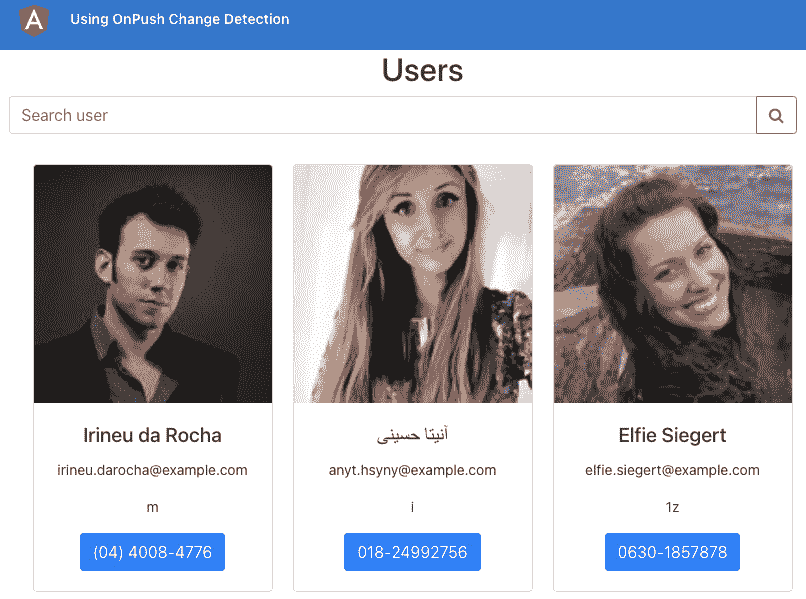

图 12.1–使用 OnPush 更改检测的应用程序在 http://localhost:4200

现在我们已经在浏览器上提供了项目，让我们在下一节中查看配方的步骤。

## 怎么做…

我们正在使用的应用程序存在一些性能问题，尤其是`UserCardComponent`类。这是因为它正在使用`idUsingFactorial()`方法生成一个唯一的 ID 以显示在卡上。我们将体验并理解由此引起的性能问题。我们将尝试使用`OnPush`更改检测策略解决此问题。让我们开始：

1.  First, try to search for a user named `Elfie Siegert` by entering their name in the search box. You'll notice that the app immediately hangs and that it takes a few seconds to show the user. You'll also notice that you don't even see the typed letters in the search box as you type them.

    让我们在代码中添加一些逻辑。我们将检查页面加载时 Angular 调用`idUsingFactorial()`方法的次数。

2.  修改`app/core/components/user-card/user-card.component.ts`文件，更新如下：

    ```ts
    ...
    @Component({...})
    export class UserCardComponent implements OnInit {
      ...
      constructor(private router: Router) {}
      ngOnInit(): void {
     if (!window['appLogs']) {
     window['appLogs'] = {};
     }
     if (!window['appLogs'][this.user.email]) {
     window['appLogs'][this.user.email] = 0;
     }
      }
      ...
      idUsingFactorial(num, length = 1) {
        window['appLogs'][this.user.email]++;
        if (num === 1) {...} else {...}
      }
    }
    ```

3.  Now, refresh the app and open the Chrome DevTools and, in the **Console** tab, type `appLogs` and press *Enter*. You should see an object, as follows:

    

    图 12.2–反映 idUsingFactorial（）方法调用次数的日志

4.  Now, type the name `Elfie Siegert` again in the search box. Then, type `appLogs` again in the **Console** tab and press *Enter* to see the object again. You'll see that it has some increased numbers. If you didn't make a typo while entering the name, you should see something like this:

    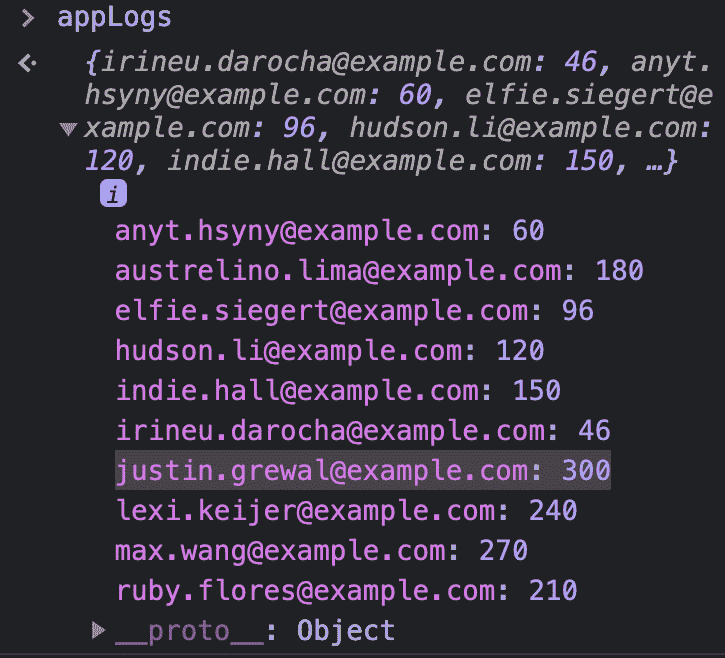

    图 12.3–键入名称 Elfie Siegert 后的日志

    调用`justin.grewal@example.com`的`idUsingFactorial()`方法时注意计数。只需几次按键，它就从`40`增加到了`300`。

    现在让我们使用`OnPush`变更检测策略。这将避免在每个浏览器事件上运行 Angular 变化检测机制，该机制当前会在每次按键时导致性能问题。

5.  打开文件并更新，如所示：

    ```ts
    import {
      ChangeDetectionStrategy,
      Component,
      ...
    } from '@angular/core';
    ...
    @Component({
      selector: 'app-user-card',
      templateUrl: './user-card.component.html',
      styleUrls: ['./user-card.component.scss'],
     changeDetection: ChangeDetectionStrategy.OnPush,
    })
    export class UserCardComponent implements OnInit {
      ...
    }
    ```

6.  现在，再次尝试在搜索框中键入名称`Elfie Siegert`。你会注意到，你现在可以在搜索框中看到输入的字母，并且它不会挂起应用程序。另外，如果您查看**控制台**选项卡中的`appLogs`对象，您应该会看到如下内容：

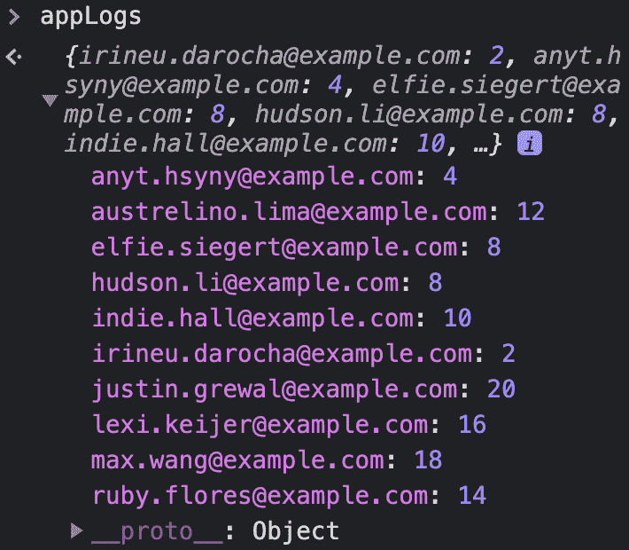

图 12.4–使用 OnPush 策略键入名称 Elfie Siegert 后的日志

请注意，即使在刷新应用程序并输入名称`Elfie Siegert`后，我们现在对`idUsingFactorial()`方法的调用次数也非常少。例如，对于`justin.grewal@example.com`电子邮件地址，我们只有**20**点击，而不是*图 12.2*中所示的初始**40**点击，以及**300**点击，如*图 12.3*中所示。

伟大的在一个步骤中，通过使用`OnPush`策略，我们能够提高`UserCardComponent`的整体性能。现在您知道了如何使用此策略，请参阅下一节了解其工作原理。

## 它是如何工作的…

Angular 默认使用**默认**变更检测策略，或者技术上是`@angular/core`包中的`ChangeDetectionStrategy.Default`枚举。因为 Angular 不知道我们创建的每个组件，所以它使用默认的策略来避免任何意外。但是作为开发人员，如果我们知道一个组件不会改变，除非它的一个`@Input()`变量改变，那么我们可以并且应该对该组件使用`OnPush`改变检测策略。为什么？因为它告诉 Angular 在组件的`@Input()`变量更改之前不要运行更改检测。这个策略是**呈现**组件（有时称为**哑**组件）的绝对赢家，这些组件只是应该使用`@Input()`变量/属性显示数据，并在交互上发出`@Output()`事件。这些表示组件通常不包含任何业务逻辑，例如繁重的计算、使用服务进行**超文本传输协议**（**HTTP**调用等。因此，我们更容易在这些组件中使用`OnPush`策略，因为当父组件的`@Input()`属性发生变化时，它们只会显示不同的数据。

由于我们现在在`UserCardComponent`上使用`OnPush`策略，因此在搜索时替换整个阵列时，它只会触发更改检测。这是在**300ms**去抖动（`users.component.ts`文件中的*行 28*之后发生的，因此我们只在用户停止键入时进行。因此，本质上，在优化之前，默认的更改检测是在每个按键上触发的，这是一个浏览器事件，而现在，它没有。

重要提示

正如您现在所知，`OnPush`策略仅在一个或多个`@Input()`绑定更改时触发 Angular 变化检测机制，这意味着如果我们更改组件（`UserCardComponent`内的属性，它将不会反映在视图中，因为在这种情况下不会运行变化检测机制，因为那个属性不是`@Input()`绑定。您必须将组件标记为“脏”，以便 Angular 可以检查组件并运行更改检测。具体来说，您将使用`ChangeDetectorRef`服务和`.markForCheck()`方法来完成此操作。

## 另见

*   Angular`ChangeDetectionStrategy`官方文件（[https://angular.io/api/core/ChangeDetectionStrategy](https://angular.io/api/core/ChangeDetectionStrategy)
*   `markForCheck()`方法官方文件（[https://angular.io/api/core/ChangeDetectorRef#markforcheck](https://angular.io/api/core/ChangeDetectorRef#markforcheck)

# 从部件上拆下变化检测器

在前面的配方中，我们学习了如何在组件中使用`OnPush`策略，以避免 Angular 变化检测运行，除非`@Input()`绑定之一发生变化。然而，还有另一种方法可以告诉 Angular 在任何情况下都不要运行更改检测。当您想要完全控制何时运行更改检测时，这非常方便。在本配方中，您将学习如何将变化检测器与 Angular 组件完全分离，以获得性能改进。

## 准备好了吗

此配方的项目位于`Chapter12/start_here/detaching-change-detecto:`

1.  在 VS 代码中打开项目。
2.  打开终端，运行`npm install`安装项目的依赖项。
3.  运行`ng serve -o`命令启动 Angular app，并在浏览器上服务。您应该看到该应用程序，如下所示：

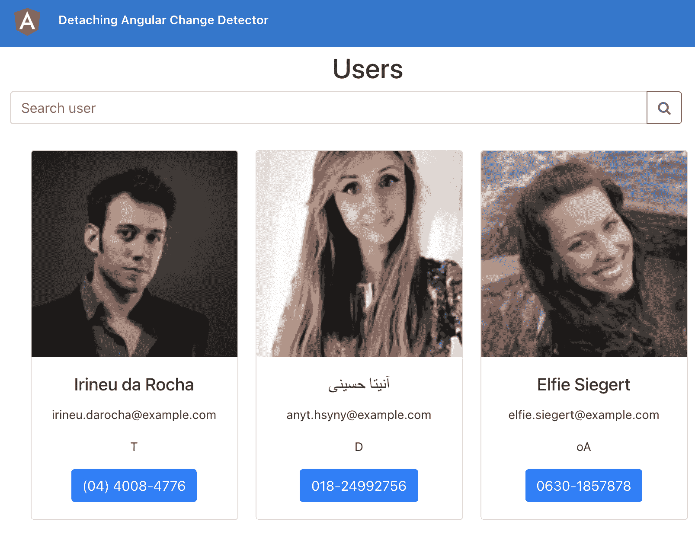

图 12.5–应用程序分离变化检测器在 http://localhost:4200

现在，我们已经在浏览器上提供了该项目，让我们在下一节中查看配方的步骤。

## 怎么做…

我们有相同的用户列表应用程序，但有一个转折点。现在，我们有`UserSearchInputComponent`组件来保存搜索输入框。在这里，我们键入用户名以在用户列表中搜索它。另一方面，我们有`UserCardListComponent`组件，它有一个用户列表。我们将首先体验性能问题，然后智能地分离更改检测器以获得性能改进。让我们开始吧：

1.  Refresh the app in the browser, then just click inside the search input, and then click outside the search input to first trigger a `focus` event on the input and then to trigger a `blur` event. Repeat this two times more, and then, on the console inside the Chrome Dev Tools, check the value of the `appLogs` object. You should see something like this:

    

    图 12.6–在搜索输入上执行聚焦和模糊三次后的日志

    前面的屏幕截图显示，`justin.grewal@example.com`用户的`UserCardComponent`类中的`idUsingFactorial()`方法已经被调用了大约 100 次，就在我们到目前为止执行的步骤中。

2.  Now, try to search for the `elfie` user by entering the name quickly in the search box.

    你会注意到应用程序立即挂起，需要几秒钟才能显示给用户。您还会注意到，在您键入字母时，您甚至看不到在搜索框中键入的字母。如果您正确地遵循了*步骤 1*和*步骤 2*，您应该会看到一个`appLogs`对象，如下所示：

    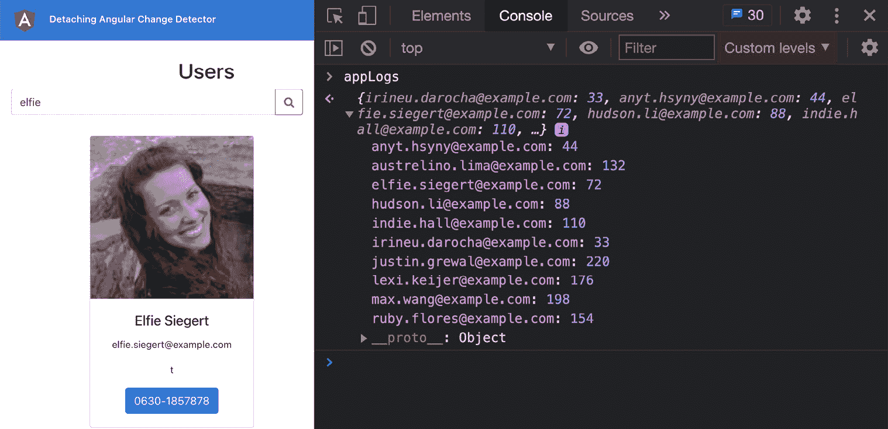

    图 12.7–在输入搜索框中键入 elfie 后的日志

    您可以在前面的屏幕截图中看到，`justin.grewal@example.com`用户的`idUsingFactorial()`方法现在已经被调用了大约 220 次。

3.  In order to improve performance, we'll use the `ChangeDetectorRef` service in this recipe to completely detach the change detector from the `UsersComponent` component, which is our top component for the **Users** page. Update the `users.component.ts` file, as follows:

    ```ts
    import { ChangeDetectorRef, Component, OnInit} from '@angular/core';
    ...
    @Component({...})
    export class UsersComponent implements OnInit {
      users: IUser[];
      constructor(
        private userService: UserService,
     private cdRef: ChangeDetectorRef
      ) {}
      ngOnInit() {
     this.cdRef.detach();
        this.searchUsers();
      }
    }
    ```

    如果你现在刷新应用程序，你会看到…实际上，你什么也看不到，没关系，我们还有更多的步骤要做。

4.  现在，由于我们只想在搜索用户时运行变更检测，也就是说，当`UsersComponent`类中的`users`数组发生变化时，我们可以使用`ChangeDetectorRef`实例的`detectChanges()`方法。再次更新`users.component.ts`文件，如下：

    ```ts
    ...
    @Component({...})
    export class UsersComponent implements OnInit {
      ...
      searchUsers(searchQuery = '') {
        this.userService.searchUsers(
    searchQuery).subscribe((users) => {
          this.users = users;
     this.cdRef.detectChanges();
        });
      }
      ...
    }
    ```

5.  现在，再次尝试执行操作，即刷新页面、聚焦输入、聚焦输出、聚焦输入、聚焦输出、聚焦输入、聚焦输出，然后在搜索输入中键入`elfie`。完成这些步骤后，您将看到`appLogs`对象，如下所示：


图 12.8–执行测试步骤并使用 ChangeDetectorRef.detach（）后的日志

您可以在前面的屏幕截图中看到，即使执行了*步骤 1*和*步骤 2*中提到的所有操作，我们的变更检测运行周期计数也非常低。

太棒了！您刚刚学习了如何使用`ChangeDetectorRef`服务分离 Angular 变化检测器。现在您已经完成了配方，请参阅下一节以了解其工作原理。

## 它是如何工作的…

`ChangeDetectorRef`服务提供了一系列重要的方法来完全控制变更检测。在配方中，我们使用`UsersComponent`类的`ngOnInit()`方法中的`.detach()`方法，在该组件创建后立即将其与 Angular 变化检测机制分离。因此，`UsersComponent`类及其任何子类都不会触发任何更改检测。这是因为每个 Angular 组件都有一个变化检测树，其中每个组件都是一个节点。当我们从变更检测树中分离组件时，该组件（作为树节点）以及其子组件（或节点）都将分离。通过这样做，`UsersComponent`类完全不会发生变化检测。因此，当我们刷新页面时，即使我们从**应用程序编程接口**（**API**中获取用户并将其分配给`UsersComponent`类中的`users`属性，也不会呈现任何内容。因为我们需要在视图上显示用户，这需要触发 Angular 变化检测机制，所以我们在将用户数据分配给`users`属性之后，使用`ChangeDetectorRef`实例中的`.detectChanges()`方法。结果，Angular 运行了变化检测机制，我们得到了视图上显示的用户卡。

这意味着在整个**用户**页面中（即`/users`路由上），Angular 变化检测机制在`UsersComponent`类启动后触发的唯一时间是调用`searchUsers()`方法，从 API 获取数据，并将结果分配给`users`属性时，因此，创建了一个高度受控的变更检测周期，从而在总体上实现了更好的性能。

## 另见

*   `ChangeDetectorRef`官方文件（[https://angular.io/api/core/ChangeDetectorRef](https://angular.io/api/core/ChangeDetectorRef)

# 使用 runOutsideAngular 在 Angular 之外运行异步事件

Angular 在几件事情上运行其变更检测机制，包括但不限于所有浏览器事件，如`keyup`、`keydown`等。它还对`setTimeout`、`setInterval`和 Ajax HTTP 调用运行更改检测。如果我们在 T4 上调用了 Angular detection，那么我们会告诉您，如果在 T4 上运行 Angular detection，那么我们会改变它的任何事件，例如，如果我们在 T4 上调用 Angular detection，那么我们会改变它的时间，以避免在 T4 上运行 Angular detection。在本教程中，您将学习如何使用`runOutsideAngular()`方法在`ngZone`服务之外执行代码块。

## 准备好了吗

此配方的项目位于`Chapter12/start_here/run-outside-angula:`

1.  在 VS 代码中打开项目。
2.  打开终端，运行`npm install`安装项目的依赖项。
3.  运行`ng serve -o`命令启动 Angular 应用程序并在浏览器上提供。您应该看到该应用程序，如下所示：


图 12.9–应用程序运行在外角运行 http://localhost:4200

现在我们已经运行了应用程序，让我们在下一节中查看配方的步骤。

## 怎么做…

我们有一个显示手表的应用程序。然而，目前应用程序中的变化检测并不是最优的，我们还有很大的改进空间。我们将尝试使用`ngZone`中的`runOutsideAngular`方法删除任何不必要的更改检测。让我们开始吧：。

1.  The clock values are constantly updating. Thus, we have change detection running for each update cycle. Open the Chrome DevTools and switch to the **Console** tab. Type `appLogs` and press *Enter* to see how many times change detection has run for the `hours`, `minutes`, `seconds`, and `milliseconds` components. It should look like this:

    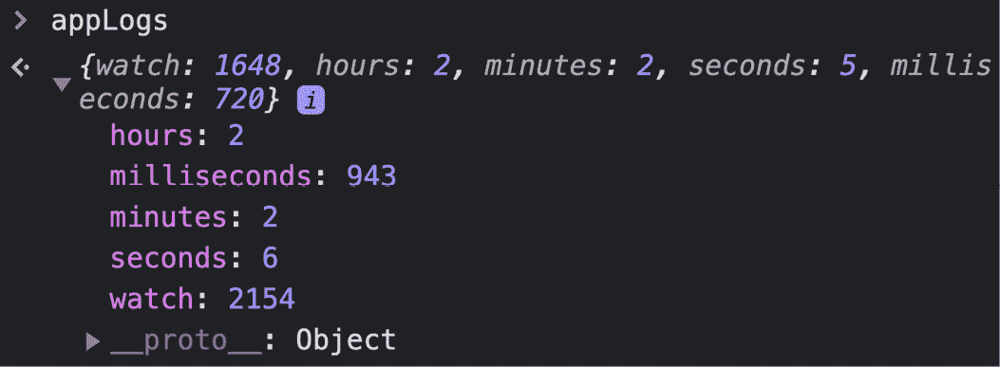

    图 12.10–反映变更检测运行次数的 appLogs 对象

2.  为了衡量绩效，我们需要在固定的时间段内看到这些数字。让我们添加一些代码，在应用程序启动后 4 秒内关闭时钟间隔计时器。修改`watch-box.component.ts`文件，如下所示：

    ```ts
    ...
    @Component({...})
    export class WatchBoxComponent implements OnInit {
      ...
      ngOnInit(): void {
        this.intervalTimer = setInterval(() => {
          this.timer();
        }, 1);
     setTimeout(() => {
     clearInterval(this.intervalTimer);
     }, 4000);
      }
      ...
    }
    ```

3.  Refresh the app and wait for 4 seconds for the clock to stop. Then, type `appLogs` multiple times in the **Console** tab, press *Enter*, and see the results. The clock stops but the animation is still running. You should see that change detection for the `watch` key still increases, as follows:

    

    图 12.11–手表组件的变化检测仍在运行

4.  Let's also stop the animation inside the watch after 4 seconds. Update the `watch.component.ts` file, as follows:

    ```ts
    ...
    @Component({...})
    export class WatchComponent implements OnInit {
      ...
      ngOnInit(): void {
        this.intervalTimer = setInterval(() => {
          this.animate();
        }, 30);
     setTimeout(() => {
     clearInterval(this.intervalTimer);
     }, 4000);
      }
      ...
    }
    ```

    刷新应用程序，等待动画停止。看看 Chrome 开发工具中的`appLogs`对象。您应该看到`watch`键的变化检测停止，如下所示：

    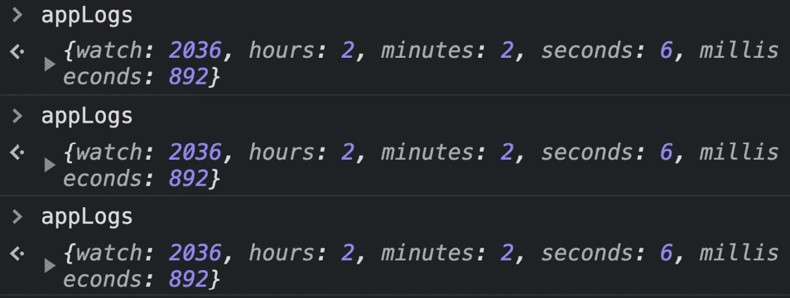

    图 12.12–停止动画间隔后，更改检测停止

5.  We want the animation to run but without causing additional change-detection runs. This is because we want to make our app more performant. So, let's just stop the clock for now. To do that, update the `watch-box.component.ts` file, as follows:

    ```ts
    ...
    @Component({...})
    export class WatchBoxComponent implements OnInit {
      ...
      ngOnInit(): void {
     // this.intervalTimer = setInterval(() => {
     //   this.timer();
     // }, 1);
     // setTimeout(() => {
     //   clearInterval(this.intervalTimer);
     // }, 4000);
      }
    }
    ```

    由于我们现在已经停止了时钟，`watch`键的`appLogs`值现在仅基于这 4 秒的动画。您现在应该看到`watch`键的值介于**250**和**260**之间。

6.  Let's avoid running change detection on the animation by running the interval outside the `ngZone` service. We'll use the `runOutsideAngular()` method for this. Update the `watch.component.ts` file, as follows:

    ```ts
    import {
      ...
      ViewChild,
     NgZone,
    } from '@angular/core';
    @Component({...})
    export class WatchComponent implements OnInit {
      ...
      constructor(private zone: NgZone) {
       ...
      }
      ngOnInit(): void {
     this.zone.runOutsideAngular(() => {
          this.intervalTimer = setInterval(() => {
            this.animate();
          }, 30);
          setTimeout(() => {
            clearInterval(this.intervalTimer);
          }, 2500);
     });
      }
      ...
    }
    ```

    刷新应用程序并等待约 5 秒钟。如果您现在检查`appLogs`对象，您应该看到每个属性的变更检测运行总数减少，如下所示：

    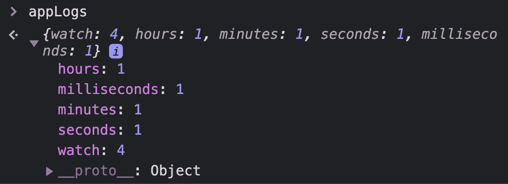

    图 12.13–在 WatchComponent 中使用 runOutsideAngular（）后的 appLogs 对象

    耶！请注意，`appLogs`对象中的`watch`键的值现在已从大约**250**减少到**4**。这意味着我们的动画现在根本不会对变化检测做出贡献。

7.  从`WatchComponent`类的动画中删除`clearInterval()`的用法。因此，动画应该保持运行。修改`watch.component.ts`文件，如下所示：

    ```ts
    ...
    @Component({...})
    export class WatchComponent implements OnInit {
      ...
      ngOnInit(): void {
        ...
        this.ngZone.runOutsideAngular(() => {
          this.intervalTimer = setInterval(() => {
            this.animate();
          }, 30);
          setTimeout(() => { // ← Remove this block
            clearInterval(this.intervalTimer);
          }, 4000);
        });
      }
      ...
    }
    ```

8.  Finally, remove the usage of `clearInterval()` from the `WatchBoxComponent` class to run the clock. Update the `watch-box.component.ts` file, as follows:

    ```ts
    import { Component, OnInit } from '@angular/core';
    @Component({
      selector: 'app-watch-box',
      templateUrl: './watch-box.component.html',
      styleUrls: ['./watch-box.component.scss'],
    })
    export class WatchBoxComponent implements OnInit {
      name = '';
      time = {
        hours: 0,
        minutes: 0,
        seconds: 0,
        milliseconds: 0,
      };
      intervalTimer;
      constructor() {}
      ngOnInit(): void {
        this.intervalTimer = setInterval(() => {
          this.timer();
        }, 1);
     setTimeout(() => { // ← Remove this
     clearInterval(this.intervalTimer);
     }, 4000);
      }
      ...
    }
    ```

    刷新应用程序，几秒钟后多次检查`appLogs`对象的值。您应该看到如下内容：

    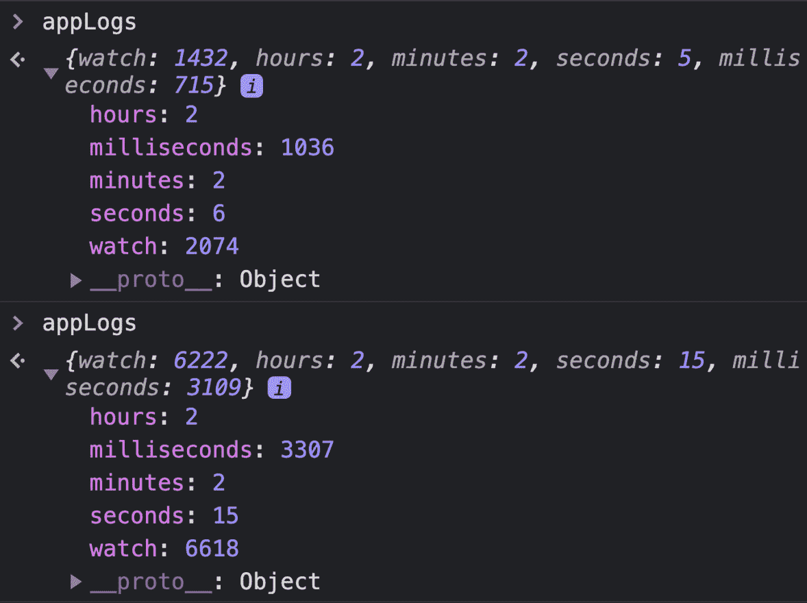

    图 12.14–使用 runOutsideAngular（）进行性能优化后的 appLogs 对象

    看看前面的屏幕截图，你会想：*阿桑！这是什么？我们还有大量的手表按键的变化检测运行。这到底是如何执行的？*很高兴你问。我将在*如何工作*部分告诉您*为什么*。

9.  最后一步，停止 Angular 服务器并运行以下命令以在生产模式下启动服务器：

    ```ts
    ng serve --prod
    ```

10.  导航到[https://localhost:4200](https://localhost:4200) 又来了。等待几秒钟，然后多次检查**控制台**选项卡中的`appLogs`对象。您应该看到对象，如下所示：

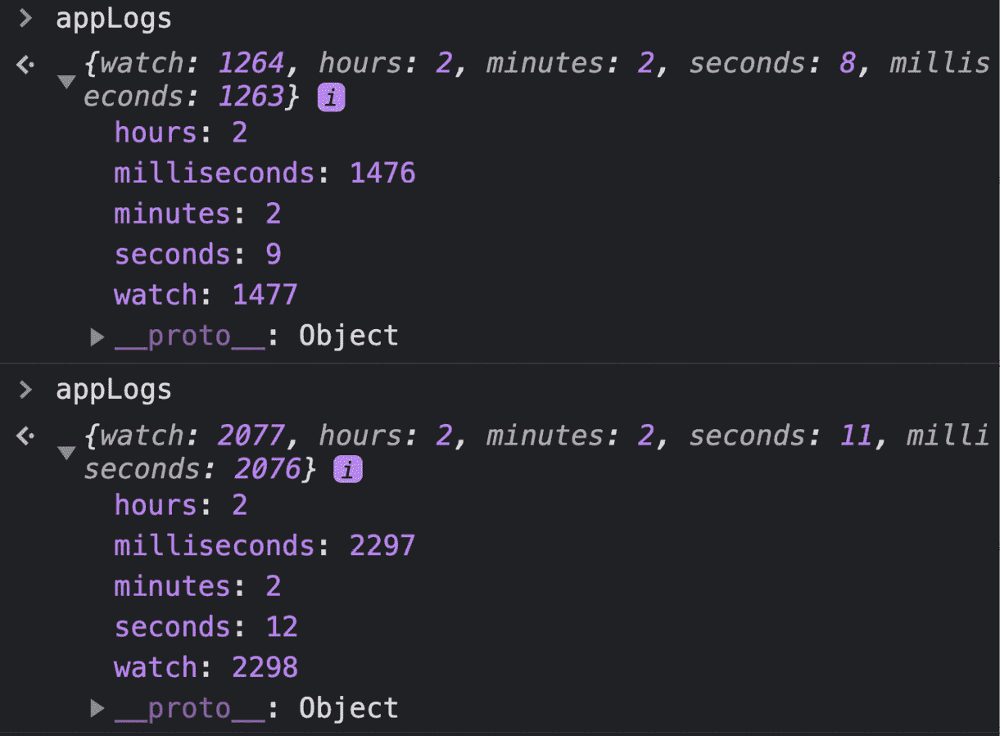

图 12.15–使用生产构建的 appLogs 对象

繁荣如果您查看前面的屏幕截图，您应该会看到`watch`键的变更检测运行计数始终比`milliseconds`键多一个周期。这意味着只要更新了`@Input() milliseconds`绑定的值，`WatchComponent`类几乎只会被重新呈现。

现在，您已经完成了配方，请参阅下一节以了解它是如何工作的。

## 它是如何工作的…

在这个配方中，我们首先查看`appLogs`对象，它包含一些键值对。每个键值对的值表示特定组件的 Angular 变化检测次数。`hours`、`milliseconds`、`minutes`和`seconds`键代表时钟上显示的每个值的`WatchTimeComponent`实例。`watch`键代表`WatchComponent`实例。

在配方的开头，我们看到`watch`键的值是`milliseconds`键值的两倍以上。我们为什么要关心`milliseconds`键呢？因为属性绑定`milliseconds`在我们的应用中变化最频繁，也就是每 1**毫秒**（**毫秒**一次）。第二个最常更改的值是`WatchComponent`类中的`xCoordinate`和`yCoordinates`属性，它们每 30 毫秒更改一次。`xCoordinate`和`yCoordinate`值不会直接绑定到模板（超文本标记语言（**HTML**），因为它们更改了**`stopWatch`视图子级的级联样式表**（**CSS**）变量。这在`animate()`方法中发生，如下所示：

```ts
el.style.setProperty('--x', `${this.xCoordinate}px`);
el.style.setProperty('--y', `${this.yCoordinate}px`);
```

因此，更改这些值实际上根本不应该触发更改检测。我们首先限制时钟窗口，使用`WatchBoxComponent`类中的`clearInterval()`方法，以便时钟在 4 秒内停止，我们可以计算数字。在*图 12.11*中，我们看到即使在时钟停止后，`WatchComponent`类的变化检测机制仍会持续触发。随着时间的推移，这会增加`appLogs`对象中`watch`键的计数。然后我们在`WatchComponent`类中使用`clearInterval()`停止动画。这也会在 4 秒后停止动画。在*图 12.12*中，我们看到`watch`键的计数在动画停止后停止增加。

然后，我们尝试仅基于动画查看更改检测的计数。在*步骤 6*中，我们停止时钟。因此，我们仅根据`watch`键的`appLogs`对象中的动画获取计数，该值介于**250**和**260**之间。

然后我们将 magic`runOutsideAngular()`方法引入到我们的代码中。此方法是`NgZone`服务的一部分。`NgZone`服务与`@angular/core`包一起打包。`runOutsideAngular()`方法接受方法作为参数。此方法在 Angular 区域外执行。这意味着`runOutsideAngular()`方法中使用的`setTimeout()`和`setInterval()`方法不会触发 Angular 变化检测循环。您可以在*图 12.13*中看到，使用`runOutsideAngular()`方法后，计数下降到**4**。

然后，我们从`WatchBoxComponent`和`WatchComponent`类中删除`clearInterval()`用法，即再次运行时钟和动画，就像我们在开始时所做的那样。在*图 12.14*中，我们看到`watch`键的计数几乎是`milliseconds`键值的两倍。那么，为什么这是双倍的呢？这是因为在开发模式下，Angular 会运行两次更改检测机制。因此，在*步骤 9*和*步骤 10*中，我们以生产模式运行应用程序，在*图 12.15*中，我们看到`watch`键的值仅比`milliseconds`键的值大一个，这意味着动画不再触发应用程序的任何更改检测。太棒了，不是吗？如果你觉得这个食谱有用，一定要让我知道我的社交活动。

现在您已经了解了它的工作原理，请参阅下一节以进一步阅读。

## 另见

*   `NgZone`官方文件（[https://angular.io/api/core/NgZone](https://angular.io/api/core/NgZone)
*   Angular`ChangeDetectorRef`官方文件（[https://angular.io/api/core/ChangeDetectorRef](https://angular.io/api/core/ChangeDetectorRef)

# 对带有*ngFor 的列表使用 trackBy

列表是我们今天构建的大多数应用程序的重要组成部分。如果你正在构建一个 Angular 应用程序，你很有可能在某个时候使用`*ngFor`指令。`*ngFor`允许我们为每个项目生成循环的 HTML 对象。但是，对于大型列表，使用它可能会导致性能问题，特别是当`*ngFor`的源完全更改时。在本教程中，我们将学习如何使用带有`trackBy`函数的`*ngFor`指令来提高列表的性能。让我们开始吧。

## 准备好了吗

此配方的项目位于`Chapter12/start_here/using-ngfor-trackb:`

1.  在 VS 代码中打开项目。
2.  打开终端，运行`npm install`安装项目的依赖项。
3.  运行`ng serve -o`命令启动 Angular 应用程序并在浏览器上提供。您应该看到该应用程序，如下所示：

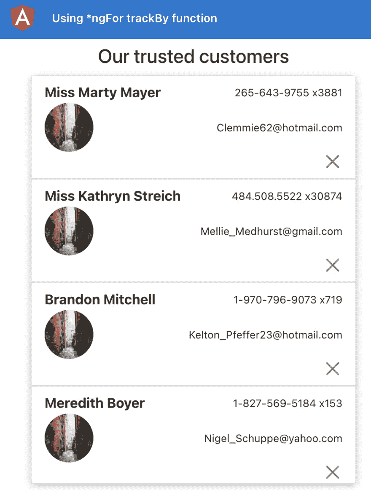

图 12.16–在上运行使用 ngfor trackby 的应用程序 http://localhost:4200

现在我们已经运行了应用程序，让我们在下一节中查看配方的步骤。

## 怎么做…

我们有一个应用程序，它在视图上显示了 1000 个用户的列表。由于我们没有使用虚拟卷轴和标准的`*ngFor`列表，所以目前我们确实面临一些性能问题。请注意，当您刷新应用程序时，即使在加载程序被隐藏之后，在列表出现之前，您仍会在大约 2-3 秒钟内看到一个空白的白色框。让我们开始复制性能问题并解决它们。

1.  首先，打开 Chrome 开发工具，查看**控制台**选项卡。您应该会看到一条记录了 1000 次的`ListItemComponent initiated`消息。每当创建/启动列表项组件时，都会记录此消息。
2.  Now, delete the first item by using the cross button on it. You should see the same message logged again about 999 times now, as shown in the following screenshot. This means we recreate the list-item component for the remaining 999 items:

    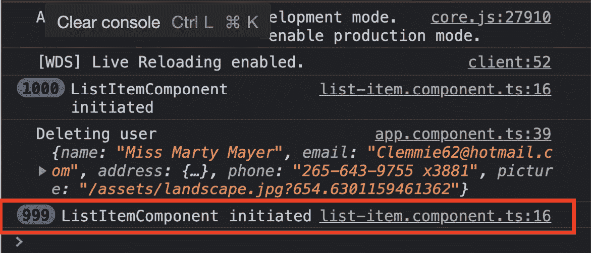

    图 12.17–删除项目后再次显示的日志

3.  Now, refresh the app and tap on the first list item. You should see the `ListItemComponent initiated` logs again, as shown in the following screenshot. This means we recreate all the list items on an item update. You will notice that the update to the first item's name in the **user interface** (**UI**) is reflected in about 2-3 seconds:

    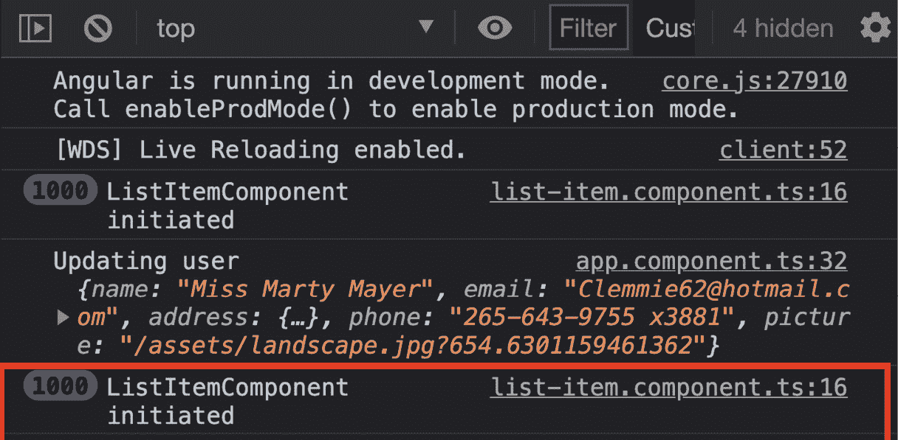

    图 12.18–更新项目后再次显示的日志

4.  现在，让我们使用`trackBy`函数解决性能问题。打开文件并更新，如下：

    ```ts
    ...
    @Component({...})
    export class TheAmazingListComponent implements OnInit {
      ...
      ngOnInit(): void {}
     trackByFn(_, user: AppUserCard) {
     return user.email;
     }
    }
    ```

5.  现在，更新`the-amazing-list.component.html`文件，使用我们刚刚创建的方法`trackByFn()`，如所示：

    ```ts
    <h4 class="heading">Our trusted customers</h4>
    <div class="list list-group">
      <app-list-item
        *ngFor="let item of listItems; trackBy: trackByFn"
        [item]="item"
        (itemClicked)="itemClicked.emit(item)"
        (itemDeleted)="itemDeleted.emit(item)"
      >
      </app-list-item>
    </div>
    ```

6.  Now, refresh the app, and click the first list item to update it. You will notice that the item is updated immediately and we don't log the `ListItemComponent initiated` message again anymore, as shown in the following screenshot:

    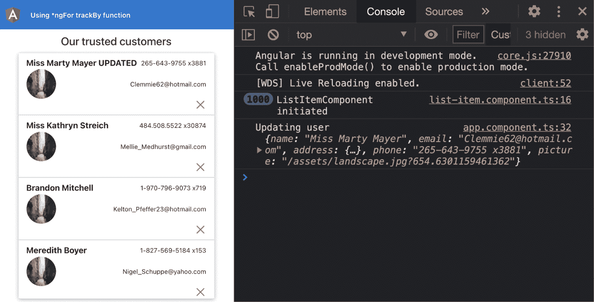

    图 12.19–使用 trackBy 功能更新项目后无进一步日志

7.  现在也删除一个项目，您会看到在这种情况下我们也不会再次记录`ListItemComponent initiated`消息。

伟大的现在，您知道了如何使用带有`*ngFor`指令的`trackBy`函数来优化列表的性能。要了解配方背后的所有魔力，请参阅下一节。

## 它是如何工作的…

默认情况下，`*ngFor`指令假定对象本身是其唯一标识，这意味着如果您只是更改`*ngFor`指令中使用的对象的属性，它将不会重新呈现该对象的模板。但是，如果在其位置提供新对象（内存中的不同引用），则特定项的内容将重新呈现。这就是我们在本配方中实际所做的，以重现性能问题内容。在`data.service.ts`文件中，我们有`updateUser()`方法的以下代码：

```ts
updateUser(updatedUser: AppUserCard) {
    this.users = this.users.map((user) => {
      if (user.email === updatedUser.email) {
        return {
 ...updatedUser,
 };
      }
      // this tells angular that every object has now       a different reference
      return { ...user };
    });
  }
```

请注意，我们使用对象扩展操作符（`{ … }`为数组中的每个项目返回一个新对象。这告诉`*ngFor`指令为`TheAmazingListComponent`类中`listItems`数组中的每个项重新呈现 UI。假设您向服务器发送查询以查找或筛选用户。服务器可能返回有 100 个用户的响应。在这 100 个视图中，大约 90 个已经在视图上渲染，只有 10 个不同。但是，由于以下潜在原因（但不限于此），Angular 将重新呈现所有列表项的 UI：

*   用户的排序/位置可能已更改。
*   用户的长度可能已更改。

现在，我们希望避免使用对象引用作为每个列表项的唯一标识符。对于我们的用例，我们知道每个用户的电子邮件都是唯一的，因此我们使用`trackBy`函数告诉 Angular 使用用户的电子邮件作为唯一标识符。现在，即使我们在通过`updateUser()`方法（如前所示）进行用户更新后为每个用户返回一个新对象，Angular 也不会重新呈现所有列表项。这是因为新对象（用户）有相同的电子邮件，Angular 使用它来跟踪他们。很酷吧？

现在您已经了解了配方的工作原理，请参阅下一节以查看链接，以便进一步阅读。

## 另见

*   `NgForOf`官方文件（[https://angular.io/api/common/NgForOf](https://angular.io/api/common/NgForOf)

# 将繁重的计算转移到纯管道

在 Angular 中，我们有一种特殊的编写组件的方式。由于 Angular 是非常固执己见的，我们已经有很多来自社区和 Angular 团队的指导意见，例如在编写组件时要考虑什么，从组件直接发出 HTTP 调用被认为是一个不太好的实践。类似地，如果我们在一个组件中有大量的计算，这也不是一个好的做法。当视图依赖于不断使用计算的数据转换版本时，使用 Angular 管道是有意义的。在本配方中，您将学习如何使用 Angular 纯管道，以避免组件内的繁重计算。

## 准备好了吗

我们将要处理的项目位于`Chapter12/start_here/using-pure-pipes`，位于克隆的寄存器内：

1.  在 VS 代码中打开项目。
2.  打开终端，运行`npm install`安装项目的依赖项。
3.  运行`ng serve -o`命令启动 Angular 应用程序并在浏览器上提供。您应该看到该应用程序，如下所示：


图 12.20–使用在以下位置运行的纯管道应用程序 http://localhost:4200

现在我们已经在浏览器上提供了项目，让我们在下一节中查看配方的步骤。

## 怎么做…

我们正在使用的应用程序存在一些性能问题，尤其是`UserCardComponent`类，因为它使用`idUsingFactorial()`方法生成一个唯一的 ID 以显示在卡上。您会注意到，如果您尝试在搜索框中键入`'irin'`，应用程序会挂起一段时间。我们无法在搜索框中看到即时键入的字母，并且需要一段时间才能显示结果。我们将通过将`idUsingFactorial()`方法中的计算移动到 Angular（纯）管道来解决问题。让我们开始吧：

1.  让我们创建一个有 Angular 的管道。我们将把为该管道生成唯一 ID 的计算转移到后面的代码中。在项目根目录中，在终端中运行以下命令：

    ```ts
    ng g pipe core/pipes/unique-id
    ```

2.  现在，从`user-card.component.ts`文件中复制`createUniqueId()`方法的代码，并将粘贴到`unique-id.pipe.ts`文件中。我们还将对代码进行一些修改，因此现在应该是这样的：

    ```ts
    ...
    @Pipe({...})
    export class UniqueIdPipe implements PipeTransform {
     characters = 'ABCDEFGHIJKLMNOPQRSTUVWXYZabcdef   ghijklmnopqrstuvwxyz0123456789';
     createUniqueId(length) {
     var result = '';
     const charactersLength = this.characters.length;
     for (let i = 0; i < length; i++) {
     result += this.characters.charAt(
     Math.floor(Math.random() * charactersLength)
     );
     }
     return result;
     }
      ...
      transform(index: unknown, ...args: unknown[]): unknown {
        return null;
      }
    }
    ```

3.  现在，也将方法从`user-card.component.ts`文件复制到`unique-id.pipe.ts`文件并更新文件，如下所示：

    ```ts
    import { Pipe, PipeTransform } from '@angular/core';
    @Pipe({
      name: 'uniqueId',
    })
    export class UniqueIdPipe implements PipeTransform {
      ...
     idUsingFactorial(num, length = 1) {
     if (num === 1) {
     return this.createUniqueId(length);
     } else {
     const fact = length * (num - 1);
     return this.idUsingFactorial(num - 1, fact);
     }
     }
     transform(index: number): string {
     return this.idUsingFactorial(index);
     }
    }
    ```

4.  现在，更新`user-card.component.html`文件以使用`uniqueId`管道代替组件的方法。代码应该如下所示：

    ```ts
    <div class="user-card">
      <div class="card" *ngIf="user" (click)="cardClicked()">
        
        <div class="card-body">
          <h5 class="card-title">{{ user.name.first }}      {{ user.name.last }}</h5>
          <p class="card-text">{{ user.email }}</p>
          <p class="card-text unique-id" title="{{ index |       uniqueId }}">
            {{ index | uniqueId }}
          </p>
          <a href="tel: {{ user.phone }}" class="btn       btn-primary">{{
            user.phone
          }}</a>
        </div>
      </div>
    </div>
    ```

5.  现在，刷新应用程序并在搜索框中键入名称`Elfie Siegert`。请注意，UI 没有被阻止。我们可以在打字时立即看到打印的字母，搜索结果也更快。

繁荣现在，您已经知道如何通过将繁重的计算移到纯 Angular 管道来优化性能，请参阅下一节以了解其工作原理。

## 它是如何工作的…

正如我们所知，Angular by 默认会对应用程序中触发的每个浏览器事件运行更改检测，并且由于我们在组件模板（UI）中使用`idUsingFactorial()`方法，因此每次 Angular 运行更改检测机制时，该函数都会运行，从而导致更多的计算和性能问题。如果我们使用 getter 而不是方法，这也是正确的。在这里，我们使用一个方法，因为每个唯一 ID 都依赖于索引，我们需要在调用它时在方法中传递索引。

我们可以从最初的实现中回顾我们可以思考的步骤。它接受一个输入，进行一些计算，并根据输入返回一个值——这是数据转换的经典示例，也是使用纯函数的示例。幸运的是，Angular 纯管道是纯函数，除非输入发生变化，否则它们会触发变化检测。

在配方中，我们将计算移动到新创建的 Angular 管道。管道的`transform()`方法接收我们应用管道的值，该值是`users`数组中每个用户卡的索引。然后管道使用`idUsingFactorial()`方法，最终使用`createUniqueId()`方法来计算一个随机唯一 ID。当我们开始在搜索框中键入时，索引的值不会改变。这将导致在我们返回一组新用户作为输出之前不会触发任何更改检测。因此，当我们将输入输入到搜索框中时，不会运行不必要的计算，从而优化性能并解除对 UI 线程的阻塞。

## 另见

*   有 Angular 的纯净和不纯管道官方文件（[https://angular.io/guide/pipes#pure-和不纯管道](https://angular.io/guide/pipes#pure-and-impure-pipes)

# 使用 web workers 进行繁重的计算

如果你的 Angular 应用程序在一个动作中进行了大量计算，那么它很有可能会阻塞 UI 线程。这将导致 UI 呈现延迟，因为它会阻止主 JavaScript 线程。Web workers 允许我们在后台线程中运行大量计算，从而释放 UI 线程，因为它没有被阻塞。在这个配方中，我们将使用一个在`UserService`类中进行大量计算的应用程序。它为每个用户卡创建一个唯一的 ID，并将其保存到`localStorage`中。但是，在执行此操作之前，它会循环数千次，这会导致我们的应用程序挂起一段时间。在这个配方中，我们将把繁重的计算从组件转移到 web worker，并在 web worker 不可用的情况下添加一个回退。

## 准备好了吗

我们将要处理的项目位于`Chapter12/start_here/using-web-workers`，位于克隆的寄存器内：

1.  在 VS 代码中打开项目。
2.  打开终端，运行`npm install`安装项目的依赖项。
3.  运行`ng serve -o`命令启动 Angular 应用程序并在浏览器上提供。您应该看到该应用程序，如下所示：

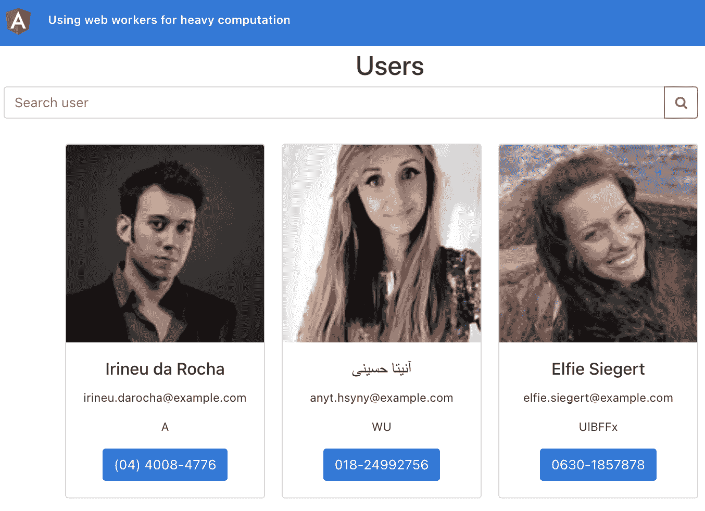

图 12.21–使用 web workers 运行的应用程序 http://localhost:4200

现在我们已经运行了应用程序，让我们在下一节中查看配方的步骤。

## 怎么做…

打开应用程序后，您会注意到在呈现用户卡之前需要一些时间。这表明在计算完成之前，UI 线程是阻塞的。罪魁祸首是`UserService`类中的`saveUserUniqueIdsToStorage()`方法。在将其保存到`localStorage`之前，会生成数千次唯一 ID。让我们开始制作配方，以提高应用程序的性能。我们将从实现 web 工作开始：

1.  我们将首先创建一个 web worker。在项目根目录中运行以下命令：

    ```ts
    ng generate web-worker core/workers/idGenerator
    ```

2.  现在，将`for`循环从`UserService`类中的`saveUserUniqueIdsToStorage()`方法复制到新创建的`id-generator.worker.ts`文件中。代码应如下所示：

    ```ts
    /// <reference lib="webworker" />
    import createUniqueId from '../constants/create-unique-id';
    addEventListener('message', ({ data }) => {
     console.log('message received IN worker', data);
     const { index, email } = data;
     let uniqueId;
     for (let i = 0, len = (index + 1) * 100000; i < len;   ++i) {
     uniqueId = createUniqueId(50);
     }
     postMessage({ uniqueId, email });
    });
    ```

3.  既然已经创建了 worker 文件，那么让我们创建一个 worker 实例，以便在接下来的步骤中使用它。在`constants`文件夹中创建一个新文件。将其命名为`get-unique-id-worker.ts`并在文件中添加以下代码：

    ```ts
    let UNIQUE_ID_WORKER: Worker = null;
    const getUniqueIdWorker = (): Worker => {
     if (typeof Worker !== 'undefined' && UNIQUE_ID_WORKER   === null) {
     UNIQUE_ID_WORKER = new Worker('../workers/    id-generator.worker', {
     type: 'module',
     });
     }
     return UNIQUE_ID_WORKER;
    };
    export default getUniqueIdWorker;
    ```

4.  现在，我们将使用`user.service.ts`文件中的工作者。更新如下：

    ```ts
    ...
    import getUniqueIdWorker from '../constants/get-unique-id-worker';
    @Injectable({...})
    export class UserService {
      ...
     worker: Worker = getUniqueIdWorker();
      constructor(private http: HttpClient) {
     this.worker.onmessage = ({ data: { uniqueId, email }   }) => {
     console.log('received message from worker',       uniqueId, email);
     const user = this.usersCache.find((user) => user.      email === email);
     localStorage.setItem(
     `ng_user__${user.email}`,
     JSON.stringify({
     ...user,
     uniqueId,
     })
     );
     };
      }
      ...
    }
    ```

5.  我们将再次更新文件以修改`saveUserUniqueIdsToStorage()`方法。如果环境中有可用的 web worker，我们将使用 worker 而不是现有代码。更新`user.service.ts`文件，如下所示：

    ```ts
    ...
    @Injectable({...})
    export class UserService {
      ...
      saveUserUniqueIdsToStorage(user: IUser, index) {
        let uniqueId;
        const worker: Worker = getUniqueIdWorker();
        if (worker !== null) {
     worker.postMessage({ index, email: user.email });
     } else {
     // fallback
          for(let i = 0, len = (index + 1) * 100000; i<len;       ++i) {
            uniqueId = createUniqueId(50);
          }
          localStorage.setItem(...);
     }
      }
      ...
    }
    ```

6.  刷新应用程序并注意用户卡渲染所需的时间。它们应该比以前快得多。此外，您应该能够看到以下日志，这些日志反映了应用程序与 web worker 之间的通信，反之亦然：


图 12.22–显示应用程序与 web workers 之间消息的日志

呜呼！！！网络工作者的力量！现在你知道了如何在 Angular 应用程序中使用 web workers 将繁重的计算转移到他们身上。既然您已经完成了配方，请参阅下一节，了解其工作原理。

## 它是如何工作的…

正如我们在配方描述中所讨论的，web 工作人员允许我们在主 JavaScript（或 UI 线程）之外的单独线程中运行和执行代码。在配方开始时，每当我们刷新应用程序或搜索用户时，它都会阻止 UI 线程。直到为每张卡生成唯一的 ID 为止。我们首先使用 Angular**命令行界面**（**CLI**创建一个 web worker。这将创建一个`id-generator.worker.ts`文件，其中包含一些样板代码，用于接收来自 UI 线程的消息，并将消息作为响应发送回 UI 线程。CLI 命令还通过添加一个`webWorkerTsConfig`属性来更新`angular.json`文件。`webWorkerTsConfig`属性的值是`tsconfig.worker.json`文件的路径，CLI 命令也会创建此`tsconfig.worker.json`文件。如果您打开`tsconfig.worker.json`文件，您会看到以下代码：

```ts
/* To learn more about this file see: https://angular.io/config/tsconfig. */
{
  "extends": "./tsconfig.json",
  "compilerOptions": {
    "outDir": "./out-tsc/worker",
    "lib": [
      "es2018",
      "webworker"
    ],
    "types": []
  },
  "include": [
    "src/**/*.worker.ts"
  ]
}
```

在创建了一个 web worker 文件之后，我们创建了另一个名为`uniqueIdWorker.ts`的文件。此文件将`getUniqueIdWorker()`方法导出为默认导出。当我们调用这个方法时，如果我们还没有生成 worker，它会生成一个新的`Worker`实例。该方法使用`id-generator.worker.ts`文件生成一个 worker。我们还使用 worker 文件中的`addEventListener()`方法来侦听从 UI 线程（即`UserService`类）发送的消息。我们收到用户卡的`index`和用户的`email`作为此消息中的数据。然后我们使用一个`for`循环来生成一个唯一的 ID（`uniqueId`变量），循环结束后，我们使用`postMessage()`方法将`uniqueId`变量和`email`发送回 UI 线程。

现在，在`UserService`课程中，我们收听来自工作者的消息。在`constructor()`方法中，我们通过检查`getUniqueIdWorker()`方法中的值来检查环境中是否存在 web Worker，该值应为非空值。然后，我们使用`worker.onmessage`属性为其分配一个方法。这是为了收听来自工人的消息。因为我们已经知道我们从工作者那里获得了`uniqueId`变量和`email`，所以我们使用`email`从`usersCache`变量中获得适当的用户。然后，我们根据用户的`email`将带有`uniqueId`变量的用户数据存储到`localStorage`。

最后，我们更新`saveUserUniqueIdsToStorage()`方法以使用 worker 实例（如果可用）。请注意，我们使用`worker.postMessage()`方法传递用户的`index`和`email`。还要注意的是，对于没有启用 web workers 的情况，我们使用前面的代码作为后备方案。

## 另见

*   关于网络工作者的官方文件（[https://angular.io/guide/web-worker](https://angular.io/guide/web-worker)
*   MDN 网络工作者文档（[https://developer.mozilla.org/en-US/docs/Web/API/Worker](https://developer.mozilla.org/en-US/docs/Web/API/Worker)

# 使用绩效预算进行审计

在当今世界，大多数人都有非常好的互联网连接，可以使用日常应用程序，无论是移动应用程序还是网络应用程序。我们将大量数据作为一项业务发送给最终用户，这一点令人着迷。现在，提供给用户的 JavaScript 数量呈不断增加的趋势，如果您正在开发 web 应用程序，您可能希望使用性能预算来确保捆绑包大小不超过某个限制。对于 Angular 应用程序，设置预算大小是轻而易举的事。在本教程中，您将学习如何使用 Angular CLI 为 Angular 应用程序设置预算。

## 准备好了吗

此配方的项目位于`Chapter12/start_here/angular-performance-budget:`

1.  在 VS 代码中打开项目。
2.  打开终端，运行`npm install`安装项目依赖项。
3.  运行`ng build --configuration production`命令，在生产模式下构建 Angular 应用程序。注意控制台上的输出。应该是这样的：


图 12.23–为生产模式构建输出，无性能预算

请注意，`main.*.js`文件的包大小目前约为 260**KB**（**KB**）。现在我们已经构建了应用程序，让我们在下一节中查看配方的步骤。

## 怎么做…

我们有一个应用程序，就目前的包大小而言，它非常小。然而，这可能会发展成为一个巨大的应用程序，具有未来的业务需求。出于这个原因，我们将故意增加捆绑包大小，然后使用性能预算来阻止 Angular CLI 在捆绑包大小超过预算的情况下为生产构建应用程序。让我们开始互动：

1.  打开`app.component.ts`文件并更新，如下所示：

    ```ts
    ...
    import * as moment from '../lib/moment';
    import * as THREE from 'three';
    @Component({...})
    export class AppComponent {
      ...
      constructor(private auth: AuthService, private router:   Router) {
     const scene = new THREE.Scene();
     console.log(moment().format('MMM Do YYYY'));
      }
      ...
    }
    ```

2.  Now, build the app again for production using the `ng build --configuration production` command. You should see that the bundle size for the `main.*.js` file is now 1.12 **megabytes** (**MB**). This is a huge increase in size compared to the original 268.05 KB, as you can see in the following screenshot:

    

    图 12.24–main.*.js 的包大小增加到 1.11MB

    假设我们的业务要求我们不发布主捆绑包大小超过 1.0MB 的应用程序。为此，我们可以将 Angular 应用程序配置为在满足阈值时抛出错误。

3.  刷新应用程序，打开`angular.json file`并更新。我们的目标地产是`projects.angular-performance-budgets.architect.build.configurations.production.budgets`。文件应如下所示：

    ```ts
    ...
    {
      "budgets": [
        {
          "type": "initial",
          "maximumWarning": "800kb",
          "maximumError": "1mb"
        },
        {
          "type": "anyComponentStyle",
          "maximumWarning": "6kb",
          "maximumError": "10kb"
        }
      ]
    }
    ...
    ```

4.  Now that we have the budgets in place, let's build the app once again using the `ng build --configuration production` command. The build should fail and you should see both a warning and an error on the console, as follows:

    

    图 12.25–基于性能预算的错误和警告

5.  让我们通过不导入`app.component.ts`文件中的整个库来改进我们的应用程序，并使用`date-fns`包而不是`moment.js`来完成同样的工作。运行以下命令安装`date-fns`包：

    ```ts
    npm install --save date-fns
    ```

6.  现在更新`app.component.ts`文件，如下：

    ```ts
    import { Component } from '@angular/core';
    import { Router } from '@angular/router';
    import { AuthService } from './services/auth.service';
    import { format } from 'date-fns';
    import { Scene } from 'three';
    @Component({...})
    export class AppComponent {
      ...
      constructor(private auth: AuthService, private router:   Router) {
     console.log(format(new Date(), 'LLL do yyyy'));
     const scene = new Scene();
      }
      ...
    }
    ```

7.  再次运行`ng build --configuration production`命令。您应该看到束大小减小，如下所示：


图 12.26-使用日期 fns 和优化导入后减少的捆绑包大小

繁荣您刚刚学习了如何使用 Angular CLI 定义性能预算。这些预算可用于根据您的配置引发警告和错误。请注意，可以根据不断变化的业务需求修改预算。然而，作为工程师，我们必须对我们设定的性能预算保持谨慎，不要向最终用户发送超过一定限制的 JavaScript。

## 另见

*   带有正式文件（[的绩效预算 https://web.dev/performance-budgets-with-the-angular-cli/](https://web.dev/performance-budgets-with-the-angular-cli/)

# 使用 webpack 捆绑包分析器分析捆绑包

在上一个配方中，我们查看了 Angular 应用程序的预算配置，这很有用，因为您可以了解总体捆绑包大小何时超过某个阈值，尽管您不知道代码的每个部分对最终捆绑包的实际贡献有多大。这就是我们所说的*分析*捆绑包，在本配方中，您将学习如何使用`webpack-bundle-analyzer`来审核捆绑包的大小及其影响因素。

## 准备好了吗

我们将与合作的项目位于`Chapter12/start_here/using-webpack-bundle-analyzer`中，位于克隆寄存器内：

1.  在 VS 代码中打开项目。
2.  打开终端，运行`npm install`安装项目的依赖项。
3.  Run the `ng serve -o` command to start the Angular app and serve it on the browser. You should see the app, as follows:

    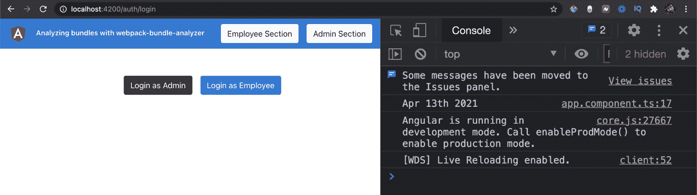

    图 12.27–运行在以下位置的使用 webpack bundle analyzer 的应用程序 http://localhost:4200

4.  现在，使用`ng build --configuration production`命令在生产模式下构建 Angular 应用程序。您应该看到以下输出：


图 12.28–大小为 1.11 MB 的主捆绑包

现在我们已经构建了应用程序，让我们在下一节中查看配方的步骤。

## 怎么做…

正如您可能已经注意到的，我们有一个大小为 1.12MB 的主捆绑包。这是因为我们在`app.component.ts`文件中使用了`Three.js`库和`moment.js`库，这两个库导入了这些库，它们最终位于主捆绑包中。让我们开始分析捆绑大小的因素：

1.  我们将首先安装`webpack-bundle-analyzer`包。在项目根目录中运行以下命令：

    ```ts
    npm install --save-dev webpack-bundle-analyzer
    ```

2.  现在，在`package.json`文件中创建一个脚本。我们将在接下来的步骤中使用此脚本来分析最终的捆绑包。更新`package.json`文件，如下所示：

    ```ts
    {
      ...
      "scripts": {
        "ng": "ng",
        "start": "ng serve",
        "build": "ng build",
        "test": "ng test",
        "lint": "ng lint",
        "e2e": "ng e2e",
     "analyze-bundle": "webpack-bundle-analyzer     dist/using-webpack-bundle-analyzer/stats.json"
      },
      "private": true,
      "dependencies": {... },
      "devDependencies": {...}
    }
    ```

3.  现在，再次构建生产包，但同时使用一个参数来生成`stats.json`文件。从项目根目录运行以下命令：

    ```ts
    ng build --configuration production --stats-json
    ```

4.  Now, run the `analyze-bundle` script to use the `webpack-bundle-analyzer` package. Run the following command from the project root:

    ```ts
    npm run analyze-bundle
    ```

    这将通过 bundle 分析启动服务器。您应该看到在默认浏览器中打开了一个新选项卡，其外观如下所示：

    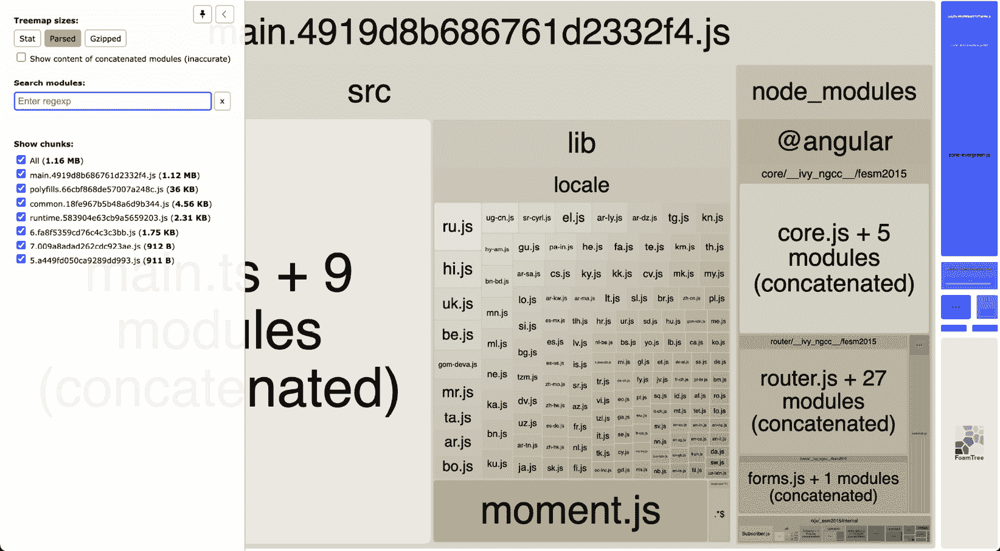

    图 12.29–使用 webpack 捆绑包分析器进行捆绑包分析

5.  请注意，文件夹占用了包的很大一部分，确切地说是 648.29 KB，您只需在`lib`框上进行鼠标移动即可检查。让我们尝试优化捆绑包的大小。让我们安装`date-fns`包，这样我们就可以使用它而不是`moment.js`。从项目根目录运行以下命令：

    ```ts
    npm install --save date-fns
    ```

6.  现在，将`app.component.ts`文件更新为使用`date-fns`包的`format()`方法，而不是使用`moment().format()`方法。我们还将从`Three.js`包中导入`Scene`类，而不是导入整个库。代码应该如下所示：

    ```ts
    import { Component } from '@angular/core';
    import { Router } from '@angular/router';
    import { AuthService } from './services/auth.service';
    import { format } from 'date-fns';
    import { Scene } from 'three';
    @Component({...})
    export class AppComponent {
      ...
      constructor(private auth: AuthService, private router:   Router) {
     const scene = new Scene();
     console.log(format(new Date(), 'LLL do yyyy'));
      }
      ...
    }
    ```

7.  Run the `ng build --configuration production --stats-json` command, and then run `npm run analyze-bundle`.

    一旦`webpack-bundle-analyzer`运行您应该会看到分析，如下面的屏幕截图所示。请注意，我们不再有`moment.js`文件或`lib`块，并且包的总大小已从 1.15 MB 减少到 831.44 KB：


图 12.30–使用 date fns 而非 moment.js 后的捆绑分析

呜呼！！！现在您知道如何使用`webpack-bundle-analyzer`包来审核 Angular 应用程序中的束大小。这是提高整体性能的一个好方法，因为您可以识别导致捆绑包大小增加的块，然后优化捆绑包。

## 另见

*   从网页包（[开始获取 https://webpack.js.org/guides/getting-started/](https://webpack.js.org/guides/getting-started/)
*   `webpack-bundle-analyzer`-GitHub 存储库（[https://github.com/webpack-contrib/webpack-bundle-analyzer](https://github.com/webpack-contrib/webpack-bundle-analyzer)