# 十三、Angular PWA 架构

**PWAs**或**渐进式 Web 应用程序**是Web 应用程序的核心。尽管它们是用现代浏览器支持的增强功能和体验构建的，但如果 PWA 在不支持现代功能/增强的浏览器中运行，用户仍然可以获得 web 应用程序的核心体验。在本章中，您将学习如何将 Angular 应用程序构建为 PWA。您将学习一些技术，使您的应用程序**可安装、功能强大、快速可靠**。以下是我们将在本章中介绍的食谱：

*   使用 Angular CLI 将现有 Angular 应用程序转换为 PWA
*   修改 PWA 的主题颜色
*   在 PWA 中使用暗模式
*   在 PWA 中提供定制的可安装体验
*   使用 Angular service worker 预缓存请求
*   为您的 PWA 创建应用程序外壳

# 技术要求

对于本章中的配方，请确保您的机器上安装了**Git**和**Node.js**。您还需要安装`@angular/cli`软件包，您可以从终端使用`npm install -g @angular/cli`进行安装。您还需要全局安装`http-server`包。您可以在终端中运行`npm install -g http-server`来安装。本章代码见[https://github.com/PacktPublishing/Angular-Cookbook/tree/master/chapter13](https://github.com/PacktPublishing/Angular-Cookbook/tree/master/chapter13) 。

# 使用 Angular CLI 将现有 Angular app 转换为 PWA

PWA涉及几个有趣的组件，其中两个是服务工作者和 web 清单文件。服务工作者帮助缓存静态资源和缓存请求，web 清单文件包含关于应用图标、应用主题颜色等的信息。在本配方中，我们将把现有的 Angular 应用程序转换为 PWA。这些原则同样适用于全新的 Angular 应用程序，如果你想从头开始创建它的话。为了配方，我们将转换现有的 Angular 应用程序。我们将看到 Angular web 应用程序中发生了什么变化，以及`@angular/pwa`包如何将其转换为 PWA。另外，它如何帮助缓存静态资源。

## 准备好了吗

我们将要处理的项目位于克隆存储库中的`chapter13/start_here/angular-pwa-app`：

1.  在 Visual Studio 代码中打开项目。
2.  打开终端，运行`npm install`安装项目的依赖项。
3.  完成后，运行`ng build --configuration production`。
4.  Now run `http-server dist/angular-pwa-app -p 4200`.

    这应该在`http://localhost:4200`生产模式下运行应用程序，如下所示：


图 13.1–运行在上的Angular pwa 应用程序 http://localhost:4200

现在我们已经有了本地运行的应用程序，让我们在下一节中查看配方的步骤。

## 怎么做

我们正在使用的应用程序是一个简单的计数器应用程序。它有一个最小值和最大值，以及一些可以增加、减少和重置计数器值的按钮。应用程序将计数器的值保存在`localStorage`中，但它还不是 PWA。让我们将其转换为 PWA：

1.  First, let's see if our application works offline at all, because that's one of the traits of PWAs. Open Chrome DevTools for the app. Go to the **Network** tab and change **Throttling** to **Offline** as follows:

    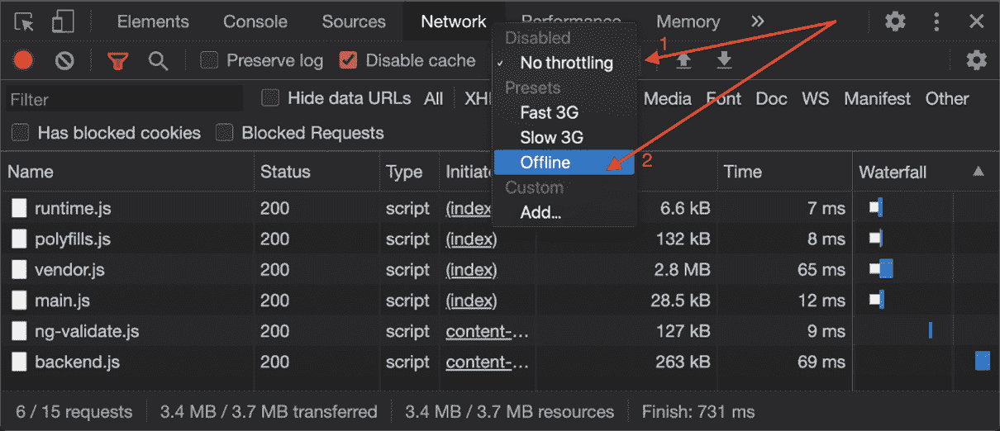

    图 13.2–将网络限制更改为脱机以查看脱机体验

2.  Now stop the `http` server by exiting the process from your terminal. Once done, refresh the app's page. You should see that the app doesn't work anymore, as shown in the following figure:

    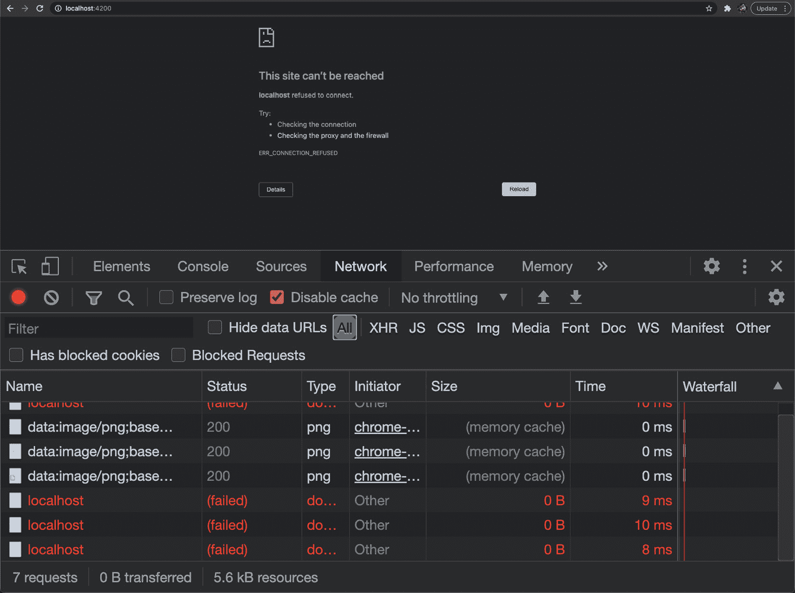

    图 13.3–应用程序无法脱机工作

3.  To convert this app into a PWA, open a new terminal window/tab and make sure you're inside the `chapter13/start_here/angular-pwa-app` folder. Once inside, run the following command:

    ```ts
    ng add @angular/pwa
    ```

    在命令的过程完成时，您应该会看到创建和更新的一组文件。

4.  现在运行`ng build --configuration production`再次构建应用程序。完成后，使用`http-server dist/angular-pwa-app -p 4200`命令进行服务。
5.  Now make sure you have turned off throttling by switching to the **Network** tab and setting **No throttling** as the selection option, as shown in *Figure 13.4*. Also, notice that the **Disable cache** option is turned off:

    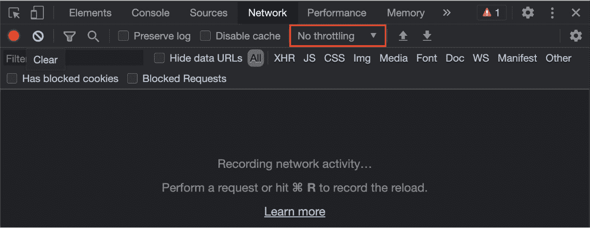

    图 13.4–关闭网络节流

6.  Now refresh the app once. You should see the app working and the network logs showing that assets such as JavaScript files were loaded from the server as shown in *Figure 13.5*:

    

    图 13.5–从源下载的资产（Angular server）

7.  Now refresh the app once again and you'll see that the same assets are now downloaded from the cache using the service worker, as shown in *Figure 13.6*:

    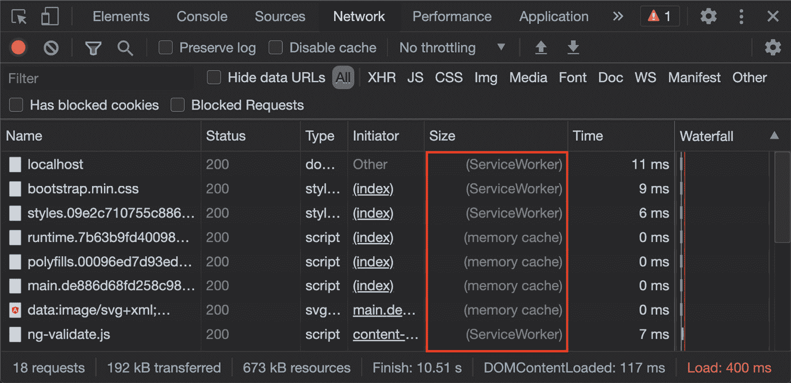

    图 13.6–使用服务工作者从缓存下载的资产

8.  Now is the moment we've been waiting for. Change the network throttling back to **Offline** to go into the **Offline** mode and refresh the app. You should still see the app working in the **Offline** mode because of the service worker, as shown in *Figure 13.7*:

    

    图 13.7–Angular 应用程序使用服务工作者作为 PWA 脱机工作

9.  更重要的是，你现在可以在你的机器上安装这个 PWA 了。因为我使用的是 MacBook，所以它是作为 Mac 应用程序安装的。如果您使用的是 Chrome，则安装选项应位于地址栏周围，如*图 13.8*所示：

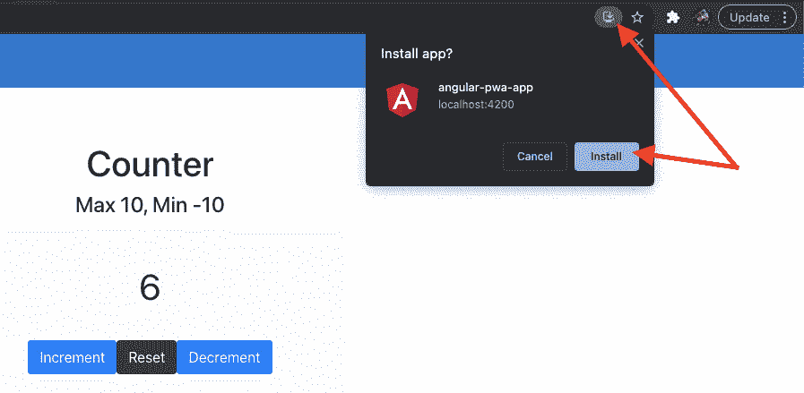

图 13.8–从铬合金安装Angular PWA

卡布姆！通过使用`@angular/pwa`包，我们自己完成零配置，我们将现有的 Angular 应用程序转换为 PWA。我们现在可以脱机运行我们的应用程序，并且可以将其作为 PWA 安装到我们的设备上。请参见*图 13.9*查看应用程序的外观–就像 macOS X 上的本机应用程序一样：


图 13.9–Angular PWA 在 macOS X 上作为本机应用程序的外观

很酷，对吧？既然已经知道如何使用Angular CLI 构建 PWA，请参阅下一节了解它的工作原理。

## 它是如何工作的

Angular 核心团队和社区在`@angular/pwa`包和`ng add`命令方面做了出色的工作，该命令允许我们使用 Angular 原理图向应用程序添加不同的包。在这个配方中，当我们运行`ng add @angular/pwa`时，它使用示意图生成应用程序图标以及 web 应用程序清单。如果查看更改后的文件，可以看到新文件，如*图 13.10*所示：

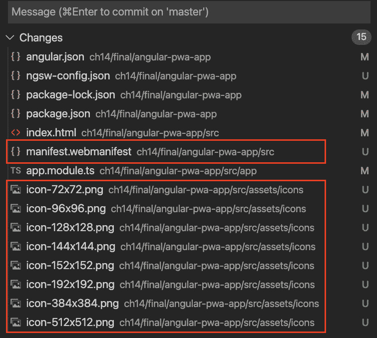

图 13.10–Web 清单文件和应用程序图标文件

`manifest.webmanifest`文件是包含 JSON 对象的文件。此对象定义 PWA 的清单，并包含一些信息。这些信息包括应用程序的名称、短名称、主题颜色以及不同设备的不同图标的配置。想象一下，这个 PWA 安装在你的 Android 手机上。你肯定需要一个图标在你的家抽屉点击图标打开应用程序。此文件包含有关根据不同设备大小使用哪个图标的信息。

我们还可以看到文件`ngsw-config.json`，其中包含服务工作者的配置。在幕后，`ng add`命令在运行示意图的同时，也在我们的项目中安装了`@angular/service-worker`包。如果您打开`app.module.ts`文件，您将看到注册我们服务人员的代码，如下所示：

```ts
...
import { ServiceWorkerModule } from '@angular/service-worker';
...
@NgModule({
  declarations: [AppComponent, CounterComponent],
  imports: [
    ...
 ServiceWorkerModule.register('ngsw-worker.js', {
 enabled: environment.production,
 // Register the ServiceWorker as soon as the app is       stable
 // or after 30 seconds (whichever comes first).
 registrationStrategy: 'registerWhenStable:30000',
 }),
  ],
  ...
})
export class AppModule {}
```

代码注册了一个名为`ngsw-worker.js`的新服务人员文件。此文件使用`ngsw-config.json`文件中的配置来决定要缓存哪些资源以及使用哪些策略。

现在，您已经了解了配方的工作原理，请参阅下一节以进一步阅读。

## 另见

*   Angular服务人员介绍（[https://angular.io/guide/service-worker-intro](https://angular.io/guide/service-worker-intro)
*   什么是 PWA？（[https://web.dev/what-are-pwas/](https://web.dev/what-are-pwas/)

# 修改 PWA 的主题颜色

在前面的配方中，我们学习了如何将Angular应用程序转换为 PWA。当我们这样做时，`@angular/pwa`包使用默认的主题颜色创建 web 应用程序清单文件，如*图 13.9*所示。然而，几乎每个 web 应用都有自己的品牌和风格。如果你想根据你的品牌来设置你的 PWA 标题栏的主题，这是你的秘诀。我们将学习如何修改 web 应用程序清单文件以自定义 PWA 的主题颜色。

## 准备好了吗

此配方的项目位于`chapter13/start_here/pwa-custom-theme-color`：

1.  在 Visual Studio 代码中打开项目。
2.  打开终端，运行`npm install`安装项目的依赖项。
3.  完成后，运行`ng build --configuration production`。
4.  现在跑`http-server dist/pwa-custom-theme-color -p 5300`去发球。
5.  打开`localhost:5300`查看应用程序。
6.  Finally, install the PWA as shown in *Figure 13.8*.

    如果打开 PWA，应如下所示：


图 13.11–PWA 自定义主题颜色应用程序

现在，我们已经运行了应用程序，让我们在下一节中查看配方的步骤。

## 怎么做

正如您在*图 13.11*中所看到的一样，应用程序的标题与应用程序的本机标题（或工具栏）的颜色略有不同。由于这种差异，这个应用看起来有点怪异。我们将修改 web 应用程序清单以更新主题颜色。让我们开始：

1.  在编辑器中打开`src/manifest.webmanifest`文件，更改主题颜色如下：

    ```ts
    {
      "name": "pwa-custom-theme-color",
      "short_name": "pwa-custom-theme-color",
     "theme_color": "#8711fc",
      "background_color": "#fafafa",
      "display": "standalone",
      "scope": "./",
      "start_url": "./",
      "icons": [...]
    }
    ```

2.  我们的`index.html`文件中也设置了。默认情况下，该文件优先于 web 应用程序清单文件。因此，我们需要更新它。打开`index.html`文件，更新如下：

    ```ts
    <!DOCTYPE html>
    <html lang="en">
      <head>
        ...
        <link rel="manifest" href="manifest.webmanifest" />
     <meta name="theme-color" content="#8711fc" />
      </head>
      <body>
        ...
      </body>
    </html>
    ```

3.  现在，使用`ng build --configuration production`命令再次构建应用程序。然后使用`http-server`按如下方式食用：

    ```ts
    http-server dist/pwa-custom-theme-color -p 5300
    ```

4.  Open the PWA app again and uninstall it as shown in *Figure 13.12*. Make sure to check the box that says **Also clear data from Chrome (...)** when prompted:

    

    图 13.12–卸载 pwa 自定义主题颜色应用程序

5.  现在，在`http://localhost:5300`的新 Chrome 选项卡中打开 Angular 应用程序，并将其重新安装为 PWA，如*图 13.8*所示。
6.  PWA 应该已经打开了。如果没有，请从您的应用程序中打开它，您应该会看到更新的主题颜色，如图 13.13 所示：

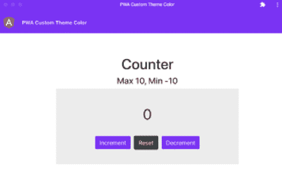

图 13.13–更新主题颜色的 PWA 应用程序

太棒了！您刚刚了解了如何更新Angular PWA 的主题颜色。现在您已经完成了配方，请参阅下一节以进一步阅读。

## 另见

*   使用Angular CLI（[创建 PWAhttps://web.dev/creating-pwa-with-angular-cli/](https://web.dev/creating-pwa-with-angular-cli/) ）

# 在 PWA 中使用暗模式

在设备和应用程序的现代时代，终端用户的偏好也发生了一些变化。随着屏幕和设备使用量的增加，健康是主要问题之一。我们知道现在几乎所有的屏幕设备都支持暗模式。考虑到这一事实，如果您正在构建一个 web 应用程序，您可能希望为其提供暗模式支持。如果它是一个以本地应用程序的形式出现的 PWA，那么责任就要大得多。在本食谱中，您将学习如何为Angular PWA 提供暗模式。

## 准备好了吗

此配方的项目位于`chapter13/start_here/pwa-dark-mode`：

1.  在 Visual Studio 代码中打开项目。
2.  打开终端，运行`npm install`安装项目的依赖项。
3.  完成后，运行`ng build --configuration production`。
4.  现在跑`http-server dist/pwa-dark-mode -p 6100`去发球。
5.  最后，安装 PWA，如*图 13.8*所示
6.  Now make sure you have the Dark theme enabled on your machine. If you're running macOS X, you can open **Settings** | **General** and select the **Dark** appearance as shown in *Figure 13.14*:

    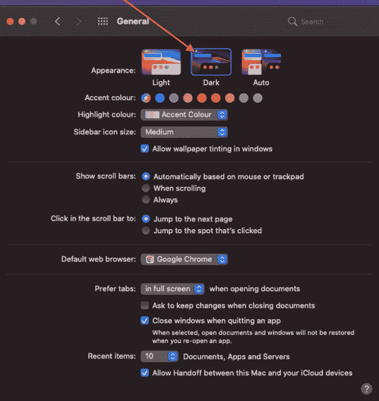

    图 13.14–在 macOS X 中将系统外观更改为暗模式

7.  完成后，打开PWA 作为本机应用，您应该会看到如*图 13.15*所示：

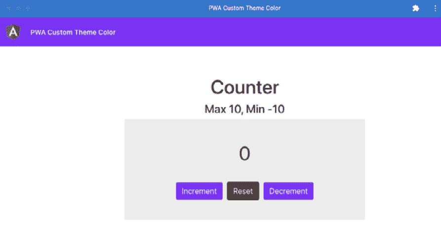

图 13.15–PWA 自定义主题颜色应用程序在系统暗模式下的外观

现在我们已经将PWA 作为本机应用程序运行，并将暗模式应用于系统，让我们在下一节中查看配方的步骤。

## 怎么做

正如你所见，Angular 应用程序目前不支持黑暗模式。我们将首先在开发模式下为应用程序提供服务，并为暗模式添加不同的颜色。让我们开始：

1.  Serve the app in development mode by running the command `ng serve -o --port 9291`.

    这将在`http://localhost:4200`的新浏览器选项卡中为应用程序提供服务。

2.  Now, open the `styles.scss` file to use the `prefers-color-scheme` media query. We'll use a different value for our global CSS variables to create a different view for dark mode. Update the file as follows:

    ```ts
    /* You can add global styles to this file, and also import other style files */
    :root {...}
    html,
    body {...}
    @media (prefers-color-scheme: dark) {
     :root {
     --main-bg: #333;
     --text-color: #fff;
     --card-bg: #000;
     --primary-btn-color: #fff;
     --primary-btn-text-color: #333;
     }
    }
    ```

    如果在浏览器选项卡中再次刷新应用程序，您将看到基于`prefers-color-scheme`媒体查询的不同暗模式视图，如*图 13.16*所示：

    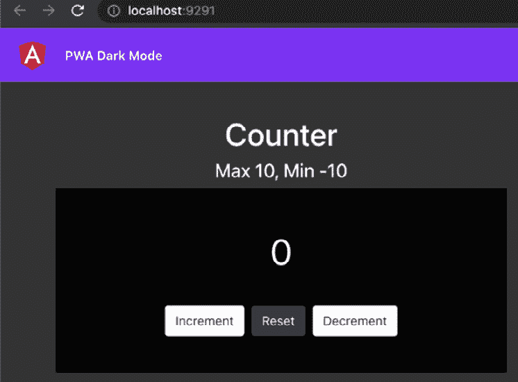

    图 13.16–使用首选颜色方案媒体查询的暗模式视图

    重要提示

    您可能已经在`localhost:4200`运行 PWA；这就是为什么在*步骤 1*中，我们的目标是端口`9291`。如果之前已经使用过，请确保清除应用程序缓存，然后刷新。

3.  Let's simulate the dark and light modes using Chrome DevTools as it provides a really nice way to do so. Open Chrome DevTools and then open the **Command** menu. On macO SX, the keys are *Cmd* + *Shift* + *P*. On Windows, it is *Ctrl* + *Shift* + *P*. Then type `Render` and select the **Show Rendering** option as shown in *Figure 13.17*:

    

    图 13.17–使用“显示渲染”选项打开渲染视图

4.  Now, in the **Rendering** tab, toggle the `prefers-color-scheme` emulation for light and dark modes as shown in *Figure 13.18*:

    

    图 13.18–模拟首选颜色方案模式

5.  现在我们已经测试了两种模式。我们可以创建生产构建并重新安装 PWA。运行`ng build --configuration production`命令以生产模式构建应用程序。
6.  现在，通过打开现有 PWA，然后从**更多**菜单中选择**卸载**选项，卸载现有 PWA，如*图 13.12*所示。当提示时，确保勾选显示**的框，并清除 Chrome（…）**中的数据。
7.  运行以下命令在浏览器上为内置应用提供服务，然后导航到`http://localhost:6100`：

    ```ts
    http-server dist/pwa-dark-mode -p 6100
    ```

8.  等待几秒钟，**安装**按钮显示在地址栏中。然后安装类似于*图 13.8*的 PWA。
9.  现在运行PWA 后，如果您的系统外观设置为暗模式，您应该会看到如*图 13.19*所示的暗模式视图：


图 13.19–我们的 PWA 支持开箱即用暗模式

令人惊叹的如果您将系统外观从暗模式切换到亮模式，或者从暗模式切换到亮模式，您应该会看到 PWA 反射适当的颜色。现在，您已经知道如何在 PWA 中支持暗模式，请参阅下一节以查看链接，以便进一步阅读。

## 另见

*   偏好颜色方案（[https://web.dev/prefers-color-scheme/](https://web.dev/prefers-color-scheme/)
*   使用带有首选配色方案的配色方案（[https://web.dev/color-scheme/](https://web.dev/color-scheme/) ）

# 在您的 PWA 中提供定制安装体验

我们知道PWA 是可安装的。这意味着它们可以像本机应用程序一样安装在您的设备上。但是，当您第一次在浏览器中打开应用程序时，它完全取决于浏览器如何显示**安装**选项。它因浏览器而异。而且它也可能不是非常及时或清晰可见。此外，您可能希望在应用程序中的某个位置显示**安装**提示，而不是应用程序启动，这对某些用户来说很烦人。幸运的是，我们有办法为 PWA 的安装选项提供自己的自定义对话框/提示。这就是我们将在这个食谱中学到的。

## 准备好了吗

此配方的项目位于`chapter13/start_here/pwa-custom-install-prompt`：

1.  在 Visual Studio 代码中打开项目。
2.  打开终端，运行`npm install`安装项目的依赖项。
3.  完成后，运行`ng build --configuration production`。
4.  现在跑`http-server dist/pwa-custom-install-prompt -p 7200` 去发球。
5.  导航到`http://localhost:7200`。稍等片刻，您会看到安装提示，如*图 13.20*所示：


图 13.20–在以下位置运行的 pwa 自定义安装提示 http://localhost:7200

现在我们已经运行了应用程序，让我们在下一节中查看配方的步骤。

## 怎么做

我们有一个骰子猜测器应用程序，您可以在其中掷骰子并猜测输出。对于此配方，我们将阻止默认安装提示，并仅在用户做出正确猜测时显示它。开始吧：

1.  首先，创建一个服务，在接下来的步骤中显示自定义的可安装提示符。在项目根目录中，运行以下命令：

    ```ts
    ng g service core/services/installable-prompt
    ```

2.  现在打开创建的文件`installable-prompt.service.ts`，并更新代码如下：

    ```ts
    import { Injectable } from '@angular/core';
    @Injectable({
      providedIn: 'root',
    })
    export class InstallablePromptService {
     installablePrompt;
      constructor() {
     this.init();
      }
     init() {
     window.addEventListener(
     'beforeinstallprompt',
     this.handleInstallPrompt.bind(this)
     );
     }
     handleInstallPrompt(e) {
     e.preventDefault();
     // Stash the event so it can be triggered later.
     this.installablePrompt = e;
     console.log('installable prompt event fired');
     window.removeEventListener('beforeinstallprompt',     this.handleInstallPrompt);
     }
    }
    ```

3.  现在，让我们构建将向用户显示的自定义对话框/提示。我们将使用项目中已经安装了的`@angular/material`包中的**材料**对话框。打开文件并更新如下：

    ```ts
    ...
    import { MatDialogModule } from '@angular/material/dialog';
    import { MatButtonModule } from '@angular/material/button';
    @NgModule({
      declarations: [... ],
      imports: [
        ...
        BrowserAnimationsModule,
        MatDialogModule,
     MatButtonModule,
      ],
      providers: [],
      bootstrap: [AppComponent],
    })
    export class AppModule {}
    ```

4.  让我们为**材质**对话框创建一个组件。在项目根目录中，运行以下命令：

    ```ts
    ng g component core/components/installable-prompt
    ```

5.  我们现在在`InstallablePromptService`中使用这个组件。打开`installable-prompt.service.ts`文件，更新代码如下：

    ```ts
    ...
    import { MatDialog } from '@angular/material/dialog';
    import { InstallablePromptComponent } from '../components/installable-prompt/installable-prompt.component';
    @Injectable({...})
    export class InstallablePromptService {
      installablePrompt;
      constructor(private dialog: MatDialog) {...}
    ...
     async showPrompt() {
     if (!this.installablePrompt) {
     return;
     }
     const dialogRef = this.dialog.    open(InstallablePromptComponent, {
     width: '300px',
     });
     }
    }
    ```

6.  我们还需要显示浏览器的提示，根据我们从自定义可安装提示中选择的内容。例如，如果用户单击**是**按钮，则表示他们希望将应用程序安装为 PWA。在本例中，我们将显示浏览器的提示。进一步更新`installable-prompt.service.ts`文件如下：

    ```ts
    ...
    export class InstallablePromptService {
      ...
      async showPrompt() {

        …
        const dialogRef = this.dialog.    open(InstallablePromptComponent, {
          width: '300px',
        });
     dialogRef.afterClosed().subscribe(async (result) => {
     if (!result) {
     this.installablePrompt = null;
     return;
     }
     this.installablePrompt.prompt();
     const { outcome } = await this.installablePrompt.      userChoice;
     console.log(`User response to the install prompt:       ${outcome}`);
     this.installablePrompt = null;
     });
      }
    }
    ```

7.  现在我们已经为浏览器提示设置了主代码。让我们使用自定义可安装提示符的模板。打开`installable-prompt.component.html`文件，将模板替换为以下代码：

    ```ts
    <h1 mat-dialog-title>Add to Home</h1>
    <div mat-dialog-content>
     <p>Enjoying the game? Would you like to install the app   on your device?</p>
    </div>
    <div mat-dialog-actions>
     <button mat-button [mat-dialog-close]="false">No   Thanks</button>
     <button mat-button [mat-dialog-close]="true" cdkFocusInitial>Sure</button>
    </div>
    ```

8.  最后，让我们在用户做出正确猜测时显示此提示。打开`game.component.ts`文件，更新如下：

    ```ts
    ...
    import { InstallablePromptService } from '../core/services/installable-prompt.service';
    ...
    @Component({...})
    export class GameComponent implements OnInit {
      ...
      constructor(
        private leaderboardService: LeaderboardService,
     private instPrompt: InstallablePromptService
      ) {}
      ...
      showResult(diceSide: IDiceSide) {
        ...
        this.scores = this.leaderboardService.setScores({
          name: this.nameForm.get('name').value,
          score: 50,
        });
     this.instPrompt.showPrompt();
      }
    }
    ```

9.  现在让我们测试一下应用程序。在生产模式下搭建 app，使用`7200`端口上的`http-server`包，通过以下命令进行服务：

    ```ts
    ng build --configuration production
    http-server dist/pwa-custom-install-prompt -p 7200
    ```

10.  Before we test it out, you might want to clear the app's cache and unregister the service worker. You can do it by opening Chrome DevTools and navigating to the **Application** tab. Then click the **Clear site data** button as shown in *Figure 13.21*. Make sure the option **Unregister service workers** is checked:

    

    图 13.21–清理现场数据，包括服务人员

11.  现在玩游戏直到你猜到一个正确的答案。一旦您得到它，您将看到定制的可安装提示，如图 13.22*所示。点击**确定**按钮，您会看到浏览器提示：*


图 13.22–PWA 的自定义可安装提示

令人惊叹的您现在可以通过多次安装和卸载 PWA，并尝试用户选择安装或不安装应用程序的所有组合来使用该应用程序。这都是有趣的游戏。现在，您已经知道如何为Angular PWA 实现自定义安装提示，请参阅下一节以了解其工作原理。

## 它是如何工作的

这个食谱的核心是`beforeinstallprompt`事件。它是最新版本的 Chrome、Firefox、Safari、Opera、UC 浏览器（Android 版本）和三星互联网（几乎所有主要浏览器）支持的标准浏览器事件。该事件有一个`prompt()`方法，在设备上显示浏览器的默认提示。在配方中，我们创建`InstallablePromptService`并将事件存储在其`local`属性中。这是，所以我们可以在用户猜到正确的滚动值后按需使用。请注意，一旦我们接收到`beforeinstallprompt`事件，我们就会从`window`对象中删除事件侦听器，因此我们只保存一次事件。这就是应用程序启动的时间。如果用户选择不安装应用程序，我们不会在同一会话中再次显示提示。但是，如果用户刷新应用程序，他们仍然会得到一次提示，提示第一个正确的猜测。我们可以更进一步，在`localStorage`中保存此状态，以避免在页面刷新后显示提示，但这不是此方法的一部分。

对于自定义安装提示，我们使用`@angular/material`包中的`MatDialog`服务。此服务有一个`open()`方法，该方法采用两个参数：显示为材质对话框的组件和`MatDialogConfig`。在配方中，我们创建了`InstallablePromptComponent`，它使用了一些 HTML 元素和`@angular/material/dialog`包中的指令。注意，在按钮上，我们使用了`installable-prompt.component.html`文件中的属性`[mat-dialog-close]`。而**确定**和**不感谢**按钮的值分别设置为`true`和`false`。这些属性帮助我们将相应的值从该模式发送到`InstallablePromptService`。注意在`installable-prompt.service.ts`文件中使用了`dialogRef.afterClosed().subscribe()`。这就是值被传回的地方。如果值为`true`，则使用事件，即`this.installablePrompt`属性的`.prompt()`方法显示浏览器提示。请注意，在使用`installablePrompt`属性后，我们将其值设置为`null`。这样，在用户刷新页面之前，我们不会在同一会话中再次显示提示。

现在，您已经了解了所有的工作原理，请参阅下一节以查看链接，以便进一步阅读。

## 另见

*   Angular材质对话框示例(https://material.angular.io/components/dialog/examples)
*   MatDialogConfig(https://material.angular.io/components/dialog/api#MatDialogConfig)
*   如何提供自己的应用程序安装体验（web.dev）(https://web.dev/customize-install/)

# 使用Angular服务人员预处理请求

在我们之前的配方中增加了服务人员，我们已经看到，如果我们进入**离线**模式，他们已经在缓存资产并使用服务人员为其服务。但是网络请求呢？如果用户立即脱机并刷新应用程序，则网络请求将失败，因为它们没有与服务工作者一起缓存。这会导致离线用户体验中断。在本配方中，我们将配置服务工作者预缓存网络请求，以便应用程序在**脱机**模式下也能流畅地工作。

## 准备好了吗

我们将要处理的项目位于克隆存储库中的`chapter13/start_here/precaching-requests`：

1.  在 Visual Studio 代码中打开项目。
2.  完成后，运行`ng build --configuration production`。
3.  现在跑`http-server dist/precaching-requests -p 8300`去发球。
4.  导航到`http://localhost:8300`。刷新应用程序一次。然后切换到**离线**模式，如*图 13.2*所示。如果您进入**网络**页签，使用查询`results`过滤请求，您会看到请求失败，如*图 13.23*所示：

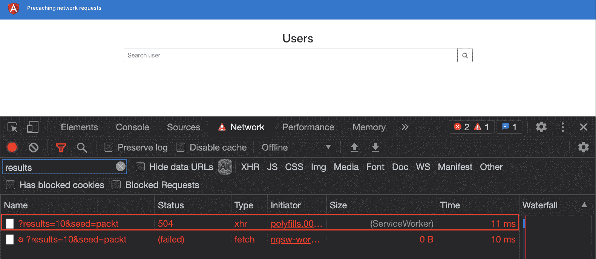

图 13.23–由于未缓存网络请求而中断脱机体验

现在我们看到网络请求失败，让我们在下一节中看到修复此问题的方法步骤。

## 怎么做

对于这个配方，我们有一个从 API 端点获取一些用户的用户列表和搜索应用程序。如*图 13.23*所示，如果我们进入**离线**模式，`fetch`呼叫失败，请求服务人员的呼叫也失败。这是因为服务工作者尚未配置为缓存数据请求。让我们从解决这个问题的方法开始：

1.  要缓存网络请求，请打开`ngsw-config.json`文件并按如下方式更新：

    ```ts
    {
      "$schema": "./node_modules/@angular/service-worker/  config/schema.json",
      "index": "/index.html",
      "assetGroups": [...],
     "dataGroups": [
     {
     "name": "api_randomuser.me",
     "urls": ["https://api.randomuser.me/?results*"],
     "cacheConfig": {
     "strategy": "freshness",
     "maxSize": 100,
     "maxAge": "2d"
     }
     }
     ]
    };
    ```

2.  现在让我们测试一下应用程序。在生产模式下构建应用程序，并使用`8300`端口上的`http-server`包，通过以下命令为其提供服务：

    ```ts
    ng build --configuration production
    http-server dist/precaching-requests -p 8300
    ```

3.  现在导航到 http://localhost:8300\. 确保此时未使用**网络节流**。也就是说，您没有处于**离线**模式。
4.  使用 Chrome DevTools 清除应用程序数据，如图 13.21 所示。完成后，刷新应用程序页面。
5.  在 Chrome 开发工具中，进入**网络**页签，切换到**离线**模式，如*图 13.2*所示。现在使用查询`results`过滤网络请求。即使处于脱机状态，也应该可以看到结果。网络呼叫由服务工作者提供，如*图 13.24*所示：

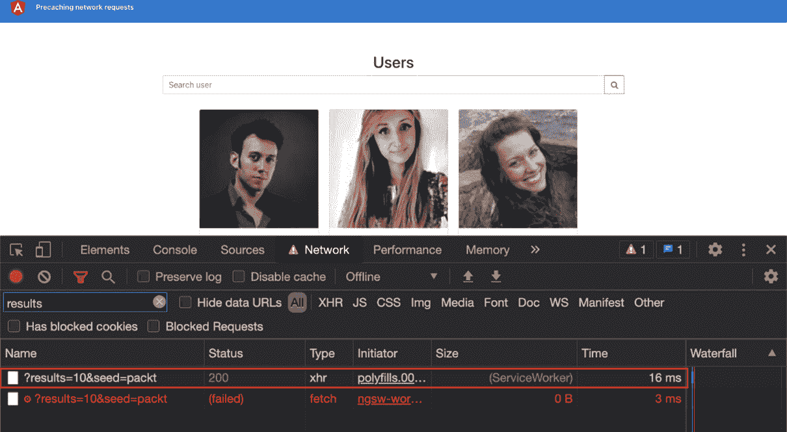

图 13.24–使用服务工作者脱机工作的网络呼叫

轰！即使现在点击一张卡片，你也应该仍然可以看到该应用程序工作正常，因为所有页面都使用相同的 API 调用，因此由服务人员提供服务。通过这些，您刚刚了解了如何在 Angular 应用程序中配置服务工作者来缓存网络/数据请求。您可以安装 PWA 并使用它，即使您处于脱机状态。令人惊叹的正当

现在我们已经完成了配方，让我们在下一节中看看它是如何工作的。

## 它是如何工作的

这个食谱的核心是`ngsw-config.json`文件。`@angular/service-worker`包在生成服务工作者文件时使用此文件。当我们通过运行`ng add @angular/pwa`使用`@angular/pwa`示意图时，该文件已经包含一个现成的 JSON 对象。此 JSON 包含一个名为`assetGroups`的属性，该属性基本上根据提供的配置配置资产的缓存。对于这个配方，我们希望缓存网络请求和资产。因此，我们在 JSON 对象中添加了新属性`dataGroups`。让我们来看一下配置：

```ts
"dataGroups": [
    {
      "name": "api_randomuser.me",
      "urls": ["https://api.randomuser.me/?results*"],
      "cacheConfig": {
        "strategy": "freshness",
        "maxSize": 100,
        "maxAge": "2d"
      }
    }
  ]
```

如您所见，`dataGroups`是一个数组。我们可以将不同的配置对象作为元素提供给它。每个配置都有一个`name`、一个`urls`数组和一个定义缓存策略的`cacheConfig`。对于我们的配置，我们使用一个通配符和 API URL，也就是说，我们使用`urls:``["`https://api.randomuser.me/?results*`"]`。对于`cacheConfig`，我们使用`"freshness"`策略，这意味着应用程序将始终首先从其来源获取数据。如果网络不可用，则它将使用来自服务工作者缓存的响应。另一种策略是`"performance"`，它首先查找服务工作者以获得缓存响应。如果缓存中没有特定 URL（或多个 URL）的内容，那么它将从实际来源获取数据。`maxSize`属性定义可以为同一模式（或一组 URL）缓存多少请求。`maxAge`属性定义缓存数据在服务工作者缓存中的生存时间。

既然您已经了解了配方的工作原理，请参阅下一节中的链接，以便进一步阅读。

## 另见

*   Angular服务工人介绍(https://angular.io/guide/service-worker-intro)
*   Angular服务工作者配置(https://angular.io/guide/service-worker-config)
*   创建脱机回退页面（web.dev）(https://web.dev/offline-fallback-page/)

# 为您的 PWA 创建应用程序外壳

在为 web 应用程序构建快速用户体验时，的主要挑战之一是最小化关键渲染路径。这包括为目标页面加载最关键的资源、解析和执行 JavaScript 等等。使用应用程序外壳，我们能够在构建时而不是运行时呈现页面或应用程序的一部分。这意味着用户最初会看到预渲染的内容，直到 JavaScript 和 Angular 启动。这意味着浏览器不必工作并等待第一次有意义的绘制。在这个应用程序中创建一个有Angular的配方。

## 准备好了吗

我们将要处理的项目位于克隆存储库中的`chapter13/start_here/pwa-app-shell`：

1.  在 Visual Studio 代码中打开项目。
2.  打开终端，运行`npm install`安装项目的依赖项。
3.  Once done, run `ng serve -o`.

    这将打开一个选项卡并在`http://localhost:4200`处运行应用程序，如*图 13.25*所示：

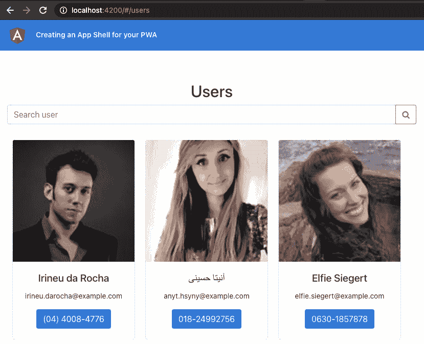

图 13.25–运行在上的 pwa 应用程序外壳 http://localhost:4200

现在我们将禁用JavaScript 以模拟花大量时间解析 JavaScript。或者，为了模拟还没有应用程序外壳。打开 Chrome DevTools 并打开命令面板。快捷方式是 macOS X 上的*Cmd*+*Shift*+*P*和 Windows 上的*Ctrl*+*Shift*+*P*。键入`Disable JavaScript`，选择选项，点击*输入*。您应该看到以下消息：


图 13.26–应用程序中不存在应用程序外壳

现在，我们已经检查了应用程序外壳的缺失，让我们在下一节中查看配方的步骤。

## 怎么做

我们有一个Angular应用程序，可以从 API 获取一些用户。我们将为这个应用程序创建一个应用程序外壳，这样它可以作为 PWA 更快地提供第一个有意义的绘制。让我们开始：

1.  首先，通过从项目根目录运行以下命令为应用程序创建应用程序外壳：

    ```ts
    ng generate app-shell
    ```

2.  更新`app.module.ts`以导出组件，以便我们可以使用它们在应用程序外壳中呈现**用户**页面。代码应如下所示：

    ```ts
    ...
    @NgModule({
      declarations: [...],
      imports: [... ],
      providers: [],
     exports: [
     UsersComponent,
     UserCardComponent,
     UserDetailComponent,
     AppFooterComponent,
     LoaderComponent,
     ],
      bootstrap: [AppComponent],
    })
    export class AppModule {}
    ```

3.  现在打开`app-shell.component.html`文件并使用`<app-users>`元素，以便我们在应用程序外壳中呈现整个`UsersComponent`。代码应如下所示：

    ```ts
    <app-users></app-users>
    ```

4.  现在我们已经为应用程序外壳编写了代码。让我们创建它。在开发模式下运行以下命令生成应用程序外壳：

    ```ts
    ng run pwa-app-shell:app-shell
    ```

5.  在*步骤 4*中生成 App Shell 后，使用`http-server`包运行以下命令为其服务：

    ```ts
    http-server dist/pwa-app-shell/browser -p 4200
    ```

6.  Make sure that the JavaScript is still turned off for the app. If not, open Chrome DevTools and press *Cmd* + *Shift* + *P* for macOS X to open the Command Panel (*Ctrl* + *Shift* + *P* on Windows). Then type `Disable Javascript` and hit *Enter* selecting the option as shown in *Figure 13.27*:

    

    图 13.27–使用 Chrome 开发工具禁用 JavaScript

7.  Refresh the app while JavaScript is disabled. You should now see the app still showing the pre-rendered users page, despite JavaScript being disabled as shown in *Figure 13.28*. Woohoo!

    

    图 13.28–显示预呈现用户页面的应用程序外壳

8.  To verify that we are pre-rendering the users page at build time, inspect the generated code at `<project-root>/dist/pwa-app-shell/browser.index.html`. You should see the entire rendered page inside the `<body>` tag as shown in *Figure 13.29*:

    

    图 13.29–包含预呈现用户页面的 index.html 文件

9.  使用 App Shell 创建生产构建，并通过运行以下命令在端口`1020`上提供：

    ```ts
    ng run pwa-app-shell:app-shell:production
    http-server dist/pwa-app-shell/browser -p 1020
    ```

10.  在浏览器中导航至`http://localhost:1020`并将应用程序安装为 PWA，如*图 13.8*所示。完成后，运行 PWA，其应如下所示：


图 13.30–安装后作为本机应用程序运行的 pwa 应用程序外壳

伟大的您现在知道如何为您的角 PWA 创建应用程序外壳。现在您已经完成了配方，请参阅下一节，了解其工作原理。

## 它是如何工作的

配方从禁用应用程序的 JavaScript 开始。这意味着当应用程序运行时，我们只显示静态 HTML 和 CSS，因为没有 JavaScript 执行。我们看到一条关于 JavaScript 不受支持的消息，如*图 13.26*所示。

然后我们运行`ng generate app-shell`命令。此命令可为我们执行以下操作：

*   创建名为`AppShellComponent`的新组件并生成其相关文件。
*   在项目中安装`@angular/platform-server`包。
*   更新`app.module.ts`文件以使用`BrowserModule.withServerTransition()`方法，以便我们可以为服务器端渲染提供`appId`属性。
*   添加一些新文件，即`main.server.ts`和`app.server.module.ts`，以启用服务器端渲染（确切地说，是我们的应用程序外壳的构建时渲染）。
*   最重要的是，它更新了`angular.json`文件，添加了一组用于服务器端渲染以及生成`app-shell`的示意图。

在配方中，我们从`AppModule`导出组件，以便在应用程序外壳中使用它们。这是因为应用程序外壳不是`AppModule`的一部分。相反，它是在`app.server.module.ts`文件中新创建的`AppServerModule`的一部分。如您所见，在文件中，我们已经导入了`AppModule`。尽管如此，我们不能使用这些组件，除非我们从`AppModule`出口它们。导出组件后，我们更新`app-shell.component.html`（应用程序外壳模板）以使用`<app-users>`选择器，该选择器反映了`UsersComponent`类。这就是整个用户页面。

我们通过运行`ng run pwa-app-shell:app-shell`命令来验证应用程序外壳。此命令在开发模式下使用 appshell 生成Angular构建（非缩微代码）。注意，在通常的构建中，我们会在`dist`文件夹中生成`pwa-app-shell`文件夹。在里面，我们会有`index.html`。但是，在本例中，我们在`pwa-app-shell`文件夹中创建了两个文件夹，即`browser`文件夹和`server`文件夹。我们的`index.html`存放在`browser`文件夹中。如*图 13.29*所示，我们在`index.html`文件的`<body>`标签中有整个用户页面的代码。此代码在生成时预呈现。这意味着 Angular 将打开应用程序，进行网络调用，然后在构建时将 UI 预呈现为应用程序外壳。因此，一旦应用程序打开，内容就会预先呈现。

为了使用 appshell 生成产品构建，我们运行`ng run pwa-app-shell:app-shell:production`命令。这将为应用程序外壳生成具有精简代码的生产Angular构建。最后，我们安装了 PWA 来测试它。

既然您已经知道了配方的工作原理，请参阅下一节的链接以进一步阅读。

## 另见

*   AngularApp 外壳导轨(https://angular.io/guide/app-shell)
*   应用程序外壳模型（谷歌网络基础）(https://developers.google.com/web/fundamentals/architecture/app-shell)