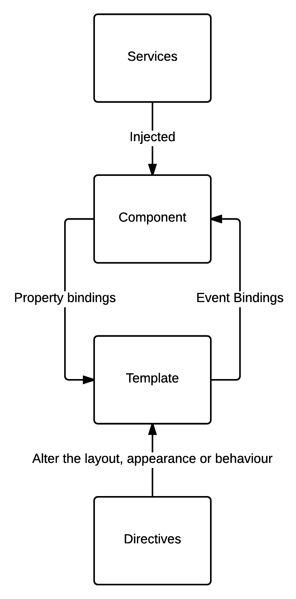

# 角自举

在[第 1 章](1.html)、*Typescript 最佳实践*之后，我们可以深入了解 Angular 本身。AngularJS 的重点之一是与 AngularJS 相比，大幅提高 Angular 应用程序的性能和加载时间。性能改进非常出色。根据 Angular 团队和各种基准测试，Angular 2 比 Angular 1 快 5 到 8 倍。

现在，为了实现这种改进，谷歌的工程师们并没有建立在 AngularJS 之上；取而代之的是，他们从头开始创造了棱角。因此，使用 Angular 1 已经有一段时间了，在开发 Angular 应用程序时，这不会给您带来比 Angular 世界的新手更大的优势。

在本章中，我们将执行以下操作：

*   我将首先介绍 Angular 背后的主要建筑概念。
*   然后，我们将使用新引入的 Angular CLI 工具引导 Angular 应用程序，它消除了大部分入门的痛苦。网络上有数百个有棱角的样板，至少可以说，选择一个样板很耗时。通过测试、库、手机、构建和部署脚本等，您可以在 GitHub 上享受任何风格。

虽然社区的多样性和热情是一件好事，但这意味着没有两个项目看起来是一样的。事实上，两个项目都有可能是用不同的样板创建的，或者没有任何样板。为了解决这个问题，Angular 团队现在提出 Angular CLI。Angular CLI 是一个命令行节点包，允许开发人员基于官方样板创建新的应用程序。此工具还提供一些有用的功能，例如创建角度应用程序的不同构建块、构建、测试和缩小应用程序。它甚至支持通过一个简短的命令将应用程序部署到 GitHub 页面。

它仍然是一个新的工具，它有许多缺点和未完成的行为。

# 架构概述

在本节中，我将介绍 Angular 应用程序的主要构建块：服务、组件、模板和指令。我们还将了解依赖注入、装饰器和区域解决了哪些问题。

现在，如果您从（虚拟）书架上取下这本书，您可能对 Angular 有一些经验，并且希望通过良好的实践和设计模式改进您的应用程序。因此，您应该对角度构建块的一般体系结构有一些了解。

尽管如此，一个快速而实用的提醒应该不会造成太大的伤害，而且我们可以确信我们有一个坚实的架构基础来构建我们的模式。

以下是主要 Angular 2 构建块如何相互作用的概述：



High-level architecture of an Angular 2 application

在下面的内容中，我将通过创建一个处理 Floyd 数组的应用程序来展示每个 Angular 2 构建块的示例。以下是基于字母的 Floyd 数组示例：

```ts
   a  
   b c  
   d e f  
   g h i j  

```

我同意您不太可能在不久的将来构建一个处理 Floyd 阵列的应用程序。然而，Floyd 数组在学习新语言或框架时是一个很好的编程练习，因为它涉及用户输入、显示结果、循环和字符串操作。

# 组成部分

组件是角度应用程序的视图，它们控制屏幕上显示的内容、时间和方式。它们采用简单类的形式，定义视图所需的逻辑。下面是一个简单组件的示例：

```ts
export class FloydComponent implements OnInit { 

  private floydString:string = ""; 
  private static startOfAlphabet = 97; 

  constructor() { } 

  ngOnInit() { 
  } 

  onClick(rows:number){ 

    let currentLetter = FloydComponent.startOfAlphabet; 
    for (let i = 0; i < rows; i++) { 
      for (let j = 0; j < i; j++) { 
        this.floydString += String.fromCharCode(currentLetter) + " "; 
        currentLetter++; 
      } 
      this.floydString += "\n\r"; 
    } 
  } 
}
```

Note that the component class has a suffix: `Component`. I will discuss the reasons in the next chapter.

这个名为`FloydComponent`的组件有两个私有成员：`floydString`和`startOfAlphabet`。`floydString`将包含表示 n<sup>th</sup>Floyd 三角形的字符串，而`startOfAlphabet`则不断标记字母在 ASCII 表中的位置。

`FloydComponent`还定义了一个构造函数，当用户请求组件管理的屏幕补丁时，将调用该构造函数。目前，构造函数是空的。

最后，`onClick`方法接受一个名为`rows`的数字参数，将生成一个`rows`的弗洛伊德三角形。总之，我们有一个类来管理显示 Floyd 三角形的视图的行为。对嗯，视图部分有点缺失！客户端呈现的 HTML 在哪里？

在 Angular 中，组件将控制的 HTML 片段称为模板，我们可以使用元数据将模板链接到组件上：

```ts
import { Component } from '@angular/core'; 
@Component({ 
  selector: 'floyd', 
  template:  
   `<p> 
     <input #checkbox type="checkbox" value="even">Even?<br> 
     <input #rows type="text" name="rows"> 
     <button (click)="onClick(rows.value, checkbox.checked)">CLICK</button> 
   </p> 
   <pre> 

         {{floydString}} 
   </pre> 
   ` 
}) 
export class FloydComponent { 
```

那么，有什么好大惊小怪的？如果我们回顾一下`FloydComponent`的原始定义，没有任何东西规定`FloydComponent`是一个组件。我们没有类似于`FloydComponent`的扩展/实现组件，所以它只是一个普通的 typescript 类，没有其他东西。更令人惊讶的是，根本没有角度参考；这个`FloydComponent`完全可以是 Angular 框架之外的一个 typescript 类。

元数据正在使用 decorator 模式装饰`FloydComponent`类，因此 Angular 知道如何解释和处理`FloydComponent`类。

In any object-oriented languages, it is easy to extend the responsibilities of an object statically by using inheritance, however, doing so dynamically, at runtime, is a completely different matter. The purpose of the decorator pattern is to add additional responsibilities dynamically to an object.

我们将在[第 3 章](3.html)、*经典图案*中实现我们自己的装饰器。

注释本身是`@Component`，它使我们的类成为一个带有一些参数的角度组件。

Note the `import { Component } from '@angular/core';` which imports the `Component` module from the `'@angular/core'` library.

第一个参数是一个`selector`，它描述了我们的`FloydComponent`应该绑定到视图的哪一部分。在下面的 HTML 代码片段中，`FloydComponent`将绑定到`<floyd></floyd>`选择器标记。第二个参数是模板字符串。模板字符串定义了在运行时在`<floyd>`标记内添加到 DOM 的内容：

```ts
   <p> 
     <input #rows type="text" name="rows"> 
     <button (click)="onClick(rows.value)">CLICK</button> 
   </p> 
   <pre> 
         {{floydString}} 
   </pre>
```

The backtick ` allows us to define multiline strings in JavaScript.

首先，我们有`<input>`标记，它看起来几乎像纯 HTML。唯一的特殊性是标记中的`#rows`属性。此属性用于将标记作为名为`rows`的变量引用。因此，我们可以在以下标记中访问其值：`<button (click)="onClick(rows.value)">CLICK</button>`。这里，我们在模板和组件之间有一个事件绑定。单击按钮时，将调用组件的`onClick`方法，并将输入值反馈给该方法。

进一步往下看代码，我们有`{{floydString}}`，它是从组件到模板的属性绑定。在这种特殊情况下，我们将`floydString`组件属性绑定到模板。换句话说，我们在 DOM 中显示`floydString`组件属性的内容。

I have to use the pre markup, so the `\n\r` are preserved in the output.

总之，组件将其属性绑定到模板，模板将其事件绑定到组件。以下是运行此应用程序时的预期屏幕截图：


Floyd array with Angular 2 Is it not working on your side? Want to fork the code on GitHub? You can see the whole application, as of now, at [http://bit.ly/angular2-patterns-chap2](http://bit.ly/angular2-patterns-chap2).

# 服务

现在，我们已经回顾了 Angular 2 的四个构建块中的两个。其余两个是服务和指令。下一个街区我们将回顾服务。服务是具有独特用途的类，其应尽可能具有内聚性，因为它们为应用程序的其他部分提供了狭窄且定义良好的服务。从设计的角度来看，对于我们的 Floyd triangle 应用程序来说，最好是在服务中包含`FloydComponent.onClick`方法的内容。实际上，`floydString`字符串的计算在管理视图的组件中没有位置。

组件应该只负责将属性绑定到模板的用户体验，而不负责其他事情。其他每一个都应该被委托服务。我们能做的就是创建一个三角形服务，负责*鼓卷*创建奇怪的三角形，比如弗洛伊德三角形。我们还可以让此服务负责生成 Floyd 三角形，其中输出看起来像一棵树：

```ts
          a  
         b c  
        d e f  
       g h i j  

```

而不是：

```ts
  a  
  b c  
  d e f  
  g h i j  
```

这样的服务如下所示：

```ts
import { Injectable } from '@angular/core'; 

@Injectable() 
export class TriangleService { 

    private static startOfAlphabet = 97; 

    constructor() {} 

    /** 
     * Computes a Floyd Triangle of letter.
     * Here's an example for rows = 5 
     *  
     * a  
     * b c  
     * d e f  
     * g h i j  
     * 
     * Adapted from http://www.programmingsimplified.com/c-program-print-floyd-triangle 
     *  
     * @param  {number} rows 
     * @return {string}
     */ 
    public floydTriangle(rows:number):string{ 

      let currentLetter = TriangleService.startOfAlphabet; 
      let resultString = ""; 

      for (let i = 0; i < rows; i++) { 
        for (let j = 0; j < i; j++) { 
          resultString += String.fromCharCode(currentLetter) + " "; 
          currentLetter++; 
        } 
        resultString += "\n\r"; 
      } 

      return resultString; 
    } 

    /** 
     * Computes a Even Floyd Triangle of letter.  
     * Here's an example for rows = 7 
     *       a  
     *      b c  
     *     d e f  
     *    g h i j  
     *   k l m n o  
     *  p q r s t u  
     * v w x y z { | 
     *  
     * @param  {number} rows 
     * @return {string}      
     */ 
    public evenFloydTriangle(rows:number):string{ 

      let currentLetter = TriangleService.startOfAlphabet; 
      let resultString = ""; 

      for (let i = 0; i < rows; i++) { 

        for (let j = 0; j <= (rows-i-2); j++) { 
          resultString += " "; 
        } 

        for (let j = 0; j <= i; j++) { 
          resultString += String.fromCharCode(currentLetter) + " "; 
          currentLetter++; 
        } 

        resultString+="\n\r"; 
      } 

      return resultString; 
    } 
  } 

```

`TriangleService`是一个简单的类，提供了两种方法：`floydTriangle`和`evenFloydTriangle`。`evenFloydTriangle`有一个额外的 for 循环，用于在三角形的不同行添加前导空格。业务应用程序现在位于我们可以在`FloydComponent`上使用的专用服务上。在`FloydComponent`中使用我们服务的正确方式是通过依赖注入。依赖项注入是一个过程，通过该过程，请求类可以动态地获取请求类的完全格式实例。为了将这个相当技术性的定义应用到我们的上下文中，在实例化之后，`FloydComponent`将被用作`TriangleService`的实例。

要将依赖项注入与 Angular 一起使用，我们需要为`TriangleService`定义一个提供者。我们可以在应用程序级别执行此操作：

```ts
import { TriangleService } from './app/triangle.service' 

bootstrap(FloydComponent, [TriangleService]); 
```

或者，我们可以通过在组件注释中定义提供者在组件级别执行此操作：

```ts
import { Component, OnInit, ViewEncapsulation } from '@angular/core'; 
import { TriangleService } from '../triangle.service' 

@Component({ 
  selector: 'floyd', 
  template:   `<p> 
    <input #checkbox type="checkbox" value="even">Even?<br> 
  <input #rows type="text" name="rows"> 
  <button (click)="onClick(rows.value, checkbox.checked)">CLICK</button> 
  </p> 
  <pre> 

  {{floydString}} 
  </pre> 
  `, 
  styleUrls: ['./floyd.component.css'], 
  providers: [TriangleService], 
  encapsulation: ViewEncapsulation.None 
}) 
export class FloydComponent implements OnInit { 
```

如果提供程序是在应用程序级别创建的，那么`TriangleService`的相同实例将提供给任何请求它的人。然而，在组件级别，每次实例化所述组件时，将创建一个新的`TriangleService`实例并提供给该组件。这两种情况都有道理。这取决于您的组件和服务在做什么。例如，我们将在[第 7 章](7.html)、*操作模式*中实现的日志服务没有自己的状态，并且被应用程序的每个模块使用。因此，我们可以使用基于应用程序的提供者。反例是[第 5 章](5.html)*稳定性模式*中的*断路器*模式，该模式具有内部状态，因此具有组件级。

最后一步是修改我们的`FloydComponent`构造函数，使其看起来像这样：

```ts
  constructor(private triangleService:TriangleService) { 
  }
```

在这里，我们为我们的`FloydComponent`定义了一个名为`triangleService`的私有成员，它将用作注入依赖项的占位符。

此外，我们在模板中添加了一个复选框，用于确定我们想要的是偶数还是普通 Floyd 数组：

```ts
<input #rows type="text" name="rows"> 
  <button (click)="onClick(rows.value, checkbox.checked)">CLICK</button> 
```

我们还可以修改`onClick`方法以使用我们的`TriangleService`。最后一个组件如下所示：

```ts

import { Component, OnInit, ViewEncapsulation } from '@angular/core'; 
import { TriangleService } from '../triangle.service' 

@Component({ 
  selector: 'floyd', 
  template:   `<p> 
    <input #checkbox type="checkbox" value="even">Even?<br> 
  <input #rows type="text" name="rows"> 
  <button (click)="onClick(rows.value, checkbox.checked)">CLICK</button> 
  </p> 
  <pre> 
    {{floydString}} 
  </pre> 
  `, 
  styleUrls: ['./floyd.component.css'], 
  providers: [TriangleService], 
  encapsulation: ViewEncapsulation.None 
}) 
export class FloydComponent implements OnInit { 

  private floydString:string = ""; 
  private static startOfAlphabet = 97; 

  constructor(private triangleService:TriangleService) { } 

  ngOnInit() { 
  } 

  onClick(rows:number, checked:boolean){ 

    if(checked){ 
      this.floydString = this.triangleService.evenFloydTriangle(rows); 
    }else{ 
      this.floydString = this.triangleService.floydTriangle(rows); 
    } 
  } 
}     

```

The current state of the application can be seen here: [http://bit.ly/angular2-patterns-chap2-part2](http://bit.ly/angular2-patterns-chap2-part2).

# 指令

为了总结我们的快速体系结构概述，我们将创建一个指令来增强我们的预标记。指令与模板及其父组件就属性和事件绑定进行交互。我们将创建一个指令，将样式添加到预标记中。该样式包含一个 1 像素的边框，并分别将偶数或奇数 Floyd 阵列的背景色更改为红色或黄色。

首先，我们需要一种方法来询问用户想要哪种数组。让我们在`FloydComponent`的模板中添加另一个输入，并修改`onClick`方法，使其接受第二个参数：

```ts
import { Component } from '@angular/core'; 
import { TriangleService } from '../triangle.service'; 
@Component({ 
  selector: 'floyd', 
  template:  
   `<p> 
     <input #checkbox type="checkbox" value="even">Even?<br> 
     <input #rows type="text" name="rows"> 
     <button (click)="onClick(rows.value, checkbox.checked)">CLICK</button> 
   </p> 
   <pre> 

         {{floydString}} 
   </pre> 
   `, 
   providers:   [TriangleService] 
}) 
export class FloydComponent { 

  private floydString:string = ""; 
  private color:"yellow" | "red"; 

  constructor(private triangleService:TriangleService) { 

  } 

  onClick(rows:number, even:boolean){ 

   if(even){ 
         this.floydString = this.triangleService.evenFloydTriangle(rows); 
   }else{ 
         this.floydString = this.triangleService.floydTriangle(rows); 
   } 

  } 

} 
```

然后，我们可以创建指令。它将如下所示：

```ts
import { Directive, Input, ElementRef, HostListener } from '@angular/core'; 

@Directive({ 
  selector: '[AngularPre]' 
}) 
export class AngularPre { 

  @Input() 
  highlightColor:string; 

  constructor(private el: ElementRef) { 
      el.nativeElement.style.border = "1px solid black"; 
       el.nativeElement.style.backgroundColor = this.highlightColor; 
   } 

    @HostListener('mouseenter') onMouseEnter() { 
         this.highlight(this.highlightColor); 
   } 

   @HostListener('mouseleave') onMouseLeave() { 
       this.highlight(null); 
   } 

   private highlight(color: string) { 
         this.el.nativeElement.style.backgroundColor = color; 
   } 

}
```

这里发生了很多事情。首先，我们有一个带有选择器的指令注释。选择器将用于表示给定的 HTML 标记依赖于该指令。在我们的例子中，我选择将指令命名为`AngularPre`，并将选择器命名为相同的名称。它们可以是不同的；这取决于你。但是，选择器和类的名称相同是有意义的，这样您就可以知道在指令横行时打开哪个文件。

然后，我们有非常有趣的`@Input()`注释`highlightColor:string;`成员。这里，我们指定`highlightColor`字符串的值实际上绑定到父组件的变量。换句话说，父级必须指定要高亮显示预标记的颜色。在构造函数中，指令通过注入接收到一个`ElementRef`对象。此`ElementRef`表示指令作用的 DOM。最后，我们在`mouseenter`和`mouseleave`上定义了两个`HostListener`，分别启动和停止预标记的高亮显示。

要使用此指令，我们必须在`FloydComponent`模板的预标记中插入其选择器，如下所示：

```ts
<pre AngularPre [highlightColor]="color"> 
   {{floydString}} 
</pre> 
```

在这里，我们指定希望我们的预标记受带有`AngularPre`选择器的指令的影响，并将调用指令的`highlightColor`变量与`FloydComponent`的颜色变量绑定。这是带有颜色变量的`FloydComponent`和对`onClick`方法的轻微修改，因此它改变了颜色变量的值：

```ts
export class FloydComponent { 

  private floydString:string = ""; 
  private color:"yellow" | "red"; 

  constructor(private triangleService:TriangleService) { 

  } 

  onClick(rows:number, even:boolean){ 

   if(even){ 
         this.floydString = this.triangleService.evenFloydTriangle(rows); 
         this.color = "red"; 
   }else{ 
         this.floydString = this.triangleService.floydTriangle(rows); 
         this.color = "yellow"; 
   } 

  } 

} 
onClick modifies the color variable 
```

这是应用程序在奇数数组中的外观：


Odd Floyd array result

这是偶数数组的外观：


Even Floyd array result The application is downloadable here: [http://bit.ly/angular2-patterns-chap2-part3](http://bit.ly/angular2-patterns-chap2-part3).

# 管

我想在这里解释的最后两个组成部分是管道和管线。烟斗很棒。它们允许我们创建一个专门的类，该类将接受任何输入并将其转换为所需的输出。在 Angular 中，管道遵循 Unix 管道编程范式，在这种范式中，信息可以从一个进程传递到另一个进程。我们可以使用基于 Floyd triangle 的应用程序创建一个管道，每次遇到换行符序列（例如，`\n\r`）时，该管道会将任何给定的 Floyd 字符串转换为包含段落`¶`（`244, &para;`）的 ASCII 字符：

```ts
import { Pipe, PipeTransform } from '@angular/core'; 

@Pipe({ 
  name: 'paragraph' 
}) 
export class ParagraphPipe implements PipeTransform { 

  transform(value: string): string { 

   return value.replace( 
         new RegExp("\n\r", 'g'),  
         "¶ \n\r" 
   ); 
  } 

} 
```

管道使用`@Pipe`注释进行装饰，非常类似于组件和指令。现在，与组件和指令相比，管道的区别在于，除了装饰注释外，我们还必须实现 Angular 框架提供的接口。该接口名为`PipeTransform`，定义了一个方法，实现该接口的每个类都必须具有该方法：

```ts
transform(value: any, args?:any): any 
```

此方法的实际签名由任何类型组成，因为管道可以用于所有内容，而不仅仅是字符串。在我们的例子中，我们希望操作字符串输入并获得字符串输出。我们可以在不破坏接口契约的情况下细化转换方法的签名，如下所示：

```ts
transform(value: string): string 
```

在这里，我们只需要一个字符串参数并生成一个字符串输出。此方法的主体包含一个全局正则表达式，该正则表达式匹配所有的`\n\r`序列，并添加`¶`。

要使用`FloydComponent`中的`ParagraphPipe`，我们需要修改模板如下：

```ts
   `<p> 

     <input #checkbox type="checkbox" value="even">Even?<br> 

     <input #rows type="text" name="rows"> 

     <button (click)="onClick(rows.value, checkbox.checked)">CLICK</button> 

   </p> 

   <pre AngularPre [highlightColor]="color"> 

         {{floydString | paragraph}} 

   </pre> 
```

使用`|`操作员将`floydString`通过管道连接至`ParagraphPipe`。下面是它的外观：


Piping the floydString to have a paragraph marker

段落管道硬编码段落符号这一事实让我有点烦。如果我想在每次使用的基础上进行更改，该怎么办？Angular 正在处理管道的许多附加参数。我们可以将`transform`方法修改为：

```ts
 transform(value: string, paragrapheSymbol:string): string { 

   return value.replace( 

         new RegExp("\n\r", 'g'),  

         paragrapheSymbol + "\n\r" 

   ); 

  } 

```

此外，我们可以使用管道调用这样做：

```ts
{{floydString | paragraph: "¶"}} 

```

这里，`transform`方法的第一个参数将是`floydString`，而第二个参数将是段落符号。

如果我们仔细想想，我们目前正在为 Typescript 实现`replaceAll`函数，除了目标（`\n\r`是硬编码的）。让我们创建一个名为`replaceAll`的管道，该管道具有要替换的目标及其替换作为参数。唯一的问题是`PipeTransform`接口定义了一个带有两个参数的转换方法，第二个参数是可选的。这里，我们需要三个参数：要转换的字符串、要在字符串中替换的目标以及目标的替换。如果您尝试使用带有三个参数的转换方法，那么您将打破`PipeTransform`契约，并且您的类型脚本将不再编译。为了避免这个小挫折，我们可以定义一个名为`replace`的内联类型，它将包含两个成员`from`和`to`，这两个成员都是字符串：

```ts
transform(value: string, replace: {from:string, to:string}): string  
To call it inside the FloydComponent we can do the following: 

{{floydString | replaceAll: {from:'\\n\\r', to:'¶ \\n\\r'} }}
```

Here, we are using `\\n\\r` for the strings pattern as we are not building a `RegExp` just yet. Consequently, the `\` of `\n` and `\r` need to be escaped.

以下是`replaceAll`管道的代码：

```ts
import { Pipe, PipeTransform } from '@angular/core'; 

@Pipe({ 
  name: 'replaceAll' 
}) 
export class ReplaceAllPipe implements PipeTransform { 

  transform(value: string, replace: {from:string, to:string}): string { 

   return value.replace( 
         new RegExp(replace.from, 'g'),  
         replace.to 
   ); 

  } 

} 
```

还不错吧？我们已经以模块化和高效的方式填补了 JavaScript 的一个缺点，`replaceAll`功能。此`replaceAll`管道在您的应用程序中随处可用：

```ts
@Component({ 
  selector: 'floyd', 
  template:   `<p> 
    <input #checkbox type="checkbox" value="even">Even?<br> 
  <input #rows type="text" name="rows"> 
  <button (click)="onClick(rows.value, checkbox.checked)">CLICK</button> 
  </p> 
  <pre AngularPre [highlightColor]="color"> 
    {{floydString | replaceAll: {from:'\\n\\r', to:'¶ \\n\\r'} }}  
  </pre> 
  `, 
  styleUrls: ['./floyd.component.css'], 
  providers: [TriangleService], 
  encapsulation: ViewEncapsulation.None 
}) 
export class FloydComponent implements OnInit {
```

关于管道，最后要知道的是，您可以像在 Unix 控制台中一样将它们组合起来。例如，我们完全可以执行以下操作，首先是段落管道，然后在所有行的末尾添加`¶`。然后，`replaceAll`管道介入并用`¶`管道替换所有`¶`：

```ts
{{floydString | paragraph:'¶' | replaceAll: {from:'¶', to:'¶ piped'} }} 
```

The current state of the application is downloadable here: [http://bit.ly/angular2-patterns-chap2-part5](http://bit.ly/angular2-patterns-chap2-part5).   

# 路线

路线可以在角度视图之间导航。在这个配方中，我们将了解它们，并在一个小应用程序的框架内看到它们的实际应用。

# 角型 CLI

**Angular CLI**是一个非常简单但非常有用的节点包，采用命令行工具的形式。此工具的目的是消除开始使用 Angular 2 的大部分痛苦。任何基于框架的应用程序的问题是，要知道如何引导代码与框架的特性和库顺利通信。

该工具由 Angular 团队直接提供，为现成的应用程序提供工作蓝图。实际上，通过使用一个简单的命令，我们可以为 Angular 生成一个完整的样板文件，该样板文件可以传输、在本地运行、测试，甚至部署到 GitHub 页面。

# 安装

安装 Angular CLI 非常简单，因为它是一个`node`包。无论您的操作系统如何，以下命令都将起作用：

```ts
npm install -g angular-cli 
```

If you are using a Unix-based system, a `sudo` might be required for global installations.

# 创建新的应用程序

安装 Angular CLI 后，我们可以使用`ng new`命令生成一个新的 Angular 应用程序：

```ts
ng new MyApp 
```

此命令将为您的应用程序创建一个空样板，并获取每个必需的节点模块。

Note that, depending on your internet connection, this command can take a while to complete. Indeed, the node packages to fetch are many, which further justifies such a tool.

在新创建文件夹的根级别，可以找到以下文件和文件夹：

*   `Angular-cli-build.js`：用于构建应用程序的配置文件。
*   `config`：测试环境的配置文件夹。
*   `Node_modules`：需要不同的节点模块。在我写这些行时，Angular CLI 的当前版本在 node modules 目录中已经有 60886 个文件和文件夹。
*   `Public`：包含应用程序的公共内容。
*   `tslint.json`：您的短绒配置。我们将在下一章中对其进行配置。
*   `typings.json`：输入依赖项。
*   `angular-cli.json`：您的应用程序的一些配置。
*   `e2e`：e2e 配置。
*   `package.json`：应用程序的依赖项。
*   `src`**您的源代码。**
***   `typings`：要求打字。**

 **毫无疑问，我们花费最多时间的文件夹是`src`文件夹，因为它包含 TypeScript 源代码。以下是创建后的内容：

```ts
src 

├── app 

│   ├── environment.ts 

│   ├── index.ts 

│   ├── my-app.component.css 

│   ├── my-app.component.html 

│   ├── my-app.component.spec.ts 

│   ├── my-app.component.ts 

│   └── shared 

│       └── index.ts 

├── favicon.ico 

├── index.html 

├── main.ts 

├── system-config.ts 

```

```ts
├── tsconfig.json 

└── typings.d.ts 
```

如您所见，有一个`app`文件夹已经包含一个名为`my-app`的组件，还有一个共享文件夹，可用于在不同应用程序之间共享资源。然后，我们有`index.html`包含以下内容：

```ts
<!doctype html> 
<html lang="en"> 
<head> 
  <meta charset="utf-8"> 
  <title>Chap2</title> 
  <base href="/"> 

  <meta name="viewport" content="width=device-width, initial-scale=1"> 
  <link rel="icon" type="img/x-icon" href="favicon.ico"> 
</head> 
<body> 
  <app-root></app-root> 
</body> 
</html> 

```

在此`index.html`中，插入`<app-root></app-root>`标记，并将所需文件加载到脚本中。

另一个要点是`main.ts`文件，其中包含应用程序的引导行：

```ts
import { enableProdMode } from '@angular/core'; 
import { platformBrowserDynamic } from '@angular/platform-browser-dynamic'; 

import { AppModule } from './app/app.module'; 
import { environment } from './environments/environment'; 

if (environment.production) { 
  enableProdMode(); 
} 

platformBrowserDynamic().bootstrapModule(AppModule) 
  .catch(err => console.log(err)); 

```

在这里，`MyAppAppComponent`组件被导入并用作我们应用程序的顶级组件或根组件。这是将首先实例化的组件。

# 生成

就目前而言，我们的应用并不令人兴奋；它将仅在`h1`标记中显示`my-app works!`。

如果我们想向这个样板中添加组件、指令、服务和管道，我们必须使用`generate`命令。下面是一个生成名为`Floyd`的新组件的示例：

```ts
ng generate component Floyd 
```

作为响应，Angular CLI 为我们的组件创建了一个名为`Floyd`的新文件夹和所需文件：

```ts
src/app 

├── environment.ts 

├── Floyd 

│   ├── floyd.component.css 

│   ├── floyd.component.html 

│   ├── floyd.component.spec.ts 

│   ├── floyd.component.ts 

│   └── index.ts 

├── index.ts 

├── my-app.component.css 

├── my-app.component.html 

├── my-app.component.spec.ts 

├── my-app.component.ts 

└── shared 

    └── index.ts 
```

我们可以使用指令、服务或管道而不是组件来执行相同的操作。

Every keyword in the Angular CLI can be abbreviated by using only the first letter of the word. So, generating another component named `Pascal` would read `ng g c Pascal`.

# 服务

我们的应用程序中有一系列组件、服务、指令和管道，我们已经准备好看到结果。谢天谢地，Angular CLI 可以使用命令`ng serve`构建应用程序并启动 web 服务器。

然后，您可以在`localhost:4200`看到您的申请。

您的文件由客户端监视。每次更改文件时，Angular CLI 都会重新编译该文件并刷新浏览器。

# 部署

准备好让你的申请生效了吗？`ng build`就是你要找的。此命令将创建一个`dist`目录，您可以将其推送到任何能够提供 HTML 页面的服务器上。它甚至可以出现在 GitHub 页面上，这不会花费你一分钱。

# 总结

在本章中，我们已经完成了角度构建块的概述，并了解了它们是如何相互作用的。我们还创建了一个操作 Floyd 数组的相对简单的应用程序。最后，我们学习了如何使用 Angular CLI 使用命令行创建新的应用程序、组件、服务、指令和管道。

在下一章中，我们将重点介绍良好实践。我们将以一种实用的方式发现谷歌工程师推荐的“应该做的和不应该做的”。**