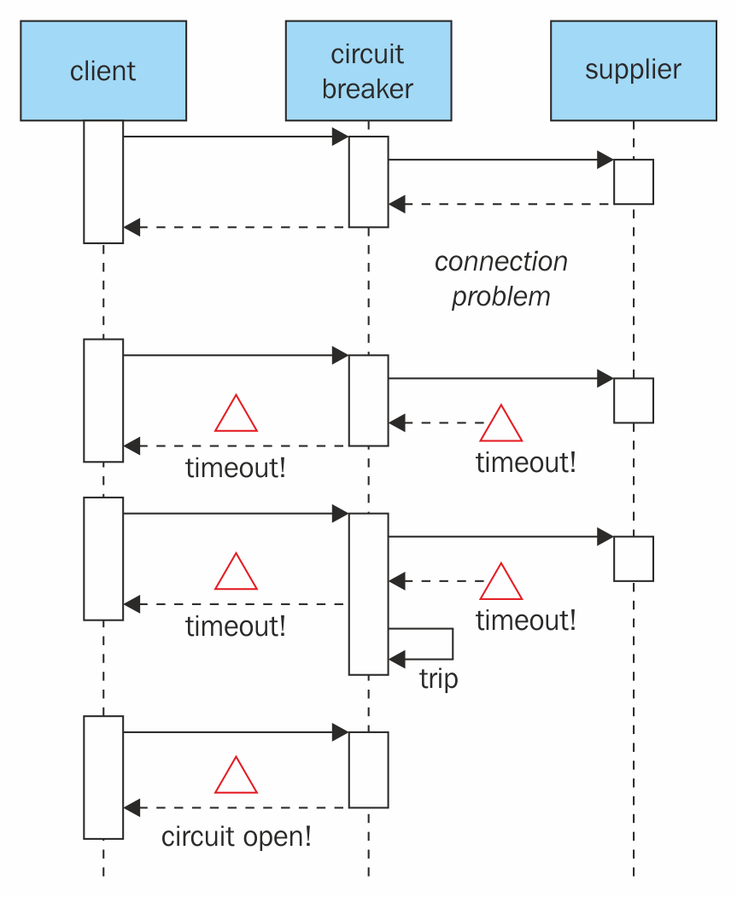

# 五、稳定性模式

稳定性是软件工程的基石之一。不管怎样，你必须从你的环境和你的用户那里得到最坏的结果，并为此做好准备。当后端正在燃烧时，Angular 应用程序应该能够在降级模式下运行，并在恢复联机时顺利恢复。

在本章中，我们将学习稳定性模式和反模式，例如：

*   超时
*   断路器
*   工厂
*   纪念品
*   原型与可重用池

# 超时

在前面的章节中，我们对 API 服务进行了实验，目的是使用由我们假设的后端创建的任何类型的内容的 API。如果我必须分享一句关于我在网上冒险中学到的东西的话，那就是*不要相信任何人……尤其是你自己*。我的意思是，您永远不能相信 API 能按预期工作，即使它是您自己的 API。你应该总是期望所有可能出错的事情都会出错。当你的后端尝试用一个不那么有害的东西来回应时，它就不会发生。虽然这种单向通信对您的角度应用程序无害，但对您的用户来说却是最令人沮丧的。在本教程中，我们将学习如何在外部调用中实现超时，以及如何对无响应的 API 做出反应。

幸运的是，有一种非常简单的方法可以防止用户对无响应的 API 感到沮丧：超时。超时是一种简单的防御机制，允许应用程序等待固定的时间，而不是一毫秒。让我们创建一个新项目来测试它：

```ts
    ng new timeout
    cd timeout
    ng g service API
```

这将创建一个新项目和一个名为`API`的服务。乍一看，没有多少东西值得一看：

```ts
import { Injectable } from '@angular/core'; 

@Injectable() 
export class ApiService { 

  constructor() { } 

} 
```

我们需要在`app.module.ts`中添加`HttpClient`组件，如下所示：

```ts
import { BrowserModule } from '@angular/platform-browser'; 
import { NgModule } from '@angular/core'; 
import { HttpClientModule } from '@angular/common/http'; 

import { AppComponent } from './app.component'; 
import { ApiService } from './api.service'; 

@NgModule({ 
  declarations: [ 
    AppComponent 
  ], 
  imports: [ 
    BrowserModule, 
    HttpClientModule 
  ], 
  providers: [ApiService], 
  bootstrap: [AppComponent] 
}) 
export class AppModule { } 
```

然后，我们希望将`HttpClient`组件注入我们的 API 服务客户端，以便访问其方法：

```ts
import { Injectable } from '@angular/core'; 
import { HttpClient } from '@angular/common/http'; 

@Injectable() 
export class ApiService { 

  constructor(private http:HttpClient) { } 

} 
```

我们将在我们的`APIService`中添加一个新方法，该方法只需在包含本书代码的 GitHub 存储库（[中添加一个`http.get`https://github.com/MathieuNls/Angular-Design-Patterns-and-Best-Practices](https://github.com/MathieuNls/Angular-Design-Patterns-and-Best-Practices) ：

```ts
import { Injectable } from '@angular/core'; 
import { HttpClient } from '@angular/common/http'; 

@Injectable() 
export class ApiService { 

  constructor(private http: HttpClient) { } 

  public getURL(url: string): void { 
    this.http.get(url) 
    .subscribe(data => { 
      console.log(data); 
    }); 
  }  

} 
```

然后注入`ApiService`并在`AppComponent`中调用新的`getURL`方法：

```ts
import { Component } from '@angular/core'; 
import { ApiService } from './api.service'; 

@Component({ 
  selector: 'app-root', 
  templateUrl: './app.component.html', 
  styleUrls: ['./app.component.css'] 
}) 
export class AppComponent { 
  title = 'app'; 

  constructor(private api: ApiService){ 
    api.getURL("https://github.com/MathieuNls/Angular-Design-Patterns-and-Best-Practices") 
  } 
}
```

现在，如果我们执行这个，我们将有一个优雅的 HTTP 响应，网页的 HTML 将在控制台中打印出来。然而，问题是我们在[github.com](http://www.github.com)宕机且没有响应的情况下没有相应的对策：

```ts
import { Injectable } from '@angular/core'; 
import { HttpClient } from '@angular/common/http'; 

@Injectable() 
export class ApiService { 

  constructor(private http: HttpClient) { } 

  public getURL(url: string): void { 

    let timeout; 

    let sub = this.http.get(url) 
      .subscribe((res) => { 
        console.log(res); 
        clearTimeout(timeout) 
      }); 

    timeout = setTimeout( 
      () => { sub.unsubscribe() }, 1000 
    ); 
  } 

} 
```

在这个版本的`getURL`函数中，我们必须首先声明一个包含 NodeJS 超时的超时变量。然后，我们将订阅响应，而不是执行常规的`HTTP.get`。最后，在订阅结果之后，我们使用`setTimeout`函数分配超时变量。我们使用此功能在 1000 毫秒后取消订阅响应。因此，我们只需等待一秒钟即可收到`http`回复。如果回复未在该时间内到达，我们将自动取消订阅并允许我们的申请继续。当然，我们的用户将不得不以某种方式被警告操作不成功。

# 断路器

我们在上一节中实现的超时模式能够有效地保护用户的耐心，并最终保护我们的应用程序。但是，如果 API 没有响应是因为服务器端出了问题，那么假设 80%的服务器停机，剩下的 20%正在尝试管理负载，那么客户端很可能会重复重试超时的操作。因此，这给我们即将消亡的后端基础设施带来了更大的压力。

电路是一种自动装置，用于停止电路中的电流流动，作为一种安全措施。断路器用于检测故障，并封装防止故障不断再次发生的逻辑（在维护、临时外部系统故障或意外系统故障期间）。

具体地说，在 Angular 应用程序的框架内，断路器将防止客户端在出现太多故障时执行 API 请求。在给定的时间之后，电路将允许一些查询通过并使用 API。如果这些查询返回时没有任何问题，则电路将自行关闭，并允许所有请求通过：



在上图中，我们可以看到断路器是如何工作的。所有请求都通过断路器，如果供应商及时响应请求，则电路保持闭合。当问题开始出现时，断路器会注意到，如果有足够的请求超时，则电路会断开并阻止请求通过。

最后，在给定的时间后，断路器尝试向供应商重新发送请求：


从实现的角度来看，我们需要`ApiStatus`和`Call`类，它们负责跟踪我们对不同 API 的调用：

```ts
//ApiStatus class 
class ApiStatus { 

  public lastFail: number 
  public calls: Call[] 

  constructor(public url: string) { } 

  //Compute the fail percentage 
  public failPercentage(timeWindow: number): number { 

    var i = this.calls.length - 1; 
    var success = 0 
    var fail = 0; 

    while (this.calls[i].time > Date.now() - timeWindow && i >= 0) { 
      if (this.calls[i].status) { 
        success++; 
      } else { 
        fail++; 
      } 
   i--; 
    } 

    return fail / (fail + success) 
  } 

} 
```

`APIStatus`包含根 api 上的统计信息。我们考虑到在我们的应用程序中可能会使用几个 API。每个 API 必须连接到自己的断路器。首先，我们有一个`lastFail`变量，它包含上次调用此 API 失败的日期。然后，我们有一个`calls`数组，其中包含对给定 API 的所有调用。除了定义 URL 属性的构造函数外，我们还有`failPercentage`函数。此函数负责计算在`timeWindows`时间内失败的调用的百分比。为此，我们按相反的时间顺序迭代所有调用，直到到达`Date.now()`–`timeWindow`或`calls`数组的末尾。在`while`循环中，我们根据当前调用的状态增加两个名为`success and fail`的数字变量。最后，我们返回失败调用的百分比。该百分比将用于确定断路器的状态。

`Call`类相当简单：

```ts
//An Api Call 
class Call { 
  constructor(public time: number, public status: boolean) { } 
} 
```

它只包含两个属性：时间和状态。我们现在准备为实现断路器的*Angular*应用程序实现一个 API 客户端。首先，我们必须创建类：

```ts
import { Injectable } from '@angular/core'; 
import { HttpClient } from '@angular/common/http'; 

@Injectable() 
export class ApiwithBreakerService { 

  constructor(private http: HttpClient) { } 
```

然后，我们必须为`ApiwithBreakerService`添加属性：

```ts
  private apis: Map<string, ApiStatus>; 
  private failPercentage: number = 0.2; 
  private timeWindow : number = 60*60*24; 
  private timeToRetry : number = 60;
```

这些属性将允许我们实现断路器模式。首先，我们有一个`string`的映射，一个`ApiStatus`用来存储许多 API 的 API 状态。然后，我们有`failPercentage`，它定义了在我们打开电路之前，有多少呼叫可以失败，以百分比表示。`timeWindow`变量定义用于计算`failPercentage`的时间量。在这里，在我们打开此电路并阻止其他呼叫发出之前，24 小时内最多有 20%的呼叫可能会失败。最后，我们有`timeToRetry`，它说明了我们在尝试重新闭合电路之前必须等待多长时间。

下面是超时部分修改后的`getURL`函数：

```ts
  //Http get an url 
  public getURL(url: string): void { 

    var rootUrl = this.extractRootDomain(url); 

    if(this.isClosed(rootUrl) || this.readyToRetry(rootUrl)){ 
      let timeout; 

      let sub = this.http.get(url) 
        .subscribe((res) => { 
          console.log(res); 
          clearTimeout(timeout); 
          this.addCall(rootUrl, true); 
        }); 

      timeout = setTimeout( 
        () => {  
          sub.unsubscribe(); 
          this.addCall(rootUrl, false); 
        }, 1000 
      ); 
    } 
  } 
```

我们在超时时保留了上一节中相同的核心功能，但我们将其嵌入了一个`if`语句中：

```ts
if(this.isClosed(rootUrl) || this.readyToRetry(rootUrl)) 
```

`if`语句检查电路是否闭合，或者我们是否准备在开路时重试。

我们还添加了对`addCall`函数的调用：

```ts
  //Add a call 
  private addCall(url: string, status: boolean) { 

    let res = this.apis.get(url); 

    if (res == null) { 
      res = new ApiStatus(url); 
      this.apis.set(url, res); 
    } 

    res.calls.push(new Call(Date.now(), status)); 

    if(!status){ 
      res.lastFail = Date.now(); 
    } 
  } 
```

`addCall`函数向`apis`映射中存储的`ApiStatus`添加一个新调用。如果调用失败，它还会更新`ApiStatus`实例的`lastFail`属性。

剩下的是`readyToRetry`和`isClosed`功能：

```ts
  //Are we ready to retry 
  private readyToRetry(url:string): boolean { 

    return this.apis.get(url).lastFail < (Date.now() - this.timeToRetry) 
  } 

  //Is it closed ? 
  private isClosed(url :string) : boolean { 

    return this.apis.get(url) == null ||  
      !(this.apis.get(url).failPercentage(this.timeWindow) > this.failPercentage); 
  } 
```

在`readyToRetry`函数中，我们只需检查最近的失败时间是否早于现在减去`timeToRetry`的时间。在`isClosed`函数中，我们检查时间窗口内失败调用的百分比是否大于允许的最大值。以下是完整的实现：

```ts
import { Injectable } from '@angular/core'; 
import { HttpClient } from '@angular/common/http'; 

//ApiStatus class 
class ApiStatus { 

  public lastFail: number 
  public calls: Call[] 

  constructor(public url: string) { } 

  //Compute the fail percentage 
  public failPercentage(timeWindow: number): number { 

    var i = this.calls.length - 1; 
    var success = 0 
    var fail = 0; 

    while (this.calls[i].time > Date.now() - timeWindow && i >= 0) { 
      if (this.calls[i].status) { 
        success++; 
      } else { 
        fail++; 
      } 
      i--; 
    } 
    return fail / (fail + success) 
  } 

} 

//An Api Call 
class Call { 
  constructor(public time: number, public status: boolean) { } 
} 

@Injectable() 
export class ApiwithBreakerService { 

  constructor(private http: HttpClient) { } 

  private apis: Map<string, ApiStatus>; 
  private failPercentage: number = 0.2; 
  private timeWindow : number = 60*60*24; 
  private timeToRetry : number = 60; 

  //Http get an url 
  public getURL(url: string): void { 

    var rootUrl = this.extractRootDomain(url); 

    if(this.isClosed(rootUrl) || this.readyToRetry(rootUrl)){ 
      let timeout; 

      let sub = this.http.get(url) 
        .subscribe((res) => { 
          console.log(res); 
          clearTimeout(timeout); 
          this.addCall(rootUrl, true); 
        }); 

      timeout = setTimeout( 
        () => {  
          sub.unsubscribe(); 
          this.addCall(rootUrl, false); 
        }, 1000 
      ); 
    } 
  } 

  //Add a call 
  private addCall(url: string, status: boolean) { 

    let res = this.apis.get(url); 

    if (res == null) { 
      res = new ApiStatus(url); 
      this.apis.set(url, res); 
    } 

    res.calls.push(new Call(Date.now(), status)); 

    if(!status){ 
      res.lastFail = Date.now(); 
    } 
  } 

  //Are we ready to retry 
  private readyToRetry(url:string): boolean { 

    return this.apis.get(url).lastFail < (Date.now() - this.timeToRetry) 
  } 

  //Is it closed ? 
  private isClosed(url :string) : boolean { 

    return this.apis.get(url) == null ||  
      !(this.apis.get(url).failPercentage(this.timeWindow) > this.failPercentage); 
  } 

  private extractHostname(url: string) : string { 
    var hostname; 
    //find & remove protocol (http, ftp, etc.) and get hostname 

    if (url.indexOf("://") > -1) { 
      hostname = url.split('/')[2]; 
    } 
    else { 
      hostname = url.split('/')[0]; 
    } 

    //find & remove port number 
    hostname = hostname.split(':')[0]; 
    //find & remove "?" 
    hostname = hostname.split('?')[0]; 

    return hostname; 
  } 

  private extractRootDomain(url: string) : string{ 
    var domain = this.extractHostname(url), 
      splitArr = domain.split('.'), 
      arrLen = splitArr.length; 

    //extracting the root domain here 
    //if there is a subdomain  
    if (arrLen > 2) { 
      domain = splitArr[arrLen - 2] + '.' + splitArr[arrLen - 1]; 
      //check to see if it's using a Country Code Top Level Domain (ccTLD) (i.e. ".me.uk") 
      if (splitArr[arrLen - 1].length == 2 && splitArr[arrLen - 1].length == 2) { 
        //this is using a ccTLD 
        domain = splitArr[arrLen - 3] + '.' + domain; 
      } 
    } 
    return domain; 
  } 
} 
```

注意，我们有两个 helper 函数，它们不直接参与电路模式的实现，只提取调用的根 URL，以便通过根 api 计算共享状态。由于这些帮助函数，我们可以有[http://someapi.com/users](http://someapi.com/users) 和[http://someapi.com/sales](http://someapi.com/sales) 与[具有相同的身份 http://anotherapi.com/someCall](http://anotherapi.com/someCall) 有自己独立的`ApiStatus`。

超时和断路器模式并行工作，以减少自我否定。自我否定是一门自己毁掉后端服务器的艺术。当您的应用程序运行不正常并且每秒对后端体系结构进行数千次调用时，就会发生这种情况。

# 工厂

假设我们有一个`User`类，它有两个私有变量：`lastName:string`和`firstName:string`。另外，这个简单的类建议`hello`方法打印`"Hi I am", this.firstName, this.lastName`：

```ts
class User{
     constructor(private lastName:string, private firstName:string){
     }
     hello(){
         console.log("Hi I am", this.firstName, this.lastName);
     }
 }
```

现在，考虑我们通过 JSON API 接收用户。它很可能看起来像这样：

```ts
[{"lastName":"Nayrolles","firstName":"Mathieu"}...].  
```

通过以下代码片段，我们可以创建一个`User`：

```ts
let userFromJSONAPI: User = JSON.parse('[{"lastName":"Nayrolles","firstName":"Mathieu"}]')[0]; 
```

到目前为止，TypeScript 编译器还没有抱怨过，它执行得很顺利。这是因为 parse 方法返回`any`（例如，Java 对象的 TypeScript 等价物）。果然，我们可以转换`any into User`。然而，`userFromJSONAPI.hello();`将产生以下结果：

```ts
json.ts:19
 userFromJSONAPI.hello();
                  ^
 TypeError: userFromUJSONAPI.hello is not a function
     at Object.<anonymous> (json.ts:19:18)
     at Module._compile (module.js:541:32)
     at Object.loader (/usr/lib/node_modules/ts-node/src/ts-node.ts:225:14)
     at Module.load (module.js:458:32)
     at tryModuleLoad (module.js:417:12)
     at Function.Module._load (module.js:409:3)
     at Function.Module.runMain (module.js:575:10)
     at Object.<anonymous> (/usr/lib/node_modules/ts-node/src/bin/ts-node.ts:110:12)
     at Module._compile (module.js:541:32)
     at Object.Module._extensions..js (module.js:550:10)
```

为什么？当然，赋值的左侧被定义为`User`，但当我们将其转换为 JavaScript 时，它将被删除。

类型安全的 TypeScript 方法如下所示：

```ts
let validUser = JSON.parse('[{"lastName":"Nayrolles","firstName":"Mathieu"}]')
 .map((json: any):User => {
     return new User(json.lastName, json.firstName);
 })[0];
```

有趣的是，`typeof`函数也帮不了你。在这两种情况下，它将显示`Object`而不是`User`，因为`User`的概念在 JavaScript 中并不存在。

虽然直接类型安全方法可以工作，但它既不具有很强的可扩展性，也不具有可重用性。事实上，`map`回调方法必须在收到 JSON`user`的任何地方复制。最方便的方法是通过`Factory`模式。`Factory`用于对象，而不向客户端公开实例化逻辑。

如果我们有一个`factory`来创建一个用户，它将如下所示：

```ts

 export class POTOFactory{

     /**
      * Builds an User from json response
      * @param  {any}  jsonUser
      * @return {User}         
      */
     static buildUser(jsonUser: any): User {

         return new User(
             jsonUser.firstName,
             jsonUser.lastName
         );
     }

 }
```

在这里，我们有一个名为`buildUser`的静态方法，该方法接收一个 JSON 对象，并获取 JSON 对象内部的所有必需值，以使用正确的属性调用一个假设的`User`构造函数。该方法是静态的，就像此类工厂的所有方法一样。实际上，我们不需要在工厂中保存任何状态或实例绑定变量；我们只封装了用户的可怕创造。请注意，您的工厂可能会在您的剩余 POTO 中共享。

# 纪念品

memento 模式在 Angular 的上下文中是非常有用的模式。在角度驱动的应用程序中，我们在域模型之间使用和过度使用两种方式绑定，例如`User`或`Movie`。

让我们考虑两个组件，一个命名为 TytT0，另一个命名为 OutT1。在`Dashboard`组件上，您有一个在类似 IMDb 的应用程序上下文中显示的电影列表。此类仪表板的视图可能如下所示：

```ts

 <div *ngFor="let movie of model.movies">
     <p>{{movie.title}}</p>
     <p>{{movie.year}}</p>
 </div>
```

这个简单视图拥有一个`ngFor`指令，该指令迭代模型中包含的电影列表。然后，对于每部电影，它分别显示包含标题和发行年份的两个`p`元素。

现在，`EditMovie`组件访问`model.movies`阵列上的一部电影，并允许用户编辑：

```ts
<form>
     <input id="title" name="title" type="text" [(ngModel)]="movie.title" />
     <input id="year" name="year" type="text" [(ngModel)]="movie.year" />
 </form>

 <a href="/back">Cancel</a>
```

由于这里使用了两种绑定方式，对电影标题和年份执行的修改将直接影响仪表板。如你所见，我们这里有一个`cancel`按钮。虽然用户可能期望修改在`real time`*中同步，*他也期望取消按钮/链接取消对电影所做的修改。

这就是纪念品模式发挥作用的地方。此模式允许对对象执行撤消操作。它可以通过多种方式实现，但最简单的方法是克隆。使用克隆技术，我们可以在给定时刻存储对象的一个版本，如果需要，还可以返回到它。让我们从`prototype`模式中增强`Movie`对象，如下所示：

```ts
export class Movie implements Prototype {

     private title:string;
     private year:number;
     //...

     public constructor()
     public constructor(title:string = undefined, year:number = undefined)
     {
         if(title == undefined || year == undefined){
             //do the expensive creation
         }else{
             this.title = title;
             this.year = year;
         }
     }

     clone() : Movie {
         return new Movie(this.title, this.year);
     }

     restore(movie:Movie){
         this.title = movie.title;
         this.year = movie.year;
     }
 }
```

在这个新版本中，我们添加了`restore(movie:Movie)`方法，该方法将`Movie`作为参数，并将局部属性影响到所接收电影的值。

然后，在实践中，我们的`EditMovie`组件的构造函数可以如下所示：

```ts

     private memento:Movie;

     constructor(private movie:Movie){

         this.memento = movie.clone();
     }

     public cancel(){
         this.movie.restore(this.memento);
     }
```

有趣的是，随着时间的推移，你并不局限于一件纪念品，因为你可以拥有你想要的任何数量。

# 总结

在本章中，我们看到了旨在提高角度应用程序稳定性的模式。值得注意的是，事实上，大多数目的都是为了保护我们的后端基础设施不过热。事实上，当超时和断路器结合在一起时，允许我们在后端恢复在线时给它们一个中断。此外，memento 和可重用池的目标是保留客户端信息，如果我们不存储这些信息，我们可以从后端重新请求这些信息。

在下一章中，我们将介绍提高应用程序运行速度的性能模式和最佳实践。