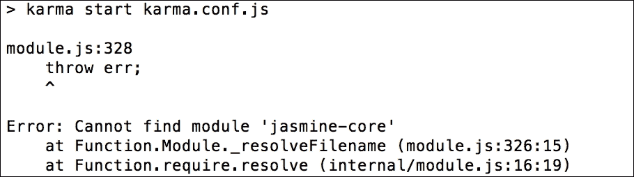

# 三、Karma 之道

得益于 Karma，JavaScript 测试已经成为主流。Karma 使测试 JavaScript 变得天衣无缝。角度测试是围绕测试创建的。

在本章中，我们将学习一些关于Karma的知识，包括以下内容：

*   Karma的起源
*   Karma为什么和如何与一个角度项目一起工作
*   使用角度项目的 Karma 配置和实现
*   **特拉维斯 CI**概述

# Karma的诞生

当选择一个新工具时，了解它的来源和构建原因是很重要的。本节将给我们一个Karma起源的背景。

## Karma差异

Karma是由 Vojta Jína 创造的。该项目原名为**测试**。在 Vojtech Jína 的论文中，他讨论了 Karma 的设计、目的和实现。

在他的论文中（*JavasScript 测试运行者*、[https://github.com/karma-runner/karma/raw/master/thesis.pdf](https://github.com/karma-runner/karma/raw/master/thesis.pdf) ），他将Karma描述如下：

> *“…一个测试运行者，通过简化和加快自动化测试来帮助 web 应用程序开发人员提高生产力和效率。事实上，我有一个更高的目标，本论文只是其中的一部分——我想将测试驱动开发（TDD）作为“最重要的工具”来推广“开发 web 应用程序的方法，因为我相信这是开发高质量软件最有效的方法。”*

Karma 能够在真实浏览器上轻松自动地运行 JavaScript 单元测试。传统上，测试是通过手动启动浏览器并通过不断单击刷新按钮检查结果来运行的。这种方法很笨拙，常常导致开发人员限制编写的测试数量。

有了 Karma，开发人员可以在几乎任何标准的测试框架中编写测试，选择要运行的浏览器，设置要监视更改的文件，然后 bam！我们有连续的自动化测试。我们只需检查输出窗口中是否有失败或通过的测试。

## 结合Karma和角力的重要性

Karma是为安格拉斯建立的。在 Karma 之前，基于 web 的 JavaScript 开发人员缺乏自动化测试工具。

记住，Karma 是一个测试运行者，而不是一个测试框架。它的任务是运行测试并报告哪些测试将通过或失败。这为什么有用？测试框架是您编写测试的地方。除此之外，您还需要专注于轻松运行测试和查看结果。Karma 可以轻松地跨多个不同的浏览器运行测试。它还具有一些其他功能，例如文件监视，本书稍后将详细讨论这些功能。

# 安装Karma

是时候开始使用Karma了。安装和应用不断变化。以下指南旨在简明扼要；您可以访问[的Karma网站 http://karma-runner.github.io/](http://karma-runner.github.io/) 并在那里找到最新的说明。

本节的主要重点是本书中使用的特定配置，而不是深入的安装指南。

## 安装前提条件

要安装 Karma，我们需要在计算机上安装 Node.js。js 在 Google 的 V8 引擎上运行，允许 JavaScript 在多个操作系统上运行。

开发者可以使用**NPM**（**节点包管理器**发布节点应用和模块。NPM 允许开发人员将应用程序和模块快速集成到他们的应用程序中。

Karma 通过`npm`包运行和安装；因此，在使用或安装 Karma 之前，我们需要 Node.js。要安装 Node.js，请转到[http://nodejs.org/](http://nodejs.org/) 并按照安装说明进行操作。

安装 Node.js 后，让我们在命令提示符中键入以下命令以安装 Karma：

```ts
$ npm install karma -g

```

前面的命令使用`npm`使用`-g`全局安装 Karma。这意味着我们可以在命令提示符下使用 Karma，只需键入以下内容：

```ts
$ karma --version

```

默认情况下，安装 Karma 将安装`karma-chrome-launcher`和`karma-jasmine`作为依赖项。确保这些模块也在全球范围内安装。

# 配置Karma

Karma 配备了一种自动创建配置文件的方法。要使用自动方式，请键入以下命令：

```ts
$ karma init

```

以下是所选选项的示例：


## 定制卡玛的配置

以下说明描述了为项目运行 Karma 所需的具体配置。定制包括测试框架（Jasmine）、要测试的浏览器（Chrome）和要测试的文件。要自定义配置，请打开`karma.conf.js`并执行以下步骤：

1.  确保启用的框架使用以下代码显示`jasmine`：

    ```ts
            frameworks: ['jasmine'], 

    ```

2.  配置`test`目录。请注意，以下定义需要包括需要与任何潜在依赖项一起运行的测试。保存我们测试的目录是`/test/unit/`：

    ```ts
            files: [ 
                'test/unit/**/*.js' 
            ], 

    ```

3.  将测试浏览器设置为 Chrome，如下所示。然后将对其进行初始化，并在每次测试后运行弹出窗口：

    ```ts
            browsers: ['Chrome'], 

    ```

## 确认 Karma 的安装和配置

要确认 Karma 的安装和配置，请执行以下步骤：

1.  运行以下命令以确认 Karma 启动时没有错误：

    ```ts
            $ karma start

    ```

2.  输出应该是这样的：

    ```ts
            $ INFO [karma]: Karma v0.12.16 server started at 
            http://localhost:9876/

    ```

3.  In addition to this, the output should state that no test files were found:

    ```ts
            $ WARN [watcher]: Pattern "test/unit/**/*.js" does not
            match any file.

    ```

    输出应与失败的测试消息一起执行此操作：

    ```ts
            $ Chrome 35.0.1916 (Windows 7): Executed 0 of 0 ERROR
            (0.016 secs / 0 secs)

    ```

    ### 注

    需要注意的一点是，我们需要在系统上全局安装`jasmine-core`，否则 Karma 将无法成功运行

这是预期的，因为尚未创建任何测试。如果 Karma 启动，继续下一步，我们将看到具有以下输出的 Chrome 浏览器：


## 常见安装/配置问题

如果缺少 Jasmine 或 Chrome 启动器，请执行以下步骤：

1.  运行测试时，可能会出现一个错误，说明**缺少 Jasmine 或 Chrome 启动器**。如果出现此错误，请键入以下命令以安装缺少的依赖项：

    ```ts
            $ npm install karma-jasmine -g
            $ npm install karma-chrome-launcher -g

    ```

2.  Retry the test and confirm that the errors have been resolved.

    在某些情况下，您可能无法使用`-g`命令全局安装`npm_modules`。这通常是由于计算机上的权限问题造成的。以下是提供权限（sudo/administrator）所需的操作：

    1.  解决方案是直接在项目文件夹中安装 Karma。使用不带[T0]的相同命令执行此操作：[T1]
    2.  使用相对路径

        ```ts
                        $ ./node_modules/karma/bin/karma --version

        ```

        运行Karma

现在 Karma 已经安装并运行，是时候使用它了。

# Karma测试

在本节中，我们将创建一个测试来确认Karma是否如预期的那样发挥作用。为此，请执行以下步骤：

1.  创建测试目录。在 Karma 配置中，测试在以下目录中定义：

    ```ts
            files: [ 
                   'test/unit/**/*.js' 
               ], 

    ```

2.  继续创建`test/unit`目录。
3.  在`test/unit`目录中创建一个新的`firstTest.js`文件。
4.  按如下方式编写第一个测试：

    ```ts
            describe('when testing karma', function (){ 
              it('should report a successful test', function (){ 
                expect(true).toBeTruthy(); 
                  }); 
            }); 

    ```

前面的测试使用 Jasmine 函数，并具有以下属性：

*   `describe`：这提供了测试套件的简短字符串描述，即将要测试的内容。
*   `it`：这提供了一个称为测试规范的特定断言的简短字符串
*   `expect`：这提供了一种断言值的方法
*   `toBeTruthy`：这是可用于断言的期望的几个属性之一

除了确认通过测试的输出外，该测试没有实际值。

砰！让我们检查一下控制台窗口，看看 Karma 已经执行了我们的测试。我们的命令行应该这样说：

```ts
$ INFO [watcher]: Added file "./test/unit/firstTest.js"

```

此输出意味着 Karma 自动识别添加了一个新文件。下一个输出应该如下所示：

```ts
$ Chrome 35.0.1916 (Windows 7): Executed 1 of 1 SUCCESS (0.02 secs 
    / 0.015 secs)

```

这意味着我们的测试已经通过了！

# 确认卡玛装置

现在，Karma的初始设置和配置已经完成。以下是对以下步骤的回顾：

1.  我们通过`npm`命令安装了卡玛。
2.  我们通过`karma init`命令初始化了一个默认配置。
3.  接下来，我们用 Jasmine 和`test/unit`测试目录配置 Karma。
4.  我们启动了 Karma，并确认它可以用 Chrome 打开。
5.  然后，我们在[T1]测试目录中添加了一个 Jasmine 测试[T0]。
6.  Karma 意识到`firstTest.js`已添加到测试目录中。
7.  最后，Karma 执行了我们的`firstTest.js`并报告了我们的输出。

通过几个步骤，我们能够看到 Karma 自动运行和执行测试。从 TDD 的角度来看，我们可以不费吹灰之力地将测试从失败转移到通过。不需要刷新浏览器；只需检查命令输出窗口。保持 Karma 运行，我们的所有测试和文件将自动添加并运行。

在接下来的章节中，我们将看到如何用 TDD 方法应用Karma。如果到目前为止你对Karma还满意，并想继续讨论Protractor，请跳到下一章。

# 使用Karma与角度

在这里，我们将通过 TDD 方法了解角度分量。在本章结束时，我们应该能够做到以下几点：

*   对使用Karma及其配置感到自信
*   了解茉莉花测试的基本组成部分
*   开始理解 TDD 方法在角度应用中的集成

## 变得棱角分明

不可能通过 Bower 进行角度安装；与 Angular1 一样，它必须通过 npm 安装。引导 Angular1 应用程序不像 Angular1 那么简单，因为 Angular 不使用普通 JavaScript。它使用 TypeScript 或 ES6（ES2015），这两种脚本在运行之前都需要编译为纯 JavaScript。

我们相信大多数开发人员已经意识到角度的变化及其编译工作方式。简单回顾一下——只要 Angular 推荐，我们将在 Angular 示例项目中使用 TypeScript，不过也可以选择使用 ES6。我们将使用 node/npmtsc 模块将 TypeScript 编译成纯 JavaScript；node/npm 将是我们的 CLI 工具，用于构建/启动项目和运行测试。

这里需要对 node/npm 模块有一个基本的了解，特别是 npm 命令是如何工作的。

### 角度工程

我们将不演示如何安装 Angular 以及如何从头开始构建项目，Angular 文档站点很好地展示了这一点。因此，我们将从 Angular 团队的示例中获得一个简单的 Angular 项目，并为我们的实现更新该项目。

我们将从 Angular GitHub 回购协议中克隆`quickstart`项目，并将从该项目开始。希望除了 node/npm 之外，我们都在全球安装了`git`。

```ts
$ git clone https://github.com/angular/quickstart.git angular-
    karma

```

这将本地复制项目为`angular-karma`，文件夹结构如图所示：


让我们继续并准备好运行：

```ts
$ cd angular-karma
$ npm install

```

下面是准备示例项目的几个步骤。`npm install`命令将为项目根目录中`package.json`文件中定义的项目依赖项安装所需的模块。

然后，我们将使用`npm start`运行项目；此脚本在`package.json`中定义，用于在本地服务器上运行项目。

让我们编译并运行该项目：

```ts
$ npm start

```

如果安装了所有必需的依赖项，此命令将把 TypeScript 编译为纯 JavaScript，并在本地服务器上运行项目。

项目将在浏览器中启动，如下所示：


如果这个示例项目成功运行，那么我们可以进入下一步，在那里我们将添加一个测试规范，其中包括 Karma，并使用 Karma runner 运行这些测试。

### 准备好了吗

当我们克隆样本`quickstart`项目时，它已经在项目中集成并配置了 Karma。为了学习的目的，我们想将Karma整合到现有的项目中。

为此，我们必须从项目根目录中删除现有的`karma.conf.js`文件。同时，我们将从`node_modules`中移除Karma、茉莉花和相关模块。

有趣的是，我们不用手动操作，只需一个简单的命令就可以轻松创建基本的 Karma 配置文件。有了这个命令，它将提出一些基本的问题，正如我们在本章前一部分看到的。

## 制造Karma

要在 Angular 项目中设置 Karma，第一项工作是在项目根目录中创建一个`karma.conf.js`文件。该文件基本上包含一些键值对配置。

有趣的是，我们不用手动操作，只需一个简单的命令就可以轻松创建基本的 Karma 配置文件。有了这个命令，它将提出一些基本问题，正如我们在本章前一部分看到的：

```ts
$ karma init

```

使用默认答案。在当前目录中创建`karma.conf.js`后，打开配置。一些配置可能需要更改，主要是为Karma使用的文件定义。

在`files`部分中使用以下定义，其中定义了运行测试所需的文件：

```ts
files: [ 
        // System.js for module loading 
      'node_modules/systemjs/dist/system.src.js', 

      // Polyfills 
      'node_modules/core-js/client/shim.js', 
      'node_modules/reflect-metadata/Reflect.js', 

      // zone.js 
      'node_modules/zone.js/dist/zone.js', 
      'node_modules/zone.js/dist/long-stack-trace-zone.js', 
      'node_modules/zone.js/dist/proxy.js', 
      'node_modules/zone.js/dist/sync-test.js', 
      'node_modules/zone.js/dist/jasmine-patch.js', 
      'node_modules/zone.js/dist/async-test.js', 
      'node_modules/zone.js/dist/fake-async-test.js', 

// RxJs 
      { pattern: 'node_modules/rxjs/**/*.js', included: false,
      watched: false },      { pattern: 'node_modules/rxjs
      /**/*.js.map', included: false,        watched: false }, 

// Angular itself 
      { pattern: 'node_modules/@angular/**/*.js', included: 
      false,        watched: false }, 

{ pattern: 'systemjs.config.js', included: false, watched: false }, 
      { pattern: 'systemjs.config.extras.js', included: false,   
      watched: false }, 
      'karma-test-shim.js', 

          {pattern: 'app/**/*.js', included: false, watched: true} 
    ] 

```

### 注

在这里，使用该模式，我们已经通过了两个选项，`included`和`watched`。`included`表示我们是否希望包含带有`<script>`标签的文件；在这里，我们将通过 SystemJS 添加它，因此它作为`false`传递。而`watched`是指在文件更改期间是否会监视此文件。我们已经设置了`true`，因为我们想观察变化。

似乎添加了很多文件，但这些文件是运行测试的基本文件和必备文件。

让我们仔细看看这些文件是什么。在第一块中，这些文件主要是库文件，包括作为模块加载器的 SystemJS、作为同步处理程序的 zonejs、作为反应库的 RxJS 以及 Angular 库本身。

重要的是，第二个区块中的新文件是`karma-test-shim.js`，我们需要将其与 Karma 一起用作测试套件中的模块加载器，也就是说，使用 SystemJS 在 Karma 测试运行程序中加载模块。我们将在本节后面部分查看该文件。

然后，它是我们所有的应用程序源文件；我们还将把测试/规范文件放在同一个目录中，以便它们加载我们的所有模块文件，包括它们的测试/规范文件。

除了这些文件之外，我们可能还需要根据需求更改一些配置点，如下所示：

*   `plugins`：这是必需的，因为Karma将使用这些`npm`模块来执行。如果我们计划使用更多的`npm`模块，我们需要在这里添加它们；例如，如果我们计划使用 PhantomJS 作为浏览器，我们需要在列表中添加`'karma-phantomjs-launcher'`：

    ```ts
            plugins: [ 
    'karma-jasmine', 
    'karma-chrome-launcher' 
       ] 

    ```

*   `frameworks`：暂时不需要更改，默认选择茉莉花；但是，如果我们计划使用其他框架，如 Mocha，则需要对其进行更新。在这种情况下，应更新以下选项：

    ```ts
            frameworks: ['jasmine'], 

    ```

*   `browsers`：当我们需要在多个浏览器中运行测试时，这很有用，大多数时候，我们可能需要在 PhantomJS 中运行测试，因此我们可以添加多个浏览器，如图所示：

    ```ts
            browsers: ['Chrome', 'PhantomJS'] 

    ```

到目前为止，这些是我们需要在`karma.con.js`文件中进行的基本更改。

让我们看看我们的 To.t0 文件，看看它是什么样子的：

```ts
module.exports = function(config) { 

  config.set({ 
    basePath: '', 
    frameworks: ['jasmine'], 
    plugins: [ 
      require('karma-jasmine'), 
      require('karma-chrome-launcher') 
    ], 

    files: [ 
      // System.js for module loading 
      'node_modules/systemjs/dist/system.src.js', 

      // Polyfills 
      'node_modules/core-js/client/shim.js', 
      'node_modules/reflect-metadata/Reflect.js', 

      // zone.js 
      'node_modules/zone.js/dist/zone.js', 
      'node_modules/zone.js/dist/long-stack-trace-zone.js', 
      'node_modules/zone.js/dist/proxy.js', 
      'node_modules/zone.js/dist/sync-test.js', 
      'node_modules/zone.js/dist/jasmine-patch.js', 
      'node_modules/zone.js/dist/async-test.js', 
      'node_modules/zone.js/dist/fake-async-test.js', 

      // RxJs 
      { pattern: 'node_modules/rxjs/**/*.js', included: false,
      watched: false },     
      { pattern: 'node_modules/rxjs/**/*.js.map', included: 
      false,        watched: false }, 

      // Paths loaded via module imports: 
      // Angular itself 
      { pattern: 'node_modules/@angular/**/*.js', included: 
      false,        watched: false },
      { pattern: 'node_modules/@angular/**/*.js.map', included: 
      false, watched: false },
      { pattern: 'systemjs.config.js', included: false, 
      watched:        false },
      { pattern: 'systemjs.config.extras.js', included: false,
      watched: false },

      'karma-test-shim.js', 

      { pattern: 'app/**/*.js', included: false, watched: true } 
    ], 

    port: 9876, 
    colors: true, 
    autoWatch: true, 
    browsers: ['Chrome'], 
    singleRun: false 
  }) 
}
```

我们在文件列表中添加的另一个重要文件是`karma-test-shim.js`；正如我们前面提到的，我们需要将 SystemJS（模块加载器）与 Karma 一起使用。我们已经从 Angular quick start 项目复制了该文件，可以根据项目结构对此进行更改。

让我们看看我们的 To.T0A.文件：

```ts
Error.stackTraceLimit = 0; // "No stacktrace"" is usually best for app testing. 

jasmine.DEFAULT_TIMEOUT_INTERVAL = 1000; 

var builtPath = '/base/app/'; 

__karma__.loaded = function () { }; 

function isJsFile(path) { 
  return path.slice(-3) == '.js'; 
} 

function isSpecFile(path) { 
  return /\.spec\.(.*\.)?js$/.test(path); 
} 

function isBuiltFile(path) { 
  return isJsFile(path) && (path.substr(0, builtPath.length) == 
  builtPath); 
} 

var allSpecFiles = Object.keys(window.__karma__.files) 
  .filter(isSpecFile) 
  .filter(isBuiltFile); 

System.config({ 
  baseURL: 'base', 
  // Extend usual application package list with test folder 
  packages: { 'testing': { main: 'index.js', defaultExtension: 'js' 
  } }, 

  // Assume npm: is set in `paths` in systemjs.config 
  // Map the angular testing umd bundles 
  map: { 
    '@angular/core/testing':      
'npm:@angular/core/bundles/core-testing.umd.js',    
'@angular/common/testing':      
'npm:@angular/common/bundles/common-testing.umd.js',    
'@angular/compiler/testing':      
'npm:@angular/compiler/bundles/compiler-testing.umd.js',    
'@angular/platform-browser/testing':      
'npm:@angular/platform-browser/bundles/     
platform-browser-testing.umd.js',    
'@angular/platform-browser-dynamic/testing':      'npm:@angular/platform-browser-dynamic/bundles    
 /platform-browser-dynamic-testing.umd.js',    
'@angular/http/testing':      
'npm:@angular/http/bundles/http-testing.umd.js',    
'@angular/router/testing':      
'npm:@angular/router/bundles/router-testing.umd.js',    
'@angular/forms/testing':      
'npm:@angular/forms/bundles/forms-testing.umd.js', 
  }, 
}); 

System.import('systemjs.config.js') 
  .then(importSystemJsExtras) 
  .then(initTestBed) 
  .then(initTesting); 

/** Optional SystemJS configuration extras. Keep going w/o it */ 
function importSystemJsExtras(){ 
  return System.import('systemjs.config.extras.js') 
  .catch(function(reason) { 
    console.log( 
      'Warning: System.import could not load the optional        "systemjs.config.extras.js". Did you omit it by accident?        Continuing without it.' 
    ); 
    console.log(reason); 
  }); 
} 

function initTestBed(){ 
  return Promise.all([ 
    System.import('@angular/core/testing'), 
    System.import('@angular/platform-browser-dynamic/testing') 
  ]) 

  .then(function (providers) { 
    var coreTesting    = providers[0]; 
    var browserTesting = providers[1]; 

    coreTesting.TestBed.initTestEnvironment( 
      browserTesting.BrowserDynamicTestingModule, 
      browserTesting.platformBrowserDynamicTesting()); 
  }) 
} 

// Import all spec files and start karma 
function initTesting () { 
  return Promise.all( 
    allSpecFiles.map(function (moduleName) { 
      return System.import(moduleName); 
    }) 
  ) 
  .then(__karma__.start, __karma__.error); 
} 

```

### 测试 Karma runner

Karma的最初建立几乎完成了；我们必须运行我们的测试，看看它是如何进行的。在运行之前还有一个步骤——我们必须在`npm`脚本中添加`karma`任务，以便通过`npm`命令运行。为此，我们必须在`package.json`文件的脚本部分添加一个任务，如`test`：

```ts
"scripts": { 
     "test": "karma start karma.conf.js" 
  } 

```

添加此代码段后，我们可以通过`npm`运行测试，使用`npm test`，其工作方式与`karma start`相同：

```ts
$ npm test

```

所以，最后，我们准备好通过Karma运行我们的测试。然而，哎呀，我们得到了一些错误！缺少运行测试所需的`jasmine-core`模块；事实上，可能会有更多的模块丢失。

带有错误的输出如下所示：



是的，我们确实缺少模块，而这些模块实际上是我们测试套件中的开发依赖项。我们将在下一节中进一步了解它们。

### 缺少依赖项

尽管我们正在为 Angular 构建一个基本的测试套件，但我们仍然缺少一些必需的 npm 模块，这些是我们测试套件的开发依赖项，如下所示：

*   `jasmine-core`：这说明 Jasmine 是我们的测试框架
*   `karma`：这是我们测试套件的 Karma 测试运行者
*   `karma-chrome-launcher`：这是从 Karma 启动 Chrome 所必需的，因为我们在`karma.config`中将 Chrome 定义为我们的浏览器
*   `karma-jasmine`：这是茉莉花的Karma

只要这些是依赖项，我们就应该安装这些模块，并将它们包括在`package.json`中。

我们可以将所有这些安装在一起，如下所示：

```ts
$ npm install jasmine-core karma karma-chrome-launcher karma-
    jasmine --save-dev

```

在成功安装了所有必需的依赖项之后，我们似乎完成了配置过程，准备再次运行`test`：

```ts
$ npm test

```

命令输出应如下所示：

```ts
$ Chrome 39.0.2623 (Mac OS X 10.10.5): Executed 0 of 0 ERROR 
    (0.003 secs / 0 secs) 

```

就是这样。Karma 现在正在运行第一个角度应用程序。

# 角度和Karma测试

使用 Karma 的第一个测试的目的是创建一个动态的待办事项列表。本演练将遵循我们在[第 1 章](1.html "Chapter 1. Introduction to Test-Driven Development")、*测试驱动开发简介*中讨论的 TDD 步骤：首先测试，使其运行，并使其更好。这将使我们在使用 TDD 和角度应用方面获得更多经验。

## 开发待办事项清单

在开始测试之前，让我们将重点放在需要使用开发待办事项列表开发的内容上。这将使我们能够组织我们的思想。

以下是待办事项清单：

*   **维护项目列表**：示例列表包括测试、执行和重构
*   **向列表中添加一项**：我们添加该项后的示例列表是测试、执行、重构和重复
*   **从列表中删除一项**：添加和删除该项后的示例列表为测试、执行和重构

## 测试项目列表

第一个开发项目是为我们提供在组件上列出项目的能力。接下来的两个步骤将引导我们完成使用 TDD 生命周期添加第一个特性的 TDD 过程。

### 先测试

决定从哪里开始通常是最困难的部分。最好的方法是记住三个**A**s（**汇编**、**Act**和**断言**并从基础 Jasmine 模板格式开始。执行此操作的代码如下所示：

```ts
describe('Title of the test suite', () => { 
    beforeEach(() => { 
        // .... 
    }); 

    it('Title of the test spec', () => { 
        // .... 
    }); 
}); 

```

让我们看看解释：

*   `describe`：这定义了我们正在测试的主要特性。字符串将以可读的术语解释该特性，然后函数将遵循测试。
*   `beforeEach`：这是组装步骤。此步骤中定义的函数将在每次断言之前执行。最好在该功能的每次测试之前设置所需的测试设置。
*   `it`：这是行动和主张步骤。在`it`部分，我们将执行正在测试的操作，然后执行一些断言。act 步骤不必进入`it`功能。根据测试，它可能更适合于`beforeEach`功能。

### 三个 As-集合、行动和断言

现在模板准备好了，我们可以开始装配了。我们将再次遵循这三个咒语。

以下是组装部分的两部分。

在第一部分中，我们使用以下代码初始化组件并执行类的 contractor：

```ts
import { async, ComponentFixture, TestBed } from '@angular/core/testing'; 

import { AppComponent } from './app.component'; 

beforeEach(async(() => { 
   TestBed.configureTestingModule({ 
      declarations: [ AppComponent ] 
    }) 
    .compileComponents(); 
  })); 

beforeEach(() => { 
    fixture = TestBed.createComponent(AppComponent); 
    comp = fixture.componentInstance; 
}); 
... 

```

在这里，我们引入了一些角度测试 API，如`async`和`Testbed`。这里，`async`用于加载所需的模块，以引导测试套件的应用程序，`TestBed`是为 Angular API 编写单元测试的主要 API。它有一些服务来创建、编译和启动测试套件中的组件。

我们还没有定义`AppComponent`组件，但我们会在测试失败后进行定义。

第二部分为`AppComponent`对象。`AppComponent`对象将包含其`this`变量上的项目列表。将以下代码添加到`beforeEach`以获取组件对象：

```ts
// comp will hold the component object  
let comp: AppComponent; 
let fixture: ComponentFixture<AppComponent>; 
beforeEach(() => { 
    fixture = TestBed.createComponent(AppComponent); 
    comp = fixture.componentInstance; 
}); 

```

在 assert 中，又有两个部分：

第一个断言是确保`AppComponent`对象有一个由三项定义的`items`变量。`items`变量将用于保存所有项目的列表：

```ts
it('Should define a list object', () => { 
        expect(com.items).toBeDefined(); 
    }); 

```

第二个和第三个断言将用于确认列表中的数据是否正确：

```ts
//Second test 
it('Should have 3 items in list', () => { 
        expect(com.items.length).toBe(3); 
    }); 

//Third test 
it('List items should be as expected', () => { 
        expect(com.items).toEqual(['test','execute','refactor']); 
    }); 

```

就这样,；第一个是测试，第二个是执行，第三个是重构。

### 让它跑起来

TDD 生命周期的下一步是让应用程序运行并修复代码，以便测试通过。请记住，通过继续执行以下步骤，考虑可添加以使测试通过的最小组件：

1.  通过键入以下命令来运行 Karma 测试：

    ```ts
    $ npm start
    $ npm test

    ```

2.  If we encounter the `TypeError: app_component_1.AppComponent is not a constructor` error, then it can be due to the following:
    *   前面的错误消息表示尚未定义[T0]对象。因为错误消息告诉我们需要什么，所以这是一个完美的开始。
3.  将`AppComponent`类添加到`app.component.ts`文件中，如下所示：

    ```ts
            export class AppComponent { };
    ```

4.  从`npm`控制台再次运行`start`和`test`命令。我们现在应该看到一个新错误。**错误：**`The expected undefined to be defined as follow`
    *   新的错误消息再次被清除。我们还可以看到，代码现在已经传递到我们在以下点的断言：

        ```ts
                       expect(com.items).toBeDefined();
        ```

    *   由于对象中没有项目，我们需要添加一个。更新`app/app.component.ts`文件如下：

        ```ts
                      export class AppComponent { 
                          items:Array<string>; 
                      }; 

        ```

5.  让我们从`npm`控制台再次运行`start`和`test`命令。我们现在应该看到三个测试中的一个通过了！这意味着我们已经成功地使用 TDD 和 Karma 来通过我们的第一次测试。现在，我们需要解决另外三个问题。
    *   下一个错误是：`expected 0 to equal 3 `
    *   错误输出再次准确地描述了需要发生的情况。我们只需要使用元素 test、execute 和 run 初始化数组。我们转到`app/app.component.ts`并将数据添加到数组初始化：

        ```ts
                    export class AppComponent { 
                        items:Array<string>; 
                        constructor() { 
                            this.items = ['test','execute','refactor']; 
                        } 
                    }; 

        ```

6.  从 npm 控制台再次运行`start`和`test`命令。杰出的输出为绿色，表示所有测试均已通过。此步骤的结果组件和类代码如下：

    ```ts
            import {Component} from '@angular/core'; 

            @Component({ 
                // ...  
            }) 

            export class AppComponent { 
                items:Array<string>; 
                constructor() { 
                    this.items = ['test','execute','refactor']; 
                } 
            }; 

    ```

现在*使其运行*步骤已经完成，我们可以继续下一步并使其更好。

### 让它变得更好

在此之前，不需要直接重构，也不需要在开发待办事项列表中确定。对开发待办事项清单的审查表明，项目可以被划掉：

*   **查看待办事项列表**：示例列表包括测试、执行和重构
*   **向待办事项列表中添加一项**：添加该项后的示例列表将包括测试、执行、重构和新建项

接下来是向列表中添加新项的要求。TDD 节奏将再次遵循：首先测试，使其运行，并使其更好。

## 向组件类添加函数

下一个任务是赋予类向对象添加项的能力。这将需要向对象添加一个方法。本演练将遵循与前面相同的 TDD 步骤。

### 先测试

下面的测试将插入到最后一个`it`方法下，而不是创建新文件并复制一些组装步骤。原因是将使用相同的模块和控制器：

```ts
describe('Title of the test suite', () => { 
    let app:AppComponent; 

    beforeEach(() => { 
        // .... 
    }); 

    it('Title of the test spec', () => { 
        // .... 
    }); 

    describe('Testing add method', () => { 

    beforeEach(() => { 
        // .... 
    }); 

    it('Title of the test spec', () => { 
        // .... 
    }); 
   }); 
}); 

```

### 三个 As-集合、行动和断言

现在模板准备好了，我们可以开始使用 3 作为咒语来填补空白：

*   **组装**：组件和对象将被继承，不需要初始化或设置。
*   **Act**：这里，我们需要在`add`方法上使用一个新项目。我们将`act`函数放入`beforEach`函数中。这允许我们在添加更多测试时重复相同的步骤：

    ```ts
            beforeEach(() => { 
                 com.add('new-item') 
            }); 

    ```

*   **断言**：这里需要在列表中添加一个项目，然后需要确认数组中的最后一个项目是否如预期的那样：

    ```ts
            it('Should have 4 items in list', () => { 
                 expect(com.items.length).toBe(4); 
            }); 
            it('Should add a new item at the end of list', () => { 
                var lastIndexOfList = com.items.length - 1; 
                expect(com.items[lastIndexOfList]).toEqual('new-item'); 
            }); 

    ```

### 让它跑起来

TDD 生命周期的下一步是使其运行。请记住，请考虑可添加以使测试通过的最小组件，如下所示：

*   通过键入以下命令确保 Karma 正在我们的控制台中运行：

    ```ts
    $ npm start
    $ npm test

    ```

*   The first error will state `TypeError: undefined is not a function`.

    此错误涉及以下代码行：

    ```ts
            app.add('new-item'); 

    ```

    错误告诉我们，`add`方法尚未定义。`add`功能需要添加到`app/app.component.ts`代码中。类已经定义，`add`函数需要放在类中：

    ```ts
            add() { 
                    this.items.push('new-item'); 
            }; 

    ```

    注意`add`函数如何不包含任何逻辑。已添加最小的组件以获得满足错误消息的测试。

*   查看控制台窗口中的下一个错误。

成功所有五项测试现在都通过了。

为使测试通过而添加的结果代码如下所示：

```ts
import {Component} from '@angular/core'; 

@Component({ 
    selector: 'my-app', 
    template: `<h3>MY Items</h3><ul><li *ngFor="let item of items">{{ 
    item }}</li></ul>` 
}) 

export class AppComponent { 
    items:Array<string>; 
    constructor() { 
        this.items = ['test','execute','refactor']; 
    } 
    add() { 
        this.items.push('new-item'); 
    } 
}; 

```

### 让它变得更好

我们需要重构的主要事情是，`add`函数还没有完全实现。它包含一个硬编码的值，当我们将不同的项发送到`add`函数中时，测试将失败。

让Karma继续运行，这样我们就可以在变化发生时不断通过测试。当前`add`方法的主要问题如下：

*   它不接受任何参数
*   它不会将参数推送到列表中，而是使用硬编码的值

生成的`add`函数现在应如下所示：

```ts
        add(item) { 
            this.items.push(item); 
        }; 

```

从`npm`控制台再次运行`start`和`test`命令。确认 Karma 输出仍显示`SUCCESS`：

```ts
$ Chrome 49.0.2623 (Mac OS X 10.10.5): Executed 5 of 5 SUCCESS
    (0.016 secs / 0.002 secs)

```

# 用 Travis CI 配置Karma

**持续集成**（**CI**是开发人员需要将代码集成到共享存储库中的一种开发实践。当代码库中发生任何更改时，它将在自动构建过程中运行，并进行测试。这会在将错误推送到生产之前尽早检测到错误。有很多 CI 服务，包括 Travis CI、Jenkin CI、Circle CI 等。

在本节中，我们将看到如何将Karma与特拉维斯整合。

## 特拉维斯 CI

Travis CI 是一个受欢迎的托管持续集成平台，它与 GitHub 项目/存储库集成，可以在任何分支的代码库中的每次更改，甚至是拉取请求中自动运行测试。只需在项目根目录中放置一个带有项目配置信息的`.travis.yml`文件，就可以轻松获得集成系统。

所以，我们可能会问，为什么是特拉维斯？还有一些其他的 CI 服务。如果我们将 Travis 与其他 CI 服务进行比较，它比其他 CI 服务有一些好处：

*   这是一个托管服务；无需托管、安装和配置
*   它是免费的，开源的
*   它对每个分支都有单独的测试代码，因此很容易对单个分支运行测试

## 配置特拉维斯

正如我们所说的，我们的项目目录中将有一个`.travis.yml`文件，其中包含一些关于我们项目的配置和信息。

以下是 YAML 文件中的基本配置：

*   **指定语言**：我们在这里使用了 Node.js:

    ```ts
            language: node_js 
            node_js: 
                -  "4" 

    ```

*   **命令或脚本**：需要在每次构建之前或之后运行；如图所示，此脚本将在每次运行构建之前设置`git`用户名：

    ```ts
            before_script: 
                -  git config - -global user.name jquerygeek  

    ```

在前面的示例中，我们已经通过了配置，在带有虚拟屏幕的真实浏览器（Firefox）中运行构建过程，默认情况下，使用 karma。它已在 PhantomJS headless 浏览器中运行该过程。只要 Travis 支持 PhantomJS 旁边的真实浏览器，这可能会派上用场：

```ts
        before_script: 
            -  export DISPLAY=:99.0 
            - sh -e /etc/init.d/xvfb start  

```

*   **通知**：设置电子邮件和聊天的通知时需要此项。在这里，我们为`email`设置了`false`，因为我们不希望有关构建的超时电子邮件通知：

    ```ts
            notifications: 
                email: false  

    ```

## 用 Karma 设置测试

如前所述，我们猜测在 npm 包中的项目根目录中有`package.json`文件；如果没有，让我们在那里创建一个`package.json`文件，并添加这些配置片段。这里，第一个是Karma的依赖，第二个是为`npm test`设置所需的参数，因为 Travis 将运行这个来触发我们的测试。这些将告诉 Travis 如何运行我们的测试：

```ts
  'devDependencies': { 
      'karma': '~0.12' 
  }, 

  'scripts': { 
      'test': 'karma start  - -single-run - -browsers PhantomJS ' 
  } 

```

我们的初始设置和配置已准备好进行测试。我们定义了Karma依赖，因为 Travis 将为每个套件运行`nmp install`，并将采取必要的步骤添加Karma。为了运行测试，它将调用`npm test`，我们定义了测试任务将如何运行测试。在这里，我们将默认浏览器设置为 PhantomJS，以便测试将使用它运行。但是，如果我们需要使用不同的浏览器来运行测试，我们应该在[T2]文件中使用[T3]命令来定义它，正如我们前面为 Firefox 所展示的那样。

在这种情况下，`npm test`不会使用自定义浏览器运行测试；为此，我们必须使用浏览器名称进行自定义调用，如下所示：

```ts
karma start - -browsers Firefox - -single-run 

```

# 自测题

以下自测问题将帮助您进一步测试您在 AngularJS 和 Karma 中使用 TDD 的知识：

问题 1。如何使用 Karma 创建配置文件？

1.  `karma config`
2.  `karma init`
3.  `karma -config karma.conf.js`

问题 2。茉莉花测试方法，名为`before`，在每次测试之前都会执行。

1.  符合事实的
2.  错误的

第三季度。凉亭是用来安装Karma的。

1.  符合事实的
2.  错误的

第四季度。3 代表这些中的哪一个？

1.  一群超级英雄
2.  集合、行动和断言
3.  接受、批准并采取行动

# 总结

在这一章中，我们讨论了Karma是如何变得重要的。我们看到了如何安装、配置和运行 Karma。最后，我们使用 Karma 和 TDD 浏览了一个角度示例项目。

在下一章中，我们将学习使用Protractor进行端到端测试。