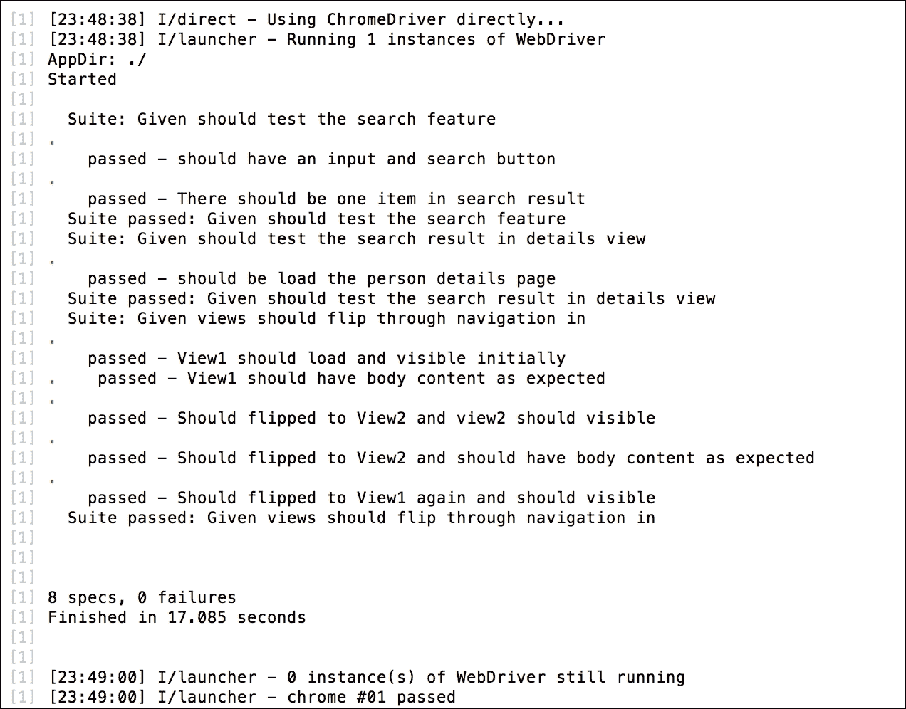
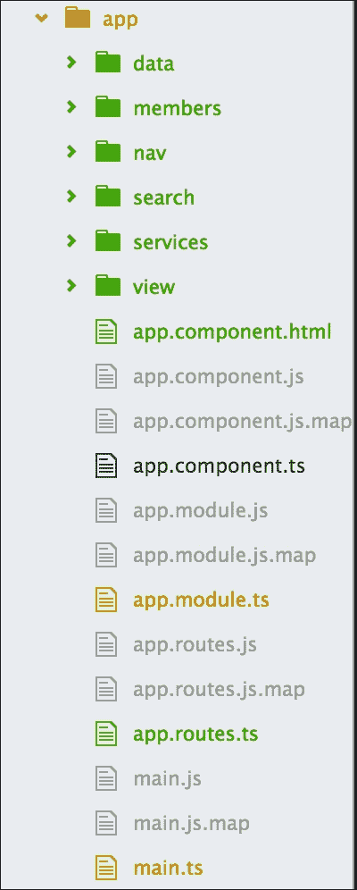

# 八、告诉世界

TDD 的构建侧重于基本组件，即生命周期和过程，使用逐步走查。我们从头开始研究了几个应用程序，了解了如何构建角度应用程序并使用工具对其进行测试。

是时候进一步扩展到角度和集成服务、事件发射器和路由的深度了。

本章在以下几个方面与其他章节略有不同：

*   我们将使用[第 7 章](7.html "Chapter 7. Flip Flop")、*触发器*中的搜索应用程序，而不是构建一个全新的应用程序
*   我们将添加在前几章中跳过的角度路线和导航的单元测试
*   我们将把常用的操作分离成服务，从而使现有的搜索应用程序更加现代化
*   我们将利用 Angular`EventEmitter`类在不同组件之间进行通信

# 准备好沟通了吗

在本章中，我们将采用不同的方法，因为我们已经学习了 TDD 方法。我们在上一章中开发了一个小项目，我们的计划是与该项目合作，使其更好地向世界展示。

因此，在演练之前，我们必须审查并确定任何问题以及项目的改进范围。为此，我们必须对搜索应用程序的代码库充满信心。

## 加载现有项目

首先，我们将复制[第 7 章](7.html "Chapter 7. Flip Flop")、*触发器*中的项目，它最初来自[https://github.com/angular/quickstart](https://github.com/angular/quickstart) ，并将其重命名为`angular-member-search`。

让我们继续并准备运行它：

```ts
$ cd angular-member-search
$ npm install 
$ npm start

```

要确认安装并运行项目，应用程序将在 web 浏览器中自动运行它。

以下是我们运行项目时应获得的输出：


哦我们已经在项目中准备好了端到端测试。在进行更新之前，我们必须确保现有的 e2e 测试是成功的。

让我们在单独的控制台中运行`e2e`测试：

```ts
$ npm run e2e

```

是的，一切顺利：



# 单元测试

在上一章中，我们从自上而下的方法开始。我们的目标是根据我们所学到的知识详细阐述端到端测试。我们清楚了用户场景，我们通过了测试，我们的场景通过了我们的实现。

在上一章中，我们只讨论了端到端测试。因此，在本章中，我们将尽可能多地介绍单元测试。

此外，在上一章中，我们主要研究了角度路线和导航。现在，作为一个逻辑扩展，我们将看看如何测试角度路线和导航。

## 测试组件

在进行组件测试之前，我们应该讨论一些关于测试角度组件的要点。我们已经有了一个基本的想法：在角度上，一切都是一些组件的组合。因此，对我们来说，更详细地了解角组件测试将是非常好的。

我们可以根据组件的行为和用例，以各种方式测试组件。当多个组件作为一个应用程序一起工作时，我们甚至可以有多个组件的测试规范。

让我们看看测试组件的一些方法。

### 隔离测试

隔离测试，也称为单独测试，之所以这样命名是因为这种类型的测试可以运行，而无需根据测试规范编译组件。如果它不编译，它将不会在测试规范中有已编译的模板；只有组件类及其方法。这意味着，如果组件的特性不是非常依赖于 DOM，则可以以隔离的方式对其进行测试。

隔离测试主要用于复杂的特性或计算测试，它只启动组件类并调用所有方法。

例如，看看[第 6 章](6.html "Chapter 6. The First Step")、*第一步*中的单元测试，`AppComponent`负责添加注释并增加他们的喜好：

```ts
beforeEach(() => { 
    comp = new AppComponent(); 
    comp.add('a sample comment'); 
    comp.like(comp.comments[0]); 
}); 

    it('First item in the item should match', () => { 
        expect(comp.comments[0].title).toBe('a sample 
        comment'); 
    }); 

    it('Number of likes should increase on like', () => { 
        expect(comp.comments[0].likes).toEqual(1); 
    }); 

```

### 浅层测试

隔离测试有时满足测试规范的要求，但并不总是如此。大多数情况下，组件都具有依赖于 DOM 的特性。在这种情况下，在测试规范中呈现组件的模板是很重要的，这样我们就可以在范围中拥有编译好的模板，并且测试规范能够与 DOM 交互。

例如，如果我们想为我们的`AppComponent`编写一个基本单元测试，它主要依赖于 DOM，因为组件类中没有方法，那么我们只需要编译组件并检查它是否已定义。此外，如果组件的模板在`<h1>`元素中有正确的文本，我们可以有一个测试规范。

代码如下所示：

```ts
beforeEach(async(() => { 
    TestBed.configureTestingModule({ 
        declarations: [ AppComponent ]
    }) 
    .compileComponents(); 
})); 

beforeEach(() => { 
    fixture = TestBed.createComponent(AppComponent); 
    comp = fixture.componentInstance; 
    de = fixture.debugElement.query(By.css('h1')); 
}); 

it('should create and initiate the App component', () => { 
    expect(comp).toBeDefined(); 
}); 

it('should have expected test in <h1> element', () => { 
    fixture.detectChanges(); 
    const h1 = de.nativeElement; 
    expect(h1.innerText).toMatch(/My First Angular 2 App/i, 
    '<h1> should say something about "Angular App"'); 
}); 

```

### 集成测试

以下是集成测试的一些关键点：

*   *集成测试*的名称应该让我们了解它是一种什么样的测试。它类似于浅层测试，因为它还需要使用模板编译组件并与 DOM 交互。
*   接下来我们将介绍我们的路线和导航测试套件，其中我们将集成`AppComponent`、路由器和导航测试套件。
*   我们为`AppComponent`准备了一个测试套件，因为它包括`navbar`组件和`router-outlet`组件。所有这些一起工作，以满足路由规范。
*   因此，为了获得一个可靠的路由器测试规范，我们应该进行集成测试。

我们将在下面几节中详细介绍路由器测试的一个示例。

### 注

集成测试和浅层测试之间的主要区别在于，集成测试适用于完整应用程序的测试套件，或应用程序的一小部分，其中多个组件协同工作以解决某些目的。它与端到端测试有一些相似之处，但方法不同。

# Karma构形

在前面的章节中，使用了默认的Karma配置，但是还没有给出关于这个默认配置的解释。**文件监视**是一种有用的默认行为，现在将对其进行审查。

## 文件监视

使用 Karma`init`命令时，默认启用文件监视。Karma 中的文件监视在`karma.conf.js`文件中配置了以下定义：

```ts
autoWatch: true, 

```

文件监视功能按预期工作，监视配置的`files`数组中定义的文件。当文件被更新、更改或删除时，Karma 会通过重新运行测试进行响应。从 TDD 的角度来看，这是一个很好的特性，因为测试将在没有任何手动干预的情况下继续运行。

要注意的要点是添加文件。如果要添加的文件与[T0]数组中的条件不匹配，[T1]参数将不响应更改。作为一个例子，让我们考虑这些文件的定义如下：

```ts
files : [ 'dir1/**/*.js'] 

```

如果是这种情况，观察者将找到所有以`.js`结尾的文件和子目录文件。如果新文件位于不同的目录中，而不是在`dir1`中，则观察者将无法响应新文件，因为它位于与它在中配置的目录不同的目录中。

# 测试路由器和导航

我们在[第 7 章](7.html "Chapter 7. Flip Flop")、*触发器*中介绍了角路由器和导航。

正如我们已经讨论了角组件、路由器和导航的不同测试类型一样，我们将关注集成测试。为此，我们将使用我们的应用组件测试，即我们的基础组件，然后将导航和`router-outlet`组件测试与应用组件集成，以测试路由器。

## 测试 app 组件

在进行路由器测试之前，我们将准备好应用程序组件测试。在 appcomponent 测试中，我们将测试组件是否正确定义和启动，然后通过选择 DOM 元素来测试页面标题。

我们在前面的章节中学习了浅层测试；当我们与 DOM 元素交互时，我们需要浅层测试。这里也是一样：因为我们必须处理 DOM 元素，所以我们将使用浅层测试作为我们的应用程序组件测试。

对于浅层测试，我们需要依赖 Angular core testing 的`TestBed`Angular test API，该 API 将用于编译和启动测试套件中的组件。除此之外，我们还将依赖于核心测试中的`ComponentFixture`模块。我们还需要 Angular core 和平台 API 中的两个模块，分别命名为`By`和`DebugElement`，用于与 DOM 元素交互。

我们的应用程序组件测试将位于`spec/unit/app.component.ts`，如下所示：

```ts
import { async, ComponentFixture, TestBed } from '@angular/core/testing'; 
import { By }           from '@angular/platform-browser'; 
import { DebugElement } from '@angular/core'; 

import { AppComponent } from '../../app/app.component'; 
import { NavbarComponent } from '../../app/nav/navbar.component';
import { RouterOutlet } from '@angular/router';

describe('AppComponent test suite', function () { 
  let comp: AppComponent; 
  let fixture: ComponentFixture<AppComponent>; 
  let de: DebugElement; 

  beforeEach(async(() => { 
   TestBed.configureTestingModule({ 
      declarations: [ AppComponent ] 
    }) 
    .compileComponents(); 
  })); 

  beforeEach(() => { 
    fixture = TestBed.createComponent(AppComponent); 
    comp = fixture.componentInstance; 
    de = fixture.debugElement.query(By.css('h1')); 
  }); 

  it('should create and initiate the App component', () => { 
    expect(comp).toBeDefined(); 
  }); 

  it('should have expected test in <h1> element', () => { 
    fixture.detectChanges(); 
    const h1 = de.nativeElement; 
    expect(h1.innerText).toMatch(/My First Angular 2 App/i, 
      '<h1> should say something about "Angular App"'); 
  }); 
}); 

```

如果我们运行此测试，我们将看到以下结果：

```ts
   Chrome 54.0.2840 (Mac OS X 10.10.5): Executed 2 of 2 SUCCESS
   (0 secs / 0.522 secs)

```

我们的应用组件测试现在已经准备好了；接下来，我们将进行一个路由器测试，包括`router-outlet`和导航。

## 测试路由器

角形路由器不是角形核心的一部分；它是一个单独的模块，在使用之前必须导入。它有一些指令，如`RouterOutlet`和`RouterLink`，它们在完成路由器活动中起着积极的作用。为了测试路由器，首先我们将测试这些指令，以便为测试整个路由器准备平台。

### 提示

我们可以使用实际的路由器模块测试路由器，但有时这会给整个路由系统带来一些复杂性。因此，测试规范可能会在不提供准确错误的情况下失败。为了避免这种情况，建议创建路由器存根并将其用于路由器测试。

### 路由器存根

我从 Angular 的官方测试文件中得到了路由器存根的想法。我喜欢路由存根的想法，并从 Angular 的 GitHub 存储库中的`angular.io/public/docs/_examples/testing/ts/testing/router-stubs.ts`**复制了`router-stubs`文件。第一个路由器存根指令是`RouterStubLinksDirective`，它负责托管元素或锚链接（`<a>`，以执行指令的`onClick()`方法的`click`事件。绑定到`[routerLink]`属性的 URL 流到指令的`linkParams`属性。当点击锚链（`<a>`时，应触发`onClick()`方法，并设置为暂定`navigateTo`属性。**

 **此`router-stubs`文件依赖于 Angular router 和相关指令，包括`RouterLink`和`RouterOutlet`，因此我们需要导入这些指令。

因此，路由器存根将位于`spec/unit/stub/router-stub.ts`，代码如下：

```ts
export  {Router, NavigationExtras, RouterLink, RouterOutlet} from '@angular/router'; 

import { Component, Directive, Injectable, Input } from '@angular/core'; 

@Directive({ 
  selector: '[routerLink]', 
  host: { 
    '(click)': 'onClick()' 
  } 
}) 
export class RouterLinkStubDirective { 
  @Input('routerLink') linkParams: any; 
  navigatedTo: any = null; 

  onClick() { 
    this.navigatedTo = this.linkParams; 
  } 
} 

```

除了`RouterLinkStubDirective`之外，此存根还应包含支持`router-outlet`指令的`RouterOutletStubComponent`和支持主路由器模块的`RouterStub`：

```ts
@Component({selector: 'router-outlet', template: ''}) 
export class RouterOutletStubComponent { } 

@Injectable() 
export class RouterStub { 
  navigate(commands: any[], extras?: NavigationExtras) { } 
} 

```

### 路由器出口及导航测试

正如我们所知，`router-outlet`和导航（`RouterLink`菜单与应用程序登录页（即我们的应用程序组件）一起工作。测试机制将采用相同的形式。这意味着我们将使用应用程序组件测试这两个模块。

如前所述，我们将在这里使用集成测试进行`router-outlet`测试。我们已经准备好了应用组件测试套件；现在是集成`router-outlet`和导航（`RouterLink`的时候了，我们将为应用程序组件以及`router-outlet`和`RouterLink`提供集成测试套件。

我们有`navbar`组件，它基本上是一个导航组件，包含`RouterLink`来导航路由器。我们必须将该组件导入到我们的测试套件中，以使其正确执行。除了实际的路由器模块，我们还需要导入我们创建的`RouterStub`。再次重申，`router-stubs`包含`RouterOutletStubComponent`和`RouterLinkStubDirective`组件。

导入所有必需的组件后，我们必须在`TestBed`配置中声明它们。并且，作为设置的一部分，我们将从测试套件范围内的`RouterLinkStubDirective`获取所有`navLinks`，以测试`click`事件并将其绑定到`linkParams`。

测试套件的设置如下所示：

```ts
import { NavbarComponent } from '../../app/nav/navbar.component'; 
import { AppComponent } from '../../app/app.component';
import { RouterOutletStubComponent, RouterLinkStubDirective } from './stub/router-stubs.js'; 

describe('AppComponent test suite', function () { 
  let navDestination:any; 
  let navLinks:any; 
  let fixture: ComponentFixture<AppComponent>; 
  let de: DebugElement;  

  beforeEach(async(() => { 
   TestBed.configureTestingModule({ 
      declarations: [ AppComponent, NavbarComponent, 
                     RouterLinkStubDirective, 
                     RouterOutletStubComponent ] 
    }) 
    .compileComponents(); 
  })); 

  beforeEach(() => { 
    fixture.detectChanges(); 

    navDestination = fixture.debugElement 
      .queryAll(By.directive(RouterLinkStubDirective)); 

    navLinks = navDestination 
      .map(de => de.injector.get(RouterLinkStubDirective) as 
      RouterLinkStubDirective); 
  });

```

对于测试规格，首先我们将测试导航菜单中的链接参数。我们有`navLinks`，我们会将它们与`navLinks`的`linkParams`匹配。

然后，我们将在单击导航菜单项时测试预期的导航。我们将借助`navigatedTo`方法来测试这一点。

我们的测试规格如下所示：

```ts
  it('can get RouterLinks from template', () => { 
    expect(navLinks.length).toBe(3, 'should have 3 links'); 
    expect(navLinks[0].linkParams).toBe('/view1', '1st link should
    go to View1'); 
    expect(navLinks[1].linkParams).toBe('/view2', '1st link should
    go to View2'); 
    expect(navLinks[2].linkParams).toBe('/members', '1st link should
    go to members search page'); 
  }); 

  it('can click nav items link in template and navigate 
  accordingly', () => { 
    navDestination[0].triggerEventHandler('click', null); 
    fixture.detectChanges(); 
    expect(navLinks[0].navigatedTo).toBe('/view1'); 

    navDestination[1].triggerEventHandler('click', null); 
    fixture.detectChanges(); 
    expect(navLinks[1].navigatedTo).toBe('/view2'); 

    navDestination[2].triggerEventHandler('click', null); 
    fixture.detectChanges(); 
    expect(navLinks[2].navigatedTo).toBe('/members'); 
  }); 

```

因此，我们可以说，这将包括对`router-outlet`和 routerLink 的测试，这将确认路由器链路按预期工作，并且在单击导航菜单后，我们能够通过预期的路由器导航。

## 实施集成测试

我们的测试规格已经准备好了。我们一直在计划一个集成测试，现在我们可以执行一个了。在这里，我们结合 app 组件和`navbar`组件，以及`router-outlet`和`routerLink`来测试路线和导航。我们必须借助浏览器平台 API 中的`debugElement`模块与 DOM 元素进行交互。

测试套件已经准备好——是时候运行测试了。

让我们使用以下命令运行它：

```ts
npm test 

```

所有的测试规格都按预期通过了。结果如下：

```ts
   Chrome 54.0.2840 (Mac OS X 10.10.5): Executed 4 of 4 SUCCESS
   (0 secs / 1.022 secs) 

```

## 更多测试。。。

我们刚刚添加了一些测试，这些测试将涵盖到目前为止我们开发的一些功能，主要集中在路由器上（`router-outlet`和`routerLink`。

我们将为成员和搜索功能添加更多测试，但我们将更新搜索和成员列表的现有功能的行为。除此之外，我们当前的代码库在组件特性之间没有适当的解耦，这将使单独测试特性变得复杂。

我们已经有了端到端测试，它将验证我们期望从组件获得的输出，但是对于单元测试，我们需要重构代码并将它们解耦。在更新行为并重构正确的代码库之后，我们将介绍其余特性的测试。

# 应用程序行为概述

让我们快速浏览一下搜索应用程序：

*   我们的搜索应用程序调用 DOM 中的 Members 组件。它包含两个主要部分：搜索区域和结果区域。
*   在搜索区域中，我们键入一个搜索查询并提交它以在结果区域中获得预期结果。
*   结果区域根据搜索查询向下列出成员列表。我们可能已经发现，我们在`Members`组件初始化期间获得了所有数据；这是因为我们使用`ngOnInit()`调用 Members 组件的`search()`方法，它返回所有数据，因为我们的逻辑已经设置为在未设置搜索查询时返回所有数据。
*   通过单击成员的姓名，我们可以在详细信息页面上查看该成员的详细信息。

# 更新应用程序行为

根据前面的规范，我们在搜索特性中似乎有一些不正确的行为。现在，我们在初始化搜索组件的成员时调用`search()`。这似乎有点错误；我们应该在输入搜索查询和/或点击**搜索**按钮后开始搜索。

预期的行为是，它将首先加载所有成员数据，然后在启动搜索后，将根据搜索查询更新数据列表。

为此，让我们更新`members.component.ts`中的`ngOnInit()`方法，并添加一个新方法`getMember()`，以便在组件启动期间拥有整个数据列表。

预期的变化如下：

```ts
ngOnInit() { 
    this.getMembers(); 
  } 

  getMembers() { 
    this.getData() 
    .then(data => { 
      data.map(item => { 
        this.memberList.push(item); 
      }); 
    }) 
    return this.memberList; 
  } 

search() { 
    // Do Search 
  } 

```

## 识别问题

基于现有代码，我们似乎已经在`members.component.ts`和`person.component.ts,`中定义了两次`getData()`方法，因为在这两个组件中，我们都必须调用 JSON 数据源来获取成员数据集。

那么，这有什么问题？这是一种不好的做法，因为它会复制代码，当应用程序变得庞大和复杂时，很难管理代码的复制。

例如，现在我们有以下方法两次：

```ts
getData() { 
    return this.http.get('app/data/people.json') 
      .toPromise() 
      .then(response => response.json()); 
  } 

```

如果我们必须更改数据源 URL 或 API，我们必须在两个地方更改此方法。更改两次并不困难，但对于更大的应用程序，更改 10-12 次或更多次又如何呢？

是的，这是个问题，需要解决。

## 找到解决方案

我们已经确定了问题所在，即代码重复。我们知道解决方案：我们必须在一个公共位置编写方法，并在两个组件中使用它。简而言之，我们必须使此方法可重用，以便每个组件都可以共享它。

这看起来很简单，但我们必须以有角度的方式来做。我们不能只是将该方法移动到一个单独的文件并导入该文件。

我们为这种情况引入了服务。我们现在将通过示例来了解其中的一些服务。

# 角度服务

Angular 服务被引入来编写可在组件之间共享的代码。因此，如果我们需要许多组件的一段代码，建议创建一个可重用的服务，无论我们在哪里需要这段代码，我们都可以将该服务注入组件并根据需要使用其方法。

服务用于抽象应用程序逻辑。它们用于为特定操作提供单一责任。单一责任使组件易于测试和更换。这是因为重点是一个组件，而不是所有内部依赖项。

通常，服务充当任何应用程序的数据源。每当我们需要一段代码与服务器通信以获取数据（主要是 JSON）时，我们都使用服务。

这是因为大多数组件都需要访问数据，每个人都可以根据需要注入公共服务。因此，我们有一段常用的代码，它实际上是我们应用程序的数据层。我们应该将这些部分转移到一个服务中，使我们的应用程序智能化，这样我们就可以告诉世界我们没有以任何方式复制代码。

## 我们现在有服务了吗？

按照计划，我们已经将`getData()`方法从`members.component.ts`和`person.component.ts`组件移动到一个新文件中，这样我们就可以避免代码重复。

让我们在`app/services/members.service.ts`处创建一个新文件，创建一个新类进行导出，名为`MembersService`，并将`getData()`方法移到那里。除了移动方法之外，我们还必须从 Angular HTTP 模块导入`{ Http, Response }`，因为`getData`依赖于 HTTP。

请遵守以下代码示例：

```ts
import { Http, Response } from '@angular/http'; 

export class MembersService { 
  constructor(private http:Http) { 

  } 

  getAPIData() { 
    return this.http.get('app/data/people.json'); 
  } 

  getData() { 
    return this.getAPIData() 
      .toPromise() 
      .then(response => response.json()); 
  } 

} 

```

我们现在有了服务，可以开始使用了。让我们导入并在 Members 组件中使用它。

等待在此之前，我们必须将服务导入到应用程序模块中，以对其进行标识。只要它是一项服务，我们就必须将其确定为提供商；该服务将充当服务提供商。

我们的`app.module.ts`文件将如下所示：

```ts
import {MembersService} from './services/members.service'; 

@NgModule({ 
  declarations: [AppComponent, NavbarComponent, ....], 
  imports     : [BrowserModule, FormsModule, ......], 
  providers   : [MembersService], 
  bootstrap   : [AppComponent] 
}) 

```

现在，要在我们的组件中使用该服务，我们必须将其导入并注入到我们的 MembersComponents 中，并使用服务名称`MembersService`。只要我们将服务作为组件的构造函数注入，整个组件都可以使用服务。要访问该方法，我们需要调用它`this.membersService.getData()`。

因此，我们的成员组件将如下所示：

```ts
import { MembersService } from '../services/members.service'; 
@Component({ 
   ............ 
}) 
export class MembersComponent implements OnInit { 
 constructor(public membersService: MembersService, private router:Router) { 

  } 

  getMembers() { 
    this.membersService.getData() 
    .then(data => { 
      data.map(item => { 
        this.memberList.push(item); 
      }); 
    }) 
    return this.memberList; 
  } 

```

是时候运行并查看输出，看看服务如何与成员组件一起工作了。

让我们将浏览器指向`http://localhost:3000/members`。

哎呀！怎么搞的？浏览器控制台中出现错误：

```ts
Error: (SystemJS) Can't resolve all parameters for MembersService: (?) 

```

基于错误，我们犯了一个错误：`SystemJS`（用作加载的模块）无法注入`MembersService`，因为我们错过了向服务添加一些东西以使其完美。在 Angular 中，我们必须在每个服务中提到它是否是可注入的；如果不这样做，我们将无法将该服务注入任何组件。

为此，我们将不得不使用角度**可注射**装饰器。我们将简要地看一下。

## 可注入服务

可注入装饰器是 Angular core 库的一部分，用于创建可注入服务。如果不将其定义为可注入的，就不可能识别服务的依赖关系。要将其定义为可注入的，我们必须在类定义的顶部使用`@Injectable()`。

代码如下所示：

```ts
import { Injectable } from '@angular/core'; 
import { Http, Response } from '@angular/http'; 

@Injectable() 
export class MembersService { 
  constructor(private http:Http) { 

  } 

  getData() { 
    return this.http.get('app/data/people.json') 
      .toPromise() 
      .then(response => response.json()); 
  } 
} 

```

我们已经使服务可注入。现在，我们可以将其注入到 Members 组件中，并将浏览器指向`http://localhost:3000/members`。

万岁！没有更多错误，我们将获得预期的数据列表：


似乎我们的服务是可注射的，工作良好。是时候在`PersonComponent`中实现它了，因为我们也需要该组件上的数据服务。和 Members 组件一样，我们将其导入并注入到具有服务名称`membersService`的`PersonComponent`中。同样，我们必须使用`this.membersService.getData()`访问数据服务方法。

我们的`PersonComponent`将如下所示：

```ts
import { MembersService } from '../../services/members.service'; 

@Component({ 
  ........... 
}) 
export class PersonComponent implements OnInit { 
  constructor(public membersService: MembersService, private route: ActivatedRoute, private router: Router) { 

  } 

.................... 

  getPerson(id:number) { 
    return this.membersService.getData() 
          .then(data => data.find(member => member.id === id)); 
  } 
} 

```

是时候运行并查看服务如何与成员组件一起工作的输出了。

我们进行了 e2e 测试，该测试将确认新的变化一切顺利：

```ts
$ npm run e2e

```

是的，一切顺利：


耶！我们的代码重构没有影响我们的预期行为。

## 服务将为您提供更多服务

为了获得服务的全部好处，我们将从 Members 和 Person 组件中再移动两个方法。在此之前，这些方法都是组件特定的；现在，通过将它们添加到服务中，这些方法可以通过注入服务从任何组件中使用。

也许我们以后会从这个变化中受益，但我们希望保持这些方法与组件的解耦。

新添加的代码如下所示：

```ts
@Injectable() 
export class MembersService { 
  constructor(private http:Http) { 

  } 

  ............ 

  searchQuery(q:string) { 
    if (!q || q === '*') { 
      q = ''; 
    } else { 
      q = q.toLowerCase(); 
    } 
    return this.getData() 
      .then(data => { 
      let results:any = []; 
      data.map(item => { 
        if (JSON.stringify(item).toLowerCase().includes(q)) { 
          results.push(item); 
        } 
      }); 
      return results; 
    }); 
  } 

  getPerson(id:number) { 
    return this.getData() 
   .then(data => data.find(member => member.id === id)); 
  } 
} 

```

## 测试服务

代码解耦和分离背后的目标是使代码可测试。我们这样做了，并且我们将数据检索部分与 Members 组件分离，并提供了一个服务，这样它将易于测试。服务是可注入的；除此之外，它类似于一个角度分量。因此，为了执行单元测试，我们将测试服务包含的方法。

### 测试服务注入

与其他角度组件一样，我们可以测试服务是否定义良好。但主要的区别是，只要服务是可注入的，我们就需要将其注入测试规范中，以获得要测试的实例。

对于示例测试规范，我们可以对其进行设置，以便导入`TestBed`和`inject`，然后使用 MembersService 作为提供程序配置`TestingModule`。然后，在测试规范中，我们将注入服务并检查服务是否按预期定义。

我们的示例测试套件如下所示：

```ts
import { inject, TestBed } from '@angular/core/testing'; 
import { MembersService } from '../../app/services/members.service'; 

describe('Given service should be defined', () => { 

  beforeEach(() => { 
    TestBed.configureTestingModule({ 
      providers: [ 
        MembersService, 
      ],  
    }); 
  }); 

 it('should initiate the member service', inject([MembersService], (membersService) => { 
    expect(membersService).toBeDefined(); 
  })); 

}); 

```

对于该测试，预期结果将为真。

### 测试 HTTP 请求

为了对 HTTP 请求进行单元测试，我们必须使用异步技术来保持 HTTP 调用的异步，在角度测试中，我们将使用`fakeAsync`模块，这是一个用于模拟 HTTP 请求的异步模块。

等等，“模仿”？

嗯，是的；要在角度测试套件中测试 HTTP 请求，我们不需要发出实际的 HTTP 请求。为了实现 HTTP 请求的效果，我们可以模拟我们的 HTTP 服务；Angular 提供了一个名为**MockBackend**的模拟服务。

`MockBackend`是一个可以配置为为 HTTP 模拟请求提供模拟响应的类，它的工作原理与 HTTP 服务完全相同，但不会发出实际的网络请求。

配置`MockBackend`后，可以将其注入 HTTP。因此，从我们使用`http.get`的服务中，我们将返回预期的数据。

我们的 HTTP 请求测试套件如下所示：

```ts
import { fakeAsync, inject, TestBed } from '@angular/core/testing'; 

import { Http, BaseRequestOptions, Response, ResponseOptions } from '@angular/http'; 
import { MockBackend, MockConnection } from '@angular/http/testing'; 

import { MembersService } from '../../app/services/members.service'; 

const mockData = { 
  "id": 2, 
  "name": "Demaryius Thomas", 
  "phone": "(720) 213-9876", 
  "address": { 
    "street": "5555 Marion Street", 
    "city": "Denver", 
    "state": "CO", 
    "zip": "80202" 
  } 
}; 

describe('Given service should be defined and response HTTP request', () => { 

  beforeEach(() => { 
    TestBed.configureTestingModule({ 
      providers: [ 
        MembersService, 
        BaseRequestOptions, 
        MockBackend, 
        { 
          provide: Http, 
          useFactory: (backend, defaultOptions) => { 
            return new Http(backend, defaultOptions); 
          }, 
          deps: [MockBackend, BaseRequestOptions], 
        }, 
      ], 
    }); 
  });
}); 

```

在这里，首先除了导入`MockBackend`之外，我们还导入了`MockConnection`，用于订阅后端连接，并将连接的数据提供给下一步。然后配置`MockBackend`，返回 HTTP 对象。

接下来，我们将通过注入`MockBackend`和`MembersService`来准备我们的测试规范：

```ts
  it('should return response when subscribed to getUsers', fakeAsync( 
    inject([MockBackend, MembersService], (backend, membersService) => { 
      backend.connections.subscribe( 
        (c: MockConnection) => { 
          c.mockRespond( 
            new Response( 
              new ResponseOptions({ body: mockData }) 
            )); 
          }); 

        membersService.getAPIData().subscribe(res => { 
          expect(res.json()).toEqual(mockData); 
        }); 
  }))); 

}); 

```

在测试规范中，除了 MembersService 之外，我们还注入了`MockBackend`。`MockBackend`将使用 MockConnection 对象订阅`backend`服务。MockConnection 将创建一个新的`ResponseOptions`对象，通过`ResponseOptions`对象，我们可以配置我们的响应属性。

这里，我们只是设置响应对象的`body`属性，并将`body`值设置为预定义的`mockData`对象。

## 服务存根

我们还可以使用存根数据测试服务。例如，我们可以制作一个名为`MembersServiceSpy`的存根版本的`MembersService`，它将伪造该服务的所有必要功能。

这个伪服务将返回一个带有模拟数据的已解析的`Promise`，因此我们可以使用这个存根方法进行测试。它将为我们在服务中拥有的所有方法创建一个间谍，并为每个方法返回一个单独的`Promise`。

存根服务将位于`spec/unit/stub/members.service.stub.ts`，如下所示：

```ts
import { Component, Directive, Injectable, Input } from '@angular/core'; 

export class MembersServiceSpy { 
  members = { 
    "id": 2, 
    "name": "Demaryius Thomas", 
    "phone": "(720) 213-9876", 
    "address": { 
      "street": "5555 Marion Street", 
      "city": "Denver", 
      "state": "CO", 
      "zip": "80202" 
    } 
  }; 

  getData = jasmine.createSpy('getData').and.callFake( 
    () => Promise 
      .resolve(true) 
      .then(() => Object.assign({}, this.members)) 
  ); 

  getPerson = jasmine.createSpy('getPerson').and.callFake( 
    () => Promise 
      .resolve(true) 
      .then(() => Object.assign({}, this.members)) 
  ); 

  searchQuery = jasmine.createSpy('searchQuery').and.callFake( 
    () => Promise 
      .resolve(true) 
      .then(() => Object.assign({}, this.members)) 
  ); 

} 

```

### 使用存根数据进行服务测试

在这里，我们将使用存根数据测试[T0]。为此，我们需要导入 stubbed 服务。而有了`TestBed`配置，我们将不得不将`MemberServiceSpy`作为一项服务而不是实际的会员服务提供。

[T0]测试套件的代码如下所示：

```ts
import { MembersServiceSpy } from './stub/members.service.stub.js'; 
import { MembersService } from '../../app/services/members.service'; 

const mockData = { 
  "id": 2, 
  "name": "Demaryius Thomas", 
  "phone": "(720) 213-9876", 
  "address": { 
    "street": "5555 Marion Street", 
    "city": "Denver", 
    "state": "CO", 
    "zip": "80202" 
  } 
}; 

describe('Given service will response for every method', () => { 

  beforeEach(() => { 
    TestBed.configureTestingModule({ 
      providers: [{ provide: MembersService, useClass: MembersServiceSpy }] 
    }); 
  }); 

  it('should return data', fakeAsync(inject( 
    [MembersService], (service) => { 
      service.getData(); 
      expect(service.members).toEqual(mockData); 
    }))); 

    it('should return data', fakeAsync(inject( 
      [MembersService], (service) => { 
        service.searchQuery('Thomas'); 
        expect(service.members.name).toBe('Demaryius Thomas'); 
    }))); 

    it('should return data', fakeAsync(inject( 
      [MembersService], (service) => { 
        service.getPerson(2); 
        expect(service.members.id).toBe(2); 
    }))); 

}); 

```

## 组合并运行服务的测试

我们这里有两套会员服务测试套件。我们可以将两者结合起来并运行测试。

完整测试套件的代码将类似于以下代码段：

```ts
import { fakeAsync, inject, TestBed } from '@angular/core/testing'; 

import { Http, BaseRequestOptions, Response, ResponseOptions } from '@angular/http'; 
import { MockBackend, MockConnection } from '@angular/http/testing'; 

import { MembersServiceSpy } from './stub/members.service.stub.js'; 
import { MembersService } from '../../app/services/members.service'; 

const mockData = { 
  "id": 2, 
  "name": "Demaryius Thomas", 
  "phone": "(720) 213-9876", 
  "address": { 
    "street": "5555 Marion Street", 
    "city": "Denver", 
    "state": "CO", 
    "zip": "80202" 
  } 
}; 

describe('Given service should be defined and response HTTP request', () => { 

  beforeEach(() => { 
    TestBed.configureTestingModule({ 
      providers: [ 
        MembersService, 
        BaseRequestOptions, 
        MockBackend, 
        { 
          provide: Http, 
          useFactory: (backend, defaultOptions) => { 
            return new Http(backend, defaultOptions); 
          }, 
          deps: [MockBackend, BaseRequestOptions], 
        }, 
      ], 
    }); 
  }); 

  it('should initiate the member service', inject([MembersService], (membersService) => { 
    expect(membersService).toBeDefined(); 
  })); 

  it('should return response when send HTTP request', fakeAsync( 
    inject([MockBackend, MembersService], (backend, membersService) => { 
      backend.connections.subscribe( 
        (c: MockConnection) => { 
          c.mockRespond( 
            new Response( 
              new ResponseOptions({ body: mockData }) 
            )); 
          }); 

        membersService.getAPIData().subscribe(res => { 
          expect(res.json()).toEqual(mockData); 
        }); 
  }))); 

}); 

describe('Given service will response for every method', () => { 

  beforeEach(() => { 
    TestBed.configureTestingModule({ 
      providers: [{ provide: MembersService, useClass: MembersServiceSpy }] 
    }); 
  }); 

  it('should return data', fakeAsync(inject( 
    [MembersService], (service) => { 
      service.getData(); 
      expect(service.members).toEqual(mockData); 
    }))); 

    it('should return data', fakeAsync(inject( 
      [MembersService], (service) => { 
        service.searchQuery('Thomas'); 
        expect(service.members.name).toBe('Demaryius Thomas'); 
    }))); 

    it('should return data', fakeAsync(inject( 
      [MembersService], (service) => { 
        service.getPerson(2); 
        expect(service.members.id).toBe(2); 
    }))); 

}); 

```

成员服务的测试套件已准备好运行。让我们使用以下命令运行它：

```ts
npm test 

```

所有测试规格均按预期通过。结果如下：

```ts
   Chrome 54.0.2840 (Mac OS X 10.10.5): Executed 9 of 9 SUCCESS 
   (0 secs / 4.542 secs) 

```

# 通过事件的力量进行沟通

与 Angular 1.x 相比，Angular 具有更强大的事件处理能力。Angular 1.x 具有双向数据绑定，而 Angular 不建议这样做。Angular 通过事件处理数据和模板之间的通信。

角度项目是一些组件的组合。为了发挥作用，这些组件需要相互通信以共享数据和事件。大多数情况下，组件在具有父子关系时需要通信。Angular 可以通过几种方式在父组件和子组件之间进行通信。最好的方法是处理自定义事件。我们将查看有关自定义事件的详细信息，并了解它们如何与搜索应用程序配合使用。

## 角度事件

正如我们所知，Angular 推荐单向数据绑定，这意味着仅从组件到 DOM 元素。这是单向数据流，这就是 Angular 的工作原理。当我们需要从 DOM 元素到组件的另一个方向的数据流时，该怎么办？这取决于不同的事件，如单击、击键、鼠标悬停和触摸。这些事件将与 DOM 元素绑定以侦听用户操作并将该操作传递给组件。

事件绑定语法由目标事件和等号左侧的括号组成。组件将目标事件作为方法包含，因此每当事件触发时，它都将从组件调用该方法。让我们看看搜索表单中的事件：

```ts
<button type="button" (click)="search()">Search</button>

```

任何元素的事件都是公共目标，但与 Angular 有点不同，因为 Angular 首先检查目标名称是否与任何已知指令或组件的事件属性匹配。

## 角度的自定义事件

自定义事件由指令或具有角度[T0]的组件引发。指令创建一个`EventEmitter`对象，并将自身作为其属性公开，以通过`@Output`装饰器传递。下面我们来看看`@Output`装饰的细节。将`EventEmitter`对象作为属性公开后，指令将调用`EventEmitter.emit(value)`触发事件并将值传递给父指令。

自定义指令/组件类将定义自定义事件，如下所示：

```ts
  @Output() someCustomEvent: EventEmitter<any> = new EventEmitter(); 

    this.someCustomEvent.emit(value);

```

父指令将通过绑定到此属性侦听事件，并通过`$event`对象接收值。

父指令/组件将包含如下自定义指令，其中将包含自定义事件`someCustomEvent`，这将触发父指令的`doSomething()`方法：

```ts
<custom-component (someCustomEvent)="doSomething($event)"></custom-component> 

```

父指令/组件将包含`doSomething()`方法，如下所示：

```ts
doSomething(someValue) { 
    this.value = someValue; 
} 

```

## 输出和事件发射器 API

Output 是 Angular core 中的装饰器类，用于将自定义事件从子组件传递到父组件。要使用它，我们需要从`@angular/core`导入它。

当我们将自定义事件设置为`@Output`时，该事件将可在父组件中侦听。此装饰器将放置在类中，如下所示：

```ts
export class SearchComponent { 
  @Output() someCustomEvent: EventEmitter<any> = new EventEmitter(); 
}

```

`EventEmitter`也是 Angular 的核心类。当我们需要使用它时，我们必须从`@angular/core`导入它。当子组件中的值发生变化时，`EventEmitter`API 通过调用`EventEmitter.emit(value)`通知父组件。正如我们所知，父组件总是侦听自定义事件。

# 规划进一步改进

到目前为止，我们的搜索应用程序是一个简单的搜索应用程序。但我们可以让它变得更简单，因为它是。我的意思是，我们可以用最好的方式做到这一点，就像我们试图通过分离新服务中的可重用代码来分离数据逻辑一样。

我们还有一些地方需要改进。我们的应用程序似乎还没有完全解耦。我们的组件并没有像我们预期的那样解耦。我们正在讨论的是`MembersComponent`，它包含搜索功能和成员列表功能。

我们在这里将遵循单一责任原则，这意味着每个组件都应承担单一责任。这里，`MembersComponent`有两个。所以我们应该把这个组件分解成两个独立的组件。

让我们将其分解为两个独立的组件，称为`MembersComponent`和`SearchComponent`。事实上，我们刚刚为一个名为`SearchComponent`的新组件制定了一个计划，并从 Members 组件中引入了搜索功能。

现在，让我们为这两个组件的预期行为制定一个计划：

*   搜索组件将负责将用户输入作为搜索查询，并使用我们提供的服务获得预期的搜索结果
*   然后，我们将搜索结果传递给 Members 组件
*   成员组件将从搜索组件获得搜索结果，并将数据列表绑定到 DOM
*   这两个组件都将使用事件进行通信和交换数据

计划是通过遵循最佳实践并使用 Angular 的内置功能使这个简单的应用程序变得完美。

## 搜索组件

按照计划，我们必须将搜索功能与成员组件分离。为此，让我们在`app/search/search.component.ts`处创建一个名为`SearchComponent`的新组件，并创建搜索组件的模板文件。模板文件将只包含搜索表单。

搜索组件文件必须导入并注入`MembersService`，因为它将用于基于搜索查询执行搜索。组件将具有搜索查询，并将请求服务进行搜索并获得搜索结果。

搜索组件的代码如下所示：

```ts
import { Component } from '@angular/core'; 

import { MembersService, Person } from '../services/members.service'; 

@Component({ 
  selector: 'app-search', 
  moduleId: module.id, 
  templateUrl: 'search.component.html' 
}) 
export class SearchComponent { 
  query: string; 
  memberList: Array<Person> = []; 

  constructor(public membersService: MembersService) { 

  } 

  search() { 
    this.doSearch(); 
  } 

  doSearch(): void { 
    this.membersService.searchQuery(this.query) 
    .then(results => { 
      this.memberList = results; 
    }); 
  } 

} 

```

搜索组件的模板如下所示：

```ts
<form> 
  <input type="search" [(ngModel)]="query" name="query" (keyup.enter)="search()"> 
  <button type="button" (click)="search()">Search</button> 
</form> 

```

只要我们的应用程序输出没有中断，我们就必须像以前一样将搜索组件绑定到成员列表页面。因此，我们必须将搜索组件附加到 Members 组件的模板中。在这种情况下，它将成为 Members 组件的子组件。

Members 组件的模板如下所示：

```ts
<h2>Members</h2> 
<app-search></app-search> 
<table *ngIf="memberList" id="searchList"> 
  ...... 
</table> 

```

## 实现组件间共享

现在我们有两个独立的组件，搜索和成员组件。搜索组件已附加到成员组件，但搜索结果在成员组件中不可用。

搜索和成员是独立的组件，它们之间没有桥梁。两者都有一个单独的作用域来包含它们的元素和变量。

为了在组件之间共享数据，我们需要启用它们之间的通信。如前所述，角度事件将帮助我们实现搜索和成员组件之间的通信。在搜索组件中，我们需要使用 Angular 自定义事件与其父组件`MembersComponent`进行通信。

## 与父组件通信

搜索组件是成员组件的子组件。他们需要相互通信以共享数据。我们需要在 Angular`EventEmiiter`API 的帮助下使用自定义事件，以便在获得结果后可以从搜索组件发出搜索结果。除此之外，我们还需要使用`@OutPut`装饰器将搜索结果设置为父组件的输出。

要使用这两种方法，我们需要从 Angular core 导入这两种方法。然后，我们需要将`@Output`searchResult 设置为 EventEmitter 的一个新实例。此`@Output`修饰符使`searchResult`属性作为事件绑定可用。

当搜索组件更新搜索结果时，我们想告诉父组件`searchResult`事件已经发生。为此，我们需要使用我们已声明为具有输出装饰器的发射器对象的`searchResult`调用`emit(data)`。`emit()`方法用于在每次通过自定义事件传递结果时进行通知。

现在，Members 组件可以获取`$event`对象，因为我们已经使用`(searchRessult)="anyMethod($event);`将其传递到模板中。

使用`EventEmitter`更新后，搜索组件将如下所示：

```ts
import { Component, Output, EventEmitter } from '@angular/core'; 

@Component({ 
  ................... 
}) 
export class SearchComponent { 
  ............. 
  @Output() searchResult: EventEmitter<any> = new EventEmitter(); 

  doSearch(): void { 
    this.membersService.searchQuery(this.query) 
    .then(results => { 
      this.memberList = results; 
      this.searchResult.emit(this.memberList)); 
    }); 
  } 

} 

```

现在是与`MembersComponent`沟通的时候了。让我们在成员组件中声明`onSearch()`方法，它将接受事件作为参数。

“成员”组件将更改为以下内容：

```ts
export class MembersComponent implements OnInit { 

  ngOnInit() { 
    this.getMembers(); 
  } 

  onSearch(searchResult) { 
    this.memberList = searchResult; 
  } 

  getMembers() { 
    this.membersService.getData() 
    .then(data => { 
      data.map(item => { 
        this.memberList.push(item); 
      }); 
    }) 
    return this.memberList; 
  } 

} 

```

当我们从 members 模板中添加搜索组件时，让我们将[T0]函数挂接到搜索组件标记上。我们将其命名为`(searchResult)`——用括号括起来——告诉 Angular 这是一个事件绑定。

搜索组件的模板如下所示：

```ts
<h2>Members</h2> 
<app-search (searchResult)="onSearch($event)" ></app-search> 
<table *ngIf="memberList" id="searchList"> 
  ...... 
</table> 

```

## 重构后检查输出

搜索应用程序将重新命名为商店应用程序，而不是重写已编写的搜索功能。为了利用现有的搜索项目，它将被复制到新的项目文件中。然后，新项目将使用测试来驱动开发更改和重构。重构步骤被省略了，但是对代码的审查将显示如何修改代码和测试以创建产品应用程序。

是时候运行它并查看该服务如何与 Members 组件一起工作了。让我们将浏览器指向`http://localhost:3000/members`。


我们进行了 e2e 测试，该测试将确认新的变化一切顺利：

```ts
 $ npm run e2e

```

是的，我们可以看到一切都顺利通过：


对我们的代码重构没有影响我们的预期行为。

**Current project directory**

我们已经更新和重构了代码，为此我们有了一些新的组件、服务等。现在，我们将有一个新的项目结构，分离逻辑并解耦组件。

我们当前的目录结构如下所示：



# 继续前进

在这本书中，我试图将这些主题涵盖到一定程度，以便任何人都可以从基于 Angular 的测试驱动开发开始。但我们忽略了很多东西，最重要的是 rxJS。

rxJS 是一个基于反应式编程的独立模块。因此，我们需要熟悉反应式编程才能理解它。

## 可见光

默认情况下，HTTP 请求以角度响应而不是解析承诺的形式返回可观察的响应。因为我们没有在这里查看 rxJS，所以我们跳过了可观察的内容，并将响应转换为承诺。但我们应该学习观察物是如何与角度有关的。

## 发布和订阅

发布和订阅消息是一个功能强大的工具，但与其他工具一样，如果使用不当，可能会导致混乱。

发布消息有两种方式：发射或广播。了解差异很重要，因为两者的工作方式略有不同，可能会影响应用程序的性能。

# 自测题

问题 1。回调函数是指在异步函数完成后调用的函数。

*   符合事实的
*   错误的

问题 2。异步函数总是按照调用顺序完成。

*   符合事实的
*   错误的

第三季度。有一个名为`MockBackend`的模块，用于在 Angular 中伪造 HTTP 调用以进行单元测试。

*   符合事实的
*   错误的

第四季度。在 Angular 中，`EventEmitter`API 用于组件通信。

*   符合事实的
*   错误的

# 总结

在本章中，我们探讨了角度服务和事件的力量。我们还看到了一些代码与服务和事件分离的示例。

此外，我们研究了角度组件的不同测试类型，为角度路由器编写了单元测试，并将其与应用程序组件和导航集成在一起。我们还探索了Karma的进一步配置，以利用其特征。

现在我们已经到了书的结尾，是时候将我们的知识应用到现实世界中了。在离开之前，让我们快速回顾一下我们所学到的知识。我们了解了 TDD，TDD 如何与 JavaScript 上下文一起工作，以及可用的测试工具、技术和框架。我们学习了Karma和Protractor与真正的角度项目。现在我们知道了如何为角度项目编写单元测试和 e2e 测试。

这本书向你展示了实践 TDD 的途径；现在，您的工作是不断学习、提高这些知识，并在复杂项目中进行更多实践，从而对 TDD 更有信心**