# 增强输入和选择


本章介绍了任何类型的应用程序或网站的常用输入和选择具有增强功能的组件。这些组件是每个 web 应用程序*的主要部分。*每个组件的所有功能都将涵盖您在开发项目时可能遇到的许多实时用例。当您创建登录表单、注册表单或任何类型的表单填充应用程序时，输入和选择组件是第一个公民。由于 web 使用和技术改进的快速革命，需要各种增强的输入和精选组件，以使 web 更加强大。PrimeNG 提供了 20 多个用于数据输入和选择的组件，这些组件通过蒙皮功能和有用的功能（如用户友好的界面、验证等）扩展了标准或本机 HTML 组件。

在本章中，我们将介绍以下主题：

*   带 InputMask 的格式化输入
*   具有自动完成功能的自动建议
*   使用芯片输入多个值
*   发现复选框-布尔、多和三态
*   选择具有单选和多选组件的项目
*   基本和高级日历场景
*   微调器和滑块-提供输入的不同方式
*   使用功能丰富的编辑器进行文本编辑
*   密码和星型评级输入
*   使用输入和选择组件进行验证


# 带 InputMask 的格式化输入


InputMask 是一种特殊的输入组件，它可以最大限度地减少用户输入错误数据的机会。它使用提供的屏蔽模板进行灵活的验证。这对于以特定格式输入输入尤其有用，例如数字、字母数字、日期、货币、电子邮件和电话。电话号码输入的 InputMask 组件的基本示例如下：

```ts
<p-inputMask id="basic" name="basic" mask="99-999999"    
  [(ngModel)]="simple" placeholder="99-999999"/>

```

如上例所示，掩码值`(999) 999-9999`表示只有一个数字可以与括号和虚线结构一起输入。由于使用了具有相同掩码值的占位符，它建议了需要提供的输入格式。输入的初始显示如下所示：

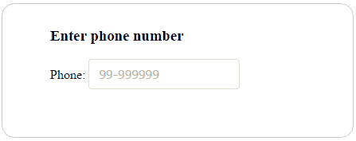

一旦输入获得焦点，掩码格式中的数字将替换为空白，其他字符将保留在初始阶段。掩码的默认占位符字符是下划线（`_`，因此它将为每个数字数字显示下划线字符。在每个`keyPress`事件之后，掩码字符（即`9`将被实际字符填充。如果提供的输入不完整或模糊，则会自动清除整个输入（默认情况下，`autoClear`为`true`。

在组件的 DOM 树中的事件发生期间，有时需要执行某些功能。`inputMask`组件支持在用户完成掩码模式时调用`onComplete`回调。例如，当掩码输入完成时，将通知用户，如下所示：


咆哮消息出现在页面顶部，带有关闭图标，允许我们在任何时间点删除粘性通知。


# 掩码格式选项


输入掩码必须使用[T0]属性。该组件不仅允许数字类型，还支持字母和字母数字字符，因此掩码格式可以是以下内置定义的组合：

*   `a`：字母字符（`A-Z,a-z`）
*   `9`：数字字符（`0-9`）
*   `*`：字母数字字符（`A-Z,a-z,0-9`）

让我们举一个例子，我们可以根据单选按钮选择不同的掩码选项来显示输入掩码，如下所示：

```ts
<div>
  <div id="phoneformat" *ngIf="format == 'Option1'">
    <span>Phone:</span>
    <p-inputMask mask="(999) 999-9999" [(ngModel)]="phone" 
      placeholder="(999) 999-9999" name="phone">
    </p-inputMask>
  </div>
  <div id="dateformat" *ngIf="format == 'Option2'">
    <span>Date:</span>
    <p-inputMask mask="99/99/9999" [(ngModel)]="date" 
      placeholder="99/99/9999" name="date">
    </p-inputMask>
  </div>
  <div id="serialformat" *ngIf="format == 'Option3'">
    <span>Serial Number:</span>
    <p-inputMask mask="a*-999-a999" [(ngModel)]="serial" 
      placeholder="a*-999-a999" name="serial">
    </p-inputMask>
  </div>
</div>

```

根据前面的示例，只有一个输入元素将显示定义的掩码。以下屏幕截图显示日期掩码格式的快照结果：


The `unmask` attribute can be used to control masked or unmasked output for the value bounded. For instance, it is useful if `ngModel` sets either a raw unmasked value or a formatted mask value to the component's bound value.


# 使用槽字符


如前所述，下划线（`_`是掩码中的默认活动占位符。但这可以使用`slotChar`属性进行定制，如下所示：

```ts
<p-inputMask mask="99/99/9999" [(ngModel)]="slot" placeholder="99/99/9999"
  slotChar="mm/dd/yyyy" name="slotchar"></p-inputMask>    

```

`slotChar`选项可以是单个字符或表达式。


# 使遮罩的一部分成为可选的


到目前为止，所有输入掩码的示例都表明掩码中的所有字符都是必需的。您还可以使用问号（`?`字符使遮罩的一部分可选。掩码定义中问号后面列出的任何内容都将被视为可选输入。一个常见的用例是显示带有可选分机号码的电话号码，如下所示：

```ts
<span>Phone Ext</span>
<p-inputMask mask="(999) 999-9999? x99999" [(ngModel)]="optional"     
  name="optionalmask" placeholder="(999) 999-9999? x99999">
</p-inputMask>

```

一旦用户通过到达问号字符完成输入并模糊组件，将跳过其余验证。也就是说，该部分的输入不会被擦除。例如，`(666) 234-5678`和`(666) 234-5678? x1230`等电话号码输入将是掩码可选情况下的有效输入。

The complete demo application with instructions is available on GitHub at
[https://github.com/ova2/angular-development-with-primeng/tree/master/chapter3/inputmask.](https://github.com/ova2/angular-development-with-primeng/tree/master/chapter3/inputmask)


# 具有自动完成功能的自动建议


AutoComplete 是一个输入组件，它在用户键入输入字段时提供实时建议。这使用户能够在键入时快速查找并从查找的值列表中进行选择，从而利用搜索和筛选功能。

AutoComplete 组件的基本用法包括`suggestions`属性，用于提供所有结果项的列表，以及`completeMethod`用于根据类型化查询过滤项。例如，以下自动完成组件显示基于用户查询的国家/地区列表：

```ts
<p-autoComplete [(ngModel)]="country" name="basic"
  [suggestions]="filteredCountries"
  (completeMethod)="filterCountries($event)"
  field="name" [size]="30"
  placeholder="Type your favourite Country" [minLength]="1">
</p-autoComplete>

```

在前面的示例中，`minLength="1"`用作查询结果输入的最小字符。这将呈现以下快照中所示的输出：


当用户在输入字段中键入时，complete 方法将根据需要过滤项目。该方法必须在组件类中定义，如下所示：

```ts
filterCountries(event: any) {
  let query = event.query;
  this.countryService.getCountries().
  subscribe((countries: Country[]) => {
    this.filteredCountries = this.filterCountry(query, countries);
  });
}

```

上述方法允许根据用户查询筛选国家列表。在这种情况下，它将过滤所有以[T0]字符开头的国家。

为了改善用户体验，AutoComplete 通过`dropdown`属性提供了一个下拉选项。单击下拉图标后，将立即在向下弹出窗口中填充所有可能的项目。


# 多选


使用 AutoComplete，还可以通过将`multiple`属性设置为`true`来选择多个值。通过多次选择，所选文本可以作为数组检索（例如，`countries`属性）。在这种情况下，`ngModel`应该引用一个数组。


# 处理对象


到目前为止，AutoComplete 已经在基本类型上显示了它的强大功能，但它也可以处理对象类型。传递给模型的值将是一个对象实例，但`field`属性定义了要显示为建议的标签。也就是说，在这种情况下，`field`属性用于将对象的任何属性显示为标签。以下示例显示了对象使用的威力：

```ts
<p-autoComplete id="instance" [(ngModel)]="countryInstance" name="instance"
  [suggestions]="filteredCountryInstances"
  (completeMethod)="filterCountryInstances($event)" field="name">
</p-autoComplete>

```

在上例中，`Country`对象用作模型对象实例，显示的建议来自使用`name`字段属性的国家/地区。


# 高级功能-自定义内容显示


在许多情况下，正常的野外种群数量是不够的；为获得更好的体验而定制内容会更强大。AutoComplete 使用`ng-template`提供此功能，它在“建议”面板中显示自定义内容。传递给`ng-template`的本地`template`变量是`suggestions`数组中的一个对象。带有国家名称和国旗的自定义自动完成示例如下：

```ts
<p-autoComplete [(ngModel)]="customCountry" name="template"
  [suggestions]="filteredCustomCountries"
  field="name" (completeMethod)="filterCustomCountries($event)" 
  [size]="30"  [minLength]="1" placeholder="Start your search">
  <ng-template let-country pTemplate="item">
    <div class="ui-helper-clearfix" class="template-border">
      
      <div class="country-text">{{country.name}}</div>
     </div>
  </ng-template>
</p-autoComplete>

```

对于可以显示的数据类型没有限制。以下屏幕截图显示了自定义国家/地区信息的快照结果：

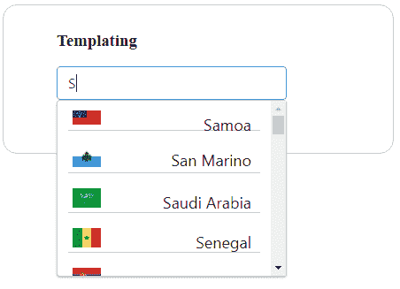

`item`模板用于自定义建议面板内的内容，其中`selectedItem`用于自定义多选中的选定项。

AutoComplete 组件支持此处提到的许多事件：

| **名称** | **参数** | **说明** |
| `completeMethod` | 

*   `event.originalEvent` ：浏览器事件
*   `event.query` ：使用

进行搜索的值 | 回拨至`invoke`寻求建议。 |
| `onFocus` | `event`：浏览器事件 | 自动完成获得焦点时回调到`invoke`。 |
| `onBlur` | `event`：浏览器事件 | 自动完成失去焦点时回调到`invoke`。 |
| `onSelect` | `value`：选择的值 | 选择建议时回拨至`invoke`。 |
| `onUnselect` | `value`：多模式下未选择的值 | 移除所选值时回调到`invoke`。 |
| `onDropdownClick` | 

*   `event.originalEvent` ：浏览器事件
*   `event.query` ：输入字段

的当前值 | 点击下拉按钮时回拨至`invoke`。 |
| `onClear` | `event`：浏览器事件 | 当`input`字段被清除时，回调到`invoke`。 |

The complete demo application with instructions is available on GitHub at
[https://github.com/ova2/angular-development-with-primeng/tree/master/chapter3/autocomplete.](https://github.com/ova2/angular-development-with-primeng/tree/master/chapter3/autocomplete)


# 使用芯片输入多个值


芯片组件用于将输入字段中的多个复杂实体表示为小块，如联系信息。芯片可能包含照片、标题、文本、规则、图标甚至联系人等实体。这对于以紧凑的方式表示信息非常有用。以下 Chips 组件的基本示例按顺序表示联系人名称。默认情况下，可以通过十字图标或退格键删除每个实体：

```ts
<p-chips [(ngModel)]="contactnames" name="basic"></p-chips>

```

以下屏幕截图显示了公司联系人姓名的快照结果，例如：

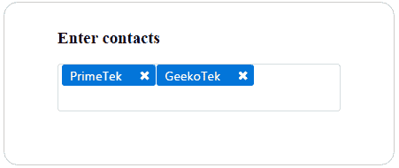

芯片组件支持两个名为`onAdd`和`onRemove`的事件回调。当分别从输入框中添加和删除芯片时，将调用这些事件回调。


# 使用模板显示复杂信息


使用`ng-template`元素定制芯片，其中值作为隐式变量传递。`ng-template`的内容包括普通文本、图标、图像和任何其他组件。请记住，定制芯片组件没有十字图标，也就是说，我们只能使用退格删除芯片条目。带有图标的芯片组件的定制示例如下：

```ts
<p-chips [(ngModel)]="complexcontacts" name="template">
  <ng-template let-item pTemplate="item">
    <i class="fa fa-address-card"></i>-{{item}}
  </ng-template>
</p-chips>

```

在前面的示例中，自定义内容显示为公司徽标和联系人姓名。以下屏幕截图显示了定制芯片示例的快照结果：


芯片的用户输入操作将使用`max`和`disabled`属性进行控制。可以使用`max`属性限制最大条目数。例如，如果我们设置了`max="5"`，它将不允许在输入中添加第六个条目。而`disabed="true"`进行禁用输入，限制芯片进入。

Priming 4.1 版本引入了用于定制输入的`inputStyle`和`inputStyleClass`属性，以及用于控制重复输入的`allowDuplicate`属性。

The complete demo application with instructions is available on GitHub at
[https://github.com/ova2/angular-development-with-primeng/tree/master/chapter3/chips.](https://github.com/ova2/angular-development-with-primeng/tree/master/chapter3/chips)


# 发现复选框-布尔、多和三态


复选框是具有蒙皮功能的标准复选框元素的扩展。该复选框既可以用作单个复选框以提供布尔值，也可以用于具有相同组名的多个复选框的多个选择中。


# 布尔复选框-单个选择


默认情况下，复选框启用多个选择，我们可以通过启用`binary`属性来进行单个选择。带有单个选择的复选框的基本示例如下：

```ts
<p-checkbox name="single" [(ngModel)]="checked" binary="true">
</p-checkbox>

```

在前面的示例中，布尔复选框用于了解角度框架的兴趣。组件将显示如下屏幕截图所示：

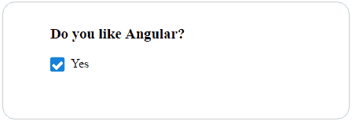

通过在模型中启用布尔属性，也可以预选复选框。


# 复选框多选


如前所述，默认情况下，多个复选框控件具有相同的组名，从而启用多个选择。在这种情况下，`model`属性绑定到一个数组以保存选定的值。通过将各个复选框值指定给选定值，复选框组将显示预选。用于选择不同常用角度版本的多个复选框选择如下：

```ts
<div class="ui-g" class="multicheckbox-width">
  <div class="ui-g-12"><p-checkbox name="angulargroup"  
    value="AngularJS1.0" label="AngularJS V1.0"
    [(ngModel)]="selectedVersions"></p-checkbox>
  </div>
  <div class="ui-g-12"><p-checkbox name="angulargroup" 
    value="AngularV2.0" label="Angular V2.0"
    [(ngModel)]="selectedVersions"></p-checkbox>
  </div>
  <div class="ui-g-12"><p-checkbox name="angulargroup" 
    value="AngularV4.0" label="Angular V4.0"
    [(ngModel)]="selectedVersions"></p-checkbox>
  </div>
</div>

```

复选框组将显示默认选择，如以下屏幕截图所示：


要通知复选框选择，有一个名为`onChange`的事件回调将在用户操作时调用。同时，通过`disabled`属性禁用用户操作。


# 多状态表示-三状态复选框


预处理超出了 web 上“真/假”选择的正常复选框行为。在某些情况下，需要“真/假/空”组合，尤其是用于表示任何实体的状态。记住，`model`属性被分配给任何类型，而不是`boolean`类型。用于输入角度 4 反馈的三态复选框的基本示例如下：

```ts
<p-triStateCheckbox name="tristate" [(ngModel)]="status">
</p-triStateCheckbox>

```

TriStateCheckbox 将显示三种不同的状态（优秀、良好和糟糕），如以下屏幕截图所示：

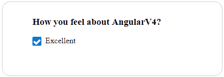

此增强复选框还为任何用户交互提供`onChange`事件回调。用户操作通过`disabled`属性被禁用，就像普通布尔复选框一样。

The complete demo application with instructions is available on GitHub at
[https://github.com/ova2/angular-development-with-primeng/tree/master/chapter3/checkbox.](https://github.com/ova2/angular-development-with-primeng/tree/master/chapter3/checkbox)


# 选择具有单选和多选组件的项目


下拉菜单提供了从可用选项集合中选择项目的方法。要列出所有可能的选项，我们应该使用定义标签值属性的`SelectItem`接口，该列表将绑定到`options`属性。所选项目的双向绑定通过`model`属性定义。让我们在下拉列表中显示国家列表，供用户输入。带有选项列表的下拉列表的基本示例如下：

```ts
<p-dropdown [options]="countries" [(ngModel)]="selectedCountry"
  [styleClass]="dropdown-width" placeholder="Select a Country">
</p-dropdown>

```

下拉列表将显示选项，如以下屏幕截图所示：


下拉组件提供三个事件回调，例如`onChange`、`onFocus`和`onBlur`。当下拉值改变时，它分别获得焦点和释放焦点。有一项规定可以像使用`editable`属性（即`editable="true"`的任何其他输入组件一样直接编辑输入。

The width and height of the dropdown's viewport will be controlled through the `autoWidth` and `scrollHeight` properties. By default, the width of the dropdown is calculated based on the options width. Whereas, the scroll height is controlled through the `scrollHeight` option in pixels, the scrollbar is defined if the height of the list exceeds this value.


# 自定义下拉列表


通过自定义内容，下拉组件比项目的默认标签文本更强大。`filter`属性用于通过覆盖中的输入过滤所有可能的选项。一个自定义的下拉列表示例，其中包含代表国家名称和国旗图像的选项列表，如下所示：

```ts
<p-dropdown [options]="countries" [(ngModel)]="selectedCountry"  
  [styleClass]="dropdown-width" filter="filter">
  <ng-template let-country pTemplate="item">
    <div class="ui-helper-clearfix" class="template-border">
      
      <div class="country-text">{{country.name}}</div>
    </div>
  </ng-template>
</p-dropdown>

```

下拉列表将显示自定义内容和筛选，如以下屏幕截图所示：

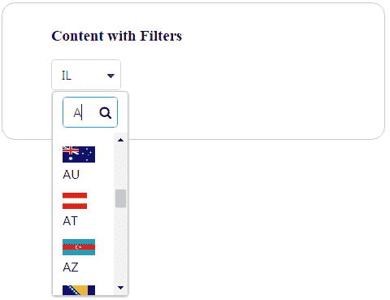

不是向下滚动查看所有国家的列表，而是在顶部有一个筛选输入选项，可以按国家名称的起始字母筛选国家名称。它还支持使用逗号分隔的值（例如，`filterBy="label, value.name"`）进行多属性筛选。默认情况下，根据`SelectItem`API 的标签进行筛选。


# 多选下拉列表


MultiSelect 组件用于从集合中选择多个项目，与下拉组件不同，下拉组件提供单个项目选择。具有国家列表的多选组件的基本示例如下：

```ts
<p-multiSelect [options]="countries" [(ngModel)]="selectedCountries">
</p-multiSelect>

```

选项列表可通过`SelectItem`接口的集合获得，该接口采用标签值对。选项列表通过 MultiSelect 组件的`options`属性绑定。MultiSelect 将与国家/地区列表一起显示，如以下屏幕截图所示：

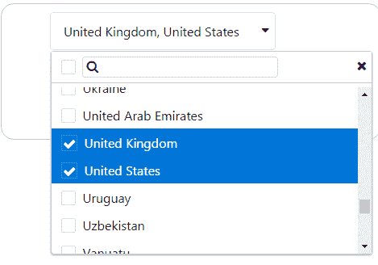

在这种情况下，用户可以使用复选框选项（可用于每个项目）选择多个国家，并过滤输入以选择特定选项。

The complete demo application with instructions is available on GitHub at
[https://github.com/ova2/angular-development-with-primeng/tree/master/chapter3/select.](https://github.com/ova2/angular-development-with-primeng/tree/master/chapter3/select)


# 基本和高级日历场景


日历是一个输入组件，它以不同的自定义方式选择日期输入，例如内联、本地化、受限于特定日期和面向时间。在这种情况下，日历模型由日期类型属性支持。基本日期选择的最简单组件声明如下：

```ts
<p-calendar [(ngModel)]="basicDateInput" name="basic"></p-calendar>

```

这将显示一个输入文本框，单击该框将打开一个弹出的日期选择对话框，如下所示：


除了基本的日期选择外，还提供了在顶部的左右箭头控件的帮助下导航每年的每个月的功能。这将在“高级功能”一节中解释。

日期选择很简单，可以通过单击弹出对话框中的特定日期来完成。默认情况下，日历显示在弹出窗口中，但可以使用`inline`属性更改此行为。日历显示的内联版本如下所示：


为了获得更好的用户体验，组件还提供了一个选项，通过`showIcon`属性显示日历弹出窗口。与图标按钮一起使用的日历输入示例如下所示：

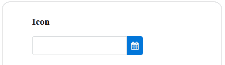

带有`icon`属性的日历组件的可视显示将更改输入旁边显示的默认图标。


# 本地化


通过将本地设置对象绑定到`locale`属性，可以定义不同语言和格式的本地化。默认本地值为`English`。为了表示不同的语言环境，我们应该提供相应的语言文本标签。例如，德国地区应为德国日历提供以下标签：

```ts
this.de = {
  firstDayOfWeek: 1,
  dayNames: ['Sonntag', 'Montag', 'Dienstag', 'Mittwoch', 'Donnerstag',  
             'Freitag', 'Samstag'],
  dayNamesShort: ['Son', 'Mon', 'Die', 'Mit', 'Don', 'Fre', 'Sam'],
  dayNamesMin: ['S', 'M', 'D', 'M ', 'D', 'F ', 'S'],
  monthNames: [
    'Januar', 'Februar', 'März', 'April', 'Mai', 'Juni', 'Juli',
    'August', 'September', 'Oktober', 'November', 'Dezember'
  ],
  monthNamesShort: ['Jan', 'Feb', 'Mär', 'Apr', 'Mai', 'Jun', 'Jul',
                    'Aug', 'Sep', 'Okt', 'Nov', 'Dez']
};

```

带有德语区域设置标签的日历将显示如下：

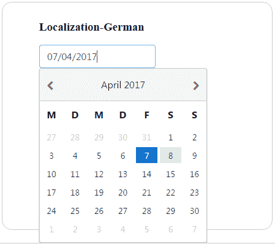

如前所示，特定于语言环境的标签需要在支持组件中格式化为 JSON，以显示特定于语言环境的日历。


# 时间选择器选项


除了选择标准日历日期外，我们还可以使用`showTime`和`hourFormat`显示时间。这可以进一步限制为仅使用`timeOnly`属性显示时间，该属性只是一个时间选择器。例如，`timeOnly`选项将显示时间选择器，如下所示：

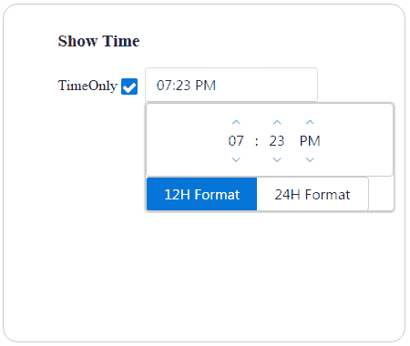

两种时间格式（12 小时格式和 24 小时格式）将使用两个选项的拆分按钮一次显示一种。请注意，在这种情况下启用了[T0]属性。


# 高级功能


日历组件的高级功能，例如日期格式（使用`dateFormat`属性）、限制日期（使用`min`和`max`日期）、便于访问的月份和年份导航器（使用`monthNavigator`、`yearNavigator`和`yearRange`属性）、只读输入（使用`readOnlyInput`属性）和有用事件，例如`onSelect`、`onFocus`、`onClear`和`onBlur`：

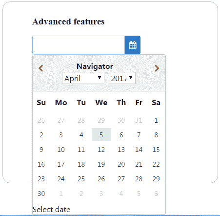

前面的快照描述了一个日历，该日历可以与其功能的任何可能组合一起使用。

The complete demo application with instructions is available on GitHub at
[https://github.com/ova2/angular-development-with-primeng/tree/master/chapter3/calendar.](https://github.com/ova2/angular-development-with-primeng/tree/master/chapter3/calendar)


# 微调器和滑块–提供输入的不同方式


输入组件微调器通过使用控件或按钮的增量和减量提供数字输入。但是，仍然有一个选项可以正常使用它。微调器的基本示例如下所示：

```ts
<p-spinner name="basic" size="30" [(ngModel)]="basicinput"></p-spinner>

```

微调器将与按钮控件一起显示，如以下屏幕截图所示：

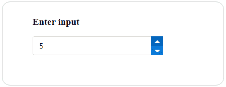

如快照所示，可以使用微调器控件连续修改该值。与任何其他输入组件一样，Spinner 支持`onChange`事件回调，该回调将在值更改时调用。允许的最大字符数可以通过`maxlength`属性进行控制。用户交互将通过`readonly`和`disabled`属性进行限制。


# 高级功能-超越基本用途


微调器组件提供的功能不仅仅是增量和减量控件。可以提供`min`和`max`属性的值边界、使用`step`属性的自定义步长因子（默认步长因子为`1`）以及`decimalSeparator`和`thousandSeparator`等数字分隔符等功能。微调器的自定义示例如下所示：

```ts
<p-spinner name="minmax" size="40" [(ngModel)]="customizedinput" [min]="0" [max]="100" [step]="0.50"
  placeholder="Enter your input or use spinner controls"></p-spinner>

```

微调器将与按钮控件一起显示，如以下屏幕截图所示：


一旦用户输入达到`min`和`max`限制，控制或输入都无法更改该值。

The format of the input can be customized using the `formatInput` attribute.


# 滑块


滑块组件使用户能够通过使用滑块或拖动控制柄来输入值。`model`属性绑定到一个数字类型，该类型保存输入值。通过为两者提供相同的模型值，可以将输入附加到滑块。滑块的基本示例如下所示：

```ts
<p-slider [(ngModel)]="basicinput" name="basicinput"  
  styleClass="slider-width">
</p-slider>

```

滑块将显示一个拖动手柄，如以下屏幕截图所示：

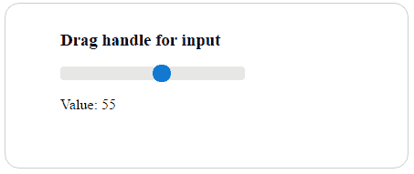

每次将控制柄拖动到条上时，输出值都将更新。


# 高级功能-超越基本用途


滑块组件可以以类似于带输入边界的微调器的方式进一步定制，使用`min`和`max`属性或`range`属性同时提及这两个边界，使用`step`属性和`animate`属性定制步长因子（默认步长因子为`1`）属性在单击滑块时提供动画。

The default orientation of the Slider input is horizontal. The direction or orientation of the Slider can be changed to vertical using the `orientation` property.

有时，将常规输入与滑块控制柄一起使用是很好的，因为它使您可以灵活地直接输入，还可以通过拖动滑块控制柄来显示输出。滑块的自定义示例如下所示：

```ts
<input type="text" pInputText name="customizedinput"   
  [(ngModel)]="customizedinput"
  styleClass="input-width"/>
<p-slider [(ngModel)]="customizedinput" name="customizedinput"   
  styleClass="slider-width" [step]="20"
  [animate]="true" (onChange)="onChange()" (onSlideEnd)="onSlideEnd()">
</p-slider>

```

滑块将显示自定义功能，如以下屏幕截图所示：

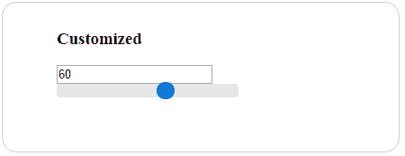

滑块输入和滑块控制柄条值相互依赖。例如，更改一个值将反映另一个值。

The complete demo application with instructions is available on GitHub:

*   [https://github.com/ova2/angular-development-with-primeng/tree/master/chapter3/spinner](https://github.com/ova2/angular-development-with-primeng/tree/master/chapter3/spinner)
*   [https://github.com/ova2/angular-development-with-primeng/tree/master/chapter3/slider](https://github.com/ova2/angular-development-with-primeng/tree/master/chapter3/slider)


# 使用富编辑器进行文本编辑


编辑器是基于羽毛笔编辑器的富文本编辑器（WYSIWYG）。它包含一个带有常用选项的默认工具栏，可以使用 header 元素自定义其控件。最新版本的 Quill 1.0 用作此项的依赖项。带有默认工具栏的基本文本编辑器可以表示为：

```ts
<p-editor name="basic" [(ngModel)]="basictext" 
  styleClass="editor-dimensions">
</p-editor>

```

具有常用选项的文本编辑器如下所示：

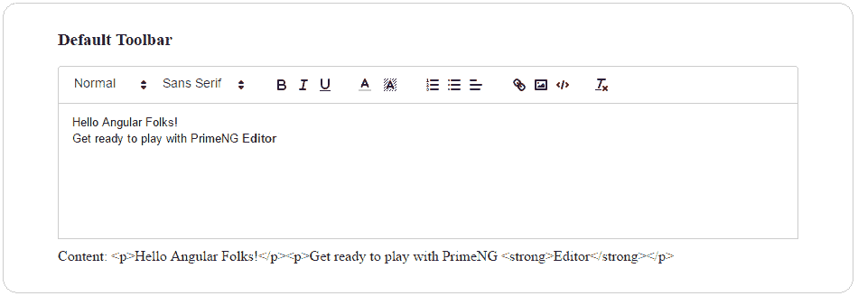

1\. Add the Quill 1.0 dependency in `package.json` and install it, or use the CLI tool to install it (`npm install quill --save`).
2\. Also add the Quill script and style URLs in the entry page:
`<script src="https://cdn.quilljs.com/
1.0.0-beta.3/quill.min.js"></script>`
`<link rel="stylesheet" type="text/css"
href="https://cdn.quilljs.com/1.0.0-
beta.3/quill.snow.css">`

编辑器支持`onTextChange`和`onSelectionChange`事件，分别在编辑器的文本更改和编辑器的选定文本更改时调用。


# 自定义编辑器


如前所述，编辑器提供了一个带有常用选项的默认工具栏。可以通过在 header 元素中定义元素来自定义工具栏。例如，使用文本样式控件创建的自定义工具栏如下所示：

```ts
<p-editor name="custom" [(ngModel)]="customtext" 
  styleClass="editor-dimensions">
  <p-header>
    <span class="ql-formats">
      <button class="ql-bold"></button>
      <button class="ql-italic"></button>
      <button class="ql-underline"></button>
      <button class="ql-clean"></button>
    </span>
  </p-header>
</p-editor>

```

带有自定义工具栏的文本编辑器将显示如下：


可以通过不同的方式使用任意数量的工具栏控件自定义工具栏。有关所有可用的控制装置，请参阅纬管文档。

The complete demo application with instructions is available on GitHub at
[https://github.com/ova2/angular-development-with-primeng/tree/master/chapter3/editor.](https://github.com/ova2/angular-development-with-primeng/tree/master/chapter3/editor)


# 密码和星型评级输入


密码是一种增强型输入，具有安全的字符输入，与 web 上的任何其他密码字段一样，但它提供强度指示器（弱、中、强），指示用户输入的安全强度。用户密码的基本示例如下所示：

```ts
<input pPassword name="basic" type="password" />

```

以下屏幕截图显示了基本密码示例的快照结果：


密码通过附加`pPassword`指令应用于输入字段。`ngModel`属性用于绑定密码值。

默认情况下，“密码”将显示提示和强度指示器标签。可以通过`promptLabel`、`weakLabel`、`mediumLabel`和`strongLabel`等属性定制所有强度指标标签。这将有助于根据需要本地化密码输入。默认情况下，`feedback`属性为`true`。一旦在输入中获得焦点或关键点笔划，指示器标签就会出现。但通过将反馈设置为`false`，可以改变此行为，从而抑制输入的指示。


# 额定输入


评级组件提供了基于星级的评级，可以选择和取消。该组成部分的基本声明如下：

```ts
<p-rating name="basic" [(ngModel)]="angular" ></p-rating>

```

在这里，额定有界值应该是数字类型。角度额定值的默认视觉效果如以下屏幕截图所示：

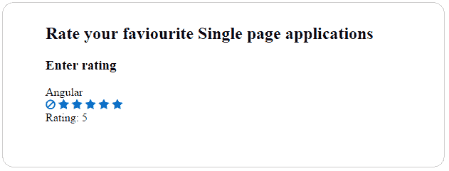

`star`属性有助于提供评级中的星星数。star 的默认值为`5`。

选择和取消评级的行为可以更加互动，您可以通过`onRate`和`onCancel`回调获得通知。在前面的快照中，可以使用左侧的取消图标清除额定值。这是因为在默认情况下，`cancel`属性将被启用。如果该属性被禁用，则一旦选择该属性，就不可能取消评级。通过禁用`cancel`属性，评级快照将不带图标显示，如下所示：

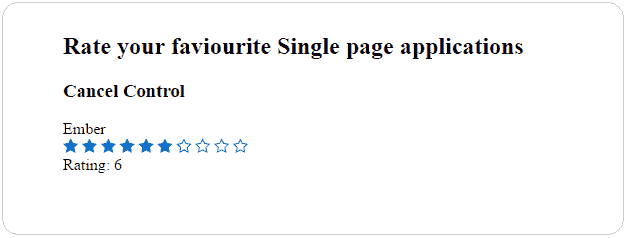

由于此功能，取消按钮将不会出现以取消给定的评级。一次只能取消选择一颗星。

Currently, the Rating component doesn't support half or quarter values.

通过在评级组件上启用`readonly`和`disabled`属性，无法选择或取消它。这仅用于显示目的。

The complete demo application with instructions is available on GitHub:

*   [https://github.com/ova2/angular-development-with-primeng/tree/master/chapter3/password](https://github.com/ova2/angular-development-with-primeng/tree/master/chapter3/password) [](https://github.com/ova2/angular-development-with-primeng/tree/master/chapter3/password) 
*   [https://github.com/ova2/angular-development-with-primeng/tree/master/chapter3/rating](https://github.com/ova2/angular-development-with-primeng/tree/master/chapter3/rating)


# 使用输入和选择组件进行验证


Angular 在我们的应用程序中提供了三种不同的建筑形式：

*   **模板驱动方法**：这种方法允许我们构建表单，只需要很少甚至不需要应用程序代码
*   **使用低级 API 的模型驱动（或反应式）方法**：在这种方法中，我们创建的表单是可测试的，不需要 DOM
*   **模型由一个更高级别的 API**驱动：这种方法使用一个名为`FormBuilder`的更高级别的 API。

PrimeNG 使用模型驱动的表单支持创建了大多数输入和选择组件。因此，所有输入和选择组件都符合验证条件。

让我们以一个注册表单为例，该表单具有[T0]、[T1]、[T2]、[T3]、[T4]和[T5]字段，并具有验证支持。Priming 组件由带有`FormBuilder`的模型驱动 API 支持，该 API 将所有表单控件分组以创建注册表单，如下所示：

```ts
this.registrationform = this.formBuilder.group({
    'firstname': new FormControl('', Validators.required),
    'lastname': new FormControl('', Validators.required),
    'password': new FormControl('',   
      Validators.compose([Validators.required, 
      Validators.minLength(8)])),
    'address': new FormControl(''),
    'phone': new FormControl(''),
    'gender': new FormControl('', Validators.required)
});

```

然而，HTML 包含与注册表绑定的`form`元素。表单将包装控制和验证条件列表，以显示消息：

```ts
<form [formGroup]="registrationform" (ngSubmit)="onSubmit(registrationform.value)">
  ...
</form>

```

输入无效的注册表将产生错误消息，如以下快照所示：

**

Priming 组件通过模板驱动的表单以及模型驱动的表单提供验证。在需要提供什么样的验证方面，为用户提供了灵活性。

The complete demo application with instructions is available on GitHub at
[https://github.com/ova2/angular-development-with-primeng/tree/master/chapter3/validation.](https://github.com/ova2/angular-development-with-primeng/tree/master/chapter3/validation)


# 总结


在本章末尾，您将能够无缝地使用所有可用的输入，并为任何给定的用例选择组件。最初，我们讨论了各种输入组件。首先，我们使用 InputMask 格式化输入，使用 AutoComplete 自动提示，并使用芯片组件输入多个值。

之后，我们讨论了各种复选框组件，例如布尔复选框、许多复选框和三态复选框变体。稍后，我们讨论了常用的选择组件，例如单选组件和多选组件。特定于用例的特殊输入组件，如日历日期输入、滑块、微调器、密码、星形和使用我们介绍的富编辑器进行的文本编辑，以及所有可能的功能。最后，我们在本章结束时通过查看输入和选择组件的验证。所有这些组件和所有可能的功能都以逐步的方式进行了解释。

在下一章中，您将看到各种按钮和面板组件将如何使您的生活更轻松。