# 五、数据迭代组件


在本章中，我们将介绍使用 PrimeNG 提供的数据迭代组件可视化数据的基本和高级功能，这些组件包括 DataTable、DataList、PickList、OrderList、DataGrid、DataScroller、Tree 和 TreeTable。我们将从 DataTable 组件开始，它提供了广泛的功能，如过滤、排序、分页、选择、重新排序、列大小调整、切换等。然后，我们将重点讨论各种其他组件，例如 DataList，它们以列出的格式呈现数据，并通过列出的集合（例如 PickList 和 OrderList）提供数据选择。

之后，我们还将看到另外两个数据变体组件，如 DataGrid，它在面向网格的布局中排列大型数据集，DataScroller 根据用户完成的页面滚动惰性地加载数据。Tree 和 TreeTable 组件以树格式列出数据，它们大多基于相同的数据模型。在本章的最后，我们将讨论一个名为 Schedule 的复杂组件来可视化日历数据，并将通过其延迟加载特性演示其用法。

在本章中，我们将介绍以下主题：

*   多特征数据表
*   选择数据表中的行
*   对数据表中的数据进行排序、筛选和分页
*   使用模板自定义单元格内容
*   调整 DataTable 中列的大小、重新排序和切换
*   使用数据表进行单元内编辑
*   使数据表具有响应性
*   使用列和行分组
*   使用惰性 DataTable 处理大量数据
*   通过提供行模板进行行扩展
*   以 CSV 格式导出数据
*   数据表事件和方法
*   用 DataList 列出数据
*   使用 PickList 列出数据
*   使用 OrderList 列出数据
*   使用 DataGrid 对数据进行网格组织
*   使用 DataScroller 按需加载数据
*   用树可视化数据
*   用 TreeTable 可视化数据
*   按计划管理活动


# 多特征数据表


DataTable 以表格格式显示数据。表是按行和列排列的数据，也可能是更复杂的结构。它需要一个值作为通过`value`属性和`p-column`组件定义的列绑定的对象数组。具有以列表格式显示的浏览器详细信息的组件的基本示例如下所示：

```ts
<p-dataTable [value]="browsers">
  <p-column field="engine" header="Engine"></p-column>
  <p-column field="browser" header="Browser"></p-column>
  <p-column field="platform" header="Platform"></p-column>
  <p-column field="grade" header="Grade"></p-column>
</p-dataTable>

```

`browsers`数组由具有`engine`、`browser`、`platform`和`grade`属性的对象组成。`field`属性将映射模型对象属性，而`header`属性用于显示列的标题。在实时应用中，我们使用服务从远程数据源获取数据。在本例中，服务被创建为可注入服务，并使用 HTTP 模块获取数据。浏览器服务将定义为可观察的，如下所示：

```ts
@Injectable()
export class BrowserService {

constructor(private http: Http) { }

getBrowsers(): Observable<Browser[]> {
  return this.http.get('/img/data/browsers.json')
    .map(response => response.json().data as Browser[]);
  }
}

```

component 类必须为`value`属性定义一个`browser`对象（或项）数组。从远程服务调用中检索项目，如下所示：

```ts
browsers: Browser[];

constructor(private browserService: BrowserService) { }

ngOnInit() {
  this.browserService.getBrowsers().subscribe((browsers: any) 
    => this.browsers =  browsers);
}

```

以下屏幕截图显示了以表格格式显示的快照结果：

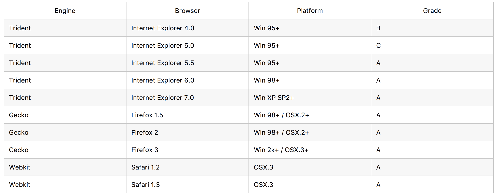

在前面的快照中，我们可以观察行的可选颜色。这是一种特定于主题的行为。

Priming 4.1 以更灵活的方式处理更改检测功能。


# 变化检测


DataTable 使用基于 setter 的检查或**ngDoCheck**来实现基础数据是否已更改以更新**用户界面**（**UI**）。这是使用`immutable`属性配置的。如果启用（默认），则会使用基于 setter 的检测，因此数据更改（如添加或删除记录）应始终创建新的数组引用，而不是操作现有数组。此约束是由角度约束引起的，如果参考未更改，则不会触发设置器。在这种情况下，移除项目时使用切片而不是拼接，或者添加项目时使用扩展运算符而不是`push`方法。

另一方面，将`immutable`属性设置为`false`可以消除使用带有 IterableDiffers 的 ngDoCheck 侦听更改的限制，而无需创建新的数据引用。基于 setter 的方法速度更快；但是，这两种方法都可以根据您的喜好使用。


# 动态列


在前面的用例中，使用`p-column`标记在静态表示中定义列。还有另一种方法可以通过动态列来表示数据表中的列。表列需要实例化为数组。数组将使用`ngFor`指令进行迭代，如下所示：

```ts
<p-dataTable [value]="basicBrowsers">
  <p-header>
    <div class="algin-left">
      <p-multiSelect [options]="columnOptions" [(ngModel)]="cols">
      </p-multiSelect>
    </div>
  </p-header>
  <p-column *ngFor="let col of cols" [field]="col.field" [header]="col.header"></p-column>
</p-dataTable>

```

`cols`属性描述组件类中给定的列选项：

```ts
this.cols = [
  {field: 'engine', header: 'Engine'},
  {field: 'browser', header: 'Browser'},
  {field: 'platform', header: 'Platform'},
  {field: 'grade', header: 'Grade'}
];

```

以下屏幕截图以表格格式显示动态列的快照结果作为示例：

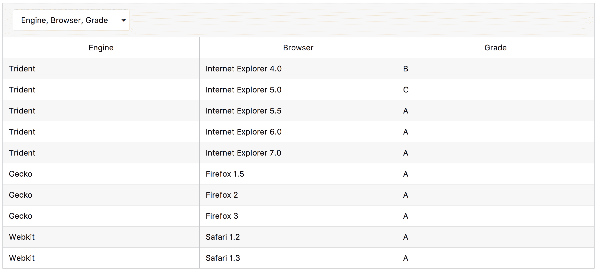

在前面的快照中，使用 multiselect 下拉菜单动态添加或删除列。出于演示目的，我们从表中删除了 Version 列字段。


# 选择数据表中的行


为了对组件执行 CRUD 操作，需要选择表行。Priming 支持各种类型的选择，例如具有不同事件回调的单个、多个、单选和复选框。


# 单选


在单选中，通过单击特定行上的事件选择该行。通过将`selectionMode`设置为`single`和`selection`属性来保存所选行，可以启用此选择。默认情况下，通过元键*（Windows 为 Ctrl*键或 macOS 为*命令*键）取消选中该行。只需禁用`metaKeySelection`属性，无需按 Meta 键即可取消选中该行。

具有单个选择功能以选择特定浏览器记录的组件将编写如下：

```ts
<p-dataTable [value]="basicBrowsers" selectionMode="single"  
  [(selection)]="selectedBrowser">
  // Content goes here
</p-dataTable>

```

component 类必须定义`selectedBrower`对象来存储所选项目。以下屏幕截图以单个选择显示快照结果为例：

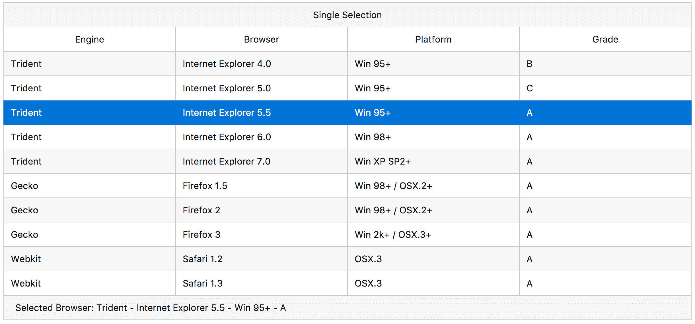

为了通知单个选择是否有效，我们在页脚部分显示所选记录信息。页脚数据应始终与所选记录同步。


# 多选


在多选中，通过特定行上的单击事件选择该行，并且可以使用 Meta 键或*Shift*键选择多行。通过将`selectionMode`设置为`multiple`并将`selection`属性设置为以数组的形式保存所选行，可以启用此选择。默认情况下，通过元键*（Windows 为 Ctrl*键或 macOS 为*命令*键）取消选中该行。通过禁用`metaKeySelection`属性，无需 Meta key 帮助即可取消选中该行。

具有多选功能以选择多个浏览器记录的组件将编写如下：

```ts
<p-dataTable [value]="basicBrowsers" selectionMode="multiple" 
  [(selection)]="selectedBrowsers">
  // Content goes here
</p-dataTable>

```

组件类必须定义`selectedBrowers`数组对象来存储所选记录。以下屏幕截图显示了具有多个选择的快照结果作为示例：

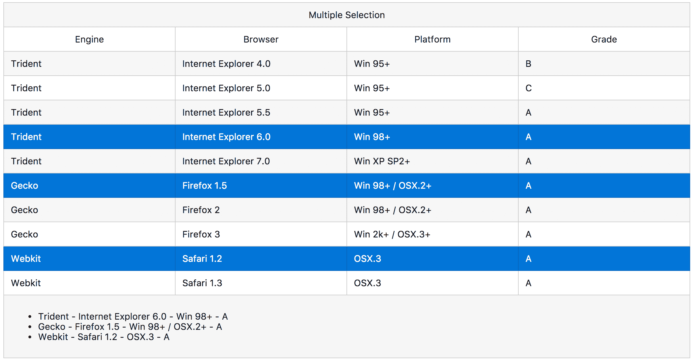

为了通知多个选择是否有效，我们在页脚部分显示了所选记录信息。页脚数据应始终与所选记录同步。

单选和多选都支持四个事件回调，`onRowClick`、`onRowDblClick`、`onRowSelect`和`onRowUnselect`，它们在事件对象中携带所选的数据信息。有关更多详细信息，请参阅事件部分。


# 单选按钮选择


可以通过单选按钮实现单个选择，单选按钮位于每行上，而不是使用特定行上的单击事件。通过在列级别上将`selectionMode`设置为`single`（请记住，前面提到的普通选择在表级别上工作）和`selection`属性来将所选行作为对象保存，从而启用选择。

具有单选功能以选择特定浏览器记录的组件将编写如下：

```ts
<p-dataTable [value]="basicBrowsers" [(selection)]="selectedBrowser">
  <p-header> RadioButton selection (Single Selection)</p-header>
  <p-column [style]="{'width':'38px'}" selectionMode="single">
  </p-column>
  //Content goes here
</p-dataTable>

```

以下屏幕截图以单选按钮选择为例显示快照结果：


到目前为止，单选按钮选择没有未选择的功能（即，一旦选择另一行，该行将被取消选择）。


# 复选框选择


多选可以通过复选框实现，复选框存在于每一行上，而不是在特定行上使用单击事件。通过在列级别将`selectionMode`设置为`multiple`（请记住，普通选择在表级别提供此功能）和`selection`属性来启用选择，以将所选行作为对象数组保存。

具有复选框选择功能以选择多个浏览器记录的组件将编写如下：

```ts
<p-dataTable [value]="basicBrowsers" [(selection)]="selectedBrowser">
  <p-header> Multiple Selection </p-header>
  <p-column [style]="{'width':'38px'}" selectionMode="multiple">
  </p-column>
  //Content goes here
</p-dataTable>

```

以下屏幕截图以选中复选框为例显示快照结果：


在此选择中，可以通过取消选中复选框取消选中所选记录。在切换标题复选框时，复选框选择支持`onHeaderCheckboxToggle`事件。有关更多详细信息，请参阅事件部分。

When selection is enabled, use the `dataKey` attribute to avoid deep checking when comparing objects. If you cannot provide `dataKey`, use the `compareSelectionBy` property as "equals," which uses a reference for comparison instead of the default "deepEquals" comparison. The deepEquals comparison is not a good idea (especially for huge data) in terms of performance because it checks all the properties.

For example, the value of the `browserId` property could be chosen for `dataKey` as follows:
`<p-dataTable dataKey="browserId" selection="true">
...
</p-dataTable>`


# 对数据表中的数据进行排序、筛选和分页


排序、筛选和分页功能对于任何类型的数据迭代组件都是非常关键的功能。在处理大型数据集时，这些特性将非常有用。


# 分类


通过在每列上启用`sortable`属性来提供排序功能。默认情况下，组件支持单个排序（`sortMode="single"`）。我们可以通过设置`sortMode="multiple"`来实现多重排序。具有排序功能的 DataTable 组件可以按升序或降序对浏览器记录进行排序，其编写方式如下：

```ts
<p-dataTable [value]="browsers" (onSort)="onSort($event)">
  <p-column field="engine" header="Engine" [sortable]="true">
  </p-column>
  <p-column field="browser" header="Browser" [sortable]="true">
  </p-column>
  <p-column field="platform" header="Platform" [sortable]="true">
  </p-column>
  <p-column field="grade" header="Grade" [sortable]="true">
  </p-column>
</p-dataTable>

```

以下屏幕截图显示了一个快照结果，例如，对有限数量的记录进行单一排序：

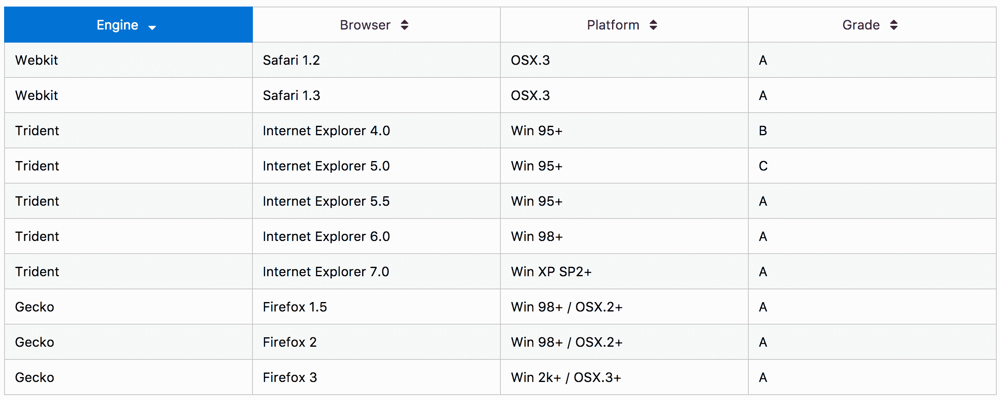

我们需要使用元键*（Windows 为 Ctrl*、macOS 为*命令*键）来实现多列排序功能。也支持使用`sortFunction`函数进行自定义排序，而不是对`field`属性进行常规排序。排序功能还提供了`onSort`事件回调，该回调将在对列进行排序时调用。有关更多信息，请参阅事件详细信息部分。


# 过滤


过滤功能是通过在每个列上启用`filter`属性来提供的。该过滤器也可以应用于列级和整个表级。表级过滤也称为**全局过滤**。要启用全局筛选，需要在`globalFilter`属性中引用输入的本地模板变量。将监听全局过滤器输入的`keyup`事件进行过滤。

过滤器功能支持可选的过滤器属性，如`filterMatchMode`，以提供不同类型的文本搜索。它有五种过滤匹配模式，如`startsWith`、`contains`、`endsWith`、`equals`、`in`，默认匹配模式为`startsWith`，而`filterPlaceholder`属性用于显示助手占位符文本。对表列具有过滤功能的 DataTable 组件将编写如下：

```ts
<div class="ui-widget-header align-globalfilter">
  <i class="fa fa-search search-globalfilter"></i>
  <input #gb type="text" pInputText size="50" 
  placeholder="Global Filter">
</div>
<p-dataTable [value]="browsers" [rows]="10" [paginator]="true"   
  [globalFilter]="gb" #datatable (onFilter)="onFilter($event)">
  <p-header>List of Browsers</p-header>
  <p-column field="browser" header="Browser (contains)" [filter]="true" 
    [filterMatchMode]="contains" filterPlaceholder="Search"></p-column>
  <p-column field="platform" header="Platform (startsWith)" 
    [filter]="true"
    filterPlaceholder="Search"></p-column>
  <p-column field="rating" header="Rating ({{browserFilter||'No 
    Filter'}}" 
    [filter]="true" filterMatchMode="equals" [style]="
    {'overflow':'visible'}">
    <ng-template pTemplate="filter" let-col>
      <i class="fa fa-close"
        (click)="ratingFilter=null; 
        datatable.filter(null,col.field,col.filterMatchMode)"></i>
      <p-slider [styleClass]="'slider-layout'"
        [(ngModel)]="ratingFilter" [min]="1" [max]="10"
        (onSlideEnd)="datatable.filter
        ($event.value,col.field,col.filterMatchMode)">
      </p-slider>
    </ng-template>
  </p-column>
  <p-column field="engine" header="Engine (Custom)" [filter]="true"
    filterMatchMode="equals" [style]="{'overflow':'visible'}">
    <ng-template pTemplate="filter" let-col>
      <p-dropdown [options]="engines" [style]="{'width':'100%'}"
        (onChange)="datatable.filter($event.value,col.field,
        col.filterMatchMode)" styleClass="ui-column-filter">
      </p-dropdown>
    </ng-template>
  </p-column>
  <p-column field="grade" header="Grade (Custom)" [filter]="true"
    filterMatchMode="in" [style]="{'overflow':'visible'}">
    <ng-template pTemplate="filter" let-col>
      <p-multiSelect [options]="grades" defaultLabel="All grades"
        (onChange)="datatable.filter($event.value,col.field,
        col.filterMatchMode)" styleClass="ui-column-filter">
      </p-multiSelect>
    </ng-template>
  </p-column>
</p-dataTable>

```

过滤功能通常应用于普通输入组件，但也可以通过在各种其他输入（如微调器、滑块、下拉菜单和多选组件）上提供过滤器来自定义此行为。自定义输入过滤器使用三个参数调用`filter`函数。`filter`函数的签名将写如下：

```ts
datatable.filter($event.value, col.field, col.filterMatchMode)

```

以下屏幕截图显示了一个快照结果，例如，在有限数量的记录上具有过滤功能：


在前面的快照中，我们可以看到数据通过评级滑块和多选等级字段进行过滤。过滤功能还提供了`onFilter`事件回调，该回调将在过滤输入时调用。有关更多信息，请参阅事件详细信息部分。


# 标页码


如果该表有巨大的数据集作为后盾，那么在一个页面上显示所有数据看起来很尴尬，而且当用户滚动数百万条记录时，这将是一场噩梦。DataTable 组件仅通过启用`paginator`属性和`rows`选项来显示页面中的记录数，就支持分页功能。

除了上述必需功能外，它还支持各种可选功能，例如：

*   `pageLinks`属性显示一次显示的页面链接数。
*   `rowsPerPageOptions`属性有一个设置，用于更改单个页面中要显示的行数（以逗号分隔的值作为数组）。
*   `totalRecords`属性显示对延迟加载功能有用的逻辑记录。
*   `paginatorPosition`属性显示分页符，其可能值为`top`、`bottom`和`both`。分页器的默认位置为`bottom`。

分页示例用于显示大量浏览器信息，其编写如下：

```ts
<p-dataTable [value]="browsers" [rows]="10" [paginator]="true" 
  [pageLinks]="3" [rowsPerPageOptions]="[10,15,20]" 
  paginatorPosition="both"(onPage)="onPage($event)">
  <p-column field="engine" header="Engine"></p-column>
  <p-column field="browser" header="Browser"></p-column>
  <p-column field="platform" header="Platform"></p-column>
  <p-column field="grade" header="Grade"></p-column>
</p-dataTable>

```

以下屏幕截图以分页功能为例显示快照结果：

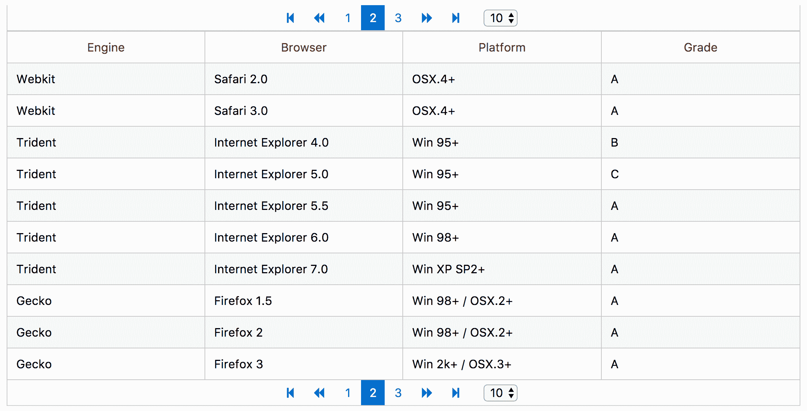

除了内置在 DataTable 中的 paginator 组件之外，我们还可以使用外部 paginator 组件。分页功能还提供`onPage`事件回调（而外部分页器提供`onPageChange`回调），分页时将调用该回调。有关更多信息，请参阅事件详细信息部分。


# 使用模板自定义单元格内容


默认情况下，每列的`field`属性值用于显示表格内容。借助`ng-template`模板标签，还可以通过各种可能的方式对内容进行定制，该标签可应用于页眉、正文和页脚级别。传递给`ng-template`模板的`template`变量用于列定义，`rowData`属性使用行数据。还有一个可选的行索引可通过`rowIndex`变量使用。

`ng-template`模板将具有`pTemplate`指令，该指令保存定制类型，可能值为`header`、`body`和`footer`。自定义浏览器内容以各种文本颜色和行数据信息显示，按钮选择如下：

```ts
<p-dataTable [value]="basicBrowsers">
  <p-column field="engine" header="Engine"></p-column>
  <p-column field="browser" header="Browser"></p-column>
  <p-column field="platform" header="Platform"></p-column>
  <p-column field="grade" header="Grade">
    <ng-template let-col let-browser="rowData" pTemplate="body">
      <span [style.color]="'Green'" *ngIf="browser[col.field]=='A'"> 
        {{browser[col.field]}}</span>
      <span [style.color]="'Blue'" *ngIf="browser[col.field]=='B'"> 
        {{browser[col.field]}}</span>
      <span [style.color]="'Red'" *ngIf="browser[col.field]=='C'">
        {{browser[col.field]}}</span>
    </ng-template>
  </p-column>
  <p-column styleClass="col-button">
    <ng-template pTemplate="header">
      <button type="button" pButton icon="fa-refresh"></button>
    </ng-template>
    <ng-template let-browser="rowData" pTemplate="body">
      <button type="button" pButton (click)="selectBrowser(browser)" 
        icon="fa-search"></button>
    </ng-template>
  </p-column>
</p-dataTable>

```

在前面的示例中，我们自定义了表格内容，以根据等级显示不同的颜色，每行使用主体模板选择按钮，在标题处使用标题模板选择按钮。以下屏幕截图以自定义内容显示的快照结果为例：

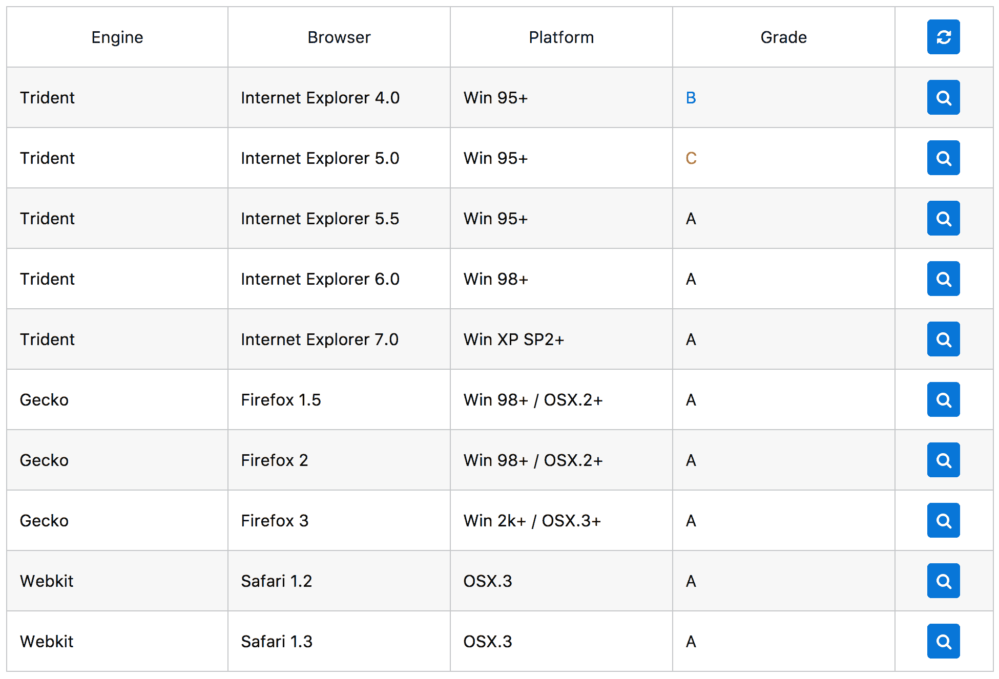

根据前面的快照，`ng-template`模板标签与不同类型一起使用，以提供完全的定制灵活性。


# 调整 DataTable 中列的大小、重新排序和切换


默认情况下，组件的所有列都是静态表示，没有交互。该组件为列提供了调整大小、重新排序和切换功能。


# 调整大小


只需将[T0]属性设置为[T1]，即可使用拖放行为调整列的大小。有两种类型的调整大小模式可用。一个是`fit`模式，另一个是`expand`模式。默认为`fit`模式。在此模式下，调整列的大小时，表的总宽度不会改变；而在`expand`模式下，工作台的总宽度将发生变化。

`expand`模式下的调整大小功能将写入以下内容：

```ts
<p-dataTable [value]="basicBrowsers" resizableColumns="true"  
  columnResizeMode="expand">
  <p-column field="engine" header="Engine"></p-column>
  <p-column field="browser" header="Browser"></p-column>
  <p-column field="platform" header="Platform"></p-column>
  <p-column field="grade" header="Grade"></p-column>
</p-dataTable>

```

以下屏幕截图显示了以`expand`调整大小模式为例的快照结果：

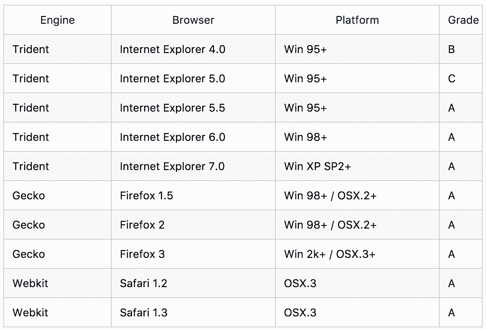

在前面的快照中，我们可以看到 Engine 和 Grade 列都根据其内容大小进行了调整，以优化屏幕区域。由于`expand`模式，表格的总宽度也会发生变化。它还可以提供`onColumnResize`事件回调，在调整列大小时传递调整大小的列标题信息。有关更多信息，请参阅事件详细信息部分。


# 重新排序


通常，表列的顺序将与组件中定义的顺序完全相同。只需将[T0]属性设置为[T1]，就可以使用拖放功能对列重新排序。

重新排序功能将编写如下：

```ts
<p-dataTable [value]="browsers" reorderableColumns="true">
  <p-column field="engine" header="Engine"></p-column>
  <p-column field="browser" header="Browser"></p-column>
  <p-column field="platform" header="Platform"></p-column>
  <p-column field="grade" header="Grade"></p-column>
</p-dataTable>

```

以下屏幕截图显示了具有重新排序功能的快照结果作为示例：


根据前面的快照，平台和浏览器列字段都是相互重新排序的（即初始列顺序为`engine`、`browser`、`platform`、`grade`。重新排序后，列的顺序为`engine`、`platform`、`browser`、`grade`。每当列被重新排序时，它还提供`onColReorder`事件回调。有关更多详细信息，请参阅事件部分。


# 切换


大多数情况下，没有足够的屏幕空间（或区域）来显示所有列。在这种情况下，切换表列将非常有助于节省可用的屏幕空间。由于此功能，只能显示强制列或主列。通过在动态列表上定义多选组件以切换列，可以实现此功能。请参阅本章开头提到的动态列示例。


# 使用数据表进行单元内编辑


默认情况下，组件的内容将处于只读模式（即，我们无法编辑内容）。UI 将与单元格编辑功能更具交互性。只需在表和列级别上设置`editable`属性，即可启用单元格编辑功能。单击单元格时，编辑模式将被激活。更新值后，点击单元格外部或点击*回车*键切换回查看模式。单元格编辑功能将编写如下：

```ts
<p-dataTable [value]="browsers" [editable]="true">
  <p-column field="browser" header="Browser" [editable]="true">
  </p-column>
  <p-column field="platfrom" header="Platform" [editable]="false">
  </p-column>
  <p-column field="engine" header="Engine" [editable]="true">
    <ng-template let-col let-browser="rowData" pTemplate="editor">
      <p-dropdown [(ngModel)]="browser[col.field]" [options]="engines"  
        [autoWidth]="false" required="true"></p-dropdown>
    </ng-template>
  </p-column>
  <p-column field="grade" header="Grade" [editable]="true">
  </p-column>
</p-dataTable>

```

以下屏幕截图以`engine`字段上的单元格编辑功能为例显示快照结果：


默认情况下，可编辑模式在单击特定单元格时启用输入组件。我们还可以使用其他输入组件，如下拉、多选、日历等，进行自定义输入编辑。在前面的示例中，我们可以使用输入和下拉组件编辑单元格。


# 使数据表具有响应性


响应功能对于 web 和移动应用都非常有用。如果屏幕大小小于某个断点值，组件列将以响应模式显示为堆叠。通过将`responsive`属性设置为`true`来启用此功能。通过启用`stacked`属性（即`stacked="true"`，也可以手动实现此堆叠行为（与屏幕大小无关）。

表格组件的响应模式特征将写为：

```ts
<button pButton type="button" (click)="toggle()" 
  [class]="responsive-toggle"
  label="Toggle" icon="fa-list">
</button>
<p-dataTable [value]="browsers" [rows]="5" [paginator]="true" 
  [pageLinks]="3" [responsive]="true" [stacked]="stacked">
  <p-header>Responsive</p-header>
  <p-column field="engine" header="Engine"></p-column>
  <p-column field="browser" header="Browser"></p-column>
  <p-column field="platform" header="Platform"></p-column>
  <p-column field="grade" header="Grade"></p-column>
</p-dataTable>

```

component 类定义了`toggle`方法，用于切换响应行为，如下所示：

```ts
toggle() {
  this.stacked = !this.stacked;
}

```

以下屏幕截图显示了具有堆叠列的 DataTable 组件的快照结果，例如：

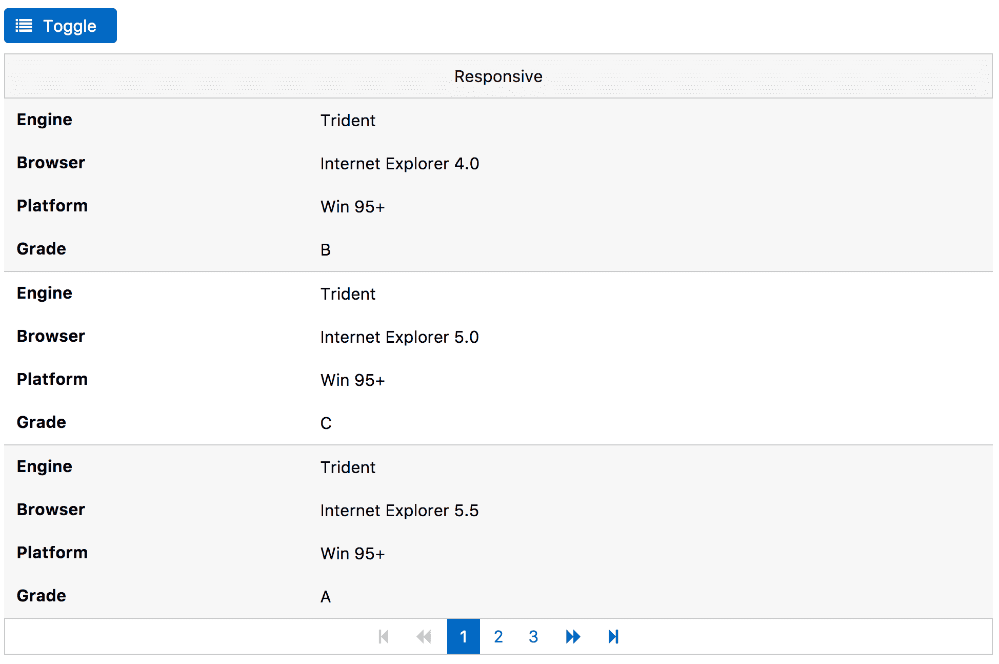

在本用例中，通过手动切换按钮（位于表的外部），以堆叠方式显示列。响应模式或堆叠行为也可以通过减小或最小化屏幕尺寸来实现。


# 使用列和行分组


DataTable 组件提供列和行级别的分组。


# 列分组


可以使用`p-headerColumnGroup`和`p-footerColumnGroup`标记在页眉和页脚区域对列进行分组，这两个标记使用`colspan`和`rowspan`属性定义列的数组。表行使用`p-row`标记定义，该标记保存列组件。具有列分组的组件将编写如下：

```ts
<p-dataTable [value]="basicBrowsers">
  <p-headerColumnGroup>
    <p-row>
      <p-column header="Browser" rowspan="3"></p-column>
      <p-column header="Details" colspan="4"></p-column>
    </p-row>
    <p-row>
      <p-column header="Environment" colspan="2"></p-column>
      <p-column header="Performance" colspan="2"></p-column>
    </p-row>
    <p-row>
      <p-column header="Engine"></p-column>
      <p-column header="Platform"></p-column>
      <p-column header="Rating"></p-column>
      <p-column header="Grade"></p-column>
    </p-row>
  </p-headerColumnGroup>

  <p-column field="browser"></p-column>
  <p-column field="engine"></p-column>
  <p-column field="platform"></p-column>
  <p-column field="rating"></p-column>
  <p-column field="grade"></p-column>

  <p-footerColumnGroup>
    <p-row>
      <p-column footer="*Please note that Chrome browser 
        details not included"
        colspan="5"></p-column>
    </p-row>
  </p-footerColumnGroup>
</p-dataTable>

```

以下屏幕截图显示了列分组功能的快照结果作为示例：

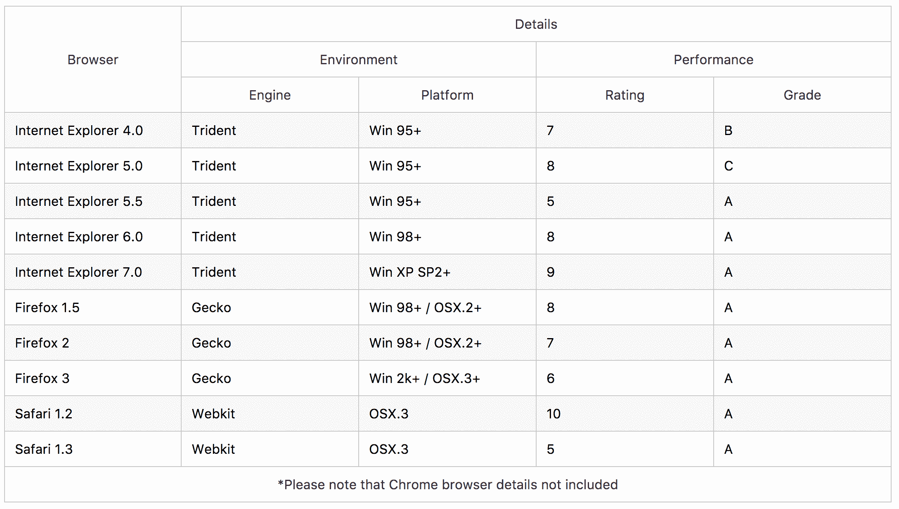

在前面的快照中，我们可以看到特定于浏览器的信息是通过列分组进行分类的。


# 行分组


默认情况下，表行是单独的，并逐个显示以表示唯一的记录。在许多情况下，需要将多行分组为一行。


# 可扩展行组


可以在特定字段上对行进行分组，以便使用行扩展器功能展开和折叠行。通过设置`rowGroupMode="subheader"`、`expandableRowGroups="true"`和`groupField="browser"`来启用此功能。`groupField`设置为特定的分类列。

具有可扩展行组选项的行分组功能将编写如下：

```ts
<p-dataTable [value]="browsers" sortField="browser"  
  rowGroupMode="subheader"  groupField="browser"  
  expandableRowGroups="true" [sortableRowGroup]="false">
  <p-header>Toggleable Row Groups with Footers</p-header>
  <ng-template pTemplate="rowgroupheader" let-rowData> 
    {{rowData['browser']}}
  </ng-template>
  <p-column field="engine" header="Engine"></p-column>
  <p-column field="platform" header="Platform"></p-column>
  <p-column field="rating" header="rating">
    <ng-template let-col let-browser="rowData" pTemplate="body">
      <span>{{browser[col.field]}} 'Stars'</span>
    </ng-template>
  </p-column>
  <ng-template pTemplate="rowgroupfooter" let-browser>
    <td colspan="3" style="text-align:right">Chrome browsers are not 
      included</td>
  </ng-template>
</p-dataTable>

```

以下屏幕截图显示了可扩展行分组功能的快照结果，例如：

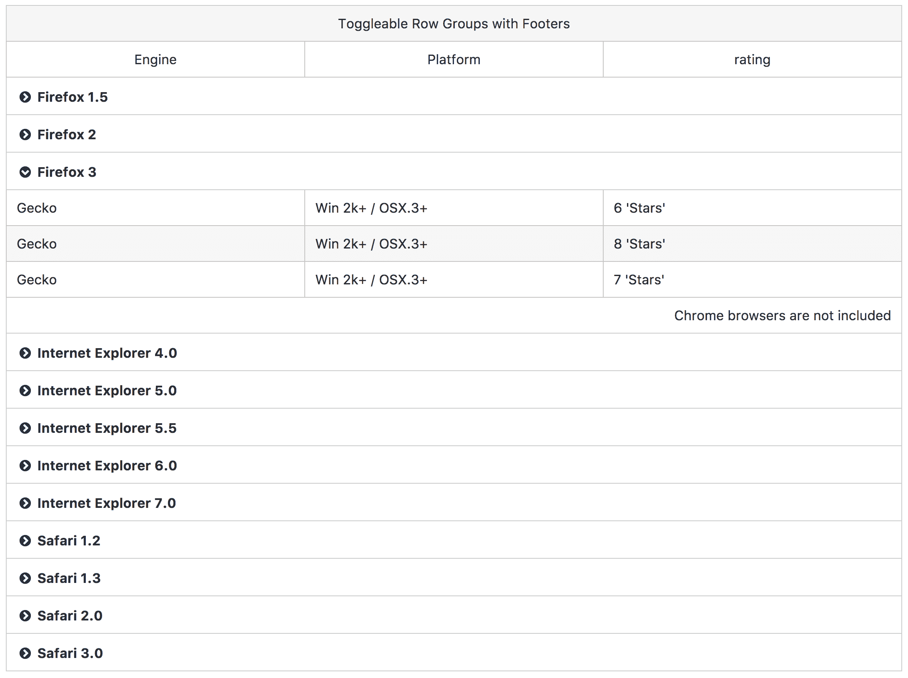

在这个用例中，我们扩展了 Firefox 版本 3 组，以查看随时间变化的所有浏览器详细信息。


# 子标题


使用“子标题”功能，可以将所有相关项目分组到一个子组下。此用例类似于展开的行组，但不能折叠这些子标题。此行为通过设置`rowGroupMode="subheader"`和`groupField="engine"`启用。`groupField`属性设置为特定的分类列。

带有子标题选项的行分组功能将编写如下：

```ts
<p-dataTable [value]="browsers" sortField="engine"  
  rowGroupMode="subheader"
  groupField="engine" [styleClass]="'rowgroup-padding'">
  <p-header>Subheader</p-header>
  <ng-template pTemplate="rowgroupheader" let-rowData>
    {{rowData['engine']}}
  </ng-template>
  <p-column field="browser" header="Browser" sortable="true">
  </p-column>
  <p-column field="platform" header="Platform" sortable="true">
  </p-column>
  <p-column field="grade" header="Grade" sortable="true">
  </p-column>
</p-dataTable>

```

以下屏幕截图以子标题分组功能为例显示了表的快照结果：

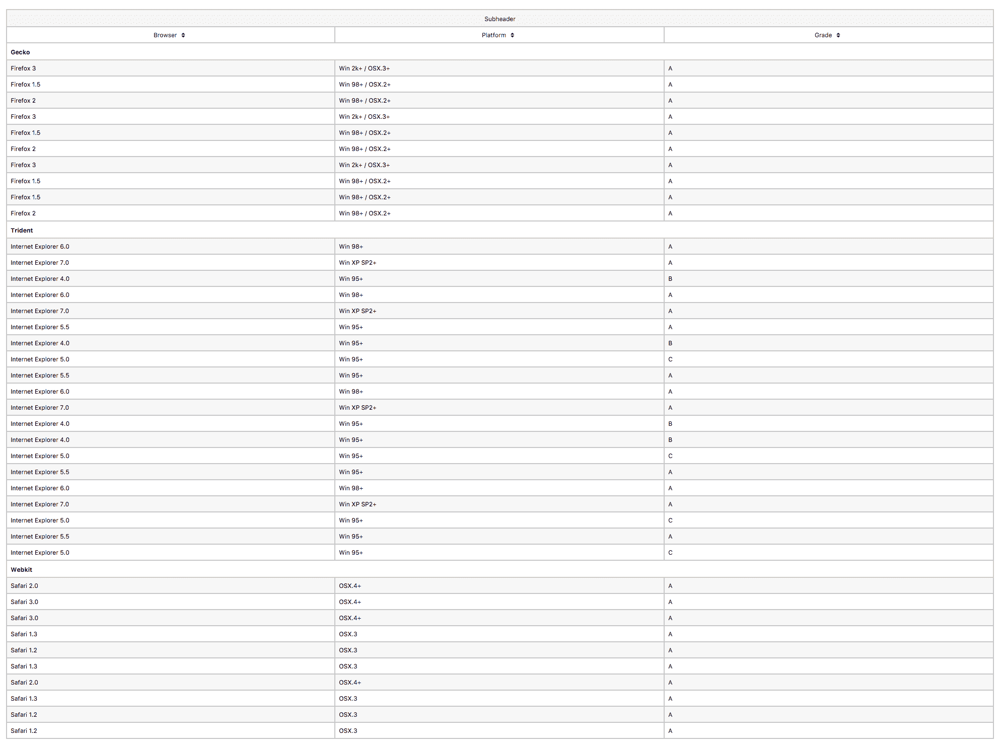

The sub-header grouping feature

在前面的用例中，所有浏览器详细信息都基于作为子标题的唯一浏览器引擎进行分组。


# 行跨度组


可以根据`sortField`属性对行进行分组。此功能通过将`rowGroupMode`属性值设置为`rowspan`（即`rowGroupMode="rowspan"`来启用。具有行跨度的行分组示例如下所示：

```ts
<p-dataTable [value]="browsers" sortField="engine"   
  rowGroupMode="rowspan"
  [styleClass]="'rowgroup-padding'">
  <p-header>RowSpan</p-header>
  <p-column field="engine" header="Engine" sortable="true"></p-column>
  <p-column field="platform" header="Platform" sortable="true">
  </p-column>
  <p-column field="browser" header="Browser" sortable="true">
  </p-column>
  <p-column field="grade" header="Grade" sortable="true"></p-column>
</p-dataTable>

```

以下屏幕截图显示了具有行范围分组功能的组件的快照结果作为示例：

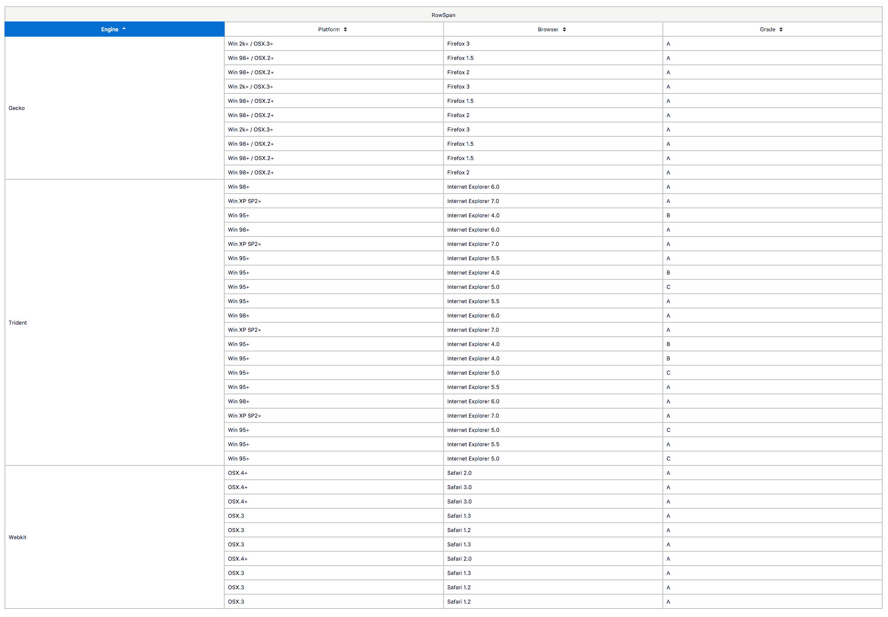

The row span grouping feature

在此版本的行分组中，浏览器的`engine`字段用于跨其所有相关项的行分组。


# 使用惰性 DataTable 处理大量数据


延迟加载是处理大型数据集的一个非常关键的特性。此功能提供通过分页、排序和筛选操作加载数据块，而不是一次加载所有数据。通过设置`lazy`模式（`lazy="true"`并使用`onLazyLoad`回调以事件对象为参数执行用户操作，可以启用延迟加载。事件对象保存分页、排序和筛选数据。

还需要显示逻辑数量的记录，以便使用投影查询进行分页配置。这是必需的，因为我们只能在延迟加载中检索当前页面数据。没有与剩余记录相关的可用信息。因此，需要根据数据源中的实际记录显示分页器链接。这可以通过表组件上的`totalRecords`属性实现。

具有延迟加载功能的组件将编写如下：

```ts
<p-dataTable [value]="browsers" [lazy]="true" [rows]="10" 
  [paginator]="true" [totalRecords]="totalRecords" 
  (onLazyLoad)="loadBrowsersLazy($event)">
  <p-header>List of browsers</p-header>
  <p-column field="engine" header="Engine" [sortable]="true" 
  [filter]="true">
  </p-column>
  <p-column field="browser" header="Browser" [sortable]="true" 
  [filter]="true">  
  </p-column>
  <p-column field="platform" header="Platform" [sortable]="true" 
  [filter]="true">
  </p-column>
  <p-column field="grade" header="Grade" [sortable]="true" 
  [filter]="true">
  </p-column>
</p-dataTable>

```

component 类定义延迟加载回调以按需检索数据，如图所示：

```ts
loadBrowsersLazy(event: LazyLoadEvent) {
  //event.first = First row offset
  //event.rows = Number of rows per page
  //event.sortField = Field name to sort with
  //event.sortOrder = Sort order as number, 1 for asc and -1 for dec
  //filters: FilterMetadata object having field as 
  //key and filter value, 
  //filter matchMode as value

  this.browserService.getBrowsers().subscribe((browsers: any) =>
    this.browsers = browsers.slice(event.first, 
    (event.first + event.rows)));
}

```

作为延迟加载的演示，我们使用分页操作来检索数据。我们还可以使用排序和过滤功能。以下屏幕截图显示了一个快照结果，以作为示例进行说明：

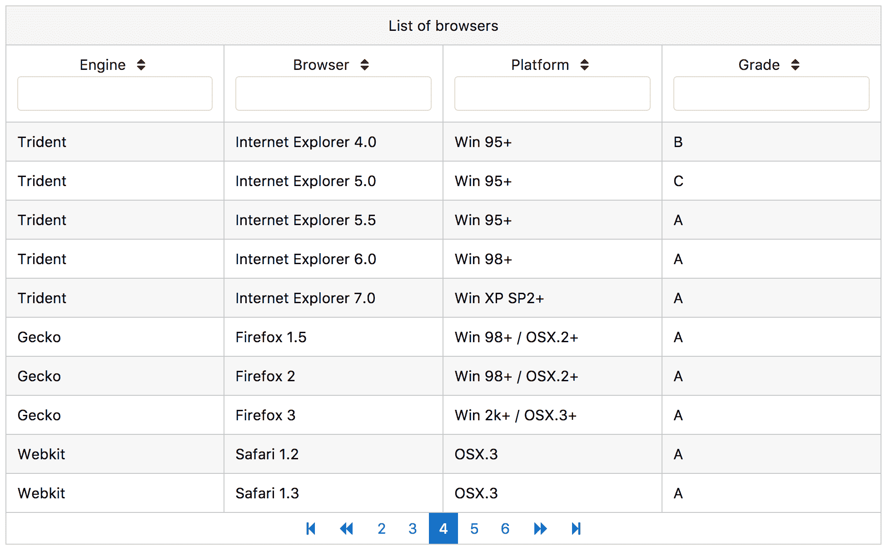

在前面的快照中，我们可以清楚地看到第 4 页上的信息是从远程数据源动态检索的。有关延迟加载事件回调的更多详细信息，请参阅事件部分。

Always prefer lazy loading for large datasets to improve the performance.


# 通过提供行模板进行行扩展


在许多情况下，不可能容纳表中的所有数据。表数据的辅助信息或附加信息需要以不同的表示形式填充。行扩展功能允许显示特定行的详细内容（即，在单独的块中显示数据，该块将根据请求显示）。要使用此功能，请启用`expandableRows`属性，并添加一个扩展列，使用`expander`属性作为单独的列以及常规列，以切换行。要声明扩展内容，请提供一个以`rowexpansion`为值的`pTemplate`指令。`ng-template`中的本地模板参考变量用于访问表格数据。

具有行扩展功能以显示浏览器完整详细信息的组件将编写如下：

```ts
<p-dataTable [value]="basicBrowsers" expandableRows="true"   
  [expandedRows]="expandedRows">
  <p-column expander="true" styleClass="col-icon" header="Toggle">
  </p-column>
  <p-column field="engine" header="Engine"></p-column>
  <p-column field="browser" header="Browser"></p-column>
  <p-column field="platform" header="Platform"></p-column>
  <p-column field="grade" header="Grade"></p-column>
  <ng-template let-browser pTemplate="rowexpansion">
    <div class="ui-grid ui-grid-responsive ui-fluid 
      rowexpansion-layout">
      <div class="ui-grid-row">
        <div class="ui-grid-col-9">
          <div class="ui-grid ui-grid-responsive ui-grid-pad">
            <div class="ui-grid-row">
              <div class="ui-grid-col-2 label">Engine:</div>
              <div class="ui-grid-col-10">{{browser.engine}}</div>
            </div>
            <div class="ui-grid-row">
              <div class="ui-grid-col-2 label">Browser:</div>
              <div class="ui-grid-col-10">{{browser.browser}}</div>
            </div>
            <div class="ui-grid-row">
              <div class="ui-grid-col-2 label">Platform:</div>
              <div class="ui-grid-col-10">{{browser.platform}}</div>
            </div>
            <div class="ui-grid-row">
              <div class="ui-grid-col-2 label">Version:</div>
              <div class="ui-grid-col-10">{{browser.version}}</div>
            </div>
            <div class="ui-grid-row">
              <div class="ui-grid-col-2 label">Rating:</div>
              <div class="ui-grid-col-10">{{browser.rating}}</div>
            </div>
            <div class="ui-grid-row">
              <div class="ui-grid-col-2 label">Grade:</div>
              <div class="ui-grid-col-10">{{browser.grade}}</div>
            </div>
          </div>
        </div>
      </div>
    </div>
  </ng-template>
</p-dataTable>

```

如果需要，可以使用`expandedRows`属性将展开的行存储在 component 类内的数组变量中。以下屏幕截图显示了具有行扩展功能的组件的快照结果作为示例：

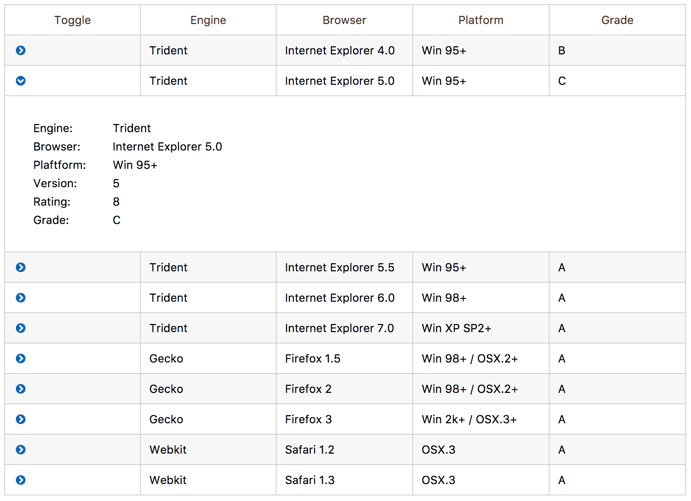

默认情况下，可以一次展开多行。我们可以使用`rowExpandMode`属性将其设置为`single`进行严格的单行扩展。

我们也可以对分组表应用行扩展行为：

*   该组件提供一个`expandableRowGroups`布尔属性，用于创建切换行组的图标。
*   默认情况下，所有行都将展开。`expandedRowGroups`属性默认用于保存行数据实例以展开特定行组。

The method named `toggleRow` is provided in order to toggle table rows with the row data.


# 以 CSV 格式导出数据


可以在联机模式下随时以表格格式查看数据。但是，需要离线模式下的数据。在很多情况下，我们需要从网站上获取大量数据报告。PrimeNG 数据表可以使用`exportCSV()`API 方法以 CSV 格式导出。放置在表内或表外的按钮组件可以触发此方法以 CSV 格式下载数据。具有导出 API 方法调用的组件将编写如下：

```ts
<p-dataTable #dt [value]="basicBrowsers" exportFilename="browsers"   
  csvSeparator=";">
  <p-header>
    <div class="ui-helper-clearfix">
    <button type="button" pButton icon="fa-file-o" iconPos="left"
      label="CSV" (click)="dt.exportCSV()" style="float:left"></button>
    </div>
  </p-header>
  <p-column field="engine" header="Engine"></p-column>
  <p-column field="browser" header="Browser"></p-column>
  <p-column field="platform" header="Platform"></p-column>
  <p-column field="grade" header="Grade"></p-column>
</p-dataTable>

```

默认情况下，导出的 CSV 使用逗号（`,`运算符作为分隔符。但是，可以使用 DataTable 组件上的`csvSeparator`属性更改此行为。


# 数据表事件和方法


DataTable 组件提供了许多与每个特性相关的事件回调和方法。下表列出了所有带有名称、参数详细信息和说明的表事件回调：

| **名称** | **参数** | **说明** |
| `onRowClick` | 

*   `event.originalEvent` ：浏览器事件
*   `event.data` ：所选数据

 | 单击行时要调用的回调。 |
| `onRowSelect` | 

*   `event.originalEvent` ：浏览器事件
*   `event.data` ：选择数据
*   `event.type` ：选择类型，有效值为 `row` 、 `radiobutton` 、 `checkbox`

 | 选择行时要调用的回调。 |
| `onRowUnselect` | 

*   `event.originalEvent` ：浏览器事件
*   `event.data` ：未选数据
*   `event.type` ：未选类型，有效值为 `row` 和 `checkbox`

 | 使用元键取消选择行时调用的回调。 |
| `onRowDblclick` | 

*   `event.originalEvent` ：浏览器事件
*   `event.data` ：所选数据

 | 双击选定行时要调用的回调。 |
| `onHeaderCheckboxToggle` | 

*   `event.originalEvent` ：浏览器事件
*   `event.checked` ：表头复选框状态

 | 当标头复选框的状态更改时调用的回调。 |
| `onContextMenuSelect` | 

*   `event.originalEvent` ：浏览器事件
*   `event.data` ：所选数据

 | 右键单击选定行时要调用的回调。 |
| `onColResize` | 

*   `event.element` ：调整大小的列标题
*   `event.delta` ：像素数宽度变化

 | 调整列大小时调用的回调。 |
| `onColReorder` | 

*   `event.dragIndex` ：被拖拽列的索引
*   `event.dropIndex` ：被拖拽列的索引
*   `event.columns` ：重新排序后的列数组

 | 对列重新排序时调用的回调。 |
| `onLazyLoad` | 

*   `event.first` ：第一行偏移量
*   `event.rows` ：每页行数
*   `event.sortField` ：要排序的字段名
*   `event.sortOrder` ：排序顺序为编号， `1` 为 asc， `-1` 为 desc
*   `filters` 为 `FilterMetadata` ：具有字段作为键和筛选值的对象，筛选 `matchMode` 作为值

 | 在惰性模式下进行分页、排序或筛选时调用的回调。 |
| `onEditInit` | 

*   `event.column` ：单元格的列对象
*   `event.data` ：行数据

 | 当单元格切换到编辑模式时调用的回调。 |
| `onEdit` | 

*   `event.originalEvent` ：浏览器事件
*   `event.column` ：单元格的列对象
*   `event.data` ：行数据
*   `event.index` ：行索引

 | 在编辑单元格数据时调用的回调。 |
| `onEditComplete` | 

*   `event.column` ：单元格的列对象
*   `event.data` ：行数据
*   `event.index` ：行索引

 | 单元格编辑完成时调用的回调（仅支持[T0]回车[T1]键）。 |
| `onEditCancel` | 

*   `event.column` ：单元格的列对象
*   `event.data` ：行数据
*   `event.index` ：行索引

 | 使用*Esc*键取消单元格编辑时调用的回调。 |
| `onPage` | 

*   `event.first` ：第
*   `event.rows` ：第

页第一条记录索引 | 发生分页时调用的回调。 |
| `onSort` | 

*   `event.field` ：已排序列的字段名
*   `event.order` ：排序顺序为 1 或-1
*   `event.multisortmeta` ：多排序模式下的排序元数据。有关此对象的结构，请参见多个排序部分。

 | 对列进行排序时调用的回调。 |
| `onFilter` | `event.filters`：过滤属性键为`field`的对象，属性值为`matchMode`的对象。 | 在筛选数据时调用的回调。 |
| `onRowExpand` | 

*   `event.originalEvent` ：浏览器事件
*   `data` ：要扩展的行数据

 | 展开行时要调用的回调。 |
| `onRowCollapse` | 

*   `event.originalEvent` ：浏览器事件
*   `data` ：要折叠的行数据

 | 折叠行时要调用的回调。 |
| `onRowGroupExpand` | 

*   `event.originalEvent` ：浏览器事件
*   `group` ：组值

 | 展开行组时要调用的回调。 |
| `onRowGroupCollapse` | 

*   `event.originalEvent` ：浏览器事件
*   `group` ：组值

 | 折叠行组时调用的回调。 |

下表列出了常用的表方法及其名称、参数和说明：

| **名称** | **参数** | **说明** |
| `reset` | - | 重置排序、筛选和分页器状态 |
| `exportCSV` | - | 以 CSV 格式导出数据 |
| `toggleRow` | `data` | 切换给定行数据的行扩展 |

PrimeNG version 4.0.1 reintroduced back the `rowTrackBy` option for iteration components such as DataTable, DataGrid, and DataList to improve the DOM optimizations. That is, the DOM insertions and updates of each row are optimized by delegating the decision to the `ngForTrackBy` directive. In PrimeNG, this will be achieved through the `rowTrackBy` property. If the property is not defined, by default, the algorithm checks for an object identity. For example, the browser row is identified by ID property as
`trackById(index, browser) { return browser.id; }`.
The complete demo application with instructions is available on GitHub at
[https://github.com/ova2/angular-development-with-primeng/tree/master/chapter5/datatable](https://github.com/ova2/angular-development-with-primeng/tree/master/chapter5/datatable).


# 用 DataList 列出数据


DataList 组件用于在列表布局中显示数据。它需要一组项目作为其值，`ng-template`显示内容，其中每个项目都可以使用本地模板变量访问。该模板还使用`let-i`表达式表示的变量提供每个项目的索引。DataList 组件的一个基本示例，其中所有浏览器详细信息以列表格式显示，如下所示：

```ts
<p-dataList [value]="basicBrowsers">
  <ng-template let-browser pTemplate="item">
    <div class="ui-grid ui-grid-responsive ui-fluid" 
      class="content-layout">
      <div class="ui-grid-row">
        <div class="ui-grid-col-3">
          
        </div>
        <div class="ui-grid-col-9">
          <div class="ui-grid ui-grid-responsive ui-fluid">
            <div class="ui-grid-row">
              <div class="ui-grid-col-2">Engine: </div>
              <div class="ui-grid-col-10">{{browser.engine}}</div>
            </div>
            <div class="ui-grid-row">
              <div class="ui-grid-col-2">Browser: </div>
              <div class="ui-grid-col-10">{{browser.browser}}</div>
            </div>
            <div class="ui-grid-row">
              <div class="ui-grid-col-2">Platform: </div>
              <div class="ui-grid-col-10">{{browser.platform}}</div>
            </div>
            <div class="ui-grid-row">
              <div class="ui-grid-col-2">Version: </div>
              <div class="ui-grid-col-10">{{browser.version}}</div>
            </div>
            <div class="ui-grid-row">
              <div class="ui-grid-col-2">Grade: </div>
              <div class="ui-grid-col-10">{{browser.grade}}</div>
            </div>
          </div>
        </div>
      </div>
    </div>
  </ng-template>
</p-dataList>

```

需要从外部服务检索浏览器详细信息列表。在这种情况下，`BrowserService`服务将被注入组件类以检索浏览器信息。我们使用可观察对象来使用 HTTP 模块获取数据。列表数据将在页面加载时检索，如下所示：

```ts
basicBrowsers: Browser[];

constructor(private browserService: BrowserService) { }

ngOnInit() {
  this.browserService.getBrowsers().subscribe(
    (browsers:any) => this.basicBrowsers = browsers.slice(0,4));
}

```

为了便于演示，我们将记录数量限制为 5 条。以下屏幕截图以列表格式显示 DataList 组件的快照结果作为示例：


前面的快照只是以表格格式显示数据。在下一节中，您可以找到更多使数据列表成为强大组件的功能。


# 面和分页


DataList 组件支持使用`p-header`和`p-footer`标记的内容的页眉和页脚等方面。为了改善大型数据集上的用户体验，它支持分页功能。通过将`paginator`属性设置为`true`启用此功能，并使用`rows`属性设置要显示的行数。除了这些强制设置外，还有一些可选的分页自定义设置。在所有这些可选属性中，`paginatorPosition`用于在`top`、`bottom`或`both`位置显示分页器；`rowsPerPageOptions`用于显示一个下拉列表，该下拉列表包含一个页面中可能显示的行数，`emptyMessage`用于在没有记录时显示数据列表体。分页还支持`onPage`事件回调，该回调将在页面导航中调用。有关更多详细信息，请参阅事件部分。

具有用于显示浏览器信息的刻面和分页功能的 DataList 组件如下所示：

```ts
<p-dataList [value]="advancedBrowsers" [paginator]="true" [rows]="5"
  (onPage)="onPagination($event)" [rowsPerPageOptions]="[5,10,15]"
  [paginatorPosition]="both" [emptyMessage]="'No records found'">
  <p-header>
    List of Browsers
  </p-header>
    .... // Content
  <p-footer>
    Note: Grades are 3 types.A,B and C.
  </p-footer>
</p-dataList>

```

以下屏幕截图以分页为例显示快照结果：

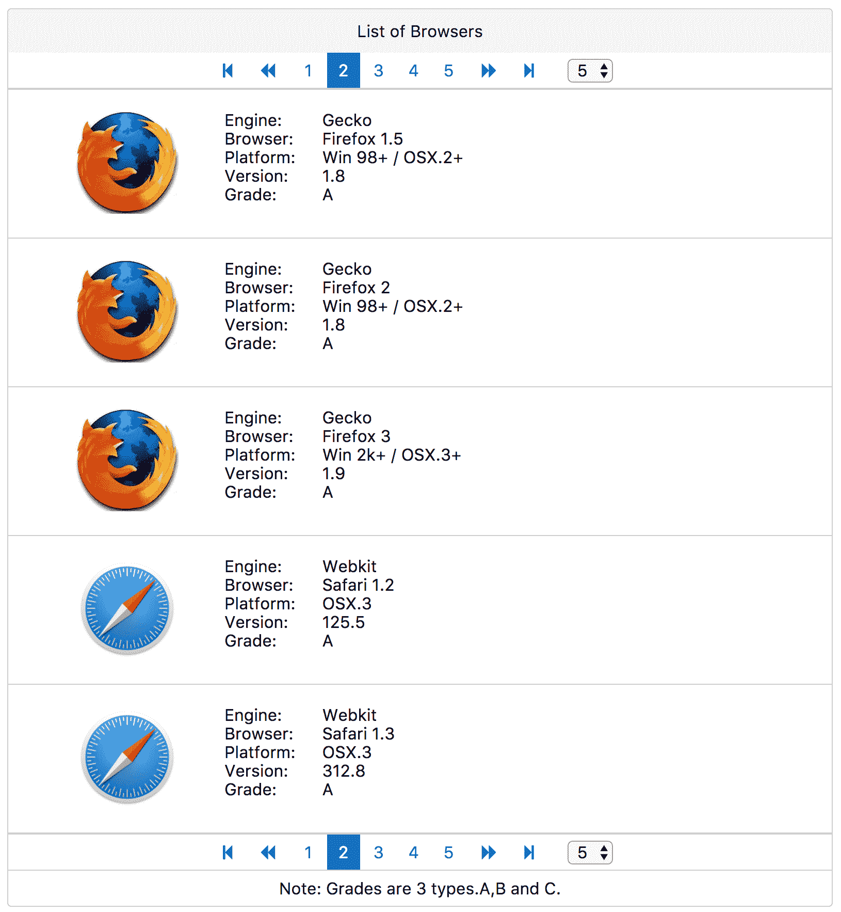

所有分页控件都可以使用 DataList 组件中提供的选项进行自定义。


# 延迟加载


延迟加载是处理大型数据集的一个非常有用的特性。它不会一次加载所有数据，而是根据用户需求将数据分成小块。DataList 支持分页交互的延迟加载。通过启用`lazy`属性（即`lazy="true"`，以及调用`onLazyLoad`回调从远程数据源检索数据，可以使用此功能。有关签名和更多详细信息，请参阅事件部分。

lazy load 事件对象提供页面中的第一条记录和当前页面中的行数，以获取下一组数据。此外，还应通过投影查询提供分页配置的总记录。这对于基于可用记录总数显示分页链接非常有用，即使页面加载时有许多记录不可用（即，只有当前页面记录以延迟模式存在）。

让我们以 DataList 组件的延迟加载功能为例，该组件具有基本原型，如下所示：

```ts
<p-dataList [value]="lazyloadingBrowsers" [paginator]="true" [rows]="5"   
  [lazy]="true"
  (onLazyLoad)="loadData($event)" [totalRecords]="totalRecords">
  ... // Content
</p-dataList>

```

组件类必须定义延迟加载事件回调以根据用户请求检索记录（在本例中为分页），如下所示：

```ts
loadData(event:any) {
  let start = event.first;//event.first = First row offset
  let end = start + event.rows;//event.rows = Number of rows per page
  this.browserService.getBrowsers().subscribe((browsers: any) =>
    this.lazyloadingBrowsers = browsers.slice(start,end));
}

```

在前面的代码片段中，您可以看到事件的`first`和`rows`属性都有助于检索下一组记录。基于`rows`属性，它尝试在每个实例上获取下一个`rows`数量的记录。


# 事件


该组件提供两个事件回调，一个用于分页，另一个用于延迟加载。这两个事件都提供了两个参数来获取第一条记录和页面上的行数。通过启用延迟模式，在分页、筛选和排序功能上调用延迟加载事件。

| **名称** | **参数** | **说明** |
| `onLazyLoad` | 

*   `event.first` ：第一行偏移量
*   `event.rows` ：每页行数

 | 在惰性模式下进行分页、排序或筛选时调用的回调。 |
| `onPage` | 

*   `event.first` ：第
*   `event.rows` ：第

页第一条记录索引 | 发生分页时调用的回调。 |

它还提供了许多其他功能，例如用于页眉和页脚显示的方面（`p-header`和`p-footer`），用于在多个页面之间导航的分页，以及用于按需检索数据的延迟加载功能。

The complete demo application with instructions is available on GitHub at
[https://github.com/ova2/angular-development-with-primeng/tree/master/chapter5/datalist](https://github.com/ova2/angular-development-with-primeng/tree/master/chapter5/datalist).


# 使用 PickList 列出数据


PickList 组件用于在两个不同的列表之间移动项目。您还可以对每个列表中的项目重新排序。这将提供所选项目的总体状态。可以使用默认按钮控件或拖放行为移动/重新排序项目。PickList 需要两个数组，一个用于源列表，另一个用于目标列表。`ng-template`模板标记用于显示项目的内容，其中可以使用本地`ng-template`变量访问数组中的每个项目。

包含国家/地区信息的选择列表组件的基本示例如下所示：

```ts
<p-pickList [source]="sourceCountries" [target]="targetCountries"
  [sourceStyle]="{'height':'350px'}" [targetStyle]="{'height':'350px'}">
  <ng-template let-country pTemplate="item">
    <div class="ui-helper-clearfix">
      
      <span>{{country.flag}} - {{country.name}}({{country.dial_code}})
      </span>
    </div>
  </ng-template>
</p-pickList>

```

在 component 类中，让我们为可用数据定义一个源列表，并将目标定义为空列表，以指示尚未进行选择。需要注入国家服务，以便从外部资源获取国家信息：

```ts
sourceCountries: Country[];
targetCountries: Country[];

constructor(private countryService: CountryService) { }

ngOnInit() {
  this.countryService.getCountries().subscribe(
    (countries: Country[]) => 
  {
    this.sourceCountries = countries;
  });
  this.targetCountries = [];
}

```

默认情况下，源面板和目标面板都具有默认的`width`和`height`属性。但是可以使用`sourceStyle`和`targetStyle`属性自定义此默认行为。以下屏幕截图显示了初始选取列表的快照结果作为示例：


PickList 组件提供了六个事件回调，用于在两个列表之间移动项，并对源区域和目标区域中的项进行排序。在这六个回调中，有四个回调用于移动项目，`onMoveToTarget`、`onMoveToSource`、`onMoveAllToSource`和`onMoveAllToSource`，而订购项目则由`onSourceReorder`和`onTargetReorder`执行。

组件可以通过以下不同方式从其默认行为进行自定义：

*   标题可以使用标题`sourceHeader`和`targetHeader`作为属性进行自定义。
*   网页将使用`responsive`属性（`responsive="true"`响应，该属性根据屏幕大小调整按钮控件。
*   通过禁用`metaKeySelection`属性（`metaKeySelection="false"`，可以防止默认的多重选择（借助于元键）。
*   按钮控件的可见性通过`showSourceControls`和`showTargetControls`属性进行控制。例如，`showSourceControls="false"`和`showTargetControls="false"`。

Priming 4.1 支持使用`filterBy`属性将项目字段上的过滤功能作为新添加项。通过在`filterBy`属性中放置逗号分隔的字段，可以过滤多个字段：

```ts
<p-pickList [source]="sourceCountries" [target]="targetCountries" 
  filterBy="name, code">
  ...
</p-pickList>

```

较新的 4.1 版本还通过启用`dragdrop`属性支持拖放功能（在同一列表内或跨列表）。它还提供了`dragdropScope`属性，该属性持有唯一键，以避免与其他拖放事件发生冲突。拖放功能示例如下所示：

```ts
<p-pickList [source]="sourceCountries" [target]="targetCountries"   
  sourceHeader="Available" targetHeader="Selected" [dragdrop]="true" 
  dragdropScope="name">
   ...
</p-pickList>

```

The complete demo application with instructions is available on GitHub at
[https://github.com/ova2/angular-development-with-primeng/tree/master/chapter5/picklist](https://github.com/ova2/angular-development-with-primeng/tree/master/chapter5/picklist).


# 使用 OrderList 列出数据


OrderList 组件用于按不同方向（向上和向下）对项目集合进行排序。组件需要一个数组类型变量来存储其值，`ng-template`来显示项目数组的内容。每个项目都将在`ng-template`模板内使用本地`ng-template`变量进行访问。当项目的位置更改时，后端阵列也会更新以存储最新的项目订单。

包含国家/地区信息的 OrderList 组件的基本示例如下所示：

```ts
<p-orderList [value]="countries"  header="Favourite countries" >
  <ng-template let-country pTemplate="item">
    <div class="ui-helper-clearfix">
      
      <span class="content-format">
        {{country.flag}} {{country.name}}({{country.dial_code}})
      </span>
    </div>
  </ng-template>
</p-orderList>

```

在 component 类中，让我们定义一个国家/地区列表以显示项目集合。需要注入国家/地区服务，以便从外部资源或数据源访问国家/地区信息，如下所示：

```ts
countries: Country[];

constructor(private countryService: CountryService) { }

ngOnInit() {
  this.countryService.getCountries().subscribe((countries: Country[]) =>
  {
    this.countries = countries;
  });
}

```

默认情况下，列表面板具有默认的`width`和`height`属性。但这可以使用`listStyle`属性进行定制。以下屏幕截图显示了初始订单列表的快照结果作为示例：

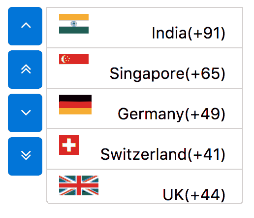

OrderList 组件提供三种不同的事件回调，如下所述：

| **名称** | **参数** | **说明** |
| `onReorder` | `event`：浏览器事件 | 重新排序列表时调用的回调。 |
| `onSelectionChange` | 

*   `originalEvent` ：浏览器事件
*   `value` ：当前选择

 | 选择更改时调用的回调。 |
| `onFilterEvent` | 

*   `originalEvent` ：浏览器事件
*   `value` ：当前过滤值

 | 发生筛选时要调用的回调。 |

组件可以通过以下不同方式从其默认行为进行自定义：

*   可以使用`header`属性自定义标题
*   `responsive`属性（`responsive="true"`用于应用响应行为，根据屏幕大小调整按钮控件
*   通过禁用`metaKeySelection`属性（`metaKeySelection="false"`，可以防止默认的多重选择（借助于元键）

以下屏幕截图显示了国家/地区列表的快照结果，以前面提到的自定义为例：


在前面的快照中，您可以看到控件由于其`responsive`特性（`responsive="true"`而出现在顶部。我们还可以看到，面板宽度已根据视口大小进行了调整（使用`listStyle`属性）。

Priming 4.1 版本支持作为新添加的过滤和拖放功能。使用类似于 DataTable 组件的`filterBy`属性，过滤器功能可以应用于单个字段和多个字段。例如，国家数据的多重过滤功能如下：

```ts
<p-orderList [value]="countries" filterBy="name, code">
 ...
</p-orderList>

```

较新的 4.1 版本还支持拖放功能，通过启用`dragdrop`属性对项目进行重新排序。它还提供了`dragdropScope`属性，该属性持有唯一键，以避免与其他拖放事件发生冲突。拖放功能示例如下所示：

```ts
<p-orderList [value]="countries" [dragdrop]="true" dragdropScope="name">
  ...
</p-orderList>

```

The complete demo application with instructions is available on GitHub at
[https://github.com/ova2/angular-development-with-primeng/tree/master/chapter5/orderlist](https://github.com/ova2/angular-development-with-primeng/tree/master/chapter5/orderlist).


# 使用 DataGrid 对数据进行网格组织


DataGrid 以面向网格的布局显示数据。数据以布局的形式表示，多个单元格以规则模式对齐。它需要一个项目集合作为`value`属性和`ng-template`模板标记的数组，以显示其内容，其中每个项目都可以使用本地模板变量访问。模板内容需要包装在一个`div`元素中，以便使用任何网格 CSS 样式在网格布局中格式化数据。

具有浏览器信息的 DataGrid 组件的基本示例如下所示：

```ts
<p-dataGrid [value]="basicBrowsers">
  <ng-template let-browser pTemplate="item">
    <div style="padding:3px" class="ui-g-12 ui-md-3">
      <p-panel [header]="browser.browser" [style]="{'text-
        align':'center'}">
                     
        <div class="car-detail">{{browser.engine}} - 
          {{browser.version}}
        </div>
        <hr class="ui-widget-content" style="border-top:0">
        <i class="fa fa-search" (click)="selectBrowser(browser)"
           style="cursor:pointer"></i>
      </p-panel>
    </div>
  </ng-template>
</p-dataGrid>

```

组件类必须定义一组浏览器对象，这些对象使用服务从远程数据源检索。页面加载时访问的服务将按如下方式编写：

```ts
basicBrowsers: Browser[];

constructor(private browserService: BrowserService) { }

ngOnInit() {
  this.browserService.getBrowsers().subscribe((browsers: any) =>
    this.basicBrowsers = browsers.slice(0, 12));
}

```

以下屏幕截图显示了网格布局中 DataGrid 组件的快照结果，例如：


在前面的快照中，两个单元格中的任意一个单元格之间的填充将是一致的。这可以通过该组件的蒙皮类进行自定义。


# 超越基本用法-高级功能


在前面的快照中，浏览器数据显示在栅格布局中。但是，您可以观察到，没有用于总结上下文的页眉或页脚。页眉和页脚面可使用`p-header`和`p-footer`标记。

为了提高大型数据集的可用性，DataGrid 提供了分页功能，通过页面导航显示下一块数据。此功能通过启用`paginator`属性和设置`rows`属性来提供。与任何其他数据组件一样，分页功能（如`pageLinks`、`rowsPerPageOptions`、`paginatorPosition`和`totalRecords`可用于此定制。

为了处理大量数据，DataGrid 支持一个延迟加载特性来访问大量数据。此功能通过启用`lazy`属性提供。另外，应该使用`onLazyLoad`事件对分页操作调用延迟加载方法。

以`event`对象为参数定义延迟加载事件回调的组件类如下所示：

```ts
loadData(event: any) {
  let start = event.first; //event.first = First row offset
  let end = start + event.rows; //event.rows = Number of rows per page
  this.browserService.getBrowsers().subscribe((browsers: any) =>
    this.lazyloadingBrowsers = browsers.slice(start,end));
}

```

以下屏幕截图显示了延迟加载功能的快照结果作为示例：

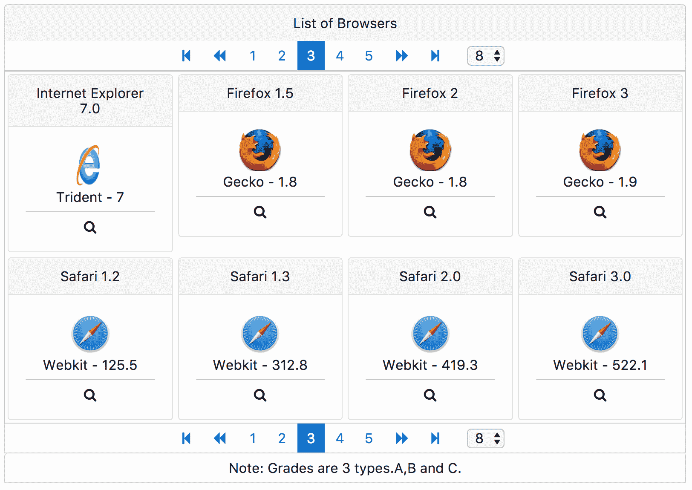

在前面的快照中，它显示了 facet（页眉和页脚）、自定义分页选项以及根据用户需求延迟加载数据。只需单击每个单元格中可用的搜索图标，浏览器的其他信息就会显示在弹出的对话框中。默认情况下，DataGrid 组件作为跨各种屏幕大小或设备的布局显示进行响应。

The complete demo application with instructions is available on GitHub at
[https://github.com/ova2/angular-development-with-primeng/tree/master/chapter5/datagrid](https://github.com/ova2/angular-development-with-primeng/tree/master/chapter5/datagrid).


# 使用 DataScroller 按需加载数据


DataScroller 使用滚动功能按需显示数据。它需要一个项目集合作为其值、要加载的行数和`ng-template`模板标记，以显示可以使用隐式变量访问每个项目的内容。具有各种浏览器信息的 DataScroller 组件的基本示例如下所示（请记住，此处使用流体网格来格式化浏览器记录的内容）：

```ts
<p-dataScroller [value]="basicBrowsers" [rows]="5">
  <ng-template let-browser pTemplate="item">
    <div class="ui-grid ui-grid-responsive ui-fluid" 
      class="content-layout">
      <div class="ui-grid-row">
        <div class="ui-grid-col-3">
          
        </div>
        <div class="ui-grid-col-9">
          <div class="ui-grid ui-grid-responsive ui-fluid">
            <div class="ui-grid-row">
              <div class="ui-grid-col-2">Engine: </div>
              <div class="ui-grid-col-10">{{browser.engine}}</div>
            </div>
            // Other content goes here
          </div>
        </div>
      </div>
    </div>
  </ng-template>
</p-dataScroller>

```

与任何其他数据组件一样，数据列表的组件类应定义浏览器对象数组。通过对数据源进行远程调用来填充数据。以下屏幕截图以快照结果为例：

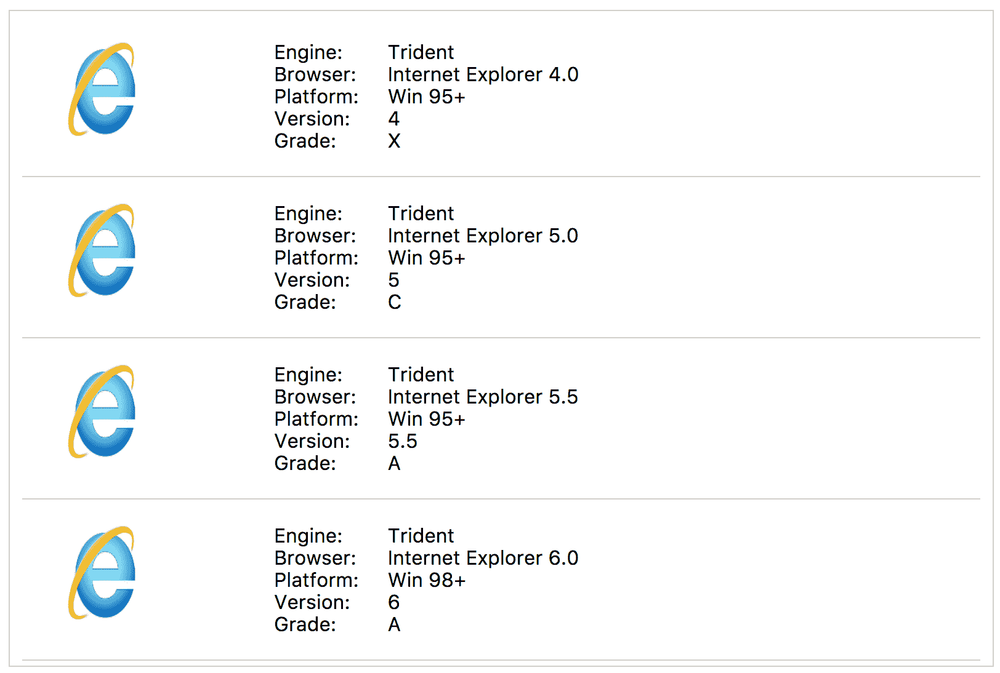

如前一个快照所示，数据是基于窗口滚动作为目标按需显示的。为了使这个 DataScroller 元素更具可读性，它支持使用`p-header`和`p-footer`标记的方面，例如页眉和页脚。默认情况下，DataScroller 组件侦听窗口的滚动事件。在内联模式的帮助下，还有一个选项可以将组件的容器定义为事件目标。为此，我们应该将`inline`属性启用为`true`（即`inline="true"`。

除了基于滚动的数据加载外，还可以使用显式按钮操作加载更多数据。组件应该定义一个`loader`属性，该属性引用按钮组件。带有加载器按钮的 DataScroller 组件将编写如下：

```ts
<p-dataScroller [value]="advancedBrowsers" [rows]="5" [loader]="loadButton">
  // Content goes here
</p-dataScroller>
<p-dataScroller [value]="advancedBrowsers" [rows]="5" [loader]="loadButton">

```

以下屏幕截图以加载程序显示为例显示快照结果：

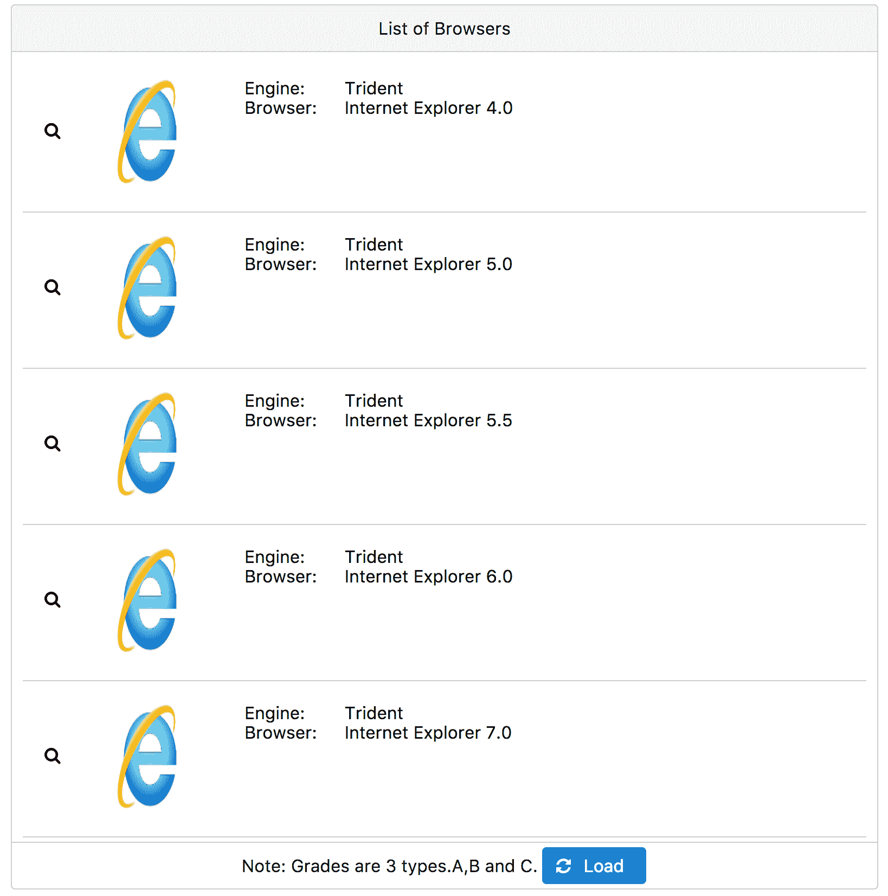

在前面的快照中，一旦用户单击左侧的搜索按钮，其他浏览器信息将以对话框格式显示。这样就可以显示如何在 DataScroller 组件中选择特定记录。


# 延迟加载


为了处理庞大的数据集，该组件还支持延迟加载特性。它不是加载整个数据，而是在每个滚动动作上加载数据块。它需要`lazy`和`onLazyLoad`属性来启用此行为。DataScroller 的延迟加载示例编写如下：

```ts
<p-dataScroller [value]="lazyloadingBrowsers" [rows]="5"
                [lazy]="true" (onLazyLoad)="loadData($event)">
  //Content goes here
</p-dataScroller>

```

component 类定义了延迟加载事件回调，以按块检索数据，如下所示：

```ts
loadData(event: any) {
  let start = event.first; //event.first = First row offset
  let end = start + event.rows; //event.rows = Number of rows per page
  this.browserService.getBrowsers().subscribe((browsers: any) =>
    this.lazyloadingBrowsers = browsers.slice(start, end));
}

```

在前面的代码片段中，您可以看到，`event`对象的`first`和`rows`属性有助于检索下一组记录。基于`rows`属性，它尝试在每次获取时获取下一个`rows`数量的记录。

The API method `reset` is used to reset the content or data of a DataScroller component. That is, the component will reset to its default state.
The complete demo application with instructions is available on GitHub at
[https://github.com/ova2/angular-development-with-primeng/tree/master/chapter5/datascroller](https://github.com/ova2/angular-development-with-primeng/tree/master/chapter5/datascroller).


# 用树可视化数据


树组件用于以图形格式显示数据的层次表示。它提供一个`TreeNode`对象数组作为其值。`TreeNode`API 提供了许多属性来创建树节点对象。树状结构基本上有以下三个主要组成部分：

*   树元素称为**节点**
*   连接元素的线称为分支
*   没有子节点的节点称为叶节点或叶

带有节点的树组件的基本示例如下所示（该节点将表示旅游景点）：

```ts
<p-tree [value]="basicTree"></p-tree>

```

树组件的数据应在嵌套的父子层次结构中提供。每个树节点都创建有一组属性，如`label`、`data`、`expandIcon`、`collapsedIcon`、`children`等。`TreeNode`属性的完整列表如下所示：

| **名称** | **型** | **违约** | **说明** |
| `label` | `string` | `null` | 节点的标签。 |
| `data` | `any` | `null` | 由节点表示的数据。 |
| `icon` | `string` | `null` | 要在内容旁边显示的节点的图标。 |
| `expandedIcon` | `string` | `null` | 要在展开状态下使用的图标。 |
| `collapsedIcon` | `string` | `null` | 要在折叠状态下使用的图标。 |
| `children` | `TreeNode[]` | `null` | 作为子节点的树节点数组。 |
| `leaf` | `boolean` | `null` | 指定节点是否具有子节点。用于延迟加载。 |
| `style` | `string` | `null` | 节点的内联样式。 |
| `styleClass` | `string` | `null` | 节点的样式类。 |
| `expanded` | `boolean` | `null` | 节点处于展开或折叠状态。 |
| `type` | `string` | `null` | 与`ng-template`类型匹配的节点类型。 |
| `parent` | `TreeNode` | `null` | 节点的父节点。 |
| `styleClass` | `string` | `null` | 节点元素的样式类的名称。 |
| `draggable` | `boolean` | `null` | 即使`draggableNodes`已启用，是否对特定节点禁用拖动。 |
| `droppable` | `boolean` | `null` | 即使`droppableNodes`已启用，是否对特定节点禁用丢弃。 |
| `selectable` | `boolean` | `null` | 用于禁用对特定节点的选择。 |

All properties of `TreeNode` are optional.

旅游景点示例的树节点结构如下所示：

```ts
"data":
[
  {
    "label": "Asia",
    "data": "Documents Folder",
    "expandedIcon": "fa-folder-open",
    "collapsedIcon": "fa-folder",
    "children": [{
      "label": "India",
      "data": "Work Folder",
      "expandedIcon": "fa-folder-open",
      "collapsedIcon": "fa-folder",
      "children": [{
        "label": "Goa", "icon": "fa-file-word-o",
        "data": "Beaches& Old Goa colonial architecture"},
          {"label": "Mumbai", "icon": "fa-file-word-o", "data": 
            "Shopping,Bollywood"},
          {"label": "Hyderabad", "icon": "fa-file-word-o", 
            "data": "Golconda Fort"}
      ]
    },
      {
        "label": "Singapore",
        "data": "Home Folder",
        "expandedIcon": "fa-folder-open",
        "collapsedIcon": "fa-folder",
        "children": [{
          "label": "Woodlands", "icon": "fa-file-word-o", 
          "data": "Parks,Sea food"}]
      },
    ]
  }
...
]

```

在实时应用中，通过服务检索远程数据源中的数据。将在组件类中注入以下服务：

```ts
@Injectable()
export class TreeNodeService {

  constructor(private http: Http) { }

  getTouristPlaces(): Observable<any[]> {
    return this.http.get('/img/data/cities.json')
      .map(response => response.json().data);
  }
}

```

component 类使用服务调用在页面加载时加载数据，如下所示：

```ts
basicTree: TreeNode[];

constructor(private nodeService: TreeNodeService) { }

ngOnInit() {
  this.nodeService.getTouristPlaces().subscribe(
    (places: any) => this.basicTree = places);
}

```

以下屏幕截图显示了分层树组件表示的快照结果作为示例：

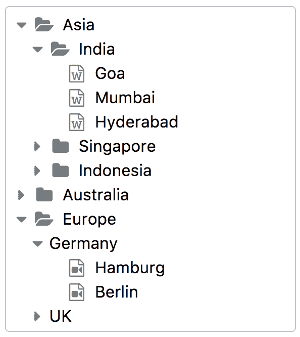

在前面的用例中，我们扩展了印度和德国的国家树节点，以查看它们的子节点表示为旅游景点。


# 选择功能-单个、多个和复选框


树组件支持三种选择，例如单个、多个和复选框。通过启用`selectionMode`属性和`selection`属性来提供单一选择，该属性保存选定的树节点。

具有单一选择功能的树组件（用于选择喜爱的旅游地点）将编写如下：

```ts
<p-tree [value]="singleSelectionTree" selectionMode="single" [(selection)]="selectedPlace" (onNodeSelect)="nodeSelect($event)" (onNodeUnselect)="nodeUnselect($event)"></p-tree>
<div>Selected Node: {{selectedPlace ? selectedPlace.label : 'none'}}</div>

```

以下屏幕截图显示了树组件的快照结果，以单个选择为例：


这里，通过将`selectionMode`设置为`multiple`（`selectionMode="multiple"`来启用多选。在本例中，`selection`属性将对象数组作为选定节点保存。多选也通过复选框选择提供。这可以通过设置`selectionMode="checkbox"`来实现。

具有多复选框选择功能以选择多个旅游景点的树组件将编写如下：

```ts
<p-tree [value]="checkboxSelectionTree" selectionMode="checkbox"
  [(selection)]="selectMultiplePlaces"></p-tree>
<div>Selected Nodes: <span *ngFor="let place of selectMultiplePlaces">{{place.label}} </span></div>

```

以下屏幕截图显示了树组件的快照结果，以复选框选择为例：

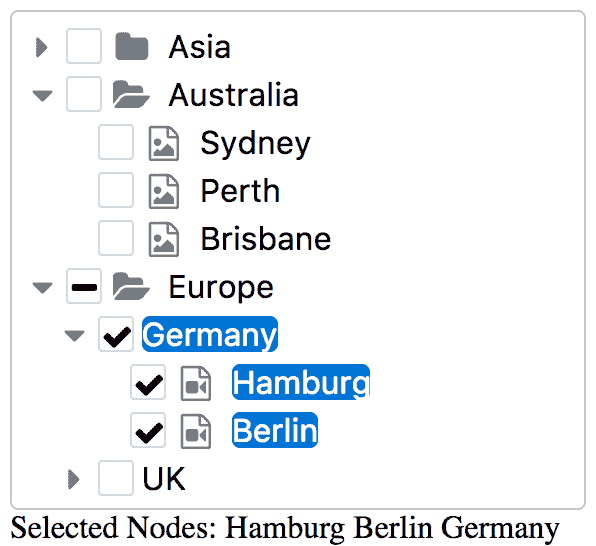

选择功能支持两个事件回调，如`onRowSelect`和`onRowUnselect`，它们提供选择和未选择的树节点。有关更多详细信息，请参阅事件部分。

选择节点的传播（向上和向下方向）通过默认启用的`propagateSelectionUp`和`propagateSelectionDown`属性进行控制。


# 超越基本用法-高级功能


树组件还支持许多高级功能：

*   可使用模板标签`ng-template`显示自定义内容。
*   使用`onNodeExpand`事件回调可以使用延迟加载功能。
*   使用本地模板引用变量应用每个树节点的 ContextMenu。
*   树组件的水平布局使用`layout="horizontal"`表达式显示。
*   通过启用`draggableNodes`和`droppableNodes`属性，可以实现源树组件和目标树组件之间的拖放功能。`dragdropScope`属性用于将拖放支持限制到特定区域。

行扩展或折叠行为可以通过外部化 API 方法以编程方式实现。例如，带有外部按钮的树，用于使用事件回调以编程方式展开或折叠树节点，如下所示：

```ts
<p-tree #expandingTree [value]="programmaticTree"></p-tree>
<div>
  <button pButton type="text" label="Expand all" (click)="expandAll()">
   </button>
  <button pButton type="text" label="Collapse all" (click)="collapseAll()"></button>
</div>

```

使用事件回调定义的组件类以递归方式切换树节点，如下所示：

```ts
expandAll() {
  this.programmaticTree.forEach( (node: any) => {
    this.expandRecursive(node, true);
  } );
}

collapseAll() {
  this.programmaticTree.forEach((node: any) => {
    this.expandRecursive(node, false);
  } );
}

expandRecursive(node: TreeNode, isExpand: boolean) {
  node.expanded = isExpand;
  if (node.children) {
    node.children.forEach( childNode => {
      this.expandRecursive(childNode, isExpand);
    } );
  }
}

```

该组件还支持四个事件回调，例如`onNodeExpand`、`onNodeCollapse`、`onNodeDrop`和`onNodeContextMenuSelect`。以下事件表提供了事件、参数及其描述的完整详细信息：

| **名称** | **参数** | **说明** |
| `onNodeSelect` | 

*   `event.originalEvent` ：浏览器事件
*   `event.node` ：所选节点实例

 | 选择节点时要调用的回调。 |
| `onNodeUnselect` | 

*   `event.originalEvent` ：浏览器事件
*   `event.node` ：未选节点实例

 | 取消选择节点时要调用的回调。 |
| `onNodeExpand` | 

*   `event.originalEvent` ：浏览器事件
*   `event.node` ：扩展节点实例

 | 展开节点时要调用的回调。 |
| `onNodeCollapse` | 

*   `event.originalEvent` ：浏览器事件
*   `event.node` ：崩溃节点实例

 | 在折叠节点时调用的回调。 |
| `onNodeContextMenuSelect` | 

*   `event.originalEvent` ：浏览器事件
*   `event.node` ：所选节点实例

 | 使用鼠标右键单击选择节点时要调用的回调。 |
| `onNodeDrop` | 

*   `event.originalEvent` ：浏览器事件
*   `event.dragNode` ：拖动节点实例
*   `event.dropNode` ：丢弃节点实例

 | 使用鼠标右键单击选择节点时要调用的回调。 |

The complete demo application with instructions is available on GitHub at
[https://github.com/ova2/angular-development-with-primeng/tree/master/chapter5/tree](https://github.com/ova2/angular-development-with-primeng/tree/master/chapter5/tree).


# 用 TreeTable 可视化数据


TreeTable 用于以表格格式显示分层数据。它需要一个`TreeNode`对象数组作为其值，并提供一个具有许多可选属性的`TreeNode`API。TreeTable 将列组件定义为具有类似于 DataTable 组件的`header`、`footer`、`field`和`style`属性的子元素。

以旅游地点树节点作为信息的树表组件的基本示例如下所示：

```ts
<p-treeTable [value]="basicTreeTable">
  <p-header>Basic</p-header>
  <p-column field="name" header="Name"></p-column>
  <p-column field="days" header="Days"></p-column>
  <p-column field="type" header="Type"></p-column>
</p-treeTable>

```

组件是通过分层方式排列`TreeNode`对象创建的。`TreeNode`对象由以下列出的许多属性组成：

| **名称** | **型** | **违约** | **说明** |
| `label` | `string` | `null` | 节点的标签。 |
| `data` | `any` | `null` | 由节点表示的数据。 |
| `icon` | `string` | `null` | 要在内容旁边显示的节点的图标。不被 TreeTable 使用。 |
| `expandedIcon` | `string` | `null` | 要在展开状态下使用的图标。不被 TreeTable 使用。 |
| `collapsedIcon` | `string` | `null` | 要在折叠状态下使用的图标。不被 TreeTable 使用。 |
| `children` | `TreeNode[]` | `null` | 作为子节点的树节点数组。 |
| `leaf` | `boolean` | `null` | 指定节点是否具有子节点。用于延迟加载。 |
| `style` | `string` | `null` | 节点的内联样式。 |
| `styleClass` | `string` | `null` | 节点的样式类。 |

旅游景点示例的`TreeNode`结构如下：

```ts
{
  "data": [
    {
      "data": {
        "name": "Asia",
        "days": "15",
        "type": "Continent"
      },
      "children": [
        {
          "data": {
            "name": "India",
            "days": "6",
            "type": "Country"
          },
          "children": [
            {
              "data": {
                "name": "Goa",
                "days": "2",
                "type": "City"
              }...
            }]
          }]
     } }
  ...
}

```

组件类中注入的服务和相同的服务调用表示几乎类似于上一节中解释的树组件。以下屏幕截图显示了带有分层游客信息的快照结果作为示例：


该组件还支持动态列，其中每个列都是通过`ngFor`指令循环创建的。


# 选择功能-单个、多个和复选框


TreeTable 组件支持三种选择，例如 single、multiple 和 checkbox。通过启用树表上的`selectionMode`属性和保存所选树表节点的`selection`属性，可以提供单一选择。

具有单一选择功能的树表组件可选择最喜爱的旅游地点，其编写如下：

```ts
<p-treeTable [value]="singleSelectionTreeTable" selectionMode="single"   
  [(selection)]="selectedTouristPlace   
  (onNodeSelect)="nodeSelect($event)"   
  (onNodeUnselect)="nodeUnselect($event)" 
  (onRowDblclick)="onRowDblclick($event)" >
    <p-header>Singe Selection</p-header>
    <p-column field="name" header="Name"></p-column>
    <p-column field="days" header="Days"></p-column>
    <p-column field="type" header="Type"></p-column>
</p-treeTable>

```

以下屏幕截图以单个选择显示快照结果为例：


然而，通过将`selectionMode`设置为多个（`selectionMode="multiple"`来启用多个选择。在本例中，`selection`属性将对象数组作为选定节点保存。多选也通过复选框选择提供。这可以通过设置`selectionMode="checkbox"`来实现。

具有多复选框选择功能以选择多个旅游景点的树表组件将编写如下：

```ts
<p-treeTable [value]="checkboxSelectionTreeTable" selectionMode="checkbox"
  [(selection)]="selectedMultiTouristPlaces">
  <p-header>Checkbox Selection</p-header>
  <p-column field="name" header="Name"></p-column>
  <p-column field="days" header="Days"></p-column>
  <p-column field="type" header="Type"></p-column>
</p-treeTable>

```

以下屏幕截图以选中复选框为例显示快照结果：

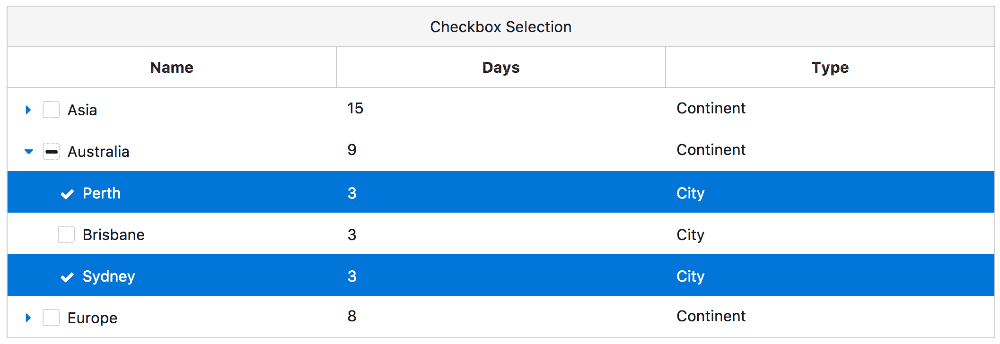

选择功能支持两个事件回调，如`onNodeSelect`和`onNodeUnselect`，提供选择和未选择的树节点。有关更多详细信息，请参阅事件部分。


# 超越基本用法-高级功能


TreeTable 组件还支持各种高级功能，例如使用`onNodeExpand`回调延迟加载、使用`ng-template`模板标记定制可编辑内容，以及上下文菜单实现，这与 DataTable 组件类似。它还支持使用`p-header`和`p-footer`标记的页眉和页脚方面。

TreeTable 的内容显示是使用`ng-template`定制的。默认情况下，树节点的标签显示在树节点内。要自定义内容，请在获取该列作为隐式变量（`let-col`）的列中定义`ng-template`，并将`rowData`定义为节点实例（`let-node="rowData"`。同样，我们可以自定义此组件的页眉和页脚。

让我们以可编辑树节点为例，在每个模板中放置一个输入，如下所示：

```ts
<p-treeTable [value]="templateTreeTable">
  <p-header>Editable Cells with Templating</p-header>
  <p-column field="name" header="Name">
    <ng-template let-node="rowData" pTemplate="body">
      <input type="text" [(ngModel)]="node.data.name" 
        class="edit-input">
    </ng-template>
  </p-column>
  <p-column field="days" header="Days">
    <ng-template let-node="rowData" pTemplate="body">
      <input type="text" [(ngModel)]="node.data.days" 
        class="edit-input">
    </ng-template>
  </p-column>
  <p-column field="type" header="Type">
    <ng-template let-node="rowData" pTemplate="body">
      <input type="text" [(ngModel)]="node.data.type" 
        class="edit-input">
    </ng-template>
  </p-column>
</p-treeTable>

```

以下屏幕截图以可编辑模板为例显示快照结果：

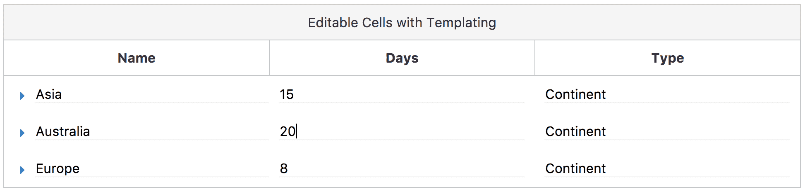

在前面的快照中，我们可以编辑所有树节点字段。例如，我们将旅游套餐天数从 9 天更新为 20 天。TreeTable 还支持扩展/折叠节点的事件回调，例如上下文菜单的`onNodeExpand`、`onNodeCollapse`和`onContextmenuSelect`事件。有关更多详细信息，请参阅事件部分。

PrimeNG 4.1 introduced the `toggleColumnIndex` property, which is used to define the index of the column that contains the the `toggler` element. By default, the `toggleColumnIndex` value is `0` (TreeTable always shows `toggler` on first column if `togglerColumnIndex` is not defined).

以下事件表提供了事件、参数及其描述的完整详细信息：

| **名称** | **参数** | **说明** |
| `onNodeSelect` | 

*   `event.originalEvent` ：浏览器事件
*   `event.node` ：所选节点实例

 | 选择节点时要调用的回调。 |
| `onNodeUnselect` | 

*   `event.originalEvent` ：浏览器事件
*   `event.node` ：未选节点实例

 | 取消选择节点时要调用的回调。 |
| `onNodeExpand` | 

*   `event.originalEvent` ：浏览器事件
*   `event.node` ：扩展节点实例

 | 展开节点时要调用的回调。 |
| `onNodeCollapse` | 

*   `event.originalEvent` ：浏览器事件
*   `event.node` ：崩溃节点实例

 | 在折叠节点时调用的回调。 |
| `onContextMenuSelect` | 

*   `event.originalEvent` ：浏览器事件
*   `event.node` ：所选节点实例

 | 使用鼠标右键单击选择节点时要调用的回调。 |
| `onRowDblclick` | 

*   `event.originalEvent` ：浏览器事件
*   `event.node` ：所选节点实例

 | 双击行时要调用的回调。 |

The complete demo application with instructions is available on GitHub at
[https://github.com/ova2/angular-development-with-primeng/tree/master/chapter5/treetable](https://github.com/ova2/angular-development-with-primeng/tree/master/chapter5/treetable).


# 按计划管理活动


Schedule 是基于`FullCalendar`jQuery 插件的全尺寸拖放事件日历。日程安排的事件应形成一个数组，并使用`events`属性定义。Schedule 组件依赖于`FullCalendar`库，因此它需要页面中列出的以下资源：

*   Schedule 组件使用样式表和 JavaScript 文件嵌入到 web 页面中。因此，我们需要在 HTML 页面的`head`部分包含`FullCalendar`库的样式表（`.css`和 JavaScript（`.js`文件）。
*   添加`jQuery`和`Moment.js`库作为完整日历的必填库。在加载`FullCalendar`库的 JavaScript 文件之前，必须加载这两个库。

因此，我们将`FullCalendar`和其他依赖资源包含在根`index.html`文件中，如下所示：

```ts
<!-- Schedule CSS resources-->
<link rel="stylesheet" type="text/css" href="https://cdnjs.cloudflare.com/ajax/libs/fullcalendar/3.1.0/
fullcalendar.min.css">
<!-- Schedule Javascript resources-->
<script src="https://code.jquery.com/jquery-2.2.4.min.js"></script>
<script src="https://cdnjs.cloudflare.com/ajax/libs/moment.js/2.13.0/moment.min.js"></script>
<script src="https://cdnjs.cloudflare.com/ajax/libs/fullcalendar/3.1.0/
fullcalendar.min.js"></script>

```

为整个月定义的时间表组件的基本示例如下所示：

```ts
<p-schedule [events]="events" [height]="700" 
  [styleClass]="'schedule-width'">
</p-schedule>

```

基本上，所有类型的事件都具有诸如标题、持续时间（开始和结束日期）、日期类型（完整/部分日期）等属性。因此，事件类的定义如下：

```ts
export class MyEvent {
  id: number;
  title: string;
  start: string;
  end: string;
  allDay: boolean = true;
}

```

计划事件的数据应以前面的格式精确定义为原型。但在实时情况下，使用远程服务调用获取数据，并在事件发生任何更改时立即在 Schedule UI 中更新数据。事件服务用于使用 HTTP 模块和 Observable 从数据源检索数据（在本例中，它从 JSON 事件文件检索数据），其定义如下：

```ts
@Injectable()
export class EventService {

  constructor(private http: Http) { }

  getEvents(): Observable<any> {
    return this.http.get('/img/data/scheduleevents.json')
      .map(response => response.json().data);
  }
}

```

注入的服务在网页的初始加载期间获取数据。component 类必须为 observable 定义订阅，如下所示：

```ts
events: any[];

constructor(private eventService: EventService) { }

ngOnInit() {
  this.eventService.getEvents().subscribe((events: any) => 
  {this.events = events;});
}

```

以下屏幕截图显示了嵌入式明细表组件显示的快照结果，例如：


根据前面的快照，标题显示日期（月份和年份）、今天标签和月份导航控件。主体或内容区域包含当月的每一天以及特定日期的事件，并带有蓝色叠加区域。


# 标题自定义


在上一个快照中，我们观察了计划内容区域以及默认的标题文本和控件。Schedule 元素的默认标头配置对象将编写如下：

```ts
{
  left: 'title', 
  center: '',
  right: 'today prev,next'
}

```

通过`header`属性修改上述默认表头显示，该属性保存表头配置对象，如下所示：

```ts
<p-schedule [events]="events" [header]="headerConfig" [height]="700"
  [styleClass]="'schedule-width'"></p-schedule>

```

让我们定义左侧的导航控件、中间的标题和右侧的视图（月、周、日），将其表示为配置对象：

```ts
this.headerConfig = {
  left: 'prev,next today',
  center: 'title',
  right: 'month,agendaWeek,agendaDay'
};

```

以下屏幕截图显示了自定义计划标题的快照结果，例如：


# 超越基本用法-高级功能


除了上述常规功能外，Schedule 组件还支持通过`onViewRender`事件回调进行延迟加载，该回调将在呈现新的日期范围或视图类型更改时调用。具有延迟加载事件回调调用的计划组件将编写如下：

```ts
<p-schedule [events]="events" (onViewRender)="loadEvents($event)" 
[height]="700" [styleClass]="'schedule-width'"></p-schedule>

```

component 类定义了一个延迟加载回调来按需检索事件数据，其编写如下：

```ts
loadEvents(event: any) {
  let start = event.view.start;
  let end = event.view.end;
  // In real time the service call filtered based on  
  //start and end dates
  this.eventService.getEvents().subscribe((events: any) =>
  {this.events = events;});
}

```

该组件还支持通过`locale`属性进行本地化。例如，德语标签由设置`locale="de"`表示。本地化标签应在类似于日历的组件中定义。

The UI is updated automatically when there is any change in the events data. This is very helpful for CRUD operations implementation on Schedule.


# 事件和方法


Schedule 组件在单击、鼠标、调整大小以及拖放用户操作时提供许多事件回调，如下所示：

| **名称** | **说明** |
| `onDayClick` | 当用户单击某一天时触发 |
| `onEventClick` | 当用户单击事件时触发 |
| `onEventMouseover` | 当用户将鼠标悬停在事件上时触发 |
| `onEventMouseout` | 当用户将鼠标移出事件时触发 |
| `onEventDragStart` | 事件拖动开始时触发 |
| `onEventDragStop` | 事件拖动停止时触发 |
| `onEventDrop` | 当拖动停止且事件移动到*不同*天/时间时触发 |
| `onEventResizeStart` | 事件大小调整开始时触发 |
| `onEventResizeStop` | 事件大小调整停止时触发 |
| `onEventResize` | 当调整大小停止且事件持续时间已更改时触发 |
| `onViewRender` | 在呈现新的日期范围或视图类型切换时触发 |
| `onViewDestroy` | 需要拆除渲染日期范围时触发 |
| `onDrop` | 当拖动表被放到计划中时触发 |

此外，它还提供了许多 API 方法来处理不同的用例，如下所示：

| **名称** | **参数** | **说明** |
| `prev()` | - | 将计划向后移动一步（按一个月、一周或一天） |
| `next()` | - | 将计划向前移动一步（按一个月、一周或一天） |
| `prevYear()` | - | 将时间表向后移一年 |
| `nextYear()` | - | 将时间表提前一年 |
| `today()` | - | 将计划移动到当前日期 |
| `gotoDate(date)` | `date`：导航日期 | 将计划移动到任意日期 |
| `incrementDate(duration)` | `duration`：要添加到当前日期的持续时间 | 将计划向前/向后移动任意时间 |
| `getDate()` | - | 返回日历当前日期的时刻 |
| `changeView(viewName)` | `viewName`：要更改为的有效视图字符串 | 立即切换到不同的视图 |

上述 API 方法将按计划提供完全控制。在许多用例中，这些方法调用非常有用。例如，通过`.next()`方法访问日程的下一个视图（月、周或日），如下所示：

```ts
<p-schedule [events]="events" #schedule></p-schedule>
<button type="button" pButton (click)="next(schedule)"></p-button>

```

component 类定义了 click 事件回调，该回调将在下一天、下一周或下一个月调用，如下所示：

```ts
next(schedule) {
  schedule.next();
}

```

The complete demo application with instructions is available on GitHub at
[https://github.com/ova2/angular-development-with-primeng/tree/master/chapter5/schedule](https://github.com/ova2/angular-development-with-primeng/tree/master/chapter5/schedule).


# 总结


此时，您将了解所有数据迭代组件及其最常用的功能，如选择行、排序、分页、筛选数据等。接下来，我们能够以表格、网格和列表格式显示（分层）数据。此外，您知道如何实现列的大小调整、重新排序、切换和分组、自定义 DataTable 中的单元格内容以及使用树和树表组件可视化数据。在下一章中，您将看到令人惊叹的叠加，如对话框、确认对话框、叠加面板和通知组件，如咆哮和消息以及各种功能。