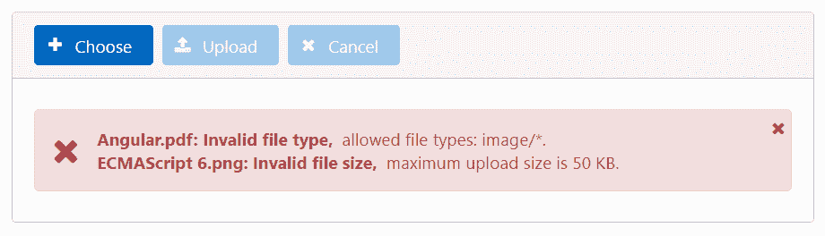
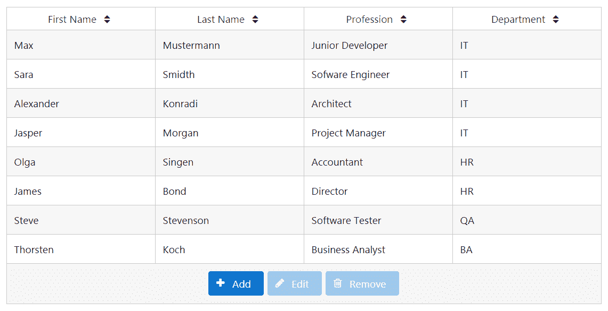
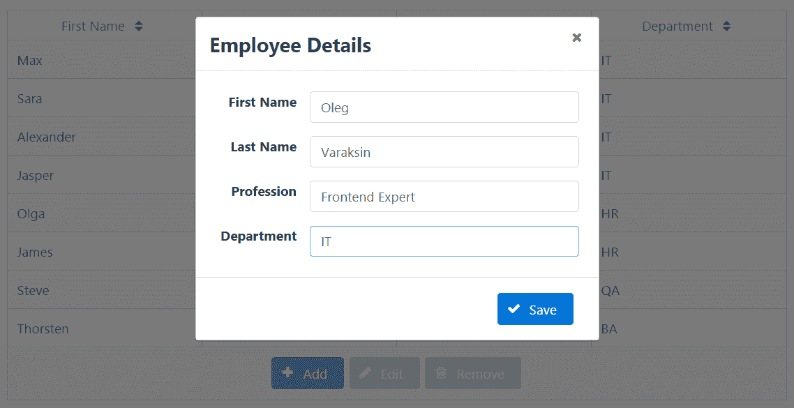
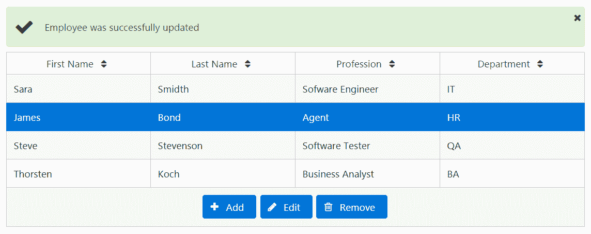
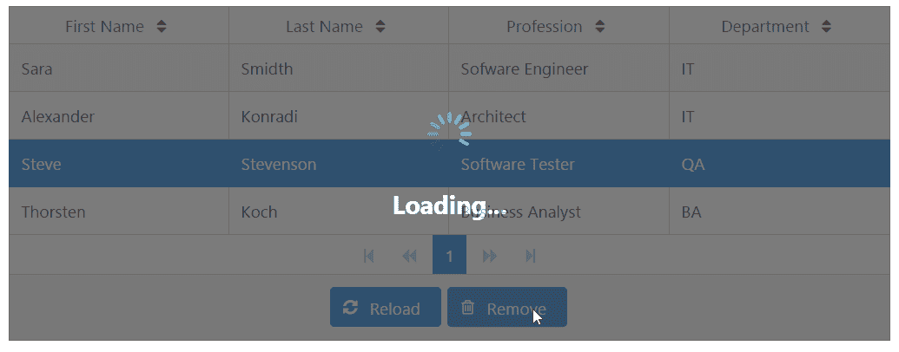
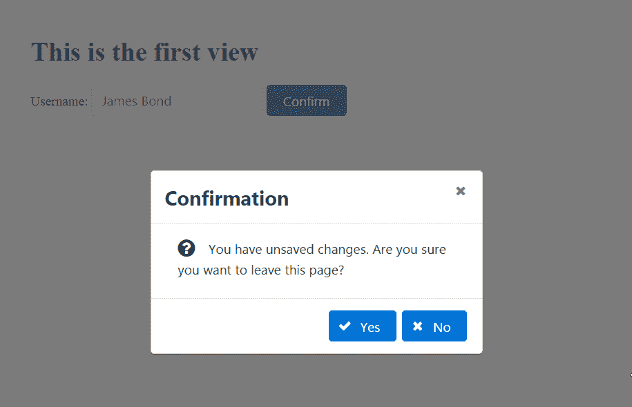

# 九、杂项用例和最佳实践


杂项用例和最佳实践引入了 PrimeNG 库更有趣的特性。您将了解文件上载、拖放功能、显示图像集合、实际 CRUD 实现、延迟页面加载、阻止页面片段、显示带有保护路由的确认对话框等等。尽管有一整套组件，但用户有时对现有组件的功能有特殊要求，或者需要新的自定义组件。

本章的目的也是为了促进在 Priming 基础设施之上开始组件开发。我们将完成构建可重用组件的完整过程，并开发自定义向导组件。该向导可用于工作流，工作流涉及完成任务的多个步骤。此外，阅读本章后，读者将了解角度应用中最先进的状态管理。

在本章中，我们将介绍以下主题：

*   文件上传的辉煌
*   学习可拖放指令
*   使用 Galleria 显示图像集
*   使用 DataTable 的 CRUD 示例实现
*   优化页面加载的延迟机制
*   在长时间运行 AJAX 调用期间阻止页面片段
*   进程状态指示器正在运行
*   使用颜色选择器选择颜色
*   显示带有保护路由的确认对话框
*   使用步骤实现自定义向导组件
*   @ngrx/store 状态管理简介


# 文件上传的辉煌


FileUpload 组件提供了一种文件上传机制，与基本的 HTML`<input type="file">`文件上传定义相比，具有增强的功能。该组件提供了一个支持 HTML5 的 UI，具有拖放、上传多个文件、进度跟踪、验证等功能。

File uploading component works in all modern browsers as well as IE 10 and higher.


# 基本、多个和自动文件上载


为了能够使用文件上载，需要两个属性——用于标识后端上载文件的请求参数的名称和用于上载文件的远程 URL。例如：

```ts
<p-fileUpload name="demofiles[]" url="http://demoserver.com/upload">
</p-fileUpload>

```

该组件显示为一个带有三个按钮的面板：选择、上载、取消，以及包含选定文件的内容部分。“选择”按钮显示一个文件对话框，用于选择一个或多个文件。选择后，可通过下两个按钮分别上载或取消文件。默认情况下始终显示文件名和大小。此外，对于图像，您还将看到预览：


The width of the previewed image can be adjusted with the `previewWidth` attribute.

文件上传还提供了一个更简单的用户界面，只需选择一个按钮，无需内容部分。您可以通过将`mode`属性设置为`"basic"`来激活此 UI：

```ts
<p-fileUpload mode="basic" name="demofiles[]"  
              url="http://demoserver.com/upload">
</p-fileUpload>

```

默认情况下，只能从“文件”对话框中选择一个文件。将`multiple`选项设置为`true`允许一次选择多个文件。将`auto`选项设置为`true`立即开始上传，无需按下任何按钮。按钮上载和取消按钮在自动上载模式下隐藏：

```ts
<p-fileUpload name="demofiles[]" url="http://demoserver.com/upload" 
              [multiple]="true" [auto]="true">
</p-fileUpload>

```

File selection can also be done by dragging one or more files from the filesystem and dropping them onto the content section of the FileUpload component.

在编写本文时，FileUpload 组件的后端无法使用 Angular 的模拟 API 进行模拟。在 GitHub 上的演示应用中，我们使用了一个简单的本地服务器`json-server`（[https://github.com/typicode/json-server](https://github.com/typicode/json-server) 来伪造后端。否则，您将面临例外情况。安装后，可以使用以下命令启动服务器：

```ts
json-server db.json --port 3004

```


项目根目录中的`db.json`文件只定义了端点：

```ts
{
  "fake-backend": {}
}

```

现在，您可以使用伪造的远程 URL，而不会出现任何异常：

```ts
<p-fileUpload name="demofiles[]" url="http://localhost:3004/
              fake-backend">
</p-fileUpload>

```

The complete demo application with instructions is available on GitHub at
[https://github.com/ova2/angular-development-with-primeng/tree/master/chapter9/fileupload](https://github.com/ova2/angular-development-with-primeng/tree/master/chapter9/fileupload).


# 按文件类型和大小列出的限制


默认情况下，可以上载任何文件类型。文件大小也不受限制。您可以通过分别设置`accept`和`maxFileSize`选项来限制文件类型和大小：

```ts
<p-fileUpload name="demofiles[]" url="http://localhost:3004/
              fake-backend" multiple="true" accept="image/*"     
              maxFileSize="50000">
</p-fileUpload>

```

在该示例中，仅可上载具有最大大小`50000`字节的图像。违反这些规则会导致验证消息出现在内容部分。



`accept`属性的可能值：

| **值** | **说明** |
| `<file extension>` | 以点开头的文件扩展名，例如，[T0]、[T1]、[T2]等等。 |
| `audio/*` | 所有声音文件。 |
| `video/*` | 所有视频文件。 |
| `image/*` | 所有图像文件。 |
| `<media type>` | 根据 IANA 媒体类型（[的有效媒体类型 http://www.iana.org/assignments/media-types/media-types.xhtml [T2]。例如，[T0]。](http://www.iana.org/assignments/media-types/media-types.xhtml) |

To specify more than one value, separate the values with a comma, for example, `accept="audio/*,video/*,image/*"`.


# 定制


可以使用以下四个选项自定义验证消息：

| **物业名称** | **说明** | **默认值** |
| `invalidFileSizeMessageSummary` | 无效文件大小的摘要消息。占位符`{0}`表示文件名。 | `{0}: Invalid file size,` |
| `invalidFileSizeMessageDetail` | 无效文件大小的详细信息。占位符`{0}`表示文件大小。 | `maximum upload size is {0}.` |
| `invalidFileTypeMessageSummary` | 无效文件类型的摘要消息。占位符`{0}`表示文件类型。 | `{0}: Invalid file type,` |
| `invalidFileTypeMessageDetail` | 无效文件类型的详细信息。占位符`{0}`表示允许的文件类型。 | `allowed file types: {0}` |

下一个代码片段和屏幕截图演示自定义消息。它们还显示了如何为按钮设置自定义标签：

```ts
<p-fileUpload name="demofiles[]" url="http://localhost:3004/
              fake-backend"
              multiple="true" accept="image/*" maxFileSize="50000"
              invalidFileSizeMessageSummary="{0} has wrong size, "
              invalidFileSizeMessageDetail="it exceeds {0}."
              invalidFileTypeMessageSummary="{0} has wrong file type, "
              invalidFileTypeMessageDetail="it doesn't match: {0}."
              chooseLabel="Select file"
              uploadLabel="Upload it!"
              cancelLabel="Abort">
</p-fileUpload>

```


用户界面可以通过三个名为`ng-template`的标签进行完全定制。您可以自定义工具栏、内容部分和包含选定文件的区域。下一个代码段显示了一个完全可自定义的 UI：

```ts
<p- name="demofiles[]" url="http://localhost:3004/fake-backend"
    multiple="true" accept=".pdf" maxFileSize="1000000">
  <ng-template pTemplate="toolbar">
    <div style="font-size: 0.9em; margin-top: 0.5em;">
      Please select your PDF documents
    </div>
  </ng-template>
  <ng-template let-file pTemplate="file">
    <div style="margin: 0.5em 0 0.5em 0;">
      <i class="fa fa-file-pdf-o" aria-hidden="true"></i>
      {{file.name}}
    </div>
  </ng-template>
  <ng-template pTemplate="content">
    <i class="fa fa-cloud-upload" aria-hidden="true"></i>
    Drag and drop files onto this area
  </ng-template>
</p-fileUpload>

```

屏幕截图显示未选择任何文件时的初始 UI 状态：


从文件对话框中选择后，UI 如下所示：


请注意，只能选择 PDF 文件。带有`pTemplate="file`的`ng-template`将`File`实例作为隐式变量获取。这个实例有一个属性`name`，我们在自定义 UI 中利用它。

Refer to the official documentation to read more about `File` at [https://developer.mozilla.org/en-US/docs/Web/API/File](https://developer.mozilla.org/en-US/docs/Web/API/File).

下一个定制级别是回调事件，它在某个时间点触发。有`onBeforeUpload`、`onBeforeSend`、`onUpload`、`onError`、`onClear`、`onSelect`和`uploadHandler`事件。下一个代码段演示了其中两个：

```ts
<p-fileUpload name="demofiles[]" url="http://localhost:3004/
              fake-backend" accept="image/*" maxFileSize="1000000"
              (onBeforeSend)="onBeforeSend($event)" 
              (onUpload)="onUpload($event)">
</p-fileUpload>

```

[T0]事件在上传前不久触发。已注册的回调获取具有两个参数的事件对象：

*   `xhr`：`XMLHttpRequest`实例（[https://developer.mozilla.org/en/docs/Web/API/XMLHttpRequest](https://developer.mozilla.org/en/docs/Web/API/XMLHttpRequest) ）。
*   `formData`：`FormData`对象（[https://developer.mozilla.org/en/docs/Web/API/FormData](https://developer.mozilla.org/en/docs/Web/API/FormData) ）。

我们可以使用这个回调来定制请求数据，例如 post 参数或头信息。例如，我们可以设置一个令牌`jwt`将其发送到服务器。只需在 component 类中编写以下回调方法：

```ts
onBeforeSend(event: any) {
  (<XMLHttpRequest>event.xhr).setRequestHeader('jwt', 'xyz123');
}

```

如您所见，令牌确实已发送：


当所选文件全部上传完毕后触发`onUpload`事件。他们传递的事件对象具有所述的`XMLHttpRequest`实例和`File`类型的对象数组。我们可以对文件进行迭代，并将它们收集在一起进行进一步处理：

```ts
uploadMsgs: Message[] = [];
uploadedFiles: any[] = [];

onUpload(event: any) {
  for (let file of event.files) {
    this.uploadedFiles.push(file);
  }

  // produce a message for growl notification
  this.uploadMsgs = [];
  this.uploadMsgs.push({severity: 'info', 
    summary: 'File Uploaded', detail: ''});
}

```

通过设置`customUpload="true"`并定义自定义上传处理程序，可以提供自定义上传实现。例如：

```ts
<p-fileUpload name="demofiles[]" customUpload="true"
              (uploadHandler)="smartUploader($event)">
</p-fileUpload>

```

如何实现`smartUploader`回调取决于您。回调可以访问`event.files`，这是一个类型为`File`的对象数组。


# 学习可拖放指令


拖放是一种动作，意味着将对象抓取到不同的位置。能够拖放的组件丰富了 web，为现代 UI 模式奠定了坚实的基础。Priming 中的拖放实用程序允许我们高效地创建可拖放的用户界面。它们使开发人员在浏览器级别处理实现细节变得抽象。

在本节中，您将了解[T0]和[T1]指令。我们将引入一个 DataGrid 组件，其中包含一些虚构的文档，并使这些文档可以拖动，以便将它们放入回收站。回收站作为 DataTable 组件实现，它显示被删除文档的属性。为了更好地理解开发的代码，首先要看一幅图：


此图显示拖放三个文档后发生的情况。

The complete demo application with instructions is available on GitHub at
[https://github.com/ova2/angular-development-with-primeng/tree/master/chapter9/dragdrop](https://github.com/ova2/angular-development-with-primeng/tree/master/chapter9/dragdrop).


# 拖拉的。


`pDraggable`附加到元素以添加拖动行为。`pDraggable`属性的值是必需的——它定义了将可拖放项与可拖放项相匹配的范围。默认情况下，整个元素是可拖动的。我们可以通过应用`dragHandle`属性来限制可拖动区域。`dragHandle`的值可以是任何 CSS 选择器。在 DataGrid 中，使用可用的文档，我们仅使面板的标题可拖动：

```ts
<p-dataGrid [value]="availableDocs">
  <p-header>
    Available Documents
  </p-header>
  <ng-template let-doc pTemplate="item">
    <div class="ui-g-12 ui-md-4" pDraggable="docs"
      dragHandle=".ui-panel-titlebar" dragEffect="move"
      (onDragStart)="dragStart($event, doc)" 
        (onDragEnd)="dragEnd($event)">
      <p-panel [header]="doc.title" [style]="{'text-align':'center'}">
        
      </p-panel>
    </div>
  </ng-template>
</p-dataGrid>

```

当拖动过程开始、继续和结束时，draggable 元素可以触发三个事件。它们分别是`onDragStart`、`onDrag`和`onDragEnd`。在 component 类中，我们在开始时缓冲拖动的文档，并在拖动过程结束时重置它。此任务分两次回调完成：`dragStart`和`dragEnd`：

```ts
class DragDropComponent {
  availableDocs: Document[];
  deletedDocs: Document[];
  draggedDoc: Document;

  constructor(private docService: DocumentService) { }

  ngOnInit() {
    this.deletedDocs = [];
    this.docService.getDocuments().subscribe((docs: Document[]) =>
      this.availableDocs = docs);
  }

  dragStart(event: any, doc: Document) {
    this.draggedDoc = doc;
  }

  dragEnd(event: any) {
    this.draggedDoc = null;
  }

  ...
}

```

在显示的代码中，我们使用了具有以下属性的`Document`接口：

```ts
interface Document {
  id: string;
  title: string;
  size: number;
  creator: string;
  creationDate: Date;
  extension: string;
}

```

在演示应用中，当鼠标移动到任何面板标题上时，我们将光标设置为`move`。此技巧为可拖动区域提供了更好的视觉反馈：

```ts
body .ui-panel .ui-panel-titlebar {
  cursor: move;
}

```

我们还可以设置`dragEffect`属性来指定拖动操作允许的效果。可能的值为`none`、`copy`、`move`、`link`、`copyMove`、`copyLink`、`linkMove`和`all`。有关更多详细信息，请参阅官方文件[https://developer.mozilla.org/en-US/docs/Web/API/DataTransfer/effectAllowed](https://developer.mozilla.org/en-US/docs/Web/API/DataTransfer/effectAllowed) 。


# 可降落


`pDroppable`附加到元素以添加放置行为。`pDroppable`属性的值应该与`pDraggable`具有相同的范围。

Droppable scope can also be an array to accept multiple droppables.

可拖放元素可以触发四个事件：

| **事件名称** | **说明** |
| `onDragEnter` | 当可拖动元素进入放置区域时调用。 |
| `onDragOver` | 在拖放区域上拖动可拖动元素时调用。 |
| `onDrop` | 当拖放表拖放到拖放区域时调用。 |
| `onDragLeave` | 当可拖动元素离开放置区域时调用。 |

在演示应用中，可拖放区域的整个代码如下所示：

```ts
<div pDroppable="docs" (onDrop)="drop($event)" 
     [ngClass]="{'dragged-doc': draggedDoc}">
  <p-dataTable [value]="deletedDocs">
    <p-header>Recycle Bin</p-header>
    <p-column field="title" header="Title"></p-column>
    <p-column field="size" header="Size (bytes)"></p-column>
    <p-column field="creator" header="Creator"></p-column>
    <p-column field="creationDate" header="Creation Date">
      <ng-template let-col let-doc="rowData" pTemplate="body">
        {{doc[col.field].toLocaleDateString()}}
      </ng-template>
    </p-column>
  </p-dataTable>
</div>

```

无论何时将文档拖放到回收站，拖放的文档都会从所有可用文档列表中删除，并添加到已删除文档列表中。这发生在`onDrop`回调中：

```ts
drop(event: any) {
  if (this.draggedDoc) {
    // add draggable element to the deleted documents list 
    this.deletedDocs = [...this.deletedDocs, this.draggedDoc];
    // remove draggable element from the available documents list
    this.availableDocs = this.availableDocs.filter(
      (e: Document) => e.id !== this.draggedDoc.id);
    this.draggedDoc = null;
  }
}

```

Both available and deleted documents are updated by creating new arrays instead of manipulating existing arrays. This is necessary in data iteration components to force Angular run change detection. Manipulating existing arrays would not run change detection and the UI would not be updated.

当拖动任何包含文档的面板时，“回收站”区域将显示红色边框。我们通过将`ngClass`设置为`[ngClass]="{'dragged-doc': draggedDoc}"`来实现此高亮显示。设置`draggedDoc`对象时，启用样式类`dragged-doc`。样式类的定义如下所示：

```ts
.dragged-doc {
  border: solid 2px red;
}

```


# 使用 Galleria 显示图像集合


Galleria 组件可用于显示具有过渡效果的图像集合。


# 启动并运行它


图像集合是以编程方式创建的——它是具有以下三个属性的对象数组：

*   `source`：图像的路径
*   `title`：字幕部分的标题文本
*   `alt`：标题下方标题部分的描述

让我们创建一个`GalleriaComponent`类：

```ts
class GalleriaComponent {
  images: any[];

  ngOnInit() {
    this.images = [];

    this.images.push({
      source: '/img/daimg/cars/Yeni.png',
      alt: 'This is a first car',
      title: 'Yeni Vollkswagen CC'
    });
    this.images.push({
      source: '/img/daimg/cars/Golf.png',
      alt: 'This is a second car',
      title: 'Golf'
    });

    ... // more image definitions
  }
}

```

在 HTML 代码中，通过输入属性`images`引用集合：

```ts
<p-galleria [images]="images" panelWidth="400" panelHeight="320"
            [autoPlay]="false" [showCaption]="true">
</p-galleria>

```

开发的 UI 如下所示：


内容面板的宽度和高度可以通过`panelWidth`和`panelHeight`属性进行定制。`showCaption`属性允许在标题部分显示标题和说明。

在底部，有一个小图像区域，称为**电影带**。默认情况下，胶片带的可见性通过`showFilmstrip`属性启用。您可以通过将属性设置为`false`来禁用它。可以分别使用`frameWidth`和`frameHeight`属性自定义胶片带中显示的帧的宽度和高度。所有值应以像素为单位提供。

There is also the `activeIndex` attribute, which can be used to set the position of the displayed image. For example, if you want to display the second image on the initial page load, you can set `activeIndex="1"`. The default value is `0`.


# 自动播放模式和效果


自动播放模式打开幻灯片放映。默认情况下启用自动播放模式。在本例中，我们通过设置`[autoPlay]="false"`来禁用幻灯片放映。在自动播放模式下，图像之间的转换在`4000`毫秒内发生。此时间间隔可以使用`transitionInterval`属性进行自定义。

迭代图像时，可以应用过渡效果。`effect`属性可以有值`blind`、`bounce`、`clip`、`drop`、`explode`、`fade`（默认值）、`fold`、`highlight`、`puff`、`pulsate`、`scale`、`shake`、`size`、`slide`和`transfer`。`effectDuration`属性也可用于决定转换的持续时间。其默认值为`250`毫秒：

```ts
<p-galleria [images]="images" panelWidth="400" panelHeight="320"
            effect="bounce" [effectDuration]="150">
</p-galleria>

```


# 事件


只有一个事件`onImageClicked`，当点击显示的图像时触发：

```ts
<p-galleria [images]="images" panelWidth="400" panelHeight="220"
            [autoPlay]="false" [showCaption]="true"
            (onImageClicked)="onImageClicked($event)">
</p-galleria>

```

调用的回调获取一个事件对象。除了单击的图像和本机单击事件的索引之外，传入的事件对象从集合中保留整个图像实例。我们可以在回调中访问源 URL，并在新的浏览器选项卡中打开图像：

```ts
onImageClicked($event: any) {
  window.open($event.image.source, '_blank');
}

```

The complete demo application with instructions is available on GitHub at
[https://github.com/ova2/angular-development-with-primeng/tree/master/chapter9/galleria](https://github.com/ova2/angular-development-with-primeng/tree/master/chapter9/galleria).


# 使用 DataTable 的 CRUD 示例实现


PrimeNG 是为企业应用创建的。实现一个**CRUD**（**创建、读取、更新**和**删除**场景非常容易。本节中的示例演示了将员工作为域模型对象的场景。可以提取、创建、更新和删除员工。所有 CRUD 操作都通过 Angular 的 HTTP 服务进行，该服务与模拟后端进行通信。我们将在后面的*部分中使用@ngrx/store*改进 CRUD 的实现。

域模型对象`Employee`通过以下接口定义：

```ts
export interface Employee {
  id: string;
  firstName: string;
  lastName: string;
  profession: string;
  department: string;
}

```

此处未显示模拟后端，因为它超出了本书的范围。

The complete demo application with instructions is available on GitHub at
[https://github.com/ova2/angular-development-with-primeng/tree/master/chapter9/crud-datatable](https://github.com/ova2/angular-development-with-primeng/tree/master/chapter9/crud-datatable).

具有 CRUD 操作的`EmployeeService`类值得在此列出。它公开了四个返回值为`Observable`的方法，以便组件类可以调用`subscribe()`来接收传递的数据：

```ts
@Injectable()
export class EmployeeService { 
  private static handleError(error: Response | any) {
    // error handling is done as recommended 
    //in the official Angular documentation
    // https://angular.io/docs/ts/latest/guide/server-
    //communication.html#!#always-handle-errors
    ...
  }

  constructor(private http: Http) { }

  getEmployees(): Observable<Employee[]> {
    return this.http.get('/fake-backend/employees')
      .map(response => response.json() as Employee[])
      .catch(EmployeeService.handleError);
  }

  createEmployee(employee: Employee): Observable<Employee> {
    return this.http.post('/fake-backend/employees', employee)
      .map(response => response.json() as Employee)
      .catch(EmployeeService.handleError);
  }

  updateEmployee(employee: Employee): Observable<any> {
    return this.http.put('/fake-backend/employees', employee)
      .map(response => response.json())
      .catch(EmployeeService.handleError);
  }

  deleteEmployee(id: string): Observable<any> {
    return this.http.delete('/fake-backend/employees/' + id)
      .map(response => response.json())
      .catch(EmployeeService.handleError);
  }
}

```

从后端提取员工时，员工在数据表中显示：



如您所见，当未选择任何员工时，仅启用“添加”按钮。“添加”和“编辑”按钮触发显示员工个人数据对话框。“保存”按钮可创建新员工或更新现有员工，具体取决于您之前选择的“添加”或“编辑”按钮。



按钮触发的操作在相应消息中淡入淡出：



该表由`p-dataTable`实现，如下图：

```ts
<p-dataTable [value]="employees" selectionMode="single"  
             [(selection)]="selectedEmployee"  
             [paginator]="true" rows="15" 
             [responsive]="true" 
             [alwaysShowPaginator]="false">
  <p-column field="firstName" header="First Name" [sortable]="true">
  </p-column>
  <p-column field="lastName" header="Last Name" [sortable]="true">
  </p-column>
  <p-column field="profession" header="Profession" [sortable]="true">
  </p-column>
  <p-column field="department" header="Department" [sortable]="true">
  </p-column>
  <p-footer>
    <button pButton type="button" label="Add" icon="fa-plus" 
      (click)="add()"> </button>
    <button pButton type="button" label="Edit" icon="fa-pencil" 
      (click)="edit()" [disabled]="!selectedEmployee"></button>
    <button pButton type="button" label="Remove" icon="fa-trash-o" 
    (click)="remove()" [disabled]="!selectedEmployee"></button>
  </p-footer>
</p-dataTable>

```

`p-dataTable`的值绑定到数组属性`employees`。点击一行即可选择员工，并保存在`selectedEmployee`属性中。未设置`selectedEmployee`时，编辑和删除按钮被禁用。为了简洁起见，我们将跳过对话框的代码。最有趣的部分是组件类。员工通过`ngOnInit()`生命周期回调中的`EmployeeService`取数：

```ts
export class DataTableCrudComponent implements OnInit, 
  OnDestroy {
  employees: Employee[];
  selectedEmployee: Employee;
  employeeForDialog: Employee;
  displayDialog: boolean;
  msgs: Message[] = [];

  get$: Subscription;
  add$: Subscription;
  edit$: Subscription;
  delete$: Subscription;

  constructor(private employeeService: EmployeeService) { }

  ngOnInit(): void {
    this.get$ = this.employeeService.getEmployees().subscribe(
      employees => this.employees = employees,
      error => this.showError(error)
    );
  }

  ngOnDestroy() {
    this.get$.unsubscribe();
    this.add$.unsubscribe();
    this.edit$.unsubscribe();
    this.delete$.unsubscribe();
  }

  ...

  private showError(errMsg: string) {
    this.msgs = [];
    this.msgs.push({severity: 'error', 
                    summary: 'Sorry, an error occurred', 
                    detail: errMsg});
  }

  private showSuccess(successMsg: string) {
    this.msgs = [];
    this.msgs.push({severity: 'success', detail: successMsg});
  }
}

```

让我们详细探讨其他 CRUD 方法。`add()`方法构造一个空的 employee 实例，`edit()`方法克隆所选员工。两者都在对话框中使用。属性`displayDialog`设置为`true`以强制显示对话框。

This property is bound in the view to dialog's visibility as follows `[(visible)]="displayDialog"`.

```ts
add() {
  // create an empty employee
  this.employeeForDialog = {
    id: null, firstName: null, lastName: null, profession: null,
    department: null
  }; 
  this.displayDialog = true;
}

edit() {
  // create a clone of the selected employee
  this.employeeForDialog = Object.assign({}, this.selectedEmployee);
  this.displayDialog = true;
}

```

对话框中的保存按钮调用`save()`方法，在`id`的帮助下检查员工是否存在。只有之前保存的员工才包含`id`，因为`id`是在后端分配的。应更新现有员工并创建新员工：

```ts
save() {
  if (this.employeeForDialog.id) {
    // update
    this.edit$ = 
      this.employeeService.updateEmployee(this.employeeForDialog)
      .finally(() => {
        this.employeeForDialog = null;
        this.displayDialog = false;
      })
      .subscribe(() => {
          this.employees.some((element: Employee, index: number) => {
            if (element.id === this.employeeForDialog.id) {
              this.employees[index] = Object.assign({}, 
              this.employeeForDialog);
              this.employees = [...this.employees];
              this.selectedEmployee = this.employees[index];
              return true;
            }
          });
          this.showSuccess('Employee was successfully updated');
        },
        error => this.showError(error)
      );
  } else {
    // create
    this.add$ = 
      this.employeeService.createEmployee(this.employeeForDialog)
      .finally(() => {
        this.employeeForDialog = null;
        this.selectedEmployee = null;
        this.displayDialog = false;
      })
      .subscribe((employee: Employee) => {
          this.employees = [...this.employees, employee];
          this.showSuccess('Employee was successfully created');
        },
        error => this.showError(error)
      );
  }
}

```

将在后端和`employees`数组中更新或创建员工：

As you can see, a new instance of the `employees` array is created instead of manipulating the existing one. This is necessary in data iteration components to force Angular run change detection. Manipulating elements in the existing array don't update the array's reference. As a result, the change detection would not run and the UI would not be updated.

注意，`Observable`提供了一个`finally`方法，我们可以在其中重置属性值。

The function passed in to the `finally` method as a parameter is invoked after the source observable sequence terminates gracefully or exceptionally.

`remove()`方法由移除按钮调用：

```ts
remove() {
  this.delete$ = 
  this.employeeService.deleteEmployee(this.selectedEmployee.id)
    .finally(() => {
      this.employeeForDialog = null;
      this.selectedEmployee = null;
    })
    .subscribe(() => {
        this.employees = this.employees.filter(
          (element: Employee) => element.id !== 
          this.selectedEmployee.id);
        this.showSuccess('Employee was successfully removed');
      },
      error => this.showError(error)
    );
}

```

序列逻辑与其他 CRUD 操作类似。


# 优化页面加载的延迟机制


大型应用总是需要最佳实践来缩短页面加载时间。不建议等待登录页显示，直到页面中的所有内容都已完全加载。Priming 提供了一个延迟指令，该指令延迟内容加载，直到组件出现在视图端口中。当页面滚动显示内容时，内容将被延迟加载。

`pDefer`指令应用于容器元素，内容需要使用`ng-template`指令包装，如下所示：

```ts
<div pDefer (onLoad)="loadData()">
  <ng-template>
    deferred content
  </ng-template>
</div>

```

当您使用数据迭代组件（如[T0]、[T1]、[T2]等）时，DEBER 指令非常有助于延迟加载大型数据集。`onLoad`回调用于在组件通过页面滚动显示时，根据需要从数据源查询数据。页面加载时不会启动查询，以便快速加载页面。此处实施了一个具体示例：

```ts
<div pDefer (onLoad)="loadData()">
  <ng-template>
    <p-dataTable [value]="employees">
      <p-column field="firstName" header="First Name"></p-column>
      <p-column field="lastName" header="Last Name"></p-column>
      <p-column field="profession" header="Profession"></p-column>
      <p-column field="department" header="Department"></p-column>
    </p-dataTable>
  </ng-template>
</div>

```

`loadData()`方法取员工：

```ts
loadData(): void {
  this.employeeService.getEmployees().subscribe(
    employees => this.employees = employees,
    error => this.showError(error)
  );
}

```


# 在长时间运行 AJAX 调用期间阻止页面片段


BlockUI 组件允许我们阻止页面的任何部分，例如，在 AJAX 调用期间。BlockUI 组件在目标元素上添加一个层，并提供阻止用户交互的外观和行为。例如，如果您有一个大型数据表组件，并且 CRUD 操作需要花费很多时间，那么它非常方便。您可以阻止几乎所有内容，甚至是整个页面。在本节中，我们将演示如何处理 BlockUI。

BlockUI 组件阻止可阻止的*目标*组件。`target`属性指向该目标组件的模板引用变量。BlockUI 的可见性由布尔属性`blocked`控制。例如，当属性`blocked`设置为`true`时，以下 BlockUI 会阻止面板组件，否则会取消阻止：

```ts
<p-blockUI [blocked]="blocked" [target]="pnl">
  // any custom content or empty
</p-blockUI>

<p-panel #pnl header="Panel Header">
  Content of Panel
</p-panel>

```

`target`的默认值为`document`对象。也就是说，如果没有提供`target`，则整个页面被阻止。您还可以看到，可以在[T3]标记中放置任何自定义内容。自定义内容将显示在半透明层上。

我们将利用上一节中的 CRUD 示例来演示正在运行的 BlockUI 组件。为了简洁起见，只有两个按钮可用——执行数据获取的重载按钮和删除按钮。

让我们将阻塞指定为--Reload 按钮应该阻塞整个页面，Remove 按钮应该只阻塞表。此外，我们希望显示加载指示器和文本加载。。。如图所示：



这些验收标准产生两个 BlockUI 组件：

```ts
<p-dataTable ... #dtable>
  ...
</p-dataTable>

<p-blockUI [blocked]="blockedTable" [target]="dtable">
  <div class="center">
    <div class="box">
      <div class="content">
        
        <h1>Loading...</h1>
      </div>
    </div>
  </div>
</p-blockUI>

<p-blockUI [blocked]="blockedPage">
  <div class="center">
    <div class="box">
      <div class="content">
        
        <h1>Loading...</h1>
      </div>
    </div>
  </div>
</p-blockUI>

```

点击按钮后，属性`blockedTable`和`blockedPage`立即设置为`true`。CRUD 操作完成后，属性设置为`false`。下一个代码块概述了此方法：

```ts
export class DataTableCrudComponent {
  ...
  selectedEmployee: Employee;
  blockedTable: boolean;
  blockedPage: boolean;

  reload() {
    this.blockedPage = true;
    this.employeeService.getEmployees()
      .finally(() => {this.blockedPage = false;})
      .subscribe(...);
  }

  remove() {
    this.blockedTable = true;
    this.employeeService.deleteEmployee(this.selectedEmployee.id)
      .finally(() => {this.blockedTable = false; 
        this.selectedEmployee = null;})
      .subscribe(...);
    }
}

```

The semi-transparent layer over blocked components can be customized as follows:
`.ui-blockui.ui-widget-overlay {opacity: 0.5;}` The complete demo application with instructions is available on GitHub at
[https://github.com/ova2/angular-development-with-primeng/tree/master/chapter9/blockui](https://github.com/ova2/angular-development-with-primeng/tree/master/chapter9/blockui).


# 进程状态指示器正在运行


ProgressBar 组件表示某个进程、任务或任何内容的状态。它可以处理静态值和动态值。在动态值中，时间是一个不断变化的值。下一个代码段演示了两个进度条，分别具有静态和动态值：

```ts
<p-growl [value]="msgs"></p-growl>

<h3>Static value</h3>
<p-progressBar [value]="40"></p-progressBar>

<h3>Dynamic value</h3>
<p-progressBar [value]="value"></p-progressBar>

```

从 1 到 100，动态值每 800 毫秒生成一次，使用`Observable`方法如下：

```ts
export class ProgressBarComponent implements OnInit, OnDestroy {
  msgs: Message[];
  value: number;
  interval$: Subscription;

  ngOnInit() {
    const interval = Observable.interval(800).take(100);
    this.interval$ = interval.subscribe(
      x => this.value = x + 1,
      () => {/** no error handling */ },
      () => this.msgs = [{severity: 'info', summary: 'Success', 
        detail: 'Process completed'}]
    );
  }

  ngOnDestroy() {
    this.interval$.unsubscribe();
  }
}

```

最后，将显示一条咆哮消息，其中文本处理已完成。此处显示了快照图片：


The complete demo application with instructions is available on GitHub at
[https://github.com/ova2/angular-development-with-primeng/tree/master/chapter9/progressbar](https://github.com/ova2/angular-development-with-primeng/tree/master/chapter9/progressbar).


# 使用颜色选择器选择颜色


ColorPicker 是一个图形用户界面输入小部件，用于从二维方形框中选择颜色。组件使用`ngModel`指令进行双向值绑定。基本上，它支持三种颜色格式，如十六进制、RGB 和 HSB，并具有十六进制默认类型。颜色格式用`format`属性表示，例如`format="rgb"`。ColorPicker 是一个可编辑组件，也可以在模型驱动的表单中使用。一个基本的例子如下：

```ts
<p-colorPicker [(ngModel)]="color1"></p-colorPicker>

```

组件必须为默认十六进制值定义`string`类型颜色属性，而 RGB 和 HSB 格式的颜色属性应为对象类型，如下所示：

```ts
color1: string;
color2: any = {r: 100, g: 120, b: 140};
color3: any = {h: 80, s: 50, b: 40};

```

颜色选择器将显示所选颜色，如下所示：


默认情况下，颜色选择器以叠加格式显示，但是可以使用`inline`属性更改此默认行为，该属性通过启用内联设置允许内联格式。内联格式的颜色选择器组件将编写如下：

```ts
<p-colorPicker [(ngModel)]="color3" inline="true"
  (onChange)="change($event)"></p-colorPicker>

```

该组件还支持以`event`对象作为参数的`onChange`回调。`event`对象保存浏览器事件和所选颜色值，以通知更改，如下所示：

```ts
change(event){
    this.msgs = [];
    this.msgs.push({severity: 'success', 
      summary: 'The color is changed from ColorPicker',
      detail: 'The selected color is ' + event.value});
}

```

与其他输入组件一样，ColorPicker 支持模型驱动表单、禁用属性以禁用用户交互等。

The complete demo application with instructions is available on GitHub at
[https://github.com/ova2/angular-development-with-primeng/tree/master/chapter9/colorpicker](https://github.com/ova2/angular-development-with-primeng/tree/master/chapter9/colorpicker).


# 显示带有保护路由的确认对话框


在 Angular 2+中，可以使用防护装置保护路线。最可能使用的防护装置类型为`CanActivate`和`CanDeactivate`。第一种防护类型决定是否可以激活路由，第二种防护类型决定是否可以停用路由。在本节中，我们将讨论`CanDeactivate`。这是一个只有一种方法`canDeactivate`的接口：

```ts
export interface CanDeactivate<T> {
  canDeactivate(component: T, route: ActivatedRouteSnapshot,                 
    state: RouterStateSnapshot):
    Observable<boolean> | Promise<boolean> | boolean;
}

```

此方法可以返回`Observable<boolean>`、`Promise<boolean>`或`boolean`。如果`boolean`的值为`true`，则用户可以导航离开路线。如果`boolean`的值为`false`，则用户将停留在同一视图上。如果您想在某些情况下保护您的路线不被驶离，您必须执行三个步骤：

1.  创建一个实现`CanDeactivate`接口的类。该类充当防护，路由器在离开当前视图导航时将对其进行检查。如您所见，该接口需要一个通用组件类。这是在`<router-outlet>`标记中呈现的当前组件。
2.  在带有`@NgModule`注释的模块中将此防护注册为提供程序。
3.  将此防护添加到路由器配置中。路由器配置具有[T0]属性，在该属性中可以多次添加此类防护。

You might want to check out an example from the official Angular documentation
[https://angular.io/docs/ts/latest/api/router/index/CanDeactivate-interface.html](https://angular.io/docs/ts/latest/api/router/index/CanDeactivate-interface.html).

在本书中，我们将实现一个典型的用例，在这个用例中，我们将检查用户是否有一些未保存的输入更改。如果当前视图有未保存的输入值，并且用户试图导航到其他视图，则应显示确认对话框。我们将使用 Priming 的 ConfirmDialog：



现在，单击“是”按钮将导航到另一个视图：


点击“否”按钮可阻止从当前路线导航的过程。让我们用一个`input`元素、一个`submit`按钮和`<p-confirmDialog>`组件创建第一个视图：

```ts
<h1>This is the first view</h1>

<form novalidate (ngSubmit)="onSubmit(f)" #f="ngForm">
  <label for="username">Username:</label>
  <input id="username" name="username" type="text" 
    pInputText [(ngModel)]="username"/>
  <button type="submit" pButton label="Confirm"></button>
</form>

<p-confirmDialog header="Confirmation" icon="fa fa-question-circle" 
  width="400">
</p-confirmDialog>

```

此模板对应组件保持表单的`dirty`状态，表示表单正在编辑中：

```ts
export class FirstViewComponent {
  dirty: boolean;
  username: string;

  constructor(private router: Router) { }

  onSubmit(f: FormGroup) {
    this.dirty = f.dirty;
    this.router.navigate(['/chapter9/second-view']);
  }
}

```

我们不会实施任何复杂的算法来检查输入值是否真的发生了变化。我们只是检查表单的`dirty`状态。如果表单未被编辑，则提交时的导航应该可以。无需向用户询问未保存的更改。现在，我们必须将 priming`ConfirmationService`注入到我们的 guard 实现中，这需要显示一个确认对话框，并在`canDeactivate`方法中使用它：

```ts
this.confirmationService.confirm({
  message: 'You have unsaved changes. 
  Are you sure you want to leave this page?',
  accept: () => {
    // logic to perform a confirmation
  },
  reject: () => {
    // logic to cancel a confirmation
  }
});

```

但有一个问题。`confirm`方法不返回 required`Observable<boolean>`、`Promise<boolean>`或`boolean`。解决方案是通过调用`Observable.create()`创建并返回`Observable`对象。`create`方法需要一个带有一个参数`observer: Observer<boolean>`的回调。现在我们需要做两个步骤：

*   将呼叫`this.confirmationService.confirm()`放入回叫的主体中。
*   分别调用`observer.next(true)`和`observer.next(false)`将`true`或`false`传递给订阅者。订户是 Priming 的组件`ConfirmDialog`，需要告知用户的选择。

`UnsavedChangesGuard`的完整实现如下所示：

```ts
@Injectable()
export class UnsavedChangesGuard implements 
  CanDeactivate<FirstViewComponent> {

  constructor(private confirmationService: ConfirmationService) { }

  canDeactivate(component: FirstViewComponent) {
    // Allow navigation if the form is unchanged
    if (!component.dirty) { return true; }

    return Observable.create((observer: Observer<boolean>) => {
      this.confirmationService.confirm({
        message: 'You have unsaved changes. 
        Are you sure you want to leave this page?',
        accept: () => {
          observer.next(true);
          observer.complete();
        },
        reject: () => {
          observer.next(false);
          observer.complete();
        }
      });
    });
  }
}

```

正如我们已经说过的，防护已在路由器配置中注册：

```ts
{path: 'chapter9/first-view', component: FirstViewComponent, 
  canDeactivate: [UnsavedChangesGuard]}

```

如果您选择`Promise`而不是`Observable`，您可以按如下方式返回`Promise`：

```ts
return new Promise((resolve, reject) => {
  this.confirmationService.confirm({
    message: "You have unsaved changes. 
    Are you sure you want to leave this page?",
    accept: () => {
      resolve(true);
    },
    reject: () => {
      resolve(false);
    }
  });
});

```

The complete demo application with instructions is available on GitHub at
[https://github.com/ova2/angular-development-with-primeng/tree/master/chapter9/guarded-routes](https://github.com/ova2/angular-development-with-primeng/tree/master/chapter9/guarded-routes).


# 使用步骤实现自定义向导组件


Priming 有一个名为 Steps 的组件，它指示工作流中的步骤。用法很简单：

```ts
<p-steps [model]="items" [(activeIndex)]="activeIndex"></p-steps>

```

`model`是`MenuItem`类型的对象集合，我们在[第 7 章](07.html)、*无休止的菜单变化*中见过。属性`activeIndex`指向项集合中活动项（步骤）的索引。默认值为`0`，表示默认选择第一项。我们也可以通过设置`[readonly]="false"`使项目可点击。

Refer to the PrimeNG showcase to see Steps in action:
[https://www.primefaces.org/primeng/#/steps](https://www.primefaces.org/primeng/#/steps)

在`<p-steps>`的基础上，我们将使用两个名为`<pe-steps>`和`<pe-step>`的自定义组件实现类似向导的行为。前缀`pe`应该暗示“正在启动扩展”。组件`<pe-steps>`充当多个步骤的容器。基本结构：

```ts
<pe-steps [(activeIndex)]="activeIndex" (change)="onChange($event)">
  <pe-step label="First Step">
    // content of the first step
  </pe-step> 
  <pe-step label="Second Step">
    // content of the second step
  </pe-step> 
  <pe-step label="Third Step">
    // content of the third step
  </pe-step>
</pe-steps>

```

我们可以像向导一样掌握这个结构。通过单击面包屑项目（可单击的步骤）、导航按钮或以编程方式设置步骤索引（`activeIndex`，可以在向导的步骤之间导航。下一个屏幕截图显示了向导和导航的外观：


在开始实现之前，让我们指定 API。`<pe-step>`组件具有以下功能：

**属性**：

| **名称** | **型** | **违约** | **说明** |
| `styleClass` | `string` | `null` | 单步组件的样式类 |
| `label` | `string` | `null` | 此步骤的标签如前所示 |

**造型**：

| **名称** | **元素** |
| `pe-step-container` | 单步组件的容器元素 |

`<pe-steps>`组件具有：

**属性**：

| **名称** | **型** | **违约** | **说明** |
| `activeIndex` | `number` | `0` | 活动步骤的索引（双向绑定） |
| `styleClass` | `string` | `null` | 向导容器元素的样式类 |
| `stepClass` | `string` | `null` | 每个步骤组件的样式类 |

**事件**：

| **名称** | **参数** | **说明** |
| `change` | `label`：当前显示步骤的标签 | 在切换步骤时调用回调 |

有了这些知识，我们就可以实现`StepComponent`和`StepsComponent`。第一个模板中有`ng-content`可以放置自定义内容。component 类有两个指定的输入。此外，还有一个属性`active`，指示该步骤当前是否显示：

```ts
@Component({
  selector: 'pe-step',
  styles: ['.pe-step-container {padding: 45px 25px 45px 25px; 
           margin-bottom: 20px;}'],
  template: `
    <div *ngIf="active" [ngClass]="'ui-widget-content ui-corner-all
         pe-step-container'" [class]="styleClass">
      <ng-content></ng-content>
    </div>
  `
})
export class StepComponent {
  @Input() styleClass: string;
  @Input() label: string;
  active: boolean = false;
}

```

第二个部分比较复杂。它迭代类型为`StepComponent`的子组件，并在生命周期方法`ngAfterContentInit()`中创建项。【T3 的子属性】是否与`true`匹配。否则设置为`false`。这允许只显示工作流中的一个步骤。完整的清单将超出这本书的篇幅。我们将只展示一个摘录：

```ts
@Component({
  selector: 'pe-steps',
  template: `
    <p-steps [model]="items" [(activeIndex)]="activeIndex"
      [class]="styleClass" [readonly]="false"></p-steps> 
      <ng-content></ng-content>
      <button pButton type="text" *ngIf="activeIndex > 0"
        (click)="previous()" icon="fa-hand-o-left" label="Previous">
      </button>
      <button pButton type="text" *ngIf="activeIndex 
        < items.length - 1"
        (click)="next()" icon="fa-hand-o-right" 
          iconPos="right" label="Next"> 
      </button>
  `
})
export class StepsComponent implements AfterContentInit, OnChanges {
  @Input() activeIndex: number = 0;
  @Input() styleClass: string;
  @Input() stepClass: string;
  @Output() activeIndexChange: EventEmitter<any> = new EventEmitter();
  @Output() change = new EventEmitter();
  items: MenuItem[] = [];
  @ContentChildren(StepComponent) steps: QueryList<StepComponent>;

  ngAfterContentInit() {
    this.steps.toArray().forEach((step: StepComponent, 
      index: number) => 
      {
      ...
      if (index === this.activeIndex) { step.active = true; }

      this.items[index] = {
        label: step.label,
        command: (event: any) => {
          // hide all steps
          this.steps.toArray().forEach((s: StepComponent) => 
            s.active = false);

          // show the step the user has clicked on.
          step.active = true;
          this.activeIndex = index;

          // emit currently selected index (two-way binding)
          this.activeIndexChange.emit(index);
          // emit currently selected label
          this.change.next(step.label);
        }
      };
    });
  }

  ngOnChanges(changes: SimpleChanges) {
    if (!this.steps) { return; }

    for (let prop in changes) {
      if (prop === 'activeIndex') {
        let curIndex = changes[prop].currentValue;
        this.steps.toArray().forEach((step: StepComponent, 
          index: number) => {
          // show / hide the step
          let selected = index === curIndex;
          step.active = selected;
          if (selected) {
            // emit currently selected label
            this.change.next(step.label);
          }
        });
      }
    }
  }

  private next() {
    this.activeIndex++;
    // emit currently selected index (two-way binding)
    this.activeIndexChange.emit(this.activeIndex);
    // show / hide steps and emit selected label
    this.ngOnChanges({
      activeIndex: {
        currentValue: this.activeIndex,
        previousValue: this.activeIndex - 1,
        firstChange: false,
        isFirstChange: () => false
      }
    });
  }

  ...
}

```

The fully implemented and documented components are available on GitHub at
[https://github.com/ova2/angular-development-with-primeng/tree/master/chapter9/primeng-extensions-wizard](https://github.com/ova2/angular-development-with-primeng/tree/master/chapter9/primeng-extensions-wizard).

要使实现的向导可分发，我们需要创建`WizardModule`：

```ts
import {NgModule} from '@angular/core';
import {CommonModule} from '@angular/common';
import {StepComponent} from './step.component';
import {StepsComponent} from './steps.component';
import {ButtonModule} from 'primeng/components/button/button';
import {StepsModule} from 'primeng/components/steps/steps';

@NgModule({
  imports: [CommonModule, ButtonModule, StepsModule],
  exports: [StepComponent, StepsComponent],
  declarations: [StepComponent, StepsComponent]
})
export class WizardModule { }

```

`WizardModule`类可以像通常一样在任何预处理应用中导入，`imports`在`@NgModule`中。所示图片的具体用法示例如下所示：

```ts
<pe-steps [(activeIndex)]="activeIndex" (change)="onChange($event)">
  <pe-step label="First Step">
    <label for="firstname">First Name:</label>
    <input id="firstname" name="firstname" type="text" 
      pInputText [(ngModel)]="firstName"/>
    <button pButton label="Go" (click)="next()"></button>
  </pe-step> 
  <pe-step label="Second Step">
    <label for="lastname">Last Name:</label>
    <input id="lastname" name="lastname" type="text" 
      pInputText [(ngModel)]="lastName"/>
    <button pButton label="Go" (click)="next()"></button>
  </pe-step> 
  <pe-step label="Third Step">
    <label for="address">Address:</label>
    <input id="address" name="address" type="text" 
      pInputText [(ngModel)]="address"/>
    <button pButton label="Ok" (click)="ok()"></button>
  </pe-step>
</pe-steps>

<p-growl [value]="msgs"></p-growl>

```

相应组件实现`next()`和`ok()`方法，以及事件回调`onChange()`。要继续，您可以简单地编写`next() {this.activeIndex++;}`。有关更多详细信息，请参阅 GitHub 项目。

The wizard component can be published to the `npm` repository with `npm run update`. There is no running demo app and no `npm start` command in the project on GitHub.


# @ngrx/store 状态管理简介


在过去几年中，大型角度应用中的状态管理是一个弱点。在 AngularJS 1 中，状态管理通常作为服务、事件和`$rootScope`的组合来完成。在 Angular 2+中，应用状态和数据流更干净，但 Angular core 中仍然没有统一的状态管理。开发人员经常使用*Redux--*一个可预测的 JavaScript 应用状态容器（[http://redux.js.org](http://redux.js.org) ）。Redux 架构最著名的是它与*React*库（[一起使用 https://facebook.github.io/react](https://facebook.github.io/react) ），但它也可以用于角度。为 Angular 设计的一种流行的类似 Redux 的状态容器是*ngrx/store*（[https://github.com/ngrx/store](https://github.com/ngrx/store) 。


# 重复原则


Redux 遵循三个基本原则：

*   应用的整个状态存储在一个名为*存储*的不可变状态树中。商店外不允许进行状态管理。中央不可变存储有很多好处。使用`ChangeDetectionStrategy.OnPush`可以提高性能，因为对于不可变数据，Angular 只需要检查对象引用来检测更改。此外，撤消/重做功能很容易实现。
*   *操作*用于将信息从应用发送到存储。只有操作是存储的信息源。动作是具有`type`和`payload`属性的普通 JavaScript 对象。`type`属性描述了我们想要的一种状态更改。`payload`属性是发送到存储以更新它的数据。
*   状态变化是通过称为*减速器*的纯函数进行的。纯函数是不改变对象，而是返回全新对象的函数。我们可以将减缩器理解为存储中允许状态转换的处理步骤。减速器在当前状态下运行并返回新状态。

通常，数据流是双向的。一个组件中的用户输入可能会影响其他组件，反之亦然。Redux 应用中的数据流是单向的。视图中的更改将触发操作。动作被分派到存储区。reducer 执行状态更改以响应操作，方法是使用调度的操作获取前一个状态，并将下一个状态作为新对象返回。

`Object.assign()` and the `spread` operator can help in returning new objects ([http://redux.js.org/docs/recipes/UsingObjectSpreadOperator.html](http://redux.js.org/docs/recipes/UsingObjectSpreadOperator.html)).

几个组件可以订阅存储以观察状态随时间的变化，并将其传播到视图。下图记录了描述的 Redux 原理：


经典 Redux 商店提供了两个重要的 API：

*   使用`store.dispatch(action)`的调度动作
*   使用`store.subscribe(callback)`注册更改通知的侦听器

如您所见，如果使用 Redux 存储，则不需要手动同步组件之间的状态。

A predictable state management allows to debug applications with co, called time-travelling debugger. You need to install `store-devtools` ([https://github.com/ngrx/store-devtools](https://github.com/ngrx/store-devtools)) with an appropriate Chrome extension.


# 带有@ngrx/存储的积垢应用


对于一个实际的示例，我们将使用 DataTable 重用*节 CRUD 示例实现中的相同 CRUD 示例实现。首先，为基于 Redux 的应用添加`ngrx`依赖项：*

```ts
npm install @ngrx/store @ngrx/core --save

```

首先，我们需要为商店定义一个形状。在实际应用中，最可能的可用员工和当前选定的员工可能会在多个组件中共享。因此，该商店可定义如下：

```ts
export interface AppStore {
  employees: Employee[];
  selectedEmployee: Employee;
}

```

接下来，我们需要定义由类型和可选有效负载组成的操作。

The best practice is to create *Action Creator Services* encapsulating associated actions:
[https://github.com/ngrx/ngrx.github.io/blob/master/store/recipes/actions/action_services.md](https://github.com/ngrx/ngrx.github.io/blob/master/store/recipes/actions/action_services.md)

我们将创建具有四个 CRUD 动作和关联动作创建者的服务`CrudActions`：

```ts
@Injectable()
export class CrudActions {
  static LOAD_EMPLOYEES = 'LOAD_EMPLOYEES';
  static CREATE_EMPLOYEE = 'CREATE_EMPLOYEE';
  static UPDATE_EMPLOYEE = 'UPDATE_EMPLOYEE';
  static DELETE_EMPLOYEE = 'DELETE_EMPLOYEE';

  loadEmployees(employees: Employee[]): Action {
    return {type: CrudActions.LOAD_EMPLOYEES, payload: employees};
  }

  createEmployee(employee: Employee): Action {
    return {type: CrudActions.CREATE_EMPLOYEE, payload: employee};
  }

  updateEmployee(employee: Employee): Action {
    return {type: CrudActions.UPDATE_EMPLOYEE, payload: employee};
  }

  deleteEmployee(id: string): Action {
    return {type: CrudActions.DELETE_EMPLOYEE, payload: id};
  }
}

```

核心部件是减速器。reducer 函数获取一个状态和一个动作，然后根据动作类型使用`switch`语句返回一个新状态。当前状态不会发生变化：

```ts
import {ActionReducer, Action} from '@ngrx/store';
import {AppStore} from './app.store';
import {CrudActions} from './crud.actions';
import {Employee} from '../model/employee';

const initialState: AppStore = {employees: [], selectedEmployee: null};

export const crudReducer: ActionReducer<AppStore> =
  (state: AppStore = initialState, action: Action): AppStore => {
    switch (action.type) {
    case CrudActions.LOAD_EMPLOYEES:
      return {
        employees: [...action.payload],
        selectedEmployee: null
      };

    case CrudActions.DELETE_EMPLOYEE:
      return {
        employees: state.employees.filter(
          (element: Employee) => element.id !== action.payload),
          selectedEmployee: null
      };

    case CrudActions.CREATE_EMPLOYEE:
      return {
        employees: [...state.employees, action.payload],
        selectedEmployee: null
      };

    case CrudActions.UPDATE_EMPLOYEE:
      let index = -1;
      // clone employees array with updated employee
      let employees = state.employees.map(
        (employee: Employee, idx: number) => {
        if (employee.id === action.payload.id) {
          index = idx;
          return Object.assign({}, action.payload);
        }
        return employee;
      });

      let selectedEmployee = index >= 0 ? employees[index] : null;
      return {employees, selectedEmployee};

    default:
      return state;
  }
};

```

如您所见，还有一个[T0]switch 语句，它仅返回当前状态，以防提供的操作与任何预定义的操作不匹配。

现在我们可以用`ngrx/store`模块配置`AppModule`。这是通过导入`StoreModule`来完成的，该`StoreModule`应该使用我们的减速机名称调用`provideStore`方法：

```ts
import {StoreModule} from '@ngrx/store';
import {CrudActions} from './redux/crud.actions';
import {crudReducer} from './redux/crud.reducer';

@NgModule({
  imports: [
    ...
    StoreModule.provideStore({crudReducer})
  ],
  providers: [
    ...
    CrudActions
  ],
  ...
})
export class AppModule { }

```

通常，您也可以提供多个减速器。此处显示了一个示例：

```ts
let rootReducer = {
  reducerOne: reducerOne,
  reducerTwo: reducerTwo, 
  reducerThree: reducerThree,
  ...
}

StoreModule.provideStore(rootReducer);

```

Internally, `@ngrx/store` uses the `combineReducers` method to create a *meta-reducer* which calls the specified reducers with the correct state slice.

最后一步是分派操作并选择数据。我们可以将`CrudActions`注入`EmployeeService`中，并为每个积垢操作创建相应的动作。返回值的类型为`Observable<Action>`：

```ts
constructor(private http: Http, private crudActions: CrudActions) { }

getEmployees(): Observable<Action> {
  return this.http.get('/fake-backend/employees')
    .map(response => response.json() as Employee[])
    .map(employees => this.crudActions.loadEmployees(employees))
    .catch(EmployeeService.handleError);
}

createEmployee(employee: Employee): Observable<Action> {
  return this.http.post('/fake-backend/employees', employee)
    .map(response => response.json() as Employee)
    .map(createdEmployee => 
      this.crudActions.createEmployee(createdEmployee))
    .catch(EmployeeService.handleError);
}

updateEmployee(employee: Employee): Observable<Action> {
  return this.http.put('/fake-backend/employees', employee)
    .map(() => this.crudActions.updateEmployee(employee))
    .catch(EmployeeService.handleError);
}

deleteEmployee(id: string): Observable<Action> {
  return this.http.delete('/fake-backend/employees/' + id)
    .map(() => this.crudActions.deleteEmployee(id))
    .catch(EmployeeService.handleError);
}

```

在 component 类中，我们通过调用`store.dispatch(action)`接收动作并发送它们。仅针对两个 CRUD 操作演示分派操作：加载所有员工和删除一名员工：

```ts
ngOnInit(): void {
  ...

  this.employeeService.getEmployees().subscribe(
    action => this.store.dispatch(action),
    error => this.showError(error)
  );
}

remove() {
  this.employeeService.deleteEmployee(this.selectedEmployee.id)
    .finally(() => {
      this.employeeForDialog = null;
    })
    .subscribe((action) => {
        this.store.dispatch(action);
        this.showSuccess('Employee was successfully removed');
      },
      error => this.showError(error)
    );
}

```

在`@ngrx/store`中选择数据是通过调用`store.select()`实现的。`select`方法需要一个 reducer 函数的名称来选择要在视图中显示的状态切片。`select`方法的返回值为`Observable`，允许订阅商店的数据。下一个代码段演示了这种订阅：

```ts
import {Store} from '@ngrx/store';
import {AppStore} from '../redux/app.store';
...

constructor(private store: Store<AppStore>, 
  private employeeService: EmployeeService) { }

ngOnInit(): void {
  this.store.select('crudReducer').subscribe((store: AppStore) => {
    this.employees = store.employees;
    this.selectedEmployee = store.selectedEmployee;
  });
}

```

生命周期方法`ngOnInit`是订阅的好地方。

The complete demo application with instructions is available on GitHub at
[https://github.com/ova2/angular-development-with-primeng/tree/master/chapter9/redux](https://github.com/ova2/angular-development-with-primeng/tree/master/chapter9/redux).


# 总结


在本章中，您已经了解了针对各种用例的更多启动组件和指令。本章介绍了 FileUpload、Dragable、Dropable、Galleria、Defer、BlockUI、ProgressBar 等有趣的功能。您已经看到了带有 DataTable 和模拟后端的 CRUD 应用的实际实现。还演示了确认对话框和防护路线的最佳实践。阅读本章后，您将掌握必要的知识，能够为接下来的几个 Angular 和 PrimeNG web 应用创建不同的自定义组件。Redux 架构不再是一个外来概念。对于复杂 web 应用中的有利状态管理，您已经做好了最好的准备。

下一章将介绍使用现代框架进行的单元测试和 e2e 测试。您将学习如何测试和调试角度应用。关于测试驱动开发的提示也不会丢失。