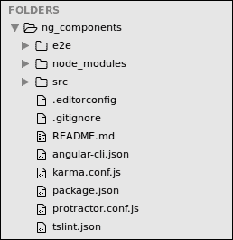
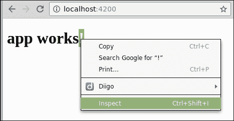
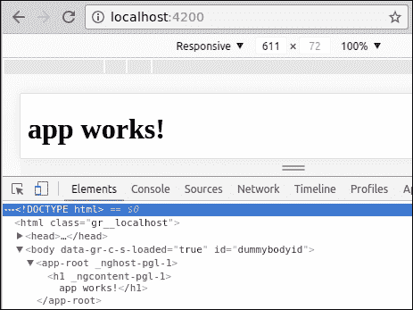
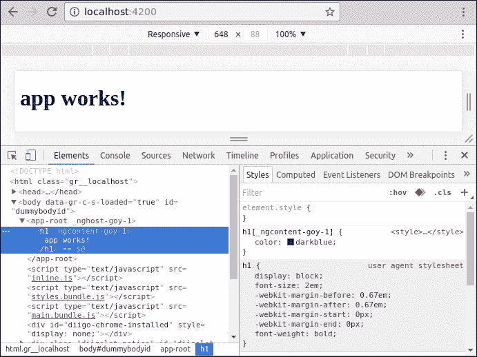
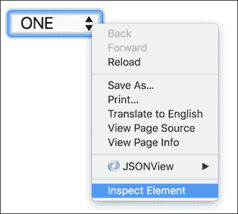
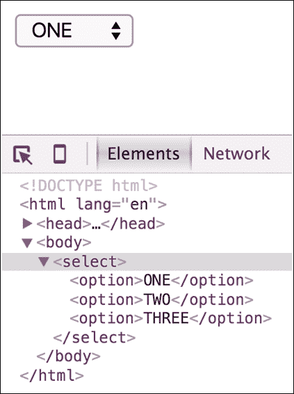
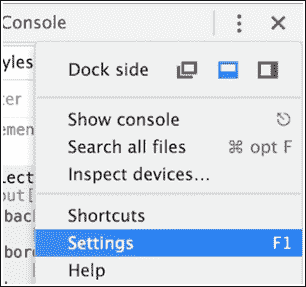
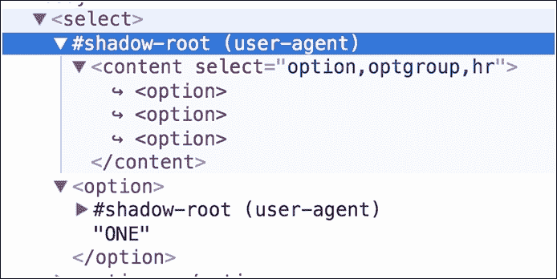

# 第四章构建基本组件

Angular 2 组件的核心是一个类，负责向视图公开数据并实现用户交互逻辑。角度 2 组件可以与角度 1 的控制器、范围和视图进行比较。

Angular 2 如何知道如何将我们的类视为一个组件？我们需要将元数据附加到类以告诉 Angular 如何处理它。

术语元数据描述了我们添加到代码中的附加信息。Angular 2 在运行时使用此信息。

在本章中，我们将介绍以下主题：

*   角 2 分量的解剖
*   组件选择器
*   组件模板
*   组件样式
*   视图封装（阴影 DOM）
*   数据绑定
*   角 2 组件的剖析

在[第 2 章](02.html#aid-J2B81 "Chapter 2. Setting Up an Angular 2 Development Environment with angular-cli")中*使用 Angular cli*设置 Angular 2 开发环境，设置开发环境，我们使用`angular-cli`工具从头开始生成 Angular 2 项目，并将其提供给浏览器。如果您还没有这样做，请参考[第 2 章](02.html#aid-J2B81 "Chapter 2. Setting Up an Angular 2 Development Environment with angular-cli")*使用 Angular cli*设置 Angular 2 开发环境，并按照以下步骤操作。

完成后，是时候在我们最喜欢的 IDE 中打开项目（也在[第 2 章](02.html#aid-J2B81 "Chapter 2. Setting Up an Angular 2 Development Environment with angular-cli")*中描述，*使用 Angular cli*设置 Angular 2 开发环境）来检查代码了。它应该类似于以下屏幕截图：*



当我们使用`angular-cli`生成项目时，会为我们创建一个具有我们的应用程序名称（我们提供给`ng new`命令）的组件。我们可以在`src/app`目录下找到它，如下所示：


找到名为`app.component.ts`的文件并在编辑视图中打开它（编辑视图可能因 IDE 而异）。

让我们逐行探索组件代码，下面是`app.component.ts`的代码

```ts
[app.component.ts]
import { Component } from '@angular/core';

@Component({
  selector: 'app-root',
  templateUrl: './app.component.html',
  styleUrls: ['./app.component.css']
})
export class AppComponent {
  title = 'app works!';
}
```

在第一行中，我们从 Angular core 模块导入[T0]装饰器

*   然后，我们通过在 decorator 的名称后面指定`@`符号来声明`Component`decorator。因为 decorator 只是一个函数（请参阅[第 3 章](03.html#aid-NQU21 "Chapter 3. The TypeScript Primer")、*TypeScript 入门*中的解释），所以我们需要像使用括号的任何其他函数一样调用它。
*   `Component`装饰器接受一个对象作为参数，该参数定义组件元数据。我们将在稍后探索它。
*   在 decorator 之后，我们声明了 component 类，它应该包含我们的组件逻辑，并且当前声明了名为`title`的字符串
*   该类需要导出，以便可以在代码中的其他位置使用

正如我们所看到的，Angular 2 组件必须由两个不同的部分构建：一个简单类和一个装饰器。

在深入研究这段代码之前，让我们打开浏览器并探索已渲染到浏览器的元素。

为此，请将浏览器指向`http://localhost:4200/`（我使用的是谷歌 Chrome），右键单击标题并从弹出菜单中选择**检查**：



这将打开 Chrome 开发工具，我们将在其中探索 DOM：



我们在元数据中定义的`selector`变成了同名元素，我们在组件类上定义的`title`被呈现为其内部的`<h1>`标记。

`<app-root>`是如何进入 DOM 的？那个`<h1>`标签是从哪里来的？

# 引导应用程序

在讨论如何在组件和 DOM 之间建立链接之前，让我们先介绍模块的概念以及如何使用模块引导应用程序。

在项目根目录的`src`目录下，找到并打开`main.ts`文件：


此文件是角度应用程序的起点。它负责实例化应用程序的主模块和其中的根组件。为此，我们从`platform-browser-dynamic`模块中导入`platformBrowserDynamic`方法，该模块是 Angular 的一部分。此方法返回一个对象以引导应用程序。此对象的`bootstrapModule`方法负责通过渲染组件树的根组件来启动 Angular。它要求将主模块作为参数传递，因此我们导入模块类`AppModule`并将其传递给`bootstrap`：

以下代码来自`main.ts`文件：

```ts
import './polyfills.ts';
import { platformBrowserDynamic } from '@angular/platform-browser-dynamic';
import { enableProdMode } from '@angular/core';
import { environment } from './environments/environment';
import { AppModule } from './app/';

if (environment.production) {
  enableProdMode();
}

platformBrowserDynamic().bootstrapModule(AppModule);
```

代码的其余部分对根模块的引导没有任何影响。`enableProdMode`方法是在生产模式下运行应用程序的角度核心方法。环境只是一个常量，它包含一个布尔值，指示我们是否在生产环境中运行。

模块是将一组组件、指令、服务和管道收集到单个实体中的一种方便方法，该实体可以集成到其他模块中。在我们的例子中，每个 Angle 应用程序都包含一个根模块`AppModule`。它包含应用程序的根组件。

模块只是一个用`@NgModule`修饰的类，它接受一个对象作为参数，定义模块元数据。

注意，我们使用动态引导方法，利用即时编译器。此在运行中、内存中和浏览器中编译组件。在 Angular 2 中，可以使用另一种称为提前**的方法**（**AoT**）来预编译应用程序。在这种情况下，无需将 Angular 编译器发送到浏览器，性能提升将非常显著。

在这种情况下，在预编译应用程序之后，您需要使用来自`platform-browser-dynamic`模块的`platformBrowserDynamic`方法来处理`main`。`ts`文件：

```ts
import './polyfills.ts';
import { platformBrowser } from '@angular/platform-browser';
import { enableProdMode } from '@angular/core';
import { environment } from './environments/environment';
import { AppModuleNgFactory } from './app/app.module.ng.factory';

if (environment.production) {
  enableProdMode();

}

platformBrowser().bootstrapModuleFactory(AppModuleNgFactory);
```

# 组件选择器

正如我们在本章的第一个示例中所看到的，我们在组件装饰器中定义的**选择器**成为呈现给 DOM 的元素。在探索选择器选项之前，让我们先了解 Angular 如何渲染此组件。

正如我们在[第 1 章](01.html#aid-DB7S1 "Chapter 1. Angular 2 Component Architecture")、*Angular 2 组件架构*中所讨论的，Angular 2 应用程序可以描述为组件树。与任何其他树结构一样，只有一个根节点。目前在我们的项目中，我们只有一个组件，它被用作树节点。

有了这些信息，我们来看看 Angular 如何实例化根组件并呈现它：

在项目根目录的`src/app`目录下，找到并打开`app.module.ts`文件。此文件包含应用程序根模块的定义：

```ts
[app.module.ts]
import { BrowserModule } from '@angular/platform-browser';
import { NgModule } from '@angular/core';
import { FormsModule } from '@angular/forms';
import { HttpModule } from '@angular/http';
import { AppComponent } from './app.component';

@NgModule({
  declarations: [
    AppComponent
  ],

  imports: [
    BrowserModule,
    FormsModule,
    HttpModule
  ],

  providers: [],
  bootstrap: [AppComponent]
})
export class AppModule { }
```

`app.module.ts`负责实例化组件类。发生这种情况时，Angular 将搜索我们在`index.html`文件的组件装饰器中定义的选择器。我们需要放置在`index.html`中的唯一组件是在`app.module.ts`中根模块的`bootstrap`属性中定义的根组件。

注意需要在`declarations`属性中指定该组件，该属性列出了模块的所有可用组件。

打开`main.ts`旁边的`index.html`并检查代码：

```ts
[index.html]
<html>
  <head>
    <!-- other code related to the page head -->
  </head>
  <body>
    <app-root>Loading...</app-root>
  </body>
</html>
```

我们看到的第一件事是，我们使用选择器作为`html`文件中的元素。这是 Angular 的默认行为。

您在`index.html`中找到的其他代码与`angular-cli`使用的构建系统相关，这超出了本书的范围。

您需要知道的是，当这个 HTML 加载到服务器中时，Angular 所需的所有依赖项都会加载，您需要运行`main.ts`中的代码来启动框架。

## 选择器选项

当我们构建组件时，我们正在创建新的 html 元素。这就是为什么在默认情况下，我们的选择器名称被用作 HTML 中的一个元素。但对于建筑构件，我们还有其他选择。让我们来探讨一下：

*   Select by CSS class name:

    ```ts
    @Component({
      selector: '.app-root'
    })
    ```

    在标记中使用：

    ```ts
    <div class="app-root">Loading...</div>
    ```

*   Select by attribute name:

    ```ts
    @Component({
      selector: '[app-root]'
    })
    ```

    在标记中使用：

    ```ts
    <div app-root>Loading...</div>
    ```

*   Select by attribute name and value:

    ```ts
    @Component({
      selector: 'div[app=components]'
    })
    ```

    在标记中使用：

    ```ts
    <div app="components">Loading...</div>
    ```

*   Select only if the element does not match the selector:

    ```ts
    @Component({
      selector: 'div:not(.widget)'
    })
    ```

    在标记中使用：

    ```ts
    <div class="app">Loading...</div>
    ```

*   Select if one of the selectors matches:

    ```ts
    @Component({
      selector: 'app-root, .app, [ng=app]'
    })
    ```

    在标记中使用：

    ```ts
    <app-root>Loading...</app-root>
    <div class="app">Loading...</div>
    <div ng="app">Loading...</div>
    ```

大多数情况下，保留默认的组件选择器正是我们在构建公共组件时所需要的。在后面的章节中，我们还将看到其他用法。

现在，我们将保留选择器作为默认值。

# 组件模板

模板是 Angular 2 中组件的核心。没有模板，就没有任何东西可以呈现给 DOM。有两种方法可以将样板附着到构件：

*   提供外部`html`文件的 URL
*   内联定义模板

由`angular-cli`创建的`app-root`包含一个外部模板。定义为`templateUrl`属性：

```ts
[app.component.ts]
@Component({
  selector: 'app-root',
  templateUrl: './app.component.html'
})
```

我们可以在`app.component.ts`旁边找到一个名为`app.component.html`的 HTML 文件模板。让我们打开它来检查代码：

```ts
[app.component.html]
<h1>
  {{title}}
</h1>
```

现在我们知道`<h1>`是从哪里来的。正如您所猜测的，双花括号呈现了组件类的标题。

如果我们想内联声明模板，我们应该使用 template 属性。幸运的是，在ES6 中，我们介绍了一种轻松创建多行字符串的方法。此功能称为**模板字符串**，并使用回勾（```ts字符）声明。在下面的示例中，我们演示了如何声明内联模板：

```
[app.component.ts]
@Component({
  selector: 'app-root',
  template: `
    <h1>
      {{title}}
    </h1>
  `
})
```ts

保持模板内联是很舒服的，因为我们可以在同一个文件中看到模板和组件类。

## 在组件模板中嵌入样式

我们可能希望在组件的模板中使用一些 CSS。与模板一样，我们有两个选项，可以内联指定 CSS 类，也可以为外部样式表提供 URL。目前，我们的组件通过在`styleUrls`数组中声明路径，使用一个外部 CSS 文件。

正如属性名称所示，我们可以提供多个 URL 来从中提取 CSS。这些 CSS 文件上定义的样式现在可以在我们的模板中使用。首先让我们看一下当前组件声明：

```
[app.component.ts]
@Component({
  selector: 'app-root',
  template: `
    <h1>
      {{title}}
    </h1>
  `,
  styleUrls: ['./app.component.css']
})
```ts

或者，我们可以使用**styles**属性来定义内联样式，就像模板一样。**样式**是一个字符串数组，我们可以在其中编写 CSS 规则。以下示例演示如何使用内联样式设置[T0]标记的样式：

```
[app.component.ts]
@Component({
  selector: 'app-root',
  template: `
    <h1>
      {{title}}
    </h1>
  `,
  styles: [`
    h1 { color: darkblue }
  `]
})
```ts

让我们探索 Chrome DevTool 中的元素。右键点击`title`并从弹出菜单中选择检查。Chrome DevTool 将推出：



通过 DevTool 查看元素，我们揭示了有关组件样式的一些事实：

*   我们定义的样式被转换为`html`文档顶部`head`部分的内联样式标记
*   样式定义已更改，现在在其旁边包含了一个特性，这使其具有特定性，并且几乎不可能重写

Angular 通过生成唯一属性并将其附加到我们定义的原始 CSS 选择器来保护组件样式不被覆盖。此行为试图模仿阴影 DOM 的工作方式。因此，在我们继续前进之前，我们需要了解什么是阴影 DOM。

# 影子王国

当我们在 Angular 2 中创建组件时，将创建一个阴影 DOM，并将我们的模板加载到其中（默认情况下不是这样）。什么是阴影 DOM？shadowdom 是指 DOM 元素的子树，它作为文档的一部分呈现，但不呈现到主文档 DOM 树中。

让我们来看一个著名的影子 DOM 示例，一个 HTML[T0]，正在运行。在您喜爱的文本编辑器中创建一个纯 HTML 文件，并在其主体中创建一个`select`元素：

```
<!doctype html>
<html lang="en">
  <head>
    <meta charset="UTF-8">
    <title>Document</title>
  </head>
  <body>
    <select>
      <option>ONE</option>
      <option>TWO</option>
      <option>THREE</option>
    </select>
  </body>
</html>
```ts

下一步，在 Chrome 中打开它，右击该元件，然后从弹出菜单中选择**检查元件**：



Chrome DevTool 会弹出，我们可以在**元素**选项卡中检查`select`元素：



如果您曾经尝试过使用 CSS 定制本机`html select`元素的外观，那么您知道您需要破解并开发一种解决方法来使其正常工作。`select`元素有样式结构，甚至有内置行为，但我们看不到它。它被封装在元素内部。

如果您不熟悉术语封装，这里有一个来自维基百科的快速定义：

**封装**是一个面向对象的编程概念，它将数据和操作数据的函数绑定在一起，并确保两者不受外部干扰和误用。

那么，select 外观从何而来？ChromeDevTool 有一个可以与此元素的 ShadowDOM 相媲美的特性。要启用此功能，请转到 Chrome DevTool 的设置菜单：



向下滚动找到**元素**部分。选中复选框**显示用户代理阴影 DOM**：


现在，让我们再次检查`select`元素：



现在我们清楚地看到`select`元素隐藏了一个秘密的 DOM 树。在`select`元素下，将创建一个新根目录（即`#shadow-root`，并在其下方呈现一个内容元素。隐藏内容标签有一个名为`select`的属性，它定义了一些内部行为。这与选项标记相同。如果您想探索一个更流行的 HTML 元素来创建阴影 DOM，可以使用`<input type='file' />`重复这些步骤。

Angular 2 也具有创建本机元素的强大功能，它封装了自己的样式、行为甚至数据。

# 封装方式

默认情况下，正如我们所看到的，我们的组件不会封装其结构和样式。这意味着组件外部的 CSS 类可以覆盖和影响我们定义的嵌入式 CSS 样式，并且组件的 HTML 结构也可以访问。

Angular 将为我们的[T0]生成一个独特的属性来保护我们的样式，但这可以用 CSS[T1]语句覆盖。

要改变这一点，我们需要定义一种封装模式。Angular 2 为我们提供了三种选择：

*   **仿真**（默认）：Angular 会在`selector`类中添加一个特殊属性，以避免影响组件之外的其他样式。
*   **本机**：这是将要应用的渲染器的本机封装机制。在我们的例子中，它是浏览器。Angular 将为此组件创建一个阴影 DOM，这意味着外部 CSS 不会影响我们的组件。
*   **无**：无封装。

要定义封装选项，我们需要从 Angular core 导入`ViewEncapsulation`并使用其中一个选项来定义组件封装属性。下面的示例演示如何将组件封装模型设置为`None`：

```
[app.component.ts]
@Component({
  selector: 'app-root',
  encapsulation: ViewEncapsulation.None,
  template: `
    <h1>
      {{title}}
    </h1>
  `,
  styles: [`
    h1 { color: darkblue }
  `]
})
```ts

大多数情况下，保留默认的模拟模式是可以的。在以后的章节中，我们将遇到一些情况，其中将模式设置为`None`是至关重要的。

# 数据绑定

为了完全理解 angular cli 为我们生成的组件代码，我们需要讨论数据绑定。换句话说，我们能够将组件类上声明的**标题**呈现给组件模板的方式。

首先，让我们看看整个组件代码：

```
[app.component.ts]
import { Component, ViewEncapsulation } from '@angular/core';

@Component({
  selector: 'app-root',
  encapsulation: ViewEncapsulation.None,
  template: `
    <h1>
      {{title}}
    </h1>
  `,
  styles: [`
    h1 { color: darkblue }
  `]
})
export class AppComponent {
  title = 'app works!';
}
```

在模板中不难发现双花括号。这是 Angular 模板语法的一部分，负责组件类数据的单向绑定。在本例中，我们将在[T0]标记之间绑定要呈现的 title 属性（它是一个字符串）。

在本书的后面，我们将探讨一些更多的绑定选项。

# 总结

在 Angular 2 中，组件是一个带有装饰器的类，装饰器向其添加重要的元数据。组件装饰器定义了我们如何使用它，以及它可以做什么。选择器和模板是调用 decorator 时所需的最小字段（如果缺少其中一个，Angular 将抛出错误）。

如果我们将视图封装定义为本机的，Angular 将为我们的组件创建一个阴影 DOM，从而保护嵌入的样式不受页面上外部 CSS 的影响。

在下一章中，我们将继续开发我们的组件并使其具有动态性。