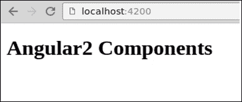
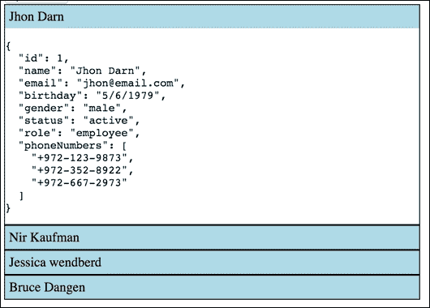
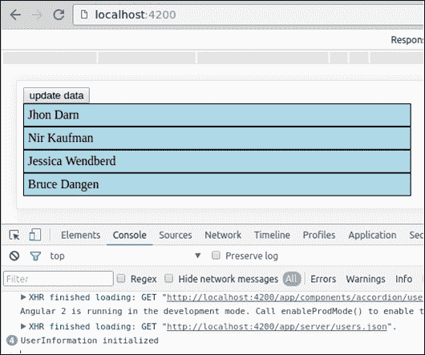
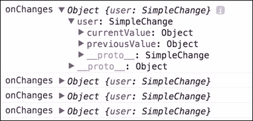

# 七、将所有内容放在一起

是时候把我们所学到的关于组件的所有知识付诸实践了。在本章中，我们将构建有用的组件。我们还将学习Angular 2 变化检测和组件生命周期。

以下是我们将讨论的主题：

*   重置开发环境
*   构建一个简单的手风琴组件
*   扩展 accordion 组件树
*   将挂钩扩展到组件生命周期事件

# 为我们的发展环境做准备

是时候用`angular-cli`创建一个新项目了，如[第 2 章](02.html#aid-J2B81 "Chapter 2. Setting Up an Angular 2 Development Environment with angular-cli")所述，*用 Angular cli*建立 Angular 2 开发环境。我们将创建一个名为`components`的新目录，其中包含我们将在本章中实现的所有组件。

在实现相应组件时，我们将在本章中创建另外两个子目录`accordion`和`user-info`：


在开始清理新组件之前，是最后一次清理新组件。打开`index.ts`并按如下步骤进行清洁：

```ts
[app.component.ts]
import { Component } from '@angular/core';

@Component({
  selector: 'app-root',
  template: '<h1>Angular2 Components</h1>'
}) 
export class AppComponent {}
```

打开浏览器，确保渲染组件时没有任何错误：



我们现在准备开始开发新的组件。

# 手风琴组件

我们要构建的第一个组件将是一个`accordion`组件。手风琴由两部分组成：手风琴包装和手风琴标签。让我们首先开始实现`accordion`选项卡。

在组件目录中，创建一个名为`accordion`的新目录。在其内部创建`accordion-tab.ts`文件，并粘贴以下代码：

```ts
[accordion-tab.ts]
import { Component } from '@angular/core';

@Component({
  selector: 'accordion-tab',
  styles: [`
    .accordion-tab {
      width: 500px;
      border: 1px solid black;
      border-collapse: collapse;
    }
    .accordion-heading {
      padding: 5px;
      background-color: lightblue;
      cursor: pointer;
    }
 `],
  template: `
    <div class="accordion-tab">
      <div class="accordion-heading">Accordion Title</div>
      <div>
        <ng-content></ng-content>
      </div>
    </div>
  `
})
export class AccordionTab {}
```

组件装饰器非常简单。我们抛出一些 CSS 和一个包含`<ng-content>`标记的模板，以便为 accordion 选项卡内容使用插入点。

为了测试它，让我们呈现`accordion-tab`文件。打开`app.component.ts`并更新代码：

```ts
[app.component.ts]
import { Component } from '@angular/core';
import { AccordionTab } from './components/accordion/accordion-tab';

@Component({
  selector: 'app-root',
  template:`
    <div>
      <accordion-tab>Accordion Content</accordion-tab>
      <accordion-tab></accordion-tab>
      <accordion-tab></accordion-tab>
    </div>
  `
})
export class AppComponent {}
```

别忘了将`AccordionTab`类添加到根模块的 declarations 属性中。本章中实现的所有自定义组件都需要此操作。打开`app.module.ts`文件，更新如下：

```ts
[app.module.ts]
import { BrowserModule } from '@angular/platform-browser';
import { NgModule } from '@angular/core';
import { FormsModule } from '@angular/forms';
import { HttpModule } from '@angular/http';
import { AppComponent } from './app.component';
import { AccordionTab } from './components/accordion/accordion-tab';

@NgModule({
  declarations: [
    AppComponent,
    AccordionTab
  ],
  imports: [
    BrowserModule,
    FormsModule,
    HttpModule
  ],
  providers: [],
  bootstrap: [AppComponent]
})
export class AppModule { }
```

现在，让我们打开浏览器以确保组件按预期渲染：


接下来，让我们实现`accordion-tab`的切换动作。打开`accordion-tab.ts`并更新模板和`Component` 类：

```ts
[accordion-tab.ts]
import { Component } from '@angular/core';

@Component({
  selector: 'accordion-tab',
  styles: [`
    .accordion-tab {
      width: 500px;
      border: 1px solid black;
      border-collapse: collapse;
    }
    .accordion-heading {
      padding: 5px;
      background-color: lightblue;
      cursor: pointer;
    }
  `],
  template: `
    <div class="accordion-tab">
      <div class="accordion-heading"
       (click)="toggleContent()">Accordion Title</div>
      <div class="accordion-body">
        <ng-content *ngIf="extended"></ng-content>
      </div>
    </div>
  `
})
export class AccordionTab {
  extended: boolean = false;
  toggleContent() {
    this.extended = !this.extended
  }
}
```

我们将方法绑定到标题的 click 事件，该事件切换布尔值，从而触发`ngIf`指令。我们在前两章中介绍了这一点。为了测试我们的组件，让我们在其他选项卡中放置一些虚拟内容。打开`app.component.ts`并更新模板如下：

```ts
[app.component.ts]
import { Component } from '@angular/core';
import { AccordionTab } from './accordion/accordion-tab.ts';

@Component({
  selector: 'app-root',
  template:`
    <div>
      <accordion-tab>Accordion Content</accordion-tab>
      <accordion-tab>Accordion Content</accordion-tab>
      <accordion-tab>Accordion Content</accordion-tab>
    </div>
  `
}) 
export class AppComponent {}
```

现在，我们可以打开浏览器并测试我们的组件。当我们点击标签标题时，相应的内容被切换。但是标签应该一起工作。只能扩展一个选项卡。为了实现这一点，我们可以用实现此逻辑的组件包装`accordion-tab`组件。

在执行此操作之前，我们需要确保从服务器获取的`users`数组中的每个对象（在本例中为`users.json`）都具有唯一的`id`。打开`users.json`并确保其与以下类似：

```ts
[users.json]
[
  {
    "id": 1,
    "name": "Jhon Darn",
    "email": "jhon@email.com",
    "birthday": "5/6/1979",
    "gender": "male",
    "status": "active",
    "role": "employee",
    "phoneNumbers": [
      "+972-123-9873",
      "+972-352-8922",
      "+972-667-2973"
    ]
  },
  (...)
```

现在，在`accordion`文件夹中创建一个名为`accordion.ts`的新文件，让我们制定基本实现：

```ts
[accordion.ts]
import { Component } from '@angular/core';
import { Http } from '@angular/http';
import 'rxjs/add/operator/map';
import { AccordionTab } from './accordion-tab';

@Component({
  selector: 'accordion',
  template: `
    <div>
      <accordion-tab *ngFor="let user of users"
                   (click)="toggle(user)"
                   [extended]="isActive(user)"
                   [title]="user.name">
                 <pre>{{ user | json }}</pre>
      </accordion-tab>
    </div>
  `
})
export class Accordion {  users;
  activeUserId = 0;

  constructor(http: Http) {
    http.get('/app/server/users.json')
        .map(result => result.json())
        .subscribe(result => this.users = result);
  }

  isActive(user) {
    return user.id === this.activeUserId;
  }

  toggle(user) {
    this.isActive(user) ?
        this.activeUserId = 0 : this.activeUserId = user.id;
  }
}
```

我们使用HTTP 服务从静态 JSON 中提取用户数据，并在`users`数组上迭代，重复 accordion 选项卡组件。在每个`accordion-tab`组件上，我们将一个方法绑定到单击事件，并将动态数据绑定到属性。我们还使用`json`管道填充手风琴标签内的一些内容。

选择活动选项卡的逻辑很容易在`Component` 类中实现。

接下来我们需要重构`accordion-tab`并定义其输入输出接口：

```ts
[accordion-tab.ts]
import {
    Component, Input, Output
} from '@angular/core';

@Component({
  selector: 'accordion-tab',
  styles: [`
    .accordion-tab {
      width: 500px;
      border: 1px solid black;
      border-collapse: collapse;
    }
    .accordion-heading {
      padding: 5px;
      background-color: lightblue;
      cursor: pointer;
    }
  `],
  template:`
    <div class="accordion-tab">
      <div class="accordion-heading"
       (click)="toggleContent()">{{title}}</div>
      <div class="accordion-body">
        <content *ngIf="extended"></content>
      </div>
    </div>
  `
})
export class AccordionTab {
  @Input() extended;
  @Input() title;

  toggleContent() {
    this.extended = !this.extended
  }
}
```

简单的手风琴现在准备好了。我们几乎使用了我们所学的一切来制作这个小部件。注意我们不需要写很多代码。Angular 的内置指令和绑定系统为我们完成了所有繁重的工作。要在浏览器中进行测试，请打开`app.component.ts`并呈现`<accordion>`组件：

```ts
[app.component.ts]
import { Component } from '@angular/core';
import { Accordion } from './components/accordion/accordion';

@Component({
  selector: 'app-root',
  template: `<accordion></accordion>`
}) 
export class AppComponent {}
```

打开浏览器并检查结果。每次单击手风琴选项卡时，它都是唯一一个得到扩展的选项卡：



在我们继续之前，让我们只在点击手风琴的`title`和整个`tab`时才将手风琴展开。为此，我们将在单击标题时发出一个自定义事件，然后从父组件（手风琴）绑定到此事件：

```ts
[accordion-tab.ts]
import {
    Component, Input, Output, EventEmitter
} from '@angular/core';

@Component({
  selector: 'accordion-tab',
  styles: [`
    .accordion-tab {
      width: 500px;
      border: 1px solid black;
      border-collapse: collapse;
    }
    .accordion-heading {
      padding: 5px;
      background-color: lightblue;
      cursor: pointer;
    }
 `],
  template: `
    <div class="accordion-tab">
     <div class="accordion-heading" 
          (click)="toggleContent()">{{title}}</div>
     <div>
      <ng-content *ngIf="extended"></ng-content>
     </div>
    </div>
  `
}) 
export class AccordionTab {
  @Input() extended : boolean;
  @Input() title : string;
  @Output() toggle = new EventEmitter<any>();
  toggleContent() {
    this.toggle.emit(null)
  }
}
```

`accordion-tab`组件的就是这样。让我们转到`accordion`组件并绑定到此事件：

```ts
[accordion.ts]
import { Component, Inject } from '@angular/core';
import { Http } from '@angular/http';
import 'rxjs/add/operator/map';
import { AccordionTab } from './accordion-tab';
@Component({
  selector: 'accordion',
  template: `
    <div>
      <accordion-tab *ngFor="let user of users"
                    (toggle)="toggle(user)"
                    [extended]="isActive(user)"
                    [title]="user.name">
        <pre>{{ user | json }}</pre>
      </accordion-tab>
    </div>
  `
})
export class Accordion {  
  users;
  activeUserId = 0;

  constructor(http: Http) {
    http.get('/app/server/users.json')
        .map(result => result.json())
        .subscribe(result => this.users = result);
  }
  isActive(user) {
    return user.id === this.activeUserId;
  }
  toggle(user) {
    this.isActive(user) ?
        this.activeUserId = 0 : this.activeUserId = user.id;
  }
}
```

现在我们可以渲染手风琴组件并查看结果。在`app.component.ts'`中包括以下内容：

```ts
[app.component.ts]
import { Component } from '@angular/core';
import { Accordion } from './components/accordion/accordion';

@Component({
  selector: 'app-root',
  template:`<accordion></accordion>`
}) 
export class AppComponent {}
```

打开浏览器，查看结果。手风琴按预期工作。

## 扩展手风琴组件树

让我们在手风琴树中添加另一个组件。与其将原始 JSON 呈现为选项卡内容，不如重用我们在[第 4 章](04.html#aid-TI1E1 "Chapter 4. Building a Basic Component")、*构建基本组件*和[第 5 章](05.html#aid-147LC1 "Chapter 5. Building Dynamic Components")、*构建动态组件*中构建的用户信息组件。为此，只需在`components`目录中创建一个`user-info`子目录，并将相应的 TypeScript 文件复制到此目录中。我们需要重构的唯一文件是`accordion.ts`：

```ts
[accordion.ts] 
import { Component, Inject, ViewEncapsulation } from '@angular/core';
import { Http } from '@angular/http';
import 'rxjs/add/operator/map';
import { AccordionTab } from './accordion-tab';
import { UserInformation } from '../user-info/user-info';

@Component({
  selector: 'accordion',
  template: `
    <div>
      <accordion-tab *ngFor="let user of users"
                    (toggle)="toggle(user)"
                    [extended]="isActive(user)"
                    [title]="user.name">
        <user-info [user]="user"></user-info>
      </accordion-tab>
    </div>
  `
})
export class Accordion {  
  users;
  activeUserId = 0;
  constructor(http: Http) {
    http.get('app/server/users.json')
        .map(result => result.json())
        .subscribe(result => this.users = result);
  }
  isActive(user) {
    return user.id === this.activeUserId;
  }
  toggle(user) {
    this.isActive(user) ?
        this.activeUserId = 0 : this.activeUserId = user.id;
  }
}
```

我们所需要做的就是导入用户信息组件，在组件元数据中声明它，并在我们的模板中使用它，将`user`变量绑定到组件期望的`User`属性。

# 组件生命周期

组件实例有一个我们可以连接的生命周期。目前，我们的迷你应用程序包含四个组件：`App`、`accordion`、`accordion-tab`和`user-info`，但一个典型的 Angular 应用程序将包含数十个组件树，Angular 将在应用程序的生命周期内创建、更新和销毁这些组件树。

出于演示目的，我们将模拟返回其他数据的服务器调用。为此，在`server`目录中创建一个名为`other-users.json`的文件，并将此代码粘贴到其中：

```ts
[other-users.json]
[
  {
    "id": 5,
    "name": "Michael jackson",
    "email": "jackson@email.com",
    "birthday": "22/3/1974",
    "gender": "male",
    "status": "onhold",
    "role": "manager",
    "phoneNumbers": [
      "+972-123-9873"
    ]
  },
  (...)
]
```

在手风琴组件模板上，我们将添加一个按钮，用于获取此新数据，并在`Component`类上实现`fetchData`方法：

```ts
[accordion.ts]
import { Component, Inject } from '@angular/core';
import { Http } from '@angular/http';
import 'rxjs/add/operator/map';
import { AccordionTab } from './accordion-tab';
import { UserInformation } from '../user-info/user-info';

@Component({
  selector: 'accordion',
  template: `
    <div>
     <button (click)="fetchData('other-users.json')">update data</button>
     <accordion-tab *ngFor="let user of users"
                    (toggle)="toggle(user)"
                    [extended]="isActive(user)"
                    [title]="user.name">
        <user-info [user]="user"></user-info>
      </accordion-tab>
    </div>
  `
})
export class Accordion {  
  users;
  activeUserId = 0;

  constructor(private http: Http) {
    this.fetchData('users.json');
  }
  isActive(user) {
    return user.id === this.activeUserId;
  }

  fetchData(subPath) {
    this.http.get(`/app/server/${subPath}`)
        .map(result => result.json())
        .subscribe(result => this.users = result);
  }

  toggle(user) {
    this.isActive(user) ?
        this.activeUserId = 0 : this.activeUserId = user.id;
  }
}
```

现在，每次我们点击按钮，用户的数据都会被更新，手风琴也会被重新渲染。打开浏览器，单击按钮，观察手风琴数据的变化。

# 生命周期事件接口

为了在每个组件生命周期事件上运行我们自己的逻辑，我们需要实现与我们想要响应的事件对应的所需方法。这些事件中的每一个都作为 TypeScript 接口发布，我们可以在组件类中实现它。TypeScript 接口的使用是可选的，不会以任何方式影响我们的应用程序。您可以从 TypeScript 网站上的文档[了解 TypeScript 接口 http://www.typescriptlang.org/docs/handbook/interfaces.html](http://www.typescriptlang.org/docs/handbook/interfaces.html) 。我们不会在代码示例中使用。

## OnInit 和 OnDestroy

最简单、最直接、最容易理解的生命周期事件挂钩是`onInit`和`onDestroy`。

第一次检查组件数据绑定属性后调用`ngOnInit`方法，在组件实例被 Angular 破坏之前调用`ngOnDestroy`。在我们的组件层次结构中，我们将在`user-info`类上实现这两种方法：

```ts
[user-info.ts]
import {
  Component, Input,
  OnInit, OnDestroy
} from '@angular/core';

@Component({

  selector: 'user-info',
  styleUrls: ['./user-info.css'],
  templateUrl: './user-info.html'
})
export class UserInformation implements OnInit, OnDestroy {  
  @Input() 
  user;

  fontSize = '20px';
  editMode = false;
  randomNumber;

  ngOnInit(){
    console.log('UserInformation initialized');
  }

  ngOnDestroy(){
    console.log('UserInformation Destroy');
  }

  toggleEditMode() {
    this.editMode = !this.editMode;
  }

  onSubmit(data) {
    Object.assign(this.user, data);
    this.editMode = false;
  }
}
```

现在，打开浏览器，确保控制台可见。您应该看到四个日志，表明每个用户组件都已初始化：



现在，点击按钮上的从服务器中拉取新数据。您应该看到已销毁的每个用户信息组件的四个日志，以及为新数据创建的新组件的三个日志：


`OnInit`方法是在组件初始化后（数据绑定属性已解析）和在子组件之一初始化前运行代码的好地方。`OnDestroy`是清理或组件状态的持久性代码的好地方，就在从 DOM 中剥离之前。

## 变更

`OnChanges`有一个名为`ngOnChanges`的方法，在检查完所有数据绑定属性后将调用。Angular 传递一个`change`对象，该对象包含一个以更改的属性命名的键，以及一个`SimpleChange` 对象的实例。`SimpleChange`对象包含上一个值和当前值。让我们在`user-info`组件中实现此方法：

```ts
[user-info.ts]
import {
  Component, Input,
  OnInit, OnDestroy, OnChanges
} from '@angular/core';

@Component({
  selector: 'user-info',
  styleUrls: ['./user-info.css'],
  templateUrl: './user-info.html'
})
export class UserInformation
      implements OnInit, OnDestroy, OnChanges {  
  @Input() user;
  fontSize = '20px';
  editMode = false;
  randomNumber;

  ngOnInit(){
    console.log('UserInformation initialized');
  }

  ngOnDestroy(){
    console.log('UserInformation Destroy');
  }

  ngOnChanges(changes){
    console.log('onChanges', changes);
  }

  toggleEditMode() {
    this.editMode = !this.editMode;
  }

  onSubmit(data) {
    Object.assign(this.user, data);
    this.editMode = false;
  }
}
```

在浏览器控制台中，我们将看到四个日志：



如果您熟悉 Angular 1.x，您可以将`OnChange`方法视为一个`$scope.$watch`函数。它将在数据更改时被调用，并包含新值和旧值。

# 其他生命周期事件

除了的`init`、`changes`和`destroy`事件之外，我们还可以钩住四个组件生命周期事件：

*   `AfterContentInit`：组件内容完全初始化后调用
*   `AfterContentChecked`：每次检查组件后调用
*   `AfterViewInit`：组件视图初始化后调用
*   `AfterViewChecked`：检查组件视图后调用

它们中的每一个都可以用与前面示例相同的方式实现。

# 总结

通过本章，我们学习了到目前为止关于组件的所有知识，并构建了一个有用的由四个组件组成的手风琴小部件。Angular 2 应用程序是动态组件的集合，这些组件使用属性作为输入，使用事件作为输出，相互通信。我们可以钩住组件的每个重要生命周期，例如，当组件被初始化或销毁时，运行我们自己的逻辑。