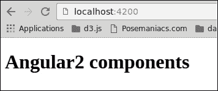
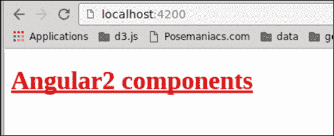

# 九、Angular 2 指令

在本书中，我们学习了如何制作角形 2 组件。在我们结束旅程之前，重要的是要理解 Angular 2 并没有扼杀指令的概念。事实上，组件*是*指令。在本章中，我们将介绍 Angular 2 指令以及如何使用它们。

以下是我们将讨论的主题：

*   Angular 2 中组件和指令之间的差异
*   Angular 2 指令类型
*   如何构建一个简单的属性指令
*   如何构建简单的结构指令

# Angular 2 中的组件和指令

到目前为止，我们已经构建了组件。但是组件并没有取代我们熟悉的 Angular 1 中的指令。如果您不熟悉 Angular 1 指令，请不要担心，我们将在一分钟内解释差异。

让我们从定义指令在Angular术语中的含义开始：指令是一个自定义属性或通过添加自定义行为扩展 HTML 标记的元素。

在 Angular 2 中，我们有三种类型的指令：组件指令、属性指令和结构指令。我们已经熟悉了组件，所以让我们定义其他类型：

*   **属性指令**：此更改元素的外观或行为。Angular core 的 NgStyle 指令就是一个例子。
*   **结构指令**：该操作DOM，就像 NgFor 和 NgSwitch 从角核开始一样。

指令与组件相反，不需要模板，通常将选择器定义为属性。

# 为我们的发展环境做准备

与前面章节的一样，让我们创建一个新项目，如[第 2 章](02.html#aid-J2B81 "Chapter 2. Setting Up an Angular 2 Development Environment with angular-cli")所述，*使用 Angular cli*设置 Angular 2 开发环境。您还可以删除所有现有文件夹，并删除`app.component.ts`中所有不必要的代码：

```ts
[app.component.ts]
import { Component } from '@angular/core';

@Component({
  selector: 'app-root',
  template: `<h1>Angular2 components</h1>`
})
export class AppComponent {}
```

# 基本属性指令

让我们从开始，为我们的指令创建一个名为`text-marker.ts`的新文件。在其中，粘贴以下代码：

```ts
[text-marker.ts]
import { Directive, ElementRef, Renderer } from '@angular/core';

@Directive({
  selector: '[text-marker]'
})
export class TextMarker {
  constructor(element: ElementRef, renderer: Renderer) {
    renderer.setElementStyle(element.nativeElement,
      'text-decoration', 'underline');
  }
}
```

要创建一个指令，我们需要从 Angular core 导入[T0]decorator 函数。我们还需要另外两个名为`ElementRef`和`Renderer`的类来操作元素。它们从其构造函数注入到我们的指令类中。

此指令将为元素添加样式，并用下划线装饰文本。

让我们在`app component`模板上应用它来测试这个指令。打开`index.ts`并添加以下代码：

```ts
[app.component.ts]
import { Component } from '@angular/core';

@Component({
  selector: 'app-root',
  template: `<h1 text-marker>Angular2 components</h1>`
}) 
export class AppComponent {}
```

不要忘记将`TextMarker`类添加到根模块的`declarations`属性中。本章中实现的所有自定义组件和指令都需要此操作。打开`app.module.ts`文件并按如下所述进行更新：

```ts
[app.module.ts]
import { BrowserModule } from '@angular/platform-browser';
import { NgModule } from '@angular/core';
import { FormsModule } from '@angular/forms';
import { HttpModule } from '@angular/http';
import { AppComponent } from './app.component';
import { TextMarker } from './text-marker';

@NgModule({
  declarations: [
    AppComponent,
     TextMarker
  ],
  imports: [
    BrowserModule,
    FormsModule,
    HttpModule
  ],
  providers: [],
  bootstrap: [AppComponent]
})
export class AppModule { }
```

打开浏览器并检查结果：



## ^T0；）元素引用和渲染

属性指令打算向元素添加行为。为此，我们需要访问元素本身。在 Angular 2 中，直接访问 DOM 元素被认为是不好的做法。Angular 通过引入抽象层使代码与视图层分离。

为了引用元素，我们使用`ElementRef`，它是表示我们正在运行的平台的元素类型的类。在我们的例子中，它是浏览器 DOM。`ElementRef`类能够显示它所包装的本机元素，但我们不需要它。相反，我们将使用另一个名为`Renderer`的类并将`ElementRef`实例传递给它。`Renderer`是一个类，它公开了操作元素的方法，而不指定它是哪种类型的元素。这种机制使我们的代码与元素的实现解耦。

## 对来自主机元素的事件作出反应

属性指令对元素应用。如果我们想对该元素触发的事件做出反应，我们可以在`Directive`类的某些方法上使用`HostListener`装饰器。在以下示例中，我们的指令将侦听元素中的鼠标事件，并更改响应的样式：

```ts
[text-marker.ts]
import { 
Directive, ElementRef, Renderer, HostListener 
} from '@angular/core';

@Directive({
 selector: '[text-marker]'
})
export class TextMarker {
  constructor(private element: ElementRef, 
  private renderer: Renderer) { }

  @HostListener('mouseenter')
  markText() {
    this.renderer.setElementStyle(
      this.element.nativeElement,
      'text-decoration',
      'underline'
    );
  }

  @HostListener('mouseleave')
  unmarkText() {
    this.renderer.setElementStyle(
      this.element.nativeElement,
      'text-decoration',
      ''
    );
  }
}
```

现在，每当鼠标进入和离开*承载*属性指令的元素时，样式将被应用和删除。

## 将属性传递给指令

我们还可以使用属性将配置传递到指令中。就像组件一样，指令可以声明输入。让我们重构`Directive`类，从属性中获取并应用文本颜色

```ts
[text-marker.ts]
import {
  Directive,
  ElementRef,
  Renderer, Input,
  HostListener
} from '@angular/core';

@Directive({
  selector: '[text-marker]'
})
export class TextMarker {
  @Input('text-marker') 
  private color: string;

  constructor(
    private element: ElementRef, 
    private renderer: Renderer
  ){ }

  @HostListener('mouseenter')
  onEnter() {
    this.applyStyle(this.color, true);
  }
  @HostListener('mouseleave')
  onExit() {
    this.applyStyle('', false);
  }

  private applyStyle(
    color:string, mark:boolean) {

      // apply underline
      this.renderer.setElementStyle(
        this.element.nativeElement,
        'text-decoration',
        mark ? 'underline' : ''
      );

      // apply color
      this.renderer.setElementStyle(
        this.element.nativeElement
        'color', color
      );
  }
}
```

通过使用`Input`装饰符，我们可以接受属性的值（在我们的例子中，它是`text-marker`，并在我们的指令类中使用它。现在我们可以传递我们想要使用的颜色。打开`app.component.ts`并尝试以下代码：

```ts
[app.component.ts]
import { Component } from '@angular/core';

@Component({
  selector: 'app-root',
  template: `<h1 text-marker="red">Angular2 components</h1>`
})
export class AppComponent {}
```

现在，每次鼠标进入`h1`元素时，文本都应为红色，并用下划线装饰：



# 基本结构指令

正如我们在本章开头提到的，第三种类型的指令称为结构指令，顾名思义，这些指令旨在操纵它们应用于的元素。Angular core 包含几个操作 DOM 的指令，如[T0]、[T1]和[T2]。

对于我们的示例，我们将实现自己的`ngIf`指令，其行为与原始指令相同。

首先，创建一个名为`only-if.ts`的新文件，让我们定义指令的基本结构：

```ts
[only-if.ts]
import { Directive } from '@angular/core';

@Directive({
  selector: '[onlyIf]'
})
export class OnlyIf {
}
```

结构指令就像属性指令一样开始它们的生命。我们从 Angular core 导入[T0]装饰器，并将选择器声明为属性。

接下来，我们需要访问模板，并且需要一些容器，以便可以附加或删除视图。为此，我们需要注入`TemplateRef`和`ViewContainerRef`：

```ts
[only-if.ts]
import {
  Directive,
  TemplateRef,
  ViewContainerRef
} from '@angular/core';

@Directive({
  selector: '[onlyIf]'
})
export class OnlyIf {
  constructor(private _templateRef: TemplateRef,
              private _viewContainerRef: ViewContainerRef)
  {  }
}
```

我们的指令，就像 Angular[T0]一样，需要从调用者那里接收一个布尔值，表示内容显示或删除的条件。为此，我们将为此条件声明一个输入，并使用`ViewContainerRef`和`TemplateRef`：

```ts
[only-if.ts]
import {
  Directive,
  Input,
  TemplateRef,
  ViewContainerRef
} from 'angular/core';

@Directive({
  selector: '[onlyIf]'
})
export class OnlyIf {
  constructor(private _templateRef: TemplateRef<any>,
              private _viewContainerRef: ViewContainerRef) {  }

  @Input()
  set onlyIf(condition:boolean) {
    if (condition) {
      this._viewContainerRef.createEmbeddedView(this._templateRef);
    } else {
      this._viewContainerRef.clear();
    }
  }
}
```

让我们利用这个指令。打开`app.component.ts`并粘贴以下代码：

```ts
[app.component.ts]
import { Component } from '@angular/core';

@Component({
  selector: 'app-root',
  template: `
    <input type="checkbox" [(ngModel)]="condition">
    <p *onlyIf="condition">
      This content will shown only if the condition is true
    </p>
  `
}) 
export class AppComponent {}
```

别忘了将`OnlyIf`类添加到根模块的`declarations`属性中。

让我们探究一下发生了什么：当我们使用星号（`*`来调用指令时，Angular 在幕后创建了一个`<template>`标记。在我们的指令中，我们可以通过`TemplateRef`类获取此模板的引用。然后，我们可以使用`ViewContainerRef`类，它表示一个`container`，这样我们就可以在其中嵌入一个视图，从模板的内容中创建或清除一个视图。

# 总结

在 Angular 2 中，有三种类型的指令：组件指令、属性指令和结构指令。在本章中，我们快速介绍了它们，并学习了如何构建简单的指令。指令可以做得更多，但这超出了本书的范围。

# 指数

## A.

*   手风琴部件
    *   关于/[手风琴组件](07.html#aid-1ENBI2 "The accordion component")
    *   手风琴选项卡，实现/[手风琴组件](07.html#aid-1ENBI2 "The accordion component")
    *   树，扩展/[扩展手风琴组件树](07.html#aid-1ENBI2 "Extending the accordion component tree")
    *   生命周期/[组件生命周期](07.html#aid-1FLS41 "The component life cycle")
*   提前（AoT）/[引导应用程序](04.html#aid-TI1E1 "Bootstrapping the application")
*   角型 cli
    *   安装/[安装Angular cli](02.html#aid-K0RQ1 "Installing angular-cli")
    *   URL/[生成Angular 2 项目](02.html#aid-KVCC1 "Generating an Angular 2 project")
*   Angular 1
    *   模型视图控制器模式/[MVC Angular 1](01.html#aid-E9OE1 "MVC in Angular 1")
*   Angular 2
    *   开发环境，准备/[准备我们的开发环境](07.html#aid-1DOR01 "Preparing our development environment")、[准备我们的开发环境](08.html#aid-1JFUC1 "Preparing our development environment")、[准备我们的开发环境](#aid-1P71O1 "Preparing our development environment")
    *   组件/[Angular 2](#aid-1O8H61 "Components and directives in Angular 2")中的组件和指令
    *   指令/[组件和Angular 2](#aid-1O8H61 "Components and directives in Angular 2")中的指令
    *   属性指令/[组件和Angular 2](#aid-1O8H61 "Components and directives in Angular 2")中的指令
    *   结构指令/[组件和Angular指令 2](#aid-1O8H61 "Components and directives in Angular 2")
*   Angular 2 应用
    *   将应用程序拆分为组件/[将应用程序拆分为组件](01.html#aid-H5A41 "Breaking the application into components")
*   角 2 项目
    *   正在生成/[正在生成Angular 2 项目](02.html#aid-KVCC1 "Generating an Angular 2 project")
*   Angular应用
    *   引导/[引导应用程序](04.html#aid-TI1E1 "Bootstrapping the application")
*   注释
    *   对装饰者/[装饰者对注释](03.html#aid-RL0A1 "Decorators versus annotations")
*   应用程序组件/[将应用程序拆分为组件](01.html#aid-H5A41 "Breaking the application into components")
*   星号（*）
    *   关于/[星号–*](05.html#aid-1565U2 "The asterisk – *")
    *   示例/[星号–*](05.html#aid-1565U2 "The asterisk – *")
*   属性指令
    *   关于 Angular 2、[基本属性指令](#aid-1Q5IA1 "The basic attribute directive")中的/[组件和指令](#aid-1O8H61 "Components and directives in Angular 2")
    *   ElementRef 类/↓T0；）ElementRef 和渲染器↓T1；）
    *   渲染器类/↓T0；）ElementRef 和渲染器↓T1；）
    *   事件，从主机元素响应/[从主机元素](#aid-1Q5IA1 "Reacting to events from the host element")响应事件
    *   属性，传递/[将属性传递给指令](#aid-1Q5IA1 "Passing properties to the directive")

## B

*   基本类型
    *   关于/[基本类型](03.html#aid-QMFO1 "The basic types")
*   独自创立
    *   依赖项，导入/[导入依赖项](08.html#aid-1KEEU1 "Importing dependencies")
    *   工具提示组件/[引导工具提示组件](08.html#aid-1LCVG1 "Bootstrap tooltip component")
    *   折叠组件/[引导折叠组件](08.html#aid-1MBG21 "Bootstrap collapse component")
*   按钮组件/[将应用程序拆分为组件](01.html#aid-H5A41 "Breaking the application into components")

## C

*   类，在 TypeScript 中
    *   关于/[类](03.html#aid-PNV61 "Classes")
*   折叠组件
    *   参考链接/[引导折叠组件](08.html#aid-1MBG21 "Bootstrap collapse component")
*   组件
    *   定义/[定义组件](01.html#aid-G6PI1 "Defining components")
*   元件选择器
    *   关于/[组件选择器](04.html#aid-UGI01 "The component selector")
    *   选项/[选择器选项](04.html#aid-UGI01 "Selector options")
*   组件模板
    *   关于/[组件模板](04.html#aid-VF2I1 "The component template")
    *   样式，嵌入在/[嵌入样式在组件模板](04.html#aid-VF2I1 "Embedding styles in component template")中
*   控制器
    *   关于/[模型视图控制器模式](01.html#aid-DB7S1 "The Model-View-Controller pattern")
*   核心指令
    *   关于/[核心指令](05.html#aid-1565U2 "Core directives")
    *   NGIF 指令/[NGIF](05.html#aid-1565U2 "NgIf")
    *   NGCLASS 指令/[NGCLASS](05.html#aid-1565U2 "NgClass")
    *   NGSTYLE 指令/[NGSTYLE](05.html#aid-1565U2 "NgStyle")
    *   NgSwitch 指令/[NgSwitch](05.html#aid-1565U2 "NgSwitch")
    *   NgFor 指令/[NgFor](05.html#aid-1565U2 "NgFor")
*   自定义事件
    *   发出/[发出自定义事件](06.html#aid-1AT9A1 "Emitting custom events")
    *   局部变量，引用/[引用局部变量](06.html#aid-1AT9A1 "Referencing with a local variable")
*   自定义类型、类型脚本
    *   关于/[自定义类型](03.html#aid-QMFO1 "The custom types")

## D

*   数据
    *   通过属性传递数据/[通过属性传递数据](06.html#aid-19UOO1 "Passing data via properties")
*   数据绑定/[数据绑定](04.html#aid-12AK81 "Data bindings")
*   数据插值/[数据插值](05.html#aid-147LC1 "Data interpolation")
*   装饰师
    *   使用/[使用装饰师](03.html#aid-RL0A1 "Using decorators")
    *   关于/[使用装饰师](03.html#aid-RL0A1 "Using decorators")
    *   对比注释/[装饰器对比注释](03.html#aid-RL0A1 "Decorators versus annotations")
*   默认导出
    *   关于/[默认导出](03.html#aid-OPEK1 "The default exports")
*   依赖关系
    *   使用模块管理/[使用模块管理依赖关系](03.html#aid-OPEK1 "Managing dependencies with modules")

## E

*   ElementRef 类
    *   关于/[ElementRef 和渲染器](#aid-1Q5IA1 "ElementRef and Renderer")
*   概括模式
    *   关于/[封装模式](04.html#aid-11C3M1 "Encapsulation modes")
    *   仿真/[封装模式](04.html#aid-11C3M1 "Encapsulation modes")
    *   本机/[封装模式](04.html#aid-11C3M1 "Encapsulation modes")
    *   无/[封装模式](04.html#aid-11C3M1 "Encapsulation modes")
    *   示例/[封装模式](04.html#aid-11C3M1 "Encapsulation modes")
*   事件绑定/[事件绑定](05.html#aid-173721 "Event bindings")
*   事件
    *   响应，来自主机元素/[响应来自主机元素](#aid-1Q5IA1 "Reacting to events from the host element")的事件
*   出口报表
    *   关于/[进出口报表](03.html#aid-OPEK1 "The export and import statements")

## F

*   表单组件/[将应用程序拆分为组件](01.html#aid-H5A41 "Breaking the application into components")

## G

*   仿制药
    *   关于/[关于泛型](03.html#aid-QMFO1 "About generics")
    *   参考文献/[关于泛型](03.html#aid-QMFO1 "About generics")

## H

*   主元素
    *   事件，从/[响应来自主机元素](#aid-1Q5IA1 "Reacting to events from the host element")的事件

## 我

*   进口声明
    *   关于/[进出口报表](03.html#aid-OPEK1 "The export and import statements")
*   内联模板
    *   示例/[组件模板](04.html#aid-VF2I1 "The component template")
*   输入组件/[将应用程序拆分为组件](01.html#aid-H5A41 "Breaking the application into components")
*   集成开发环境（IDE）
    *   选择/[选择 IDE](02.html#aid-LTSU1 "Choosing an IDE")

## L

*   生命周期事件
    *   接口/[生命周期事件接口](07.html#aid-1GKCM1 "Life cycle event interfaces")
    *   OnInit 方法/[OnInit 和 OnDestroy](07.html#aid-1GKCM1 "OnInit and OnDestroy")
    *   OnDestroy 方法/[OnInit 和 OnDestroy](07.html#aid-1GKCM1 "OnInit and OnDestroy")
    *   变更方法/[变更](07.html#aid-1GKCM1 "OnChanges")
    *   关于/[其他生命周期事件](07.html#aid-1HIT81 "Other life cycle events")
*   局部变量
    *   引用/[引用局部变量](06.html#aid-1AT9A1 "Referencing with a local variable")
    *   示例/[引用局部变量](06.html#aid-1AT9A1 "Referencing with a local variable")
*   长期支持（LTS）
    *   URL/[安装节点](02.html#aid-J2B81 "Installing Node")

## M

*   模型
    *   关于/[模型视图控制器模式](01.html#aid-DB7S1 "The Model-View-Controller pattern")
*   模型-视图-控制器模式
    *   正在工作/[模型视图控制器模式](01.html#aid-DB7S1 "The Model-View-Controller pattern")
    *   模型/[模型视图控制器模式](01.html#aid-DB7S1 "The Model-View-Controller pattern")
    *   视图/[模型视图控制器模式](01.html#aid-DB7S1 "The Model-View-Controller pattern")
    *   控制器/[模型视图控制器模式](01.html#aid-DB7S1 "The Model-View-Controller pattern")
    *   Angular 1 中的 MVC/[T0]Angular 1 中的 MVC
*   模型视图视图模型（MVVM）
    *   Angular 1 中约/[MVC](01.html#aid-E9OE1 "MVC in Angular 1")
    *   型号/[Angular 1](01.html#aid-E9OE1 "MVC in Angular 1")的 MVC
    *   Angular 1 中的视图/[MVC](01.html#aid-E9OE1 "MVC in Angular 1")
    *   ViewModel/[T0]Angular为 1 的 MVC
*   模块
    *   关于/[使用模块](03.html#aid-OPEK1 "Managing dependencies with modules")管理依赖关系
    *   依赖项，使用/[管理依赖项，使用模块](03.html#aid-OPEK1 "Managing dependencies with modules")
    *   出口对账单/[进出口对账单](03.html#aid-OPEK1 "The export and import statements")
    *   进口对账单/[进出口对账单](03.html#aid-OPEK1 "The export and import statements")
    *   默认导出/[默认导出](03.html#aid-OPEK1 "The default exports")

## N

*   NGCLASS 指令/[NGCLASS](05.html#aid-1565U2 "NgClass")
*   NgFor 指令
    *   关于/[T0]NgFor[T1]
    *   示例/[适用于](05.html#aid-1565U2 "NgFor")
*   NgIf 指令
    *   关于/[NgIf](05.html#aid-1565U2 "NgIf")
    *   星号（*）/[星号–*](05.html#aid-1565U2 "The asterisk – *")
*   按样式指令
    *   关于/[NgStyle](05.html#aid-1565U2 "NgStyle")
    *   示例/[NgStyle](05.html#aid-1565U2 "NgStyle")
*   NgSwitch 指令/[NgSwitch](05.html#aid-1565U2 "NgSwitch")
*   节点
    *   关于/[节点和 npm](02.html#aid-J2B81 "Node and npm")
    *   安装/[安装节点](02.html#aid-J2B81 "Installing Node")
    *   URL/[安装节点](02.html#aid-J2B81 "Installing Node")
*   npm
    *   关于/[节点和 npm](02.html#aid-J2B81 "Node and npm")
    *   安装/[引入 npm](02.html#aid-J2B81 "Introducing npm")
    *   URL/[介绍 npm](02.html#aid-J2B81 "Introducing npm")

## O

*   变更方法/[变更](07.html#aid-1GKCM1 "OnChanges")
*   OnDestroy 方法/[OnInit 和 OnDestroy](07.html#aid-1GKCM1 "OnInit and OnDestroy")
*   OnInit 方法/[OnInit 和 OnDestroy](07.html#aid-1GKCM1 "OnInit and OnDestroy")

## P

*   性质
    *   数据，通过/[通过属性](06.html#aid-19UOO1 "Passing data via properties")传递数据
*   属性绑定/[属性绑定](05.html#aid-164MG1 "Property bindings")

## Q

*   查询子组件
    *   父组件，已使用/[用父组件](06.html#aid-1BRPS1 "Querying child components with the parent component")查询子组件
    *   示例/[使用父组件](06.html#aid-1BRPS1 "Querying child components with the parent component")查询子组件

## R

*   渲染器类
    *   关于/[ElementRef 和渲染器](#aid-1Q5IA1 "ElementRef and Renderer")

## s

*   影子 DOM/[影子 DOM](04.html#aid-10DJ41 "The shadow DOM")
*   结构指令
    *   关于角 2、[基本结构指令](#aid-1R42S1 "The basic structural directive")中的/[组件和指令](#aid-1O8H61 "Components and directives in Angular 2")
    *   示例/[基本结构指令](#aid-1R42S1 "The basic structural directive")
*   样式/[在组件模板](04.html#aid-VF2I1 "Embedding styles in component template")中嵌入样式
*   样式属性/[在组件模板](04.html#aid-VF2I1 "Embedding styles in component template")中嵌入样式

## T

*   .ts
    *   参考/[自定义类型](03.html#aid-QMFO1 "The custom types")
*   任务列表组件/[将应用程序拆分为组件](01.html#aid-H5A41 "Breaking the application into components")
*   TaskRow 组件/[将应用程序拆分为组件](01.html#aid-H5A41 "Breaking the application into components")
    *   复选框/[将应用程序拆分为组件](01.html#aid-H5A41 "Breaking the application into components")
    *   标签/[将应用程序拆分为组件](01.html#aid-H5A41 "Breaking the application into components")
    *   垃圾桶/[将应用程序分解为组件](01.html#aid-H5A41 "Breaking the application into components")
*   模板字符串/[组件模板](04.html#aid-VF2I1 "The component template")
*   双向数据绑定/[双向绑定](05.html#aid-181NK1 "Two-way bindings")
*   TypeScript稿
    *   关于/[TypeScript 简介](03.html#aid-NQU21 "Introduction to TypeScript")
*   类型脚本接口
    *   URL/[生命周期事件接口](07.html#aid-1GKCM1 "Life cycle event interfaces")
*   类型系统
    *   关于/[类型系统](03.html#aid-QMFO1 "The type system")
    *   基本类型/[基本类型](03.html#aid-QMFO1 "The basic types")
    *   自定义类型/[自定义类型](03.html#aid-QMFO1 "The custom types")
    *   仿制药/[关于仿制药](03.html#aid-QMFO1 "About generics")
*   TypeScript
    *   URL/[自定义类型](03.html#aid-QMFO1 "The custom types")

## 五、

*   看法
    *   关于/[模型视图控制器模式](01.html#aid-DB7S1 "The Model-View-Controller pattern")
*   看法
    *   切换到组件/[从视图移动到组件](01.html#aid-F8901 "Moving from views to components")
*   视图模型
    *   Angular 1 中约/[MVC](01.html#aid-E9OE1 "MVC in Angular 1")
*   vscode
    *   URL/[选择 IDE](02.html#aid-LTSU1 "Choosing an IDE")

## W

*   网络风暴
    *   参考链接/[选择 IDE](02.html#aid-LTSU1 "Choosing an IDE")