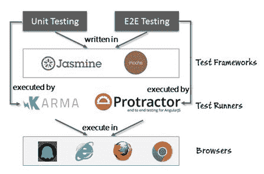
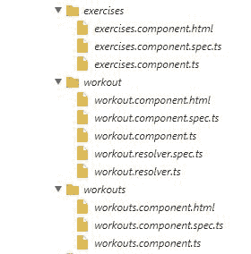
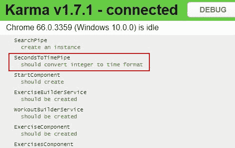
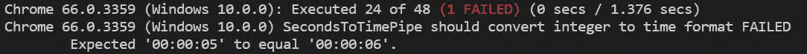
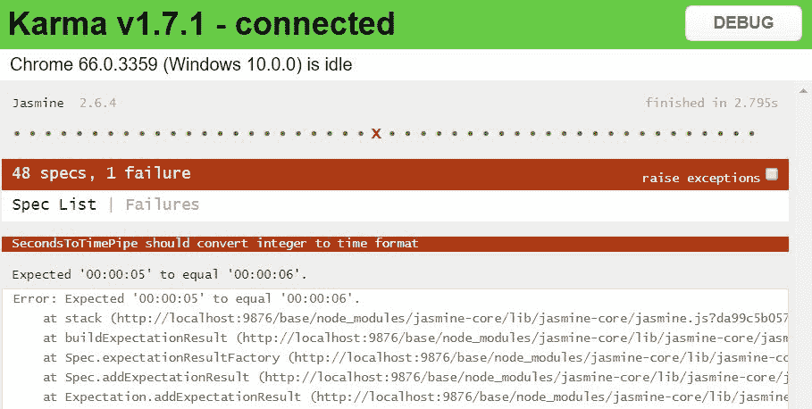
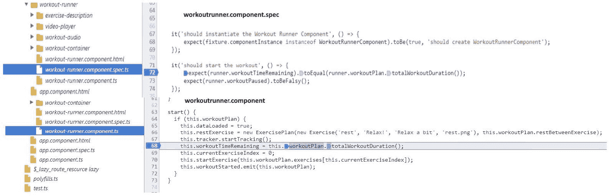

# 七、测试私人教练

除非你是一个代码完美的超级英雄，否则你需要测试你构建的东西。此外，除非您有大量空闲时间反复测试应用，否则您需要一些测试自动化。

当我们说 Angular 是在考虑可测试性的情况下构建的，我们是认真的。它有一个强大的**依赖注入**（**DI**）框架，一些好的模拟构造，以及令人敬畏的工具，使得在 Angular 应用中进行测试成为一项卓有成效的工作。

这一章都是关于测试的，并且致力于测试我们在本书中构建的内容。我们测试从组件到管道、服务和我们的应用指令的一切。

本章涵盖的主题包括：

*   **了解全局**：我们将尝试了解测试如何融入 Angular 应用开发的整体环境。我们还将讨论测试角支撑的类型，包括单元和**端到端**（**E2E**测试。
*   **工具和框架概述**：我们将介绍有助于使用 Angular 进行单元测试和端到端测试的工具和框架。这些包括**业力**和**量角器**。
*   **编写单元测试**：您将学习如何在浏览器中使用**Jasmine**和**Karma**进行 Angular 单元测试。我们将对我们在最后几章中构建的内容进行单元测试。本节还教我们如何单元测试各种 Angular 构造，包括管道、组件、服务和指令。
*   **创建端到端测试**：自动端到端测试通过浏览器自动化模仿实际用户的行为来工作。您将学习如何结合使用量角器和 WebDriver 来执行端到端测试。

让测试开始吧！

当您开始阅读本章时，我们建议您下载`checkpoint 7.1`的代码。在 GitHub（[上提供 https://github.com/chandermani/angular6byexample](https://github.com/chandermani/angular6byexample) 供大家下载。检查点在 GitHub 中作为分支实现。如果您没有使用 Git，请从以下 GitHub 位置下载`checkpoint7.1`（ZIP 文件）的快照：[https://github.com/chandermani/angular2byexample/archive/checkpoint7.1.zip](https://github.com/chandermani/angular2byexample/archive/checkpoint7.1.zip) 。第一次设置快照时，请参考`trainer`文件夹中的`README.md`文件。

此检查点包含在前面章节中创建组件、服务、管道和指令时由 Angular CLI 生成的测试。我们在这些测试中做了一些小改动，使它们都通过了。在大多数情况下，这些都是基本的“Hello World”测试，用于确认组件或其他 Angular 构造的创建。本章将不介绍这些测试，但鼓励您复习。


# 自动化的需要

为网络构建的应用的规模和复杂性与日俱增。我们现在有太多的选项来构建 web 应用，这简直令人难以置信。此外，产品/应用的发布周期已从数月大幅缩短到数天，甚至每天多次发布！这给软件测试带来了很大的负担。要测试的东西太多了。多个浏览器、多个客户端和屏幕大小（桌面和手机）、多分辨率，等等。

要在如此多样化的环境中取得成效，自动化是关键。*自动化所有可以自动化的东西*应该是我们的座右铭。


# Angular 测试

Angular 团队意识到可测试性的重要性，因此创建了一个框架，允许对基于该框架构建的应用进行简单的测试（自动化）。使用 DI 构造到处注入依赖项的设计选择有所帮助。随着本章的进展，这一点将变得清晰，我们为我们的应用构建了大量测试。然而，在此之前，让我们先了解一下在这个平台上构建应用时所针对的测试类型。


# 测试类型

对于典型的 Angular 应用，我们通常会进行两种形式的测试：

*   **单元测试**：单元测试是对组件进行隔离测试，以验证其行为的正确性。被测组件的大多数依赖项都需要用模拟实现来替换，以确保单元测试不会因为依赖组件中的故障而失败。
*   **端到端测试**：这种类型的测试都是关于像真正的最终用户一样执行应用，并验证应用的行为。与单元测试不同，组件不是单独测试的。测试是针对真实浏览器中运行的系统进行的，断言是基于用户界面的状态和显示的内容进行的。

单元测试是抵御 bug 的第一道防线，我们应该能够在单元测试期间解决大部分代码问题。但除非完成 E2E，否则我们无法确认软件是否正常工作。只有当系统中的所有组件以期望的方式交互时，我们才能确认软件工作正常；因此，E2E 测试成为必要。

您可以像金字塔一样查看这两种类型的测试，顶部是 E2E 测试，底部是单元测试。金字塔表示您编写的单元测试的数量应该大大超过 E2E 测试的数量。原因是，通过单元测试，您将应用分解为小的可测试单元，而通过集成测试，您将跨越从 UI 到后端的多个组件。此外，设置 E2E 测试往往比单元测试更复杂。

谁编写单元测试和 E2E 测试以及何时编写是需要回答的重要问题。


# 测试–谁做，何时做？

传统上，E2E 测试由**质量保证**（**质量保证**团队）完成，开发人员负责在提交代码之前对其代码进行单元测试。开发人员也做了一些 E2E 测试，但总体而言 E2E 测试过程是手动的。

随着环境的变化，现代测试工具，特别是在 web 前端，已经允许开发人员自己编写自动化 E2E 测试，并针对任何部署设置（如开发/阶段/生产）执行它们。像 Selenium 这样的工具，加上 WebDrivers，可以轻松地实现浏览器自动化，从而可以轻松地针对真实的 web 浏览器编写和执行 E2E 测试。

编写 E2E 场景测试的最佳时机是开发完成并准备部署时。

谈到单元测试，在编写测试时有不同的思想流派。*测试驱动开发人员*在功能实现之前编写测试。其他人在实现完成时编写测试以确认行为。有些人在开发组件本身时编写。选择适合您的样式，记住越早编写测试越好。

我们不会提出任何建议，也不会就哪一个更好展开争论。任何数量的单元测试都比没有好。我们个人的偏好是使用*中间方法*。有了 TDD，我们感觉测试创建工作有时会随着规范/需求的变化而丢失。在一开始编写的测试容易随着需求的变化而不断修正。最后编写单元测试的问题是，我们的目标是创建根据当前实现通过的测试。对编写的测试进行了改装，以测试应该测试规范的实现。在中间添加测试对我们来说是最好的。

现在，让我们尝试了解 Angular 测试可用的工具和技术前景。


# 测角生态系统

查看下图，了解支持 Angular 测试的工具和框架：



The tools and frameworks that support Angular testing

正如我们所看到的，我们使用单元测试库编写测试，比如**Jasmine**或**Mocha**。

目前，Angular 测试库默认与*Jasmine*一起工作。然而，Angular 团队表示，他们已经使框架更加通用，这样您就可以使用其他测试库，比如 Mocha。Angular 文档尚未更新以包括如何执行此操作。有关使用 Mocha 和 Angular CLI 测试命令的讨论，请参见[https://github.com/angular/angular-cli/issues/4071](https://github.com/angular/angular-cli/issues/4071) 。

这些测试由 Karma 或量角器执行，具体取决于我们编写的是单元测试还是集成测试。这些测试运行程序依次在浏览器（如 Chrome、Firefox、IE）或无头浏览器（如 PhantomJS）中运行我们的测试。需要强调的是，不仅 E2E，而且单元测试都是在真实的浏览器中执行的。

本章中的所有测试都是使用 Jasmine 编写的（单元测试和集成测试）。Karma 将成为我们单元测试的测试运行者和 E2E 测试的量角器。


# 单元测试入门

单元测试的最终目的是单独测试特定的代码/组件，以确保组件按照规范工作。这降低了组件与软件其他部分集成时出现故障/bug 的可能性。在我们开始编写测试之前，有一些指导原则可以帮助我们编写良好且可维护的测试：

*   一个单元应该测试一个行为。出于显而易见的原因，每个单元测试测试一个行为是有意义的。失败的单元测试应该清楚地突出问题区域。如果同时测试多个行为，则失败的测试需要更多的探测来断言违反了哪些行为。
*   单元测试中的依赖项应该使用测试双打（如伪造、模拟或 st）进行模拟。顾名思义，单元测试应该测试单元，而不是它的依赖项。
*   单元测试不应永久改变被测试组件的状态。如果确实发生，其他测试可能会受到影响。
*   单元测试的执行顺序应该是无关紧要的。一个单元测试不应该依赖于在它之前执行的另一个单元测试。这是脆性单元测试的迹象。这也可能意味着依赖关系没有被模拟。
*   单元测试应该是快速的。如果它们不够快，开发人员就不会运行它们。这是在单元测试中模拟所有依赖项（如数据库访问、远程 web 服务调用等）的一个很好的理由。
*   单元测试应该尝试覆盖所有代码路径。代码覆盖率是一个指标，可以帮助我们评估单元测试的有效性。如果我们在测试期间涵盖了所有积极和消极的场景，那么覆盖率确实会更高。这里需要注意的一点是：高代码覆盖率并不意味着代码没有 bug，但低覆盖率清楚地表明单元测试中没有覆盖区域。
*   单元测试应该测试积极和消极的场景。只是不要专注于阳性的测试用例；所有软件都可能失败，因此单元测试失败场景与成功场景同样重要。

这些指南不是特定于框架的，但为我们编写好的测试提供了足够的弹药。让我们通过设置单元测试所需的组件来开始单元测试的过程。


# 为单元测试设置 Karma 和 Jasmine

当我们使用 Angular CLI 创建项目时，CLI 配置了使用 Karma 和 Jasmine 对代码进行单元测试的设置。它是通过在我们的项目中添加几个 Karma 和 Jasmine 模块来实现的。它还向我们的应用根目录`trainer/`中添加了一个 Karma 配置文件`karma.config.js`，并在`trainer/src`目录中添加了一个名为`tests.ts`的文件。CLI 在运行时使用这些文件来创建用于执行测试的配置。这意味着我们只需使用以下命令即可运行测试：

```ts
ng test
```

CLI 还将监视我们的测试是否有更改，并自动重新运行它们。

这里我们将不详细介绍配置文件。开箱即用的设置对于我们来说是很好的。请参阅业力文件（[http://karma-runner.github.io/1.0/config/configuration-file.html](http://karma-runner.github.io/1.0/config/configuration-file.html) 了解更多关于各种 Karma 配置选项的信息。


# 测试文件的组织和命名

为了对我们的应用进行单元测试，我们应该为我们计划在项目中测试的每个 TypeScript 文件准备一个测试文件（如[T0]）。这就是 Angular CLI 为我们所做的。当我们使用 CLI 创建组件、服务、管道或指令时，CLI 将生成相应的测试并将其放置在相同的文件目录中。

用被测文件的名称加上`.spec`来命名测试文件是使用 Jasmine 进行测试的开发人员使用的惯例。它还用于帮助将文件映射到我们前面概述的配置步骤中的测试。

此测试文件包含相应组件的单元测试规范，如以下屏幕截图所示（在运行单元测试时在 Karma 调试器中拍摄）：




# 单元测试 Angular 应用

在本书的整个过程中，我们已经构建了涵盖 Angular 中所有可用构造的组件。我们已经构建了组件、管道、一些服务，最后还有一些指令。所有这些都可以在单元测试中进行测试。

本章其余部分的代码可在`checkpoint 7.2`中找到。在 GitHub（[上提供 https://github.com/chandermani/angular6byexample](https://github.com/chandermani/angular6byexample) 供大家下载。检查点在 GitHub 中作为分支实现。如果您没有使用 Git，请从以下 GitHub 位置下载`checkpoint7.2`（ZIP 文件）的快照：[https://github.com/chandermani/angular2byexample/archive/checkpoint7.2.zip](https://github.com/chandermani/angular2byexample/archive/checkpoint7.1.zip) 。第一次设置快照时，请参考`trainer`文件夹中的`README.md`文件。

为了掌握 Jasmine 单元测试的窍门，让我们先测试最小最简单的组件：管道。


# 单元测试管

管道是最容易测试的，因为它们对其他构造的依赖性最小或为零。我们为*训练跑步者*创建的`SecondsToTimePipe`（*7 分钟训练*应用）没有依赖性，可以轻松进行单元测试。

查看 Jasmine 框架文档，了解如何使用 Jasmine 编写单元测试。CLI 使用 Jasmine 2.6 进行单元测试（[http://jasmine.github.io/2.6/introduction.html](http://jasmine.github.io/2.0/introduction.html) ）。Jasmine 提供了一些最好的文档，整个框架使用起来非常直观。我们强烈建议您在继续之前访问 Jasmine 站点并熟悉该框架。

打开`trainer/src/app/shared` 文件夹中的`seconds-to-time.pipe.spec.ts`文件，更新其中的单元测试，如下所示：

```ts
import { SecondsToTimePipe } from './seconds-to-time.pipe';
describe('SecondsToTimePipe', () => {
  const pipe = new SecondsToTimePipe();
  it('should convert integer to time format', () => {
      expect(pipe.transform(5)).toEqual('00:00:05');
      expect(pipe.transform(65)).toEqual('00:01:05');
      expect(pipe.transform(3610)).toEqual('01:00:10');
  });
});
```

让我们来看看我们在测试文件中所做的事情。

毫不奇怪，我们导入了`SecondsToTimePipe`，我们将对其进行测试。这与我们在 TypeScript 类的其他地方使用的导入一样。请注意，我们使用了它所在文件的相对路径`'./seconds-to-time.pipe'`。在 Angular 中，这意味着在与测试本身相同的目录中查找要测试的组件。正如您所记得的，这是我们设置文件结构的方式：将测试放在与被测试文件相同的目录中。

在下一行中，我们开始使用 Jasmine 语法。首先，我们将测试包装在一个`describe`函数中，该函数用于识别测试。该函数的第一个参数是对测试的用户友好描述；在这种情况下，它是`SecondsToTimePipe`。对于第二个参数，我们传递一个 lambda（胖箭头）函数，该函数将包含我们的测试。在设置一个局部变量来保存管道之后，我们调用 Jasmine 的`beforeEach`函数，并使用它来注入管道的一个实例。

由于`beforeEach`函数在`describe`函数中的每个测试之前运行，因此我们可以将其用于将在每个测试中运行的公共代码。在这种情况下，它不是严格必要的，因为在我们的`describe`函数中只有一个测试。但是，养成在常见设置场景中使用它的习惯是一个好主意，我们将继续讨论。

接下来，我们调用 Jasmine 的`it`函数并给它传递一个标题，以及对 Jasmine 的`expect`函数（Jasmine 用于断言的名称）的三个调用。这些都是不言自明的。

在我们的测试中，没有必要显式导入这些 Jasmine 函数。


# 运行我们的测试文件

现在，使用以下命令运行我们的测试：

```ts
ng test
```

Angular CLI 将把我们的 TypeScript 文件转换为 JavaScript，然后观察这些文件中的更改。

然后，我们应该在终端窗口中看到此输出（测试的总数可能与您的不同）：


最后一行显示我们的测试成功通过（以及所有其他测试）。

您还可以在浏览器窗口中查看测试结果，Karma 将在运行我们的测试时启动该窗口：



您会注意到，Karma 显示了用于管道测试的`describe`语句（SecondsToTimePipe），并将其嵌套在我们创建的测试的`it`语句（应将整数转换为时间格式）下，以便向我们显示测试的预期结果。阅读显示的结果可以很容易地理解测试结果。

为了确保它报告了正确的通过/失败结果，让我们在测试中做一个更改，以使其中一个预期失败。将第一个期望值中的时间更改为 6 秒而不是 5 秒，如下所示：

```ts
expect(pipe.transform(5, [])).toEqual('00:00:06'); 
```

我们收到以下错误消息：



这个错误消息的好处在于，它将`describe`和`it`描述组合成一个完整的句子，提供了错误的清晰摘要。这显示了 Jasmine 如何允许我们编写可读的测试，以便对我们的代码不熟悉的人能够快速理解其中可能出现的任何问题。下一行告诉我们哪些期望没有达到，哪些是期望的，以及哪些实际结果没有达到这个期望。

我们还将在此消息下方获得一个堆栈跟踪，以及显示测试总体结果的最后一行：


在浏览器中，我们可以看到以下内容：



你会注意到的一件事是，当我们改变我们的测试时，我们不必重新运行业力。相反，它监视文件和相关测试中的任何更改，并在我们进行更改时立即报告成功或失败。

很酷！让我们撤消上次所做的更改，并将测试恢复到通过状态。


# 单元测试组件

测试 Angular 组件比测试简单管道或服务更复杂。这是因为 Angular 组件与视图关联，并且通常比服务、过滤器或指令具有更多的依赖关系。


# Angular 测试实用程序

由于其复杂性，Angular 引入了一些实用程序，使我们能够更轻松地测试组件。这些测试实用程序包括`TestBed`类（我们以前用于初始化测试）和`@angular/core/testing`中的几个辅助函数。

`TestBed`有一个`createComponent`方法，返回一个包含多个成员和方法的`ComponentFixture`，包括：

*   `debugElement`：用于调试组件
*   `componentInstance`：用于访问组件属性和方法
*   `nativeElement`：用于访问视图的标记和其他 DOM 元素
*   `detectChanges`：用于触发组件的变更检测周期

`ComnponentFixture`还包含重写组件的视图、指令、绑定和提供程序的方法。接下来，我们将在剩下的测试中使用`TestBed`。

`TestBed`有一个名为`configureTestingModule`的方法，我们可以使用它将测试设置为自己的模块。这意味着我们可以绕过初始引导过程，在测试文件中编译被测试的组件。我们还可以使用`TestBed`指定其他依赖项，并确定我们需要的提供者。

根据文献资料(https://angular.io/guide/testing#testbed-类摘要），重要的是在`beforeEach`**中*调用测试床方法，以确保在每个单独的测试*之前重新开始。**

 *

# 管理测试中的依赖关系

Angular 视图中的组件将视图与其他所有对象集成在一起。因此，与任何服务、筛选器或指令相比，组件通常具有更多的依赖性。

尽管我们的单元测试关注组件本身的代码，但我们仍然需要在测试中考虑这些依赖关系，否则测试将失败（我们跳过了管道测试的依赖关系设置，因为它没有外部依赖关系）。

处理这些依赖关系有两种方法：将它们注入到我们的组件中，或者为它们创建一个可以在测试中使用的模拟或伪模型。如果依赖项足够简单，我们可以将它的一个实例注入到测试类中。但是，如果依赖项非常复杂，特别是如果它有自己的依赖项和/或进行远程服务器调用，那么我们应该模拟它。Angular 测试库为我们提供了这样做的工具。

我们计划在本节中测试的组件是`WorkoutRunner`组件。位于`trainer/src/components/workout-runner/`内，这是运行特定训练的组件。


# 单元测试运行部件

在这样的背景下，让我们开始单元测试`WorkoutRunnerComponent`。

首先，打开`workout-runner-component.spec.ts`并将导入更新为以下内容：

```ts
import { inject, fakeAsync, async, tick, TestBed, discardPeriodicTasks } from '@angular/core/testing';
import { NO_ERRORS_SCHEMA } from '@angular/core';
import { Router } from '@angular/router';
import { of } from 'rxjs/observable/of';

import { WorkoutPlan, ExercisePlan, Exercise } from '../core/model';
import { WorkoutRunnerComponent } from './workout-runner.component';
import { SecondsToTimePipe } from '../shared/seconds-to-time.pipe';
import { WorkoutService } from '../core/workout.service';
import { WorkoutHistoryTrackerService } from '../core/workout-history-tracker.service';
```

这些导入标识了我们将在测试中使用的测试实用程序（以及来自`RxJS`的`Router`和`of`等内容），以及组件所需的类型和依赖关系。稍后我们将讨论这些依赖关系。一个看起来与其他导入不同的导入是从`@angular/core`导入`NO_ERRORS_SCHEMA`的导入。我们将使用此导入忽略我们将不测试的组件中的元素。我们稍后将再次进一步讨论这个问题。

关于导入，需要注意的另一件事是`@angular/core/testing`是核心模块的一部分，而不是在单独的测试模块中。这是用于 Angular 测试的导入的常见模式。例如，当我们开始测试 HTTP 时，您将看到我们正在从`@angular/http/testing`导入。


# 设置组件依赖项

接下来，我们需要建立组件的依赖关系，并确定是否需要注入或模拟它们。如果我们查看`WorkoutRunner`组件的代码，我们会发现有三个依赖项被注入到我们的组件中：

*   `WorkoutHistoryTracker`：这是一个附加了一些行为的组件。所以我们肯定要嘲笑它。
*   `Router`：为了将`WorkoutRunner`与应用的其余部分隔离开来，并防止我们的测试试图离开`WorkoutRunner`视图，我们也必须对此进行模拟。
*   `WorkoutService:`这是一项服务，我们将使用它进行 HTTP 调用以检索我们的训练。我们也将模拟此服务，因为我们不希望在测试中调用外部系统。


# 模拟依赖项-训练历史跟踪器

Angular 允许我们使用简单的类以直接的方式模拟依赖关系。让我们从嘲弄开始。为此，请在导入之后添加以下类：

```ts
class MockWorkoutHistoryTracker { 
    startTracking() {} 
    endTracking() {} 
    exerciseComplete() {} 
} 
```

我们不需要模拟整个`WorkoutHistoryTracker`类，只需要模拟`WorkoutRunner`将调用的方法。在这种情况下，这些方法是`startTracking()`、`endTracking()`和`exerciseComplete()`。我们将这些方法设置为空，因为我们不需要从它们返回任何东西来测试`WorkoutRunner`。现在我们可以将这个虚拟实现注入到`WorkoutRunner`中，无论它在哪里寻找`WorkoutHistoryTracker`。


# 模拟依赖项–训练服务

在*支持服务器数据持久化*中，我们扩展了训练服务，通过远程调用检索填充训练的数据。对于训练跑步者的单元测试，我们希望用一个模拟实现替换该调用，该模拟实现返回一些静态数据，我们可以使用这些数据来运行测试。因此，我们将添加第三个模拟类，如下所示：

```ts
class MockWorkoutService {

    sampleWorkout = new WorkoutPlan(
         'testworkout',
         'Test Workout',
          40,
          [
              new ExercisePlan(new Exercise( 'exercise1', 'Exercise 1', 'Exercise 1 description', 
                                               '/image1/path', 'audio1/path'), 50),
              new ExercisePlan(new Exercise( 'exercise1', 'Exercise 2', 'Exercise 2 description', 
                                               '/image2/path', 'audio2/path'), 30),
              new ExercisePlan(new Exercise( 'exercise1', 'Exercise 3', 'Exercise 3 description', 
                                               '/image3/path', 'audio3/path'), 20)
          ],
          'This is a test workout'
    );

    getWorkout(name: string) {
        return of(this.sampleWorkout);
    }
    totalWorkoutDuration() {
        return 180;
    }
} 
```

请注意，`getWorkout`方法返回一个`Observable`，如使用`of`操作符所示。否则，该类是自解释的。


# 模拟依赖项-路由器

与`WorkoutHistoryTracker`和`WorkoutService`一样，我们也将使用 mocking 来处理角路由器上的依赖关系。但在这里，我们将采取稍微不同的方法。我们将在模拟游戏中为`navigate`方法分配一名茉莉花间谍：

```ts
export class MockRouter {
    navigate = jasmine.createSpy('navigate');
}
```

这对于我们的目的来说已经足够了，因为我们只想确保路由器的`navigate`方法是以适当的路由（`finished`作为参数来调用的。茉莉花间谍将允许我们这样做，我们将在后面看到。


# 使用测试床配置我们的测试

现在我们已经排除了导入和依赖项，让我们从测试本身开始。我们首先添加一个 Jasmine`describe`函数来包装我们的测试，然后使用`let`设置两个局部变量：一个用于`fixture`，另一个用于`runner`：

```ts
describe('Workout Runner', () =>{ 
    let fixture:any; 
    let runner:any; 
```

接下来，我们将添加一个`beforeEach`函数来设置我们的测试配置：

```ts
beforeEach( async(() =>{ 
    TestBed 
        .configureTestingModule({ 
            declarations: [ WorkoutRunnerComponent, SecondsToTimePipe ], 
            providers: [ 
                {provide: Router, useClass: MockRouter}, 
                {provide: WorkoutHistoryTracker ,useClass: 
                MockWorkoutHistoryTracker}, 
                {provide: WorkoutService ,useClass: MockWorkoutService} 
            ], 
            schemas: [ NO_ERRORS_SCHEMA ] 
        }) 
        .compileComponents() 
        .then(() => { 
            fixture = TestBed.createComponent(WorkoutRunnerComponent); 
            runner = fixture.componentInstance; 
        }); 
}));  
```

`beforeEach`方法在每次测试之前执行，这意味着我们只需在测试文件中设置一次。在`beforeEach`中，我们添加了一个`async`呼叫。这是必需的，因为我们正在调用异步`compileComponents`方法。

Angular 文档表明，`async`函数将测试人员的代码安排在一个特殊的`async`测试区域中运行，该区域隐藏了异步执行的机制，就像传递到`it`测试时一样。有关更多信息，请参阅`https://angular.io/docs/ts/latest/guide/testing.html#!#async-in-before-each`。我们稍后将对此进行更详细的讨论。

让我们按照执行的顺序检查每个方法调用。第一种方法`configureTestingModule`允许我们在测试模块的基本配置基础上进行构建，并添加导入、声明（我们将在测试中使用的组件、指令和管道）以及提供者等内容。在我们的测试中，我们首先添加了针对训练跑步者、测试组件和`SecondsToTimePipe:`的声明

```ts
declarations: [ WorkoutRunnerComponent, SecondsToTimePipe ], 
```

然后我们为我们的`Router`、`WorkoutHistoryTracker`和`WorkoutService`添加了三个提供商：

```ts
providers: [ 
    {provide: Router, useClass: MockRouter}, 
    {provide: WorkoutHistoryTracker ,useClass: MockWorkoutHistoryTracker}, 
    {provide: WorkoutService ,useClass: MockWorkoutService} 
], 
```

对于这些提供者中的每一个，我们都将`useClass`属性设置为我们的模拟，而不是实际的组件。现在，在我们测试的任何地方，当`WorkoutRunner`需要这些组件中的任何一个时，将使用模拟。

下一个配置可能看起来有点神秘：

```ts
schemas: [ NO_ERRORS_SCHEMA ] 
```

此设置允许我们绕过与组件模板中使用的两个组件相关联的自定义元素相关的错误：`ExerciseDescriptionComponent`和`VideoPlayerComponent`。此时，我们不希望在`WorkoutRunnerComponent`的测试中测试这些组件。相反，我们应该单独测试它们。但是，使用此设置时需要注意的一点是，它将抑制与测试组件模板中的元素和属性相关的所有模式错误；因此，它可能会隐藏您确实希望看到的其他错误。

当您使用`NO_ERRORS_SCHEMA`设置测试时，您正在创建一个称为浅层测试的测试，它不会比您正在测试的组件更深。浅层测试允许您减少正在测试的组件中模板的复杂性，并减少模拟依赖项的需要。

测试配置的最后步骤是编译和实例化组件：

```ts
.compileComponents() 
.then(() => { 
    fixture = TestBed.createComponent(WorkoutRunnerComponent); 
    runner = fixture.componentInstance; 
}); 
```

如前所述，我们在`beforeEach`方法中使用`async`函数，因为这是调用`compileComponents`方法时所必需的。这个方法调用是异步的，我们需要在这里使用它，因为我们的组件有一个在`templateUrl`中指定的外部模板。此方法编译外部模板，然后将其内联，以便`createComponent`方法（同步）可以使用它来创建我们的组件夹具。该部件夹具依次包含一个`componentInstance`-`WorkoutRunner`。然后，我们将`fixture`和`componentInstance`分配给局部变量。

如前所述，我们使用的`async`函数创建了一个特殊的`async`测试区域，我们的测试将在其中运行。您会注意到，这个函数是从普通的`async`编程中简化出来的，允许我们在不返回承诺的情况下使用`.then`操作符。

您还可以在各个测试方法中编译和实例化测试组件。但是`beforeEach`方法允许我们在所有测试中只做一次。

现在我们已经配置了测试，让我们继续单元测试`WorkoutRunner`。


# 启动单元测试

从加载训练数据到转换训练、暂停训练和运行训练视频，我们可以测试`WorkoutRunner`的许多方面。`workout.spec.ts`文件（可在`trainer/src`下的`components/workout-runner`文件夹中找到）包含多个单元测试，涵盖了上述场景。我们将学习其中一些测试并完成它们。

首先，让我们添加一个测试用例，验证加载组件后训练是否开始运行：

```ts
it('should start the workout', () => { 
    expect(runner.workoutTimeRemaining).toEqual(runner.workoutPlan.totalWorkoutDuration()); 
    expect(runner.workoutPaused).toBeFalsy(); 
});  
```

此测试确认训练的总持续时间正确，并且训练处于运行状态（即未暂停）。

因此，让我们执行测试。它失败了（检查 Karma 控制台）。奇怪的所有依赖项都已正确设置，但由于未定义，`it`块的第二个`expect`函数仍然失败。

我们需要调试这个测试。


# 在 Karma 中调试单元测试

在 Karma 中调试单元测试很容易，因为测试是在浏览器中运行的。我们在调试标准 JavaScript 代码时调试测试。由于我们的 Karma 配置添加了从 TypeScript 文件到 JavaScript 文件的映射，我们可以直接在 TypeScript 中进行调试。

当 Karma 启动时，它会打开一个特定的浏览器窗口来运行测试。要调试 Karma 中的任何测试，我们只需单击浏览器窗口顶部的 debug 按钮。

Karma 打开了一个窗口，当我们点击 Debug 时打开了一个窗口；我们也可以使用原始窗口进行测试，但原始窗口连接到 Karma 并进行实时重新加载。另外，原始窗口中的脚本文件带有时间戳，每当我们更新测试时，时间戳都会改变，因此需要我们再次输入断点进行测试。

单击 Debug 之后，将打开一个新的选项卡/窗口，其中包含所有测试和其他加载用于测试的应用脚本。这些脚本是在`karma.conf.js`文件部分的 Karma 配置设置过程中定义的。

要调试前面的故障，我们需要在两个位置添加断点。应在测试本身中添加一个，在`WorkoutComponent`中添加第二个，在`WorkoutComponent`中加载训练并将数据分配给适当的局部变量。

执行以下步骤在 Google Chrome 中添加断点：

1.  单击 Karma 启动时加载的窗口上的调试按钮，打开 Karma 调试窗口/选项卡。
2.  按 F12 键打开开发者控制台。

3.  转到 Sources 选项卡，应用的 TypeScript 文件将位于`source`文件夹中。
4.  现在，只需单击行号，就可以在所需位置放置断点。这是调试任何脚本的标准机制。在此处突出显示的位置添加断点：



5.  我们刷新调试页面（单击调试按钮时打开的页面）。[T0]中的断点从未命中，导致测试失败。

我们忽略的是，我们试图达到的代码在`workout-runner`的`start`方法中，并且`start`方法没有在构造函数中调用。而是在通过调用`ngOnInit`中的`getWorkout`方法加载训练数据后，在`ngDoCheck`中调用它。在测试中添加对`ngOnInit`和`ngDoCheck`的调用，如下所示：

```ts
        it('should start the workout', () => { 
 runner.ngOnInit(); runner.ngDoCheck(); 
            expect(runner.workoutTimeRemaining).toEqual(
                   runner.workoutPlan.totalWorkoutDuration()); 
            expect(runner.workoutPaused).toBeFalsy(); 
        }); 
```

6.  保存更改，Karma 将再次运行测试。这一次它会过去。

随着测试数量的增长，单元测试可能要求我们专注于特定的测试或特定的测试套件。Karma 允许我们通过将`f`前置到现有的`it`块来针对一个或多个测试；也就是说，`it`变成了`fit`。如果业力发现有`fit`的测试，它只执行这些测试。类似地，可以通过将`f`前置到现有`describe`块`fdescribe`以特定测试套件为目标。此外，如果将[T8]前置到一个[T9]块，使其成为[T10]，则该块将被跳过。

让我们继续对组件进行单元测试！


# 单元测试修井机继续。。。

我们还可以测试哪些有趣的东西？我们可以测试第一次演习是否已经开始。在刚才添加的测试之后，我们将此测试添加到`workout.spec.ts`：

```ts
it('should start the first exercise', () => { 
    spyOn(runner, 'startExercise').and.callThrough(); 
    runner.ngOnInit(); 
    runner.ngDoCheck(); 
    expect(runner.currentExerciseIndex).toEqual(0); 
    expect(runner.startExercise).toHaveBeenCalledWith(
    runner.workoutPlan.exercises[runner.currentExerciseIndex]); 
    expect(runner.currentExercise).toEqual(
    runner.workoutPlan.exercises[0]); 
}); 
```

本测试中的第二个`expect`函数很有趣。它使用了茉莉花的特征：间谍。SPIE 可用于验证方法调用和依赖关系。


# 使用 Jasmine 间谍验证方法调用

spy 是一个对象，它拦截对其监视的函数的每次调用。一旦调用被拦截，它可以返回固定数据，也可以将调用传递给被调用的实际函数。它还记录了调用细节，这些细节可以在`expect`中稍后使用，正如我们在前面的测试中所做的那样。

间谍非常强大，可以在单元测试期间以多种方式使用。请看[上关于间谍的文件 http://jasmine.github.io/2.0/introduction.html#section-间谍](http://jasmine.github.io/2.0/introduction.html#section-Spies)了解更多关于他们的信息。

第二个`expect`函数验证在训练开始时（`toHaveBeenCalledWith`调用了`startExercise`方法。它还断言传递给函数的参数的正确性。但是，我们需要使用第二个断言来建立第二个断言。

在本例中，我们使用 spy 模拟对`startExercise`方法的调用。我们可以使用 spy 通过 Jasmine 的`toHaveBeenCalledWith`函数来确定是否调用了该方法以及使用了哪些参数。

查看[T0]和[T1]函数的 Jasmine 文档，了解有关这些断言函数的更多信息。

在这里，调用该方法时使用当前`Exercise`作为参数。由于前面的`expect`确认这是第一个练习，因此本`expect`确认已执行启动该第一个练习的调用。

这里有几件事需要注意。首先，在调用`ngOnInit`之前，您必须小心地设置`spyOn`。否则，当调用`startExercise`方法时，spy 将不会*监视*，并且不会捕获方法调用。

其次，由于间谍是一个模拟的，我们通常无法验证`startExercise`方法中的任何内容。这是因为方法本身正在被嘲笑。这意味着我们无法实际验证是否已设置了`currentExercise`属性，因为这是在 mock 方法中完成的。然而，Jasmine 允许我们将间谍链接到`and.callThrough`，这意味着除了跟踪对方法的调用之外，它还将委托给实际的实现。这样我们就可以测试在`startExercise`方法中`currentExercise`是否也被正确设置。


# 使用 Jasmine 间谍验证依赖关系

虽然我们只是使用间谍来验证对类内方法的调用，但 Jasmine 间谍在模拟对外部依赖项的调用时也很有用。但为什么要测试对外部依赖项的调用呢？毕竟，我们正试图将我们的测试限制在组件本身！

答案是，我们模拟依赖项，以确保依赖项不会对被测组件产生负面影响。从单元测试的 Angular 来看，我们仍然需要确保被测试的组件在正确的时间使用正确的输入调用这些依赖关系。在 Jasmine 世界中，间谍帮助我们判断依赖项是否被正确调用。

如果我们查看`WorkoutRunner`实现，我们会在训练开始时发出一条包含训练细节的消息。外部依赖项`WorkoutHistoryTracker`订阅此消息/事件。因此，让我们创建一个间谍并确认`WorkoutHistoryTracker`是在训练开始时开始的。

在前一块之后添加此`it`块：

```ts
it("should start history tracking", inject([WorkoutHistoryTracker], (tracker: WorkoutHistoryTracker) => { 
     spyOn(tracker, 'startTracking'); 
     runner.ngOnInit(); 
     runner.ngDoCheck(); 
     expect(tracker.startTracking).toHaveBeenCalled(); 
 })); 
```

在`it`块中，我们在`tracker`上添加了一个间谍，这是`WorkoutHistoryTracker`的本地实例。然后我们使用 spy 来验证该依赖项的`startTracking`方法是否已被调用。简单而富有表现力！

您可能还记得我们在这里使用的是`MockHistoryWorkoutTracker`；它包含一个 mock，一个空且不返回任何内容的`startTracking`方法。这很好，因为我们不是在测试`WorkoutHistoryTracker`本身，而是在测试`WorkoutRunner`对其进行的方法调用。该测试表明，能够将模拟与间谍结合起来，以单独和独立地测试`WorkoutRunner`的内部工作是多么有用。


# 测试事件发射器

检查`WorkoutRunner`的代码，我们看到它为`workoutStarted`设置了几个事件发射器，如下所示：

```ts
@Output() workoutStarted: EventEmitter<WorkoutPlan> = new EventEmitter<WorkoutPlan>(); 
```

Angular 文档将事件发射器描述为触发事件的输出属性，我们可以使用事件绑定订阅这些事件。在*构建我们的第一个应用-7 分钟训练*中，我们详细描述了如何在训练跑步者中使用事件发射器。所以我们对他们的工作有很好的了解。但是，我们如何对事件发射器进行单元测试，并确定它们以我们预期的方式触发事件呢？

这其实很容易做到。如果我们记得事件发射器是我们可以订阅的可观察主题，我们就会意识到我们可以在单元测试中订阅它。让我们回顾一下验证训练是否开始的测试，并将突出显示的代码添加到测试中：

```ts
it('should start the workout', () => { 
 runner.workoutStarted.subscribe((w: any) => { expect(w).toEqual(runner.workoutPlan); }); 
    runner.ngOnInit(); 
    runner.ngDoCheck(); 
    expect(runner.workoutTimeRemaining).toEqual(
    runner.workoutPlan.totalWorkoutDuration()); 
    expect(runner.workoutPaused).toBeFalsy(); 
}); 
```

我们注入了`WorkoutService`并添加了对`WorkoutStarted`事件发射器的订阅，以及检查属性是否在触发事件时发出`WorkoutPlan`的期望。订阅放在`ngOnInit`之前，因为这是导致触发`workoutStarted`事件的方法，我们需要在触发之前准备好订阅。


# 测试间隔和超时实现

我们面临的一个有趣挑战是验证训练是否随着时间的推移而进行。`Workout`组件使用`setInterval`随着时间向前移动。我们如何在不实际等待的情况下模拟时间？

答案是 Angular 测试库的`fakeAsync`函数，它允许我们同步运行异步代码。它通过将要执行的函数包装到`fakeAsync`区域来实现这一点。然后，它支持在该区域内使用同步计时器，还允许我们使用`tick()`模拟异步时间流逝。

有关`fakeAsync`的更多信息，请参见[中的 Angular 文档 https://angular.io/guide/testing#async-使用 fakeasync 进行测试。](https://angular.io/guide/testing#async-test-with-fakeasync)

让我们看看如何使用`fakeAsync`函数来测试代码中的超时和间隔实现。在`workout-runner.spec.ts`中增加以下测试：

```ts
    it('should increase current exercise duration with time', fakeAsync(() => {
        runner.ngOnInit();
        runner.ngDoCheck();
        expect(runner.exerciseRunningDuration).toBe(0);
        tick(1000);
        expect(runner.exerciseRunningDuration).toBe(1);
        tick(1000);
        expect(runner.exerciseRunningDuration).toBe(2);
        tick(8000);
        expect(runner.exerciseRunningDuration).toBe(10);
        discardPeriodicTasks();
    })); 
```

除了注入`WorkoutRunner`之外，我们首先将测试包装在`fakeAsync`中。然后我们向`WorkoutRunner`的`ngOnit()`方法添加一个调用。这将启动`WorkoutRunner`内练习的计时器。然后在测试中，我们使用在不同持续时间设置的`tick()`功能来测试计时器的运行情况，并确保它在我们预期的持续时间内继续运行。使用`tick()`可以让我们快速浏览代码，避免像异步运行代码那样等待几秒钟完成练习。

最后，我们称之为`discardPeriodicTasks()`。此方法是 Angular 测试实用程序之一，可与`fakeAsync`一起使用，以清除任务队列中可能存在的任何挂起计时器。

有关这些和其他 Angular 测试实用程序的更多信息，请参见[https://angular.io/guide/testing#testing-实用程序 API](https://angular.io/guide/testing#testing-utility-apis)

让我们试试另一个类似的测试。我们希望确保`WorkoutRunner`正确地从一个练习过渡到下一个练习。在`workout-runner.ts`中增加以下测试：

```ts
it("should transition to next exercise on one exercise complete", fakeAsync(() => { 
    runner.ngOnInit(); 
    runner.ngDoCheck(); 
    let exerciseDuration = runner.workoutPlan.exercises[0].duration; 
    TestHelper.advanceWorkout(exerciseDuration); 
    expect(runner.currentExercise.exercise.name).toBe('rest'); 
    expect(runner.currentExercise.duration).toBe(
    runner.workoutPlan.restBetweenExercise); 
    discardPeriodicTasks();
})); 
```

我们再次将测试包装在`fakeAsync`中，并调用`runner.ngOnInit`启动计时器。然后，我们获取第一次练习的持续时间，并使用以下`TestHelper`方法中的`tick()`功能将计时器提前一秒，超过该练习的持续时间：

```ts
class TestHelper {
    static advanceWorkout(duration: number) {
        for (let i = 0; i <= duration; i++) {tick(1000);
    }
}
```

接下来，我们测试我们现在在`rest`练习中，因此已经从第一个练习过渡的期望。


# 测试训练暂停和恢复

当我们暂停一项训练时，它应该停止，计时器不应该失效。要检查此情况，请添加以下时间测试：

```ts
it("should not update workoutTimeRemaining for paused workout on 
    interval lapse", fakeAsync(() => { 
    runner.ngOnInit(); 
    runner.ngDoCheck(); 
    expect(runner.workoutPaused).toBeFalsy(); 
    tick(1000); 
    expect(runner.workoutTimeRemaining).toBe(
    runner.workoutPlan.totalWorkoutDuration() - 1); 
    runner.pause(); 
    expect(runner.workoutPaused).toBe(true); 
    tick(1000); 
    expect(runner.workoutTimeRemaining).toBe(
    runner.workoutPlan.totalWorkoutDuration() - 1); 
    discardPeriodicTasks();
})); 
```

测试首先验证训练状态为未暂停，将时间提前一秒，暂停，然后验证暂停后`workoutTimeRemaining`的时间没有改变。


# 单元测试服务

服务的单元测试与单元测试组件没有太大区别。一旦我们掌握了如何设置组件及其依赖项（主要使用 mock）的诀窍，将这种学习应用于测试服务就成了例行公事。通常，挑战在于为服务设置依赖关系，以便能够有效地进行测试。

对于发出远程请求的服务（使用[T0]或[T1]），情况略有不同。在我们可以单独测试此类服务之前，需要进行一些设置。

我们将针对`WorkoutService`并为其编写一些单元测试。由于此服务发出远程请求以加载训练数据，因此我们将探索如何使用模拟 HTTP 后端测试此类服务。Angular 为我们提供了这样做的`HttpTestingController`。


# 使用 HttpTestingController 模拟 HTTP 请求/响应

当测试发出远程请求的服务（或者，事实上，任何其他 Angular 构造）时，我们显然不希望向后端发出实际请求来检查行为。这甚至不符合单元测试的条件。后端交互只需要被模仿掉。Angular 正好提供了这一点。使用`HttpTestingController`，我们拦截 HTTP 请求，模拟来自服务器的实际响应，并断言端点调用。

打开`workout-service.spec.ts`并在文件顶部添加以下导入语句：

```ts
import { TestBed, inject, async, fakeAsync } from '@angular/core/testing';
import { HttpClientTestingModule, HttpTestingController } from '@angular/common/http/testing';
import { HttpClient, HttpResponse } from '@angular/common/http';

import { WorkoutService } from './workout.service';
import { WorkoutPlan, Exercise } from './model';
```

除了从`core/testing`模块导入外，我们还从`http/testing`模块导入`HttpClientTestingModule`和`HttpTestingController`。我们还进口了我们将测试的`WorkoutService`和`WorkoutPlan`。

一旦导入到位，我们将开始使用包装测试的 Jasmine`describe`语句创建测试，并将设置几个局部变量：

```ts
describe('Workout Service', () => { 
  const collectionUrl = '...[mongo connnection url]...';
  const apiKey = '...[mongo key]...';
  const params = '?apiKey=' + apiKey;
  let httpClient: HttpClient;
  let httpTestingController: HttpTestingController;
  let workoutService: WorkoutService;
```

除了为`HttpClient`、`HttpTestingController`和`WorkoutService`创建局部变量外，您还会注意到我们正在为 Mongo 连接设置局部变量。明确地说，我们设置这些变量不是为了远程调用 Mongo，而是为了测试连接属性是否设置正确。

下一步是为我们的测试设置提供者和依赖注入。要处理提供程序，请将以下内容添加到测试文件：

```ts
  beforeEach(() => {
    TestBed.configureTestingModule({
      imports: [HttpClientTestingModule],
      providers: [ WorkoutService ],
    });
    httpClient = TestBed.get(HttpClient);
    httpTestingController = TestBed.get(HttpTestingController);
    workoutService = TestBed.get(WorkoutService);
  });
```

首先调用`TestBed.configureTestingModule`导入`HttpClientTestingModule`并添加`WorkoutService`。根据 Angular 文件（[https://angular.io/api/common/http/testing/HttpClientTestingModule](https://angular.io/api/common/http/testing/HttpClientTestingModule) ，`HttpClientTestingModule`设置`HttpClient`将`HttpClientTestingBackend`用作`HttpBackend`。这里的好处是，这个设置完全隐藏在我们的测试设置中，所以我们不必编写代码来连接它。

接下来，我们使用`TestBed.get`方法填充局部变量—`httpClient`、`httpTestingController`和`workoutService`。我们还将添加以下`afterEach`方法，以确保在每个测试完成后不再有未决请求：

```ts
 afterEach(() => {
   httpTestingController.verify();
 });
```

有了这个设置，我们现在可以为`WorkoutService`创建测试，避免我们进行远程调用。我们将从一个简单的测试开始，确保`workoutService`负载：

```ts
it('should be created', inject([WorkoutService], (service: WorkoutService) => {
   expect(service).toBeTruthy();
 }));
```

虽然这个测试可能看起来微不足道，但将它放在这里很重要，因为它起到了检查的作用，以确保我们已经正确设置了配置。

接下来，我们将添加以下测试，以确保在实例化`WorkoutService`时能够注入`HttpClient`：

```ts
it('can instantiate service with "new"', inject([HttpClient], (http: HttpClient) => {
    expect(http).not.toBeNull('http should be provided');
    const service = new WorkoutService(http);
    expect(service instanceof WorkoutService).toBe(true, 'new service should be ok');
}));
```

现在，我们将开始测试健身服务中的几种方法。首先，我们将确保调用[T0]方法时返回所有训练。为此，请添加以下测试：

```ts
  it('should should return all workout plans', () => {
    let expectedWorkouts: WorkoutPlan[];
    let actualWorkouts: WorkoutPlan[];

    expectedWorkouts = [
      { name: 'Workout1', title: 'workout1' },
      { name: 'Workout2', title: 'workout2' },
      { name: 'Workout3', title: 'workout3' },
      { name: 'Workout4', title: 'workout4' }
    ] as WorkoutPlan[];

     workoutService.getWorkouts().subscribe(
      workouts => actualWorkouts = workouts,
      fail
    );
    const req = httpTestingController.expectOne(workoutService.collectionsUrl + '/workouts' + params );
    expect(req.request.method).toEqual('GET');
    req.flush(expectedWorkouts);
    expect(actualWorkouts === expectedWorkouts);
  });
```

我们首先声明两个数组`WorkoutPlans`-`expectedWorkouts`和`actualWorkouts`。然后我们将用四个`WorkoutPlans`填充`expectedWorkouts`。因为我们正在测试`WorkoutPlans`的检索，而不是它们的内容，所以我们做了这些最小的训练。

由于`Http`模块返回`RxJS`观察值，我们接下来使用订阅这些观察值的模式。您应该习惯于从我们在*支持服务器数据持久化*中对可观察对象的覆盖中看到这种模式。请注意，我们使用`fail`作为第二个参数，如果订阅可观察对象存在问题，则会导致测试失败。

接下来我们调用名为`expectOne`的`HttpTestingController`上的一个方法来传递我们的请求 URL。根据 Angular 文件（[https://angular.io/api/common/http/testing/HttpTestingController#expectone](https://angular.io/api/common/http/testing/HttpTestingController#expectone) ），此方法做两件事：它期望*已发出与方法调用中提供的 URL 匹配的请求，并返回模拟请求。在下一行中，我们确保模拟请求是 HTTP GET。最后，我们使用`expectedWorkouts`刷新请求，并确认`actualWorkouts`等于`expectedWorkouts`。*

 *我们将按照相同的模式构建其他测试，以确认我们能够执行以下操作：

*   返回具有特定名称的`workout`计划
*   在`getWorkout`方法内正确映射`exercises`

您可以在`checkpoint 7.2`的代码中查看这些测试。但需要注意的是，在这两个测试中，我们都在测试两个 HTTP 调用。例如，以下是这两个测试中第二个测试的代码：

```ts
const req1 = httpTestingController.expectOne(workoutService.collectionsUrl + '/exercises' + params);
expect(req1.request.method).toEqual('GET');
req1.flush(allExercises);

const req2 = httpTestingController.expectOne(workoutService.collectionsUrl + '/workouts/Workout1' + params);
expect(req2.request.method).toEqual('GET');
req2.flush(expectedWorkout);
```

起初，这似乎有点令人困惑，直到我们意识到使用`getWorkout`方法，我们实际上在进行两个`Http`调用：一个用于检索`workout`，另一个用于检索所有`exercises`。正如您在*支持服务器数据持久化*中所回忆的，我们这样做是为了对`workout`中包含的每个`exercise`进行更全面的描述。

至此，我们就完成了服务测试。

接下来，我们需要学习如何测试指令。下一节将致力于理解指令测试中的挑战以及如何克服这些挑战。


# 单元测试指令

到目前为止，我们测试过的任何其他 Angular 构造都不涉及任何 UI 交互。但我们知道，指令是另一种野兽。指令都是关于增强组件的视图和扩展 HTML 元素的行为。在测试指令时，我们不能忽略 UI 连接，因此指令测试可能不完全符合单元测试的要求。

指令测试的好处在于它的设置过程不像服务或组件那样复杂。单元测试指令时要遵循的模式如下：

1.  获取包含指令标记的 HTML 片段
2.  编译并将其链接到模拟组件
3.  验证生成的 HTML 是否具有所需的属性
4.  验证指令创建的更改是否会更改状态


# TestBed 类

如前所述，Angular 提供了`TestBed`类来促进此类 UI 测试。我们可以使用它来挖掘组件视图中的标记，并检查由事件触发的 DOM 更改。有了这个工具，让我们开始测试我们的指令。在本节中，我们将测试`remoteValidator`。

这将是重新审视我们在上一章中构建的指令的好时机。另外，将代码放在我们将在以下部分创建的测试的手边。


# 测试远程验证器

让我们从单元测试`remoteValidatorDirective`开始。为了刷新我们的记忆，`remoteValidatorDirective`根据远程规则验证输入。它通过调用返回承诺的组件方法来实现。如果承诺成功解决，则验证通过；否则，验证将失败。`[validateFunction]`属性提供 DOM 和检查复制的组件方法之间的链接。

与其他测试文件类似，我们在共享文件夹中有一个`remote-validator.directive.spec.ts`文件。有关导入内容，请参阅`checkpoint 7.2`中的文件，我们将不在这里介绍。

在导入语句的正下方，添加以下组件定义：

```ts
@Component({
    template: `
      <form>
      <input type="text" name="workoutName"
      id="workout-name" [(ngModel)]="workoutName"
      abeRemoteValidator="workoutname" [validateFunction]="validateWorkoutName">
      </form>
    `
}) 
export class TestComponent { 
    workoutName: string; 

    constructor() { 
        this.workoutName = '7MinWorkout'; 
    } 
    validateWorkoutName = (name: string): Promise<boolean> => { 
        return Promise.resolve(false); 
    } 
} 
```

这个组件看起来很像我们在其他测试中为模拟依赖关系而设置的组件。然而，在这里，它的用途略有不同；它充当我们将要测试的指令的主机容器。使用这个最小的组件，我们可以避免为这个指令加载实际的主机，即`Workout`组件。

这里需要注意的一点是，我们已经为`validateWorkoutName`设置了一个方法，该方法将由我们的指令调用。它本质上是一个存根，只返回一个解析的[T1]或[T2]。请记住，我们关心的不是该方法如何处理其验证，而是验证指令是否调用它并返回正确的结果，无论是[T3]还是[T4]。

接下来，我们通过添加以下代码为我们的测试套件设置`describe`语句，该代码将`RemoteValidatorDirective`注入到我们的测试中：

```ts
describe('RemoteValidator', () => { 
    let fixture: any; 
    let comp: any; 
    let debug: any; 
    let input: any; 

    beforeEach(async(() => { 
        TestBed.configureTestingModule({ 
            imports: [ FormsModule ], 
            declarations: [ TestComponent, RemoteValidatorDirective ] 
        }); 
        fixture = TestBed.createComponent(TestComponent); 
        comp = fixture.componentInstance; 
        debug = fixture.debugElement; 
        input = debug.query(By.css('[name=workoutName]')); 
    }));  
```

如您所见，我们正在为`fixture`、its`componentInstance`和`debugElement`设置局部变量。我们还使用`by.css`（我们将在端到端测试中看到更多）以及`debugElement`上的查询方法从组件中提取`workoutName`输入。我们将使用这些来深入研究指令中呈现的 HTML。

现在我们已经准备好编写单独的测试了。首先，我们将编写一个测试来确认我们已经能够加载`RemoteValidatorDirective`。因此，添加以下代码：

```ts
it("should load the directive without error", fakeAsync(() => {
    expect(input.attributes.a2beRemoteValidator).toBe('workoutname',  'remote validator directive should be loaded.')
}));
```

这个测试的有趣之处在于，通过使用`debugElement`，我们能够深入到主机组件中输入标记的属性，并找到我们的验证器，确认它确实已加载。还要注意`fakeAsync`的使用，我们在单元测试中讨论了这一点。使用它使我们能够以同步方式编写测试，并避免在尝试管理主机组件的异步呈现时可能存在的复杂性。接下来，我们将编写两个测试来确认验证器工作正常。第一个测试将确保在远程验证失败时创建错误（即，找到与我们使用的训练同名的训练）。为该测试添加以下代码：

```ts
    it('should create error if remote validation fails', fakeAsync(() => {
        spyOn(comp, 'validateWorkoutName').and.callThrough();
        fixture.detectChanges();
        input.nativeElement.value = '6MinWorkout';
        tick();

        const form: NgForm = debug.children[0].injector.get(NgForm);
        const control = form.control.get('workoutName');

        expect(comp.validateWorkoutName).toHaveBeenCalled();
        expect(control.hasError('workoutname')).toBe(true);
        expect(control.valid).toBe(false);
        expect(form.valid).toEqual(false);
        expect(form.control.valid).toEqual(false);
        expect(form.control.hasError('workoutname', ['workoutName'])).toEqual(true);
    }));
```

同样，我们使用`fakeAsync`来消除与`remoteValidatorDirective`呈现和执行相关的异步行为带来的挑战。接下来，我们添加一个间谍来跟踪`validateWorkoutName`方法的调用。我们还将 spy 设置为调用我们的方法，因为在本例中，我们希望它返回 false。间谍被用来验证我们的方法是否确实被调用了。接下来，我们设置`fixture.detectChanges`，它触发一个变更检测周期。然后，我们设置输入值并调用 tick，我们希望这将触发我们期望从远程验证器得到的响应。然后，我们使用可从调试元素的子元素数组获得的注入器获取封装输入标记的表单。从那里，我们提取输入框的表单控件。然后，我们运行几个期望值，确认已将错误添加到控件和表单中，并且两者现在都处于无效状态。下一个测试是与此测试相反的镜子，它检查是否存在阳性：

```ts
    it('should not create error if remote validation succeeds', fakeAsync(() => {
        spyOn(comp, 'validateWorkoutName').and.returnValue(Promise.resolve(true));
        fixture.detectChanges();
        input.nativeElement.value = '6MinWorkout';
        tick();

        const form: NgForm = debug.children[0].injector.get(NgForm);
        const control = form.control.get('workoutName');

        expect(comp.validateWorkoutName).toHaveBeenCalled();
        expect(control.hasError('workoutname')).toBe(false);
        expect(control.valid).toBe(true);
        expect(form.control.valid).toEqual(true);
        expect(form.valid).toEqual(true);
        expect(form.control.hasError('workoutname', ['workoutName'])).toEqual(false);
    }));
```

除了更改预期之外，我们对上一个测试所做的唯一更改是设置 spy 以返回值`true`。单元测试我们的`remoteValidatorDirective`展示了`TestBed`实用程序在测试 UI 以及与之相关的元素和行为方面的强大功能。


# E2E 测试入门

如果底层框架支持自动化的**E2E**测试，那么自动化的**E2E**测试是非常宝贵的资产。随着应用规模的增长，自动化 E2E 测试可以节省大量手动工作。

如果没有自动化，确保应用正常运行将是一场永无止境的战斗。但是，请记住，在 E2E 设置中，并非所有内容都可以自动化；自动化可能需要很多努力。通过尽职调查，我们可以卸下大量的人工工作，但不是全部。

对基于 web 的应用进行 E2E 测试的过程是在真实浏览器中运行应用，并根据用户界面状态断言应用的行为。这就是实际用户进行测试的方式。

浏览器自动化是这方面的关键，现代浏览器在支持自动化方面已经变得更加智能和有能力。用于浏览器自动化的 Selenium 工具是最流行的选项。Selenium 拥有 WebDriver（[https://www.w3.org/TR/webdriver/](https://www.w3.org/TR/webdriver/) ）API，允许我们通过现代浏览器本机支持的自动化 API 控制浏览器。

提出 Selenium WebDriver 的原因是 Angular E2E 测试框架/runner**量角器**也使用了**WebDriverJS**，这是节点上 WebDriver 的 JavaScript 绑定。这些语言绑定（如前面的 JavaScript 绑定）允许我们使用所选语言的自动化 API。

在开始为我们的应用编写一些集成测试之前，让我们先讨论一下量角器。


# 引伸量角器

**量角器**是 E2E Angular 测试的实际测试运行器。量角器使用 SeleniumWebDriver 控制浏览器并模拟用户操作。

典型的量角器设置有以下组件：

*   试跑器（量角器）
*   Selenium 服务器
*   浏览器

我们用 Jasmine 编写测试，并使用量角器（WebDriverJ 上的包装器）公开的一些对象来控制浏览器。

当这些测试运行时，量角器向 Selenium 服务器发送命令。这种交互主要通过 HTTP 进行。

Selenium 服务器依次使用*WebDriver Wire 协议*与浏览器通信，浏览器内部使用浏览器驱动程序解释动作命令（如 Chrome 情况下的*ChromeDriver*。

了解这种通信的技术细节并不重要，但我们应该了解 E2E 测试设置。在[处查看量角器文档中的文章 http://angular.github.io/protractor/#/infrastructure](http://angular.github.io/protractor/#/infrastructure) 了解更多关于此流程的信息。

在使用量角器时，另一个需要注意的重要事项是，与浏览器或浏览器控制流的总体交互本质上是异步的，并且基于承诺。任何 HTML 元素动作，无论是`sendKeys`、`getText`、`click`、`submit`还是任何其他动作，在调用时都不会执行；相反，操作在控制流队列中排队。正是由于这个原因，每个操作语句的返回值都是一个承诺，在操作完成时得到解决。

为了在 Jasmine 测试中处理这种异步性，量角器对 Jasmine 进行了修补，因此像这样的断言可以工作：

```ts
expect(element(by.id("start")).getText()).toBe("Select Workout"); 
```

尽管[T0]函数返回承诺，而不是元素内容，但它们仍然工作。

通过对量角器工作原理的基本了解，让我们为端到端测试设置量角器。


# 为 E2E 测试设置量角器

Angular CLI 已经设置了我们的项目，允许我们使用量角器。该设置的配置可在`trainer`文件夹的`protractor.config.js`文件中找到。在大多数情况下，您应该能够使用这些配置而无需更改即可运行端到端测试。但是，我们在配置文件中做了一个更改。我们确实将该文件中的[T2]延长到 60000 毫秒，以便让我们运行训练的测试有更多的时间完成：

```ts
const { SpecReporter } = require('jasmine-spec-reporter');

exports.config = {
    . . .
  jasmineNodeOpts: {
    showColors: true,
    defaultTimeoutInterval: 60000,
    print: function() {}
  },
    . . .
};
```

量角器网站上的配置文件文件（[https://github.com/angular/protractor/blob/master/lib/config.ts](https://github.com/angular/protractor/blob/master/lib/config.ts) 包含其他受支持配置的详细信息。

这就足够用量角器开始测试了。为了运行我们的测试，我们只需在`trainer`文件夹中执行以下命令：

```ts
ng e2e
```

现在，让我们开始编写一些端到端测试。


# 为应用编写 E2E 测试

让我们以一种简单的方式开始并测试我们的应用起始页（`#/start`。此页面包含一些静态内容、具有搜索功能的训练列表部分，以及通过单击任何训练文件开始训练的功能。

我们所有的 E2E 测试都将添加到`trainer`下的`e2e`文件夹中。

将名为`app.e2e-spec.ts`的文件打开到`trainer`下的`e2e`文件夹，其中包含以下代码：

```ts
import { AppPage } from './app.po';

describe('Personal Trainer App', () => {
  let page: AppPage;

  beforeEach(() => {
    page = new AppPage();
  });

  it('should display welcome message', () => {
    page.navigateTo();
    expect(page.getParagraphText()).toEqual('Ready for a Workout?');
  });
})
```

让我们通过这个简单的测试。

第一个有趣的部分是页面顶部的导入-`import { AppPage } from './app.po';`。这是指同一目录中的一个文件，其中包含所谓的页面对象。此页面对象包含以下内容：

```ts
import { browser, by, element } from 'protractor';

export class AppPage {
  navigateTo() {
    return browser.get('/');
  }

  getParagraphText() {
    return element(by.css('abe-root h1')).getText();
  }
}
```

page 对象的使用允许我们简化测试中的代码，使其更具可读性。因此，在我们的测试中，我们不是直接调用`browser.get ('/')`，而是从页面对象调用`navigateTo()`方法。

页面对象中引用的浏览器对象是由量角器公开的全局对象，用于控制浏览器级别的操作。在底层，它只是 WebDriver 的包装。每次测试开始前，`browser.get("")`方法导航浏览器启动应用页面。

`getParagraphText()`方法也是如此，它允许我们在测试中调用该方法，并在屏幕上查找一些文本，而无需确定页面上出现这些文本的确切位置。随着我们进入更复杂的端到端测试，我们将更详细地讨论页面对象。我们页面对象中的`getParagraphText()`还使用了两个新的全局变量`element`和`by`，这两个变量由量角器提供：

*   `element`：此函数返回一个`ElementFinder`对象。`ElementFinder`的主要工作是与所选元素交互。我们将在测试中广泛使用`element`功能选择`ElementFinder`。

有关元素操作 API 支持的更多信息，请参阅`http://www.protractortest.org/#/locators#actions`中的文档。像`getText()`这样的功能实际上是在`WebElement`上定义的，但总是使用`ElementFinder`来访问。正如文件所示，`ElementFinder`在大多数情况下可被视为`WebElement`。更多信息，请参考`http://www.protractortest.org/#/locators#behind-the-scenes-elementfinders-versus-webelements`。

*   `by`：该对象用于定位元素。它具有创建`locators`的功能。在前面的测试中，创建了一个定位器来搜索 css 标记等于`abe-root h1`的元素。如果您熟悉 css 选择器，您将知道这将标识我们正在自定义元素`abe-root`中寻找的`h1`标记。有许多定位器可用于搜索特定元素。这些包括按类、按 ID 和按 css。参考[中有关定位器的量角器文件 http://angular.github.io/protractor/#/locators](http://angular.github.io/protractor/#/locators) 了解支持的定位器。

只是重申一下我们前面讨论的内容，`getText()`在 page 对象中不返回实际文本，而是一个承诺；我们仍然可以对文本值进行断言。

回到实际测试，它使用 page 对象中的方法来验证页面上是否存在某些内容（“准备好锻炼了吗？”）。

这个简单的测试突出了量角器的另一个显著特征。它会自动检测 Angular 应用何时加载以及数据何时可用于测试。在标准 E2E 测试场景中，不存在延迟测试（使用[T0]）的丑陋黑客行为。

记住，这是一个*SPA*；完整页面浏览器刷新不会发生，因此确定页面何时加载以及为 AJAX 调用呈现的数据何时可用并不是那么简单。量角器使这一切成为可能。

量角器在尝试评估页面是否可用于测试时仍可能超时。如果您使用量角器遇到超时错误，那么来自量角器文档的这篇文章将非常有用（[http://www.protractortest.org/#/timeouts](http://www.protractortest.org/#/timeouts) 用于调试此类问题。


# 为 E2E 测试设置后端数据

为 E2E 测试设置后端数据是一项挑战，无论我们使用什么样的 E2E 框架进行测试。最终目的是针对某些数据断言应用的行为，除非数据是固定的，否则我们无法验证涉及获取或设置数据的行为。

为 E2E 测试设置数据的一种方法是使用一些种子数据专门为 E2E 测试创建测试数据存储。一旦 E2E 测试结束，可以将数据存储重置为其原始状态，以便将来进行测试。对于*私人教练*，我们可以在蒙古 AB 创建一个专门用于 E2E 测试的新数据库。

这似乎需要很多努力，但却是必要的。谁说 E2E 测试很容易！事实上，即使我们进行手动测试，这个挑战仍然存在。对于真正的应用，无论是*开发*、*测试*还是*生产*，我们都必须为每个环境设置数据存储/数据库。

在这种情况下，我们将继续使用我们现有的后端，但继续添加另一个训练，我们将用于测试。将此训练命名为`1minworkout`并将其命名为`1 Minute Workout`。在训练中增加两个练习：跳高和坐墙。将每次练习的持续时间设置为 15 秒，休息时间设置为 1 秒。

我们有意缩短新训练的时间，以便在量角器提供的正常超时时间内完成此训练的端到端测试。


# 更多 E2E 测试

让我们回到首页测试训练搜索功能。随着*1 分钟训练*的增加，我们现在有两个训练，我们可以针对这些训练断言搜索行为。

如果您已将其他训练添加到后端，只需相应地调整此测试中的数字即可。

在现有测试中【添加 T0 后】

```ts
it('should search workout with specific name.', () => {
    const filteredWorkouts = element.all(by.css('.workout.tile'));
    expect(filteredWorkouts.count()).toEqual(5);

    const searchInput = element(by.css('.form-control'));
    searchInput.sendKeys('1 Minute Workout');

    expect(filteredWorkouts.count()).toEqual(1);
    expect(filteredWorkouts.first().element(by.css('.title')).getText()).toBe('1 Minute Workout');
});
```

测试使用`ElementFinder`和`Locator API`在页面上查找元素。检查测试的第二行。我们正在使用`element.all`函数和`by.css`定位器对屏幕上使用`.workout.tile`CSS 类的所有元素进行多元素匹配。这为我们提供了一个训练列表，下一行断言元素计数为 3。

然后，测试使用`element`函数和`by.css`定位器获取搜索输入，以使用`.form-contol`CSS 类对元素进行单个元素匹配。然后，我们使用`sendKeys`函数模拟搜索输入中的数据输入。

最后两个 expect 操作检查列表中的元素计数，搜索后的元素计数应为 1。此外，他们还使用`title`CSS 类检查是否根据`div`标记过滤了正确的训练，该类是包含我们训练的元素的子元素。最后一个 expect 语句强调了我们如何进行链式元素过滤并在 HTML 中获得子元素。

我们还应该添加一个与起始页相关联的测试。它测试从起始页到训练跑步者屏幕的导航。为该测试添加以下代码：

```ts
it('should navigate to workout runner.', () => {
    const filteredWorkouts = element.all(by.css('.workout.tile'));
    filteredWorkouts.first().click();
    expect(browser.getCurrentUrl()).toContain('/workout/1minworkout');
}) 
```

本测试使用`click`功能模拟点击训练牌，然后使用`browser.getCurrentUrl`功能确认导航是否正确。

再次运行测试（`protractor tests/protractor.conf.js`），并在测试一个接一个地运行时再次观察浏览器自动化的魔力。

我们能为*训练跑步者*自动进行 E2E 测试吗？嗯，我们可以试试。


# 测试训练跑步者

测试跑步者训练的主要挑战之一是，一切都取决于时间。通过单元测试，我们至少可以模拟时间间隔，但现在不行了。测试运动过渡和训练完成绝对是困难的。

然而，在我们解决这个问题或试图找到一个可接受的解决方法之前，让我们离题并学习一种管理 E2E 测试的重要技术：页面对象！


# 使用页面对象管理 E2E 测试

我们前面提到了页面对象。页面对象的概念很简单。我们将页面元素的表示封装到一个对象中，这样我们就不必在 E2E 测试代码中乱扔[T0]和[T1]。如果任何页面元素移动，我们只需要修复页面对象。

以下是我们如何展示我们的训练跑步者页面：

```ts
import { browser, by, element } from 'protractor';

export class WorkoutRunnerPage {
  pauseResume: any;
  playButton: any;
  pauseButton: any;
  exerciseTitle: any;
  exerciseDescription: any;
  exerciseTimeRemaining; any;

  constructor() {
      this.pauseResume = element(by.id('pause-overlay'));
      this.playButton = element.all(by.css('.ion-md-play'));
      this.pauseButton = element.all(by.css('.ion-md-pause'));
      this.exerciseTitle = element(by.id('exercise-pane')).element(by.tagName('h1')).getText();
      this.exerciseDescription = element.all(by.className('card-text')).first().getText();
      this.exerciseTimeRemaining = element(by.id('exercise-pane')).all(by.tagName('h4')).first().getText();
  }
}
```

这个页面对象现在封装了我们想要测试的许多元素。通过在一个地方组织元素选择代码，我们提高了 E2E 测试的可读性和可维护性。

现在将“训练跑步者”页面对象添加到测试文件的顶部。我们将在训练跑步者的测试中使用它。添加以下新的描述块，其中包含我们的第一个训练跑步者测试：

```ts
describe('Workout Runner page', () => {
    beforeEach(() => {
        browser.get('/workout/1minworkout');
    });

    it('should load workout data', () => {
        browser.waitForAngularEnabled(false);
        const page = new WorkoutRunnerPage();
        page.pauseResume.click();
        expect(page.exerciseTitle).toBe('Jumping Jacks');
        expect(page.exerciseDescription)
          .toBe('A jumping jack or star jump, also called side-straddle hop is a physical jumping exercise.');
    });
```

测试验证是否加载了训练并显示了正确的数据。我们充分利用了前面定义的页面对象。运行测试并验证它是否通过。

让我们回到基于`interval`或`timeout`测试代码的挑战上来。让我们添加一个测试，在按下暂停按钮时确认屏幕上的单击事件：

```ts
it('should pause workout when paused button clicked', () => {
    const page = new WorkoutRunnerPage();
    let timeRemaining;
    browser.waitForAngularEnabled(false);

    page.pauseResume.click();
    expect(page.playButton.count()).toBe(1);
    expect(page.pauseButton.count()).toBe(0);

    page.exerciseTimeRemaining.then((time) => {
        timeRemaining = time;
        browser.sleep(3000);
    });
    page.exerciseTimeRemaining.then((time) => {
        expect(page.exerciseTimeRemaining).toBe(timeRemaining);
    });
});
```

有趣的是，我们在一个承诺中使用`browser.sleep`函数来验证点击按钮前后的剩余运动时间是否相同。我们再次使用我们的`WorkoutRunner`页面对象来提高测试的可读性和可理解性。

现在是结束本章并总结我们的学习的时候了。


# 总结

我们无需重申单元测试和 E2E 测试对于任何应用的重要性。Angular 框架的设计方式使 Angular 应用的测试变得简单。在本章中，我们介绍了如何使用面向 Angular 的库和框架编写单元测试和 E2E 测试。

对于单元测试，我们使用 Jasmine 编写测试，并使用 Karma 执行测试。我们测试了*私人教练*提供的管道、组件、服务和指令。在这个过程中，我们了解了挑战和用于有效测试这些类型的技术。

选择 E2OR 作为测试框架。我们仍然用 Jasmine 编写测试，但这次的测试运行者是量角器。我们学习了量角器如何使用 Selenium WebDriver 自动化 E2E 测试，正如我们为*开始*和*训练跑步者*页面进行的一些场景测试一样。

如果您已经达到了这一点，您就离成为一名熟练的 Angular 开发人员越来越近了。下一章将通过使用 Angular 构建更实际的场景和实现来加强这一点。我们将在本书的最后一章讨论重要的概念；其中包括多语言支持、身份验证和授权、通信模式、性能优化等。你当然不想错过他们！**