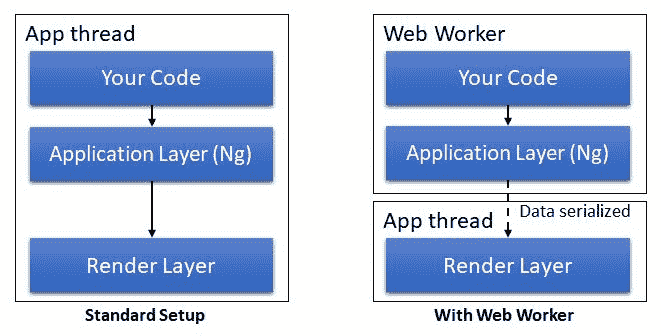
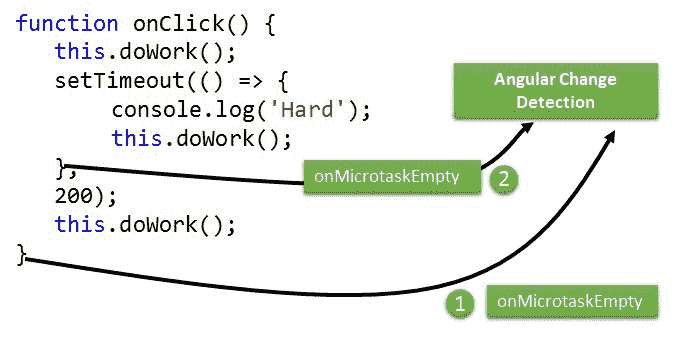
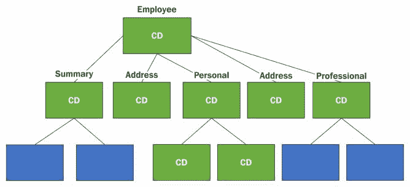
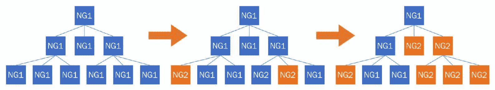
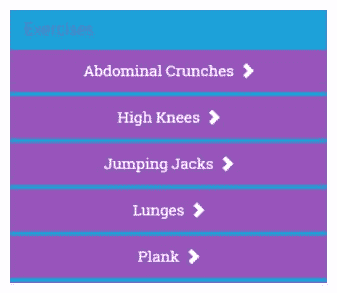
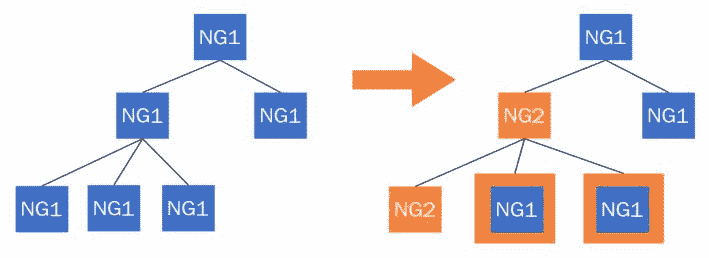

# 一些实际场景

我们有七章，你应该感觉很好。到目前为止，您所学到的是我们在最后几章中构建的应用程序的直接结果。我们认为，您现在应该对该框架、其工作方式以及支持的内容有充分的了解。有了这些知识，一旦我们开始构建一些规模合适的应用程序，就会出现一些常见的问题/模式，例如：

*   我们如何认证用户并控制其访问（授权）？
*   我们如何确保应用程序的性能足够好？
*   我的应用程序需要本地化内容。我该怎么办？
*   我可以使用哪些工具加快应用程序开发？
*   我有一个 AngularJS 应用程序。如何迁移它？

还有更多！

在本章中，我们将尝试解决此类常见场景，并提供一些工作解决方案和/或规定性指导来处理此类用例。

本章将介绍的主题包括：

*   **Angular 种子项目**：您将了解 Angular 中的一些种子项目如何帮助我们开始新的合作。
*   **验证角度应用**：这是一个常见要求。我们将研究如何在 Angular 中支持基于 cookie 和令牌的身份验证。
*   **角度性能**：必须有一个常规的性能部分，因为我们试图详细说明是什么使角度性能更好，以及您可以做些什么来加快应用程序的速度。
*   **将 AngularJS 应用程序迁移到 AngularJS**：AngularJS 和 Angular 是完全不同的野兽。在本章中，您将学习如何逐步将 AngularJS 应用程序迁移到 AngularJS。

让我们从头开始！


# 构建新应用程序

想象一下这里的一个场景：我们正在构建一个新的应用程序，鉴于 Angular 框架的强大功能，我们一致决定使用 Angular。伟大的接下来呢？接下来是建立项目的平凡过程。

虽然这是一项平凡的活动，但它仍然是任何参与的关键部分。建立一个新项目通常包括：

*   创建标准文件夹结构。这有时会受到服务器框架的影响（例如*RoR*、*ASP.Net*、*Node.js*等）。
*   将标准资源添加到特定文件夹。
*   在我们开发基于角度的 web 应用程序的情况下，设置构建包括：
    *   如果使用 TypeScript，则编译/传输内容
    *   配置模块加载器
    *   框架和第三方组件方面的依赖关系管理
    *   设置单元/E2E 测试
*   为不同的环境（如开发、测试和生产环境）配置构建。同样，这受所涉及的服务器技术的影响。
*   代码绑定和缩小。

有很多事情要做。

如果我们可以缩短整个设置过程会怎么样？这确实是可能的,；我们只需要一个**种子项目**或**起始点**。


# 种子项目

Angular CLI 作为一种构建和脚手架工具非常棒！但是，这并不是唯一的选择。有许多*种子项目/启动站点*可以让我们在短时间内启动并运行。有些种子项目将框架与特定的后端集成，有些项目只指定/提供特定的内容。有些是预先配置了特定于供应商的库/框架（例如*LESS*、*SASS*、*Bootstrap*等），而其他的只是提供简单的设置。

值得探索的一些著名种子项目如下：

*   **角式起动器**[http://bit.ly/ng-starter](http://bit.ly/ng-starter) ：这个种子回购协议为任何希望快速启动并运行 Angular 和 TypeScript 的人提供了一个角度启动程序。它使用 Webpack（模块绑定器）来构建我们的文件并帮助制作样板文件。这是一个包含大量集成的完整构建系统。
*   **角形种子**[http://bit.ly/ng-starter-seed](http://bit.ly/ng-starter-seed) ：另一个类似 Angular Starter 的种子项目。该种子项目使用 gulp 实现构建自动化，模块绑定器系统不如 Webpack 先进。

这些项目以及 Angular CLI 在使用 Angular 进行构建时提供了一个良好的开端。

如果应用程序绑定到特定的后端堆栈，我们有两个选择，如下所示：

*   使用其中一个种子项目并手动将其与后端集成。
*   找到一个种子项目/实施，为我们做到这一点。有一个很好的机会，你会发现这样的种子项目。


# 角度性能

Angular 的设计考虑了性能。从框架占用、初始加载时间、内存利用率、更改检测加数据绑定和 DOM 渲染开始，框架的每个部分都已经或正在进行调整，以获得更好的性能。

接下来的几节将致力于理解 performantangular 是如何实现性能提升的，以及它用来实现一些令人印象深刻的性能提升的技巧。


# 字节大小

框架的*字节大小*是性能优化的良好起点。当世界正朝着高速互联网的方向发展时，我们当中有相当一部分人的网络连接速度很慢，他们正在使用手机连接网络。我们可能不会想太多关于这里或那里的几个 KB，但它确实很重要！

虽然 Angular 开箱即用的字节大小比 AngularJS 大，但有一些技术可以大大减小 Angular 束的大小。

首先，*缩小*和*压缩*的标准技术可以大大缩小这一差距。使用 Angular，我们可以使用*模块捆绑机/装载机*进行一些巧妙的操作，以进一步减小 Angular 捆绑机的大小。

**摇树**对一个过程来说可能是一个古怪的名字，但它确实做到了它所说的！当我们使用 TypeScript（或 ES2015）构建包含*模块*和*导出*的应用程序时，一个模块绑定器，如*汇总*（[http://rollupjs.org](http://rollupjs.org) 可以对这些代码进行静态代码分析，确定哪些代码部分从未使用过，并在捆绑释放位之前移除它们。当添加到应用程序的构建过程中时，此类模块绑定器可以分析框架位、任何第三方库和应用程序代码，以在创建绑定之前删除任何死代码。*树抖动会导致巨大的尺寸缩减，因为您不捆绑不使用的框架位。*

[T0]编译器[T1]是可以从框架包中删除的最大框架部件之一。是的，你读对了，是编译器！

For curious readers, the compiler is the single biggest framework piece, contributing roughly 50% in size to the Angular bundle (In Angular *v2.0.0*).

使用树抖动和提前编译（**AoT**）的**方法，我们可以完全摆脱 Angular 编译器（在浏览器中）。**

使用 AoT 编译，视图模板（HTML）在服务器端预先编译。此编译再次作为应用程序构建过程的一部分完成，在该过程中，Angular 编译器（节点包）的服务器版本编译应用程序中的每个视图。

编译完所有模板后，根本不需要将角度编译器位发送到客户端。树抖动现在可以摆脱编译器，创建一个更精简的框架包。Angular CLI 支持 AoT 编译，可用于生产构建。

Read more about AoT in the framework documentation available at [http://bit.ly/ngx-aot](http://bit.ly/ngx-aot).


# 初始加载时间和内存利用率

任何具有成熟 JavaScript 框架的 web 应用程序的初始加载时间通常都很慢。这种影响在移动设备上更为明显，在移动设备上，JavaScript 引擎可能没有桌面客户端强大。为了获得更好的用户体验，必须优化框架的初始加载时间，特别是对于移动设备。

在初始加载时间和重新渲染视图时，**Angular2 比 AngularJS**快五倍。随着 Angular 团队开发框架，这些数字越来越好。

此外，AoT 编译也可以提高应用程序的初始加载时间，因为不需要耗时的活动（视图编译）。

内存利用率也是如此。Angular 在这里的表现也更好，在未来的版本中情况会变得更好。

如果您计划切换到 Angular，这是您应该期待的：一个为未来构建的性能框架。

我们将要讨论的下三个性能改进之所以成为可能，是因为一个单一的架构决策：*创建一个单独的渲染器层*。


# 角度渲染引擎

AngularJS 的最大缺点是框架与浏览器 DOM 绑定。指令、绑定和插值都对 DOM 起作用。

对于 Angular，最大的架构变化是一个单独的渲染层。现在，Angular 应用程序有两层：

*   **应用层**：这是我们的代码所在的层。它使用渲染器层上的抽象构建与之交互。我们在*深入角度指令*中看到的渲染器类是我们用来与渲染层交互的接口。
*   **呈现层**：该层负责将来自应用层的请求转换为呈现组件，并对用户输入和视图更新做出反应。

渲染器的默认渲染器实现是`DomRenderer`，它在浏览器中运行。但也有其他渲染抽象，我们将在下一节中讨论它们。


# 服务器端渲染

服务器端的**预渲染**是另一种提高 Angular 应用程序初始加载时间的技术。这项技术在移动设备上非常有用，因为它大大提高了感知负载时间。

服务器端呈现在客户端呈现开始之前负责初始页面加载（此后处理视图呈现）。

在这种情况下，当用户请求一个视图/页面时，服务器上的一个软件会生成一个完全物化的 HTML 页面，其中包含预绑定到视图的数据，并将其与一个小脚本一起发送到客户端。因此，立即呈现应用程序视图，为交互做好准备。当框架在后台加载时，第一次发送的小脚本将捕获所有用户输入并使其可用于框架，从而允许框架在加载后重播交互。

**Angular Universal**被吹捧为允许在服务器端和客户端渲染和共享视图。

服务器端渲染仅因分离了前面描述的渲染层而成为可能。初始视图由服务器上名为`ServerDomRenderer`的渲染器实现生成。有一个 Node.js 插件（[http://bit.ly/ng-universal-node](http://bit.ly/ng-universal-node) ），可用于*Express*、*Hapi*、*Sail*等多个节点 web 框架。

Look at the Angular design docs for Angular Universal ([http://bit.ly/ng-universal-design](http://bit.ly/ng-universal-design)) and the embedded YouTube videos at the top of the design doc to learn more about server-side rendering.

性能不是服务器端渲染的唯一好处。事实证明，搜索索引器也像预呈现的 HTML 内容一样。服务器端呈现在**搜索引擎优化（SEO）**和深度链接等领域非常有用，这样可以方便地共享内容。


# 将工作转移给 web 工作者

将工作转移给**web 工作者**是一个很好的想法，由于将呈现层与应用层分离，这也是可能的。

*Web workers*提供了在后台线程中运行脚本的机制。这些线程可以执行不涉及浏览器 DOM 的工作。无论是 CPU 密集型任务还是远程 XHR 调用，都可以委托给 web 工作者。

在当今世界，多核 CPU 是标准，但 JavaScript 执行仍然是单线程的。我们需要一种标准/机制来为我们的应用程序利用这些空闲内核。网络工作者完全符合这一要求，因为大多数现代浏览器都支持他们，所以我们都应该编写利用网络工作者的代码。

遗憾的是，这并没有发生。网络工作者仍然不是主流，这有很好的理由。网络工作者对什么是允许的，什么是不允许的施加了大量的限制。这些限制包括：

*   **无法直接访问 DOM**：网络工作者无法直接操作 DOM。事实上，web worker 无法访问多个全局文件，例如*窗口*和*文档*，其他文件在 web worker 线程上不可用。这严重限制了可以使用 web worker 的用例数量。
*   **浏览器支持**：网络工作者仅适用于现代/常青浏览器（IE 10+）。
*   **进程间通信**：Web 工作者不与您的主浏览器进程共享内存，因此只需要通过*消息传递*（序列化数据）与主线程（UI 线程）通信。此外，消息传递机制本质上是异步的，这给通信模型增加了另一层复杂性。

显然，网络工作者很难使用。

Angular 试图通过将 web worker 的使用集成到框架本身来缓解这些限制。它通过在 web worker 线程中运行完整的应用程序（渲染部分除外）来实现这一点。

该框架负责 web worker 内部运行的应用程序代码与主 UI 线程内部运行的呈现程序之间的通信。从开发人员的角度来看，没有明显的差异。

由于渲染器层在角度方向上的分离，这再次成为可能。下图显示了在应用程序主线程上运行的层以及在 web worker 中运行的层：



Go through this talk ([http://bit.ly/yt-ng-web-worker](http://bit.ly/yt-ng-web-worker)) from Jason Teplitz to learn about what web workers have to offer.


# 性能移动体验

Angular 的渲染抽象再次打开了许多集成途径，特别是在移动平台上。与在移动浏览器上运行应用程序不同，可以创建角度渲染器，以利用设备的本机 UI 功能。

该领域的两个著名项目是平台渲染器：

*   **反应物**[http://bit.ly/rnative](http://bit.ly/rnative) ：ReactNative（[的渲染器 http://bit.ly/ng-rnative](http://bit.ly/ng-rnative) ）。它允许使用 ReactNative 的渲染功能编写 Angular 应用程序。
*   **NativeScript**（[https://www.nativescript.org/](https://www.nativescript.org/) ：Angular 和 NativeScript 团队合作为 NativeScript（[创建了一个渲染器 http://bit.ly/ng-native-script](http://bit.ly/ng-native-script) ）。

*ReactNative*和*NativeScript*等应用程序平台在为本地移动平台（iOS 和 Android）提供基于 JavaScript 的 API 方面已经做得非常出色，允许我们使用熟悉语言的单一代码库。角度渲染器更进一步。通过角度集成，可以在浏览器和移动设备之间共享大量代码。只在视图模板和视图相关服务（如对话框、弹出窗口等）方面有所不同。

查看相应渲染器的文档，了解它们的工作方式及其支持的功能。

接下来，我们在*变更检测*方面对框架进行了改进。


# 更改检测改进

AngularJS 上 Angular 的主要性能改进之一是*变化检测*在 AngularJS 中的工作方式。开箱即用的角度变化检测速度非常快，可以进一步调整以获得更好的结果。

接下来的几节将深入讨论角度变化检测。在大规模建造任何东西时，这是一个需要理解的重要话题。它还可以帮助我们调试一些场景，在这些场景中，更改检测似乎没有像广告中所宣传的那样工作。

让我们从了解什么是更改检测以及它为什么重要开始讨论。


# 变化检测

Angular 的*数据绑定引擎*在将视图与模型数据（组件数据）绑定方面做得很好。这些是实时绑定，Angular 在其中使视图与模型更改保持同步。每当模型更改时，绑定引擎都会重新渲染依赖于模型的部分视图。要管理此视图模型同步，Angular 需要知道模型何时更改以及更改的确切内容。这就是**变化检测**的意义所在。在应用程序执行期间，Angular 经常执行我们称之为**的更改检测运行**来确定更改的内容。

If you are from AngularJS, a *change detection run* is roughly equivalent to **digest cycles**, except that in Angular there are **no cycles**.

虽然保持模型和视图同步的问题听起来很简单，但这是一个很难解决的问题。与组件树不同，多个模型之间的互连可能很复杂。一个组件模型中的更改可以触发多个组件模型中的更改。此外，这些互连可能具有周期。单个模型特性可以绑定到多个视图。需要使用健壮的检测基础设施来管理所有这些场景。

在接下来的几节中，我们将探讨角度变化检测基础设施如何工作，何时触发变化检测，以及我们如何影响角度变化中的变化检测行为。


# 更改检测设置

这一切都始于为视图上渲染的每个组件设置角度变化检测器。由于每个 Angular 应用程序都是组件的层次结构，因此这些变化检测器也设置在同一层次结构中。下图突出显示了*训练生成器*应用程序在某个时间点的**变更检测器层次结构**：


附在部件上的*变化检测器*负责检测部件的变化。它通过解析组件模板 HTML 上的绑定并设置必要的更改检测来实现这一点。

请记住，检测器仅在模板中使用的模型属性上设置监视，而不是在所有组件属性上设置监视。

这里值得强调的另一点是*变更检测是以一种方式设置的，从模型到视图*。Angular 没有双向数据绑定的概念，因此上图是一个没有循环的有向树。这也使得变更检测更加可预测。不允许交叉更新模型和视图。


# 变更检测何时开始？

Angular 是否经常检查模型数据中的更改？考虑到我们绑定视图的组件属性不从任何特殊类继承，Angular 无法知道哪个属性发生了更改。Angular 唯一的解决方法是不断查询每个数据绑定属性，以了解其当前值，并将其与旧值进行比较以了解更改。至少可以说效率很低！

Angular 做得更好，因为在应用程序执行过程中，更改检测只在特定时间执行。仔细考虑任何 web 应用程序；什么导致视图更新？

由于以下原因，视图可能会更新：

*   **用户输入/浏览器事件**：我们点击按钮，输入一些文本，或滚动内容。每个操作都可以更新视图（和基础模型）。
*   **远程 XHR 请求**：这是视图更新的另一个常见原因。例如，从远程服务器获取数据以在网格上显示，以及获取用户数据以呈现视图。
*   **setTimeout 和 setInterval 定时器**：事实证明，我们可以使用`setTimeout`和`setInterval`以特定的间隔异步执行一些代码。这样的代码也可以更新模型。例如，`setInterval`计时器可以定期检查股票报价，并在 UI 上更新股票价格。

出于显而易见的原因，角度变化检测也只有在出现上述任何一种情况时才起作用。

这里有趣的部分不是 Angular 的变化检测何时开始，而是 Angular 如何能够拦截所有的*浏览器事件*、*XHR 请求*以及`setTimeout`和`setInterval`功能。

这个技巧是由一个名为`zone.js`的库来完成的。如文件所述：

"A Zone is an execution context that persists across async tasks."

这个库的一个基本功能是，它可以钩住一段代码，并在代码执行开始和结束时触发回调。被监视的代码可以是一系列本质上既同步又异步的调用。考虑这个例子，它突出了用法：

```ts
let zone = new NgZone({ enableLongStackTrace: false });     
let doWork = function () { 
  console.log('Working'); 
}; 

zone.onMicrotaskEmpty.subscribe((data:any) => { 
  console.log("Done!"); 
}); 

zone.run(() => { 
  doWork(); 
    setTimeout(() => { 
        console.log('Hard'); 
        doWork(); 
    }, 200); 
    doWork(); 
}); 
```

我们在`zone.run`调用的调用中封装了一段代码。此代码同步调用`doWork`函数两次，并与`setTimeout`调用交错，后者在 200 毫秒后调用同一函数。

通过将此序列包装在`zone.run`中，我们可以知道调用执行何时完成。在区域术语中，这些是**转弯**。`zone.run`之前的代码使用`zone.onMicrotaskEmpty`函数设置一个订户，在执行完成时调用该订户：

如果我们执行前面的代码，日志如下所示：

```ts
Working  // sync call 
Working  // sync call 
Done!   // main execution complete  
Hard     // timeout callback 
Working  // async call 
Done!   // async execution complete
```

`onMicrotaskEmpty`订阅执行两次，一次在顺序执行完成后执行（在`run`回调中定义），一次在异步`setTimeout`执行完成后执行。

角度变化检测使用相同的技术在区域内执行代码。此代码可以是*事件处理程序*，在完成前内部进行更多的同步异步调用，也可以是`setTimeout`/`setInterval`操作，可能再次需要 UI 更新。

角度变化检测框架订阅执行区域的`onMicrotaskEmpty`可观测值，并在转弯完成时启动变化检测。下图突出显示了在单击按钮时运行类似于刚才描述的代码时发生的情况：



During the execution of the code block, if the zone library determines that the call is asynchronous in nature, it spawns a new micro task that has its own life cycle. It is the completion of these micro tasks that also triggers `onMicrotaskEmpty`.

如果您想知道更改检测触发器在 Angular 中的外观，下面是 Angular 源代码的摘录（进一步简化）：

```ts
class ApplicationRef { 

  constructor(private zone: NgZone) { 
    this._zone.onMicrotaskEmpty.subscribe(
        {next: () => { this._zone.run(() => { this.tick(); }); }}); 
  } 

  tick() { 
    this._views.forEach((view) => view.detectChanges());
  } 
} 
```

`ApplicationRef`类跟踪整个应用程序中连接的所有更改检测器，并在应用程序级区域对象触发`onMicrotaskEmpty`事件时触发更改检测循环。我们将很快讨论在这个变化检测过程中会发生什么。

*Zone.js*能够跨任何异步调用跟踪执行上下文，因为它会覆盖默认的浏览器 API。覆盖，也称为**猴子补丁**，覆盖*事件订阅*、*XHR 请求*和`setTimeout`/`setInterval`API。在前面突出显示的示例中，我们调用的`setTimeout`是原始浏览器 API 的猴子补丁版本。

现在，我们知道了变化检测器是如何设置的，当这个活动开始时，我们可以看看它是如何工作的。


# 变更检测是如何工作的？

一旦设置了变更检测器，并对浏览器 API 进行了猴子补丁以触发变更检测，真正的变更检测就开始了。这是一个相当简单的过程。

一旦触发任何异步事件回调（事件处理程序的执行也是一个异步活动），Angular 将首先执行附加到回调的应用程序代码。此代码执行可能会导致一些模型更新。执行回调后，Angular 需要通过触发*更改检测运行*来响应更改。

在更改检测运行中，从组件树的顶部开始，每个更改检测器都会评估其各自组件的模板绑定，以查看绑定表达式的值是否已更改。

关于此次执行，我们需要强调以下几点：

*   Angular 执行严格的相等性检查（使用[T0]）以检测更改。由于这不是一个深入的比较，对于引用对象的绑定，Angular 只会在对象引用更改时更新视图。
*   更改检测流是单向的（从根开始），以自上而下的方式从父级到子级。父组件上的探测器在子探测器之前运行。

默认情况下，无论更改在树中的何处触发，更改检测算法都会导航整个树。这意味着在每次更改检测运行时都会对所有绑定进行评估：


A binding evaluation on every run may seem inefficient, but it is not. Angular employs some advance optimizations to make this check super fast. Still, if we want to tweak this behavior, we do have some switches that can reduce the number of checks performed. We will touch upon this topic soon.

*   更改检测器仅跟踪作为模板绑定一部分的属性，而不是完整的对象/组件属性。
*   要检测绑定值中的更改，更改检测器需要跟踪上一次更改检测运行期间计算的表达式的上一个值。显然，我们使用的每个模板绑定都需要一定数量的簿记。

显而易见的下一个问题是，当检测到变更（由变更检测器）时会发生什么？

由于设置更改检测和识别更改的所有艰苦工作已经完成，因此这一步只涉及更新组件状态和同步组件 DOM。

这里还有一些值得强调的观察结果：

*   首先，Angular 将模型更新步骤与 DOM 更新分离。考虑此代码片段，当某人单击按钮时，该代码片段被调用：

```ts
        doWork() { 
           this.firstName="David"; 
           this.lastName="Ruiz"; 
        } 
```

假设`firstName`和`lastName`都绑定到组件视图，对`firstName`的更改不会立即更新 DOM 绑定。相反，Angular 会在触发更改检测运行和 DOM 更新之前等待`doWork`函数完成。

*   其次，变更检测运行不会（也不应该）更新模型状态。这避免了任何循环和级联更新。更改检测运行只负责评估绑定和更新视图。这也意味着我们不应该在变更检测期间更新模型状态。如果我们在变化检测期间更新模型，Angular 会抛出一个错误。

让我们看一个这种行为的例子：

1.  从 7 分钟训练应用程序中打开`start.component.html`并将最后一个`div`更新为：

```ts
            <div class="col-sm-3"> 
            Change detection done {{changeDetectionDone()}}
            </div> 
```

2.  并且，在组件实现（`start.component.ts`中添加一个`changeDetectionDone`函数，如下所示：

```ts
            times: number = 0; 
            changeDetectionDone(): number { 
                this.times++; 
                return this.times; 
            } 
```

3.  运行应用程序，加载起始页，然后查看浏览器控制台。Angular 记录了许多错误，如下所示：

```ts
        EXCEPTION: Expression has changed after it was checked.
        Previous value: 'Change 
        detection done 1'. Current value: 'Change detection done 2' ... 
```

调用`changeDetectionDone`函数时（在插值内），我们正在更改组件的状态，Angular 会抛出一个错误，因为它不希望组件状态更新。

This change detection behavior is enabled only when **production mode** in Angular is disabled. *Production mode* can be enabled by calling the `enableProdMode()` function before bootstrapping the application (in `bootstrap.ts`). When enabled, Angular behaves a bit differently. It turns off assertions and other checks within the framework. Production mode also affects the change detection behavior. In non-production mode, Angular traverses the component tree twice to detect changes. If on the second pass any binding expression has changed, it throws an error. In contrast, when in production mode, change detection tree traversal is done only once. The change detection error that we saw on the console will not show up if we enable production mode. This can lead to an inconsistency between the model and view state. Something we should be aware of! The bottom line is that we cannot alter the state of a component when change detection is in progress. A direct corollary: if we are using a function inside the binding expression, function executions should be stateless, without any side effects.

*   最后，在变更检测运行期间，从根节点到叶节点的变更检测遍历只执行一次。

A pleasant surprise for folks with an AngularJS background! *The digest cycle count in Angular is 1*. Angular developers will never face "the digest iterations exceeded exception!" A far more performant change detection system!


# 变化检测性能

让我们谈谈变更检测性能。如果您认为每次检查完整的组件树进行更改都是低效的，那么您会惊讶于它的速度有多快。由于对表达式的计算和比较方式进行了一些优化，Angular 可以在几毫秒内执行数千次检查。

在后台，对于视图绑定中涉及的每个表达式，Angular 都会生成一个专门针对特定绑定的更改检测函数。虽然一开始看起来似乎有悖直觉，但 Angular 并没有一个确定表达式是否已更改的通用函数。相反，这就像为绑定到的每个属性编写自己的更改检测函数。这允许 JavaScript 虚拟机优化代码，从而提高性能。

Want to learn more about it? Check out this video by Victor Savkin: [https://youtu.be/jvKGQSFQf10](https://youtu.be/jvKGQSFQf10).

尽管进行了所有这些优化，但仍可能存在遍历完整组件树的性能不够的情况。当我们必须在视图上呈现一个大数据集，保持绑定完整时，这一点尤其正确。好消息是可以调整角度变化检测机制。

Angular 需要执行完整的树漫游的原因是，一个位置的模型更改可能会触发其他位置的模型更改。换言之，模型更改可能会产生级联效应，其中互连的模型对象也会更新。由于 Angular 无法知道到底发生了什么变化，因此它会检查完整的组件树和关联的模型。

如果我们可以帮助 Angular 确定应用程序状态的哪些部分被更新，Angular 就可以非常聪明地知道它通过组件树的哪些部分来检测更改。我们通过将应用程序数据存储在一些特殊的数据结构中来实现这一点，这些数据结构有助于 Angular 确定需要检查哪些组件以进行更改。

有三种方法可以使角度变化检测更智能。


# 使用不变的数据结构

**不可变对象/集合**是指一旦创建就无法更改的对象。任何属性更改都会导致创建新对象。这就是`immutable.js`，一个流行的不可变数据结构库所说的：

Immutable data cannot be changed once created, leading to much simpler application development, no defensive copying, and enabling advanced memoization and change detection techniques with simple logic.

让我们通过一个例子来了解不可变数据结构在角度上下文中的帮助。

假设我们正在构建一组组件来收集**人力资源**（**人力资源**软件的员工信息。employee 组件视图如下所示：

```ts
<Employee> 
    <summary [model]="employee"></employee> 
    <personal [model]="employee.personal"></personal> 
    <professional [model]="employee.professional"></professional> 
    <address [model]="employee.home"></address> 
    <address [model]="employee.work"></address> 
</Employee> 
```

它有用于获取个人、专业和地址信息的部分。`summary`组件提供所输入员工数据的只读视图。每个组件都有一个名为`model`的属性，突出显示这些组件操作的员工数据的哪一部分。每个组件的摘要、专业、个人和内部地址可能都有其他子组件。以下是组件树的外观：


当我们更新员工的个人信息时会发生什么？对于标准对象（可变），Angular 不能对数据的形状以及发生了什么变化做出任何假设；因此，它完成了完整的树行走。

不变性在这里有什么帮助？使用不可变数据结构时，对对象属性的任何更改都会导致创建新对象。例如，如果我们使用流行库创建一个不可变对象，[T0]：

```ts
personalInfo = Immutable.Map({ name: 'David', 'age': '40' }); 
```

对`personalInfo`的`name`或`age`属性的更改将创建一个新对象：

```ts
newPersonalInfo = personalInfo.set('name', 'Dan'); 
```

如果每个员工模型属性（`personal`、`professional`、`home`和`work`都是不可变的，那么这种不可变性就很有用了。

以绑定到个人信息数据的`PersonalInfo`组件定义为例：

```ts
 @Component({ 
  selector:'personal', 
  template: ` 
    <h2>{{model.name}}</h2> 
    <span>{{model.age}}</span>`, 
 changeDetection: ChangeDetectionStrategy.OnPush 
}) 
class PersonalInfo { 
  @Input() model; 
} 
```

由于`PersonalInfo`唯一依赖的是`model`属性，并且`model`属性绑定到一个不可变对象，因此 Angular 只需要在`model`引用更改时检查更改。否则，可以跳过完整的`PersonalInfo`组件子树。

通过将`PersonalInfo`组件属性`changeDetection`设置为`ChangeDetectionStrategy.OnPush`，我们指示 Angular 仅在组件的输入发生变化时触发变化检测。

如果我们将每个员工组件子级的更改检测策略更改为`OnPush`，并更新员工的个人信息，则仅检查`PersonalInfo`组件子树的更改：



对于大型组件树，这样的优化将多次提高应用程序/视图的性能。

When set to `OnPush`, Angular triggers change detection only when the component's input property changes or there is an event raised inside the component or its children.

使用不变的数据结构开发应用程序与标准开发范式不同，在标准开发范式中，应用程序状态是完全可变的。我们在本节中强调的是 Angular 如何利用不可变的数据结构来优化更改检测过程。

*观测值*是另一种数据结构，可以帮助我们优化角度变化检测。


# 使用可见光

**可观测项**是当内部状态发生变化时触发事件的数据结构。角度*事件基础设施*广泛使用*可观察物*将组件的内部状态传达给外部世界。

虽然我们使用了可观察的输出属性（`EventEmitter`类）来引发事件，*输入**属性*也可以获取可观察的。这种可观察的输入有助于优化角度变化检测。

使用可观察对象时，变化检测开关仍保持`ChangeDetectionStrategy.OnPush`。但这一次，只有当组件输入触发事件（因为它们是可观察的）时，才会执行脏检查。当输入触发事件时，完整的组件树路径（从受影响的组件到根）将标记为验证。

执行视图更新时，Angular 将仅同步受影响的路径，而忽略树的其余部分。


# 手动变化检测

我们实际上可以完全禁用组件上的更改检测，并在需要时触发手动更改检测。要禁用变更检测，我们只需将组件特定的变更检测器（`ChangeDetectorRef`类实例）注入组件并调用`detach`函数：

```ts
constructor(private ref: ChangeDetectorRef) { 
    ref.detach(); 
} 
```

现在，我们有责任通知 Angular 何时应该检查组件的更改。

We can reattach the component to the change detection tree by using the `reattach` function on `ChangeDetectorRef.`

我们很少需要禁用标准变更检测器设置，除非在某些情况下，标准变更检测变得昂贵。

以一个公共聊天室应用程序为例，它正在接收来自数千名连接到它的人的消息。如果我们不断地提取消息并刷新 DOM，应用程序可能会变得无响应。在这种情况下，我们可以在聊天应用组件树的某些部分禁用更改检测，并手动触发更改检测，以在特定的时间间隔更新 UI。

虽然我们已经看到了三种调整变更检测行为的方法，但好的是这些方法并不是唯一的。组件树的一部分可以使用不可变的数据结构，一部分可以使用可观察数据，一部分可以使用手动更改检测，其余部分仍然可以使用默认的更改检测。我很乐意效劳！

关于变化检测，现在已经足够了。我们可能永远都不需要它，除非我们正在用一个闲聊的 UI 构建一些大视图。这样的场景要求我们从变更检测系统中挤出每一点性能，并且系统已经做好了准备。

接下来，我们将看一看大多数应用程序都有的另一个常见要求：对用户进行身份验证。


# 处理身份验证和授权

大多数（如果不是全部的话）应用程序都需要对其用户进行身份验证/授权。我们可能会说，身份验证和授权更像是服务器的问题，而不是客户端的问题，这是正确的。不过，客户端需要适应并集成服务器强加的身份验证和授权要求。

在典型的应用程序执行工作流中，应用程序首先加载一些局部视图，然后调用从服务器提取数据，最后将数据绑定到其视图。显然，*视图*和*远程数据 API*是需要保护的两项资产。

为了保护这些资源，我们需要了解服务器上典型应用程序的安全性。保护任何 web 应用程序的安全主要有两种方法：*基于 cookie 的身份验证*和*基于令牌的身份验证*。它们中的每一个都需要在客户端进行不同的处理。接下来的两部分描述了我们如何与这两种方法进行集成。


# 基于 Cookie 的身份验证

如果服务器堆栈支持此身份验证机制，则此身份验证机制最容易实现。它是非侵入性的，可能需要对角度应用程序进行最小程度的更改。**基于 Cookie 的身份验证**包括设置浏览器 Cookie 以跟踪用户身份验证会话。以下序列图解释了典型的基于 cookie 的身份验证工作流：


以下是典型的身份验证工作流的工作原理：

*   尝试从浏览器访问安全资源时，如果用户未经身份验证，服务器将发送 HTTP 401 未经授权状态代码。如果用户请求没有附加 cookie，或者 cookie 已过期/无效，则用户请求是未经授权的请求。
*   这个未经授权的响应被服务器截获，或者有时被客户端框架截获（在我们的例子中是 Angular），它通常会导致 302 重定向（如果被服务器截获）。重定向位置是登录页面的 URL（登录页面允许匿名访问）。
*   然后，用户在登录页面上输入用户名和密码，并向登录端点发送帖子。
*   服务器验证凭据，设置浏览器 cookie，并将用户重定向到最初请求的资源。
*   此后，身份验证 cookie 是每个请求（由浏览器自动添加）的一部分，服务器使用此 cookie 确认用户的身份以及用户是否经过身份验证。

正如我们所看到的，使用这种方法，不涉及角度基础设施，或者只涉及最小的角度基础设施。甚至登录页面也可以是标准的 HTML 页面，它只向登录端点发送数据以进行身份验证。如果用户登录 Angular 应用程序，则意味着该用户已通过身份验证。

The cookie-based authentication flow may vary depending on the server framework, but the general pattern of setting a cookie and attaching a cookie with every subsequent request remains the same.

在基于 cookie 的应用程序身份验证中，如果应用程序想要获取用户上下文，则会公开一个服务器端点（例如【T0）】，该端点返回登录用户的特定数据。然后，客户端应用程序可以实现一个服务，例如加载和缓存用户配置文件数据的`UserService`。

这里描述的场景假设 API 服务器（返回数据的服务器）和承载应用程序的站点位于单个域中。情况可能并非总是如此。即使对于*私人教练*来说，数据也驻留在*蒙古 AB*服务器上，而应用程序驻留在不同的服务器上（即使是本地的）。我们已经知道，这是一种跨域访问，它也有自己的一系列挑战。

在这种设置中，即使 API 服务器能够对请求进行身份验证并将 cookie 发送回客户端，客户端应用程序也不会在后续请求中发送身份验证 cookie。

为了解决这个问题，我们需要在每个 XHR 请求中将一个变量`withCredentials`设置为`true`。这可以通过覆盖`BaseRequestOptions`（`withCredentials`属性）在全局级别启用。框架使用`BaseRequestOptions`类为每个 HTTP 请求设置默认值。

这也可以通过在每个 HTTP 请求方法中传递`withCredentials:true`标志作为最后一个参数，在每个请求级别启用：

```ts
this.httpService.get(url,{withCredentials:true}); 
```

每个 HTTP 函数的最后一个参数，包括`get`、`post`和`put`是一个选项对象。这允许我们覆盖所做请求的选项。

启用此标志后，客户端浏览器将开始为跨域请求附加身份验证 cookie。

服务器也需要启用**跨源资源共享**（**CORS**），并需要以特定方式响应请求才能成功。应将**访问控制允许凭证**头设置为 true，并将**访问控制允许来源**头设置为发出请求的主机站点。

Check out the MDN documentation ([http://bit.ly/http-cors](http://bit.ly/http-cors)) to learn about this scenario in detail.

基于 Cookie 的身份验证在客户端的工作肯定较少，但有时您必须恢复到基于令牌的访问。这可能是因为：

*   Cookie 和跨域请求在浏览器之间无法正常运行。具体来说，IE8 和 IE9 不支持它们。
*   服务器可能不支持生成 cookie，或者服务器仅公开基于令牌的身份验证。
*   基于令牌的解决方案易于与本机移动应用程序和桌面客户端集成。
*   令牌不易受到跨站点请求伪造（CSRF）攻击。

To know more about CSRF, look at the CRSF Prevention cheat sheet at [http://bit.ly/csrf-cs](http://bit.ly/csrf-cs).

下一节将讨论支持基于令牌的身份验证。


# 基于令牌的身份验证

**基于令牌的访问**就是在每个请求中发送令牌（通常在 HTTP 头中），而不是发送 cookie。简化的基于令牌的工作流如下所示：


许多公共 API（如*Facebook*和*Twitter*使用基于令牌的身份验证。令牌的格式、位置以及生成方式取决于使用的协议和服务器实现。使用基于令牌的身份验证的流行服务实现用于令牌生成和交换的**OAuth 2.0**协议。

在典型的基于令牌的身份验证设置中，视图是公开的，但 API 是安全的。如果应用程序试图通过 API 调用提取数据，而没有将适当的令牌附加到传出请求，服务器将返回一个*HTTP 401 Unauthorized*状态代码。

在 Angular 中，启用令牌身份验证是一项很好的工作。它涉及设置登录页面/组件、保护条件、身份验证服务和跨应用程序共享的身份验证上下文。如果您开始这一旅程，请确保寻找角度库/模块，使集成更容易。`ngx-auth`图书馆（[http://bit.ly/ngx-auth](http://bit.ly/ngx-auth) 可以是一个很好的起点。

这都是关于身份验证的，但是关于授权呢？一旦建立了用户上下文，我们仍然需要确保用户只能访问他/她被允许访问的部分。*授权*仍然缺失。


# 处理授权

与身份验证一样，授权支持也需要在服务器端和客户端实现，在服务器端比客户端更需要实现。记住，任何人都可以侵入 JavaScript 代码并绕过完整的身份验证/授权设置。因此，无论客户端是否进行了必要的检查，都要始终加强服务器基础结构。

这仍然不意味着我们不对客户机进行任何授权检查。对于标准用户来说，这是防止不必要访问的第一道防线。

在处理任何应用程序的授权要求时，有三个基本要素是设置的一部分：

*   需要保护/授权的资源
*   属于这些角色的角色和用户的列表
*   资源和角色之间的映射，定义谁可以访问什么

从应用程序的角度来看，资源是页面，有时是需要限制为特定角色的页面部分。如果用户处于特定角色，根据角色资源映射，他们可以访问某些页面；否则，他们将被拒绝访问。

虽然 Angular 应用程序中的授权可以通过多种方式实现，但我们将概述一种通用实现，该实现可以进一步定制，以满足您未来的需求。


# 添加授权支持

要启用授权，我们需要做的第一件事是在整个应用程序中公开登录的用户数据，包括他/她的角色。


# 共享用户身份验证上下文

可以使用 Angular 服务共享用户上下文，然后可以将该服务注入到需要授权上下文的组件中。查看此服务接口：

```ts
class SessionContext { 
  currentUser():User { ... }; 
  isUserInRole(roles:Array<string>):boolean { ...}; 
  isAuthenticated:boolean; 
} 
```

`SessionContext`服务跟踪用户登录会话，并提供以下详细信息：

*   登录用户（`currentUser`）
*   用户是否通过身份验证（`isAuthenticated`
*   `isUserInRole`函数，根据用户是否属于传递到`roles`参数中的任何角色返回`true`或`false`

有了这样的服务，我们可以为路由添加授权，从而将对某些路由的访问限制为仅对特定角色的访问。


# 限制路线

与身份验证一样，`canActivate`防护检查也可用于授权。使用`CanActivate`接口实现一个类，并将`SessionContext`服务注入构造函数；然后，使用`SessionContext`服务检查用户是否属于`canActivate`功能中的特定角色。请查看以下代码段：

```ts
export class AuthGuard implements CanActivate { 
  constructor(private session:SessionContext) { } 
  canActivate() { 
    return this.session.isAuthenticated &amp;&amp;  
      session.isUserInRole(['Contributor', 'Admin']); 
  } 
} 
```

现在只有角色为*参与者*和*管理员*的用户才能访问具有此防护条件的路由。

但是，当页面具有基于用户角色呈现的视图元素时，会发生什么情况？


# 基于角色有条件地呈现内容

有条件地呈现内容很容易实现。我们只需要根据用户角色显示/隐藏 HTML 元素。我们可以构建一个*结构指令*，比如`ng-if`，可以在呈现内容之前验证用户是否属于某个角色。该指令的用法如下所示：

```ts
<div id='header'> 
    <div> Welcome, {{userName}}</div> 
    <div><a href='#/setting/my'>Settings</a></div> 
    <div *a2beRolesAllowed='["admin"])'> 
        <a href='#/setting/site'>Site Settings</a> 
    </div> 
</div> 
```

前面的代码在呈现站点设置超链接之前检查用户是否处于管理员角色。

指令实现模仿了`ng-if`的工作方式，只是我们的显示/隐藏逻辑依赖于`SessionContext`服务。以下是`a2beRolesAllowed`指令的示例实现：

```ts
@Directive({ selector: '[a2beRolesAllowed]' }) 
export class RolesAllowedDirective { 
  private _prevCondition: boolean = null; 
  constructor(private _viewContainer: ViewContainerRef, 
    private _templateRef: TemplateRef, private SessionContext _session) { } 

  @Input() set a2beRolesAllowed(roles: Array<string>) { 
    if (this._session.isUserInRole(roles)) { 
      this._viewContainer 
        .createEmbeddedView(this._templateRef); 
    } 
    else { 
      this._viewContainer.clear(); 
    } 
  } 
} 
```

这是一个简单的实现，它使用`SessionContext`和作为输入传递的角色（`a2beRolesAllowed`来显示/隐藏片段。

这就结束了身份验证和授权的实现。参考实现演练应该帮助我们在应用程序中构建身份验证和授权。有了这一基本理解，可以调整任何设置以处理其他自定义身份验证/授权场景。

现在是向房间里的大象致辞的时候了：从*AngularJS*迁移到*AngularJS*。如果你在 Angular 上重新开始，你可以跳过下一节。

From the Angular's migration guide *"Angular is the name for the Angular of today and tomorrow. AngularJS is the name for all v1.x versions of Angular.*"


# 迁移 AngularJS 应用程序

如果您在 AngularJS 上做了大量工作，AngularJS 会提出一些相关问题：

*   我是否应该将旧 AngularJS 应用程序迁移到最新的 Angular 版本？
*   迁移应该在什么时候发生？
*   迁移是一次性的还是可以以增量方式完成？
*   所涉及的工作是什么？
*   我今天能做些有助于未来迁移的事情吗？
*   我今天要启动一个新的 AngularJS 应用程序。我应该怎么做才能使迁移在将来无缝进行？

每一个这样的问题都需要解决，以确保过渡尽可能顺利。没有人喜欢游戏中的惊喜！在接下来的部分中，我们将尝试回答一些这样的问题。作为学习的一部分，我们还将引导您完成将 AngularJS 版本的*Trainer*应用程序（为本书的第一个版本开发）迁移到 AngularJS 的过程。这将帮助每个人在何时和如何迁移到角度上做出明智的决定。

“我是否应该迁移”是我们首先要解决的问题。


# 我应该迁移吗？

AngularJS 在这里并不意味着 AngularJS 走了。AngularJS 仍在开发中，尽管速度与 AngularJS 不同。谷歌仍然致力于在相当长的一段时间内支持 AngularJS。AngularJS 团队目前正在开发 1.7 版，计划在 2018 年 6 月之前发布。之后，1.7 将进入**长期支持**（**LTS**）期，重点只放在 bug 修复上。我们可以从他们的博客文章[了解更多信息 http://bit.ly/ng1-lte-support](http://bit.ly/ng1-lte-support) 。

显然，AngularJS 将继续得到支持，因此不应成为迁移的主要关注点。向 Angular 的迁移可以根据 Angular 相对于其前身提供的功能来决定。


# 角度传感器的优点

Angular 是为未来而设计的，它克服了其前身的许多缺点。在本节中，我们将强调是什么使 AngularJS 比 AngularJS 成为更好的框架。

在决定转向角度时应注意的事项：

*   **更好的行为封装**：诚然，当我们开始学习 AngularJS 时，AngularJS*范围*似乎是上帝派来的，但我们现在已经意识到管理范围的层次性是多么困难。Angular 中基于组件的开发在应用程序状态方面提供了更好的封装。组件管理自己的状态、接受输入并引发事件；明确划分责任，易于推理！
*   **应用程序代码**中的框架较少：您不需要*范围等特殊对象。*DI 使用注释（打字）。你不会摆好手表的。总而言之，在读取组件代码时，您不会在其中找到框架级构造。
*   **需要探索的更小的框架 API**：AngularJS 有许多必须注意的指令。使用角度模板语法，与浏览器事件相关的指令将消失。这减少了需要注意的指令的数量。
*   **性能**：角度比上一代更快。本书的完整部分致力于理解 Angular 是如何成为高性能框架的。
*   **移动友好**：Angular 试图利用服务器端渲染和 web workers 等技术优化用户的移动体验。移动设备上的角度应用程序比其前身的性能更好。
*   **跨平台**：在大多数设备和跨平台上运行的角度目标。您可以使用 Angular 为 web 和移动应用程序构建应用程序。正如我们前面所了解的，渲染层的分离在可以利用角度的方面打开了大量的可能性。

在真正意义上，Angular 取代了它的前身，在一个完美的世界中，每个人都应该致力于更好的框架/技术。但是迁移从来都不是一件容易的事，特别是在这种情况下，这两个框架有很大不同。

我们的建议是，即使您现在不打算迁移到 AngularJS，也要以允许将来轻松迁移到 AngularJS 的方式构建您的 AngularJS 应用程序。

下一节将讨论 AngularJS 今天要遵循的原则和实践，以便在将来轻松迁移。


# 现在开发 AngularJS 应用程序以方便迁移

新的 AngularJS 是一种范式转换，我们在 AngularJS 中开发组件的方式与 AngularJS 完全不同。为了便于迁移，Angular 也应该采用基于组件的开发。如果我们在构建 AngularJS 应用程序时遵循一些准则/原则，这是可以实现的。接下来的几节将详细介绍这些指南。

The advice listed here is highly recommended even if you do not plan to migrate to Angular. These recommendation bits will make AngularJS code more modular, organized, and testable.


# 每个文件一个组件

这可以是任何东西：AngularJS*控制器*、*指令*、*过滤器*或*服务*。每个文件一个组件允许更好地组织代码和轻松迁移，使我们能够清楚地确定已经取得了多少进展。


# 避免内联匿名函数

使用命名函数来声明控制器、指令、筛选器和服务。这样的声明：

```ts
angular.module('7minWorkout') 
  .controller('WorkoutController',[...]) 

angular.module('app') 
.directive('remoteValidator', [...]) 

angular.module('7minWorkout') 
.filter('secondsToTime', function () { ... } 

angular.module('7minWorkout') 
.factory('workoutHistoryTracker', [...]) 
```

应转换为：

```ts
function WorkoutController($scope, ...) { ... } 
WorkoutController.$inject = ['$scope', ...]; 

function remoteValidator($parse) {...} 
remoteValidator.$inject=[$parse]; 

function secondsToTime() {...} 

function workoutHistoryTracker($rootScope, ...) { ...} 
workoutHistoryTracker.$inject = ['$rootScope',...]; 
```

使用命名函数的优点是易于调试和迁移到 TypeScript。使用命名函数还需要使用`$inject`函数属性注册依赖项。

`$inject`-based dependency declaration safeguards against minification and adds to the readability of the functions.

为了避免使用这种方法公开全局名称函数，建议将函数包装在一个**立即调用的函数表达式**（**IIFE**中）：

```ts
(function() { 
    function WorkoutController($scope, ...) { ... } 
    WorkoutController.$inject = ['$scope', ...]; 

    angular 
        .module('7minWorkout') 
        .controller('WorkoutController', WorkoutController); 

})(); 
```


# 避免$scope！

是的，你读对了；避免使用`$scope`/`$rootScope`对象或直接使用作用域！

AngularJS 作用域的最大问题是其层次性。从子作用域访问父作用域给了我们极大的灵活性，但这是有代价的。这会在不知不觉中产生不必要的依赖关系，使应用程序很难调试，当然也很难迁移。相反，在 Angular 中，视图绑定到其组件实现，不能隐式访问其边界之外的数据。因此，如果您计划迁移到 Angular，*不惜一切代价避免作用域*。

有很多技术可以用来移除`$scope`对象依赖关系。接下来的几小节将详细介绍一些可以帮助我们避免 AngularJS 范围的技术。


# 到处使用控制器作为（控制器别名）语法

AngularJS 1.3+将*控制器作为*控制器*、*指令*和*路由*的*语法。*控制器作为*语法允许 AngularJS 数据绑定表达式针对控制器的实例属性而不是当前*作用域*的对象属性。有了控制器作为范例，我们就不再需要直接和范围交互，因此未来的迁移变得很容易。

While controller aliasing gets rid of scope access, scopes are still there in AngularJS. The complete AngularJS data binding infrastructure depends upon scopes. Controller aliasing just puts an indirection between our code and scope access.

考虑以下参数：作为视图中的 Ty1 T1。

```ts
<div ng-controller="WorkoutListController as workoutList"> 
   <a ng-repeat="workout in workoutList.workouts"  href="#/workout/{{workout.name}}"> 
</div> 
```

以及相应的控制器实现：

```ts
function WorkoutListController($scope, ...) { 
  this.workouts=[]; 
} 
```

`WorkoutListController`由于`workoutList`在当前作用域上为`WorkoutListController`创建了一个别名`workoutList`，因此允许我们绑定到控制器上定义的`workouts`属性。

路由定义也允许使用*路由定义对象*中的`controllerAs`属性进行控制器别名：

```ts
$routeProvider.when('/builder/workouts', { 
... 
   controller: 'WorkoutListController', 
 controllerAs: 'workoutList' 
 }); 
```

最后，指令也可以使用`controllerAs`，再加上*指令定义对象*上的`bindToController`属性，我们可以摆脱任何直接范围访问。

Look at the Angular documentation on controllers, routes, and directives to get a basic understanding of the controller as syntax. Also, look at the following posts for some more detailed samples on this topic: [http://bit.ly/ng1-controller-as](http://bit.ly/ng1-controller-as) and [http://bit.ly/ng1-bind-to](http://bit.ly/ng1-bind-to).


# 避免 ng 控制器

如果可以避免作用域，那么控制器也可以！

这似乎再次违反直觉，但这种方法确实有好处。理想情况下，我们希望在 AngularJS 中模拟组件行为。由于 AngularJS 中最接近组件的是*元素指令*（带`restrict='E'`），因此我们应该到处使用*元素指令*。

具有自己的模板和隔离作用域的 AngularJS 元素指令可以很好地表现为角度组件，并且仅依赖于其视图绑定的内部状态。我们只是不需要`ng-controller`。

考虑使用 AutoT0J 音频跟踪从 AutoLojs 版本的 ALE T1 个人教练 To.T2ApApp:

```ts
<div id="exercise-pane" class="col-sm-7"> 
... 
  <span ng-controller="WorkoutAudioController"> 
    <audio media-player="ticksAudio" loop autoplay src="content/tick10s.mp3"></audio> 
    <audio media-player="nextUpAudio"  src="content/nextup.mp3"></audio> 
    ... 
  </span>
```

元素指令可以封装训练音频的视图和行为，而不是使用[T0]。这样的指令可以取代完整的`ng-controller`声明及其视图：

```ts
<div id="exercise-pane" class="col-sm-7"> 
... 
<workout-audio-component></workout-audio-component> 
```

当用元素指令替换`ng-controller`时，控制器依赖的范围变量应使用*指令定义对象*上的`bindToController`属性传递给该指令，如下所示：

```ts
bindToController: { 
   name: '=', 
   title: '&amp;' 
} 
```

This topic has been extensively covered in these two blogs posts by Tero: [http://bit.ly/ng2-no-controllers](http://bit.ly/ng2-no-controllers) and [http://bit.ly/ng2-refactor-to-component](http://bit.ly/ng2-refactor-to-component). Must-read posts with a wealth of information!


# 使用 AngularJS 1.5+组件 API 构建

AngularJS 1.5+有一个**组件 API**，允许我们创建可以轻松迁移到 AngularJS 的指令。组件 API 预先配置了合理的默认值，因此在构建真正独立和可重用的指令时结合了最佳实践。

查看[处的组件 APIhttp://bit.ly/ng1-dev-guide-components](http://bit.ly/ng1-dev-guide-components) 及本篇 Tod 格言在[发表的信息帖子 http://bit.ly/1MahwNs](http://bit.ly/1MahwNs) 了解组件 API。

为了重申前面强调的内容，这些步骤的目标不仅仅是简单的角度迁移，还包括改进 AngularJS 代码。基于组件的 UI 开发是一种比我们使用 AngularJS 更好的范例。

We highly recommend that you go through the AngularJS style guide ([http://bit.ly/ng1-style-guide](http://bit.ly/ng1-style-guide)). This guide contains a wealth of tips/patterns that allow us to build better AngularJS apps, and is in sync with the guidelines provided previously for easy Angular migration.

最后，如果我们已经决定迁移，那么是时候决定迁移什么了。


# 迁移什么？

对于一个处于维护模式的应用程序，其中大部分开发活动都围绕着 bug 修复和一些增强，谨慎的做法是坚持使用 AngularJS。记住那句老话*如果它没有坏，就不要修理它*。

如果该应用正在积极开发中，并且有明确的长期路线图，那么迁移到 Angular 是值得考虑的。当我们深入研究移民的复杂性时，我们将认识到这一过程所涉及的时间和精力。尽管 Angular 团队已经非常努力地使迁移顺利进行，但想不到这是一项微不足道的工作。执行实际迁移需要花费大量的时间和精力。

这里的一线希望是，我们不需要立即迁移所有内容。我们可以慢慢地将 AngularJS 代码库的部分迁移到 AngularJS。这两个框架可以共存，也可以相互依赖。这也允许我们开发角应用的新部分。那有多酷？

但同样，这种灵活性是以字节为代价的。随着两个框架的下载，页面字节确实会增加，这是我们应该注意的。

此外，虽然这两个框架的共存使我们能够在没有太多干扰的情况下进行迁移，但我们不能使其成为一项永久性的活动。最终，AngularJS 必须离开，越快越好。

在迁移过程中，最好的办法是在现有应用程序中创建新的 SPA。例如，我们可以完全使用 Angular 构建应用程序的管理区域，使用单独的主机页，但如果我们稍微重构代码，仍然可以共享样式表、图像甚至 AngularJS 服务的公共基础结构。正如我们稍后将了解到的，将服务迁移到 Angular 是最简单的。

将一个应用程序拆分为多个较小的应用程序会引入整页刷新，但这是一种更干净的迁移方法。

考虑到所有这些因素，如果我们决定迁移并确定了迁移区域，您需要为迁移做准备工作。


# 准备角偏移

欢迎来到角度迁移的勇敢大世界！一个成功的迁移策略包括确保我们事先做好基础工作，避免任何后期意外。

作为准备工作，第一步是从第三方库依赖关系的角度分析应用程序。


# 识别第三方依赖关系

AngularJS 应用程序使用的任何第三方库也需要迁移策略。这些库可以是基于 jQuery 的库，也可以是 AngularJS 库。


# jQuery 库

AngularJS 中的 jQuery 库是通过在它们上面创建一个指令包装来使用的。我们必须将这些指令迁移到 Angular。


# AngularJS 库

迁移 AngularJS 库有点棘手。AngularJS 有一个庞大的生态系统，AngularJS 也存在了一段时间，现在有一个健康的社区。迁移时，每个 AngularJS 库都需要替换为一个 AngularJS 库。

如果我们没有为特定库找到完美的升级路径，我们可以：

*   自定义一个类似的组件/库
*   采取更激进的方法，从根本上建立我们自己的图书馆

这些选择中的每一个都在时间和复杂性方面进行权衡。

需要做出的另一个选择是开发语言。我们应该使用 TypeScript、ES2015 还是普通的旧 JavaScript（ES5）？


# 语言选择

我们绝对推荐打字脚本。这是一种超级棒的语言，它与 Angular 很好地集成在一起，大大减少了 Angular 声明的冗长。此外，考虑到它可以与 JavaScript 共存，它使我们的生活更轻松。即使没有 Angular，TypeScript 也是我们在 web 平台上应该采用的一种语言。

在接下来的部分中，我们将把 AngularJS*私人教练*应用程序迁移到 AngularJS。该应用程序目前可在*GitHub*的[上使用 http://bit.ly/a1begit](http://bit.ly/a1begit) 。该应用程序是本书第一版*AngularJS by Example*的一部分，使用 JavaScript 构建。

We are again going to follow the checkpoint-based approach for this migration. The checkpoints that we highlight during the migration have been implemented as GitHub branches. Since we will be interacting with a *Git* repository for v1 code and using *Node.js* tools for the build, please set up Git and Node.js on your development box before proceeding further.


# 迁移 AngularJS 的私人教练

在开始迁移过程之前，我们需要在本地设置 v1*私人教练*。

迁移应用程序的代码可从 GitHub 网站[下载 https://github.com/chandermani/angularjsbyexample](https://github.com/chandermani/angularjsbyexample) 。由于我们分块迁移，我们创建了多个检查点，这些检查点映射到专用于迁移的**GitHub 分支**。[T0]、[T1]等分支突出了这一进展。在叙述过程中，我们将突出该分支以供参考。这些分支将包含应用程序在该时间点之前完成的工作。

The *7 Minute Workout* code is available inside the repository folder named `trainer`.

那么，让我们开始吧！


# 在当地设立 AngularJS 的私人教练

按照以下步骤操作，您将立即启动并运行：

1.  从命令行克隆 v1 GitHub 存储库：

```ts
    git clone https://github.com/chandermani/angularjsbyexample.git
```

2.  导航到新的 Git 回购并查看`ng6-base`分支机构以开始：

```ts
    cd angularjsbyexample
    git checkout ng6-base
```

3.  由于应用程序从**mLab**（[中托管的**MongoDB**加载其训练数据 https://mlab.com/](https://mlab.com/) ），您需要一个 mLab 帐户来托管训练相关数据。通过与他们注册来建立一个 mLab 帐户。拥有 mLab 帐户后，需要从 mLab 的管理门户检索 API 密钥。遵循 API 文档（[中提供的说明 http://bit.ly/mlab-docs](http://bit.ly/mlab-docs) 获取 API 密钥。

4.  获得 API 密钥后，使用 API 密钥更新`app/js/config.js`中的此行：

```ts
   ApiKeyAppenderInterceptorProvider.setApiKey("<yourapikey>"); 
```

5.  并将一些种子训练数据添加到 mLab 实例中。源代码文件`app/js/seed.js`中提供了将种子数据添加到 mLab 中的说明。
6.  接下来，安装 v1*私人教练机*所需的必要*npm 包*：

```ts
    cd trainer/app
    npm install
```

7.  安装`http-server`；它将充当我们 v1 应用程序的开发服务器：

```ts
npm i http-server -g
```

通过从`app`文件夹启动`http-server`来验证设置是否完成：

```ts
    http-server -c-1
```

并打开浏览器位置`http://localhost:8080`。

v1*私人教练*起始页应显示。使用应用程序验证应用程序是否正常工作。现在，迁移可以开始了。


# 识别依赖关系

开始迁移 v1*Personal Trainer*之前的第一步是确定我们在 AngularJS 版本 Personal Trainer 中使用的外部库。

我们在 v1 中使用的外部库包括：

*   `angular-media-player`
*   `angular-local-storage`
*   `angular-translate`
*   `angular-ui-bootstrap`
*   `owl. carousel`

像`angular-media-player`和`angular-local-storage`这样的库很容易迁移/替换。我们在本书的前几章中已经做过。

[T0]库可以替换为[T1]，我们将在接下来的章节中看到，这不是一项非常具有挑战性的任务。

我们在*私人教练 v1*中的**模态对话框**中使用`angular-ui-bootstrap`。我们将其替换为`ngx-modialog`（[http://bit.ly/ngx-modialog](http://bit.ly/ngx-modialog) 因为我们在`angular-ui-bootstrap`中使用的唯一控件是对话框控件。

现在我们已经整理了外部依赖项，让我们决定使用哪种语言。

虽然现有的代码基础是 JavaScript，但我们喜欢 TypeScript。它的类型安全性、简洁的语法，以及它与 Angular 的配合，使它成为我们的首选语言。因此，它将一直是 TypeScript。

另一件使决策偏向 TypeScript 的事情是，我们不需要将现有的代码库迁移到 TypeScript。任何我们迁移/构建新的东西，我们都在 TypeScript 中构建它。遗留代码仍然保留在 JavaScript 中。

让我们开始吧。作为第一个迁移任务，我们需要为 v1 私人教练机设置一个模块加载器。


# 设置模块加载器

由于我们将创建许多新的角度组件，这些组件分布在许多小文件中，因此添加直接脚本引用将非常繁琐且容易出错。Angular CLI 在这里也没有多大帮助，因为它无法管理 JavaScript 中实现的现有代码库。

我们需要一个**模块加载器**。模块加载器（*ES6 模块*和非角度）可以帮助我们：

*   基于一些常见的模块格式创建独立的/可重用的模块
*   基于依赖关系管理脚本加载顺序
*   允许为开发/生产部署捆绑/打包模块和按需加载

我们使用**SystemJS**模块加载器进行此迁移。

使用以下命令行安装 SystemJS：

```ts
npm i systemjs --save
```

All the commands need to be executed from the `trainer/app` folder.

我们打开`index.html`并删除应用程序脚本的所有脚本引用。应删除源代码为`src='js/*.*'`的所有脚本引用，但`angular-media-player.js`和`angular-local-storage.js`除外，因为它们是外部库。

Note: We are not removing script references for third-party libraries, but only app files.

在所有第三方脚本引用之后添加 SystemJS 配置：

```ts
<script src="js/vendor/angular-local-storage.js"</script> 
<script src="node_modules/systemjs/dist/system.src.js">
</script>
<script>
 System.config({ packages: {'js': {defaultExtension: 'js'}}});
 System.import('js/app.js');
</script>
```

删除`body`标签上的`ng-app`属性，保持`ng-controller`声明的完整性：

```ts
<body ng-controller="RootController">
```

当我们切换到手动引导的`angular.bootstrap`功能时，必须使用`ng-app`引导方式。当我们将 Angular 加入到混合中时，手动引导会有所帮助。

前面的`SystemJS.import`调用通过加载`js/app.js`中定义的第一个应用程序模块（JavaScript）来加载应用程序。我们将很快定义这个 JavaScript 模块。

在与`app.js`相同的文件夹中创建一个名为`app.module.js`的新文件，并将`app.js`的完整内容复制到`app.module.js`中。

Remember to get rid of the `use strict` statement. The TypeScript compiler does not like it.

所有应用模块定义现在都在`app.module.js`中。

接下来，清除`app.js`并添加以下导入和引导代码：

```ts
import  './app.module.js'; 
import  './config.js'; 
import  './root.js'; 
import './shared/directives.js'; 
import './shared/model.js'; 
import './shared/services.js'; 
import './7MinWorkout/services.js'; 
import './7MinWorkout/directives.js'; 
import './7MinWorkout/filters.js'; 
import './7MinWorkout/workout.js'; 
import './7MinWorkout/workoutvideos.js'; 
import './WorkoutBuilder/services.js'; 
import './WorkoutBuilder/directives.js'; 
import './WorkoutBuilder/exercise.js'; 
import './WorkoutBuilder/workout.js'; 

import * as angular from "angular";

angular.element(document).ready(function() { 
  angular.bootstrap(document.body, ['app'],  
{ strictDi: true }); 
});
```

我们在`app.js`中增加了*ES6 进口报表*。这些脚本与之前在`index.html`中引用的脚本相同。SystemJS 现在在加载`app.js`时加载这些脚本文件。

将所有 AngularJS 模块声明移动到新文件`app.module.js`中，并首先将其导入`app.js`中，确保在执行任何`import`语句之前定义了 AngularJS 模块。

Do not confuse *ES6 modules* and *AngularJS modules* defined/accessed using `angular.module('name')`. These two are altogether different concepts.

最后几行使用`angular.bootstrap`函数引导 AngularJS 应用程序。

模块加载现在已启用；让我们也启用 TypeScript。


# 启用类型脚本

要启用 TypeScript，请使用*npm*安装 TypeScript 编译器：

```ts
npm i typescript -g
```

接下来，打开`package.json`并在脚本配置中添加以下行：

```ts
"scripts": { 
    "test": "echo "Error: no test specified" &amp;&amp; exit 1" 
 "tsc": "tsc -p . -w"
  } 
```

The new script's properties that we just added provide a shortcut for commonly executed commands.

要为 JavaScript 库启用 IDE IntelliSense，我们需要安装它们的类型定义。**类型定义**或**类型**是定义 TypeScript/JavaScript 库公共接口的文件。这些类型定义有助于 IDE 围绕库函数提供 IntelliSense。大多数流行的 JavaScript 库和用 TypeScript 编写的框架/库都可以使用打字。

让我们为我们使用的库安装打字。从命令行执行：

```ts
npm install @types/angular @types/angular-route @types/angular-resource @types/angular-mocks  --save-dev
```

接下来，将`overrides.d.ts`从`checkpoint8.1`复制到本地`app`文件夹。这有助于 TypeScript 编译器处理在`app.js`和其他地方使用的全局`angular`对象。

我们现在需要为 TypeScript 编译器设置一些配置。创建名为`tsconfig.json`的文件（在`trainer/app`文件夹中），并从`ng6-checkpoint8.1`回购分行复制配置（也可在[远程获得）http://bit.ly/ng6be-8-1-tsconfig](http://bit.ly/ng2be-8-1-tsconfig) ）。使用以下命令运行编译器：

```ts
npm run tsc
```

这将启动 TypeScript 编译器，并且不会报告任何错误。

Keep this command running in a separate console window at all times during development. The compiler will continuously watch for changes to the TypeScript file and rebuild the code if changes are detected.

将`app.js`和`app.module.js`文件的扩展名更改为`app.ts`和`app.module.ts`。TypeScript 编译器检测这些更改并编译 TypeScript 文件。编译后，编译器为每个 TypeScript 文件生成两个文件。一个是编译后的 JavaScript 文件（如`app.js`），另一个是用于调试的映射文件（`app.js.map`。

We have not set up an elaborate build for this exercise as our primary focus is on migration. For your own apps, the initial setup steps may vary depending upon how the build is already set up.

在测试新更改之前，`config.js`需要修复，因为我们通过以下方式启用了严格的 DI 检入 AngularJS：

```ts
  angular.bootstrap(document.body, ['app'],  { strictDi: true });
```

将`config.js`内容替换为`ng6-checkpoint8.1`或[中可用的更新内容 http://bit.ly/ng6be-8-1-configjs](http://bit.ly/ng2be-8-1-configjs) （记住再次设置 API 密钥）。更新修复了`config`功能，使其小型化友好。该测试应用程序了！

确保 TypeScript 编译器在一个控制台中运行；在新的控制台窗口中运行`http-server -c-1`。

导航至`http://localhost:8080`应加载的应用程序起始页。

提交/保存本地更改。

If things work fine, you can even commit your local changes to your git repo. This will help you track what has changed over time as we migrate the app piece by piece. The implementation till this point is available in the `ng6-checkpoint8.1` GitHub branch. If you are facing problems, compare the `ng6-base` and `ng6-checkpoint8.1` branches to understand the changes made. Since the code is hosted in GitHub, we can use the *GitHub compare* interface to compare commits in a single branch. See the documentation on how to do it here: [http://bit.ly/github-compare](http://bit.ly/github-compare). The link at [http://bit.ly/ng6be-compare-base-8-1](http://bit.ly/ng6be-compare-base-8-1) shows a comparison between `ng6-base` and `ng6-checkpoint8.1`. You can ignore the diff view for `app.js` and `app.module.js`, generated as part of the TypeScript compilation.

是时候介绍你了！


# 加角

我们首先为我们的应用程序安装角度相关的*npm 模块*。我们将首先用必要的包更新`package.json`文件。

从[复制更新后的包文件 http://bit.ly/ng6be-8-2-package-json](http://bit.ly/ng6be-8-2-package-json) 进入本地安装。

`package.json`现在参考了一些与 Angular 相关的新软件包。通过调用以下命令安装引用的软件包：

```ts
npm install
```

If you are having trouble with installing packages with `npm install`, delete the `node_modules` folder and run `npm install` again.

然后，在`system.src.js`脚本引用之前的`index.html`中添加几个 Angular 依赖的库引用（不使用 SystemJS 加载）：

```ts
<script src="/node_modules/core-js/client/shim.min.js"></script> <script src="/node_modules/zone.js/dist/zone.js"></script><script src="/node_modules/systemjs/dist/system.src.js"></script> 
```

目前，SystemJS 配置已在`index.html`文件中设置。由于 Angular 需要一些适当的配置，我们将创建一个单独的*SystemJS 配置文件*，并在`index.html`中引用它。

在`system.src.js`引用之后添加此脚本引用：

```ts
<script src="systemjs.config.js"></script> 
```

现在，清除包含对`System.config`函数调用的`script`部分，并将其替换为以下内容：

```ts
<script>System.import('app');</script> 
```

从[复制`systemjs.config.js`http://bit.ly/ng6be-8-2-system-js-config](http://bit.ly/ng6be-8-2-system-js-config) 并将其放置在与`package.json`相同的文件夹中。

另外，更新`tsconfig.json`并在`compilerOptions`中添加一个名为`moduleResolution`的新属性：

```ts
  "removeComments": false, 
 "moduleResolution": "node"
```

这指示 TypeScript 在`node_modules`文件夹中查找类型定义。请记住，角度类型是作为角度库本身的一部分绑定的，因此不需要单独的类型定义导入。

现在已经添加了特定于角度的引用，我们需要修改现有的引导过程以同时加载角度。


# ngUpgrade 图书馆

为了支持从 AngularJS 到 AngularJS 的逐步迁移，Angular 团队发布了一个库[T0]。该库包含一组服务，允许 AngularJS 和 AngularJS 串联加载，并且可以很好地协同工作。此库提供的服务可以帮助：

*   引导加载 AngularJS 和 Angular 框架的应用程序。这是我们要做的第一件事。
*   在 AngularJS 视图中合并角度组件。
*   在角度视图中合并 AngularJS 组件，尽管有一些限制。
*   跨框架共享依赖关系。

*该库中的主要工具是*`UpgradeModule`。正如平台文档总结的那样：

"This is a module that contains utilities for bootstrapping and managing hybrid applications that support both Angular and AngularJS code."

随着我们移民工作的进展，`UpgradeModule`的作用变得更加明确。

让我们学习如何使用`UpgradeModule`引导混合 AngularJS 和 Angular 应用程序。


# 引导混合应用程序

要引导混合应用程序，我们必须引导应用程序的角度和角度部分。该过程涉及的顺序如下：

1.  引导 Angular 应用程序
2.  然后，使用`UpgradeModule`引导 AngularJS 应用程序

由于刚刚添加了 Angular，我们需要为 Angular 定义根应用程序模块。

创建一个新文件`app-ng1.module.js`，并将`app.module.ts`的完整内容复制到新文件中。我们将使用`app.module.ts`文件定义一个 AngularJS 模块，因此现有的 AngularJS 模块已转移到一个新文件中。

另外，记住根据变化更新`app.ts`中的`import`语句：

```ts
import  './app-ng1.module.js'; 
```

现在我们将角度根模块定义添加到`app.module.ts`。

将`app.module.ts`的内容替换为角度模块定义。从`ng6-checkpoint8.2`复制新定义（GitHub 位置：[http://bit.ly/ng6be-8-2-app-module-ts](http://bit.ly/ng6be-8-2-app-module-ts) ）。

`AppModule`实现定义了一个函数`ngDoBootstrap`：

```ts
constructor(private upgrade: UpgradeModule) { }
ngDoBootstrap() {
    this.upgrade.bootstrap(document.documentElement, ['app']);
}
```

Angular 框架将调用此函数作为应用程序引导的一部分。此函数在内部使用`UpgradeModule`的`bootstrap`函数来引导 AngularJS 应用程序。此函数采用与`angular.bootstrap`函数相同的参数。

虽然我们已经为 Angular 定义了根模块，但仍然没有为 Angular 应用程序定义入口点。在应用程序文件夹中创建一个新文件`main.ts`，并添加以下代码：

```ts
import { platformBrowserDynamic } from '@angular/platform-browser-dynamic';
import { AppModule } from './app.module';
import './app';
platformBrowserDynamic().bootstrapModule(AppModule);
```

执行此代码时，指示 Angular 框架使用[T0]引导应用程序。语句`import './app'`有助于加载`app.ts`中的所有脚本引用。在继续之前，请记住从`app.ts`（完整的`angular.element`块）中删除 AngularJS 应用程序引导代码。

刷新你的应用程序，确保它与以前一样工作。注意 TypeScript 编译器控制台窗口或浏览器控制台日志中的错误。

祝贺我们现在有一个混合应用程序启动并运行。这两个框架现在正在协同工作。

Look at the `ng6-checkpoint8.2` branch if you are facing issues upgrading to Angular. Again, you can also compare the git branches `ng6-checkpoint8.1` and `ng6- checkpoint8.2` to understand what has changed ([http://bit.ly/ng6be-compare-8-1-8-2](http://bit.ly/ng6be-compare-8-1-8-2)).

迁移过程现在可以开始了。我们可以从将 AngularJS 视图/指令的一部分迁移到 AngularJS 开始。


# 将角度组件注入 AngularJS 视图

最常见的迁移模式涉及将较低级别的 AngularJS 指令/视图迁移到角度组件。如果我们将 AngularJS HTML 视图结构可视化为一个指令树，那么我们从叶子开始。我们将指令/视图的一部分移植到角度组件，然后将该组件嵌入 AngularJS 视图模板中。此角度组件作为*元素指令*注入 AngularJS 视图。

The closest thing to **Angular components** that AngularJS has is **element directives**. During migration, we are either migrating element directives or controller-view pairs.

这是一种自底向上的方法，用于将视图/指令移植到角度组件。下图突出显示了 AngularJS 视图层次结构如何逐渐转换为角度组件树：



让我们迁移一些小的东西，了解它们是如何工作的。`ExerciseNavController`及其相应的视图符合该法案。


# 将第一个视图迁移到角度组件

`ExerciseNavController`是*健身器*的一部分，位于`trainer/app/js/WorkoutBuilder/exercise.js`内。相应的视图来自`trainer/app/partials/workoutbuilder/left-nav-exercises.html`。

此控制器视图对的主要目的是在构建训练时显示可用训练列表（可用用户路径`http://localhost:8080/#/builder/workouts/new`：



单击这些练习名称中的任何一个，将该练习添加到正在构建的训练中。

让我们从为前面的视图创建组件开始。

Before starting on the new component, add a new *Workout Builder* module (`WorkoutBuilderModule`) to the application. Copy the module definition from `ng6-checkpoint8.3` in the `WorkoutBuilder` folder (GitHub location: [http://bit.ly/ng6be-8-3-workout-builder-module-ts](http://bit.ly/ng6be-8-3-workout-builder-module-ts)). Also, import the newly created module in `app.module.ts`.

我们建议从 GitHub 分支`ng6-checkpoint8.3`（[复制`exercise-nav.component.ts`文件，而不是在这里内联完整的代码 http://bit.ly/ng6be-8-3-exercise-nav-component-ts](http://bit.ly/ng6be-8-3-exercise-nav-component-ts) 并在本地将其添加到`WorkoutBuilder`文件夹中。该文件已在`WorkoutBuilderModule`中引用。我们还将`ExerciseNavComponent`添加到`entryComponents`数组中，因为组件将直接从 AngularJS 模块中使用。

从实现的角度来看，让我们看看一些相关的部分。

Contrasting template syntaxThe Angular team has published an excellent reference ([http://bit.ly/ng2-a1-a2-quickref](http://bit.ly/ng2-a1-a2-quickref)) that details the common view syntaxes in AngularJS and their equivalents in Angular. Highly recommended when migrating an AngularJS app!

首先，如果您查看`exercise-nav.component.ts`文件，组件模板与 AngularJS 中使用的`left-nav-exercises.html`类似，只是没有`ng-controller`，模板绑定是基于角度的：

```ts
template: `<div id="left-nav-exercises"> 
           <h4>Exercises</h4> 
           <div *ngFor="let exercise of exercises" class="row"> 
           ... 

           </div>` 
```

如果我们关注组件实现（`ExercisesNavComponent`，那么第一件引人注目的事情就是组件的依赖性：

```ts
constructor(  
@Inject('WorkoutService') private workoutService: any,  
@Inject('WorkoutBuilderService') private workoutBuilderService: any) 
```

`WorkoutService`和`WorkoutBuilderService`是注入到角度组件中的 AngularJS 服务。

美好的如果这是你最初的反应，我们不能责怪你。我们可以轻松地将 AngularJS 服务注入 AngularJS，这非常酷！但这个故事仍然不完整。这里没有魔法发生。AngularJS 无法访问 AngularJS 服务，除非它被告知在何处查找。为了帮助 AngularJS，我们需要为 AngularJS 服务创建*工厂提供程序*包装器。


# 将 AngularJS 依赖注入到 AngularJS

当我们允许 AngularJS 服务在 Angular 中使用时，我们正在*升级该服务。方法是在现有 AngularJS 服务上创建一个**工厂提供程序包装器**，并用 AngularJS 模块或组件注册包装器。*

让我们为上一节中使用的两个 AngularJS 服务`WorkoutService`和`WorkoutBuilderService`创建包装器。

AngularJS 服务的工厂提供程序可以使用 Angular 的依赖项注入 API 创建。以下是`WorkoutService`的工厂供应商示例：

```ts
export function workoutServiceFactory(injector: any) {
 return injector.get('WorkoutService');
}

export const workoutServiceProvider = {
 provide: 'WorkoutService',
 useFactory: workoutServiceFactory,
 deps: ['$injector']
};
```

在此代码中，`$injector`是 AngularJS*注入器服务*，我们在 Angular 执行上下文中引用注入器。前一个工厂函数中对`injector.get('WorkoutService');`的调用从 AngularJS 领域检索服务。

然后，可以在应用程序模块中注册创建的提供商：

```ts
providers:[workoutServiceProvider]
```

这种方法的缺点是我们必须为每个服务定义工厂功能（`workoutServiceFactory`和提供者（`workoutServiceProvider`。这是太多的代码！

相反，我们可以创建一个通用的工厂提供者和工厂函数实现，它可以接受任何 AngularJS 服务，并在 AngularJS 中使用相同的名称（*字符串标记*）注册它。我们已经完成了艰苦的工作并创建了一个新类，`UpgradeHelperService.`从`ng6-checkpoint8.3`（[的代码库中下载它 http://bit.ly/ng6be-upgrade-helper-service-ts](http://bit.ly/ng6be-upgrade-helper-service-ts) ）。

该实现公开了一个函数`upgradeService`，它接受一个参数，即 AngularJS 服务的名称，并返回一个工厂提供程序实例。工厂提供程序实现在内部使用*字符串标记*来注册依赖项。要为 AngularJS 服务创建工厂提供程序，我们只需调用：

```ts
UpgradeHelperService.upgradeService('WorkoutService')
```

服务依赖项有时会有其他依赖项，因此，如果我们一次性从 AngularJS 引入所有服务依赖项，效果会更好。将所有现有 AngularJS 依赖项注册为`app.module.ts`中的工厂提供程序：

```ts
providers: [
        UpgradeHelperService.upgradeService('ExercisePlan'),
        UpgradeHelperService.upgradeService('WorkoutPlan'),
        UpgradeHelperService.upgradeService('WorkoutService'),
        UpgradeHelperService.upgradeService('WorkoutBuilderService'),
        UpgradeHelperService.upgradeService('ExerciseBuilderService'),
        UpgradeHelperService.upgradeService('ApiKeyAppenderInterceptor'),
        UpgradeHelperService.upgradeService('appEvents'),
        UpgradeHelperService.upgradeService('workoutHistoryTracker'),
    ]
```

回到组件集成！由于新的[T0]在 AngularJS 视图中呈现，因此需要注册为[T1]AngularJS 指令[T2]。


# 将角度组件注册为指令

可以使用`ngUpgrade`库函数`downgradeComponent.`将`ExercisesNavComponent`转换为 AngularJS 指令正如函数名所示，我们正在将角度组件降级为 AngularJS 元素指令。

打开`app.ts`并添加高亮显示的行：

```ts
import {ExercisesNavComponent} from './WorkoutBuilder/exercise-nav-component' 
import { downgradeComponent } from '@angular/upgrade/static';
...
angular.module('WorkoutBuilder')
    .directive('exerciseNav', downgradeComponent({ component: ExercisesNavComponent }) as angular.IDirectiveFactory);
```

`downgradeComponent`函数返回包含*指令定义对象*的*工厂函数*。我们将组件注册为 AngularJS 指令`exerciseNav`。

Every Angular component is registered as an *element directive* when used in AngularJS.

组件实现已经完成。我们现在需要清理旧代码并将新指令注入视图。

从`exercise.js`中删除`ExercisesNavController`的定义。

将`left-nav-exercises.html`（位于`partials`文件夹中）的内容替换为：

```ts
<exercise-nav></exercise-nav>
```

我们可以走了。

请注意，我们没有去掉[T0]，因为 AngularJS 仍然加载[T1]作为路由转换的一部分，但内部视图是一个角度组件。

继续尝试新的实现。创建一个新的训练，并尝试从左导航添加训练。功能应该像以前一样工作。

Look at `ng6-checkpoint8.3` in case you are facing issues upgrading to Angular. You can compare the git branches `ng6-checkpoint8.2` and `ng6-checkpoint8.3` to understand what has changed ([http://bit.ly/ng6be-compare-8-2-8-3](http://bit.ly/ng6be-compare-8-2-8-3)).

虽然我们只迁移了一个微不足道的组件，但本练习强调了将角度组件转换/降级为 AngularJS 指令并在 AngularJS 视图中使用它是多么容易。角度组件的整体封装使这项工作变得简单。

此降级组件甚至可以使用熟悉的角度特性绑定语法从父作用域获取输入：

```ts
<exercise-nav [exercises]='vm.exercises'></exercise-nav> 
```

此外，组件引发的事件也可以由 AngularJS 容器作用域订阅：

```ts
<exercise-nav (onExerciseClicked)='vm.add(exercise)'></exercise-nav> 
```

我们现在有一个 AngularJS 内部运行的 AngularJS 组件，使用最初为 AngularJS 设计的服务。我们的移民之旅有了一个充满希望的开端！

在我们进一步行动之前，是时候强调一下这种合作是如何运作的以及参与规则了。


# 交战规则

从 AngularJS 到 AngularJS 的迁移是可能的，因为这些框架可以共存，并且可能共享数据。有些接触点可以跨越边界。为了更好地了解混合应用程序是如何工作的，以及在这种设置中可以实现什么，我们需要了解两个框架之间的协作领域。

有三个方面需要讨论：

*   DOM 中的模板交错
*   依赖注入
*   变化检测

由于 Angular 组件和 AngularJS 指令可以共存于 DOM 中，因此我们需要回答的问题是谁拥有 DOM 的哪些部分？


# AngularJS 指令和角度组件

对于 DOM 元素的所有权，黄金法则是：

每个 DOM 元素都由一个 Angular 框架拥有/管理。

以我们前面的迁移为例。作为`ExercisesNavComponent`一部分的视图由 AngularJS 管理，而容器视图（`left-nav-exercises.html`由 AngularJS 管理。

在这些指令和组件的边界上，事情变得有点棘手。考虑内部的声明：

```ts
<exercise-nav></exercise-nav> 
```

谁拥有这个？简单的答案是 AngularJS。

虽然这是一个角度组件，但主体元素归 AngularJS 所有。这意味着所有 AngularJS 模板语法都有效：

```ts
<exercise-nav ng-if='showNav'></exercise-nav> 
<exercise-nav ng-repeat='item in items'></exercise-nav> 
```

由于这些组件和指令在同一个视图中共存，它们通常需要通信。有两种方法可以管理此通信：

*   使用 AngularJS 和 AngularJS 的模板功能：
    *   嵌入 AngularJS 视图中的角度组件可以使用事件和属性绑定从父范围获取输入
    *   以类似的方式，如果将指令注入到角度组件视图中，它也可以从父组件获取输入并调用父组件函数（通过其隔离范围）
*   使用共享服务；我们在前面将[T0]和[T1]AngularJS 服务注入到[T2]时看到了一个例子

Injecting AngularJS directives into Angular is a bit tricky. To be able to inject an AngularJS directive into an Angular template, the directive needs to abide by some rules. We will talk about these rules in the coming sections.

与通过视图模板共享功能相比，使用服务共享功能要灵活得多。跨框架边界注入服务要求我们跨两个框架注册服务，并让 Angular 负责其余部分。让我们了解依赖注入是如何跨边界工作的。


# 资源共享和依赖注入

依赖项在混合应用程序中的注册方式取决于 DI 在这两个框架中的工作方式。对于 AngularJS，只有一个全局喷油器，而 AngularJS 有一个分层喷油器的概念。在混合环境中，最不常见的分母是两个框架都支持的全局注入器。


# 共享 AngularJS 服务

正如我们在前面的工厂提供程序示例中所看到的，可以通过创建包装器工厂提供程序向 AngularJS 服务注册。

由于 AngularJS 中的依赖项注入是基于字符串标记的，因此相应的提供者也使用字符串标记来定位 AngularJS 中的依赖项。

回顾前面的依赖项注册共享示例，依赖项是在助手类的帮助下注册的：

```ts
UpgradeHelperService.upgradeService('WorkoutService') 
```

它是使用`Inject`装饰器（带有字符串标记）注入的：

```ts
constructor(@Inject('WorkoutService') private workoutService: any...
```


# 共享角度服务

AngularJS 的服务也可以注入 AngularJS。因为 AngularJS 只有一个全局注入器，所以依赖关系在全局级别注册。`downgradeInjectable`对于该库有一个`ngUpgrade`函数。`downgradeInjectable`函数创建了 AngularJS 模块`factory`API 无法使用的工厂函数：

```ts
angular.module('app').factory('MyService',  
  downgradeInjectable(MyService)) 
```

`MyService`现在可以像其他服务一样，在 AngularJS 应用程序中注入。

请看下图；它总结了我们所讨论的内容：


本讨论的最后一个主题是更改检测。


# 变化检测

在混合应用程序中，变化检测由角度控制。如果我们习惯于在代码中调用`$scope.$apply()`，我们就不需要在混合应用程序中这样做。

我们已经讨论了角度变化检测的工作原理。Angular 框架通过在标准触发点上内部调用`$rootScope.$apply()`来触发 AngularJS 更改检测。

既然我们了解了交战规则，就更容易理解事情是如何运作的，什么是可行的，什么是不可行的。

让我们设定一些更大/更丰满的目标，并迁移 v1 应用程序的开始和结束页面。


# 迁移起始页和结束页

完成页面迁移很容易，我建议您自己做。在`js`文件夹中创建一个名为`finish`的文件夹，并创建两个文件`finish.component.ts`和`finish.component.html`。通过查看现有实现实现组件（或从`ng6-checkpoint8.4`复制）。

将组件添加到`AppModule`（`app.module.ts`上的`declarations`和`entryComponents`数组中。然后，确定完成的路线以加载完成组件。

记住也要使用`downgradeComponent`功能降级`FinishComponent`（检查`app.ts`），并修复 AngularJS*完成路线*以使用新指令：

```ts
$routeProvider.when('/finish', { template: '<finish></finish>' }); 
```

最后，记住从模板中删除 HTML。

If you are stuck in migrating the finish page, compare the `ng6-checkpoint8.3` and `ng6-checkpoint8.4` git branches to understand what has changed in the `8.4` branch ([http://bit.ly/ng6be-compare-8-3-8-4](http://bit.ly/ng2be-compare-8-3-8-4)).

完成页很容易，开始页不容易！虽然开始页似乎是一个容易的目标，但也有一些挑战需要一些努力。

查看首页模板（`partials/workout/start.html`；起始页最大的问题是它使用第三方库*angular translate*来本地化页面内容。因为我们正在将整个页面/视图迁移到 AngularJS，所以我们需要一种机制来处理这些 AngularJS 库依赖项。

*angular translate*附带一个*过滤器*（*管道*在 angular 世界中）和一个指令，两者都命名为`translate`。他们的工作是将字符串标记转换为本地化的字符串文字。

如果*开始*页面变成角度组件，我们需要将过滤器转换成角度管道，并以某种方式使`translate`指令以角度工作。

我们至少有以下两种选择来处理此迁移场景：

*   创建一个新的过滤器，并使用`UpgradeModule`升级 v1`translate`指令
*   在角度世界中为*角度平移*找到合适的替代品

虽然第一选择似乎是最简单的，但它有一些严重的局限性。Angular 对如何将指令升级为 Angular 提出了一些严格的要求。

Upgrading an AngularJS directive does not mean the directive has been migrated. Angular instead allows us to use an AngularJS element directive as is inside Angular component views.


# AngularJS 指令升级

有时，应用程序的各个部分可能会以自顶向下的方式进行迁移；高阶视图将转换为零部件。在这种情况下，我们不迁移 AngularJS 视图中的所有自定义指令，而是使用`UpgradeModule`中定义的一些接口和函数将它们升级为 Angular 组件。下图说明了此迁移路径：



Angular 框架对可以升级为 Angular 组件的内容进行了一些限制。以下是《角度偏移指南》的摘录。

要实现角度兼容，AngularJS 组件指令应配置以下属性：

*   `restrict: 'E'`。组件通常用作元素。
*   `scope: {}`-隔离范围。在 AngularJS 中，组件总是与其周围环境隔离，您也应该在 AngularJS 中这样做。
*   `bindToController: {}`。部件输入和输出应绑定到控制器，而不是使用`$scope`。
*   `controller and controllerAs`。组件有自己的控制器。
*   `template or templateUrl`。组件有自己的模板。

组件指令还可以使用以下属性：

*   `transclude: true/{}`，如果组件需要从其他地方排除内容
*   `require`，如果组件需要与某个父组件的控制器通信

组件指令不应使用以下属性：

*   `compile`。这在角度上不受支持。
*   `replace`：对。Angular 从不使用构件模板替换构件图元。AngularJS 中也不推荐使用此属性。
*   `priority`和`terminal`。虽然 AngularJS 组件可能会使用这些，但它们不会在 Angular 中使用，最好不要编写依赖它们的代码。

只要满足所有其他条件，唯一可以升级为 AngularJS 指令的是元素指令。

与角度组件降级相比，在这个庞大的列表中，将 AngularJS 指令升级为 AngularJS 指令是困难的。通常，如果父视图已迁移到 AngularJS，我们必须对 AngularJS 指令执行实际的代码迁移。

查看`angular-translate`源代码，我们意识到它使用`$compile`服务；因此，不考虑升级选项。我们需要另找一个图书馆。

我们有一个用于 Angular 的国际化库，`ngx-translate`（[http://www.ngx-translate.com/ [T2]。](http://www.ngx-translate.com/)


# 语言文字

*ngx translate*是一个面向 Angular 的国际化库。该库可替代 v1*角平移*。

为`ngx-translate`和`ngx-translate/http-loader`安装 npm 包：

```ts
npm install @ngx-translate/core --save
npm install @ngx-translate/http-loader --save 
```

*http 加载程序*从服务器加载本地化文件。

更新`systemjs.config.js`以包含`*ngx-translate*`库。将条目添加到`map`属性：

```ts
var map = {... 
    '@ngx-translate/core':'npm:@ngx-translate/core/bundles/core.umd.js',
    '@ngx-translate/http-loader':'npm:@ngx-translate/http-loader/bundles/http-loader.umd.js'
}
```

如`ngx-translate`文档所述，我们需要配置翻译模块和 HTTP 加载程序。打开`app.module.ts`并添加突出显示的代码：

```ts
export function HttpLoaderFactory(http: HttpClient) {
 return new TranslateHttpLoader(http,'/i18n/');
}

@NgModule({
    imports: [...
        HttpClientModule,
 FormsModule,
 TranslateModule.forRoot({
 loader: {
 provide: TranslateLoader,
 useFactory: HttpLoaderFactory,
 deps: [HttpClient]
 }
 })
    ],...
```

前面的提供者声明设置了一个加载程序，该加载程序从`i18n`文件夹加载翻译文件（`.json`。翻译库需要`HttpClientModule`导入才能从服务器加载翻译。记住从吉特分行`ng6-checkpoint8.4`[复制翻译文件（`*.json`）http://bit.ly/ng6be-8-4-i18n](http://bit.ly/ng6be-8-4-i18n) ）。

将这些导入语句添加到`app.module.ts`以使 TypeScript 编译器满意：

```ts
import { HttpClient, HttpClientModule } from '@angular/common/http';
import { TranslateModule, TranslateLoader, TranslateService } from '@ngx-translate/core';
import { TranslateHttpLoader } from '@ngx-translate/http-loader';
```

[T0]图书馆现在可以使用了。我们要做的第一件事是在应用程序启动后立即设置默认翻译语言。


# 使用 ngDoBootstrap 进行初始化

幸运的是，对于 AngularJS 应用程序，`AppModule`已经定义了一个函数`ngDoBootstrap`，框架在引导 AngularJS 应用程序时调用该函数，这是进行`ngx-translate`初始化的理想场所。使用以下代码段更新`app.module.ts`中的`ngDoBootstrap`函数：

```ts
ngDoBootstrap() {
        this.upgrade.bootstrap(document.documentElement, ['app']);

 var translateService = this.upgrade.injector.get(TranslateService);
 // determine the current locale.
 var userLang = navigator.language.split('-')[0];
 userLang = /(fr|en)/gi.test(userLang) ? userLang : 'en';

 translateService.setDefaultLang('en');
 translateService.use(userLang);  }); 
```

代码尝试确定当前浏览器语言，并相应地设置翻译的当前语言。记下我们是如何获得`TranslateService`的。`UpgradeModule`对象保存对 Angular 的*根注入器*的引用，该注入器依次从`ngx-translate`加载`TranslateService`。

在开始组件的后台工作完成后，从`ng6-checkpoint8.4`分支（[复制开始页实现 http://bit.ly/ng6be-8-4-start](http://bit.ly/ng6be-8-4-start) 进入新文件夹`app/js/start`。

然后，将开始组件声明添加到`app.module.ts`。

与使用前注册为 AngularJS 指令的其他组件一样，将此语句添加到`app.ts`：

```ts
import {StartComponent} from './start/start-component'; 
angular.module('start').directive('start', upgradeAdapter.downgradeng6Component(StartComponent) as angular.IDirectiveFactory); 
```

开始模板文件现在使用`translate`管道（管道名称与 AngularJS 过滤器`translate`相同）。

起始页还有三个管道，`search`、`orderBy`和`secondsToTime`：

```ts
<a *ngFor="let workout of workouts|search:'name':searchContent|orderBy:'name'" ...>
...
{{workout.totalWorkoutDuration()|secondsToTime}}
```

`ng6-checkpoint8.4`与[共享的管道【定义】一起复制 http://bit.ly/ng6be-8-4-shared](http://bit.ly/ng6be-8-4-shared) 并将其本地添加到`js/shared`文件夹中。另外，请记住将共享模块（`shared.module.ts`导入到应用程序模块（`app.module.ts`中）。我们在这里不会详细讨论任何管道实现，正如我们在前面的章节中已经做过的那样。

启动和完成组件实现已完成。让我们将它们集成到应用程序中。


# 集成起始页和结束页

开始/完成视图作为路线更改的一部分加载，因此我们需要在`config.js`中修复路线定义。将开始和结束管线定义更新为：

```ts
$routeProvider.when('/start',  { template: '<start></start>' }); 
$routeProvider.when('/finish',  { template: '<finish></finish>' });
```

路由模板 HTML 是 AngularJS 视图的一部分。由于我们已将[T0]和[T1]都注册为 AngularJS 指令，因此路由将加载正确的组件。

If you have already migrated the finish page, you do not need to redo the route setup for finish as described.

在我们可以测试实现之前，还有一些修复正在等待。

记住从`ng6-checkpoint8.4`文件夹`i18n`（[中复制翻译文件`de.json`和`en.json`http://bit.ly/ng6-8-4-i18n](http://bit.ly/ng6be-8-4-i18n) ）。现在，我们已经准备好测试我们已经开发的东西。

如果未启动，请启动 TypeScript 编译器和 HTTP 服务器，然后启动浏览器。开始页和结束页应该可以正常加载。但是翻译不起作用！点击顶部导航上的语言翻译链接无效。内容总是以英语呈现。

We now are at checkpoint `ng6-checkpoint8.4`. If you are stuck, compare the git branches `ng6-checkpoint8.3` and `ng6-checkpoint8.4` to understand what changed ([http://bit.ly/ng6be-compare-8-3-8-4](http://bit.ly/ng6be-compare-8-3-8-4)).

翻译仍然不起作用，因为启用翻译的顶部导航代码（`root.js`仍在使用较旧的库。我们需要完全去掉角度平移（v1 库）。让两个库做同样的工作并不是我们想要的，但是删除它也不是那么简单。


# 摆脱角度平移

要摆脱角度平移（v1）库，我们需要：

*   从所有 AngularJS 视图中删除 AngularTranslate 的指令/过滤器引用
*   删除任何使用此库的代码

完全摆脱 v1 指令/过滤器是一项困难的任务。不，我们不能在 AngularJS 视图中使用 v2`ngx-translate`管道。此外，使用 v1 translate 指令/过滤器一次性将每个视图移植为角度视图也是可行的。一定有更好的解决办法吗？还有！

为什么不编写一个新的 AngularJS 过滤器，使用 ngx translate 的翻译服务（[T0]）进行翻译，然后在任何地方使用新的过滤器？问题解决了！

我们把这个过滤器称为`ngxTranslate`。我们将 v1 视图中对`translate`过滤器的所有引用替换为`ngxTranslate`。所有 v1`translate`指令参考也用`ngxTranslate`过滤器替换。

以下是筛选器实现的外观：

```ts
import { TranslateService } from '@ngx-translate/core'; 

export function ngxTranslate(ngxTranslateService: TranslateService) { 
   function translate(input) { 
    if (input &amp;&amp; ngxTranslateService.currentLang) { 
      return ngxTranslateService.instant(input); 
    } 
  } 
  translate['$stateful'] = true; 
  return translate; 
} 

ngxTranslate.$inject = ['TranslateService']; 
angular.module('app').filter("ngxTranslate", ngxTranslate); 
```

在`shared`文件夹中创建一个名为`ngx-translate.filter.ts`的文件，并添加前面的实现。过滤器使用`TranslateService`来定位内容。为了在 AngularJS 中发现服务，需要使用`ngUpgrade`模块方法`downgradeInjectable`对其进行降级。打开`app.ts`并添加以下行：

```ts
import './shared/ngx-translate.filter';
...
import { downgradeComponent, downgradeInjectable } from '@angular/upgrade/static';
...
import { TranslateService } from '@ngx-translate/core';
...
angular.module('app')
 .factory('TranslateService', downgradeInjectable(TranslateService)); 
```

此代码使用字符串标记`'TranslateService'`在 AngularJS 中注册`TranslateService`。第一条 import 语句还将在运行时加载新过滤器。

要测试这个实现，还需要几个步骤。

首先，将 AngularJS 视图中对`translate`（指令和过滤器）的所有引用替换为`ngxTranslate`。这些文件中有参考文献：`description-panel.html`、`video-panel.html`、`workout.html`（在文件夹`partials/workout`中）和`index.html`。替换插值中的过滤器是一个简单的练习。对于[T7]指令，将其替换为插值。例如，在`partials/workout/description-panel.html`中，代码行如下：

```ts
<h3 class="panel-title" translate>RUNNER.STEPS</h3> 
```

然后变为以下内容：

```ts
<h3 class="panel-title">{{'RUNNER.STEPS'|ngxTranslate}}</h3> 
```

记住在插值中引用字符串标记（`'RUNNER.STEPS'`。

最后，从[复制更新后的`root.js`http://bit.ly/ng6be-8-5-root-js](http://bit.ly/ng6be-8-5-root-js) 。我们已将对`$translate`服务的所有引用替换为`TranslateService`，并重构代码以使用新服务。`root.js`包含 v1`RootController`的实现。

我们现在可以走了。尝试新的实施方案；应用程序应使用*ngx translate*库加载翻译。

我们现在可以删除对*角平移*的所有引用。在`index.html`、`app-ng1.module.ts`和`config.js`中有参考文献。

开始页和完成页的迁移已完成。

Compare the branches `ng6-checkpoint8.4` and `ng6-checkpoint8.5` to understand the new changes in `ng6-checkpoint8.5` ([http://bit.ly/ng6be-compare-8-4-8-5](http://bit.ly/ng2be-compare-8-4-8-5)).

我们将在这里停止，并向您介绍与迁移相关的其他 GitHub 分支。所有以`ng6-checkpoint*`开头的分支都是迁移分支。尝试迁移挂起的视图，并将它们与 GitHub 分支更改进行比较。记住，Angular 中已经开发了一个应用程序的工作版本，因此有一个很好的参考点。查看每个分支的`README.md`文件，了解应用程序的哪个部分已迁移到 Angular。

同时，让我们总结一下我们从迁移中学到的知识。


# 学习

我们希望这次迁移能够提供对该过程的足够深入了解。现在，您可以测量将元素从 AngularJS 迁移到 AngularJS 所需的复杂性、时间和工作量。让我们强调一下我们在此过程中学到的知识：

*   **迁移非常耗时**：迁移绝对不是一项琐碎的工作。每个页面/视图都提出了我们需要克服的挑战。有些元素很容易迁移，有些则不然。如果您现在正在使用 AngularJS 进行开发，您现在能做的最好的事情就是遵循*今天开发 AngularJS 应用程序以便于迁移*部分的建议。
*   **先迁移第三方库**：迁移第三方库可能非常具有挑战性。原因是多方面的：
    *   这样的库可以跨页面使用
    *   它们可能无法升级到角度（使用`UpgradeAdapter`）
    *   当库被广泛使用时，迁移使用此类库的每个视图可能不可行

最好确定应用程序中的所有第三方依赖项，并在角度世界中为它们找到合适的替代方案。如果可能，与新库一起开发一些**概念验证**（**POC**），以了解新库与现有实现之间的差异。

*   **可能存在重叠的库**：迁移时，可能会出现库的 AngularJS 和 Angular 版本共存的情况。尽量缩短此时间段，并尽快迁移到较新版本。
*   **与**相反，将角度组件集成到 AngularJS 中更容易：迁移时，将整个视图迁移到 AngularJS。由于 AngularJS 元素所施加的限制，很难使用嵌入 AngularJS 元素指令的父 Angular 组件。有了这些限制，自底向上的迁移方法比自顶向下的迁移方法更有效。

*   **任何与 UI 无关的东西都很容易迁移**：对于*私人教练*，我们会最后迁移服务，因为它们很容易迁移。
*   **特性奇偶性更好 AngularJS 和 AngularJS**：AngularJS 可能没有 AngularJS 支持的所有特性。在这种情况下，我们需要变通方法来实现所需的行为。

这就完成了我们的迁移故事。有了这些，是时候结束本章并总结我们的经验教训了。


# 总结

在本章中，我们对围绕角度开发的一些实际问题获得了一些有用的见解。在使用框架构建实际应用程序时，这些提示/指南非常方便。

本章首先探讨了*种子项目*的概念，以及这些项目如何让我们在短时间内启动并运行。我们研究了一些流行的种子项目，它们可以作为任何新的 Angular 应用程序开发的基础。

尽管身份验证和授权是一个服务器端问题，但它确实会影响客户端实现。关于身份验证/授权的部分介绍了如何在基于 cookie 和令牌的设置中处理身份验证。

我们研究了性能这一非常重要的话题，在这里您学习了优化 Angular 应用程序性能的方法。

最后，我们将 v1*私人教练*迁移到 Angular。逐步迁移的过程教会了我们迁移的复杂性、面临的挑战以及所做的变通方法。

这本书即将结束，但对于所有阅读它的人来说，旅程才刚刚开始。是时候把理论付诸实践了，磨练我们新学到的技能，用英语做一些有用的东西，并与世界分享。对 Angular 投资越多，框架的回报就越高。让我们开始吧！