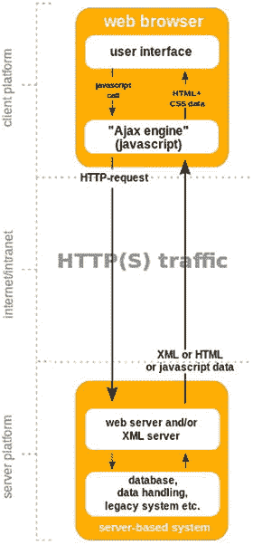
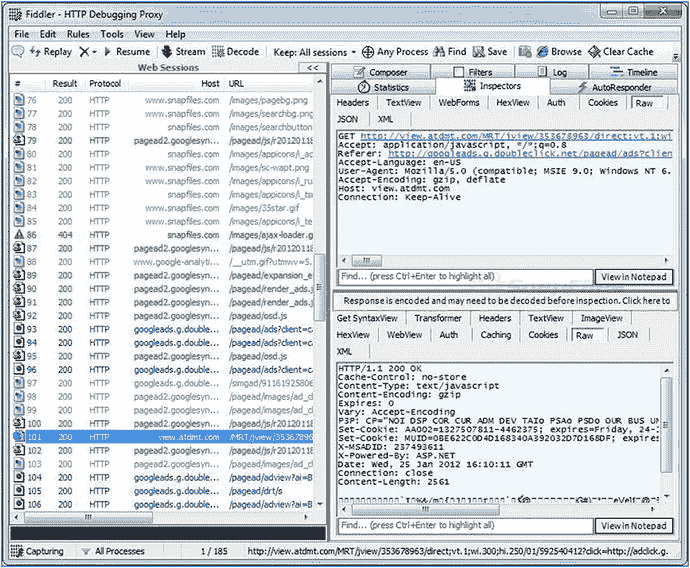
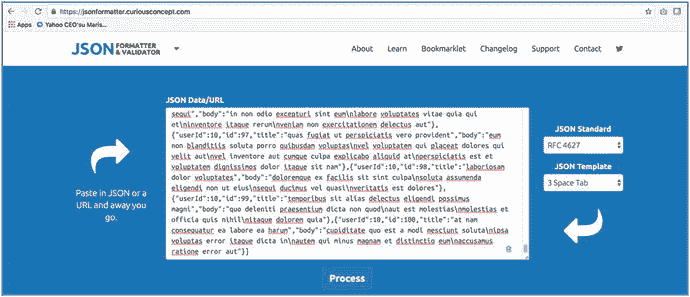
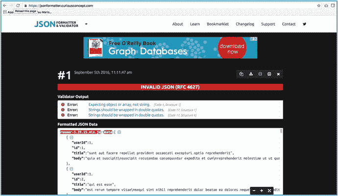

# 一、Web 应用和 AJAX 通信

这本书是为对 web 开发有非常基础的知识的开发人员编写的。它不需要预先安装软件，但是在后面的章节中，您将需要安装软件来运行示例代码。该书提供了如何在需要时下载和安装软件的信息。

在我们深入 Angular 之前，我想介绍一些 web 开发的基本概念。本章介绍了 web 应用的基本架构，以及它如何将数据从服务器传递到 web 浏览器。它还介绍了一些工具，在调试服务器和 web 浏览器之间的通信时，这些工具可能会让您的工作变得更加轻松。

更有经验的开发人员可以跳过这一章。

## 客户端和服务器简介

Web 应用基本上包括两台相互通信的计算机，称为服务器和客户端。该概念如图 [1-1](#Fig1) 所示。


图 1-1

Client/server architecture

该服务器位于公司办公室或数据中心，监听 HTTP 请求，并通过应答进行响应。服务器还访问 web 应用使用的数据(存储在数据库中)。

用户使用他们的 web 浏览器与 web 应用进行交互。用户的计算机与服务器通信，发送 HTTP 请求并接收回答。客户端电脑可能是各种机器，从智能手表到手机到平板电脑再到电脑。

在 web 上，客户端和服务器使用 HTTP(超文本传输协议)进行通信。HTTP 是客户端和服务器之间的请求-响应协议。第 [20 章](20.html)详细介绍 HTTP。

### 服务器端 Web 应用

在服务器端 web 应用中，大部分应用在服务器上执行，而客户端仅用于一次显示一个 HTML 页面。当用户在 web 应用中执行一个操作时，客户机向服务器发送一个请求，服务器执行一些操作，并返回一个全新的 HTML 页面作为响应显示在客户机上。每次都重新生成网页，并发回显示在客户端的 web 浏览器上，如图 [1-2](#Fig2) 所示。


图 1-2

Server-side web application

### 客户端 Web 应用

客户端 web 应用(也称为单页应用，或简称为 SPAs)是一个较新的现象，计算行业正在更多地向这种模式发展。这里，许多应用仍然在服务器上执行，但是一些代码也在客户机(web 浏览器)上执行，以避免频繁地重新生成页面。当用户在客户端执行一个操作时，它向服务器发送一个请求，服务器执行一些操作并返回结果信息——而不是一个全新的 HTML 页面。客户端代码监听来自服务器的回答，并在不生成新页面的情况下自己决定如何响应。客户端 web 应用往往更具交互性和灵活性，因为它们可以更快地响应用户交互——它们不必等待服务器发回同样多的数据。他们只需要等待服务器返回结果，而不是整个 HTML 页面。该架构如图 [1-3](#Fig3) 所示。



图 1-3

Client-side web application

### 取得平衡

因此，基本上有两种类型的 web 应用:服务器端和客户端(SPA)。如果这些被认为是黑白的，你的 web 应用应该在中间的某个地方，在“灰色”区域。

服务器端应该保留聪明东西的存储库——业务规则、数据存储和设置应该保留在服务器上，并在需要时从客户端调用或检索。

客户端(浏览器)应该使用更现代的客户端技术来避免整页刷新。但是，不能太聪明，也不能太臃肿。它应该知道足够多的信息来完成与用户交互的工作，仅此而已。它应该调用服务器端的代码来做智能的事情或执行业务流程。它不应该有太多的业务逻辑、内部系统数据(除了用户可以查看或修改的数据之外的数据)或硬编码信息，因为这些在服务器上管理更好。

Caution

你必须避免把“除了厨房水槽以外的所有东西”都扔给客户。

## 用 AJAX 创建 Web 应用

AJAX 代表异步 JavaScript 和 XML。AJAX 是一种借助 XML、HTML、CSS 和 JavaScript 创建更好、更快、更具交互性的 web 应用的技术。

当客户端 web 应用需要与服务器通信时，它使用 AJAX 发送一些东西，并等待结果返回。请记住，它返回的结果只包含数据，而不是一个全新的网页。此外，客户端代码在等待时不会停止运行，因为它仍然需要显示用户界面并响应用户。这是 AJAX 的异步部分。

客户端 web 应用使用 JavaScript 来调用 AJAX 请求并对其做出响应。这是 AJAX 的 JavaScript 部分。

AJAX 请求过去使用 XML(可扩展标记语言)作为在客户机和服务器之间来回传递的请求和结果数据的数据格式。如今，AJAX 倾向于使用 JSON (JavaScript 对象表示法)作为数据格式，而不是 XML。这是因为 JSON 更紧凑，更直接地映射到现代编程语言中使用的数据结构。但是 XML 和 JSON 都是以文本形式传输数据的常用格式。

前面，我使用了术语异步。你可以这样看待异步:你打电话给你的配偶请求帮助。他们的电话占线，所以你留言让他们在超市停一下，给你买一箱啤酒。同时，你继续看电视——因为这些事情是异步发生的。这一进程的成果将包括以下内容:

*   成功:配偶给你回电话，告诉你啤酒在路上。
*   失败:配偶打电话给你，告诉你商店关门了。

在 AJAX 中，客户端代码在等待服务器响应时不会停止运行，就像你在等待配偶回电时不会停止看电视一样。

### 回收

通常，当您进行 AJAX 调用时，您必须告诉它在收到服务器响应时该做什么。AJAX 系统代码在收到响应时应该触发的这段代码称为回调。

当您执行 AJAX 操作时，您用参数和一两个函数调用 AJAX 代码——回调。回调有两种类型:

*   Success:如果服务器响应成功，并且客户机收到正确的回答，则调用 success(或 done)回调。
*   failure:fail 或 error 回调是可选的，如果服务器返回一个错误(或者 AJAX 调用无法与服务器通信)，就会调用这个回调。

### 承诺

有时你调用 AJAX 代码，它会返回一个承诺或延期。承诺是来自 AJAX 操作的“响应承诺”的对象。当您收到一个承诺时，您可以向该承诺注册您的成功或失败回调，使该承诺能够在成功或失败发生时调用回调。

### 编码

当您使用 AJAX(或者客户端和服务器之间的其他通信)时，您需要确保信息以适合传输的形式发送。你可以通过编码来实现。如果不使用编码，很有可能某些信息不会像发送时那样被准确接收。对于一些特殊的字符信息尤其如此，例如空格、引号等等。

表 [1-1](#Tab1) 列出了信息编码的三种主要方法。

表 1-1

Three Main Methods of Encoding Information

<colgroup><col align="left"> <col align="left"></colgroup> 
| 方法 | 笔记 |
| :-- | :-- |
| 编码器(编码器)(编码器)(编码器)(编码器)(编码器)(编码器)(编码器)(编码器)(编码器)(编码器)(编码器)(编码器)(编码器)(编码器)(编码器)(编码器)(编码器)(编码器)(编码器)(编码器)(编码器)(编码器)(编码器) | 这对于用特殊字符的转义序列将整个 URL 编码成 UTF 8 非常有用。它以与 encodeURIComponent 相同的方式对字符串进行编码(见下一项)，只是它不涉及组成 URL 路径的字符(如斜杠)。例如: [`http://www.cnn.com`](http://www.cnn.com) 转换为`http://www.cnn.com%0A`。 |
| 中文 | 这对编码参数很有用。它不适合编码整个 URL，因为它可以用转义序列替换重要的 URL 路径信息。例如: [`http://www.cnn.com`](http://www.cnn.com) 转换为`http` %3A%2F%2F www.cnn.com%0A。 |
| 逃跑 | 这将返回一个包含[参数]内容的字符串值(Unicode 格式)。使用时要小心，因为默认情况下，服务器不会接收 Unicode 格式的数据。例如: [`http://www.cnn.com`](http://www.cnn.com) 转换为`http%3A//www.cnn.com%0A`。 |

为了测试这些方法，请前往 [`http://pressbin.com/tools/urlencode_urldecode/`](http://pressbin.com/tools/urlencode_urldecode/) 。图 [1-4](#Fig4) 显示了这个网络界面的样子。


图 1-4

Web page that displays different encodings for what you type

### 哈尔和哈特奥斯

为了与服务器通信，客户端需要知道服务器在哪个 URL 上可用。这些信息不应该硬编码在客户端上。相反，服务器应该告诉客户端使用什么 URL 来获取信息。将这些信息发送回客户端的格式有多种标准，包括 HAL 和 HATEOAS。

例如，如果客户机向服务器发送一个 AJAX 请求来检索客户列表，那么返回的信息应该包括每个客户的 AJAX 请求的 URL。这避免了在客户机上硬编码客户 AJAX 请求 URL。你可以分别在 [`https://martinfowler.com/articles/richardsonMaturityModel.html`](https://martinfowler.com/articles/richardsonMaturityModel.html) 和 [`https://en.wikipedia.org/wiki/HATEOAS`](https://en.wikipedia.org/wiki/HATEOAS) 阅读更多关于 HAL 和 HATEOAS 的内容。

### 监控数据流量

您的网络浏览器内置了开发工具。其中一个工具是网络工具，它允许您监控客户端和服务器之间的数据流量。该数据流量以带有时间线的列表形式呈现，如图 [1-5](#Fig5) 所示。您可以选择列表上的一个项目来更详细地查看它，并确切地看到哪些数据被发送到服务器，哪些数据被返回。您可以过滤想要跟踪的网络流量类型。例如，您可以选择“XHR”来查看 AJAX 请求。


图 1-5

Viewing data traffic with the network developer tool in the Google Chrome browser

Fiddler 是一个免费的 web 调试代理，其工作方式类似于浏览器开发工具中的网络选项卡(见图 [1-6](#Fig6) )。Fiddler 有一些额外的功能，比如创建自己的 AJAX 请求和运行脚本。在 [`www.telerik.com/fiddler`](http://www.telerik.com/fiddler) 阅读更多关于提琴手的信息。



图 1-6

Viewing data traffic with Fiddler

邮差很像提琴手( [`www.getpostman.com`](http://www.getpostman.com) )。两者都很有用。

## 分析 JSON

您经常会收到来自服务器的很长的 JSON 响应，并且需要遍历响应数据来提取您需要的数据。您的响应数据通常会作为参数传递给 AJAX 成功回调函数。以下是检查这些数据的一些提示:

*   将其转换为字符串:可以调用 JSON.stringify 函数将响应数据转换为字符串。这将使您能够在成功回调时将其输出到控制台，如下所示:

    ```ts
    function success(data){
     console.log('success - data:' + JSON.stringify(data));
     //
     // do something with data
     //
    }

    ```

*   将 JSON 数据复制到控制台之外:要将 JSON 数据复制到剪贴板，请执行以下操作:
    1.  打开你的浏览器。
    2.  转到开发者工具菜单。
    3.  单击控制台操作。
    4.  选择 JSON 文本。
    5.  右键单击并选择复制。
*   格式化 JSON 数据，使其更具可读性:现在，您已经将 JSON 数据放在剪贴板中，您可以将它复制并粘贴到网站中，使其更具可读性:
    1.  打开你的浏览器。
    2.  Go to [`https://jsonformatter.curiousconcept.com`](https://jsonformatter.curiousconcept.com) (or a similar service—there are lots of these). Figure [1-7](#Fig7) shows what this website looks like.

        

        图 1-7

        Formatting JSON data  
    3.  将 JSON 粘贴到大文本框中。
    4.  Click the Process button. The website will show you the JSON data in a validated, formatted, easy-to-read web page, as shown in Figure [1-8](#Fig8). You can even view the JSON full-screen.

        

        图 1-8

        Formatted JSON data  
*   复制 JSON 数据并将其粘贴到您的编辑器中:然后您可以应用编辑器的格式命令。您可能需要首先将该文件保存为. js 文件，以确保将其格式化为 JavaScript。

## 摘要

近年来，web 应用的世界已经发生了很大的变化。客户端应用(也称为 spa)变得越来越普遍。在本章中，我们看到 SPA 最重要的方面之一是客户端(浏览器)和服务器之间的 AJAX 通信。

作为一名开发人员，了解如何使用 web 浏览器开发工具的网络部分非常重要，这样您就可以调试 AJAX 通信。您可能还需要知道如何使用其他工具，如 Postman 或 Fiddler。

在下一章，我将介绍 Angular，并展示它是如何随着版本的变化而变化的。