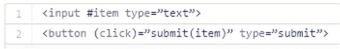

# 二、Angular 旧的和新的

在学习 Angular 之前，了解一下称为 AngularJS 的原始版本，并谈谈第一个版本和后来的版本之间最重要的差异，会有所帮助。

以下是一些关于 AngularJS 和 Angular 的基本事实:

*   AngularJS 于 2009 年发布，是最初的 Angular。
*   这是一个动态 web 应用的 JavaScript 框架——不需要重新加载页面。动态 web 应用也称为 SPAs(单页应用)。
*   它很流行用在任何浏览器上都能快速运行的小部件来创建网页。
*   它允许用户扩展 HTML 来添加特定领域的标签，比如`<CAR>`。
*   它允许用户将数据从模型绑定到特定于 HTML/域的标签。
*   Angular 2 于 2009 年和 2014 年开发。
*   谷歌于 2014 年 9 月宣布开发 Angular 4，并于 2015 年 1 月进入测试阶段。
*   Angular 4 发布于 2017 年 3 月。
*   Angular 5 于 2017 年 11 月发布。

AngularJS 像野火一样迅速发展起来，因为它是快速构建应用原型的一个很好的工具。它也很灵活，因为你可以使用 HTML 来创建页面，并在此基础上快速构建，将静态的 HTML 变成一个移动的、反应灵敏的、性感的应用。以下是如何:

1.  获取一个 HTML 模板，修改一些 HTML 代码元素来添加数据绑定。数据绑定允许可视控件(如文本框、选择框等)将其值与变量同步。例如，您可以将一个`city`变量绑定到一个“城市”文本框。如果用户在文本框中输入内容，那么`city`变量的值将被更新。如果代码改变了`city`变量的值,“城市”文本框会更新以匹配
2.  添加 JavaScript Angular 控制器:
    1.  为要绑定到的 HTML 标记添加变量。
    2.  添加行为 JavaScript 代码(响应按钮点击等事件的代码)。 

搞定了。

很明显，您可以做更多的事情，但是关键是开发人员可以很快地将原始的 HTML 转换成一个有效的、响应迅速的应用。

## 语义版本控制

Angular 2、4 和 5 非常相似，它们都与原始 AngularJS 非常不同。很奇怪，我们有了好几年的 AngularJS，然后在很短的时间内有了 Angular 2，4 和 5。这是因为 Google 的人决定从版本 2 开始实现语义版本化。语义版本化是软件版本化的新标准，它现在如此流行的原因是版本号(或版本号的变化)提供了关于自上一版本以来所做的变化的信息。

使用语义版本化，版本号被分成三个部分，每个部分用句点分隔。

[主要版本号]。[次要版本号]。[补丁版本号]

因此，当 Angular 从 4 更改为 5 时，这是主版本号的更改。

主要版本号的变化表明软件在很大程度上发生了变化，这意味着您过去可以工作的代码可能不再工作，因为 api 已经发生了变化。

次要版本号更改表示软件被更改，但更改的方式允许您的代码仍然可以工作。

补丁版本号是用来修正错误的，一切都应该正常。

Angular 5 是 Angular 4 的基础，有许多小的改进，其中一些改进导致了 api 的修改。如语义主要版本号变化所示，当从 4 转换到 5 时，您的代码可能需要修改。从 4 到 5 最重要的变化包括:

*   http 模块的修改(这已经包含在 Angular 版本中)。
*   构建优化器已经过修改，可以生成更小、更高效的部署模块。当您从 Angular 项目中部署文件时，这些文件将会更小。
*   有新的工具可以从浏览器和服务器传输状态数据(反之亦然)。
*   编译器被重新编写得更快更彻底。以前 Angular 写的是在运行你的 app 时使用 jit(即时编译)。当您加载组件和对象时，它们会在需要时被编译。Angular 现在更倾向于 aot 模型，在这种模型中，你的代码是提前编译的，而不是在需要的时候。5 中的这些编译器更新推进了向 aot 的转移，这将使您的应用运行得更快，因为它在运行应用时将执行更少的编译。
*   改进了对多语言应用的国际化支持。

## 平台

AngularJS 运行在 web 浏览器上，web 浏览器运行 JavaScript，所以，JavaScript 是 AngularJS 和 Angular 的平台。

术语 evergreen 浏览器指的是自动升级到未来版本的浏览器，而不是像旧浏览器那样通过制造商发布的新版本进行更新。这个术语反映了浏览器的设计和交付在过去几年中的快速变化。现在广泛使用的浏览器都是常青树，自己更新。

### 浏览器使用 JavaScript 引擎运行 JavaScript

我们曾经认为网络浏览器和它运行 JavaScript 的能力是一回事。自从 Node(它使用 Google Chrome 的 JavaScript 引擎在远离浏览器的地方运行程序)以来，这种情况已经发生了变化，你可以在远离浏览器的地方独立运行这些引擎。

JavaScript 引擎是一个执行 JavaScript 的程序或解释器，可以利用 JIT(实时)编译成字节码。自 AngularJS 以来，JavaScript 引擎随着 ECMA JavaScript 的新版本(ECMA 指的是版本)而稳步改进。AngularJS 运行在运行名为 ECMA5 的 JavaScript 版本的网络浏览器上。现在大多数浏览器运行的都是更高版本。随着 ECMA6(也称为 ECMA 2016)，JavaScript 朝着成为像 Java 或. NET 一样的结构化、类型化语言迈出了一大步。两个更重要的变化是用于创建类和模块的新语法，这对于本书来说很重要也很相关。

您可能知道，客户端 JavaScript 的世界变化很快。ECMA 维基百科页面定期更新最新信息: [`https://en.wikipedia.org/wiki/ECMAScript`](https://en.wikipedia.org/wiki/ECMAScript) 。

### 垫片和聚合填料

填充和聚合填充是软件组件，旨在允许旧浏览器运行更现代的代码。shim 是一段代码，它拦截浏览器上的现有 API 调用并实现不同的行为，从而实现跨不同环境的标准化 API。因此，如果两个浏览器以不同的方式实现相同的 API，您可以使用一个填充程序来拦截其中一个浏览器中的 API 调用，并使其行为与另一个浏览器保持一致。polyfill 是一段 JavaScript，它可以将缺失的 API“植入”旧浏览器。例如，填充和聚合填充使旧的 ECMA5 浏览器能够运行 ECMA6 代码。

## 以打字打的文件

在 AngularJS 和 Angular 的出现之间，JavaScript 得到了改进，变得更像一种结构化语言。但是您可以更进一步，使用 TypeScript 语言，它是结构化的，甚至更像 Java 之类的语言。NET 和 C#。事实上，TypeScript 是由微软开发的，是 JavaScript 的改进版。图 [2-1](#Fig1) 简洁地表达了 TypeScript。


图 2-1

How to think of TypeScript

为什么 TypeScript 很重要？Google 使用 TypeScript 开发 Angular。因此 Angular 和 TypeScript 语言是一个很好的组合，我们将在本书中对此进行大量讨论。

### 蒸发

TypeScript 如何在 web 浏览器上运行？嗯，没有，至少目前没有。使用一个称为 transpilation 的过程将 TypeScript 转换回兼容的 JavaScript。翻译程序是将一种语言的源代码转换成另一种语言的源代码的软件。例如，TypeScript、CoffeeScript、Caffeine、Kaffeine 和二十多种其他语言都被转换成了 JavaScript。

如果你想直接看到 transpilation，请查看 [`www.typescriptlang.org/play/`](http://www.typescriptlang.org/play/) 并查看一些示例。如果您从该网页的弹出框中选择 Using Classes，您可以看到现代的 TypeScript 类是如何转换成兼容的 JavaScript 的。

清单 [2-1](#Par44) 显示了您将为一个 TypeScript 类编写的代码，清单 [2-2](#Par45) 显示了到 JavaScript 的转换。

```ts
class Greeter {
    greeting: string;
    constructor(message: string) {
        this.greeting = message;
    }
    greet() {
        return "Hello, " + this.greeting;
    }
}

Listing 2-1TypeScript Class

```

```ts
var Greeter = (function () {
    function Greeter(message) {
        this.greeting = message;
    }
    Greeter.prototype.greet = function () {
        return "Hello, " + this.greeting;
    };
    return Greeter;
}());
Listing 2-2Transpiled to Browser-Compatible JavaScript

```

### 调试和映射文件

因此，您以一种方式编写代码，以另一种方式部署它——这一定是调试的噩梦，对吗？是的，如果你没有地图文件，调试将是一场噩梦。映射文件由 transpiler 自动生成，并为浏览器提供将原始(TypeScript)代码映射到已部署(JavaScript)代码所需的信息。这意味着 JavaScript 调试器可以让您调试源代码，就像浏览器正在运行它一样。这有多酷？如果你让。地图文件在您的浏览器中，它会自动寻找它们，拿起它们，并使用它们。我用。我在 Chrome 调试的时候一直在映射文件。

地图文件执行以下操作:

*   将合并/缩小/传输的文件映射回未构建状态。
*   将浏览器中的 JavaScript 代码行映射回 TypeScript 代码行
*   使浏览器和调试器能够显示您在 TypeScript 中编写的原始代码并对其进行调试

### 蒸腾作用和

有许多方法可以设置您的项目，将您的 TypeScript 代码转换成浏览器友好的 JavaScript。这完全取决于您的项目设置。在这方面你有很多选择，这可能会变得复杂和混乱。

我建议您开始使用 Angular CLI 工具。这个工具可以非常简单地生成具有简单构建过程设置的现成项目，包括 transpilation。它在大型项目中也很有用。

## 模块

模块这个词指的是独立的、可重用的软件代码的小单元，例如，执行动画的代码。我想到的是乐高积木之类的模块(图 [2-2](#Fig2) )。每个块都有自己的用途，但是被插入到一个更大的结构(应用)中。

AngularJS 有自己的模块系统，使用简单。那时候 JavaScript 还没有自己的模块化代码的体系。Angular 有自己的模块系统将 Angular 代码打包成模块，还有现代的 JavaScript 模块。


图 2-2

Modules are like software LEGO blocks

不要担心，稍后会更详细地介绍这些内容。

## 控制器和组件

AngularJS 使用控制器来表示 HTML 页面上用户界面中的小部件。

Angular(从版本 2 开始)用`Component`对象替换控制器。组件可以有自己的标签，比如`<Component1>`。组件有一个包含数据和代码的类。

第 [8](08.html) 章更详细地介绍了组件。组件是 Angular 5 应用的构建块。

## 依赖注入和构造函数注入

正如我提到的，作为 Java Spring 的一员，我喜欢依赖注入，因为它让生活变得更简单。我们可以在这个主题和依赖注入提供的好处上花费大量的篇幅。

AngularJS 提供了依赖注入。现代 Angular 还提供依赖注入。因为您的组件有类，所以依赖项现在通常通过构造函数注入，使用构造函数注入模式。这种软件模式是另一种服务器端技术，现在正用于客户端。让我们看一个 Java Spring 使用构造函数注入的例子。以下配置指定了一个构造函数参数—一个字符串消息，`"Spring is fun"`:

```ts
<?xml version="1.0" encoding="UTF-8"?>
<beans xmlns:="http://www.springframework.org/schema/beans"
       xmlns:xsi="http://www.w3.org/2001/XMLSchema-instance"
       xsi:schemaLocation="http://www.springframework.org/schema/beans

http://www.springframework.org/schema/beans/spring-beans.xsd">

    <bean id="message"
          class="org.springbyexample.di.xml.ConstructorMessage">
        <constructor-arg value="Spring is fun." />
    </bean>

</beans>

```

以下 bean 类期望在构造函数中接收消息:

```ts
public class ConstructorMessage {

    private String message = null;

    /**
     * Constructor
     */
    public ConstructorMessage(String message) {
        this.message = message;
    }

    /**
     * Gets message.
     */
    public String getMessage() {
        return message;
    }

    /**
     * Sets message.
     */
    public void setMessage(String message) {
        this.message = message;
    }

}

```

这有什么了不起的？在这种情况下，这是一个字符串的简单例子。但是它展示了一个软件对象(在本例中是一个字符串对象)是如何使用构造函数“插入”另一个软件对象的。

例如，在 Angular 中，您可以创建一个可重用的软件对象来处理与服务器的通信。您可以通过构造函数将它传递给每个需要它的对象(类)。这样，在课堂上，你就有了与服务器对话的现成方法。

一次编写一个服务，在许多地方多次使用它。

## 范围、控制器和组件

在 AngularJS 中，Scope ( `$scope`)曾经是控制器的“数据容器”。您的变量将包含在`$scope`对象中。例如，如果您有一个地址输入表单的控制器，地址的每一行可能是控制器的`$scope`中的一个变量。

在 Angular 中，您不再拥有控制器，而是拥有组件，并使用这些组件来构建用户界面。您可以使用 composition 将组件嵌套在其他组件中。组件有一个类，类似于 Java 或. NET。这个类是“数据容器”,包含你的变量。这更像是传统的服务器端编码。例如，如果您有一个带有地址的输入表单组件，地址的每一行可能是组件类中的一个变量，类似于 Java `swing`(或 Windows `Form`)类。

*   组件使用类来包含它们的变量和应用代码。
*   类有实例变量、构造函数和方法。
*   可以使用构造函数将依赖项注入到类中。
*   实例变量可以绑定到模板，以创建一个响应用户界面。

第 [8](08.html) 章详细介绍了组件。

## 形式

编写代码来处理表单上的数据输入是很重要的。编写处理表单、数据输入和验证的 AngularJS 代码很容易，但 Angular 有新的表单模块，可以更容易地完成以下任务:

*   动态创建表单
*   用通用验证器验证输入(必需)
*   用自定义验证器验证输入
*   测试表格

## 模板

AngularJS 和 Angular 都使用 HTML 模板(见图 [2-3](#Fig3) 和 [2-4](#Fig4) )。模板中的 HTML 被绑定到数据变量和代码上，以便创建一个工作的应用。不幸的是，模板语法出现了分歧。第 12 章[详细介绍了新的语法。](12.html)



图 2-4

Angular template


图 2-3

AngularJS template

## 摘要

读完这一章后，你应该对 Angular 的不同版本有更好的理解。最初的 AngularJS 像野火一样迅速发展，因为它是编写跨浏览器应用的一种快捷方式，但它有一些不一致之处，需要更新才能使用更新的浏览器提供的功能。

更现代的 Angular 类似于 AngularJS，只是开发环境更简单，支持使用更新的 JavaScript 和 TypeScript。

Angular 依赖于 JavaScript 和 TypeScript。第 [3](03.html) 章介绍了 JavaScript 以及它是如何从一个版本变化到另一个版本的。