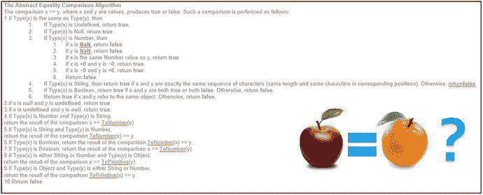
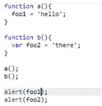

# 三、JavaScript 语言

当网景公司在 1995 年 4 月雇用布伦丹·艾希时，他被告知他有 10 天的时间来创造和制作一种可以在网景浏览器上运行的编程语言的工作原型。

十天来创造我们现在所知的 JavaScript！考虑到他被给予的时间，我会说他做得相当好。

JavaScript 在不断发展。目前，大多数 web 浏览器支持 JavaScript ES5，但 ES6 将在未来一两年内成为标准。

## JavaScript ES5:局限性和缺点

这一节讨论了当前版本 ES5 之前的 JavaScript 中的限制和缺点。这些缺点在 ES6 中已经解决了，将在本章后面介绍。

### 类型

当对变量进行运算时，计算机可能知道也可能不知道所涉及的每个变量的类型。

如果类型是已知的，那么操作就很简单，因为操作非常具体。

示例:

```ts
const a: number = 123;
const b: number = 456;
const c: number = a + b;

```

如果不知道类型，事情就会变得更加复杂。计算机必须试图找出正在使用的变量的类型，或者将它们强制转换成预期的类型。逻辑可能会变得复杂。

示例:

```ts
var foo = 123 + "Mark";

```

答案是什么？

*   `123Mark`？
*   错误—因为 123 是数字而`"Mark"`是字符串？

JavaScript 仅支持六种类型:

*   不明确的
*   空
*   布尔代数学体系的
*   线
*   数字
*   目标

没错，只有一个号码类型。然而，有这么多不同类型的数字，包括整数和小数。我不认为我在类型方面做了什么，JavaScript 并没有削减它。

### 快速失败行为

代码要么应该准确地工作，要么应该快速(立即)失败。因为 JavaScript 的类型和规则很少，所以它经常会继续运行而不是失败，并带来奇怪的副作用。你认为不起作用的东西会起作用。

例如，以下代码不会失败:

```ts
alert((![]+[])[+[]]+(![]+[])[+!+[]]+([![]]+[][[]])[+!+[]+[+[]]]+(![]+[])[!+[]+!+[]]);

```

### 值/对象比较

当你在 Java 或. NET 语言中比较两个变量时，你不需要成为一个火箭专家就能知道如何比较它们。您实现了一个`.equals()`方法。但是，因为 JavaScript 的类型很少，所以它使用复杂的逻辑来比较值或对象。要了解 JavaScript 如何比较变量，请看图 [3-1](#Fig1) 所示的等式算法。你可能想先吃一片泰诺。



图 3-1

Abstract equality comparison algorithm


### 辖域

在 JavaScript 中，未声明的变量被隐式提升为全局变量。对我来说，这似乎是不合逻辑和危险的，因为肯定要有一个全局变量，你应该这样声明它？

在图 [3-2](#Fig2) 中，变量`foo1`是全局变量，变量`foo2`不是。当这段代码运行时，您只会看到一个提示框，显示“hello”你看不到第二个，因为`foo2`没有设置，因为它超出了范围，不是全局变量。



图 3-2

Only one variable is shown in an alert

### JavaScript 严格模式

JavaScript 严格模式在 ES5 中发布。它不会影响旧代码——换句话说，例如，如果在 ES4 中运行，使用`strict` mode 命令不会破坏 JavaScript 代码。严格模式旨在通过实施更好的编程实践来防止意外错误。

#### 祈祷

`"use strict"`指令仅在脚本或函数的开头被识别。这种模式可以在两个不同的范围内运行:文件和函数。如果将该指令放在脚本文件的开头，该文件中的所有代码都将以该模式运行。如果将它放在函数的开头，函数中的所有代码都将以该模式运行。

我不能涵盖严格模式的每一个方面，但我会在本节中讨论其中的主要方面。

#### 赋给未声明的变量或对象

当用户将一个值赋给一个未赋值的变量或对象时，严格模式抛出一个错误，防止创建一个非预期的全局变量(我将在本章后面详细讨论这个主题)。以下代码在严格模式下抛出错误:

```ts
"use strict";
pie = 3.14;

"use strict";
obj = {str:10, zip:30350};

```

#### 删除变量或对象

严格模式不允许使用`delete`关键字删除变量或对象。以下代码在严格模式下抛出错误:

```ts
"use strict";
var pie = 3.14;
delete pie;

```

#### 复制函数参数

严格模式不允许一个函数中有多个同名的参数。以下代码在严格模式下抛出错误:

```ts
"use strict";
function concat(word1, word1) {};

```

#### 复制对象属性

严格模式不允许一个函数在一个对象中有多个同名的属性。以下代码在严格模式下抛出错误:

```ts
"use strict";
var obj = {
  prop1 : 0,
  prop2 : 1,
  prop1 : 2
};

```

#### 只读属性

在 ES5 中，用户可以使用函数`Object.defineProperties`定义对象属性。该函数允许开发人员将一些属性定义为不可写的(即只读的)。在正常模式下，当代码试图写入只读属性时，代码不会引发错误。但是，在严格模式下，代码会在这种情况下抛出一个错误:

```ts
var obj = Object.defineProperties({}, {
              prop1 : {
                value : 1,
                writable : false
              }
            });

obj.prop1 = 2;

```

#### 不可扩展的变量或对象

在 ES5 中，用户可以使用函数`Object.preventExtensions`来防止对象被扩展。在正常模式下，当代码试图扩展对象时，代码不会引发错误，但是在严格模式下，代码会在以下情况下引发错误:

```ts
"use strict";
var obj = {prop1 : 1};
Object.preventExtensions(obj);
obj.prop2 = 2;

```

#### 关键词

严格模式引入了以下保留关键字，这些关键字不能在该模式下的代码中使用:

*   `implements`
*   `interface`
*   `let`
*   `package`
*   `private`
*   `protected`
*   `public`
*   `static`
*   `yield`

## JavaScript ES6:变化和改进

JavaScript ES6 比 ES5 改进了很多。我不打算涵盖 ES5 和 ES6 之间的所有改进——只是主要的改进。涵盖所有的改进将需要几个章节。注意，如果你想玩玩 ES6，但不确定该做什么，请访问 [`www.es6fiddle.net`](http://www.es6fiddle.net) 并尝试一下。

### 常数

常量适用于不能重新分配新值的变量:

```ts
const TAX = 0.06;

```

### 块范围的变量和函数

在 ES6 之前，JavaScript 在变量方面有两大缺陷。首先，在 JavaScript 中，未声明的变量被隐式提升为全局变量。正如我之前提到的，在我看来，这似乎是不合逻辑和危险的。如果脚本试图将赋值给未声明的变量，JavaScript 中的严格模式会引发错误，如下例所示:

```ts
"use strict";
mark = true; // no ‘var mark’ to be found anywhere....

```

此外，当您用`var`语句声明变量时，这会将变量的范围缩小到最接近的整函数。以下示例分配了两个`x`变量:一个在函数内部，但在`if`块外部，另一个在函数内部，但在`if`块内部。注意代码是如何运行的，就好像只有一个`x`变量一样。这是因为它的作用域是整个函数。即使它离开了`if`语句的范围，它仍然保持相同的值:

```ts
function varTest() {
  var x = 31;
  if (true) {
    var x = 71;  // same variable!
    console.log(x);  // 71
  }
  console.log(x);  // 71
}

```

现在 ES6 允许开发者在块范围内声明变量和函数。ES6 有一个新的用于声明变量的`let`语句。它类似于`var`语句，只是变量的作用域是最近的封闭块，就像在`{' and '}`中一样。

下一个例子展示了内部变量`x`如何作用于`if`语句中最近的块。当代码退出`if`语句时，内部`x`变量超出了作用域。因此，当控制台日志打印在`if`下面的语句中时，它显示的是外部`x`变量的值:

```ts
function letTest() {
  let x = 31;
  if (true) {
    let x = 71;  // different variable
    console.log(x);  // 71
  }
  console.log(x);  // 31
}

```

ES6 还允许您定义块内的函数。当块终止时，这些函数立即超出范围。例如，以下代码在带有 ES5 的 Plunker 上运行良好，但在 Es6fiddle.net 上运行时会抛出“未捕获的引用错误:日志未定义”:

```ts
if (1 == 1){
    function log(){
      console.log("logging");
    }
    log();
}
log();

```

### 箭头功能

箭头函数是一种用于编写 JavaScript 函数的新的 ES6 语法(见图 [3-3](#Fig3) )。箭头函数是一个匿名函数，您可以在源代码中内嵌它(通常是为了传递给另一个函数)。您不需要通过使用`function`关键字来声明箭头函数。关于箭头函数需要记住的一件非常重要的事情是,`this`变量的值保存在函数内部。


图 3-3

Arrow function

### 函数参数现在可以有默认值

如果某些参数未定义，您可以指定默认值。

例如，以下内容

```ts
function multiply(a = 10, b = 20){
  return a * b;
}
console.log(multiply(1,2));
console.log(multiply(1));
console.log(multiply());

```

产生以下输出:

```ts
2
20
200

```

### 函数现在接受 Rest 参数

这个参数语法使我们能够将无限数量的参数表示为一个数组。

例如，以下内容

```ts
function multiply(...a){
  var result = 1;
  for (let arg in a){
    result = result * a[arg];
  }
  return result;
}
console.log(multiply(5,6));
console.log(multiply(5,6,2));

```

产生以下输出:

```ts
30
60

```

### 字符串插值

字符串插值使变量能够被数据绑定到文本字符串中。注意，插值只对用于模板文字的新引号字符```ts 起作用。模板文字允许用户使用多行字符串和字符串插值。字符串插值不适用于普通引号`"`和`'`中的字符串。

例如，以下内容:

```
var person = {name: "julie", city: "atlanta"};
console.log(person.name);
// works
console.log(`${person.name} lives in ${person.city}`);
// doesnt work
console.log("${person.name} lives in ${person.city}");
console.log('${person.name} lives in ${person.city}');

```ts

产生以下输出:

```
julie
julie lives in atlanta
${person.name} lives in ${person.city}
${person.name} lives in ${person.city}

```ts

### 模块

模块化编程是一种软件设计技术，它强调将程序的功能分成独立的、可互换的模块，每个模块都包含执行所需功能的一个方面所需的一切。

目前，大多数网络浏览器运行的是 JavaScript 版本 ECMA 5，它不是为模块化编程而编写的。然而，ECMA 6 旨在与模块一起工作，其规范于 2015 年 6 月达成一致。ES6 JavaScript 允许你将代码编写成模块，并像乐高积木一样使用它们。

例如，您可以拥有一个包含大量国际化代码的国际化实用程序模块，包括为不同地区加载资源包的代码等等。然而，您只需要其他代码来访问这个代码的一个方法，一个叫做`getI18N(locale, key)`的方法，它将返回一个地区和一个键的文本。JavaScript 模块为您提供了这种能力，让您编写一个只能通过公共接口访问的代码“黑盒”——在本例中是一个导出函数。

#### 一条命

在 ES6 中，每个模块都写在自己的 JavaScript 文件中——一个。js 文件。每个文件只有一个模块，每个模块只有一个文件。有两种方法可以从一个模块中导出东西，使它们在外部可用，这两种方法都使用了`export`关键字。您可以在同一个模块中混合使用这两种导出方式，但如果不这样做，会更简单。随便选一个。一旦导出了代码，就可以通过导入在其他地方使用它。

#### 导出方法 1:命名导出

如果希望模块导出多个对象(例如，常数、函数、对象等)，请使用命名导入。命名导入使您能够导出带有名称的代码。

模块`mymath.js`:

```
export const sqrt = Math.sqrt;
export function square(x) {
    return x * x;
}
export function diag(x, y) {
    return sqrt(square(x) + square(y));
}

```ts

导入和使用模块代码:

```
import { square, diag } from 'mymath';
console.log(square(11));
console.log(diag(4, 3));

```ts

注意导出不需要分号，并且名称必须与模块中的原始名称相匹配。

#### 导出方法 2:默认导出

每个模块只能有一个默认导出。如果您只想让您的模块导出一个东西，这是很有用的。

模块`mymath.js`:

```
export default function square(x) {
    return x * x;
}

```ts

导入和使用模块代码:

```
import sq from 'mymath';
sq();

```

再次注意导出不需要分号，名字`sq`与模块中的函数不匹配。使用默认导出允许您使用“昵称”,因为它知道将要使用的对象，因为只有一个。

Note

如果需要编写可以部署到运行 ES5 的浏览器上的现代代码(ES6 或更高版本)，可以使用 transpilation 来转换代码。

### 以打字打的文件

ES6 是 ES5 的一大进步，但它仍然缺少 Java 和 C#等现代结构化语言提供的一些功能，例如，强类型、装饰器、枚举等。

别担心。已经有一些构建在 ES6 之上的东西，并把它推进了一步。这叫打字稿。我们将在 ES6 和 TypeScript 中编写现代代码，并使用 transpilation 将其转换为可在主流 web 浏览器上部署的兼容代码。

TypeScript 由微软编写，是一种非常现代的结构化语言，类似于 Java 和 C#。谷歌与微软在 TypeScript 上合作，用它自己编写 Angular。这使得在 Angular 中使用 TypeScript 成为一个非常好的主意！

## 摘要

本章讨论了 JavaScript 的许多陷阱，并指出当前大多数 web 浏览器仍然运行 ES5，而不是 ES6。我提到过，虽然 ES6 是对 ES5 的改进，但 TypeScript 扩展并改进了它，提供了打字和许多其他功能。打字稿是下一章的主题。