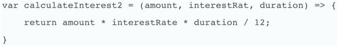
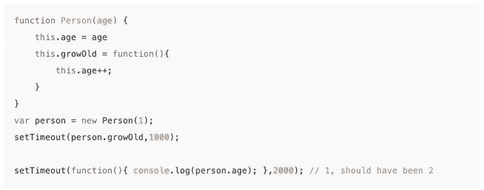
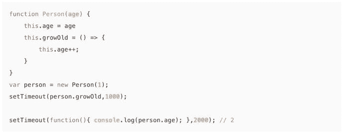

# 四、TypeScript

TypeScript 是 JavaScript(由微软编写)的超集，主要提供可选的静态类型、类和接口。它是开源的，正在 GitHub 上开发。编译器在 TypeScript 中实现，可以在任何 JavaScript 主机上工作。

作为 JavaScript 的严格超集意味着 JavaScript 程序也是有效的 TypeScript 程序，TypeScript 程序可以无缝地使用 JavaScript。TypeScript 编译成兼容的 JavaScript。TypeScript 与 Java/非常相似。NET 有一些不同，例如，构造函数和接口。

您不需要下载或安装 TypeScript。当您使用 Angular CLI 时(在第 [7](07.html) 章中介绍)，它会自动为您的项目设置 TypeScript。

简而言之，您可以这样看待 TypeScript:

*   TypeScript = JavaScript +类型+类+模块+更多

这些增加中最重要的是类型，我们将在本章中讨论。类型使 ide 能够提供一个更丰富的环境，以便在您键入代码时发现常见错误。

Note

浏览器不能直接运行 TypeScript 至少现在还不能。TypeScript 代码被编译成 JavaScript。

微软学习打字稿的网站是 [`www.typescriptlang.org`](http://www.typescriptlang.org) ，其操场如图 [4-1](#Fig1) 所示。

请注意，您可以在左侧输入 TypeScript，并在右侧看到它被转换为 JavaScript。


图 4-1

Playground area of [`www.typescriptlang.org`](http://www.typescriptlang.org)

本章的其余部分集中在 JavaScript 和 TypeScript 语言之间的主要区别。

## 强力打字

TypeScript 提供了强类型，类型非常有用，因为它使开发人员能够指定如何使用变量(它将存储什么类型的信息)。这使编译器能够验证情况是否如此。如果您的代码没有像预期的那样以有效的方式使用变量，它将无法编译。

使用 TypeScript 进行相等性比较比使用 ECMA5 JavaScript 更容易，因为您可以很容易地检测到所比较的两项是否属于同一类型。如果不是，就会产生一个错误。类型检查完成后，相等检查会更容易，因为两个项属于同一类型。代码中包含类型给了 ide 更多的信息。例如，如果 IDE 知道某个变量是字符串，它可以将自动完成选择范围缩小到字符串。

TypeScript 提供了以下基本类型:

*   布尔代数学体系的
*   数字
*   线
*   排列
*   列举型别
*   任何的
*   空的

## 班级

ECMAScript 5 没有类，但是 TypeScript 和 ECMAScript 6 有。

类具有以下格式的构造函数:

```ts
class Animal {
    private name:string;
    constructor(theName: string) { this.name = theName; }
}

Note that the code below will do the same thing as the code above (ie assign a value to the 'name' instance variable):

class Animal {
    constructor(private name: string) {}
}

```

类可以扩展其他类:

```ts
class Animal {
    name:string;
    constructor(theName: string) { this.name = theName; }
    move(meters: number = 0) {
        alert(this.name + " moved " + meters + "m.");
    }
}

class Snake extends Animal {
    constructor(name: string) { super(name); }
    move(meters = 5) {
        alert("Slithering...");
        super.move(meters);
    }
}

class Horse extends Animal {
    constructor(name: string) { super(name); }
    move(meters = 45) {
        alert("Galloping...");
        super.move(meters);
    }
}

```

类可以实现接口(见下一节)。和类可以对成员变量或方法使用公共和私有修饰符。如果没有为变量或方法指定 public 或 private，编译器会假定该成员是公共的。

## 接口

把接口想象成做某事(例如以某种方式实现某个功能)或存储某种数据(例如属性、数组)的承诺。TypeScript 接口可以应用于函数:

```ts
interface SearchFunc {
  (source: string, subString: string): boolean;
}
var mySearch: SearchFunc;
mySearch = function(source: string, subString: string) {
  var result = source.search(subString);
  if (result == -1) {
    return false;
  }
  else {
    return true;
  }
}

```

TypeScript 接口也可以应用于属性。接口可以强制属性，但也可以有可选属性(例如，下面代码中的`color`):

```ts
interface LabelledClothing {
  label: string;
  size: number;
  color? : string;
}

function printLabel(labelled: LabelledClothing) {
  console.log(labelled.label + " " + labelled.size);
}

var myObj = {size: 10, label: "Dress"};
printLabel(myObj);

```

Typescript 接口可以应用于数组:

```ts
interface StringArray {
  [index: number]: string;
}

var myArray: StringArray;
myArray = ["Bob", "Fred"];

```

类可以实现接口:

```ts
interface ClockInterface {
    currentTime: Date;
    setTime(d: Date);
}

class Clock implements ClockInterface  {
    currentTime: Date;
    setTime(d: Date) {
        this.currentTime = d;
    }
    constructor(h: number, m: number) { }
}

```

您可以拥有扩展其他接口的接口:

```ts
interface Shape {
    color: string;
}

interface Square extends Shape {
    sideLength: number;
}

var square = <Square>{};
square.color = "blue";
square.sideLength = 10;

```

## 模块

模块不包含在 ECMAScript 5 中，但它们包含在 TypeScript 和 ECMAScript 6 中。关键字`export`允许你在一个模块中导出你的 TypeScript 对象，这样它们就可以在其他地方使用。

有两种主要类型的 TypeScript 模块:内部模块和外部模块。在 Angular 中，大多数时候你将使用外部模块。

### 内部模块

内部模块是 TypeScript 自己模块化代码的方法。您使用`module`关键字来创建一个模块。内部模块可以跨多个文件，有效地创建一个名称空间。在浏览器中，你使用`<script/>`标签加载模块，因为没有运行时模块加载机制。或者你可以把 TypeScript 文件编译成一个 JavaScript 文件，用一个`<script/>`标签包含进来。

您可以像这样声明内部模块:

```ts
module mymod {

  export function doSomething() {
    // this function can be accessed from outside the module
  }

  export class ExportedClass {
    // this class can be accessed from outside the module
  }

  class AnotherClass {
    // this class can only be accessed from inside the module
  }
}

```

要使用内部模块，您可以使用它们的完全限定名:

```ts
var exportedClassInstance = new mymod.ExportedClass();

```

或者您可以导入它们:

```ts
import ExportedClass = mymod.ExportedClass;
var exportedClassInstance = new ExportedClass();

```

### 外部模块

这些是在 Angular 中开发时最常用的模块类型。外部模块使用运行时模块加载机制。我们将在第 9 章中讨论模块加载机制。

要使用外部模块，您需要决定是使用 AMD 还是 CommonJS(您的两种模块系统选择),然后使用带有值`amd`或`commonjs`的`–module`编译器标志编译您的源代码。

在计算中，名称空间是用来组织各种对象的一组符号。对于外部模块，文件的名称和路径将创建名称空间，用于标识该项。

下面是一个名为 projectdir/ExportedClass.ts 的文件的示例:

```ts
class ExportedClass {
  // code ....
}
export = ExportedClass;

```

要使用外部模块:

```ts
import ExportedClass = require("projectdir/ExportedClass");
var exportedClassInstance = new ExportedClass();

```

## 枚举和泛型

枚举用于设置常数值列表。他们将熟悉 Java 和。NET 开发人员:

```ts
enum Color {Red, Green, Blue};
var c: Color = Color.Green;

```

仿制药也是如此:

```ts
interface LabelledClothing {
  label: string;
  size: number;
}
var arr: Array<LabelledClothing> = new Array<LabelledClothing>();

```

## 构造器

TypeScript 使用`constructor`关键字来声明构造函数，而不是类名。另一个区别是，TypeScript 自动将构造函数参数作为属性进行赋值。您不需要在您的构造函数中分配实例变量——这已经为您完成了。

这个:

```ts
class Person {
    constructor(private firstName: string, private lastName: string) {
    }
}

```

等于这个:

```ts
class Person {
    private firstName: string;
    private lastName: string;

    constructor(firstName: string, lastName: string) {
        this.firstName = firstName;
        this.lastName = lastName;
    }
}

```

## 功能

ECMAScript 5 中不存在箭头函数，但在 TypeScript 和 ECMAScript 6 中存在。箭头函数是可以在源代码中内联编写的函数(通常是为了传递给另一个函数)。图 [4-2](#Fig2) 至 [4-4](#Fig4) 显示箭头功能。


图 4-4

The functions in the preceding two figures could be written in shorter form, like this



图 4-3

The function in Figure [4-2](#Fig2) could be written into an arrow function in this manner


图 4-2

Regular function Note

语法不是开发人员在 TypeScript 中使用箭头函数的主要原因。主要原因是变量`this`的值保存在箭头函数中。这对开发人员有很大的好处，因为常规 JavaScript 函数有一种称为装箱的机制，它在进入被调用函数的上下文之前包装或更改`this`对象。在匿名函数中，`this`对象代表全局窗口。在其他函数中，它代表其他的东西。许多开发人员在绝对希望确保`this`变量是他们所期望的时，会使用箭头函数。

图 [4-5](#Fig5) 显示了一个常规函数的例子。



图 4-5

A regular function

运行图 [4-5](#Fig5) 中的代码后，`person.age`的值为 1。它的值应该是 2，因为`Person`函数中的`this`变量实际上并不代表`Person`函数。

图 [4-6](#Fig6) 显示了一个箭头功能的例子。



图 4-6

An arrow function

运行图 [4-6](#Fig6) 中的代码后，`person.age`的值为 2，这是正确的。那是因为`Person`函数中的`this`变量按照预期代表了`Person`函数。

省略号运算符(用`...`表示)允许方法接受一组参数作为数组，如下例所示:

```ts
function sum(...numbers: number[]) {
    var aggregateNumber = 0;
    for (var i = 0; i < numbers.length; i++)
        aggregateNumber += numbers[i];
    return aggregateNumber;
}

console.log(sum(1, 5, 10, 15, 20));

```

## Getters 和 Setters

如果您的目标是使用 ECMAScript 5 的浏览器，这个脚本版本支持`Object.defineProperty()`特性。如果您使用 TypeScript getters 和 setters，那么您可以用`.`符号定义和直接访问属性。如果您习惯于 C#，那么您已经非常习惯于:

```ts
class foo {
  private _bar:boolean = false;

  get bar():boolean {
    return this._bar;
  }
  set bar(theBar:boolean) {
    this._bar = theBar;
  }
}

...

var myBar = myFoo.bar;
myFoo.bar = true;

```

## 类型

TypeScript 中可以有变量类型，但这是可选的。它之所以是可选的，是因为 TypeScript 是向后兼容的，这意味着它可以运行所有的 JavaScript 代码。在 Typescript 中声明变量时，可以通过在变量名称后添加`: [type]`来指定变量类型。

例如，我们声明一个类型为`number`的标记变量:

```ts
var mark: number = 123;

```

如果我们编辑代码将一个字符串赋给这个变量，我们会得到如图 [4-7](#Fig7) 所示的语法错误高亮显示。请注意，这不会在 Plunker 中发生——只会在像 Visual Studio Code 这样的编辑器中发生。


图 4-7

Syntax error highlighting

如果我们保存这个(坏的)代码并编译 TypeScript，我们会得到以下错误:

```ts
Type 'string' is not assignable to type 'number'.

```

### 原始类型

TypeScript 提供了以下基本类型:

*   任何的
*   空的
*   数字
*   线
*   布尔代数学体系的

原始类型不是从`Object`类继承的，也不可扩展(不能子类化)。基本类型通常以小写首字母命名，例如，`number`。

### 对象类型

对象类型不是基本类型。它们继承自`Object`类，并且是可扩展的。对象类型通常以大写首字母命名，例如，`Number`。

这种类型的对象可以访问它们的`prototype`,因此您可以向对象添加额外的功能:

```ts
String.prototype.Foo = function() {
    // DO THIS...
}

```

对象类型也让你使用`instanceof`来检查类:

```ts
myString instanceof String

```

### 工会类型

有时您希望变量是多种类型中的一种，例如，字符串或数字。为此，您可以使用 union ( `|`)类型。以下变量可以是字符串或数字，并且代码有效:

```ts
var name: string|number;

...

constructor(){
      this.name = 'abc';
      this.name = 22;
}

```

这是另一个例子:

```ts
var action = ActionNew | ActionSave | ActionDelete ;
...

if (action instanceof ActionNew){
      ...do something...
}

```

联合类型也可以应用于函数参数和结果:

```ts
function format(value: string, padding: string | number) { // ... }

function getFormatted(anyValue:any): string | number { // ... }

```

### 别名类型

您也可以使用`type`关键字来定义类型别名:

```ts
type Location = string|number;
var loc: Location;

```

### 元组类型

元组是元素的有限有序列表，例如:姓名、地址、数字邮政编码。TypeScript 允许您使用使用类或元组的变量来访问这些数据。元组类型允许您将变量定义为一系列类型:

```ts
var contactInfo: [string, string, number];

contactInfo = ['Mark', '12 Welton Road', 30122];

```

## 编译选项

您可以根据自己的喜好配置 TypeScript:源代码位于何处、编译有多严格、您想要(或不想要)什么编译检查、生成的 transpiled 代码位于何处等等。您可以通过在 JSON 格式的文件中指定配置选项来配置 TypeScript。通常，这个文件被称为“tsconfig.json ”,当您使用 CLI 生成 Angular 项目时，您会发现这样一个文件。我有时会编辑这个文件，如果你要做一些不寻常的事情，让不相关的编译检查进行下去。例如，如果您在 TypeScript 类中使用一些常规的 JavaScript 代码。

## 摘要

现在，您应该对 TypeScript 如何改进 JavaScript 有了基本的了解。TypeScript 有助于开发人员更好地声明和指定代码，允许您用指定的类型声明变量并启用更多的编译时检查。它还帮助您使用注释向编译器提供关于您正在编写的有 Angular 的对象的信息。TypeScript 确实使 Angular 2 和 4 更容易使用。

我们很快就要开始编码了，但是首先我们需要设置我们的代码编辑器。第 [6 章](06.html)封面编辑。