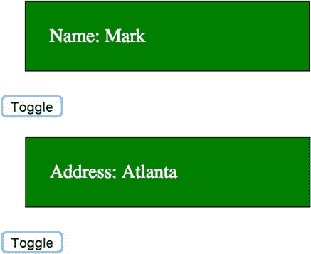
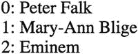
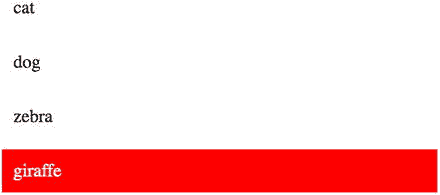
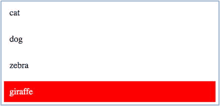

# 十一、指令简介

指令是 DOM 元素(如属性)上的标记，它告诉 Angular 将指定的行为附加到现有元素上。

自安古拉吉斯以来，指令就一直存在。它们使用起来相当复杂，尽管在 Angular 中使用起来要容易得多，尤其是在将数据传递到指令中的时候。指令曾经是在 AngularJS 应用中创建自定义标签的主要方式；现在它已经被指令和组件取代了。

Angular 本身提供了许多指令来帮助你编码。你也可以自己编码。

正如第 [8](08.html) 章所述，组件有三个主要元素:

*   注释为 Angular 提供了元数据，以便将所有部分组合成一个组件。
*   模板包含用于在浏览器中呈现组件的标记(通常是 HTML)。
*   该类包含组件的数据和代码。代码实现组件的预期行为。

如您所见，模板用于为组件的显示生成标记。该标记可以包括用于其他 Angular 组件的标签(或其他选择器)，从而允许从其他组件合成组件。这种标记还可以包括实现某些行为的指令。

例如，您可能有一个显示升级请求的升级详细信息的组件。但是，想要查看升级请求的人可能没有查看信息的权限，这意味着某些元素应该隐藏。您可以使用 Angular `ngIf`指令来评估用户的权限，并基于这些权限隐藏或显示元素。

## 指令的类型

现在我们知道组件模板使用指令，但是它们可能以不同的方式影响模板的输出。有些指令可能会完全改变模板输出的结构。这些指令可以通过添加和删除视图 DOM 元素来更改 DOM 布局。让我们称这些为结构指令。有些指令可能只是改变模板输出的项目的外观。让我们称这些为非结构化指令。

Angular 包括几个可供您在模板中使用的结构指令:

*   `NgIf`
*   `NgFor`
*   `NgSwitch`、`NgSwitchWhen`、`NgSwitchDefault`

Angular 还包括几个在模板中使用的非结构化指令:

*   `NgClass`
*   `NgStyle`
*   `NgControlName`
*   `NgModel`

### ngIf

这是您添加到标记中的元素的指令，通常是添加到类似于`div`的容器元素。如果`ngIf`的模板表达式为真，那么在绑定完成后，元素内部的内容将包含在视图 DOM 中。如果`ngIf`的模板表达式为 false，那么在绑定完成后，元素内部的内容将从视图 DOM 中排除。因此，`ngIf`指令用于包含或排除 UI 的元素，包括元素的子元素。被 ngIf 排除的标记不会是不可见的，它只是根本不在 DOM 中。

在本例中(指令-ex100)，我们在显示姓名和地址之间切换，如图 [11-1](#Fig1) 所示。



图 11-1

Toggling between name and address

让我们使用`ngIf`来隐藏和显示元素:

1.  使用 CLI 构建应用:使用以下命令:

    ```ts
    ng new directives-ex100

    ```

2.  开始`ng serve`:使用以下代码:

    ```ts
    cd directives-ex100
    ng serve

    ```

3.  打开应用:打开 web 浏览器并导航到 localhost:4200。你应该看到“欢迎使用 app！”
4.  编辑类:编辑 app.component.ts，修改为:

    ```ts
    import { Component } from '@angular/core';

    @Component({
      selector: 'app-root',
      templateUrl: './app.component.html',
      styles: ['div.box { width: 200px;padding:20px;margin:20px;border:1px solid black;color:white;background-color:green }']
    })
    export class AppComponent {
      showName: boolean = true;

      toggle(){
        this.showName = !this.showName;
      }
    }

    ```

5.  编辑模板:编辑 app.component.html，更改如下:

    ```ts
    <div *ngIf="this.showName" class="box">
      Name: Mark
    </div>
    <div *ngIf="!this.showName" class="box">
      Address: Atlanta
    </div>
    <button (click)="this.toggle()">Toggle</button>

    ```

### 为了什么

这是一个处理 iterable 对象的每一项的指令，为每一项输出一个标记。这被称为结构化指令，因为它可以通过添加和删除视图 DOM 元素来更改 DOM 布局。

`ndFor`对于生成重复的内容很有用，比如客户列表、下拉列表的元素等等。

iterable 的每个处理项在其模板上下文中都有可用的变量，如表 [11-1](#Tab1) 所示。

表 11-1

`ngFor` Variables

<colgroup><col align="left"> <col align="left"></colgroup> 
| 可变的 | 描述 |
| :-- | :-- |
| 项目本身 | 例子:`ngFor="#name of names"`。在这种情况下，项目具有变量`name`。 |
| `Index` | 每个模板上下文的当前循环迭代。 |
| `last` | 布尔值，指示该项是否是迭代中的最后一项。 |
| `even` | 指示此项是否有偶数索引的布尔值。 |
| `odd` | 指示此项是否有奇数索引的布尔值。 |

这将是示例指令-ex200，如图 [11-2](#Fig2) 所示。



图 11-2

`ngFor` showing a list

让我们使用`ngFor`来显示一个列表:

1.  使用 CLI 构建应用:使用以下命令:

    ```ts
    ng new directives-ex200

    ```

2.  开始`ng serve` :

    ```ts
    cd directives-ex200
    ng serve

    ```

3.  打开应用:打开 web 浏览器并导航到 localhost:4200。你应该看到“欢迎使用 app！”
4.  编辑类:编辑 app.component.ts，修改为:

    ```ts
    import { Component } from '@angular/core';

    @Component({
      selector: 'app-root',
      templateUrl: './app.component.html',
      styleUrls: ['./app.component.css']
    })
    export class AppComponent {
      names = [
        'Peter Falk', 'Mary-Ann Blige', 'Eminem'];
    }

    ```

5.  编辑模板:编辑 app.component.html，更改如下:

    ```ts
    <div *ngFor="let name of names; let i = index;">
      <div>{{i}}:&nbsp;{{name}}</div>
    </div>

    ```

### ngSwitch、ngSwitchWhen 和 ngSwitchDefault

`ngSwitch`是当 DOM 元素匹配`switch`表达式时添加或删除 DOM 元素的指令。它被称为结构化指令，因为它可以通过添加和删除视图 DOM 元素来更改 DOM 布局。

这将是示例指令-ex300，如图 [11-3](#Fig3) 所示。


图 11-3

`ngSwitch` hiding and showing elements

让我们根据您的选择使用`ngSwitch`来隐藏和显示元素:

1.  使用 CLI 构建应用:使用以下命令:

    ```ts
    ng new directives-ex300

    ```

2.  开始`ng serve`:使用以下代码:

    ```ts
    cd directives-ex300
    ng serve

    ```

3.  打开应用:打开 web 浏览器并导航到 localhost:4200。你应该看到“欢迎使用 app！”
4.  编辑类:编辑 app.component.ts，修改为:

    ```ts
    import { Component } from '@angular/core';

    @Component({
      selector: 'app-root',
      templateUrl: './app.component.html',
      styles: ['.block1 {background-color:#d5f4e6;margin:10px;padding:10px;}',
      '.block2 {background-color:#d5f4ff;margin:10px;padding:10px;}',
      '.block3 {background-color:#d5cce6;margin:10px;padding:10px;}']
    })
    export class AppComponent {
      selection = 'name';
      options = ['name','address','other'];
    }

    ```

5.  编辑模板:编辑 app.component.html，更改如下:

    ```ts
    <select [(ngModel)]="selection">
      <option *ngFor="let option of options">{{option}}</option>
    </select>
    <div [ngSwitch]="selection">
      <div class="block1" *ngSwitchCase="options[0]">name</div>
      <div class="block2" *ngSwitchCase="options[1]">address</div>
      <div class="block3" *ngSwitchDefault>other</div>
    </div>

    ```

6.  编辑模块:编辑 app.module.ts，修改为:

    ```ts
    import { BrowserModule } from '@angular/platform-browser';
    import { NgModule } from '@angular/core';
    import { FormsModule } from '@angular/forms'
    import { AppComponent } from './app.component';

    @NgModule({
      declarations: [
        AppComponent
      ],
      imports: [
        BrowserModule, FormsModule
      ],
      providers: [],
      bootstrap: [AppComponent]
    })
    export class AppModule { }

    ```

### ngClass

我们可以通过使用这个指令添加或删除类来改变 DOM 元素的外观。它的参数是一个对象，该对象包含下列对象对:

*   CSS 类名
*   一种表达

如果表达式为真，CSS 类名将被添加到目标 DOM 元素中，否则将被忽略。它不仅对设置 CSS 类有用。使用如下代码可能更容易:

```ts
<div [class]="classNames">Customer {{name}}.</div>

```

在下一个例子中，n `gClass`让用户单击动物列表中的动物来选择它。选定的动物以红色突出显示。这将是示例指令-ex400，如图 [11-4](#Fig4) 所示。



图 11-4

`ngClass` highlighting in a list

让我们来做指令示例-ex400:

1.  使用 CLI 构建应用:使用以下命令:

    ```ts
    ng new directives-ex400

    ```

2.  开始`ng serve`:使用以下代码:

    ```ts
    cd directives-ex400
    ng serve

    ```

3.  打开应用:打开 web 浏览器并导航到 localhost:4200。你应该看到“欢迎使用 app！”
4.  编辑类:编辑 app.component.ts，修改为:

    ```ts
    import { Component } from '@angular/core';
    @Component({
      selector: 'app-root',
      templateUrl: './app.component.html',
      styles: [
        '.selected { color: white; background-color:red; padding: 10px; margin: 10px }',
        '.unselected { background-color: white; padding: 10px; margin: 10px}'
        ]
    })
    export class AppComponent {
      selectedAnimal = 'cat';
      animals = ['cat', 'dog', 'zebra', 'giraffe'];

      onAnimalClicked(event:Event){
        const clickedAnimal = event.srcElement.innerHTML.trim();
        this.selectedAnimal = clickedAnimal;
      }
    }

    ```

5.  编辑模板:编辑 app.component.html，更改如下:

    ```ts
    <div *ngFor="let animal of animals">
      <div [ngClass]="{'selected': animal === selectedAnimal, 'unselected' : animal !== selectedAnimal}"
      (click)="onAnimalClicked($event)">{{animal}}</div>
    </div>

    ```

你的应用应该工作在本地主机:4200。

### ngStyle

这是用于设置元素的 CSS 样式的指令。如果您只想设置一种样式，使用如下代码可能更容易:

```ts
<div [style.fontSize]="selected ? 'x-large' : 'smaller'" >
  Some text.
</div>

```

但是如果你想设置多种风格，`ngStyle`是正确的选择。此指令需要一个计算结果为包含样式属性的对象的表达式。该表达式可以是如下所示的内联代码:

```ts
[ngStyle]="{'color': 'blue', 'font-size': '24px', 'font-weight': 'bold'}"

```

或者像这样的函数调用:

```ts
[ngStyle]="setStyles(animal)"

... later on in the class ...

setStyles(animal:String){
    let styles = {
      'width' : '50px'
    }
    return styles;
  }

```

它让用户点击动物列表中的动物来选择它。选中的动物以红色高亮显示，如图 [11-5](#Fig5) 所示。



图 11-5

`ngStyle` highlighting in a list

让我们做指令示例-ex500:

1.  使用 CLI 构建应用:使用以下命令:

    ```ts
    ng new directives-ex500

    ```

2.  开始`ng serve`:使用以下代码:

    ```ts
    cd directives-ex500
    ng serve

    ```

3.  打开应用:打开 web 浏览器并导航到 localhost:4200。你应该看到“欢迎使用 app！”
4.  编辑类:编辑 app.component.ts，修改为:

    ```ts
    import { Component } from '@angular/core';
    @Component({
      selector: 'app-root',
      templateUrl: './app.component.html'
    })
    export class AppComponent {
      selectedAnimal = 'cat';
      animals = ['cat', 'dog', 'zebra', 'giraffe'];

      onAnimalClicked(event:Event){
        const clickedAnimal = event.srcElement.innerHTML.trim();
        this.selectedAnimal = clickedAnimal;
      }

      getAnimalStyle(animal){
        const isSelected = (animal === this.selectedAnimal);
        return {
          'padding' : '10px',
          'margin' : '10px',
          'color' : isSelected ? '#ffffff' : '#000000',
          'background-color' : isSelected ? '#ff0000' : '#ffffff',
        }
      }
    }

    ```

5.  编辑模板:编辑 app.component.html，更改如下:

    ```ts
    <div *ngFor="let animal of animals">
      <div [ngStyle]="getAnimalStyle(animal)" (click)="onAnimalClicked($event)">{{animal}}</div>
    </div>

    ```

你的应用应该工作在本地主机:4200。

Note

Angular 还使用其他指令来处理表单。我将在后面的章节中介绍这些内容。

## 创建指令

指令和组件都是有 Angular 的对象，对应于标记中的元素，可以修改生成的用户界面。它们都有选择器。选择器用于标识与网页或模板中的标记相关联的组件或指令。对于组件，通常使用标签名——例如`CustomerList`。对于指令，通常使用一个标记属性名，它使用方括号——例如，`[tooltip]`。

指令和组件都有注释。指令有`@Directive`注释，组件有`@Component`注释。它们都有类，这些类可以通过构造函数以相同的方式使用依赖注入。

然而，整流罩和组件并不完全相同。例如，组件需要视图，而指令不需要。指令没有模板。没有用于呈现元素的捆绑 HTML 标记。

指令向现有 DOM 元素添加行为。例如，您可以为工具提示添加指令。您创建了指令，将指令选择器添加到 HTML 或使用它的模板中，它就交付了功能(您还需要添加导入)。

创建指令类似于创建组件:

1.  导入`Directive`装饰器。
2.  添加`@Directive`注释，包括一个 CSS 属性选择器(在方括号中),它将指令标识为一个属性。您还可以向`@Directive`注释添加其他元素，包括输入属性和主机映射。
3.  指定用于绑定的公共输入属性的名称(如果需要)。
4.  写`Directive`类。这个类将使用构造函数注入，并可能操作注入的元素和渲染器。
5.  将装饰器应用于将要使用它的组件或指令。

如前所述，指令是 DOM 元素(如属性)上的标记，它告诉 Angular 将指定的行为附加到现有元素上。这意味着我们需要一种方法来访问指令所应用到的 DOM 元素，以及修改 DOM 元素的方法。

Angular 为我们提供了两个非常有用的对象:`ElementRef`和`Renderer`。

*   通过`nativeElement`属性，`ElementRef`对象让您可以直接访问指令的 DOM 元素。小心使用`ElementRef`对象。允许直接访问 DOM 会使您的应用更容易受到 XSS 攻击。
*   `Renderer`对象给了我们许多帮助方法，使我们能够修改 DOM 元素。

我们可以把两者都注入到我们的课堂中。下面的代码通过构造函数接受`ElementRef`(允许您使用 DOM 元素的`nativeElement`属性访问 DOM 元素)和`Renderer`，并使每个变量成为私有实例变量:

```ts
constructor(private element: ElementRef, private renderer: Renderer) {
}

```

### 创建简单指令:示例指令-ex600

这是一个简单的指令，用于更改它所添加到的 HTML 元素的大小:

1.  使用 CLI 构建应用:使用以下命令:

    ```ts
    ng new directives-ex600

    ```

2.  导航到目录；使用以下代码:

    ```ts
    cd directives-ex600

    ```

3.  使用 CLI 创建指令:使用 CLI 创建文件并修改模块 app.module.ts:

    ```ts
    ng generate directive sizer

    ```

    这将生成一些文件，包括 sizer.directive.ts。
4.  编辑 sizer.directive.ts:将其改为:

    ```ts
    import { Directive, Input, Component, ElementRef, Renderer, |OnInit } from '@angular/core';

    @Directive({
      selector: '[sizer]'
    })
    export class SizerDirective implements OnInit {
      @Input() sizer : string;

      constructor(private element: ElementRef, private renderer: Renderer) {
      }

      ngOnInit() {
        this.renderer.setElementStyle(this.element.nativeElement, 'font-size', this.sizer);
      }
    }

    ```

    注意该指令如何在初始化后触发的`ngOnInit`方法中工作。如果您要将`setElementStyle`代码移动到构造函数中，这是可行的，因为`sizer`输入变量没有立即设置它的值——它是在 app 组件初始化时设置的。
5.  编辑模板:编辑 app.component.html，更改如下:

    ```ts
    <div sizer="72px">
      {{title}}
    </div>

    ```

6.  查看应用:打开 web 浏览器并导航到 localhost:4200。它应该显示“应用工程”在大文本。

你的应用应该工作在本地主机:4200。请注意如何使用渲染器来更新样式和更改大小。

## 在指令中访问 DOM 事件

我们可能还需要一种方法来访问链接到指令的元素的 DOM 事件。Angular 提供了不同的方法来访问这些事件。

### 使用指令元素宿主

这可用于指定与`host`元素相关的事件、动作、属性和特性。它可用于将事件绑定到类中的代码:

```ts
@Directive({
  selector: 'input',
  host: {
    '(change)': 'onChange($event)',
    '(window:resize)': 'onResize($event)'
  }
})
class InputDirective {
  onChange(event:Event) {
    // invoked when the input element fires the 'change' event
  }
  onResize(event:Event) {
    // invoked when the window fires the 'resize' event

  }
}

```

### 主机监听器

Angular `HostListener`是允许您将类中的方法绑定到 DOM 事件的注释:

```ts
@HostListener('mouseenter') onMouseEnter() {
  this.highlight('yellow');
}

@HostListener('mouseleave') onMouseLeave() {
  this.highlight(null);
}

private highlight(color: string) {
  this.el.nativeElement.style.backgroundColor = color;
}

```

## 在指令中访问 DOM 属性

您可能希望修改链接到指令的元素的属性。您可以使用元素`ref`来做到这一点。然而，还有另一种方法。您可以使用`@HostBinding`指令将元素的 DOM 属性绑定到 Angular 指令中的实例变量。然后您可以更新变量的值，DOM 属性将自动更新以匹配。

例如，在下面的代码中，您可以通过修改`backgroundColor`实例变量的值来控制元素的背景颜色:

```ts
@Directive({
    selector: '[myHighlight]',
})
class MyDirective {
  @HostBinding('style.background-color') backgroundColor:string = 'yellow';
}

```

## 创建带有事件的指令:示例指令-ex700

这是一个处理宿主事件的示例指令。主机事件映射到`host`元素中的 DOM 事件。当您需要一个指令来响应 DOM 上发生的事情时，它们很有用:

1.  使用 CLI 构建应用:使用以下命令:

    ```ts
    ng new directives-ex700

    ```

2.  导航到目录:使用此命令:

    ```ts
    cd directives-ex700

    ```

3.  使用 CLI 创建指令:使用 CLI 创建文件并修改模块 app.module.ts:

    ```ts
    ng generate directive hoverer

    ```

    这将生成一些文件，包括 hoverer.directive.ts。
4.  编辑 hoverer.directive.ts:改为如下:

    ```ts
    import { Directive, Input, ElementRef, Renderer } from '@angular/core';

    @Directive({
      selector: '[hoverer]',
      host: {
        '(mouseenter)': 'onMouseEnter()',
        '(mouseleave)': 'onMouseLeave()'
      }
    })

    export class HovererDirective {
      @Input() hoverer;

      constructor(
        private elementRef:ElementRef,
        private renderer:Renderer) { }

      onMouseEnter(){
        this.renderer.setElementStyle(
          this.elementRef.nativeElement, 'color', this.hoverer);
      }

      onMouseLeave(){
        this.renderer.setElementStyle(
          this.elementRef.nativeElement, 'color', 'black');
      }
    }

    ```

5.  编辑模板:编辑 app.component.html，更改如下:

    ```ts
    <h1 hoverer="red">{{title}}</h1>

    ```

6.  查看应用:打开 web 浏览器并导航到 localhost:4200。当你悬停在“欢迎使用应用！”上时，它应该会变成红色

你的应用应该工作在本地主机:4200。

## 摘要

学习完这一章后，你应该知道如何编写指令，并理解它们与组件的不同之处。

指令在被重用来向用户界面添加通用行为时非常有用。它们通常被放在共享模块中，以便可以跨应用重用。例如，您可以编写一个指令，根据用户的设置(或其他状态)在整个应用中启用或禁用按钮。该指令可以由元素属性指定。您可以将该指令添加到共享模块(或主模块)中，然后修改应用的模板以在按钮上包含该指令的属性。

我们暂时完成了指令。下一章回到组件，更详细地看它们。