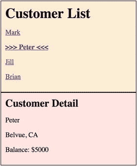

# 十五、路由和导航

在大多数 web 应用中，用户在执行应用任务时会从一个页面导航到下一个页面。用户可以通过以下方式导航:

*   在地址栏中输入 URL
*   跟随链接、点击按钮等等
*   在浏览器历史中后退或前进

在 Angular 应用中，用户可以以同样的三种方式导航，但他们是通过组件(Angular 应用的构建块)导航。我们可以导航，因为我们有角路由器。路由器可以将浏览器 URL 解释为导航到组件的指令，并将可选参数(包含信息)传递给组件，为其提供上下文信息，并帮助其决定要呈现的特定内容或需要做的事情。

我们可以将路由器绑定到页面上的链接，当用户单击链接时，它将导航到适当的组件。当用户点击一个按钮，从一个下拉菜单中选择，或者响应来自任何来源的其他刺激时，我们可以强制性地导航。

路由器将活动记录在浏览器的历史记录中，因此后退和前进按钮也可以工作。

## 客户端的路由器路由

任何包含#字符的 URL 都是片段 URL。#左边的 URL 部分标识可以访问的资源(从服务器)，右边的部分称为片段标识符，指定资源内的位置(在客户机上)。例如，在 URL [`www.cnn.com/index.html#section2`](http://www.cnn.com/index.html%23section2) 中，片段名是 section2，它指定了文档 index.html 中的一个位置。

片段的最初目的是允许用户跳转到当前页面指定部分的链接，向上或向下滚动。现在，片段经常用于客户端导航，因为从本质上讲，它们不会调用从服务器获取资源的请求。

HTML5 浏览器可以处理 URL 的客户端和非客户端路由，包括有哈希的和没有哈希的。但是一些老的浏览器不支持未经哈希处理的 URL 的客户端路由。散列意味着 URL 的客户端部分需要在#符号之后(也就是说，它是一个片段)。

如果您正在将单页面应用部署到生产环境中，您可能需要执行以下操作:

1.  在路由器上打开哈希路由。这将使您的单页应用与 HTML5 以前的浏览器更加兼容。当您在您的模块中导入路由器模块时，您应该执行以下操作:

    ```ts
    @NgModule({
      imports: [
        RouterModule.forRoot(appRoutes, {useHash: true})
      ],
      ...
    })
    export class ...

    ```

2.  确保您在服务器上的 404 页面重新路由到包含单页应用的网页(例如，index.html)。如果由于某种原因，浏览器试图错误地获取服务器资源，这将把页面返回到单页应用。

## 路由匹配

如果您在 web 浏览器的地址栏中指定了一个 URL，并且加载了 Angular 应用，路由器将尝试查找与该 URL 匹配的路由。它检查可能的路由组合的每一个排列，直到它匹配完整的 URL。如果有多条路由可能匹配同一个 url，路由器将使用第一条可用的路由，即使第二条路由看起来更完整。

## 路由器 DSL

指定路由时，可以使用文本字符串来指定，例如“/customers/123”。DSL 代表“领域特定语言”,使用该术语是因为您的路由文本字符串可以用多种方式解释和匹配。您的路由字符串可以指定:

*   绝对路由。
*   从你现在所在的位置出发的相对路由。
*   引用服务器资源的路由。
*   引用客户端资源的路由(使用片段 URL)。

“DSL”是一个令人生畏的术语，但是不要担心，我们将在这一章中介绍不同类型的路由，您将很快上手！

## 路由器模块

在开始使用组件路由器之前，您应该知道该模块包含在节点包依赖项中，但默认情况下不包含在 Angular CLI 项目中。应用模块中不包括路由。

但是，您可以通过在`ng`命令的末尾添加`--routing`参数来改变这种情况。例如:

```ts
ng new router-ex300 --inline-template --inline-style --routing

```

表 [15-1](#Tab1) 列出了路由器模块中的对象。表格中有许多对象，但不要担心，经过一些练习后，它们会变得更容易理解。

表 15-1

Objects in the Router Module

<colgroup><col align="left"> <col align="left"> <col align="left"></colgroup> 
| 目标 | 类型 | 描述 |
| :-- | :-- | :-- |
| `RouterModule` | 组件 | 一个独立的 Angular 模块，提供必要的服务提供者和在应用视图中导航的指令。 |
| `Router` |   | 显示活动 URL 的应用组件。管理从一个组件到下一个组件的导航。 |
| `Routes` |   | 定义一个路由数组，每个路由将一个 URL 路径映射到一个组件。 |
| `Route` |   | 定义路由器应该如何根据 URL 模式导航到组件。大多数管线由路径和元件类型组成。 |
| `RouterOutlet` | 管理的 | 标记路由器显示视图位置的指令(`<router-outlet>`)。 |
| `RouterLink` | 管理的 | 将可点击的 HTML 元素绑定到路由的指令。单击带有绑定到字符串或链接参数数组的`RouterLink`指令的元素会触发导航。 |
| `RouterLinkActive` | 管理的 | 当包含在元素上或元素内的相关联的`RouterLink`变为活动/非活动时，从 HTML 元素添加/移除类的指令。 |
| `ActivatedRoute` |   | 提供给每个路由组件的服务，包含路由特定的信息，如路由参数、静态数据、解析数据、全局查询参数和全局片段。 |
| `RouterState` |   | 路由器的当前状态，包括当前激活的路由树以及遍历路由树的便利方法。 |

## 简单路由:示例

这是一个披萨选择组件，它使用路由允许用户单击链接来显示不同类型的披萨，每种披萨都在自己的组件中。这个例子还展示了路由参数的使用:您可以使用`small`或`large`的`size`参数路由到`everything`比萨饼。图 [15-1](#Fig1) 所示。


图 15-1

Pizza selection

这是示例路由器-ex100:

1.  使用 CLI 构建应用:使用以下代码:

    ```ts
    ng new router-ex100 --routing --inline-template --inline-style

    ```

2.  开始`ng serve`:使用以下代码:

    ```ts
    cd router-ex100
    ng serve

    ```

3.  打开应用:打开 web 浏览器并导航到 localhost:4200。你应该看到“欢迎使用 app！”
4.  编辑路由类:编辑 app-routing.module.ts，修改为:

    ```ts
    import { NgModule } from '@angular/core';
    import { Routes, RouterModule } from '@angular/router';
    import { PepperoniComponent, EverythingComponent} from './app.component';

    const routes: Routes = [
      { path: '',
        redirectTo: '/pepperoni',
        pathMatch: 'full'
      },
      {
        path: 'pepperoni',
        component: PepperoniComponent
      },
      {
        path: 'everything/:size',
        component: EverythingComponent
      }
    ];

    @NgModule({
      imports: [RouterModule.forRoot(routes)],
      exports: [RouterModule]
    })
    export class AppRoutingModule { }

    ```

5.  步骤 5–编辑组件类编辑“app.component.ts”并将其更改为以下内容:

    ```ts
    import { Component } from '@angular/core';
    import { Router, ActivatedRoute, ActivatedRouteSnapshot} from '@angular/router';

    @Component({
      selector: 'pepperoni',
      template: `
        <h2>Pepperoni</h2>
        
      `,
      styles: []
    })
    export class PepperoniComponent {
    }

    @Component({
      selector: 'everything',
      template: `
        <h2>Everything</h2>
        Size:{{size}}
        
      `,
      styles: []
    })
    export class EverythingComponent {
      private size: String = '';
      constructor(private route: ActivatedRoute){
        route.params.subscribe(
          (params: Object) =>
          this.size = params['size']);
      }
    }

    @Component({
      selector: 'app-root',
      template: `
        <h1>
          Pizzas
        </h1>
        <a [routerLink]="['pepperoni']">Pepperoni</a>
        <a [routerLink]="['everything','small']">Everything Small</a>
        <a [routerLink]="['everything','large']">Everything Large</a>
        <router-outlet></router-outlet>
      `,
      styles: []
    })
    export class AppComponent {
      title = 'app';
    }

    ```

6.  编辑模块:编辑 app.module.ts，修改为:

    ```ts
    import { BrowserModule } from '@angular/platform-browser';
    import { NgModule } from '@angular/core';

    import { AppRoutingModule } from './app-routing.module';
    import { AppComponent, PepperoniComponent, EverythingComponent } from './app.component';

    @NgModule({
      declarations: [
        AppComponent,
        PepperoniComponent,
        EverythingComponent
      ],
      imports: [
        BrowserModule,
        AppRoutingModule
      ],
      providers: [],
      bootstrap: [AppComponent]
    })
    export class AppModule { }

    ```

你的应用应该工作在本地主机:4200。请注意以下几点:

*   文件 app-routing.module.ts 由 CLI 生成。它为路由定义了一个模块 AppRoutingModule。这个模块包含一个数据结构，该结构设置带有伴随组件的 URL。请注意第一个 URL 如何将默认 URL 映射到另一个 URL，并注意 EverythingComponent 的路径如何指定一个`size`参数。

    ```ts
    {
      path: 'everything/:size',
      component: EverythingComponent
    }

    ```

*   app.component.ts 文件包含所有组件。它使用`RouterLink`指令来修改链路，以便与 Angular 路由器一起工作。EverythingComponent 用于显示`everything`披萨，并可以接受一个`size`参数。注意它是如何订阅路由参数对象来接收参数更新的。如果用户从`everything`的一个尺寸切换到另一个尺寸，更新`size`参数，这是必要的。

    ```ts
    constructor(private route: ActivatedRoute){
        route.params.subscribe(
          (params: Object) =>
          this.size = params['size']);
      }

    ```

*   文件 app.module.ts 声明了所有组件，因此可以在 app 模块中访问它们。它还导入我们在 app.routing.module.ts 中设置的 AppRoutingModule。

## 嵌套路由:示例

嵌套路由意味着能够路由和导航到被导航到的其他组件内部的子组件。这在 Angular 中是完全可能的，正如你在这个例子中看到的。

嵌套路由链接 URL 具有多个“级别”，因为现在存在路由及其子级的层次结构，而不仅仅是路由。

这将是示例路由器-ex200，表 [15-2](#Tab2) 将本示例的 URL 与前一示例的 URL 进行了比较。

表 15-2

router-ex100 URLs vs. router-ex200 URLs

<colgroup><col align="left"> <col align="left"></colgroup> 
| 路由器-ex100 | 路由器-ex200 |
| :-- | :-- |
| /意大利香肠 | /意大利香肠 |
| /一切 | /其他/意大利面 |
| /其他/canzone |

这是另一个使用路由的披萨选择组件。但是，这一次它为“other”菜单和组件使用了嵌套路由。当您点击“其他”链接时，您可以从 pasta 或 calzone 的子菜单中进行选择，如图 [15-2](#Fig2) 所示。这些菜单项的显示由嵌套路由处理。


图 15-2

Pasta or calzone ?

让我们以路由器-ex200 为例:

1.  使用 CLI 构建应用:使用以下命令:

    ```ts
    ng new router-ex200 --routing --inline-template --inline-style

    ```

2.  开始`ng serve`:使用以下代码:

    ```ts
    cd router-ex200
    ng serve

    ```

3.  打开应用:打开 web 浏览器并导航到 localhost:4200。你应该看到“欢迎使用 app！”
4.  编辑路由类:编辑 app-routing.module.ts，修改为:

    ```ts
    import { NgModule } from '@angular/core';
    import { Routes, RouterModule } from '@angular/router';
    import { PepperoniComponent } from './app.component';
    import { OtherComponent } from './app.other-component';
    import { NestedPastaComponent, NestedCalzoneComponent } from './app.other-component';

    const routes: Routes = [
      {
        path: '',
        redirectTo: '/pepperoni',
        pathMatch: 'full'
      },
      {
        path: 'pepperoni',
        component: PepperoniComponent
      },
      {
        path: 'other',
        component: OtherComponent,
        children: [
          {
            path: '',
            redirectTo: 'pasta',
            pathMatch: 'full'
          },
          {
            path: 'pasta',
            component: NestedPastaComponent
          },
          {
            path: 'calzone',
            component: NestedCalzoneComponent
          }
        ]
      }
    ];

    @NgModule({
      imports: [RouterModule.forRoot(routes)],
      exports: [RouterModule]
    })
    export class AppRoutingModule {}

    ```

5.  编辑组件类:编辑 app.component.ts 并将其更改为:

    ```ts
    import { Component } from '@angular/core';
    import { Router, ActivatedRoute, ActivatedRouteSnapshot} from '@angular/router';

    @Component({
      selector: 'pepperoni',
      template: `
        <div>
          <h2>Pepperoni</h2>
          
        </div>
      `,
      styles: []
    })
    export class PepperoniComponent {
    }

    @Component({
      selector: 'app-root',
      template: `
        <div>
          <h1>
            Delivery Menu
          </h1>
          <a [routerLink]="['pepperoni']" routerLinkActive="router-link-active">Pepperoni Pizza</a>
          <a [routerLink]="['other']" routerLinkActive="router-link-active">Other Menu Items</a>
          <router-outlet></router-outlet>
        </div>
      `,
      styles: []
    })
    export class AppComponent {
      title = 'app';
    }

    ```

6.  创建其他组件:创建 app.other-component.ts 并将其更改为:

    ```ts
    import { Component } from '@angular/core';

    @Component({
      selector: 'pasta',
      template: `
        <div>
          <h2>Pasta</h2>
          
        </div>
      `,
      styles: []
    })
    export class NestedPastaComponent {
    }

    @Component({
      selector: 'calzone',
      template: `
        <div>
          <h2>Calzone</h2>
          
        </div>
      `,
      styles: []
    })

    export class NestedCalzoneComponent {
    }

    @Component({
      selector: 'other',
      template: `
        <div>
          <h2>Other Menu Items</h2>
          <a [routerLink]="['pasta']" routerLinkActive="router-link-active">Pasta</a>
          <a [routerLink]="['calzone']" routerLinkActive="router-link-active">Calzone</a>
          <router-outlet></router-outlet>
          <br/>
          <br/>
        </div>
      `,
      styles: []
    })
    export class OtherComponent {
    }

    ```

7.  编辑模块:编辑 app.module.ts，修改为:

    ```ts
    import { BrowserModule } from '@angular/platform-browser';
    import { NgModule } from '@angular/core';

    import { AppRoutingModule } from './app-routing.module';
    import { AppComponent, PepperoniComponent } from './app.component';
    import { OtherComponent, NestedCalzoneComponent, NestedPastaComponent } from './app.other-component';

    @NgModule({
      declarations: [
        AppComponent,
        PepperoniComponent,
        OtherComponent,
        NestedCalzoneComponent,
        NestedPastaComponent
      ],
      imports: [
        BrowserModule,
        AppRoutingModule
      ],
      providers: [],
      bootstrap: [AppComponent]
    })
    export class AppModule { }

    ```

8.  编辑样式:编辑 styles.css 并将其更改为以下内容:

    ```ts
    /* You can add global styles to this file, and also import other style files */
    img {
        width:200px;
        border: 1px solid #000000;
    }
    a {
        background-color: #0066CC;
        color: #ffffff;
        border: 1px solid #000000;
        padding: 10px;
        margin: 10px;
    }
    .router-link-active {
        background-color: #C14242;
    }
    div {
        border: 1px dotted #000000;
        margin: 10px;
        padding: 10px;
    }

    ```

你的应用应该工作在本地主机:4200。请注意以下几点:

*   文件 app-routing.module.ts 由 CLI 生成。它为路由定义了一个模块 AppRoutingModule。这个模块包含一个数据结构，该结构设置带有伴随组件的 URL。注意，这次数据结构包含子路由，使用了`children`属性:

    ```ts
    {
        path: 'other',
        component: OtherComponent,
        children: [
            {
            path: '',
            redirectTo: 'pasta',
            pathMatch: 'full'
            },
            {
            path: 'pasta',
            component: NestedPastaComponent
            },
            {
            path: 'calzone',
            component: NestedCalzoneComponent
            }
        ]
    }

    ```

*   文件 app.component.ts 用于定义 app 组件和意大利香肠组件(非嵌套)。它还包含非嵌套路由器链接和路由器出口，非嵌套组件被注入到其中。
*   app.other-component.ts 文件用于定义其他组件(非嵌套)以及 pasta 和 calzone 嵌套组件。另一个组件包含嵌套路由器链路和路由器出口，嵌套组件注入其中。
*   文件 app.module.ts 声明了所有组件，以便可以在 app 模块中访问它们。它还导入我们在 app.routing.module.ts 中设置的 AppRoutingModule。
*   文件 styles.css 声明了一些用于链接和选项卡效果的样式(我承认很糟糕)。注意如何在路由器链路上设置`routerLinkActive`样式来突出显示当前活动的链路(这适用于嵌套和非嵌套链路)。路由器链接:

    ```ts
    <a [routerLink]="['pepperoni']" routerLinkActive="router-link-active">Pepperoni Pizza</a>

    ```

    活动路由器链接的样式:

    ```ts
    .router-link-active {
        background-color: #C14242;
    }

    ```

## 路由配置

Angular 应用通过使用路由器服务的单个实例进行路由。导航时，路由器会尝试解析新位置的路由。要解析路由，必须为路由器配置路由。路由被配置为一组`route`对象。每个`route`对象都需要一个路径(来解析它),通常还需要一个组件，该组件将显示在路由器出口中，用于解析路由。路由对象还可以有更多的属性(稍后将详细介绍)。

您可以配置重定向到其他路径的路由路径。例如，以下代码将空路由重定向到意大利香肠路由。在空 URL 的情况下，我们还需要添加`pathMatch: 'full'`属性，这样 Angular 就知道它应该完全匹配空字符串，而不是部分匹配空字符串:

```ts
const routes: Routes = [
  {
    path: '',
    redirectTo: '/pepperoni',
    pathMatch: 'full'
  },
  ...
];

```

您还可以使用路径**添加一个总括路径，如果该 URL 与任何其他路径都不匹配，它将与该路径匹配:

```ts
const routes:Routes = [
    ...
    {path: '**', component: CatchAllComponent}
];

```

当您配置您的路由时，您使用一组`route`对象来配置它们。每个`route`对象可以有一个`data`属性，该属性包含其他属性，这些属性可以在以后由该路由的目标组件提取。

以下代码设置了一个包含数据的路由，包括一条“未找到”路径的消息:

```ts
{ path: '500', component: ErrorPageComponent, data: {message: 'Unexpected Server Error'}}

```

下面的代码访问该数据，因此它可以用于显示消息。要么这样:

```ts
this.errorMessage = this.snapshot.data['message'];

```

或者这个:

```ts
this.route.data.subscribe(
  (data: Data) => { this.errorMessage = data['message']; }
);

```

请注意，这允许您将同一组件用于不同的目的和不同的数据。例如，您还可以为路径 401 设置一个路由，该路由将重用错误页面组件，但这一次带有消息“未授权”

### 路由路径参数

您可以将数据参数作为 URL 路径的一部分传递给路由中的组件，例如 customer/123。

当您为接收参数的组件编写代码时，有两种不同的实现可供选择:

*   您可以从路由`snapshot`(路由的一次性快照)中读取参数。当您只路由到父组件中的子组件一次并且该参数从不改变时，这很有用:

    ```ts
    constructor(route: ActivatedRoute) {
      this.customerId = route.snapshot.paramMap.get('id');
    }

    ```

*   您可以通过订阅可观察的参数图来读取参数。当您路由到父组件中的子组件时，这是很有用的，并且当某些事情发生变化时，子组件可能会重新路由(被传递一个新参数:

    ```ts
    constructor(route: ActivatedRoute) {
      route.paramMap.subscribe(
        params => this.customerId = params.get('id')
      );
    }

    ```

### 路由查询参数:示例

您可以使用查询字符串将数据参数传递给路由中的组件，例如，customer？id=123。

这与路径参数的工作方式类似。当您为接收参数的组件编写代码时，有两种不同的实现可供选择:

*   您可以从路由快照中读取查询参数，这在路由到父组件中的子组件时非常有用，并且此参数永远不会改变:

    ```ts
    constructor(route: ActivatedRoute) {
      this.customerId = route.snapshot.queryParams['id'];
    }

    ```

*   您可以通过订阅一个可观察的查询参数映射来读取参数——这在路由到父组件中的子组件时非常有用，并且子组件可以在发生变化时重新路由:

    ```ts
    constructor(route: ActivatedRoute) {
      route.queryParams.subscribe(
        params => this.customerId = params.get('id')
      );
    }

    ```

本例是一个在顶部显示客户列表的组件，下面是所选客户的详细信息，如图 [15-3](#Fig3) 所示。这将是示例路由器-ex300。

1.  使用 CLI 构建应用:使用以下命令:

    ```ts
    ng new router-ex300 --routing --inline-template --inline-style

    ```

2.  开始`ng serve`:使用以下代码:

    ```ts
    cd router-ex300
    ng serve

    ```

3.  打开应用:打开 web 浏览器并导航到 localhost:4200。你应该看到“欢迎使用 app！”
4.  创建客户类:创建客户
5.  创建`CustomerService`类:创建 customerService.ts:

    ```ts
    import { Injectable } from '@angular/core';
    import { Customer } from './customer';

    @Injectable()
    export class CustomerService {
      private _customers: Array<Customer> = [
          new Customer(1, 'Mark', 'Atlanta', 'GA', 12000),
          new Customer(2, 'Peter', 'Belvue', 'CA', 5000),
          new Customer(3,'Jill', 'Colombia', 'SC', 2000),
          new Customer(4, 'Brian', 'Augusta', 'GA', 2000)
      ];

      get customers() {
        return this._customers;
      }

      getCustomerById(id: number){
        for (let i=0,ii=this._customers.length;i<ii;i++){
          const customer = this._customers[i];
          if (customer.id == id){
            return customer;
          }
        }
        return null;
      }
    }

    ```

6.  编辑 app 路由模块:编辑 app-routing.module.ts，修改为:

    ```ts
    import { NgModule } from '@angular/core';
    import { Routes, RouterModule } from '@angular/router';
    import { DetailComponent, PleaseSelectComponent } from './app.component';

    const routes: Routes = [
      {
        pathMatch: 'full',
        path: '',
        component: PleaseSelectComponent,
        children: []
      },
      {
        pathMatch: 'full',
        path: 'detail',
        component: DetailComponent,
        children: []
      }
    ];

    @NgModule({
      imports: [RouterModule.forRoot(routes)],
      exports: [RouterModule]
    })
    export class AppRoutingModule { }

    ```

7.  编辑 app 组件:编辑 app.component.ts，修改为:

    ```ts
    import { Component } from '@angular/core';
    import { ActivatedRoute } from '@angular/router';
    import { CustomerService } from './customerService';
    import { Customer } from './customer';

    @Component({
      selector: 'pleaseSelect',
      template: `
        <div>
        <h2>Please make a selection.</h2>
        </div>
      `,
      styles: ['div { background-color: #FFFFFF; padding: 10px; border: 1px solid #000000 }']
    })
    export class PleaseSelectComponent {
    }

    @Component({
      selector: 'detail',
      template: `
        <div>
        <h2>Customer Detail {{id}}</h2>
        <p>{{customer.name}}<p>
        <p>{{customer.city}}, {{customer.state}}</p>
        <p>Balance: &#36;{{customer.balance}}</p>
        </div>
      `,
      styles: ['div { background-color: #FFE4E1 }']
    })
    export class DetailComponent {
      customer: Customer;
      constructor(
        private customerService: CustomerService,
        private route: ActivatedRoute) {
          route.queryParams.subscribe(
            (queryParams: Object) =>
            this.customer = customerService.getCustomerById(queryParams['id']));
      }
    }

    @Component({
      selector: 'app-root',
      template: `
        <div>
        <h1>
          Customer List
        </h1>
        <p *ngFor="let customer of _customerService.customers">
          <a [routerLink]="['detail']" [queryParams]="{id: customer.id}" routerLinkActive="active">{{customer.name}}</a>
        </p>
        </div>
        <router-outlet></router-outlet>
      `,
      styles: ['div { background-color: #faebd7 }',]
    })
    export class AppComponent {
      constructor(private _customerService: CustomerService){
      }
    }

    ```

8.  编辑 app 模块:编辑 app.module.ts，修改为:

    ```ts
    import { BrowserModule } from '@angular/platform-browser';
    import { NgModule } from '@angular/core';

    import { AppRoutingModule } from './app-routing.module';
    import { AppComponent, DetailComponent, PleaseSelectComponent } from './app.component';
    import { CustomerService } from './customerService';
    import { Customer } from './customer';

    @NgModule({
      declarations: [
        AppComponent,
        DetailComponent,
        PleaseSelectComponent
      ],
      imports: [
        BrowserModule,
        AppRoutingModule
      ],
      providers: [CustomerService],
      bootstrap: [AppComponent]
    })
    export class AppModule { }

    ```

9.  编辑样式:编辑 styles.css 并将其更改为以下内容:

    ```ts
    div {
        padding: 10px; border: 1px solid #000000;
    }
    h1,h2 {
        margin: 0px;
    }
    .active {
        font-weight: bold;
    }
    .active::before {
        content: ">>> ";
    }
    .active::after {
        content: " <<<";
    }

    ```



图 15-3

List of customers and detail

你的应用应该工作在本地主机:4200。请注意以下几点:

*   文件 customer.ts 设置了`customer`类。
*   文件 customerService.ts 是注入到 app 组件和 Detail 组件中的服务。它包含一个客户列表，以及访问客户数据的方法。
*   app-routing.module.ts 文件为 Please Select 组件和 Detail 组件设置路由。
*   app.component.ts 文件设置组件。请注意它如何使用不同的语法来指定路由器链接的查询参数:

    ```ts
    <a [routerLink]="['detail']" [queryParams]="{id: customer.id}" routerLinkActive="active">{{customer.name}}</a>

    ```

*   文件 app.module.ts 声明所使用的组件，导入 app routing 模块，并将`CustomerService`类设置为 Detail 和 app 组件中客户依赖注入的提供者。
*   文件“styles.css”用于设置 h1、h2 和 div 标签的通用样式。

## 路由器命令式导航:示例

到目前为止，我们已经编写了代码，为用户提供了单击链接进行导航的能力。命令式导航是不同的。这不是生成链接；它只是告诉路由器去某个地方，在你的代码中执行导航。导航是一个异步事件；它不会锁定代码，直到完成。本节讨论的命令式导航方法在完成时返回一个`Promise`对象，这是一个对成功或失败的回调。这两种方法是`Router.navigate`和`Router.navigateByUrl`。要使用命令式导航，首先需要使用构造函数注入将路由器注入到您的类中。

*   `Router.navigate`:根据一组命令或路由元素，相对(相对于当前路由)或绝对导航到一个组件。它返回一个承诺，在导航完成时解决。它使用先前在路由器链路 DSL 格式中指定的链路 DSL。基本上和点击路由器链接一样。
*   `Router.navigateByUrl`:这导航到一个完整的绝对 URL 字符串。它返回一个承诺，在导航完成时解决。通常更喜欢用`navigate`导航，而不是这种方法，因为 URL 更脆弱。如果给定的 URL 以/开头，路由器将绝对导航。如果给定的 URL 不是以/开头，路由器将相对于该组件导航。

两种导航方法都返回一个承诺，这使用户能够添加两个回调方法来处理导航结果:第一个用于成功处理程序，第二个用于错误处理程序。下面的例子中就有这样的例子。两种导航方法都能够接受一个`NavigationExtras`对象的附加参数。此对象允许您将附加信息传递给路由器，以进一步指定所需的路由。

该组件允许用户在组件之间导航，也可以返回，如图 [15-4](#Fig4) 所示。它还记录导航完成的时间。这是示例路由器-ex400。


图 15-4

Navigating between components

让我们来看看这个例子:

1.  使用 CLI 构建应用:使用以下命令:

    ```ts
    ng new router-ex400 --routing --inline-template --inline-style

    ```

2.  开始`ng serve`:使用以下代码:

    ```ts
    cd router-ex400
    ng serve

    ```

3.  打开应用:打开 web 浏览器并导航到 localhost:4200。你应该看到“欢迎使用 app！”
4.  编辑路由模块:编辑 app-routing.module.ts，修改为:

    ```ts
    import { NgModule } from '@angular/core';
    import { Routes, RouterModule } from '@angular/router';
    import { AppComponent, Component1, Component2 } from './app.component';

    const routes: Routes = [
      {
        path: 'component1',
        component: Component1
      },
      {
        path: 'component2',
        component: Component2
      },
      {
        path: '**',
        component: Component1
      },
    ];

    @NgModule({
      imports: [RouterModule.forRoot(routes)],
      exports: [RouterModule]
    })
    export class AppRoutingModule { }

    ```

5.  编辑`Component`类:编辑 app.component.ts，修改为:

    ```ts
    import { Component } from '@angular/core';
    import { Router } from '@angular/router';
    import { Location } from '@angular/common';
    @Component({
      selector: 'component1',
      template: `
        <h1>
          {{title}}
        </h1>
        <router-outlet></router-outlet>
      `,
      styles: []
    })
    export class Component1 {
      title = 'Component 1';
    }

    @Component({
      selector: 'component2',
      template: `
        <h1>
          {{title}}
        </h1>
        <router-outlet></router-outlet>
      `,
      styles: []
    })
    export class Component2 {
      title = 'Component 2';
    }

    @Component({
      selector: 'app-root',
      template: `
        <h1>
          {{title}}
        </h1>
        <button (click)="component1()">Component 1</button>
        <button (click)="component2()">Component 1</button>
        <button (click)="back()"><- Back</button>
        <router-outlet></router-outlet>
      `,
      styles: []
    })
    export class AppComponent {
      title = 'App Component';
      constructor(private router: Router, private location: Location){}
      component1(){
        this.router.navigate(['component1']).then(result => { console.log("navigation result: " + result)});
      }
      component2(){
        this.router.navigateByUrl("/component2");
      }
      back(){
        this.location.back();
      }
    }

    ```

6.  编辑模块:编辑 app.module.ts，修改为:

    ```ts
    import { BrowserModule } from '@angular/platform-browser';
    import { NgModule } from '@angular/core';

    import { AppRoutingModule } from './app-routing.module';
    import { AppComponent, Component1, Component2 } from './app.component';

    @NgModule({
      declarations: [
        AppComponent,
        Component1,
        Component2
      ],
      imports: [
        BrowserModule,
        AppRoutingModule
      ],
      providers: [],
      bootstrap: [AppComponent]
    })
    export class AppModule { }

    ```

你的应用应该工作在本地主机:4200。请注意以下几点:

*   app 组件注入路由器和位置。
*   它包含当用户单击按钮时强制导航的代码。
*   它包含导航完成时触发的回调。
*   它还在后退按钮的位置包含代码。

## 路由器:提取数据

您可以从注入到您的类中的`Router`对象中提取表 [15-3](#Tab3) 中显示的信息。

表 15-3

Extracting Data from `Router`

<colgroup><col align="left"> <col align="left"></colgroup> 
| 财产 | 描述 |
| :-- | :-- |
| `errorHandler` | 导航出错时调用的错误处理程序 |
| `navigated` | 指示是否发生了至少一次导航 |
| `urlHandlingStrategy` | URL 处理策略 |
| `routeReuseStrategy` | 路由重用策略 |
| `routerState` | 当前路由器状态 |
| `url` | 当前 URL |
| `events` | 一个可观察的路由器事件，允许您向路由器事件添加回调 |

您通常使用配置对象来定义路由器路由，这一点不会改变。然而，您可以随时使用`resetConfig`方法将不同的配置对象重新加载到路由器中。如果您想从服务器或其他数据源加载路由，这将非常有用。

## 路由守卫:示例

路由使用户能够在应用中导航。有时，用户需要做一些事情才能被允许访问应用的某个部分，例如，登录。路由守卫可用于控制对某些路由的访问。

有两种主要类型的路由守卫:

*   用户能导航到一条路由吗？在这堂课上，你可以注入路由器。如果不允许用户导航到某个路由，这有助于将用户导航到另一个资源。
*   用户可以离开某条路由吗？对于提示保存更改非常有用。

该示例组件显示菜单链接。有些链接只有在用户登录后才能使用。这将是示例路由器-ex500:

1.  使用 CLI 构建应用:使用以下命令:

    ```ts
    ng new router-ex500 --routing --inline-template --inline-style

    ```

2.  开始`ng serve`:使用以下代码:

    ```ts
    cd router-ex500
    ng serve

    ```

3.  打开应用:打开 web 浏览器并导航到 localhost:4200。你应该看到“欢迎使用 app！”
4.  创建激活服务:创建 activate.service.ts 并将其更改为:

    ```ts
    import { Injectable } from '@angular/core';
    import { UserService } from './user.service';
    import { CanActivate } from '@angular/router';

    @Injectable()
    export class ActivateService implements CanActivate{
        constructor(private _userService: UserService){}
        canActivate() {
            return this._userService.authenticated;
      }
    }

    ```

5.  编辑路由模块:编辑 app.routing.module.ts，修改为:

    ```ts
    import { NgModule } from '@angular/core';
    import { Routes, RouterModule } from '@angular/router';
    import { AuthenticatedComponent, NonAuthenticatedComponent} from './app.component';
    import { UserService } from './user.service';
    import { ActivateService } from './activate.service';

    const routes: Routes = [
      {
        path: 'authenticated',
        component: AuthenticatedComponent,
        canActivate: [
          ActivateService
        ]
      },
      {
        path: '**',
        component: NonAuthenticatedComponent
      }
    ];

    @NgModule({
      imports: [RouterModule.forRoot(routes)],
      exports: [RouterModule],
      providers: [UserService, ActivateService]
    })
    export class AppRoutingModule { }

    ```

6.  编辑组件:编辑 app.component.ts，修改为:

    ```ts
    import { Component, ViewChild } from '@angular/core';
    import { UserService } from './user.service';

    @Component({
      selector: 'non-authenticated-component',
      template: `
        <div>
          <h2>Non-authenticated</h2>
          <p>This component can be accessed without authentication.</p>
        </div>
      `,
      styles: []
    })
    export class NonAuthenticatedComponent {
    }

    @Component({
      selector: 'authenticated-component',
      template: `
        <div>
          <h2>Authenticated</h2>
          <p>This component cannot be accessed without authentication.</p>
        </div>
      `,
      styles: []
    })
    export class AuthenticatedComponent {
    }

    @Component({
      selector: 'app-root',
      template: `
        <span *ngIf="!_userService.authenticated">
        User:<input type="input" #name />
        Password:<input type="input" #password />
        <input type="button" (click)="login()" value="Login" />"
        </span>
        <hr/>
        Authenticated:{{_userService.authenticated}}
        <hr/>
        <a [routerLink]="['non-authenticated']">Non-Authenticated</a>
        <a [routerLink]="['authenticated']">Authenticated</a>
        <router-outlet></router-outlet>
      `,
      styles: []
    })
    export class AppComponent {
      loggedIn: boolean = false;
      @ViewChild('name') name;
      @ViewChild('password') password;
      constructor(private _userService: UserService){}
      login(){
          this._userService.authenticate(
            this.name.nativeElement.value,
            this.password.nativeElement.value);
      }
    }

    ```

7.  编辑 app 模块:编辑 app.module.ts，修改为:

    ```ts
    import { BrowserModule } from '@angular/platform-browser';
    import { NgModule } from '@angular/core';

    import { AppRoutingModule } from './app-routing.module';
    import { AppComponent, AuthenticatedComponent, NonAuthenticatedComponent } from './app.component';
    import { UserService } from './user.service';

    @NgModule({
      declarations: [
        AppComponent,
        AuthenticatedComponent,
        NonAuthenticatedComponent
      ],
      imports: [
        BrowserModule,
        AppRoutingModule
      ],
      providers: [UserService],
      bootstrap: [AppComponent]
    })
    export class AppModule { }

    ```

8.  创建用户服务:创建 user.service.ts 并将其更改为:

    ```ts
    import { Injectable } from '@angular/core';

    @Injectable()
    export class UserService {
        private _authenticated: boolean = false;
        public get authenticated(): boolean{
            return this._authenticated;
        }
        public set authenticated(value: boolean){
            this._authenticated = value;
        }
        public authenticate(name, password){
            if ((name === 'user') && (password === 'password')){
                this._authenticated = true;
            }
        }
    }

    ```

你的应用应该工作在本地主机:4200。请注意以下几点:

*   服务 activate.service.ts 是一个路由保护，它允许或禁止路由被激活。调用`canActivate`方法:`true`允许激活，`false`不允许激活。该服务被注入到路由模块中，因此可以在路由配置中使用。
*   服务 user.service.ts 是一种跟踪用户状态的服务——无论他们是否经过身份验证。这个服务被注入到服务 activate.service.ts 和 app 组件中。

## 摘要

希望这一章会对你非常有用，你会用它来写你的 Angular 应用的路由。请记住，您的路由可能会变得非常复杂，可能会有多个路由器模块和路由器插座。您可以尝试将所有路由放在一个路由模块中，也可以尝试将其分散到多个模块中。一个路由模块可能更简单，但当开发人员不断地更改这个文件时，这可能会导致更多的合并冲突。请记住，您可以使用 route guards 来加强安全性，允许或阻止对各种组件的访问。

下一章将讨论反应式编程，以及 Angular 应用如何使用新技术来处理应用中的数据流。