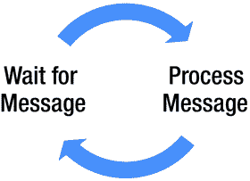

# 二十一、区域和变化检测

Angular 使用一个名为 Zone.js 的 JavaScript 模块，其目的是产生一个跨异步任务持续的执行上下文。目前，浏览器 DOM 和 JavaScript 的异步活动数量有限，比如 DOM 事件、承诺和服务器调用。Zone.js 可以拦截这些活动，并在异步活动完成之前和之后让您的代码有机会采取行动。当您需要查看与该任务相关的所有信息时，尤其是发生错误时，这非常有用。

某些事情会导致变化，例如:

*   一个 DOM 事件:例如:有人点击了某个东西。
*   通信:示例:浏览器从服务器获取数据。
*   定时器事件发生:例如:每 10 秒刷新一次。

当处理模型视图控制器(MVC)时，记住模型就是数据，视图显示模型中的数据。

Angular 中变更检测的目的是寻找模型中的变更，并确保视图(即 DOM)与它保持同步。变更检测可能会变得复杂，因为它需要在代码运行时确定何时需要重绘视图。

下面是更改模型的一些代码的示例。对服务器进行 HTTP 调用，并返回数据。模型中的客户列表被更新。所以现在这个变化需要 Angular 来检测，UI 需要刷新:

```ts
@Component()
class App implements OnInit{
  customers:Customer[] = [];
  constructor(private http: Http) {}
  ngOnInit() {
    this.http.get('/customers)
      .map(res => res.json())
      .subscribe(customers => this.customers = customers);
  }
}

```

Angular 是如何知道某些东西可能已经改变了，并且它应该寻找改变的呢？因为`NgZone`告诉它！

## NgZone 是 Angular 的 Zone.js

`NgZone`类是 zone.js 框架的包装器。依赖注入器也可以通过构造函数注入传入区域。

### 事件循环和消息

JavaScript 有一个基于事件循环的并发模型。JavaScript 运行时包含一个消息队列，它是要处理的消息的列表。消息从队列中取出，由浏览器 UI 线程处理。所以，浏览器基本上是在一个循环中工作，拾取和处理消息来做事，如图 [21-1](#Fig1) 所示。



图 21-1

Event loop

### 浏览器 UI 线程

浏览器 UI 线程是通过运行事件循环代码、处理消息来更新用户界面的单个线程。在处理下一条消息之前，每条消息都被完全处理。只有一个线程用于更新用户界面(用户查看的文档)。如果浏览器 UI 线程过载，浏览器会向用户显示如图 [21-2](#Fig2) 所示的消息(或类似的消息)。


图 21-2

Browser UI thread is overloaded

### 猴子补丁

使用`NgZone` /Zones.js，系统 JavaScript 代码被“打了猴子补丁”(当它必须这样做时)，以便它挂钩到事件循环代码，查看正在处理的消息发生了什么。这使它能够提供有关区域中发生的事件或调用的代码的附加信息，例如，异步服务器调用完成。

Note

猴子补丁是程序在本地扩展或修改支持系统软件的一种方式。就 Angular 和 Zone.js 而言，Zone 将在必要时对 JavaScript 核心代码进行猴子式修补，以便提供执行信息。

`NgZone`发出`onTurnStart`和`onTurnEnd`事件，通知观察者某事即将发生和某事已经发生。

Angular 使用`NgZone`来寻找需要变化检测的事件。在核心 Angular 代码中，Angular 监听`NgZone onTurnDone`事件。当此事件触发时，Angular 对模型执行更改检测并更新 UI。

## Angular 和变化检测

正如我以前说过的，Angular 应用是由多个类似乐高积木的组件构建而成的，具有树状层次结构。您有主应用组件，然后您有子组件，等等。

图 [21-3](#Fig3) 展示了组件 UI，图 [21-4](#Fig4) 展示了组件树。


图 21-4

Component tree


图 21-3

Component UI

每个 Angular 分量都有自己的变量变化检测器。您看不到它发生，但是 Angular 在运行时会创建变化检测器类。因此，如果你有一个组件树，那么你就有一个变化检测器树。核心 Angular code 自下而上扫描树中的变化(调用每个变化检测器)以查看发生了什么变化。

Note

可变对象可以改变。不可变对象不能。显然，当变化检测运行在没有变化的对象上时，它会更快。如果你想让你的 Angular 代码运行得更快，开始考虑使用不可变对象来处理那些不会改变的东西。

我们知道`NgZone`用于检测 Angular 变化。`NgZone`是一个对我们(以及系统 Angular 代码)有用的类，因为它允许我们在 Angular 区域内部或外部运行异步进程。

在 Angular 区域内运行方法时:

*   他们更新了 Angular UI。
*   他们跑得更慢。

当我们需要进行变更检测并需要不断更新 UI 时，我们在 Angular 区域内运行异步流程。为了在 Angular 区域内运行异步流程，我们在注入的`NGZone`对象中调用了`run`方法，并传入了`process`函数。

在 Angular 区域之外运行方法时:

*   他们不更新 Angular UI。
*   他们跑得更快。

当我们不需要发生变化检测并且不希望 UI 不断更新时，我们在 Angular 区域之外运行异步流程。这可能看起来没有必要，但是当需要终极性能时，应该考虑这一点。为了在 Angular 区域之外运行异步流程，我们在注入的`NgZone`对象中调用`runOutsideAngular`方法，并传入`process`方法。

## 在 Angular 区域内运行异步代码:示例

此示例基于默认的 Angular TypeScript Plunker 应用。app.ts 文件如图 [21-5](#Fig5) 所示。


图 21-5

Running asynchronous code within the Angular zone

让我们看一下这个例子:

1.  导入`NgZone`。
2.  使用构造函数注入来注入`NgZone`的一个实例。
3.  该方法由 Count 按钮触发，该按钮使用注入的`NgZone`运行`initiateCount`方法。注意，它调用方法`run`在注入的 Angular 区域内运行该方法。
4.  方法`initiateCount`和`updateCount`使用时间间隔计时器，以异步任务的形式生成控制台日志。当计数器超过 1000 时，它们更新计数器并结束计数。

当你运行这个应用并点击计数按钮时，你会看到计数器更新 1，2，3，4 …一直到 1000，然后出现警报。用户界面显示计数。这是因为计数是在 Angular 区域内的函数中执行的，用`NgZone`观察事件并引起变化检测。变化检测检测到`count`变量发生了变化，更新 UI，如图 [21-6](#Fig6) 所示。


图 21-6

`count` variable updates the UI

## 在 Angular 区域外运行异步代码:示例

此示例也基于默认的 Angular TypeScript Plunker 应用。app.ts 文件如图 [21-7](#Fig7) 所示。

1.  导入`NgZone`。
2.  使用构造函数注入来注入`NgZone`的一个实例。
3.  此方法由计数按钮触发。它使用注入的`NgZone`运行`initiateCount`方法。注意，它调用方法`runOutsideAngular`在注入的 Angular 区域之外运行该方法。
4.  方法`initiateCount`和`updateCount`使用时间间隔计时器，以异步任务的形式生成控制台日志。当计数器超过 1000 时，它们更新计数器并结束计数。


图 21-7

Running asynchronous code outside the Angular zone

当您运行此应用并单击 Count 时，您看不到计数器发生变化。用户界面显示计数为 0，直到报警出现，如图 [21-8](#Fig8) 所示。这是因为计数是在 Angular 区域之外的函数中执行的，而没有`NgZone`观察事件并引起变化检测。注意到它有多快了吗？


图 21-8

`count` variable not updated until alert

## 摘要

本章试图介绍 Angular 的一些内部工作方式。它并不打算涵盖这个主题的每一个细节——那将需要许多章节。

这一章(简要地)介绍了不变性的概念，这是你需要知道的，特别是如果你将来要做函数式编程的话。不变性是对象一旦被创建就不能被修改的概念。作为开发人员，您需要考虑尽可能使用不可变对象，因为它们有很多好处:

*   它们简化了编码(因为移动的部分更少)，你知道对象不会改变值。
*   它们与 Angular 变化检测算法一起工作得更好。
*   当您尽可能地限制应用中可以更改对象的方式时，您可以使代码更简单，并对正在更改的内容保持更多的控制。
*   它们最大限度地减少了当对象变异时有时会出现的副作用。
*   它们在多线程下工作得更好。

下一章将介绍测试你的 Angular 代码。