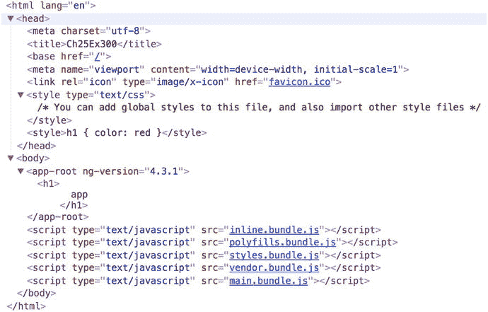

# 二十三、更多高级主题

本章集中介绍了几个更高级的 Angular 主题。

## 查看封装

还记得如何使用`@Component`注释的`styles`或`styleUrls`属性将样式应用于组件吗？“封装”一词的意思是“将某物装入或好象装入胶囊中的动作。”

Angular 视图封装与 Angular 使用何种方法将这些样式(应用了`styles`或`styleUrls`属性的样式)与组件封装在一起有关。

为什么需要视图封装？当您使用`styles`或`styleUrls`属性来样式化一个组件时，Angular 将样式代码添加到 HTML 文档的`head`部分的`style`标签中。那很好，但是你需要注意一些事情。如果在不同的组件中有冲突的 CSS 样式规则会发生什么？如果(例如)一个组件中有`.h2 {color:red}`而另一个组件中有`.h2 {color:green}`呢？

如果你的组件使用的是影子 DOM(或者模拟的影子 DOM ),你不需要担心这些冲突的样式。您可能正在使用一个阴影 DOM(或者至少是一个模拟的阴影 DOM ),因为这是 Angular 4 默认提供给您的。

但是，您需要了解影子 DOM，因为如果您的组件没有使用影子 DOM(或模拟的影子 DOM)，那么这些冲突的样式可能会让您头疼。

## 影子穹顶

一段时间以来，浏览器的范围一直是个问题。开发人员已经能够轻松地对 HTML 文档进行全面的全局更改，几乎不需要做什么工作。他们可以添加几行 CSS 并立即影响许多 DOM 元素。这很强大，但是会使组件的样式很容易被覆盖或意外破坏。

影子 DOM 是 web 上一个新出现的标准。影子 DOM 可以在大多数浏览器上工作(除了 Internet Explorer)。Shadow DOM 背后的思想是让开发人员可以选择用他们自己的独立 DOM 树创建组件，这些组件与其他组件分开封装，包含在主机元素中。这使得开发人员可以将样式“限定”在不会影响文档其余部分的单个组件上。

当你写一个组件时，你不需要使用影子 DOM，但是它是一个选项，你可以使用`@Component`注释的`encapsulation`选项来控制。

## 组件封装

`@Component`注释的`encapsulation`选项让开发人员可以控制视图封装的级别——换句话说，是否实现影子 DOM。表 [23-1](#Tab1) 显示了该选项的三种变化。

表 23-1

Encapsulation Option

<colgroup><col align="left"> <col align="left"></colgroup> 
| [计]选项 | 描述 |
| :-- | :-- |
| `ViewEncapsulation.Emulated` | 模拟阴影 DOM，Angular 的默认模式 |
| `ViewEncapsulation.Native` | 原生阴影 DOM |
| `ViewEncapsulation.None` | 一点影子都没有 |

### 查看封装。仿真:示例

让我们创建一个带有样式的示例组件，并将`ViewEncapsulation`指定为`Emulated`。这是 Angular 的默认模式。这将是高级示例-ex100:

1.  使用 CLI 构建应用:使用以下命令:

    ```ts
    ng new advanced-ex100 --inline-template --inline-style

    ```

2.  开始`ng serve`:使用以下代码:

    ```ts
    cd advanced-ex100
    ng serve

    ```

3.  打开应用:打开 web 浏览器并导航到 localhost:4200。你应该看到“应用工作！”
4.  编辑组件:编辑 app.component.ts 文件，将其更改为:

    ```ts
    import { Component, ViewEncapsulation } from '@angular/core';

    @Component({
      selector: 'app-root',
      template: `
        <h1>
          {{title}}
        </h1>
      `,
      styles: ['h1 { color: red }'],
      encapsulation: ViewEncapsulation.Emulated
    })
    export class AppComponent {
      title = 'app';
    }

    ```

该应用应该工作，并以红色显示单词 app。图 [23-1](#Fig1) 为该文件。


图 23-1

`ViewEncapsulation.Emulated`

如您所见，样式被写入文档的`head`。Angular 还重写了我们的组件风格，为`style`和组件都添加了一个标识符，以将两者链接在一起，并避免与具有其他标识符的其他组件发生冲突。在这种情况下，标识符是`_ngcontent-c0`。

### 查看封装。本地:示例

让我们创建一个带有样式的示例组件，并将`ViewEncapsulation`指定为`Native`。这将是高级示例-ex200:

1.  使用 CLI 构建应用:使用以下命令:

    ```ts
    ng new advanced-ex200 --inline-template --inline-style

    ```

2.  开始`ng serve`:使用以下代码:

    ```ts
    cd advanced-ex200
    ng serve

    ```

3.  打开应用:打开 web 浏览器并导航到 localhost:4200。你应该看到“应用工作！”
4.  编辑组件:编辑 app.component.ts 文件，将其更改为:

    ```ts
    import { Component, ViewEncapsulation } from '@angular/core';

    @Component({
      selector: 'app-root',
      template: `
        <h1>
          {{title}}
        </h1>
      `,
      styles: ['h1 { color: red }'],
      encapsulation: ViewEncapsulation.Native

    })
    export class AppComponent {
      title = 'app';
    }

    ```

该应用应该工作，并以红色显示单词 app。图 [23-2](#Fig2) 为文档。


图 23-2

`ViewEncapsulation.Native`

样式不再被写到文档的`head`中，而是被写到组件的影子 DOM 中。要查看此输出，必须在浏览器中打开显示阴影 DOM。现在很容易看到您的样式是如何只应用于组件的，该组件驻留在主机元素`app-root`中。

### 查看封装。无:示例

现在让我们创建一个带有样式的示例组件，并将`ViewEncapsulation`指定为`None`。这将是高级示例-ex300:

1.  使用 CLI 构建应用:使用以下命令:

    ```ts
    ng new advanced-ex300 --inline-template --inline-style

    ```

2.  开始`ng serve`:使用以下代码:

    ```ts
    cd advanced-ex300
    ng serve

    ```

3.  打开应用:打开 web 浏览器并导航到 localhost:4200。你应该看到“应用工作！”
4.  编辑组件:编辑 app.component.ts 文件，将其更改为:

    ```ts
    import { Component, ViewEncapsulation } from '@angular/core';

    @Component({
      selector: 'app-root',
      template: `
        <h1>
          {{title}}
        </h1>
      `,
      styles: ['h1 { color: red }'],
      encapsulation: ViewEncapsulation.None
    })
    export class AppComponent {
      title = 'app';
    }

    ```

该应用应该工作，并以红色显示单词 app。图 [23-3](#Fig3) 为文档。



图 23-3

`ViewEncapsulation.None`

该样式被写入文档的头部，并且该样式应用于整个文档，可能与来自其他组件的其他样式相冲突。小心这种模式。

Angular 为您提供了两个世界中最好的东西:将封装视为默认设置，并且能够共享样式。即使您没有将`encapsulation`规范添加到`@Component`注释中，您的特定于组件的样式也会受到保护。

如果需要在组件中共享样式，可以在`@Component`注释中使用`styleUrls`规范来指定共享的公共样式文件。

## 样式内容子项

还记得如何使用`@Component`注释的`styles`或`styleUrls`属性将样式应用于组件吗？这些样式仅适用于组件自身模板中的 HTML。如果您从服务器获取 HTML 内容，并将这些内容动态注入到您的组件中，会发生什么呢？你是怎么设计的？

答案是使用特殊的样式标签将样式应用于组件及其子元素(例如，来自服务器的 HTML 内容)。例如，以下样式规则对组件及其子元素中的所有`h3`元素进行样式化:

```ts
:host /deep/ h3 { font-style: italic; }

```

## 摘要

本章介绍了视图封装的概念，并讨论了如何在 Angular 中实现它。这听起来可能不是很重要，但是你应该知道它，因为它会影响你如何编写你的 CSS 样式。

我们快到终点了。最后一章是关于不同的 Angular 资源，可以在未来进一步提高你的 Angular 技能。