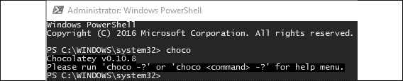
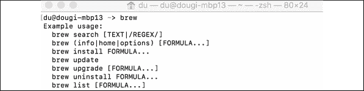
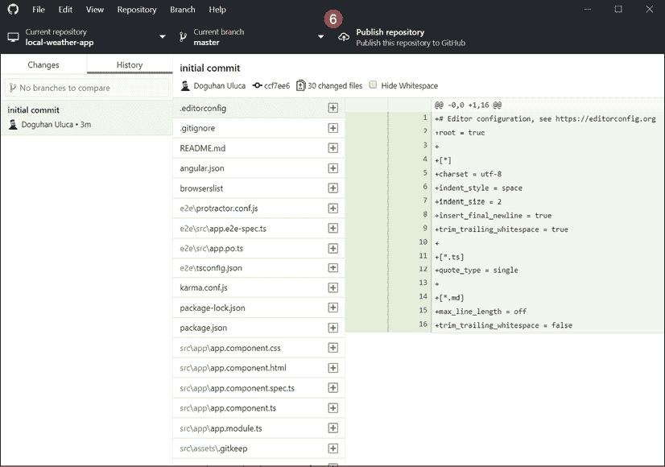
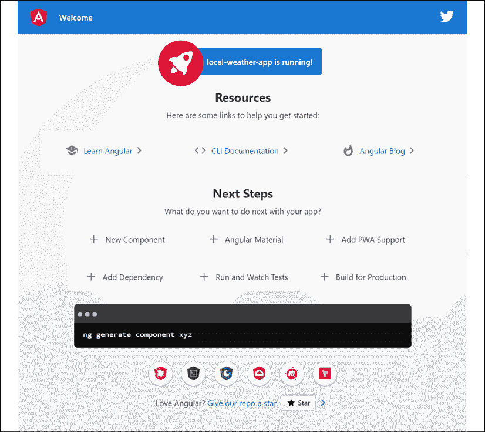
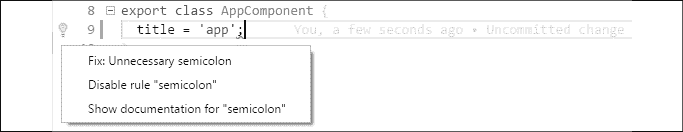

# 二、设置开发环境

本章将演示您和您的团队成员如何创建一个一致的开发环境，从而使您的整个团队都拥有同样出色的 web 开发体验，这一点的重要性在本书的前言中得到了强调。对于初学者来说，创建正确的开发环境是很困难的，这对于无挫折的开发体验是必不可少的。对于经验丰富的开发人员和团队来说，实现一致且最小的开发环境仍然是一个挑战。一旦实现，这样的开发环境有助于避免许多与 IT 相关的问题，包括持续的维护、许可和升级成本。

有关安装 GitHub Desktop、Node.js、Angular CLI 和 Docker 的说明，以及如何自动化和确保开发环境正确一致配置的策略，对于从绝对初学者到经验丰富的团队来说，都是非常有用的参考。

如果您已经建立了一个健壮的开发环境，请随意跳过本章；但是，请注意，本章中声明的一些环境假设可能会导致后面章节中的某些说明不适用于您。如果您遇到问题或需要帮助同事、学生或朋友设置他们的开发环境，请返回本章作为参考。设置开发环境的自动安装脚本可在[中找到 https://github.com/duluca/web-dev-environment-setup](https://github.com/duluca/web-dev-environment-setup) 。

为了充分利用本书，您应该熟悉 JavaScript ES2015+、前端开发基础知识和 RESTful API。

推荐的操作系统是带有 PowerShell v7+的 Windows 10 Pro v1903+或带有终端（Bash 或 Oh My Zsh）的 macOS Sierra v10.15+。本书中推荐的大多数软件也适用于 Linux 系统，但您的体验可能因您的特定设置而异。

开发人员在开发 web 应用时使用 Google Chrome 80+是标准做法。但是，您也可以使用基于 Chromium 的 Microsoft Edge browser 80+。您必须从[开始在 Windows 上安装跨平台 PowerShellhttps://github.com/PowerShell/PowerShell/releases](https://github.com/PowerShell/PowerShell/releases) ，您可以访问连锁经营者`&&`和`||`。此外，从 Microsoft 应用商店购买新的 Windows 终端，在 Windows 上获得卓越的命令行体验。

在本章中，您将学习如何执行以下操作：

*   使用 CLI 软件包管理器 Chocolate 和 Homebrew 安装和更新软件
*   使用这些包管理器安装 GitHub、Node.js 和其他基本程序
*   使用脚本来使用 PowerShell 或 Bash 自动化安装
*   使用 Angular CLI 生成 Angular 应用
*   使用自动化工具实现一致的跨平台开发环境

首先，让我们了解一下可用于安装开发工具的基于 CLI 的软件包管理器。在下一节中，您将看到使用 CLI 与单个安装程序进行比较的方法。自动化 CLI 工具要容易得多，这使得安装和维护任务可重复且快速。

# CLI 包管理器

通过**图形用户界面**（**GUI**）安装软件速度慢，且很难实现自动化。作为一名全栈开发人员，无论您是 Windows 还是 Mac 用户，都必须依靠**命令行界面**（**CLI**）软件包管理器来高效地安装和配置您所依赖的软件。

请记住，任何可以表示为 CLI 命令的操作都可以自动化。

## 为 Windows 安装 Chocolate

Chocolate 是一款基于 CLI 的 Windows 软件包管理器，可用于自动软件安装。要在 Windows 上安装 Chocolate，您需要运行提升的命令 shell：

1.  启动**开始**菜单
2.  开始输入`PowerShell`
3.  搜索结果应该是**Windows PowerShell 桌面应用**
4.  右键点击**Windows PowerShell**并选择**以管理员身份运行**
5.  触发**用户账号控制**（**UAC**警告；选择**是**继续
6.  执行在[找到的安装命令 https://chocolatey.org/install **PowerShell**中的](https://chocolatey.org/install)安装巧克力套餐管理器：

    ```ts
    PS> Set-ExecutionPolicy Bypass -Scope Process -Force; [System.Net.ServicePointManager]::SecurityProtocol = [System.Net.ServicePointManager]::SecurityProtocol -bor 3072; iex ((New-Object System.Net.WebClient).DownloadString('https://chocolatey.org/install.ps1')) 
    ```

7.  通过执行`choco`验证您的巧克力安装
8.  您应该会看到与以下屏幕截图中所示类似的输出：



图 2.1：巧克力的成功安装

所有后续的巧克力命令也必须从提升的命令外壳执行。或者，也可以在不需要提升的命令 shell 的非管理员设置中安装 Chocolate。但是，这会导致非标准且不太安全的开发环境，并且通过该工具安装的某些应用可能仍然需要升级。

Scoop 是巧克力的替代品，它提供了更像 Unix 的体验。如果您喜欢 Unix 风格的工具和命令，您可以在[安装 Scoophttps://scoop.sh/](https://scoop.sh/) 或通过执行：

```ts
$ iwr -useb get.scoop.sh | iex 
```

有关巧克力的更多信息，请参阅[https://chocolatey.org/install](https://chocolatey.org/install) 。

## 为 macOS 安装自制软件

Homebrew 是一款基于 CLI 的 macOS 软件包管理器，可用于自动化软件安装。要在 macOS 上安装 Homebrew，您需要运行命令 shell：

1.  使用+`Space`启动聚光灯搜索
2.  输入`terminal`
3.  在终端中执行以下命令安装自制软件包管理器：

    ```ts
    $ /usr/bin/ruby -e "$(curl -fsSL https://raw.githubusercontent.com/Homebrew/install/master/install)" 
    ```

4.  通过执行`brew`验证您的自制软件安装
5.  您应该会看到与以下类似的输出：



图 2.2：成功安装自制软件

1.  要启用对附加软件的访问，请执行以下命令：

    ```ts
    $ brew tap caskroom/cask 
    ```

在 macOS 上，如果在安装 brew 软件包时遇到与 chown'ing`/usr/local`相关的权限问题，则需要执行`sudo chown -R $(whoami) $(brew --prefix)/*`命令。此命令恢复 brew 软件包的用户级所有权，这比广泛的超级用户/`su`级访问更安全。

欲了解更多信息，请查看[https://brew.sh/](https://brew.sh/.) 。

# 安装开发工具

在本节中，您将安装开始开发 web 应用所需的所有开发工具。Git 和 GitHub Desktop 在您的机器上建立一个源代码存储库，允许您将代码与远程存储库同步。Node.js 是您电脑上的一个 JavaScript 运行时，它与**节点包管理器**或**npm**一起提供。Npm 管理包括 Angular 在内的第三方源代码。Visual Studio 代码是一个**集成开发环境**或**IDE**。

要自动安装本书所需的所有 web 开发工具，请对操作系统执行以下命令以配置环境。

在 Windows PowerShell 上，执行：

```ts
PS> Install-Script -Name setup-windows-dev-env
PS> setup-windows-dev-env.ps1 
```

在 MacOS 终端上，执行：

```ts
$> bash <(wget -O - https://git.io/JvHi1) 
```

有关更多信息，请参阅[https://github.com/duluca/web-dev-environment-setup](https://github.com/duluca/web-dev-environment-setup) 。

一旦安装了 IDE，就可以开始开发了。本节还包含安装 Docker（一个轻量级容器化平台）和配置各种云服务的说明。这些工具将在后面的章节中介绍。如果你想更快的开始你的 Angular 冒险，你现在可以跳过它们。

## Git 和 GitHub 桌面

本节旨在建立一个适用于最广泛受众的最佳实践 Git 配置。为了充分利用本节和本书后续章节，我假定您已满足以下先决条件：

*   了解什么是源代码管理和 Git
*   在[GitHub.com](http://GitHub.com )上创建的免费帐户

### 为什么要使用 GitHub？

如果您是 Git 用户，那么您也可能使用在线存储库，如 GitHub、Bitbucket 或 GitLab。每个存储库都有一个免费的开源项目层，再加上具有不同功能集的健壮网站，包括您可以付费的内部企业选项。GitHub 在 2016 年托管了 3800 多万个存储库，是目前最受欢迎的在线存储库。它被广泛认为是一个基线实用程序，社区从不离线。

随着时间的推移，GitHub 添加了许多丰富的功能，使其从一个单纯的存储库转变为一个在线平台。在本书中，我将参考 GitHub 的特性和功能，以便您可以利用其功能来改变开发、维护和发布软件的方式。

### 为什么要使用 GitHub 桌面？

Git CLI 工具确实很强大，如果您坚持使用它，您会很好。然而，我们全栈开发人员担心各种各样的问题。在匆忙完成手头的任务时，你很容易因为遵循错误或不完整的建议而毁掉你的一天，有时甚至毁掉你团队的一天。

参见下面的屏幕截图，查看来自栈溢出（[的此类建议示例 http://stackoverflow.com/questions/1125968/force-git-to-overwrite-local-files-on-pull](http://stackoverflow.com/questions/1125968/force-git-to-overwrite-local-files-on-pull) ：


图 2.3：不盲目运行的命令示例

如果执行上述命令，请准备丢失未提交的本地更改。不幸的是，新手用户倾向于遵循最直接和最直接的指示，这可能导致工作损失。如果你认为你过去的承诺是安全的，那就三思而后行！说到 Git，如果可以想象的话，可以通过 CLI 来实现。

幸运的是，使用 GitHub，您可以保护分支并实现 GitHub 工作流，这需要分支、提交、合并、更新和提交请求。这些保护和工作流程有助于防止有害的 Git 命令进行不可逆转的更改，并实现一定程度的质量控制，从而使您的团队保持高效。通过 CLI 执行所有这些操作，特别是在存在合并冲突时，可能会变得复杂而乏味。

请注意，Git 附带了一个名为 Git Bash 的 CLI 工具，这是一个基于 Unix 的 shell，可用于执行`git`和其他命令。Bash 在 Linux 和 macOS 计算机上很容易获得。Windows 10 正在通过**Windows Subsystem for Linux**（**WSL**）和 PowerShell 中的 Unix 命令别名快速提高其终端支持，因此在 Windows 上使用 Git Bash 的需求正在迅速消失。如果您想了解更多关于 Git Bash 的信息，请访问 Atlassian 网站[上的教程 https://www.atlassian.com/git/tutorials/git-bash](https://www.atlassian.com/git/tutorials/git-bash) 。

要更深入地了解 Git 和 GitHub 的优点和缺点，您可以阅读我 2016 年在[Bit.ly/InDepthGitHub](http://Bit.ly/InDepthGitHub)上的文章。

### 安装 Git 和 GitHub 桌面

GitHub Desktop 提供了一个易于使用的 GUI，以在 Windows 和 macOS 上保持一致的方式执行 GitHub 工作流。一致性在招募新的或初级的团队成员时非常有价值，或者如果您不是代码库的经常贡献者。我们建议您安装 GitHub Desktop 2.2+。

1.  Execute the installation command:

    对于 Windows：

    ```ts
    PS> choco install git github-desktop -y 
    ```

    对于 macOS：

    ```ts
    $ brew install git && brew cask install github 
    ```

2.  Verify your Git installation by executing `git --version` and observe the version number returned

    安装新的 CLI 工具后，需要重新启动终端。但是，您可以通过刷新或寻找环境变量来避免重新启动终端并节省一些时间。在 Windows 上执行`refreshenv`；在 macOS 上，执行`source ~/.bashrc`或`source ~/.zshrc`。

3.  通过启动应用验证 GitHub 桌面安装
4.  登录到[https://github.com/ GitHub 桌面上的](https://github.com/)
5.  创建存储库后，您可以通过执行以下命令从终端启动应用：

    ```ts
    $ github path/to/repo 
    ```

6.  如果您已经在正确的文件夹中，您可以输入以下命令：

    ```ts
    $ github . 
    ```

对于 Windows，在 GitHub 桌面启动时，如果您卡在登录屏幕上，请关闭应用，以管理员身份重新启动它，完成安装，然后您可以正常使用它，而无需再次以管理员身份启动它。更多信息，请参考[https://desktop.github.com/](https://desktop.github.com/) 。

接下来，我们将通过正确注册您的 GitHub 凭据，讨论几种策略，以获得更流畅的 Git 体验。

### 在 Git 中使用 GitHub 凭据

当您在 GitHub 上与存储库交互时，`git`命令会被您使用的工具（如 IDE）用来推送或拉取内容。为了顺利使用 Git，最好在 Git 中正确注册 GitHub 凭据。

实现这一目标有三个主要策略：

1.  **配置 SSH**——这是与任何远程计算机系统交互的最佳和最安全的方式，因为不交换密码。您可以按照 GitHub 的最新指南在[处配置 SSHhttps://help.github.com/articles/connecting-to-github-with-ssh](https://help.github.com/articles/connecting-to-github-with-ssh) 。
2.  **Cache your GitHub password in Git** – sometimes SSH won't be supported by the tool you use, so you may need to cache your password. You can do so by executing the following command:

    对于 Windows：

    ```ts
    PS> git config --global credential.helper wincred 
    ```

    对于 macOS：

    ```ts
    $ git credential-osxkeychain
    $ git config --global credential.helper osxkeychain 
    ```

    有关进一步的指导，请参阅[中的 GitHub 指南 https://help.github.com/articles/caching-your-github-password-in-git](https://help.github.com/articles/caching-your-github-password-in-git) 。

1.  **创建个人访问令牌**-从安全 Angular 来看，这是一种介于 SSH 和密码使用之间的策略，因为 SSH 密钥和令牌可以随时从 GitHub 撤销，但一旦密码泄露或泄露，您可能会失去对一切的控制。

如果您使用的是双因素认证，您绝对应该这样做，那么您需要在[处创建一个个人访问令牌，而不是缓存您的密码 https://github.com/settings/tokens](https://github.com/settings/tokens) 并使用令牌而不是密码。在*第 3 章**创建一个基本的 Angular 应用*中，我们将介绍如何使用 Visual Studio 代码（本书首选的 IDE）设置一个令牌来工作。

查看 TJ Holowaychuk 的 git extras 工具，它可以在[上提供回购摘要、变更日志填充、作者提交百分比以及关于回购的更多有用信息 https://github.com/tj/git-extras](https://github.com/tj/git-extras) 。

## Node.js

本节旨在建立一个最佳实践 JavaScript 开发环境。我认为您了解现代 JavaScript 生态系统和工具。至少要确保熟悉以下资源：

*   Node.js 网站：[https://nodejs.org](https://nodejs.org )
*   Npm 网站：[https://www.npmjs.com](https://www.npmjs.com )
*   安格尔的网站：[https://angular.io](https://angular.io )
*   传统 AngularJS 网站：[https://angularjs.org/](https://angularjs.org/ )
*   纱线网站：[https://yarnpkg.com](https://yarnpkg.com )
*   React 网站：[https://facebook.github.io/react](https://facebook.github.io/react )

js 是可以在任何地方运行的 JavaScript。这是一个开源项目，旨在在服务器上运行 JavaScript，构建在 Google Chrome 的 V8 JavaScript 引擎上。2015 年末，Node.js 稳定并宣布了企业友好型的 18 个月 LTS 周期，为平台带来了可预测性和稳定性，同时还推出了更新更频繁但更具实验性的最新分支。

Node 还与 Node 包管理器 npm 捆绑销售，截至 2018 年，npm 是世界上最大的 JavaScript 包存储库。

要更详细地了解节点的历史，请阅读我在[Bit.ly/NodeJSHistory](http://Bit.ly/NodeJSHistory)上关于节点的两部分文章。

你可能听说过纱线，以及它如何比 npm 更快或更好。在 NPM 5 中，NPM 与节点 8 捆绑在一起，NPM 的功能更丰富，更易于使用，并且在性能方面与纱线相当。纱线由 Facebook 发布，Facebook 也创建了 React。必须注意的是，Thread 依赖于 npm 存储库，因此无论您使用哪种工具，都可以访问相同的软件包库。

## 现有 Node.js 安装

如果以前安装过 Node.js，在使用 choco 或 brew 安装新版本的 Node 时，请确保仔细阅读命令输出。您的软件包管理器可能会返回注意事项或要遵循的其他说明，以便您能够成功完成安装。

您的系统或文件夹权限也很可能在过去被手动编辑过，这可能会干扰节点的无挫折操作。如果以下命令无法解决您的问题，请使用节点网站上的 GUI 安装程序作为最后手段。

要查看全局安装软件包的列表，请执行`npm list -g --depth=0`。要卸载全局包，请执行`npm uninstall -g package-name`。我建议您卸载所有全局安装的软件包，然后按照下一节提供的建议从头开始重新启动。

无论如何，您必须注意卸载以前使用`npm -g`安装的所有全局工具。对于每个主要节点版本，您的工具和节点之间的本机绑定都有可能失效。此外，全局工具很快就会过时，特定于项目的工具很快就会不同步。因此，全球安装工具现在是一种反模式，已被更好的技术所取代，这些技术将在下一节和*第 3 章**创建基本 Angular 应用*的 Angular CLI 部分中介绍。

## 安装 Node.js

本书假定您正在使用节点 12.13 或更高版本。奇数编号的节点版本并不意味着寿命长。8.x.x、10.x.x、12.x.x 等等都可以，但无论如何都要避免 9.x.x、11.x.x 等等，因为它们是实验性的。

1.  Execute the installation command:

    对于 Windows：

    ```ts
    PS> choco install nodejs-lts -y 
    ```

    对于 macOS：

    ```ts
    $ brew install node@10 
    ```

2.  通过执行`node -v`验证节点的安装
3.  Verify npm by executing `npm -v`

    请注意，在 Windows 上，您不应使用 npm`install -g npm`升级您的 npm 版本，如*附录 C*、*保持 Angular 和工具常青*中强调的。您可以从[在线找到此附录 https://static.packt-cdn.com/downloads/9781838648800_Appendix_C_Keeping_Angular_and_Tools_Evergreen.pdf](https://static.packt-cdn.com/downloads/9781838648800_Appendix_C_Keeping_Angular_and_Tools_Evergreen.) 或[处 https://expertlysimple.io/stay-evergreen](https://expertlysimple.io/stay-evergreen) 。强烈建议您使用 npm windows 升级 npm 软件包。

对于这本书，请确保您拥有 npm v.6.12+。现在，让我们看一下您可能希望在全球范围内安装的一些方便的 npm 软件包。

### 全球 npm 包

npm 存储库包含许多有用且成熟的 CLI 命令，这些命令通常是跨平台的。以下列出了我经常依赖的产品，出于性能原因，我选择在全球范围内安装：

*   `npx`：通过按需下载最新版本或特定于项目的本地`node_modules`文件夹来执行 CLI 工具。Npx 附带 npm 5+，允许您运行代码生成器，这些代码生成器在无需全局安装的情况下频繁更新。
*   `rimraf`：Unix 命令`rm -rf`也适用于 Windows。它对于删除`node_modules`文件夹非常有用，尤其是当 Windows 由于嵌套文件夹结构而无法执行此操作时。
*   `npm-check-updates`：分析您的项目文件夹和报告包是否有更新的版本，如果您愿意，可以选择更新所有文件包。简称`ncu`。
*   `n`：一个非常简单的工具，可以在不同版本的节点之间快速切换，而无需记住具体的版本号，它可以在 macOS/Linux 上运行。对于 Windows，您可以使用 choco 软件包`nvs`；`n`和`nvs`均包含在*附录 C**中，保持棱角和工具常青*中。
*   `http-server`：一个简单、零配置的命令行 HTTP 服务器，它是本地测试静态 HTML/CSS 页面甚至 Angular 或 React 项目的`dist`文件夹的好方法。
*   `npm-windows-upgrade`：需要在 Windows 上升级 npm。
*   `npkill`: Easily find and remove old and heavy `node_modules` folders and reclaim gigabytes of disk space.

    通过执行`ncu -g`，您可以使用 npm 检查更新来保持所有全局包的最新状态。

如果在 macOS 上安装全局软件包时运行遇到 EACCES 权限错误，请参阅 npm 的指南[https://docs.npmjs.com/getting-started/fixing-npm-permissions](https://docs.npmjs.com/getting-started/fixing-npm-permissions) 。

## Visual Studio 代码

**Visual Studio 代码**（**VS 代码**）是目前最好的代码编辑器/IDE 之一，由 Microsoft 构建和维护。它是免费的，跨平台的。值得注意的是，VS 代码具有代码编辑器的闪电般的性能——想想记事本++或升华文本——但昂贵 IDE 的功能集和便利性——想想 Visual Studio 或 WebStorm。对于 JavaScript 开发来说，这种速度至关重要，对于经常在不同项目之间来回切换的开发人员来说，这是一种极大的生活质量改进。VS 代码汇集了一个集成的终端、易于使用的扩展系统、透明的设置、出色的搜索和替换功能，在我看来，它是现有的最佳 Node.js 调试器。

本书不要求您使用 VS 代码。如果您希望使用另一个像 WebStorm 这样的 IDE，您可以这样做。WebStorm 是一款付费产品，提供了开箱即用的良好开发体验，而 VS 代码需要大量定制。本书提供了自动脚本来配置 VS 代码，以获得最佳的 Angular 开发体验。

有关 WebStorm 的更多信息，请访问 https://www.jetbrains.com/webstorm.

### 安装 Visual Studio 代码

对于 Angular 开发，本书利用 VS 代码 v1.42+。我强烈建议您也使用最新版本的 VS 代码。

1.  Execute the installation command:

    对于 Windows：

    ```ts
    PS> choco install VisualStudioCode -y 
    ```

    对于 macOS：

    ```ts
    $ brew cask install visual-studio-code 
    ```

    VS 代码的最佳功能之一是，您还可以从 CLI 启动它。如果您位于要编辑的文件夹中，只需通过执行`code ~/.bashrc`或`code readme.md`执行`code .`或特定文件即可。

2.  通过启动 VS 代码验证安装
3.  导航到文件夹并执行`code`
4.  这将打开一个新的 VS 代码窗口，**浏览器**显示当前文件夹的内容

详见[https://code.visualstudio.com](https://code.visualstudio.com) 。

安装了 VS 代码后，就可以开始开发了。如果您想更快地开始 Angular 冒险，请跳到 Angular CLI 部分，并在需要 Docker 和各种云服务工具时返回本部分。

## 码头工人

Docker 是一个*轻量级*容器虚拟化平台，具有帮助管理和部署应用的工作流和工具。

### 安装 Docker

为了能够构建和运行容器，您必须首先在计算机上安装 Docker 执行环境。

对 Docker 的 Windows 支持可能具有挑战性。您必须有一台 CPU 支持虚拟化扩展的 PC，这在笔记本电脑上不是保证。您还必须具有启用 Hyper-V 的 Windows 专业版。另一方面，Windows Server 对 Docker 提供了本机支持，这是微软对采用 Docker 和集装箱化的行业倡议的前所未有的支持。

1.  Install Docker by executing the following command:

    对于 Windows：

    ```ts
    PS> choco install docker docker-for-windows -y 
    ```

    对于 macOS：

    ```ts
    $ brew install docker 
    ```

1.  执行`docker -v`验证安装

## 云服务

在本书中，我们将使用各种云提供商来部署您将要构建的应用。每项服务都附带了一个 CLI 工具，用于从您的终端部署您的应用，或在云中部署**持续集成**（**CI**环境。

### 维塞尔现在

Vercel 现在是一个用于静态站点和无服务器功能的云平台。通过一个简单的 CLI 命令，您可以立即托管网站并部署 web 服务。本书利用了一个免费的 Vercel Now 账户。

1.  在[创建 Vercel Now 账户 https://vercel.com](https://vercel.com) 。
2.  通过执行：

    ```ts
    $ npm i -g now 
    ```

    安装 CLI 工具
3.  通过执行：

    ```ts
    $ now login 
    ```

    验证安装
4.  按照说明完成登录过程。您应该会看到一条与下面类似的消息：

    ```ts
    > We sent an email to xxxxx@gmail.com. Please follow the steps provided inside it and make sure the security code matches Classical Slow Worm
    √ Email confirmed
    > Congratulations! You are now logged in. In order to deploy something, run `now` 
    ```

更多信息，请参考[https://vercel.com](https://vercel.com) 。

### 谷歌火基

Firebase 是谷歌的云平台，专为托管具有认证、推送通知、云功能、数据库、机器学习和分析支持的移动和 web 应用而定制。这本书利用了一个免费的 Firebase 帐户。

1.  在[创建 Firebase 帐户 https://firebase.google.com/](https://firebase.google.com/) 。
2.  通过执行：

    ```ts
    $ npm i -g firebase-tools 
    ```

    安装 CLI 工具
3.  通过执行：

    ```ts
    $ firebase login 
    ```

    验证安装
4.  按照说明完成登录过程。您应该会看到一条与下面类似的消息：

    ```ts
    Waiting for authentication...
    +  Success! Logged in as xxxxxx@gmail.com 
    ```

更多信息，请参考[https://firebase.google.com/](https://firebase.google.com/) 。

### 谷歌云

谷歌云是谷歌世界级的企业云基础设施。本书利用 Google 云运行，将托管容器部署到云。当你第一次注册时，你可以获得免费的使用谷歌云的积分。但是，这是一个可选的练习，因为如果您忘记拆除部署，则在使用此服务时可能会产生费用。

1.  在[创建谷歌云账户 https://cloud.google.com/](https://cloud.google.com/ )
2.  Execute the installation command:

    对于 Windows：

    ```ts
    PS> choco install gcloudsdk -y 
    ```

    如果您无法从`choco`安装`gcloudsdk`，请尝试`scoop`，如本章前面所述。执行以下命令：

    ```ts
    $ scoop bucket add extras
    $ scoop install gcloud 
    ```

    对于 macOS：

    ```ts
    $ brew install google-cloud-sdk 
    ```

3.  通过执行`gcloud --version`验证安装
4.  执行`gcloud init`完成设置

更多信息，请参考[https://cloud.google.com/run/](https://cloud.google.com/run/) 。

### 亚马逊网络服务

**亚马逊网络服务**（**AWS**是亚马逊提供的全球部署的云基础设施。AWS 是一款广受企业和政府欢迎的工具，为 it 专业人士提供了一项有利可图的服务。*第 13 章**AWS*上的高可用云基础设施深入介绍了如何使用 AWS 并执行基于容器的可扩展部署。

1.  Execute the installation command:

    对于 Windows：

    ```ts
    PS> choco upgrade awscli -y 
    ```

    对于 macOS：

    ```ts
    $ brew install awscli
    $ brew upgrade awscli 
    ```

    请注意，在 choco 和 brew 上运行 upgrade 命令可确保您拥有任何给定工具的最新版本（如果它们以前安装在您的环境中）。

2.  通过执行`aws --version`验证安装

更多信息，请参考[https://aws.amazon.com/](https://aws.amazon.com/) 。

# Windows 和 macOS 的安装自动化

在本章的开头，我宣布*任何可以表示为 CLI 命令的东西也可以自动*。在整个设置过程中，我们确保正在使用的每个工具都已设置，并且其功能可通过 CLI 命令进行验证。这意味着我们可以轻松创建 PowerShell 或 bash 脚本，将这些命令串在一起，并简化设置和验证新环境的任务。

让我们实现基本但有效的脚本来帮助设置您的开发环境。

## PowerShell 脚本

对于基于 Windows 的开发环境，您需要创建 PowerShell 脚本。

1.  创建一个名为`setup-windows-dev-env.ps1`的文件
2.  插入以下文本，也可在[上找到 https://github.com/duluca/web-dev-environment-setup](https://github.com/duluca/web-dev-environment-setup) ，在文件中：

    ```ts
    **setup-windows-dev-env.ps1**
    # This script is intentionally kept simple to demonstrate basic automation techniques.
    Write-Output "You must run this script in an elevated command shell, using 'Run as Administrator'"
    $title = "Setup Web Development Environment"
    $message = "Select the appropriate option to continue (Absolutely NO WARRANTIES or GUARANTEES are provided):"
    $yes = New-Object System.Management.Automation.Host.ChoiceDescription "&Install Software using Chocolatey", `
    "Setup development environment."
    $no = New-Object System.Management.Automation.Host.ChoiceDescription "&Exit", `
    "Do not execute script."
    $options = [System.Management.Automation.Host.ChoiceDescription[]]($yes, $no)
    $result = $host.ui.PromptForChoice($title, $message, $options, 1)
    switch ($result) {
      0 {
        Write-Output "Installing chocolatey"
        Set-ExecutionPolicy Bypass -Scope Process -Force; Invoke-Expression ((New-Object System.Net.WebClient).DownloadString('https://chocolatey.org/install.ps1'))
        Write-Output "Refreshing environment variables. If rest of the script fails, restart elevated shell and rerun script."
        $env:Path = [System.Environment]::GetEnvironmentVariable("Path", "Machine") + ";" + [System.Environment]::GetEnvironmentVariable("Path", "User")
        Write-Output "Assuming chocolatey is already installed"
        Write-Output "Installing Git & GitHub Desktop"
        choco.exe upgrade git github-desktop -y
        Write-Output "Installing NodeJS and NVS"
        choco.exe upgrade nodejs-lts nvs -y
        Write-Output "Installing Docker"
        choco.exe upgrade docker docker-for-windows -y
        Write-Output "Installing AWS"
        choco.exe upgrade awscli -y
        Write-Output "Installing VS Code"
        choco.exe upgrade VisualStudioCode -y
        RefreshEnv.cmd
        Write-Output "Results:"
        Write-Output "Verify installation of AWS, Docker, GitHub Desktop and VS Code manually."
        $gitVersion = git.exe --version
        Write-Output "git: $gitVersion"
        $nodeVersion = node.exe -v
        Write-Output "Node: $nodeVersion"
        $npmVersion = npm.cmd -v
        Write-Output "npm: $npmVersion"
      }
      1 { "Aborted." }
    } 
    ```

3.  要执行脚本，请运行：

    ```ts
    PS> Set-ExecutionPolicy Unrestricted; .\setup-windows-dev-env.ps1 
    ```

或者，您可以直接从位于[的 PowerShell 库安装并执行脚本 https://www.powershellgallery.com](https://www.powershellgallery.com) ，通过执行以下命令：

```ts
PS> Install-Script -Name setup-windows-dev-env 
PS> setup-windows-dev-env.ps1 
```

通过执行此脚本，您已经成功地在 Windows 上设置了开发环境。

如果您对将自己的脚本发布到 PowerShell Gallery 感兴趣，或者对提高您的 PowerShell 技能感兴趣，我建议您安装 PowerShell Core，这是 PowerShell 的多平台版本。从[https://github.com/PowerShell/PowerShell](https://github.com/PowerShell/PowerShell) 。

现在，让我们看看如何在 Mac 上实现类似的设置。

## Bash 脚本

对于基于 Mac 的开发环境，您需要创建一个 bash 脚本。

1.  创建一个名为`setup-mac-dev-env.sh`的文件
2.  运行`chmod a+x setup-mac-dev-env.sh`文件
3.  插入以下文本，也可在[上找到 https://github.com/duluca/web-dev-environment-setup](https://github.com/duluca/web-dev-environment-setup) ，在文件中：

    ```ts
    **setup-mac-dev-env.sh**
    #!/bin/bash
    echo "Execute Installation Script"
    read -r -p "Absolutely NO WARRANTIES or GUARANTEES are provided. Are you sure you want to continue? [y/N] " response
    if [[ "$response" =~ ^([yY][eE][sS]|[yY])+$ ]]
    then
        echo "Installing brew"

        /usr/bin/ruby -e "$(curl -fsSL https://raw.githubusercontent.com/Homebrew/install/master/install)"

        echo "Installing git"
        brew install git
        brew upgrade git
        echo "Installing GitHub Desktop"
        brew cask install github
        brew cask upgrade github
        echo "Installing NodeJS"
        brew install node@12
        brew upgrade node@12
        echo "Installing Docker"
        brew cask install docker
        brew cask upgrade docker
        echo "Installing AWS"
        brew install awscli
        brew upgrade awscli
        echo "Installing VS Code"
        brew cask install visual-studio-code
        brew cask upgrade visual-studio-code
        echo "Results:"
        echo "Verify installation of AWS, Docker, GitHub Desktop and VS Code manually."
        gitVersion=$(git --version)
        echo "git: $gitVersion"
        nodeVersion=$(node -v)
        echo "Node: $nodeVersion"
        npmVersion=$(npm -v)
        echo "npm: $npmVersion"
    else
        echo "Aborted."
    fi 
    ```

4.  要执行脚本，请运行：

    ```ts
    $ ./setup-mac-dev-env.sh 
    ```

通过执行此脚本，您已经成功地在 Mac 上设置了开发环境。下面是一个更复杂的安装和验证例程的示例，在尝试安装之前，您可以检查特定程序（如`brew`或`node`）是否已安装：

```ts
echo "Checking if brew is installed"
which -s brew
if [[ $? != 0 ]] ; then
    echo "Installing brew"
    /usr/bin/ruby -e "$(curl -fsSL https://raw.githubusercontent.com/Homebrew/install/master/install)" < /dev/null
else
    echo "Found brew"
fi
echo "Checking for Node version ${NODE_VERSION}"
node -v | grep ${NODE_VERSION}
if [[ $? != 0 ]] ; then
    echo "Installing Node version ${NODE_VERSION}"
    brew install nodejs
else
    echo "Found Node version ${NODE_VERSION}"
fi 
```

现在，您对自动化脚本的执行有了相当好的了解。严酷的现实是，这些脚本并不代表一个非常有能力或弹性的解决方案。脚本无法远程执行或管理，也无法从错误中快速恢复或在机器启动周期中生存。此外，您的 IT 要求可能超出了本文的范围。

如果你与大型团队打交道，并且员工频繁更替，自动化工具会带来丰厚的回报，而如果你独自一人或是一个规模较小、稳定的团队的一部分，那么这就太过分了。我鼓励您探索诸如 Puppet、Chef、Ansible 和 Vagrant 之类的工具，以帮助您决定哪种工具最适合您的需要，或者一个简单的脚本是否足够好。

# 有 Angular 的 CLI

Angular CLI 工具 ng 是一个官方 Angular 项目，旨在确保新创建的 Angular 应用具有统一的体系结构，遵循社区随时间不断完善的最佳实践。这意味着您在前进过程中遇到的任何 Angular 应用都应该具有相同的一般形状。

## 设置开发目录

建立一个专用的`dev`目录是一个救命稻草。由于此目录下的所有数据都是使用 GitHub 备份的，因此您可以安全地配置您的防病毒、云同步或备份软件来忽略它。这有助于显著降低 CPU、磁盘和网络利用率。作为一名全栈开发人员，您可能需要进行大量的多任务处理，因此避免不必要的活动会对性能、功耗和每天的数据消耗产生积极的影响，特别是如果您的开发环境是一台资源匮乏的笔记本电脑，或者您希望在移动时尽可能缩短电池寿命。

在 Windows 上，直接在`c:\`驱动器中创建`dev`文件夹非常重要。早期版本的 Windows 或 NTFS 不能处理超过 260 个字符的文件路径。一开始这似乎足够了，但当您在层次结构中已经很深的文件夹结构中安装 npm 包时，`node_modules`文件夹结构可以很容易地达到此限制。在 npm 3+中，引入了一种新的、更平坦的软件包安装策略，这有助于解决 npm 相关的问题，但尽可能靠近根文件夹对任何工具都有极大的帮助。

使用以下命令创建您的`dev`文件夹：

对于 Windows：

```ts
PS> mkdir c:\dev 
PS> cd c:\dev 
```

对于 macOS：

```ts
$ mkdir ~/dev
$ cd ~/dev 
```

在基于 Unix 的操作系统中，`~`（发音为 tilde）是当前用户主目录的快捷方式，位于`/Users/your-user-name`下。

现在您的开发目录已经准备好了，让我们开始生成您的 Angular 应用。

## 生成 Angular 应用

Angular CLI 是一个官方 Angular 项目，旨在确保新创建的 Angular 应用具有统一的体系结构，遵循社区随时间不断完善的最佳实践。这意味着您在前进过程中遇到的任何 Angular 应用都应该具有相同的一般形状。Angular CLI 超越了初始代码生成；您将经常使用它来创建新组件、指令、管道、服务、模块等。Angular CLI 在开发过程中也很有帮助，具有实时重新加载功能，因此您可以快速查看更改的结果。Angular CLI 还可以为生产版本测试、删除和构建代码的优化版本。此外，随着新 Angular 版本的发布，Angular CLI 通过自动重写部分代码来帮助您升级代码，从而使其与潜在的破坏性更改保持兼容。

### 安装 Angular CLI

文件位于[https://angular.io/guide/quickstart](https://angular.io/guide/quickstart ) 指导您如何将`@angular/cli`安装为全球 npm 软件包。不要这样做。随着时间的推移，随着 Angular CLI 的升级，必须保持全局版本和项目内版本的同步是一个持续的刺激。如果你不这样做，这个工具就会没完没了地抱怨。此外，如果您正在处理多个项目，那么随着时间的推移，Angular CLI 的版本会发生变化。因此，您的命令可能不会返回您期望的结果或团队成员得到的结果。

下一节详细介绍的策略使 Angular 项目的初始配置比需要的复杂一些；然而，如果你必须在几个月或一年后回到一个项目中，你将可以弥补这一痛苦。在这种情况下，您可以使用上次在项目中使用的工具版本，而不是可能需要升级但您不愿意执行的未来版本。在下一节中，您将使用此最佳实践来初始化 Angular 应用。

### 初始化你的 Angular 应用

初始化应用的主要方法是使用 Angular CLI。让我们使用`npx`初始化应用进行开发，该应用在您安装最新版本的节点 LTS 时已安装在您的系统上，从 PowerShell/Terminal：

1.  在您的`dev`文件夹下，执行`npx @angular/cli new local-weather-app`
2.  选择**否**，当被问到**是否要添加 Angular 路由？**
3.  当被问及**您希望使用哪种样式表格式时，请选择**CSS**？**
4.  在您的终端上，您应该会看到类似于此的成功消息：

    ```ts
    $ npx @angular/cli new local-weather-app
    ...
    CREATE local-weather-app/src/environments/environment.ts (662 bytes)
    CREATE local-weather-app/src/app/app-routing.module.ts (245 bytes) CREATE local-weather-app/src/app/app.module.ts (393 bytes)
    CREATE local-weather-app/src/app/app.component.html (1152 bytes) CREATE local-weather-app/src/app/app.component.spec.ts (1086 bytes) CREATE local-weather-app/src/app/app.component.ts (207 bytes) CREATE local-weather-app/src/app/app.component.css (0 bytes)
    CREATE local-weather-app/e2e/protractor.conf.js (752 bytes) CREATE local-weather-app/e2e/tsconfig.e2e.json (213 bytes) CREATE local-weather-app/e2e/src/app.e2e-spec.ts (632 bytes) CREATE local-weather-app/e2e/src/app.po.ts (251 bytes)
    added 1076 packages from 1026 contributors and audited 42608 packages in 62.832s
    found 0 vulnerabilities Successfully initialized git.
    Project 'local-weather-app' successfully created. 
    ```

您的项目文件夹-`local-weather-app`-已初始化为 Git 存储库，并以初始文件和文件夹结构搭建，如下所示：

```ts
local-weather-app
├── .editorconfig
├── .git
├── .gitignore
├── angular.json
├── e2e
│ ├── protractor.conf.js
│ ├── src
│ │ ├── app.e2e-spec.ts
│ │ └── app.po.ts
│ └── tsconfig.e2e.json
├── package.json
├── README.md
├── src
│ ├── app
│ │ ├── app-routing.module.ts
│ │ ├── app.component.css
│ │ ├── app.component.html
│ │ ├── app.component.spec.ts
│ │ ├── app.component.ts
│ │ └── app.module.ts
│ ├── assets
│ │ └── .gitkeep
│ ├── browserslist
│ ├── environments
│ │ ├── environment.prod.ts
│ │ └── environment.ts
│ ├── favicon.ico
│ ├── index.html
│ ├── karma.conf.js
│ ├── main.ts
│ ├── polyfills.ts
│ ├── styles.css
│ ├── test.ts
│ ├── tsconfig.app.json
│ ├── tsconfig.spec.json
│ └── tslint.json
├── tsconfig.json
└── tslint.json 
```

`@angular/cli`的别名为`ng`。如果您要全局安装 Angular CLI，您将执行`ng new local-weather-app`，但我们没有这样做。因此，必须记住，接下来，您将执行`ng`命令，但这次是在`local-weather-app`目录下执行。Angular CLI 的最新版本已安装在`node_modules/.bin`目录下，因此您可以运行`ng`命令，如`npx ng generate component my-new-component`并继续高效工作。

如果您使用的是 macOS，您可以通过实现 shell 自动回退来进一步改善您的开发体验，这样就不必使用`npx`命令。如果发现未知命令，npx 将接管该请求。如果包已经在`node_modules/.bin`下本地存在，npx 会将您的请求传递给正确的二进制文件。因此，您可以运行类似于`ng g c my-new-component`的命令，就好像它们是全局安装的一样。请参阅 npx 关于如何设置的自述，网址为[npmjs.com/package/npx#shell auto fallback](http://npmjs.com/package/npx#shell-auto-fallback)。

### 使用 GitHub 桌面发布 Git 存储库

GitHub Desktop 允许您直接在应用中创建新存储库：

1.  打开桌面的 GitHub
2.  **文件****添加本地存储库。。。**
3.  点击**选择，找到`local-weather-app`文件夹。。。**
4.  点击**添加存储库**
5.  请注意，Angular CLI 已经在**历史记录**选项卡中为您创建了第一次提交
6.  最后点击**发布库**，在下面的截图中标记为**6**：



图 2.4:GitHub 桌面

### 检查和更新 package.json

`Package.json`是一个最重要的配置文件，您应该时刻注意。项目的脚本、运行时和开发依赖项存储在此文件中。

1.  打开`package.json`并找到名称和版本属性：

    ```ts
    **package.json**
    {
      "name": "local-weather-app", 
      "version": "0.0.0",
      "license": "MIT",
    ... 
    ```

2.  将你的应用重命名为任何你想要的；我用了`localcast-weather`
3.  Set your version number to `1.0.0`

    `npm`使用语义版本控制（semver），其中版本号数字表示主。次。补丁增量。对于任何已发布的 API，Semver 的版本号从`1.0.0`开始，但并不阻止`0.x.x`版本控制。作为 web 应用的作者，除了内部工具、团队或公司沟通目的之外，应用的版本控制对您没有实际影响。但是，依赖项的版本控制对于应用的可靠性至关重要。总之，补丁版本应该只是 bug 修复。次要版本在不破坏现有功能的情况下添加功能，主要版本增量可以自由进行不兼容的 API 更改。但是，任何更新都会对应用的测试行为造成风险。因此，`package-lock.json`文件存储应用的整个依赖关系树，因此其他开发人员或 CI 服务器可以复制应用的确切状态。欲了解更多信息，请访问：[https://semver.org/](https://semver.org/) 。

    在下面的代码块中，请注意，`scripts`属性包含一组有用的启动程序脚本，您可以对这些脚本进行扩展。`start`和`test`命令是 npm 默认值，因此它们只能由`npm start`或`npm test`执行。但是，其他命令是自定义命令，必须在前面加上`run`关键字。例如，为了构建应用，您必须使用`npm run build`：

    ```ts
    **package.json**
    ...
    "scripts": { 
      "ng": "ng",
      "start": "ng serve",
      "build": "ng build",
      "test": "ng test",
      "lint": "ng lint",
      "e2e": "ng e2e"
    },
    ... 
    ```

    在引入 npx 之前，如果您想在不进行全局安装的情况下使用 Angular CLI，则必须使用`npm run ng -- g c my-new-component`运行它。需要使用双破折号让 npm 知道命令行工具名称的结束位置和选项的开始位置。例如，为了在默认的`4200`端口以外的端口上启动 Angular 应用，您需要运行`npm start -- --port 5000`。

4.  Update your `package.json` file to run your development version of the app from a little-used port like `5000` as the new default behavior:

    ```ts
    **package.json**
    ...
      "start": "ng serve --port 5000",
    ... 
    ```

    在 dependencies 属性下，可以观察运行时依赖项。这些库与您的代码一起打包并发送到客户端浏览器。必须将此列表保持在最低限度：

    ```ts
    **package.json**
    ...
      "dependencies": { 
        "@angular/animations": "~9.0.0",
        "@angular/common": "~9.0.0",
        "@angular/compiler": "~9.0.0",
        "@angular/core": "~9.0.0",
        "@angular/forms": "~9.0.0",
        "@angular/platform-browser": "~9.0.0",
        "@angular/platform-browser-dynamic": "~9.0.0",
        "@angular/router": "~9.0.0",
        "rxjs": "~6.5.3",
        "tslib": "^1.10.0",
        "zone.js": "~0.10.2"
      },
    ... 
    ```

在前面的示例中，所有 Angular 组件都位于同一版本上。在安装其他 Angular 组件或升级单个组件时，建议将所有 Angular 软件包保持在同一版本上。这是特别容易做到的，因为 npm 不再需要`--save`选项来永久更新软件包版本。例如，仅执行`npm install @angular/router`就足以更新`package.json`中的版本。总体而言，这是一个积极的变化，因为您在`package.json`中看到的内容与实际安装的内容相匹配。但是，您必须小心，因为 npm 还会自动更新`package-lock.json`，这会将您可能无意中的更改传播给您的团队成员。

您的开发依赖项存储在`devDependencies`属性下。在为您的项目安装新工具时，必须注意在命令后面附加`--save-dev`，以便正确分类您的依赖项。开发人员依赖项仅在开发过程中使用，不会发送到客户端浏览器。您应该熟悉这些软件包中的每一个及其具体用途。如果您不熟悉我们继续介绍时显示的软件包，那么您了解这些软件包的最佳资源是[https://www.npmjs.com/](https://www.npmjs.com/) ：

```ts
**package.json**
...
  "devDependencies": {
    "@angular-devkit/build-angular": "~0.900.0",
    "@angular/cli": "~9.0.0",
    "@angular/compiler-cli": "~9.0.0",
    "@angular/language-service": "~9.0.0",
    "@types/node": "^12.11.1",
    "@types/jasmine": "~3.4.0",
    "@types/jasminewd2": "~2.0.3",
    "codelyzer": "^5.1.2",
    "jasmine-core": "~3.5.0",
    "jasmine-spec-reporter": "~4.2.1",
    "karma": "~4.3.0",
    "karma-chrome-launcher": "~3.1.0",
    "karma-coverage-istanbul-reporter": "~2.1.0",
    "karma-jasmine": "~2.0.1",
    "karma-jasmine-html-reporter": "^1.4.2",
    "protractor": "~5.4.2",
    "ts-node": "~8.3.0",
    "tslint": "~5.18.0",
    "typescript": "~3.6.4"
  }
... 
```

版本号前面的字符在 semver 中具有特定含义：

*   当版本号的所有三位数字都已定义时，tilde`~`将启用 tilde 范围，从而允许自动应用补丁版本升级
*   向上插入符号字符`^`启用插入符号范围，允许自动应用小版本升级
*   缺少任何字符表示 npm 将在您的计算机上安装该库的确切版本

您可能会注意到主要版本升级不允许自动进行。一般来说，更新包可能有风险。为了确保在没有您明确了解的情况下没有软件包更新，您可以使用 npm 的`--save-exact`选项安装精确版本的软件包。让我们通过安装一个我发布的名为`dev-norms`的 npm 包来尝试这种行为，这是一个 CLI 工具，可以生成一个带有合理默认规范的降价文件，供您的团队讨论，如下所示：

1.  在`local-weather-app`目录下执行`npm install dev-norms --save-dev --save-exact`。请注意，`dev-norms`：`1.7.0`或类似内容已添加到`package.json`中，并自动更新`package-lock.json`以反映相应的变化。
2.  工具安装完成后，执行`npx dev-norms create`。已创建一个名为`dev-norms.md`的文件，其中包含前面提到的开发人员规范。

1.  将您的更改保存到`package.json`。

使用过时的软件包会带来风险。在 npm 6 中，引入了`npm audit`命令，以使您了解在所使用的软件包中发现的任何漏洞。在`npm install`期间，如果您收到任何漏洞通知，您可以执行`npm audit`以了解任何潜在风险的详细信息。

在下一节中，您将提交对 Git 所做的更改。

### 使用 VS 代码提交代码

要将更改提交到 Git，然后同步提交到 GitHub，您可以使用 VS 代码：

1.  Switch over to the **Source Control** pane, marked as **1** here:

    

    图 2.5:VisualStudio 代码源代码控制窗格

2.  在标记为**2**的框中输入提交消息
3.  点击复选标记图标，标记为**3**，提交您的更改
4.  最后，单击标记为**4**的刷新图标，将更改与 GitHub 存储库同步

如果您启用了双因素认证，那么 GitHub 可能会要求您提供凭据。在这种情况下，您需要创建个人访问令牌。请按照以下说明完成此操作：

1.  进入[页面 https://github.com/settings/tokens](https://github.com/settings/tokens )
2.  生成一个新令牌并复制它
3.  尝试在 VS 代码中重新同步更改
4.  忽略 GitHub 认证窗口，该窗口显示 VS 代码的凭证输入栏
5.  输入您的 GitHub 用户名，而不是您的电子邮件
6.  粘贴令牌作为您的密码
7.  同步应成功，后续同步不应提示输入密码

请参阅本章前面的 Git 和 Github 桌面部分，以更广泛地讨论可用于将 Git 客户端连接到 Github 的各种方法。

接下来，您可以在 VS 代码中执行大多数 Git 操作。

## 运行你的 Angular 应用

运行你的 Angular 应用，检查它是否工作。在开发过程中，可以通过`ng serve`命令执行`npm start`；此操作在本地主机上传输、打包和服务代码，并启用实时重新加载：

1.  执行`npm start`
2.  导航至`http://localhost:5000`
3.  You should see a rendered page similar to this:

    

    图 2.6：默认 Angular CLI 登录页

4.  在集成终端中按`Ctrl`+`C`停止您的应用

恭喜！您已经准备好开始开发 web 应用了。如果在安装过程中遇到任何问题，请参阅下一节，了解如何根据 GitHub 上的示例项目验证代码。

## 验证您的代码

本书示例代码的最新版本在 GitHub 上，位于链接到下面的存储库中。存储库包含代码的最终和完成状态。您可以通过在`projects`文件夹下查找代码的章节末快照，在章节末验证您的进度。

对于*第二章*：

1.  克隆回购[https://github.com/duluca/local-weather-app](https://github.com/duluca/local-weather-app )
2.  在根文件夹上执行`npm install`以安装依赖项
3.  本章代码示例在子文件夹

    ```ts
    projects/ch2 
    ```

    下
4.  要运行本章的 Angular 应用，请执行：

    ```ts
    npx ng serve ch2 
    ```

5.  要运行本章的 Angular 单元测试，请执行：

    ```ts
    npx ng test ch2 --watch=false 
    ```

请注意，书中或 GitHub 上的源代码可能并不总是与 Angular CLI 生成的代码匹配。书中的代码和 GitHub 上的代码在实现上也可能有细微的差异，因为生态系统是不断发展的。随着时间的推移，示例代码自然会发生变化。同样在 GitHub 上，希望找到更正、修复以支持库的更新版本，或者并排实现多种技术以供读者观察。读者只希望实现书中推荐的理想解决方案。如果发现错误或有问题，请在 GitHub 上创建问题或提交请求，以方便所有读者。

在下一节中，我将介绍如何为 Angular 优化 VS 代码，以获得最佳的开发体验。

# 优化 VS 代码的 Angular

优化 IDE 以获得良好的开发体验是至关重要的。如果您利用我在本节中介绍的自动化工具，您可以快速配置 IDE 和 Angular 项目，并使用数十种可以协同工作的设置。

## 自动配置项目

要快速应用后续章节中介绍的配置步骤，请运行以下命令：

1.  安装 Angular VS 代码任务：

    ```ts
    npm i -g mrm-task-angular-vscode 
    ```

2.  应用 Angular VS 代码配置：

    ```ts
    npx mrm angular-vscode 
    ```

3.  为 Docker 任务安装 npm 脚本：

    ```ts
    npm i -g mrm-task-npm-docker 
    ```

4.  Apply the npm Scripts for Docker configuration:

    ```ts
    npx mrm npm-docker 
    ```

    这些设置会不断调整，以适应不断发展的扩展、插件、Angular 和 VS 代码环境。通过重新运行 install 命令以获取最新版本，始终确保安装任务的新版本。

5.  执行`npm run style:fix`

1.  执行`npm run lint:fix`

有关 mrm 任务的更多信息，请参阅：

*   [https://github.com/expertly-simple/mrm-task-angular-vscode](https://github.com/expertly-simple/mrm-task-angular-vscode)
*   [https://github.com/expertly-simple/mrm-task-npm-docker](https://github.com/expertly-simple/mrm-task-npm-docker)
*   [https://github.com/expertly-simple/mrm-task-npm-aws](https://github.com/expertly-simple/mrm-task-npm-aws)

注意`mrm-task-npm-aws`为 AWS ECS 设置了 npm 脚本，用于*第 13 章*、*AWS*上的高可用云基础设施。

您可以根据 GitHub 上的示例项目验证配置。但是，请注意，配置项将应用于存储库的根目录，而不是`projects`文件夹下。

接下来的三个部分将介绍以前自动应用的设置。如果您有问题，请随时跳过前面的内容并返回。

### VS 代码自动保存

一直保存文件可能会变得单调乏味。您可以通过执行以下操作启用自动保存：

1.  开放 VS 代码
2.  切换下的文件

 **通过启动**首选项**，您可以进一步定制 VS 代码行为的许多方面。启动**首选项**的键盘快捷键在 Windows 上为[`Ctrl`+`,`，在 macOS 上为[+`,`。

### IDE 设置

通过在项目目录的根目录中创建一个`.vscode`文件夹并在其中放置一个`settings.json`文件，您可以与同事共享这些设置。如果将此文件提交到存储库，每个人都将共享相同的 IDE 体验。不幸的是，个人无法用他们的本地首选项覆盖这些设置，因此请确保共享设置是最小的，并作为团队规范达成一致。

以下是我为获得最佳、电池寿命意识强的 Angular 开发体验而使用的定制：

```ts
**.vscode/settings.json**
{
  "debug.openExplorerOnEnd": true,
  "editor.tabSize": 2,
  "editor.rulers": [90],
  "editor.autoIndent": "full",
  "editor.cursorBlinking": "solid",
  "editor.formatOnType": false,       // Adjust the intensity of
  "editor.formatOnPaste": false,         auto-formatting to taste
  "editor.formatOnSave": true,
  "editor.minimap.enabled": false,
  "editor.codeActionsOnSave": {
    "source.organizeImports": false,
    "source.fixAll.tslint": true,
  },
  "explorer.openEditors.visible": 0,
  "files.trimTrailingWhitespace": true,
  "files.autoSave": "onFocusChange",
  "git.confirmSync": false,
  "git.enableSmartCommit": true,
  "npm.enableScriptExplorer": true,
  "typescript.tsdk": "node_modules/typescript/lib",
  "workbench.iconTheme": "material-icon-theme",     // Requires 
                                                  Material Icon 
                                                Theme Extension 
  "auto-close-tag.SublimeText3Mode": true,          // Requires Auto 
                                              Close Tag Extension 
  "html.autoClosingTags": false, 
  "peacock.affectActivityBar": true,               // Requires Peacock 
  "peacock.affectStatusBar": true,                           Extension
  "peacock.affectTitleBar": false,
  "workbench.colorCustomizations": {
    "activityBar.background": "#d04649",
    "activityBar.activeBorder": "#37cb34",
    "activityBar.foreground": "#e7e7e7",
    "activityBar.inactiveForeground": "#e7e7e799",
    "activityBarBadge.background": "#37cb34",
    "activityBarBadge.foreground": "#15202b",
    "statusBar.background": "#b52e31",
    "statusBarItem.hoverBackground": "#d04649",
    "statusBar.foreground": "#e7e7e7"
  },
  "peacock.color": "#b52e31",
  "gitlens.menus": {                              // Requires GitLens 
    "editorGroup": false                               Extension 
  }, 
  "ng-evergreen.upgradeChannel": "Latest"            // Requires Angular 
                                                  Evergreen Extension 
} 
```

在后面的章节中，当我们添加增强编码风格的工具时，请注意不要引入相互重叠或矛盾的新设置。

### IDE 扩展

对于 VS 代码和 Angular 的神奇开发体验，您应该安装 John Papa 创建和策划的 Angular Essentials 扩展包。John Papa 是 Angular 社区的主要拥护者和思想领袖之一。他不断不懈地寻求您能够获得的最佳开发经验，从而使您作为一名开发人员更高效、更快乐。要了解更多有关 Angular Essentials 的信息，请参阅[上的这篇博文 https://johnpapa.net/rec-ng-extensions](https://johnpapa.net/rec-ng-extensions) 和位于[的 GitHub 回购协议 https://github.com/johnpapa/vscode-angular-essentials](https://github.com/johnpapa/vscode-angular-essentials) 。

我强烈建议你在`@john_papa`上关注约翰·帕帕。

与设置类似，您还可以通过 JSON 文件共享推荐的扩展名。以下是我用于 Angular 展开的扩展：

```ts
**.vscode/extensions.json**
{
  "recommendations":[
    "johnpapa.angular-essentials",
    "PKief.material-icon-theme",
    "formulahendry.auto-close-tag",
    "ms-azuretools.vscode-docker",
    "eamodio.gitlens",
    "WallabyJs.quokka-vscode",
    "amatiasq.sort-imports",
    "DSKWRK.vscode-generate-getter-setter",
    "esbenp.prettier-vscode",
    "HookyQR.beautify",
    "expertly-simple.ng-evergreen",
    "msjsdiag.debugger-for-edge"
  ]
} 
```

VS 代码还建议您安装一些扩展。我要提醒大家不要安装太多的扩展，因为这些扩展会明显降低 VS 代码的启动性能和优化操作。

VS 代码生态系统是一个不断发展、动态且丰富的生态系统。因此，某些扩展或设置可能会消失、停止工作或出现错误。如果您遇到任何问题或只是好奇，您可以在 GitHub 的[上找到我的首选 VS 代码配置文件的最新版本 http://bit.ly/ngCodeSettings](http://bit.ly/ngCodeSettings) 。

## 脚本代码样式和 linting

您可以在 VS 代码和 Angular CLI 中自定义代码样式强制和代码生成行为。自动执行代码样式和 linting 规则的最关键的目标是在开发人员之间建立共同点。如果团队不能就接下来的样式达成一致，掷硬币总比不达成一致好。开发团队应该关注代码质量，让自动化工具担心代码的缩进、括号的位置和括号之间的空格。在大型团队中，风格上的任何偏差都可能导致合并冲突带来严重的问题。强烈建议您实施强制执行标准的机制。

我更喜欢 JavaScript 的标准 JS 设置，它在保持高可读性的同时编写代码的最低方法。这意味着两个空格用于制表符，没有分号。除了减少按键之外，StandardJS 还占用了更少的水平空间，当您的 IDE 只能使用屏幕的一半，而另一半由浏览器占据时，这一点尤为重要。有关 StandardJS 的更多信息，请访问：[https://standardjs.com/](https://standardjs.com/) 。

使用默认设置，您的代码如下所示：

```ts
import { AppComponent } from "./app.component"; 
```

使用 StandardJS 设置，您的代码如下所示：

```ts
import { AppComponent } from './app.component' 
```

如果你不喜欢这种风格，没关系。虽然我将在下面分享我的首选设置，但请随意调整它们以满足您的需要。不管怎样，我们执行规则的机制保持不变。

为了应用和实施代码样式规则，我们使用了一些同时提供 CLI 工具和 VS 代码扩展的工具：

*   Prettier–用于格式化`.ts`文件
*   ImportSort/SortImports–用于组织 TypeScript 导入语句
*   美化–用于格式化`.html`文件，
*   TSLint–用作静态代码分析工具，用于检查代码可读性、可维护性和功能性错误

我们的目标是以四个脚本结束：

1.  `style`-检查我们的代码是否符合样式规则
2.  `style:fix`-根据样式规则自动格式化代码文件
3.  `lint`-检查我们的代码是否有任何 linting 错误
4.  `lint:fix`-自动修复自动修复的起毛错误

我们的 CI 服务器将使用 style 和 lint 命令来确保每个团队成员遵守相同的编码标准。`style:fix`和`lint:fix`命令将帮助开发人员尽可能少地遵守编码标准。

这些工具不断更新。随着时间的推移，这些工具的行为可能会发生变化，因此请密切注意，不要犹豫，尝试在这种混合中添加/删除工具，以实现适合您的配置。

在设置依赖项和配置文件之前，请确保已安装 IDE 扩展部分中推荐的所有扩展。

### 配置工具

您可以通过以下步骤启动进行配置更改：

1.  确保安装了**Prettier–Code formatter**、**TSLint**、**排序导入**和**Beautify**扩展（已包含在上一节的`extensions.json`中）
2.  Install the CLI tools by executing the following command:

    ```ts
     npm i -D prettier tslint-config-prettier tslint-plugin-prettier
      npm i -D js-beautify
      npm i -D import-sort import-sort-cli import-sort-parser-typescript import-sort-style-module
      npm i -D tslint tslint-etc 
    ```

    使用 npm，您可以使用`i`作为`install`和`-D`的别名，而不是更详细的`--save- dev`选项。但是，如果您将`-D`误输入为`-d`，则最终会将包保存为生产依赖项。

3.  通过在文件末尾添加一个`importSort`属性来编辑`package.json`：

    ```ts
    **package.json**
    ...
      "importSort": {
        ".ts, .tsx": {
          "parser": "typescript",
          "style": "module",
          "options": {}
        }
      }
    ... 
    ```

4.  更新与 Prettier 和`tslint-etc`集成的`tslint.json`规则：

    ```ts
    **tslint.json**
    **{**
     **"extends": [**
     **"tslint:recommended",**
     **"tslint-config-prettier",**
     **"tslint-plugin-prettier",**
     **"tslint-etc"**
     **],**
     **"rules": {**
     **"prettier": true,**
     **"no-unused-declaration": true,**
    **...**
    "quotemark": [true, "single", "avoid-escape"],
    ...
    "semicolon": [ true, "never"],
    ...
    "max-line-length": [ true,90],
    ...
    } 
    ```

5.  将新的文件添加到项目的根目录中，名为`.jsbeautifyrc`：

    ```ts
    **.jsbeautifyrc**
    {
      "indent_size": 2,
      "wrap_line_length": 90,
      "language": {
        "html": [
          "html"
        ]
      }
    } 
    ```

6.  将新文件添加到项目的根目录中，名为`.prettierrc`：

    ```ts
    **. prettierrc**
    {
      "tabWidth": 2,
      "useTabs": false,
      "printWidth": 90,
      "semi": false,
      "singleQuote": true,
      "trailingComma": "es5",
      "jsxBracketSameLine": true
    } 
    ```

7.  将新的文件添加到项目的根目录中，名为`.prettierignore`。请注意，此文件没有花括号：

    ```ts
    **. prettierignore**
    **/*.html 
    ```

现在，我们已经完成了配置实现样式和 lint 脚本所需的所有工具。

### 实现样式检查器和修复器

让我们为 style 和`style:fix`命令实现 npm 脚本。Npm 脚本是记录您的团队需要跨不同平台甚至在 CI 服务器上执行的 CLI 脚本的极好方式。

现在，让我们添加第一个脚本：

1.  编辑`package.json`脚本属性，添加`style`和`style:fix`命令：

    ```ts
    **package.json**
    ...
      "scripts": {
        "style:fix": "import-sort --write \"**/{src,tests,e2e}/*.ts\" && prettier --write \"**/{src,tests,e2e}/*.{*css,ts}\" && js-beautify \"src/**/*.html\"",
        "style": "import-sort -l \"**/{src,tests,e2e}/*.ts\" && prettier --check \"**/{src,tests,e2e}/*.{*css,ts}\"",  ...
      }
    ... 
    ```

2.  执行`npm run style`查看不符合样式规则的文件
3.  执行`npm run style:fix`将所有文件更新为新样式
4.  观察 GitHub Desktop 中的所有文件更改
5.  提交您的更改

当您在 Angular 中使用内联模板时，HTML 的内联部分将由 Prettier 而不是 Beautify 进行格式化。在大多数情况下，代码看起来都不错，但是如果 HTML 元素有太多属性，代码的格式就会非常冗长。为了防止这种情况发生，您可以选择相关的 HTML 代码并在 VS 代码中运行**美化选择**命令。如果在 template 属性上方添加`// prettier-ignore`，则 Prettier 将不再弄乱美化的 HTML。

现在，让我们配置我们的 linting 脚本。

### 实现一个皮棉检查器和定影器

`package.json`中已存在`lint`命令。我们用自己的命令覆盖现有的`lint`命令，并实现一个额外的`lint:fix`命令。

添加新脚本：

1.  Edit the `package.json` scripts attribute to replace `lint` and add `lint:fix` commands:

    ```ts
    **package.json**
    ...
      "scripts": {
      ...
        "lint": "tslint --config tslint.json --project . -e \"**/{test,polyfills}.ts\"",
        "lint:fix": "tslint --config tslint.json --fix --project . -e \"**/{test,polyfills}.ts\"",  ...
      }
    ... 
    ```

    请注意，与样式脚本不同，我们将`test.ts`和`polyfills.ts`排除在外。这些文件随附 linting 错误；它们不太可能经常被编辑，因为它们与我们的代码质量没有关系，我们可以放心地忽略它们。

2.  执行`npm run lint`查看有 linting 错误的文件
3.  执行`npm run lint:fix`修复任何自动修复的错误
4.  如果有进一步的错误，则在文件上添加`Ctrl`/`cmd`+`click`并手动修复错误
5.  观察 GitHub Desktop 中的所有文件更改
6.  提交您的更改
7.  不要忘记将更改推送到存储库中！

有时，当您使用 Angular CLI 键入新代码或生成新组件时，您可能会遇到双引号或分号加上红色波浪线以指示问题。我们已经将 VS 代码配置为在保存时自动格式化文件，这会在窗口失去焦点时自动发生。触发自动格式化后，文件更新和与格式化相关的错误将消失。

当我们在*第 4 章*、*自动测试、CI 和发布到生产*中介绍 CI 时，我们将运行我们的样式和皮棉检查器，作为我们生产线的一部分。

接下来，配置 ng 工具以在终端中获得自动完成功能。

## 配置自动完成

使用 Angular CLI 时，您可以在终端中获得自动完成体验。为您的`*nix`环境执行适当的命令：

*   对于 bash shell：

    ```ts
    $ ng completion --bash >> ~/.bashrc
    $ source ~/.bashrc 
    ```

*   对于 zsh 外壳：

    ```ts
    $ ng completion --zsh >> ~/.zshrc
    $ source ~/.zshrc 
    ```

*   对于使用 Git bash shell 的 Windows 用户：

    ```ts
    $ ng completion --bash >> ~/.bash_profile
    $ source ~/.bash_profile 
    ```

接下来，让我们了解 VS 代码自动修复程序。

## VS 代码自动修复程序

有时，一行代码旁边会出现一个黄色灯泡图标。这可能是因为您键入的某些代码违反了`tslint.json`中定义的规则。如果单击灯泡，您将看到标记为**修复**的操作。您可以利用这些自动修复程序来允许 VS 代码自动修复代码。下面的屏幕截图显示了一个**不必要的分号**问题的示例：



图 2.7:VS 代码自动修复程序

祝贺您–您已经完成了开发环境的设置！

# 总结

在本章中，您掌握了在 Windows 和 macOS 上使用基于 CLI 的软件包管理器来加速和自动化您和同事的开发环境设置。您还创建了第一个 Angle 项目，并使用 VisualStudio 代码优化了其开发配置。然后，您实现了自动化的样式检查和修复程序，以在整个团队中实施编码标准和样式。您实现的 lint 检查器和修复程序将自动捕获潜在的编码错误和可维护性问题。

您所创建的自动化脚本将编写您的团队规范，并为新成员和现有成员记录这些规范。通过减少不同开发人员环境之间的差异，您的团队可以更有效地克服任何单个配置问题，并将注意力集中在手头任务的执行上。通过对共同环境的集体理解，团队中没有一个人承担必须帮助解决其他人问题的责任。同样的想法也适用于代码文件的形状和样式。

当一个团队成员查看另一个团队成员的代码时，它在风格上是相同的，这使得故障排除和调试问题变得更容易。因此，您的团队更有效率。通过利用更复杂、更具弹性的工具，中大型企业可以在其 IT 预算中实现可观的节约。

在下一章中，您将了解更多关于 Angular 平台的信息，利用看板使用 GitHub 项目和 GitHub 问题，学习 Angular 基础知识以构建一个简单的 web 应用，并了解使用 RxJS 进行反应式编程。

# 进一步阅读

关于 Vishwas Parameshwarappa 自动设置本地开发者机器的文章是使用 Vagrant 的一个很好的起点，可在[找到 https://www.vagrantup.com](https://www.vagrantup.com) 。你可以在[找到这篇文章 https://Red-gate.com/simple-talk/sysadmin/general/automating-setup-local-developer-machine](https://Red-gate.com/simple-talk/sysadmin/general/automating-setup-local-developer-machine) 。

其他工具包括 Chef，可在[找到 https://www.chef.io/](https://www.chef.io/) 和木偶，在[找到 https://puppet.com](https://puppet.com) 。一些开发人员更喜欢在编码期间在 Docker 容器中工作，见[https://www.docker.com](https://www.docker.com) 。这样做是为了将不同版本的 SDK 彼此隔离开来。特定的开发工具不能局限于给定的文件夹，必须在全局或操作系统范围内安装，这使得同时处理多个项目非常困难。如果可以避免的话，我建议不要使用这种类型的设置。在未来，随着 CPU 核心数量的增加，以及虚拟化技术具有更好的硬件加速能力，我预计这些琐事将由 IDE 自动化。

本书稍后我们将利用 Docker，但我们将使用它将生产软件依赖项与其周围的元素（如本地开发环境或云中的服务器）隔离开来。

# 问题

尽可能回答以下问题，以确保您在不使用谷歌搜索的情况下理解了本章的关键概念。你需要帮助回答这些问题吗？参见*附录 D*、*自我评估答案*在线[https://static.packt-cdn.com/downloads/9781838648800_Appendix_D_Self-Assessment_Answers.pdf](https://static.packt-cdn.com/downloads/9781838648800_Appendix_D_Self-Assessment_Answers.pdf) 或访问[https://expertlysimple.io/angular-self-assessment](https://expertlysimple.io/angular-self-assessment) 。

1.  使用 CLI 工具而不是 GUI 的动机是什么？
2.  对于您的特定操作系统，建议使用什么包管理器？
3.  使用包管理器有哪些好处？
4.  保持开发团队成员的开发环境尽可能相似有什么好处？**