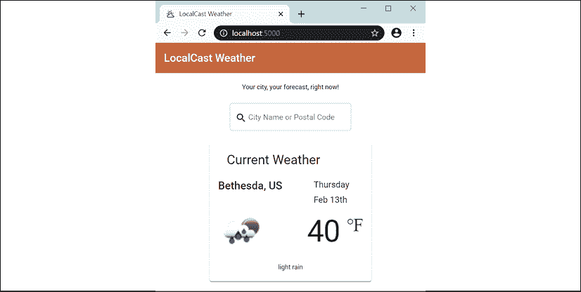
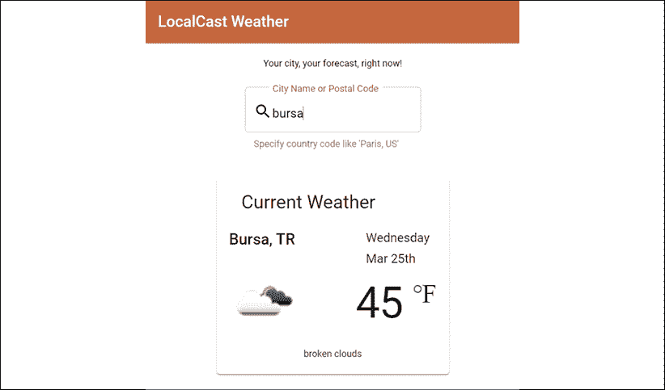

# 6.

# 形式、可观察物和主题

到目前为止，您一直在致力于将构成 Angular 应用程序的基本元素（如模块、组件、管道、服务、RxJS、单元测试和环境变量）组合在一起，甚至更进一步，学习如何使用 Docker 交付 web 应用程序，并使用 Angular 材质使其外观更加精美。

此时，我们的应用程序不是交互式的。它只能获取一个城市的天气信息。因此，它不是一个非常有用的应用程序。要构建交互式应用程序，我们需要能够处理用户输入。在应用程序中启用用户输入为创建出色的用户体验打开了可能性。考虑一下谷歌的登陆页面：


图 6.1：谷歌的登录页

在这种情况下，除了带有两个按钮的简单输入字段外，什么是谷歌搜索？这个简单的输入字段解锁了一些世界上最复杂和最先进的软件技术。这是一种看似简单却功能强大的与用户交互方式。您可以通过利用`GeoLocation`等现代 web 功能来增加用户输入，并从用户输入中获得新的含义。因此，当用户输入`Paris`时，你不必猜测他们是指法国巴黎还是德克萨斯州巴黎，或者你是否应该以摄氏度或华氏度显示当前温度。通过`LocalStorage`，您可以缓存用户凭据并记住用户首选项，以便在应用程序中启用暗模式。

到本章结束时，我们将不再实施谷歌、地理定位或黑暗模式，而是使用户能够使用城市名称或邮政编码（在美国通常称为“邮政编码”）搜索他们的城市。一旦你意识到实现像邮政编码搜索这样看似简单的东西会变得多么复杂，你可能会对精心设计的网络应用有新的欣赏。

要构建一个由输入字段驱动的用户体验，我们需要利用带有验证消息的角度表单，这样我们就可以通过“键入时搜索”功能创建引人入胜的搜索体验。在幕后，RxJS/BehaviorSubject 使我们能够构建可相互通信的解耦组件，而反应式数据流使我们能够合并来自多个 web API 的数据，而不会增加应用程序的复杂性。

在本章中，您将了解：

*   模板驱动和反应式表单，包括双向绑定和输入字段验证
*   组件之间的相互作用
*   可观测和 RxJS/行为主体
*   管理订阅，以及如何处理内存泄漏和取消订阅
*   使用异步管道处理多个 API 调用，包括链接多个 API 调用

本书样本代码的最新版本位于 GitHub 上的存储库中，链接如下。存储库包含代码的最终和完成状态。您可以在本章末尾通过在`projects`文件夹下查找代码的章末快照来验证您的进度。

对于*第 6 章*：

1.  克隆回购[https://github.com/duluca/local-weather-app](https://github.com/duluca/local-weather-app )
2.  在根文件夹上执行`npm install`以安装依赖项
3.  本章代码示例在子文件夹

    ```ts
    projects/ch6 
    ```

    下
4.  要运行本章的 Angular 应用程序，请执行：

    ```ts
    npx ng serve ch6 
    ```

5.  要运行本章的角度单元测试，请执行：

    ```ts
    npx ng test ch6 --watch=false 
    ```

6.  要运行本章的角度 e2e 测试，请执行：

    ```ts
    npx ng e2e ch6 
    ```

7.  要为本章构建生产就绪的 Angular 应用程序，请执行：

    ```ts
    npx ng build ch6 --prod 
    ```

请注意，存储库根目录下的`dist/ch6`文件夹将包含编译后的结果。

请注意，书中或 GitHub 上的源代码可能并不总是与 Angular CLI 生成的代码匹配。书中的代码和 GitHub 上的代码在实现上也可能有细微的差异，因为生态系统是不断发展的。随着时间的推移，示例代码自然会发生变化。同样在 GitHub 上，希望找到更正、修复以支持库的更新版本，或者并排实现多种技术以供读者观察。读者只希望实现书中推荐的理想解决方案。如果发现错误或有问题，请在 GitHub 上创建问题或提交请求，以方便所有读者。

接下来，让我们看看如何使用表单实现输入字段。表单是捕获用户输入所需的主要机制。在 Angular 中，有两种形式：反应式和模板驱动式。我们需要涵盖这两种技术，以便您熟悉表单在角度中的工作方式。

# 被动表单与模板驱动表单

现在，我们将在应用程序的主屏幕上实现搜索栏。下一个用户故事说明**显示当前位置**的预测信息，这可能意味着固有的地理定位功能。但是，正如您可能注意到的，地理定位是作为一项单独的任务列出的。挑战在于，使用本机平台功能（如地理位置），您永远无法保证收到实际位置信息。这可能是由于移动设备上的信号丢失问题，或者用户可能只是拒绝给予共享其位置信息的许可。

首先也是最重要的一点是，我们必须提供一个良好的基线用户体验，并在事后实现增值功能，如地理定位。相反，让我们移动**添加城市搜索功能。。。**至**正在进行**，如看板所示：


图 6.2:GitHub 项目看板

作为本故事的一部分，我们将实现一个随键入搜索功能，同时在服务无法检索预期数据时向用户提供反馈。

最初，实现类型搜索机制可能是直观的；然而，`OpenWeatherMap`API 不提供这样的端点。相反，它们提供批量数据下载，这是昂贵的，并且是兆字节范围的倍数。

我们需要实现我们的应用服务器来公开这样一个端点，以便我们的应用程序能够在使用最小数据量的同时有效地进行查询。

`OpenWeatherMap`的免费端点确实带来了一个有趣的挑战，两位数的国家代码可能会伴随城市名称或邮政编码，以获得最准确的结果。如果给定查询返回多个结果，这是实现向用户反馈机制的绝佳机会。

我们希望应用程序的每一次迭代都是一个潜在的可发布增量，并避免在任何给定的时间做太多的事情。

在开始编写故事之前，最好将故事分解为技术任务。以下是本故事的任务分解：

1.  添加角度表单控件，以便捕获用户输入事件。
2.  使用[中记录的角度材料输入 https://material.angular.io/components/input](https://material.angular.io/components/input) 提高输入字段的用户体验。
3.  将搜索栏创建为一个单独的组件，以强制分离关注点和解耦的组件体系结构。
4.  扩展现有端点以接受邮政编码，并在`weather.service.ts`中选择国家/地区代码，以便最终用户能够更直观地与我们的应用程序交互。
5.  限制请求，这样我们就不会在每次击键时都查询 API，而是每隔一段时间，用户仍然可以获得即时反馈，而无需单击单独的按钮。

让我们在接下来的几节中处理这些任务。

## 添加角反应形式

你可能想知道为什么我们要添加角度形式，因为我们只添加了一个输入字段，而不是一个具有多个输入的形式。一般来说，无论何时添加输入字段，都应该将其包装在`<form>`标记中。`Forms`模块包含`FormControl`，允许您在输入字段后面写入支持代码以响应用户输入，并提供相应的数据或验证或消息作为响应。

有两种形式的角度：

*   **模板驱动表单**：这些表单类似于您可能熟悉的 AngularJS 的案例，其中表单逻辑主要在 HTML 模板内部。我个人不喜欢这种方法，因为很难测试这些行为，而且胖 HTML 模板很难快速维护。
*   **被动表单**：被动表单的行为由控制器中编写的 TypeScript 代码驱动。这意味着您的验证逻辑可以进行单元测试，更好的是，可以在应用程序中重用。反应式表单是核心技术，在未来，它将使 AngularMaterial 团队能够编写自动化工具，根据 TypeScript 界面自动生成输入表单。

在[上阅读更多关于反应形式的信息 https://angular.io/guide/reactive-forms](https://angular.io/guide/reactive-forms) 。

让我们先将`FormsModule`和`ReactiveFormsModule`导入我们的应用程序：

```ts
**src/app/app.module.ts**
...
import { FormsModule, ReactiveFormsModule } from '@angular/forms'
...
@NgModule({
  ...
  imports: [
    ...
    **FormsModule,** 
 **ReactiveFormsModule,**
  ] 
```

注意，在纯反应式表单实现中，您只需要`ReactiveFormsModule`。`FormsModule`支持模板驱动表单等场景，您可能只想声明一个`FormControl`而不需要`FormGroup`。这就是我们如何实现此应用程序的输入字段。`FormGroup`将在下一节中定义。

此外，被动形式允许您在被动范式中编写代码，这是一个净积极因素。接下来，让我们将城市搜索组件添加到我们的应用程序中。

## 添加和验证组件

我们将使用物料表单和输入模块创建`citySearch`组件：

1.  Add `MatFormFieldModule` and `MatInputModule` to `material.module.ts` so that it becomes available for use in the app:

    ```ts
    **src/app/material.module.ts**
    import { MatFormFieldModule } from '@angular/material/form-field'
    import { MatInputModule } from '@angular/material/input'
    const modules = [..., **MatFormFieldModule, MatInputModule**] 
    ```

    我们添加了`MatFormFieldModule`，因为每个输入字段都应该被包装在`<mat-form-field>`标签中，以最大限度地利用角度材质功能。

    在高层次上，`<form>`封装了键盘、屏幕阅读器和浏览器扩展用户的许多默认行为；`<mat-form-field>`支持简单的双向数据绑定，这是一种应该适度使用的技术，还允许优雅的标签、验证和错误消息显示。

2.  Create the new `citySearch` component:

    ```ts
    $ npx ng g c citySearch --module=app.module 
    ```

    由于我们添加了`material.module.ts`文件，`ng`猜不出应该添加什么功能模块`citySearch`，导致`More than one module matches`等错误。因此，我们需要使用`--module`选项提供希望添加`citySearch`的模块。使用`--skip-import`选项跳过将组件导入任何模块。

3.  创建基本模板，替换现有内容：

    ```ts
    **src/app/city-search/city-search.component.html**
    <form>
      <mat-form-field appearance="outline">
        <mat-label>City Name or Postal Code</mat-label>
        <mat-icon matPrefix>search</mat-icon>
        <input matInput aria-label="City or Zip" [formControl]="search">
      </mat-form-field>
    </form> 
    ```

4.  Declare a property named `search` and instantiate it as an instance of `FormControl`:

    ```ts
    **src/app/city-search/city-search.component.ts**
    import { FormControl } from '@angular/forms'
    ...
    export class CitySearchComponent implements 
      OnInit { 

      search = new FormControl()
      ... 
    ```

    反应形式有三个控制级别：

    *   `FormControl`是与输入字段具有一对一关系的最基本元素。
    *   `FormArray`表示表示对象集合的重复输入字段。
    *   `FormGroup`用于在向表单添加更多输入字段时注册单个`FormControl`或`FormArray`对象。

    最后，`FormBuilder`对象用于更容易地编排和维护`FormGroup`对象的动作。`FormBuilder`和`FormGroup`首次用于*第 8 章*、*设计认证和授权*，包括`FormArray`在内的所有控件都将在*第 11 章*、*配方——可重用性、路由和缓存*中深入介绍。

5.  将`app-city-search`添加到`app.component.ts`中，作为包含应用程序标语的行和包含`mat-card`的行之间的新`div`：

    ```ts
    **src/app/app.component.ts**
    template: `
      ...
        </div>
     **<div fxLayoutAlign="center">**
     **<app-city-search></app-city-search>**
     **</div>**
        <div fxLayout="row">
      ...
    `, 
    ```

6.  Test the integration of components by checking out the app in the browser, as shown:

    

    图 6.3：带有搜索字段的 LocalCast 天气应用程序

如果没有错误发生，现在我们可以开始添加`FormControl`元素并将它们连接到搜索端点。

## 向天气服务添加搜索选项

到目前为止，我们一直在传递参数，以使用城市名称和国家代码获取城市的天气。通过允许用户输入邮政编码，我们必须使我们的服务在接受这两种输入时更加灵活。

OpenWeatherMap 的 API 接受 URI 参数，因此我们可以使用 TypeScript 联合类型和类型保护重构现有的`getCurrentWeather`函数（在*第 3 章*中介绍，*创建一个基本的 Angular 应用程序*。这意味着我们可以提供不同的参数，同时保留类型检查：

1.  Refactor the `getCurrentWeather` function in `weather.service.ts` to handle both `zip` and `city` inputs:

    ```ts
    **src/app/weather/weather.service.ts**
      getCurrentWeather(
        search: string | number, 
        country?: string
      ): Observable<ICurrentWeather> { 
        let uriParams = new HttpParams()
        if (typeof search === 'string') { 
          uriParams = uriParams.set('q',
            country ? `${search},${country}` : search
          )
        } else {
          uriParams = uriParams.set('zip', 'search')
        }

        uriParams = uriParams.set('appid', environment.appId)
        return this.httpClient
          .get<ICurrentWeatherData>(
            `${environment.baseUrl}api.openweathermap.org/data/2.5/weather`,
            { params: uriParams } 
        )
        .pipe(map(data => this.transformToICurrentWeather(data)))
      } 
    ```

    我们将`city`参数重命名为`search`，因为它可以是城市名称或邮政编码。然后，我们允许其类型为`string`或`number`，根据运行时的类型，我们将使用`q`或`zip`。我们还将`country`设置为可选，并且仅在查询存在时将其附加到查询中。

    `getCurrentWeather`现在已经嵌入了业务逻辑，因此是单元测试的良好目标。遵循单一责任原则，从坚实的原则出发，我们将把 HTTP 调用重构为它自己的函数，称为`getCurrentWeatherHelper`。

2.  Refactor the HTTP call into `getCurrentWeatherHelper`.

    在下一个示例中，请注意使用了反勾号字符```ts，而不是单引号字符`'`，它利用了允许 JavaScript 中嵌入表达式的模板文本功能：

    ```
    **src/app/weather/weather.service.ts**
      getCurrentWeather(
        search: string | number, 
        country?: string
      ): Observable<ICurrentWeather> { 
        let uriParams = new HttpParams()
        if (typeof search === 'string') { 
          uriParams = uriParams.set('q',
            country ? `${search},${country}` : search
          )
        } else {
          uriParams = uriParams.set('zip', 'search')
        }

        **return this.getCurrentWeatherHelper(uriParams)**
      }
      private getCurrentWeatherHelper(uriParams: HttpParams):
        Observable<ICurrentWeather> { 
        uriParams = uriParams.set('appid', environment.appId)
        return this.httpClient
          .get<ICurrentWeatherData>(
            `${environment.baseUrl}api.openweathermap.org/data/2.5/weather`,
            { params: uriParams } 
          )
          .pipe(map(data => this.transformToICurrentWeather(data)))
        } 
    ```ts

    作为一种积极的副作用，`getCurrentWeatherHelper`遵循开/关原则。毕竟，我们可以通过提供不同的`uriParams`来改变函数的行为，这是可以扩展的，而不需要频繁地修改。

    为了演示后一点，让我们实现一个新函数，通过纬度和经度获取当前天气。

3.  Implement `getCurrentWeatherByCoords`:

    ```
    **src/app/weather/weather.service.ts**
    getCurrentWeatherByCoords(coords: Coordinates): Observable<ICurrentWeather> {
      const uriParams = new HttpParams()
          .set('lat', coords.latitude.toString())
          .set('lon', coords.longitude.toString())
        return this.getCurrentWeatherHelper(uriParams)
    } 
    ```ts

    正如您所看到的，`getCurrentWeatherHelper`可以很容易地扩展，而无需任何修改。

4.  确保您使用之前所做的更改更新了`IWeatherService`：

    ```
    **src/app/weather/weather.service.ts** 
    export interface IWeatherService {
      getCurrentWeather(
        search: string | number,
        country?: string
      ): Observable<ICurrentWeather>
      getCurrentWeatherByCoords(coords: Coordinates): Observable<ICurrentWeather>
    } 
    ```ts

由于坚持了坚实的设计原则，我们可以更轻松地对流程控制逻辑进行稳健的单元测试，并最终编写出对错误更具弹性且维护成本更低的代码。

## 实现搜索

现在，让我们将新的服务方法连接到输入字段：

1.  Update `citySearch` to inject the `weatherService` and subscribe to input changes:

    ```
    **src/app/city-search/city-search.component.ts**
    import { WeatherService } from '../weather/weather.service'
    ...
    export class CitySearchComponent implements OnInit { 
      search = new FormControl()

      constructor(**private weatherService: WeatherService**) {}
      ...
      ngOnInit(): void { 
        **this.search.valueChanges**
     **.subscribe()**
      } 
    ```ts

    此时，我们将所有输入视为`string`。用户输入可以是城市、邮政编码、城市和国家/地区代码，或者邮政编码和国家/地区代码，用逗号分隔。虽然需要城市或邮政编码，但国家/地区代码是可选的。我们可以使用`String.split`函数解析任何可能的逗号分隔输入，然后用`String.trim`从字符串的开头和结尾删去任何空格。然后，我们通过使用`Array.map`对字符串进行迭代来确保修剪字符串的所有部分。

    然后，我们使用三元运算符`?:`处理可选参数，如果它存在，只传入一个值，否则不定义它。

2.  实现搜索处理程序：

    ```
    **src/app/city-search/city-search.component.ts**
    this.search.valueChanges
      .subscribe(
        (searchValue: string) => { 
        if (searchValue) {
          const userInput = searchValue.split(',').map(s => s.trim())
        this.weatherService.getCurrentWeather(
          userInput[0],
          userInput.length > 1 ? userInput[1] : undefined
        ).subscribe(data => (console.log(data)))
      }
    }) 
    ```ts

3.  在输入字段下为用户添加提示，告知他们可选的国家/地区功能：

    ```
    **src/app/city-search/city-search.component.html**
    ...
      <mat-form-field appearance="outline">
        ...
        **<mat-hint>Specify country code like 'Paris, US'</mat-hint>**
      </mat-form-field>
    ... 
    ```ts

此时，订阅处理程序将调用服务器并将其输出记录到控制台。

使用 Chrome 开发工具观察其工作原理。注意`search`功能的运行频率，我们没有处理服务错误。

## 通过油门/去盎司限制用户输入

目前，我们每次击键都会向服务器提交一个请求。这是不可取的行为，因为它会导致糟糕的用户体验和耗尽电池寿命，导致浪费网络请求和客户端和服务器端的性能问题。用户输入错误；他们可以改变他们对输入内容的想法，并且很少做信息输入的前几个字符会产生有用的结果。

我们仍然可以听到每一次击键，但我们不必对每一次击键都做出反应。通过利用`throttle`/`debounce`，我们可以将生成的事件数量限制在预定的时间间隔内，并在您搜索时保持该类型的功能。

请注意，`throttle`和`debounce`不是功能等价物，它们的行为因框架而异。除了节流之外，我们还希望捕获用户键入的最后一个输入。在`lodash`框架中，`throttle`功能满足此要求，而在`RxJS`框架中，`debounce`满足此要求。请注意，此差异可能会在将来的框架更新中修复。

使用`RxJS/debounceTime`很容易将节流注入可观测流中。用`pipe`执行`debounceTime`：

```
**src/app/city-search/city-search.component.ts**
import { debounceTime } from 'rxjs/operators'
  this.search.valueChanges
    `.pipe(debounceTime(1000))`
    .subscribe(...) 
```ts

`debounceTime`最多每秒运行一次搜索，但在用户停止键入后也会运行另一次搜索。相比之下，`RxJS/throttleTime`只会在第二天每秒运行一次搜索，并且不一定会捕获用户可能输入的最后几个字符。

RxJS 还具有`throttle`和`debounce`函数，您可以使用这些函数实现自定义逻辑，以限制不一定基于时间的输入。

因为这是一个时间和事件驱动的功能，所以断点调试是不可行的。您可以在**Chrome Dev Tools | network**选项卡中监视网络调用，但为了更实时地了解搜索处理程序实际被调用的频率，请添加一条`console.log`语句。

使用活动的`console.log`语句签入代码不是一种好的做法。如*第三章*所述，*创建一个基本的 Angular App*`console.log`是穷人的调试方法。这些语句使得读取实际代码变得困难，而实际代码本身就承担了很高的可维护性成本。因此，无论它们是否被注释掉，都不要使用`console.log`语句签入代码。

## 输入验证和错误消息

`FormControl`高度可定制。它允许您设置默认初始值、添加验证器或侦听`blur`、`change`和`submit`事件的更改，如下所示：

```
**example**
new FormControl('Bethesda', { updateOn: 'submit' }) 
```ts

我们不会用值初始化`FormControl`，但我们需要实现一个验证器来禁止单字符输入：

1.  从`@angular/forms`导入`Validators`：

    ```
    **src/app/city-search/city-search.component.ts**
    import { FormControl, Validators } from '@angular/forms' 
    ```ts

2.  修改`FormControl`增加最小长度校验器：

    ```
    **src/app/city-search/city-search.component.ts**
    search = new FormControl('', [Validators.minLength(2)]) 
    ```ts

3.  Modify the template to show a validation error message below the hint text:

    ```
    **src/app/city-search/city-search.component.html**
    ...
    <form **style="margin-bottom: 32px"**>
      <mat-form-field appearance="outline">
        ...
        **<mat-error *ngIf="search.invalid">**
     **Type more than one character to search**
     **</mat-error>**
      </mat-form-field>
    </form>
    ... 
    ```ts

    请注意，添加了一些额外的边距，以便为冗长的错误消息腾出空间。

    如果处理不同类型的错误，模板中的`hasError`语法可能会重复。您可能希望实现一个可通过代码定制的更具可扩展性的解决方案，如图所示：

    ```
    **example**
    <mat-error *ngIf="search.invalid">
      {{getErrorMessage()}}
    </mat-error>
    getErrorMessage() {
      return this.search.hasError('minLength') ?
        'Type more than one character to search' : '';
    } 
    ```ts

4.  修改`search`函数，不执行搜索，替换现有`if`语句

    ```
    **src/app/city-search/city-search.component.ts** 
    this.search.valueChanges
      .pipe(debounceTime(1000))
      .subscribe((search Value: string) => {
        if (**!this.search.invalid**) {
          ... 
    ```ts

    中的条件，输入无效

我们不需要进行简单的检查来查看`searchValue`是否已定义，而不是空字符串，我们可以通过调用`this.search.invalid`进入验证引擎进行更健壮的检查。

对于【T1，我们现在已经完成了】功能的实现。接下来，让我们回顾一下假设场景，看看模板驱动的表单实现是如何出现的。

### 具有双向绑定的模板驱动表单

对于ms，可选择模板驱动的表单。如果您熟悉 AngularJS 的`ng-model`，您会发现新的`ngModel`指令是它的 API 兼容替代品。

在幕后，`ngModel`实现了一个可以自动连接到`FormGroup`的`FormControl`。`<form>`可以在`ngModel`级别使用。您可以在[上阅读更多关于`ngModel`的信息 https://angular.io/api/forms/NgModel](https://angular.io/api/forms/NgModel) 。

在 GitHub 上本地天气应用程序库的*第 6 章*示例代码中，我在`<div class="example">`下呈现的`app.component.ts`中包含了一个名为`app-city-search-tpldriven`的模板驱动组件。您可以使用此组件进行实验，以查看备用模板实现的外观：

```
**projects/ch6/src/app/city-search-tpldriven/city-search-tpldriven.component.html**
  ...
    <input matInput aria-label="City or Zip"
      [(ngModel)]="model.search"
      (ngModelChange)="doSearch($event)" minlength="2" 
      name="search" #search="ngModel">
  ...
    <mat-error *ngIf="search.invalid">
      Type more than one character to search
    </mat-error>
  ... 
```ts

注意与`ngModel`一起使用的`[()]`“香蕉盒”双向绑定语法。

组件中的差异如下所示：

```
**projects/ch6/src/app/city-search-tpldriven/city-search-tpldriven.component.ts**
import { WeatherService } from '../weather/weather.service'
export class CitySearchTpldrivenComponent { 
  model = {
    search: '',
  }
  constructor(private weatherService: WeatherService) {}

  doSearch(searchValue) {
    const userInput = searchValue.split(',').map(s => s.trim())
    this.weatherService
      .getCurrentWeather(userInput[0], userInput.length > 1 ?
        userInput[1] : undefined
      )
      .subscribe(data => console.log(data))
  }
} 
```ts

如您所见，大多数逻辑都是在模板中实现的；因此，您需要维护模板和控制器的活动心智模型。对事件处理程序和验证逻辑的任何更改都需要您在两个文件之间来回切换。

此外，我们已经失去了输入限制和在输入处于无效状态时阻止服务调用的能力。实现这些特性仍然是可能的，但它们需要复杂的解决方案，并且不适合新的角度语法和概念。

总的来说，我不建议使用模板驱动的表单。在某些情况下，使用香蕉盒语法可能非常方便。但是，这为其他团队成员在应用程序周围复制相同的模式树立了一个坏的先例。

# 组件与行为主体的交互

要更新当前的天气信息，我们需要`city-search`组件与`current-weather`组件交互。有四种主要技术可在角度上实现组件交互：

*   全球活动
*   父组件侦听从子组件冒出的信息
*   模块中的同级、父级或子级组件，这些组件使用类似的数据流
*   父组件将信息传递给子组件

## 全球活动

这是一种从编程早期就开始使用的技术。在 JavaScript 中，可能是通过全局函数委托或 jQuery 的事件系统实现的。在 AngularJS 中，您可能已经创建了一个服务并在其中存储了值。

在 Angular 中，您仍然可以创建一个根级别的服务，在其中存储值，使用 Angular 的`EventEmitter`类，它实际上是用于指令的，或者使用`rxjs/Subscription`为您自己创建一个奇特的消息传递总线。

作为一种模式，全局事件很容易被滥用，它不会帮助维护解耦的应用程序体系结构，而是随着时间的推移导致全局状态。控制器级别的全局状态，甚至局部状态，其中函数读取和写入任何给定类中的变量，是编写可维护和单元可测试软件的头号敌人。

最终，如果您将所有应用程序数据存储在一个服务中或将所有事件路由到一个服务中以实现组件交互，那么您只是发明了一个更好的捕鼠器。这是一种应该不惜一切代价避免的反模式。在后面的一节中，您将发现，本质上，我们仍将使用服务来实现组件交互；然而，我想指出，在支持解耦的灵活体系结构和无法很好扩展的全局或集中式解耦方法之间存在一条细微的界线。

## 与事件发射器的子-父关系

您的子组件应该完全不知道其父组件。这是创建可重用组件的关键。

我们可以利用`AppComponent`作为父元素，实现城市搜索组件和当前天气组件之间的通信，并让`app`模块控制器协调数据。

现在提交你的代码！在接下来的两部分中，您将进行需要放弃的代码更改。

让我们看看此实现的外观：

1.  `city-search`组件通过`@Output`属性

    ```
    **src/app/city-search/city-search.component.ts**
    import { Component, OnInit, Output, EventEmitter } from '@angular/core'
    export class CitySearchComponent implements OnInit {
      @Output() searchEvent = new EventEmitter<string>()
      ...
      this.search.valueChanges
        .pipe(debounceTime(1000))
        .subscribe((search Value: string) => {
          if (!this.search.invalid) {
            this.searchEvent.emit(searchValue)
          }
        })
      ...
    } 
    ```ts

    公开`EventEmitter`
2.  The `app` component consumes that and calls the `weatherService`, setting the `currentWeather` variable:

    ```
    **src/app/app.component.ts**
    import { WeatherService } from './weather/weather.service'
    import { ICurrentWeather } from './interfaces'
    ...
    template: `
      ...
        <app-city-search **(searchEvent)="doSearch($event)"**>
        </app-city-search>
      ...
    `,
    export class AppComponent { 
      currentWeather: ICurrentWeather 
      constructor(private weatherService: WeatherService) { }
      doSearch(searchValue) {
        const userInput = searchValue.split(',').map(s => s.trim()) 
        this.weatherService
          .getCurrentWeather(userInput[0], userInput.length > 1 ?
            userInput[1] : undefined
        )
        .subscribe(data => this.currentWeather = data)
      }
    } 
    ```ts

    注意，我们使用括号语法绑定到`searchEvent`。`$event`变量自动捕获事件的输出，并将其传递到`doSearch`方法。

我们成功地将信息冒泡到父组件，但我们还必须能够将其传递到`current-weather`组件。

## 具有输入绑定的父子关系

根据定义，您的父组件将知道它使用的子组件。由于`currentWeather`属性绑定到`current-weather`组件上的`current`属性，因此结果向下传递以显示。这是通过创建一个`@Input`属性来实现的：

```
**src/app/current-weather/current-weather.component.ts**
import { Component, **Input** } from '@angular/core'
...
export class CurrentWeatherComponent implements OnInit { 
  **@Input()** current: ICurrentWeather
  ...
} 
```ts

请注意，`CurrentWeatherComponent`的`ngOnInit`功能现在是多余的，可以删除。

然后可以更新`app`组件，将数据绑定到`current`天气：

```
**src/app/app.component.ts**
template: `
  ...
  <app-current-weather **[current]="currentWeather"**>
  </app-current-weather>
  ...
` 
```ts

此时，您的代码应该可以工作了！尝试搜索一个城市。如果`current-weather`组件更新，则成功！

事件发射器和输入绑定方法适用于创建耦合良好的组件或用户控件，并且不使用外部数据的情况。一个很好的例子可能是向`current-weather`组件添加预测信息，如下所示：


图 6.4：天气预报线框

一周中的每一天都可以实现为一个组件，该组件使用`*ngFor`重复执行，`current-weather`检索该信息并将其绑定到其子组件是完全合理的：

```
**example**
<app-mini-forecast
  *ngFor="let dailyForecast of forecastArray
  [forecast]="dailyForecast"
>
</app-mini-forecast> 
```ts

通常，如果您使用的是数据驱动的组件，则父子或子-父通信模式会导致体系结构不灵活，从而很难重用或重新排列组件。紧耦合的一个很好的例子是我们在`app.component.ts`中导入气象服务。`AppComponent`应该不知道天气服务；它唯一的工作就是布局几个组件。考虑到不断变化的业务需求和设计，这是需要牢记的重要一课。

在继续之前，放弃在最后两部分中所做的更改。相反，我们将实施另一种解决方案。

接下来，我们将介绍一种更好的方式，使两个组件相互作用，而不会引入与主体的额外耦合。

## 兄弟姐妹与受试者的互动

组件交互的主要原因是发送或接收用户提供的或从服务器接收的数据更新。在 Angular 中，您的服务公开`RxJS.Observable`端点，这些端点是您的组件可以订阅的数据流。`RxJS.Observer`作为`Observable`发出的事件的消费者对`RxJS.Observable`进行补充。`RxJS.Subject`将两组功能结合在一起，形成一个易于使用的对象。

您基本上可以使用以下主题描述属于特定数据集的流，例如正在显示的当前天气数据：

```
**example**
import { Subject } from 'rxjs'
...
export class WeatherService implements IWeatherService { 
  currentWeather$: Subject<ICurrentWeather>
  ...
} 
```ts

`currentWeather$`仍然是一个数据流，并不是简单地表示一个数据点。您可以使用`subscribe`订阅对`currentWeather$`数据的更改，也可以使用`next`发布对`currentWeather$`数据的更改，如下所示：

```
**example**
currentWeather$.subscribe(data => (this.current = data)) currentWeather$.next(newData) 
```ts

请注意`currentWeather$`属性的命名约定，其后面附加了`$`。这是可观察属性的命名约定。

`Subject`的默认行为非常类似于一般的发布/订阅机制，例如 jQuery 事件。然而，在一个以不可预知的方式加载或卸载组件的异步世界中，使用默认的`Subject`不是很有用。

有三种高级科目：

*   `ReplaySubject`记住并缓存数据流中发生的数据点，以便订户可以在任何给定时间重播旧事件。
*   `BehaviorSubject`只记住最后一个数据点，同时继续监听新的数据点。
*   `AsyncSubject`仅为一次预计不会再次发生的事件。

`ReplaySubject`可能会对应用程序的内存和性能产生严重影响，因此应小心使用。在`current-weather`的情况下，我们只对显示接收到的最新天气数据感兴趣，但通过用户输入或其他事件，我们愿意接收新数据，以便使`current-weather`组件保持最新。`BehaviorSubject`将是满足这些需求的适当机制：

1.  Add `currentWeather$` as a read-only property to `IWeatherService`:

    ```
    **src/app/weather/weather.service.ts**
    import { **BehaviorSubject**, Observable } from 'rxjs'
    export interface IWeatherService {
      **readonly currentWeather$: BehaviorSubject<ICurrentWeather>**
      ...
    } 
    ```ts

    `currentWeather$`声明为只读，因为其`BehaviorSubject`不应重新分配。对值的任何更新都应该通过调用属性上的`.next`函数来发送。

2.  在`WeatherService`中定义`BehaviorSubject`并设置默认值：

    ```
    **src/app/weather/weather.service.ts**
    ...
    export class WeatherService implements IWeatherService {
      readonly currentWeather$ =
        new BehaviorSubject<ICurrentWeather>({ 
        city: '--',
        country: '--',
        date: Date.now(),
        image: '',
        temperature: 0,
        description: '',
      })
    ...
    } 
    ```ts

3.  增加一个名为`updateCurrentWeather`的新函数，该函数将触发`getCurrentWeather`并更新`currentWeather$`的值：

    ```
    **src/app/weather/weather.service.ts**
    ...
    updateCurrentWeather(search: string | number, 
      country?: string): void { 
      this.getCurrentWeather(search, country)
        .subscribe(weather => 
          this.currentWeather$.next(weather)
        )
    }
    ... 
    ```ts

4.  使用新功能更新`IWeatherService`，使其显示如下：

    ```
    **src/app/weather/weather.service.ts**
    ...
    export interface IWeatherService {
      readonly currentWeather$: BehaviorSubject<ICurrentWeather> 
      getCurrentWeather(city: string | number, country?: string):
        Observable<ICurrentWeather>
      getCurrentWeatherByCoords(coords: Coordinates):
        Observable<ICurrentWeather>
      **updateCurrentWeather(**
        **search: string | number,**
        **country?: string**
      **): void**
    } 
    ```ts

5.  更新`current-weather`组件以订阅新的`BehaviorSubject`：

    ```
    **src/app/current-weather/current-weather.component.ts**
    ...
      ngOnInit() { 
        this.weatherService.currentWeather$
          .subscribe(data => (this.current = data))
      }
    ... 
    ```ts

6.  在`city-search`组件中，更新`getCurrentWeather`函数调用以使用新的`updateCurrentWeather`函数：

    ```
    **src/app/city-search/city-search.component.ts**
    ...
      this.weatherService.**updateCurrentWeather**( 
        userInput[0],
        userInput.length > 1 ? userInput[1] : undefined
      )
    ... 
    ```ts

7.  Test your app in the browser; it should appear as follows:

    

    图 6.5：土耳其布尔萨的天气信息

当您键入一个新城市时，组件应更新以包含该城市的当前天气信息。我们可以移动**添加城市搜索功能。。。**完成**列的**任务，如看板上所示：


图 6.6:GitHub 项目看板状态

我们有一个功能性应用程序。然而，我们已经引入了内存泄漏，所以让我们在下一节中修复它。

# 管理订阅

订阅是从数据流中读取要在应用程序逻辑中使用的值的方便方法。如果不受管理，它们可能会在应用程序中造成内存泄漏。泄漏的应用程序最终会消耗越来越多的 RAM，最终导致浏览器选项卡变得无响应，导致对应用程序的负面印象，甚至可能导致数据丢失，这会让最终用户感到沮丧。

在`current-weather`组件中，我们注入`weatherSevice`以便访问`BehaviorSubject`的`currentWeather$`组件。在 Angular 中，服务是单例的，这意味着当它们第一次在内存中创建时，只要它们所属的模块在内存中，它们就会保持活动状态。从实际的角度来看，这意味着应用程序中的大多数服务在应用程序的生命周期内都将驻留在内存中。但是，组件的生命周期可能要短得多，并且可能会多次创建同一组件的多个实例。如果我们不小心管理长寿命对象和短命对象之间的交互，我们最终可能会在对象之间挂起引用，导致内存泄漏。

## 内存泄漏的暴露

当我们订阅`currentWeather$`时，我们会在其上附加一个事件处理程序，以便我们的组件能够对推送到`BehaviorSubject`的值更改做出反应。当`current-weather`组件需要销毁时，这会出现问题。

在诸如 JavaScript 的托管语言中，内存是由垃圾收集器或简称 GC 来管理的，而不是必须用非托管语言（如 C 或 C++）手工分配和释放内存。在非常高的级别上，GC 通过定期扫描堆栈来查找其他对象未引用的对象。

如果发现某个对象被取消引用，则可以释放该对象在堆栈中占用的空间。但是，如果一个未使用的对象仍然有一个对另一个仍在使用的对象的引用，则不能对其进行垃圾收集。GC 并不神奇，也不能读懂我们的思想。当对象未使用且无法释放时，只要应用程序正在运行，该对象占用的内存就永远不能用于其他目的。这被认为是内存泄漏。

我的同事 Brendon Caulkins 提供了一个有用的类比：

> 把浏览器的存储空间想象成一个停车场；每次我们赋值或创建订阅时，我们都会在该停车场停车。如果我们碰巧抛弃了一辆车，我们仍然会让停车位被占用；没有其他人可以使用它。如果浏览器中的所有应用程序都这样做，或者我们重复这样做，你可以想象停车场很快就满了，而我们永远无法运行我们的应用程序。

接下来，让我们看看如何确保我们不会把车丢在停车场。

## 取消订阅

订阅或事件处理程序创建对其他对象的引用，例如从短期组件到长期服务的引用。诚然，在我们的例子中，`current-weather`组件也是一个单例，但如果我们在应用程序中添加更多功能，从一个页面导航到另一个页面，或者同时显示多个城市的天气，情况可能会改变。如果我们不取消订阅`currentWeather$`，那么`current-weather`的任何实例都会被困在内存中。我们在`ngOnInit`中订阅，所以我们必须在`ngOnDestroy`中取消订阅。当 Angular 确定框架不再使用组件时，调用`ngOnDestroy`。

让我们在下面的示例代码中查看如何取消订阅的示例：

```
**example**
import { ..., OnDestroy } from '@angular/core'
import { ..., Subscription } from 'rxjs'
export class CurrentWeatherComponent implements OnInit, OnDestroy { 
  currentWeatherSubscription: Subscription
  ...
  ngOnInit() { 
    this.currentWeatherSubscription =
      this.weatherService.currentWeather$
        .subscribe((data) => (this.current = data))
  }
  ngOnDestroy(): void {
    this.currentWeatherSubscription.unsubscribe()
  }
... 
```ts

首先，我们需要为组件实现`OnDestroy`接口。然后，我们更新`ngOnInit`以在名为`currentWeatherSubscription`的属性中存储对订阅的引用。最后，在`ngOnDestroy`中，我们可以调用`unsubscribe`方法。

如果我们的组件被破坏，它将不再导致内存泄漏。然而，如果我们在一个给定的组件中有多个订阅，这可能会导致冗长的编码。

注意，在`city-search`中，我们订阅了`FormControl`对象的`valueChanges`事件。我们不需要管理此事件的订阅，因为`FormControl`是我们组件的子对象。当父组件与所有对象解除引用时，GC 可以安全地收集其所有子组件。

现在让我们来看一种更好的管理多个订阅的方法。

## 使用子库取消订阅

Ward Bell 发布的 SubLink 是一个简单的库，用于跟踪给定类中的所有订阅，无论是组件还是服务。

将子链接包添加到角度项目：

```
$ npm i subsink 
```ts

接下来更新`current-weather`使用子库，替换`currentWeatherSubscription`：

```
**src/app/current-weather/current-weather.component.ts**
import { ..., OnDestroy } from '@angular/core'
import { SubSink } from 'subsink'
export class CurrentWeatherComponent implements OnInit, OnDestroy {
  private subscriptions = new SubSink()
  ...
  ngOnInit(): void {
    this.subscriptions.add(
      this.weatherService.currentWeather$
        .subscribe((data) => (this.current = data))
    )
  }
  ngOnDestroy(): void {
 this.subscriptions.unsubscribe()
  }
... 
```ts

在前面的代码示例中，我们实例化了一个私有的`subscriptions`对象，它将用作包含所有订阅的接收器。然后，在`ngOnInit`中，我们只需将`currentWeather$`的订阅添加到接收器。在`ngOnDestroy`中，我们在水槽上调用`unsubscribe`，而不是单独订阅。

这是一种可伸缩的方法，因为我们必须编写的样板代码数量保持一致，因为您可以向接收器添加许多订阅，而无需额外编码。

订阅数据流本身中的值可以被认为是一种反模式，因为您可以将编程模型从被动模式切换到命令模式。此外，您可以首先避免管理订阅。我们将在下一节介绍这个主题。

# 实施反应式风格

正如*第 1 章*、*角度及其概念简介*所述，我们应该只订阅一个可观察的流来激活它。如果我们将`subscribe`函数视为事件处理程序，那么我们必须实现代码。

在代码库中看到除了空的`.subscribe()`调用之外的任何东西都应该被视为放弃反应式编程的标志。

在反应式编程中，当您订阅反应流中的事件时，您正在将编码范式从反应式编程转换为命令式编程。在我们的应用程序中有两个位置，一个在`current-weather`中，另一个在`city-search`组件中。

让我们从修复`current-weather`开始，这样我们就不会回到命令式编程。

## 使用异步管道绑定到可观察对象

Angular 从一开始就被设计成一个异步框架。通过停留在反应式编程领域，您可以充分利用 Angular。一开始这样做可能会让人觉得不自然，但 Angular 提供了向用户反映应用程序当前状态所需的所有工具，而无需转向命令式编程。

您可以利用模板中的`async`管道来反映可观察对象的当前值。让我们更新`current-weather`组件以使用`async`管道：

1.  首先用一个可观察的属性`current$: Observable<ICurrentWeather>`替换`current: ICurrentWeather`。
2.  在构造函数中，将`weatherService.currentWeather$`赋值给`current$:`

    ```
    **src/app/current-weather/current-weather.component.ts**
    import { Observable } from 'rxjs'
    export class CurrentWeatherComponent {
      current$: Observable<ICurrentWeather>
      constructor(private weatherService: WeatherService) {
        this.current$ = this.weatherService.currentWeather$
      }
      ... 
    ```ts

3.  删除所有与`SubSink`、`ngOnInit`和`ngOnDestroy`相关的代码。
4.  Update the template to so you can bind to `current$`:

    ```
    **src/app/current-weather/current-weather.component.html**
    <div *ngIf="current$ | async as current">
    ...
    </div> 
    ```ts

    `async`管道自动订阅`current$`的当前值，并将其作为变量`current`以强制方式提供给模板使用。这种方法的优点在于`async`管道隐式管理订阅，因此您不必担心取消订阅。

5.  移除`<div *ngIf="!current">`。这不再需要，因为`BehaviorSubject`总是初始化的。

到目前为止，反应式风格允许我们简化和清理代码。

异步管道还允许您实现`if-else`逻辑。如果要在解析可观察对象时显示加载消息，可以使用以下技术：

```
**example**
<div *ngIf="current$ | async as current;
  else loading"
>
  ...
</div>
<ng-template #loading>
  Loading...
</ng-template> 
```ts

接下来，让我们进一步改进代码。

## 进入可观察到的溪流

当启动`search`函数时，`city-search`组件在`subscribe`语句中实现回调。这导致了一种强制性的编码风格和思维方式。切换编程模式的危险在于，您可能会在代码中引入无意的副作用，从而更容易在应用程序中引入错误或状态。

让我们重构`city-search.component.ts`为反应式函数式编程风格，如下例所示：

```
**src/app/city-search/city-search.component.ts**
import { debounceTime, **filter, tap** } from 'rxjs/operators'
export class CitySearchComponent {
  search = new FormControl('', 
    [**Validators.required**, Validators.minLength(2)])
  constructor(private weatherService: WeatherService) { 
    **this.search.valueChanges**
 **.pipe(**
 **debounceTime(1000),**
 **filter(() => !this.search.invalid),**
 **tap((searchValue: string) => this.doSearch(searchValue))**
 **)**
 **.subscribe()**
}
doSearch(searchValue: string) {
  const userInput = searchValue.split(',').map(s => s.trim())
  const searchText = userInput[0]
  const country = userInput.length > 1 ? userInput[1] : undefined
  this.weatherService.updateCurrentWeather(searchText, country)
}
} 
```ts

在前面的代码中，我们删除了`OnInit`实现，并以反应方式实现了过滤逻辑。只有在`this.search`有效的情况下，`tap`操作符才会被触发。此外，`doSearch`是在函数上下文中调用的，因此很难引用函数中的任何其他类属性。

这减少了类的状态影响函数的结果的机会。因此，`doSearch`是一个可组合且可单元测试的函数，而在以前的实现中，以简单的方式对`ngOnInit`进行单元测试将是非常具有挑战性的。

请注意，必须在`valueChanges`上调用`.subscribe()`以激活可观察的数据流，否则不会触发任何事件。

我们没有实现`ngOnInit`这一事实反映了我们代码的真正异步性质，它独立于应用程序的生命周期或状态。

重构完成后，应用程序的功能应该与以前相同，但样板代码更少。现在，让我们看看如何增强我们的应用程序，使其能够处理来自任何国家的邮政编码。

# 多个 API 调用

目前，我们的应用程序只能处理来自美国的 5 位数字邮政编码或邮政编码。像`22201`这样的邮政编码是很容易与带有简单条件的城市名称区分开来的，比如`typeof search === 'string'`。然而，各国的邮政编码差异很大，英国就是一个很好的例子，邮政编码如`EC2R 6AB`。即使我们对地球上每个国家的邮政编码的格式有一个完美的理解，我们仍然无法确保用户没有指出一个稍微不正确的邮政编码。如今，老练的用户期望web 应用程序能够适应此类错误。

在这本书的第一版出版后，我收到了一些热情的读者反馈，他们对示例应用程序只能支持美国邮政编码感到失望。我决定实现这个功能，因为它证明了这些看似简单的请求会在多大程度上给你的应用程序带来意外的复杂性。作为奖励，该应用程序现在可以在全球范围内运行

让我们在待办事项中添加一个新项目，**支持国际邮政编码**，并将其移动到**进行中的**：


图 6.7：添加国际邮政编码故事

## 实施邮政编码服务

为了正确理解用户是否输入了有效的邮政编码和城市名称，我们必须依靠[geonames.org](http://geonames.org)提供的第三方 API 调用。让我们看看如何将辅助 API 调用注入应用程序的搜索逻辑。

您需要在[geonames.org](http://geonames.org)上注册一个免费帐户。之后，将您的`username`作为新参数存储在`environment.ts`和`environment.prod.ts`中。

您可以在此页面上试用邮政编码 API:[https://www.geonames.org/postal-codes](https://www.geonames.org/postal-codes) 。

首先执行一个`PostalCodeService`，如下所示：

您可以通过执行`npx ng generate service postalCode --project=local-weather-app --no-flat --lintFix`生成服务。

```
**src/app/postal-code/postal-code.service.ts**
import { HttpClient, HttpParams } from '@angular/common/http'
import { Injectable } from '@angular/core'
import { Observable } from 'rxjs'
import { defaultIfEmpty, flatMap } from 'rxjs/operators'
import { environment } from '../../environments/environment'
export interface IPostalCode {
  countryCode: string
  postalCode: string
  placeName: string
  lng: number
  lat: number
}
export interface IPostalCodeData { 
  postalCodes: [IPostalCode]
}
export interface IPostalCodeService {
  resolvePostalCode(postalCode: string): Observable<IPostalCode>
}
@Injectable({
  providedIn: 'root',
}) 
export class PostalCodeService implements IPostalCodeService {
  constructor(private httpClient: HttpClient) {}
  resolvePostalCode(postalCode: string): Observable<IPostalCode> {
    const uriParams = new HttpParams()
      .set('maxRows', '1')
      .set('username', environment.username)
      .set('postalcode', postalCode)
    return this.httpClient
      .get<IPostalCodeData>(
        `${environment.baseUrl}${environment.geonamesApi}.geonames.org/postalCodeSearchJSON`,
      { params: uriParams }
    )
    .pipe(
      flatMap(data => data.postalCodes), 
      defaultIfEmpty(null)
    )
  }
} 
```ts

注意新的环境变量`environment.geonamesApi`。在`environment.ts`中，将该值设置为`api`，在`environment.prod.ts`中，将该值设置为`secure`，因此 https 调用可以正常工作，以避免混合内容错误，如*第 4 章*、*自动测试、CI 和发布到生产*中所述。

在前面的代码段中，我们实现了一个调用 API 的`resolvePostalCode`函数，该函数被配置为接收 API 返回的第一个可行结果。然后将结果展平并通过管道发送到订户。在`defaultIfEmpty`中，如果我们没有收到 API 的结果，我们将确保提供空值。如果呼叫成功，我们将返回`IPostalCode`中定义的所有信息，从而可以使用坐标利用`getCurrentWeatherByCoords`。

## 链接 API 调用

让我们更新天气服务，以便它可以调用`postalCode`服务来确定用户输入的是否是有效的邮政编码：

1.  首先更新接口，所以我们只处理一个字符串：

    ```
    **src/app/weather/weather.service.ts**
    ...
    export interface IWeatherService {
    ...
      getCurrentWeather(search: **string**, country?: string): 
        Observable<ICurrentWeather>
      updateCurrentWeather(search: **string**, country?: string)
    } 
    ```ts

2.  将`PostalCodeService`作为私有财产注入气象服务：

    ```
    **src/app/weather/weather.service.ts**
    import {
      PostalCodeService
    } from '../postal-code/postal-code.service'
    ...
    constructor(
      private httpClient: HttpClient,
      private postalCodeService: PostalCodeService
    ) {} 
    ```ts

3.  更新`updateCurrentWeather`的方法签名
4.  更新`getCurrentWeather`以尝试将`searchText`解析为邮政编码：

    ```
    **src/app/weather/weather.service.ts**
    import { map, **switchMap** } from 'rxjs/operators'
    ... 
    getCurrentWeather(
      searchText: string,
      country?: string
    ): Observable<ICurrentWeather> {
      return this.postalCodeService.
        resolvePostalCode(searchText)
        .pipe(
          switchMap((postalCode) => {
            if (postalCode) {
              return this.getCurrentWeatherByCoords({
                latitude: postalCode.lat,
                longitude: postalCode.lng,
              } as Coordinates)
            } else {
              const uriParams = new HttpParams().set(
                'q',
                country ? `${searchText},${country}` : searchText
              )
              return this.getCurrentWeatherHelper(uriParams) 
            }
         })
       )
    } 
    ```ts

如果在将纬度和经度传递到`getCurrentWeatherByCoords`时遇到 TypeScript 问题，则可能必须使用`as`操作符强制转换对象。因此，您的代码如下所示：

```
 return this.getCurrentWeatherByCoords({
    latitude: postalCode.lat,
    longitude: postalCode.lng,
  } as Coordinates) 
```

在前面的代码段中，我们的第一个调用是`postalCode`服务。然后，我们使用`switchMap`对数据流上发布的邮政编码做出反应。在`switchMap`内，我们可以观察`postalCode`是否为空，并进行适当的后续呼叫，通过坐标或城市名称获取当前天气。

现在，LocalCast weather 应使用全球邮政编码，如以下屏幕截图所示：


图 6.8：全球邮政编码的本地天气预报

我们已经完成了对国际邮政编码的支持。将其移动到看板上的**完成**列：


图 6.9：完成国际邮政编码支持

当我们完成 LocalCast Weather 的实现时，仍有改进的余地。最初，由于显示的虚线和空字段，应用程序在首次加载时看起来已损坏。至少有两种不同的方法来处理这个问题。第一个是隐藏整个组件，在`app`组件级别，如果没有数据显示。要使其工作，我们必须将`weatherService`注入`app`组件，最终导致不太灵活的解决方案。另一种方法是增强`current-weather`组件，以便更好地处理丢失的数据。

您可以通过实现地理定位来进一步改进应用程序，以便在启动应用程序时获取用户当前位置的天气。您还可以利用`window.localStorage`来存储上次显示的城市或首次启动时从`window.geolocation`检索到的最后位置。

在*第 12 章*、*配方-主/细节、数据表和 NgRx*之前，我们一直在使用本地天气应用程序，在这里我将演示 NgRx 与使用 RxJS/BehaviorSubject 的比较。

# 总结

在本章中，您学习了如何使用`MatInput`、验证器、反应式表单和数据流驱动处理程序在键入功能时创建搜索。您开始了解双向绑定和模板驱动表单。您还了解了支持组件间交互和数据共享的不同策略。您将深入了解内存泄漏是如何产生的，以及管理订阅的重要性。

现在，您可以更好地区分命令式和反应式编程风格，以及在可能的情况下坚持反应式编程的重要性。最后，您学习了如何通过将多个 API 调用链接在一起来实现复杂的功能。

LocalCast Weather 是一个简单的应用程序，我们使用它来介绍角度的基本概念。正如您所看到的，Angular 非常适合构建这样小而动态的应用程序，同时向最终用户提供最少的框架代码。你应该考虑使用角度，即使是快速和肮脏的项目，这也是一个伟大的实践时，建立更大的应用程序。在下一章中，您将创建一个更为复杂的**业务线**（**LOB**应用程序，使用路由器优先的方法设计和架构可扩展的 Angle 应用程序，具有一流的身份验证和授权、用户体验、，还有许多方法，涵盖了在 LOB 应用程序中可以找到的绝大多数需求。

# 练习

在完成**支持国际邮政编码**功能后，我们是否在这里切换了编码模式？我们的实现高于命令、反应还是两者的结合？如果我们的实现不是完全被动的，您将如何被动地实现此功能？我将此作为练习留给读者。

在继续之前，不要忘记执行`npm test`、`npm run e2e`和 `npm run test:a11y`。这是留给读者的一个练习，用于修复单元测试和端到端测试。

访问 GitHub，查看我在[为本章实施的单元测试 https://github.com/duluca/local-weather-app/tree/master/projects/ch6](https://github.com/duluca/local-weather-app/tree/master/projects/ch6) 。

# 问题

尽可能回答以下问题，以确保您在不使用谷歌搜索的情况下理解了本章的关键概念。你需要帮助回答这些问题吗？参见*附录 D*、*自我评估答案*在线[https://static.packt-cdn.com/downloads/9781838648800_Appendix_D_Self-Assessment_Answers.pdf](https://static.packt-cdn.com/downloads/9781838648800_Appendix_D_Self-Assessment_Answers.pdf) 或访问[https://expertlysimple.io/angular-self-assessment](https://expertlysimple.io/angular-self-assessment) 。

1.  什么是`async`管道？
2.  解释反应式编程和命令式编程的区别，以及我们应该选择哪种技术？
3.  行为主体的好处是什么？它的用途是什么？
4.  什么是内存泄漏？为什么要避免它们？