# 9

# DevOps 使用 Docker

在*第 8 章**设计认证和授权*的末尾，我们有了一个相当复杂的应用程序。在*第 4 章*、*自动测试、CI 和发布*中，我强调需要确保我们创建的每一个代码推送都通过测试，遵守编码标准，并且是一个可执行工件，团队成员可以在开发应用程序时对其进行测试。在*第 7 章**创建路由器一线业务应用程序*结束时，您应该已经复制了我们为 LemonMart 的本地天气应用程序实施的相同 CircleCI 设置。如果没有，在我们开始为我们的**业务线**（**LOB**应用程序构建更复杂的功能之前，请继续并执行此操作。

我们生活在一个快速发展、不断突破的时代。然而，该声明的后一部分很少在企业中起作用。你可以选择生活在边缘，采取约洛式的生活方式，但这并没有很好的商业意义。


图 9.1：工具的创造性 CLI 选项

**持续集成**（**CI**）对于通过构建和执行每个代码推送测试来确保质量交付至关重要。设置 CI 环境可能非常耗时，并且需要对所使用的工具有专门的知识。在*第 4 章*、*自动测试、CI 和发布到生产*中，我们通过 CircleCI 集成实现了 GitHub 流程。但是，我们手动部署了我们的应用程序。为了在不破坏东西的情况下快速移动，我们需要使用 DevOps 最佳实践，例如**基础设施作为代码**（**IaC**），实现**连续部署**（**CD**，这样我们可以更频繁地验证我们运行的代码的正确性。

在本章中，我们将介绍一种基于 Docker 的方法来实现 IaC，该方法可以在大多数 CI 服务和云提供商上运行，允许您实现从任何 CI 环境到任何云提供商的可重复构建和部署。使用灵活的工具，您将避免在一个服务中过度专业化，并使您的配置管理技能与不同的 CI 服务相关。

本书利用 CircleCI 作为 CI 服务器。其他值得注意的 CI 服务器包括 Jenkins、Azure DevOps 以及 GitLab 和 GitHub 中的内置机制。

在本章中，您将学习以下内容：

*   DevOps 和 IaC
*   使用 Docker 容器化 web 应用程序
*   使用 Google Cloud Run 部署容器化应用程序
*   向多个云提供商发送 CD
*   高级 CI
*   代码覆盖率报告

本章要求使用以下软件：

*   Docker 桌面社区版本 2+
*   Docker 引擎 CE 版本 18+
*   谷歌云引擎帐户
*   工作服帐户

本书示例代码的最新版本在 GitHub 上，位于下面列表中链接的存储库中。存储库包含代码的最终和完整版本。每个部分都包含信息框，可以帮助您找到 GitHub 上正确的文件名或分支，以便您可以使用它们来验证进度。

对于基于**本地天气 app**的*第 9 章*示例，请执行以下操作：

1.  在[克隆回购协议 https://github.com/duluca/local-weather-app](https://github.com/duluca/local-weather-app) 。
2.  在根文件夹上执行`npm install`以安装依赖项。
3.  使用`.circleci/config.ch9.yml`验证您的`config.yml`实现。
4.  To run the CircleCI Vercel Now configuration, execute

    ```ts
    git checkout deploy_Vercelnow 
    ```

    参见[中的拉动请求 https://github.com/duluca/local-weather-app/pull/50](https://github.com/duluca/local-weather-app/pull/50) 。

5.  To run the CircleCI GCloud configuration, execute

    ```ts
    git checkout deploy_cloudrun 
    ```

    参见[中的拉动请求 https://github.com/duluca/local-weather-app/pull/51](https://github.com/duluca/local-weather-app/pull/51) 。

请注意，两个分支机构都利用修改后的代码使用**本地天气应用程序**回购中的`projects/ch6`代码。

对于基于**柠檬超市**的*第 9 章*示例，请执行以下操作：

1.  克隆位于[的回购协议 https://github.com/duluca/lemon-mart](https://github.com/duluca/lemon-mart) 。
2.  使用`.circleci/config.ch9.yml`和`config.docker-integration.yml`来验证您的`config.yml`实现。
3.  在根文件夹上执行`npm install`以安装依赖项。
4.  To run the CircleCI Docker integration configuration, execute

    ```ts
    git checkout docker-integration 
    ```

    参见[中的拉动请求 https://github.com/duluca/lemon-mart/pull/25](https://github.com/duluca/lemon-mart/pull/25) 。

请注意，`docker-integration`分支稍微修改为使用**柠檬超市**回购上`projects/ch8`文件夹中的代码。

请注意，书中的代码和 GitHub 上的代码在实现上可能会有细微的差异，因为生态系统在不断发展。随着时间的推移，示例代码自然会发生变化。此外，在 GitHub 上，希望找到更正、修复以支持库的更新版本，或者同时实现多种技术，供读者观察。读者只希望实现书中推荐的理想解决方案。如果发现错误或有问题，请在 GitHub 上创建问题或提交请求，以方便所有读者。

您可以在*附录 C*、*保持 Angular 和 Tools 常青*中了解更多关于更新 Angular 的信息。您可以从[在线找到此附录 https://static.packt-cdn.com/downloads/9781838648800_Appendix_C_Keeping_Angular_and_Tools_Evergreen.pdf](https://static.packt-cdn.com/downloads/9781838648800_Appendix_C_Keeping_Angular_and_Tools_Evergreen.) 或[处 https://expertlysimple.io/stay-evergreen](https://expertlysimple.io/stay-evergreen) 。

让我们从理解 DevOps 是什么开始。

# 德沃斯

DevOps 是开发和运营的结合体。在开发过程中，像 Git 这样的代码存储库跟踪每一次代码更改是公认的。在操作方面，长期以来有各种各样的技术来跟踪环境的变化，包括脚本和各种工具，这些工具旨在自动化操作系统和服务器的供应。

不过，你听过多少次“它在我的机器上工作”这句话？开发人员经常把这句话当作笑话。尽管如此，通常情况下，在测试服务器上运行良好的软件由于配置上的细微差异而在生产服务器上遇到问题。

在*第 4 章*、*自动测试、CI 和发布到生产*中，我们讨论了 GitHub 流程如何使我们能够创建价值交付流。在做出改变之前，我们总是从主人那里分支。通过 CI 管道强制执行该更改，一旦我们合理地确定代码正常工作，我们就可以合并回主分支。见下图：

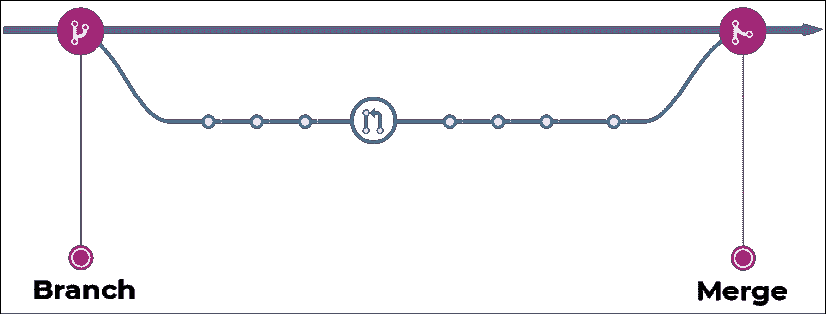

图 9.2：分支和合并

记住，主分支应该始终是可部署的，并且应该经常将工作合并到主分支。

Docker 允许我们使用一个名为`Dockerfile`的特殊文件，以声明方式定义我们的代码所依赖的软件和特定配置参数。类似地，CircleCI 允许我们在`config.yml`文件中定义 CI 环境的配置。通过将配置存储在文件中，我们可以将文件与代码一起检入。我们可以使用 Git 跟踪更改，并强制它们通过 CI 管道进行验证。通过将基础设施的定义存储在代码中，我们实现了 IaC。通过 IaC，我们还实现了可重复的集成，因此无论我们在什么环境中运行基础设施，我们都应该能够使用一行命令来支持我们的完整堆栈应用程序。

您可能还记得，在*第 1 章**Angular 及其概念简介*中，我们介绍了 TypeScript 如何弥补 JavaScript 特性的不足。与 TypeSript 类似，Docker 填补了配置缺口，如下图所示：

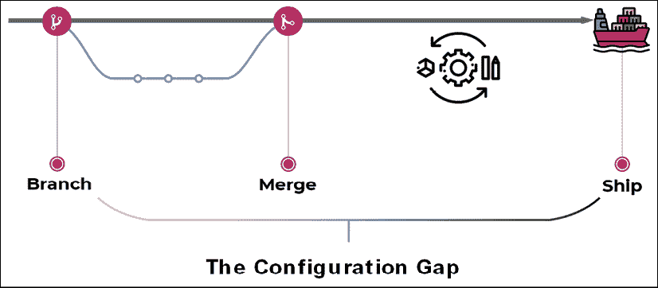

图 9.3：覆盖配置间隙

通过使用 Docker，我们可以合理地确保在测试期间在我们的机器上工作的代码在我们发货时的工作方式完全相同。

总之，使用 DevOps，我们使运营更接近开发，在开发中进行更改和解决问题更便宜。因此，DevOps 主要是开发人员的责任，但也是运营团队必须愿意支持的一种思维方式。让我们深入 Docker。

# 使用 Docker 容器化 web 应用程序

Docker，可在[找到 https://docker.io](https://docker.io) 是一个用于开发、发布和运行应用程序的开放平台。Docker 将轻量级的容器虚拟化平台与有助于管理和部署应用程序的工作流和工具相结合。**虚拟机**（**虚拟机**）和Docker 容器之间最明显的区别是，虚拟机通常有几十 GB 的大小，需要 GB 的内存，而容器在磁盘和内存大小要求方面占用 MB。此外，Docker 平台抽象出主机**操作系统**（**操作系统**）级配置设置，因此成功运行应用程序所需的每一项配置都以人类可读的格式编码。

## Dockerfile 的解剖

A`Dockerfile`由四个主要部分组成：

*   **来自**——其中我们可以继承 Docker 的最小“划痕”图像或预先存在的图像
*   **设置**-其中我们根据需求配置软件依赖关系
*   **复制**-其中我们将构建的代码复制到操作环境中
*   **CMD**–其中我们指定将引导操作环境的命令

引导是指描述程序如何加载或启动的一组初始指令。

考虑下面的解剖结构：


图 9.4：Dockerfile 的解剖结构

`Dockerfile`的具体表示如以下代码所示：

```ts
**Dockerfile**
FROM duluca/minimal-nginx-web-server:1-alpine
COPY /dist/local-weather-app /var/www
CMD 'nginx' 
```

您可以将脚本的`FROM`、`COPY`和`CMD`部分映射到可视化。我们使用`FROM`命令继承`duluca/minimal-nginx-web-server`图像。然后，我们使用`COPY`（或者`ADD`命令）将应用程序的编译结果从开发机器或构建环境复制到图像中。最后，我们指示容器使用`CMD`（或者`ENTRYPOINT`命令）执行 nginxweb 服务器。

注意前面的`Dockerfile`没有明确的`SETUP`部分。`SETUP`不映射到实际的`Dockerfile`命令，但表示可以执行以设置容器的命令集合。在本例中，所有必要的设置都是由基础映像完成的，因此不需要运行其他命令。

常用的`Dockerfile`命令有`FROM`、`COPY`、`ADD`、`RUN`、`CMD`、`ENTRYPOINT`、`ENV`和`EXPOSE`。有关完整的`Dockerfile`参考，请参阅[https://docs.docker.com/engine/reference/builder/](https://docs.docker.com/engine/reference/builder/) 。

`Dockerfile`描述了从名为`duluca/minimal-nginx-web-server`的容器继承的新容器。这是我在 Docker Hub 上发布的一个容器，它继承了`nginx:alpine`图像，它本身继承了`alpine`图像。`alpine`映像是一个最小的 Linux 操作环境，只有 5MB 大小。`alpine`图像本身继承自`scratch`，这是一个空图像。请参见下图中演示的继承层次结构：


图 9.5：Docker 继承

然后`Dockerfile`将`dist`文件夹的内容从您的开发环境复制到容器的`www`文件夹中，如下图所示：

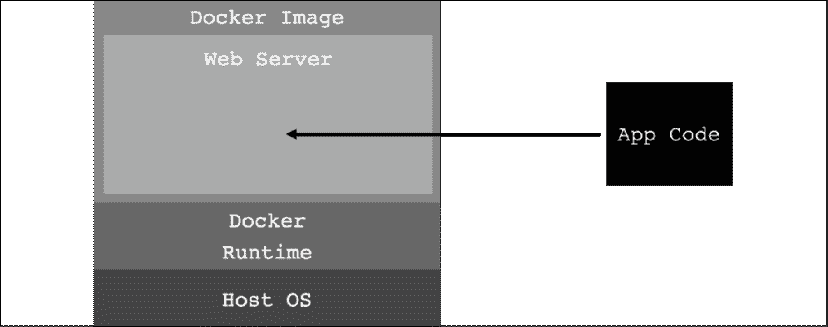

图 9.6：将代码复制到容器化 web 服务器

在这种情况下，父映像配置了一个 nginx 服务器，作为 web 服务器来服务`www`文件夹中的内容。在这一点上，我们的源代码可以从互联网上访问，但生活在安全环境的各个层中。即使我们的应用程序存在某种漏洞，攻击者也很难攻击我们正在操作的系统。下图演示了 Docker 提供的安全层：


图 9.7：Docker 安全

总之，在底层，我们有运行 Docker 运行时的主机操作系统，如 Windows 或 macOS，将在下一节中安装。Docker 运行时能够运行由上述`Dockerfile`定义的自包含 Docker 映像。`duluca/minimal-nginx-web-server`基于轻量级 Linux 操作系统 Alpine。Alpine 是一个完全精简的 Linux 版本，它没有任何 GUI、驱动程序，甚至没有 Linux 系统中的大多数 sCLI 工具。因此，操作系统的大小只有约 5 MB。然后，我们继承 nginx 映像，它安装了 web 服务器，它本身的大小大约为几兆字节。最后，我们的自定义 nginx 配置是在默认映像上分层的，从而生成一个极小的~7 MB 映像。nginx 服务器配置为提供`/var/www`文件夹的内容。在`Dockerfile`中，我们只是将`/dist`文件夹的内容复制到我们的开发环境中，并将其放入`/var/www`文件夹中。我们稍后将构建并执行此映像，它将运行包含`dist`文件夹输出的 Nginx web 服务器。我已经发布了一张类似的图片，名为`duluca/minimal-node-web-server`，它的时钟为 15 MB。

`duluca/minimal-node-web-server`可以更直接地使用，特别是如果您不熟悉 Nginx。它依靠`Express.js`服务器来提供静态内容。大多数云提供商提供了使用 Node 和 Express 的具体示例，这可以帮助您缩小任何错误。此外，`duluca/minimal-node-web-server`还烘焙了 HTTPS 重定向支持。当您只需要在您的`Dockerfile`中设置环境变量`ENFORCE_HTTPS`时，您可以花费大量时间尝试设置 nginx 代理来执行相同的操作。请参阅以下 Dockerfile 示例：

```ts
**Dockerfile**
FROM duluca/minimal-node-web-server:lts-alpine
WORKDIR /usr/src/app
COPY dist/local-weather-app public
ENTRYPOINT [ "npm", "start" ]
ENV ENFORCE_HTTPS=xProto 
```

您可以在[上阅读更多关于`minimal-node-web-server`提供的选项的信息 https://github.com/duluca/minimal-node-web-server](https://github.com/duluca/minimal-node-web-server) 。

正如我们现在看到的一样，Docker 的美妙之处在于您可以导航到[https://hub.docker.com Apple T5，搜索 Apple T0 或 Ty1 T1，阅读它的 Tyt2，然后追溯它的起源，回到原始的基础图像，这是 Web 服务器的基础。我鼓励您检查您以这种方式使用的每个 Docker 图像，以了解它为您的需求带来了什么。你可能会发现它要么是矫枉过正，要么是它有一些你不知道的特性，可以让你的生活轻松很多。](https://hub.docker.com)

请注意，父图像应拉取一个特定的标记`duluca/minimal-nginx-web-server`，即`1-alpine`。类似地，`duluca/minimal-node-web-server`从`lts-alpine`拉。这些是 evergreen 基本软件包，始终包含最新版本的 Nginx 和 Alpine 版本 1 或 Node 的 LTS 版本。我设置了管道，以便在发布新的基础图像时自动更新这两个图像。因此，无论何时你拉这些图像，你将得到最新的错误修复和安全补丁。

拥有一个常青依赖树可以减轻开发人员寻找 Docker 映像最新可用版本的负担。或者，如果指定版本号，图像将不会受到任何潜在的破坏性更改。但是，最好记住在新构建后测试映像，而不是永远不更新映像并部署可能受损的软件。毕竟，网络是日新月异的，它不会让你放慢脚步，让你的图像保持最新。

就像 npm 软件包一样，Docker 可以带来极大的便利和价值，但您必须注意了解您正在使用的工具。

在*第 13 章**AWS*上的高可用云基础设施中，我们将利用基于 Nginx 的低占地面积 Docker 镜像`duluca/minimal-nginx-web-server`。如果您对配置 nginx 感到满意，这是理想的选择。

## 安装 Docker

为了能够构建和运行容器，您必须首先在计算机上安装 Docker 执行环境。有关安装 Docker 的说明，请参阅*第 2 章**设置您的开发环境*。

## 为 Docker 设置 npm 脚本

现在，让我们为您的 Angular 应用程序配置一些 Docker 脚本，您可以使用这些脚本自动化容器的构建、测试和发布。我为 Docker 开发了一套名为**npm 脚本的脚本，可在 Windows 10 和 macOS 上运行。您可以获取这些脚本的最新版本，并通过执行以下代码在项目中自动配置它们：**

现在在**本地天气 app**和**柠檬城**项目上运行以下命令！

1.  为 Docker 任务安装 npm 脚本：

    ```ts
    $ npm i -g mrm-task-npm-docker 
    ```

2.  为 Docker 配置应用 npm 脚本：

    ```ts
    $ npx mrm npm-docker 
    ```

在您执行`mrm`脚本之后，我们准备以本地天气应用程序为例深入了解配置设置。

## 生成图像并将其发布到 Docker Hub

接下来，让我们确保您的项目配置正确，这样我们就可以将其容器化，构建一个可执行映像，并将其发布到 Docker Hub，从而允许我们从任何构建环境访问它。我们将在*第 6 章*中最后更新的本节中使用本地天气应用程序*表格、观测值和主题*：

本节使用**本地天气 app**回购。

1.  在[上注册Docker Hub 账户 https://hub.docker.com/](https://hub.docker.com/) 。
2.  Create a public (free) repository for your application.

    在本章后面，我们将使用谷歌云的容器注册库作为私有存储库。另外，在*第 13 章*、*AWS*上的高可用云基础设施中，我介绍了如何使用**AWS 弹性容器服务**（**AWS ECS**建立私有容器库。

3.  In `package.json`, add or update the `config` property with the following configuration properties:

    ```ts
    **package.json**
      ...
      "config": {
        "imageRepo": "[namespace]/[repository]",
        "imageName": "custom_app_name",
        "imagePort": "0000",
        "internalContainerPort": "3000"
      },
      ... 
    ```

    `namespace`将是您的 Docker Hub 用户名。您将定义在创建过程中调用存储库的内容。示例图像`repository`变量应类似于`duluca/localcast-weather`。图像名称用于在使用 Docker 命令（如`docker ps`）时轻松识别您的容器。我会叫我的`localcast-weather`。`imagePort`属性将定义应该使用哪个端口从容器内部公开应用程序。因为我们使用端口`5000`进行开发，所以选择一个不同的端口，如`8080`。`internalContainerPort`定义 web 服务器映射到的端口。对于节点服务器，这将主要是端口`3000`，对于 Nginx 服务器，`80`。请参阅您正在使用的基本容器的文档。

4.  Let's review the Docker scripts that were added to `package.json` by the `mrm` task from earlier. The following snippet is an annotated version of the scripts that explains each function.

    请注意，对于 npm 脚本，`pre`和`post`关键字分别用于在执行给定脚本之前或之后执行助手脚本。为了便于阅读和维护，脚本被故意分割成更小的部分。

    `build`脚本如下：

    请注意，下面的`cross-conf-env`命令确保脚本在 macOS、Linux 和 Windows 环境中同样良好地执行。

    ```ts
    **package.json**
    ...
      "scripts": {
        ...
        "predocker:build": "npm run build",
        "docker:build": "cross-conf-env docker image build . -t $npm_package_config_imageRepo:$npm_package_version",
        "postdocker:build": "npm run docker:tag",
        ... 
    ```

    `npm run docker:build`将在`pre`脚本中构建 Angular 应用程序，然后使用`docker image build`命令构建 Docker 映像，并在`post`脚本中用版本号标记映像：

    在我的项目中，`pre`命令以 prod 模式构建我的 Angular 应用程序，并运行一个测试，以确保我有一个优化的构建，没有失败的测试。

    我的命令如下：

    `"predocker:build":``"npm run build:prod && npm test -- --watch=false"`

    `tag`脚本如下：

    ```ts
    **package.json**
        ...
        "docker:tag": " cross-conf-env docker image tag $npm_package_config_imageRepo:$npm_package_version $npm_package_config_imageRepo:latest",
        ... 
    ```

    `npm run docker:tag`将使用`package.json`中`version`属性中的版本号和最新标记标记已构建的 Docker 映像。

    `stop`脚本如下：

    ```ts
    **package.json**
        ...
        "docker:stop": "cross-conf-env docker stop $npm_package_config_imageName || true",
        ... 
    ```

    如果映像当前正在运行，`npm run docker:stop`将停止映像，因此`run`脚本可以在没有错误的情况下执行。

    `run`脚本如下：

    注意`run-s`和`run-p`命令随`npm-run-all`包一起发送，以同步或并行执行 npm 脚本。

    ```ts
    **package.json**
        ...
        "docker:run": "run-s -c docker:stop docker:runHelper",
        "docker:runHelper": "cross-conf-env docker run -e NODE_ENV=local --rm --name $npm_package_config_imageName -d -p $npm_package_config_imagePort:$npm_package_config_internalContainerPort $npm_package_config_imageRepo",
        ... 
    ```

    如果映像已经运行，`npm run docker:run`将停止，然后使用`docker run`命令运行映像的新构建版本。请注意，`imagePort`属性用作 Docker 映像的外部端口，该端口映射到 Node.js 服务器侦听的映像的内部端口，即端口`3000`。

    `publish`脚本如下：

    ```ts
    **package.json**
        ...
        "predocker:publish": "echo Attention! Ensure `docker login` is correct.",
        "docker:publish": "cross-conf-env docker image push $npm_package_config_imageRepo:$npm_package_version",
        "postdocker:publish": "cross-conf-env docker image push $npm_package_config_imageRepo:latest",
        ... 
    ```

    `npm run docker:publish`将使用`docker image push`命令将生成的映像发布到配置的存储库，在本例中为 Docker Hub。

    首先，发布版本的图像，然后发布版本的图像，并在 post 中标记为`latest`。`taillogs`脚本如下：

    ```ts
    **package.json**
        ...
        "docker:taillogs": "cross-conf-env docker logs -f $npm_package_config_imageName",
        ... 
    ```

    `npm run docker:taillogs`将使用`docker log -f`命令显示正在运行的 Docker 实例的内部控制台日志，这是调试 Docker 实例时非常有用的工具。

    `open`脚本为如下：

    ```ts
    **package.json**
        ...
        "docker:open": "sleep 2 && cross-conf-env open-cli http://localhost:$npm_package_config_imagePort",
        ... 
    ```

    `npm run docker:open`将等待 2 秒钟，然后使用`imagePort`属性为您的应用程序启动具有正确 URL 的浏览器。

    `debug`脚本如下：

    ```ts
    **package.json**
        ...
        "predocker:debug": "run-s docker:build docker:run",
        "docker:debug": "run-s -cs docker:open:win docker:open:mac docker:taillogs"
      },
    ... 
    ```

    `npm run docker:debug`将在`pre`中构建您的图像并运行其实例，打开浏览器，然后开始显示容器的内部日志。

5.  Customize the pre-build script to build your angular app in production mode and execute unit tests before building the image:

    ```ts
    **package.json**
        "build": "ng build",
        "build:prod": "ng build --prod",
        "predocker:build": "npm run build:prod && npm test -- --watch=false", 
    ```

    需要注意的是`ng build`中提供了`--prod`参数，这实现了两件事：应用程序的大小通过**提前**（**AOT**）编译得到优化，大大减小了运行时的性能，并使用了`src/environments/environment.prod.ts`中定义的配置项。

6.  Update `src/environments/environment.prod.ts` to look like you're using your own `appId` from `OpenWeather`:

    ```ts
    export const environment = {   
      production: true,
      appId: '01ff1xxxxxxxxxxxxxxxxxxxxx',
      username: 'localcast',
      baseUrl: 'https://',
      geonamesApi: 'secure',
    } 
    ```

    我们正在修改`npm test`的执行方式，因此测试只运行一次，工具停止执行。提供`--watch=false`选项是为了实现此行为，与开发友好型默认连续执行行为相反。

7.  创建一个名为`Dockerfile`的新文件，在项目根目录中没有文件扩展名。
8.  Implement or replace the contents of the `Dockerfile`, as shown here:

    ```ts
    **Dockerfile**
    FROM duluca/minimal-node-web-server:lts-alpine 
    WORKDIR /usr/src/app
    COPY dist/local-weather-app public 
    ```

    确保检查您的`dist`文件夹的内容，以确保您复制的文件夹正确，该文件夹的根目录中包含`index.html`文件。

9.  执行`npm run predocker:build`并确保其在终端中无错误运行，以确保您的应用程序更改成功。
10.  Execute `npm run docker:build` and make sure it runs without errors in the Terminal to ensure that your image builds successfully.

    虽然您可以单独运行提供的任何脚本，但实际上您只需要记住其中两个脚本：

    *   `npm run docker:debug`将在新的浏览器窗口中测试、构建、标记、运行、跟踪并启动您的集装箱应用程序，以进行测试。
    *   `npm run docker:publish`将把您刚刚构建和测试的图像发布到在线 Docker 存储库中。
11.  Execute `docker:debug` in your Terminal:

    ```ts
    $ npm run docker:debug 
    ```

    成功的`docker:debug`运行应该会产生一个新的焦点浏览器窗口，其中您的应用程序和服务器日志将在终端中跟踪，如下所示：

    ```ts
    Current Environment: local.
    Server listening on port 3000 inside the container
    Attention: To access server, use http://localhost:EXTERNAL_PORT
    EXTERNAL_PORT is specified with 'docker run -p EXTERNAL_PORT:3000'. See 'package.json->imagePort' for the default port.      
    GET / 304 2.194 ms - -
    GET /runtime-es2015.js 304 0.371 ms - -
    GET /polyfills-es2015.js 304 0.359 ms - -
    GET /styles-es2015.js 304 0.839 ms - -
    GET /vendor-es2015.js 304 0.789 ms - -
    GET /main-es2015.js 304 0.331 ms - - 
    ```

    您应该始终运行`docker ps`来检查您的映像是否正在运行，上次更新的时间，以及它是否与声称拥有相同端口的任何现有映像冲突。

12.  Execute `docker:publish` in your Terminal:

    ```ts
    $ npm run docker:publish 
    ```

    您应该在终端窗口中观察到成功运行，如下所示：

    ```ts
    The push refers to a repository [docker.io/duluca/localcast- weather]
    60f66aaaaa50: Pushed
    ...
    latest: digest: sha256:b680970d76769cf12cc48f37391d8a542fe226b66d9a6f8a7ac81ad77be4 f58b size: 2827 
    ```

随着时间的推移，您的本地Docker 缓存可能会增长到显著的大小；例如，在我的笔记本电脑上，它在两年内达到了大约 40GB。您可以使用`docker image prune`和`docker container prune`命令来减小缓存的大小。有关更多详细信息，请参阅[中的文档 https://docs.docker.com/config/pruning](https://docs.docker.com/config/pruning) 。

通过定义`Dockerfile`并编写使用脚本，我们在代码库中创建了活文档。我们已经实现了 DevOps 并缩小了配置差距。

确保以与**本地天气应用程序**相同的方式将**柠檬超市**装箱，并通过执行`npm run docker:debug`来验证您的工作。

通常通过 CLI 与 npm 脚本交互可能会让您感到困惑。接下来让我们看看 VS 代码的 npm 脚本支持。

## VS 代码中的 NPM 脚本

VS 代码为 npm 脚本提供了开箱即用的支持。要启用 npm 脚本资源管理器，请打开 VS 代码设置并确保存在`"npm.enableScriptExplorer": true`属性。完成后，您将在**资源管理器**窗格中看到一个名为**NPM 脚本**的可扩展标题，如以下屏幕截图中的箭头所示：

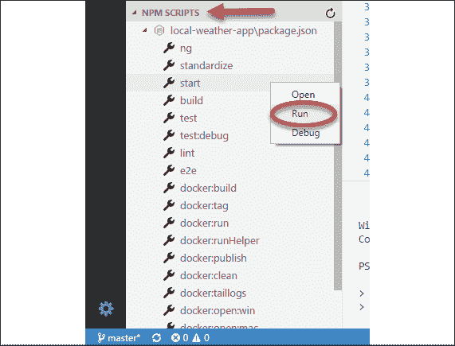

图 9.8:VS 代码中的 NPM 脚本

您可以点击任何脚本启动包含`package.json`中脚本的行，或者右键点击并选择**运行**来执行脚本。

接下来，让我们看一个与 Docker 交互的更简单的方法。

## VS 代码中的 Docker 扩展

与 Docker图像和容器交互的另一种方式是通过 VS 代码。如果您已经按照*第 2 章*、*设置您的开发环境*中的建议，从 Microsoft 安装了`ms-azuretools.vscode-docker`Docker 扩展，您可以通过左侧导航菜单 VS Code 上的 Docker 徽标识别扩展，如以下屏幕截图中以白色圆圈所示：

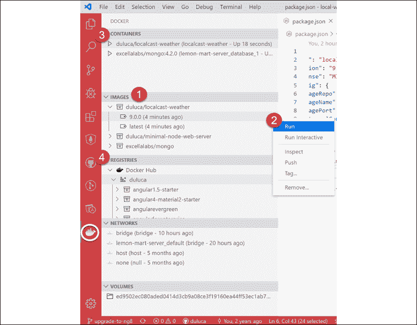

图 9.9:VS 代码中的 Docker 扩展

让我们看一下扩展提供的一些功能。请参阅前面的屏幕截图和下表中编号的步骤，以获取快速解释：

1.  **映像**包含系统中存在的所有容器快照的列表。
2.  右键点击 Docker 图像会弹出一个上下文菜单，在其上运行各种操作，如**运行**、**推送**和**标签****。**
3.  **容器**列出系统中存在的所有可执行 Docker 容器，您可以启动、停止或附加到这些容器。
4.  **注册表**显示您配置要连接的注册表，如 DockerHub 或**AWS 弹性容器注册表**（**AWS ECR**）。

虽然扩展使与 Docker 的交互更加容易，但 Docker 的**npm 脚本（您使用`mrm`任务配置）将大量与相关的构建、标记和测试图像的琐事自动化。它们都是跨平台的，并且在 CI 环境中同样有效。**

`npm run docker:debug`脚本自动化了许多琐事，以验证您是否具有良好的映像构建！

现在，让我们看看如何将容器部署到云中，然后实现 CD。

# 将 Dockerfile 部署到云

使用 Docker 的优点之一是，我们可以将其部署在任何数量的操作环境中，从个人 PC 到服务器和云提供商。在任何情况下，我们都希望容器以同样的方式运行。让我们将 LocalCast 天气应用程序部署到 Google Cloud Run。

## 谷歌云运行

Google Cloud Run 允许您部署任意 Docker 容器，并在 Google Cloud 平台上执行它们，而无需任何繁重的开销。完全管理的实例提供了一些空闲时间；然而，这里没有永远免费的版本。请注意您可能招致的任何费用。参见[https://cloud.google.com/run/pricing?hl=en_US%20for%20pricing](https://cloud.google.com/run/pricing?hl=en_US%20for%20pricing) 。

请参阅*第 2 章**设置您的开发环境*，了解如何安装 glcoud 的说明。

本节使用**本地天气 app**回购。

让我们配置 glcoud，以便部署一个`Dockerfile`：

1.  Update your `Dockerfile` to override the `ENTRYPOINT` command:

    ```ts
    **Dockerfile**
    FROM duluca/minimal-node-web-server:lts-alpine
    WORKDIR /usr/src/app
    COPY dist/local-weather-app public
    ENTRYPOINT [ "npm", "start" ] 
    ```

    `minimal-node-web-server`中的`ENTRYPOINT`命令运行一个名为`dumb-init`的进程，强制随机分配节点进程的进程 ID。但是，gcloud 无法执行此命令，这就是为什么我们要覆盖它。

2.  Create a new gcloud project:

    ```ts
    $ gcloud projects create localcast-weather 
    ```

    记住使用您自己的项目名称！

3.  导航至[https://console.cloud.google.com/](https://console.cloud.google.com/ )
4.  Locate your new project and select the **Billing** option from the sidebar, as shown in the following screenshot:

    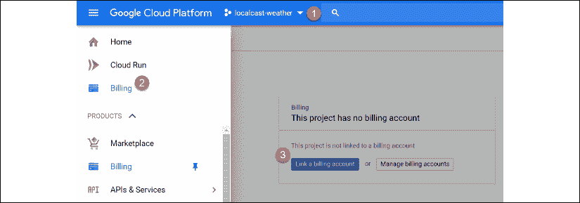

    图 9.10：计费选项

5.  Follow the instructions to set up a billing account.

    如果您看到它，Freemium 帐户选项也会起作用。否则，您可以选择利用免费试用优惠。但是，如果您每月收取一定金额的费用，最好设置一个预算警报以通知您。更多信息请访问[https://cloud.google.com/billing/docs/how-to/modify-project](https://cloud.google.com/billing/docs/how-to/modify-project) 。

6.  创建一个`.gcloudignore`文件并忽略除您的`Dockerfile`和`dist`文件夹之外的所有内容：

    ```ts
    **.gcloudignore**
    /*
    !Dockerfile
    !dist/ 
    ```

7.  Add a new npm script to build your `Dockerfile` in the cloud:

    ```ts
    **package.json**
      scripts: {
        "gcloud:build": "gcloud builds submit --tag gcr.io/localcast-weather/localcast-weather --project localcast-weather",
      } 
    ```

    记住使用您自己的项目名称！

8.  Add another npm script to deploy your published container:

    ```ts
    **package.json**
      scripts: {
        "gcloud:deploy": "gcloud run deploy --image gcr.io/localcast-weather/localcast-weather --platform managed --project localcast-weather --region us-east1"
      } 
    ```

    请注意，您应该提供离您地理位置最近的区域，以获得最佳体验。

9.  Build your `Dockerfile` as follows:

    ```ts
    $ npm run gcloud:build 
    ```

    在运行此命令之前，请记住为`prod`构建应用程序。您的`dist`文件夹中的任何内容都将被部署。

    请注意，在首次运行时，系统将提示您回答问题，以配置您的帐户以供首次使用。正确选择您的帐户和项目名称，否则，使用默认选项。在第一次运行期间，`build`命令可能会失败。有时，gcloud 需要多次运行才能预热并成功构建容器。

10.  发布容器后，使用以下命令部署它：

    ```ts
    $ npm run gcloud:deploy 
    ```

成功的部署将如下所示：


图 9.11：成功部署

恭喜你，你刚刚在谷歌云上部署了你的容器。您应该能够使用终端输出中的 URL 访问您的应用程序。

与往常一样，考虑将 CLI 命令作为 NPM 脚本添加到项目中，这样您就可以保持脚本的生动文档。这些脚本还允许您利用 npm 中的 pre 和 post 脚本，使您能够自动构建应用程序、容器和标记过程。因此，下次需要部署时，只需运行一个命令。我鼓励读者从我们之前为 gcloud 创建自己的脚本集而设置的 Docker 实用程序 npm 脚本中寻求灵感。

有关更多信息和一些示例项目，请参考[https://cloud.google.com/run/docs/quickstarts/prebuilt-deploy](https://cloud.google.com/run/docs/quickstarts/prebuilt-deploy) 和[https://cloud.google.com/run/docs/quickstarts/build-and-deploy](https://cloud.google.com/run/docs/quickstarts/build-and-deploy) 。

## 使用云运行配置 Docker

在上一节中，我们将我们的`Dockerfile`和`dist`文件夹提交给 gcloud，以便它可以为我们构建容器。这是一个方便的选项，可以避免一些额外的配置步骤。但是，您仍然可以利用基于 Docker 的工作流来构建和发布容器。

让我们用 gcloud 配置 Docker：

1.  设置您的默认区域：

    ```ts
    $ gcloud config set run/region us-east1 
    ```

2.  使用 gcloud 容器注册表配置 Docker:

    ```ts
    $ gcloud auth configure-docker 
    ```

3.  Tag your already built container with a gcloud hostname:

    ```ts
    $ docker tag duluca/localcast-weather:latest gcr.io/localcast-weather/localcast-weather:latest 
    ```

    有关如何标记图像的详细说明，请参阅[https://cloud.google.com/container-registry/docs/pushing-and-pulling](https://cloud.google.com/container-registry/docs/pushing-and-pulling) 。

4.  使用 Docker:

    ```ts
    $ docker push gcr.io/localcast-weather/localcast-weather:latest 
    ```

    将您的容器发布到 gcloud
5.  Execute the `deploy` command:

    ```ts
    $ gcloud run deploy --image gcr.io/localcast-weather/localcast-weather --platform managed --project localcast-weather 
    ```

    在初始部署期间，此命令可能会被卡住。大约 15 分钟后再试一次。

6.  按照屏幕上的说明完成部署。
7.  按照屏幕上显示的 URL 检查您的应用程序是否已成功部署。

前面的步骤演示了一种部署技术，类似于我们在*第 13 章*、*AWS*上的高可用云基础设施中部署到 AWS ECS 时使用的部署技术。

更多信息，请参考[https://cloud.google.com/sdk/gcloud/reference/run/deploy](https://cloud.google.com/sdk/gcloud/reference/run/deploy) 。在接下来的几节中，我们将切换回 LemonMart。

## 云运行故障排除

为了对您的 glcoud 命令进行故障排除，您可以使用位于[的谷歌云平台控制台 https://console.cloud.google.com/](https://console.cloud.google.com/) 。

在 Cloud Run 菜单下，您可以跟踪正在运行的容器。如果在部署过程中发生错误，您可能希望检查日志以查看容器创建的消息。请参阅以下屏幕截图，其中显示了我的`localcast-weather`部署日志：

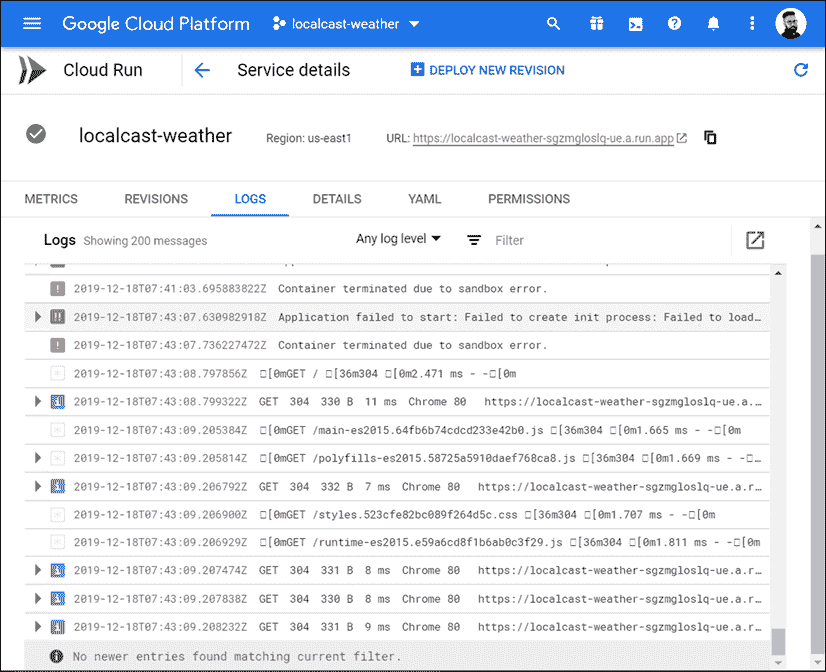

图 9.12：云运行日志

有关云运行故障排除的更多信息，请参阅[https://cloud.google.com/run/docs/troubleshooting](https://cloud.google.com/run/docs/troubleshooting) 。

祝贺您已经掌握了在本地开发环境中使用 Docker 容器并将其推送到云中的多个注册中心和运行时环境的基础知识。

# 连续部署

CD 是一个想法，成功通过管道的代码更改可以自动部署到目标环境。尽管有持续部署到生产环境的示例，但大多数企业更倾向于以开发环境为目标。采用门控方法将更改转移到开发、测试、登台和最终生产的各个阶段。CircleCI 可以通过审批工作流促进封闭式部署，本节后面将介绍这一点。

在 CircleCI 中，要部署您的映像，我们需要实现一个`deploy`作业。在这项工作中，您可以部署到许多目标，如 Google Cloud Run、Docker Hub、Heroku、Azure 或 AWS ECS。与这些目标的整合将涉及多个步骤。在高层，这些步骤如下：

1.  为目标环境配置 orb，它提供部署软件所需的 CLI 工具。
2.  将特定于目标环境的登录凭据或访问密钥存储为 CircleCI 环境变量。
3.  如果不使用特定于平台的`build`命令，则在 CI 管道中构建容器。然后使用`docker push`将生成的 Docker 映像提交到目标平台的 Docker 注册表。
4.  执行特定于平台的`deploy`命令，指示目标运行刚刚推送的 Docker 映像。

通过使用基于 Docker 的工作流，我们在可以使用的系统和目标环境方面实现了极大的灵活性。下图通过强调可供我们选择的可能排列来说明这一点：


图 9.13：n 对 n 部署

正如你所看到的，在一个集装箱化的世界里，可能性是无限的。在本章后面，我将演示如何使用容器和 CI 部署到 Google Cloud Run。在基于 Docker 的工作流之外，您可以使用专门构建的 CLI 工具快速部署应用程序。接下来，让我们看看现在如何使用 CircleCI 将应用程序部署到 Vercel。

## 现在使用 CircleCI 部署到 Vercel

在*第 4 章*、*自动测试、CI 和发布*中，我们配置了 LocalCastWeather 应用程序以使用 CircleCI 构建。我们可以增强 CI 管道，以获取构建输出，并可以选择立即将其部署到 Vercel。

请注意，ZEIT 现已于 2020 年更名为 Vercel。

本节使用**本地天气 app**回购。本节的`config.yml`文件名为`.circleci/config.ch9.yml`。您还可以在[上找到执行本章 CircleCI 中`.yml`文件的拉取请求https://github.com/duluca/local-weather-app/pull/50](https://github.com/duluca/local-weather-app/pull/50) 使用`branch deploy_Vercelnow`。

注意，该分支在`config.yml`和`Dockerfile`中有一个修改的配置，使用**本地天气 app**中的`projects/ch6`代码。

让我们更新`config.yml`文件以添加名为`deploy`的新作业。在接下来的工作流部分中，我们将使用此作业在获得批准后部署管道：

1.  从 Vercel Now 帐户创建令牌。
2.  将环境变量添加到名为`NOW_TOKEN`的 CircleCI 项目中，并将 Vercel Now 标记存储为值。
3.  In `config.yml`, update the `build` job with the new steps and add a new job named `deploy`:

    ```ts
    **.circleci/config.yml**
    ...
    jobs:
      build:
        ...       
        - run:
            name: Move compiled app to workspace
            command: |
              set -exu
              mkdir -p /tmp/workspace/dist
              mv dist/local-weather-app /tmp/workspace/dist/
        - persist_to_workspace:
            root: /tmp/workspace
            paths:
              - dist/local-weather-app
      deploy:
        docker:
          - image: circleci/node:lts
        working_directory: ~/repo
        steps:
          - attach_workspace:
              at: /tmp/workspace
          - run: npx now --token $NOW_TOKEN --platform-version 2 --prod /tmp/workspace/dist/local-weather-app --confirm 
    ```

    在`build`作业中，构建完成后，我们添加了两个新步骤。首先，我们将`dist`文件夹中已编译的应用程序移动到工作区，并保留该工作区，以便稍后在另一个作业中使用。在一个名为`deploy`的新作业中，我们附加了工作区，并使用 npx 运行`now`命令来部署`dist`文件夹。这是一个简单的过程。

    注意，`$NOW_TOKEN`是我们存储在 CircleCI 项目中的环境变量。

4.  Implement a simple CircleCI workflow to continuously deploy the outcome of your `build` job:

    ```ts
    **.circleci/config.yml**
    ...
    workflows:
      version: 2
      build-test-and-deploy:
        jobs:
          - build
          - deploy:
             requires:
               - build 
    ```

    请注意，`deploy`作业等待`build`作业完成后才能执行。

5.  通过检查测试结果，确保您的 CI 管道成功执行：

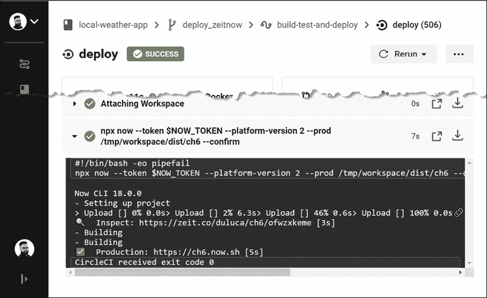

图 9.14:deploy_Vercelnow 分支上成功部署 Vercel Now 本地天气应用程序

云提供商的大多数 CLI 命令需要安装在管道中才能正常运行。由于 Vercel 现在有一个 npm 包，这很容易做到。AWS、Google Cloud 或 Microsoft Azure 的 CLI 工具需要使用`brew`或`choco`等工具进行安装。在 CI 环境中手动执行此操作非常乏味。接下来，我们将介绍有助于解决问题的球体。

## 使用 orbs 部署到 GCloud

ORB包含一组配置元素，用于封装 CircleCI 项目之间的可共享行为。CircleCI 提供了由 CLI 工具的维护者开发的 ORB。这些 ORB 使您可以轻松地将 CLI 工具添加到管道中，而无需手动设置，只需最少的配置。

要使用 orbs，您的`config.yml`版本号必须设置为`2.1`，并且在 CircleCI 安全设置中，您必须选择允许未经认证的 orbs 的选项。

以下是您可以在项目中使用的一些球体：

*   `circleci/aws-cli`和`circleci/aws-ecr`为您提供 AWS CLI 工具并帮助您与**AWS 弹性容器服务**（**AWS ECS**交互，执行将您的容器部署到 AWS ECR 等任务。
*   `circleci/aws-ecs`优化您的 CircleCI 配置，将您的容器部署到 AWS ECS。
*   `circleci/gcp-cli`和`circleci/gcp-gcr`向提供 GCloud CLI 工具和访问**谷歌容器注册表**（**GCR**）。
*   `circleci/gcp-cloud-run`优化 CircleCI 配置，将容器部署到云运行。
*   `circleci/azure-cli`和`circleci/azure-acr`为您提供 Azure CLI工具和对**Azure 容器注册表**（**ACR**的访问权限。

有关如何使用这些 Orb 的更多信息，请访问Orb 注册表[https://circleci.com/orbs/registry](https://circleci.com/orbs/registry) 。

现在，让我们使用本地天气应用程序配置`circleci/gcp-cloud-run`orb，这样我们就可以将应用程序持续部署到 GCloud，而无需在 CI 服务器上手动安装和配置 GCloud CLI 工具。

在**本地天气应用**repo 上，您可以在[找到一个执行 CircleCI 上此步骤云运行配置的 pull 请求 https://github.com/duluca/local-weather-app/pull/51](https://github.com/duluca/local-weather-app/pull/51) ，使用`deploy_cloudrun` 分支。

注意，该分支在`config.yml`和`Dockerfile`中有一个修改的配置，使用**本地天气 app**中的`projects/ch6`代码。

首先，配置 CircleCI 和 GCloud 帐户，以便可以从 CI 服务器进行部署。这与从您的开发机器部署的明显不同，因为 gcloud CLI 工具会自动为您设置必要的身份验证配置。在这里，您必须手动执行此操作：

1.  在 CircleCI 帐户设置的安全部分下，确保允许执行未经认证/未签名的 ORB。
2.  In the CircleCI project settings, add an environment variable named `GOOGLE_PROJECT_ID`.

    如果您使用了与我相同的项目 ID，则应为`localcast-weather`。

3.  Create a GCloud service account key for your project's existing service account.

    创建服务帐户密钥将生成一个 JSON 文件。不要将此文件签入代码存储库。不要通过不安全的通信渠道（如电子邮件或短信）共享其内容。公开此文件的内容意味着任何第三方都可以访问密钥权限允许的 GCloud 资源。

4.  将 JSON 文件的内容复制到名为`GCLOUD_SERVICE_KEY`的 CircleCI 环境变量中。
5.  Add another environment variable named `GOOGLE_COMPUTE_ZONE` and set it to your preferred zone.

    我用了`us-east1`。

6.  更新您的`config.yml`文件以添加名为`circleci/gcp-cloud-run`：

    ```ts
    **.circleci/config.yml**
    **version: 2.1**
    orbs:
      cloudrun: circleci/gcp-cloud-run@1.0.2
      ... 
    ```

    的球体
7.  Next, implement a new job named `deploy_cloudrun`, leveraging orb features to initialize, build, deploy, and test our deployment:

    ```ts
    **.circleci/config.yml**
    ...
    deploy_cloudrun:
      docker:
        - image: 'cimg/base:stable'
      working_directory: ~/repo
      steps:
        - attach_workspace:
            at: /tmp/workspace
        - checkout
        - run:
            name: Copy built app to dist folder
            command: cp -avR /tmp/workspace/dist/ .
        - cloudrun/init
        - cloudrun/build:
           tag: 'gcr.io/${GOOGLE_PROJECT_ID}/test-${CIRCLE_SHA1}'
           source: ~/repo
        - cloudrun/deploy:
            image: 'gcr.io/${GOOGLE_PROJECT_ID}/test-${CIRCLE_SHA1}'
            platform: managed
            region: us-east1
            service-name: localcast-weather
            unauthenticated: true
        - run:
            command: >
              GCP_API_RESULTS=$(curl -s "$GCP_DEPLOY_ENDPOINT")
              if ! echo "$GCP_API_RESULTS" | grep -nwo "LocalCast Weather"; then
                echo "Result is unexpected"
                echo 'Result: '
                curl -s "$GCP_DEPLOY_ENDPOINT"
                exit 1;
              fi
            name: Test managed deployed service. 
    ```

    我们首先从`build`作业加载`dist`文件夹。然后我们运行`cloudrun/init`，以便可以初始化 CLI 工具。使用`cloudrun/build`，我们在项目的根目录下构建`Dockerfile`，它会自动将构建结果存储在 GCR 中。然后，`cloudrun/deploy`部署我们刚刚构建的映像，让我们的代码生效。在最后一个命令中，我们使用`curl`工具检索我们网站的`index.html`文件，并通过搜索 LocalCast Weather 字符串检查它是否正确部署。

8.  Update your workflow to continuously deploy to gcloud:

    ```ts
    **.circleci/config.yml**
    ...
    workflows:
     version: 2
      build-test-and-deploy:
        jobs:
          - build
          - deploy_cloudrun:
              requires:
                - build 
    ```

    请注意，您可以有多个同时部署到多个目标的`deploy`作业。

9.  通过检查测试结果，确保成功执行 CI 管道：

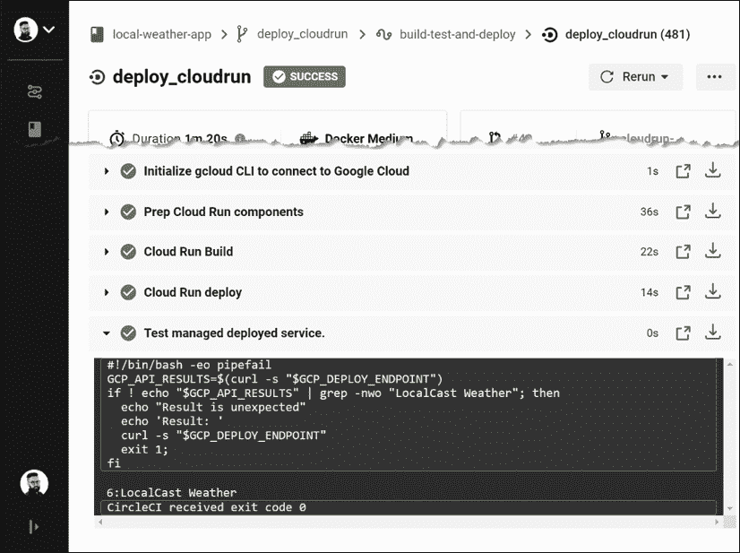

图 9.15:deploy_cloudrun 分支上本地天气应用程序的 gcloud 成功部署

CD 非常适合于开发和测试环境。但是，通常需要有门控部署，其中人员必须在部署到达生产环境之前批准部署。接下来，让我们看看如何使用 CircleCI 实现这一点。

## 门控 CI 工作流

在 CircleCI 中，您可以定义工作流来控制作业的执行方式和时间。考虑下面的配置，给定任务 PoT T0 和 Ty1 T1：

```ts
**.circleci/config.yml**
workflows:
  version: 2
  build-and-deploy:
    jobs:
      - build
      - hold:
          type: approval
          requires:
            - build
      - deploy:
          requires:
            - hold 
```

首先，执行`build`作业。然后，我们介绍了一个名为`hold`的特殊作业，其类型为`approval`，要求成功完成`build`作业。一旦发生这种情况，管道将暂停。如果或当决策者批准`hold`时，则可以执行`deploy`步骤。请参阅以下屏幕截图以查看`hold`的外观：


图 9.16：管道中的封存

考虑一个更复杂的工作流，在下面的代码片段中显示，其中，将 To.T0Ay 和 OutT1 的步骤分成两个单独的工作：

```ts
workflows:
  version: 2
    build-test-and-approval-deploy:
      jobs:
      - build 
      - test
      - hold:
         type: approval
         requires:
           - build
           - test
         filters:
           branches:
             only: master
      - deploy:
        requires:
          - hold 
```

在这种情况下，`build`和`test`作业并行执行。如果我们在一个分支上，这就是管道停止的地方。分支与`master`合并后，管道将暂停，决策者可以选择是否部署特定构建。这种类型的分支过滤确保只有合并到`master`的代码才能部署，这与 GitHub 流一致。

接下来，我们将深入探讨如何定制 Docker 以适应您的工作流程和环境。

# 高级连续集成

在*第 4 章*、*自动测试、CI 和发布到生产*中，我们介绍了利用默认功能的基本 CircleCI 管道。除了单元测试执行的基本自动化之外，CI 的另一个目标是使一致的、可重复的环境能够在每次代码推送时构建、测试和生成应用程序的可部署构件。在推出一些代码之前，开发人员应该有一个合理的期望，即他们的构建将通过；因此，创建一个可靠的 CI 环境，使开发人员也可以在本地机器上运行的命令自动化是至关重要的。为了实现这个目标，我们将构建一个定制的构建管道，它可以在任何操作系统上运行，而无需配置或任何行为变化。

本节使用**柠檬超市**回购。通过执行本章前面所述的`npm run docker:debug`，确保您的项目已正确配置。

## 容器化构建环境

为了确保跨各种操作系统平台、开发人员机器和 CI 环境的一致构建环境，您可以将构建环境容器化。请注意，目前至少有六种常用 CI 工具在使用。了解每种工具的来龙去脉几乎是不可能完成的任务。

构建环境的容器化是一个高级概念，它超越了当前对 CI 工具的期望。然而，容器化是标准化超过 90%的构建基础结构的一种很好的方法，几乎可以在任何 CI 环境中执行。通过这种方法，您学习的技能和创建的构建配置变得更有价值，因为您的知识和创建的工具都可以转移和重用。

有许多策略可以将构建环境容器化，使其具有不同的粒度级别和性能期望。在本书中，我们将重点介绍可重用性和易用性。与其创建一组复杂、相互依赖的 Docker 映像，以实现更高效的故障优先和恢复路径，不如将重点放在一个简单明了的工作流上。Docker 的较新版本有一个称为多阶段构建（multi-stage builds）的强大功能，它允许您以易于阅读的方式定义一个多映像过程，并维护一个单一的`Dockerfile`。

在流程结束时，您可以提取一个优化的容器映像作为我们的可交付工件，从而降低流程中以前使用的映像的复杂性。

提醒您，您的单曲`Dockerfile`看起来像以下示例：

```ts
**Dockerfile**
FROM duluca/minimal-node-web-server:lts-alpine 
WORKDIR /usr/src/app
COPY dist/lemon-mart public 
```

## 多级 Dockerfiles

多阶段通过在单个`Dockerfile`中使用多个`FROM`语句构建工作，其中每个阶段可以执行一个任务，并使其实例中的任何资源可供其他阶段使用。在构建环境中，我们可以将各种与构建相关的任务作为自己的阶段来实现，然后将最终结果（例如角度构建的`dist`文件夹）复制到包含 web 服务器的最终图像中。在这种情况下，我们将实现图像的三个阶段：

*   **生成器**：用于构建 Angular 应用程序的生产版本
*   **测试仪**：用于对无头铬实例进行单元和 e2e 测试
*   **Web 服务器**：最终结果只包含优化的生产位

多阶段构建需要 Docker 版本 17.05 或更高版本。要了解有关多阶段构建的更多信息，请阅读[中的文档 https://docs.docker.com/develop/develop-img/multistage-build](https://docs.docker.com/develop/develop-img/multistage-build) 。

如下图所示，构建者将构建应用程序，测试者将执行测试：


图 9.17：多阶段 Dockerfile

最终图像将使用构建器步骤的结果构建。

首先，在项目的根目录下创建一个新文件来实现多阶段配置，名为`integration.Dockerfile`。

### 建设者

第一阶段为`builder`。我们需要一个轻量级的构建环境，以确保全面一致的构建。为此，我创建了一个基于 Alpine 的节点构建环境示例，其中包括 npm、bash 和 Git 工具。此最小容器称为`duluca/minimal-node-build-env`，基于节点 alpine，可在[的Docker Hub 上找到 https://hub.docker.com/r/duluca/minimal-node-build-env](https://hub.docker.com/r/duluca/minimal-node-build-env) 。此图像比节点小约 10 倍。

Docker 映像的大小对构建时间有实际影响，因为 CI 服务器或您的团队成员将花费额外的时间来绘制更大的映像。选择最适合您需要的环境。

让我们使用合适的基础图像创建生成器：

1.  确保您在`package.json`：

    ```ts
    **package.json**
    "scripts": {
      "build:prod": "ng build --prod",
    } 
    ```

    中有`build:prod`命令
2.  从基于 Node.js 的构建环境继承，如`node:lts-alpine`或`duluca/minimal-node-build-env:lts-alpine`。
3.  在名为`integration.Dockerfile`的新`Dockerfile`中实现特定于环境的构建脚本，如图所示：

    ```ts
    **integration.Dockerfile**
    FROM duluca/minimal-node-build-env:lts-alpine as builder
    ENV BUILDER_SRC_DIR=/usr/src
    # setup source code directory and copy source code
    WORKDIR $BUILDER_SRC_DIR
    COPY . .
    # install dependencies and build
    RUN npm ci
    RUN npm run style
    RUN npm run lint
    RUN npm run build:prod 
    ```

CI 环境将从 GitHub 检出您的源代码，并将其放在当前目录中。因此，使用点符号从**当前工作目录**（**CWD**）复制源代码应该可以工作，就像在本地开发环境中一样。如果遇到问题，请参阅 CI 提供商的文档。

接下来，让我们看看如何调试 Docker 构建。

#### 调试生成环境

根据您的特殊需要，Dockerfile 的生成器部分的初始设置可能会令人沮丧。要测试新命令或调试错误，可能需要直接与生成环境交互。

要在生成环境中以交互方式进行实验和/或调试，请执行以下命令：

```ts
$ docker run -it duluca/minimal-node-build-env:lts-alpine /bin/bash 
```

在将命令烘焙到您的`Dockerfile`中之前，您可以在此临时环境中测试或调试命令。

### 测试员

第二阶段为`tester`。默认情况下，Angular CLI 生成面向开发环境的测试需求。这在 CI 环境中不起作用；我们必须将 Angular 配置为针对无头浏览器工作，该浏览器可以在没有 GPU 的帮助下执行，此外，还必须配置容器化环境来执行测试。

*第 4 章*、*自动测试、CI 和投产*中介绍了角度测试工具。

#### 配置一个无头浏览器，用于

量角器测试工具正式支持在无头模式下对铬运行。为了在 CI 环境中执行角度测试，您需要将测试运行程序 Karma 配置为使用无头 Chrome 实例运行：

1.  Update `karma.conf.js` to include a new headless browser option:

    ```ts
    **Karma.conf.js**
    ...
        browsers: ['Chrome', 'ChromiumHeadless', 'ChromiumNoSandbox'],
        customLaunchers: {
          ChromiumHeadless: {
            base: 'Chrome',
            flags: [
              '--headless',
              '--disable-gpu',
              // Without a remote debugging port, Google Chrome exits immediately.
              '--remote-debugging-port=9222',
              ],
            debug: true,
          },
          ChromiumNoSandbox: {
            base: 'ChromiumHeadless',
            flags: ['--no-sandbox', '--disable-translate', '--disable- extensions']
          },
        }, 
    ```

    `ChromiumNoSandbox`自定义启动器封装了良好默认设置所需的所有配置元素。

2.  Update the `protractor` configuration to run in headless mode:

    ```ts
    **e2e/protractor.conf.js**
    ...
      capabilities: { 
        browserName: 'chrome',
        chromeOptions: {
          args: [
            '--headless',
            '--disable-gpu',
            '--no-sandbox',
            '--disable-translate',
            '--disable-extensions',
            '--window-size=800,600',
          ],
        },
      },
    ... 
    ```

    为了测试应用程序的响应情况，您可以使用`--window-size`选项（如前所示）更改浏览器设置。

3.  Update the `package.json` scripts to select the new browser option in the production build scenarios:

    ```ts
    **package.json**
    "scripts": {
      ...
      "test": "ng test lemon-mart --browsers Chrome",
      "test:prod": "npm test -- --browsers ChromiumNoSandbox   --  watch=false"
    ...
    } 
    ```

    注意，`test:prod`不包括`npm run e2e`。e2e 测试是需要更长时间执行的集成测试，因此请仔细考虑将它们作为关键构建管道的一部分。e2e 测试不会在下一节提到的轻量级测试环境上运行，因为它们需要更多的资源和时间来执行。

现在，让我们定义集装箱化测试环境。

#### 配置我们的测试环境

对于轻型测试环境，我们将利用基于 Alpine 的 Chromium 浏览器安装：

1.  继承自`duluca/minimal-node-chromium:lts-alpine`。
2.  将以下配置附加到`integration.Dockerfile`：

    ```ts
    **integration.Dockerfile**
    ...
    FROM duluca/minimal-node-chromium:lts-alpine as tester
    ENV BUILDER_SRC_DIR=/usr/src
    ENV TESTER_SRC_DIR=/usr/src
    WORKDIR $TESTER_SRC_DIR
    COPY --from=builder $BUILDER_SRC_DIR .
    # force update the webdriver, so it runs with latest version of Chrome
    RUN cd ./node_modules/protractor && npm i webdriver-manager@latest
    WORKDIR $TESTER_SRC_DIR
    RUN npm run test:prod 
    ```

前面的脚本将从`builder`阶段复制生产构建，并以可预测的方式执行测试脚本。

### 网络服务器

第三个也是最后一个阶段将生成作为 web 服务器的容器。一旦此阶段完成，先前的阶段将被丢弃，最终结果将是一个优化的小于 10 MB 的容器：

1.  在文件末尾追加以下`FROM`语句来构建 web 服务器，但这次，`COPY`是来自`builder`的生产就绪代码，如下面的代码片段所示：

    ```ts
    **integration.Dockerfile**
    ...
    FROM duluca/minimal-nginx-web-server:1-alpine as webserver
    ENV BUILDER_SRC_DIR=/usr/src
    COPY --from=builder $BUILDER_SRC_DIR/dist/lemon-mart /var/www
    CMD 'nginx' 
    ```

2.  Build and test your multi-stage `Dockerfile`:

    ```ts
    $ docker build -f integration.Dockerfile . 
    ```

    根据您的操作系统，您可能会看到终端错误。只要 Docker 映像最终成功构建，您就可以安全地忽略这些错误。出于参考目的，当我们稍后在 CircleCI 上构建此映像时，CI 服务器上不会记录任何错误。

3.  将您的脚本保存为名为`build:integration`的新 npm 脚本，如图所示：

    ```ts
    **package.json**
    "scripts": {
    ...
      "build:integration": "cross-conf-env docker image build -f integration.Dockerfile . -t $npm_package_config_imageRepo:latest",
    ...
    } 
    ```

干得好！您已经定义了自定义生成和测试环境。让我们设想一下我们努力的最终结果如下：

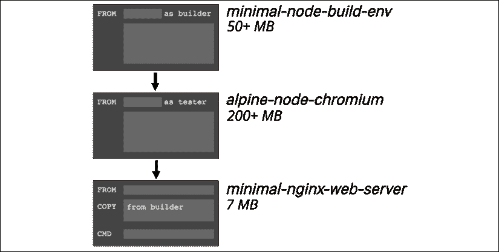

图 9.18：多阶段构建环境结果

通过利用多阶段`Dockerfile`，我们可以定义定制的构建环境，并且只在流程结束时发送必要的字节。在前面的示例中，我们避免向生产服务器发送 250+MB 的开发依赖项，而只提供一个内存占用最少的 7 MB 容器。

现在，让我们在 CircleCI 上执行这个容器化管道。

## 容器中的 CircleCI 容器

在*第 4 章*、*自动测试、CI 和发布到生产*中，我们创建了一个相对简单的CircleCI 文件。稍后，我们也将为这个项目重复相同的配置，但是现在，我们将使用一个容器中的容器设置，利用我们刚刚创建的多阶段`Dockerfile`。

在**柠檬城**回购协议中，本节的`config.yml`文件名为`.circleci/config.docker-integration.yml`。您还可以在[上找到执行本章 CircleCI 中`.yml`文件的 pull 请求 https://github.com/duluca/lemon-mart/pull/25](https://github.com/duluca/lemon-mart/pull/25) 使用`docker-integration` 分支。

请注意，此构建使用修改后的`integration.Dockerfile`来使用**lemon mart**中的`projects/ch8`代码。

在您的源代码中，创建一个名为`.circleci`的文件夹，并添加一个名为`config.yml`的文件：

```ts
**.circleci/config.yml**
version: 2.1
jobs:
  build:
    docker:
      - image: circleci/node:lts
    working_directory: ~/repo
    steps:
      - checkout
      - setup_remote_docker
      - run:
          name: Execute Pipeline (Build Source -> Test -> Build Web Server)
          command: |
            docker build -f integration.Dockerfile . -t lemon-mart:$CIRCLE_BRANCH
            mkdir -p docker-cache
            docker save lemon-mart:$CIRCLE_BRANCH | gzip > docker-cache/built-image.tar.gz
      - save_cache:
          key: built-image-{{ .BuildNum }}
          paths:
            - docker-cache
      - store_artifacts:
          path: docker-cache/built-image.tar.gz
          destination: built-image.tar.gz
workflows:
  version: 2
  build-and-deploy:
    jobs:
      - build 
```

在前面的`config.yml`文件中，定义了一个名为`build-and-deploy`的工作流，其中包含一个名为`build`的作业。作业使用 CircleCI 的预建`circleci/node:lts image`。

`build`作业有五个步骤：

1.  `checkout`从 GitHub 中检出源代码。
2.  `setup_remote_docker`通知 CircleCI 在 Docker 环境中设置 Docker，以便我们可以在管道中运行容器。
3.  `run`执行`docker build -f integration.Dockerfile .`命令启动我们的定制构建过程，缓存生成的基于 Alpine 的图像，并用`$CIRCLE_BRANCH.`标记它
4.  `save_cache`将我们创建的图像保存在缓存中，以便下一步使用。
5.  `store_artifacts`从缓存中读取创建的映像，并将该映像发布为构建工件，该工件可以从 web 界面下载，也可以被其他作业用于将其部署到云环境。

在您将更改同步到 GitHub 之后，如果一切顺利，您将拥有一个通过*绿色*构建。如以下屏幕截图所示，此构建成功：


图 9.19：使用 lemon-mart docker 集成分支的 CircleCI 绿色构建

请注意，tarred 和 gzip 图像文件大小为 9.2MB，其中包括我们的 web 应用程序，基本图像大小约为 7MB。

目前，CI 服务器正在运行并执行我们的三步管道。正如您在前面的屏幕截图中所看到的，构建正在生成一个涂了焦油的、经过 gzip 处理的 web 服务器映像文件，名为`built-image.tar.gz`。您可以从**工件**选项卡下载此文件。但是，我们不会将生成的映像部署到服务器。

您现在已经充分掌握了使用 CircleCI 的技巧。我们将在*第 13 章*、*AWS*上的高可用云基础设施中，重温这个多阶段`Dockerfile`在 AWS 上进行部署。

接下来，让我们看看如何从 Angular 应用程序获取代码覆盖率报告，并将结果记录在 CircleCI 中。

# 代码覆盖率报告

了解 Angular项目单元测试覆盖率的数量和趋势的一个好方法是通过代码覆盖率报告。

要生成应用程序的报告，请从`project`文件夹执行以下命令：

```ts
$ npx ng test --browsers ChromiumNoSandbox --watch=false --code-coverage 
```

生成的报告将在名为`coverage`的文件夹下创建为 HTML 文件；执行以下命令以在浏览器中查看它：

```ts
$ npx http-server -c-1 -o -p 9875 ./coverage 
```

在项目中安装`http-server`作为开发依赖项。

以下是`istanbul/nyc`为 LemonMart 生成的文件夹级样本覆盖率报告：


图 9.20:LemonMart 的伊斯坦布尔代码覆盖率报告

您可以向下钻取特定文件夹，例如`src/app/auth`，并获得文件级报告，如下所示：


图 9.21:src/app/auth 的伊斯坦布尔代码覆盖率报告

您可以进一步向下钻取以获取给定文件的行级覆盖率，例如`cache.service.ts`，如下所示：


图 9.22:cache.service.ts 的伊斯坦布尔代码覆盖率报告

在前面的屏幕截图中，您可以看到，**5**、**12**、**17-18**和**21-22**行未被任何测试覆盖。**I**图标表示未采用`if`路径。我们可以通过实施单元测试来提高代码覆盖率，单元测试可以执行`CacheService`中包含的功能。作为练习，读者应尝试使用新的单元测试至少覆盖其中一个函数，并观察代码覆盖率报告的更改。

## CI 中的代码覆盖率

理想情况下，您的 CI 服务器配置应在每次测试运行时生成并托管代码覆盖率报告。然后，您可以将代码覆盖率用作另一个代码质量门，以防止在新代码降低总体代码覆盖率百分比时合并请求。这是一种强化**测试驱动开发**（**TDD**思维的好方法。

您可以使用服务，如工作服，可在[找到 https://coveralls.io/](https://coveralls.io/) ，实现您的代码覆盖率检查，它可以将您的代码覆盖率级别直接嵌入 GitHub pull 请求中。

让我们为 LemonMart 配置工作服：

在**柠檬城**回购协议上，本节的`config.yml`文件名为`.circleci/config.ch9.yml`。

1.  在 CircleCI 帐户设置的安全部分下，确保允许执行未经认证/未签名的 ORB。
2.  在[注册您的 GitHub 项目 https://coveralls.io/](https://coveralls.io/) 。
3.  复制 repo 令牌并将其作为环境变量存储在名为`COVERALLS_REPO_TOKEN`的 CircleCI 中。
4.  在进行任何代码更改之前创建新分支。
5.  更新`karma.conf.js`以便将代码覆盖结果存储在`coverage`文件夹下：

    ```ts
    **karma.conf.js**
    ...
        coverageIstanbulReporter: {
          dir: require('path').join(__dirname, **'coverage'**),
          reports: ['html', 'lcovonly'],
          fixWebpackSourcePaths: true,
        },
    ... 
    ```

6.  使用工作服 orb 更新`.circleci/config.yml`文件，如图所示：

    ```ts
    **.circleci/config.yml**
    version: 2.1
    orbs:
      **coveralls: coveralls/coveralls@1.0.4** 
    ```

7.  Update the `build` job to store code coverage results and upload them to Coveralls:

    ```ts
    **.circleci/config.yml**
    jobs:
      build:
        ...
          - run: npm test -- --watch=false --code-coverage
          - run: npm run e2e
          - store_test_results:
              path: ./test_results
          **- store_artifacts:**
     **path: ./coverage**
     **- coveralls/upload**
          - run:
              name: Tar & Gzip compiled app
              command: tar zcf dist.tar.gz dist/lemon-mart
          - store_artifacts:
              path: dist.tar.gz 
    ```

    请注意，orb 会自动为您的帐户配置工作服，因此`coveralls`/`upload`命令可以上载您的代码覆盖率结果。

8.  将您的更改提交到分支并发布它。
9.  使用分支在 GitHub 上创建拉取请求。
10.  On the pull request, verify that you can see that Coveralls is reporting your project's code coverage, as shown:

    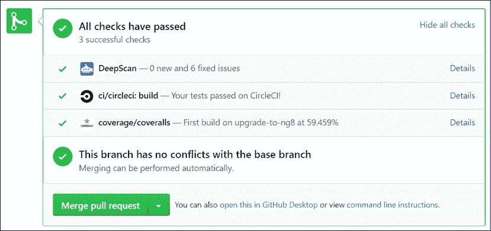

    图 9.23：工作服报告代码覆盖范围

11.  将拉取请求合并到主分支。

祝贺现在，您可以修改分支保护规则，要求代码覆盖率级别必须高于一定百分比，然后才能将拉请求合并到主请求。

位于[的柠檬艺术项目 https://github.com/duluca/lemon-mart](https://github.com/duluca/lemon-mart) 实现了一个功能齐全的`config.yml`文件。该文件还实现了[Cypress.io](http://Cypress.io)，与 Angular 的 e2e 工具相比，它在 CircleCI 中也是一个更健壮的解决方案。Cypress orb 可以记录测试结果，并允许您从 CircleCI 管道查看测试结果。

利用您在本章学到的知识，您可以合并 LocalCast Weather for LemonMart 的`deploy`脚本，并实现门控部署工作流。

# 总结

在本章中，您学习了 DevOps 和 Docker。您将 web 应用程序容器化，使用 CLI 工具将容器部署到 Google Cloud Run，并学习了如何实现封闭式 CI 工作流。您利用高级 CI 技术，利用多阶段`Dockerfile`构建基于容器的 CI 环境。此外，您还熟悉了 ORB、工作流和代码覆盖工具。

我们利用 CircleCI 作为基于云的 CI 服务，并强调您可以将构建结果部署到所有主要的云托管提供商。您已经看到了如何实现 CD。我们介绍了通过 CircleCI 运行到 Vercel Now 和 Google Cloud 的示例部署，允许您实现自动化部署。

通过强大的 CI/CD 管道，您可以与客户和团队成员共享应用程序的每个迭代，并快速向最终用户提供错误修复或新功能。

# 运动

1.  将 CircleCI 和工作服徽章添加到代码存储库的`README.md`文件中。
2.  实现 Cypress for e2e 测试，并使用 Cypress orb 在 CircleCI 管道中运行它。
3.  为 Lemon Mart 应用程序实施 Vercel Now 部署和条件工作流。您可以在 lemon mart 回购协议上找到生成的名为`.circleci/config.ch9.yml`的`config.yml`文件。

# 进一步阅读

*   *Dockerfile 参考*、2020、[https://docs.docker.com/engine/reference/builder/](https://docs.docker.com/engine/reference/builder/)
*   *CircleCI orbs*2020，[https://circleci.com/orbs/](https://circleci.com/orbs/)
*   *正在部署容器映像*、2020、[https://cloud.google.com/run/docs/depl](https://cloud.google.com/run/docs/depl) 奥英
*   *创建和管理服务账户密钥*、2020、[https://cloud.google.com/iam/docs/creating-managing-service-account-keys#iam-服务帐户密钥创建控制台](https://cloud.google.com/iam/docs/creating-managing-service-account-keys#iam-service-account-keys-cr)

# 问题

尽可能回答以下问题，以确保您在不使用谷歌搜索的情况下理解了本章的关键概念。你需要帮助回答这些问题吗？参见*附录 D*、*自我评估答案*在线[https://static.packt-cdn.com/downloads/9781838648800_Appendix_D_Self-Assessment_Answers.pdf](https://static.packt-cdn.com/downloads/9781838648800_Appendix_D_Self-Assessment_Answers.pdf) 或访问[https://expertlysimple.io/angular-self-assessment](https://expertlysimple.io/angular-self-assessment) 。

1.  解释 Docker 图像和 Docker 容器之间的区别。
2.  CD 管道的用途是什么？
3.  CD 的好处是什么？
4.  我们如何弥补配置差距？
5.  圆环球是做什么的？
6.  使用多阶段`Dockerfile`有什么好处？
7.  代码覆盖率报告如何帮助保持应用程序的质量？