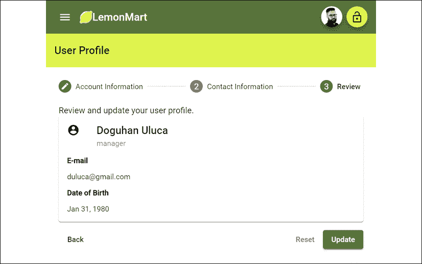
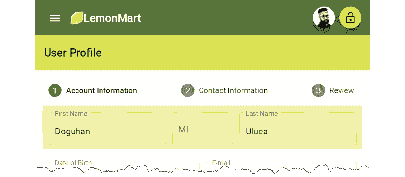
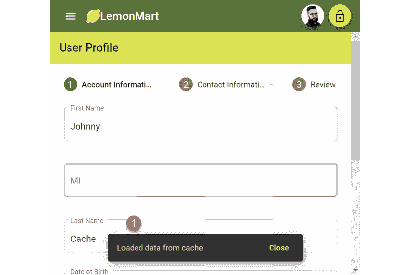

# 11

# 配方–可重用性、路由和缓存

在接下来的两章中，我们将完成 LemonMart 的大部分实现，并全面介绍路由器优先方法。在本章中，我将通过创建一个也支持数据绑定的可重用和可路由的组件来强化解耦组件体系结构的思想。我们使用 Angular 指令来减少样板代码，并利用类、接口、枚举、验证器和管道来最大限度地利用 TypeScript 和 ES 特性重用代码。

此外，我们将创建一个多步骤的形式，该形式在架构上具有良好的伸缩性，并支持响应性设计。然后，我们将通过引入 lemon rater 和封装 name 对象的可重用表单部件来区分用户控件和组件。

确保您的**lemon mart 服务器**在实施本章中提到的方法时已启动并运行。更多信息请参见*第 10 章*、*RESTful API 和完整堆栈实现*。

本章涵盖了很多方面。它是以配方格式组织的，因此在处理项目时可以快速引用特定的实现。我将介绍实现的体系结构、设计和主要组件。我将重点介绍一些重要的代码，以解释解决方案是如何结合在一起的。利用到目前为止所学的知识，我希望读者能够填写例行实现和配置细节。但是，如果遇到问题，您可以随时参考 GitHub 项目。

在本章中，您将了解以下主题：

*   具有缓存服务响应的 HTTP PUT 请求
*   多步骤响应形式
*   使用指令重用重复模板行为
*   具有可重用表单部件的可扩展表单体系结构
*   输入屏蔽
*   带有`ControlValueAccessor`的自定义控件
*   使用网格列表的布局

本书样本代码的最新版本在 GitHub 上，位于链接不久的存储库中。存储库包含代码的最终和完成状态。您可以在本章末尾通过查看`projects`文件夹下代码的章节末尾快照来验证您的进度。

要设置本章，请执行以下操作：

1.  在[克隆回购协议 https://github.com/duluca/lemon-mart](https://github.com/duluca/lemon-mart) 。
2.  在根文件夹上执行`npm install`以安装依赖项。
3.  本章的代码示例可在以下子文件夹中找到：

    ```ts
    projects/ch11 
    ```

4.  要运行本章的 Angular 应用程序，请执行以下命令：

    ```ts
    npx ng serve ch11 
    ```

5.  要运行本章的角度单元测试，请执行以下命令：

    ```ts
    npx ng test ch11 --watch=false 
    ```

6.  要运行本章的角度 e2e 测试，请执行以下命令：

    ```ts
    npx ng e2e ch11 
    ```

7.  To build a production-ready Angular app for this chapter, execute the following command:

    ```ts
    npx ng build ch11 --prod 
    ```

    请注意，存储库根目录下的`dist/ch11`文件夹将包含编译后的结果。

请注意，书中或 GitHub 上的源代码可能并不总是与 Angular CLI 生成的代码匹配。书中的代码和 GitHub 上的代码在实现上也可能有细微的差异，因为生态系统是不断发展的。随着时间的推移，示例代码自然会发生变化。同样在 GitHub 上，希望找到更正、修复以支持库的更新版本，或者并排实现多种技术以供读者观察。读者只希望实现书中推荐的理想解决方案。如果发现错误或有问题，请在 GitHub 上创建问题或提交请求，以方便所有读者。

您可以在*附录 C*、*保持 Angular 和 Tools 常青*中了解更多关于更新 Angular 的信息。您可以从[在线找到此附录 https://static.packt-cdn.com/downloads/9781838648800_Appendix_C_Keeping_Angular_and_Tools_Evergreen.pdf](https://static.packt-cdn.com/downloads/9781838648800_Appendix_C_Keeping_Angular_and_Tools_Evergreen.) 或[处 https://expertlysimple.io/stay-evergreen](https://expertlysimple.io/stay-evergreen) 。

让我们从实现一个用户服务来检索数据开始，这样我们就可以构建一个表单来显示和编辑配置文件信息。它的抽象部分，我们将在以后重构。

# 使用 GET 实现用户服务

为了实现一个用户配置文件，我们需要一个能够在`IUser`上执行 CRUD 操作的服务。我们将创建一个实现以下接口的用户服务：

```ts
export interface IUserService {
  getUser(id: string): Observable<IUser>
  updateUser(id: string, user: IUser): Observable<IUser>
  getUsers(
    pageSize: number,
    searchText: string,
    pagesToSkip: number
  ): Observable<IUsers>
} 
```

在创建服务之前，请确保启动**lemon mart 服务器**，并将应用程序的`AuthMode`设置为`CustomServer`。

在本节中，我们将实现`getUser`和`updateUser`功能。我们将在*第 12 章*中实施`getUsers`、*配方-主/明细、数据表和 NgRx*，以支持数据表分页。

首先创建用户服务：

1.  在`src/app/user/user`下创建一个`UserService`
2.  声明前面代码段中的`IUserService`接口，不包括`getUsers`函数。
3.  用`CacheService`扩展`UserService`类并实现`IUserService`。
4.  在构造函数中注入`HttpClient`，如图所示：

    ```ts
    **src/app/user/user/user.service.ts**
    export interface IUserService {
      getUser(id: string): Observable<IUser>
      updateUser(id: string, user: IUser): Observable<IUser>
    }
    @Injectable({
      providedIn: 'root',
    })
    export class UserService extends CacheService implements IUserService {
      constructor() {
        super()
      }
      getUser(id: string): Observable<IUser> {
        throw new Error('Method not implemented.')
      }
      updateUser(id: string, user: IUser): Observable<IUser> {
        throw new Error('Method not implemented.')
      }
    } 
    ```

5.  执行`getUser`功能，如图所示：

    ```ts
    src/app/user/user/user.service.ts
    getUser(id: string | null): Observable<IUser> {
      if (id === null) {
        return throwError('User id is not set')
      }
      return this.httpClient.get<IUser>(
        `${environment.baseUrl}/v2/user/${id}`
      )
    } 
    ```

我们提供了一个`getUser`功能，可以加载任何用户的个人资料信息。请注意，此功能的安全性是在服务器实现中通过认证中间件提供的。请求者可以获得自己的个人资料，也可以成为经理。在本章后面，我们将`getUser`与 resolve guard 一起使用。

## 用缓存实现 PUT

实现`updateUser`，它接受一个实现`IUser`接口的对象，因此数据可以发送到 PUT 端点：

```ts
**src/app/user/user/user.service.ts**
  updateUser(id: string, user: IUser): Observable<IUser> {
    if (id === '') {
      return throwError('User id is not set')
    }
    // cache user data in case of errors
    this.setItem('draft-user', Object.assign(user, { _id: id }))
    const updateResponse$ = this.httpClient
      .put<IUser>(`${environment.baseUrl}/v2/user/${id}`, user)
      .pipe(**map(User.Build)**, catchError(transformError))
    updateResponse$.subscribe(
      (res) => {
        this.authService.currentUser$.next(res)
        this.removeItem('draft-user')
      },
      (err) => throwError(err)
    )
    return updateResponse$
  } 
```

注意与`setItem`一起使用缓存服务来保存用户输入的数据，以防`put`调用失败。当调用成功时，我们使用`removeItem`删除缓存数据。还要注意，我们是如何将来自服务器的用户作为一个`User`对象与`map(User.Build)`合并的，后者调用`class User`的构造函数。

水合物是一个常用术语，指使用数据库或网络请求中的数据填充对象。例如，我们在组件之间传递或从服务器接收的`User`JSON 对象符合`IUser`接口，但它不是`class User`类型。我们使用`toJSON`方法将对象序列化为 JSON。当我们从 JSON 水合并实例化一个新对象时，我们会做相反的操作并反序列化数据。

重要的是要强调，在传递数据时，您应该始终坚持使用接口，而不是像`User`这样的具体实现。这是**固体**中的**D**——依赖项反转原理。依赖于具体的实现会产生很多风险，因为它们会发生很多变化，而像`IUser`这样的抽象很少会发生变化。毕竟，你不会把灯直接焊接到墙上的电线上。取而代之的是，你可以先把灯焊接到一个插头上，然后用插头来获得你需要的电。

完成此代码后，`UserService`现在可以用于基本 CRUD 操作。

# 多步骤响应形式

整体表单与应用程序的其他部分不同，它们需要特殊的体系结构考虑。我不建议过度使用动态模板或支持路由的组件来设计表单解决方案。根据定义，表单的不同部分是紧密耦合的。从可维护性和易实现性的角度来看，创建一个大型组件比使用上述一些策略和过度工程化更好。

我们将实现一个多步骤输入表单，以在单个组件中捕获用户配置文件信息。我将在*可重用表单部件和可伸缩性*章节的后面部分介绍我推荐的将表单拆分为多个组件的技术。

由于表单的实现在本节和本章后面发生了巨大的变化，您可以在 GitHub 的`projects/ch11/src/app/user/profile/profile.initial.component.ts`和`projects/ch11/src/app/user/profile/profile.initial.component.html`上找到初始版本的代码。

我们还将使此多步骤表单响应使用媒体查询的移动设备：

1.  让我们从添加一些帮助数据开始，这些数据将帮助我们显示带有选项的输入表单：

    ```ts
    **src/app/user/profile/data.ts**
    export interface IUSState {
      code: string
      name: string
    }
    export function USStateFilter(value: string): IUSState[] {
      return USStates.filter((state) => {
        return (
          (state.code.length === 2 && 
           state.code.toLowerCase() === value.toLowerCase()) ||
           state.name.toLowerCase().indexOf(value.toLowerCase()) === 0
        )
      })
    }
    const USStates = [
      { code: 'AK', name: 'Alaska' },
      { code: 'AL', name: 'Alabama' },
      ...
      { code: 'WY', name: 'Wyoming' },
    ] 
    ```

2.  将新的验证规则添加到`common/validations.ts`：

    ```ts
    **src/app/common/validations.ts**
    ...
    export const OptionalTextValidation = [Validators.minLength(2), Validators.maxLength(50)]
    export const RequiredTextValidation = OptionalTextValidation.concat([Validators.required])
    export const OneCharValidation = [Validators.minLength(1), Validators.maxLength(1)]
    export const USAZipCodeValidation = [
      Validators.required,
      Validators.pattern(/^\d{5}(?:[-\s]\d{4})?$/),
    ]
    export const USAPhoneNumberValidation = [
      Validators.required,
      Validators.pattern(/^\D?(\d{3})\D?\D?(\d{3})\D?(\d{4})$/),
    ] 
    ```

3.  现在执行`profile.component.ts`如下：

    ```ts
    **src/app/user/profile/profile.component.ts**
    import { Role } from '../../auth/auth.enum' 
    import { $enum } from 'ts-enum-util'
    import { IName, IPhone, IUser, PhoneType } 
      from '../user/user'
    ...
    @Component({
      selector: 'app-profile',
      templateUrl: './profile.component.html',
      styleUrls: ['./profile.component.css'],
    })
    export class ProfileComponent implements OnInit {
      Role = Role
      PhoneType = PhoneType
      PhoneTypes = $enum(PhoneType).getKeys()
      formGroup: FormGroup
      states$: Observable<IUSState[]> userError = ''
      currentUserId: string
    constructor(
      private formBuilder: FormBuilder,
      private uiService: UiService,
      private userService: UserService,
      private authService: AuthService
    ) {}
    ngOnInit() { 
      this.buildForm()
      this.authService.currentUser$
              .pipe(
                 filter((user) => user !== null),
                 tap((user) => { 
                  this.currentUserId = user._id
                  this.buildForm(user)
                })
               )
              .subscribe()
    }
      private get currentUserRole() {
        return this.authService.authStatus$.value.userRole
      }
    buildForm(user?: IUser) {}
    ...
    } 
    ```

加载时，我们从`authService`请求当前用户，但这可能需要一段时间，因此我们首先构建一个空表单，将`this.buildForm()`作为第一条语句。我们还将用户 ID 存储在`currentUserId`属性中，稍后在实现`save`功能时需要该属性。

注意，我们过滤掉了`null`或`undefined`用户。

在本章后面，我们将实现一个 resolve guard，根据路由上提供的`userId`加载用户，以提高该组件的可重用性。

## 窗体控件和窗体组

您可能还记得，`FormControl`对象是表单中最基本的部分，通常表示单个输入字段。我们可以使用`FormGroup`将一组相关的`FormControl`对象组合在一起，例如个人姓名的首、中、尾部分。`FormGroup`对象还可以将`FormControl`、`FormGroup`和`FormArray`对象组合在一起，后者允许我们动态重复元素。`FormArray`将在*动态表单数组*部分的章节中介绍。

我们的表单有许多输入字段，因此我们将使用由`this.formBuilder.group`创建的`FormGroup`来容纳各种`FormControl`对象。此外，子`FormGroup`对象将允许我们保持数据结构的正确形状。

由于表单的实现在本节和本章后面发生了巨大的变化，您可以在 GitHub 的`projects/ch11/src/app/user/profile/profile.initial.component.ts`和`projects/ch11/src/app/user/profile/profile.initial.component.html`上找到初始版本的代码。

开始构建`buildForm`功能，如下所示：

```ts
**src/app/user/profile/profile.component.ts**
...
  buildForm(user?: IUser) { 
    this.formGroup =
    this.formBuilder.group({
      email: [
        {
          value: user?.email || '',
          disabled: this.currentUserRole !== Role.Manager,
        },
        EmailValidation,
      ],
      name: this.formBuilder.group({
        first: [user?.name?.first || '', RequiredTextValidation],
        middle: [user?.name?.middle || '', OneCharValidation],
        last: [user?.name?.last || '', RequiredTextValidation],
      }),
      role: [
        {
          value: user?.role || '',
          disabled: this.currentUserRole !== Role.Manager,
        },
        [Validators.required],
      ],
      dateOfBirth: [user?.dateOfBirth || '', Validators.required], 
      address: this.formBuilder.group({
        line1: [user?.address?.line1 || '', RequiredTextValidation],
        line2: [user?.address?.line2 || '', OptionalTextValidation],
        city: [user?.address?.city || '', RequiredTextValidation],
        state: [user?.address?.state || '', RequiredTextValidation],
        zip: [user?.address?.zip || '', USAZipCodeValidation],
      }),
    })
  } 
```

`buildForm`可选择接受`IUser`来预先填充表单，否则，所有字段都设置为其默认值。`formGroup`属性本身就是顶级`FormGroup`。添加了各种`FormControls`，如`email`，并根据需要附加了验证器。注意`name`和`address`是如何成为它们自己的`FormGroup`对象的。当序列化为 JSON 时，这种父子关系确保表单数据的正确结构，这种结构符合`IUser`的结构，我们的其他应用程序和服务器端代码可以利用这种结构。

您将按照本章提供的示例代码独立完成`formGroup`的实现。在接下来的几节中，我将逐一介绍代码的各个部分，以解释某些关键功能。

## 步进式和响应式布局

Angular Material 的步进机附带有`MatStepperModule`。步进器允许将表单输入分解为多个步骤，这样用户就不会一次处理几十个输入字段。用户仍然可以跟踪他们在流程中的位置，作为一种副作用，作为开发人员，我们打破了`<form>`实现，逐步实施验证规则，或者创建可选工作流，其中某些步骤可以跳过或需要。与所有材料用户控制一样，步进机的设计考虑到了响应性用户体验。在接下来的几节中，我们将实施三个步骤，涵盖流程中的不同表单输入技术：

1.  账户信息
    *   输入验证
    *   带有媒体查询的响应式布局
    *   计算属性
    *   日期选择器
2.  联系方式信息
    *   预打字支持
    *   动态表单数组
3.  回顾
    *   只读视图
    *   保存和清除数据

让我们准备一些新材料模块的`UserModule`：

当我们开始添加子材质模块时，根据`app-routing.module.ts`的命名方式将根`material.module.ts`文件重命名为`app-material.modules.ts`是有意义的。接下来，我将使用后一种约定。

1.  将`src/app/material.modules.ts`文件重命名为`app-material.module.ts`，然后将`MaterialModule`类重命名为`AppMaterialModule`。
2.  创建包含以下物料模块的`user-material.module.ts`文件：

    ```ts
    MatAutocompleteModule,
    MatDatepickerModule,
    MatDividerModule,
    MatLineModule,
    MatNativeDateModule,
    MatRadioModule,
    MatSelectModule,
    MatStepperModule, 
    ```

3.  确保`user.module.ts`正确导入以下内容：
    *   新的`user-material.module`
    *   基线`app-material.module`
    *   所需的`ReactiveFormsModule`和`FlexLayoutModule`
4.  Implement a horizontal stepper with a form containing the first step:

    由于表单的实现在本节和本章后面发生了巨大的变化，您可以在 GitHub 的`projects/ch11/src/app/user/profile/profile.initial.component.ts`和`projects/ch11/src/app/user/profile/profile.initial.component.html`上找到初始版本的代码。

    ```ts
    **src/app/user/profile/profile.component.html**
    <mat-toolbar color="accent">
    <h5>User Profile</h5>
    </mat-toolbar>
    <mat-horizontal-stepper #stepper="matHorizontalStepper">
      <mat-step [stepControl]="formGroup">
        <form [formGroup]="formGroup">
          <ng-template matStepLabel>Account Information</ng-template>
          <div class="stepContent">
            ...
          </div>
        </form>
      </mat-step>
    </mat-horizontal-stepper> 
    ```

5.  现在，开始执行`Account Information`步骤中的`name`行，以代替前面步骤中的省略号：

    ```ts
    **src/app/user/profile/profile.component.html**
    <div fxLayout="row" fxLayout.lt-sm="column" [formGroup]="formGroup.get('name')"
              fxLayoutGap="10px">
      <mat-form-field appearance="outline" fxFlex="40%">
        <input matInput placeholder="First Name"
          aria-label="First Name" formControlName="first">
        <mat-error 
          *ngIf="formGroup.get('name.first')?.hasError('required')">
          First Name is required
        </mat-error>
        <mat-error 
          *ngIf="formGroup.get('name.first')?.hasError('minLength')">
          Must be at least 2 characters
        </mat-error>
        <mat-error 
          *ngIf="formGroup.get('name.first')?.hasError('maxLength')">
          Can't exceed 50 characters
        </mat-error>
      </mat-form-field>
      <mat-form-field appearance="outline" fxFlex="20%">
        <input matInput placeholder="MI" aria-label="Middle Initial"
               formControlName="middle">
        <mat-error *ngIf="formGroup.get('name.middle')?.invalid">
          Only initial
        </mat-error>
      </mat-form-field>
      <mat-form-field appearance="outline" fxFlex="40%">
        <input matInput placeholder="Last Name" aria-label="Last Name"
               formControlName="last">
        <mat-error   
           *ngIf="formGroup.get('name.last')?.hasError('required')">
           Last Name is required
        </mat-error>
        <mat-error 
           *ngIf="formGroup.get('name.last')?.hasError('minLength')">
           Must be at least 2 characters
        </mat-error>
        <mat-error 
          *ngIf="formGroup.get('name.last')?.hasError('maxLength')">
          Can't exceed 50 characters
        </mat-error>
      </mat-form-field>
    </div> 
    ```

6.  Take care to understand how the stepper and the form configuration work so far. You should see the first row render, pulling in data from **lemon-mart-server**:

    

    图 11.1：多步骤表格-步骤 1

注意在行中添加`fxLayout.lt-sm="column"`和`fxLayout="row"`可以实现表单的响应性布局，如图所示：


图 11.2：移动设备上的多步骤表单

在讨论如何实施**出生日期**字段之前，让我们通过实施错误消息来重新评估策略。

## 使用指令重用重复模板行为

在上一节中，我们为`name`对象的每个字段部分的每个验证错误实现了一个`mat-error`元素。这将很快为三个字段添加七个元素。在*第 8 章**设计认证和授权*中，我们实现了`common/validations.ts`以重用验证规则。我们可以使用 attribute 指令重用我们在`mat-error`或任何其他`div`中实现的行为。

### 属性指令

在*第一章**角度及其概念简介*中，我提到角度组件代表角度应用程序的最基本单元。使用组件，我们定义自己的 HTML 元素，这些元素可以重用由模板和一些 TypeScript 代码表示的特性和功能。另一方面，指令增强了现有元素或组件的功能。从某种意义上说，组件是一个超级指令，可以增强基本的 HTML 功能。

考虑到这一点，我们可以定义三种指令：

*   组件
*   结构指令
*   属性指令

基本上，组件是带有模板的指令，这是您将使用的最常见的指令类型。结构指令通过添加或删除元素来修改 DOM，`*ngIf`和`*ngFor`是标准示例。最后，属性指令允许您定义可以添加到 HTML 元素或组件以向其添加新行为的新属性。

让我们实现一个可以封装字段级错误行为的属性指令。

### 字段错误属性指令

想象一下我们如何使用指令来减少重复元素以显示字段错误。考虑下面的示例，以第一个名称字段为例：

```ts
**example**
<mat-form-field appearance="outline" fxFlex="40%">
  <mat-label>First Name</mat-label>
  <input matInput aria-label="First Name"
         formControlName="first" #name />
  <mat-error **[input]="name" [group]="formGroup.get('name')"**
 **[appFieldError]="ErrorSets.RequiredText">**
  </mat-error>
</mat-form-field> 
```

我们有 material form 字段的标准布局结构，但只有一个`mat-error`元素。`mat-error`上有三个新属性：

*   `input`使用模板引用变量绑定到标记有`#name`的 HTML输入元素，这样我们可以点击输入元素的模糊事件，读取`placeholder`、`aria-label`和`formControlName`属性。
*   `group`绑定到包含表单控件的父表单组对象，因此使用输入中的`formControlName`属性，我们可以检索`formControl`对象，同时避免额外的代码。
*   `appFieldError`将绑定到需要对照`formControl`对象检查的验证错误数组，如`required`、`minlength`、`maxlength`和`invalid`。

使用前面的信息，我们可以创建一个指令，该指令可以在`mat-error`元素中呈现一行或多行错误消息，有效地复制我们在上一节中使用的详细方法。

让我们继续创建一个名为`FieldErrorDirective`的属性指令：

1.  在`src/app/user-controls`下创建`FieldErrorDirective`。
2.  将指令的选择器定义为名为`appFieldError`：

    ```ts
    **src/app/user-controls/field-error/field-error.directive.ts**
    @Directive({
      selector: '**[appFieldError]**',
    }) 
    ```

    的可绑定属性
3.  在指令之外，定义一个名为`ValidationError`的新类型，它定义了我们将要处理的各种错误条件：

    ```ts
    **src/app/user-controls/field-error/field-error.directive.ts**
    export type ValidationError = 
       'required' | 'minlength' | 'maxlength' | 'invalid' 
    ```

4.  与我们分组验证的方式类似，让我们定义两组常见的错误条件，这样我们就不必反复键入它们：

    ```ts
    **src/app/user-controls/field-error/field-error.directive.ts**
    export const ErrorSets: { [key: string]: ValidationError[] } = {
      OptionalText: ['minlength', 'maxlength'],
      RequiredText: ['minlength', 'maxlength', 'required'],
    } 
    ```

5.  Next, let's define the `@Input` targets for the directive:

    ```ts
    **src/app/user-controls/field-error/field-error.directive.ts**
    export class FieldErrorDirective implements OnDestroy, OnChanges {
      @Input() appFieldError:
        | ValidationError
        | ValidationError[]
        | { error: ValidationError; message: string }
        | { error: ValidationError; message: string }[]
      @Input() input: HTMLInputElement | undefined
      @Input() group: FormGroup
      @Input() fieldControl: AbstractControl | null
      @Input() fieldLabel: string | undefined 
    ```

    请注意，我们已经讨论了前三个属性的用途。`fieldControl`和`fieldLabel`是可选属性。如果指定了`input`和`group`，则可自动填充可选属性。因为它们是类范围的变量，所以在用户想要覆盖指令的默认行为的情况下，公开它们是有意义的。这对于创建灵活且可重用的控件来说是一个轻松的胜利。

6.  导入`constructor`中的元素引用，可供`mat-error`元素

    ```ts
    **src/app/user-controls/field-error/field-error.directive.ts**
      private readonly nativeElement: HTMLElement
      constructor(private el: ElementRef) {
        this.nativeElement = this.el.nativeElement
      }
      renderErrors(errors: string) {
        this.nativeElement.innerHTML = errors
      } 
    ```

    内部 HTML 中的`renderErrors`函数显示错误使用
7.  Implement a function that can return canned error messages depending on the error type:

    ```ts
    **src/app/user-controls/field-error/field-error.directive.ts**
      getStandardErrorMessage(error: ValidationError): string {
        const label = this.fieldLabel || 'Input'
        switch (error) {
          case 'required':
            return `${label} is required`
          case 'minlength':
            return `${label} must be at least ${
              this.fieldControl?.getError(error)?.requiredLength ?? 2
            } characters`
          case 'maxlength':
            return `${label} can\'t exceed ${
              this.fieldControl?.getError(error)?.requiredLength ?? 50
            } characters`
          case 'invalid':
            return `A valid ${label} is required`
        }
      } 
    ```

    请注意，我们可以从`fieldControl`中动态提取所需的`minlength`或`maxlength`数量，大大减少了我们需要生成的自定义消息的数量。

8.  Implement the algorithm that can loop through all the elements in `appFieldError` and the errors that need to be displayed in an array using the `getStandardErrorMessage` method:

    ```ts
    **src/app/user-controls/field-error/field-error.directive.ts**
    updateErrorMessage() {
        const errorsToDisplay: string[] = []
        const errors = Array.isArray(this.appFieldError)
          ? this.appFieldError
          : [this.appFieldError]
        errors.forEach(
          (error: ValidationError 
                | { error: ValidationError; message: string }) => {
            const errorCode = 
              typeof error === 'object' ? error.error : error 
            const message =
              typeof error === 'object'
                ? () => error.message
                : () => this.getStandardErrorMessage(errorCode)
            const errorChecker =
              errorCode === 'invalid'
                ? () => this.fieldControl?.invalid
                : () => this.fieldControl?.hasError(errorCode)
            if (errorChecker()) {
              errorsToDisplay.push(message())
            }
          }
        )
        this.renderErrors(errorsToDisplay.join('<br>'))
      } 
    ```

    最后，我们可以使用`renderErrors`方法显示错误消息。

    注意函数委托的使用。由于这段代码每分钟执行数百次，因此避免不必要的调用非常重要。函数委托有助于更好地组织代码，同时推迟逻辑的执行，除非绝对必要。

9.  Now, initialize the `fieldControl` property, which represents a `formControl`. We will listen to the `valueChanges` events of the control and, if the validation status is invalid, then we execute our custom `updateErrorMessage` logic to display error messages:

    ```ts
    **src/app/user-controls/field-error/field-error.directive.ts**
    private controlSubscription: Subscription | undefined
    ngOnDestroy(): void {
      this.unsubscribe()
    }
    unsubscribe(): void {
      this.controlSubscription?.unsubscribe()
    }
    initFieldControl() {
        if (this.input && this.group) {
          const controlName = this.input.
            getAttribute('formControlName') ?? ''
          this.fieldControl =
            this.fieldControl || this.group.get(controlName)
          if (!this.fieldControl) {
            throw new Error( 
              `[appFieldError] couldn't bind to control ${controlName}`
            )
          }
          this.unsubscribe()
          this.controlSubscription = this.fieldControl?.valueChanges
            .pipe(
              filter(() => this.fieldControl?.status === 'INVALID'),
              tap(() => this.updateErrorMessage())
            )
            .subscribe()
        }
      } 
    ```

    请注意，既然我们正在订阅`valueChanges`，我们也必须取消订阅。我们使用`ngOnDestroy`取消订阅一次，然后在订阅之前再次取消订阅。这是因为`initFieldControl`可能被多次调用。如果我们不清除以前的订阅，将导致内存泄漏和相关的性能问题。

    此外，如果我们不能绑定到`fieldControl`，我们会抛出一条错误消息，因为这通常指向编码错误。

10.  Finally, we configure all major attributes with the `ngOnChanges` event, which triggers any time an `@Input` attribute is updated. This ensures that in the case where form elements could be dynamically added or removed, we will always consider the newest values. We call `initFieldControl` to start listening to value changes, we implement an `onblur` event handler that triggers `updateErrorMessage()` for the HTML input element, and we assign the value of `fieldLabel`:

    ```ts
    **src/app/user-controls/field-error/field-error.directive.ts**
      ngOnChanges(changes: SimpleChanges): void {
        **this.initFieldControl()**
        if (changes.input.firstChange) {
          if (this.input) {
            **this.input.onblur = () => this.updateErrorMessage()**
     **this.fieldLabel** =
              this.fieldLabel ||
              this.input.placeholder ||
              this.input.getAttribute('aria-label') ||
              ''
          } else {
            throw new Error(
              `appFieldError.[input] couldn't bind to any input element`
            )
          }
        }
      } 
    ```

    请注意，如果我们不能绑定到 HTML`input`元素，这通常意味着开发人员只是忘记了正确连接。在本例中，我们抛出了一个新的`Error`对象，它在控制台中生成了一个有用的堆栈跟踪，因此您可以在模板中找到发生错误的位置。

这就完成了指令的实施。现在，我们需要将指令打包到一个名为`field-error.module.ts`的模块中：

```ts
**src/app/user-controls/field-error/field-error.directive.ts**
  @NgModule({
  imports: [CommonModule, ReactiveFormsModule],
  declarations: [FieldErrorDirective],
  exports: [FieldErrorDirective],
})
export class FieldErrorModule {} 
```

现在继续在我们现有的表格中使用该指令：

1.  导入`app.module.ts`和`user.module.ts`中的模块。
2.  用新指令更新`profile.component.html`。
3.  用新指令更新`login.component.html`。

确保将`ErrorSets`定义为`component`类中的公共属性变量，以便在模板中使用。

测试表单以确保验证消息按预期显示，并且没有控制台错误。

祝贺您已经了解了如何使用指令将新行为注入到其他元素和组件中。通过这样做，我们能够避免大量重复代码，并在我们的应用程序中标准化错误消息。

在继续之前，通过查看 GitHub 上的实现来完成表单的实现。您可以在`projects/ch11/src/app/user/profile/profile.initial.component.html`找到表单模板的代码，在`projects/ch11/src/app/user/profile/profile.initial.component.ts`找到`component`类的代码。

不要包含`app-lemon-rater`和`app-view-user` 元素，并从电话号码中删除`mask`属性，我们将在本章后面实现。

在这里，您可以看到将出现在 LemonMart 上的用户配置文件：


图 11.3：基本完成状态下的配置文件组件

接下来，让我们继续浏览`profile`部分，看看**出生日期**字段是如何工作的。

## 计算属性和日期选择器

我们可以根据用户输入显示计算属性。例如，要基于出生日期显示一个人的年龄，请引入计算年龄的类属性，并按如下方式显示：

```ts
**src/app/user/profile/profile.component.ts**
now = new Date()
get dateOfBirth() {
  return this.formGroup.get('dateOfBirth')?.value || this.now
}
get age() {
  return this.now.getFullYear() - this.dateOfBirth.getFullYear()
} 
```

要验证过去一百年内的日期，请实现`minDate`类属性：

```ts
**src/app/user/profile/profile.component.ts**
  minDate = new Date(
    this.now.getFullYear() - 100,
    this.now.getMonth(),
    this.now.getDate()
  ) 
```

模板中计算属性的用法如下所示：

```ts
**src/app/user/profile/profile.component.html**
<mat-form-field appearance="outline" fxFlex="50%">
  <mat-label>Date of Birth</mat-label>
  <input matInput aria-label="Date of Birth" formControlName="dateOfBirth"
    **[min]="minDate" [max]="now"** [matDatepicker]="dateOfBirthPicker" #dob />
  <mat-hint *ngIf="formGroup.get('dateOfBirth')?.value">
    {{ age }} year(s) old
  </mat-hint>
  <mat-datepicker-toggle matSuffix [for]="dateOfBirthPicker">
  </mat-datepicker-toggle>
  <mat-datepicker #dateOfBirthPicker></mat-datepicker>
  <mat-error [input]="dob" [group]="formGroup"
    [appFieldError]="{error: 'invalid', message: 'Date must be within the last 100 years'}">
  </mat-error>
</mat-form-field> 
```

有关百年日期范围的应用，请参阅前面代码段中突出显示的`[min]`和`[max]`属性。

正在运行的`DatePicker`如下所示：


图 11.4：使用日期选择器选择日期

请注意，2020 年 4 月 26 日之后的日期显示为灰色。选择日期后，计算的年龄显示如下：


图 11.5：计算年龄属性

现在，让我们进入下一步，**联系信息**，看看我们如何能够以方便的方式显示和输入地址字段的状态部分。

## 预打字支持

在`buildForm`中，我们在`address.state`上设置一个监听器，以支持类型先行过滤下拉体验：

```ts
**src/app/user/profile/profile.component.ts**
const state = this.formGroup.get('address.state')
if (state != null) {
  this.states$ = state.valueChanges.pipe(
    startWith(''),
    map((value) => USStateFilter(value))
  )
} 
```

在模板上实现`mat-autocomplete`，通过`async`管道绑定到过滤状态数组：

```ts
**src/app/user/profile/profile.component.html**
...
<mat-form-field appearance="outline" fxFlex="30%">
  <mat-label>State</mat-label>
  <input type="text" aria-label="State" matInput formControlName="state"
    [matAutocomplete]="stateAuto" #state />
  <mat-autocomplete #stateAuto="matAutocomplete">
    <mat-option *ngFor="let state of (states$ | async)" [value]="state.name">
      {{ state.name }}
    </mat-option>
  </mat-autocomplete>
  <mat-error [input]="state" [group]="formGroup.get('address')"
    appFieldError="required">
  </mat-error>
</mat-form-field> 
... 
```

以下是用户输入`V`字符时的外观：


图 11.6：带前置输入支持的下拉列表

在下一节中，让我们启用多个电话号码的输入。

## 动态表单数组

注意，`phones`是一个数组，可能允许许多输入。我们可以通过构建一个具有`this.formBuilder.array`功能的`FormArray`来实现。我们还定义了几个助手函数，以便于构建`FormArray`：

*   `buildPhoneFormControl`帮助构建单个条目的`FormGroup`对象。
*   `buildPhoneArray`根据需要创建尽可能多的`FormGroup`对象，或者，如果表单为空，则创建一个空条目。
*   `addPhone`向`FormArray`添加一个新的空`FromGroup`对象。
*   `get phonesArray()`是从表单获取`phones`控件的方便属性。

让我们看看实现是如何结合在一起的：

```ts
**src/app/user/profile/profile.component.ts**
...
phones: this.formBuilder.array(this.buildPhoneArray(user?.phones || [])),
...
  private buildPhoneArray(phones: IPhone[]) {
    const groups = []
    if (phones?.length === 0) {
      groups.push(this.buildPhoneFormControl(1))
    } else {
      phones.forEach((p) => {
        groups.push(
          this.buildPhoneFormControl(p.id, p.type, p.digits)
        )
      })
    }
    return groups
      } 
private buildPhoneFormControl(
  id: number, type?: string, phoneNumber?: string
) {
    return this.formBuilder.group({
      id: [id],
      type: [type || '', Validators.required],
      digits: [phoneNumber || '', USAPhoneNumberValidation],
  })
} 
... 
```

`buildPhoneArray`支持使用单个电话输入初始化表单，或使用现有数据填充表单，与`buildPhoneFormControl`协同工作。当用户点击**添加**按钮为条目创建新行时，后一项功能非常方便：

```ts
**src/app/user/profile/profile.component.ts**
...
addPhone() { this.phonesArray.push(
this.buildPhoneFormControl(
  this.formGroup.get('phones').value.length + 1)
)
}
get phonesArray(): FormArray {
  return this.formGroup.get('phones') as FormArray
}
... 
```

`phonesArray`属性 getter 是一种常见的模式，它使访问某些表单属性变得更容易。但是，在这种情况下，这也是必要的，因为`get('phones')`必须被类型转换为`FormArray`，以便我们可以在模板上访问它的`length`属性：

```ts
**src/app/user/profile/profile.component.html**
...
<mat-list formArrayName="phones">
  <h2 mat-subheader>Phone Number(s)
    <button mat-button (click)="addPhone()">
      <mat-icon>add</mat-icon>
      Add Phone
    </button>
  </h2>
  <mat-list-item style="margin-top: 36px;"
    *ngFor="let position of phonesArray.controls; let i = index"
      [formGroupName]="i">
    <mat-form-field appearance="outline" fxFlex="100px">
      <mat-label>Type</mat-label>
      <mat-select formControlName="type">
        <mat-option *ngFor="let type of PhoneTypes"
             [value]="**convertTypeToPhoneType(type)**">
          {{ type }}
        </mat-option>
      </mat-select>
    </mat-form-field>
    <mat-form-field appearance="outline" fxFlex fxFlexOffset="10px">
      <mat-label>Number</mat-label>
      <input matInput type="text" formControlName="digits"
        aria-label="Phone number" prefix="+1" />
      <mat-error
        *ngIf="phonesArray.controls[i].invalid &&  
               phonesArray.controls[i].touched">
        A valid phone number is required
      </mat-error>
    </mat-form-field>
    <button fxFlex="33px" mat-icon-button
      (click)="**phonesArray.removeAt(i)**"> 
      <mat-icon>delete</mat-icon>
    </button>
  </mat-list-item>
</mat-list> 
... 
```

注意突出显示的`convertTypeToPhoneType`函数，它将`string`转换为`enum PhoneType`。

同样在前面的代码块中强调，请注意`remove`函数是如何在模板中内联实现的，从而使其更易于阅读和维护。

让我们看看动态数组应该如何工作：


图 11.7：使用 FormArray 的多输入

现在我们已经完成了数据输入，我们可以进入步进器的最后一步，**查看**。然而，正如前面提到的，**审查**步骤使用`<app-view-user>`指令来显示其数据。让我们先构建这个视图。

## 创建共享组件

以下是对`<app-view-user>`指令的最低限度执行，这是**审查**步骤的先决条件。

在`user`模块下新建一个`viewUser`组件，如下所示：

```ts
**src/app/user/view-user/view-user.component.ts**
import { Component, Input, OnChanges, SimpleChanges } from '@angular/core'
import { Router } from '@angular/router'
import { BehaviorSubject } from 'rxjs'
import { IUser, User } from '../user/user'
@Component({
  selector: 'app-view-user',
  template: `
    <div *ngIf="currentUser$ | async as currentUser">
      <mat-card>
        <mat-card-header>
          <div mat-card-avatar>
            <mat-icon>account_circle</mat-icon>
          </div>
          <mat-card-title>
            {{ currentUser.fullName }}
          </mat-card-title>
          <mat-card-subtitle>
            {{ currentUser.role }}
          </mat-card-subtitle>
        </mat-card-header>
        <mat-card-content>
          <p><span class="mat-input bold">E-mail</span></p>
          <p>{{ currentUser.email }}</p>
          <p><span class="mat-input bold">Date of Birth</span></p>
          <p>{{ currentUser.dateOfBirth | date: 'mediumDate' }}</p>
        </mat-card-content>
        <mat-card-actions *ngIf="editMode">
          <button mat-button mat-raised-button
                  (click)="editUser(currentUser._id)">
            Edit
          </button>
        </mat-card-actions>
      </mat-card>
    </div>
  `,
  styles: [
    `
      .bold {
        font-weight: bold;
      }
    `,
  ],
})
export class ViewUserComponent implements OnChanges {
  @Input() user: IUser
  readonly currentUser$ = new BehaviorSubject(new User())
  get editMode() {
    return !this.user
  }
  constructor(private router: Router) {}
  ngOnChanges(changes: SimpleChanges): void {
    this.currentUser$.next(User.Build(changes.user.currentValue))
  }
  editUser(id: string) {
    this.router.navigate(['/user/profile', id])
  }
} 
```

前面的组件使用与`@Input`的输入绑定从外部组件获取符合`IUser`接口的用户数据。我们实现了`ngOnChanges`事件，该事件在绑定数据发生变化时触发。在本例中，我们将存储在`user`属性中的简单 JSON 对象作为`User`类的实例与`User.Build`混合。

然后我们定义一个只读的`BehaviorSubject`，名为`this.currentUser$`，这样我们就可以使用下一个函数异步推送更新到它。当我们稍后使该组件在多个上下文中可重用时，这种灵活性将派上用场。即使我们愿意，我们也不能直接绑定到`user`，因为像`fullName`这样的计算属性只有在数据水合为`User`类的实例时才会起作用。

现在，我们准备完成多步骤表单。

## 查看和保存表单数据

在多步骤表单的最后一步中，用户应该能够查看表单数据，然后保存表单数据。作为一种良好的实践，成功的`POST`请求将返回保存到浏览器的数据。然后，我们可以使用从服务器收到的信息重新加载表单：

```ts
**src/app/user/profile/profile.component.ts**
...
  async save(form: FormGroup) {
    this.subs.add(
      this.userService
        .updateUser(this.currentUserId, form.value)
        .subscribe(
          (res: IUser) => {
            **this.formGroup.patchValue(res)**
            this.uiService.showToast('Updated user')
          },
          (err: string) => (this.userError = err)
      )
    )
  }
... 
```

注意，`updateUser`返回用户保存的值。数据库返回的`user`版本可能与我们之前的版本不同，因此我们使用`formGroup.patchValue`更新表单的数据。表单会自动更新以反映任何更改。

如果保存数据时出现错误，则设置为`userError`显示在表单上。在保存数据之前，我们使用可重用的`app-view-user`组件以紧凑的格式呈现，我们可以将表单数据绑定到该组件：

```ts
**src/app/user/profile/profile.component.html**
...
<mat-step [stepControl]="formGroup">
  <form [formGroup]="formGroup" (ngSubmit)="save(formGroup)">
    <ng-template matStepLabel>Review</ng-template>
    <div class="stepContent">
      Review and update your user profile.
      **<app-view-user [user]="formGroup.getRawValue()"></app-view-user>**
    </div>
    <div fxLayout="row" class="margin-top">
      <button mat-button matStepperPrevious>Back</button>
      <div class="flex-spacer"></div>
      <div *ngIf="userError" class="mat-caption error">
        {{ **userError** }}
      </div>
      <button mat-button color="warn" (click)="**stepper.reset()**">
        Reset
      </button>
      <button mat-raised-button matStepperNext color="primary" 
        type="submit" [disabled]="formGroup.invalid">
        Update
      </button>
    </div>
  </form>
</mat-step>
... 
```

注意，我们使用`formGroup.getRawValue()`提取表单数据的 JSON。查看我们如何绑定`userError`以显示错误消息。另外，**重置**按钮使用`stepper.reset()`，可以方便地重置所有用户输入。

以下是最终产品的显示方式：



图 11.8：审查步骤

现在，用户配置文件输入已经完成，我们的最终目标是创建一个主/详细视图，**经理**可以点击用户并查看他们的配置文件详细信息。我们仍然有更多的代码需要添加，在这个过程中，我们陷入了添加大量样板代码的模式，以加载组件所需的数据。

接下来，让我们重构表单以使代码可重用和可伸缩，这样即使表单有几十个字段，代码仍然是可维护的，并且我们不会引入指数级的成本增加来进行更改。

# 使用可重用的表单部件扩展体系结构

正如在*多步骤响应表单*部分的介绍中所提到的，表单是紧密耦合的野兽，可能会变大，使用错误的体系结构模式来扩展您的实现可能会在实现新功能或维护现有功能时产生重大问题。

为了演示如何将表单分解为多个部分，我们将重构表单，以提取以下屏幕截图中突出显示的部分，即名称表单组，作为其自己的组件。实现这一点的技术与您希望将表单的每个步骤放入单独组件时使用的技术相同：



图 11.9：突出显示用户配置文件的名称部分

通过使表单组的名称可重用，您还将了解如何在其他表单中重用构建到该表单组中的业务逻辑。我们将从组逻辑中提取名称到名为`NameInputComponent`的新组件中。通过这样做，我们也有机会将一些可重用的表单功能提取到`BaseFormComponent`作为`abstract class`。

这里将有几个组件一起工作，包括`ProfileComponent`、`ViewUserComponent`和`NameInputComponent`。我们需要这三个组件中的所有值在用户输入时都是最新的。

`ProfileComponent`将拥有我们需要注册任何子表单的主表单。一旦我们这样做了，到目前为止您所学到的所有表单验证技术仍然适用。

这是使表单能够跨多个组件进行扩展并继续易于使用的关键方法，而不会引入不必要的验证开销。因此，查看这些对象之间的不同交互非常有用，以巩固您对其行为的异步和解耦性质的理解：


图 11.10：表单组件交互

在本节中，我们将汇集您在本书中学习到的许多不同概念。利用前面的图表了解各种表单组件如何相互交互。

在上图中，粗体的属性表示数据绑定。带下划线的函数元素表示事件注册。箭头显示组件之间的连接点。

工作流从`ProfileComponent`的实例化开始。组件的`OnInit`事件开始构建`formGroup`对象，同时异步加载可能需要修补到表单中的任何潜在`initialData`。请参阅上图以了解`initialData`从服务或缓存进入的可视化表示。

`NameInputComponent`在`ProfileComponent`表格中用作`<app-name-input>`。为了使`initialData`与`NameInputComponent`同步，我们使用`async`管道绑定`nameInitialData$`主题，因为`initialData`是异步进来的。

`NameInputComponent`实现了`OnChanges`生命周期钩子，所以每当`nameInitialData$`更新时，它的值就会被修补到`NameInputComponent`表单中。

与`ProfileComponent`类似，`NameInputComponent`也实现`OnInit`事件来构造其`formGroup`对象。由于这是一个异步事件，`NameInputComponent`需要公开一个`ProfileComponent`可以订阅的`formReady`事件。一旦`formGroup`对象准备就绪，我们将发出事件，并触发`ProfileComponent`上的`registerForm`函数。`registerForm`将`NameInputComponent`的`formGroup`对象作为子元素添加到`ProfileComponent`上的父`formGroup`中。

`ViewUserComponent`在`ProfileComponent`表格中用作`<app-view-user>`。当父窗体中的值更改时，我们需要`<app-view-user>`保持最新。我们绑定到`ViewUserComponent`上的`user`属性，该属性实现`OnChanges`以接收更新。每次更新时，`User`对象都会从`IUser`对象中水合，以便`fullName`等计算字段可以继续工作。更新后的`User`推送到`currentUser$`，并用`async`绑定到模板上。

我们将首先构建一个`BaseFormComponent`，然后由`NameInputComponent`和`ProfileComponent`实现。

## 作为抽象类的基本表单组件

我们可以共享通用功能，并通过实现基本抽象类来标准化所有实现表单的组件的实现。抽象类不能单独实例化，因为这样做是没有意义的，因为它没有模板，所以它本身就没有用处。

注意，`BaseFormComponent`只是一个`class`而不是一个角度分量。

`BaseFormComponent`将标准化以下内容：

*   `@Input initialData`，并禁用为绑定目标
*   `@Output formReady`事件
*   `formGroup`，模板`buildForm`功能中用于构建`formGroup`的`FormGroup`

通过前面的假设，基类可以提供一些通用功能：

*   `patchUpdatedData`，无需重建即可更新`formGroup`中的数据（部分或全部）。
*   `registerForm`和`deregisterForm`可以注册或注销子表单。
*   `deregisterAllForms`可以自动注销任何已注册的子表单。
*   `hasChanged`可以通过`ngOnChange`事件处理程序提供的`SimpleChange`对象判断`initialData`是否发生了变化。
*   当且仅当`initialData`已经更新且`formGroup`已经初始化时，`patchUpdatedDataIfChanged`利用`hasChanged`并使用`patchUpdatedData`更新数据。

在`src/common`下创建一个新类`BaseFormComponent`，如下所示：

```ts
**src/app/common/base-form.class.ts**
import { EventEmitter, Input, Output, SimpleChange, SimpleChanges } 
   from '@angular/core'
import { AbstractControl, FormGroup } from '@angular/forms'
export abstract class BaseFormComponent<TFormData extends object> {
  @Input() initialData: TFormData
  @Input() disable: boolean
  @Output() formReady: EventEmitter<AbstractControl>
  formGroup: FormGroup
  private registeredForms: string[] = []
  constructor() {
    this.formReady = new EventEmitter<AbstractControl>(true)
  }
  abstract buildForm(initialData?: TFormData): FormGroup
  patchUpdatedData(data: object) {
    this.formGroup.patchValue(data, { onlySelf: false })
  }
  patchUpdatedDataIfChanged(changes: SimpleChanges) {
    if (this.formGroup && this.hasChanged(changes.initialData)) {
      this.patchUpdatedData(this.initialData)
    }
  }
  emitFormReady(control: AbstractControl | null = null) {
    this.formReady.emit(control || this.formGroup)
  }
  registerForm(name: string, control: AbstractControl) {
    this.formGroup.setControl(name, control)
    this.registeredForms.push(name)
  }
  deregisterForm(name: string) {
    if (this.formGroup.contains(name)) {
      this.formGroup.removeControl(name)
    }
  }
  protected deregisterAllForms() {
    this.registeredForms.forEach(() => this.deregisterForm(name))
  }
  protected hasChanged(change: SimpleChange): boolean {
    return change?.previousValue !== change?.currentValue
  }
} 
```

让我们使用`BaseFormComponent`来实现`NameInputComponent`。

## 实现可重用的表单部件

首先在`profile`组件代码和模板文件中识别名称表单组：

1.  The following is the name form group implementation:

    ```ts
    **src/app/user/profile/profile.component.ts**
    ...
    name: this.formBuilder.group({
      first: [user?.name?.first || '', RequiredTextValidation],
      middle: [user?.name?.middle || '', OneCharValidation],
      last: [user?.name?.last || '', RequiredTextValidation],
    }),
    ... 
    ```

    请注意，当我们将这些验证规则移动到新组件时，我们仍然希望它们在确定父窗体的总体验证状态时有效。我们通过使用上一节中实现的`registerForm`函数来实现这一点。一旦我们的新`FormGroup`注册到现有`FormGroup`上，它们的工作方式与重构前完全相同。

2.  Next is the name form group template:

    ```ts
    **src/app/user/profile/profile.component.html**
    ...
    <div fxLayout="row" fxLayout.lt-sm="column" [formGroup]="formGroup.get('name')" fxLayoutGap="10px">
      <mat-form-field appearance="outline" fxFlex="40%">
        <mat-label>First Name</mat-label>
        <input matInput aria-label="First Name" 
               formControlName="first" #name />
        ...
    </div>
    ... 
    ```

    您将把大部分代码移动到新组件。

3.  在`user`文件夹下新建一个`NameInputComponent`。
4.  将类从`BaseFormComponent`扩展。
5.  Inject `FormBuilder` in the `constructor`:

    对于功能较小或有限的组件，我更喜欢使用内联模板和样式创建它们，这样从一个地方更改代码就更容易了。

    ```ts
    **src/app/user/name-input/name-input.component.ts**
    export class NameInputComponent extends BaseFormComponent<IName> {
      constructor(private formBuilder: FormBuilder) {
        super()
      }
      buildForm(initialData?: IName): FormGroup {
        throw new Error("Method not implemented.");
      }
      ...
    } 
    ```

    请记住，基类已经实现了`formGroup`、`initialData`、`disable`和`formReady`属性，因此不需要重新定义它们。

    注意，我们被迫实现`buildForm`函数，因为它被定义为抽象函数。这是跨开发人员强制执行标准的一种好方法。另外，请注意，通过简单地重新定义函数，实现类可以覆盖提供的任何基函数。当我们重构`ProfileComponent`时，您将看到这一点。

6.  执行`buildForm`功能。
7.  将`ProfileComponent`中`formGroup`的`name`属性部分设置为`null`：

    ```ts
    **src/app/user/name-input/name-input.component.ts**
    export class NameInputComponent implements OnInit {
      ...
      buildForm(initialData?: IName): FormGroup {
        const name = initialData
        return this.formBuilder.group({
          first: [name?.first : '', RequiredTextValidation],
          middle: [name?.middle : '', OneCharValidation], 
          last: [name?.last : '', RequiredTextValidation],
        })
      } 
    ```

8.  通过将`ProfileComponent`：

    ```ts
    **src/app/user/name-input/name-input.component.ts**
    template: `
        <form [formGroup]="formGroup">
          <div fxLayout="row" fxLayout.lt-sm="column"
            fxLayoutGap="10px">
            ...
          </div>
        </form>
      `, 
    ```

    中的内容带过来实现模板
9.  Implement the `ngOnInit` event handler:

    ```ts
    **src/app/user/name-input/name-input.component.ts**
    ngOnInit() {
      this.formGroup = this.buildForm(this.initialData)
      if (this.disable) {
        this.formGroup.disable()
      }
      this.formReady.emit(this.formGroup)
    } 
    ```

    在`BaseFormComponent`的每个实现中正确实现`ngOnInit`事件处理程序是至关重要的。前面的示例是您可能实现的任何`child`组件的标准行为。

    请注意，`ProfileComponent`中的实现将有所不同。

10.  Implement the `ngOnChanges` event handler, leveraging the base `patchUpdatedDataIfChanged` behavior:

    ```ts
    **src/app/user/name-input/name-input.component.ts**
    ngOnChanges(changes: SimpleChanges) {
      this.patchUpdatedDataIfChanged(changes)
    } 
    ```

    请注意，在`patchUpdatedDataIfChanged`中，将`onlySelf`设置为`false`将导致父窗体也更新。如果要优化此行为，可以重写该函数。

    现在您有了一个完全实现的`NameInputComponent`，可以集成到`ProfileComponent`中。

    要进一步验证您的`ProfileComponent`代码，请参阅`projects/ch11/src/app/user/profile/profile.component.ts`和`projects/ch11/src/app/user/profile/profile.component.html`。

    在开始使用`NameInputComponent`之前，请执行以下重构：

11.  重构`ProfileComponent`以扩展`BaseFormComponent`并根据需要符合其默认值。
12.  使用`BehaviorSubject<IName>`类型定义一个只读`nameInitialData$`属性，并使用空字符串初始化它。
13.  Replace the content in `ProfileComponent` with the new `<app-name-input>` component:

    ```ts
    **src/app/user/profile/profile.component.html**
    <mat-horizontal-stepper #stepper="matHorizontalStepper">
      <mat-step [stepControl]="formGroup">
        <form [formGroup]="formGroup">
          <ng-template matStepLabel>Account Information</ng-template>
            <div class="stepContent">
     **<app-name-input [initialData]="nameInitialData$ | async"**
                **(formReady)="registerForm('name', $event)">**
              </app-name-input>
            </div>
            ...
          </ng-template>
        </form>
      </mat-step>
      ...
    </mat-horizontal-stepper> 
    ```

    注意，这里使用了基本表单组件函数`registerForm`。

14.  Ensure that your `ngOnInit` is implemented correctly:

    请注意，更新后的`ProfileComponent`上还存在一些其他重构，例如下面代码段中的`patchUser`函数。更新组件时不要错过这些更新。

    ```ts
    **src/app/user/profile/profile.component.ts**
    ngOnInit() {
      this.formGroup = this.buildForm()
      this.subs.sink = this.authService.currentUser$
        .pipe(
          filter((user) => user != null),
          tap((user) => this.patchUser(user))
        )
        .subscribe()
    } 
    ```

    更新到`initialData`时，使用`pathUpdatedData`以及`nameInitialData$`更新当前表单的数据非常重要。

15.  确保`ngOnDestroy`正确执行：

    ```ts
    **src/app/user/profile/profile.component.ts**
      ngOnDestroy() {
        this.subs.unsubscribe()
        this.deregisterAllForms()
      } 
    ```

始终记住取消订阅，这可以通过`SubSink`软件包轻松完成。还可以利用基类功能自动取消所有子窗体的注册。

接下来，让我们了解如何屏蔽用户输入以提高数据质量。

# 输入屏蔽

屏蔽用户输入是一个输入 UX 工具，也是一个数据质量工具。我是**ngx mask**库的粉丝，这使得在 Angular 中实现输入屏蔽非常容易。我们将通过更新电话号码输入字段来演示输入屏蔽，以确保用户输入有效的电话号码，如以下屏幕截图所示：


图 11.11：带有输入屏蔽的电话号码字段

设置您的输入屏蔽，如下所示：

1.  使用`npm i ngx-mask`通过 npm 安装库。
2.  导入`forRoot`模块：

    ```ts
    **src/app/app.module.ts**
    export const options: Partial<IConfig> | (() => Partial<IConfig>) = {
      showMaskTyped: true,
    }
    @NgModule({
      imports: [
        ...
        **NgxMaskModule.forRoot(options),**
      ]
    }) 
    ```

3.  同时导入`user`功能模块中的模块：

    ```ts
    **src/app/user/user.module.ts**
    @NgModule({
      imports: [
        ...
        NgxMaskModule.forChild(),
      ]
    }) 
    ```

4.  更新`ProfileComponent`中的`number`字段如下：

    ```ts
    **src/app/user/profile/profile.component.html**
    <mat-form-field appearance="outline" fxFlex fxFlexOffset="10px">
      <mat-label>Number</mat-label>
      <input matInput type="text" formControlName="number"
        prefix="+1" **mask="(000) 000-0000" [showMaskTyped]="true"** />
      <mat-error *ngIf="this.phonesArray.controls[i].invalid">
        A valid phone number is required
      </mat-error>
    </mat-form-field> 
    ```

就这么简单。您可以在[的 GitHub 上了解更多关于该模块及其功能的信息 https://github.com/JsDaddy/ngx-mask](https://github.com/JsDaddy/ngx-mask) 。

# 带有 ControlValueAccessor 的自定义控件

到目前为止，我们已经了解了使用 Angular Material 提供的标准表单控件和输入控件的表单。但是，您可以创建自定义用户控件。如果您实现了`ControlValueAccessor`接口，那么您的自定义控件将很好地与表单和`ControlValueAccessor`接口的验证引擎配合使用。

我们将创建如下屏幕截图所示的自定义 rater 控件，并将其作为`ProfileComponent`第一步的控件放置：


图 11.12:lemon rater 用户控件

用户控件本质上是高度可重用、紧密耦合和定制的组件，以支持丰富的用户交互。让我们实现一个。

## 实现自定义分级控件

lemon评分器将在用户与控件实时交互时突出显示动态选择的柠檬数量。因此，创建高质量的自定义控件是一项昂贵的工作。

Lemon Rater 是 Jennifer Wadella 的 Galaxy Rating 应用程序示例的修改版本，该示例位于[https://github.com/tehfedaykin/galaxy-rating-app](https://github.com/tehfedaykin/galaxy-rating-app) 。我强烈建议您观看詹妮弗在`ControlValueAccessor`上的 Ng Conf 2019 演讲，链接在*进一步阅读*部分。

按如下方式设置自定义分级控制：

1.  在`user-controls`文件夹下生成一个名为`LemonRater`的新组件。
2.  在同一文件夹中创建一个`LemonRaterModule`。
3.  声明并导出组件。
4.  在`LemonRater`中，实现`ControlValueAccess`接口：

    ```ts
    **src/app/user-controls/lemon-rater/lemon-rater.component.ts**
    export class LemonRaterComponent implements ControlValueAccessor {
      disabled = false
      private internalValue: number
      get value() {
        return this.internalValue
      }
      onChanged: any = () => {}
      onTouched: any = () => {}
      writeValue(obj: any): void {
        this.internalValue = obj
      }
      registerOnChange(fn: any): void {
        this.onChanged = fn
      }
      registerOnTouched(fn: any): void {
        this.onTouched = fn
      }
      setDisabledState?(isDisabled: boolean): void {
        this.disabled = isDisabled
      }
    } 
    ```

5.  添加将`multi`属性设置为`true`的`NG_VALUE_ACCESSOR`提供程序。这将用表单的更改事件注册我们的组件，因此当用户与评分员交互时，表单值可以更新：

    ```ts
    **src/app/user-controls/lemon-rater/lemon-rater.component.ts**
    @Component({
      selector: 'app-lemon-rater',   
      templateUrl: 'lemon-rater.component.html',
      styleUrls: ['lemon-rater.component.css'],
      providers: [
        {
          provide: NG_VALUE_ACCESSOR,
          useExisting: forwardRef(() => LemonRaterComponent),
          multi: true,
        },
      ], 
    ```

6.  Implement a custom rating scheme with a function to allow for setting the selected rating based on user input:

    ```ts
    **src/app/user-controls/lemon-rater/lemon-rater.component.ts**
    export class LemonRaterComponent implements ControlValueAccessor { 
      @ViewChild('displayText', { static: false }) displayTextRef: ElementRef

      ratings = Object.freeze([
        {
          value: 1,
          text: 'no zest',
        },
        {
          value: 2,
          text: 'neither a lemon or a lime ',
        },
        {
          value: 3,
          text: 'a true lemon',
        },
    ])
      setRating(lemon: any) {
        if (!this.disabled) {
          this.internalValue = lemon.value
          this.ratingText = lemon.text
          this.onChanged(lemon.value)
          this.onTouched()
        }
      }
      setDisplayText() {
        this.setSelectedText(this.internalValue)
      }
      private setSelectedText(value: number) {
        this.displayTextRef.nativeElement.textContent = 
          this.getSelectedText(value)
      }
      private getSelectedText(value: number) {
        let text = ''
        if (value) {
          text = this.ratings
            .find((i) => i.value === value)?.text || ''
        }
        return text
      }
    } 
    ```

    注意，通过使用`@ViewChild`，我们得到了名为`#displayText`的 HTML 元素（在下面的模板中突出显示）。使用`setSelectText`替换元件的`textContent`。

7.  Implement the template, referring to the sample code for the contents of the `svg` tag:

    ```ts
    **src/app/user-controls/lemon-rater/lemon-rater.component.html**
    **<i #displayText></i>** 
    <div class="lemons" [ngClass]="{'disabled': disabled}"> 
      <ng-container *ngFor="let lemon of ratings"> 
        <svg width="24px" height="24px" viewBox="0 0 513 513"
             [attr.title]="lemon.text" class="lemon rating"
             [ngClass]="{'selected': lemon.value <= value}"
             (mouseover)=
               "displayText.textContent = !disabled ? lemon.text : ''"
             (mouseout)="setDisplayText()"
             (click)="setRating(lemon)"
         >
         ...
         </svg>
      </ng-container>
    </div> 
    ```

    模板中最重要的三个属性是`mouseover`、`mouseout`和`click`。`mouseover`显示用户当前悬停的评级文本，`mouseout`将显示文本重置为所选值，`click`调用我们实现的`setRating`方法记录用户的选择。但是，当用户将鼠标悬停在某个级别上或选择该级别时，该控件可以突出显示柠檬的数量，从而具有更丰富的用户交互性。我们将通过一些 CSS 魔术来实现这一点。

8.  对用户控件执行`css`：

    ```ts
    **src/app/user-controls/lemon-rater/lemon-rater.component.css**
    .lemons {
      cursor: pointer;
    }
    .lemons:hover .lemon #fill-area {
      fill: #ffe200 !important;
    }
    .lemons.disabled:hover {
      cursor: not-allowed;
    }
    .lemons.disabled:hover .lemon #fill-area {
      fill: #d8d8d8 !important;
    }
    .lemons .lemon {
      float: left; margin: 0px 5px;
    }
    .lemons .lemon #fill-area {
      fill: #d8d8d8;
    }
    .lemons .lemon:hover~.lemon #fill-area {
      fill: #d8d8d8 !important;
    }
    .lemons .lemon.selected #fill-area {
      fill: #ffe200 !important;
    }
    .lemons .dad.heart #ada
        { 
           fill: #6a0dad !important;
    } 
    ```

最有趣的是`.lemons .lemon:hover~.lemon #fill-area`。请注意，运算符`~`或通用同级组合符用于选择一系列元素，以便在用户悬停在柠檬上时突出显示动态数量的柠檬。

`#fill-area`指柠檬`svg`中定义的`<path>`，允许动态调整柠檬的颜色。我必须手动将这个 ID 字段注入到`svg`文件中。

现在，让我们看看如何在表单中使用这个新的用户控件。

## 在表单中使用自定义控件

我们将使用`profile`组件中的lemon rater 记录员工的 Limoncu 水平。

Limoncu 是指在土耳其种植或销售柠檬的人，是 Lemon Mart 专有的员工敬业度和绩效衡量系统。

让我们整合 lemon rater：

1.  首先导入`UserModule`中的`LemonRaterModule`。
2.  确保级别表单控件在`buildForm`：

    ```ts
    **src/app/user/profile/profile.component.ts**
    buildForm(initialData?: IUser): FormGroup {
    ...
      level: [user?.level || 0, Validators.required],
    ...
    } 
    ```

    中初始化
3.  在`form`元素

    ```ts
    **src/app/user/profile/profile.component.html**
    <div fxLayout="row" fxLayout.lt-sm="column" class="margin-top" fxLayoutGap="10px">
      <mat-label class="mat-body-1">Select the Limoncu level:
        <app-lemon-rater formControlName="level">
        </app-lemon-rater>
      </mat-label>
    </div> 
    ```

    内插入柠檬评级器作为第一个`mat-step`的最后一个元素

我们只是通过实现`formControlName`将与自定义控件集成，就像您与任何其他控件集成一样。

祝贺您应该有一个与表单集成的工作自定义控件。

# 使用网格列表的布局

Angular Flex 布局库非常适合使用 CSS Flexbox 布局内容。Angular Material 通过使用 CSS 网格及其网格列表功能提供了另一种布局内容的机制。演示此功能的一个好方法是在`LoginComponent`中实现一个虚假登录信息的帮助列表，如下所示：


图 11.13：带有网格列表的登录助手

执行您的清单如下：

1.  首先定义一个`roles`属性，该属性是所有角色的数组：

    ```ts
    **src/app/login/login.component.ts** 
    roles = Object.keys(Role) 
    ```

2.  将`MatExpansionModule`和`MatGridListModule`导入`AppMaterialModule`：
3.  在现有

    ```ts
    **src/app/login/login.component.html**
    <div fxLayout="row" fxLayoutAlign="center">
      <mat-card fxFlex="400px">
        <mat-card-header>
          <mat-card-title>
            <div class="mat-headline">Hello, Limoncu!</div>
          </mat-card-title>
        </mat-card-header>
        <mat-card-content>
          ...
        </mat-card-content>
        **<mat-card-content>**
     **</mat-card-content>**
      </mat-card>
    </div> 
    ```

    的基础上实施新的`mat-card-content`：
4.  在新的`mat-card-content`内放置标签，显示认证模式：

    ```ts
    **src/app/login/login.component.html**
    <div fxLayout="row" fxLayoutAlign="start center" fxLayoutGap="10px">
      <span>Authentication Mode: </span><i>{{ authMode }}</i>
    </div> 
    ```

5.  在标签下方，实现一个扩展列表：

    ```ts
    **src/app/login/login.component.html**
    <mat-accordion>
      <mat-expansion-panel>
        <mat-expansion-panel-header>
            <mat-panel-title>
              Fake Login Info
            </mat-panel-title>
        </mat-expansion-panel-header>
        **...**
      </mat-expansion-panel>
    </mat-accordion> 
    ```

6.  在`mat-expansion-panel-header`之后，在前面步骤中用省略号标记的区域中，使用`mat-grid-list`实现一个角色和电子邮件地址表，以及一些关于密码长度的提示文本，如下代码块所示：

    ```ts
    **src/app/login/login.component.html**
    <mat-grid-list cols="3" rowHeight="48px" role="list">
      <mat-grid-tile [**colspan**]="3" role="listitem" 
                     style="background: pink">
        Use any 8 character string as password
      </mat-grid-tile>
      <mat-grid-tile>
        <mat-grid-tile-header>Role</mat-grid-tile-header>
      </mat-grid-tile>
      <mat-grid-tile [colspan]="2">
        <mat-grid-tile-header>E-mail</mat-grid-tile-header>
      </mat-grid-tile>
      <div *ngFor="let role of roles; odd as oddRow">
        <mat-grid-tile role="listitem"
                [style.background]="oddRow ? 'lightGray': 'white'">
          {{role}}
        </mat-grid-tile>
        <mat-grid-tile [**colspan**]="2" role="listitem"
                [style.background]="oddRow ? 'lightGray': 'white'">
          <div **fxFlex fxLayoutAlign="end center"**>
            <div
              ***ngIf**="role.toLowerCase() === 'none'**; else otherRoles"**
            >
              Any @test.com email
            </div>
            <ng-template **#otherRoles**>
              {{role.toLowerCase()}}@test.com
            </ng-template>
            <button mat-button (click)="
                this.loginForm.patchValue(
                  { email: role.toLowerCase() + '@test.com', 
                  password: 'whatever' }
                )">
              Fill
            </button>
          </div>
        </mat-grid-tile>
      </div>
    </mat-grid-list> 
    ```

我们使用`colspan`来控制每行和每个单元格的宽度。我们利用`fxLayoutAlign`将**电子邮件**列的内容右对齐。我们使用`*ngIf; else`选择性地显示内容。最后，一个**填充**按钮帮助我们用虚假的登录信息填充登录表单。

在应用程序中，可以使用扩展面板向用户传达密码复杂性要求。

您可以在[阅读更多关于扩展面板的信息 https://material.angular.io/components/expansion](https://material.angular.io/components/expansion) [处的](https://material.angular.io/components/grid-list/overview)和网格列表 https://material.angular.io/components/grid-list/overview 。

# 恢复缓存数据

在本章的开头，在`UserService`中实现`updateUser`方法时，我们缓存了`user`对象，以防出现任何可能抹去用户提供数据的错误：

```ts
**src/app/user/user/user.service.ts**
updateUser(id: string, user: IUser): Observable<IUser> {
  ...
  **this.setItem('draft-user', user)**
  ...
} 
```

考虑一个场景，当用户试图保存他们的数据时，用户可能暂时脱机。在这种情况下，我们的`updateUser`功能将保存数据。

让我们看看加载用户配置文件时如何在`ProfileComponent`中恢复此数据：

1.  Start by adding functions named `loadFromCache` and `clearCache` to the `ProfileComponent` class:

    ```ts
    **src/app/user/profile.component.ts**
    private loadFromCache(): Observable<User | null> {
      let user = null
      try {
        const draftUser = localStorage.getItem('draft-user')
        if (draftUser != null) {
          user = User.Build(JSON.parse(draftUser))
        }
        if (user) {
          this.uiService.showToast('Loaded data from cache')
        }
      } catch (err) {
        localStorage.removeItem('draft-user')
      }
      return of(user)
    } 
    clearCache() {
      localStorage.removeItem('draft-user')
    } 
    ```

    加载数据后，我们使用`JSON.parse`将数据解析为 JSON 对象，然后使用`User.Build`将`User`对象水合。

2.  更新模板调用`clearCache`函数，所以当用户重置表单时，我们也会清除缓存：

    ```ts
    **src/app/user/profile.component.html**
    <button mat-button color="warn"
        (click)="stepper.reset(); **clearCache()**">
      Reset
    </button> 
    ```

3.  更新`ngOnInit`从缓存中有条件加载数据，或更新`authService`

    ```ts
    **src/app/user/profile.component.ts**
    ngOnInit() {
      this.formGroup = this.buildForm()
      this.subs.sink = combineLatest([
            this.loadFromCache(),
            this.authService.currentUser$,
          ])
            .pipe(
              filter(
                ([cachedUser, me]) => 
                  cachedUser != null || me != null
              ),
              tap(
                ([cachedUser, me]) => 
                  this.patchUser(cachedUser || me)
              )
            )
            .subscribe()
    } 
    ```

    中最新的`currentUser$`数据

我们利用`combineLatest`操作符组合`loadFromCache`和`currentUser$`的输出。我们检查其中一个流是否返回非空值。如果存在缓存用户，则其优先于从`currentUser$`接收的值。

您可以通过将浏览器的网络状态设置为脱机来测试缓存，如图所示：


图 11.14：离线网络状态

将浏览器的网络状态设置为离线，如下所示：

1.  在 Chrome 开发工具中，导航到**网络**选项卡。
2.  在前面截图中标记为**2**的下拉列表中选择**离线**。
3.  更改您的表单，例如名称，然后点击**更新**。
4.  您将看到在表单底部显示的错误读数**发生未知错误**。
5.  在**网络**选项卡中，您将看到 PUT 请求失败。
6.  现在，刷新浏览器窗口并观察您输入的新名称是否仍然存在。

请参阅以下屏幕截图，其中显示了从缓存加载数据后得到的 toast 通知：



图 11.15：从缓存加载的数据

围绕缓存实现一个出色的用户体验是一项极具挑战性的任务。我提供了一个基本的方法来说明什么是可能的。但是，有许多边缘情况可能会影响应用程序中缓存的工作方式。

在我的例子中，在我们成功地将数据保存到服务器之前，缓存会一直存在。这可能会让一些用户感到沮丧。

祝贺您已经成功实现了一个复杂的表单来捕获用户的数据！

# 运动

进一步增强`login`组件，为`AuthMode.CustomServer`添加登录助手。

# 总结

在本章中，我们介绍了 LemonMart 的表单、指令和与用户控制相关的功能。我们创建了可重用组件，这些组件可以使用数据绑定嵌入到另一个组件中。我们展示了可以使用 PUT 将数据发送到服务器并缓存用户输入的数据。我们还创建了一个多步骤输入表单，可以响应屏幕大小的变化。我们通过利用可重用的表单部件、一个包含公共功能的基本表单类和一个封装字段级错误行为和消息的属性指令，从组件中删除了样板代码。

我们使用日期选择器、typeahead 支持和表单数组创建了动态表单元素。我们使用输入掩蔽和柠檬评分器实现了交互式控件。使用`ControlValueAccessor`界面，我们将 lemon rater 与表单无缝集成。我们展示了通过将名称提取为其自己的表单部分，我们可以线性地扩展表单的大小和复杂性。此外，我们还使用网格列表介绍了建筑布局。

在下一章中，我们将进一步增强我们的组件，以便我们可以使用路由器协调它们。我们还将实现一个主/详细视图和一个数据表，并将 NgRx 作为使用 RxJS/BehaviorSubject 的替代方案进行探索。

# 进一步阅读

*   *反应形式*2020，可在[上获得 https://angular.io/guide/reactive-forms](https://angular.io/guide/reactive-forms )
*   *属性指令*2020，可在[上获取 https://angular.io/guide/attribute-directives](https://angular.io/guide/attribute-directives )
*   *rxweb：以角度反应形式显示错误消息的好方法*，Ajay Ojha，2019，可在[上获得 https://medium.com/@oojhaajay/rxweb-good-way-to-show-the-error-messages-in-angular-reactive-forms-c27429f51278](https://medium.com/@oojhaajay/rxweb-good-way-to-show-the-error-messages-in-angular-reactive-forms-c2)
*   *控制值存取器*，Jennifer Wadella，2019 年，可在[上找到 https://www.youtube.com/watch?v=kVbLSN0AW-Y](https://www.youtube.com/watch?v=kVbLSN0AW-Y)
*   *CSS 组合器*2020，可在[购买 https://developer.mozilla.org/en-US/docs/Web/CSS/CSS_Selectors#Combinators](https://developer.mozilla.org/en-US/docs/Web/CSS/CSS_Selectors#Combinators )

# 问题

尽可能回答以下问题，以确保您在不使用谷歌搜索的情况下理解了本章的关键概念。你需要帮助回答这些问题吗？参见*附录 D*、*自我评估答案*在线[https://static.packt-cdn.com/downloads/9781838648800_Appendix_D_Self-Assessment_Answers.pdf](https://static.packt-cdn.com/downloads/9781838648800_Appendix_D_Self-Assessment_Answers.pdf) 或访问[https://expertlysimple.io/angular-self-assessment](https://expertlysimple.io/angular-self-assessment) 。

1.  组件和用户控件之间的区别是什么？
2.  什么是属性指令？
3.  `ControlValueAccessor`接口的用途是什么？
4.  什么是序列化、反序列化和水合作用？
5.  在表单上修补值意味着什么？
6.  如何将两个独立的`FormGroup`对象相互关联？