# 14

# 谷歌分析和高级云操作

您已经设计、开发和部署了世界一流的 web 应用程序；然而，这只是你的应用故事的开始。网络是一个不断发展、充满活力、充满活力的环境，需要人们的关注，才能继续取得商业成功。在*第 13 章*、*AWS*上的高可用云基础设施中，我们回顾了云基础设施的基本概念和拥有成本。

在本章中，我们将深入了解用户如何实际使用我们的应用程序和谷歌分析。然后，我们将使用这些信息创建真实的负载测试，以模拟实际用户行为，从而了解服务器单个实例的真实容量。了解单个服务器的容量后，我们可以微调基础架构的扩展方式以减少浪费，并讨论各种扩展策略的影响。

最后，我们将讨论高级分析概念，例如定制事件，以获得对用户行为的更精细的理解和跟踪。

在本章中，您将了解以下主题：

*   收集分析
*   预算编制和规模
*   预测容量的高级负载测试
*   可靠的云层缩放
*   通过自定义分析事件测量实际使用情况

在本章中，您将设置 Google Analytics、Google Tag Manager 和 OctoPerf 帐户。

本书示例代码的最新版本可以在 GitHub 上的以下存储库链接中找到。存储库包含代码的最终和完成状态。您可以在本章末尾通过在`projects`文件夹下查找代码的章末快照来验证您的进度。

在*第 14 章*的情况下：

1.  Clone the repo: [https://github.com/duluca/lemon-mart](https://github.com/duluca/lemon-mart).

    在根文件夹上执行`npm install`以安装依赖项。

2.  本章的代码示例可在以下子文件夹下找到：

    ```ts
    projects/ch14 
    ```

3.  要运行本章的 Angular 应用程序，请执行以下命令：

    ```ts
    npx ng serve ch14 
    ```

4.  要运行本章的角度单元测试，请执行以下命令：

    ```ts
    npx ng test ch14 --watch=false 
    ```

5.  要运行本章的角度 e2e 测试，请执行以下命令：

    ```ts
    npx ng e2e ch14 
    ```

6.  To build a production-ready Angular app for this chapter, execute the following command:

    ```ts
    npx ng build ch14 --prod 
    ```

    请注意，存储库根目录下的`dist/ch14`文件夹将包含编译后的结果。

    请注意，书中或 GitHub 上的源代码可能并不总是与 Angular CLI 生成的代码匹配。书中的代码和 GitHub 上的代码在实现上也可能有细微的差异，因为生态系统是不断发展的。随着时间的推移，示例代码自然会发生变化。此外，在 GitHub 上，希望找到更正、修复以支持库的更新版本，或者同时实现多种技术，供读者观察。读者只希望实现书中推荐的理想解决方案。如果发现错误或有问题，请在 GitHub 上创建问题或提交请求，以方便所有读者。

    您可以在*附录 C*、*保持 Angular 和 Tools 常青*中了解更多关于更新 Angular 的信息。您可以从[在线找到此附录 https://static.packt-cdn.com/downloads/9781838648800_Appendix_C_Keeping_Angular_and_Tools_Evergreen.pdf](https://static.packt-cdn.com/downloads/9781838648800_Appendix_C_Keeping_Angular_and_Tools_Evergreen.) 或[处 https://expertlysimple.io/stay-evergreen](https://expertlysimple.io/stay-evergreen) 。

让我们从介绍 web 分析的基础知识开始。

# 收集分析

现在我们的网站已经建立并运行，我们需要开始收集指标，以了解它是如何被使用的。指标是操作 web 应用程序的关键。

谷歌分析有很多方面。主要的三点如下：

1.  收购，衡量访问者如何到达您的网站
2.  行为，它衡量访问者如何与您的网站互动
3.  转化率，衡量访问者如何完成网站上的各种目标

以下是我的网站[上的**行为****概述**页面 https://thejavascriptpromise.com/](https://thejavascriptpromise.com/) ：


图 14.1：谷歌分析行为概述

[https://thejavascriptpromise.com/](https://thejavascriptpromise.com/) 是一个简单的单页 HTML 站点，因此指标非常简单。让我们回顾一下屏幕上的各种指标：

1.  **页面浏览量**显示浏览人数。
2.  **唯一浏览量**显示唯一浏览量。
3.  页上的**平均时间显示每个用户在网站上花费的时间。**
4.  **跳出率**显示用户离开网站时没有导航到子页面或以任何方式与网站交互，例如点击带有自定义事件的链接或按钮。
5.  **%退出**表示用户在查看特定页面或页面集后离开网站的频率。

2017 年，该网站拥有约 1090 名独立访客，平均每位访客在该网站上花费约 2.5 分钟，即 157 秒。考虑到这只是一个单页站点，跳出率和退出百分比指标并不以任何有意义的方式应用。稍后，我们使用唯一访问者的数量来计算每个用户的成本。

作为比较，2018 年 4 月至 2020 年 4 月期间，该书中的 LemonMart 应用程序提供了 162396 个柠檬：

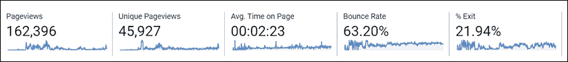

图 14.2:LemonMart 行为概述

除了页面浏览量，谷歌分析还可以捕获特定事件，比如点击触发服务器请求的按钮。然后可以在**事件****概览**页面上查看这些事件，如图所示：


图 14.3:Google Analytics 事件概述

也可以在服务器端捕获度量，但这将提供随时间变化的请求统计信息。您将需要额外的代码和状态管理来跟踪特定用户的行为，以便可以计算用户随时间的统计信息。通过使用 Google Analytics 在客户端实现这种跟踪，您可以更详细地了解用户来自何处、他们做了什么、他们是否成功以及他们何时离开您的应用程序，而不会给您的后端增加不必要的代码复杂性和基础架构负载。

## 将 Google Tag Manager 添加到你的 Angular 应用程序

让我们开始在你的 Angular 应用程序中捕捉分析。Google 正在逐步淘汰 Google Analytics 附带的传统`ga.js`和`analytics.js`产品，代之以 Google tag Manager 附带的新的、更灵活的全球网站标签`gtag.js`。这绝不是谷歌分析的终结；相反，它代表着向更易于配置和管理的分析工具的转变。可以通过 Google tag Manager 远程配置和管理全局站点标签。标记是交付给客户端的 JavaScript 跟踪代码片段，它们可以跟踪新的指标并与多个分析工具集成，而无需更改已部署的代码。你仍然可以继续使用谷歌分析来分析和查看你的分析数据。Google Tag Manager 的另一个主要优势是它是版本控制的，这意味着您可以尝试在各种条件下触发的不同类型的标签，而无需担心对您的分析配置造成任何不可逆转的损害。

### 设置谷歌标签管理器

让我们首先为您的应用程序设置一个Google Tag Manager 帐户：

1.  在[登录谷歌标签管理器 https://tagmanager.google.com/](https://tagmanager.google.com/) 。
2.  Add a new account with a **Web** container, as follows:

    

    图 14.4:Google 标签管理器

3.  Paste the generated scripts at or near the top `<head>` and `<body>` sections of your `index.html` file, as instructed on the website:

    ```ts
    **src/index.html**
    <head>
    <!-- Google Tag Manager -->
    <script>(function(w,d,s,l,i){w[l]=w[l]||[];w[l].push({'gtm.start': new Date().getTime(),event:'gtm.js'});var f=d.getElementsByTagName(s)[0], j=d.createElement(s),dl=l!='dataLayer'?'&l='+l:'';j.async=true;j.src='https://www.googletagmanager.com/gtm.js?id='+i+dl;f.parentNode.insertBefore(j,f);
    })(window,document,'script','dataLayer','GTM-56D4F6K');</script>
    <!-- End Google Tag Manager -->
    ...
    </head>
    <body>
    <!-- Google Tag Manager (noscript) -->
    <noscript><iframe src="https://www.googletagmanager.com/ns.html?id=GTM-56D4F6K" height="0" width="0" style="display:none;visibility:hidden"></iframe></noscript>
    <!-- End Google Tag Manager (noscript) -->
    <app-root></app-root>
    </body> 
    ```

    请注意，`<noscript>`标记仅在用户在其浏览器中禁用 JavaScript 执行时才会执行。通过这种方式，我们可以从这些用户那里收集指标，而不是对他们的存在视而不见。

4.  提交并发布标记管理器容器。
5.  You should see the initial setup of your tag manager completed, as shown in the following screenshot:

    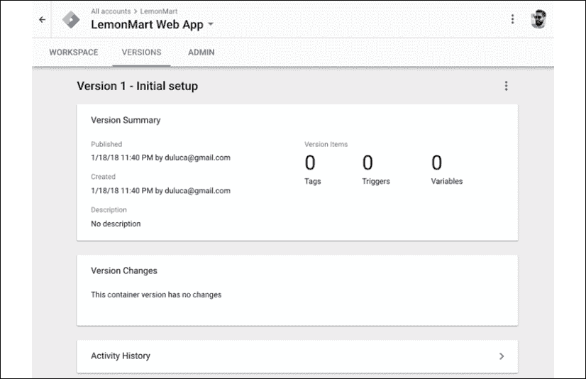

    图 14.5：已发布标签

6.  确认您的 Angular 应用程序运行时没有任何错误。

请注意，如果不发布 tag manager 容器，则在 dev 控制台或**网络**选项卡中加载`gtm.js`时会看到`404`错误。

### 建立谷歌分析

现在，让我们通过 Google Analytics 生成跟踪 ID。这是您的应用程序的通用唯一标识符，用于关联您的分析数据：

1.  在[登录谷歌分析 https://analytics.google.com](https://analytics.google.com) 。
2.  Open the **Admin console**, using the gear icon in the bottom-left corner of the screen, as shown in the following screenshot:

    

    图 14.6:Google Analytics 管理控制台

3.  创建一个新的分析帐户。
4.  以前面屏幕截图中的步骤为指导，执行以下步骤：
    1.  添加新的**属性**、`LemonMart`。
    2.  根据您的首选项配置属性。
    3.  点击**追踪码**。
    4.  复制以`UA-xxxxxxxxxx-1`开头的**跟踪 ID**。
    5.  忽略提供的`gtag.js`代码。

有了您的跟踪 ID，我们可以配置 Google Tag Manager，以便它可以收集分析。

#### 在标签管理器中配置 Google Analytics 标签

现在，让我们将我们的谷歌分析 ID 连接到谷歌标签管理器：

1.  在[https://tagmanager.google.com](https://tagmanager.google.com) 打开**工作区**页签。
2.  点击**添加新标签**。
3.  命名为`Google Analytics`。
4.  点击**标签配置**并选择**通用分析**。
5.  在**谷歌分析设置**下，添加一个新变量。
6.  粘贴您在上一节复制的跟踪 ID。
7.  点击**触发器**并添加**所有页面**触发器。
8.  Click on **Save**, as shown in the following screenshot:

    

    图 14.7：创建谷歌分析标签

9.  Submit and publish your changes, and observe the version summary with one tag, as shown:

    

    图 14.8：显示一个标签的版本摘要

10.  现在刷新你的 Angular 应用程序，你将在`/home`路线上。
11.  在私人窗口中，打开Angular 应用程序的新实例并导航到`/manager/home`路线。
12.  At [https://analytics.google.com/](https://analytics.google.com/), open the **REAL-TIME** | **Overview** pane, as shown in the following screenshot:

    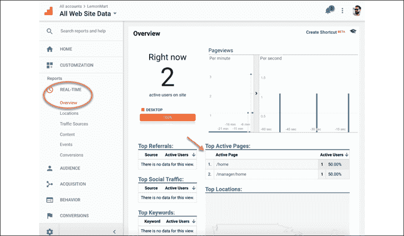

    图 14.9:Google Analytics 实时概览

13.  请注意，正在跟踪这两个活动用户。
14.  在**顶部活动页面**下，您应该可以看到用户所在的页面。

通过利用 Google Tag Manager 和Google Analytics，我们能够在不更改 Angular 应用程序内任何代码的情况下完成页面跟踪。

**搜索引擎优化**（**SEO**是分析学的重要部分。为了更好地了解爬虫是如何感知你的角度站点的，请使用谷歌搜索控制台仪表板，位于[https://www.google.com/webmasters/tools](https://www.google.com/webmasters/tools) ，以确定优化。另外，考虑使用角度万能来在 AutoT8A.服务器端呈现某些动态内容，以便爬虫可以索引动态数据源，并向您的站点驱动更多的流量。

# 预算编制和规模

在*第 13*章*AWS*高可用云基础设施的*AWS 计费*部分，我们涵盖了从单服务器实例场景到高可用基础设施的每月运行 web 服务器的成本，从 5 美元/月到 45 美元/月不等。对于大多数需求，预算讨论将以该月度数字开始和结束。您可以按照*高级负载测试*部分的建议执行负载测试，以预测每服务器用户容量，并大致了解您可能需要多少台服务器。在一个动态扩展的云环境中，数十台服务器全天候运行，这是一种过于简单的预算计算方法。

如果您操作任何规模的 web 属性，事情总会变得复杂。您将在不同的技术堆栈上操作多台服务器，用于不同的目的。很难衡量或证明有多少预算可以用于看似过剩的容量或不必要的高性能服务器。在某种程度上，您需要能够根据您所服务的用户数量传达您的基础架构的效率，并确保对您的基础架构进行了微调，这样您就不会因为应用程序无响应或由于使用的容量超出了您的需要而导致用户流失或支付过高的费用。

因此，我们将采取以用户为中心的方法，将我们的 IT 基础架构成本转化为企业和营销部门能够理解的每用户成本指标。

在下一节中，我们将以我的一个网站为例，研究计算基础设施的每用户成本意味着什么，以及当云扩展开始发挥作用时，这些计算是如何变化的。

## 计算每用户成本

我们将利用 Google Analytics 的行为指标，以计算给定时间段内的每用户成本：

每个用户的成本计算如下：


使用[https://thejavascriptpromise.com/](https://thejavascriptpromise.com/) 前面的数据，我们将数据插入公式中，计算*秘鲁成本/月*。

该网站部署在 DigitalOcean 上的 Ubuntu 服务器上，因此每月基础设施成本（包括每周备份）为 6 美元。通过谷歌分析，我们知道 2017 年有 1090 名独立访客：


2017 年，我为每个用户支付了 7 美分。钱花得好吗？每月 6 美元，我不介意。2017 年，[https://thejavascriptpromise.com/](https://thejavascriptpromise.com/) 被部署在传统的服务器设置上，作为一个静态站点，不向外扩展或向内扩展。这些条件使得使用唯一访问者度量和查找每用户成本非常简单。允许简单计算的同样简单性也导致了次优的基础设施。如果我在同一基础设施上为 1000000 名用户提供服务，我每年的成本将达到 70000 美元。如果我通过谷歌广告为每 1000 名用户赚 100 美元，我的网站每年将赚 10 万美元。扣除税收、开发费用和我们不合理的托管费用后，运营可能会赔钱。

如果要利用云扩展，实例可以根据当前的用户需求动态地向外或向内扩展，那么前面的公式很快就会变得毫无用处，因为您必须考虑资源调配时间和目标服务器利用率。

配置时间是指云提供商从头开始启动新服务器所需的时间。目标服务器利用率是给定服务器的最大利用率指标，其中必须发出扩展警报，以便在当前服务器达到最大容量之前准备好新服务器。为了计算这些变量，我们必须对服务器执行一系列负载测试。

在 SPA（如 Angular）中，页面视图是确定用户行为的一种过于简单的方法，页面视图不一定与请求相关，反之亦然。如果我们仅仅基于页面视图执行负载测试，我们将无法获得平台在负载下的实际性能模拟。

用户行为，或用户实际使用你的应用程序的方式，会极大地影响你的性能预测，并使预算数字大幅波动。您可以使用 Google Analytics 自定义事件来捕获复杂的操作集，这些操作会导致您的平台提供各种类型的请求。在本章后面，我们将在*测量实际使用*部分探讨如何测量实际使用。

最初，您没有上述任何指标，并且在您对软件或硬件堆栈进行有意义的更改时，您可能拥有的任何指标都将无效。因此，必须定期执行负载测试，以模拟真实的用户负载。

# 高级负载测试

为了能够预测容量，我们需要运行负载测试。在*第 13 章*、*AWS*上的高可用云基础设施中，我讨论了一种简单的负载测试技术，即只向服务器发送一组 web 请求。在相对比较场景中，这对于测试原始功率非常有效。然而，实际用户在浏览您的网站时，会以不同的间隔生成数十个请求，从而导致对后端服务器的各种 API 调用。

我们必须能够对虚拟用户进行建模，并在我们的服务器上释放大量虚拟用户，以找到服务器的断点。OctoPerf 是一个易于使用的服务，用于执行此类负载测试，它位于[https://octoperf.com](https://octoperf.com) 。OctoPerf提供了一个免费层，允许 50 个并发用户/测试通过两个 load Generator 进行无限次的测试运行。

OctoPerf 是一款理想的工具，可以让我们快速启动先进的测试功能。让我们创建一个帐户，看看它能为我们做些什么：

1.  创建一个 OctoPerf 帐户。
2.  Log in and add a new project for LemonMart, as shown:

    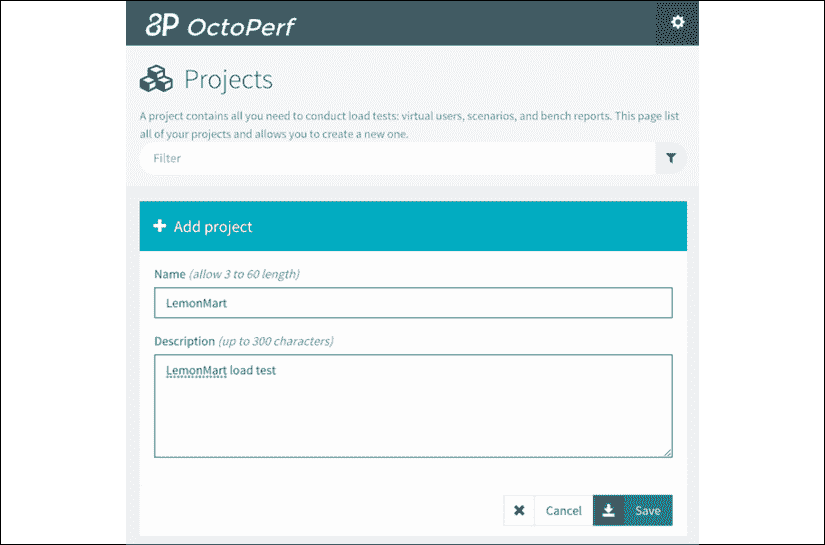

    图 14.10：在 OctoPerf 中添加项目

    OctoPerf 允许您创建多个具有不同使用特征的虚拟用户。由于它是基于 URL 的设置，因此任何基于单击的用户操作也可以通过使用测试参数直接调用应用程序服务器 URL 来模拟。

3.  创建两个虚拟用户，一个作为`Manager`导航到基于管理器的页面，另一个作为`POS`用户坚持 POS 功能。
4.  Click on **Create scenario**:

    

    图 14.11：POS 用户场景

5.  将场景命名为`Evening Rush`。
6.  You can add a mixture of **Manager** and **POS User** types, as shown:

    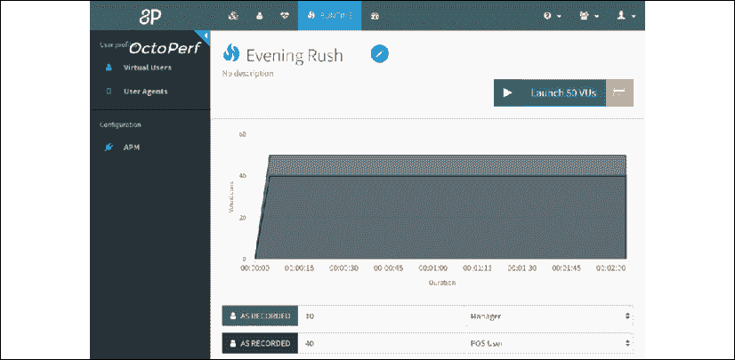

    图 14.12：傍晚高峰情景

7.  Click on the **Launch 50 VUs** button to start the load test.

    您可以实时观察**用户**和**点击率/秒**的实现情况，如下图所示：

    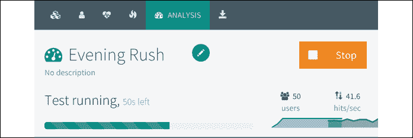

    图 14.13：正在进行的夜间高峰负荷试验

8.  ECS service metrics also give us a high-level idea of real-time utilization, as shown in the following screenshot:

    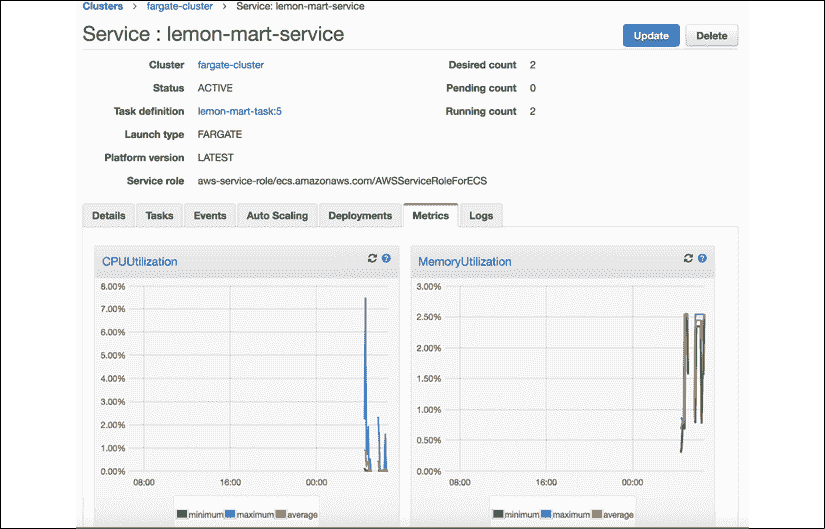

    图 14.14：ECS 实时指标

9.  分析负载测试结果。

您可以通过点击**ECS 服务度量**中的**CPUUUUtilization**链接，或者导航到**CloudWatch****度量**部分，从 ECS 获得更准确的结果，如下所示：


图 14.15:AWS CloudWatch 指标

如上图所示，CPU 利用率相当稳定，约为 1.3%，假设 10 分钟内持续的用户负载为 50。在此期间，没有任何请求错误，如 OctoPerf 的统计摘要所示：

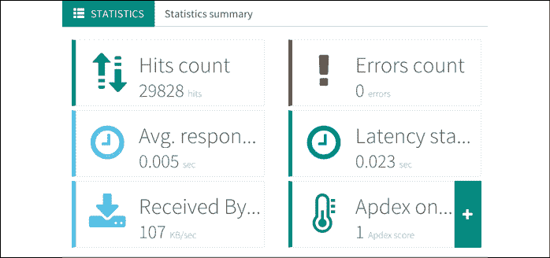

图 14.16:OctoPerf 统计摘要

理想情况下，我们将测量最大用户数/秒，直到产生错误。但是，考虑到只有 50 个虚拟用户以及我们已有的信息，我们可以预测在 100%利用率下可以处理多少用户：

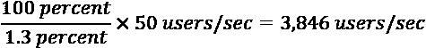

我们的负载测试结果显示，我们的基础设施每秒可以处理 3846 个用户。根据这些信息，我们可以在下一节中计算可伸缩环境中的每个用户的成本。然而，性能和可靠性是相辅相成的。您选择如何构建基础架构也将提供预算方面的重要信息，因为您需要的可靠性级别将决定您必须始终保留的实例的最小数量。

# 可靠的云层缩放

可靠性可以用贵组织的恢复点目标（**RPO**）和**恢复时间目标**（**RTO**来表示。RPO表示您愿意丢失多少数据，而 RTO 表示在发生故障时重建基础设施的速度。

让我们假设您运行一个电子商务站点。在每个工作日的中午左右，您将达到销售高峰。每次用户向其购物车中添加商品时，您都会将商品存储在服务器端缓存中，以便用户以后可以在家中继续疯狂购物。此外，您每分钟处理数百个事务。业务很好，您的基础架构扩展得很好，一切都进展顺利。与此同时，一只饥饿的老鼠或一团充电过度的闪电云决定袭击你的数据中心。一开始，一个看似无害的动力装置掉了下来，但没关系，因为附近的动力装置可以弥补掉。然而，这是午餐高峰；数据中心的其他网站也面临着高流量。结果，几个动力装置过热并出现故障。由于没有足够的电力装置来弥补不足，因此，电力装置一个接一个地过热并开始出现故障，从而引发一连串故障，最终导致整个数据中心瘫痪。同时，您的一些用户刚刚点击了**添加到购物车**，其他用户点击了**支付**按钮，还有一些用户即将到达您的网站。如果您的 RPO 为 1 小时，这意味着您每小时都会保留一次购物车缓存，那么您可以告别那些夜间购物者的宝贵数据和潜在销售。如果您的 RTO 为 1 小时，则您最多需要 1 小时才能恢复站点并重新运行，您可以放心，大多数刚刚单击“购买”按钮或到达无响应站点的客户当天不会在您的站点上进行购买。

经过深思熟虑的 RPO 和 RTO 是一项关键的业务需求，但它们还必须与适当的基础架构配合使用，以便能够以经济高效的方式实现您的目标。AWS 由全球二十多个地区组成，每个地区至少包含其**可用区**（**AZs**）。每个 AZ 是一个物理上分离的基础设施，不受另一个 AZ 故障的影响。

AWS 上的高可用性配置意味着您的应用程序至少在两个 AZ 上启动和运行，因此，如果服务器实例出现故障，或者即使整个数据中心出现故障，您也有另一个实例已经位于物理上独立的数据中心中，该数据中心能够无缝地接收传入的请求。

容错体系结构意味着您的应用程序跨多个区域部署。即使整个地区因自然灾害、分布式拒绝服务（**DDoS**攻击或错误的软件更新而瘫痪，您的基础设施仍能正常运行，并能够响应用户请求。您的数据通过层层安全保护和交错备份得到保护。

AWS 提供了很棒的服务，包括**屏蔽**以防止针对您网站的 DDoS 攻击，一个**指示灯**服务以保持最小基础设施在另一个区域处于休眠状态，如果需要可以扩展到满容量，同时降低运营成本，以及一个**Glacier**以经济实惠的方式长期存储大量数据的服务。

高可用性配置在多 AZ 设置中始终至少需要两个实例。对于容错设置，您需要在至少两个区域中使用两种高可用配置。大多数 AWS 云服务，如用于数据存储的 DynamoDB 或用于缓存的 Redis，默认情况下都是高可用的，包括 Lambda 等无服务器技术。Lambda 以每次使用为基础收费，并且可以扩展以满足您以经济高效的方式提出的任何需求。如果您可以将繁重的计算任务转移到 Lambda，则可以在这个过程中显著降低服务器利用率和扩展需求。在规划基础结构时，应该考虑所有这些变量来为您的需求设置适当的可扩展环境。

## 可扩展环境中的每用户成本

在可扩展的环境中，您无法计划 100%的利用率。配置新服务器需要时间。处于 100%利用率的服务器无法及时处理额外的传入请求，从用户的角度来看，这会导致丢弃或错误的请求。因此，所讨论的服务器必须在达到 100%利用率之前发送触发器，以便不会丢弃任何请求。在本章前面，我建议在扩展之前将目标利用率提高 60-80%。确切的数字在很大程度上取决于您对软件和硬件堆栈的具体选择。

根据您的自定义利用率目标，我们可以计算您的基础结构平均每个实例预期服务的用户数。使用此信息，您可以计算出更准确的每位用户成本，根据您的具体需求，这将允许正确调整 IT 预算。少花钱和多花钱一样糟糕。您可能会放弃更多的增长、安全性、数据、可靠性和恢复能力，这些都是您认为可以接受的。

在下一节中，我们将介绍最佳目标服务器利用率指标的计算，以便您可以计算更准确的每用户成本。然后，我们将探讨在预先计划的时间框架和软件部署期间可能发生的扩展。

### 计算目标服务器利用率

首先，计算您的自定义服务器利用率目标，即您的服务器遇到流量增加的点，并触发新服务器提供足够的时间，以便原始服务器未达到 100%利用率并丢弃请求。考虑这个公式：


让我们通过一个具体的例子来演示公式的工作原理：

1.  Load test your instances to establish user capacity per instance:

    *负载测试结果*：3846 用户/秒。

    Requests/sec 和 users/sec 并不相同，因为用户会发出多个请求来完成一项操作，并且可能会每秒执行多个请求。高级负载测试工具（如 OctoPerf）对于执行实际的、不同的工作负载和测量用户容量超过请求容量是必要的。

2.  Measure instance provisioning speed, from creation/cold boot to the request fulfilled first:

    *实测实例配置速度*：60 秒。

    为了测量这个速度，你可以把秒表收起来。根据请求的事件和云服务日志，云服务器实例和云服务日志提供了足够长的时间来完成新的请求。

    例如，在**ECS 服务事件**页签中，以目标注册事件为开始时间。启动任务后，单击任务 ID 查看创建时间。使用任务 ID，检查 CloudWatch 中的任务日志，以查看任务服务其第一个 web 请求的时间作为结束时间，然后计算持续时间。

3.  Measure the 95th percentile user growth rate, excluding known capacity increases:

    *第 95 百分位用户增长率*：10 个用户/秒。

    第 95 百分位是计算总体网络使用率的常用指标。这意味着 95%的时间，使用量将低于规定的数量，这使得它成为计划的一个好数字，正如 Barb Dijker 在其题为*的文章中所解释的，这第 95 个百分位数到底是什么？*，在[提供 http://www2.arnes.si/~gljsentvid10/pct.html](http://www2.arnes.si/~gljsentvid10/pct.html)。

    如果您没有事先的指标，那么最初定义用户增长率充其量只是一个有根据的猜测。然而，一旦你开始收集数据，你可以更新你的假设。此外，不以经济高效的方式删除请求，就不可能运行能够响应任何可以想象的异常值的基础设施。根据您的度量标准，应该有意识地做出业务决策，确定哪些异常值百分比应被视为可接受的业务风险而忽略。

4.  让我们将数字插入公式：

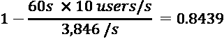

自定义目标利用率四舍五入为 84%。将扩展触发器设置为 84%将避免实例被过度配置，同时防止用户请求被丢弃。

考虑到这一自定义目标利用率，让我们更新每个用户的成本公式，同时考虑扩展：


因此，如果我们的基础设施成本为 150 个用户提供服务，每月 100 美元，在 100%利用率下，您计算每个用户的成本为 0.67 美元/用户/月。如果要考虑扩展，成本如下：


在不删除请求的情况下进行扩展，成本将比原来的 0.67 美元高出 16%，每个用户每月的成本为 0.79 美元。但是，重要的是要记住，您的基础架构并非总是如此高效。在利用率较低的目标下，或者当这些目标被错误配置为缩放触发器时，成本很容易是原始成本的两倍、三倍或四倍。这里的最终目标是找到最佳点，这意味着您将为每个用户支付正确的金额。

没有规定的每个用户成本，你应该瞄准。然而，如果你在运行一项服务，在所有其他运营成本和利润都计算在内后，每月向用户收取 5 美元的费用，而你仍然有多余的预算*和*用户抱怨性能差，那么你的支出就不足了。然而，如果你正在蚕食你的利润率，或者更糟糕的是，只是收支平衡，那么你可能会超支，或者你可能需要重新考虑你的商业模式。

还有其他几个因素会影响您的每用户成本，包括蓝色/绿色部署，我们稍后将介绍这些因素。您还可以通过利用预先安排的资源调配来提高扩展的效率。

#### 预先安排的资源调配

动态向外扩展然后再向内扩展是云计算的定义。但是，如果您知道一年中的某些天、周或月需要非常高的资源容量，那么当前可用的算法仍然需要一些规划。如果突然出现大量新流量，您的基础架构将尝试动态扩展，但是如果流量的增长率是对数的，那么即使是优化的服务器利用率目标也无济于事。服务器将经常达到并以 100%的利用率运行，导致请求被丢弃或错误。为了防止这种情况发生，您应该在这种可预测的高需求时期主动提供额外的容量。

#### 蓝色/绿色部署

在*第 13 章*、*AWS*上的高可用云基础设施中，您配置了无停机蓝绿部署。蓝色/绿色部署是可靠的代码部署，可确保站点持续正常运行，同时将错误部署的风险降至最低。

假设您有一个高可用性部署，这意味着您在任何给定时间都有两个活动实例。在蓝色/绿色部署期间，将提供另外两个实例。一旦这些附加实例准备好满足请求，它们的运行状况将使用预定义的运行状况度量来确定。

如果您的新实例被发现是健康的，这意味着它们处于工作状态。将有一段时间，比如说 5 分钟，在这段时间内，原始实例中的连接将被耗尽并重新路由到新实例。此时，将取消提供原始实例。

如果发现新实例不正常，则这些新实例将被取消配置，从而导致部署失败。但是，服务将保持可用而不会中断，因为原始实例将保持不变，并在整个过程中为用户提供服务。

### 用度量修改估计

负载测试和预测用户增长率可以让您了解系统在生产中的表现。收集更细粒度的指标和数据对于修订您的估算和确定更准确的 IT 预算至关重要。

# 测量实际使用

如前所述，仅跟踪页面视图并不能反映用户向服务器发送的请求数量。有了 Google Tag Manager 和 Google Analytics，你可以轻松地跟踪不仅仅是页面浏览量。

截至发布时，是一些可以跨不同类别配置的默认事件。此列表将随着时间的推移而增长：

*   页面视图：用于跟踪当页面资源加载且页面完全呈现时，用户是否停留在页面上：
    *   页面视图；一有机会就开枪
    *   DOM 就绪；加载 DOM 结构时
    *   窗口加载；当所有元素加载完毕时
*   单击：用于跟踪用户与页面的单击交互：
    *   所有元素
    *   只是链接
*   用户参与：跟踪用户行为：
    *   元素可见性；是否显示了元素
    *   提交表格；是否提交了表格
    *   滚动深度；他们在页面上向下滚动了多远
    *   YouTube 视频；如果他们播放嵌入式 YouTube 视频
*   其他事件跟踪：
    *   定制活动；由程序员定义，用于跟踪单个或多个步骤的事件，例如用户执行签出过程的步骤
    *   历史变迁；用户是否返回浏览器的历史记录
    *   JavaScript 错误；是否已生成 JavaScript 错误
    *   定时器；触发或延迟基于时间的分析事件

这些事件中的大多数不需要任何额外的编码来实现，因此我们将实现一个自定义事件，以演示如何使用自定义编码捕获所需的任何单个事件或一系列事件。通过一系列事件捕获工作流可以揭示您应该将开发工作重点放在哪里。

有关 Google Tag Manager 事件、触发器或提示和技巧的更多信息，我建议您访问 Simo Ahava 的博客[https://www.simoahava.com/](https://www.simoahava.com/) 。

## 创建自定义事件

在本例中，我们将捕获客户成功签出并完成销售时的事件。我们将实现两个事件，一个用于签出启动，另一个用于事务成功完成时：

1.  在[登录您的 Google Tag Manager 工作区 https://tagmanager.google.com](https://tagmanager.google.com) 。
2.  Under the **Triggers** menu, click on **NEW**, as indicated here:

    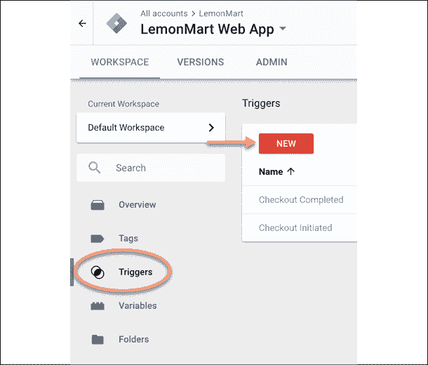

    图 14.17：标签管理器工作区

3.  说出你的触发器。
4.  点击空触发卡选择事件类型。
5.  选择**自定义事件**。
6.  Create a custom event named `checkoutCompleted`, as illustrated:

    

    图 14.18：自定义签出事件

    通过选择**一些自定义事件**选项，您可以限制或控制特定事件的收集，也就是说，仅当在特定页面或域上时，例如在`lemonmart.com`上。在下面的屏幕截图中，您可以看到一个自定义规则，该规则将过滤掉`lemonmart.com`上未发生的任何签出事件，以删除开发或测试数据：

    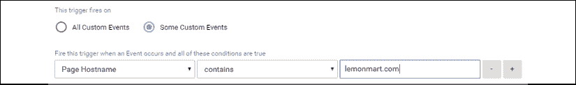

    图 14.19：一些自定义事件

7.  **保存**您的新活动。
8.  对名为`Checkout Initiated`的事件重复此过程。
9.  Add two new Google Analytics event tags, as highlighted here:

    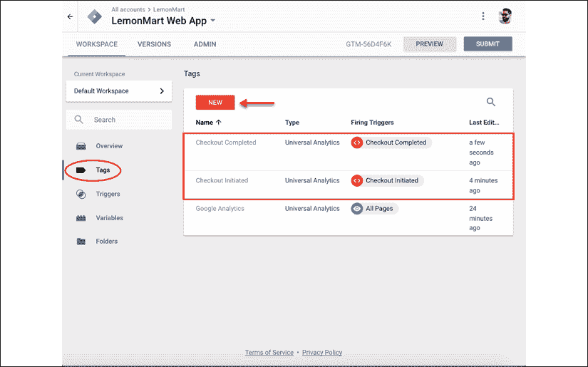

    图 14.20：新的自定义事件标记

10.  Configure the event and attach the relevant trigger you created to it, as shown in the following screenshot:

    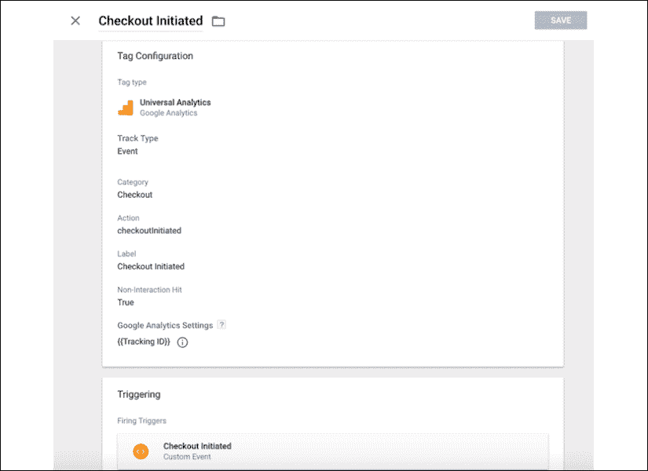

    图 14.21：触发器设置

11.  提交并发布您的工作区。

我们现在可以在分析环境中接收自定义事件。

## 在 Angular 中添加自定义事件

现在，让我们编辑角度代码以触发事件：

1.  Consider the POS template with a checkout button:

    ```ts
    **src/app/pos/pos/pos.component.html**
    <p>
      
    </p>
    <p>
      <button mat-icon-button (click)=”checkout(currentTransaction)”>
        <mat-icon>shopping_cart</mat-icon> Checkout Customer
      </button>
    </p> 
    ```

    下图左下角显示了圆形签出按钮：

    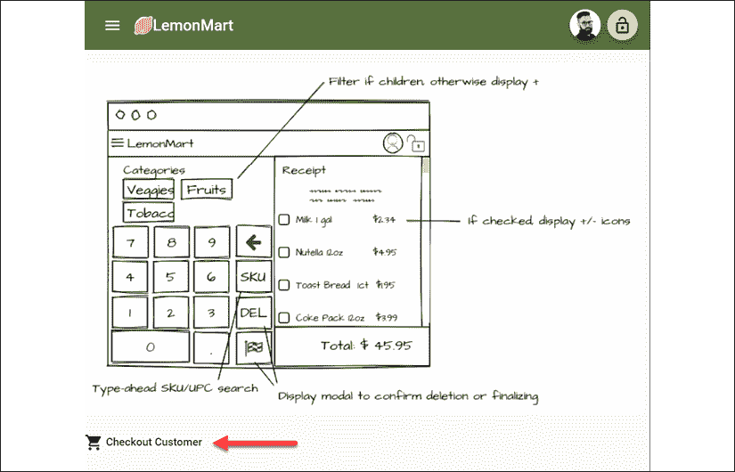

    图 14.22：带结账按钮的 POS 页面

    或者，您可以直接在模板中添加`onclick`事件处理程序，例如签出按钮上的`onclick=”dataLayer.push({‘event’: ‘checkoutInitiated’})”`。这会将`checkoutInitiated`事件推送到`gtm.js`提供的`dataLayer`对象。

2.  定义一个`ITransaction`接口：

    ```ts
    **src/app/pos/transaction/transaction.ts**
    ...
    export interface ITransaction {
      paymentType: TransactionType
      paymentAmount: number
      transactionId?: string
    }
    ... 
    ```

3.  定义一个`TransactionType`枚举：

    ```ts
    **src/app/pos/transaction/transaction.enum.ts**
    ...
    export enum TransactionType {
      Cash,
      Credit,
      LemonCoin,
    }
    ... 
    ```

4.  Implement a `TransactionService` that has a `processTransaction` function:

    ```ts
    **src/app/pos/transaction/transaction.service.ts**
    ...
    @Injectable({
      providedIn: ‘root’,
    })
    export class TransactionService {
      constructor() {}
      processTransaction(transaction: ITransaction)
          : Observable<string> {
        return new
          BehaviorSubject<string>(‘5a6352c6810c19729de860ea’)
          .asObservable()
      }
    }
    ... 
    ```

    `‘5a6352c6810c19729de860ea’`是表示事务 ID 的随机字符串。

    在`PosComponent`中，为您想要推送的`dataLayer`事件声明接口：

    ```ts
    **src/app/pos/pos/pos.component.ts**
    ...
    interface IEvent {
    event: ‘checkoutCompleted’ | ‘checkoutInitiated’
    }
    declare let dataLayer: IEvent[]
    ... 
    ```

    导入依赖项并初始化`currentTransaction`：

    ```ts
    **src/app/pos/pos/pos.component.ts**
    ...
    export class PosComponent implements OnInit, OnDestroy {
      private subs = new SubSink()
      currentTransaction: ITransaction
      constructor(
        private transactionService: TransactionService,
        private uiService: UiService
      ) {}
       ngOnInit() {
        this.currentTransaction = {
          paymentAmount: 25.78,
          paymentType: TransactionType.Credit,
        } as ITransaction
      }
      ngOnDestroy() {
        this.subs.unsubscribe()
      }
    ... 
    ```

    创建`checkout`函数，在服务调用之前调用`checkoutInitiated`。

    使用`setTimeout`模拟假交易，超时结束时调用`checkoutCompleted`事件：

    ```ts
    **src/app/pos/pos/pos.component.ts**
    export class PosComponent implements OnInit {
    ...
      checkout(transaction: ITransaction) {
        this.uiService.showToast(‘Checkout initiated’)
        dataLayer.push({
          event: ‘checkoutInitiated’,
        })
        this.subs.sink = this.transactionService
          .processTransaction(transaction)
          .pipe(
            filter((tx) => tx != null || tx !== undefined),
            tap((transactionId) => {
              this.uiService.showToast(‘Checkout completed’)
              dataLayer.push({
                event: ‘checkoutCompleted’,
              })
            })
          )
          .subscribe()
    } 
    ```

为了防止分析收集过程中的任何数据丢失，请考虑覆盖失败案例，例如添加涵盖多个失败案例的多个 TyrT0^事件。

现在，我们已经准备好看到分析在起作用：

运行你的应用程序。

在 POS 页面上，点击**结账**按钮上的。

在 Google Analytics 中，观察**实时****事件**选项卡，查看事件发生时的情况。

5-10 分钟后，事件也会出现在**行为****事件**选项卡下，如图所示：


图 14.23：谷歌分析顶级事件

使用自定义事件，您可以跟踪站点上发生的各种细微用户行为。通过收集`checkoutInitiated`和`checkoutCompleted`事件，您可以计算从到完成的初始签出次数的转换率。在销售点系统的情况下，该比率应该非常高；否则，这意味着您可能存在系统性问题。

## 高级分析活动

可以在每个事件中收集额外的元数据，如付款金额或类型，当开始结帐时，或当结帐完成时`transactionId`。

要使用这些更高级的功能，我建议您查看`angulartics2`，可以在[找到 https://www.npmjs.com/package/angulartics2](https://www.npmjs.com/package/angulartics2) 。`angulartics2`是一个面向 Angular 的供应商不可知分析库，可以使用流行的供应商（如 Google Tag Manager、Google analytics、Adobe、Facebook、百度等）实现独特而精细的事件跟踪需求，如工具主页上所示：


图 14.24：角度 2

`angulartics2`与 Angular router 和 UI router 集成，能够在每条路由的基础上实现自定义规则和异常。该库使实现自定义事件变得容易，并支持使用数据绑定进行元数据跟踪。

请查看以下示例：

```ts
<div angulartics2On="click" angularticsEvent="DownloadClick"
  angularticsCategory="{{ song.name }}"
  [angularticsProperties]="{label: 'Fall Campaign'}">
</div> 
```

我们可以跟踪一个名为`DownloadClick`的`click`事件，它会附带一个`category`和一个`label`，以便在谷歌分析中进行丰富的事件跟踪。

通过高级分析，您可以使用实际使用数据来通知您如何改进或托管应用程序。本主题结束了本书开头创建铅笔画模型的旅程，涵盖了各种各样的工具、技术和技术，一个完整的 web 开发人员必须熟悉这些工具、技术和技术，才能在当今的 web 上取得成功。我们深入研究棱角材料、棱角材料、Docker 和自动化，使您成为最高效的开发人员，提供最高质量的 web 应用程序，同时兼顾许多复杂性。祝你好运！

# 总结

在本章中，您全面介绍了开发 web 应用程序的知识。您学习了如何使用 Google Tag Manager 和 Google Analytics 来捕获应用程序的页面视图。使用高级指标，我们讨论了如何计算每个用户的基础设施成本。然后，我们调查了高可用性和可扩展性对您的预算的影响的细微差别。我们讨论了复杂用户工作流的负载测试，以估计任何给定服务器可以同时承载多少用户。使用此信息，我们计算了目标服务器利用率，以微调缩放设置。

我们发布前的所有计算大多是估计和有根据的猜测。我们介绍了可以用来衡量应用程序实际使用情况的各种度量标准和自定义事件。当您的应用程序上线并开始收集这些指标时，您可以更新计算以更好地了解基础架构的可行性和可承受性。

祝贺你已经完成了你的旅程。我希望你喜欢它！请随意使用本书作为参考，包括附录。

在 Twitter`@duluca`上关注我，继续关注[https://expertlysimple.io](https://expertlysimple.io) 更新。

# 进一步阅读

*   Google Analytics 和 Google Tag Manager 博客，作者：Simo Ahava:[https://www.simoahava.com](https://www.simoahava.com) 。

# 问题

尽可能回答以下问题，以确保您在不使用谷歌搜索的情况下理解了本章的关键概念。你需要帮助回答这些问题吗？参见*附录 D*、*自我评估答案*在线[https://static.packt-cdn.com/downloads/9781838648800_Appendix_D_Self-Assessment_Answers.pdf](https://static.packt-cdn.com/downloads/9781838648800_Appendix_D_Self-Assessment_Answers.pdf) 或访问[https://expertlysimple.io/angular-self-assessment](https://expertlysimple.io/angular-self-assessment) 。

1.  负载测试的好处是什么？
2.  关于可靠的云扩展，有哪些考虑因素？
3.  衡量用户行为的价值是什么？