# 十四、附录 A：调试Angular

20 世纪初，通用汽车公司的研究负责人查尔斯·凯特林（Charles Kettering）表示，要有效地找到问题的解决方案，首先必须能够很好地解释问题。换句话说，你必须首先花时间去了解问题是什么，当你这样做的时候，你将是解决问题的一半。

有效的调试对于理解软件失败的原因或方式至关重要。有比使用`console.log`更好的方法调试 JavaScript 代码。本附录将介绍各种工具和技术，向您介绍断点调试和浏览器扩展，它们可以帮助您更好地了解应用的状态。

在本附录中，我们包括：

*   最有用的捷径
*   浏览器中错误的疑难解答
*   Karma、Jasmine 和单元测试错误
*   使用开发工具进行调试
*   使用 VS 代码进行调试
*   用Angular预兆调试
*   使用 Redux 开发工具进行调试
*   调试 RxJS

让我们从学习一种键盘快捷键开始，它将使您的工作效率更高。

# 最有用的捷径

在一个不熟悉或庞大的代码库中找到自己的方法可能会很困难、迷失方向，而且很烦人。有一个键盘快捷键可以解决这个问题，它可以在 VS 代码和 Chrome/Edge Developer tools（开发工具）等多个工具之间共享。

要在 VS 代码或开发工具中的**源**面板中搜索并打开文件，请使用以下快捷方式：

在 macOS 上：**+*P*

在 Windows 上：*Ctrl*+*P*。

你会很快发现，这是你将使用最多的捷径。

# 浏览器中错误的疑难解答

在本节中，您将有意识地介绍一个容易犯的错误，以便熟悉在开发应用时可能发生的实际错误，并对使您成为高效开发人员的工具有一个坚实的理解。

请参考*第 4 章*、*自动测试、CI 和发布*以及 LocalCast 天气应用，以获得以下代码示例的更好上下文。

LocalCast 天气应用的最新版本可在 GitHub 上找到，网址为[https://github.com/duluca/local-weather-app](https://github.com/duluca/local-weather-app) 。

让我们假设我们在复制和粘贴`OpenWeatherMap.org`上 API 文档页面的 URL 时犯了一个无辜的错误，并且忘记在其前面添加`http://`。这是一个容易犯的错误：

```ts
**src/app/weather/weather.service.ts**
...
return this.httpClient
  .get<ICurrentWeatherData>(
`api.openweathermap.org/data/2.5/weather?q=${city},${country}&appid=${environment.appId}`
  ).pipe(map(data => this.transformToICurrentWeather(data)))
... 
```

你的应用将成功编译，但当你在浏览器中检查结果时，你将看不到任何天气数据。事实上，`CurrentWeather`组件似乎根本没有渲染，如下图所示：


图 1:CurrentWeather 不渲染

要找出原因，您需要调试 Angular 应用。

## 利用浏览器开发工具

作为一名开发人员，我使用Edge 或 Google Chrome 浏览器，因为它们具有跨平台、一致的开发工具和有用的扩展。

作为最佳实践，我使用 VS 代码编写代码，浏览器并排打开，而开发工具也在浏览器中打开。实践并行开发有几个很好的理由：

*   **快速反馈循环**：通过实时重新加载，您可以很快看到更改的最终结果
*   **笔记本电脑**：现在很多开发人员的大部分开发工作都是在笔记本电脑上完成的，第二台显示器是一种奢侈品
*   **关注响应性设计**：由于工作空间有限，我一直关注手机先行开发，事后解决桌面布局问题
*   **网络活动感知**：使我能够快速查看任何 API 调用错误，并确保请求的数据量保持在我预期的范围内
*   **控制台错误意识**：当引入新错误时，使我能够快速反应并排除故障
*   **禁用缓存**：所以你知道你总是在获取所有更改，而不是与浏览器的缓存发生冲突

观察并行开发的样子：

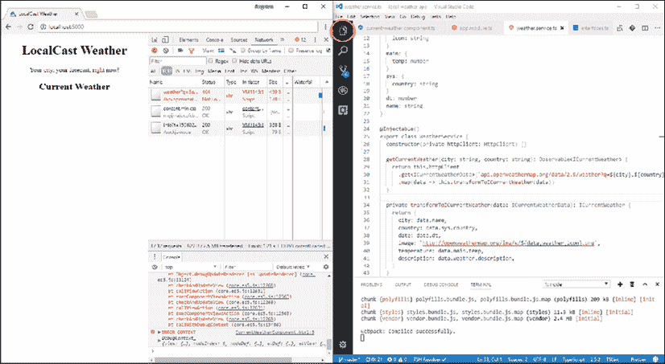

图 2：实时重新加载运行的并行开发

最终，你应该做最适合你的事情。通过并行设置，我经常发现自己打开和关闭 VS Code 的资源管理器，并根据手头的特定任务将“开发工具”窗格调整为更大或更小的大小。要切换 VS 代码的资源管理器，请单击前面屏幕截图中圈出的资源管理器图标。

正如您可以使用`npm start`通过实时重新加载进行并行开发一样，您也可以使用`npm test`为单元测试获得相同类型的快速反馈循环：


图 3：单元测试的并行开发

通过并行单元测试设置，您可以高效地开发单元测试。

## 优化开发工具

为了使用实时重新加载进行并行开发，您需要优化默认的开发工具体验：

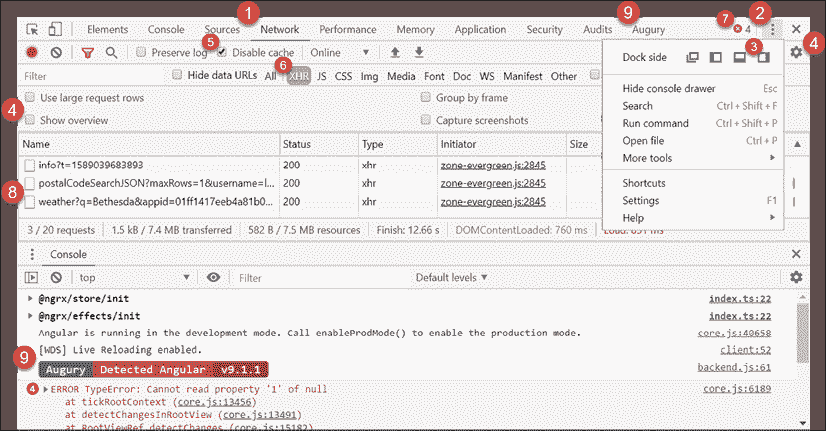

图 4：优化的 Chrome 开发工具

查看前面的屏幕截图，您会注意到许多设置和信息散热器被突出显示：

1.  默认情况下打开**网络**选项卡，以便查看网络流量。
2.  点击按钮打开开发工具设置。
3.  点击**右侧**图标，使开发工具停靠在 Chrome 的右侧。这种布局提供了更多的垂直空间，因此您可以一次看到更多的网络流量和控制台事件。作为一个附带的好处，左侧采用移动设备的大致尺寸和形状。
4.  **打开**大请求行和**关闭**概览，查看每个请求的更多 URL 和参数，并获得更多垂直空间。
5.  选中**禁用缓存**的选项，这将在开发工具打开时刷新页面时强制重新加载每个资源。这可以防止奇怪的缓存错误破坏您的一天。
6.  您将最感兴趣的是看到对各种 API 的 XHR 调用，所以点击**XHR**来过滤结果。
7.  请注意，您可以在右上角浏览控制台错误的数量，如**12**。控制台错误的理想数量应始终为 0。
8.  请注意，请求行中的顶部项目表示存在错误，状态代码为**404 未找到**。
9.  由于我们正在调试 Angular 应用，**Augury**扩展已经加载。本章后面将使用更复杂的 LemonMart 应用更详细地介绍此工具。

有了优化的开发工具环境，您现在可以有效地进行故障排除，并解决早期出现的应用错误。

## 网络故障排除

在这个阶段，应用有三个明显的问题：

*   组件详细信息未显示
*   有许多控制台错误
*   API 调用正在返回一个**404 未找到**错误

首先检查任何网络错误，因为网络错误通常会导致连锁效应：

1.  点击**网络**选项卡中失败的 URL
2.  在 URL 右侧打开的**详细信息**窗格中，单击**预览**选项卡
3.  You should see this:

    ```ts
    Cannot GET /api.openweathermap.org/data/2.5/weather 
    ```

    仅通过观察此错误消息，您可能会忽略以下事实：您忘记将`http://`前缀添加到 URL。这个错误是微妙的，当然也不是显而易见的。

4.  Hover over the URL and observe the full URL, as shown:

    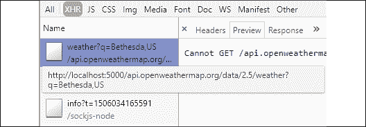

    图 5：检查网络错误

正如你所看到的，现在这个错误是显而易见的。在这个视图中，我们可以看到完整的 URL，很明显，`weather.service.ts`中定义的URL 不是完全限定的，因此 Angular 试图从托管在`localhost:5000`上的父服务器加载资源，而不是通过 web 到正确的服务器。

## 调查控制台错误

在您修复此问题之前，有必要了解失败 API 调用的连锁反应：

1.  Observe the console errors:

    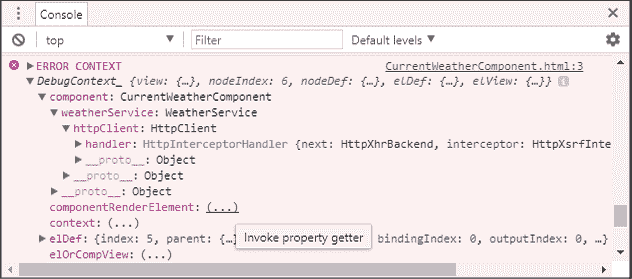

    图 6：开发工具控制台错误上下文

    这里需要注意的第一个元素是`ERROR CONTEXT`对象，它有一个名为`DebugContext_`的属性。`DebugContext_`包含错误发生时Angular应用当前状态的详细快照。`DebugContext_`中包含的信息比 AngularJS 生成的大部分无用错误信息的数量提前了几光年。

    值为`(...)`的属性是属性获取程序，您必须单击它们以加载其详细信息。例如，如果单击`componentRenderElement`的省略号，它将填充`app-current-weather`元素。可以展开元素以检查组件的运行时条件。

2.  现在滚动到控制台的顶部
3.  观察第一个错误：

    ```ts
    ERROR TypeError: Cannot read property 'city' of undefined 
    ```

您可能以前遇到过`TypeError`。此错误是由于试图访问未定义对象的属性而导致的。在这种情况下，`CurrentWeatherComponent.current`没有分配给对象，因为 HTTP 调用失败。由于`current`未初始化，模板盲目尝试绑定其属性，如`{{current.city}}`，因此我们收到一条消息，表示无法读取未定义的**属性“city”。这种连锁反应会在应用中产生许多不可预测的副作用。您必须主动编写代码以防止出现这种情况。**

# Karma、Jasmine 和单元测试错误

当使用`ng test`命令运行测试时，您将遇到一些高级错误，这些错误可以掩盖实际底层错误的根本原因。

解决错误的一般方法应该是由内而外，首先解决子组件问题，最后解决父组件和根组件问题。

## 网络错误

网络错误可能由多种潜在问题引起：

```ts
NetworkError: Failed to execute 'send' on 'XMLHttpRequest': Failed to load 'ng:///DynamicTestModule/AppComponent.ngfactory.js'. 
```

从内部到外部，您应该实现服务的双重测试，并向适当的组件提供假货，如前一节所述。但是，在父组件中，即使正确提供了赝品，也可能会遇到错误。请参阅“处理一般错误事件”一节，以揭示潜在问题。

## 一般错误事件

错误事件是隐藏潜在原因的一般错误：

```ts
[object ErrorEvent] thrown 
```

要公开一般错误的根本原因，请实现一个新的`test:debug`脚本：

1.  执行`test:debug`，如`package.json`：

    ```ts
    **package.json**
    ...
      "scripts": {
      ...
      "test:debug": "ng test --source-map",
      ...
    } 
    ```

    所示
2.  执行`npm run``test:debug`
3.  现在，业力跑行者将可能揭示潜在的问题
4.  If necessary, follow the stack trace to find the child component that may be causing the issue

    如果这个策略没有帮助，您可以通过断点调试单元测试来收集更多关于出错原因的信息。

# 使用开发工具进行调试

至`console.log`或不至`console.log`；这就是问题所在。为了记录在案，让我声明`console.log`语句将永远不会签入您的存储库。一般来说，它们是在浪费您的时间，因为它需要编辑、构建和运行代码才能带来价值，更不用说以后清理代码的成本了。

首选的调试方法是断点调试，这是一种在代码运行时暂停代码执行、检查和操作代码状态的方法。您可以有条件地设置断点，逐行遍历代码，甚至在控制台中执行语句来尝试新的想法。

Angular 9 和 Ivy 带来了许多调试改进，使得调试异步代码和模板成为可能。此外，Angular 9 生成的栈跟踪在查明错误的根本原因方面更为有用。

在一些特殊的用例中，`console.log`语句可能是有用的。这些主要是异步工作流，它们并行运行，并且依赖于及时的用户交互。在这些情况下，控制台日志可以帮助您更好地了解事件流和各种组件之间的交互。您可以在本章后面的*调试 RxJS*部分看到这一点。

对于常见情况，我们应该坚持断点调试。使用 dev 工具，我们可以在设置属性时观察它们的状态，并能够动态更改它们的值，以强制代码在`if-else`或`switch`语句中执行分支逻辑。

假设`HomeComponent`上存在一些基本逻辑，根据`AuthService`检索到的`isAuthenticated`值设置`displayLogin boolean`，如图所示：

```ts
**src/app/home/home.component.ts**
...
import { AuthService } from '../auth.service'
...
export class HomeComponent implements OnInit {
  displayLogin = true
  constructor(private authService: AuthService) {}
  ngOnInit() {
    this.displayLogin = !this.authService.isAuthenticated()
  }
} 
```

现在观察`displayLogin`值和`isAuthenticated`功能设置时的状态，然后观察`displayLogin`值的变化：

1.  切换到开发工具中的**源**选项卡
2.  使用最有用的快捷键*Ctrl*+*P*或**+*P*，搜索`HomeComponent`
3.  在`ngOnInit`函数内的第一行上放置一个断点
4.  刷新页面
5.  You'll see your breakpoint hit, as highlighted in blue here:

    

    图 7:ChromeDevTools 断点调试

6.  将鼠标悬停在`this.displayLogin`上方，观察其值是否设置为`true`
7.  If hovering over `this.authService.isAuthenticated()`, you will not be able to observe its value

    当断点被命中时，您可以在控制台中访问状态的当前范围，这意味着您可以执行函数并观察其值。

8.  Execute `isAuthenticated()` in the console:

    ```ts
    > this.authService.isAuthenticated() true 
    ```

    您将看到它返回`true`，这是`this.displayLogin`设置的值。您仍然可以在控制台中强制`displayLogin`的值。

9.  将`displayLogin`设置为`false`：

    ```ts
    > this.displayLogin = false false 
    ```

如果将鼠标悬停在`displayLogin`上或从控件中检索`displayLogin`的值，您将看到该值被设置为`false`。

利用断点调试基础，您可以调试复杂的场景，而无需更改源代码。您可以使用 RxJS 语句调试模板以及复杂的回调。

# 使用 VisualStudio 代码进行调试

您还可以直接在 Visual Studio 代码中调试Angular应用、Karma 和量角器测试。首先，您需要配置调试器以使用 Chrome 调试环境，如图所示：


图 8:VS 代码调试设置

1.  点击**调试**窗格
2.  展开**无配置**下拉列表，点击**添加配置。。。**
3.  In the **Select Environment** checkbox, select **Chrome**

    这将在`.vscode/launch.json`文件中创建默认配置。我们将修改此文件以添加三个单独的配置。

4.  Replace the contents of `launch.json` with the following configuration:

    ```ts
    **.vscode/launch.json**
    {
      "version": "0.2.0",
      "configurations": [
        {
          "name": "Debug npm start with Chrome",
          "type": "chrome",
          "request": "launch",
          "url": "http://localhost:5000/#",
          "webRoot": "${workspaceRoot}",
          "runtimeArgs": [
            "--remote-debugging-port=9222"
          ],
          "sourceMaps": true,
          "preLaunchTask": "npm: start"
        },
        {
          "name": "Debug npm start with Edge",
          "type": "edge",
          "request": "launch",
          "version": "dev",
          "url": "http://localhost:5000/#",
          "webRoot": "${workspaceRoot}",
          "sourceMaps": true,
          "preLaunchTask": "npm: start"
        },
        {
          "name": "Debug npm test with Chrome",
          "type": "chrome",
          "request": "launch",
          "url": "http://localhost:9876/debug.html",
          "webRoot": "${workspaceRoot}",
          "runtimeArgs": [
            "--remote-debugging-port=9222"
          ],
          "sourceMaps": true,
          "preLaunchTask": "npm: test"
        },
        {
          "name": "Debug npm test with Edge",
          "type": "edge",
          "request": "launch",
          "version": "dev",
          "url": "http://localhost:9876/debug.html",
          "webRoot": "${workspaceRoot}",
          "sourceMaps": true,
          "preLaunchTask": "npm: test"
        },
        {
          "name": "npm run e2e",
          "type": "node",
          "request": "launch",
          "program": "${workspaceRoot}/node_modules/protractor/bin/protractor",
          "protocol": "inspector",
          "args": [
            "${workspaceRoot}/protractor.conf.js"
          ]
        }
      ]
    } 
    ```

    注意，我们还为微软新的基于铬的边缘浏览器添加了调试器。

5.  在启动调试器之前，执行相关 CLI 命令，如`npm start`、`npm test`或`npm run e2e`
6.  在**调试**页面的**调试**下拉列表中，选择`npm start`并点击绿色播放图标
7.  观察 Chrome 实例是否已启动
8.  在`.ts`文件上设置断点
9.  执行app 中的动作触发断点
10.  If all goes well, Chrome will report that the code has been **Paused in Visual Studio Code**

    有关更多信息，请参阅 GitHub 上的 VS 代码秘籍章节[https://github.com/Microsoft/vscode-recipes](https://github.com/Microsoft/vscode-recipes) 。

# 用Angular预兆调试

Augury 是 ChromeDevTools 的扩展，用于调试和分析Angular应用。它是一个专门构建的工具，旨在帮助开发人员直观地导航组件树，检查路由的状态，并通过生成的 JavaScript 代码和开发人员编码的 TypeScript 代码之间的源代码映射启用断点调试。

请注意，Augury 与 Angular 9 的常春藤渲染引擎不完全兼容。要使某些功能（如路由树和 NgModules）正常工作，您需要在项目中临时禁用常春藤。

您可以通过更新项目根目录中的`tsconfig.app.json`来关闭常春藤，以向其添加以下属性：

```ts
"angularCompileOptions": {
  "enableIvy": false
} 
```

您可以从[下载占卜 https://augury.angular.io](https://augury.angular.io) 。一旦安装，当您为 Angular 应用打开 Chrome DevTools 时，您会注意到一个新的占卜选项卡，如图所示：

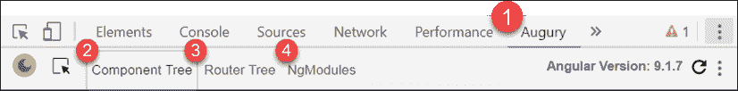

图 9：Chrome DevTools 预兆

Augury 为了解 Angular 应用在运行时的行为提供了有用且关键的信息：

1.  本例中，当前Angular版本被列为版本**9.1.7**
2.  **组件树**显示应用中渲染的所有Angular组件
3.  **路由树**显示应用中已配置的所有路由
4.  `NgModules`显示应用的`AppModule`和功能模块

## 组件树

**组件树**选项卡显示所有应用组件是如何相关的以及它们是如何相互作用的：

1.  Select a particular component, such as `HomeComponent`, as follows:

    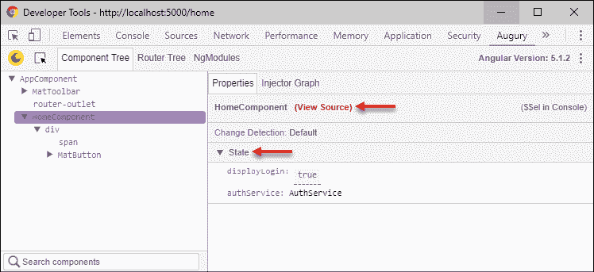

    图 10:Augury 组件树

    右侧的**属性**选项卡将显示一个名为**查看源代码**的链接，您可以使用该链接调试组件。在下面，您将能够观察组件属性的状态，例如`displayLogin boolean`，包括您注入组件的服务及其状态。

    可以通过双击任何属性的值来更改该属性的值。

    例如，如果您想将`displayLogin`的值更改为`false`，只需双击包含`true`值的蓝色框并键入`false`。您将能够在 Angular 应用中观察更改的效果。

    为了观察`HomeComponent`的运行时组件层次结构，您可以观察**注入器图**。

2.  点击**喷油器图**页签，如图所示：


图 11：预兆注入器图

此视图显示了所选组件的渲染方式。在这种情况下，我们可以观察到`HomeComponent`是在`AppComponent`内呈现的。这种可视化非常有助于在不熟悉的代码库或存在深层组件树的地方跟踪特定组件的实现。

## 路由树

**路由树**页签将显示路由的当前状态。这是一个非常有用的工具，可以可视化路由和组件之间的关系，如图所示：

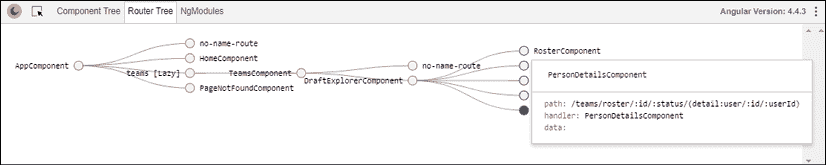

图 12：预兆路由树

前面的路由树演示了带有主详细视图的深度嵌套路由结构。通过单击圆形节点，可以查看渲染给定组件所需的绝对路径和参数。

如您所见，对于`PersonDetailsComponent`，准确确定渲染主细节视图的该细节部分所需的参数集可能会变得复杂。

## NGM 模块

**NgModules**选项卡显示当前加载到内存中的`AppModule`和任何其他功能模块：

1.  启动应用的`/home`路线并点击地址栏上的 enter 键，以便 Augury 注册导航事件
2.  Observe the **NgModules** tab, as follows:

    

    图 13：预兆模块

    您会注意到，所有根级别的模块，包括`AppModule`都已加载。然而，由于我们的应用有一个延迟加载的体系结构，所以还没有加载任何功能模块。

3.  导航到`ManagerModule`中的页面，并点击地址栏上的 enter 键
4.  然后，导航到`UserModule`中的页面并点击地址栏上的 enter 键
5.  最后，导航回`/home`路线，点击地址栏上的回车键
6.  Observe the **NgModules** tab, as shown:

    

    图 14：带有三个模块的 Augury 模块

7.  现在，您将观察到`ManagerModule`和`UserModule`以及所有相关模块都已加载到内存中。

**NgModules**是一个重要的工具，可以可视化您的设计和架构的影响。

# 使用 Redux 开发工具进行调试

有两种主要的策略来调试和从 NgRx 获取仪器。

1.  实现用于调试的控制台记录器
2.  为丰富的检测配置存储 DevTools

让我们从简单的调试解决方案开始。

## 执行 NgRx 控制台记录器

在`app.module`中，`StoreModule`被配置为向您的配置中注入`MetaReducer`。Meta reducer能够监听 action reducer 管道中发生的所有事件，从而使您能够预处理操作。我们可以使用这个钩子实现一个简单的记录器。

1.  在`reducers/index.ts`：

    ```ts
    **src/app/reducers/index.ts**
    export function logger(reducer: ActionReducer<AppState>): ActionReducer<AppState> {
      return (state, action) => {
        const result = reducer(state, action)
        console.groupCollapsed(action.type)
        console.log('prev state', state)
        console.log('action', action)
        console.log('next state', result)
        console.groupEnd()
        return result
      }
    } 
    ```

    中实现一个名为`logger`的函数
2.  将`logger`配置为`metaReducers`且仅在非生产模式下配置：

    ```ts
    **src/app/reducers/index.ts**
    export const metaReducers: MetaReducer<AppState>[] =
    !environment.production
      ? [logger]
      : [] 
    ```

现在旋转一下，您应该能够在控制台中观察 NgRx，如下所示：

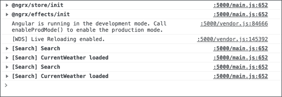

图 15：带有 NgRx 日志的控制台视图

## 配置 NgRx 存储开发工具

NgRx Store Devtools包还可以在开发过程中帮助我们进行调试，或者提供生产构建的工具。通过运行以下命令添加包：

```ts
$ npx ng add @ngrx/store-devtools 
```

您会注意到，包将自动在`app.module`中添加生产检测规则，以便只捕获最后 25 个事件。这是避免性能问题所必需的。

一旦安装，为了利用生成的工具并能够调试 NgRx，您需要为 Chrome 或 Firefox 安装 Redux DevTools 扩展，位于[https://github.com/zalmoxisus/redux-devtools-extension](https://github.com/zalmoxisus/redux-devtools-extension) 或[http://extension.remotedev.io](http://extension.remotedev.io) 。

启动应用后，激活扩展并观察 Redux DevTools 随时间捕获的详细检测，如下所示：

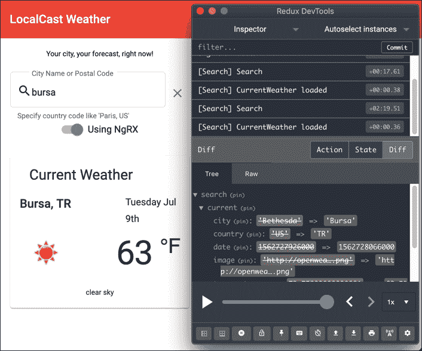

图 16:Redux 开发工具

Redux DevTools 使您能够回放事件并查看状态更改。这在前面屏幕截图的右下象限显示。您可以观察当前城市为**法氏囊**及其以前的值**贝塞斯达**。

# 调试 RxJS

有两种主要策略用于调试 RxJS 管道并获取其内部发生的情况的信息：

1.  点击事件流，控制台记录流中特定点的事件数据
2.  在开发工具中执行断点调试

让我们从使用`tap`操作符开始。

## 点击 RxJS 事件流

在*第 6 章**表单、可观察对象和主题*中，我们引入了 RxJS`tap`操作符，作为从搜索输入的变化事件流中引导用户输入流的一种方式，并最终调用我们的`doSearch`函数。当 RxJS 流的行为似乎不像您预期的那样时，您可以将`tap`操作符和`console.log`组合起来记录每个事件的数据，以便随着时间的推移查看它。由于`tap`根据操作顺序捕获流中的数据，一旦添加到流中，您可以简单地使用 VS 代码的行移动键盘快捷键移动数据并测试流。

要上下移动一行代码，请在 Windows 上使用`Alt`+`↑`和`Alt`+`↓`，或在 macOS 上使用``+`↑`和``+`↓`。

`CitySearchComponent`中的以下`tap`将记录来自输入的每个更改事件到控制台：

```ts
this.search.valueChanges 
  .pipe( 
 **tap(console.log),**
    debounceTime(1000), 
    filter(() => !this.search.invalid), 
    tap((searchValue: string) => this.doSearch(searchValue)) 
  ).subscribe() 
```

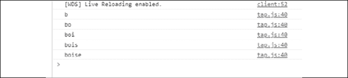

图 17:RxJS 记录每个事件

如果我们将`tap`向下移动一行，而不是获取每个用户输入，我们将只获取取消公告的事件：

```ts
this.search.valueChanges 
  .pipe( 
    debounceTime(1000), 
    **tap(console.log),** 
    filter(() => !this.search.invalid), 
    tap((searchValue: string) => this.doSearch(searchValue)) 
  ).subscribe() 
```

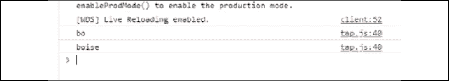

图 18:RxJS 只记录取消公告的事件

再往下一行，我们可以看到被取消公告和过滤后的事件：

```ts
this.search.valueChanges 
  .pipe( 
    debounceTime(1000), 
    filter(() => !this.search.invalid), 
    **tap(console.log),** 
    tap((searchValue: string) => this.doSearch(searchValue)) 
  ).subscribe() 
```

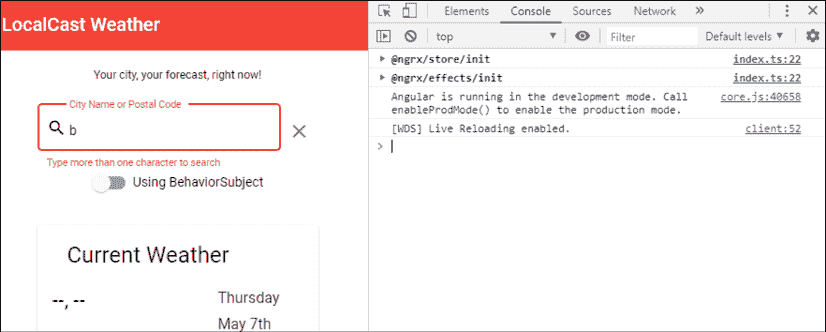

图 19:RxJS 忽略无效输入

请注意，由于一个字符无效，筛选器已捕获此事件，并且不允许它通过，因此我们在控制台中看不到任何数据。

虽然在控制台中可能会非常混乱，但您也可以同时记录许多事情，利用回调而不仅仅是传递`console.log`可调用的：

```ts
this.search.valueChanges 
  .pipe( 
    debounceTime(1000), 
    tap(debouncedData => 
      console.log('debounced: ', debouncedData)
    ), 
    filter(() => !this.search.invalid), 
    tap(debouncedAndFilteredData => 
      console.log(
        'debounced + filtered: ', 
        debouncedAndFilteredData
      )
    ), 
    tap((searchValue: string) => this.doSearch(searchValue)) 
  ).subscribe() 
```


图 20:RxJS 记录多个事件

接下来，让我们看看如何利用中断调试。

## 调试 RxJS 事件流的断点

有关断点调试的更多信息，请参阅本章前面的*使用 DevTools*调试部分。调试 RxJS 的重要一点是理解蓝色插入符号在调试器中的作用。

当一行代码有多个可用于暂停执行的点时，这些点用方形插入符号表示。可以打开（暗、实心）或关闭（亮、透明），以指示您希望浏览器在代码行中停止的位置，如以下屏幕截图所示：


图 21:RxJS 断点调试

插入符号可用于在完成工作的回调中停止浏览器中流，以检查数据，甚至对其进行操作。在前面的示例中，我将断点调试器设置为在筛选器函数中中断，以便检查搜索输入字段的状态。

尝试调试以了解更多信息。

# 进一步建议

如果你仍然被困住，不要沮丧。即使是我们中最优秀的人，有时也会花无数的时间在琐事上。然而，如果你需要它，你可以寻求帮助。Angular 拥有一个丰富且支持的在线社区。

你如何寻求帮助确实很重要。首先使用[复制您的问题 https://stackblitz.com/](https://stackblitz.com/) 。有一半的时间，你会在复制过程中发现你的问题。接下来，就[提出一个问题 https://stackoverflow.com](https://stackoverflow.com) 。如果您可以提供问题的 StackBlitz 链接，您的问题可能会很快得到解答。如果发现框架本身可能存在问题，那么在正确的存储库（换句话说，Angular、CLI、Material、NgRx、RxJS 等）上创建一个 GitHub 问题，详细说明您的问题。如果您在框架中发现了一个 bug，那么您已经正式参与了开源项目的开发：

否则，您也可以使用 Twitter 并在`@angular`或`#angular`句柄上搜索帮助。就我个人而言，我是谷歌的超级粉丝。我的理念是，其他人可能遇到了与我相同的问题，相信我，当我说这句话时——一个格式良好的谷歌查询是一个解决了一半的问题。